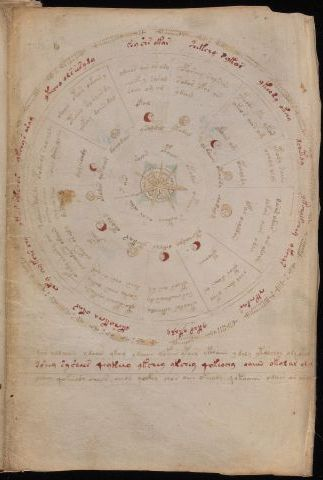

# Voynich Speculative Herbal Ferment Recipe — f67r2

IMPORTANT: this is NOT a real or validated translation of the Voynich Manuscript. It is a speculative/procedural model that interprets EVA using a user-defined grammar to generate experimental recipes using safe, known edible substitutes.

This file is generated automatically from IVTFF/EVA transliteration plus a user-defined procedural grammar.



## Page / Folio
- folio: f67r2
- section: astronomical

## EVA Text (Transliteration)
```text
ykshy s aram
ykecho ols eesydy
[c':@164;]ey shs okar
shekchy sykos
ykeody okchy
dchetay
ykchy kchey ykchys
chkchdar
ykar ykaly
lkshy kchy okar
chky chykchs chy
ykees ykchos
opodchol s ain aldy
soeey doiin oldy
dolchsody
oda[eiin:iiin] okoes oekain y
otchey soraiir dy
qopchy daiin dal
ydchos ain ar amy
chocfhy saral
sain am ar
okal
oparchy salsain
sodar ofar ar
ydam
yteoor yto ykor
okeo r aiin am
okain a[m:g]
ytody saiin
ochol olol
opcholdy
dosar odas air alaiin
dokan oear odal
ofar oeoldan
chol [g:d]iin okol
ytor daiin or
ytoaiin
otoldos octhole
sor chedaiin dy
yteos oiin og
ytoeopchey chekody
sosho chos ockhy
daiin aiin os qsg
ofydy sheody aiin
ycheody es odaiiin
yekees oraly
yfain
todaiin dain dy
os choer aiin
choee[a:y] sal
da[d:g]aiin
qotoear
dchdar
y saldal
ytodal
tol daiin
otar dy
cho dal g
ytchodly
octhys
ytokar
otolor
okodar
s air
soe[a:o]r
cpheey
okodar
oepchod
s acthhy
osar
oran
dar aldaiin ydaiin qkoy ydaiin qofair ypair ykoaiin ydoly ytalchos oly okey
sshey sy shees qeykeey ykchey ykchey qokeochy oaiin okol ar olar
yshey qokeeody cheos oeeos qockhy chos aiin okeeody qokoaiin odain ar air ay
```

## Recipes Index (This Page)
- [f67r2.1,@L0](#f67r2-1-f67r2-1-l0)
- [f67r2.2,&L0](#f67r2-2-f67r2-2-l0)
- [f67r2.3,&L0](#f67r2-3-f67r2-3-l0)
- [f67r2.4,&L0](#f67r2-4-f67r2-4-l0)
- [f67r2.5,&L0](#f67r2-5-f67r2-5-l0)
- [f67r2.6,&L0](#f67r2-6-f67r2-6-l0)
- [f67r2.7,&L0](#f67r2-7-f67r2-7-l0)
- [f67r2.8,&L0](#f67r2-8-f67r2-8-l0)
- [f67r2.9,&L0](#f67r2-9-f67r2-9-l0)
- [f67r2.10,&L0](#f67r2-10-f67r2-10-l0)
- [f67r2.11,&L0](#f67r2-11-f67r2-11-l0)
- [f67r2.12,&L0](#f67r2-12-f67r2-12-l0)
- [f67r2.13,@Pb](#f67r2-13-f67r2-13-pb)
- [f67r2.14,+Pb](#f67r2-14-f67r2-14-pb)
- [f67r2.15,+L0](#f67r2-15-f67r2-15-l0)
- [f67r2.16,@Pb](#f67r2-16-f67r2-16-pb)
- [f67r2.17,+Pb](#f67r2-17-f67r2-17-pb)
- [f67r2.18,+Pb](#f67r2-18-f67r2-18-pb)
- [f67r2.19,@Pb](#f67r2-19-f67r2-19-pb)
- [f67r2.20,+Pb](#f67r2-20-f67r2-20-pb)
- [f67r2.21,+Pb](#f67r2-21-f67r2-21-pb)
- [f67r2.22,+L0](#f67r2-22-f67r2-22-l0)
- [f67r2.23,@Pb](#f67r2-23-f67r2-23-pb)
- [f67r2.24,+Pb](#f67r2-24-f67r2-24-pb)
- [f67r2.25,+Pb](#f67r2-25-f67r2-25-pb)
- [f67r2.26,@Pb](#f67r2-26-f67r2-26-pb)
- [f67r2.27,+Pb](#f67r2-27-f67r2-27-pb)
- [f67r2.28,+L0](#f67r2-28-f67r2-28-l0)
- [f67r2.29,@Pb](#f67r2-29-f67r2-29-pb)
- [f67r2.30,+Pb](#f67r2-30-f67r2-30-pb)
- [f67r2.31,+L0](#f67r2-31-f67r2-31-l0)
- [f67r2.32,@Pb](#f67r2-32-f67r2-32-pb)
- [f67r2.33,+Pb](#f67r2-33-f67r2-33-pb)
- [f67r2.34,+L0](#f67r2-34-f67r2-34-l0)
- [f67r2.35,@Pb](#f67r2-35-f67r2-35-pb)
- [f67r2.36,+Pb](#f67r2-36-f67r2-36-pb)
- [f67r2.37,+L0](#f67r2-37-f67r2-37-l0)
- [f67r2.38,@Pb](#f67r2-38-f67r2-38-pb)
- [f67r2.39,+Pb](#f67r2-39-f67r2-39-pb)
- [f67r2.40,+Pb](#f67r2-40-f67r2-40-pb)
- [f67r2.41,@Pb](#f67r2-41-f67r2-41-pb)
- [f67r2.42,+Pb](#f67r2-42-f67r2-42-pb)
- [f67r2.43,+Pb](#f67r2-43-f67r2-43-pb)
- [f67r2.44,@Pb](#f67r2-44-f67r2-44-pb)
- [f67r2.45,+Pb](#f67r2-45-f67r2-45-pb)
- [f67r2.46,+Pb](#f67r2-46-f67r2-46-pb)
- [f67r2.47,+L0](#f67r2-47-f67r2-47-l0)
- [f67r2.48,@Pb](#f67r2-48-f67r2-48-pb)
- [f67r2.49,+Pb](#f67r2-49-f67r2-49-pb)
- [f67r2.50,+Pb](#f67r2-50-f67r2-50-pb)
- [f67r2.51,+Pb](#f67r2-51-f67r2-51-pb)
- [f67r2.52,@Ls](#f67r2-52-f67r2-52-ls)
- [f67r2.53,&Ls](#f67r2-53-f67r2-53-ls)
- [f67r2.54,&Ls](#f67r2-54-f67r2-54-ls)
- [f67r2.55,&Ls](#f67r2-55-f67r2-55-ls)
- [f67r2.56,&Ls](#f67r2-56-f67r2-56-ls)
- [f67r2.57,&Ls](#f67r2-57-f67r2-57-ls)
- [f67r2.58,&Ls](#f67r2-58-f67r2-58-ls)
- [f67r2.59,&Ls](#f67r2-59-f67r2-59-ls)
- [f67r2.60,&Ls](#f67r2-60-f67r2-60-ls)
- [f67r2.61,&Ls](#f67r2-61-f67r2-61-ls)
- [f67r2.62,&Ls](#f67r2-62-f67r2-62-ls)
- [f67r2.63,&Ls](#f67r2-63-f67r2-63-ls)
- [f67r2.64,@L0](#f67r2-64-f67r2-64-l0)
- [f67r2.65,&L0](#f67r2-65-f67r2-65-l0)
- [f67r2.66,&L0](#f67r2-66-f67r2-66-l0)
- [f67r2.67,&L0](#f67r2-67-f67r2-67-l0)
- [f67r2.68,&L0](#f67r2-68-f67r2-68-l0)
- [f67r2.69,&L0](#f67r2-69-f67r2-69-l0)
- [f67r2.70,&L0](#f67r2-70-f67r2-70-l0)
- [f67r2.71,&L0](#f67r2-71-f67r2-71-l0)
- [f67r2.72,@P0](#f67r2-72-f67r2-72-p0)
- [f67r2.73,+P0](#f67r2-73-f67r2-73-p0)
- [f67r2.74,+P0](#f67r2-74-f67r2-74-p0)

## Line Glosses (Procedural Gloss Only; Not a Translation)

<a id="f67r2-1-f67r2-1-l0"></a>

### f67r2.1,@L0

EVA: ykshy s aram

Direct Gloss (Procedural, Not a Real Translation):
- ykshy: add fermentable sugars → add secondary herb (safe substitute)
- s: [unparsed]
- aram: duration level 1 → state: fermentation start

<a id="f67r2-2-f67r2-2-l0"></a>

### f67r2.2,&L0

EVA: ykecho ols eesydy

Direct Gloss (Procedural, Not a Real Translation):
- ykecho: add fermentable sugars → add main plant (safe substitute) → mix / transfer → duration level 1 → state: active extraction
- ols: mix / transfer
- eesydy: start fermentation (yeast) → duration level 2 → state: active extraction

<a id="f67r2-3-f67r2-3-l0"></a>

### f67r2.3,&L0

EVA: [c':@164;]ey shs okar

Direct Gloss (Procedural, Not a Real Translation):
- c: [unparsed]
- ey: duration level 1 → state: active extraction
- shs: add secondary herb (safe substitute)
- okar: add fermentable sugars → mix / transfer → duration level 1 → state: fermentation start

<a id="f67r2-4-f67r2-4-l0"></a>

### f67r2.4,&L0

EVA: shekchy sykos

Direct Gloss (Procedural, Not a Real Translation):
- shekchy: add fermentable sugars → add main plant (safe substitute) → add secondary herb (safe substitute) → duration level 1 → state: active extraction
- sykos: add fermentable sugars → mix / transfer

<a id="f67r2-5-f67r2-5-l0"></a>

### f67r2.5,&L0

EVA: ykeody okchy

Direct Gloss (Procedural, Not a Real Translation):
- ykeody: add fermentable sugars → mix / transfer → start fermentation (yeast) → duration level 1 → state: active extraction
- okchy: add fermentable sugars → add main plant (safe substitute) → mix / transfer

<a id="f67r2-6-f67r2-6-l0"></a>

### f67r2.6,&L0

EVA: dchetay

Direct Gloss (Procedural, Not a Real Translation):
- dchetay: apply heat/cooking → add main plant (safe substitute) → start fermentation (yeast) → duration level 1 → state: active extraction

<a id="f67r2-7-f67r2-7-l0"></a>

### f67r2.7,&L0

EVA: ykchy kchey ykchys

Direct Gloss (Procedural, Not a Real Translation):
- ykchy: add fermentable sugars → add main plant (safe substitute)
- kchey: add fermentable sugars → add main plant (safe substitute) → duration level 1 → state: active extraction
- ykchys: add fermentable sugars → add main plant (safe substitute)

<a id="f67r2-8-f67r2-8-l0"></a>

### f67r2.8,&L0

EVA: chkchdar

Direct Gloss (Procedural, Not a Real Translation):
- chkchdar: add fermentable sugars → add main plant (safe substitute) → start fermentation (yeast) → duration level 1 → state: fermentation start

<a id="f67r2-9-f67r2-9-l0"></a>

### f67r2.9,&L0

EVA: ykar ykaly

Direct Gloss (Procedural, Not a Real Translation):
- ykar: add fermentable sugars → duration level 1 → state: fermentation start
- ykaly: add fermentable sugars → duration level 1 → state: fermentation start

<a id="f67r2-10-f67r2-10-l0"></a>

### f67r2.10,&L0

EVA: lkshy kchy okar

Direct Gloss (Procedural, Not a Real Translation):
- lkshy: add fermentable sugars → add secondary herb (safe substitute)
- kchy: add fermentable sugars → add main plant (safe substitute)
- okar: add fermentable sugars → mix / transfer → duration level 1 → state: fermentation start

<a id="f67r2-11-f67r2-11-l0"></a>

### f67r2.11,&L0

EVA: chky chykchs chy

Direct Gloss (Procedural, Not a Real Translation):
- chky: add fermentable sugars → add main plant (safe substitute)
- chykchs: add fermentable sugars → add main plant (safe substitute)
- chy: add main plant (safe substitute)

<a id="f67r2-12-f67r2-12-l0"></a>

### f67r2.12,&L0

EVA: ykees ykchos

Direct Gloss (Procedural, Not a Real Translation):
- ykees: add fermentable sugars → duration level 2 → state: active extraction
- ykchos: add fermentable sugars → add main plant (safe substitute) → mix / transfer

<a id="f67r2-13-f67r2-13-pb"></a>

### f67r2.13,@Pb

EVA: opodchol s ain aldy

Direct Gloss (Procedural, Not a Real Translation):
- opodchol: add main plant (safe substitute) → mix / transfer → start fermentation (yeast)
- s: [unparsed]
- ain: duration level 1 → state: fermentation start
- aldy: start fermentation (yeast) → duration level 1 → state: fermentation start

<a id="f67r2-14-f67r2-14-pb"></a>

### f67r2.14,+Pb

EVA: soeey doiin oldy

Direct Gloss (Procedural, Not a Real Translation):
- soeey: mix / transfer → duration level 2 → state: active extraction
- doiin: mix / transfer → start fermentation (yeast) → duration level 2 → state: cooling/rest → medium fermentation phase
- oldy: mix / transfer → start fermentation (yeast)

<a id="f67r2-15-f67r2-15-l0"></a>

### f67r2.15,+L0

EVA: dolchsody

Direct Gloss (Procedural, Not a Real Translation):
- dolchsody: add main plant (safe substitute) → mix / transfer → start fermentation (yeast)

<a id="f67r2-16-f67r2-16-pb"></a>

### f67r2.16,@Pb

EVA: oda[eiin:iiin] okoes oekain y

Direct Gloss (Procedural, Not a Real Translation):
- oda: mix / transfer → start fermentation (yeast) → duration level 1 → state: fermentation start
- eiin: duration level 1 → state: active extraction → medium fermentation phase
- iiin: duration level 3 → state: cooling/rest → medium fermentation phase
- okoes: add fermentable sugars → mix / transfer → duration level 1 → state: active extraction
- oekain: add fermentable sugars → mix / transfer → duration level 1 → state: active extraction
- y: [unparsed]

<a id="f67r2-17-f67r2-17-pb"></a>

### f67r2.17,+Pb

EVA: otchey soraiir dy

Direct Gloss (Procedural, Not a Real Translation):
- otchey: apply heat/cooking → add main plant (safe substitute) → mix / transfer → duration level 1 → state: active extraction
- soraiir: mix / transfer → duration level 1 → state: fermentation start
- dy: start fermentation (yeast)

<a id="f67r2-18-f67r2-18-pb"></a>

### f67r2.18,+Pb

EVA: qopchy daiin dal

Direct Gloss (Procedural, Not a Real Translation):
- qopchy: prepare liquid base → add main plant (safe substitute) → start fermentation (yeast)
- daiin: start fermentation (yeast) → duration level 1 → state: fermentation start → long fermentation / aging phase
- dal: start fermentation (yeast) → duration level 1 → state: fermentation start

<a id="f67r2-19-f67r2-19-pb"></a>

### f67r2.19,@Pb

EVA: ydchos ain ar amy

Direct Gloss (Procedural, Not a Real Translation):
- ydchos: add main plant (safe substitute) → mix / transfer → start fermentation (yeast)
- ain: duration level 1 → state: fermentation start
- ar: duration level 1 → state: fermentation start
- amy: duration level 1 → state: fermentation start

<a id="f67r2-20-f67r2-20-pb"></a>

### f67r2.20,+Pb

EVA: chocfhy saral

Direct Gloss (Procedural, Not a Real Translation):
- chocfhy: add main plant (safe substitute) → mix / transfer → add complex herbal compound (safe blend)
- saral: duration level 1 → state: fermentation start

<a id="f67r2-21-f67r2-21-pb"></a>

### f67r2.21,+Pb

EVA: sain am ar

Direct Gloss (Procedural, Not a Real Translation):
- sain: duration level 1 → state: fermentation start
- am: duration level 1 → state: fermentation start
- ar: duration level 1 → state: fermentation start

<a id="f67r2-22-f67r2-22-l0"></a>

### f67r2.22,+L0

EVA: okal

Direct Gloss (Procedural, Not a Real Translation):
- okal: add fermentable sugars → mix / transfer → duration level 1 → state: fermentation start

<a id="f67r2-23-f67r2-23-pb"></a>

### f67r2.23,@Pb

EVA: oparchy salsain

Direct Gloss (Procedural, Not a Real Translation):
- oparchy: add main plant (safe substitute) → mix / transfer → start fermentation (yeast) → duration level 1 → state: fermentation start
- salsain: duration level 1 → state: fermentation start

<a id="f67r2-24-f67r2-24-pb"></a>

### f67r2.24,+Pb

EVA: sodar ofar ar

Direct Gloss (Procedural, Not a Real Translation):
- sodar: mix / transfer → start fermentation (yeast) → duration level 1 → state: fermentation start
- ofar: add aroma modifier → mix / transfer → duration level 1 → state: fermentation start
- ar: duration level 1 → state: fermentation start

<a id="f67r2-25-f67r2-25-pb"></a>

### f67r2.25,+Pb

EVA: ydam

Direct Gloss (Procedural, Not a Real Translation):
- ydam: start fermentation (yeast) → duration level 1 → state: fermentation start

<a id="f67r2-26-f67r2-26-pb"></a>

### f67r2.26,@Pb

EVA: yteoor yto ykor

Direct Gloss (Procedural, Not a Real Translation):
- yteoor: apply heat/cooking → mix / transfer → duration level 1 → state: active extraction
- yto: apply heat/cooking → mix / transfer
- ykor: add fermentable sugars → mix / transfer

<a id="f67r2-27-f67r2-27-pb"></a>

### f67r2.27,+Pb

EVA: okeo r aiin am

Direct Gloss (Procedural, Not a Real Translation):
- okeo: add fermentable sugars → mix / transfer → duration level 1 → state: active extraction
- r: [unparsed]
- aiin: duration level 1 → state: fermentation start → long fermentation / aging phase
- am: duration level 1 → state: fermentation start

<a id="f67r2-28-f67r2-28-l0"></a>

### f67r2.28,+L0

EVA: okain a[m:g]

Direct Gloss (Procedural, Not a Real Translation):
- okain: add fermentable sugars → mix / transfer → duration level 1 → state: fermentation start
- a: duration level 1 → state: fermentation start
- m: [unparsed]
- g: [unparsed]

<a id="f67r2-29-f67r2-29-pb"></a>

### f67r2.29,@Pb

EVA: ytody saiin

Direct Gloss (Procedural, Not a Real Translation):
- ytody: apply heat/cooking → mix / transfer → start fermentation (yeast)
- saiin: duration level 1 → state: fermentation start → long fermentation / aging phase

<a id="f67r2-30-f67r2-30-pb"></a>

### f67r2.30,+Pb

EVA: ochol olol

Direct Gloss (Procedural, Not a Real Translation):
- ochol: add main plant (safe substitute) → mix / transfer
- olol: mix / transfer

<a id="f67r2-31-f67r2-31-l0"></a>

### f67r2.31,+L0

EVA: opcholdy

Direct Gloss (Procedural, Not a Real Translation):
- opcholdy: add main plant (safe substitute) → mix / transfer → start fermentation (yeast)

<a id="f67r2-32-f67r2-32-pb"></a>

### f67r2.32,@Pb

EVA: dosar odas air alaiin

Direct Gloss (Procedural, Not a Real Translation):
- dosar: mix / transfer → start fermentation (yeast) → duration level 1 → state: fermentation start
- odas: mix / transfer → start fermentation (yeast) → duration level 1 → state: fermentation start
- air: duration level 1 → state: fermentation start
- alaiin: duration level 1 → state: fermentation start → long fermentation / aging phase

<a id="f67r2-33-f67r2-33-pb"></a>

### f67r2.33,+Pb

EVA: dokan oear odal

Direct Gloss (Procedural, Not a Real Translation):
- dokan: add fermentable sugars → mix / transfer → start fermentation (yeast) → duration level 1 → state: fermentation start
- oear: mix / transfer → duration level 1 → state: active extraction
- odal: mix / transfer → start fermentation (yeast) → duration level 1 → state: fermentation start

<a id="f67r2-34-f67r2-34-l0"></a>

### f67r2.34,+L0

EVA: ofar oeoldan

Direct Gloss (Procedural, Not a Real Translation):
- ofar: add aroma modifier → mix / transfer → duration level 1 → state: fermentation start
- oeoldan: mix / transfer → start fermentation (yeast) → duration level 1 → state: active extraction

<a id="f67r2-35-f67r2-35-pb"></a>

### f67r2.35,@Pb

EVA: chol [g:d]iin okol

Direct Gloss (Procedural, Not a Real Translation):
- chol: add main plant (safe substitute) → mix / transfer
- g: [unparsed]
- d: start fermentation (yeast)
- iin: duration level 2 → state: cooling/rest → medium fermentation phase
- okol: add fermentable sugars → mix / transfer

<a id="f67r2-36-f67r2-36-pb"></a>

### f67r2.36,+Pb

EVA: ytor daiin or

Direct Gloss (Procedural, Not a Real Translation):
- ytor: apply heat/cooking → mix / transfer
- daiin: start fermentation (yeast) → duration level 1 → state: fermentation start → long fermentation / aging phase
- or: mix / transfer

<a id="f67r2-37-f67r2-37-l0"></a>

### f67r2.37,+L0

EVA: ytoaiin

Direct Gloss (Procedural, Not a Real Translation):
- ytoaiin: apply heat/cooking → mix / transfer → duration level 1 → state: fermentation start → long fermentation / aging phase

<a id="f67r2-38-f67r2-38-pb"></a>

### f67r2.38,@Pb

EVA: otoldos octhole

Direct Gloss (Procedural, Not a Real Translation):
- otoldos: apply heat/cooking → mix / transfer → start fermentation (yeast)
- octhole: mix / transfer → add complex herbal compound (safe blend) → duration level 1 → state: active extraction

<a id="f67r2-39-f67r2-39-pb"></a>

### f67r2.39,+Pb

EVA: sor chedaiin dy

Direct Gloss (Procedural, Not a Real Translation):
- sor: mix / transfer
- chedaiin: add main plant (safe substitute) → start fermentation (yeast) → duration level 1 → state: active extraction → long fermentation / aging phase
- dy: start fermentation (yeast)

<a id="f67r2-40-f67r2-40-pb"></a>

### f67r2.40,+Pb

EVA: yteos oiin og

Direct Gloss (Procedural, Not a Real Translation):
- yteos: apply heat/cooking → mix / transfer → duration level 1 → state: active extraction
- oiin: mix / transfer → duration level 2 → state: cooling/rest → medium fermentation phase
- og: mix / transfer

<a id="f67r2-41-f67r2-41-pb"></a>

### f67r2.41,@Pb

EVA: ytoeopchey chekody

Direct Gloss (Procedural, Not a Real Translation):
- ytoeopchey: apply heat/cooking → add main plant (safe substitute) → mix / transfer → start fermentation (yeast) → duration level 1 → state: active extraction
- chekody: add fermentable sugars → add main plant (safe substitute) → mix / transfer → start fermentation (yeast) → duration level 1 → state: active extraction

<a id="f67r2-42-f67r2-42-pb"></a>

### f67r2.42,+Pb

EVA: sosho chos ockhy

Direct Gloss (Procedural, Not a Real Translation):
- sosho: add secondary herb (safe substitute) → mix / transfer
- chos: add main plant (safe substitute) → mix / transfer
- ockhy: mix / transfer → add complex herbal compound (safe blend)

<a id="f67r2-43-f67r2-43-pb"></a>

### f67r2.43,+Pb

EVA: daiin aiin os qsg

Direct Gloss (Procedural, Not a Real Translation):
- daiin: start fermentation (yeast) → duration level 1 → state: fermentation start → long fermentation / aging phase
- aiin: duration level 1 → state: fermentation start → long fermentation / aging phase
- os: mix / transfer
- qsg: prepare base (generic)

<a id="f67r2-44-f67r2-44-pb"></a>

### f67r2.44,@Pb

EVA: ofydy sheody aiin

Direct Gloss (Procedural, Not a Real Translation):
- ofydy: add aroma modifier → mix / transfer → start fermentation (yeast)
- sheody: add secondary herb (safe substitute) → mix / transfer → start fermentation (yeast) → duration level 1 → state: active extraction
- aiin: duration level 1 → state: fermentation start → long fermentation / aging phase

<a id="f67r2-45-f67r2-45-pb"></a>

### f67r2.45,+Pb

EVA: ycheody es odaiiin

Direct Gloss (Procedural, Not a Real Translation):
- ycheody: add main plant (safe substitute) → mix / transfer → start fermentation (yeast) → duration level 1 → state: active extraction
- es: duration level 1 → state: active extraction
- odaiiin: mix / transfer → start fermentation (yeast) → duration level 1 → state: fermentation start → medium fermentation phase

<a id="f67r2-46-f67r2-46-pb"></a>

### f67r2.46,+Pb

EVA: yekees oraly

Direct Gloss (Procedural, Not a Real Translation):
- yekees: add fermentable sugars → duration level 1 → state: active extraction
- oraly: mix / transfer → duration level 1 → state: fermentation start

<a id="f67r2-47-f67r2-47-l0"></a>

### f67r2.47,+L0

EVA: yfain

Direct Gloss (Procedural, Not a Real Translation):
- yfain: add aroma modifier → duration level 1 → state: fermentation start

<a id="f67r2-48-f67r2-48-pb"></a>

### f67r2.48,@Pb

EVA: todaiin dain dy

Direct Gloss (Procedural, Not a Real Translation):
- todaiin: apply heat/cooking → mix / transfer → start fermentation (yeast) → duration level 1 → state: fermentation start → long fermentation / aging phase
- dain: start fermentation (yeast) → duration level 1 → state: fermentation start
- dy: start fermentation (yeast)

<a id="f67r2-49-f67r2-49-pb"></a>

### f67r2.49,+Pb

EVA: os choer aiin

Direct Gloss (Procedural, Not a Real Translation):
- os: mix / transfer
- choer: add main plant (safe substitute) → mix / transfer → duration level 1 → state: active extraction
- aiin: duration level 1 → state: fermentation start → long fermentation / aging phase

<a id="f67r2-50-f67r2-50-pb"></a>

### f67r2.50,+Pb

EVA: choee[a:y] sal

Direct Gloss (Procedural, Not a Real Translation):
- choee: add main plant (safe substitute) → mix / transfer → duration level 2 → state: active extraction
- a: duration level 1 → state: fermentation start
- y: [unparsed]
- sal: duration level 1 → state: fermentation start

<a id="f67r2-51-f67r2-51-pb"></a>

### f67r2.51,+Pb

EVA: da[d:g]aiin

Direct Gloss (Procedural, Not a Real Translation):
- da: start fermentation (yeast) → duration level 1 → state: fermentation start
- d: start fermentation (yeast)
- g: [unparsed]
- aiin: duration level 1 → state: fermentation start → long fermentation / aging phase

<a id="f67r2-52-f67r2-52-ls"></a>

### f67r2.52,@Ls

EVA: qotoear

Direct Gloss (Procedural, Not a Real Translation):
- qotoear: prepare liquid base → apply heat/cooking → mix / transfer → duration level 1 → state: active extraction

<a id="f67r2-53-f67r2-53-ls"></a>

### f67r2.53,&Ls

EVA: dchdar

Direct Gloss (Procedural, Not a Real Translation):
- dchdar: add main plant (safe substitute) → start fermentation (yeast) → duration level 1 → state: fermentation start

<a id="f67r2-54-f67r2-54-ls"></a>

### f67r2.54,&Ls

EVA: y saldal

Direct Gloss (Procedural, Not a Real Translation):
- y: [unparsed]
- saldal: start fermentation (yeast) → duration level 1 → state: fermentation start

<a id="f67r2-55-f67r2-55-ls"></a>

### f67r2.55,&Ls

EVA: ytodal

Direct Gloss (Procedural, Not a Real Translation):
- ytodal: apply heat/cooking → mix / transfer → start fermentation (yeast) → duration level 1 → state: fermentation start

<a id="f67r2-56-f67r2-56-ls"></a>

### f67r2.56,&Ls

EVA: tol daiin

Direct Gloss (Procedural, Not a Real Translation):
- tol: apply heat/cooking → mix / transfer
- daiin: start fermentation (yeast) → duration level 1 → state: fermentation start → long fermentation / aging phase

<a id="f67r2-57-f67r2-57-ls"></a>

### f67r2.57,&Ls

EVA: otar dy

Direct Gloss (Procedural, Not a Real Translation):
- otar: apply heat/cooking → mix / transfer → duration level 1 → state: fermentation start
- dy: start fermentation (yeast)

<a id="f67r2-58-f67r2-58-ls"></a>

### f67r2.58,&Ls

EVA: cho dal g

Direct Gloss (Procedural, Not a Real Translation):
- cho: add main plant (safe substitute) → mix / transfer
- dal: start fermentation (yeast) → duration level 1 → state: fermentation start
- g: [unparsed]

<a id="f67r2-59-f67r2-59-ls"></a>

### f67r2.59,&Ls

EVA: ytchodly

Direct Gloss (Procedural, Not a Real Translation):
- ytchodly: apply heat/cooking → add main plant (safe substitute) → mix / transfer → start fermentation (yeast)

<a id="f67r2-60-f67r2-60-ls"></a>

### f67r2.60,&Ls

EVA: octhys

Direct Gloss (Procedural, Not a Real Translation):
- octhys: mix / transfer → add complex herbal compound (safe blend)

<a id="f67r2-61-f67r2-61-ls"></a>

### f67r2.61,&Ls

EVA: ytokar

Direct Gloss (Procedural, Not a Real Translation):
- ytokar: add fermentable sugars → apply heat/cooking → mix / transfer → duration level 1 → state: fermentation start

<a id="f67r2-62-f67r2-62-ls"></a>

### f67r2.62,&Ls

EVA: otolor

Direct Gloss (Procedural, Not a Real Translation):
- otolor: apply heat/cooking → mix / transfer

<a id="f67r2-63-f67r2-63-ls"></a>

### f67r2.63,&Ls

EVA: okodar

Direct Gloss (Procedural, Not a Real Translation):
- okodar: add fermentable sugars → mix / transfer → start fermentation (yeast) → duration level 1 → state: fermentation start

<a id="f67r2-64-f67r2-64-l0"></a>

### f67r2.64,@L0

EVA: s air

Direct Gloss (Procedural, Not a Real Translation):
- s: [unparsed]
- air: duration level 1 → state: fermentation start

<a id="f67r2-65-f67r2-65-l0"></a>

### f67r2.65,&L0

EVA: soe[a:o]r

Direct Gloss (Procedural, Not a Real Translation):
- soe: mix / transfer → duration level 1 → state: active extraction
- a: duration level 1 → state: fermentation start
- o: mix / transfer
- r: [unparsed]

<a id="f67r2-66-f67r2-66-l0"></a>

### f67r2.66,&L0

EVA: cpheey

Direct Gloss (Procedural, Not a Real Translation):
- cpheey: add complex herbal compound (safe blend) → duration level 2 → state: active extraction

<a id="f67r2-67-f67r2-67-l0"></a>

### f67r2.67,&L0

EVA: okodar

Direct Gloss (Procedural, Not a Real Translation):
- okodar: add fermentable sugars → mix / transfer → start fermentation (yeast) → duration level 1 → state: fermentation start

<a id="f67r2-68-f67r2-68-l0"></a>

### f67r2.68,&L0

EVA: oepchod

Direct Gloss (Procedural, Not a Real Translation):
- oepchod: add main plant (safe substitute) → mix / transfer → start fermentation (yeast) → duration level 1 → state: active extraction

<a id="f67r2-69-f67r2-69-l0"></a>

### f67r2.69,&L0

EVA: s acthhy

Direct Gloss (Procedural, Not a Real Translation):
- s: [unparsed]
- acthhy: add complex herbal compound (safe blend) → duration level 1 → state: fermentation start

<a id="f67r2-70-f67r2-70-l0"></a>

### f67r2.70,&L0

EVA: osar

Direct Gloss (Procedural, Not a Real Translation):
- osar: mix / transfer → duration level 1 → state: fermentation start

<a id="f67r2-71-f67r2-71-l0"></a>

### f67r2.71,&L0

EVA: oran

Direct Gloss (Procedural, Not a Real Translation):
- oran: mix / transfer → duration level 1 → state: fermentation start

<a id="f67r2-72-f67r2-72-p0"></a>

### f67r2.72,@P0

EVA: dar aldaiin ydaiin qkoy ydaiin qofair ypair ykoaiin ydoly ytalchos oly okey

Direct Gloss (Procedural, Not a Real Translation):
- dar: start fermentation (yeast) → duration level 1 → state: fermentation start
- aldaiin: start fermentation (yeast) → duration level 1 → state: fermentation start → long fermentation / aging phase
- ydaiin: start fermentation (yeast) → duration level 1 → state: fermentation start → long fermentation / aging phase
- qkoy: prepare base (generic) → add fermentable sugars → mix / transfer
- ydaiin: start fermentation (yeast) → duration level 1 → state: fermentation start → long fermentation / aging phase
- qofair: prepare liquid base → add aroma modifier → duration level 1 → state: fermentation start
- ypair: start fermentation (yeast) → duration level 1 → state: fermentation start
- ykoaiin: add fermentable sugars → mix / transfer → duration level 1 → state: fermentation start → long fermentation / aging phase
- ydoly: mix / transfer → start fermentation (yeast)
- ytalchos: apply heat/cooking → add main plant (safe substitute) → mix / transfer → duration level 1 → state: fermentation start
- oly: mix / transfer
- okey: add fermentable sugars → mix / transfer → duration level 1 → state: active extraction

<a id="f67r2-73-f67r2-73-p0"></a>

### f67r2.73,+P0

EVA: sshey sy shees qeykeey ykchey ykchey qokeochy oaiin okol ar olar

Direct Gloss (Procedural, Not a Real Translation):
- sshey: add secondary herb (safe substitute) → duration level 1 → state: active extraction
- sy: [unparsed]
- shees: add secondary herb (safe substitute) → duration level 2 → state: active extraction
- qeykeey: prepare base (generic) → add fermentable sugars → duration level 1 → state: active extraction
- ykchey: add fermentable sugars → add main plant (safe substitute) → duration level 1 → state: active extraction
- ykchey: add fermentable sugars → add main plant (safe substitute) → duration level 1 → state: active extraction
- qokeochy: prepare liquid base → add fermentable sugars → add main plant (safe substitute) → mix / transfer → duration level 1 → state: active extraction
- oaiin: mix / transfer → duration level 1 → state: fermentation start → long fermentation / aging phase
- okol: add fermentable sugars → mix / transfer
- ar: duration level 1 → state: fermentation start
- olar: mix / transfer → duration level 1 → state: fermentation start

<a id="f67r2-74-f67r2-74-p0"></a>

### f67r2.74,+P0

EVA: yshey qokeeody cheos oeeos qockhy chos aiin okeeody qokoaiin odain ar air ay

Direct Gloss (Procedural, Not a Real Translation):
- yshey: add secondary herb (safe substitute) → duration level 1 → state: active extraction
- qokeeody: prepare liquid base → add fermentable sugars → mix / transfer → start fermentation (yeast) → duration level 2 → state: active extraction
- cheos: add main plant (safe substitute) → mix / transfer → duration level 1 → state: active extraction
- oeeos: mix / transfer → duration level 2 → state: active extraction
- qockhy: prepare liquid base → add complex herbal compound (safe blend)
- chos: add main plant (safe substitute) → mix / transfer
- aiin: duration level 1 → state: fermentation start → long fermentation / aging phase
- okeeody: add fermentable sugars → mix / transfer → start fermentation (yeast) → duration level 2 → state: active extraction
- qokoaiin: prepare liquid base → add fermentable sugars → mix / transfer → duration level 1 → state: fermentation start → long fermentation / aging phase
- odain: mix / transfer → start fermentation (yeast) → duration level 1 → state: fermentation start
- ar: duration level 1 → state: fermentation start
- air: duration level 1 → state: fermentation start
- ay: duration level 1 → state: fermentation start
