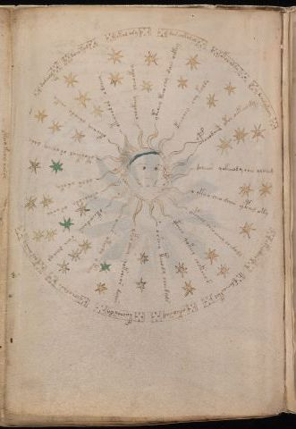

# Voynich Speculative Procedural Protocol — f67v1

IMPORTANT: this is NOT a real or validated translation of the Voynich Manuscript. It is a speculative/procedural model that interprets EVA using a user-defined grammar to generate experimental recipes using safe, known edible substitutes.

This file is generated automatically from IVTFF/EVA transliteration plus a user-defined procedural grammar.



## Page / Folio
- folio: f67v1
- page_number: 123
- section: astronomical

## EVA Text (Transliteration)
```text
damamm
dairkal
okal ary
dar echkalal
okol aldy
dchesykchy
ykeodar
deeeoskol
ockhosam
kochardy
ochodare
ols aiiny
otorkeol orsheey dary
okechey cheody cheky
otechodor odcheey
chockhey chockhy
yteeey keeochy dair ockey
keechey chy koldy
pchodaiin otch oekeey dy
dcheeos qokeeeody eeis olcheeg
ykeeo cheo daiin ypcheg oty
opcheey chso cheey chedaly
ykeeey qokeey olokeey s
osheey keeody cheedals
okar shey qokche[o:a]r daiiin
oeees ote[ch:ee]y o keey
okeeodaiin saii dairal
oksheeody or aral
olar aroky
```

## Domain Context (Heuristic; Not a Translation)

This section summarizes recurring **basewords** in this IVTFF domain and shows simple substring evidence that the token markers used by the procedural grammar occur inside frequent words.

Any Italian anagram / English gloss is a best-effort lexicon match, not a decipherment.


### Associated basewords (non-generic; top by frequency in this domain)
- `paiin` (count=13) → Italian anagram `piani`; English: plans (arrangements)
- `paiir` (count=4) → Italian anagram `aprii`; English: [n/a]
- `saiin` (count=2) → Italian anagram `asini`; English: [n/a]
- `opaiin` (count=2) → Italian anagram `inopia`; English: poverty
- `oteos` (count=2) → Italian anagram `osteo`; English: [n/a]
- `opain` (count=2) → Italian anagram `opina`; English: opine
- `okain` (count=1) → Italian anagram `acino`; English: a berry
- `qokeol` (count=1) → Italian anagram `eccolo`; English: [n/a]
- `chepar` (count=1) → Italian anagram `capre`; English: [n/a]
- `qokche` (count=1) → Italian anagram `cecco`; English: [n/a]
- `okees` (count=1) → Italian anagram `coese`; English: [n/a]
- `okchor` (count=1) → Italian anagram `corco`; English: [n/a]
- `chopar` (count=1) → Italian anagram `capro`; English: male goat
- `topaiin` (count=1) → Italian anagram `opinati`; English: [n/a]
- `poiin` (count=1) → Italian anagram `inopi`; English: [n/a]

### Marker evidence (substring in frequent basewords)
- `qo`: 11 basewords; examples: `qokee`, `qokchp`, `qoke`, `qokol`, `qokch`, `qokeol`
- `q`: 12 basewords; examples: `qokee`, `qokchp`, `qoke`, `qokol`, `qokch`, `qokeol`
- `o`: 122 basewords; examples: `o`, `otee`, `chol`, `or`, `okol`, `oke`
- `k`: 58 basewords; examples: `okol`, `oke`, `okee`, `ok`, `kee`, `okeo`
- `t`: 37 basewords; examples: `otee`, `ot`, `teop`, `otar`, `otol`, `ote`
- `p`: 69 basewords; examples: `p`, `paiin`, `par`, `pair`, `pal`, `cheop`
- `ch`: 58 basewords; examples: `ch`, `chol`, `cheop`, `cheo`, `che`, `cho`
- `sh`: 16 basewords; examples: `she`, `shes`, `sh`, `shp`, `sheo`, `shees`
- `cth`: 5 basewords; examples: `cth`, `cthe`, `cthop`, `shocth`, `cthp`
- `ckh`: 4 basewords; examples: `chockh`, `ockh`, `qockh`, `ckhee`
- `cph`: 2 basewords; examples: `cph`, `cphol`
- `iin`: 12 basewords; examples: `aiin`, `paiin`, `saiin`, `opaiin`, `oiin`, `chepaiin`
- `aiin`: 8 basewords; examples: `aiin`, `paiin`, `saiin`, `opaiin`, `chepaiin`, `oaiin`

## Recipes Index (This Page)
- [f67v1.1,@L0](#f67v1-1-f67v1-1-l0)
- [f67v1.2,&L0](#f67v1-2-f67v1-2-l0)
- [f67v1.3,&L0](#f67v1-3-f67v1-3-l0)
- [f67v1.4,&L0](#f67v1-4-f67v1-4-l0)
- [f67v1.5,&L0](#f67v1-5-f67v1-5-l0)
- [f67v1.6,&L0](#f67v1-6-f67v1-6-l0)
- [f67v1.7,&L0](#f67v1-7-f67v1-7-l0)
- [f67v1.8,&L0](#f67v1-8-f67v1-8-l0)
- [f67v1.9,&L0](#f67v1-9-f67v1-9-l0)
- [f67v1.10,&L0](#f67v1-10-f67v1-10-l0)
- [f67v1.11,&L0](#f67v1-11-f67v1-11-l0)
- [f67v1.12,&L0](#f67v1-12-f67v1-12-l0)
- [f67v1.13,@Ro](#f67v1-13-f67v1-13-ro)
- [f67v1.14,@Ro](#f67v1-14-f67v1-14-ro)
- [f67v1.15,@Ro](#f67v1-15-f67v1-15-ro)
- [f67v1.16,@Ro](#f67v1-16-f67v1-16-ro)
- [f67v1.17,@Ro](#f67v1-17-f67v1-17-ro)
- [f67v1.18,@Ro](#f67v1-18-f67v1-18-ro)
- [f67v1.19,@Ro](#f67v1-19-f67v1-19-ro)
- [f67v1.20,@Ro](#f67v1-20-f67v1-20-ro)
- [f67v1.21,@Ro](#f67v1-21-f67v1-21-ro)
- [f67v1.22,@Ro](#f67v1-22-f67v1-22-ro)
- [f67v1.23,@Ro](#f67v1-23-f67v1-23-ro)
- [f67v1.24,@Ro](#f67v1-24-f67v1-24-ro)
- [f67v1.25,@Ro](#f67v1-25-f67v1-25-ro)
- [f67v1.26,@Ro](#f67v1-26-f67v1-26-ro)
- [f67v1.27,@Ro](#f67v1-27-f67v1-27-ro)
- [f67v1.28,@Ro](#f67v1-28-f67v1-28-ro)
- [f67v1.29,@Ro](#f67v1-29-f67v1-29-ro)

## Line Glosses (Procedural Gloss Only; Not a Translation)

<a id="f67v1-1-f67v1-1-l0"></a>

### f67v1.1,@L0

EVA: damamm

Direct Gloss (Procedural, Not a Real Translation):
- damamm: tokens: p a m a m m → connectors: m m m → vowel_run: a (level 1; class a)

<a id="f67v1-2-f67v1-2-l0"></a>

### f67v1.2,&L0

EVA: dairkal

Direct Gloss (Procedural, Not a Real Translation):
- dairkal: tokens: p a i r k a l → connectors: r l → vowel_run: a (level 1; class a)

<a id="f67v1-3-f67v1-3-l0"></a>

### f67v1.3,&L0

EVA: okal ary

Direct Gloss (Procedural, Not a Real Translation):
- okal: tokens: o k a l → connectors: l → vowel_run: a (level 1; class a)
- ary: tokens: a r → connectors: r → vowel_run: a (level 1; class a)

<a id="f67v1-4-f67v1-4-l0"></a>

### f67v1.4,&L0

EVA: dar echkalal

Direct Gloss (Procedural, Not a Real Translation):
- dar: tokens: p a r → connectors: r → vowel_run: a (level 1; class a)
- echkalal: tokens: e ch k a l a l → connectors: l l → vowel_run: e (level 1; class e)

<a id="f67v1-5-f67v1-5-l0"></a>

### f67v1.5,&L0

EVA: okol aldy

Direct Gloss (Procedural, Not a Real Translation):
- okol: tokens: o k o l → connectors: l
- aldy: tokens: a l p → connectors: l → vowel_run: a (level 1; class a)

<a id="f67v1-6-f67v1-6-l0"></a>

### f67v1.6,&L0

EVA: dchesykchy

Direct Gloss (Procedural, Not a Real Translation):
- dchesykchy: tokens: p ch e s k ch → connectors: s → vowel_run: e (level 1; class e)

<a id="f67v1-7-f67v1-7-l0"></a>

### f67v1.7,&L0

EVA: ykeodar

Direct Gloss (Procedural, Not a Real Translation):
- ykeodar: tokens: k e o p a r → connectors: r → vowel_run: e (level 1; class e)

<a id="f67v1-8-f67v1-8-l0"></a>

### f67v1.8,&L0

EVA: deeeoskol

Direct Gloss (Procedural, Not a Real Translation):
- deeeoskol: tokens: p eee o s k o l → connectors: s l → vowel_run: eee (level 3; class e)

<a id="f67v1-9-f67v1-9-l0"></a>

### f67v1.9,&L0

EVA: ockhosam

Direct Gloss (Procedural, Not a Real Translation):
- ockhosam: tokens: o ckh o s a m → connectors: s m → vowel_run: a (level 1; class a)

<a id="f67v1-10-f67v1-10-l0"></a>

### f67v1.10,&L0

EVA: kochardy

Direct Gloss (Procedural, Not a Real Translation):
- kochardy: tokens: k o ch a r p → connectors: r → vowel_run: a (level 1; class a)

<a id="f67v1-11-f67v1-11-l0"></a>

### f67v1.11,&L0

EVA: ochodare

Direct Gloss (Procedural, Not a Real Translation):
- ochodare: tokens: o ch o p a r e → connectors: r → vowel_run: a (level 1; class a) (lexicon-context: `chopar` → `copra`; [n/a])

<a id="f67v1-12-f67v1-12-l0"></a>

### f67v1.12,&L0

EVA: ols aiiny

Direct Gloss (Procedural, Not a Real Translation):
- ols: tokens: o l s → connectors: l s
- aiiny: tokens: aiin → vowel_run: a (level 1; class a) → suffix: aiin

<a id="f67v1-13-f67v1-13-ro"></a>

### f67v1.13,@Ro

EVA: otorkeol orsheey dary

Direct Gloss (Procedural, Not a Real Translation):
- otorkeol: tokens: o t o r k e o l → connectors: r l → vowel_run: e (level 1; class e)
- orsheey: tokens: o r sh ee → connectors: r → vowel_run: ee (level 2; class e)
- dary: tokens: p a r → connectors: r → vowel_run: a (level 1; class a)

<a id="f67v1-14-f67v1-14-ro"></a>

### f67v1.14,@Ro

EVA: okechey cheody cheky

Direct Gloss (Procedural, Not a Real Translation):
- okechey: tokens: o k e ch e → vowel_run: e (level 1; class e)
- cheody: tokens: ch e o p → vowel_run: e (level 1; class e)
- cheky: tokens: ch e k → vowel_run: e (level 1; class e)

<a id="f67v1-15-f67v1-15-ro"></a>

### f67v1.15,@Ro

EVA: otechodor odcheey

Direct Gloss (Procedural, Not a Real Translation):
- otechodor: tokens: o t e ch o p o r → connectors: r → vowel_run: e (level 1; class e)
- odcheey: tokens: o p ch ee → vowel_run: ee (level 2; class e)

<a id="f67v1-16-f67v1-16-ro"></a>

### f67v1.16,@Ro

EVA: chockhey chockhy

Direct Gloss (Procedural, Not a Real Translation):
- chockhey: tokens: ch o ckh e → vowel_run: e (level 1; class e)
- chockhy: tokens: ch o ckh

<a id="f67v1-17-f67v1-17-ro"></a>

### f67v1.17,@Ro

EVA: yteeey keeochy dair ockey

Direct Gloss (Procedural, Not a Real Translation):
- yteeey: tokens: t eee → vowel_run: eee (level 3; class e)
- keeochy: tokens: k ee o ch → vowel_run: ee (level 2; class e)
- dair: tokens: p a i r → connectors: r → vowel_run: a (level 1; class a)
- ockey: tokens: o c k e → vowel_run: e (level 1; class e)

<a id="f67v1-18-f67v1-18-ro"></a>

### f67v1.18,@Ro

EVA: keechey chy koldy

Direct Gloss (Procedural, Not a Real Translation):
- keechey: tokens: k ee ch e → vowel_run: ee (level 2; class e)
- chy: tokens: ch
- koldy: tokens: k o l p → connectors: l

<a id="f67v1-19-f67v1-19-ro"></a>

### f67v1.19,@Ro

EVA: pchodaiin otch oekeey dy

Direct Gloss (Procedural, Not a Real Translation):
- pchodaiin: tokens: p ch o p aiin → vowel_run: a (level 1; class a) → suffix: aiin (lexicon-context: `opaiin` → `opinai`; [n/a])
- otch: tokens: o t ch
- oekeey: tokens: o e k ee → vowel_run: e (level 1; class e)
- dy: tokens: p

<a id="f67v1-20-f67v1-20-ro"></a>

### f67v1.20,@Ro

EVA: dcheeos qokeeeody eeis olcheeg

Direct Gloss (Procedural, Not a Real Translation):
- dcheeos: tokens: p ch ee o s → connectors: s → vowel_run: ee (level 2; class e)
- qokeeeody: tokens: qo k eee o p → vowel_run: eee (level 3; class e)
- eeis: tokens: ee i s → connectors: s → vowel_run: ee (level 2; class e)
- olcheeg: tokens: o l ch ee g → connectors: l → vowel_run: ee (level 2; class e)

<a id="f67v1-21-f67v1-21-ro"></a>

### f67v1.21,@Ro

EVA: ykeeo cheo daiin ypcheg oty

Direct Gloss (Procedural, Not a Real Translation):
- ykeeo: tokens: k ee o → vowel_run: ee (level 2; class e)
- cheo: tokens: ch e o → vowel_run: e (level 1; class e)
- daiin: tokens: p aiin → vowel_run: a (level 1; class a) → suffix: aiin (lexicon-context: `paiin` → `piani`; plans (arrangements))
- ypcheg: tokens: p ch e g → vowel_run: e (level 1; class e)
- oty: tokens: o t

<a id="f67v1-22-f67v1-22-ro"></a>

### f67v1.22,@Ro

EVA: opcheey chso cheey chedaly

Direct Gloss (Procedural, Not a Real Translation):
- opcheey: tokens: o p ch ee → vowel_run: ee (level 2; class e)
- chso: tokens: ch s o → connectors: s
- cheey: tokens: ch ee → vowel_run: ee (level 2; class e)
- chedaly: tokens: ch e p a l → connectors: l → vowel_run: e (level 1; class e)

<a id="f67v1-23-f67v1-23-ro"></a>

### f67v1.23,@Ro

EVA: ykeeey qokeey olokeey s

Direct Gloss (Procedural, Not a Real Translation):
- ykeeey: tokens: k eee → vowel_run: eee (level 3; class e)
- qokeey: tokens: qo k ee → vowel_run: ee (level 2; class e)
- olokeey: tokens: o l o k ee → connectors: l → vowel_run: ee (level 2; class e)
- s: tokens: s → connectors: s

<a id="f67v1-24-f67v1-24-ro"></a>

### f67v1.24,@Ro

EVA: osheey keeody cheedals

Direct Gloss (Procedural, Not a Real Translation):
- osheey: tokens: o sh ee → vowel_run: ee (level 2; class e)
- keeody: tokens: k ee o p → vowel_run: ee (level 2; class e)
- cheedals: tokens: ch ee p a l s → connectors: l s → vowel_run: ee (level 2; class e)

<a id="f67v1-25-f67v1-25-ro"></a>

### f67v1.25,@Ro

EVA: okar shey qokche[o:a]r daiiin

Direct Gloss (Procedural, Not a Real Translation):
- okar: tokens: o k a r → connectors: r → vowel_run: a (level 1; class a)
- shey: tokens: sh e → vowel_run: e (level 1; class e)
- qokche: tokens: qo k ch e → vowel_run: e (level 1; class e)
- o: tokens: o
- a: tokens: a → vowel_run: a (level 1; class a)
- r: tokens: r → connectors: r
- daiiin: tokens: p a iii n → connectors: n → vowel_run: a (level 1; class a) → suffix: iin

<a id="f67v1-26-f67v1-26-ro"></a>

### f67v1.26,@Ro

EVA: oeees ote[ch:ee]y o keey

Direct Gloss (Procedural, Not a Real Translation):
- oeees: tokens: o eee s → connectors: s → vowel_run: eee (level 3; class e)
- ote: tokens: o t e → vowel_run: e (level 1; class e)
- ch: tokens: ch
- ee: tokens: ee → vowel_run: ee (level 2; class e)
- y: [unparsed]
- o: tokens: o
- keey: tokens: k ee → vowel_run: ee (level 2; class e)

<a id="f67v1-27-f67v1-27-ro"></a>

### f67v1.27,@Ro

EVA: okeeodaiin saii dairal

Direct Gloss (Procedural, Not a Real Translation):
- okeeodaiin: tokens: o k ee o p aiin → vowel_run: ee (level 2; class e) → suffix: aiin (lexicon-context: `opaiin` → `opinai`; [n/a])
- saii: tokens: s a ii → connectors: s → vowel_run: a (level 1; class a)
- dairal: tokens: p a i r a l → connectors: r l → vowel_run: a (level 1; class a)

<a id="f67v1-28-f67v1-28-ro"></a>

### f67v1.28,@Ro

EVA: oksheeody or aral

Direct Gloss (Procedural, Not a Real Translation):
- oksheeody: tokens: o k sh ee o p → vowel_run: ee (level 2; class e)
- or: tokens: o r → connectors: r
- aral: tokens: a r a l → connectors: r l → vowel_run: a (level 1; class a)

<a id="f67v1-29-f67v1-29-ro"></a>

### f67v1.29,@Ro

EVA: olar aroky

Direct Gloss (Procedural, Not a Real Translation):
- olar: tokens: o l a r → connectors: l r → vowel_run: a (level 1; class a)
- aroky: tokens: a r o k → connectors: r → vowel_run: a (level 1; class a)
