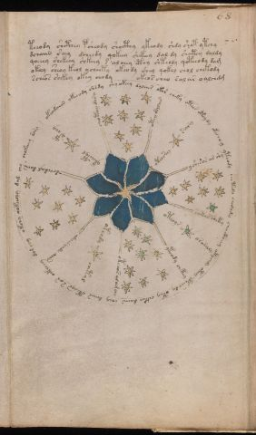

# Voynich Speculative Procedural Protocol — f68v2

IMPORTANT: this is NOT a real or validated translation of the Voynich Manuscript. It is a speculative/procedural model that interprets EVA using a user-defined grammar to generate experimental recipes using safe, known edible substitutes.

This file is generated automatically from IVTFF/EVA transliteration plus a user-defined procedural grammar.



## Page / Folio
- folio: f68v2
- page_number: 129
- section: astronomical

## EVA Text (Transliteration)
```text
teeody shcthey psheody shocthy ykeody shdy shot ytchy
dchaiin shey dcheedy qokeey shckeey dal dy sheetey daldy
qoeeey shekeey shkeey s alchey cthy shteody qoteeody dam
okeey sheoy keol ycheety okeody shey qokey chol chekody
scheos seekey okey chody okeos cheo sal ar oallchdm
okeadaiin ykeeody shsdy shyokeey dalches oko[s:r] cheky otees oteydy okechoy yteody chetedy cheda[d:m]y [@150;:ch]eectheey otychdy oteey cpheeo dy otey [ch:ee]key daiin chey da[iir:iis] oteeys sar o[ckhee:ckeee]y dor chy okchy qokeechy dal chy chokeeey sary
otey dalar
otosey sary
yshesas ar shy
socths chety
oteoys orasaly
yteody chetey
oteeos alamchy
otchdy chetal
adairchdy aiin
dchedal daiin
ykeeepol ypchy
choteey dary
```

## Domain Context (Heuristic; Not a Translation)

This section summarizes recurring **basewords** in this IVTFF domain and shows simple substring evidence that the token markers used by the procedural grammar occur inside frequent words.

Any Italian anagram / English gloss is a best-effort lexicon match, not a decipherment.


### Associated basewords (non-generic; top by frequency in this domain)
- `daiin` (count=11) → Italian anagram `piani`; English: plans (arrangements)
- `daiir` (count=4) → Italian anagram `aprii`; English: [n/a]
- `saiin` (count=2) → Italian anagram `asini`; English: [n/a]
- `odaiin` (count=2) → Italian anagram `inopia`; English: poverty
- `ydaiin` (count=2) → Italian anagram `piani`; English: plans (arrangements)
- `okain` (count=1) → Italian anagram `acino`; English: a berry
- `qokeol` (count=1) → Italian anagram `eccolo`; English: [n/a]
- `chedar` (count=1) → Italian anagram `capre`; English: [n/a]
- `oteos` (count=1) → Italian anagram `osteo`; English: [n/a]
- `okees` (count=1) → Italian anagram `coese`; English: [n/a]
- `okchor` (count=1) → Italian anagram `corco`; English: [n/a]
- `odain` (count=1) → Italian anagram `opina`; English: opine
- `chodar` (count=1) → Italian anagram `capro`; English: male goat
- `okeos` (count=1) → Italian anagram `coeso`; English: cohesive

### Marker evidence (substring in frequent basewords)
- `qo`: 10 basewords; examples: `qokeey`, `qokchdy`, `qokey`, `qokol`, `qokchy`, `qokeol`
- `q`: 11 basewords; examples: `qokeey`, `qokchdy`, `qokey`, `qokol`, `qokchy`, `qokeol`
- `o`: 105 basewords; examples: `o`, `oteey`, `chol`, `or`, `okol`, `okey`
- `k`: 50 basewords; examples: `okol`, `okey`, `okeey`, `okeo`, `qokeey`, `keey`
- `t`: 30 basewords; examples: `oteey`, `otol`, `otor`, `ot`, `oteo`, `yteody`
- `p`: 4 basewords; examples: `opchey`, `qopchy`, `cphy`, `cphol`
- `ch`: 51 basewords; examples: `chol`, `chy`, `ch`, `cheor`, `cho`, `cheo`
- `sh`: 14 basewords; examples: `shey`, `shes`, `shdy`, `sheey`, `sho`, `sheol`
- `cth`: 4 basewords; examples: `cthy`, `cthey`, `cthody`, `shocthy`
- `ckh`: 3 basewords; examples: `chockhy`, `ockhy`, `qockhy`
- `cph`: 2 basewords; examples: `cphy`, `cphol`
- `dy`: 26 basewords; examples: `dy`, `cheody`, `okeody`, `ykeody`, `okeeody`, `aldy`
- `iin`: 11 basewords; examples: `aiin`, `daiin`, `saiin`, `odaiin`, `oiin`, `ydaiin`
- `aiin`: 8 basewords; examples: `aiin`, `daiin`, `saiin`, `odaiin`, `ydaiin`, `chedaiin`

## Recipes Index (This Page)
- [f68v2.1,@P0](#f68v2-1-f68v2-1-p0)
- [f68v2.2,+P0](#f68v2-2-f68v2-2-p0)
- [f68v2.3,+P0](#f68v2-3-f68v2-3-p0)
- [f68v2.4,+P0](#f68v2-4-f68v2-4-p0)
- [f68v2.5,+P0](#f68v2-5-f68v2-5-p0)
- [f68v2.6,@Cc](#f68v2-6-f68v2-6-cc)
- [f68v2.7,@Ro](#f68v2-7-f68v2-7-ro)
- [f68v2.8,@Ro](#f68v2-8-f68v2-8-ro)
- [f68v2.9,@Ro](#f68v2-9-f68v2-9-ro)
- [f68v2.10,@Ro](#f68v2-10-f68v2-10-ro)
- [f68v2.11,@Ro](#f68v2-11-f68v2-11-ro)
- [f68v2.12,@Ro](#f68v2-12-f68v2-12-ro)
- [f68v2.13,@Ro](#f68v2-13-f68v2-13-ro)
- [f68v2.14,@Ro](#f68v2-14-f68v2-14-ro)
- [f68v2.15,@Ro](#f68v2-15-f68v2-15-ro)
- [f68v2.16,@Ro](#f68v2-16-f68v2-16-ro)
- [f68v2.17,@Ro](#f68v2-17-f68v2-17-ro)
- [f68v2.18,@Ro](#f68v2-18-f68v2-18-ro)

## Line Glosses (Procedural Gloss Only; Not a Translation)

<a id="f68v2-1-f68v2-1-p0"></a>

### f68v2.1,@P0

EVA: teeody shcthey psheody shocthy ykeody shdy shot ytchy

Direct Gloss (Procedural, Not a Real Translation):
- teeody: tokens: t ee o p → vowel_run: ee (level 2; class e)
- shcthey: tokens: sh cth e → vowel_run: e (level 1; class e)
- psheody: tokens: p sh e o p → vowel_run: e (level 1; class e)
- shocthy: tokens: sh o cth
- ykeody: tokens: k e o p → vowel_run: e (level 1; class e)
- shdy: tokens: sh p
- shot: tokens: sh o t
- ytchy: tokens: t ch

<a id="f68v2-2-f68v2-2-p0"></a>

### f68v2.2,+P0

EVA: dchaiin shey dcheedy qokeey shckeey dal dy sheetey daldy

Direct Gloss (Procedural, Not a Real Translation):
- dchaiin: tokens: p ch aiin → vowel_run: a (level 1; class a) → suffix: aiin
- shey: tokens: sh e → vowel_run: e (level 1; class e)
- dcheedy: tokens: p ch ee p → vowel_run: ee (level 2; class e)
- qokeey: tokens: qo k ee → vowel_run: ee (level 2; class e)
- shckeey: tokens: sh c k ee → vowel_run: ee (level 2; class e)
- dal: tokens: p a l → connectors: l → vowel_run: a (level 1; class a)
- dy: tokens: p
- sheetey: tokens: sh ee t e → vowel_run: ee (level 2; class e)
- daldy: tokens: p a l p → connectors: l → vowel_run: a (level 1; class a)

<a id="f68v2-3-f68v2-3-p0"></a>

### f68v2.3,+P0

EVA: qoeeey shekeey shkeey s alchey cthy shteody qoteeody dam

Direct Gloss (Procedural, Not a Real Translation):
- qoeeey: tokens: qo eee → vowel_run: eee (level 3; class e)
- shekeey: tokens: sh e k ee → vowel_run: e (level 1; class e)
- shkeey: tokens: sh k ee → vowel_run: ee (level 2; class e)
- s: tokens: s → connectors: s
- alchey: tokens: a l ch e → connectors: l → vowel_run: a (level 1; class a)
- cthy: tokens: cth
- shteody: tokens: sh t e o p → vowel_run: e (level 1; class e)
- qoteeody: tokens: qo t ee o p → vowel_run: ee (level 2; class e)
- dam: tokens: p a m → connectors: m → vowel_run: a (level 1; class a)

<a id="f68v2-4-f68v2-4-p0"></a>

### f68v2.4,+P0

EVA: okeey sheoy keol ycheety okeody shey qokey chol chekody

Direct Gloss (Procedural, Not a Real Translation):
- okeey: tokens: o k ee → vowel_run: ee (level 2; class e)
- sheoy: tokens: sh e o → vowel_run: e (level 1; class e)
- keol: tokens: k e o l → connectors: l → vowel_run: e (level 1; class e)
- ycheety: tokens: ch ee t → vowel_run: ee (level 2; class e)
- okeody: tokens: o k e o p → vowel_run: e (level 1; class e)
- shey: tokens: sh e → vowel_run: e (level 1; class e)
- qokey: tokens: qo k e → vowel_run: e (level 1; class e)
- chol: tokens: ch o l → connectors: l
- chekody: tokens: ch e k o p → vowel_run: e (level 1; class e)

<a id="f68v2-5-f68v2-5-p0"></a>

### f68v2.5,+P0

EVA: scheos seekey okey chody okeos cheo sal ar oallchdm

Direct Gloss (Procedural, Not a Real Translation):
- scheos: tokens: s ch e o s → connectors: s s → vowel_run: e (level 1; class e)
- seekey: tokens: s ee k e → connectors: s → vowel_run: ee (level 2; class e)
- okey: tokens: o k e → vowel_run: e (level 1; class e)
- chody: tokens: ch o p
- okeos: tokens: o k e o s → connectors: s → vowel_run: e (level 1; class e)
- cheo: tokens: ch e o → vowel_run: e (level 1; class e)
- sal: tokens: s a l → connectors: s l → vowel_run: a (level 1; class a)
- ar: tokens: a r → connectors: r → vowel_run: a (level 1; class a)
- oallchdm: tokens: o a l l ch p m → connectors: l l m → vowel_run: a (level 1; class a)

<a id="f68v2-6-f68v2-6-cc"></a>

### f68v2.6,@Cc

EVA: okeadaiin ykeeody shsdy shyokeey dalches oko[s:r] cheky otees oteydy okechoy yteody chetedy cheda[d:m]y [@150;:ch]eectheey otychdy oteey cpheeo dy otey [ch:ee]key daiin chey da[iir:iis] oteeys sar o[ckhee:ckeee]y dor chy okchy qokeechy dal chy chokeeey sary

Direct Gloss (Procedural, Not a Real Translation):
- okeadaiin: tokens: o k e a p aiin → vowel_run: e (level 1; class e) → suffix: aiin
- ykeeody: tokens: k ee o p → vowel_run: ee (level 2; class e)
- shsdy: tokens: sh s p → connectors: s
- shyokeey: tokens: sh o k ee → vowel_run: ee (level 2; class e)
- dalches: tokens: p a l ch e s → connectors: l s → vowel_run: a (level 1; class a)
- oko: tokens: o k o
- s: tokens: s → connectors: s
- r: tokens: r → connectors: r
- cheky: tokens: ch e k → vowel_run: e (level 1; class e)
- otees: tokens: o t ee s → connectors: s → vowel_run: ee (level 2; class e)
- oteydy: tokens: o t e p → vowel_run: e (level 1; class e)
- okechoy: tokens: o k e ch o → vowel_run: e (level 1; class e)
- yteody: tokens: t e o p → vowel_run: e (level 1; class e)
- chetedy: tokens: ch e t e p → vowel_run: e (level 1; class e)
- cheda: tokens: ch e p a → vowel_run: e (level 1; class e)
- d: tokens: p
- m: tokens: m → connectors: m
- y: [unparsed]
- ch: tokens: ch
- eectheey: tokens: ee cth ee → vowel_run: ee (level 2; class e)
- otychdy: tokens: o t ch p
- oteey: tokens: o t ee → vowel_run: ee (level 2; class e)
- cpheeo: tokens: cph ee o → vowel_run: ee (level 2; class e)
- dy: tokens: p
- otey: tokens: o t e → vowel_run: e (level 1; class e)
- ch: tokens: ch
- ee: tokens: ee → vowel_run: ee (level 2; class e)
- key: tokens: k e → vowel_run: e (level 1; class e)
- daiin: tokens: p aiin → vowel_run: a (level 1; class a) → suffix: aiin
- chey: tokens: ch e → vowel_run: e (level 1; class e)
- da: tokens: p a → vowel_run: a (level 1; class a)
- iir: tokens: ii r → connectors: r → vowel_run: ii (level 2; class i)
- iis: tokens: ii s → connectors: s → vowel_run: ii (level 2; class i)
- oteeys: tokens: o t ee s → connectors: s → vowel_run: ee (level 2; class e)
- sar: tokens: s a r → connectors: s r → vowel_run: a (level 1; class a)
- o: tokens: o
- ckhee: tokens: ckh ee → vowel_run: ee (level 2; class e)
- ckeee: tokens: c k eee → vowel_run: eee (level 3; class e)
- y: [unparsed]
- dor: tokens: p o r → connectors: r
- chy: tokens: ch
- okchy: tokens: o k ch
- qokeechy: tokens: qo k ee ch → vowel_run: ee (level 2; class e)
- dal: tokens: p a l → connectors: l → vowel_run: a (level 1; class a)
- chy: tokens: ch
- chokeeey: tokens: ch o k eee → vowel_run: eee (level 3; class e)
- sary: tokens: s a r → connectors: s r → vowel_run: a (level 1; class a)

<a id="f68v2-7-f68v2-7-ro"></a>

### f68v2.7,@Ro

EVA: otey dalar

Direct Gloss (Procedural, Not a Real Translation):
- otey: tokens: o t e → vowel_run: e (level 1; class e)
- dalar: tokens: p a l a r → connectors: l r → vowel_run: a (level 1; class a)

<a id="f68v2-8-f68v2-8-ro"></a>

### f68v2.8,@Ro

EVA: otosey sary

Direct Gloss (Procedural, Not a Real Translation):
- otosey: tokens: o t o s e → connectors: s → vowel_run: e (level 1; class e)
- sary: tokens: s a r → connectors: s r → vowel_run: a (level 1; class a)

<a id="f68v2-9-f68v2-9-ro"></a>

### f68v2.9,@Ro

EVA: yshesas ar shy

Direct Gloss (Procedural, Not a Real Translation):
- yshesas: tokens: sh e s a s → connectors: s s → vowel_run: e (level 1; class e)
- ar: tokens: a r → connectors: r → vowel_run: a (level 1; class a)
- shy: tokens: sh

<a id="f68v2-10-f68v2-10-ro"></a>

### f68v2.10,@Ro

EVA: socths chety

Direct Gloss (Procedural, Not a Real Translation):
- socths: tokens: s o cth s → connectors: s s
- chety: tokens: ch e t → vowel_run: e (level 1; class e)

<a id="f68v2-11-f68v2-11-ro"></a>

### f68v2.11,@Ro

EVA: oteoys orasaly

Direct Gloss (Procedural, Not a Real Translation):
- oteoys: tokens: o t e o s → connectors: s → vowel_run: e (level 1; class e)
- orasaly: tokens: o r a s a l → connectors: r s l → vowel_run: a (level 1; class a)

<a id="f68v2-12-f68v2-12-ro"></a>

### f68v2.12,@Ro

EVA: yteody chetey

Direct Gloss (Procedural, Not a Real Translation):
- yteody: tokens: t e o p → vowel_run: e (level 1; class e)
- chetey: tokens: ch e t e → vowel_run: e (level 1; class e)

<a id="f68v2-13-f68v2-13-ro"></a>

### f68v2.13,@Ro

EVA: oteeos alamchy

Direct Gloss (Procedural, Not a Real Translation):
- oteeos: tokens: o t ee o s → connectors: s → vowel_run: ee (level 2; class e)
- alamchy: tokens: a l a m ch → connectors: l m → vowel_run: a (level 1; class a)

<a id="f68v2-14-f68v2-14-ro"></a>

### f68v2.14,@Ro

EVA: otchdy chetal

Direct Gloss (Procedural, Not a Real Translation):
- otchdy: tokens: o t ch p
- chetal: tokens: ch e t a l → connectors: l → vowel_run: e (level 1; class e)

<a id="f68v2-15-f68v2-15-ro"></a>

### f68v2.15,@Ro

EVA: adairchdy aiin

Direct Gloss (Procedural, Not a Real Translation):
- adairchdy: tokens: a p a i r ch p → connectors: r → vowel_run: a (level 1; class a)
- aiin: tokens: aiin → vowel_run: a (level 1; class a) → suffix: aiin

<a id="f68v2-16-f68v2-16-ro"></a>

### f68v2.16,@Ro

EVA: dchedal daiin

Direct Gloss (Procedural, Not a Real Translation):
- dchedal: tokens: p ch e p a l → connectors: l → vowel_run: e (level 1; class e)
- daiin: tokens: p aiin → vowel_run: a (level 1; class a) → suffix: aiin

<a id="f68v2-17-f68v2-17-ro"></a>

### f68v2.17,@Ro

EVA: ykeeepol ypchy

Direct Gloss (Procedural, Not a Real Translation):
- ykeeepol: tokens: k eee p o l → connectors: l → vowel_run: eee (level 3; class e)
- ypchy: tokens: p ch

<a id="f68v2-18-f68v2-18-ro"></a>

### f68v2.18,@Ro

EVA: choteey dary

Direct Gloss (Procedural, Not a Real Translation):
- choteey: tokens: ch o t ee → vowel_run: ee (level 2; class e)
- dary: tokens: p a r → connectors: r → vowel_run: a (level 1; class a)
