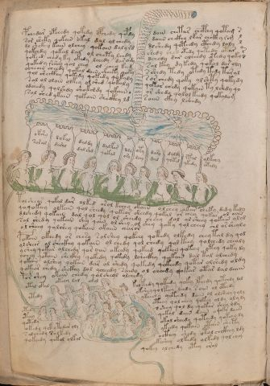

# Voynich Speculative Herbal Ferment Recipe — f75v

IMPORTANT: this is NOT a real or validated translation of the Voynich Manuscript. It is a speculative/procedural model that interprets EVA using a user-defined grammar to generate experimental recipes using safe, known edible substitutes.

This file is generated automatically from IVTFF/EVA transliteration plus a user-defined procedural grammar.



## Page / Folio
- currier: B
- folio: f75v
- page_number: 148
- section: biological

## EVA Text (Transliteration)
```text
pchedar opchedy qokedy opchedy qopdy dain chetas chcphhy qotam
s
sor sheky qokain okal dal olchedy daiin chckhy lkar chckhy rom
l
dl shckhy kain olchey qokain dalyrd dl shedy qoteedy cthedy loly
l
qokchdy qokal dal ol chety lchdy shedy ched otedy qotedy otar
o
r
qokeed chedy ky okedy lchedy dar ody dchedy dar olchedy otedy qoky
s
qokedy rshey qol chey ol chey keed sol key dy kedy qokal dar oly
ocheain cheedy qokal dain sheeky qoky sshedy tedy otedy tedy taral
qol sheckhy qokedy qokedy qokaly sor chedy qoky olshty qokydy
sal ol olain olkey olshed qokaly qokar chedy qokain ty lshdy qo
odchedy qolshdy shokshdy qokain ? or shedy qolol keedy qokalom
sal shed ykain qokain sheckhy ld saiin ckhy lshedy
okshy
saral
dokal
darol
daldy
dal shd
dalkar
qokal
dly
ory
oty
lchy
dary
dal
daldy
qoted
rkal
ykedy
olkchy
otoly
tolsheor qokal dar olked orol kchey okain olchey okar sheky dedy kedy
qoqokeey olkain qol sheedy qokeor sheedy qokal or chey qokar ol aiin
dlshedy qokain dal qol qol ol sheedy cheey dol ol sheey qokain olol
sal shedy qokain shey qoin ol shey ol shey qoky qol cheey chl or sheolo
o l sheey qolshey qokain okaiin charor
pokain okeedy or chesy solshey qokeey qotedy olkedy chey tal dy qol
olshees ol sheckhy qokain ol chedy qol chedy qol keey qolchedy chealy
yshey qokar olchedy qor oiin okeedy qokeed qokeey qokeey otey qoky dy
ychey qotain sheckhy qokedy qokedy lsheckhy qokain dal tol olchedy
qokain olshey qokain dar ol shedy qokedy qokeedy qotar olshedy oldy
qokear chedy shckhy dol ycheedy saino ol cheedy qokar otar dal daiin
por shey okain chedy qolsheol olchedy
otal opal
okeey lol
olol
ytedy
otedy
oteey
qotedy
okedy qek y tedar oly
s alchedy solkedy
qokeedy qok[o:a]l olkol
kolkedy qokedy qoky lpchdy qotchdy lol
oksheyqolkeey lchdy soiin ol otchdy
ykeechy qokeedy daiin ol olsheey qoly
oteey qol chey qokey oldy olyly
sshey qol dy qokar shey ldy
qokal dain dain o qoky daiin
okal sheedy qoteedy qokchy ly
ykeedy qokain otain shety
o cthey shedy otol chckhey ldy
okeshey olkedy olkedy qol chey
qokey olchedy otey orol
```

## Recipes Index (This Page)
- [f75v.1,@P0](#f75v-1-f75v-1-p0)
- [f75v.2,=L0](#f75v-2-f75v-2-l0)
- [f75v.3,*P0](#f75v-3-f75v-3-p0)
- [f75v.4,=L0](#f75v-4-f75v-4-l0)
- [f75v.5,*P0](#f75v-5-f75v-5-p0)
- [f75v.6,=L0](#f75v-6-f75v-6-l0)
- [f75v.7,*P0](#f75v-7-f75v-7-p0)
- [f75v.8,~L0](#f75v-8-f75v-8-l0)
- [f75v.9,+L0](#f75v-9-f75v-9-l0)
- [f75v.10,*P0](#f75v-10-f75v-10-p0)
- [f75v.11,=L0](#f75v-11-f75v-11-l0)
- [f75v.12,*P0](#f75v-12-f75v-12-p0)
- [f75v.13,+P0](#f75v-13-f75v-13-p0)
- [f75v.14,+P0](#f75v-14-f75v-14-p0)
- [f75v.15,+P0](#f75v-15-f75v-15-p0)
- [f75v.16,+P0](#f75v-16-f75v-16-p0)
- [f75v.17,+P0](#f75v-17-f75v-17-p0)
- [f75v.18,@Ln](#f75v-18-f75v-18-ln)
- [f75v.19,+Ln](#f75v-19-f75v-19-ln)
- [f75v.20,@Ln](#f75v-20-f75v-20-ln)
- [f75v.21,+Ln](#f75v-21-f75v-21-ln)
- [f75v.22,@Ln](#f75v-22-f75v-22-ln)
- [f75v.23,+Ln](#f75v-23-f75v-23-ln)
- [f75v.24,@Ln](#f75v-24-f75v-24-ln)
- [f75v.25,+Ln](#f75v-25-f75v-25-ln)
- [f75v.26,@Ln](#f75v-26-f75v-26-ln)
- [f75v.27,+Ln](#f75v-27-f75v-27-ln)
- [f75v.28,@Ln](#f75v-28-f75v-28-ln)
- [f75v.29,+Ln](#f75v-29-f75v-29-ln)
- [f75v.30,@Ln](#f75v-30-f75v-30-ln)
- [f75v.31,+Ln](#f75v-31-f75v-31-ln)
- [f75v.32,@Ln](#f75v-32-f75v-32-ln)
- [f75v.33,+Ln](#f75v-33-f75v-33-ln)
- [f75v.34,@Ln](#f75v-34-f75v-34-ln)
- [f75v.35,+Ln](#f75v-35-f75v-35-ln)
- [f75v.36,@Ln](#f75v-36-f75v-36-ln)
- [f75v.37,+Ln](#f75v-37-f75v-37-ln)
- [f75v.38,@P0](#f75v-38-f75v-38-p0)
- [f75v.39,+P0](#f75v-39-f75v-39-p0)
- [f75v.40,+P0](#f75v-40-f75v-40-p0)
- [f75v.41,+P0](#f75v-41-f75v-41-p0)
- [f75v.42,+P0](#f75v-42-f75v-42-p0)
- [f75v.43,+P0](#f75v-43-f75v-43-p0)
- [f75v.44,+P0](#f75v-44-f75v-44-p0)
- [f75v.45,+P0](#f75v-45-f75v-45-p0)
- [f75v.46,+P0](#f75v-46-f75v-46-p0)
- [f75v.47,+P0](#f75v-47-f75v-47-p0)
- [f75v.48,+P0](#f75v-48-f75v-48-p0)
- [f75v.49,+P0](#f75v-49-f75v-49-p0)
- [f75v.50,@Lt](#f75v-50-f75v-50-lt)
- [f75v.51,=Lt](#f75v-51-f75v-51-lt)
- [f75v.52,=Lt](#f75v-52-f75v-52-lt)
- [f75v.53,*Lt](#f75v-53-f75v-53-lt)
- [f75v.54,+Lt](#f75v-54-f75v-54-lt)
- [f75v.55,+Lt](#f75v-55-f75v-55-lt)
- [f75v.56,+Lt](#f75v-56-f75v-56-lt)
- [f75v.57,+Pb](#f75v-57-f75v-57-pb)
- [f75v.58,+Pb](#f75v-58-f75v-58-pb)
- [f75v.59,+Pb](#f75v-59-f75v-59-pb)
- [f75v.60,@P1](#f75v-60-f75v-60-p1)
- [f75v.61,+P1](#f75v-61-f75v-61-p1)
- [f75v.62,+P1](#f75v-62-f75v-62-p1)
- [f75v.63,+P1](#f75v-63-f75v-63-p1)
- [f75v.64,+P1](#f75v-64-f75v-64-p1)
- [f75v.65,+P1](#f75v-65-f75v-65-p1)
- [f75v.66,+P1](#f75v-66-f75v-66-p1)
- [f75v.67,+P1](#f75v-67-f75v-67-p1)
- [f75v.68,+P1](#f75v-68-f75v-68-p1)
- [f75v.69,+P1](#f75v-69-f75v-69-p1)
- [f75v.70,+P1](#f75v-70-f75v-70-p1)

## Line Glosses (Procedural Gloss Only; Not a Translation)

<a id="f75v-1-f75v-1-p0"></a>

### f75v.1,@P0

EVA: pchedar opchedy qokedy opchedy qopdy dain chetas chcphhy qotam

Direct Gloss (Procedural, Not a Real Translation):
- pchedar: add main plant (safe substitute) → start fermentation (yeast) → duration level 1 → state: active extraction
- opchedy: add main plant (safe substitute) → mix / transfer → start fermentation (yeast) → duration level 1 → state: active extraction
- qokedy: prepare liquid base → add fermentable sugars → start fermentation (yeast) → duration level 1 → state: active extraction
- opchedy: add main plant (safe substitute) → mix / transfer → start fermentation (yeast) → duration level 1 → state: active extraction
- qopdy: prepare liquid base → start fermentation (yeast)
- dain: start fermentation (yeast) → duration level 1 → state: fermentation start
- chetas: apply heat/cooking → add main plant (safe substitute) → duration level 1 → state: active extraction
- chcphhy: add main plant (safe substitute) → add complex herbal compound (safe blend)
- qotam: prepare liquid base → apply heat/cooking → duration level 1 → state: fermentation start

<a id="f75v-2-f75v-2-l0"></a>

### f75v.2,=L0

EVA: s

Direct Gloss (Procedural, Not a Real Translation):
- s: [unparsed]

<a id="f75v-3-f75v-3-p0"></a>

### f75v.3,*P0

EVA: sor sheky qokain okal dal olchedy daiin chckhy lkar chckhy rom

Direct Gloss (Procedural, Not a Real Translation):
- sor: mix / transfer
- sheky: add fermentable sugars → add secondary herb (safe substitute) → duration level 1 → state: active extraction
- qokain: prepare liquid base → add fermentable sugars → duration level 1 → state: fermentation start
- okal: add fermentable sugars → mix / transfer → duration level 1 → state: fermentation start
- dal: start fermentation (yeast) → duration level 1 → state: fermentation start
- olchedy: add main plant (safe substitute) → mix / transfer → start fermentation (yeast) → duration level 1 → state: active extraction
- daiin: start fermentation (yeast) → duration level 1 → state: fermentation start → long fermentation / aging phase
- chckhy: add main plant (safe substitute) → add complex herbal compound (safe blend)
- lkar: add fermentable sugars → duration level 1 → state: fermentation start
- chckhy: add main plant (safe substitute) → add complex herbal compound (safe blend)
- rom: mix / transfer

<a id="f75v-4-f75v-4-l0"></a>

### f75v.4,=L0

EVA: l

Direct Gloss (Procedural, Not a Real Translation):
- l: [unparsed]

<a id="f75v-5-f75v-5-p0"></a>

### f75v.5,*P0

EVA: dl shckhy kain olchey qokain dalyrd dl shedy qoteedy cthedy loly

Direct Gloss (Procedural, Not a Real Translation):
- dl: start fermentation (yeast)
- shckhy: add secondary herb (safe substitute) → add complex herbal compound (safe blend)
- kain: add fermentable sugars → duration level 1 → state: fermentation start
- olchey: add main plant (safe substitute) → mix / transfer → duration level 1 → state: active extraction
- qokain: prepare liquid base → add fermentable sugars → duration level 1 → state: fermentation start
- dalyrd: start fermentation (yeast) → duration level 1 → state: fermentation start
- dl: start fermentation (yeast)
- shedy: add secondary herb (safe substitute) → start fermentation (yeast) → duration level 1 → state: active extraction
- qoteedy: prepare liquid base → apply heat/cooking → start fermentation (yeast) → duration level 2 → state: active extraction
- cthedy: start fermentation (yeast) → add complex herbal compound (safe blend) → duration level 1 → state: active extraction
- loly: mix / transfer

<a id="f75v-6-f75v-6-l0"></a>

### f75v.6,=L0

EVA: l

Direct Gloss (Procedural, Not a Real Translation):
- l: [unparsed]

<a id="f75v-7-f75v-7-p0"></a>

### f75v.7,*P0

EVA: qokchdy qokal dal ol chety lchdy shedy ched otedy qotedy otar

Direct Gloss (Procedural, Not a Real Translation):
- qokchdy: prepare liquid base → add fermentable sugars → add main plant (safe substitute) → start fermentation (yeast)
- qokal: prepare liquid base → add fermentable sugars → duration level 1 → state: fermentation start
- dal: start fermentation (yeast) → duration level 1 → state: fermentation start
- ol: mix / transfer
- chety: apply heat/cooking → add main plant (safe substitute) → duration level 1 → state: active extraction
- lchdy: add main plant (safe substitute) → start fermentation (yeast)
- shedy: add secondary herb (safe substitute) → start fermentation (yeast) → duration level 1 → state: active extraction
- ched: add main plant (safe substitute) → start fermentation (yeast) → duration level 1 → state: active extraction
- otedy: apply heat/cooking → mix / transfer → start fermentation (yeast) → duration level 1 → state: active extraction
- qotedy: prepare liquid base → apply heat/cooking → start fermentation (yeast) → duration level 1 → state: active extraction
- otar: apply heat/cooking → mix / transfer → duration level 1 → state: fermentation start

<a id="f75v-8-f75v-8-l0"></a>

### f75v.8,~L0

EVA: o

Direct Gloss (Procedural, Not a Real Translation):
- o: mix / transfer

<a id="f75v-9-f75v-9-l0"></a>

### f75v.9,+L0

EVA: r

Direct Gloss (Procedural, Not a Real Translation):
- r: [unparsed]

<a id="f75v-10-f75v-10-p0"></a>

### f75v.10,*P0

EVA: qokeed chedy ky okedy lchedy dar ody dchedy dar olchedy otedy qoky

Direct Gloss (Procedural, Not a Real Translation):
- qokeed: prepare liquid base → add fermentable sugars → start fermentation (yeast) → duration level 2 → state: active extraction
- chedy: add main plant (safe substitute) → start fermentation (yeast) → duration level 1 → state: active extraction
- ky: add fermentable sugars
- okedy: add fermentable sugars → mix / transfer → start fermentation (yeast) → duration level 1 → state: active extraction
- lchedy: add main plant (safe substitute) → start fermentation (yeast) → duration level 1 → state: active extraction
- dar: start fermentation (yeast) → duration level 1 → state: fermentation start
- ody: mix / transfer → start fermentation (yeast)
- dchedy: add main plant (safe substitute) → start fermentation (yeast) → duration level 1 → state: active extraction
- dar: start fermentation (yeast) → duration level 1 → state: fermentation start
- olchedy: add main plant (safe substitute) → mix / transfer → start fermentation (yeast) → duration level 1 → state: active extraction
- otedy: apply heat/cooking → mix / transfer → start fermentation (yeast) → duration level 1 → state: active extraction
- qoky: prepare liquid base → add fermentable sugars

<a id="f75v-11-f75v-11-l0"></a>

### f75v.11,=L0

EVA: s

Direct Gloss (Procedural, Not a Real Translation):
- s: [unparsed]

<a id="f75v-12-f75v-12-p0"></a>

### f75v.12,*P0

EVA: qokedy rshey qol chey ol chey keed sol key dy kedy qokal dar oly

Direct Gloss (Procedural, Not a Real Translation):
- qokedy: prepare liquid base → add fermentable sugars → start fermentation (yeast) → duration level 1 → state: active extraction
- rshey: add secondary herb (safe substitute) → duration level 1 → state: active extraction
- qol: prepare liquid base
- chey: add main plant (safe substitute) → duration level 1 → state: active extraction
- ol: mix / transfer
- chey: add main plant (safe substitute) → duration level 1 → state: active extraction
- keed: add fermentable sugars → start fermentation (yeast) → duration level 2 → state: active extraction
- sol: mix / transfer
- key: add fermentable sugars → duration level 1 → state: active extraction
- dy: start fermentation (yeast)
- kedy: add fermentable sugars → start fermentation (yeast) → duration level 1 → state: active extraction
- qokal: prepare liquid base → add fermentable sugars → duration level 1 → state: fermentation start
- dar: start fermentation (yeast) → duration level 1 → state: fermentation start
- oly: mix / transfer

<a id="f75v-13-f75v-13-p0"></a>

### f75v.13,+P0

EVA: ocheain cheedy qokal dain sheeky qoky sshedy tedy otedy tedy taral

Direct Gloss (Procedural, Not a Real Translation):
- ocheain: add main plant (safe substitute) → mix / transfer → duration level 1 → state: active extraction
- cheedy: add main plant (safe substitute) → start fermentation (yeast) → duration level 2 → state: active extraction
- qokal: prepare liquid base → add fermentable sugars → duration level 1 → state: fermentation start
- dain: start fermentation (yeast) → duration level 1 → state: fermentation start
- sheeky: add fermentable sugars → add secondary herb (safe substitute) → duration level 2 → state: active extraction
- qoky: prepare liquid base → add fermentable sugars
- sshedy: add secondary herb (safe substitute) → start fermentation (yeast) → duration level 1 → state: active extraction
- tedy: apply heat/cooking → start fermentation (yeast) → duration level 1 → state: active extraction
- otedy: apply heat/cooking → mix / transfer → start fermentation (yeast) → duration level 1 → state: active extraction
- tedy: apply heat/cooking → start fermentation (yeast) → duration level 1 → state: active extraction
- taral: apply heat/cooking → duration level 1 → state: fermentation start

<a id="f75v-14-f75v-14-p0"></a>

### f75v.14,+P0

EVA: qol sheckhy qokedy qokedy qokaly sor chedy qoky olshty qokydy

Direct Gloss (Procedural, Not a Real Translation):
- qol: prepare liquid base
- sheckhy: add secondary herb (safe substitute) → add complex herbal compound (safe blend) → duration level 1 → state: active extraction
- qokedy: prepare liquid base → add fermentable sugars → start fermentation (yeast) → duration level 1 → state: active extraction
- qokedy: prepare liquid base → add fermentable sugars → start fermentation (yeast) → duration level 1 → state: active extraction
- qokaly: prepare liquid base → add fermentable sugars → duration level 1 → state: fermentation start
- sor: mix / transfer
- chedy: add main plant (safe substitute) → start fermentation (yeast) → duration level 1 → state: active extraction
- qoky: prepare liquid base → add fermentable sugars
- olshty: apply heat/cooking → add secondary herb (safe substitute) → mix / transfer
- qokydy: prepare liquid base → add fermentable sugars → start fermentation (yeast)

<a id="f75v-15-f75v-15-p0"></a>

### f75v.15,+P0

EVA: sal ol olain olkey olshed qokaly qokar chedy qokain ty lshdy qo

Direct Gloss (Procedural, Not a Real Translation):
- sal: duration level 1 → state: fermentation start
- ol: mix / transfer
- olain: mix / transfer → duration level 1 → state: fermentation start
- olkey: add fermentable sugars → mix / transfer → duration level 1 → state: active extraction
- olshed: add secondary herb (safe substitute) → mix / transfer → start fermentation (yeast) → duration level 1 → state: active extraction
- qokaly: prepare liquid base → add fermentable sugars → duration level 1 → state: fermentation start
- qokar: prepare liquid base → add fermentable sugars → duration level 1 → state: fermentation start
- chedy: add main plant (safe substitute) → start fermentation (yeast) → duration level 1 → state: active extraction
- qokain: prepare liquid base → add fermentable sugars → duration level 1 → state: fermentation start
- ty: apply heat/cooking
- lshdy: add secondary herb (safe substitute) → start fermentation (yeast)
- qo: prepare liquid base

<a id="f75v-16-f75v-16-p0"></a>

### f75v.16,+P0

EVA: odchedy qolshdy shokshdy qokain ? or shedy qolol keedy qokalom

Direct Gloss (Procedural, Not a Real Translation):
- odchedy: add main plant (safe substitute) → mix / transfer → start fermentation (yeast) → duration level 1 → state: active extraction
- qolshdy: prepare liquid base → add secondary herb (safe substitute) → start fermentation (yeast)
- shokshdy: add fermentable sugars → add secondary herb (safe substitute) → mix / transfer → start fermentation (yeast)
- qokain: prepare liquid base → add fermentable sugars → duration level 1 → state: fermentation start
- or: mix / transfer
- shedy: add secondary herb (safe substitute) → start fermentation (yeast) → duration level 1 → state: active extraction
- qolol: prepare liquid base → mix / transfer
- keedy: add fermentable sugars → start fermentation (yeast) → duration level 2 → state: active extraction
- qokalom: prepare liquid base → add fermentable sugars → mix / transfer → duration level 1 → state: fermentation start

<a id="f75v-17-f75v-17-p0"></a>

### f75v.17,+P0

EVA: sal shed ykain qokain sheckhy ld saiin ckhy lshedy

Direct Gloss (Procedural, Not a Real Translation):
- sal: duration level 1 → state: fermentation start
- shed: add secondary herb (safe substitute) → start fermentation (yeast) → duration level 1 → state: active extraction
- ykain: add fermentable sugars → duration level 1 → state: fermentation start
- qokain: prepare liquid base → add fermentable sugars → duration level 1 → state: fermentation start
- sheckhy: add secondary herb (safe substitute) → add complex herbal compound (safe blend) → duration level 1 → state: active extraction
- ld: start fermentation (yeast)
- saiin: duration level 1 → state: fermentation start → long fermentation / aging phase
- ckhy: add complex herbal compound (safe blend)
- lshedy: add secondary herb (safe substitute) → start fermentation (yeast) → duration level 1 → state: active extraction

<a id="f75v-18-f75v-18-ln"></a>

### f75v.18,@Ln

EVA: okshy

Direct Gloss (Procedural, Not a Real Translation):
- okshy: add fermentable sugars → add secondary herb (safe substitute) → mix / transfer

<a id="f75v-19-f75v-19-ln"></a>

### f75v.19,+Ln

EVA: saral

Direct Gloss (Procedural, Not a Real Translation):
- saral: duration level 1 → state: fermentation start

<a id="f75v-20-f75v-20-ln"></a>

### f75v.20,@Ln

EVA: dokal

Direct Gloss (Procedural, Not a Real Translation):
- dokal: add fermentable sugars → mix / transfer → start fermentation (yeast) → duration level 1 → state: fermentation start

<a id="f75v-21-f75v-21-ln"></a>

### f75v.21,+Ln

EVA: darol

Direct Gloss (Procedural, Not a Real Translation):
- darol: mix / transfer → start fermentation (yeast) → duration level 1 → state: fermentation start

<a id="f75v-22-f75v-22-ln"></a>

### f75v.22,@Ln

EVA: daldy

Direct Gloss (Procedural, Not a Real Translation):
- daldy: start fermentation (yeast) → duration level 1 → state: fermentation start

<a id="f75v-23-f75v-23-ln"></a>

### f75v.23,+Ln

EVA: dal shd

Direct Gloss (Procedural, Not a Real Translation):
- dal: start fermentation (yeast) → duration level 1 → state: fermentation start
- shd: add secondary herb (safe substitute) → start fermentation (yeast)

<a id="f75v-24-f75v-24-ln"></a>

### f75v.24,@Ln

EVA: dalkar

Direct Gloss (Procedural, Not a Real Translation):
- dalkar: add fermentable sugars → start fermentation (yeast) → duration level 1 → state: fermentation start

<a id="f75v-25-f75v-25-ln"></a>

### f75v.25,+Ln

EVA: qokal

Direct Gloss (Procedural, Not a Real Translation):
- qokal: prepare liquid base → add fermentable sugars → duration level 1 → state: fermentation start

<a id="f75v-26-f75v-26-ln"></a>

### f75v.26,@Ln

EVA: dly

Direct Gloss (Procedural, Not a Real Translation):
- dly: start fermentation (yeast)

<a id="f75v-27-f75v-27-ln"></a>

### f75v.27,+Ln

EVA: ory

Direct Gloss (Procedural, Not a Real Translation):
- ory: mix / transfer

<a id="f75v-28-f75v-28-ln"></a>

### f75v.28,@Ln

EVA: oty

Direct Gloss (Procedural, Not a Real Translation):
- oty: apply heat/cooking → mix / transfer

<a id="f75v-29-f75v-29-ln"></a>

### f75v.29,+Ln

EVA: lchy

Direct Gloss (Procedural, Not a Real Translation):
- lchy: add main plant (safe substitute)

<a id="f75v-30-f75v-30-ln"></a>

### f75v.30,@Ln

EVA: dary

Direct Gloss (Procedural, Not a Real Translation):
- dary: start fermentation (yeast) → duration level 1 → state: fermentation start

<a id="f75v-31-f75v-31-ln"></a>

### f75v.31,+Ln

EVA: dal

Direct Gloss (Procedural, Not a Real Translation):
- dal: start fermentation (yeast) → duration level 1 → state: fermentation start

<a id="f75v-32-f75v-32-ln"></a>

### f75v.32,@Ln

EVA: daldy

Direct Gloss (Procedural, Not a Real Translation):
- daldy: start fermentation (yeast) → duration level 1 → state: fermentation start

<a id="f75v-33-f75v-33-ln"></a>

### f75v.33,+Ln

EVA: qoted

Direct Gloss (Procedural, Not a Real Translation):
- qoted: prepare liquid base → apply heat/cooking → start fermentation (yeast) → duration level 1 → state: active extraction

<a id="f75v-34-f75v-34-ln"></a>

### f75v.34,@Ln

EVA: rkal

Direct Gloss (Procedural, Not a Real Translation):
- rkal: add fermentable sugars → duration level 1 → state: fermentation start

<a id="f75v-35-f75v-35-ln"></a>

### f75v.35,+Ln

EVA: ykedy

Direct Gloss (Procedural, Not a Real Translation):
- ykedy: add fermentable sugars → start fermentation (yeast) → duration level 1 → state: active extraction

<a id="f75v-36-f75v-36-ln"></a>

### f75v.36,@Ln

EVA: olkchy

Direct Gloss (Procedural, Not a Real Translation):
- olkchy: add fermentable sugars → add main plant (safe substitute) → mix / transfer

<a id="f75v-37-f75v-37-ln"></a>

### f75v.37,+Ln

EVA: otoly

Direct Gloss (Procedural, Not a Real Translation):
- otoly: apply heat/cooking → mix / transfer

<a id="f75v-38-f75v-38-p0"></a>

### f75v.38,@P0

EVA: tolsheor qokal dar olked orol kchey okain olchey okar sheky dedy kedy

Direct Gloss (Procedural, Not a Real Translation):
- tolsheor: apply heat/cooking → add secondary herb (safe substitute) → mix / transfer → duration level 1 → state: active extraction
- qokal: prepare liquid base → add fermentable sugars → duration level 1 → state: fermentation start
- dar: start fermentation (yeast) → duration level 1 → state: fermentation start
- olked: add fermentable sugars → mix / transfer → start fermentation (yeast) → duration level 1 → state: active extraction
- orol: mix / transfer
- kchey: add fermentable sugars → add main plant (safe substitute) → duration level 1 → state: active extraction
- okain: add fermentable sugars → mix / transfer → duration level 1 → state: fermentation start
- olchey: add main plant (safe substitute) → mix / transfer → duration level 1 → state: active extraction
- okar: add fermentable sugars → mix / transfer → duration level 1 → state: fermentation start
- sheky: add fermentable sugars → add secondary herb (safe substitute) → duration level 1 → state: active extraction
- dedy: start fermentation (yeast) → duration level 1 → state: active extraction
- kedy: add fermentable sugars → start fermentation (yeast) → duration level 1 → state: active extraction

<a id="f75v-39-f75v-39-p0"></a>

### f75v.39,+P0

EVA: qoqokeey olkain qol sheedy qokeor sheedy qokal or chey qokar ol aiin

Direct Gloss (Procedural, Not a Real Translation):
- qoqokeey: prepare liquid base → add fermentable sugars → duration level 2 → state: active extraction
- olkain: add fermentable sugars → mix / transfer → duration level 1 → state: fermentation start
- qol: prepare liquid base
- sheedy: add secondary herb (safe substitute) → start fermentation (yeast) → duration level 2 → state: active extraction
- qokeor: prepare liquid base → add fermentable sugars → mix / transfer → duration level 1 → state: active extraction
- sheedy: add secondary herb (safe substitute) → start fermentation (yeast) → duration level 2 → state: active extraction
- qokal: prepare liquid base → add fermentable sugars → duration level 1 → state: fermentation start
- or: mix / transfer
- chey: add main plant (safe substitute) → duration level 1 → state: active extraction
- qokar: prepare liquid base → add fermentable sugars → duration level 1 → state: fermentation start
- ol: mix / transfer
- aiin: duration level 1 → state: fermentation start → long fermentation / aging phase

<a id="f75v-40-f75v-40-p0"></a>

### f75v.40,+P0

EVA: dlshedy qokain dal qol qol ol sheedy cheey dol ol sheey qokain olol

Direct Gloss (Procedural, Not a Real Translation):
- dlshedy: add secondary herb (safe substitute) → start fermentation (yeast) → duration level 1 → state: active extraction
- qokain: prepare liquid base → add fermentable sugars → duration level 1 → state: fermentation start
- dal: start fermentation (yeast) → duration level 1 → state: fermentation start
- qol: prepare liquid base
- qol: prepare liquid base
- ol: mix / transfer
- sheedy: add secondary herb (safe substitute) → start fermentation (yeast) → duration level 2 → state: active extraction
- cheey: add main plant (safe substitute) → duration level 2 → state: active extraction
- dol: mix / transfer → start fermentation (yeast)
- ol: mix / transfer
- sheey: add secondary herb (safe substitute) → duration level 2 → state: active extraction
- qokain: prepare liquid base → add fermentable sugars → duration level 1 → state: fermentation start
- olol: mix / transfer

<a id="f75v-41-f75v-41-p0"></a>

### f75v.41,+P0

EVA: sal shedy qokain shey qoin ol shey ol shey qoky qol cheey chl or sheolo

Direct Gloss (Procedural, Not a Real Translation):
- sal: duration level 1 → state: fermentation start
- shedy: add secondary herb (safe substitute) → start fermentation (yeast) → duration level 1 → state: active extraction
- qokain: prepare liquid base → add fermentable sugars → duration level 1 → state: fermentation start
- shey: add secondary herb (safe substitute) → duration level 1 → state: active extraction
- qoin: prepare liquid base → duration level 1 → state: cooling/rest
- ol: mix / transfer
- shey: add secondary herb (safe substitute) → duration level 1 → state: active extraction
- ol: mix / transfer
- shey: add secondary herb (safe substitute) → duration level 1 → state: active extraction
- qoky: prepare liquid base → add fermentable sugars
- qol: prepare liquid base
- cheey: add main plant (safe substitute) → duration level 2 → state: active extraction
- chl: add main plant (safe substitute)
- or: mix / transfer
- sheolo: add secondary herb (safe substitute) → mix / transfer → duration level 1 → state: active extraction

<a id="f75v-42-f75v-42-p0"></a>

### f75v.42,+P0

EVA: o l sheey qolshey qokain okaiin charor

Direct Gloss (Procedural, Not a Real Translation):
- o: mix / transfer
- l: [unparsed]
- sheey: add secondary herb (safe substitute) → duration level 2 → state: active extraction
- qolshey: prepare liquid base → add secondary herb (safe substitute) → duration level 1 → state: active extraction
- qokain: prepare liquid base → add fermentable sugars → duration level 1 → state: fermentation start
- okaiin: add fermentable sugars → mix / transfer → duration level 1 → state: fermentation start → long fermentation / aging phase
- charor: add main plant (safe substitute) → mix / transfer → duration level 1 → state: fermentation start

<a id="f75v-43-f75v-43-p0"></a>

### f75v.43,+P0

EVA: pokain okeedy or chesy solshey qokeey qotedy olkedy chey tal dy qol

Direct Gloss (Procedural, Not a Real Translation):
- pokain: add fermentable sugars → mix / transfer → start fermentation (yeast) → duration level 1 → state: fermentation start
- okeedy: add fermentable sugars → mix / transfer → start fermentation (yeast) → duration level 2 → state: active extraction
- or: mix / transfer
- chesy: add main plant (safe substitute) → duration level 1 → state: active extraction
- solshey: add secondary herb (safe substitute) → mix / transfer → duration level 1 → state: active extraction
- qokeey: prepare liquid base → add fermentable sugars → duration level 2 → state: active extraction
- qotedy: prepare liquid base → apply heat/cooking → start fermentation (yeast) → duration level 1 → state: active extraction
- olkedy: add fermentable sugars → mix / transfer → start fermentation (yeast) → duration level 1 → state: active extraction
- chey: add main plant (safe substitute) → duration level 1 → state: active extraction
- tal: apply heat/cooking → duration level 1 → state: fermentation start
- dy: start fermentation (yeast)
- qol: prepare liquid base

<a id="f75v-44-f75v-44-p0"></a>

### f75v.44,+P0

EVA: olshees ol sheckhy qokain ol chedy qol chedy qol keey qolchedy chealy

Direct Gloss (Procedural, Not a Real Translation):
- olshees: add secondary herb (safe substitute) → mix / transfer → duration level 2 → state: active extraction
- ol: mix / transfer
- sheckhy: add secondary herb (safe substitute) → add complex herbal compound (safe blend) → duration level 1 → state: active extraction
- qokain: prepare liquid base → add fermentable sugars → duration level 1 → state: fermentation start
- ol: mix / transfer
- chedy: add main plant (safe substitute) → start fermentation (yeast) → duration level 1 → state: active extraction
- qol: prepare liquid base
- chedy: add main plant (safe substitute) → start fermentation (yeast) → duration level 1 → state: active extraction
- qol: prepare liquid base
- keey: add fermentable sugars → duration level 2 → state: active extraction
- qolchedy: prepare liquid base → add main plant (safe substitute) → start fermentation (yeast) → duration level 1 → state: active extraction
- chealy: add main plant (safe substitute) → duration level 1 → state: active extraction

<a id="f75v-45-f75v-45-p0"></a>

### f75v.45,+P0

EVA: yshey qokar olchedy qor oiin okeedy qokeed qokeey qokeey otey qoky dy

Direct Gloss (Procedural, Not a Real Translation):
- yshey: add secondary herb (safe substitute) → duration level 1 → state: active extraction
- qokar: prepare liquid base → add fermentable sugars → duration level 1 → state: fermentation start
- olchedy: add main plant (safe substitute) → mix / transfer → start fermentation (yeast) → duration level 1 → state: active extraction
- qor: prepare liquid base
- oiin: mix / transfer → duration level 2 → state: cooling/rest → medium fermentation phase
- okeedy: add fermentable sugars → mix / transfer → start fermentation (yeast) → duration level 2 → state: active extraction
- qokeed: prepare liquid base → add fermentable sugars → start fermentation (yeast) → duration level 2 → state: active extraction
- qokeey: prepare liquid base → add fermentable sugars → duration level 2 → state: active extraction
- qokeey: prepare liquid base → add fermentable sugars → duration level 2 → state: active extraction
- otey: apply heat/cooking → mix / transfer → duration level 1 → state: active extraction
- qoky: prepare liquid base → add fermentable sugars
- dy: start fermentation (yeast)

<a id="f75v-46-f75v-46-p0"></a>

### f75v.46,+P0

EVA: ychey qotain sheckhy qokedy qokedy lsheckhy qokain dal tol olchedy

Direct Gloss (Procedural, Not a Real Translation):
- ychey: add main plant (safe substitute) → duration level 1 → state: active extraction
- qotain: prepare liquid base → apply heat/cooking → duration level 1 → state: fermentation start
- sheckhy: add secondary herb (safe substitute) → add complex herbal compound (safe blend) → duration level 1 → state: active extraction
- qokedy: prepare liquid base → add fermentable sugars → start fermentation (yeast) → duration level 1 → state: active extraction
- qokedy: prepare liquid base → add fermentable sugars → start fermentation (yeast) → duration level 1 → state: active extraction
- lsheckhy: add secondary herb (safe substitute) → add complex herbal compound (safe blend) → duration level 1 → state: active extraction
- qokain: prepare liquid base → add fermentable sugars → duration level 1 → state: fermentation start
- dal: start fermentation (yeast) → duration level 1 → state: fermentation start
- tol: apply heat/cooking → mix / transfer
- olchedy: add main plant (safe substitute) → mix / transfer → start fermentation (yeast) → duration level 1 → state: active extraction

<a id="f75v-47-f75v-47-p0"></a>

### f75v.47,+P0

EVA: qokain olshey qokain dar ol shedy qokedy qokeedy qotar olshedy oldy

Direct Gloss (Procedural, Not a Real Translation):
- qokain: prepare liquid base → add fermentable sugars → duration level 1 → state: fermentation start
- olshey: add secondary herb (safe substitute) → mix / transfer → duration level 1 → state: active extraction
- qokain: prepare liquid base → add fermentable sugars → duration level 1 → state: fermentation start
- dar: start fermentation (yeast) → duration level 1 → state: fermentation start
- ol: mix / transfer
- shedy: add secondary herb (safe substitute) → start fermentation (yeast) → duration level 1 → state: active extraction
- qokedy: prepare liquid base → add fermentable sugars → start fermentation (yeast) → duration level 1 → state: active extraction
- qokeedy: prepare liquid base → add fermentable sugars → start fermentation (yeast) → duration level 2 → state: active extraction
- qotar: prepare liquid base → apply heat/cooking → duration level 1 → state: fermentation start
- olshedy: add secondary herb (safe substitute) → mix / transfer → start fermentation (yeast) → duration level 1 → state: active extraction
- oldy: mix / transfer → start fermentation (yeast)

<a id="f75v-48-f75v-48-p0"></a>

### f75v.48,+P0

EVA: qokear chedy shckhy dol ycheedy saino ol cheedy qokar otar dal daiin

Direct Gloss (Procedural, Not a Real Translation):
- qokear: prepare liquid base → add fermentable sugars → duration level 1 → state: active extraction
- chedy: add main plant (safe substitute) → start fermentation (yeast) → duration level 1 → state: active extraction
- shckhy: add secondary herb (safe substitute) → add complex herbal compound (safe blend)
- dol: mix / transfer → start fermentation (yeast)
- ycheedy: add main plant (safe substitute) → start fermentation (yeast) → duration level 2 → state: active extraction
- saino: mix / transfer → duration level 1 → state: fermentation start
- ol: mix / transfer
- cheedy: add main plant (safe substitute) → start fermentation (yeast) → duration level 2 → state: active extraction
- qokar: prepare liquid base → add fermentable sugars → duration level 1 → state: fermentation start
- otar: apply heat/cooking → mix / transfer → duration level 1 → state: fermentation start
- dal: start fermentation (yeast) → duration level 1 → state: fermentation start
- daiin: start fermentation (yeast) → duration level 1 → state: fermentation start → long fermentation / aging phase

<a id="f75v-49-f75v-49-p0"></a>

### f75v.49,+P0

EVA: por shey okain chedy qolsheol olchedy

Direct Gloss (Procedural, Not a Real Translation):
- por: mix / transfer → start fermentation (yeast)
- shey: add secondary herb (safe substitute) → duration level 1 → state: active extraction
- okain: add fermentable sugars → mix / transfer → duration level 1 → state: fermentation start
- chedy: add main plant (safe substitute) → start fermentation (yeast) → duration level 1 → state: active extraction
- qolsheol: prepare liquid base → add secondary herb (safe substitute) → mix / transfer → duration level 1 → state: active extraction
- olchedy: add main plant (safe substitute) → mix / transfer → start fermentation (yeast) → duration level 1 → state: active extraction

<a id="f75v-50-f75v-50-lt"></a>

### f75v.50,@Lt

EVA: otal opal

Direct Gloss (Procedural, Not a Real Translation):
- otal: apply heat/cooking → mix / transfer → duration level 1 → state: fermentation start
- opal: mix / transfer → start fermentation (yeast) → duration level 1 → state: fermentation start

<a id="f75v-51-f75v-51-lt"></a>

### f75v.51,=Lt

EVA: okeey lol

Direct Gloss (Procedural, Not a Real Translation):
- okeey: add fermentable sugars → mix / transfer → duration level 2 → state: active extraction
- lol: mix / transfer

<a id="f75v-52-f75v-52-lt"></a>

### f75v.52,=Lt

EVA: olol

Direct Gloss (Procedural, Not a Real Translation):
- olol: mix / transfer

<a id="f75v-53-f75v-53-lt"></a>

### f75v.53,*Lt

EVA: ytedy

Direct Gloss (Procedural, Not a Real Translation):
- ytedy: apply heat/cooking → start fermentation (yeast) → duration level 1 → state: active extraction

<a id="f75v-54-f75v-54-lt"></a>

### f75v.54,+Lt

EVA: otedy

Direct Gloss (Procedural, Not a Real Translation):
- otedy: apply heat/cooking → mix / transfer → start fermentation (yeast) → duration level 1 → state: active extraction

<a id="f75v-55-f75v-55-lt"></a>

### f75v.55,+Lt

EVA: oteey

Direct Gloss (Procedural, Not a Real Translation):
- oteey: apply heat/cooking → mix / transfer → duration level 2 → state: active extraction

<a id="f75v-56-f75v-56-lt"></a>

### f75v.56,+Lt

EVA: qotedy

Direct Gloss (Procedural, Not a Real Translation):
- qotedy: prepare liquid base → apply heat/cooking → start fermentation (yeast) → duration level 1 → state: active extraction

<a id="f75v-57-f75v-57-pb"></a>

### f75v.57,+Pb

EVA: okedy qek y tedar oly

Direct Gloss (Procedural, Not a Real Translation):
- okedy: add fermentable sugars → mix / transfer → start fermentation (yeast) → duration level 1 → state: active extraction
- qek: prepare base (generic) → add fermentable sugars → duration level 1 → state: active extraction
- y: [unparsed]
- tedar: apply heat/cooking → start fermentation (yeast) → duration level 1 → state: active extraction
- oly: mix / transfer

<a id="f75v-58-f75v-58-pb"></a>

### f75v.58,+Pb

EVA: s alchedy solkedy

Direct Gloss (Procedural, Not a Real Translation):
- s: [unparsed]
- alchedy: add main plant (safe substitute) → start fermentation (yeast) → duration level 1 → state: fermentation start
- solkedy: add fermentable sugars → mix / transfer → start fermentation (yeast) → duration level 1 → state: active extraction

<a id="f75v-59-f75v-59-pb"></a>

### f75v.59,+Pb

EVA: qokeedy qok[o:a]l olkol

Direct Gloss (Procedural, Not a Real Translation):
- qokeedy: prepare liquid base → add fermentable sugars → start fermentation (yeast) → duration level 2 → state: active extraction
- qok: prepare liquid base → add fermentable sugars
- o: mix / transfer
- a: duration level 1 → state: fermentation start
- l: [unparsed]
- olkol: add fermentable sugars → mix / transfer

<a id="f75v-60-f75v-60-p1"></a>

### f75v.60,@P1

EVA: kolkedy qokedy qoky lpchdy qotchdy lol

Direct Gloss (Procedural, Not a Real Translation):
- kolkedy: add fermentable sugars → mix / transfer → start fermentation (yeast) → duration level 1 → state: active extraction
- qokedy: prepare liquid base → add fermentable sugars → start fermentation (yeast) → duration level 1 → state: active extraction
- qoky: prepare liquid base → add fermentable sugars
- lpchdy: add main plant (safe substitute) → start fermentation (yeast)
- qotchdy: prepare liquid base → apply heat/cooking → add main plant (safe substitute) → start fermentation (yeast)
- lol: mix / transfer

<a id="f75v-61-f75v-61-p1"></a>

### f75v.61,+P1

EVA: oksheyqolkeey lchdy soiin ol otchdy

Direct Gloss (Procedural, Not a Real Translation):
- oksheyqolkeey: prepare liquid base → add fermentable sugars → add secondary herb (safe substitute) → mix / transfer → duration level 1 → state: active extraction
- lchdy: add main plant (safe substitute) → start fermentation (yeast)
- soiin: mix / transfer → duration level 2 → state: cooling/rest → medium fermentation phase
- ol: mix / transfer
- otchdy: apply heat/cooking → add main plant (safe substitute) → mix / transfer → start fermentation (yeast)

<a id="f75v-62-f75v-62-p1"></a>

### f75v.62,+P1

EVA: ykeechy qokeedy daiin ol olsheey qoly

Direct Gloss (Procedural, Not a Real Translation):
- ykeechy: add fermentable sugars → add main plant (safe substitute) → duration level 2 → state: active extraction
- qokeedy: prepare liquid base → add fermentable sugars → start fermentation (yeast) → duration level 2 → state: active extraction
- daiin: start fermentation (yeast) → duration level 1 → state: fermentation start → long fermentation / aging phase
- ol: mix / transfer
- olsheey: add secondary herb (safe substitute) → mix / transfer → duration level 2 → state: active extraction
- qoly: prepare liquid base

<a id="f75v-63-f75v-63-p1"></a>

### f75v.63,+P1

EVA: oteey qol chey qokey oldy olyly

Direct Gloss (Procedural, Not a Real Translation):
- oteey: apply heat/cooking → mix / transfer → duration level 2 → state: active extraction
- qol: prepare liquid base
- chey: add main plant (safe substitute) → duration level 1 → state: active extraction
- qokey: prepare liquid base → add fermentable sugars → duration level 1 → state: active extraction
- oldy: mix / transfer → start fermentation (yeast)
- olyly: mix / transfer

<a id="f75v-64-f75v-64-p1"></a>

### f75v.64,+P1

EVA: sshey qol dy qokar shey ldy

Direct Gloss (Procedural, Not a Real Translation):
- sshey: add secondary herb (safe substitute) → duration level 1 → state: active extraction
- qol: prepare liquid base
- dy: start fermentation (yeast)
- qokar: prepare liquid base → add fermentable sugars → duration level 1 → state: fermentation start
- shey: add secondary herb (safe substitute) → duration level 1 → state: active extraction
- ldy: start fermentation (yeast)

<a id="f75v-65-f75v-65-p1"></a>

### f75v.65,+P1

EVA: qokal dain dain o qoky daiin

Direct Gloss (Procedural, Not a Real Translation):
- qokal: prepare liquid base → add fermentable sugars → duration level 1 → state: fermentation start
- dain: start fermentation (yeast) → duration level 1 → state: fermentation start
- dain: start fermentation (yeast) → duration level 1 → state: fermentation start
- o: mix / transfer
- qoky: prepare liquid base → add fermentable sugars
- daiin: start fermentation (yeast) → duration level 1 → state: fermentation start → long fermentation / aging phase

<a id="f75v-66-f75v-66-p1"></a>

### f75v.66,+P1

EVA: okal sheedy qoteedy qokchy ly

Direct Gloss (Procedural, Not a Real Translation):
- okal: add fermentable sugars → mix / transfer → duration level 1 → state: fermentation start
- sheedy: add secondary herb (safe substitute) → start fermentation (yeast) → duration level 2 → state: active extraction
- qoteedy: prepare liquid base → apply heat/cooking → start fermentation (yeast) → duration level 2 → state: active extraction
- qokchy: prepare liquid base → add fermentable sugars → add main plant (safe substitute)
- ly: [unparsed]

<a id="f75v-67-f75v-67-p1"></a>

### f75v.67,+P1

EVA: ykeedy qokain otain shety

Direct Gloss (Procedural, Not a Real Translation):
- ykeedy: add fermentable sugars → start fermentation (yeast) → duration level 2 → state: active extraction
- qokain: prepare liquid base → add fermentable sugars → duration level 1 → state: fermentation start
- otain: apply heat/cooking → mix / transfer → duration level 1 → state: fermentation start
- shety: apply heat/cooking → add secondary herb (safe substitute) → duration level 1 → state: active extraction

<a id="f75v-68-f75v-68-p1"></a>

### f75v.68,+P1

EVA: o cthey shedy otol chckhey ldy

Direct Gloss (Procedural, Not a Real Translation):
- o: mix / transfer
- cthey: add complex herbal compound (safe blend) → duration level 1 → state: active extraction
- shedy: add secondary herb (safe substitute) → start fermentation (yeast) → duration level 1 → state: active extraction
- otol: apply heat/cooking → mix / transfer
- chckhey: add main plant (safe substitute) → add complex herbal compound (safe blend) → duration level 1 → state: active extraction
- ldy: start fermentation (yeast)

<a id="f75v-69-f75v-69-p1"></a>

### f75v.69,+P1

EVA: okeshey olkedy olkedy qol chey

Direct Gloss (Procedural, Not a Real Translation):
- okeshey: add fermentable sugars → add secondary herb (safe substitute) → mix / transfer → duration level 1 → state: active extraction
- olkedy: add fermentable sugars → mix / transfer → start fermentation (yeast) → duration level 1 → state: active extraction
- olkedy: add fermentable sugars → mix / transfer → start fermentation (yeast) → duration level 1 → state: active extraction
- qol: prepare liquid base
- chey: add main plant (safe substitute) → duration level 1 → state: active extraction

<a id="f75v-70-f75v-70-p1"></a>

### f75v.70,+P1

EVA: qokey olchedy otey orol

Direct Gloss (Procedural, Not a Real Translation):
- qokey: prepare liquid base → add fermentable sugars → duration level 1 → state: active extraction
- olchedy: add main plant (safe substitute) → mix / transfer → start fermentation (yeast) → duration level 1 → state: active extraction
- otey: apply heat/cooking → mix / transfer → duration level 1 → state: active extraction
- orol: mix / transfer
