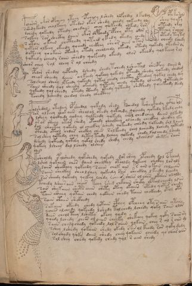

# Voynich Speculative Procedural Protocol — f76v

IMPORTANT: this is NOT a real or validated translation of the Voynich Manuscript. It is a speculative/procedural model that interprets EVA using a user-defined grammar to generate experimental recipes using safe, known edible substitutes.

This file is generated automatically from IVTFF/EVA transliteration plus a user-defined procedural grammar.



## Page / Folio
- currier: B
- folio: f76v
- page_number: 150
- section: biological

## EVA Text (Transliteration)
```text
polarar okor opcheey yteey opchaly lshedy qofchdal lkodol opa korols
sshedy keedy cholkeeey otedor okor shedy chedy qokeedy oly shey qoyky
dchedy qokeedy oteedy chedaiin chey qokeedy olkedy ror oteedy okal
salkeey sor shecthy daiin okor chpchedy cpchy oty olor otchy r alchl
s otain okain chcthedy qoteed y kedy okedy chedy otedy teyteg
qotees olkeey okeedy qoeeedy chckhey sheor aiin otar cheedy lchedy
doteey qo okaiin oteedy otedy cheolchdy okeedy otedy qokedy okedar da
qokeedy ochedy roiin sheedy qokeedy okeedy olor okeedy qolkchey r [o:a]l
sheor chey ral cheey r al cheedy
cphdor shedal qopchdy dshedy shedy tchedy lsheetal shecphy daiin dy
cheor sheedy daiin oekeedy qokeey qokedy oteedy shedy qokedy shedam
solsheol sheey lteedy qokeedy qotal chedy checthy otedeey qokol chedy deey
saiin sheedy qol sheedy okeeedy qoteedy chedy qotedy oleeedy qoteedy lo
qokeedy qol cheedy otedy cthedy otedy qoteedy shcthedy qoeekeedy deedy
tchedy lsheedy chedal chedy checthey
polshdal otedair opshedal qokedy shedy fschedal tsheokeedy oshepols
sar olkeey shokaiin sheolol otedy qekchdy qoeeedy qokedy lkedy chdy
lshey qockhedy qodeey qolkeedy qokedy chol chedchey daiin olkedy
or as sheey otar shedy otchedy checkhey olchedy checkhy checkhy lky
dol sheetey qokedy ol checkhy lshedy qokeedy cheedy qokeedy shl loiii@175;
cthedy oteol chdar chckhy chees s[a:o]lkchdy chey lcheedy lchedy qoteedy
sol shey qotedy chey dytey teedy lchey qokedy chedy lal chedy lchedy
dchedy qokeedy qotchy qokol shedy shedy chedy olched[?:r] shetey saiin
qokeey lsheey dal lchedy olshey
psheoldy opalshedy qokshedy qokedy dor shey opchedy dal so fcham
dshol qokaiin ches daiin checkhy oteoldy qokeey chckhy lar aly
daiin shckhey qokeedy saiin chek ain r ain o kan chl[a:o]iiin
saiin sheckhy cheolchey qokedy sair sheckhy l keedy lchedy
sar sheedy qokeedy qolkey lchdy schees shees al ches okaiin alaldy
tchedy lshees aiin chees tchy rshed chkaiin sheky shtal cheedy lsan
sair shekaiiin shets aiiin shety otey okaiin otedy qotar chedy
tain sheey qotain chedy qokaiin chedy taiin chckhedy otol oty
saiin otaiin shckhedy
sakaiin okeedy chedy qotain cphey opcheey oty saiin otary
ychees alchedy qokeedy lshedy tolchedy lchedy qoky saiin olor
daiin cheol teey lshety okeey qeedy
qoeedy lchedy chees ol oiiin chchky shekeey qokey qoky saiin sy
saiin chedy shedy qokeedy lol saiiin qokain chey r al r aiin dl
sshey lshedy qokaiin shedy okedy san ol keedy sor qoky dedy
sol shedy qoky daiin shedy chey qokaiin cheedy qo char aiin
sol shey chedy qokedy chedy qol r aiin shedy
```

## Domain Context (Heuristic; Not a Translation)

This section summarizes recurring **basewords** in this IVTFF domain and shows simple substring evidence that the token markers used by the procedural grammar occur inside frequent words.

Any Italian anagram / English gloss is a best-effort lexicon match, not a decipherment.


### Associated basewords (non-generic; top by frequency in this domain)
- `qokain` (count=158) → Italian anagram `acconi`; English: [n/a]
- `qokal` (count=102) → Italian anagram `calco`; English: cast (of sculpture)
- `daiin` (count=81) → Italian anagram `piani`; English: plans (arrangements)
- `qokaiin` (count=81) → Italian anagram `ciancio`; English: [n/a]
- `qokar` (count=45) → Italian anagram `carco`; English: [n/a]
- `okain` (count=40) → Italian anagram `acino`; English: a berry
- `okaiin` (count=31) → Italian anagram `coniai`; English: [n/a]
- `saiin` (count=30) → Italian anagram `asini`; English: [n/a]
- `olkain` (count=26) → Italian anagram `alcino`; English: smart, clever, intelligent, bright
- `qotal` (count=25) → Italian anagram `colta`; English: [n/a]
- `otain` (count=23) → Italian anagram `anito`; English: [n/a]
- `qotain` (count=20) → Italian anagram `antico`; English: ancient
- `qotar` (count=16) → Italian anagram `corta`; English: [n/a]
- `qotaiin` (count=13) → Italian anagram `cationi`; English: [n/a]
- `kaiin` (count=7) → Italian anagram `acini`; English: [n/a]

### Marker evidence (substring in frequent basewords)
- `qo`: 49 basewords; examples: `qokain`, `qokedy`, `qokeedy`, `qol`, `qokal`, `qokaiin`
- `q`: 50 basewords; examples: `qokain`, `qokedy`, `qokeedy`, `qol`, `qokal`, `qokaiin`
- `o`: 173 basewords; examples: `ol`, `qokain`, `qokedy`, `qokeedy`, `qol`, `qokal`
- `k`: 114 basewords; examples: `qokain`, `qokedy`, `qokeedy`, `qokal`, `qokaiin`, `qokeey`
- `t`: 77 basewords; examples: `otedy`, `qotedy`, `qoteedy`, `qoty`, `qotal`, `otain`
- `p`: 11 basewords; examples: `pchedy`, `opchedy`, `pol`, `qopchedy`, `pchedar`, `opchey`
- `ch`: 93 basewords; examples: `chedy`, `chey`, `lchedy`, `cheey`, `chckhy`, `cheol`
- `sh`: 41 basewords; examples: `shedy`, `shey`, `sheedy`, `sheey`, `sheol`, `shckhy`
- `cth`: 9 basewords; examples: `chcthy`, `checthy`, `shcthy`, `shecthy`, `cthedy`, `cthey`
- `ckh`: 12 basewords; examples: `chckhy`, `shckhy`, `checkhy`, `sheckhy`, `chckhey`, `chckhdy`
- `cph`: 1 basewords; examples: `cphol`
- `dy`: 63 basewords; examples: `shedy`, `chedy`, `qokedy`, `qokeedy`, `dy`, `lchedy`
- `iin`: 27 basewords; examples: `daiin`, `qokaiin`, `aiin`, `okaiin`, `saiin`, `qotaiin`
- `aiin`: 21 basewords; examples: `daiin`, `qokaiin`, `aiin`, `okaiin`, `saiin`, `qotaiin`

## Recipes Index (This Page)
- [f76v.1,@P0](#f76v-1-f76v-1-p0)
- [f76v.2,+P0](#f76v-2-f76v-2-p0)
- [f76v.3,+P0](#f76v-3-f76v-3-p0)
- [f76v.4,+P0](#f76v-4-f76v-4-p0)
- [f76v.5,+P0](#f76v-5-f76v-5-p0)
- [f76v.6,+P0](#f76v-6-f76v-6-p0)
- [f76v.7,+P0](#f76v-7-f76v-7-p0)
- [f76v.8,+P0](#f76v-8-f76v-8-p0)
- [f76v.9,+P0](#f76v-9-f76v-9-p0)
- [f76v.10,+P0](#f76v-10-f76v-10-p0)
- [f76v.11,+P0](#f76v-11-f76v-11-p0)
- [f76v.12,+P0](#f76v-12-f76v-12-p0)
- [f76v.13,+P0](#f76v-13-f76v-13-p0)
- [f76v.14,+P0](#f76v-14-f76v-14-p0)
- [f76v.15,+P0](#f76v-15-f76v-15-p0)
- [f76v.16,+P0](#f76v-16-f76v-16-p0)
- [f76v.17,+P0](#f76v-17-f76v-17-p0)
- [f76v.18,+P0](#f76v-18-f76v-18-p0)
- [f76v.19,+P0](#f76v-19-f76v-19-p0)
- [f76v.20,+P0](#f76v-20-f76v-20-p0)
- [f76v.21,+P0](#f76v-21-f76v-21-p0)
- [f76v.22,+P0](#f76v-22-f76v-22-p0)
- [f76v.23,+P0](#f76v-23-f76v-23-p0)
- [f76v.24,+P0](#f76v-24-f76v-24-p0)
- [f76v.25,+P0](#f76v-25-f76v-25-p0)
- [f76v.26,+P0](#f76v-26-f76v-26-p0)
- [f76v.27,+P0](#f76v-27-f76v-27-p0)
- [f76v.28,+P0](#f76v-28-f76v-28-p0)
- [f76v.29,+P0](#f76v-29-f76v-29-p0)
- [f76v.30,+P0](#f76v-30-f76v-30-p0)
- [f76v.31,+P0](#f76v-31-f76v-31-p0)
- [f76v.32,+P0](#f76v-32-f76v-32-p0)
- [f76v.33,+P0](#f76v-33-f76v-33-p0)
- [f76v.34,+P0](#f76v-34-f76v-34-p0)
- [f76v.35,+P0](#f76v-35-f76v-35-p0)
- [f76v.36,+P0](#f76v-36-f76v-36-p0)
- [f76v.37,+P0](#f76v-37-f76v-37-p0)
- [f76v.38,+P0](#f76v-38-f76v-38-p0)
- [f76v.39,+P0](#f76v-39-f76v-39-p0)
- [f76v.40,+P0](#f76v-40-f76v-40-p0)
- [f76v.41,+P0](#f76v-41-f76v-41-p0)

## Line Glosses (Procedural Gloss Only; Not a Translation)

<a id="f76v-1-f76v-1-p0"></a>

### f76v.1,@P0

EVA: polarar okor opcheey yteey opchaly lshedy qofchdal lkodol opa korols

Direct Gloss (Procedural, Not a Real Translation):
- polarar: mix / transfer → add starter / activate → duration level 1 → state: phase transition/start
- okor: add fermentable sugars → mix / transfer
- opcheey: add main plant (safe substitute) → mix / transfer → add starter / activate → duration level 2 → state: active extraction
- yteey: apply heat/cooking → duration level 2 → state: active extraction
- opchaly: add main plant (safe substitute) → mix / transfer → add starter / activate → duration level 1 → state: phase transition/start
- lshedy: add secondary herb (safe substitute) → add starter / activate → duration level 1 → state: active extraction
- qofchdal: prepare liquid base → add main plant (safe substitute) → add aroma modifier → add starter / activate → duration level 1 → state: phase transition/start
- lkodol: add fermentable sugars → mix / transfer → add starter / activate
- opa: mix / transfer → add starter / activate → duration level 1 → state: phase transition/start
- korols: add fermentable sugars → mix / transfer

<a id="f76v-2-f76v-2-p0"></a>

### f76v.2,+P0

EVA: sshedy keedy cholkeeey otedor okor shedy chedy qokeedy oly shey qoyky

Direct Gloss (Procedural, Not a Real Translation):
- sshedy: add secondary herb (safe substitute) → add starter / activate → duration level 1 → state: active extraction
- keedy: add fermentable sugars → add starter / activate → duration level 2 → state: active extraction
- cholkeeey: add fermentable sugars → add main plant (safe substitute) → mix / transfer → duration level 3 → state: active extraction
- otedor: apply heat/cooking → mix / transfer → add starter / activate → duration level 1 → state: active extraction
- okor: add fermentable sugars → mix / transfer
- shedy: add secondary herb (safe substitute) → add starter / activate → duration level 1 → state: active extraction
- chedy: add main plant (safe substitute) → add starter / activate → duration level 1 → state: active extraction
- qokeedy: prepare liquid base → add fermentable sugars → add starter / activate → duration level 2 → state: active extraction
- oly: mix / transfer
- shey: add secondary herb (safe substitute) → duration level 1 → state: active extraction
- qoyky: prepare liquid base → add fermentable sugars

<a id="f76v-3-f76v-3-p0"></a>

### f76v.3,+P0

EVA: dchedy qokeedy oteedy chedaiin chey qokeedy olkedy ror oteedy okal

Direct Gloss (Procedural, Not a Real Translation):
- dchedy: add main plant (safe substitute) → add starter / activate → duration level 1 → state: active extraction
- qokeedy: prepare liquid base → add fermentable sugars → add starter / activate → duration level 2 → state: active extraction
- oteedy: apply heat/cooking → mix / transfer → add starter / activate → duration level 2 → state: active extraction
- chedaiin: add main plant (safe substitute) → add starter / activate → duration level 1 → state: active extraction → long phase
- chey: add main plant (safe substitute) → duration level 1 → state: active extraction
- qokeedy: prepare liquid base → add fermentable sugars → add starter / activate → duration level 2 → state: active extraction
- olkedy: add fermentable sugars → mix / transfer → add starter / activate → duration level 1 → state: active extraction
- ror: mix / transfer
- oteedy: apply heat/cooking → mix / transfer → add starter / activate → duration level 2 → state: active extraction
- okal: add fermentable sugars → mix / transfer → duration level 1 → state: phase transition/start

<a id="f76v-4-f76v-4-p0"></a>

### f76v.4,+P0

EVA: salkeey sor shecthy daiin okor chpchedy cpchy oty olor otchy r alchl

Direct Gloss (Procedural, Not a Real Translation):
- salkeey: add fermentable sugars → duration level 1 → state: phase transition/start
- sor: mix / transfer
- shecthy: add secondary herb (safe substitute) → add complex herbal compound (safe blend) → duration level 1 → state: active extraction
- daiin: add starter / activate → duration level 1 → state: phase transition/start → long phase
- okor: add fermentable sugars → mix / transfer
- chpchedy: add main plant (safe substitute) → add starter / activate → duration level 1 → state: active extraction
- cpchy: add main plant (safe substitute) → add starter / activate
- oty: apply heat/cooking → mix / transfer
- olor: mix / transfer
- otchy: apply heat/cooking → add main plant (safe substitute) → mix / transfer
- r: [unparsed]
- alchl: add main plant (safe substitute) → duration level 1 → state: phase transition/start

<a id="f76v-5-f76v-5-p0"></a>

### f76v.5,+P0

EVA: s otain okain chcthedy qoteed y kedy okedy chedy otedy teyteg

Direct Gloss (Procedural, Not a Real Translation):
- s: [unparsed]
- otain: apply heat/cooking → mix / transfer → duration level 1 → state: phase transition/start
- okain: add fermentable sugars → mix / transfer → duration level 1 → state: phase transition/start
- chcthedy: add main plant (safe substitute) → add starter / activate → add complex herbal compound (safe blend) → duration level 1 → state: active extraction
- qoteed: prepare liquid base → apply heat/cooking → add starter / activate → duration level 2 → state: active extraction
- y: [unparsed]
- kedy: add fermentable sugars → add starter / activate → duration level 1 → state: active extraction
- okedy: add fermentable sugars → mix / transfer → add starter / activate → duration level 1 → state: active extraction
- chedy: add main plant (safe substitute) → add starter / activate → duration level 1 → state: active extraction
- otedy: apply heat/cooking → mix / transfer → add starter / activate → duration level 1 → state: active extraction
- teyteg: apply heat/cooking → duration level 1 → state: active extraction

<a id="f76v-6-f76v-6-p0"></a>

### f76v.6,+P0

EVA: qotees olkeey okeedy qoeeedy chckhey sheor aiin otar cheedy lchedy

Direct Gloss (Procedural, Not a Real Translation):
- qotees: prepare liquid base → apply heat/cooking → duration level 2 → state: active extraction
- olkeey: add fermentable sugars → mix / transfer → duration level 2 → state: active extraction
- okeedy: add fermentable sugars → mix / transfer → add starter / activate → duration level 2 → state: active extraction
- qoeeedy: prepare liquid base → add starter / activate → duration level 3 → state: active extraction
- chckhey: add main plant (safe substitute) → add complex herbal compound (safe blend) → duration level 1 → state: active extraction
- sheor: add secondary herb (safe substitute) → mix / transfer → duration level 1 → state: active extraction
- aiin: duration level 1 → state: phase transition/start → long phase
- otar: apply heat/cooking → mix / transfer → duration level 1 → state: phase transition/start
- cheedy: add main plant (safe substitute) → add starter / activate → duration level 2 → state: active extraction
- lchedy: add main plant (safe substitute) → add starter / activate → duration level 1 → state: active extraction

<a id="f76v-7-f76v-7-p0"></a>

### f76v.7,+P0

EVA: doteey qo okaiin oteedy otedy cheolchdy okeedy otedy qokedy okedar da

Direct Gloss (Procedural, Not a Real Translation):
- doteey: apply heat/cooking → mix / transfer → add starter / activate → duration level 2 → state: active extraction
- qo: prepare liquid base
- okaiin: add fermentable sugars → mix / transfer → duration level 1 → state: phase transition/start → long phase
- oteedy: apply heat/cooking → mix / transfer → add starter / activate → duration level 2 → state: active extraction
- otedy: apply heat/cooking → mix / transfer → add starter / activate → duration level 1 → state: active extraction
- cheolchdy: add main plant (safe substitute) → mix / transfer → add starter / activate → duration level 1 → state: active extraction
- okeedy: add fermentable sugars → mix / transfer → add starter / activate → duration level 2 → state: active extraction
- otedy: apply heat/cooking → mix / transfer → add starter / activate → duration level 1 → state: active extraction
- qokedy: prepare liquid base → add fermentable sugars → add starter / activate → duration level 1 → state: active extraction
- okedar: add fermentable sugars → mix / transfer → add starter / activate → duration level 1 → state: active extraction
- da: add starter / activate → duration level 1 → state: phase transition/start

<a id="f76v-8-f76v-8-p0"></a>

### f76v.8,+P0

EVA: qokeedy ochedy roiin sheedy qokeedy okeedy olor okeedy qolkchey r [o:a]l

Direct Gloss (Procedural, Not a Real Translation):
- qokeedy: prepare liquid base → add fermentable sugars → add starter / activate → duration level 2 → state: active extraction
- ochedy: add main plant (safe substitute) → mix / transfer → add starter / activate → duration level 1 → state: active extraction
- roiin: mix / transfer → duration level 2 → state: cooling/rest → medium phase
- sheedy: add secondary herb (safe substitute) → add starter / activate → duration level 2 → state: active extraction
- qokeedy: prepare liquid base → add fermentable sugars → add starter / activate → duration level 2 → state: active extraction
- okeedy: add fermentable sugars → mix / transfer → add starter / activate → duration level 2 → state: active extraction
- olor: mix / transfer
- okeedy: add fermentable sugars → mix / transfer → add starter / activate → duration level 2 → state: active extraction
- qolkchey: prepare liquid base → add fermentable sugars → add main plant (safe substitute) → duration level 1 → state: active extraction
- r: [unparsed]
- o: mix / transfer
- a: duration level 1 → state: phase transition/start
- l: [unparsed]

<a id="f76v-9-f76v-9-p0"></a>

### f76v.9,+P0

EVA: sheor chey ral cheey r al cheedy

Direct Gloss (Procedural, Not a Real Translation):
- sheor: add secondary herb (safe substitute) → mix / transfer → duration level 1 → state: active extraction
- chey: add main plant (safe substitute) → duration level 1 → state: active extraction
- ral: duration level 1 → state: phase transition/start
- cheey: add main plant (safe substitute) → duration level 2 → state: active extraction
- r: [unparsed]
- al: duration level 1 → state: phase transition/start
- cheedy: add main plant (safe substitute) → add starter / activate → duration level 2 → state: active extraction

<a id="f76v-10-f76v-10-p0"></a>

### f76v.10,+P0

EVA: cphdor shedal qopchdy dshedy shedy tchedy lsheetal shecphy daiin dy

Direct Gloss (Procedural, Not a Real Translation):
- cphdor: mix / transfer → add starter / activate → add complex herbal compound (safe blend)
- shedal: add secondary herb (safe substitute) → add starter / activate → duration level 1 → state: active extraction
- qopchdy: prepare liquid base → add main plant (safe substitute) → add starter / activate
- dshedy: add secondary herb (safe substitute) → add starter / activate → duration level 1 → state: active extraction
- shedy: add secondary herb (safe substitute) → add starter / activate → duration level 1 → state: active extraction
- tchedy: apply heat/cooking → add main plant (safe substitute) → add starter / activate → duration level 1 → state: active extraction
- lsheetal: apply heat/cooking → add secondary herb (safe substitute) → duration level 2 → state: active extraction
- shecphy: add secondary herb (safe substitute) → add complex herbal compound (safe blend) → duration level 1 → state: active extraction
- daiin: add starter / activate → duration level 1 → state: phase transition/start → long phase
- dy: add starter / activate

<a id="f76v-11-f76v-11-p0"></a>

### f76v.11,+P0

EVA: cheor sheedy daiin oekeedy qokeey qokedy oteedy shedy qokedy shedam

Direct Gloss (Procedural, Not a Real Translation):
- cheor: add main plant (safe substitute) → mix / transfer → duration level 1 → state: active extraction
- sheedy: add secondary herb (safe substitute) → add starter / activate → duration level 2 → state: active extraction
- daiin: add starter / activate → duration level 1 → state: phase transition/start → long phase
- oekeedy: add fermentable sugars → mix / transfer → add starter / activate → duration level 1 → state: active extraction
- qokeey: prepare liquid base → add fermentable sugars → duration level 2 → state: active extraction
- qokedy: prepare liquid base → add fermentable sugars → add starter / activate → duration level 1 → state: active extraction
- oteedy: apply heat/cooking → mix / transfer → add starter / activate → duration level 2 → state: active extraction
- shedy: add secondary herb (safe substitute) → add starter / activate → duration level 1 → state: active extraction
- qokedy: prepare liquid base → add fermentable sugars → add starter / activate → duration level 1 → state: active extraction
- shedam: add secondary herb (safe substitute) → add starter / activate → duration level 1 → state: active extraction

<a id="f76v-12-f76v-12-p0"></a>

### f76v.12,+P0

EVA: solsheol sheey lteedy qokeedy qotal chedy checthy otedeey qokol chedy deey

Direct Gloss (Procedural, Not a Real Translation):
- solsheol: add secondary herb (safe substitute) → mix / transfer → duration level 1 → state: active extraction
- sheey: add secondary herb (safe substitute) → duration level 2 → state: active extraction
- lteedy: apply heat/cooking → add starter / activate → duration level 2 → state: active extraction
- qokeedy: prepare liquid base → add fermentable sugars → add starter / activate → duration level 2 → state: active extraction
- qotal: prepare liquid base → apply heat/cooking → duration level 1 → state: phase transition/start
- chedy: add main plant (safe substitute) → add starter / activate → duration level 1 → state: active extraction
- checthy: add main plant (safe substitute) → add complex herbal compound (safe blend) → duration level 1 → state: active extraction
- otedeey: apply heat/cooking → mix / transfer → add starter / activate → duration level 1 → state: active extraction
- qokol: prepare liquid base → add fermentable sugars → mix / transfer
- chedy: add main plant (safe substitute) → add starter / activate → duration level 1 → state: active extraction
- deey: add starter / activate → duration level 2 → state: active extraction

<a id="f76v-13-f76v-13-p0"></a>

### f76v.13,+P0

EVA: saiin sheedy qol sheedy okeeedy qoteedy chedy qotedy oleeedy qoteedy lo

Direct Gloss (Procedural, Not a Real Translation):
- saiin: duration level 1 → state: phase transition/start → long phase
- sheedy: add secondary herb (safe substitute) → add starter / activate → duration level 2 → state: active extraction
- qol: prepare liquid base
- sheedy: add secondary herb (safe substitute) → add starter / activate → duration level 2 → state: active extraction
- okeeedy: add fermentable sugars → mix / transfer → add starter / activate → duration level 3 → state: active extraction
- qoteedy: prepare liquid base → apply heat/cooking → add starter / activate → duration level 2 → state: active extraction
- chedy: add main plant (safe substitute) → add starter / activate → duration level 1 → state: active extraction
- qotedy: prepare liquid base → apply heat/cooking → add starter / activate → duration level 1 → state: active extraction
- oleeedy: mix / transfer → add starter / activate → duration level 3 → state: active extraction
- qoteedy: prepare liquid base → apply heat/cooking → add starter / activate → duration level 2 → state: active extraction
- lo: mix / transfer

<a id="f76v-14-f76v-14-p0"></a>

### f76v.14,+P0

EVA: qokeedy qol cheedy otedy cthedy otedy qoteedy shcthedy qoeekeedy deedy

Direct Gloss (Procedural, Not a Real Translation):
- qokeedy: prepare liquid base → add fermentable sugars → add starter / activate → duration level 2 → state: active extraction
- qol: prepare liquid base
- cheedy: add main plant (safe substitute) → add starter / activate → duration level 2 → state: active extraction
- otedy: apply heat/cooking → mix / transfer → add starter / activate → duration level 1 → state: active extraction
- cthedy: add starter / activate → add complex herbal compound (safe blend) → duration level 1 → state: active extraction
- otedy: apply heat/cooking → mix / transfer → add starter / activate → duration level 1 → state: active extraction
- qoteedy: prepare liquid base → apply heat/cooking → add starter / activate → duration level 2 → state: active extraction
- shcthedy: add secondary herb (safe substitute) → add starter / activate → add complex herbal compound (safe blend) → duration level 1 → state: active extraction
- qoeekeedy: prepare liquid base → add fermentable sugars → add starter / activate → duration level 2 → state: active extraction
- deedy: add starter / activate → duration level 2 → state: active extraction

<a id="f76v-15-f76v-15-p0"></a>

### f76v.15,+P0

EVA: tchedy lsheedy chedal chedy checthey

Direct Gloss (Procedural, Not a Real Translation):
- tchedy: apply heat/cooking → add main plant (safe substitute) → add starter / activate → duration level 1 → state: active extraction
- lsheedy: add secondary herb (safe substitute) → add starter / activate → duration level 2 → state: active extraction
- chedal: add main plant (safe substitute) → add starter / activate → duration level 1 → state: active extraction
- chedy: add main plant (safe substitute) → add starter / activate → duration level 1 → state: active extraction
- checthey: add main plant (safe substitute) → add complex herbal compound (safe blend) → duration level 1 → state: active extraction

<a id="f76v-16-f76v-16-p0"></a>

### f76v.16,+P0

EVA: polshdal otedair opshedal qokedy shedy fschedal tsheokeedy oshepols

Direct Gloss (Procedural, Not a Real Translation):
- polshdal: add secondary herb (safe substitute) → mix / transfer → add starter / activate → duration level 1 → state: phase transition/start
- otedair: apply heat/cooking → mix / transfer → add starter / activate → duration level 1 → state: active extraction
- opshedal: add secondary herb (safe substitute) → mix / transfer → add starter / activate → duration level 1 → state: active extraction
- qokedy: prepare liquid base → add fermentable sugars → add starter / activate → duration level 1 → state: active extraction
- shedy: add secondary herb (safe substitute) → add starter / activate → duration level 1 → state: active extraction
- fschedal: add main plant (safe substitute) → add aroma modifier → add starter / activate → duration level 1 → state: active extraction
- tsheokeedy: add fermentable sugars → apply heat/cooking → add secondary herb (safe substitute) → mix / transfer → add starter / activate → duration level 1 → state: active extraction
- oshepols: add secondary herb (safe substitute) → mix / transfer → add starter / activate → duration level 1 → state: active extraction

<a id="f76v-17-f76v-17-p0"></a>

### f76v.17,+P0

EVA: sar olkeey shokaiin sheolol otedy qekchdy qoeeedy qokedy lkedy chdy

Direct Gloss (Procedural, Not a Real Translation):
- sar: duration level 1 → state: phase transition/start
- olkeey: add fermentable sugars → mix / transfer → duration level 2 → state: active extraction
- shokaiin: add fermentable sugars → add secondary herb (safe substitute) → mix / transfer → duration level 1 → state: phase transition/start → long phase
- sheolol: add secondary herb (safe substitute) → mix / transfer → duration level 1 → state: active extraction
- otedy: apply heat/cooking → mix / transfer → add starter / activate → duration level 1 → state: active extraction
- qekchdy: prepare base (generic) → add fermentable sugars → add main plant (safe substitute) → add starter / activate → duration level 1 → state: active extraction
- qoeeedy: prepare liquid base → add starter / activate → duration level 3 → state: active extraction
- qokedy: prepare liquid base → add fermentable sugars → add starter / activate → duration level 1 → state: active extraction
- lkedy: add fermentable sugars → add starter / activate → duration level 1 → state: active extraction
- chdy: add main plant (safe substitute) → add starter / activate

<a id="f76v-18-f76v-18-p0"></a>

### f76v.18,+P0

EVA: lshey qockhedy qodeey qolkeedy qokedy chol chedchey daiin olkedy

Direct Gloss (Procedural, Not a Real Translation):
- lshey: add secondary herb (safe substitute) → duration level 1 → state: active extraction
- qockhedy: prepare liquid base → add starter / activate → add complex herbal compound (safe blend) → duration level 1 → state: active extraction
- qodeey: prepare liquid base → add starter / activate → duration level 2 → state: active extraction
- qolkeedy: prepare liquid base → add fermentable sugars → add starter / activate → duration level 2 → state: active extraction
- qokedy: prepare liquid base → add fermentable sugars → add starter / activate → duration level 1 → state: active extraction
- chol: add main plant (safe substitute) → mix / transfer
- chedchey: add main plant (safe substitute) → add starter / activate → duration level 1 → state: active extraction
- daiin: add starter / activate → duration level 1 → state: phase transition/start → long phase
- olkedy: add fermentable sugars → mix / transfer → add starter / activate → duration level 1 → state: active extraction

<a id="f76v-19-f76v-19-p0"></a>

### f76v.19,+P0

EVA: or as sheey otar shedy otchedy checkhey olchedy checkhy checkhy lky

Direct Gloss (Procedural, Not a Real Translation):
- or: mix / transfer
- as: duration level 1 → state: phase transition/start
- sheey: add secondary herb (safe substitute) → duration level 2 → state: active extraction
- otar: apply heat/cooking → mix / transfer → duration level 1 → state: phase transition/start
- shedy: add secondary herb (safe substitute) → add starter / activate → duration level 1 → state: active extraction
- otchedy: apply heat/cooking → add main plant (safe substitute) → mix / transfer → add starter / activate → duration level 1 → state: active extraction
- checkhey: add main plant (safe substitute) → add complex herbal compound (safe blend) → duration level 1 → state: active extraction
- olchedy: add main plant (safe substitute) → mix / transfer → add starter / activate → duration level 1 → state: active extraction
- checkhy: add main plant (safe substitute) → add complex herbal compound (safe blend) → duration level 1 → state: active extraction
- checkhy: add main plant (safe substitute) → add complex herbal compound (safe blend) → duration level 1 → state: active extraction
- lky: add fermentable sugars

<a id="f76v-20-f76v-20-p0"></a>

### f76v.20,+P0

EVA: dol sheetey qokedy ol checkhy lshedy qokeedy cheedy qokeedy shl loiii@175;

Direct Gloss (Procedural, Not a Real Translation):
- dol: mix / transfer → add starter / activate
- sheetey: apply heat/cooking → add secondary herb (safe substitute) → duration level 2 → state: active extraction
- qokedy: prepare liquid base → add fermentable sugars → add starter / activate → duration level 1 → state: active extraction
- ol: mix / transfer
- checkhy: add main plant (safe substitute) → add complex herbal compound (safe blend) → duration level 1 → state: active extraction
- lshedy: add secondary herb (safe substitute) → add starter / activate → duration level 1 → state: active extraction
- qokeedy: prepare liquid base → add fermentable sugars → add starter / activate → duration level 2 → state: active extraction
- cheedy: add main plant (safe substitute) → add starter / activate → duration level 2 → state: active extraction
- qokeedy: prepare liquid base → add fermentable sugars → add starter / activate → duration level 2 → state: active extraction
- shl: add secondary herb (safe substitute)
- loiii: mix / transfer → duration level 3 → state: cooling/rest

<a id="f76v-21-f76v-21-p0"></a>

### f76v.21,+P0

EVA: cthedy oteol chdar chckhy chees s[a:o]lkchdy chey lcheedy lchedy qoteedy

Direct Gloss (Procedural, Not a Real Translation):
- cthedy: add starter / activate → add complex herbal compound (safe blend) → duration level 1 → state: active extraction
- oteol: apply heat/cooking → mix / transfer → duration level 1 → state: active extraction
- chdar: add main plant (safe substitute) → add starter / activate → duration level 1 → state: phase transition/start
- chckhy: add main plant (safe substitute) → add complex herbal compound (safe blend)
- chees: add main plant (safe substitute) → duration level 2 → state: active extraction
- s: [unparsed]
- a: duration level 1 → state: phase transition/start
- o: mix / transfer
- lkchdy: add fermentable sugars → add main plant (safe substitute) → add starter / activate
- chey: add main plant (safe substitute) → duration level 1 → state: active extraction
- lcheedy: add main plant (safe substitute) → add starter / activate → duration level 2 → state: active extraction
- lchedy: add main plant (safe substitute) → add starter / activate → duration level 1 → state: active extraction
- qoteedy: prepare liquid base → apply heat/cooking → add starter / activate → duration level 2 → state: active extraction

<a id="f76v-22-f76v-22-p0"></a>

### f76v.22,+P0

EVA: sol shey qotedy chey dytey teedy lchey qokedy chedy lal chedy lchedy

Direct Gloss (Procedural, Not a Real Translation):
- sol: mix / transfer
- shey: add secondary herb (safe substitute) → duration level 1 → state: active extraction
- qotedy: prepare liquid base → apply heat/cooking → add starter / activate → duration level 1 → state: active extraction
- chey: add main plant (safe substitute) → duration level 1 → state: active extraction
- dytey: apply heat/cooking → add starter / activate → duration level 1 → state: active extraction
- teedy: apply heat/cooking → add starter / activate → duration level 2 → state: active extraction
- lchey: add main plant (safe substitute) → duration level 1 → state: active extraction
- qokedy: prepare liquid base → add fermentable sugars → add starter / activate → duration level 1 → state: active extraction
- chedy: add main plant (safe substitute) → add starter / activate → duration level 1 → state: active extraction
- lal: duration level 1 → state: phase transition/start
- chedy: add main plant (safe substitute) → add starter / activate → duration level 1 → state: active extraction
- lchedy: add main plant (safe substitute) → add starter / activate → duration level 1 → state: active extraction

<a id="f76v-23-f76v-23-p0"></a>

### f76v.23,+P0

EVA: dchedy qokeedy qotchy qokol shedy shedy chedy olched[?:r] shetey saiin

Direct Gloss (Procedural, Not a Real Translation):
- dchedy: add main plant (safe substitute) → add starter / activate → duration level 1 → state: active extraction
- qokeedy: prepare liquid base → add fermentable sugars → add starter / activate → duration level 2 → state: active extraction
- qotchy: prepare liquid base → apply heat/cooking → add main plant (safe substitute)
- qokol: prepare liquid base → add fermentable sugars → mix / transfer
- shedy: add secondary herb (safe substitute) → add starter / activate → duration level 1 → state: active extraction
- shedy: add secondary herb (safe substitute) → add starter / activate → duration level 1 → state: active extraction
- chedy: add main plant (safe substitute) → add starter / activate → duration level 1 → state: active extraction
- olched: add main plant (safe substitute) → mix / transfer → add starter / activate → duration level 1 → state: active extraction
- r: [unparsed]
- shetey: apply heat/cooking → add secondary herb (safe substitute) → duration level 1 → state: active extraction
- saiin: duration level 1 → state: phase transition/start → long phase

<a id="f76v-24-f76v-24-p0"></a>

### f76v.24,+P0

EVA: qokeey lsheey dal lchedy olshey

Direct Gloss (Procedural, Not a Real Translation):
- qokeey: prepare liquid base → add fermentable sugars → duration level 2 → state: active extraction
- lsheey: add secondary herb (safe substitute) → duration level 2 → state: active extraction
- dal: add starter / activate → duration level 1 → state: phase transition/start
- lchedy: add main plant (safe substitute) → add starter / activate → duration level 1 → state: active extraction
- olshey: add secondary herb (safe substitute) → mix / transfer → duration level 1 → state: active extraction

<a id="f76v-25-f76v-25-p0"></a>

### f76v.25,+P0

EVA: psheoldy opalshedy qokshedy qokedy dor shey opchedy dal so fcham

Direct Gloss (Procedural, Not a Real Translation):
- psheoldy: add secondary herb (safe substitute) → mix / transfer → add starter / activate → duration level 1 → state: active extraction
- opalshedy: add secondary herb (safe substitute) → mix / transfer → add starter / activate → duration level 1 → state: phase transition/start
- qokshedy: prepare liquid base → add fermentable sugars → add secondary herb (safe substitute) → add starter / activate → duration level 1 → state: active extraction
- qokedy: prepare liquid base → add fermentable sugars → add starter / activate → duration level 1 → state: active extraction
- dor: mix / transfer → add starter / activate
- shey: add secondary herb (safe substitute) → duration level 1 → state: active extraction
- opchedy: add main plant (safe substitute) → mix / transfer → add starter / activate → duration level 1 → state: active extraction
- dal: add starter / activate → duration level 1 → state: phase transition/start
- so: mix / transfer
- fcham: add main plant (safe substitute) → add aroma modifier → duration level 1 → state: phase transition/start

<a id="f76v-26-f76v-26-p0"></a>

### f76v.26,+P0

EVA: dshol qokaiin ches daiin checkhy oteoldy qokeey chckhy lar aly

Direct Gloss (Procedural, Not a Real Translation):
- dshol: add secondary herb (safe substitute) → mix / transfer → add starter / activate
- qokaiin: prepare liquid base → add fermentable sugars → duration level 1 → state: phase transition/start → long phase
- ches: add main plant (safe substitute) → duration level 1 → state: active extraction
- daiin: add starter / activate → duration level 1 → state: phase transition/start → long phase
- checkhy: add main plant (safe substitute) → add complex herbal compound (safe blend) → duration level 1 → state: active extraction
- oteoldy: apply heat/cooking → mix / transfer → add starter / activate → duration level 1 → state: active extraction
- qokeey: prepare liquid base → add fermentable sugars → duration level 2 → state: active extraction
- chckhy: add main plant (safe substitute) → add complex herbal compound (safe blend)
- lar: duration level 1 → state: phase transition/start
- aly: duration level 1 → state: phase transition/start

<a id="f76v-27-f76v-27-p0"></a>

### f76v.27,+P0

EVA: daiin shckhey qokeedy saiin chek ain r ain o kan chl[a:o]iiin

Direct Gloss (Procedural, Not a Real Translation):
- daiin: add starter / activate → duration level 1 → state: phase transition/start → long phase
- shckhey: add secondary herb (safe substitute) → add complex herbal compound (safe blend) → duration level 1 → state: active extraction
- qokeedy: prepare liquid base → add fermentable sugars → add starter / activate → duration level 2 → state: active extraction
- saiin: duration level 1 → state: phase transition/start → long phase
- chek: add fermentable sugars → add main plant (safe substitute) → duration level 1 → state: active extraction
- ain: duration level 1 → state: phase transition/start
- r: [unparsed]
- ain: duration level 1 → state: phase transition/start
- o: mix / transfer
- kan: add fermentable sugars → duration level 1 → state: phase transition/start
- chl: add main plant (safe substitute)
- a: duration level 1 → state: phase transition/start
- o: mix / transfer
- iiin: duration level 3 → state: cooling/rest → medium phase

<a id="f76v-28-f76v-28-p0"></a>

### f76v.28,+P0

EVA: saiin sheckhy cheolchey qokedy sair sheckhy l keedy lchedy

Direct Gloss (Procedural, Not a Real Translation):
- saiin: duration level 1 → state: phase transition/start → long phase
- sheckhy: add secondary herb (safe substitute) → add complex herbal compound (safe blend) → duration level 1 → state: active extraction
- cheolchey: add main plant (safe substitute) → mix / transfer → duration level 1 → state: active extraction
- qokedy: prepare liquid base → add fermentable sugars → add starter / activate → duration level 1 → state: active extraction
- sair: duration level 1 → state: phase transition/start
- sheckhy: add secondary herb (safe substitute) → add complex herbal compound (safe blend) → duration level 1 → state: active extraction
- l: [unparsed]
- keedy: add fermentable sugars → add starter / activate → duration level 2 → state: active extraction
- lchedy: add main plant (safe substitute) → add starter / activate → duration level 1 → state: active extraction

<a id="f76v-29-f76v-29-p0"></a>

### f76v.29,+P0

EVA: sar sheedy qokeedy qolkey lchdy schees shees al ches okaiin alaldy

Direct Gloss (Procedural, Not a Real Translation):
- sar: duration level 1 → state: phase transition/start
- sheedy: add secondary herb (safe substitute) → add starter / activate → duration level 2 → state: active extraction
- qokeedy: prepare liquid base → add fermentable sugars → add starter / activate → duration level 2 → state: active extraction
- qolkey: prepare liquid base → add fermentable sugars → duration level 1 → state: active extraction
- lchdy: add main plant (safe substitute) → add starter / activate
- schees: add main plant (safe substitute) → duration level 2 → state: active extraction
- shees: add secondary herb (safe substitute) → duration level 2 → state: active extraction
- al: duration level 1 → state: phase transition/start
- ches: add main plant (safe substitute) → duration level 1 → state: active extraction
- okaiin: add fermentable sugars → mix / transfer → duration level 1 → state: phase transition/start → long phase
- alaldy: add starter / activate → duration level 1 → state: phase transition/start

<a id="f76v-30-f76v-30-p0"></a>

### f76v.30,+P0

EVA: tchedy lshees aiin chees tchy rshed chkaiin sheky shtal cheedy lsan

Direct Gloss (Procedural, Not a Real Translation):
- tchedy: apply heat/cooking → add main plant (safe substitute) → add starter / activate → duration level 1 → state: active extraction
- lshees: add secondary herb (safe substitute) → duration level 2 → state: active extraction
- aiin: duration level 1 → state: phase transition/start → long phase
- chees: add main plant (safe substitute) → duration level 2 → state: active extraction
- tchy: apply heat/cooking → add main plant (safe substitute)
- rshed: add secondary herb (safe substitute) → add starter / activate → duration level 1 → state: active extraction
- chkaiin: add fermentable sugars → add main plant (safe substitute) → duration level 1 → state: phase transition/start → long phase
- sheky: add fermentable sugars → add secondary herb (safe substitute) → duration level 1 → state: active extraction
- shtal: apply heat/cooking → add secondary herb (safe substitute) → duration level 1 → state: phase transition/start
- cheedy: add main plant (safe substitute) → add starter / activate → duration level 2 → state: active extraction
- lsan: duration level 1 → state: phase transition/start

<a id="f76v-31-f76v-31-p0"></a>

### f76v.31,+P0

EVA: sair shekaiiin shets aiiin shety otey okaiin otedy qotar chedy

Direct Gloss (Procedural, Not a Real Translation):
- sair: duration level 1 → state: phase transition/start
- shekaiiin: add fermentable sugars → add secondary herb (safe substitute) → duration level 1 → state: active extraction → medium phase
- shets: apply heat/cooking → add secondary herb (safe substitute) → duration level 1 → state: active extraction
- aiiin: duration level 1 → state: phase transition/start → medium phase
- shety: apply heat/cooking → add secondary herb (safe substitute) → duration level 1 → state: active extraction
- otey: apply heat/cooking → mix / transfer → duration level 1 → state: active extraction
- okaiin: add fermentable sugars → mix / transfer → duration level 1 → state: phase transition/start → long phase
- otedy: apply heat/cooking → mix / transfer → add starter / activate → duration level 1 → state: active extraction
- qotar: prepare liquid base → apply heat/cooking → duration level 1 → state: phase transition/start
- chedy: add main plant (safe substitute) → add starter / activate → duration level 1 → state: active extraction

<a id="f76v-32-f76v-32-p0"></a>

### f76v.32,+P0

EVA: tain sheey qotain chedy qokaiin chedy taiin chckhedy otol oty

Direct Gloss (Procedural, Not a Real Translation):
- tain: apply heat/cooking → duration level 1 → state: phase transition/start
- sheey: add secondary herb (safe substitute) → duration level 2 → state: active extraction
- qotain: prepare liquid base → apply heat/cooking → duration level 1 → state: phase transition/start
- chedy: add main plant (safe substitute) → add starter / activate → duration level 1 → state: active extraction
- qokaiin: prepare liquid base → add fermentable sugars → duration level 1 → state: phase transition/start → long phase
- chedy: add main plant (safe substitute) → add starter / activate → duration level 1 → state: active extraction
- taiin: apply heat/cooking → duration level 1 → state: phase transition/start → long phase
- chckhedy: add main plant (safe substitute) → add starter / activate → add complex herbal compound (safe blend) → duration level 1 → state: active extraction
- otol: apply heat/cooking → mix / transfer
- oty: apply heat/cooking → mix / transfer

<a id="f76v-33-f76v-33-p0"></a>

### f76v.33,+P0

EVA: saiin otaiin shckhedy

Direct Gloss (Procedural, Not a Real Translation):
- saiin: duration level 1 → state: phase transition/start → long phase
- otaiin: apply heat/cooking → mix / transfer → duration level 1 → state: phase transition/start → long phase
- shckhedy: add secondary herb (safe substitute) → add starter / activate → add complex herbal compound (safe blend) → duration level 1 → state: active extraction

<a id="f76v-34-f76v-34-p0"></a>

### f76v.34,+P0

EVA: sakaiin okeedy chedy qotain cphey opcheey oty saiin otary

Direct Gloss (Procedural, Not a Real Translation):
- sakaiin: add fermentable sugars → duration level 1 → state: phase transition/start → long phase
- okeedy: add fermentable sugars → mix / transfer → add starter / activate → duration level 2 → state: active extraction
- chedy: add main plant (safe substitute) → add starter / activate → duration level 1 → state: active extraction
- qotain: prepare liquid base → apply heat/cooking → duration level 1 → state: phase transition/start
- cphey: add complex herbal compound (safe blend) → duration level 1 → state: active extraction
- opcheey: add main plant (safe substitute) → mix / transfer → add starter / activate → duration level 2 → state: active extraction
- oty: apply heat/cooking → mix / transfer
- saiin: duration level 1 → state: phase transition/start → long phase
- otary: apply heat/cooking → mix / transfer → duration level 1 → state: phase transition/start

<a id="f76v-35-f76v-35-p0"></a>

### f76v.35,+P0

EVA: ychees alchedy qokeedy lshedy tolchedy lchedy qoky saiin olor

Direct Gloss (Procedural, Not a Real Translation):
- ychees: add main plant (safe substitute) → duration level 2 → state: active extraction
- alchedy: add main plant (safe substitute) → add starter / activate → duration level 1 → state: phase transition/start
- qokeedy: prepare liquid base → add fermentable sugars → add starter / activate → duration level 2 → state: active extraction
- lshedy: add secondary herb (safe substitute) → add starter / activate → duration level 1 → state: active extraction
- tolchedy: apply heat/cooking → add main plant (safe substitute) → mix / transfer → add starter / activate → duration level 1 → state: active extraction
- lchedy: add main plant (safe substitute) → add starter / activate → duration level 1 → state: active extraction
- qoky: prepare liquid base → add fermentable sugars
- saiin: duration level 1 → state: phase transition/start → long phase
- olor: mix / transfer

<a id="f76v-36-f76v-36-p0"></a>

### f76v.36,+P0

EVA: daiin cheol teey lshety okeey qeedy

Direct Gloss (Procedural, Not a Real Translation):
- daiin: add starter / activate → duration level 1 → state: phase transition/start → long phase
- cheol: add main plant (safe substitute) → mix / transfer → duration level 1 → state: active extraction
- teey: apply heat/cooking → duration level 2 → state: active extraction
- lshety: apply heat/cooking → add secondary herb (safe substitute) → duration level 1 → state: active extraction
- okeey: add fermentable sugars → mix / transfer → duration level 2 → state: active extraction
- qeedy: prepare base (generic) → add starter / activate → duration level 2 → state: active extraction

<a id="f76v-37-f76v-37-p0"></a>

### f76v.37,+P0

EVA: qoeedy lchedy chees ol oiiin chchky shekeey qokey qoky saiin sy

Direct Gloss (Procedural, Not a Real Translation):
- qoeedy: prepare liquid base → add starter / activate → duration level 2 → state: active extraction
- lchedy: add main plant (safe substitute) → add starter / activate → duration level 1 → state: active extraction
- chees: add main plant (safe substitute) → duration level 2 → state: active extraction
- ol: mix / transfer
- oiiin: mix / transfer → duration level 3 → state: cooling/rest → medium phase
- chchky: add fermentable sugars → add main plant (safe substitute)
- shekeey: add fermentable sugars → add secondary herb (safe substitute) → duration level 1 → state: active extraction
- qokey: prepare liquid base → add fermentable sugars → duration level 1 → state: active extraction
- qoky: prepare liquid base → add fermentable sugars
- saiin: duration level 1 → state: phase transition/start → long phase
- sy: [unparsed]

<a id="f76v-38-f76v-38-p0"></a>

### f76v.38,+P0

EVA: saiin chedy shedy qokeedy lol saiiin qokain chey r al r aiin dl

Direct Gloss (Procedural, Not a Real Translation):
- saiin: duration level 1 → state: phase transition/start → long phase
- chedy: add main plant (safe substitute) → add starter / activate → duration level 1 → state: active extraction
- shedy: add secondary herb (safe substitute) → add starter / activate → duration level 1 → state: active extraction
- qokeedy: prepare liquid base → add fermentable sugars → add starter / activate → duration level 2 → state: active extraction
- lol: mix / transfer
- saiiin: duration level 1 → state: phase transition/start → medium phase
- qokain: prepare liquid base → add fermentable sugars → duration level 1 → state: phase transition/start
- chey: add main plant (safe substitute) → duration level 1 → state: active extraction
- r: [unparsed]
- al: duration level 1 → state: phase transition/start
- r: [unparsed]
- aiin: duration level 1 → state: phase transition/start → long phase
- dl: add starter / activate

<a id="f76v-39-f76v-39-p0"></a>

### f76v.39,+P0

EVA: sshey lshedy qokaiin shedy okedy san ol keedy sor qoky dedy

Direct Gloss (Procedural, Not a Real Translation):
- sshey: add secondary herb (safe substitute) → duration level 1 → state: active extraction
- lshedy: add secondary herb (safe substitute) → add starter / activate → duration level 1 → state: active extraction
- qokaiin: prepare liquid base → add fermentable sugars → duration level 1 → state: phase transition/start → long phase
- shedy: add secondary herb (safe substitute) → add starter / activate → duration level 1 → state: active extraction
- okedy: add fermentable sugars → mix / transfer → add starter / activate → duration level 1 → state: active extraction
- san: duration level 1 → state: phase transition/start
- ol: mix / transfer
- keedy: add fermentable sugars → add starter / activate → duration level 2 → state: active extraction
- sor: mix / transfer
- qoky: prepare liquid base → add fermentable sugars
- dedy: add starter / activate → duration level 1 → state: active extraction

<a id="f76v-40-f76v-40-p0"></a>

### f76v.40,+P0

EVA: sol shedy qoky daiin shedy chey qokaiin cheedy qo char aiin

Direct Gloss (Procedural, Not a Real Translation):
- sol: mix / transfer
- shedy: add secondary herb (safe substitute) → add starter / activate → duration level 1 → state: active extraction
- qoky: prepare liquid base → add fermentable sugars
- daiin: add starter / activate → duration level 1 → state: phase transition/start → long phase
- shedy: add secondary herb (safe substitute) → add starter / activate → duration level 1 → state: active extraction
- chey: add main plant (safe substitute) → duration level 1 → state: active extraction
- qokaiin: prepare liquid base → add fermentable sugars → duration level 1 → state: phase transition/start → long phase
- cheedy: add main plant (safe substitute) → add starter / activate → duration level 2 → state: active extraction
- qo: prepare liquid base
- char: add main plant (safe substitute) → duration level 1 → state: phase transition/start
- aiin: duration level 1 → state: phase transition/start → long phase

<a id="f76v-41-f76v-41-p0"></a>

### f76v.41,+P0

EVA: sol shey chedy qokedy chedy qol r aiin shedy

Direct Gloss (Procedural, Not a Real Translation):
- sol: mix / transfer
- shey: add secondary herb (safe substitute) → duration level 1 → state: active extraction
- chedy: add main plant (safe substitute) → add starter / activate → duration level 1 → state: active extraction
- qokedy: prepare liquid base → add fermentable sugars → add starter / activate → duration level 1 → state: active extraction
- chedy: add main plant (safe substitute) → add starter / activate → duration level 1 → state: active extraction
- qol: prepare liquid base
- r: [unparsed]
- aiin: duration level 1 → state: phase transition/start → long phase
- shedy: add secondary herb (safe substitute) → add starter / activate → duration level 1 → state: active extraction
