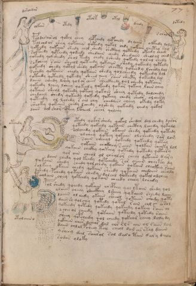

# Voynich Speculative Procedural Protocol — f77r

IMPORTANT: this is NOT a real or validated translation of the Voynich Manuscript. It is a speculative/procedural model that interprets EVA using a user-defined grammar to generate experimental recipes using safe, known edible substitutes.

This file is generated automatically from IVTFF/EVA transliteration plus a user-defined procedural grammar.



## Page / Folio
- currier: B
- folio: f77r
- page_number: 151
- section: biological

## EVA Text (Transliteration)
```text
darchdar
olkchs
otedy
otork
otol
dchdy
soral
dotedy
poldarais ol qokol chey qopchedy qopchedy dylches olkedy loly
tolchd ar shey qotaiin qotedy qokol chdy qokain chetey sal
qoteedy qokaiin shedy chol shedy shcthey qokeedy oteedy cham
solteedy qoteedy qodeedy chedaiin chedy shedaiin she[a:o]lol ched
qokeedy qol sheedy shol tedy chedy lsheedy qokedy qolal chedy
sokcheey sain sheeol qoteedy qokaiin shedy qokeedy qotedy
qokeedy shedy qotol shedy qokaiin sheety qokeed y lchedy lol
sshedy qotaiin chedy qokaiin shedy qolcheedy qokeedy lol
qoteedy qoteedy qokedy sheed qeey saiin sheety qokeedy lol
daiin cheedy lshey qo l or chees sheckhedy qol cheedy qotaiin
qokeedy lchey lsheey qokeedy qokeedy qokar qokeey laiin chey
qotain sheal qokeedy qoteey qokain sheey qotedy dalchedy
chedaiin shedy qokeedy qokedy qokeey chedy shear olaiiny
qoteedy al lchedy r oin chy chedaiin cheey okedy qoky
sheoky qokaiin chedy lchedy olshedy qokeedy chedy qok[a:o]l
daiin dol shor cphey lfcheal shear qolchy
otedy qokar shedy qokal shedar dal chedy daror
qoteedy qokeedy qokaiin chcthy lchedy qokaly
solchedy qokain okaiin shedy qokeedy qotedy
olchey qotey qokain olcheedy sar lom
saiin cheeol qokeedy qokeedy qotal
qokaiin chckhey sa iin qolkain cheeky lol
qokain chckhy qokeey qotedy qotedy qotary
qor ain cheol ol chealor cheey qet[eiiin:aiin] d[a:y]ry
daiin chedy qol keedy qoteeedy sar oiiiin cheety dy
qokaiin shedy chedy qolchedy qokaiin qokaiin checkhy raiin
solkeey okaiin chedy qokain sheedy qokaiin chedaiin chealy
dshedy pchedy qotain chedy d[o:a]lchl qokeedy qokol olchey
teeolain chey qoteedy qokain cheedy cheey lchedy
pol shedy qoeedy qokaiin chcphey qol ltaiin shedy qol
olaiin cheey sheckhey lsheey qykaiin sheedy laiin
daiiin ol eeedy okaiin sheeol qotaiin shody qoty
daiin sh qolchey qotedy qotal r ain chl s arol
qokeedy qotedy qokeedy qokeedy qokeey [s:r] aiin al
d chee ol cheedy qotaiin qoteedy qotedy raiin
sheey qepchedy qol cheedy qokear cheey loly dy
qokaiin ches lchear dal chr sl s ain ol raiin lod
daiin chlchpsheey tal cheol dag as otey daiin
ysheey dal saiis[o:a]l sal dalo tain dary dalo
sodar oloky
otchdy
otolaiin o
```

## Domain Context (Heuristic; Not a Translation)

This section summarizes recurring **basewords** in this IVTFF domain and shows simple substring evidence that the token markers used by the procedural grammar occur inside frequent words.

Any Italian anagram / English gloss is a best-effort lexicon match, not a decipherment.


### Associated basewords (non-generic; top by frequency in this domain)
- `qokain` (count=158) → Italian anagram `acconi`; English: [n/a]
- `qokal` (count=102) → Italian anagram `calco`; English: cast (of sculpture)
- `daiin` (count=81) → Italian anagram `piani`; English: plans (arrangements)
- `qokaiin` (count=81) → Italian anagram `ciancio`; English: [n/a]
- `qokar` (count=45) → Italian anagram `carco`; English: [n/a]
- `okain` (count=40) → Italian anagram `acino`; English: a berry
- `okaiin` (count=31) → Italian anagram `coniai`; English: [n/a]
- `saiin` (count=30) → Italian anagram `asini`; English: [n/a]
- `olkain` (count=26) → Italian anagram `alcino`; English: smart, clever, intelligent, bright
- `qotal` (count=25) → Italian anagram `colta`; English: [n/a]
- `otain` (count=23) → Italian anagram `anito`; English: [n/a]
- `qotain` (count=20) → Italian anagram `antico`; English: ancient
- `qotar` (count=16) → Italian anagram `corta`; English: [n/a]
- `qotaiin` (count=13) → Italian anagram `cationi`; English: [n/a]
- `kaiin` (count=7) → Italian anagram `acini`; English: [n/a]

### Marker evidence (substring in frequent basewords)
- `qo`: 49 basewords; examples: `qokain`, `qokedy`, `qokeedy`, `qol`, `qokal`, `qokaiin`
- `q`: 50 basewords; examples: `qokain`, `qokedy`, `qokeedy`, `qol`, `qokal`, `qokaiin`
- `o`: 173 basewords; examples: `ol`, `qokain`, `qokedy`, `qokeedy`, `qol`, `qokal`
- `k`: 114 basewords; examples: `qokain`, `qokedy`, `qokeedy`, `qokal`, `qokaiin`, `qokeey`
- `t`: 77 basewords; examples: `otedy`, `qotedy`, `qoteedy`, `qoty`, `qotal`, `otain`
- `p`: 11 basewords; examples: `pchedy`, `opchedy`, `pol`, `qopchedy`, `pchedar`, `opchey`
- `ch`: 93 basewords; examples: `chedy`, `chey`, `lchedy`, `cheey`, `chckhy`, `cheol`
- `sh`: 41 basewords; examples: `shedy`, `shey`, `sheedy`, `sheey`, `sheol`, `shckhy`
- `cth`: 9 basewords; examples: `chcthy`, `checthy`, `shcthy`, `shecthy`, `cthedy`, `cthey`
- `ckh`: 12 basewords; examples: `chckhy`, `shckhy`, `checkhy`, `sheckhy`, `chckhey`, `chckhdy`
- `cph`: 1 basewords; examples: `cphol`
- `dy`: 63 basewords; examples: `shedy`, `chedy`, `qokedy`, `qokeedy`, `dy`, `lchedy`
- `iin`: 27 basewords; examples: `daiin`, `qokaiin`, `aiin`, `okaiin`, `saiin`, `qotaiin`
- `aiin`: 21 basewords; examples: `daiin`, `qokaiin`, `aiin`, `okaiin`, `saiin`, `qotaiin`

## Recipes Index (This Page)
- [f77r.1,@Ln](#f77r-1-f77r-1-ln)
- [f77r.2,+Lt](#f77r-2-f77r-2-lt)
- [f77r.3,=Lt](#f77r-3-f77r-3-lt)
- [f77r.4,~Lt](#f77r-4-f77r-4-lt)
- [f77r.5,=Lt](#f77r-5-f77r-5-lt)
- [f77r.6,~Lt](#f77r-6-f77r-6-lt)
- [f77r.7,~Lt](#f77r-7-f77r-7-lt)
- [f77r.8,~Ln](#f77r-8-f77r-8-ln)
- [f77r.9,@P0](#f77r-9-f77r-9-p0)
- [f77r.10,+P0](#f77r-10-f77r-10-p0)
- [f77r.11,+P0](#f77r-11-f77r-11-p0)
- [f77r.12,+P0](#f77r-12-f77r-12-p0)
- [f77r.13,+P0](#f77r-13-f77r-13-p0)
- [f77r.14,+P0](#f77r-14-f77r-14-p0)
- [f77r.15,+P0](#f77r-15-f77r-15-p0)
- [f77r.16,+P0](#f77r-16-f77r-16-p0)
- [f77r.17,+P0](#f77r-17-f77r-17-p0)
- [f77r.18,+P0](#f77r-18-f77r-18-p0)
- [f77r.19,+P0](#f77r-19-f77r-19-p0)
- [f77r.20,+P0](#f77r-20-f77r-20-p0)
- [f77r.21,+P0](#f77r-21-f77r-21-p0)
- [f77r.22,+P0](#f77r-22-f77r-22-p0)
- [f77r.23,+P0](#f77r-23-f77r-23-p0)
- [f77r.24,+P0](#f77r-24-f77r-24-p0)
- [f77r.25,+P0](#f77r-25-f77r-25-p0)
- [f77r.26,+P0](#f77r-26-f77r-26-p0)
- [f77r.27,+P0](#f77r-27-f77r-27-p0)
- [f77r.28,+P0](#f77r-28-f77r-28-p0)
- [f77r.29,+P0](#f77r-29-f77r-29-p0)
- [f77r.30,+P0](#f77r-30-f77r-30-p0)
- [f77r.31,+P0](#f77r-31-f77r-31-p0)
- [f77r.32,+P0](#f77r-32-f77r-32-p0)
- [f77r.33,+P0](#f77r-33-f77r-33-p0)
- [f77r.34,+P0](#f77r-34-f77r-34-p0)
- [f77r.35,+P0](#f77r-35-f77r-35-p0)
- [f77r.36,+P0](#f77r-36-f77r-36-p0)
- [f77r.37,+P0](#f77r-37-f77r-37-p0)
- [f77r.38,+P0](#f77r-38-f77r-38-p0)
- [f77r.39,+P0](#f77r-39-f77r-39-p0)
- [f77r.40,+P0](#f77r-40-f77r-40-p0)
- [f77r.41,+P0](#f77r-41-f77r-41-p0)
- [f77r.42,+P0](#f77r-42-f77r-42-p0)
- [f77r.43,+P0](#f77r-43-f77r-43-p0)
- [f77r.44,+P0](#f77r-44-f77r-44-p0)
- [f77r.45,+P0](#f77r-45-f77r-45-p0)
- [f77r.46,+P0](#f77r-46-f77r-46-p0)
- [f77r.47,+P0](#f77r-47-f77r-47-p0)
- [f77r.48,+P0](#f77r-48-f77r-48-p0)
- [f77r.49,@Ln](#f77r-49-f77r-49-ln)
- [f77r.50,@Lt](#f77r-50-f77r-50-lt)

## Line Glosses (Procedural Gloss Only; Not a Translation)

<a id="f77r-1-f77r-1-ln"></a>

### f77r.1,@Ln

EVA: darchdar

Direct Gloss (Procedural, Not a Real Translation):
- darchdar: tokens: p a r ch p a r → connectors: r r → vowel_run: a (level 1; class a)

<a id="f77r-2-f77r-2-lt"></a>

### f77r.2,+Lt

EVA: olkchs

Direct Gloss (Procedural, Not a Real Translation):
- olkchs: tokens: o l k ch s → connectors: l s

<a id="f77r-3-f77r-3-lt"></a>

### f77r.3,=Lt

EVA: otedy

Direct Gloss (Procedural, Not a Real Translation):
- otedy: tokens: o t e p → vowel_run: e (level 1; class e)

<a id="f77r-4-f77r-4-lt"></a>

### f77r.4,~Lt

EVA: otork

Direct Gloss (Procedural, Not a Real Translation):
- otork: tokens: o t o r k → connectors: r

<a id="f77r-5-f77r-5-lt"></a>

### f77r.5,=Lt

EVA: otol

Direct Gloss (Procedural, Not a Real Translation):
- otol: tokens: o t o l → connectors: l

<a id="f77r-6-f77r-6-lt"></a>

### f77r.6,~Lt

EVA: dchdy

Direct Gloss (Procedural, Not a Real Translation):
- dchdy: tokens: p ch p

<a id="f77r-7-f77r-7-lt"></a>

### f77r.7,~Lt

EVA: soral

Direct Gloss (Procedural, Not a Real Translation):
- soral: tokens: s o r a l → connectors: s r l → vowel_run: a (level 1; class a)

<a id="f77r-8-f77r-8-ln"></a>

### f77r.8,~Ln

EVA: dotedy

Direct Gloss (Procedural, Not a Real Translation):
- dotedy: tokens: p o t e p → vowel_run: e (level 1; class e)

<a id="f77r-9-f77r-9-p0"></a>

### f77r.9,@P0

EVA: poldarais ol qokol chey qopchedy qopchedy dylches olkedy loly

Direct Gloss (Procedural, Not a Real Translation):
- poldarais: tokens: p o l p a r a i s → connectors: l r s → vowel_run: a (level 1; class a)
- ol: tokens: o l → connectors: l
- qokol: tokens: qo k o l → connectors: l
- chey: tokens: ch e → vowel_run: e (level 1; class e)
- qopchedy: tokens: qo p ch e p → vowel_run: e (level 1; class e)
- qopchedy: tokens: qo p ch e p → vowel_run: e (level 1; class e)
- dylches: tokens: p l ch e s → connectors: l s → vowel_run: e (level 1; class e)
- olkedy: tokens: o l k e p → connectors: l → vowel_run: e (level 1; class e)
- loly: tokens: l o l → connectors: l l

<a id="f77r-10-f77r-10-p0"></a>

### f77r.10,+P0

EVA: tolchd ar shey qotaiin qotedy qokol chdy qokain chetey sal

Direct Gloss (Procedural, Not a Real Translation):
- tolchd: tokens: t o l ch p → connectors: l
- ar: tokens: a r → connectors: r → vowel_run: a (level 1; class a)
- shey: tokens: sh e → vowel_run: e (level 1; class e)
- qotaiin: tokens: qo t aiin → vowel_run: a (level 1; class a) → suffix: aiin
- qotedy: tokens: qo t e p → vowel_run: e (level 1; class e)
- qokol: tokens: qo k o l → connectors: l
- chdy: tokens: ch p
- qokain: tokens: qo k a i n → connectors: n → vowel_run: a (level 1; class a)
- chetey: tokens: ch e t e → vowel_run: e (level 1; class e)
- sal: tokens: s a l → connectors: s l → vowel_run: a (level 1; class a)

<a id="f77r-11-f77r-11-p0"></a>

### f77r.11,+P0

EVA: qoteedy qokaiin shedy chol shedy shcthey qokeedy oteedy cham

Direct Gloss (Procedural, Not a Real Translation):
- qoteedy: tokens: qo t ee p → vowel_run: ee (level 2; class e)
- qokaiin: tokens: qo k aiin → vowel_run: a (level 1; class a) → suffix: aiin
- shedy: tokens: sh e p → vowel_run: e (level 1; class e)
- chol: tokens: ch o l → connectors: l
- shedy: tokens: sh e p → vowel_run: e (level 1; class e)
- shcthey: tokens: sh cth e → vowel_run: e (level 1; class e)
- qokeedy: tokens: qo k ee p → vowel_run: ee (level 2; class e)
- oteedy: tokens: o t ee p → vowel_run: ee (level 2; class e)
- cham: tokens: ch a m → connectors: m → vowel_run: a (level 1; class a)

<a id="f77r-12-f77r-12-p0"></a>

### f77r.12,+P0

EVA: solteedy qoteedy qodeedy chedaiin chedy shedaiin she[a:o]lol ched

Direct Gloss (Procedural, Not a Real Translation):
- solteedy: tokens: s o l t ee p → connectors: s l → vowel_run: ee (level 2; class e)
- qoteedy: tokens: qo t ee p → vowel_run: ee (level 2; class e)
- qodeedy: tokens: qo p ee p → vowel_run: ee (level 2; class e)
- chedaiin: tokens: ch e p aiin → vowel_run: e (level 1; class e) → suffix: aiin
- chedy: tokens: ch e p → vowel_run: e (level 1; class e)
- shedaiin: tokens: sh e p aiin → vowel_run: e (level 1; class e) → suffix: aiin
- she: tokens: sh e → vowel_run: e (level 1; class e)
- a: tokens: a → vowel_run: a (level 1; class a)
- o: tokens: o
- lol: tokens: l o l → connectors: l l
- ched: tokens: ch e p → vowel_run: e (level 1; class e)

<a id="f77r-13-f77r-13-p0"></a>

### f77r.13,+P0

EVA: qokeedy qol sheedy shol tedy chedy lsheedy qokedy qolal chedy

Direct Gloss (Procedural, Not a Real Translation):
- qokeedy: tokens: qo k ee p → vowel_run: ee (level 2; class e)
- qol: tokens: qo l → connectors: l
- sheedy: tokens: sh ee p → vowel_run: ee (level 2; class e)
- shol: tokens: sh o l → connectors: l
- tedy: tokens: t e p → vowel_run: e (level 1; class e)
- chedy: tokens: ch e p → vowel_run: e (level 1; class e)
- lsheedy: tokens: l sh ee p → connectors: l → vowel_run: ee (level 2; class e)
- qokedy: tokens: qo k e p → vowel_run: e (level 1; class e)
- qolal: tokens: qo l a l → connectors: l l → vowel_run: a (level 1; class a)
- chedy: tokens: ch e p → vowel_run: e (level 1; class e)

<a id="f77r-14-f77r-14-p0"></a>

### f77r.14,+P0

EVA: sokcheey sain sheeol qoteedy qokaiin shedy qokeedy qotedy

Direct Gloss (Procedural, Not a Real Translation):
- sokcheey: tokens: s o k ch ee → connectors: s → vowel_run: ee (level 2; class e)
- sain: tokens: s a i n → connectors: s n → vowel_run: a (level 1; class a)
- sheeol: tokens: sh ee o l → connectors: l → vowel_run: ee (level 2; class e)
- qoteedy: tokens: qo t ee p → vowel_run: ee (level 2; class e)
- qokaiin: tokens: qo k aiin → vowel_run: a (level 1; class a) → suffix: aiin
- shedy: tokens: sh e p → vowel_run: e (level 1; class e)
- qokeedy: tokens: qo k ee p → vowel_run: ee (level 2; class e)
- qotedy: tokens: qo t e p → vowel_run: e (level 1; class e)

<a id="f77r-15-f77r-15-p0"></a>

### f77r.15,+P0

EVA: qokeedy shedy qotol shedy qokaiin sheety qokeed y lchedy lol

Direct Gloss (Procedural, Not a Real Translation):
- qokeedy: tokens: qo k ee p → vowel_run: ee (level 2; class e)
- shedy: tokens: sh e p → vowel_run: e (level 1; class e)
- qotol: tokens: qo t o l → connectors: l
- shedy: tokens: sh e p → vowel_run: e (level 1; class e)
- qokaiin: tokens: qo k aiin → vowel_run: a (level 1; class a) → suffix: aiin
- sheety: tokens: sh ee t → vowel_run: ee (level 2; class e)
- qokeed: tokens: qo k ee p → vowel_run: ee (level 2; class e)
- y: [unparsed]
- lchedy: tokens: l ch e p → connectors: l → vowel_run: e (level 1; class e)
- lol: tokens: l o l → connectors: l l

<a id="f77r-16-f77r-16-p0"></a>

### f77r.16,+P0

EVA: sshedy qotaiin chedy qokaiin shedy qolcheedy qokeedy lol

Direct Gloss (Procedural, Not a Real Translation):
- sshedy: tokens: s sh e p → connectors: s → vowel_run: e (level 1; class e)
- qotaiin: tokens: qo t aiin → vowel_run: a (level 1; class a) → suffix: aiin
- chedy: tokens: ch e p → vowel_run: e (level 1; class e)
- qokaiin: tokens: qo k aiin → vowel_run: a (level 1; class a) → suffix: aiin
- shedy: tokens: sh e p → vowel_run: e (level 1; class e)
- qolcheedy: tokens: qo l ch ee p → connectors: l → vowel_run: ee (level 2; class e)
- qokeedy: tokens: qo k ee p → vowel_run: ee (level 2; class e)
- lol: tokens: l o l → connectors: l l

<a id="f77r-17-f77r-17-p0"></a>

### f77r.17,+P0

EVA: qoteedy qoteedy qokedy sheed qeey saiin sheety qokeedy lol

Direct Gloss (Procedural, Not a Real Translation):
- qoteedy: tokens: qo t ee p → vowel_run: ee (level 2; class e)
- qoteedy: tokens: qo t ee p → vowel_run: ee (level 2; class e)
- qokedy: tokens: qo k e p → vowel_run: e (level 1; class e)
- sheed: tokens: sh ee p → vowel_run: ee (level 2; class e)
- qeey: tokens: q ee → vowel_run: ee (level 2; class e)
- saiin: tokens: s aiin → connectors: s → vowel_run: a (level 1; class a) → suffix: aiin
- sheety: tokens: sh ee t → vowel_run: ee (level 2; class e)
- qokeedy: tokens: qo k ee p → vowel_run: ee (level 2; class e)
- lol: tokens: l o l → connectors: l l

<a id="f77r-18-f77r-18-p0"></a>

### f77r.18,+P0

EVA: daiin cheedy lshey qo l or chees sheckhedy qol cheedy qotaiin

Direct Gloss (Procedural, Not a Real Translation):
- daiin: tokens: p aiin → vowel_run: a (level 1; class a) → suffix: aiin
- cheedy: tokens: ch ee p → vowel_run: ee (level 2; class e)
- lshey: tokens: l sh e → connectors: l → vowel_run: e (level 1; class e)
- qo: tokens: qo
- l: tokens: l → connectors: l
- or: tokens: o r → connectors: r
- chees: tokens: ch ee s → connectors: s → vowel_run: ee (level 2; class e)
- sheckhedy: tokens: sh e ckh e p → vowel_run: e (level 1; class e)
- qol: tokens: qo l → connectors: l
- cheedy: tokens: ch ee p → vowel_run: ee (level 2; class e)
- qotaiin: tokens: qo t aiin → vowel_run: a (level 1; class a) → suffix: aiin

<a id="f77r-19-f77r-19-p0"></a>

### f77r.19,+P0

EVA: qokeedy lchey lsheey qokeedy qokeedy qokar qokeey laiin chey

Direct Gloss (Procedural, Not a Real Translation):
- qokeedy: tokens: qo k ee p → vowel_run: ee (level 2; class e)
- lchey: tokens: l ch e → connectors: l → vowel_run: e (level 1; class e)
- lsheey: tokens: l sh ee → connectors: l → vowel_run: ee (level 2; class e)
- qokeedy: tokens: qo k ee p → vowel_run: ee (level 2; class e)
- qokeedy: tokens: qo k ee p → vowel_run: ee (level 2; class e)
- qokar: tokens: qo k a r → connectors: r → vowel_run: a (level 1; class a)
- qokeey: tokens: qo k ee → vowel_run: ee (level 2; class e)
- laiin: tokens: l aiin → connectors: l → vowel_run: a (level 1; class a) → suffix: aiin
- chey: tokens: ch e → vowel_run: e (level 1; class e)

<a id="f77r-20-f77r-20-p0"></a>

### f77r.20,+P0

EVA: qotain sheal qokeedy qoteey qokain sheey qotedy dalchedy

Direct Gloss (Procedural, Not a Real Translation):
- qotain: tokens: qo t a i n → connectors: n → vowel_run: a (level 1; class a)
- sheal: tokens: sh e a l → connectors: l → vowel_run: e (level 1; class e)
- qokeedy: tokens: qo k ee p → vowel_run: ee (level 2; class e)
- qoteey: tokens: qo t ee → vowel_run: ee (level 2; class e)
- qokain: tokens: qo k a i n → connectors: n → vowel_run: a (level 1; class a)
- sheey: tokens: sh ee → vowel_run: ee (level 2; class e)
- qotedy: tokens: qo t e p → vowel_run: e (level 1; class e)
- dalchedy: tokens: p a l ch e p → connectors: l → vowel_run: a (level 1; class a)

<a id="f77r-21-f77r-21-p0"></a>

### f77r.21,+P0

EVA: chedaiin shedy qokeedy qokedy qokeey chedy shear olaiiny

Direct Gloss (Procedural, Not a Real Translation):
- chedaiin: tokens: ch e p aiin → vowel_run: e (level 1; class e) → suffix: aiin
- shedy: tokens: sh e p → vowel_run: e (level 1; class e)
- qokeedy: tokens: qo k ee p → vowel_run: ee (level 2; class e)
- qokedy: tokens: qo k e p → vowel_run: e (level 1; class e)
- qokeey: tokens: qo k ee → vowel_run: ee (level 2; class e)
- chedy: tokens: ch e p → vowel_run: e (level 1; class e)
- shear: tokens: sh e a r → connectors: r → vowel_run: e (level 1; class e)
- olaiiny: tokens: o l aiin → connectors: l → vowel_run: a (level 1; class a) → suffix: aiin

<a id="f77r-22-f77r-22-p0"></a>

### f77r.22,+P0

EVA: qoteedy al lchedy r oin chy chedaiin cheey okedy qoky

Direct Gloss (Procedural, Not a Real Translation):
- qoteedy: tokens: qo t ee p → vowel_run: ee (level 2; class e)
- al: tokens: a l → connectors: l → vowel_run: a (level 1; class a)
- lchedy: tokens: l ch e p → connectors: l → vowel_run: e (level 1; class e)
- r: tokens: r → connectors: r
- oin: tokens: o i n → connectors: n → vowel_run: i (level 1; class i)
- chy: tokens: ch
- chedaiin: tokens: ch e p aiin → vowel_run: e (level 1; class e) → suffix: aiin
- cheey: tokens: ch ee → vowel_run: ee (level 2; class e)
- okedy: tokens: o k e p → vowel_run: e (level 1; class e)
- qoky: tokens: qo k

<a id="f77r-23-f77r-23-p0"></a>

### f77r.23,+P0

EVA: sheoky qokaiin chedy lchedy olshedy qokeedy chedy qok[a:o]l

Direct Gloss (Procedural, Not a Real Translation):
- sheoky: tokens: sh e o k → vowel_run: e (level 1; class e)
- qokaiin: tokens: qo k aiin → vowel_run: a (level 1; class a) → suffix: aiin
- chedy: tokens: ch e p → vowel_run: e (level 1; class e)
- lchedy: tokens: l ch e p → connectors: l → vowel_run: e (level 1; class e)
- olshedy: tokens: o l sh e p → connectors: l → vowel_run: e (level 1; class e)
- qokeedy: tokens: qo k ee p → vowel_run: ee (level 2; class e)
- chedy: tokens: ch e p → vowel_run: e (level 1; class e)
- qok: tokens: qo k
- a: tokens: a → vowel_run: a (level 1; class a)
- o: tokens: o
- l: tokens: l → connectors: l

<a id="f77r-24-f77r-24-p0"></a>

### f77r.24,+P0

EVA: daiin dol shor cphey lfcheal shear qolchy

Direct Gloss (Procedural, Not a Real Translation):
- daiin: tokens: p aiin → vowel_run: a (level 1; class a) → suffix: aiin
- dol: tokens: p o l → connectors: l
- shor: tokens: sh o r → connectors: r
- cphey: tokens: cph e → vowel_run: e (level 1; class e)
- lfcheal: tokens: l f ch e a l → connectors: l l → vowel_run: e (level 1; class e)
- shear: tokens: sh e a r → connectors: r → vowel_run: e (level 1; class e)
- qolchy: tokens: qo l ch → connectors: l

<a id="f77r-25-f77r-25-p0"></a>

### f77r.25,+P0

EVA: otedy qokar shedy qokal shedar dal chedy daror

Direct Gloss (Procedural, Not a Real Translation):
- otedy: tokens: o t e p → vowel_run: e (level 1; class e)
- qokar: tokens: qo k a r → connectors: r → vowel_run: a (level 1; class a)
- shedy: tokens: sh e p → vowel_run: e (level 1; class e)
- qokal: tokens: qo k a l → connectors: l → vowel_run: a (level 1; class a)
- shedar: tokens: sh e p a r → connectors: r → vowel_run: e (level 1; class e)
- dal: tokens: p a l → connectors: l → vowel_run: a (level 1; class a)
- chedy: tokens: ch e p → vowel_run: e (level 1; class e)
- daror: tokens: p a r o r → connectors: r r → vowel_run: a (level 1; class a)

<a id="f77r-26-f77r-26-p0"></a>

### f77r.26,+P0

EVA: qoteedy qokeedy qokaiin chcthy lchedy qokaly

Direct Gloss (Procedural, Not a Real Translation):
- qoteedy: tokens: qo t ee p → vowel_run: ee (level 2; class e)
- qokeedy: tokens: qo k ee p → vowel_run: ee (level 2; class e)
- qokaiin: tokens: qo k aiin → vowel_run: a (level 1; class a) → suffix: aiin
- chcthy: tokens: ch cth
- lchedy: tokens: l ch e p → connectors: l → vowel_run: e (level 1; class e)
- qokaly: tokens: qo k a l → connectors: l → vowel_run: a (level 1; class a)

<a id="f77r-27-f77r-27-p0"></a>

### f77r.27,+P0

EVA: solchedy qokain okaiin shedy qokeedy qotedy

Direct Gloss (Procedural, Not a Real Translation):
- solchedy: tokens: s o l ch e p → connectors: s l → vowel_run: e (level 1; class e)
- qokain: tokens: qo k a i n → connectors: n → vowel_run: a (level 1; class a)
- okaiin: tokens: o k aiin → vowel_run: a (level 1; class a) → suffix: aiin
- shedy: tokens: sh e p → vowel_run: e (level 1; class e)
- qokeedy: tokens: qo k ee p → vowel_run: ee (level 2; class e)
- qotedy: tokens: qo t e p → vowel_run: e (level 1; class e)

<a id="f77r-28-f77r-28-p0"></a>

### f77r.28,+P0

EVA: olchey qotey qokain olcheedy sar lom

Direct Gloss (Procedural, Not a Real Translation):
- olchey: tokens: o l ch e → connectors: l → vowel_run: e (level 1; class e)
- qotey: tokens: qo t e → vowel_run: e (level 1; class e)
- qokain: tokens: qo k a i n → connectors: n → vowel_run: a (level 1; class a)
- olcheedy: tokens: o l ch ee p → connectors: l → vowel_run: ee (level 2; class e)
- sar: tokens: s a r → connectors: s r → vowel_run: a (level 1; class a)
- lom: tokens: l o m → connectors: l m

<a id="f77r-29-f77r-29-p0"></a>

### f77r.29,+P0

EVA: saiin cheeol qokeedy qokeedy qotal

Direct Gloss (Procedural, Not a Real Translation):
- saiin: tokens: s aiin → connectors: s → vowel_run: a (level 1; class a) → suffix: aiin
- cheeol: tokens: ch ee o l → connectors: l → vowel_run: ee (level 2; class e)
- qokeedy: tokens: qo k ee p → vowel_run: ee (level 2; class e)
- qokeedy: tokens: qo k ee p → vowel_run: ee (level 2; class e)
- qotal: tokens: qo t a l → connectors: l → vowel_run: a (level 1; class a)

<a id="f77r-30-f77r-30-p0"></a>

### f77r.30,+P0

EVA: qokaiin chckhey sa iin qolkain cheeky lol

Direct Gloss (Procedural, Not a Real Translation):
- qokaiin: tokens: qo k aiin → vowel_run: a (level 1; class a) → suffix: aiin
- chckhey: tokens: ch ckh e → vowel_run: e (level 1; class e)
- sa: tokens: s a → connectors: s → vowel_run: a (level 1; class a)
- iin: tokens: iin → vowel_run: ii (level 2; class i) → suffix: iin
- qolkain: tokens: qo l k a i n → connectors: l n → vowel_run: a (level 1; class a)
- cheeky: tokens: ch ee k → vowel_run: ee (level 2; class e)
- lol: tokens: l o l → connectors: l l

<a id="f77r-31-f77r-31-p0"></a>

### f77r.31,+P0

EVA: qokain chckhy qokeey qotedy qotedy qotary

Direct Gloss (Procedural, Not a Real Translation):
- qokain: tokens: qo k a i n → connectors: n → vowel_run: a (level 1; class a)
- chckhy: tokens: ch ckh
- qokeey: tokens: qo k ee → vowel_run: ee (level 2; class e)
- qotedy: tokens: qo t e p → vowel_run: e (level 1; class e)
- qotedy: tokens: qo t e p → vowel_run: e (level 1; class e)
- qotary: tokens: qo t a r → connectors: r → vowel_run: a (level 1; class a)

<a id="f77r-32-f77r-32-p0"></a>

### f77r.32,+P0

EVA: qor ain cheol ol chealor cheey qet[eiiin:aiin] d[a:y]ry

Direct Gloss (Procedural, Not a Real Translation):
- qor: tokens: qo r → connectors: r
- ain: tokens: a i n → connectors: n → vowel_run: a (level 1; class a)
- cheol: tokens: ch e o l → connectors: l → vowel_run: e (level 1; class e)
- ol: tokens: o l → connectors: l
- chealor: tokens: ch e a l o r → connectors: l r → vowel_run: e (level 1; class e)
- cheey: tokens: ch ee → vowel_run: ee (level 2; class e)
- qet: tokens: q e t → vowel_run: e (level 1; class e)
- eiiin: tokens: e iii n → connectors: n → vowel_run: e (level 1; class e) → suffix: iin
- aiin: tokens: aiin → vowel_run: a (level 1; class a) → suffix: aiin
- d: tokens: p
- a: tokens: a → vowel_run: a (level 1; class a)
- y: [unparsed]
- ry: tokens: r → connectors: r

<a id="f77r-33-f77r-33-p0"></a>

### f77r.33,+P0

EVA: daiin chedy qol keedy qoteeedy sar oiiiin cheety dy

Direct Gloss (Procedural, Not a Real Translation):
- daiin: tokens: p aiin → vowel_run: a (level 1; class a) → suffix: aiin
- chedy: tokens: ch e p → vowel_run: e (level 1; class e)
- qol: tokens: qo l → connectors: l
- keedy: tokens: k ee p → vowel_run: ee (level 2; class e)
- qoteeedy: tokens: qo t eee p → vowel_run: eee (level 3; class e)
- sar: tokens: s a r → connectors: s r → vowel_run: a (level 1; class a)
- oiiiin: tokens: o iii i n → connectors: n → vowel_run: iiii (level 4; class i) → suffix: iin
- cheety: tokens: ch ee t → vowel_run: ee (level 2; class e)
- dy: tokens: p

<a id="f77r-34-f77r-34-p0"></a>

### f77r.34,+P0

EVA: qokaiin shedy chedy qolchedy qokaiin qokaiin checkhy raiin

Direct Gloss (Procedural, Not a Real Translation):
- qokaiin: tokens: qo k aiin → vowel_run: a (level 1; class a) → suffix: aiin
- shedy: tokens: sh e p → vowel_run: e (level 1; class e)
- chedy: tokens: ch e p → vowel_run: e (level 1; class e)
- qolchedy: tokens: qo l ch e p → connectors: l → vowel_run: e (level 1; class e)
- qokaiin: tokens: qo k aiin → vowel_run: a (level 1; class a) → suffix: aiin
- qokaiin: tokens: qo k aiin → vowel_run: a (level 1; class a) → suffix: aiin
- checkhy: tokens: ch e ckh → vowel_run: e (level 1; class e)
- raiin: tokens: r aiin → connectors: r → vowel_run: a (level 1; class a) → suffix: aiin

<a id="f77r-35-f77r-35-p0"></a>

### f77r.35,+P0

EVA: solkeey okaiin chedy qokain sheedy qokaiin chedaiin chealy

Direct Gloss (Procedural, Not a Real Translation):
- solkeey: tokens: s o l k ee → connectors: s l → vowel_run: ee (level 2; class e)
- okaiin: tokens: o k aiin → vowel_run: a (level 1; class a) → suffix: aiin
- chedy: tokens: ch e p → vowel_run: e (level 1; class e)
- qokain: tokens: qo k a i n → connectors: n → vowel_run: a (level 1; class a)
- sheedy: tokens: sh ee p → vowel_run: ee (level 2; class e)
- qokaiin: tokens: qo k aiin → vowel_run: a (level 1; class a) → suffix: aiin
- chedaiin: tokens: ch e p aiin → vowel_run: e (level 1; class e) → suffix: aiin
- chealy: tokens: ch e a l → connectors: l → vowel_run: e (level 1; class e)

<a id="f77r-36-f77r-36-p0"></a>

### f77r.36,+P0

EVA: dshedy pchedy qotain chedy d[o:a]lchl qokeedy qokol olchey

Direct Gloss (Procedural, Not a Real Translation):
- dshedy: tokens: p sh e p → vowel_run: e (level 1; class e)
- pchedy: tokens: p ch e p → vowel_run: e (level 1; class e)
- qotain: tokens: qo t a i n → connectors: n → vowel_run: a (level 1; class a)
- chedy: tokens: ch e p → vowel_run: e (level 1; class e)
- d: tokens: p
- o: tokens: o
- a: tokens: a → vowel_run: a (level 1; class a)
- lchl: tokens: l ch l → connectors: l l
- qokeedy: tokens: qo k ee p → vowel_run: ee (level 2; class e)
- qokol: tokens: qo k o l → connectors: l
- olchey: tokens: o l ch e → connectors: l → vowel_run: e (level 1; class e)

<a id="f77r-37-f77r-37-p0"></a>

### f77r.37,+P0

EVA: teeolain chey qoteedy qokain cheedy cheey lchedy

Direct Gloss (Procedural, Not a Real Translation):
- teeolain: tokens: t ee o l a i n → connectors: l n → vowel_run: ee (level 2; class e)
- chey: tokens: ch e → vowel_run: e (level 1; class e)
- qoteedy: tokens: qo t ee p → vowel_run: ee (level 2; class e)
- qokain: tokens: qo k a i n → connectors: n → vowel_run: a (level 1; class a)
- cheedy: tokens: ch ee p → vowel_run: ee (level 2; class e)
- cheey: tokens: ch ee → vowel_run: ee (level 2; class e)
- lchedy: tokens: l ch e p → connectors: l → vowel_run: e (level 1; class e)

<a id="f77r-38-f77r-38-p0"></a>

### f77r.38,+P0

EVA: pol shedy qoeedy qokaiin chcphey qol ltaiin shedy qol

Direct Gloss (Procedural, Not a Real Translation):
- pol: tokens: p o l → connectors: l
- shedy: tokens: sh e p → vowel_run: e (level 1; class e)
- qoeedy: tokens: qo ee p → vowel_run: ee (level 2; class e)
- qokaiin: tokens: qo k aiin → vowel_run: a (level 1; class a) → suffix: aiin
- chcphey: tokens: ch cph e → vowel_run: e (level 1; class e)
- qol: tokens: qo l → connectors: l
- ltaiin: tokens: l t aiin → connectors: l → vowel_run: a (level 1; class a) → suffix: aiin
- shedy: tokens: sh e p → vowel_run: e (level 1; class e)
- qol: tokens: qo l → connectors: l

<a id="f77r-39-f77r-39-p0"></a>

### f77r.39,+P0

EVA: olaiin cheey sheckhey lsheey qykaiin sheedy laiin

Direct Gloss (Procedural, Not a Real Translation):
- olaiin: tokens: o l aiin → connectors: l → vowel_run: a (level 1; class a) → suffix: aiin
- cheey: tokens: ch ee → vowel_run: ee (level 2; class e)
- sheckhey: tokens: sh e ckh e → vowel_run: e (level 1; class e)
- lsheey: tokens: l sh ee → connectors: l → vowel_run: ee (level 2; class e)
- qykaiin: tokens: q k aiin → vowel_run: a (level 1; class a) → suffix: aiin
- sheedy: tokens: sh ee p → vowel_run: ee (level 2; class e)
- laiin: tokens: l aiin → connectors: l → vowel_run: a (level 1; class a) → suffix: aiin

<a id="f77r-40-f77r-40-p0"></a>

### f77r.40,+P0

EVA: daiiin ol eeedy okaiin sheeol qotaiin shody qoty

Direct Gloss (Procedural, Not a Real Translation):
- daiiin: tokens: p a iii n → connectors: n → vowel_run: a (level 1; class a) → suffix: iin
- ol: tokens: o l → connectors: l
- eeedy: tokens: eee p → vowel_run: eee (level 3; class e)
- okaiin: tokens: o k aiin → vowel_run: a (level 1; class a) → suffix: aiin
- sheeol: tokens: sh ee o l → connectors: l → vowel_run: ee (level 2; class e)
- qotaiin: tokens: qo t aiin → vowel_run: a (level 1; class a) → suffix: aiin
- shody: tokens: sh o p
- qoty: tokens: qo t

<a id="f77r-41-f77r-41-p0"></a>

### f77r.41,+P0

EVA: daiin sh qolchey qotedy qotal r ain chl s arol

Direct Gloss (Procedural, Not a Real Translation):
- daiin: tokens: p aiin → vowel_run: a (level 1; class a) → suffix: aiin
- sh: tokens: sh
- qolchey: tokens: qo l ch e → connectors: l → vowel_run: e (level 1; class e)
- qotedy: tokens: qo t e p → vowel_run: e (level 1; class e)
- qotal: tokens: qo t a l → connectors: l → vowel_run: a (level 1; class a)
- r: tokens: r → connectors: r
- ain: tokens: a i n → connectors: n → vowel_run: a (level 1; class a)
- chl: tokens: ch l → connectors: l
- s: tokens: s → connectors: s
- arol: tokens: a r o l → connectors: r l → vowel_run: a (level 1; class a)

<a id="f77r-42-f77r-42-p0"></a>

### f77r.42,+P0

EVA: qokeedy qotedy qokeedy qokeedy qokeey [s:r] aiin al

Direct Gloss (Procedural, Not a Real Translation):
- qokeedy: tokens: qo k ee p → vowel_run: ee (level 2; class e)
- qotedy: tokens: qo t e p → vowel_run: e (level 1; class e)
- qokeedy: tokens: qo k ee p → vowel_run: ee (level 2; class e)
- qokeedy: tokens: qo k ee p → vowel_run: ee (level 2; class e)
- qokeey: tokens: qo k ee → vowel_run: ee (level 2; class e)
- s: tokens: s → connectors: s
- r: tokens: r → connectors: r
- aiin: tokens: aiin → vowel_run: a (level 1; class a) → suffix: aiin
- al: tokens: a l → connectors: l → vowel_run: a (level 1; class a)

<a id="f77r-43-f77r-43-p0"></a>

### f77r.43,+P0

EVA: d chee ol cheedy qotaiin qoteedy qotedy raiin

Direct Gloss (Procedural, Not a Real Translation):
- d: tokens: p
- chee: tokens: ch ee → vowel_run: ee (level 2; class e)
- ol: tokens: o l → connectors: l
- cheedy: tokens: ch ee p → vowel_run: ee (level 2; class e)
- qotaiin: tokens: qo t aiin → vowel_run: a (level 1; class a) → suffix: aiin
- qoteedy: tokens: qo t ee p → vowel_run: ee (level 2; class e)
- qotedy: tokens: qo t e p → vowel_run: e (level 1; class e)
- raiin: tokens: r aiin → connectors: r → vowel_run: a (level 1; class a) → suffix: aiin

<a id="f77r-44-f77r-44-p0"></a>

### f77r.44,+P0

EVA: sheey qepchedy qol cheedy qokear cheey loly dy

Direct Gloss (Procedural, Not a Real Translation):
- sheey: tokens: sh ee → vowel_run: ee (level 2; class e)
- qepchedy: tokens: q e p ch e p → vowel_run: e (level 1; class e)
- qol: tokens: qo l → connectors: l
- cheedy: tokens: ch ee p → vowel_run: ee (level 2; class e)
- qokear: tokens: qo k e a r → connectors: r → vowel_run: e (level 1; class e)
- cheey: tokens: ch ee → vowel_run: ee (level 2; class e)
- loly: tokens: l o l → connectors: l l
- dy: tokens: p

<a id="f77r-45-f77r-45-p0"></a>

### f77r.45,+P0

EVA: qokaiin ches lchear dal chr sl s ain ol raiin lod

Direct Gloss (Procedural, Not a Real Translation):
- qokaiin: tokens: qo k aiin → vowel_run: a (level 1; class a) → suffix: aiin
- ches: tokens: ch e s → connectors: s → vowel_run: e (level 1; class e)
- lchear: tokens: l ch e a r → connectors: l r → vowel_run: e (level 1; class e)
- dal: tokens: p a l → connectors: l → vowel_run: a (level 1; class a)
- chr: tokens: ch r → connectors: r
- sl: tokens: s l → connectors: s l
- s: tokens: s → connectors: s
- ain: tokens: a i n → connectors: n → vowel_run: a (level 1; class a)
- ol: tokens: o l → connectors: l
- raiin: tokens: r aiin → connectors: r → vowel_run: a (level 1; class a) → suffix: aiin
- lod: tokens: l o p → connectors: l

<a id="f77r-46-f77r-46-p0"></a>

### f77r.46,+P0

EVA: daiin chlchpsheey tal cheol dag as otey daiin

Direct Gloss (Procedural, Not a Real Translation):
- daiin: tokens: p aiin → vowel_run: a (level 1; class a) → suffix: aiin
- chlchpsheey: tokens: ch l ch p sh ee → connectors: l → vowel_run: ee (level 2; class e)
- tal: tokens: t a l → connectors: l → vowel_run: a (level 1; class a)
- cheol: tokens: ch e o l → connectors: l → vowel_run: e (level 1; class e)
- dag: tokens: p a g → vowel_run: a (level 1; class a)
- as: tokens: a s → connectors: s → vowel_run: a (level 1; class a)
- otey: tokens: o t e → vowel_run: e (level 1; class e)
- daiin: tokens: p aiin → vowel_run: a (level 1; class a) → suffix: aiin

<a id="f77r-47-f77r-47-p0"></a>

### f77r.47,+P0

EVA: ysheey dal saiis[o:a]l sal dalo tain dary dalo

Direct Gloss (Procedural, Not a Real Translation):
- ysheey: tokens: sh ee → vowel_run: ee (level 2; class e)
- dal: tokens: p a l → connectors: l → vowel_run: a (level 1; class a)
- saiis: tokens: s a ii s → connectors: s s → vowel_run: a (level 1; class a)
- o: tokens: o
- a: tokens: a → vowel_run: a (level 1; class a)
- l: tokens: l → connectors: l
- sal: tokens: s a l → connectors: s l → vowel_run: a (level 1; class a)
- dalo: tokens: p a l o → connectors: l → vowel_run: a (level 1; class a)
- tain: tokens: t a i n → connectors: n → vowel_run: a (level 1; class a)
- dary: tokens: p a r → connectors: r → vowel_run: a (level 1; class a)
- dalo: tokens: p a l o → connectors: l → vowel_run: a (level 1; class a)

<a id="f77r-48-f77r-48-p0"></a>

### f77r.48,+P0

EVA: sodar oloky

Direct Gloss (Procedural, Not a Real Translation):
- sodar: tokens: s o p a r → connectors: s r → vowel_run: a (level 1; class a)
- oloky: tokens: o l o k → connectors: l

<a id="f77r-49-f77r-49-ln"></a>

### f77r.49,@Ln

EVA: otchdy

Direct Gloss (Procedural, Not a Real Translation):
- otchdy: tokens: o t ch p

<a id="f77r-50-f77r-50-lt"></a>

### f77r.50,@Lt

EVA: otolaiin o

Direct Gloss (Procedural, Not a Real Translation):
- otolaiin: tokens: o t o l aiin → connectors: l → vowel_run: a (level 1; class a) → suffix: aiin
- o: tokens: o
