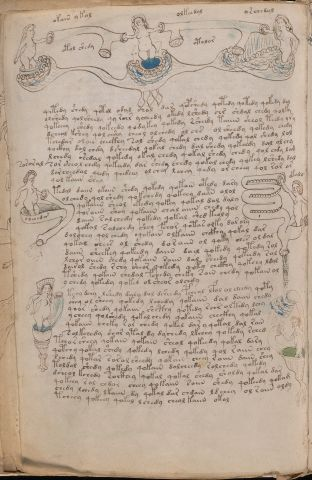

# Voynich Speculative Procedural Protocol — f77v

IMPORTANT: this is NOT a real or validated translation of the Voynich Manuscript. It is a speculative/procedural model that interprets EVA using a user-defined grammar to generate experimental recipes using safe, known edible substitutes.

This file is generated automatically from IVTFF/EVA transliteration plus a user-defined procedural grammar.



## Page / Folio
- currier: B
- folio: f77v
- page_number: 152
- section: biological

## EVA Text (Transliteration)
```text
okain y kal
otol shedy
olkeedal
otolor
[o:a]rchedal
qetedy shedy qotol odal chal dar qopshedy qotedy qotedy qokedy dal
olshedy qolsheedy qy rohr ycheedy okedy lshedy chs shdal chedy qolky
qokeeey shedy qokeedy qodykey qokedy rsheedy taiiin sheol teedy yry
dcheol kshey qolchshy cheol olchedy ol chs ol sheedy qokedy chedy
tchedar alain checkhy sal shedy qokal chedy qokedy qol shedy lol
qockhy dol chdy dsheedal qokal chedy dal shedy qokeedy dal olchy
lchedy shedal qokedy okal chedy qokal shedy chedy qol chdy lam
sor sheol chdy qokeedy dar shedy chedy qokal chedy qokey lshedy dal
darcheedal qeedy qeedeey olchey lchey qedy or cheey qol rar ar
qol kaiin shey
tedal daiin okaiin shedy qokedy qokain otedy dasy
olchedy qol shedy qokchedy qokeey daiin olol
qokaiin sheol ekedy qokey qokal dal daly
qoraiin shey qokaiin chal aiiin chedy qol
daiin salchedy qokedy qokal shed keoly
qokal salchedy shey fchor qotas olky darory
dalchey qol chedy oqokain olkaiin chckhy qokal dar
qokal chees ol shedy doraiin ol qoky ches ol dal
daiin sheekey qokeedy daiin dail qokedy qokedy [r:s]ol
lchor oiiin shedy qokaiin saiin dal sheedy qokeedy [r:s]al
dairol shedy rchy sheor qokedy qoky chckhy qokchy ldol
tshedy qokain chedal fchedy cheky sain chedy qokain ol
ychedy qokedy qoked ol sheor olchdy
tch[a:y]dchy lshedy daly dal dsheedy pcheol lfol ol cheedy qoty
shey ol sheey qokedy lchedy qokaiin dal daiin chedy
qoa[s:r] shedy qokaiin shcthy qotedy rchr oltedy lchy
ycheey qolshedy qokalchedy qokaiin checkhy qokal
qokaiin cheky rar chedy qokal dar y qotal dal rain
solkchedy shar ytal dy dychedy lkchey qokedy rched
tcho[r:s] sheey qokain qokain sheol qokeedy qokal dary
qotchy qokal shedy qokedy lchedy qokedy qol raiin chey
schedy qotar sarolsheedy qokain cheey roiin daiin shey
toldal shedy qokedy qokain dolcheedy [r:s]olchedy qokedy
dcheol kchedy soikhey qokal qokal shedy sholdy qotal dar
qokeey rol chdor cheey qokaiin saiin shedy qokeedy qokam
chedy lchedy lkaiin dy qokal dar chdain ldchey ol raiin oldy
tcheey qokeey qokal lchedy cheolkaiin okol
saroral
okalo
o?eoedu
```

## Domain Context (Heuristic; Not a Translation)

This section summarizes recurring **basewords** in this IVTFF domain and shows simple substring evidence that the token markers used by the procedural grammar occur inside frequent words.

Any Italian anagram / English gloss is a best-effort lexicon match, not a decipherment.


### Associated basewords (non-generic; top by frequency in this domain)
- `qokain` (count=158) → Italian anagram `acconi`; English: [n/a]
- `qokal` (count=102) → Italian anagram `calco`; English: cast (of sculpture)
- `daiin` (count=81) → Italian anagram `piani`; English: plans (arrangements)
- `qokaiin` (count=81) → Italian anagram `ciancio`; English: [n/a]
- `qokar` (count=45) → Italian anagram `carco`; English: [n/a]
- `okain` (count=40) → Italian anagram `acino`; English: a berry
- `okaiin` (count=31) → Italian anagram `coniai`; English: [n/a]
- `saiin` (count=30) → Italian anagram `asini`; English: [n/a]
- `olkain` (count=26) → Italian anagram `alcino`; English: smart, clever, intelligent, bright
- `qotal` (count=25) → Italian anagram `colta`; English: [n/a]
- `otain` (count=23) → Italian anagram `anito`; English: [n/a]
- `qotain` (count=20) → Italian anagram `antico`; English: ancient
- `qotar` (count=16) → Italian anagram `corta`; English: [n/a]
- `qotaiin` (count=13) → Italian anagram `cationi`; English: [n/a]
- `kaiin` (count=7) → Italian anagram `acini`; English: [n/a]

### Marker evidence (substring in frequent basewords)
- `qo`: 49 basewords; examples: `qokain`, `qokedy`, `qokeedy`, `qol`, `qokal`, `qokaiin`
- `q`: 50 basewords; examples: `qokain`, `qokedy`, `qokeedy`, `qol`, `qokal`, `qokaiin`
- `o`: 173 basewords; examples: `ol`, `qokain`, `qokedy`, `qokeedy`, `qol`, `qokal`
- `k`: 114 basewords; examples: `qokain`, `qokedy`, `qokeedy`, `qokal`, `qokaiin`, `qokeey`
- `t`: 77 basewords; examples: `otedy`, `qotedy`, `qoteedy`, `qoty`, `qotal`, `otain`
- `p`: 11 basewords; examples: `pchedy`, `opchedy`, `pol`, `qopchedy`, `pchedar`, `opchey`
- `ch`: 93 basewords; examples: `chedy`, `chey`, `lchedy`, `cheey`, `chckhy`, `cheol`
- `sh`: 41 basewords; examples: `shedy`, `shey`, `sheedy`, `sheey`, `sheol`, `shckhy`
- `cth`: 9 basewords; examples: `chcthy`, `checthy`, `shcthy`, `shecthy`, `cthedy`, `cthey`
- `ckh`: 12 basewords; examples: `chckhy`, `shckhy`, `checkhy`, `sheckhy`, `chckhey`, `chckhdy`
- `cph`: 1 basewords; examples: `cphol`
- `dy`: 63 basewords; examples: `shedy`, `chedy`, `qokedy`, `qokeedy`, `dy`, `lchedy`
- `iin`: 27 basewords; examples: `daiin`, `qokaiin`, `aiin`, `okaiin`, `saiin`, `qotaiin`
- `aiin`: 21 basewords; examples: `daiin`, `qokaiin`, `aiin`, `okaiin`, `saiin`, `qotaiin`

## Recipes Index (This Page)
- [f77v.1,@Lt](#f77v-1-f77v-1-lt)
- [f77v.2,=Lt](#f77v-2-f77v-2-lt)
- [f77v.3,=Lt](#f77v-3-f77v-3-lt)
- [f77v.4,@Lt](#f77v-4-f77v-4-lt)
- [f77v.5,=Lt](#f77v-5-f77v-5-lt)
- [f77v.6,@P0](#f77v-6-f77v-6-p0)
- [f77v.7,+P0](#f77v-7-f77v-7-p0)
- [f77v.8,+P0](#f77v-8-f77v-8-p0)
- [f77v.9,+P0](#f77v-9-f77v-9-p0)
- [f77v.10,+P0](#f77v-10-f77v-10-p0)
- [f77v.11,+P0](#f77v-11-f77v-11-p0)
- [f77v.12,+P0](#f77v-12-f77v-12-p0)
- [f77v.13,+P0](#f77v-13-f77v-13-p0)
- [f77v.14,+P0](#f77v-14-f77v-14-p0)
- [f77v.15,+P0](#f77v-15-f77v-15-p0)
- [f77v.16,+P0](#f77v-16-f77v-16-p0)
- [f77v.17,+P0](#f77v-17-f77v-17-p0)
- [f77v.18,+P0](#f77v-18-f77v-18-p0)
- [f77v.19,+P0](#f77v-19-f77v-19-p0)
- [f77v.20,+P0](#f77v-20-f77v-20-p0)
- [f77v.21,+P0](#f77v-21-f77v-21-p0)
- [f77v.22,+P0](#f77v-22-f77v-22-p0)
- [f77v.23,+P0](#f77v-23-f77v-23-p0)
- [f77v.24,+P0](#f77v-24-f77v-24-p0)
- [f77v.25,+P0](#f77v-25-f77v-25-p0)
- [f77v.26,+P0](#f77v-26-f77v-26-p0)
- [f77v.27,+P0](#f77v-27-f77v-27-p0)
- [f77v.28,+P0](#f77v-28-f77v-28-p0)
- [f77v.29,+P0](#f77v-29-f77v-29-p0)
- [f77v.30,+P0](#f77v-30-f77v-30-p0)
- [f77v.31,+P0](#f77v-31-f77v-31-p0)
- [f77v.32,+P0](#f77v-32-f77v-32-p0)
- [f77v.33,+P0](#f77v-33-f77v-33-p0)
- [f77v.34,+P0](#f77v-34-f77v-34-p0)
- [f77v.35,+P0](#f77v-35-f77v-35-p0)
- [f77v.36,+P0](#f77v-36-f77v-36-p0)
- [f77v.37,+P0](#f77v-37-f77v-37-p0)
- [f77v.38,+P0](#f77v-38-f77v-38-p0)
- [f77v.39,+P0](#f77v-39-f77v-39-p0)
- [f77v.40,+P0](#f77v-40-f77v-40-p0)
- [f77v.41,+P0](#f77v-41-f77v-41-p0)
- [f77v.42,+P0](#f77v-42-f77v-42-p0)
- [f77v.43,@Ln](#f77v-43-f77v-43-ln)
- [f77v.44,@Lt](#f77v-44-f77v-44-lt)
- [f77v.45,@Ln](#f77v-45-f77v-45-ln)

## Line Glosses (Procedural Gloss Only; Not a Translation)

<a id="f77v-1-f77v-1-lt"></a>

### f77v.1,@Lt

EVA: okain y kal

Direct Gloss (Procedural, Not a Real Translation):
- okain: tokens: o k a i n → connectors: n → vowel_run: a (level 1; class a) (lexicon-context: `okain` → `acino`; a berry)
- y: [unparsed]
- kal: tokens: k a l → connectors: l → vowel_run: a (level 1; class a)

<a id="f77v-2-f77v-2-lt"></a>

### f77v.2,=Lt

EVA: otol shedy

Direct Gloss (Procedural, Not a Real Translation):
- otol: tokens: o t o l → connectors: l
- shedy: tokens: sh e p → vowel_run: e (level 1; class e)

<a id="f77v-3-f77v-3-lt"></a>

### f77v.3,=Lt

EVA: olkeedal

Direct Gloss (Procedural, Not a Real Translation):
- olkeedal: tokens: o l k ee p a l → connectors: l l → vowel_run: ee (level 2; class e)

<a id="f77v-4-f77v-4-lt"></a>

### f77v.4,@Lt

EVA: otolor

Direct Gloss (Procedural, Not a Real Translation):
- otolor: tokens: o t o l o r → connectors: l r

<a id="f77v-5-f77v-5-lt"></a>

### f77v.5,=Lt

EVA: [o:a]rchedal

Direct Gloss (Procedural, Not a Real Translation):
- o: tokens: o
- a: tokens: a → vowel_run: a (level 1; class a)
- rchedal: tokens: r ch e p a l → connectors: r l → vowel_run: e (level 1; class e)

<a id="f77v-6-f77v-6-p0"></a>

### f77v.6,@P0

EVA: qetedy shedy qotol odal chal dar qopshedy qotedy qotedy qokedy dal

Direct Gloss (Procedural, Not a Real Translation):
- qetedy: tokens: q e t e p → vowel_run: e (level 1; class e)
- shedy: tokens: sh e p → vowel_run: e (level 1; class e)
- qotol: tokens: qo t o l → connectors: l (lexicon-context: `qotol` → `colto`; cultivated)
- odal: tokens: o p a l → connectors: l → vowel_run: a (level 1; class a)
- chal: tokens: ch a l → connectors: l → vowel_run: a (level 1; class a)
- dar: tokens: p a r → connectors: r → vowel_run: a (level 1; class a)
- qopshedy: tokens: qo p sh e p → vowel_run: e (level 1; class e)
- qotedy: tokens: qo t e p → vowel_run: e (level 1; class e)
- qotedy: tokens: qo t e p → vowel_run: e (level 1; class e)
- qokedy: tokens: qo k e p → vowel_run: e (level 1; class e)
- dal: tokens: p a l → connectors: l → vowel_run: a (level 1; class a)

<a id="f77v-7-f77v-7-p0"></a>

### f77v.7,+P0

EVA: olshedy qolsheedy qy rohr ycheedy okedy lshedy chs shdal chedy qolky

Direct Gloss (Procedural, Not a Real Translation):
- olshedy: tokens: o l sh e p → connectors: l → vowel_run: e (level 1; class e)
- qolsheedy: tokens: qo l sh ee p → connectors: l → vowel_run: ee (level 2; class e)
- qy: tokens: q
- rohr: tokens: r o h r → connectors: r r → unmodeled_tokens: h
- ycheedy: tokens: ch ee p → vowel_run: ee (level 2; class e)
- okedy: tokens: o k e p → vowel_run: e (level 1; class e)
- lshedy: tokens: l sh e p → connectors: l → vowel_run: e (level 1; class e)
- chs: tokens: ch s → connectors: s
- shdal: tokens: sh p a l → connectors: l → vowel_run: a (level 1; class a)
- chedy: tokens: ch e p → vowel_run: e (level 1; class e)
- qolky: tokens: qo l k → connectors: l

<a id="f77v-8-f77v-8-p0"></a>

### f77v.8,+P0

EVA: qokeeey shedy qokeedy qodykey qokedy rsheedy taiiin sheol teedy yry

Direct Gloss (Procedural, Not a Real Translation):
- qokeeey: tokens: qo k eee → vowel_run: eee (level 3; class e)
- shedy: tokens: sh e p → vowel_run: e (level 1; class e)
- qokeedy: tokens: qo k ee p → vowel_run: ee (level 2; class e)
- qodykey: tokens: qo p k e → vowel_run: e (level 1; class e)
- qokedy: tokens: qo k e p → vowel_run: e (level 1; class e)
- rsheedy: tokens: r sh ee p → connectors: r → vowel_run: ee (level 2; class e)
- taiiin: tokens: t a iii n → connectors: n → vowel_run: a (level 1; class a) → suffix: iin
- sheol: tokens: sh e o l → connectors: l → vowel_run: e (level 1; class e)
- teedy: tokens: t ee p → vowel_run: ee (level 2; class e)
- yry: tokens: r → connectors: r

<a id="f77v-9-f77v-9-p0"></a>

### f77v.9,+P0

EVA: dcheol kshey qolchshy cheol olchedy ol chs ol sheedy qokedy chedy

Direct Gloss (Procedural, Not a Real Translation):
- dcheol: tokens: p ch e o l → connectors: l → vowel_run: e (level 1; class e)
- kshey: tokens: k sh e → vowel_run: e (level 1; class e)
- qolchshy: tokens: qo l ch sh → connectors: l
- cheol: tokens: ch e o l → connectors: l → vowel_run: e (level 1; class e)
- olchedy: tokens: o l ch e p → connectors: l → vowel_run: e (level 1; class e)
- ol: tokens: o l → connectors: l
- chs: tokens: ch s → connectors: s
- ol: tokens: o l → connectors: l
- sheedy: tokens: sh ee p → vowel_run: ee (level 2; class e)
- qokedy: tokens: qo k e p → vowel_run: e (level 1; class e)
- chedy: tokens: ch e p → vowel_run: e (level 1; class e)

<a id="f77v-10-f77v-10-p0"></a>

### f77v.10,+P0

EVA: tchedar alain checkhy sal shedy qokal chedy qokedy qol shedy lol

Direct Gloss (Procedural, Not a Real Translation):
- tchedar: tokens: t ch e p a r → connectors: r → vowel_run: e (level 1; class e) (lexicon-context: `chedar` → `capre`; [n/a])
- alain: tokens: a l a i n → connectors: l n → vowel_run: a (level 1; class a)
- checkhy: tokens: ch e ckh → vowel_run: e (level 1; class e)
- sal: tokens: s a l → connectors: s l → vowel_run: a (level 1; class a)
- shedy: tokens: sh e p → vowel_run: e (level 1; class e)
- qokal: tokens: qo k a l → connectors: l → vowel_run: a (level 1; class a) (lexicon-context: `qokal` → `calco`; cast (of sculpture))
- chedy: tokens: ch e p → vowel_run: e (level 1; class e)
- qokedy: tokens: qo k e p → vowel_run: e (level 1; class e)
- qol: tokens: qo l → connectors: l
- shedy: tokens: sh e p → vowel_run: e (level 1; class e)
- lol: tokens: l o l → connectors: l l

<a id="f77v-11-f77v-11-p0"></a>

### f77v.11,+P0

EVA: qockhy dol chdy dsheedal qokal chedy dal shedy qokeedy dal olchy

Direct Gloss (Procedural, Not a Real Translation):
- qockhy: tokens: qo ckh
- dol: tokens: p o l → connectors: l
- chdy: tokens: ch p
- dsheedal: tokens: p sh ee p a l → connectors: l → vowel_run: ee (level 2; class e)
- qokal: tokens: qo k a l → connectors: l → vowel_run: a (level 1; class a) (lexicon-context: `qokal` → `calco`; cast (of sculpture))
- chedy: tokens: ch e p → vowel_run: e (level 1; class e)
- dal: tokens: p a l → connectors: l → vowel_run: a (level 1; class a)
- shedy: tokens: sh e p → vowel_run: e (level 1; class e)
- qokeedy: tokens: qo k ee p → vowel_run: ee (level 2; class e)
- dal: tokens: p a l → connectors: l → vowel_run: a (level 1; class a)
- olchy: tokens: o l ch → connectors: l

<a id="f77v-12-f77v-12-p0"></a>

### f77v.12,+P0

EVA: lchedy shedal qokedy okal chedy qokal shedy chedy qol chdy lam

Direct Gloss (Procedural, Not a Real Translation):
- lchedy: tokens: l ch e p → connectors: l → vowel_run: e (level 1; class e)
- shedal: tokens: sh e p a l → connectors: l → vowel_run: e (level 1; class e)
- qokedy: tokens: qo k e p → vowel_run: e (level 1; class e)
- okal: tokens: o k a l → connectors: l → vowel_run: a (level 1; class a)
- chedy: tokens: ch e p → vowel_run: e (level 1; class e)
- qokal: tokens: qo k a l → connectors: l → vowel_run: a (level 1; class a) (lexicon-context: `qokal` → `calco`; cast (of sculpture))
- shedy: tokens: sh e p → vowel_run: e (level 1; class e)
- chedy: tokens: ch e p → vowel_run: e (level 1; class e)
- qol: tokens: qo l → connectors: l
- chdy: tokens: ch p
- lam: tokens: l a m → connectors: l m → vowel_run: a (level 1; class a)

<a id="f77v-13-f77v-13-p0"></a>

### f77v.13,+P0

EVA: sor sheol chdy qokeedy dar shedy chedy qokal chedy qokey lshedy dal

Direct Gloss (Procedural, Not a Real Translation):
- sor: tokens: s o r → connectors: s r
- sheol: tokens: sh e o l → connectors: l → vowel_run: e (level 1; class e)
- chdy: tokens: ch p
- qokeedy: tokens: qo k ee p → vowel_run: ee (level 2; class e)
- dar: tokens: p a r → connectors: r → vowel_run: a (level 1; class a)
- shedy: tokens: sh e p → vowel_run: e (level 1; class e)
- chedy: tokens: ch e p → vowel_run: e (level 1; class e)
- qokal: tokens: qo k a l → connectors: l → vowel_run: a (level 1; class a) (lexicon-context: `qokal` → `calco`; cast (of sculpture))
- chedy: tokens: ch e p → vowel_run: e (level 1; class e)
- qokey: tokens: qo k e → vowel_run: e (level 1; class e)
- lshedy: tokens: l sh e p → connectors: l → vowel_run: e (level 1; class e)
- dal: tokens: p a l → connectors: l → vowel_run: a (level 1; class a)

<a id="f77v-14-f77v-14-p0"></a>

### f77v.14,+P0

EVA: darcheedal qeedy qeedeey olchey lchey qedy or cheey qol rar ar

Direct Gloss (Procedural, Not a Real Translation):
- darcheedal: tokens: p a r ch ee p a l → connectors: r l → vowel_run: a (level 1; class a)
- qeedy: tokens: q ee p → vowel_run: ee (level 2; class e)
- qeedeey: tokens: q ee p ee → vowel_run: ee (level 2; class e)
- olchey: tokens: o l ch e → connectors: l → vowel_run: e (level 1; class e)
- lchey: tokens: l ch e → connectors: l → vowel_run: e (level 1; class e)
- qedy: tokens: q e p → vowel_run: e (level 1; class e)
- or: tokens: o r → connectors: r
- cheey: tokens: ch ee → vowel_run: ee (level 2; class e)
- qol: tokens: qo l → connectors: l
- rar: tokens: r a r → connectors: r r → vowel_run: a (level 1; class a)
- ar: tokens: a r → connectors: r → vowel_run: a (level 1; class a)

<a id="f77v-15-f77v-15-p0"></a>

### f77v.15,+P0

EVA: qol kaiin shey

Direct Gloss (Procedural, Not a Real Translation):
- qol: tokens: qo l → connectors: l
- kaiin: tokens: k aiin → vowel_run: a (level 1; class a) → suffix: aiin (lexicon-context: `kaiin` → `acini`; [n/a])
- shey: tokens: sh e → vowel_run: e (level 1; class e)

<a id="f77v-16-f77v-16-p0"></a>

### f77v.16,+P0

EVA: tedal daiin okaiin shedy qokedy qokain otedy dasy

Direct Gloss (Procedural, Not a Real Translation):
- tedal: tokens: t e p a l → connectors: l → vowel_run: e (level 1; class e)
- daiin: tokens: p aiin → vowel_run: a (level 1; class a) → suffix: aiin (lexicon-context: `daiin` → `piani`; plans (arrangements))
- okaiin: tokens: o k aiin → vowel_run: a (level 1; class a) → suffix: aiin (lexicon-context: `okaiin` → `coniai`; [n/a])
- shedy: tokens: sh e p → vowel_run: e (level 1; class e)
- qokedy: tokens: qo k e p → vowel_run: e (level 1; class e)
- qokain: tokens: qo k a i n → connectors: n → vowel_run: a (level 1; class a) (lexicon-context: `qokain` → `acconi`; [n/a])
- otedy: tokens: o t e p → vowel_run: e (level 1; class e)
- dasy: tokens: p a s → connectors: s → vowel_run: a (level 1; class a)

<a id="f77v-17-f77v-17-p0"></a>

### f77v.17,+P0

EVA: olchedy qol shedy qokchedy qokeey daiin olol

Direct Gloss (Procedural, Not a Real Translation):
- olchedy: tokens: o l ch e p → connectors: l → vowel_run: e (level 1; class e)
- qol: tokens: qo l → connectors: l
- shedy: tokens: sh e p → vowel_run: e (level 1; class e)
- qokchedy: tokens: qo k ch e p → vowel_run: e (level 1; class e)
- qokeey: tokens: qo k ee → vowel_run: ee (level 2; class e)
- daiin: tokens: p aiin → vowel_run: a (level 1; class a) → suffix: aiin (lexicon-context: `daiin` → `piani`; plans (arrangements))
- olol: tokens: o l o l → connectors: l l

<a id="f77v-18-f77v-18-p0"></a>

### f77v.18,+P0

EVA: qokaiin sheol ekedy qokey qokal dal daly

Direct Gloss (Procedural, Not a Real Translation):
- qokaiin: tokens: qo k aiin → vowel_run: a (level 1; class a) → suffix: aiin (lexicon-context: `qokaiin` → `ciancio`; [n/a])
- sheol: tokens: sh e o l → connectors: l → vowel_run: e (level 1; class e)
- ekedy: tokens: e k e p → vowel_run: e (level 1; class e)
- qokey: tokens: qo k e → vowel_run: e (level 1; class e)
- qokal: tokens: qo k a l → connectors: l → vowel_run: a (level 1; class a) (lexicon-context: `qokal` → `calco`; cast (of sculpture))
- dal: tokens: p a l → connectors: l → vowel_run: a (level 1; class a)
- daly: tokens: p a l → connectors: l → vowel_run: a (level 1; class a)

<a id="f77v-19-f77v-19-p0"></a>

### f77v.19,+P0

EVA: qoraiin shey qokaiin chal aiiin chedy qol

Direct Gloss (Procedural, Not a Real Translation):
- qoraiin: tokens: qo r aiin → connectors: r → vowel_run: a (level 1; class a) → suffix: aiin
- shey: tokens: sh e → vowel_run: e (level 1; class e)
- qokaiin: tokens: qo k aiin → vowel_run: a (level 1; class a) → suffix: aiin (lexicon-context: `qokaiin` → `ciancio`; [n/a])
- chal: tokens: ch a l → connectors: l → vowel_run: a (level 1; class a)
- aiiin: tokens: a iii n → connectors: n → vowel_run: a (level 1; class a) → suffix: iin
- chedy: tokens: ch e p → vowel_run: e (level 1; class e)
- qol: tokens: qo l → connectors: l

<a id="f77v-20-f77v-20-p0"></a>

### f77v.20,+P0

EVA: daiin salchedy qokedy qokal shed keoly

Direct Gloss (Procedural, Not a Real Translation):
- daiin: tokens: p aiin → vowel_run: a (level 1; class a) → suffix: aiin (lexicon-context: `daiin` → `piani`; plans (arrangements))
- salchedy: tokens: s a l ch e p → connectors: s l → vowel_run: a (level 1; class a)
- qokedy: tokens: qo k e p → vowel_run: e (level 1; class e)
- qokal: tokens: qo k a l → connectors: l → vowel_run: a (level 1; class a) (lexicon-context: `qokal` → `calco`; cast (of sculpture))
- shed: tokens: sh e p → vowel_run: e (level 1; class e)
- keoly: tokens: k e o l → connectors: l → vowel_run: e (level 1; class e)

<a id="f77v-21-f77v-21-p0"></a>

### f77v.21,+P0

EVA: qokal salchedy shey fchor qotas olky darory

Direct Gloss (Procedural, Not a Real Translation):
- qokal: tokens: qo k a l → connectors: l → vowel_run: a (level 1; class a) (lexicon-context: `qokal` → `calco`; cast (of sculpture))
- salchedy: tokens: s a l ch e p → connectors: s l → vowel_run: a (level 1; class a)
- shey: tokens: sh e → vowel_run: e (level 1; class e)
- fchor: tokens: f ch o r → connectors: r
- qotas: tokens: qo t a s → connectors: s → vowel_run: a (level 1; class a)
- olky: tokens: o l k → connectors: l
- darory: tokens: p a r o r → connectors: r r → vowel_run: a (level 1; class a)

<a id="f77v-22-f77v-22-p0"></a>

### f77v.22,+P0

EVA: dalchey qol chedy oqokain olkaiin chckhy qokal dar

Direct Gloss (Procedural, Not a Real Translation):
- dalchey: tokens: p a l ch e → connectors: l → vowel_run: a (level 1; class a)
- qol: tokens: qo l → connectors: l
- chedy: tokens: ch e p → vowel_run: e (level 1; class e)
- oqokain: tokens: o qo k a i n → connectors: n → vowel_run: a (level 1; class a) (lexicon-context: `qokain` → `acconi`; [n/a])
- olkaiin: tokens: o l k aiin → connectors: l → vowel_run: a (level 1; class a) → suffix: aiin (lexicon-context: `olkaiin` → `caolini`; [n/a])
- chckhy: tokens: ch ckh
- qokal: tokens: qo k a l → connectors: l → vowel_run: a (level 1; class a) (lexicon-context: `qokal` → `calco`; cast (of sculpture))
- dar: tokens: p a r → connectors: r → vowel_run: a (level 1; class a)

<a id="f77v-23-f77v-23-p0"></a>

### f77v.23,+P0

EVA: qokal chees ol shedy doraiin ol qoky ches ol dal

Direct Gloss (Procedural, Not a Real Translation):
- qokal: tokens: qo k a l → connectors: l → vowel_run: a (level 1; class a) (lexicon-context: `qokal` → `calco`; cast (of sculpture))
- chees: tokens: ch ee s → connectors: s → vowel_run: ee (level 2; class e)
- ol: tokens: o l → connectors: l
- shedy: tokens: sh e p → vowel_run: e (level 1; class e)
- doraiin: tokens: p o r aiin → connectors: r → vowel_run: a (level 1; class a) → suffix: aiin
- ol: tokens: o l → connectors: l
- qoky: tokens: qo k
- ches: tokens: ch e s → connectors: s → vowel_run: e (level 1; class e)
- ol: tokens: o l → connectors: l
- dal: tokens: p a l → connectors: l → vowel_run: a (level 1; class a)

<a id="f77v-24-f77v-24-p0"></a>

### f77v.24,+P0

EVA: daiin sheekey qokeedy daiin dail qokedy qokedy [r:s]ol

Direct Gloss (Procedural, Not a Real Translation):
- daiin: tokens: p aiin → vowel_run: a (level 1; class a) → suffix: aiin (lexicon-context: `daiin` → `piani`; plans (arrangements))
- sheekey: tokens: sh ee k e → vowel_run: ee (level 2; class e)
- qokeedy: tokens: qo k ee p → vowel_run: ee (level 2; class e)
- daiin: tokens: p aiin → vowel_run: a (level 1; class a) → suffix: aiin (lexicon-context: `daiin` → `piani`; plans (arrangements))
- dail: tokens: p a i l → connectors: l → vowel_run: a (level 1; class a)
- qokedy: tokens: qo k e p → vowel_run: e (level 1; class e)
- qokedy: tokens: qo k e p → vowel_run: e (level 1; class e)
- r: tokens: r → connectors: r
- s: tokens: s → connectors: s
- ol: tokens: o l → connectors: l

<a id="f77v-25-f77v-25-p0"></a>

### f77v.25,+P0

EVA: lchor oiiin shedy qokaiin saiin dal sheedy qokeedy [r:s]al

Direct Gloss (Procedural, Not a Real Translation):
- lchor: tokens: l ch o r → connectors: l r
- oiiin: tokens: o iii n → connectors: n → vowel_run: iii (level 3; class i) → suffix: iin
- shedy: tokens: sh e p → vowel_run: e (level 1; class e)
- qokaiin: tokens: qo k aiin → vowel_run: a (level 1; class a) → suffix: aiin (lexicon-context: `qokaiin` → `ciancio`; [n/a])
- saiin: tokens: s aiin → connectors: s → vowel_run: a (level 1; class a) → suffix: aiin (lexicon-context: `saiin` → `asini`; [n/a])
- dal: tokens: p a l → connectors: l → vowel_run: a (level 1; class a)
- sheedy: tokens: sh ee p → vowel_run: ee (level 2; class e)
- qokeedy: tokens: qo k ee p → vowel_run: ee (level 2; class e)
- r: tokens: r → connectors: r
- s: tokens: s → connectors: s
- al: tokens: a l → connectors: l → vowel_run: a (level 1; class a)

<a id="f77v-26-f77v-26-p0"></a>

### f77v.26,+P0

EVA: dairol shedy rchy sheor qokedy qoky chckhy qokchy ldol

Direct Gloss (Procedural, Not a Real Translation):
- dairol: tokens: p a i r o l → connectors: r l → vowel_run: a (level 1; class a)
- shedy: tokens: sh e p → vowel_run: e (level 1; class e)
- rchy: tokens: r ch → connectors: r
- sheor: tokens: sh e o r → connectors: r → vowel_run: e (level 1; class e)
- qokedy: tokens: qo k e p → vowel_run: e (level 1; class e)
- qoky: tokens: qo k
- chckhy: tokens: ch ckh
- qokchy: tokens: qo k ch
- ldol: tokens: l p o l → connectors: l l

<a id="f77v-27-f77v-27-p0"></a>

### f77v.27,+P0

EVA: tshedy qokain chedal fchedy cheky sain chedy qokain ol

Direct Gloss (Procedural, Not a Real Translation):
- tshedy: tokens: t sh e p → vowel_run: e (level 1; class e)
- qokain: tokens: qo k a i n → connectors: n → vowel_run: a (level 1; class a) (lexicon-context: `qokain` → `acconi`; [n/a])
- chedal: tokens: ch e p a l → connectors: l → vowel_run: e (level 1; class e)
- fchedy: tokens: f ch e p → vowel_run: e (level 1; class e)
- cheky: tokens: ch e k → vowel_run: e (level 1; class e)
- sain: tokens: s a i n → connectors: s n → vowel_run: a (level 1; class a)
- chedy: tokens: ch e p → vowel_run: e (level 1; class e)
- qokain: tokens: qo k a i n → connectors: n → vowel_run: a (level 1; class a) (lexicon-context: `qokain` → `acconi`; [n/a])
- ol: tokens: o l → connectors: l

<a id="f77v-28-f77v-28-p0"></a>

### f77v.28,+P0

EVA: ychedy qokedy qoked ol sheor olchdy

Direct Gloss (Procedural, Not a Real Translation):
- ychedy: tokens: ch e p → vowel_run: e (level 1; class e)
- qokedy: tokens: qo k e p → vowel_run: e (level 1; class e)
- qoked: tokens: qo k e p → vowel_run: e (level 1; class e)
- ol: tokens: o l → connectors: l
- sheor: tokens: sh e o r → connectors: r → vowel_run: e (level 1; class e)
- olchdy: tokens: o l ch p → connectors: l

<a id="f77v-29-f77v-29-p0"></a>

### f77v.29,+P0

EVA: tch[a:y]dchy lshedy daly dal dsheedy pcheol lfol ol cheedy qoty

Direct Gloss (Procedural, Not a Real Translation):
- tch: tokens: t ch
- a: tokens: a → vowel_run: a (level 1; class a)
- y: [unparsed]
- dchy: tokens: p ch
- lshedy: tokens: l sh e p → connectors: l → vowel_run: e (level 1; class e)
- daly: tokens: p a l → connectors: l → vowel_run: a (level 1; class a)
- dal: tokens: p a l → connectors: l → vowel_run: a (level 1; class a)
- dsheedy: tokens: p sh ee p → vowel_run: ee (level 2; class e)
- pcheol: tokens: p ch e o l → connectors: l → vowel_run: e (level 1; class e)
- lfol: tokens: l f o l → connectors: l l
- ol: tokens: o l → connectors: l
- cheedy: tokens: ch ee p → vowel_run: ee (level 2; class e)
- qoty: tokens: qo t

<a id="f77v-30-f77v-30-p0"></a>

### f77v.30,+P0

EVA: shey ol sheey qokedy lchedy qokaiin dal daiin chedy

Direct Gloss (Procedural, Not a Real Translation):
- shey: tokens: sh e → vowel_run: e (level 1; class e)
- ol: tokens: o l → connectors: l
- sheey: tokens: sh ee → vowel_run: ee (level 2; class e)
- qokedy: tokens: qo k e p → vowel_run: e (level 1; class e)
- lchedy: tokens: l ch e p → connectors: l → vowel_run: e (level 1; class e)
- qokaiin: tokens: qo k aiin → vowel_run: a (level 1; class a) → suffix: aiin (lexicon-context: `qokaiin` → `ciancio`; [n/a])
- dal: tokens: p a l → connectors: l → vowel_run: a (level 1; class a)
- daiin: tokens: p aiin → vowel_run: a (level 1; class a) → suffix: aiin (lexicon-context: `daiin` → `piani`; plans (arrangements))
- chedy: tokens: ch e p → vowel_run: e (level 1; class e)

<a id="f77v-31-f77v-31-p0"></a>

### f77v.31,+P0

EVA: qoa[s:r] shedy qokaiin shcthy qotedy rchr oltedy lchy

Direct Gloss (Procedural, Not a Real Translation):
- qoa: tokens: qo a → vowel_run: a (level 1; class a)
- s: tokens: s → connectors: s
- r: tokens: r → connectors: r
- shedy: tokens: sh e p → vowel_run: e (level 1; class e)
- qokaiin: tokens: qo k aiin → vowel_run: a (level 1; class a) → suffix: aiin (lexicon-context: `qokaiin` → `ciancio`; [n/a])
- shcthy: tokens: sh cth
- qotedy: tokens: qo t e p → vowel_run: e (level 1; class e)
- rchr: tokens: r ch r → connectors: r r
- oltedy: tokens: o l t e p → connectors: l → vowel_run: e (level 1; class e)
- lchy: tokens: l ch → connectors: l

<a id="f77v-32-f77v-32-p0"></a>

### f77v.32,+P0

EVA: ycheey qolshedy qokalchedy qokaiin checkhy qokal

Direct Gloss (Procedural, Not a Real Translation):
- ycheey: tokens: ch ee → vowel_run: ee (level 2; class e)
- qolshedy: tokens: qo l sh e p → connectors: l → vowel_run: e (level 1; class e)
- qokalchedy: tokens: qo k a l ch e p → connectors: l → vowel_run: a (level 1; class a) (lexicon-context: `qokal` → `calco`; cast (of sculpture))
- qokaiin: tokens: qo k aiin → vowel_run: a (level 1; class a) → suffix: aiin (lexicon-context: `qokaiin` → `ciancio`; [n/a])
- checkhy: tokens: ch e ckh → vowel_run: e (level 1; class e)
- qokal: tokens: qo k a l → connectors: l → vowel_run: a (level 1; class a) (lexicon-context: `qokal` → `calco`; cast (of sculpture))

<a id="f77v-33-f77v-33-p0"></a>

### f77v.33,+P0

EVA: qokaiin cheky rar chedy qokal dar y qotal dal rain

Direct Gloss (Procedural, Not a Real Translation):
- qokaiin: tokens: qo k aiin → vowel_run: a (level 1; class a) → suffix: aiin (lexicon-context: `qokaiin` → `ciancio`; [n/a])
- cheky: tokens: ch e k → vowel_run: e (level 1; class e)
- rar: tokens: r a r → connectors: r r → vowel_run: a (level 1; class a)
- chedy: tokens: ch e p → vowel_run: e (level 1; class e)
- qokal: tokens: qo k a l → connectors: l → vowel_run: a (level 1; class a) (lexicon-context: `qokal` → `calco`; cast (of sculpture))
- dar: tokens: p a r → connectors: r → vowel_run: a (level 1; class a)
- y: [unparsed]
- qotal: tokens: qo t a l → connectors: l → vowel_run: a (level 1; class a) (lexicon-context: `qotal` → `colta`; [n/a])
- dal: tokens: p a l → connectors: l → vowel_run: a (level 1; class a)
- rain: tokens: r a i n → connectors: r n → vowel_run: a (level 1; class a)

<a id="f77v-34-f77v-34-p0"></a>

### f77v.34,+P0

EVA: solkchedy shar ytal dy dychedy lkchey qokedy rched

Direct Gloss (Procedural, Not a Real Translation):
- solkchedy: tokens: s o l k ch e p → connectors: s l → vowel_run: e (level 1; class e)
- shar: tokens: sh a r → connectors: r → vowel_run: a (level 1; class a)
- ytal: tokens: t a l → connectors: l → vowel_run: a (level 1; class a)
- dy: tokens: p
- dychedy: tokens: p ch e p → vowel_run: e (level 1; class e)
- lkchey: tokens: l k ch e → connectors: l → vowel_run: e (level 1; class e)
- qokedy: tokens: qo k e p → vowel_run: e (level 1; class e)
- rched: tokens: r ch e p → connectors: r → vowel_run: e (level 1; class e)

<a id="f77v-35-f77v-35-p0"></a>

### f77v.35,+P0

EVA: tcho[r:s] sheey qokain qokain sheol qokeedy qokal dary

Direct Gloss (Procedural, Not a Real Translation):
- tcho: tokens: t ch o
- r: tokens: r → connectors: r
- s: tokens: s → connectors: s
- sheey: tokens: sh ee → vowel_run: ee (level 2; class e)
- qokain: tokens: qo k a i n → connectors: n → vowel_run: a (level 1; class a) (lexicon-context: `qokain` → `acconi`; [n/a])
- qokain: tokens: qo k a i n → connectors: n → vowel_run: a (level 1; class a) (lexicon-context: `qokain` → `acconi`; [n/a])
- sheol: tokens: sh e o l → connectors: l → vowel_run: e (level 1; class e)
- qokeedy: tokens: qo k ee p → vowel_run: ee (level 2; class e)
- qokal: tokens: qo k a l → connectors: l → vowel_run: a (level 1; class a) (lexicon-context: `qokal` → `calco`; cast (of sculpture))
- dary: tokens: p a r → connectors: r → vowel_run: a (level 1; class a)

<a id="f77v-36-f77v-36-p0"></a>

### f77v.36,+P0

EVA: qotchy qokal shedy qokedy lchedy qokedy qol raiin chey

Direct Gloss (Procedural, Not a Real Translation):
- qotchy: tokens: qo t ch
- qokal: tokens: qo k a l → connectors: l → vowel_run: a (level 1; class a) (lexicon-context: `qokal` → `calco`; cast (of sculpture))
- shedy: tokens: sh e p → vowel_run: e (level 1; class e)
- qokedy: tokens: qo k e p → vowel_run: e (level 1; class e)
- lchedy: tokens: l ch e p → connectors: l → vowel_run: e (level 1; class e)
- qokedy: tokens: qo k e p → vowel_run: e (level 1; class e)
- qol: tokens: qo l → connectors: l
- raiin: tokens: r aiin → connectors: r → vowel_run: a (level 1; class a) → suffix: aiin
- chey: tokens: ch e → vowel_run: e (level 1; class e)

<a id="f77v-37-f77v-37-p0"></a>

### f77v.37,+P0

EVA: schedy qotar sarolsheedy qokain cheey roiin daiin shey

Direct Gloss (Procedural, Not a Real Translation):
- schedy: tokens: s ch e p → connectors: s → vowel_run: e (level 1; class e)
- qotar: tokens: qo t a r → connectors: r → vowel_run: a (level 1; class a) (lexicon-context: `qotar` → `corta`; [n/a])
- sarolsheedy: tokens: s a r o l sh ee p → connectors: s r l → vowel_run: a (level 1; class a)
- qokain: tokens: qo k a i n → connectors: n → vowel_run: a (level 1; class a) (lexicon-context: `qokain` → `acconi`; [n/a])
- cheey: tokens: ch ee → vowel_run: ee (level 2; class e)
- roiin: tokens: r o iin → connectors: r → vowel_run: ii (level 2; class i) → suffix: iin
- daiin: tokens: p aiin → vowel_run: a (level 1; class a) → suffix: aiin (lexicon-context: `daiin` → `piani`; plans (arrangements))
- shey: tokens: sh e → vowel_run: e (level 1; class e)

<a id="f77v-38-f77v-38-p0"></a>

### f77v.38,+P0

EVA: toldal shedy qokedy qokain dolcheedy [r:s]olchedy qokedy

Direct Gloss (Procedural, Not a Real Translation):
- toldal: tokens: t o l p a l → connectors: l l → vowel_run: a (level 1; class a)
- shedy: tokens: sh e p → vowel_run: e (level 1; class e)
- qokedy: tokens: qo k e p → vowel_run: e (level 1; class e)
- qokain: tokens: qo k a i n → connectors: n → vowel_run: a (level 1; class a) (lexicon-context: `qokain` → `acconi`; [n/a])
- dolcheedy: tokens: p o l ch ee p → connectors: l → vowel_run: ee (level 2; class e)
- r: tokens: r → connectors: r
- s: tokens: s → connectors: s
- olchedy: tokens: o l ch e p → connectors: l → vowel_run: e (level 1; class e)
- qokedy: tokens: qo k e p → vowel_run: e (level 1; class e)

<a id="f77v-39-f77v-39-p0"></a>

### f77v.39,+P0

EVA: dcheol kchedy soikhey qokal qokal shedy sholdy qotal dar

Direct Gloss (Procedural, Not a Real Translation):
- dcheol: tokens: p ch e o l → connectors: l → vowel_run: e (level 1; class e)
- kchedy: tokens: k ch e p → vowel_run: e (level 1; class e)
- soikhey: tokens: s o i k h e → connectors: s → vowel_run: i (level 1; class i) → unmodeled_tokens: h
- qokal: tokens: qo k a l → connectors: l → vowel_run: a (level 1; class a) (lexicon-context: `qokal` → `calco`; cast (of sculpture))
- qokal: tokens: qo k a l → connectors: l → vowel_run: a (level 1; class a) (lexicon-context: `qokal` → `calco`; cast (of sculpture))
- shedy: tokens: sh e p → vowel_run: e (level 1; class e)
- sholdy: tokens: sh o l p → connectors: l
- qotal: tokens: qo t a l → connectors: l → vowel_run: a (level 1; class a) (lexicon-context: `qotal` → `colta`; [n/a])
- dar: tokens: p a r → connectors: r → vowel_run: a (level 1; class a)

<a id="f77v-40-f77v-40-p0"></a>

### f77v.40,+P0

EVA: qokeey rol chdor cheey qokaiin saiin shedy qokeedy qokam

Direct Gloss (Procedural, Not a Real Translation):
- qokeey: tokens: qo k ee → vowel_run: ee (level 2; class e)
- rol: tokens: r o l → connectors: r l
- chdor: tokens: ch p o r → connectors: r
- cheey: tokens: ch ee → vowel_run: ee (level 2; class e)
- qokaiin: tokens: qo k aiin → vowel_run: a (level 1; class a) → suffix: aiin (lexicon-context: `qokaiin` → `ciancio`; [n/a])
- saiin: tokens: s aiin → connectors: s → vowel_run: a (level 1; class a) → suffix: aiin (lexicon-context: `saiin` → `asini`; [n/a])
- shedy: tokens: sh e p → vowel_run: e (level 1; class e)
- qokeedy: tokens: qo k ee p → vowel_run: ee (level 2; class e)
- qokam: tokens: qo k a m → connectors: m → vowel_run: a (level 1; class a)

<a id="f77v-41-f77v-41-p0"></a>

### f77v.41,+P0

EVA: chedy lchedy lkaiin dy qokal dar chdain ldchey ol raiin oldy

Direct Gloss (Procedural, Not a Real Translation):
- chedy: tokens: ch e p → vowel_run: e (level 1; class e)
- lchedy: tokens: l ch e p → connectors: l → vowel_run: e (level 1; class e)
- lkaiin: tokens: l k aiin → connectors: l → vowel_run: a (level 1; class a) → suffix: aiin (lexicon-context: `lkaiin` → `ancili`; [n/a])
- dy: tokens: p
- qokal: tokens: qo k a l → connectors: l → vowel_run: a (level 1; class a) (lexicon-context: `qokal` → `calco`; cast (of sculpture))
- dar: tokens: p a r → connectors: r → vowel_run: a (level 1; class a)
- chdain: tokens: ch p a i n → connectors: n → vowel_run: a (level 1; class a)
- ldchey: tokens: l p ch e → connectors: l → vowel_run: e (level 1; class e)
- ol: tokens: o l → connectors: l
- raiin: tokens: r aiin → connectors: r → vowel_run: a (level 1; class a) → suffix: aiin
- oldy: tokens: o l p → connectors: l

<a id="f77v-42-f77v-42-p0"></a>

### f77v.42,+P0

EVA: tcheey qokeey qokal lchedy cheolkaiin okol

Direct Gloss (Procedural, Not a Real Translation):
- tcheey: tokens: t ch ee → vowel_run: ee (level 2; class e)
- qokeey: tokens: qo k ee → vowel_run: ee (level 2; class e)
- qokal: tokens: qo k a l → connectors: l → vowel_run: a (level 1; class a) (lexicon-context: `qokal` → `calco`; cast (of sculpture))
- lchedy: tokens: l ch e p → connectors: l → vowel_run: e (level 1; class e)
- cheolkaiin: tokens: ch e o l k aiin → connectors: l → vowel_run: e (level 1; class e) → suffix: aiin (lexicon-context: `olkaiin` → `caolini`; [n/a])
- okol: tokens: o k o l → connectors: l

<a id="f77v-43-f77v-43-ln"></a>

### f77v.43,@Ln

EVA: saroral

Direct Gloss (Procedural, Not a Real Translation):
- saroral: tokens: s a r o r a l → connectors: s r r l → vowel_run: a (level 1; class a)

<a id="f77v-44-f77v-44-lt"></a>

### f77v.44,@Lt

EVA: okalo

Direct Gloss (Procedural, Not a Real Translation):
- okalo: tokens: o k a l o → connectors: l → vowel_run: a (level 1; class a)

<a id="f77v-45-f77v-45-ln"></a>

### f77v.45,@Ln

EVA: o?eoedu

Direct Gloss (Procedural, Not a Real Translation):
- o: tokens: o
- eoedu: tokens: e o e p u → vowel_run: e (level 1; class e) → unmodeled_tokens: u
