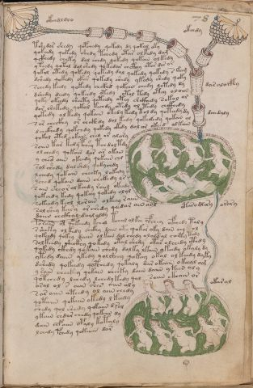

# Voynich Speculative Procedural Protocol — f78r

IMPORTANT: this is NOT a real or validated translation of the Voynich Manuscript. It is a speculative/procedural model that interprets EVA using a user-defined grammar to generate experimental recipes using safe, known edible substitutes.

This file is generated automatically from IVTFF/EVA transliteration plus a user-defined procedural grammar.



## Page / Folio
- currier: B
- folio: f78r
- page_number: 153
- section: biological

## EVA Text (Transliteration)
```text
okchdldlo
okchdy
tshedor shedy qopchedy qokedy dy qokol oky
qokeedy qokedy shedy tchedy otar olkedy dam
qckhedy cheky dol chedy qokedy qokain olkedy
yteedy qotal dol shedy qokedar chcthey otor dor or
qokal otedy qokedy qokedy dal qokedy qokedy s @176;am
dshedy qokedy okar qokedy shedy ykedy shedy qoky
schedy keedy qokedy chckhd qokain chedy qotedy dy
dshedy deedy qokeedy otedy otal tedy otey ol[o:a]iin
qoky okeedy sheety qoteedy otey shckhedy sokol or
dor shekedy qokol kechdy otedy ol tedy chckhedy
qokedy ol kedy qokain okedy kedy tol dy qot[ee:ch]dy dy
sor checkhy or chckhdy dol kedy qokededy qokan ol
dchckhedy qokchdy qokedy okedy dal or okeed olkain
qokol oted okain ched ar alory
soiin kar kedy pche'y tchdoltdy
o l chedy qokain dar ar okain
y che[s:?] aiin okeedy qokain chl
sol shedy dalshdy qokychdy
lchedy qokain cheeky lokedy
yched qokain daiin chckhdy lr
sain sheor olkchdy roiin okeedy
qokeedy kedy qokeey qokedy olol
sokeedy keol lorain olkeey raiin
sol shey kary or shedy qeedar ain anl
daiin chckhal daiil aldy
@176;orain ol qokeedy kchol tchal olkee yfchey ofchedy taly
ssheky ol kedy chckhy dain oty qokor oky dain chy ol
qokeedy qokey daiin olkain dal chedy ololdal chcht[y:?] tedy
solkeedy sheckhy qokedy otal shedy otar olchedy cthdy
qokedy ckhdy qokain chedy dalky lkain ykeedy okaly dy
ytedy daiin ykedy y olsheey qokeey okal ol keedy dyky
dshedy qokeedy qopchedy qokaly dar okaiin o keeal am
y sain checkhy qokain cheeky daiin daiin y tees ol y
qotchedy lchedy lchedykedy qol saiin ckhain or
osal ol s aiin shee' aiin oly
sar aiin oteedy ol aiin chedy
qotaiin qokaiin o[t:k]edy l keedy
shedy qol shedy qokaiin d @206;ol
ykain chdar chedy qokain dy
dain chfaiin opaly kotaly
lchedy pchedy qokaiin d[a:o]r
dar aloifhy
dchedaly
otarodla'y orory
okaral
```

## Domain Context (Heuristic; Not a Translation)

This section summarizes recurring **basewords** in this IVTFF domain and shows simple substring evidence that the token markers used by the procedural grammar occur inside frequent words.

Any Italian anagram / English gloss is a best-effort lexicon match, not a decipherment.


### Associated basewords (non-generic; top by frequency in this domain)
- `qokep` (count=160) → Italian anagram `pecco`; English: [n/a]
- `qokain` (count=159) → Italian anagram `acconi`; English: [n/a]
- `qokal` (count=108) → Italian anagram `calco`; English: cast (of sculpture)
- `paiin` (count=82) → Italian anagram `piani`; English: plans (arrangements)
- `qokaiin` (count=81) → Italian anagram `ciancio`; English: [n/a]
- `qokar` (count=45) → Italian anagram `carco`; English: [n/a]
- `okain` (count=41) → Italian anagram `acino`; English: a berry
- `okaiin` (count=31) → Italian anagram `coniai`; English: [n/a]
- `saiin` (count=30) → Italian anagram `asini`; English: [n/a]
- `olkain` (count=26) → Italian anagram `alcino`; English: smart, clever, intelligent, bright
- `qotal` (count=25) → Italian anagram `colta`; English: [n/a]
- `olchep` (count=24) → Italian anagram `colpe`; English: [n/a]
- `otain` (count=23) → Italian anagram `anito`; English: [n/a]
- `qotain` (count=20) → Italian anagram `antico`; English: ancient
- `olkep` (count=20) → Italian anagram `colpe`; English: [n/a]

### Marker evidence (substring in frequent basewords)
- `qo`: 50 basewords; examples: `qokep`, `qokain`, `qokeep`, `qol`, `qokal`, `qokaiin`
- `q`: 51 basewords; examples: `qokep`, `qokain`, `qokeep`, `qol`, `qokal`, `qokaiin`
- `o`: 184 basewords; examples: `ol`, `qokep`, `qokain`, `qokeep`, `qol`, `qokal`
- `k`: 114 basewords; examples: `qokep`, `qokain`, `qokeep`, `qokal`, `qokaiin`, `qokee`
- `t`: 73 basewords; examples: `otep`, `qotep`, `qoteep`, `tep`, `qot`, `otal`
- `p`: 112 basewords; examples: `shep`, `chep`, `qokep`, `qokeep`, `paiin`, `p`
- `ch`: 104 basewords; examples: `chep`, `che`, `lchep`, `chee`, `chckh`, `cheol`
- `sh`: 43 basewords; examples: `shep`, `she`, `sheep`, `shee`, `sheol`, `shckh`
- `f`: 1 basewords; examples: `fchep`
- `cth`: 10 basewords; examples: `chcth`, `checth`, `shecth`, `shcth`, `cthep`, `cthe`
- `ckh`: 13 basewords; examples: `chckh`, `shckh`, `checkh`, `sheckh`, `chckhe`, `chckhp`
- `cph`: 2 basewords; examples: `cphe`, `cphol`
- `iin`: 26 basewords; examples: `paiin`, `qokaiin`, `aiin`, `okaiin`, `saiin`, `qotaiin`
- `aiin`: 19 basewords; examples: `paiin`, `qokaiin`, `aiin`, `okaiin`, `saiin`, `qotaiin`

## Recipes Index (This Page)
- [f78r.1,@Lt](#f78r-1-f78r-1-lt)
- [f78r.2,@Lt](#f78r-2-f78r-2-lt)
- [f78r.3,@P0](#f78r-3-f78r-3-p0)
- [f78r.4,+P0](#f78r-4-f78r-4-p0)
- [f78r.5,+P0](#f78r-5-f78r-5-p0)
- [f78r.6,+P0](#f78r-6-f78r-6-p0)
- [f78r.7,+P0](#f78r-7-f78r-7-p0)
- [f78r.8,+P0](#f78r-8-f78r-8-p0)
- [f78r.9,+P0](#f78r-9-f78r-9-p0)
- [f78r.10,+P0](#f78r-10-f78r-10-p0)
- [f78r.11,+P0](#f78r-11-f78r-11-p0)
- [f78r.12,+P0](#f78r-12-f78r-12-p0)
- [f78r.13,+P0](#f78r-13-f78r-13-p0)
- [f78r.14,+P0](#f78r-14-f78r-14-p0)
- [f78r.15,+P0](#f78r-15-f78r-15-p0)
- [f78r.16,+P0](#f78r-16-f78r-16-p0)
- [f78r.17,+P0](#f78r-17-f78r-17-p0)
- [f78r.18,+P0](#f78r-18-f78r-18-p0)
- [f78r.19,+P0](#f78r-19-f78r-19-p0)
- [f78r.20,+P0](#f78r-20-f78r-20-p0)
- [f78r.21,+P0](#f78r-21-f78r-21-p0)
- [f78r.22,+P0](#f78r-22-f78r-22-p0)
- [f78r.23,+P0](#f78r-23-f78r-23-p0)
- [f78r.24,+P0](#f78r-24-f78r-24-p0)
- [f78r.25,+P0](#f78r-25-f78r-25-p0)
- [f78r.26,+P0](#f78r-26-f78r-26-p0)
- [f78r.27,+P0](#f78r-27-f78r-27-p0)
- [f78r.28,+P0](#f78r-28-f78r-28-p0)
- [f78r.29,+P0](#f78r-29-f78r-29-p0)
- [f78r.30,+P0](#f78r-30-f78r-30-p0)
- [f78r.31,+P0](#f78r-31-f78r-31-p0)
- [f78r.32,+P0](#f78r-32-f78r-32-p0)
- [f78r.33,+P0](#f78r-33-f78r-33-p0)
- [f78r.34,+P0](#f78r-34-f78r-34-p0)
- [f78r.35,+P0](#f78r-35-f78r-35-p0)
- [f78r.36,+P0](#f78r-36-f78r-36-p0)
- [f78r.37,+P0](#f78r-37-f78r-37-p0)
- [f78r.38,+P0](#f78r-38-f78r-38-p0)
- [f78r.39,+P0](#f78r-39-f78r-39-p0)
- [f78r.40,+P0](#f78r-40-f78r-40-p0)
- [f78r.41,+P0](#f78r-41-f78r-41-p0)
- [f78r.42,+P0](#f78r-42-f78r-42-p0)
- [f78r.43,+P0](#f78r-43-f78r-43-p0)
- [f78r.44,@Lt](#f78r-44-f78r-44-lt)
- [f78r.45,@Lt](#f78r-45-f78r-45-lt)
- [f78r.46,@Lt](#f78r-46-f78r-46-lt)
- [f78r.47,@Lt](#f78r-47-f78r-47-lt)

## Line Glosses (Procedural Gloss Only; Not a Translation)

<a id="f78r-1-f78r-1-lt"></a>

### f78r.1,@Lt

EVA: okchdldlo

Direct Gloss (Procedural, Not a Real Translation):
- okchdldlo: tokens: o k ch p l p l o → connectors: l l

<a id="f78r-2-f78r-2-lt"></a>

### f78r.2,@Lt

EVA: okchdy

Direct Gloss (Procedural, Not a Real Translation):
- okchdy: tokens: o k ch p

<a id="f78r-3-f78r-3-p0"></a>

### f78r.3,@P0

EVA: tshedor shedy qopchedy qokedy dy qokol oky

Direct Gloss (Procedural, Not a Real Translation):
- tshedor: tokens: t sh e p o r → connectors: r → vowel_run: e (level 1; class e)
- shedy: tokens: sh e p → vowel_run: e (level 1; class e)
- qopchedy: tokens: qo p ch e p → vowel_run: e (level 1; class e)
- qokedy: tokens: qo k e p → vowel_run: e (level 1; class e) (lexicon-context: `qokep` → `pecco`; [n/a])
- dy: tokens: p
- qokol: tokens: qo k o l → connectors: l
- oky: tokens: o k

<a id="f78r-4-f78r-4-p0"></a>

### f78r.4,+P0

EVA: qokeedy qokedy shedy tchedy otar olkedy dam

Direct Gloss (Procedural, Not a Real Translation):
- qokeedy: tokens: qo k ee p → vowel_run: ee (level 2; class e)
- qokedy: tokens: qo k e p → vowel_run: e (level 1; class e) (lexicon-context: `qokep` → `pecco`; [n/a])
- shedy: tokens: sh e p → vowel_run: e (level 1; class e)
- tchedy: tokens: t ch e p → vowel_run: e (level 1; class e)
- otar: tokens: o t a r → connectors: r → vowel_run: a (level 1; class a)
- olkedy: tokens: o l k e p → connectors: l → vowel_run: e (level 1; class e) (lexicon-context: `olkep` → `colpe`; [n/a])
- dam: tokens: p a m → connectors: m → vowel_run: a (level 1; class a)

<a id="f78r-5-f78r-5-p0"></a>

### f78r.5,+P0

EVA: qckhedy cheky dol chedy qokedy qokain olkedy

Direct Gloss (Procedural, Not a Real Translation):
- qckhedy: tokens: q ckh e p → vowel_run: e (level 1; class e)
- cheky: tokens: ch e k → vowel_run: e (level 1; class e)
- dol: tokens: p o l → connectors: l
- chedy: tokens: ch e p → vowel_run: e (level 1; class e)
- qokedy: tokens: qo k e p → vowel_run: e (level 1; class e) (lexicon-context: `qokep` → `pecco`; [n/a])
- qokain: tokens: qo k a i n → connectors: n → vowel_run: a (level 1; class a) (lexicon-context: `qokain` → `concia`; tanning)
- olkedy: tokens: o l k e p → connectors: l → vowel_run: e (level 1; class e) (lexicon-context: `olkep` → `colpe`; [n/a])

<a id="f78r-6-f78r-6-p0"></a>

### f78r.6,+P0

EVA: yteedy qotal dol shedy qokedar chcthey otor dor or

Direct Gloss (Procedural, Not a Real Translation):
- yteedy: tokens: t ee p → vowel_run: ee (level 2; class e)
- qotal: tokens: qo t a l → connectors: l → vowel_run: a (level 1; class a) (lexicon-context: `qotal` → `colta`; [n/a])
- dol: tokens: p o l → connectors: l
- shedy: tokens: sh e p → vowel_run: e (level 1; class e)
- qokedar: tokens: qo k e p a r → connectors: r → vowel_run: e (level 1; class e) (lexicon-context: `qokep` → `pecco`; [n/a])
- chcthey: tokens: ch cth e → vowel_run: e (level 1; class e)
- otor: tokens: o t o r → connectors: r
- dor: tokens: p o r → connectors: r
- or: tokens: o r → connectors: r

<a id="f78r-7-f78r-7-p0"></a>

### f78r.7,+P0

EVA: qokal otedy qokedy qokedy dal qokedy qokedy s @176;am

Direct Gloss (Procedural, Not a Real Translation):
- qokal: tokens: qo k a l → connectors: l → vowel_run: a (level 1; class a) (lexicon-context: `qokal` → `calco`; cast (of sculpture))
- otedy: tokens: o t e p → vowel_run: e (level 1; class e)
- qokedy: tokens: qo k e p → vowel_run: e (level 1; class e) (lexicon-context: `qokep` → `pecco`; [n/a])
- qokedy: tokens: qo k e p → vowel_run: e (level 1; class e) (lexicon-context: `qokep` → `pecco`; [n/a])
- dal: tokens: p a l → connectors: l → vowel_run: a (level 1; class a)
- qokedy: tokens: qo k e p → vowel_run: e (level 1; class e) (lexicon-context: `qokep` → `pecco`; [n/a])
- qokedy: tokens: qo k e p → vowel_run: e (level 1; class e) (lexicon-context: `qokep` → `pecco`; [n/a])
- s: tokens: s → connectors: s
- am: tokens: a m → connectors: m → vowel_run: a (level 1; class a)

<a id="f78r-8-f78r-8-p0"></a>

### f78r.8,+P0

EVA: dshedy qokedy okar qokedy shedy ykedy shedy qoky

Direct Gloss (Procedural, Not a Real Translation):
- dshedy: tokens: p sh e p → vowel_run: e (level 1; class e)
- qokedy: tokens: qo k e p → vowel_run: e (level 1; class e) (lexicon-context: `qokep` → `pecco`; [n/a])
- okar: tokens: o k a r → connectors: r → vowel_run: a (level 1; class a)
- qokedy: tokens: qo k e p → vowel_run: e (level 1; class e) (lexicon-context: `qokep` → `pecco`; [n/a])
- shedy: tokens: sh e p → vowel_run: e (level 1; class e)
- ykedy: tokens: k e p → vowel_run: e (level 1; class e)
- shedy: tokens: sh e p → vowel_run: e (level 1; class e)
- qoky: tokens: qo k

<a id="f78r-9-f78r-9-p0"></a>

### f78r.9,+P0

EVA: schedy keedy qokedy chckhd qokain chedy qotedy dy

Direct Gloss (Procedural, Not a Real Translation):
- schedy: tokens: s ch e p → connectors: s → vowel_run: e (level 1; class e)
- keedy: tokens: k ee p → vowel_run: ee (level 2; class e)
- qokedy: tokens: qo k e p → vowel_run: e (level 1; class e) (lexicon-context: `qokep` → `pecco`; [n/a])
- chckhd: tokens: ch ckh p
- qokain: tokens: qo k a i n → connectors: n → vowel_run: a (level 1; class a) (lexicon-context: `qokain` → `concia`; tanning)
- chedy: tokens: ch e p → vowel_run: e (level 1; class e)
- qotedy: tokens: qo t e p → vowel_run: e (level 1; class e)
- dy: tokens: p

<a id="f78r-10-f78r-10-p0"></a>

### f78r.10,+P0

EVA: dshedy deedy qokeedy otedy otal tedy otey ol[o:a]iin

Direct Gloss (Procedural, Not a Real Translation):
- dshedy: tokens: p sh e p → vowel_run: e (level 1; class e)
- deedy: tokens: p ee p → vowel_run: ee (level 2; class e)
- qokeedy: tokens: qo k ee p → vowel_run: ee (level 2; class e)
- otedy: tokens: o t e p → vowel_run: e (level 1; class e)
- otal: tokens: o t a l → connectors: l → vowel_run: a (level 1; class a)
- tedy: tokens: t e p → vowel_run: e (level 1; class e)
- otey: tokens: o t e → vowel_run: e (level 1; class e)
- ol: tokens: o l → connectors: l
- o: tokens: o
- a: tokens: a → vowel_run: a (level 1; class a)
- iin: tokens: iin → vowel_run: ii (level 2; class i) → suffix: iin

<a id="f78r-11-f78r-11-p0"></a>

### f78r.11,+P0

EVA: qoky okeedy sheety qoteedy otey shckhedy sokol or

Direct Gloss (Procedural, Not a Real Translation):
- qoky: tokens: qo k
- okeedy: tokens: o k ee p → vowel_run: ee (level 2; class e)
- sheety: tokens: sh ee t → vowel_run: ee (level 2; class e)
- qoteedy: tokens: qo t ee p → vowel_run: ee (level 2; class e)
- otey: tokens: o t e → vowel_run: e (level 1; class e)
- shckhedy: tokens: sh ckh e p → vowel_run: e (level 1; class e)
- sokol: tokens: s o k o l → connectors: s l
- or: tokens: o r → connectors: r

<a id="f78r-12-f78r-12-p0"></a>

### f78r.12,+P0

EVA: dor shekedy qokol kechdy otedy ol tedy chckhedy

Direct Gloss (Procedural, Not a Real Translation):
- dor: tokens: p o r → connectors: r
- shekedy: tokens: sh e k e p → vowel_run: e (level 1; class e)
- qokol: tokens: qo k o l → connectors: l
- kechdy: tokens: k e ch p → vowel_run: e (level 1; class e)
- otedy: tokens: o t e p → vowel_run: e (level 1; class e)
- ol: tokens: o l → connectors: l
- tedy: tokens: t e p → vowel_run: e (level 1; class e)
- chckhedy: tokens: ch ckh e p → vowel_run: e (level 1; class e)

<a id="f78r-13-f78r-13-p0"></a>

### f78r.13,+P0

EVA: qokedy ol kedy qokain okedy kedy tol dy qot[ee:ch]dy dy

Direct Gloss (Procedural, Not a Real Translation):
- qokedy: tokens: qo k e p → vowel_run: e (level 1; class e) (lexicon-context: `qokep` → `pecco`; [n/a])
- ol: tokens: o l → connectors: l
- kedy: tokens: k e p → vowel_run: e (level 1; class e)
- qokain: tokens: qo k a i n → connectors: n → vowel_run: a (level 1; class a) (lexicon-context: `qokain` → `concia`; tanning)
- okedy: tokens: o k e p → vowel_run: e (level 1; class e)
- kedy: tokens: k e p → vowel_run: e (level 1; class e)
- tol: tokens: t o l → connectors: l
- dy: tokens: p
- qot: tokens: qo t
- ee: tokens: ee → vowel_run: ee (level 2; class e)
- ch: tokens: ch
- dy: tokens: p
- dy: tokens: p

<a id="f78r-14-f78r-14-p0"></a>

### f78r.14,+P0

EVA: sor checkhy or chckhdy dol kedy qokededy qokan ol

Direct Gloss (Procedural, Not a Real Translation):
- sor: tokens: s o r → connectors: s r
- checkhy: tokens: ch e ckh → vowel_run: e (level 1; class e)
- or: tokens: o r → connectors: r
- chckhdy: tokens: ch ckh p
- dol: tokens: p o l → connectors: l
- kedy: tokens: k e p → vowel_run: e (level 1; class e)
- qokededy: tokens: qo k e p e p → vowel_run: e (level 1; class e) (lexicon-context: `qokep` → `pecco`; [n/a])
- qokan: tokens: qo k a n → connectors: n → vowel_run: a (level 1; class a)
- ol: tokens: o l → connectors: l

<a id="f78r-15-f78r-15-p0"></a>

### f78r.15,+P0

EVA: dchckhedy qokchdy qokedy okedy dal or okeed olkain

Direct Gloss (Procedural, Not a Real Translation):
- dchckhedy: tokens: p ch ckh e p → vowel_run: e (level 1; class e)
- qokchdy: tokens: qo k ch p
- qokedy: tokens: qo k e p → vowel_run: e (level 1; class e) (lexicon-context: `qokep` → `pecco`; [n/a])
- okedy: tokens: o k e p → vowel_run: e (level 1; class e)
- dal: tokens: p a l → connectors: l → vowel_run: a (level 1; class a)
- or: tokens: o r → connectors: r
- okeed: tokens: o k ee p → vowel_run: ee (level 2; class e)
- olkain: tokens: o l k a i n → connectors: l n → vowel_run: a (level 1; class a) (lexicon-context: `olkain` → `calino`; [n/a])

<a id="f78r-16-f78r-16-p0"></a>

### f78r.16,+P0

EVA: qokol oted okain ched ar alory

Direct Gloss (Procedural, Not a Real Translation):
- qokol: tokens: qo k o l → connectors: l
- oted: tokens: o t e p → vowel_run: e (level 1; class e)
- okain: tokens: o k a i n → connectors: n → vowel_run: a (level 1; class a) (lexicon-context: `okain` → `conia`; [n/a])
- ched: tokens: ch e p → vowel_run: e (level 1; class e)
- ar: tokens: a r → connectors: r → vowel_run: a (level 1; class a)
- alory: tokens: a l o r → connectors: l r → vowel_run: a (level 1; class a)

<a id="f78r-17-f78r-17-p0"></a>

### f78r.17,+P0

EVA: soiin kar kedy pche'y tchdoltdy

Direct Gloss (Procedural, Not a Real Translation):
- soiin: tokens: s o iin → connectors: s → vowel_run: ii (level 2; class i) → suffix: iin
- kar: tokens: k a r → connectors: r → vowel_run: a (level 1; class a)
- kedy: tokens: k e p → vowel_run: e (level 1; class e)
- pche: tokens: p ch e → vowel_run: e (level 1; class e)
- y: [unparsed]
- tchdoltdy: tokens: t ch p o l t p → connectors: l

<a id="f78r-18-f78r-18-p0"></a>

### f78r.18,+P0

EVA: o l chedy qokain dar ar okain

Direct Gloss (Procedural, Not a Real Translation):
- o: tokens: o
- l: tokens: l → connectors: l
- chedy: tokens: ch e p → vowel_run: e (level 1; class e)
- qokain: tokens: qo k a i n → connectors: n → vowel_run: a (level 1; class a) (lexicon-context: `qokain` → `concia`; tanning)
- dar: tokens: p a r → connectors: r → vowel_run: a (level 1; class a)
- ar: tokens: a r → connectors: r → vowel_run: a (level 1; class a)
- okain: tokens: o k a i n → connectors: n → vowel_run: a (level 1; class a) (lexicon-context: `okain` → `conia`; [n/a])

<a id="f78r-19-f78r-19-p0"></a>

### f78r.19,+P0

EVA: y che[s:?] aiin okeedy qokain chl

Direct Gloss (Procedural, Not a Real Translation):
- y: [unparsed]
- che: tokens: ch e → vowel_run: e (level 1; class e)
- s: tokens: s → connectors: s
- aiin: tokens: aiin → vowel_run: a (level 1; class a) → suffix: aiin
- okeedy: tokens: o k ee p → vowel_run: ee (level 2; class e)
- qokain: tokens: qo k a i n → connectors: n → vowel_run: a (level 1; class a) (lexicon-context: `qokain` → `concia`; tanning)
- chl: tokens: ch l → connectors: l

<a id="f78r-20-f78r-20-p0"></a>

### f78r.20,+P0

EVA: sol shedy dalshdy qokychdy

Direct Gloss (Procedural, Not a Real Translation):
- sol: tokens: s o l → connectors: s l
- shedy: tokens: sh e p → vowel_run: e (level 1; class e)
- dalshdy: tokens: p a l sh p → connectors: l → vowel_run: a (level 1; class a)
- qokychdy: tokens: qo k ch p

<a id="f78r-21-f78r-21-p0"></a>

### f78r.21,+P0

EVA: lchedy qokain cheeky lokedy

Direct Gloss (Procedural, Not a Real Translation):
- lchedy: tokens: l ch e p → connectors: l → vowel_run: e (level 1; class e)
- qokain: tokens: qo k a i n → connectors: n → vowel_run: a (level 1; class a) (lexicon-context: `qokain` → `concia`; tanning)
- cheeky: tokens: ch ee k → vowel_run: ee (level 2; class e)
- lokedy: tokens: l o k e p → connectors: l → vowel_run: e (level 1; class e)

<a id="f78r-22-f78r-22-p0"></a>

### f78r.22,+P0

EVA: yched qokain daiin chckhdy lr

Direct Gloss (Procedural, Not a Real Translation):
- yched: tokens: ch e p → vowel_run: e (level 1; class e)
- qokain: tokens: qo k a i n → connectors: n → vowel_run: a (level 1; class a) (lexicon-context: `qokain` → `concia`; tanning)
- daiin: tokens: p aiin → vowel_run: a (level 1; class a) → suffix: aiin (lexicon-context: `paiin` → `piani`; plans (arrangements))
- chckhdy: tokens: ch ckh p
- lr: tokens: l r → connectors: l r

<a id="f78r-23-f78r-23-p0"></a>

### f78r.23,+P0

EVA: sain sheor olkchdy roiin okeedy

Direct Gloss (Procedural, Not a Real Translation):
- sain: tokens: s a i n → connectors: s n → vowel_run: a (level 1; class a)
- sheor: tokens: sh e o r → connectors: r → vowel_run: e (level 1; class e)
- olkchdy: tokens: o l k ch p → connectors: l
- roiin: tokens: r o iin → connectors: r → vowel_run: ii (level 2; class i) → suffix: iin
- okeedy: tokens: o k ee p → vowel_run: ee (level 2; class e)

<a id="f78r-24-f78r-24-p0"></a>

### f78r.24,+P0

EVA: qokeedy kedy qokeey qokedy olol

Direct Gloss (Procedural, Not a Real Translation):
- qokeedy: tokens: qo k ee p → vowel_run: ee (level 2; class e)
- kedy: tokens: k e p → vowel_run: e (level 1; class e)
- qokeey: tokens: qo k ee → vowel_run: ee (level 2; class e)
- qokedy: tokens: qo k e p → vowel_run: e (level 1; class e) (lexicon-context: `qokep` → `pecco`; [n/a])
- olol: tokens: o l o l → connectors: l l

<a id="f78r-25-f78r-25-p0"></a>

### f78r.25,+P0

EVA: sokeedy keol lorain olkeey raiin

Direct Gloss (Procedural, Not a Real Translation):
- sokeedy: tokens: s o k ee p → connectors: s → vowel_run: ee (level 2; class e)
- keol: tokens: k e o l → connectors: l → vowel_run: e (level 1; class e)
- lorain: tokens: l o r a i n → connectors: l r n → vowel_run: a (level 1; class a)
- olkeey: tokens: o l k ee → connectors: l → vowel_run: ee (level 2; class e)
- raiin: tokens: r aiin → connectors: r → vowel_run: a (level 1; class a) → suffix: aiin

<a id="f78r-26-f78r-26-p0"></a>

### f78r.26,+P0

EVA: sol shey kary or shedy qeedar ain anl

Direct Gloss (Procedural, Not a Real Translation):
- sol: tokens: s o l → connectors: s l
- shey: tokens: sh e → vowel_run: e (level 1; class e)
- kary: tokens: k a r → connectors: r → vowel_run: a (level 1; class a)
- or: tokens: o r → connectors: r
- shedy: tokens: sh e p → vowel_run: e (level 1; class e)
- qeedar: tokens: q ee p a r → connectors: r → vowel_run: ee (level 2; class e)
- ain: tokens: a i n → connectors: n → vowel_run: a (level 1; class a)
- anl: tokens: a n l → connectors: n l → vowel_run: a (level 1; class a)

<a id="f78r-27-f78r-27-p0"></a>

### f78r.27,+P0

EVA: daiin chckhal daiil aldy

Direct Gloss (Procedural, Not a Real Translation):
- daiin: tokens: p aiin → vowel_run: a (level 1; class a) → suffix: aiin (lexicon-context: `paiin` → `piani`; plans (arrangements))
- chckhal: tokens: ch ckh a l → connectors: l → vowel_run: a (level 1; class a)
- daiil: tokens: p a ii l → connectors: l → vowel_run: a (level 1; class a)
- aldy: tokens: a l p → connectors: l → vowel_run: a (level 1; class a)

<a id="f78r-28-f78r-28-p0"></a>

### f78r.28,+P0

EVA: @176;orain ol qokeedy kchol tchal olkee yfchey ofchedy taly

Direct Gloss (Procedural, Not a Real Translation):
- orain: tokens: o r a i n → connectors: r n → vowel_run: a (level 1; class a)
- ol: tokens: o l → connectors: l
- qokeedy: tokens: qo k ee p → vowel_run: ee (level 2; class e)
- kchol: tokens: k ch o l → connectors: l
- tchal: tokens: t ch a l → connectors: l → vowel_run: a (level 1; class a)
- olkee: tokens: o l k ee → connectors: l → vowel_run: ee (level 2; class e)
- yfchey: tokens: f ch e → vowel_run: e (level 1; class e)
- ofchedy: tokens: o f ch e p → vowel_run: e (level 1; class e)
- taly: tokens: t a l → connectors: l → vowel_run: a (level 1; class a)

<a id="f78r-29-f78r-29-p0"></a>

### f78r.29,+P0

EVA: ssheky ol kedy chckhy dain oty qokor oky dain chy ol

Direct Gloss (Procedural, Not a Real Translation):
- ssheky: tokens: s sh e k → connectors: s → vowel_run: e (level 1; class e)
- ol: tokens: o l → connectors: l
- kedy: tokens: k e p → vowel_run: e (level 1; class e)
- chckhy: tokens: ch ckh
- dain: tokens: p a i n → connectors: n → vowel_run: a (level 1; class a)
- oty: tokens: o t
- qokor: tokens: qo k o r → connectors: r
- oky: tokens: o k
- dain: tokens: p a i n → connectors: n → vowel_run: a (level 1; class a)
- chy: tokens: ch
- ol: tokens: o l → connectors: l

<a id="f78r-30-f78r-30-p0"></a>

### f78r.30,+P0

EVA: qokeedy qokey daiin olkain dal chedy ololdal chcht[y:?] tedy

Direct Gloss (Procedural, Not a Real Translation):
- qokeedy: tokens: qo k ee p → vowel_run: ee (level 2; class e)
- qokey: tokens: qo k e → vowel_run: e (level 1; class e)
- daiin: tokens: p aiin → vowel_run: a (level 1; class a) → suffix: aiin (lexicon-context: `paiin` → `piani`; plans (arrangements))
- olkain: tokens: o l k a i n → connectors: l n → vowel_run: a (level 1; class a) (lexicon-context: `olkain` → `calino`; [n/a])
- dal: tokens: p a l → connectors: l → vowel_run: a (level 1; class a)
- chedy: tokens: ch e p → vowel_run: e (level 1; class e)
- ololdal: tokens: o l o l p a l → connectors: l l l → vowel_run: a (level 1; class a)
- chcht: tokens: ch ch t
- y: [unparsed]
- tedy: tokens: t e p → vowel_run: e (level 1; class e)

<a id="f78r-31-f78r-31-p0"></a>

### f78r.31,+P0

EVA: solkeedy sheckhy qokedy otal shedy otar olchedy cthdy

Direct Gloss (Procedural, Not a Real Translation):
- solkeedy: tokens: s o l k ee p → connectors: s l → vowel_run: ee (level 2; class e)
- sheckhy: tokens: sh e ckh → vowel_run: e (level 1; class e)
- qokedy: tokens: qo k e p → vowel_run: e (level 1; class e) (lexicon-context: `qokep` → `pecco`; [n/a])
- otal: tokens: o t a l → connectors: l → vowel_run: a (level 1; class a)
- shedy: tokens: sh e p → vowel_run: e (level 1; class e)
- otar: tokens: o t a r → connectors: r → vowel_run: a (level 1; class a)
- olchedy: tokens: o l ch e p → connectors: l → vowel_run: e (level 1; class e) (lexicon-context: `olchep` → `colpe`; [n/a])
- cthdy: tokens: cth p

<a id="f78r-32-f78r-32-p0"></a>

### f78r.32,+P0

EVA: qokedy ckhdy qokain chedy dalky lkain ykeedy okaly dy

Direct Gloss (Procedural, Not a Real Translation):
- qokedy: tokens: qo k e p → vowel_run: e (level 1; class e) (lexicon-context: `qokep` → `pecco`; [n/a])
- ckhdy: tokens: ckh p
- qokain: tokens: qo k a i n → connectors: n → vowel_run: a (level 1; class a) (lexicon-context: `qokain` → `concia`; tanning)
- chedy: tokens: ch e p → vowel_run: e (level 1; class e)
- dalky: tokens: p a l k → connectors: l → vowel_run: a (level 1; class a)
- lkain: tokens: l k a i n → connectors: l n → vowel_run: a (level 1; class a) (lexicon-context: `lkain` → `lanci`; [n/a])
- ykeedy: tokens: k ee p → vowel_run: ee (level 2; class e)
- okaly: tokens: o k a l → connectors: l → vowel_run: a (level 1; class a)
- dy: tokens: p

<a id="f78r-33-f78r-33-p0"></a>

### f78r.33,+P0

EVA: ytedy daiin ykedy y olsheey qokeey okal ol keedy dyky

Direct Gloss (Procedural, Not a Real Translation):
- ytedy: tokens: t e p → vowel_run: e (level 1; class e)
- daiin: tokens: p aiin → vowel_run: a (level 1; class a) → suffix: aiin (lexicon-context: `paiin` → `piani`; plans (arrangements))
- ykedy: tokens: k e p → vowel_run: e (level 1; class e)
- y: [unparsed]
- olsheey: tokens: o l sh ee → connectors: l → vowel_run: ee (level 2; class e)
- qokeey: tokens: qo k ee → vowel_run: ee (level 2; class e)
- okal: tokens: o k a l → connectors: l → vowel_run: a (level 1; class a)
- ol: tokens: o l → connectors: l
- keedy: tokens: k ee p → vowel_run: ee (level 2; class e)
- dyky: tokens: p k

<a id="f78r-34-f78r-34-p0"></a>

### f78r.34,+P0

EVA: dshedy qokeedy qopchedy qokaly dar okaiin o keeal am

Direct Gloss (Procedural, Not a Real Translation):
- dshedy: tokens: p sh e p → vowel_run: e (level 1; class e)
- qokeedy: tokens: qo k ee p → vowel_run: ee (level 2; class e)
- qopchedy: tokens: qo p ch e p → vowel_run: e (level 1; class e)
- qokaly: tokens: qo k a l → connectors: l → vowel_run: a (level 1; class a) (lexicon-context: `qokal` → `calco`; cast (of sculpture))
- dar: tokens: p a r → connectors: r → vowel_run: a (level 1; class a)
- okaiin: tokens: o k aiin → vowel_run: a (level 1; class a) → suffix: aiin (lexicon-context: `okaiin` → `coniai`; [n/a])
- o: tokens: o
- keeal: tokens: k ee a l → connectors: l → vowel_run: ee (level 2; class e)
- am: tokens: a m → connectors: m → vowel_run: a (level 1; class a)

<a id="f78r-35-f78r-35-p0"></a>

### f78r.35,+P0

EVA: y sain checkhy qokain cheeky daiin daiin y tees ol y

Direct Gloss (Procedural, Not a Real Translation):
- y: [unparsed]
- sain: tokens: s a i n → connectors: s n → vowel_run: a (level 1; class a)
- checkhy: tokens: ch e ckh → vowel_run: e (level 1; class e)
- qokain: tokens: qo k a i n → connectors: n → vowel_run: a (level 1; class a) (lexicon-context: `qokain` → `concia`; tanning)
- cheeky: tokens: ch ee k → vowel_run: ee (level 2; class e)
- daiin: tokens: p aiin → vowel_run: a (level 1; class a) → suffix: aiin (lexicon-context: `paiin` → `piani`; plans (arrangements))
- daiin: tokens: p aiin → vowel_run: a (level 1; class a) → suffix: aiin (lexicon-context: `paiin` → `piani`; plans (arrangements))
- y: [unparsed]
- tees: tokens: t ee s → connectors: s → vowel_run: ee (level 2; class e)
- ol: tokens: o l → connectors: l
- y: [unparsed]

<a id="f78r-36-f78r-36-p0"></a>

### f78r.36,+P0

EVA: qotchedy lchedy lchedykedy qol saiin ckhain or

Direct Gloss (Procedural, Not a Real Translation):
- qotchedy: tokens: qo t ch e p → vowel_run: e (level 1; class e)
- lchedy: tokens: l ch e p → connectors: l → vowel_run: e (level 1; class e)
- lchedykedy: tokens: l ch e p k e p → connectors: l → vowel_run: e (level 1; class e)
- qol: tokens: qo l → connectors: l
- saiin: tokens: s aiin → connectors: s → vowel_run: a (level 1; class a) → suffix: aiin (lexicon-context: `saiin` → `asini`; [n/a])
- ckhain: tokens: ckh a i n → connectors: n → vowel_run: a (level 1; class a)
- or: tokens: o r → connectors: r

<a id="f78r-37-f78r-37-p0"></a>

### f78r.37,+P0

EVA: osal ol s aiin shee' aiin oly

Direct Gloss (Procedural, Not a Real Translation):
- osal: tokens: o s a l → connectors: s l → vowel_run: a (level 1; class a)
- ol: tokens: o l → connectors: l
- s: tokens: s → connectors: s
- aiin: tokens: aiin → vowel_run: a (level 1; class a) → suffix: aiin
- shee: tokens: sh ee → vowel_run: ee (level 2; class e)
- aiin: tokens: aiin → vowel_run: a (level 1; class a) → suffix: aiin
- oly: tokens: o l → connectors: l

<a id="f78r-38-f78r-38-p0"></a>

### f78r.38,+P0

EVA: sar aiin oteedy ol aiin chedy

Direct Gloss (Procedural, Not a Real Translation):
- sar: tokens: s a r → connectors: s r → vowel_run: a (level 1; class a)
- aiin: tokens: aiin → vowel_run: a (level 1; class a) → suffix: aiin
- oteedy: tokens: o t ee p → vowel_run: ee (level 2; class e)
- ol: tokens: o l → connectors: l
- aiin: tokens: aiin → vowel_run: a (level 1; class a) → suffix: aiin
- chedy: tokens: ch e p → vowel_run: e (level 1; class e)

<a id="f78r-39-f78r-39-p0"></a>

### f78r.39,+P0

EVA: qotaiin qokaiin o[t:k]edy l keedy

Direct Gloss (Procedural, Not a Real Translation):
- qotaiin: tokens: qo t aiin → vowel_run: a (level 1; class a) → suffix: aiin (lexicon-context: `qotaiin` → `coniati`; [n/a])
- qokaiin: tokens: qo k aiin → vowel_run: a (level 1; class a) → suffix: aiin (lexicon-context: `qokaiin` → `conciai`; [n/a])
- o: tokens: o
- t: tokens: t
- k: tokens: k
- edy: tokens: e p → vowel_run: e (level 1; class e)
- l: tokens: l → connectors: l
- keedy: tokens: k ee p → vowel_run: ee (level 2; class e)

<a id="f78r-40-f78r-40-p0"></a>

### f78r.40,+P0

EVA: shedy qol shedy qokaiin d @206;ol

Direct Gloss (Procedural, Not a Real Translation):
- shedy: tokens: sh e p → vowel_run: e (level 1; class e)
- qol: tokens: qo l → connectors: l
- shedy: tokens: sh e p → vowel_run: e (level 1; class e)
- qokaiin: tokens: qo k aiin → vowel_run: a (level 1; class a) → suffix: aiin (lexicon-context: `qokaiin` → `conciai`; [n/a])
- d: tokens: p
- ol: tokens: o l → connectors: l

<a id="f78r-41-f78r-41-p0"></a>

### f78r.41,+P0

EVA: ykain chdar chedy qokain dy

Direct Gloss (Procedural, Not a Real Translation):
- ykain: tokens: k a i n → connectors: n → vowel_run: a (level 1; class a)
- chdar: tokens: ch p a r → connectors: r → vowel_run: a (level 1; class a)
- chedy: tokens: ch e p → vowel_run: e (level 1; class e)
- qokain: tokens: qo k a i n → connectors: n → vowel_run: a (level 1; class a) (lexicon-context: `qokain` → `concia`; tanning)
- dy: tokens: p

<a id="f78r-42-f78r-42-p0"></a>

### f78r.42,+P0

EVA: dain chfaiin opaly kotaly

Direct Gloss (Procedural, Not a Real Translation):
- dain: tokens: p a i n → connectors: n → vowel_run: a (level 1; class a)
- chfaiin: tokens: ch f aiin → vowel_run: a (level 1; class a) → suffix: aiin
- opaly: tokens: o p a l → connectors: l → vowel_run: a (level 1; class a)
- kotaly: tokens: k o t a l → connectors: l → vowel_run: a (level 1; class a)

<a id="f78r-43-f78r-43-p0"></a>

### f78r.43,+P0

EVA: lchedy pchedy qokaiin d[a:o]r

Direct Gloss (Procedural, Not a Real Translation):
- lchedy: tokens: l ch e p → connectors: l → vowel_run: e (level 1; class e)
- pchedy: tokens: p ch e p → vowel_run: e (level 1; class e)
- qokaiin: tokens: qo k aiin → vowel_run: a (level 1; class a) → suffix: aiin (lexicon-context: `qokaiin` → `conciai`; [n/a])
- d: tokens: p
- a: tokens: a → vowel_run: a (level 1; class a)
- o: tokens: o
- r: tokens: r → connectors: r

<a id="f78r-44-f78r-44-lt"></a>

### f78r.44,@Lt

EVA: dar aloifhy

Direct Gloss (Procedural, Not a Real Translation):
- dar: tokens: p a r → connectors: r → vowel_run: a (level 1; class a)
- aloifhy: tokens: a l o i f h → connectors: l → vowel_run: a (level 1; class a) → unmodeled_tokens: h

<a id="f78r-45-f78r-45-lt"></a>

### f78r.45,@Lt

EVA: dchedaly

Direct Gloss (Procedural, Not a Real Translation):
- dchedaly: tokens: p ch e p a l → connectors: l → vowel_run: e (level 1; class e)

<a id="f78r-46-f78r-46-lt"></a>

### f78r.46,@Lt

EVA: otarodla'y orory

Direct Gloss (Procedural, Not a Real Translation):
- otarodla: tokens: o t a r o p l a → connectors: r l → vowel_run: a (level 1; class a)
- y: [unparsed]
- orory: tokens: o r o r → connectors: r r

<a id="f78r-47-f78r-47-lt"></a>

### f78r.47,@Lt

EVA: okaral

Direct Gloss (Procedural, Not a Real Translation):
- okaral: tokens: o k a r a l → connectors: r l → vowel_run: a (level 1; class a)
