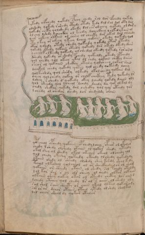

# Voynich Speculative Procedural Protocol — f78v

IMPORTANT: this is NOT a real or validated translation of the Voynich Manuscript. It is a speculative/procedural model that interprets EVA using a user-defined grammar to generate experimental recipes using safe, known edible substitutes.

This file is generated automatically from IVTFF/EVA transliteration plus a user-defined procedural grammar.



## Page / Folio
- currier: B
- folio: f78v
- page_number: 154
- section: biological

## EVA Text (Transliteration)
```text
@177;ykedy olfchedy qokedy spchy chedy rol dor ofchedy qokedy
olshedy qokedy rshedy cthdy otedy kedy dal dal dol oty dal
qokedy chety qolshedy okedy dol eesolchey qotedy ol dam
ol chy lshdy lcheckhy ol keedy lcheckhey l olkedykain ol
qor olkeey olkain ol chsey ol cheeky dar okal dal olchedy
ety okeey or ch'eey ykeey lchey qokain okedy qokedy qol
otor y shedy otedy shedy qokeedy qokedy otar otedy
qokedy otedy qokain oteedy qokeedy dar okedy dkedy dain
y cheolk o lkeedy qokedy ol chedol okeedy qotedy rorarol
dshedy qokedy or shedy pchedy qoke[@166;:ee]dy okedy opchedy
qol chedy qol okeey ykal ol chdy qokain chcthy daiin
sheor ol qokaiin shckhy otaly qolsheey qokal sain
dchokol chedy qokedy qokey qol chedy qokeedy lchey
qolkeshdy qol shedy olkedy okol chedy qokain dal
cheey qolchedy qokey or cheef chckhey tedy qokedy ls
lshey r shedy d qokedy okey lchedy qokdy daiin oly
qol sheedy qol lcheol lchdy dchdy da qar olkal dy
chedy shckhy qokedy dal lshckhy qol qol oteedy qor
lchedy ol chedar shedy lor shedaldy orain
qofcheol opchedy qokain op chedy lchey cphar ol okalor
chedy lshedy olshedy otaiin ol qokar shedy yteedy
[o:y]kol shey ol shedy okal okchey okeol ol chedy qol
qol chedy okeshy qoteedy okeedy ol shedy qokedy dy
ytaiin shedy ol sheedy olshdy shey kshdy shol kedy
teeol olkeshey qolcheol ol or sheckhedy or ol sham
qokaiin or sheedy otain ol shedy sol fchedy otaldy
lol kar shr r ol ols sheey ol chedy oltar olkaiin
olkain shey qokey okar ol oteedy chcthy los aiin d
lchedy otchey qol chedy lr al s aiiin ol shedy ary
sal shol sain sheety or oiiin okal oltal qokar ary
sor ar or dchor otaiin otain ytedy olshdy sholkal
lol cheor sheol dy qokar otalor
```

## Domain Context (Heuristic; Not a Translation)

This section summarizes recurring **basewords** in this IVTFF domain and shows simple substring evidence that the token markers used by the procedural grammar occur inside frequent words.

Any Italian anagram / English gloss is a best-effort lexicon match, not a decipherment.


### Associated basewords (non-generic; top by frequency in this domain)
- `qokain` (count=158) → Italian anagram `acconi`; English: [n/a]
- `qokal` (count=102) → Italian anagram `calco`; English: cast (of sculpture)
- `daiin` (count=81) → Italian anagram `piani`; English: plans (arrangements)
- `qokaiin` (count=81) → Italian anagram `ciancio`; English: [n/a]
- `qokar` (count=45) → Italian anagram `carco`; English: [n/a]
- `okain` (count=40) → Italian anagram `acino`; English: a berry
- `okaiin` (count=31) → Italian anagram `coniai`; English: [n/a]
- `saiin` (count=30) → Italian anagram `asini`; English: [n/a]
- `olkain` (count=26) → Italian anagram `alcino`; English: smart, clever, intelligent, bright
- `qotal` (count=25) → Italian anagram `colta`; English: [n/a]
- `otain` (count=23) → Italian anagram `anito`; English: [n/a]
- `qotain` (count=20) → Italian anagram `antico`; English: ancient
- `qotar` (count=16) → Italian anagram `corta`; English: [n/a]
- `qotaiin` (count=13) → Italian anagram `cationi`; English: [n/a]
- `kaiin` (count=7) → Italian anagram `acini`; English: [n/a]

### Marker evidence (substring in frequent basewords)
- `qo`: 49 basewords; examples: `qokain`, `qokedy`, `qokeedy`, `qol`, `qokal`, `qokaiin`
- `q`: 50 basewords; examples: `qokain`, `qokedy`, `qokeedy`, `qol`, `qokal`, `qokaiin`
- `o`: 173 basewords; examples: `ol`, `qokain`, `qokedy`, `qokeedy`, `qol`, `qokal`
- `k`: 114 basewords; examples: `qokain`, `qokedy`, `qokeedy`, `qokal`, `qokaiin`, `qokeey`
- `t`: 77 basewords; examples: `otedy`, `qotedy`, `qoteedy`, `qoty`, `qotal`, `otain`
- `p`: 11 basewords; examples: `pchedy`, `opchedy`, `pol`, `qopchedy`, `pchedar`, `opchey`
- `ch`: 93 basewords; examples: `chedy`, `chey`, `lchedy`, `cheey`, `chckhy`, `cheol`
- `sh`: 41 basewords; examples: `shedy`, `shey`, `sheedy`, `sheey`, `sheol`, `shckhy`
- `cth`: 9 basewords; examples: `chcthy`, `checthy`, `shcthy`, `shecthy`, `cthedy`, `cthey`
- `ckh`: 12 basewords; examples: `chckhy`, `shckhy`, `checkhy`, `sheckhy`, `chckhey`, `chckhdy`
- `cph`: 1 basewords; examples: `cphol`
- `dy`: 63 basewords; examples: `shedy`, `chedy`, `qokedy`, `qokeedy`, `dy`, `lchedy`
- `iin`: 27 basewords; examples: `daiin`, `qokaiin`, `aiin`, `okaiin`, `saiin`, `qotaiin`
- `aiin`: 21 basewords; examples: `daiin`, `qokaiin`, `aiin`, `okaiin`, `saiin`, `qotaiin`

## Recipes Index (This Page)
- [f78v.1,@P0](#f78v-1-f78v-1-p0)
- [f78v.2,+P0](#f78v-2-f78v-2-p0)
- [f78v.3,+P0](#f78v-3-f78v-3-p0)
- [f78v.4,+P0](#f78v-4-f78v-4-p0)
- [f78v.5,+P0](#f78v-5-f78v-5-p0)
- [f78v.6,+P0](#f78v-6-f78v-6-p0)
- [f78v.7,+P0](#f78v-7-f78v-7-p0)
- [f78v.8,+P0](#f78v-8-f78v-8-p0)
- [f78v.9,+P0](#f78v-9-f78v-9-p0)
- [f78v.10,+P0](#f78v-10-f78v-10-p0)
- [f78v.11,+P0](#f78v-11-f78v-11-p0)
- [f78v.12,+P0](#f78v-12-f78v-12-p0)
- [f78v.13,+P0](#f78v-13-f78v-13-p0)
- [f78v.14,+P0](#f78v-14-f78v-14-p0)
- [f78v.15,+P0](#f78v-15-f78v-15-p0)
- [f78v.16,+P0](#f78v-16-f78v-16-p0)
- [f78v.17,+P0](#f78v-17-f78v-17-p0)
- [f78v.18,+P0](#f78v-18-f78v-18-p0)
- [f78v.19,+P0](#f78v-19-f78v-19-p0)
- [f78v.20,+P0](#f78v-20-f78v-20-p0)
- [f78v.21,+P0](#f78v-21-f78v-21-p0)
- [f78v.22,+P0](#f78v-22-f78v-22-p0)
- [f78v.23,+P0](#f78v-23-f78v-23-p0)
- [f78v.24,+P0](#f78v-24-f78v-24-p0)
- [f78v.25,+P0](#f78v-25-f78v-25-p0)
- [f78v.26,+P0](#f78v-26-f78v-26-p0)
- [f78v.27,+P0](#f78v-27-f78v-27-p0)
- [f78v.28,+P0](#f78v-28-f78v-28-p0)
- [f78v.29,+P0](#f78v-29-f78v-29-p0)
- [f78v.30,+P0](#f78v-30-f78v-30-p0)
- [f78v.31,+P0](#f78v-31-f78v-31-p0)
- [f78v.32,+P0](#f78v-32-f78v-32-p0)

## Line Glosses (Procedural Gloss Only; Not a Translation)

<a id="f78v-1-f78v-1-p0"></a>

### f78v.1,@P0

EVA: @177;ykedy olfchedy qokedy spchy chedy rol dor ofchedy qokedy

Direct Gloss (Procedural, Not a Real Translation):
- ykedy: tokens: k e p → vowel_run: e (level 1; class e)
- olfchedy: tokens: o l f ch e p → connectors: l → vowel_run: e (level 1; class e)
- qokedy: tokens: qo k e p → vowel_run: e (level 1; class e)
- spchy: tokens: s p ch → connectors: s
- chedy: tokens: ch e p → vowel_run: e (level 1; class e)
- rol: tokens: r o l → connectors: r l
- dor: tokens: p o r → connectors: r
- ofchedy: tokens: o f ch e p → vowel_run: e (level 1; class e)
- qokedy: tokens: qo k e p → vowel_run: e (level 1; class e)

<a id="f78v-2-f78v-2-p0"></a>

### f78v.2,+P0

EVA: olshedy qokedy rshedy cthdy otedy kedy dal dal dol oty dal

Direct Gloss (Procedural, Not a Real Translation):
- olshedy: tokens: o l sh e p → connectors: l → vowel_run: e (level 1; class e)
- qokedy: tokens: qo k e p → vowel_run: e (level 1; class e)
- rshedy: tokens: r sh e p → connectors: r → vowel_run: e (level 1; class e)
- cthdy: tokens: cth p
- otedy: tokens: o t e p → vowel_run: e (level 1; class e)
- kedy: tokens: k e p → vowel_run: e (level 1; class e)
- dal: tokens: p a l → connectors: l → vowel_run: a (level 1; class a)
- dal: tokens: p a l → connectors: l → vowel_run: a (level 1; class a)
- dol: tokens: p o l → connectors: l
- oty: tokens: o t
- dal: tokens: p a l → connectors: l → vowel_run: a (level 1; class a)

<a id="f78v-3-f78v-3-p0"></a>

### f78v.3,+P0

EVA: qokedy chety qolshedy okedy dol eesolchey qotedy ol dam

Direct Gloss (Procedural, Not a Real Translation):
- qokedy: tokens: qo k e p → vowel_run: e (level 1; class e)
- chety: tokens: ch e t → vowel_run: e (level 1; class e)
- qolshedy: tokens: qo l sh e p → connectors: l → vowel_run: e (level 1; class e)
- okedy: tokens: o k e p → vowel_run: e (level 1; class e)
- dol: tokens: p o l → connectors: l
- eesolchey: tokens: ee s o l ch e → connectors: s l → vowel_run: ee (level 2; class e)
- qotedy: tokens: qo t e p → vowel_run: e (level 1; class e)
- ol: tokens: o l → connectors: l
- dam: tokens: p a m → connectors: m → vowel_run: a (level 1; class a)

<a id="f78v-4-f78v-4-p0"></a>

### f78v.4,+P0

EVA: ol chy lshdy lcheckhy ol keedy lcheckhey l olkedykain ol

Direct Gloss (Procedural, Not a Real Translation):
- ol: tokens: o l → connectors: l
- chy: tokens: ch
- lshdy: tokens: l sh p → connectors: l
- lcheckhy: tokens: l ch e ckh → connectors: l → vowel_run: e (level 1; class e)
- ol: tokens: o l → connectors: l
- keedy: tokens: k ee p → vowel_run: ee (level 2; class e)
- lcheckhey: tokens: l ch e ckh e → connectors: l → vowel_run: e (level 1; class e)
- l: tokens: l → connectors: l
- olkedykain: tokens: o l k e p k a i n → connectors: l n → vowel_run: e (level 1; class e)
- ol: tokens: o l → connectors: l

<a id="f78v-5-f78v-5-p0"></a>

### f78v.5,+P0

EVA: qor olkeey olkain ol chsey ol cheeky dar okal dal olchedy

Direct Gloss (Procedural, Not a Real Translation):
- qor: tokens: qo r → connectors: r
- olkeey: tokens: o l k ee → connectors: l → vowel_run: ee (level 2; class e)
- olkain: tokens: o l k a i n → connectors: l n → vowel_run: a (level 1; class a) (lexicon-context: `olkain` → `alcino`; smart, clever, intelligent, bright)
- ol: tokens: o l → connectors: l
- chsey: tokens: ch s e → connectors: s → vowel_run: e (level 1; class e)
- ol: tokens: o l → connectors: l
- cheeky: tokens: ch ee k → vowel_run: ee (level 2; class e)
- dar: tokens: p a r → connectors: r → vowel_run: a (level 1; class a)
- okal: tokens: o k a l → connectors: l → vowel_run: a (level 1; class a)
- dal: tokens: p a l → connectors: l → vowel_run: a (level 1; class a)
- olchedy: tokens: o l ch e p → connectors: l → vowel_run: e (level 1; class e)

<a id="f78v-6-f78v-6-p0"></a>

### f78v.6,+P0

EVA: ety okeey or ch'eey ykeey lchey qokain okedy qokedy qol

Direct Gloss (Procedural, Not a Real Translation):
- ety: tokens: e t → vowel_run: e (level 1; class e)
- okeey: tokens: o k ee → vowel_run: ee (level 2; class e)
- or: tokens: o r → connectors: r
- ch: tokens: ch
- eey: tokens: ee → vowel_run: ee (level 2; class e)
- ykeey: tokens: k ee → vowel_run: ee (level 2; class e)
- lchey: tokens: l ch e → connectors: l → vowel_run: e (level 1; class e)
- qokain: tokens: qo k a i n → connectors: n → vowel_run: a (level 1; class a) (lexicon-context: `qokain` → `acconi`; [n/a])
- okedy: tokens: o k e p → vowel_run: e (level 1; class e)
- qokedy: tokens: qo k e p → vowel_run: e (level 1; class e)
- qol: tokens: qo l → connectors: l

<a id="f78v-7-f78v-7-p0"></a>

### f78v.7,+P0

EVA: otor y shedy otedy shedy qokeedy qokedy otar otedy

Direct Gloss (Procedural, Not a Real Translation):
- otor: tokens: o t o r → connectors: r
- y: [unparsed]
- shedy: tokens: sh e p → vowel_run: e (level 1; class e)
- otedy: tokens: o t e p → vowel_run: e (level 1; class e)
- shedy: tokens: sh e p → vowel_run: e (level 1; class e)
- qokeedy: tokens: qo k ee p → vowel_run: ee (level 2; class e)
- qokedy: tokens: qo k e p → vowel_run: e (level 1; class e)
- otar: tokens: o t a r → connectors: r → vowel_run: a (level 1; class a)
- otedy: tokens: o t e p → vowel_run: e (level 1; class e)

<a id="f78v-8-f78v-8-p0"></a>

### f78v.8,+P0

EVA: qokedy otedy qokain oteedy qokeedy dar okedy dkedy dain

Direct Gloss (Procedural, Not a Real Translation):
- qokedy: tokens: qo k e p → vowel_run: e (level 1; class e)
- otedy: tokens: o t e p → vowel_run: e (level 1; class e)
- qokain: tokens: qo k a i n → connectors: n → vowel_run: a (level 1; class a) (lexicon-context: `qokain` → `acconi`; [n/a])
- oteedy: tokens: o t ee p → vowel_run: ee (level 2; class e)
- qokeedy: tokens: qo k ee p → vowel_run: ee (level 2; class e)
- dar: tokens: p a r → connectors: r → vowel_run: a (level 1; class a)
- okedy: tokens: o k e p → vowel_run: e (level 1; class e)
- dkedy: tokens: p k e p → vowel_run: e (level 1; class e)
- dain: tokens: p a i n → connectors: n → vowel_run: a (level 1; class a)

<a id="f78v-9-f78v-9-p0"></a>

### f78v.9,+P0

EVA: y cheolk o lkeedy qokedy ol chedol okeedy qotedy rorarol

Direct Gloss (Procedural, Not a Real Translation):
- y: [unparsed]
- cheolk: tokens: ch e o l k → connectors: l → vowel_run: e (level 1; class e)
- o: tokens: o
- lkeedy: tokens: l k ee p → connectors: l → vowel_run: ee (level 2; class e)
- qokedy: tokens: qo k e p → vowel_run: e (level 1; class e)
- ol: tokens: o l → connectors: l
- chedol: tokens: ch e p o l → connectors: l → vowel_run: e (level 1; class e)
- okeedy: tokens: o k ee p → vowel_run: ee (level 2; class e)
- qotedy: tokens: qo t e p → vowel_run: e (level 1; class e)
- rorarol: tokens: r o r a r o l → connectors: r r r l → vowel_run: a (level 1; class a)

<a id="f78v-10-f78v-10-p0"></a>

### f78v.10,+P0

EVA: dshedy qokedy or shedy pchedy qoke[@166;:ee]dy okedy opchedy

Direct Gloss (Procedural, Not a Real Translation):
- dshedy: tokens: p sh e p → vowel_run: e (level 1; class e)
- qokedy: tokens: qo k e p → vowel_run: e (level 1; class e)
- or: tokens: o r → connectors: r
- shedy: tokens: sh e p → vowel_run: e (level 1; class e)
- pchedy: tokens: p ch e p → vowel_run: e (level 1; class e)
- qoke: tokens: qo k e → vowel_run: e (level 1; class e)
- ee: tokens: ee → vowel_run: ee (level 2; class e)
- dy: tokens: p
- okedy: tokens: o k e p → vowel_run: e (level 1; class e)
- opchedy: tokens: o p ch e p → vowel_run: e (level 1; class e)

<a id="f78v-11-f78v-11-p0"></a>

### f78v.11,+P0

EVA: qol chedy qol okeey ykal ol chdy qokain chcthy daiin

Direct Gloss (Procedural, Not a Real Translation):
- qol: tokens: qo l → connectors: l
- chedy: tokens: ch e p → vowel_run: e (level 1; class e)
- qol: tokens: qo l → connectors: l
- okeey: tokens: o k ee → vowel_run: ee (level 2; class e)
- ykal: tokens: k a l → connectors: l → vowel_run: a (level 1; class a)
- ol: tokens: o l → connectors: l
- chdy: tokens: ch p
- qokain: tokens: qo k a i n → connectors: n → vowel_run: a (level 1; class a) (lexicon-context: `qokain` → `acconi`; [n/a])
- chcthy: tokens: ch cth
- daiin: tokens: p aiin → vowel_run: a (level 1; class a) → suffix: aiin (lexicon-context: `daiin` → `piani`; plans (arrangements))

<a id="f78v-12-f78v-12-p0"></a>

### f78v.12,+P0

EVA: sheor ol qokaiin shckhy otaly qolsheey qokal sain

Direct Gloss (Procedural, Not a Real Translation):
- sheor: tokens: sh e o r → connectors: r → vowel_run: e (level 1; class e)
- ol: tokens: o l → connectors: l
- qokaiin: tokens: qo k aiin → vowel_run: a (level 1; class a) → suffix: aiin (lexicon-context: `qokaiin` → `ciancio`; [n/a])
- shckhy: tokens: sh ckh
- otaly: tokens: o t a l → connectors: l → vowel_run: a (level 1; class a)
- qolsheey: tokens: qo l sh ee → connectors: l → vowel_run: ee (level 2; class e)
- qokal: tokens: qo k a l → connectors: l → vowel_run: a (level 1; class a) (lexicon-context: `qokal` → `calco`; cast (of sculpture))
- sain: tokens: s a i n → connectors: s n → vowel_run: a (level 1; class a)

<a id="f78v-13-f78v-13-p0"></a>

### f78v.13,+P0

EVA: dchokol chedy qokedy qokey qol chedy qokeedy lchey

Direct Gloss (Procedural, Not a Real Translation):
- dchokol: tokens: p ch o k o l → connectors: l
- chedy: tokens: ch e p → vowel_run: e (level 1; class e)
- qokedy: tokens: qo k e p → vowel_run: e (level 1; class e)
- qokey: tokens: qo k e → vowel_run: e (level 1; class e)
- qol: tokens: qo l → connectors: l
- chedy: tokens: ch e p → vowel_run: e (level 1; class e)
- qokeedy: tokens: qo k ee p → vowel_run: ee (level 2; class e)
- lchey: tokens: l ch e → connectors: l → vowel_run: e (level 1; class e)

<a id="f78v-14-f78v-14-p0"></a>

### f78v.14,+P0

EVA: qolkeshdy qol shedy olkedy okol chedy qokain dal

Direct Gloss (Procedural, Not a Real Translation):
- qolkeshdy: tokens: qo l k e sh p → connectors: l → vowel_run: e (level 1; class e)
- qol: tokens: qo l → connectors: l
- shedy: tokens: sh e p → vowel_run: e (level 1; class e)
- olkedy: tokens: o l k e p → connectors: l → vowel_run: e (level 1; class e)
- okol: tokens: o k o l → connectors: l
- chedy: tokens: ch e p → vowel_run: e (level 1; class e)
- qokain: tokens: qo k a i n → connectors: n → vowel_run: a (level 1; class a) (lexicon-context: `qokain` → `acconi`; [n/a])
- dal: tokens: p a l → connectors: l → vowel_run: a (level 1; class a)

<a id="f78v-15-f78v-15-p0"></a>

### f78v.15,+P0

EVA: cheey qolchedy qokey or cheef chckhey tedy qokedy ls

Direct Gloss (Procedural, Not a Real Translation):
- cheey: tokens: ch ee → vowel_run: ee (level 2; class e)
- qolchedy: tokens: qo l ch e p → connectors: l → vowel_run: e (level 1; class e)
- qokey: tokens: qo k e → vowel_run: e (level 1; class e)
- or: tokens: o r → connectors: r
- cheef: tokens: ch ee f → vowel_run: ee (level 2; class e)
- chckhey: tokens: ch ckh e → vowel_run: e (level 1; class e)
- tedy: tokens: t e p → vowel_run: e (level 1; class e)
- qokedy: tokens: qo k e p → vowel_run: e (level 1; class e)
- ls: tokens: l s → connectors: l s

<a id="f78v-16-f78v-16-p0"></a>

### f78v.16,+P0

EVA: lshey r shedy d qokedy okey lchedy qokdy daiin oly

Direct Gloss (Procedural, Not a Real Translation):
- lshey: tokens: l sh e → connectors: l → vowel_run: e (level 1; class e)
- r: tokens: r → connectors: r
- shedy: tokens: sh e p → vowel_run: e (level 1; class e)
- d: tokens: p
- qokedy: tokens: qo k e p → vowel_run: e (level 1; class e)
- okey: tokens: o k e → vowel_run: e (level 1; class e)
- lchedy: tokens: l ch e p → connectors: l → vowel_run: e (level 1; class e)
- qokdy: tokens: qo k p
- daiin: tokens: p aiin → vowel_run: a (level 1; class a) → suffix: aiin (lexicon-context: `daiin` → `piani`; plans (arrangements))
- oly: tokens: o l → connectors: l

<a id="f78v-17-f78v-17-p0"></a>

### f78v.17,+P0

EVA: qol sheedy qol lcheol lchdy dchdy da qar olkal dy

Direct Gloss (Procedural, Not a Real Translation):
- qol: tokens: qo l → connectors: l
- sheedy: tokens: sh ee p → vowel_run: ee (level 2; class e)
- qol: tokens: qo l → connectors: l
- lcheol: tokens: l ch e o l → connectors: l l → vowel_run: e (level 1; class e)
- lchdy: tokens: l ch p → connectors: l
- dchdy: tokens: p ch p
- da: tokens: p a → vowel_run: a (level 1; class a)
- qar: tokens: q a r → connectors: r → vowel_run: a (level 1; class a)
- olkal: tokens: o l k a l → connectors: l l → vowel_run: a (level 1; class a) (lexicon-context: `olkal` → `alcol`; alcohol (general use))
- dy: tokens: p

<a id="f78v-18-f78v-18-p0"></a>

### f78v.18,+P0

EVA: chedy shckhy qokedy dal lshckhy qol qol oteedy qor

Direct Gloss (Procedural, Not a Real Translation):
- chedy: tokens: ch e p → vowel_run: e (level 1; class e)
- shckhy: tokens: sh ckh
- qokedy: tokens: qo k e p → vowel_run: e (level 1; class e)
- dal: tokens: p a l → connectors: l → vowel_run: a (level 1; class a)
- lshckhy: tokens: l sh ckh → connectors: l
- qol: tokens: qo l → connectors: l
- qol: tokens: qo l → connectors: l
- oteedy: tokens: o t ee p → vowel_run: ee (level 2; class e)
- qor: tokens: qo r → connectors: r

<a id="f78v-19-f78v-19-p0"></a>

### f78v.19,+P0

EVA: lchedy ol chedar shedy lor shedaldy orain

Direct Gloss (Procedural, Not a Real Translation):
- lchedy: tokens: l ch e p → connectors: l → vowel_run: e (level 1; class e)
- ol: tokens: o l → connectors: l
- chedar: tokens: ch e p a r → connectors: r → vowel_run: e (level 1; class e) (lexicon-context: `chedar` → `capre`; [n/a])
- shedy: tokens: sh e p → vowel_run: e (level 1; class e)
- lor: tokens: l o r → connectors: l r
- shedaldy: tokens: sh e p a l p → connectors: l → vowel_run: e (level 1; class e)
- orain: tokens: o r a i n → connectors: r n → vowel_run: a (level 1; class a) (lexicon-context: `orain` → `arino`; [n/a])

<a id="f78v-20-f78v-20-p0"></a>

### f78v.20,+P0

EVA: qofcheol opchedy qokain op chedy lchey cphar ol okalor

Direct Gloss (Procedural, Not a Real Translation):
- qofcheol: tokens: qo f ch e o l → connectors: l → vowel_run: e (level 1; class e)
- opchedy: tokens: o p ch e p → vowel_run: e (level 1; class e)
- qokain: tokens: qo k a i n → connectors: n → vowel_run: a (level 1; class a) (lexicon-context: `qokain` → `acconi`; [n/a])
- op: tokens: o p
- chedy: tokens: ch e p → vowel_run: e (level 1; class e)
- lchey: tokens: l ch e → connectors: l → vowel_run: e (level 1; class e)
- cphar: tokens: cph a r → connectors: r → vowel_run: a (level 1; class a)
- ol: tokens: o l → connectors: l
- okalor: tokens: o k a l o r → connectors: l r → vowel_run: a (level 1; class a)

<a id="f78v-21-f78v-21-p0"></a>

### f78v.21,+P0

EVA: chedy lshedy olshedy otaiin ol qokar shedy yteedy

Direct Gloss (Procedural, Not a Real Translation):
- chedy: tokens: ch e p → vowel_run: e (level 1; class e)
- lshedy: tokens: l sh e p → connectors: l → vowel_run: e (level 1; class e)
- olshedy: tokens: o l sh e p → connectors: l → vowel_run: e (level 1; class e)
- otaiin: tokens: o t aiin → vowel_run: a (level 1; class a) → suffix: aiin
- ol: tokens: o l → connectors: l
- qokar: tokens: qo k a r → connectors: r → vowel_run: a (level 1; class a) (lexicon-context: `qokar` → `carco`; [n/a])
- shedy: tokens: sh e p → vowel_run: e (level 1; class e)
- yteedy: tokens: t ee p → vowel_run: ee (level 2; class e)

<a id="f78v-22-f78v-22-p0"></a>

### f78v.22,+P0

EVA: [o:y]kol shey ol shedy okal okchey okeol ol chedy qol

Direct Gloss (Procedural, Not a Real Translation):
- o: tokens: o
- y: [unparsed]
- kol: tokens: k o l → connectors: l
- shey: tokens: sh e → vowel_run: e (level 1; class e)
- ol: tokens: o l → connectors: l
- shedy: tokens: sh e p → vowel_run: e (level 1; class e)
- okal: tokens: o k a l → connectors: l → vowel_run: a (level 1; class a)
- okchey: tokens: o k ch e → vowel_run: e (level 1; class e)
- okeol: tokens: o k e o l → connectors: l → vowel_run: e (level 1; class e)
- ol: tokens: o l → connectors: l
- chedy: tokens: ch e p → vowel_run: e (level 1; class e)
- qol: tokens: qo l → connectors: l

<a id="f78v-23-f78v-23-p0"></a>

### f78v.23,+P0

EVA: qol chedy okeshy qoteedy okeedy ol shedy qokedy dy

Direct Gloss (Procedural, Not a Real Translation):
- qol: tokens: qo l → connectors: l
- chedy: tokens: ch e p → vowel_run: e (level 1; class e)
- okeshy: tokens: o k e sh → vowel_run: e (level 1; class e)
- qoteedy: tokens: qo t ee p → vowel_run: ee (level 2; class e)
- okeedy: tokens: o k ee p → vowel_run: ee (level 2; class e)
- ol: tokens: o l → connectors: l
- shedy: tokens: sh e p → vowel_run: e (level 1; class e)
- qokedy: tokens: qo k e p → vowel_run: e (level 1; class e)
- dy: tokens: p

<a id="f78v-24-f78v-24-p0"></a>

### f78v.24,+P0

EVA: ytaiin shedy ol sheedy olshdy shey kshdy shol kedy

Direct Gloss (Procedural, Not a Real Translation):
- ytaiin: tokens: t aiin → vowel_run: a (level 1; class a) → suffix: aiin
- shedy: tokens: sh e p → vowel_run: e (level 1; class e)
- ol: tokens: o l → connectors: l
- sheedy: tokens: sh ee p → vowel_run: ee (level 2; class e)
- olshdy: tokens: o l sh p → connectors: l
- shey: tokens: sh e → vowel_run: e (level 1; class e)
- kshdy: tokens: k sh p
- shol: tokens: sh o l → connectors: l
- kedy: tokens: k e p → vowel_run: e (level 1; class e)

<a id="f78v-25-f78v-25-p0"></a>

### f78v.25,+P0

EVA: teeol olkeshey qolcheol ol or sheckhedy or ol sham

Direct Gloss (Procedural, Not a Real Translation):
- teeol: tokens: t ee o l → connectors: l → vowel_run: ee (level 2; class e)
- olkeshey: tokens: o l k e sh e → connectors: l → vowel_run: e (level 1; class e)
- qolcheol: tokens: qo l ch e o l → connectors: l l → vowel_run: e (level 1; class e)
- ol: tokens: o l → connectors: l
- or: tokens: o r → connectors: r
- sheckhedy: tokens: sh e ckh e p → vowel_run: e (level 1; class e)
- or: tokens: o r → connectors: r
- ol: tokens: o l → connectors: l
- sham: tokens: sh a m → connectors: m → vowel_run: a (level 1; class a)

<a id="f78v-26-f78v-26-p0"></a>

### f78v.26,+P0

EVA: qokaiin or sheedy otain ol shedy sol fchedy otaldy

Direct Gloss (Procedural, Not a Real Translation):
- qokaiin: tokens: qo k aiin → vowel_run: a (level 1; class a) → suffix: aiin (lexicon-context: `qokaiin` → `ciancio`; [n/a])
- or: tokens: o r → connectors: r
- sheedy: tokens: sh ee p → vowel_run: ee (level 2; class e)
- otain: tokens: o t a i n → connectors: n → vowel_run: a (level 1; class a) (lexicon-context: `otain` → `anito`; [n/a])
- ol: tokens: o l → connectors: l
- shedy: tokens: sh e p → vowel_run: e (level 1; class e)
- sol: tokens: s o l → connectors: s l
- fchedy: tokens: f ch e p → vowel_run: e (level 1; class e)
- otaldy: tokens: o t a l p → connectors: l → vowel_run: a (level 1; class a)

<a id="f78v-27-f78v-27-p0"></a>

### f78v.27,+P0

EVA: lol kar shr r ol ols sheey ol chedy oltar olkaiin

Direct Gloss (Procedural, Not a Real Translation):
- lol: tokens: l o l → connectors: l l
- kar: tokens: k a r → connectors: r → vowel_run: a (level 1; class a)
- shr: tokens: sh r → connectors: r
- r: tokens: r → connectors: r
- ol: tokens: o l → connectors: l
- ols: tokens: o l s → connectors: l s
- sheey: tokens: sh ee → vowel_run: ee (level 2; class e)
- ol: tokens: o l → connectors: l
- chedy: tokens: ch e p → vowel_run: e (level 1; class e)
- oltar: tokens: o l t a r → connectors: l r → vowel_run: a (level 1; class a)
- olkaiin: tokens: o l k aiin → connectors: l → vowel_run: a (level 1; class a) → suffix: aiin (lexicon-context: `olkaiin` → `caolini`; [n/a])

<a id="f78v-28-f78v-28-p0"></a>

### f78v.28,+P0

EVA: olkain shey qokey okar ol oteedy chcthy los aiin d

Direct Gloss (Procedural, Not a Real Translation):
- olkain: tokens: o l k a i n → connectors: l n → vowel_run: a (level 1; class a) (lexicon-context: `olkain` → `alcino`; smart, clever, intelligent, bright)
- shey: tokens: sh e → vowel_run: e (level 1; class e)
- qokey: tokens: qo k e → vowel_run: e (level 1; class e)
- okar: tokens: o k a r → connectors: r → vowel_run: a (level 1; class a)
- ol: tokens: o l → connectors: l
- oteedy: tokens: o t ee p → vowel_run: ee (level 2; class e)
- chcthy: tokens: ch cth
- los: tokens: l o s → connectors: l s
- aiin: tokens: aiin → vowel_run: a (level 1; class a) → suffix: aiin
- d: tokens: p

<a id="f78v-29-f78v-29-p0"></a>

### f78v.29,+P0

EVA: lchedy otchey qol chedy lr al s aiiin ol shedy ary

Direct Gloss (Procedural, Not a Real Translation):
- lchedy: tokens: l ch e p → connectors: l → vowel_run: e (level 1; class e)
- otchey: tokens: o t ch e → vowel_run: e (level 1; class e)
- qol: tokens: qo l → connectors: l
- chedy: tokens: ch e p → vowel_run: e (level 1; class e)
- lr: tokens: l r → connectors: l r
- al: tokens: a l → connectors: l → vowel_run: a (level 1; class a)
- s: tokens: s → connectors: s
- aiiin: tokens: a iii n → connectors: n → vowel_run: a (level 1; class a) → suffix: iin
- ol: tokens: o l → connectors: l
- shedy: tokens: sh e p → vowel_run: e (level 1; class e)
- ary: tokens: a r → connectors: r → vowel_run: a (level 1; class a)

<a id="f78v-30-f78v-30-p0"></a>

### f78v.30,+P0

EVA: sal shol sain sheety or oiiin okal oltal qokar ary

Direct Gloss (Procedural, Not a Real Translation):
- sal: tokens: s a l → connectors: s l → vowel_run: a (level 1; class a)
- shol: tokens: sh o l → connectors: l
- sain: tokens: s a i n → connectors: s n → vowel_run: a (level 1; class a)
- sheety: tokens: sh ee t → vowel_run: ee (level 2; class e)
- or: tokens: o r → connectors: r
- oiiin: tokens: o iii n → connectors: n → vowel_run: iii (level 3; class i) → suffix: iin
- okal: tokens: o k a l → connectors: l → vowel_run: a (level 1; class a)
- oltal: tokens: o l t a l → connectors: l l → vowel_run: a (level 1; class a)
- qokar: tokens: qo k a r → connectors: r → vowel_run: a (level 1; class a) (lexicon-context: `qokar` → `carco`; [n/a])
- ary: tokens: a r → connectors: r → vowel_run: a (level 1; class a)

<a id="f78v-31-f78v-31-p0"></a>

### f78v.31,+P0

EVA: sor ar or dchor otaiin otain ytedy olshdy sholkal

Direct Gloss (Procedural, Not a Real Translation):
- sor: tokens: s o r → connectors: s r
- ar: tokens: a r → connectors: r → vowel_run: a (level 1; class a)
- or: tokens: o r → connectors: r
- dchor: tokens: p ch o r → connectors: r
- otaiin: tokens: o t aiin → vowel_run: a (level 1; class a) → suffix: aiin
- otain: tokens: o t a i n → connectors: n → vowel_run: a (level 1; class a) (lexicon-context: `otain` → `anito`; [n/a])
- ytedy: tokens: t e p → vowel_run: e (level 1; class e)
- olshdy: tokens: o l sh p → connectors: l
- sholkal: tokens: sh o l k a l → connectors: l l → vowel_run: a (level 1; class a) (lexicon-context: `olkal` → `alcol`; alcohol (general use))

<a id="f78v-32-f78v-32-p0"></a>

### f78v.32,+P0

EVA: lol cheor sheol dy qokar otalor

Direct Gloss (Procedural, Not a Real Translation):
- lol: tokens: l o l → connectors: l l
- cheor: tokens: ch e o r → connectors: r → vowel_run: e (level 1; class e)
- sheol: tokens: sh e o l → connectors: l → vowel_run: e (level 1; class e)
- dy: tokens: p
- qokar: tokens: qo k a r → connectors: r → vowel_run: a (level 1; class a) (lexicon-context: `qokar` → `carco`; [n/a])
- otalor: tokens: o t a l o r → connectors: l r → vowel_run: a (level 1; class a)
