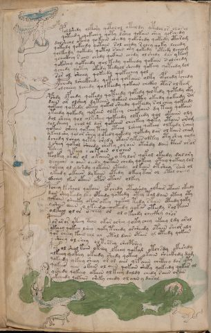

# Voynich Speculative Herbal Ferment Recipe — f79v

IMPORTANT: this is NOT a real or validated translation of the Voynich Manuscript. It is a speculative/procedural model that interprets EVA using a user-defined grammar to generate experimental recipes using safe, known edible substitutes.

This file is generated automatically from IVTFF/EVA transliteration plus a user-defined procedural grammar.



## Page / Folio
- currier: B
- folio: f79v
- page_number: 156
- section: biological

## EVA Text (Transliteration)
```text
poldshedy olkory qotolol otaldy [y:o]tedol or olorol
qoteedy qokchey qoty lshey qokain shey qorchedy
dolsheol okchy qokain sheedy qokshedy qokeedy otaram
qokeedy qokeedy qotain sol chedy rchey qoky lchedy
qolkeedy qokedy qotal saiin ory qokedy oteedy lcheam
ycheckhey r ain chedy qokain chedy ol shedy dar ytam
qokshey qokeedy qol kedy qokeedy qokain solchedy
ychedy qotey okedy tedyol sheedy qokeey qoteedy lol
sar ol sheey qokeedy qokechey qol
pchedy lsheckhedy qokeey qokaiin olky opchedy pchedy
olcheey lchedy qolkeedy qokain chckhy otar olkam
pshdy ofchdy qokedy qoteedy qokedy qoltedy qotedy oky
dain ar olshey dytain qokain checthy okeedy qokeedy ror
qokeey qokedy okeey qokol sheedy qokeedy rolchey qokeedy
yteedy qokeedy qokain olkeey cheokain dy teey qokain
dol sheey qol olkshey qokeedy olkeedy qol okaiin oly
qol sheey chol ol dar qokaiin cheekey qoky otain oram
qokain sheey qokeey teey oteey lcheey qokeey olkeedy rchey
ykail shy qolar shey qokedy qokedy qokedy dar olkain cham
dchedy lchey qety shedy okain ykees olkey oty shey qoly
dshey qokal sheedy sheky orain otshdy dain cther aror
tshey ykeey r ch [?:k]ain oroiiin
tolkey okar ol okaiin otylor qokol okeedy dalary
ycheear o oiin oeedy qotain chedy qokeey oteey qokeey lol
qokeey ol olshdy qotain oteedy olkain otshey sain ol
ykeedy okaiin dykaiin otedy dkeey tar ol otol oiiiny
odchey kar akain opar otain olkey
pchey ksheol qokain ofchedy otalshdy olkair otaiin okeedy
dain sheyteedy lk[y:a] opchedy qotedy otey tal dain oteey oty
qokain sheeky okar okey qokey tedy skain oteedy qoky
yshees aiin o ykeedy qokeedy qokar oteedy roltain
olkeey ol or ocheey ol ol o keeedy checkhy aror
por ar or yteey teey okar oshey qoky chey okeey ldy oral
ykeeey qokeey lshey qoky tchedy orsheedy otain sheor oly
qor cheey kain chl ol otol dain otain ol oteedy qokan
ysheey ol shey oltshsey sheepshey
pol ol shal kain okeey lkeey qokal otchsdy okeshdy
olkeeey qokeey okeedy shedy qokeey okain sheckhdy dag
qokeedy ykeey sheey or or aiin yefaiin chcthhy dor yty
qokees aiin okain ol oiin qokoin sheky qokeedy qokar ol
yshedy qokeey okain ol keey daldy chedy raiin orain
okchedy qokain sheky chedy ol ain y daral
```

## Domain Context (Heuristic; Not a Translation)

This section summarizes recurring **basewords** in this IVTFF domain and shows simple substring evidence that the token markers used by the procedural grammar occur inside frequent words.

Any Italian anagram / English gloss is a best-effort lexicon match, not a decipherment.


### Associated basewords (non-generic; top by frequency in this domain)
- `qokain` (count=158) → Italian anagram `acconi`; English: [n/a]
- `qokal` (count=102) → Italian anagram `calco`; English: cast (of sculpture)
- `daiin` (count=81) → Italian anagram `piani`; English: plans (arrangements)
- `qokaiin` (count=81) → Italian anagram `ciancio`; English: [n/a]
- `qokar` (count=45) → Italian anagram `carco`; English: [n/a]
- `okain` (count=40) → Italian anagram `acino`; English: a berry
- `okaiin` (count=31) → Italian anagram `coniai`; English: [n/a]
- `saiin` (count=30) → Italian anagram `asini`; English: [n/a]
- `olkain` (count=26) → Italian anagram `alcino`; English: smart, clever, intelligent, bright
- `qotal` (count=25) → Italian anagram `colta`; English: [n/a]
- `otain` (count=23) → Italian anagram `anito`; English: [n/a]
- `qotain` (count=20) → Italian anagram `antico`; English: ancient
- `qotar` (count=16) → Italian anagram `corta`; English: [n/a]
- `qotaiin` (count=13) → Italian anagram `cationi`; English: [n/a]
- `kaiin` (count=7) → Italian anagram `acini`; English: [n/a]

### Marker evidence (substring in frequent basewords)
- `qo`: 49 basewords; examples: `qokain`, `qokedy`, `qokeedy`, `qol`, `qokal`, `qokaiin`
- `q`: 50 basewords; examples: `qokain`, `qokedy`, `qokeedy`, `qol`, `qokal`, `qokaiin`
- `o`: 173 basewords; examples: `ol`, `qokain`, `qokedy`, `qokeedy`, `qol`, `qokal`
- `k`: 114 basewords; examples: `qokain`, `qokedy`, `qokeedy`, `qokal`, `qokaiin`, `qokeey`
- `t`: 77 basewords; examples: `otedy`, `qotedy`, `qoteedy`, `qoty`, `qotal`, `otain`
- `p`: 11 basewords; examples: `pchedy`, `opchedy`, `pol`, `qopchedy`, `pchedar`, `opchey`
- `ch`: 93 basewords; examples: `chedy`, `chey`, `lchedy`, `cheey`, `chckhy`, `cheol`
- `sh`: 41 basewords; examples: `shedy`, `shey`, `sheedy`, `sheey`, `sheol`, `shckhy`
- `cth`: 9 basewords; examples: `chcthy`, `checthy`, `shcthy`, `shecthy`, `cthedy`, `cthey`
- `ckh`: 12 basewords; examples: `chckhy`, `shckhy`, `checkhy`, `sheckhy`, `chckhey`, `chckhdy`
- `cph`: 1 basewords; examples: `cphol`
- `dy`: 63 basewords; examples: `shedy`, `chedy`, `qokedy`, `qokeedy`, `dy`, `lchedy`
- `iin`: 27 basewords; examples: `daiin`, `qokaiin`, `aiin`, `okaiin`, `saiin`, `qotaiin`
- `aiin`: 21 basewords; examples: `daiin`, `qokaiin`, `aiin`, `okaiin`, `saiin`, `qotaiin`

## Recipes Index (This Page)
- [f79v.1,@P0](#f79v-1-f79v-1-p0)
- [f79v.2,+P0](#f79v-2-f79v-2-p0)
- [f79v.3,+P0](#f79v-3-f79v-3-p0)
- [f79v.4,+P0](#f79v-4-f79v-4-p0)
- [f79v.5,+P0](#f79v-5-f79v-5-p0)
- [f79v.6,+P0](#f79v-6-f79v-6-p0)
- [f79v.7,+P0](#f79v-7-f79v-7-p0)
- [f79v.8,+P0](#f79v-8-f79v-8-p0)
- [f79v.9,+P0](#f79v-9-f79v-9-p0)
- [f79v.10,+P0](#f79v-10-f79v-10-p0)
- [f79v.11,+P0](#f79v-11-f79v-11-p0)
- [f79v.12,+P0](#f79v-12-f79v-12-p0)
- [f79v.13,+P0](#f79v-13-f79v-13-p0)
- [f79v.14,+P0](#f79v-14-f79v-14-p0)
- [f79v.15,+P0](#f79v-15-f79v-15-p0)
- [f79v.16,+P0](#f79v-16-f79v-16-p0)
- [f79v.17,+P0](#f79v-17-f79v-17-p0)
- [f79v.18,+P0](#f79v-18-f79v-18-p0)
- [f79v.19,+P0](#f79v-19-f79v-19-p0)
- [f79v.20,+P0](#f79v-20-f79v-20-p0)
- [f79v.21,+P0](#f79v-21-f79v-21-p0)
- [f79v.22,+P0](#f79v-22-f79v-22-p0)
- [f79v.23,+P0](#f79v-23-f79v-23-p0)
- [f79v.24,+P0](#f79v-24-f79v-24-p0)
- [f79v.25,+P0](#f79v-25-f79v-25-p0)
- [f79v.26,+P0](#f79v-26-f79v-26-p0)
- [f79v.27,+P0](#f79v-27-f79v-27-p0)
- [f79v.28,+P0](#f79v-28-f79v-28-p0)
- [f79v.29,+P0](#f79v-29-f79v-29-p0)
- [f79v.30,+P0](#f79v-30-f79v-30-p0)
- [f79v.31,+P0](#f79v-31-f79v-31-p0)
- [f79v.32,+P0](#f79v-32-f79v-32-p0)
- [f79v.33,+P0](#f79v-33-f79v-33-p0)
- [f79v.34,+P0](#f79v-34-f79v-34-p0)
- [f79v.35,+P0](#f79v-35-f79v-35-p0)
- [f79v.36,+P0](#f79v-36-f79v-36-p0)
- [f79v.37,+P0](#f79v-37-f79v-37-p0)
- [f79v.38,+P0](#f79v-38-f79v-38-p0)
- [f79v.39,+P0](#f79v-39-f79v-39-p0)
- [f79v.40,+P0](#f79v-40-f79v-40-p0)
- [f79v.41,+P0](#f79v-41-f79v-41-p0)
- [f79v.42,+P0](#f79v-42-f79v-42-p0)

## Line Glosses (Procedural Gloss Only; Not a Translation)

<a id="f79v-1-f79v-1-p0"></a>

### f79v.1,@P0

EVA: poldshedy olkory qotolol otaldy [y:o]tedol or olorol

Direct Gloss (Procedural, Not a Real Translation):
- poldshedy: add secondary herb (safe substitute) → mix / transfer → start fermentation (yeast) → duration level 1 → state: active extraction
- olkory: add fermentable sugars → mix / transfer
- qotolol: prepare liquid base → apply heat/cooking → mix / transfer
- otaldy: apply heat/cooking → mix / transfer → start fermentation (yeast) → duration level 1 → state: fermentation start
- y: [unparsed]
- o: mix / transfer
- tedol: apply heat/cooking → mix / transfer → start fermentation (yeast) → duration level 1 → state: active extraction
- or: mix / transfer
- olorol: mix / transfer

<a id="f79v-2-f79v-2-p0"></a>

### f79v.2,+P0

EVA: qoteedy qokchey qoty lshey qokain shey qorchedy

Direct Gloss (Procedural, Not a Real Translation):
- qoteedy: prepare liquid base → apply heat/cooking → start fermentation (yeast) → duration level 2 → state: active extraction
- qokchey: prepare liquid base → add fermentable sugars → add main plant (safe substitute) → duration level 1 → state: active extraction
- qoty: prepare liquid base → apply heat/cooking
- lshey: add secondary herb (safe substitute) → duration level 1 → state: active extraction
- qokain: prepare liquid base → add fermentable sugars → duration level 1 → state: fermentation start
- shey: add secondary herb (safe substitute) → duration level 1 → state: active extraction
- qorchedy: prepare liquid base → add main plant (safe substitute) → start fermentation (yeast) → duration level 1 → state: active extraction

<a id="f79v-3-f79v-3-p0"></a>

### f79v.3,+P0

EVA: dolsheol okchy qokain sheedy qokshedy qokeedy otaram

Direct Gloss (Procedural, Not a Real Translation):
- dolsheol: add secondary herb (safe substitute) → mix / transfer → start fermentation (yeast) → duration level 1 → state: active extraction
- okchy: add fermentable sugars → add main plant (safe substitute) → mix / transfer
- qokain: prepare liquid base → add fermentable sugars → duration level 1 → state: fermentation start
- sheedy: add secondary herb (safe substitute) → start fermentation (yeast) → duration level 2 → state: active extraction
- qokshedy: prepare liquid base → add fermentable sugars → add secondary herb (safe substitute) → start fermentation (yeast) → duration level 1 → state: active extraction
- qokeedy: prepare liquid base → add fermentable sugars → start fermentation (yeast) → duration level 2 → state: active extraction
- otaram: apply heat/cooking → mix / transfer → duration level 1 → state: fermentation start

<a id="f79v-4-f79v-4-p0"></a>

### f79v.4,+P0

EVA: qokeedy qokeedy qotain sol chedy rchey qoky lchedy

Direct Gloss (Procedural, Not a Real Translation):
- qokeedy: prepare liquid base → add fermentable sugars → start fermentation (yeast) → duration level 2 → state: active extraction
- qokeedy: prepare liquid base → add fermentable sugars → start fermentation (yeast) → duration level 2 → state: active extraction
- qotain: prepare liquid base → apply heat/cooking → duration level 1 → state: fermentation start
- sol: mix / transfer
- chedy: add main plant (safe substitute) → start fermentation (yeast) → duration level 1 → state: active extraction
- rchey: add main plant (safe substitute) → duration level 1 → state: active extraction
- qoky: prepare liquid base → add fermentable sugars
- lchedy: add main plant (safe substitute) → start fermentation (yeast) → duration level 1 → state: active extraction

<a id="f79v-5-f79v-5-p0"></a>

### f79v.5,+P0

EVA: qolkeedy qokedy qotal saiin ory qokedy oteedy lcheam

Direct Gloss (Procedural, Not a Real Translation):
- qolkeedy: prepare liquid base → add fermentable sugars → start fermentation (yeast) → duration level 2 → state: active extraction
- qokedy: prepare liquid base → add fermentable sugars → start fermentation (yeast) → duration level 1 → state: active extraction
- qotal: prepare liquid base → apply heat/cooking → duration level 1 → state: fermentation start
- saiin: duration level 1 → state: fermentation start → long fermentation / aging phase
- ory: mix / transfer
- qokedy: prepare liquid base → add fermentable sugars → start fermentation (yeast) → duration level 1 → state: active extraction
- oteedy: apply heat/cooking → mix / transfer → start fermentation (yeast) → duration level 2 → state: active extraction
- lcheam: add main plant (safe substitute) → duration level 1 → state: active extraction

<a id="f79v-6-f79v-6-p0"></a>

### f79v.6,+P0

EVA: ycheckhey r ain chedy qokain chedy ol shedy dar ytam

Direct Gloss (Procedural, Not a Real Translation):
- ycheckhey: add main plant (safe substitute) → add complex herbal compound (safe blend) → duration level 1 → state: active extraction
- r: [unparsed]
- ain: duration level 1 → state: fermentation start
- chedy: add main plant (safe substitute) → start fermentation (yeast) → duration level 1 → state: active extraction
- qokain: prepare liquid base → add fermentable sugars → duration level 1 → state: fermentation start
- chedy: add main plant (safe substitute) → start fermentation (yeast) → duration level 1 → state: active extraction
- ol: mix / transfer
- shedy: add secondary herb (safe substitute) → start fermentation (yeast) → duration level 1 → state: active extraction
- dar: start fermentation (yeast) → duration level 1 → state: fermentation start
- ytam: apply heat/cooking → duration level 1 → state: fermentation start

<a id="f79v-7-f79v-7-p0"></a>

### f79v.7,+P0

EVA: qokshey qokeedy qol kedy qokeedy qokain solchedy

Direct Gloss (Procedural, Not a Real Translation):
- qokshey: prepare liquid base → add fermentable sugars → add secondary herb (safe substitute) → duration level 1 → state: active extraction
- qokeedy: prepare liquid base → add fermentable sugars → start fermentation (yeast) → duration level 2 → state: active extraction
- qol: prepare liquid base
- kedy: add fermentable sugars → start fermentation (yeast) → duration level 1 → state: active extraction
- qokeedy: prepare liquid base → add fermentable sugars → start fermentation (yeast) → duration level 2 → state: active extraction
- qokain: prepare liquid base → add fermentable sugars → duration level 1 → state: fermentation start
- solchedy: add main plant (safe substitute) → mix / transfer → start fermentation (yeast) → duration level 1 → state: active extraction

<a id="f79v-8-f79v-8-p0"></a>

### f79v.8,+P0

EVA: ychedy qotey okedy tedyol sheedy qokeey qoteedy lol

Direct Gloss (Procedural, Not a Real Translation):
- ychedy: add main plant (safe substitute) → start fermentation (yeast) → duration level 1 → state: active extraction
- qotey: prepare liquid base → apply heat/cooking → duration level 1 → state: active extraction
- okedy: add fermentable sugars → mix / transfer → start fermentation (yeast) → duration level 1 → state: active extraction
- tedyol: apply heat/cooking → mix / transfer → start fermentation (yeast) → duration level 1 → state: active extraction
- sheedy: add secondary herb (safe substitute) → start fermentation (yeast) → duration level 2 → state: active extraction
- qokeey: prepare liquid base → add fermentable sugars → duration level 2 → state: active extraction
- qoteedy: prepare liquid base → apply heat/cooking → start fermentation (yeast) → duration level 2 → state: active extraction
- lol: mix / transfer

<a id="f79v-9-f79v-9-p0"></a>

### f79v.9,+P0

EVA: sar ol sheey qokeedy qokechey qol

Direct Gloss (Procedural, Not a Real Translation):
- sar: duration level 1 → state: fermentation start
- ol: mix / transfer
- sheey: add secondary herb (safe substitute) → duration level 2 → state: active extraction
- qokeedy: prepare liquid base → add fermentable sugars → start fermentation (yeast) → duration level 2 → state: active extraction
- qokechey: prepare liquid base → add fermentable sugars → add main plant (safe substitute) → duration level 1 → state: active extraction
- qol: prepare liquid base

<a id="f79v-10-f79v-10-p0"></a>

### f79v.10,+P0

EVA: pchedy lsheckhedy qokeey qokaiin olky opchedy pchedy

Direct Gloss (Procedural, Not a Real Translation):
- pchedy: add main plant (safe substitute) → start fermentation (yeast) → duration level 1 → state: active extraction
- lsheckhedy: add secondary herb (safe substitute) → start fermentation (yeast) → add complex herbal compound (safe blend) → duration level 1 → state: active extraction
- qokeey: prepare liquid base → add fermentable sugars → duration level 2 → state: active extraction
- qokaiin: prepare liquid base → add fermentable sugars → duration level 1 → state: fermentation start → long fermentation / aging phase
- olky: add fermentable sugars → mix / transfer
- opchedy: add main plant (safe substitute) → mix / transfer → start fermentation (yeast) → duration level 1 → state: active extraction
- pchedy: add main plant (safe substitute) → start fermentation (yeast) → duration level 1 → state: active extraction

<a id="f79v-11-f79v-11-p0"></a>

### f79v.11,+P0

EVA: olcheey lchedy qolkeedy qokain chckhy otar olkam

Direct Gloss (Procedural, Not a Real Translation):
- olcheey: add main plant (safe substitute) → mix / transfer → duration level 2 → state: active extraction
- lchedy: add main plant (safe substitute) → start fermentation (yeast) → duration level 1 → state: active extraction
- qolkeedy: prepare liquid base → add fermentable sugars → start fermentation (yeast) → duration level 2 → state: active extraction
- qokain: prepare liquid base → add fermentable sugars → duration level 1 → state: fermentation start
- chckhy: add main plant (safe substitute) → add complex herbal compound (safe blend)
- otar: apply heat/cooking → mix / transfer → duration level 1 → state: fermentation start
- olkam: add fermentable sugars → mix / transfer → duration level 1 → state: fermentation start

<a id="f79v-12-f79v-12-p0"></a>

### f79v.12,+P0

EVA: pshdy ofchdy qokedy qoteedy qokedy qoltedy qotedy oky

Direct Gloss (Procedural, Not a Real Translation):
- pshdy: add secondary herb (safe substitute) → start fermentation (yeast)
- ofchdy: add main plant (safe substitute) → add aroma modifier → mix / transfer → start fermentation (yeast)
- qokedy: prepare liquid base → add fermentable sugars → start fermentation (yeast) → duration level 1 → state: active extraction
- qoteedy: prepare liquid base → apply heat/cooking → start fermentation (yeast) → duration level 2 → state: active extraction
- qokedy: prepare liquid base → add fermentable sugars → start fermentation (yeast) → duration level 1 → state: active extraction
- qoltedy: prepare liquid base → apply heat/cooking → start fermentation (yeast) → duration level 1 → state: active extraction
- qotedy: prepare liquid base → apply heat/cooking → start fermentation (yeast) → duration level 1 → state: active extraction
- oky: add fermentable sugars → mix / transfer

<a id="f79v-13-f79v-13-p0"></a>

### f79v.13,+P0

EVA: dain ar olshey dytain qokain checthy okeedy qokeedy ror

Direct Gloss (Procedural, Not a Real Translation):
- dain: start fermentation (yeast) → duration level 1 → state: fermentation start
- ar: duration level 1 → state: fermentation start
- olshey: add secondary herb (safe substitute) → mix / transfer → duration level 1 → state: active extraction
- dytain: apply heat/cooking → start fermentation (yeast) → duration level 1 → state: fermentation start
- qokain: prepare liquid base → add fermentable sugars → duration level 1 → state: fermentation start
- checthy: add main plant (safe substitute) → add complex herbal compound (safe blend) → duration level 1 → state: active extraction
- okeedy: add fermentable sugars → mix / transfer → start fermentation (yeast) → duration level 2 → state: active extraction
- qokeedy: prepare liquid base → add fermentable sugars → start fermentation (yeast) → duration level 2 → state: active extraction
- ror: mix / transfer

<a id="f79v-14-f79v-14-p0"></a>

### f79v.14,+P0

EVA: qokeey qokedy okeey qokol sheedy qokeedy rolchey qokeedy

Direct Gloss (Procedural, Not a Real Translation):
- qokeey: prepare liquid base → add fermentable sugars → duration level 2 → state: active extraction
- qokedy: prepare liquid base → add fermentable sugars → start fermentation (yeast) → duration level 1 → state: active extraction
- okeey: add fermentable sugars → mix / transfer → duration level 2 → state: active extraction
- qokol: prepare liquid base → add fermentable sugars → mix / transfer
- sheedy: add secondary herb (safe substitute) → start fermentation (yeast) → duration level 2 → state: active extraction
- qokeedy: prepare liquid base → add fermentable sugars → start fermentation (yeast) → duration level 2 → state: active extraction
- rolchey: add main plant (safe substitute) → mix / transfer → duration level 1 → state: active extraction
- qokeedy: prepare liquid base → add fermentable sugars → start fermentation (yeast) → duration level 2 → state: active extraction

<a id="f79v-15-f79v-15-p0"></a>

### f79v.15,+P0

EVA: yteedy qokeedy qokain olkeey cheokain dy teey qokain

Direct Gloss (Procedural, Not a Real Translation):
- yteedy: apply heat/cooking → start fermentation (yeast) → duration level 2 → state: active extraction
- qokeedy: prepare liquid base → add fermentable sugars → start fermentation (yeast) → duration level 2 → state: active extraction
- qokain: prepare liquid base → add fermentable sugars → duration level 1 → state: fermentation start
- olkeey: add fermentable sugars → mix / transfer → duration level 2 → state: active extraction
- cheokain: add fermentable sugars → add main plant (safe substitute) → mix / transfer → duration level 1 → state: active extraction
- dy: start fermentation (yeast)
- teey: apply heat/cooking → duration level 2 → state: active extraction
- qokain: prepare liquid base → add fermentable sugars → duration level 1 → state: fermentation start

<a id="f79v-16-f79v-16-p0"></a>

### f79v.16,+P0

EVA: dol sheey qol olkshey qokeedy olkeedy qol okaiin oly

Direct Gloss (Procedural, Not a Real Translation):
- dol: mix / transfer → start fermentation (yeast)
- sheey: add secondary herb (safe substitute) → duration level 2 → state: active extraction
- qol: prepare liquid base
- olkshey: add fermentable sugars → add secondary herb (safe substitute) → mix / transfer → duration level 1 → state: active extraction
- qokeedy: prepare liquid base → add fermentable sugars → start fermentation (yeast) → duration level 2 → state: active extraction
- olkeedy: add fermentable sugars → mix / transfer → start fermentation (yeast) → duration level 2 → state: active extraction
- qol: prepare liquid base
- okaiin: add fermentable sugars → mix / transfer → duration level 1 → state: fermentation start → long fermentation / aging phase
- oly: mix / transfer

<a id="f79v-17-f79v-17-p0"></a>

### f79v.17,+P0

EVA: qol sheey chol ol dar qokaiin cheekey qoky otain oram

Direct Gloss (Procedural, Not a Real Translation):
- qol: prepare liquid base
- sheey: add secondary herb (safe substitute) → duration level 2 → state: active extraction
- chol: add main plant (safe substitute) → mix / transfer
- ol: mix / transfer
- dar: start fermentation (yeast) → duration level 1 → state: fermentation start
- qokaiin: prepare liquid base → add fermentable sugars → duration level 1 → state: fermentation start → long fermentation / aging phase
- cheekey: add fermentable sugars → add main plant (safe substitute) → duration level 2 → state: active extraction
- qoky: prepare liquid base → add fermentable sugars
- otain: apply heat/cooking → mix / transfer → duration level 1 → state: fermentation start
- oram: mix / transfer → duration level 1 → state: fermentation start

<a id="f79v-18-f79v-18-p0"></a>

### f79v.18,+P0

EVA: qokain sheey qokeey teey oteey lcheey qokeey olkeedy rchey

Direct Gloss (Procedural, Not a Real Translation):
- qokain: prepare liquid base → add fermentable sugars → duration level 1 → state: fermentation start
- sheey: add secondary herb (safe substitute) → duration level 2 → state: active extraction
- qokeey: prepare liquid base → add fermentable sugars → duration level 2 → state: active extraction
- teey: apply heat/cooking → duration level 2 → state: active extraction
- oteey: apply heat/cooking → mix / transfer → duration level 2 → state: active extraction
- lcheey: add main plant (safe substitute) → duration level 2 → state: active extraction
- qokeey: prepare liquid base → add fermentable sugars → duration level 2 → state: active extraction
- olkeedy: add fermentable sugars → mix / transfer → start fermentation (yeast) → duration level 2 → state: active extraction
- rchey: add main plant (safe substitute) → duration level 1 → state: active extraction

<a id="f79v-19-f79v-19-p0"></a>

### f79v.19,+P0

EVA: ykail shy qolar shey qokedy qokedy qokedy dar olkain cham

Direct Gloss (Procedural, Not a Real Translation):
- ykail: add fermentable sugars → duration level 1 → state: fermentation start
- shy: add secondary herb (safe substitute)
- qolar: prepare liquid base → duration level 1 → state: fermentation start
- shey: add secondary herb (safe substitute) → duration level 1 → state: active extraction
- qokedy: prepare liquid base → add fermentable sugars → start fermentation (yeast) → duration level 1 → state: active extraction
- qokedy: prepare liquid base → add fermentable sugars → start fermentation (yeast) → duration level 1 → state: active extraction
- qokedy: prepare liquid base → add fermentable sugars → start fermentation (yeast) → duration level 1 → state: active extraction
- dar: start fermentation (yeast) → duration level 1 → state: fermentation start
- olkain: add fermentable sugars → mix / transfer → duration level 1 → state: fermentation start
- cham: add main plant (safe substitute) → duration level 1 → state: fermentation start

<a id="f79v-20-f79v-20-p0"></a>

### f79v.20,+P0

EVA: dchedy lchey qety shedy okain ykees olkey oty shey qoly

Direct Gloss (Procedural, Not a Real Translation):
- dchedy: add main plant (safe substitute) → start fermentation (yeast) → duration level 1 → state: active extraction
- lchey: add main plant (safe substitute) → duration level 1 → state: active extraction
- qety: prepare base (generic) → apply heat/cooking → duration level 1 → state: active extraction
- shedy: add secondary herb (safe substitute) → start fermentation (yeast) → duration level 1 → state: active extraction
- okain: add fermentable sugars → mix / transfer → duration level 1 → state: fermentation start
- ykees: add fermentable sugars → duration level 2 → state: active extraction
- olkey: add fermentable sugars → mix / transfer → duration level 1 → state: active extraction
- oty: apply heat/cooking → mix / transfer
- shey: add secondary herb (safe substitute) → duration level 1 → state: active extraction
- qoly: prepare liquid base

<a id="f79v-21-f79v-21-p0"></a>

### f79v.21,+P0

EVA: dshey qokal sheedy sheky orain otshdy dain cther aror

Direct Gloss (Procedural, Not a Real Translation):
- dshey: add secondary herb (safe substitute) → start fermentation (yeast) → duration level 1 → state: active extraction
- qokal: prepare liquid base → add fermentable sugars → duration level 1 → state: fermentation start
- sheedy: add secondary herb (safe substitute) → start fermentation (yeast) → duration level 2 → state: active extraction
- sheky: add fermentable sugars → add secondary herb (safe substitute) → duration level 1 → state: active extraction
- orain: mix / transfer → duration level 1 → state: fermentation start
- otshdy: apply heat/cooking → add secondary herb (safe substitute) → mix / transfer → start fermentation (yeast)
- dain: start fermentation (yeast) → duration level 1 → state: fermentation start
- cther: add complex herbal compound (safe blend) → duration level 1 → state: active extraction
- aror: mix / transfer → duration level 1 → state: fermentation start

<a id="f79v-22-f79v-22-p0"></a>

### f79v.22,+P0

EVA: tshey ykeey r ch [?:k]ain oroiiin

Direct Gloss (Procedural, Not a Real Translation):
- tshey: apply heat/cooking → add secondary herb (safe substitute) → duration level 1 → state: active extraction
- ykeey: add fermentable sugars → duration level 2 → state: active extraction
- r: [unparsed]
- ch: add main plant (safe substitute)
- k: add fermentable sugars
- ain: duration level 1 → state: fermentation start
- oroiiin: mix / transfer → duration level 3 → state: cooling/rest → medium fermentation phase

<a id="f79v-23-f79v-23-p0"></a>

### f79v.23,+P0

EVA: tolkey okar ol okaiin otylor qokol okeedy dalary

Direct Gloss (Procedural, Not a Real Translation):
- tolkey: add fermentable sugars → apply heat/cooking → mix / transfer → duration level 1 → state: active extraction
- okar: add fermentable sugars → mix / transfer → duration level 1 → state: fermentation start
- ol: mix / transfer
- okaiin: add fermentable sugars → mix / transfer → duration level 1 → state: fermentation start → long fermentation / aging phase
- otylor: apply heat/cooking → mix / transfer
- qokol: prepare liquid base → add fermentable sugars → mix / transfer
- okeedy: add fermentable sugars → mix / transfer → start fermentation (yeast) → duration level 2 → state: active extraction
- dalary: start fermentation (yeast) → duration level 1 → state: fermentation start

<a id="f79v-24-f79v-24-p0"></a>

### f79v.24,+P0

EVA: ycheear o oiin oeedy qotain chedy qokeey oteey qokeey lol

Direct Gloss (Procedural, Not a Real Translation):
- ycheear: add main plant (safe substitute) → duration level 2 → state: active extraction
- o: mix / transfer
- oiin: mix / transfer → duration level 2 → state: cooling/rest → medium fermentation phase
- oeedy: mix / transfer → start fermentation (yeast) → duration level 2 → state: active extraction
- qotain: prepare liquid base → apply heat/cooking → duration level 1 → state: fermentation start
- chedy: add main plant (safe substitute) → start fermentation (yeast) → duration level 1 → state: active extraction
- qokeey: prepare liquid base → add fermentable sugars → duration level 2 → state: active extraction
- oteey: apply heat/cooking → mix / transfer → duration level 2 → state: active extraction
- qokeey: prepare liquid base → add fermentable sugars → duration level 2 → state: active extraction
- lol: mix / transfer

<a id="f79v-25-f79v-25-p0"></a>

### f79v.25,+P0

EVA: qokeey ol olshdy qotain oteedy olkain otshey sain ol

Direct Gloss (Procedural, Not a Real Translation):
- qokeey: prepare liquid base → add fermentable sugars → duration level 2 → state: active extraction
- ol: mix / transfer
- olshdy: add secondary herb (safe substitute) → mix / transfer → start fermentation (yeast)
- qotain: prepare liquid base → apply heat/cooking → duration level 1 → state: fermentation start
- oteedy: apply heat/cooking → mix / transfer → start fermentation (yeast) → duration level 2 → state: active extraction
- olkain: add fermentable sugars → mix / transfer → duration level 1 → state: fermentation start
- otshey: apply heat/cooking → add secondary herb (safe substitute) → mix / transfer → duration level 1 → state: active extraction
- sain: duration level 1 → state: fermentation start
- ol: mix / transfer

<a id="f79v-26-f79v-26-p0"></a>

### f79v.26,+P0

EVA: ykeedy okaiin dykaiin otedy dkeey tar ol otol oiiiny

Direct Gloss (Procedural, Not a Real Translation):
- ykeedy: add fermentable sugars → start fermentation (yeast) → duration level 2 → state: active extraction
- okaiin: add fermentable sugars → mix / transfer → duration level 1 → state: fermentation start → long fermentation / aging phase
- dykaiin: add fermentable sugars → start fermentation (yeast) → duration level 1 → state: fermentation start → long fermentation / aging phase
- otedy: apply heat/cooking → mix / transfer → start fermentation (yeast) → duration level 1 → state: active extraction
- dkeey: add fermentable sugars → start fermentation (yeast) → duration level 2 → state: active extraction
- tar: apply heat/cooking → duration level 1 → state: fermentation start
- ol: mix / transfer
- otol: apply heat/cooking → mix / transfer
- oiiiny: mix / transfer → duration level 3 → state: cooling/rest → medium fermentation phase

<a id="f79v-27-f79v-27-p0"></a>

### f79v.27,+P0

EVA: odchey kar akain opar otain olkey

Direct Gloss (Procedural, Not a Real Translation):
- odchey: add main plant (safe substitute) → mix / transfer → start fermentation (yeast) → duration level 1 → state: active extraction
- kar: add fermentable sugars → duration level 1 → state: fermentation start
- akain: add fermentable sugars → duration level 1 → state: fermentation start
- opar: mix / transfer → start fermentation (yeast) → duration level 1 → state: fermentation start
- otain: apply heat/cooking → mix / transfer → duration level 1 → state: fermentation start
- olkey: add fermentable sugars → mix / transfer → duration level 1 → state: active extraction

<a id="f79v-28-f79v-28-p0"></a>

### f79v.28,+P0

EVA: pchey ksheol qokain ofchedy otalshdy olkair otaiin okeedy

Direct Gloss (Procedural, Not a Real Translation):
- pchey: add main plant (safe substitute) → start fermentation (yeast) → duration level 1 → state: active extraction
- ksheol: add fermentable sugars → add secondary herb (safe substitute) → mix / transfer → duration level 1 → state: active extraction
- qokain: prepare liquid base → add fermentable sugars → duration level 1 → state: fermentation start
- ofchedy: add main plant (safe substitute) → add aroma modifier → mix / transfer → start fermentation (yeast) → duration level 1 → state: active extraction
- otalshdy: apply heat/cooking → add secondary herb (safe substitute) → mix / transfer → start fermentation (yeast) → duration level 1 → state: fermentation start
- olkair: add fermentable sugars → mix / transfer → duration level 1 → state: fermentation start
- otaiin: apply heat/cooking → mix / transfer → duration level 1 → state: fermentation start → long fermentation / aging phase
- okeedy: add fermentable sugars → mix / transfer → start fermentation (yeast) → duration level 2 → state: active extraction

<a id="f79v-29-f79v-29-p0"></a>

### f79v.29,+P0

EVA: dain sheyteedy lk[y:a] opchedy qotedy otey tal dain oteey oty

Direct Gloss (Procedural, Not a Real Translation):
- dain: start fermentation (yeast) → duration level 1 → state: fermentation start
- sheyteedy: apply heat/cooking → add secondary herb (safe substitute) → start fermentation (yeast) → duration level 1 → state: active extraction
- lk: add fermentable sugars
- y: [unparsed]
- a: duration level 1 → state: fermentation start
- opchedy: add main plant (safe substitute) → mix / transfer → start fermentation (yeast) → duration level 1 → state: active extraction
- qotedy: prepare liquid base → apply heat/cooking → start fermentation (yeast) → duration level 1 → state: active extraction
- otey: apply heat/cooking → mix / transfer → duration level 1 → state: active extraction
- tal: apply heat/cooking → duration level 1 → state: fermentation start
- dain: start fermentation (yeast) → duration level 1 → state: fermentation start
- oteey: apply heat/cooking → mix / transfer → duration level 2 → state: active extraction
- oty: apply heat/cooking → mix / transfer

<a id="f79v-30-f79v-30-p0"></a>

### f79v.30,+P0

EVA: qokain sheeky okar okey qokey tedy skain oteedy qoky

Direct Gloss (Procedural, Not a Real Translation):
- qokain: prepare liquid base → add fermentable sugars → duration level 1 → state: fermentation start
- sheeky: add fermentable sugars → add secondary herb (safe substitute) → duration level 2 → state: active extraction
- okar: add fermentable sugars → mix / transfer → duration level 1 → state: fermentation start
- okey: add fermentable sugars → mix / transfer → duration level 1 → state: active extraction
- qokey: prepare liquid base → add fermentable sugars → duration level 1 → state: active extraction
- tedy: apply heat/cooking → start fermentation (yeast) → duration level 1 → state: active extraction
- skain: add fermentable sugars → duration level 1 → state: fermentation start
- oteedy: apply heat/cooking → mix / transfer → start fermentation (yeast) → duration level 2 → state: active extraction
- qoky: prepare liquid base → add fermentable sugars

<a id="f79v-31-f79v-31-p0"></a>

### f79v.31,+P0

EVA: yshees aiin o ykeedy qokeedy qokar oteedy roltain

Direct Gloss (Procedural, Not a Real Translation):
- yshees: add secondary herb (safe substitute) → duration level 2 → state: active extraction
- aiin: duration level 1 → state: fermentation start → long fermentation / aging phase
- o: mix / transfer
- ykeedy: add fermentable sugars → start fermentation (yeast) → duration level 2 → state: active extraction
- qokeedy: prepare liquid base → add fermentable sugars → start fermentation (yeast) → duration level 2 → state: active extraction
- qokar: prepare liquid base → add fermentable sugars → duration level 1 → state: fermentation start
- oteedy: apply heat/cooking → mix / transfer → start fermentation (yeast) → duration level 2 → state: active extraction
- roltain: apply heat/cooking → mix / transfer → duration level 1 → state: fermentation start

<a id="f79v-32-f79v-32-p0"></a>

### f79v.32,+P0

EVA: olkeey ol or ocheey ol ol o keeedy checkhy aror

Direct Gloss (Procedural, Not a Real Translation):
- olkeey: add fermentable sugars → mix / transfer → duration level 2 → state: active extraction
- ol: mix / transfer
- or: mix / transfer
- ocheey: add main plant (safe substitute) → mix / transfer → duration level 2 → state: active extraction
- ol: mix / transfer
- ol: mix / transfer
- o: mix / transfer
- keeedy: add fermentable sugars → start fermentation (yeast) → duration level 3 → state: active extraction
- checkhy: add main plant (safe substitute) → add complex herbal compound (safe blend) → duration level 1 → state: active extraction
- aror: mix / transfer → duration level 1 → state: fermentation start

<a id="f79v-33-f79v-33-p0"></a>

### f79v.33,+P0

EVA: por ar or yteey teey okar oshey qoky chey okeey ldy oral

Direct Gloss (Procedural, Not a Real Translation):
- por: mix / transfer → start fermentation (yeast)
- ar: duration level 1 → state: fermentation start
- or: mix / transfer
- yteey: apply heat/cooking → duration level 2 → state: active extraction
- teey: apply heat/cooking → duration level 2 → state: active extraction
- okar: add fermentable sugars → mix / transfer → duration level 1 → state: fermentation start
- oshey: add secondary herb (safe substitute) → mix / transfer → duration level 1 → state: active extraction
- qoky: prepare liquid base → add fermentable sugars
- chey: add main plant (safe substitute) → duration level 1 → state: active extraction
- okeey: add fermentable sugars → mix / transfer → duration level 2 → state: active extraction
- ldy: start fermentation (yeast)
- oral: mix / transfer → duration level 1 → state: fermentation start

<a id="f79v-34-f79v-34-p0"></a>

### f79v.34,+P0

EVA: ykeeey qokeey lshey qoky tchedy orsheedy otain sheor oly

Direct Gloss (Procedural, Not a Real Translation):
- ykeeey: add fermentable sugars → duration level 3 → state: active extraction
- qokeey: prepare liquid base → add fermentable sugars → duration level 2 → state: active extraction
- lshey: add secondary herb (safe substitute) → duration level 1 → state: active extraction
- qoky: prepare liquid base → add fermentable sugars
- tchedy: apply heat/cooking → add main plant (safe substitute) → start fermentation (yeast) → duration level 1 → state: active extraction
- orsheedy: add secondary herb (safe substitute) → mix / transfer → start fermentation (yeast) → duration level 2 → state: active extraction
- otain: apply heat/cooking → mix / transfer → duration level 1 → state: fermentation start
- sheor: add secondary herb (safe substitute) → mix / transfer → duration level 1 → state: active extraction
- oly: mix / transfer

<a id="f79v-35-f79v-35-p0"></a>

### f79v.35,+P0

EVA: qor cheey kain chl ol otol dain otain ol oteedy qokan

Direct Gloss (Procedural, Not a Real Translation):
- qor: prepare liquid base
- cheey: add main plant (safe substitute) → duration level 2 → state: active extraction
- kain: add fermentable sugars → duration level 1 → state: fermentation start
- chl: add main plant (safe substitute)
- ol: mix / transfer
- otol: apply heat/cooking → mix / transfer
- dain: start fermentation (yeast) → duration level 1 → state: fermentation start
- otain: apply heat/cooking → mix / transfer → duration level 1 → state: fermentation start
- ol: mix / transfer
- oteedy: apply heat/cooking → mix / transfer → start fermentation (yeast) → duration level 2 → state: active extraction
- qokan: prepare liquid base → add fermentable sugars → duration level 1 → state: fermentation start

<a id="f79v-36-f79v-36-p0"></a>

### f79v.36,+P0

EVA: ysheey ol shey oltshsey sheepshey

Direct Gloss (Procedural, Not a Real Translation):
- ysheey: add secondary herb (safe substitute) → duration level 2 → state: active extraction
- ol: mix / transfer
- shey: add secondary herb (safe substitute) → duration level 1 → state: active extraction
- oltshsey: apply heat/cooking → add secondary herb (safe substitute) → mix / transfer → duration level 1 → state: active extraction
- sheepshey: add secondary herb (safe substitute) → start fermentation (yeast) → duration level 2 → state: active extraction

<a id="f79v-37-f79v-37-p0"></a>

### f79v.37,+P0

EVA: pol ol shal kain okeey lkeey qokal otchsdy okeshdy

Direct Gloss (Procedural, Not a Real Translation):
- pol: mix / transfer → start fermentation (yeast)
- ol: mix / transfer
- shal: add secondary herb (safe substitute) → duration level 1 → state: fermentation start
- kain: add fermentable sugars → duration level 1 → state: fermentation start
- okeey: add fermentable sugars → mix / transfer → duration level 2 → state: active extraction
- lkeey: add fermentable sugars → duration level 2 → state: active extraction
- qokal: prepare liquid base → add fermentable sugars → duration level 1 → state: fermentation start
- otchsdy: apply heat/cooking → add main plant (safe substitute) → mix / transfer → start fermentation (yeast)
- okeshdy: add fermentable sugars → add secondary herb (safe substitute) → mix / transfer → start fermentation (yeast) → duration level 1 → state: active extraction

<a id="f79v-38-f79v-38-p0"></a>

### f79v.38,+P0

EVA: olkeeey qokeey okeedy shedy qokeey okain sheckhdy dag

Direct Gloss (Procedural, Not a Real Translation):
- olkeeey: add fermentable sugars → mix / transfer → duration level 3 → state: active extraction
- qokeey: prepare liquid base → add fermentable sugars → duration level 2 → state: active extraction
- okeedy: add fermentable sugars → mix / transfer → start fermentation (yeast) → duration level 2 → state: active extraction
- shedy: add secondary herb (safe substitute) → start fermentation (yeast) → duration level 1 → state: active extraction
- qokeey: prepare liquid base → add fermentable sugars → duration level 2 → state: active extraction
- okain: add fermentable sugars → mix / transfer → duration level 1 → state: fermentation start
- sheckhdy: add secondary herb (safe substitute) → start fermentation (yeast) → add complex herbal compound (safe blend) → duration level 1 → state: active extraction
- dag: start fermentation (yeast) → duration level 1 → state: fermentation start

<a id="f79v-39-f79v-39-p0"></a>

### f79v.39,+P0

EVA: qokeedy ykeey sheey or or aiin yefaiin chcthhy dor yty

Direct Gloss (Procedural, Not a Real Translation):
- qokeedy: prepare liquid base → add fermentable sugars → start fermentation (yeast) → duration level 2 → state: active extraction
- ykeey: add fermentable sugars → duration level 2 → state: active extraction
- sheey: add secondary herb (safe substitute) → duration level 2 → state: active extraction
- or: mix / transfer
- or: mix / transfer
- aiin: duration level 1 → state: fermentation start → long fermentation / aging phase
- yefaiin: add aroma modifier → duration level 1 → state: active extraction → long fermentation / aging phase
- chcthhy: add main plant (safe substitute) → add complex herbal compound (safe blend)
- dor: mix / transfer → start fermentation (yeast)
- yty: apply heat/cooking

<a id="f79v-40-f79v-40-p0"></a>

### f79v.40,+P0

EVA: qokees aiin okain ol oiin qokoin sheky qokeedy qokar ol

Direct Gloss (Procedural, Not a Real Translation):
- qokees: prepare liquid base → add fermentable sugars → duration level 2 → state: active extraction
- aiin: duration level 1 → state: fermentation start → long fermentation / aging phase
- okain: add fermentable sugars → mix / transfer → duration level 1 → state: fermentation start
- ol: mix / transfer
- oiin: mix / transfer → duration level 2 → state: cooling/rest → medium fermentation phase
- qokoin: prepare liquid base → add fermentable sugars → mix / transfer → duration level 1 → state: cooling/rest
- sheky: add fermentable sugars → add secondary herb (safe substitute) → duration level 1 → state: active extraction
- qokeedy: prepare liquid base → add fermentable sugars → start fermentation (yeast) → duration level 2 → state: active extraction
- qokar: prepare liquid base → add fermentable sugars → duration level 1 → state: fermentation start
- ol: mix / transfer

<a id="f79v-41-f79v-41-p0"></a>

### f79v.41,+P0

EVA: yshedy qokeey okain ol keey daldy chedy raiin orain

Direct Gloss (Procedural, Not a Real Translation):
- yshedy: add secondary herb (safe substitute) → start fermentation (yeast) → duration level 1 → state: active extraction
- qokeey: prepare liquid base → add fermentable sugars → duration level 2 → state: active extraction
- okain: add fermentable sugars → mix / transfer → duration level 1 → state: fermentation start
- ol: mix / transfer
- keey: add fermentable sugars → duration level 2 → state: active extraction
- daldy: start fermentation (yeast) → duration level 1 → state: fermentation start
- chedy: add main plant (safe substitute) → start fermentation (yeast) → duration level 1 → state: active extraction
- raiin: duration level 1 → state: fermentation start → long fermentation / aging phase
- orain: mix / transfer → duration level 1 → state: fermentation start

<a id="f79v-42-f79v-42-p0"></a>

### f79v.42,+P0

EVA: okchedy qokain sheky chedy ol ain y daral

Direct Gloss (Procedural, Not a Real Translation):
- okchedy: add fermentable sugars → add main plant (safe substitute) → mix / transfer → start fermentation (yeast) → duration level 1 → state: active extraction
- qokain: prepare liquid base → add fermentable sugars → duration level 1 → state: fermentation start
- sheky: add fermentable sugars → add secondary herb (safe substitute) → duration level 1 → state: active extraction
- chedy: add main plant (safe substitute) → start fermentation (yeast) → duration level 1 → state: active extraction
- ol: mix / transfer
- ain: duration level 1 → state: fermentation start
- y: [unparsed]
- daral: start fermentation (yeast) → duration level 1 → state: fermentation start
