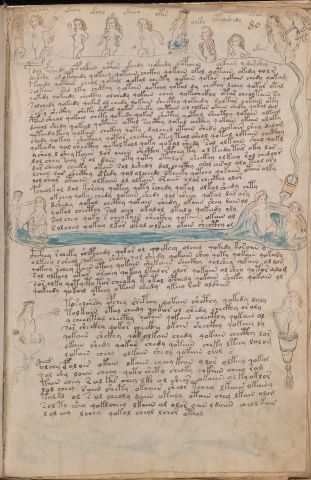

# Voynich Speculative Herbal Ferment Recipe — f80r

IMPORTANT: this is NOT a real or validated translation of the Voynich Manuscript. It is a speculative/procedural model that interprets EVA using a user-defined grammar to generate experimental recipes using safe, known edible substitutes.

This file is generated automatically from IVTFF/EVA transliteration plus a user-defined procedural grammar.



## Page / Folio
- currier: B
- folio: f80r
- page_number: 157
- section: biological

## EVA Text (Transliteration)
```text
toroly
olchdy
okaly
okolo
okary
opor
olky
otalshedy
okar
okan
pdol fshedy q@207;polkain octhor okchdy qokeedy qopcheol olkoiin y darshey
dykshy ol otchedy qokain qotain chckhey qokain okal qotain okedy qo l r
tchedy qotair cheol qokal qokal cheety qokaiin qokar qokain chedy qokam
solkain shl lky chcthy qokain qotchy qotal dy chckhy lchey qotar otal
qokedy qokeedy checkhy olchedy qokain chey qokechckhy otar cheoltain sy
solchedy qokeedy qokar ol chedy qokain shecthy qokeedy saltar chkain oty
solky sheckhy sheky shkeol qokar sheky chetain ol olkar okain sheky qokal da[?:y]
paiin sheol qokain chety qokeedy qokar shcthy qotol shecthy qokain olkam
dcheol shedy qok[ee:a]l qotaiin chtal schcthy qokal chcthy qokain okain oloky
qoteedy keey qokain chckhy qoty dalched otain shedy qokair shey dalom
shedy qokey shckhey qotar chckhy otol teol sheol qotal oltain chcthy
qokeedy qol shecthy qokalkeol qoky qokal shedy sal olkain shey qokl
yshey l shey kaiin lor aiiin shcthy pchey ty ol keedy tar oky lar
lol chey [r:?]chy r ol dain oty qoty otalor sheckhy olkeey ral chedy[o:a]r
dar sheal cheeky okain sol lshedy dol checthy orol eeesal olo teol ory
lchol dar shecthy otedy qol olcheedy opcheeky qotchy qokaiin otair olky
lol shar otaiin olkaiin ol olkain oraiin olor checthy olor
pcheolkal dal korchy qotey qoty rchedy qokal olkolshedy chty
okchey qoky chedy qokain shedy qol sheey qokal dar ary
dshedy qokal chcthy qokain shedy okaiin shey dainol
qokal checthy sol chey okalol okaly qokeedy oly
solchey qoky r cheykain sheckhy qokain okain ol
solchey qokeey lkar otal olkeey okain shecthy ol
c@132;hc@133;hey rcheky shepchedy qokar ol qockhey olchey qokedy koroiin y
olkeey l sheol qokeey shedy qol shedy qokain shey qoty qokain qokady
qokeey rchey tain oteey qokain shekaiin sheckhy qolshey qokain ol lom
sol olkeeey otar orchey qokeey ltalor olor qokaiin ol shey qotor alom
sor olky qoty ty tor sheyky t otol opchedy qokain sheky qokain ol
qokeedy qokail oteey otain shedy ykeey rar [a:o]lshees
torolshsdy opchey shepchy qotain shcthy qokedy daly
tolkain otal chedy qokar ol shedy checkhy or oly
y cheeytal checthy qokain qokain checthy qokain ol
sor sheckhy qokar checkhy okain sheckhy qokeey ly
qokain shckhy qokolkain chedy qokain checthy lor
okain shedy qokan chedy qotain cheky lteey lolom
qokain cheey olkain shedy qokain orol s
polchy efaloir okain okaiin cheey kaiin ylor olkeey qokal
sal shy loiin cheey qotl shety sheoky qokaiin cheey ram
t[iiin:ain] chey ral k[ar:ir] chey lkl ol shees okaiin olky oklor
lol chey saiin shety okaiiin sheor tchey lkaiin okainy
talkl ol s al cheoly daiin otaly otain chey lkain olom
sol tl shey qoklcheey lkaiin ol olor aiin y daiin cheol kain
lol eey lchey qokal cheol lchor otlol
```

## Domain Context (Heuristic; Not a Translation)

This section summarizes recurring **basewords** in this IVTFF domain and shows simple substring evidence that the token markers used by the procedural grammar occur inside frequent words.

Any Italian anagram / English gloss is a best-effort lexicon match, not a decipherment.


### Associated basewords (non-generic; top by frequency in this domain)
- `qokain` (count=158) → Italian anagram `acconi`; English: [n/a]
- `qokal` (count=102) → Italian anagram `calco`; English: cast (of sculpture)
- `daiin` (count=81) → Italian anagram `piani`; English: plans (arrangements)
- `qokaiin` (count=81) → Italian anagram `ciancio`; English: [n/a]
- `qokar` (count=45) → Italian anagram `carco`; English: [n/a]
- `okain` (count=40) → Italian anagram `acino`; English: a berry
- `okaiin` (count=31) → Italian anagram `coniai`; English: [n/a]
- `saiin` (count=30) → Italian anagram `asini`; English: [n/a]
- `olkain` (count=26) → Italian anagram `alcino`; English: smart, clever, intelligent, bright
- `qotal` (count=25) → Italian anagram `colta`; English: [n/a]
- `otain` (count=23) → Italian anagram `anito`; English: [n/a]
- `qotain` (count=20) → Italian anagram `antico`; English: ancient
- `qotar` (count=16) → Italian anagram `corta`; English: [n/a]
- `qotaiin` (count=13) → Italian anagram `cationi`; English: [n/a]
- `kaiin` (count=7) → Italian anagram `acini`; English: [n/a]

### Marker evidence (substring in frequent basewords)
- `qo`: 49 basewords; examples: `qokain`, `qokedy`, `qokeedy`, `qol`, `qokal`, `qokaiin`
- `q`: 50 basewords; examples: `qokain`, `qokedy`, `qokeedy`, `qol`, `qokal`, `qokaiin`
- `o`: 173 basewords; examples: `ol`, `qokain`, `qokedy`, `qokeedy`, `qol`, `qokal`
- `k`: 114 basewords; examples: `qokain`, `qokedy`, `qokeedy`, `qokal`, `qokaiin`, `qokeey`
- `t`: 77 basewords; examples: `otedy`, `qotedy`, `qoteedy`, `qoty`, `qotal`, `otain`
- `p`: 11 basewords; examples: `pchedy`, `opchedy`, `pol`, `qopchedy`, `pchedar`, `opchey`
- `ch`: 93 basewords; examples: `chedy`, `chey`, `lchedy`, `cheey`, `chckhy`, `cheol`
- `sh`: 41 basewords; examples: `shedy`, `shey`, `sheedy`, `sheey`, `sheol`, `shckhy`
- `cth`: 9 basewords; examples: `chcthy`, `checthy`, `shcthy`, `shecthy`, `cthedy`, `cthey`
- `ckh`: 12 basewords; examples: `chckhy`, `shckhy`, `checkhy`, `sheckhy`, `chckhey`, `chckhdy`
- `cph`: 1 basewords; examples: `cphol`
- `dy`: 63 basewords; examples: `shedy`, `chedy`, `qokedy`, `qokeedy`, `dy`, `lchedy`
- `iin`: 27 basewords; examples: `daiin`, `qokaiin`, `aiin`, `okaiin`, `saiin`, `qotaiin`
- `aiin`: 21 basewords; examples: `daiin`, `qokaiin`, `aiin`, `okaiin`, `saiin`, `qotaiin`

## Recipes Index (This Page)
- [f80r.1,@Ln](#f80r-1-f80r-1-ln)
- [f80r.2,=Ln](#f80r-2-f80r-2-ln)
- [f80r.3,=Ln](#f80r-3-f80r-3-ln)
- [f80r.4,=Ln](#f80r-4-f80r-4-ln)
- [f80r.5,=Ln](#f80r-5-f80r-5-ln)
- [f80r.6,=Ln](#f80r-6-f80r-6-ln)
- [f80r.7,~Ln](#f80r-7-f80r-7-ln)
- [f80r.8,=Ln](#f80r-8-f80r-8-ln)
- [f80r.9,~Ln](#f80r-9-f80r-9-ln)
- [f80r.10,+Ln](#f80r-10-f80r-10-ln)
- [f80r.11,@P0](#f80r-11-f80r-11-p0)
- [f80r.12,+P0](#f80r-12-f80r-12-p0)
- [f80r.13,+P0](#f80r-13-f80r-13-p0)
- [f80r.14,+P0](#f80r-14-f80r-14-p0)
- [f80r.15,+P0](#f80r-15-f80r-15-p0)
- [f80r.16,+P0](#f80r-16-f80r-16-p0)
- [f80r.17,+P0](#f80r-17-f80r-17-p0)
- [f80r.18,+P0](#f80r-18-f80r-18-p0)
- [f80r.19,+P0](#f80r-19-f80r-19-p0)
- [f80r.20,+P0](#f80r-20-f80r-20-p0)
- [f80r.21,+P0](#f80r-21-f80r-21-p0)
- [f80r.22,+P0](#f80r-22-f80r-22-p0)
- [f80r.23,+P0](#f80r-23-f80r-23-p0)
- [f80r.24,+P0](#f80r-24-f80r-24-p0)
- [f80r.25,+P0](#f80r-25-f80r-25-p0)
- [f80r.26,+P0](#f80r-26-f80r-26-p0)
- [f80r.27,+P0](#f80r-27-f80r-27-p0)
- [f80r.28,+P0](#f80r-28-f80r-28-p0)
- [f80r.29,+P0](#f80r-29-f80r-29-p0)
- [f80r.30,+P0](#f80r-30-f80r-30-p0)
- [f80r.31,+P0](#f80r-31-f80r-31-p0)
- [f80r.32,+P0](#f80r-32-f80r-32-p0)
- [f80r.33,+P0](#f80r-33-f80r-33-p0)
- [f80r.34,+P0](#f80r-34-f80r-34-p0)
- [f80r.35,+P0](#f80r-35-f80r-35-p0)
- [f80r.36,+P0](#f80r-36-f80r-36-p0)
- [f80r.37,+P0](#f80r-37-f80r-37-p0)
- [f80r.38,+P0](#f80r-38-f80r-38-p0)
- [f80r.39,+P0](#f80r-39-f80r-39-p0)
- [f80r.40,+P0](#f80r-40-f80r-40-p0)
- [f80r.41,+P0](#f80r-41-f80r-41-p0)
- [f80r.42,+P0](#f80r-42-f80r-42-p0)
- [f80r.43,+P0](#f80r-43-f80r-43-p0)
- [f80r.44,+P0](#f80r-44-f80r-44-p0)
- [f80r.45,+P0](#f80r-45-f80r-45-p0)
- [f80r.46,+P0](#f80r-46-f80r-46-p0)
- [f80r.47,+P0](#f80r-47-f80r-47-p0)
- [f80r.48,+P0](#f80r-48-f80r-48-p0)
- [f80r.49,+P0](#f80r-49-f80r-49-p0)
- [f80r.50,+P0](#f80r-50-f80r-50-p0)
- [f80r.51,+P0](#f80r-51-f80r-51-p0)
- [f80r.52,+P0](#f80r-52-f80r-52-p0)
- [f80r.53,+P0](#f80r-53-f80r-53-p0)

## Line Glosses (Procedural Gloss Only; Not a Translation)

<a id="f80r-1-f80r-1-ln"></a>

### f80r.1,@Ln

EVA: toroly

Direct Gloss (Procedural, Not a Real Translation):
- toroly: apply heat/cooking → mix / transfer

<a id="f80r-2-f80r-2-ln"></a>

### f80r.2,=Ln

EVA: olchdy

Direct Gloss (Procedural, Not a Real Translation):
- olchdy: add main plant (safe substitute) → mix / transfer → start fermentation (yeast)

<a id="f80r-3-f80r-3-ln"></a>

### f80r.3,=Ln

EVA: okaly

Direct Gloss (Procedural, Not a Real Translation):
- okaly: add fermentable sugars → mix / transfer → duration level 1 → state: fermentation start

<a id="f80r-4-f80r-4-ln"></a>

### f80r.4,=Ln

EVA: okolo

Direct Gloss (Procedural, Not a Real Translation):
- okolo: add fermentable sugars → mix / transfer

<a id="f80r-5-f80r-5-ln"></a>

### f80r.5,=Ln

EVA: okary

Direct Gloss (Procedural, Not a Real Translation):
- okary: add fermentable sugars → mix / transfer → duration level 1 → state: fermentation start

<a id="f80r-6-f80r-6-ln"></a>

### f80r.6,=Ln

EVA: opor

Direct Gloss (Procedural, Not a Real Translation):
- opor: mix / transfer → start fermentation (yeast)

<a id="f80r-7-f80r-7-ln"></a>

### f80r.7,~Ln

EVA: olky

Direct Gloss (Procedural, Not a Real Translation):
- olky: add fermentable sugars → mix / transfer

<a id="f80r-8-f80r-8-ln"></a>

### f80r.8,=Ln

EVA: otalshedy

Direct Gloss (Procedural, Not a Real Translation):
- otalshedy: apply heat/cooking → add secondary herb (safe substitute) → mix / transfer → start fermentation (yeast) → duration level 1 → state: fermentation start

<a id="f80r-9-f80r-9-ln"></a>

### f80r.9,~Ln

EVA: okar

Direct Gloss (Procedural, Not a Real Translation):
- okar: add fermentable sugars → mix / transfer → duration level 1 → state: fermentation start

<a id="f80r-10-f80r-10-ln"></a>

### f80r.10,+Ln

EVA: okan

Direct Gloss (Procedural, Not a Real Translation):
- okan: add fermentable sugars → mix / transfer → duration level 1 → state: fermentation start

<a id="f80r-11-f80r-11-p0"></a>

### f80r.11,@P0

EVA: pdol fshedy q@207;polkain octhor okchdy qokeedy qopcheol olkoiin y darshey

Direct Gloss (Procedural, Not a Real Translation):
- pdol: mix / transfer → start fermentation (yeast)
- fshedy: add secondary herb (safe substitute) → add aroma modifier → start fermentation (yeast) → duration level 1 → state: active extraction
- q: prepare base (generic)
- polkain: add fermentable sugars → mix / transfer → start fermentation (yeast) → duration level 1 → state: fermentation start
- octhor: mix / transfer → add complex herbal compound (safe blend)
- okchdy: add fermentable sugars → add main plant (safe substitute) → mix / transfer → start fermentation (yeast)
- qokeedy: prepare liquid base → add fermentable sugars → start fermentation (yeast) → duration level 2 → state: active extraction
- qopcheol: prepare liquid base → add main plant (safe substitute) → mix / transfer → start fermentation (yeast) → duration level 1 → state: active extraction
- olkoiin: add fermentable sugars → mix / transfer → duration level 2 → state: cooling/rest → medium fermentation phase
- y: [unparsed]
- darshey: add secondary herb (safe substitute) → start fermentation (yeast) → duration level 1 → state: fermentation start

<a id="f80r-12-f80r-12-p0"></a>

### f80r.12,+P0

EVA: dykshy ol otchedy qokain qotain chckhey qokain okal qotain okedy qo l r

Direct Gloss (Procedural, Not a Real Translation):
- dykshy: add fermentable sugars → add secondary herb (safe substitute) → start fermentation (yeast)
- ol: mix / transfer
- otchedy: apply heat/cooking → add main plant (safe substitute) → mix / transfer → start fermentation (yeast) → duration level 1 → state: active extraction
- qokain: prepare liquid base → add fermentable sugars → duration level 1 → state: fermentation start
- qotain: prepare liquid base → apply heat/cooking → duration level 1 → state: fermentation start
- chckhey: add main plant (safe substitute) → add complex herbal compound (safe blend) → duration level 1 → state: active extraction
- qokain: prepare liquid base → add fermentable sugars → duration level 1 → state: fermentation start
- okal: add fermentable sugars → mix / transfer → duration level 1 → state: fermentation start
- qotain: prepare liquid base → apply heat/cooking → duration level 1 → state: fermentation start
- okedy: add fermentable sugars → mix / transfer → start fermentation (yeast) → duration level 1 → state: active extraction
- qo: prepare liquid base
- l: [unparsed]
- r: [unparsed]

<a id="f80r-13-f80r-13-p0"></a>

### f80r.13,+P0

EVA: tchedy qotair cheol qokal qokal cheety qokaiin qokar qokain chedy qokam

Direct Gloss (Procedural, Not a Real Translation):
- tchedy: apply heat/cooking → add main plant (safe substitute) → start fermentation (yeast) → duration level 1 → state: active extraction
- qotair: prepare liquid base → apply heat/cooking → duration level 1 → state: fermentation start
- cheol: add main plant (safe substitute) → mix / transfer → duration level 1 → state: active extraction
- qokal: prepare liquid base → add fermentable sugars → duration level 1 → state: fermentation start
- qokal: prepare liquid base → add fermentable sugars → duration level 1 → state: fermentation start
- cheety: apply heat/cooking → add main plant (safe substitute) → duration level 2 → state: active extraction
- qokaiin: prepare liquid base → add fermentable sugars → duration level 1 → state: fermentation start → long fermentation / aging phase
- qokar: prepare liquid base → add fermentable sugars → duration level 1 → state: fermentation start
- qokain: prepare liquid base → add fermentable sugars → duration level 1 → state: fermentation start
- chedy: add main plant (safe substitute) → start fermentation (yeast) → duration level 1 → state: active extraction
- qokam: prepare liquid base → add fermentable sugars → duration level 1 → state: fermentation start

<a id="f80r-14-f80r-14-p0"></a>

### f80r.14,+P0

EVA: solkain shl lky chcthy qokain qotchy qotal dy chckhy lchey qotar otal

Direct Gloss (Procedural, Not a Real Translation):
- solkain: add fermentable sugars → mix / transfer → duration level 1 → state: fermentation start
- shl: add secondary herb (safe substitute)
- lky: add fermentable sugars
- chcthy: add main plant (safe substitute) → add complex herbal compound (safe blend)
- qokain: prepare liquid base → add fermentable sugars → duration level 1 → state: fermentation start
- qotchy: prepare liquid base → apply heat/cooking → add main plant (safe substitute)
- qotal: prepare liquid base → apply heat/cooking → duration level 1 → state: fermentation start
- dy: start fermentation (yeast)
- chckhy: add main plant (safe substitute) → add complex herbal compound (safe blend)
- lchey: add main plant (safe substitute) → duration level 1 → state: active extraction
- qotar: prepare liquid base → apply heat/cooking → duration level 1 → state: fermentation start
- otal: apply heat/cooking → mix / transfer → duration level 1 → state: fermentation start

<a id="f80r-15-f80r-15-p0"></a>

### f80r.15,+P0

EVA: qokedy qokeedy checkhy olchedy qokain chey qokechckhy otar cheoltain sy

Direct Gloss (Procedural, Not a Real Translation):
- qokedy: prepare liquid base → add fermentable sugars → start fermentation (yeast) → duration level 1 → state: active extraction
- qokeedy: prepare liquid base → add fermentable sugars → start fermentation (yeast) → duration level 2 → state: active extraction
- checkhy: add main plant (safe substitute) → add complex herbal compound (safe blend) → duration level 1 → state: active extraction
- olchedy: add main plant (safe substitute) → mix / transfer → start fermentation (yeast) → duration level 1 → state: active extraction
- qokain: prepare liquid base → add fermentable sugars → duration level 1 → state: fermentation start
- chey: add main plant (safe substitute) → duration level 1 → state: active extraction
- qokechckhy: prepare liquid base → add fermentable sugars → add main plant (safe substitute) → add complex herbal compound (safe blend) → duration level 1 → state: active extraction
- otar: apply heat/cooking → mix / transfer → duration level 1 → state: fermentation start
- cheoltain: apply heat/cooking → add main plant (safe substitute) → mix / transfer → duration level 1 → state: active extraction
- sy: [unparsed]

<a id="f80r-16-f80r-16-p0"></a>

### f80r.16,+P0

EVA: solchedy qokeedy qokar ol chedy qokain shecthy qokeedy saltar chkain oty

Direct Gloss (Procedural, Not a Real Translation):
- solchedy: add main plant (safe substitute) → mix / transfer → start fermentation (yeast) → duration level 1 → state: active extraction
- qokeedy: prepare liquid base → add fermentable sugars → start fermentation (yeast) → duration level 2 → state: active extraction
- qokar: prepare liquid base → add fermentable sugars → duration level 1 → state: fermentation start
- ol: mix / transfer
- chedy: add main plant (safe substitute) → start fermentation (yeast) → duration level 1 → state: active extraction
- qokain: prepare liquid base → add fermentable sugars → duration level 1 → state: fermentation start
- shecthy: add secondary herb (safe substitute) → add complex herbal compound (safe blend) → duration level 1 → state: active extraction
- qokeedy: prepare liquid base → add fermentable sugars → start fermentation (yeast) → duration level 2 → state: active extraction
- saltar: apply heat/cooking → duration level 1 → state: fermentation start
- chkain: add fermentable sugars → add main plant (safe substitute) → duration level 1 → state: fermentation start
- oty: apply heat/cooking → mix / transfer

<a id="f80r-17-f80r-17-p0"></a>

### f80r.17,+P0

EVA: solky sheckhy sheky shkeol qokar sheky chetain ol olkar okain sheky qokal da[?:y]

Direct Gloss (Procedural, Not a Real Translation):
- solky: add fermentable sugars → mix / transfer
- sheckhy: add secondary herb (safe substitute) → add complex herbal compound (safe blend) → duration level 1 → state: active extraction
- sheky: add fermentable sugars → add secondary herb (safe substitute) → duration level 1 → state: active extraction
- shkeol: add fermentable sugars → add secondary herb (safe substitute) → mix / transfer → duration level 1 → state: active extraction
- qokar: prepare liquid base → add fermentable sugars → duration level 1 → state: fermentation start
- sheky: add fermentable sugars → add secondary herb (safe substitute) → duration level 1 → state: active extraction
- chetain: apply heat/cooking → add main plant (safe substitute) → duration level 1 → state: active extraction
- ol: mix / transfer
- olkar: add fermentable sugars → mix / transfer → duration level 1 → state: fermentation start
- okain: add fermentable sugars → mix / transfer → duration level 1 → state: fermentation start
- sheky: add fermentable sugars → add secondary herb (safe substitute) → duration level 1 → state: active extraction
- qokal: prepare liquid base → add fermentable sugars → duration level 1 → state: fermentation start
- da: start fermentation (yeast) → duration level 1 → state: fermentation start
- y: [unparsed]

<a id="f80r-18-f80r-18-p0"></a>

### f80r.18,+P0

EVA: paiin sheol qokain chety qokeedy qokar shcthy qotol shecthy qokain olkam

Direct Gloss (Procedural, Not a Real Translation):
- paiin: start fermentation (yeast) → duration level 1 → state: fermentation start → long fermentation / aging phase
- sheol: add secondary herb (safe substitute) → mix / transfer → duration level 1 → state: active extraction
- qokain: prepare liquid base → add fermentable sugars → duration level 1 → state: fermentation start
- chety: apply heat/cooking → add main plant (safe substitute) → duration level 1 → state: active extraction
- qokeedy: prepare liquid base → add fermentable sugars → start fermentation (yeast) → duration level 2 → state: active extraction
- qokar: prepare liquid base → add fermentable sugars → duration level 1 → state: fermentation start
- shcthy: add secondary herb (safe substitute) → add complex herbal compound (safe blend)
- qotol: prepare liquid base → apply heat/cooking → mix / transfer
- shecthy: add secondary herb (safe substitute) → add complex herbal compound (safe blend) → duration level 1 → state: active extraction
- qokain: prepare liquid base → add fermentable sugars → duration level 1 → state: fermentation start
- olkam: add fermentable sugars → mix / transfer → duration level 1 → state: fermentation start

<a id="f80r-19-f80r-19-p0"></a>

### f80r.19,+P0

EVA: dcheol shedy qok[ee:a]l qotaiin chtal schcthy qokal chcthy qokain okain oloky

Direct Gloss (Procedural, Not a Real Translation):
- dcheol: add main plant (safe substitute) → mix / transfer → start fermentation (yeast) → duration level 1 → state: active extraction
- shedy: add secondary herb (safe substitute) → start fermentation (yeast) → duration level 1 → state: active extraction
- qok: prepare liquid base → add fermentable sugars
- ee: duration level 2 → state: active extraction
- a: duration level 1 → state: fermentation start
- l: [unparsed]
- qotaiin: prepare liquid base → apply heat/cooking → duration level 1 → state: fermentation start → long fermentation / aging phase
- chtal: apply heat/cooking → add main plant (safe substitute) → duration level 1 → state: fermentation start
- schcthy: add main plant (safe substitute) → add complex herbal compound (safe blend)
- qokal: prepare liquid base → add fermentable sugars → duration level 1 → state: fermentation start
- chcthy: add main plant (safe substitute) → add complex herbal compound (safe blend)
- qokain: prepare liquid base → add fermentable sugars → duration level 1 → state: fermentation start
- okain: add fermentable sugars → mix / transfer → duration level 1 → state: fermentation start
- oloky: add fermentable sugars → mix / transfer

<a id="f80r-20-f80r-20-p0"></a>

### f80r.20,+P0

EVA: qoteedy keey qokain chckhy qoty dalched otain shedy qokair shey dalom

Direct Gloss (Procedural, Not a Real Translation):
- qoteedy: prepare liquid base → apply heat/cooking → start fermentation (yeast) → duration level 2 → state: active extraction
- keey: add fermentable sugars → duration level 2 → state: active extraction
- qokain: prepare liquid base → add fermentable sugars → duration level 1 → state: fermentation start
- chckhy: add main plant (safe substitute) → add complex herbal compound (safe blend)
- qoty: prepare liquid base → apply heat/cooking
- dalched: add main plant (safe substitute) → start fermentation (yeast) → duration level 1 → state: fermentation start
- otain: apply heat/cooking → mix / transfer → duration level 1 → state: fermentation start
- shedy: add secondary herb (safe substitute) → start fermentation (yeast) → duration level 1 → state: active extraction
- qokair: prepare liquid base → add fermentable sugars → duration level 1 → state: fermentation start
- shey: add secondary herb (safe substitute) → duration level 1 → state: active extraction
- dalom: mix / transfer → start fermentation (yeast) → duration level 1 → state: fermentation start

<a id="f80r-21-f80r-21-p0"></a>

### f80r.21,+P0

EVA: shedy qokey shckhey qotar chckhy otol teol sheol qotal oltain chcthy

Direct Gloss (Procedural, Not a Real Translation):
- shedy: add secondary herb (safe substitute) → start fermentation (yeast) → duration level 1 → state: active extraction
- qokey: prepare liquid base → add fermentable sugars → duration level 1 → state: active extraction
- shckhey: add secondary herb (safe substitute) → add complex herbal compound (safe blend) → duration level 1 → state: active extraction
- qotar: prepare liquid base → apply heat/cooking → duration level 1 → state: fermentation start
- chckhy: add main plant (safe substitute) → add complex herbal compound (safe blend)
- otol: apply heat/cooking → mix / transfer
- teol: apply heat/cooking → mix / transfer → duration level 1 → state: active extraction
- sheol: add secondary herb (safe substitute) → mix / transfer → duration level 1 → state: active extraction
- qotal: prepare liquid base → apply heat/cooking → duration level 1 → state: fermentation start
- oltain: apply heat/cooking → mix / transfer → duration level 1 → state: fermentation start
- chcthy: add main plant (safe substitute) → add complex herbal compound (safe blend)

<a id="f80r-22-f80r-22-p0"></a>

### f80r.22,+P0

EVA: qokeedy qol shecthy qokalkeol qoky qokal shedy sal olkain shey qokl

Direct Gloss (Procedural, Not a Real Translation):
- qokeedy: prepare liquid base → add fermentable sugars → start fermentation (yeast) → duration level 2 → state: active extraction
- qol: prepare liquid base
- shecthy: add secondary herb (safe substitute) → add complex herbal compound (safe blend) → duration level 1 → state: active extraction
- qokalkeol: prepare liquid base → add fermentable sugars → mix / transfer → duration level 1 → state: fermentation start
- qoky: prepare liquid base → add fermentable sugars
- qokal: prepare liquid base → add fermentable sugars → duration level 1 → state: fermentation start
- shedy: add secondary herb (safe substitute) → start fermentation (yeast) → duration level 1 → state: active extraction
- sal: duration level 1 → state: fermentation start
- olkain: add fermentable sugars → mix / transfer → duration level 1 → state: fermentation start
- shey: add secondary herb (safe substitute) → duration level 1 → state: active extraction
- qokl: prepare liquid base → add fermentable sugars

<a id="f80r-23-f80r-23-p0"></a>

### f80r.23,+P0

EVA: yshey l shey kaiin lor aiiin shcthy pchey ty ol keedy tar oky lar

Direct Gloss (Procedural, Not a Real Translation):
- yshey: add secondary herb (safe substitute) → duration level 1 → state: active extraction
- l: [unparsed]
- shey: add secondary herb (safe substitute) → duration level 1 → state: active extraction
- kaiin: add fermentable sugars → duration level 1 → state: fermentation start → long fermentation / aging phase
- lor: mix / transfer
- aiiin: duration level 1 → state: fermentation start → medium fermentation phase
- shcthy: add secondary herb (safe substitute) → add complex herbal compound (safe blend)
- pchey: add main plant (safe substitute) → start fermentation (yeast) → duration level 1 → state: active extraction
- ty: apply heat/cooking
- ol: mix / transfer
- keedy: add fermentable sugars → start fermentation (yeast) → duration level 2 → state: active extraction
- tar: apply heat/cooking → duration level 1 → state: fermentation start
- oky: add fermentable sugars → mix / transfer
- lar: duration level 1 → state: fermentation start

<a id="f80r-24-f80r-24-p0"></a>

### f80r.24,+P0

EVA: lol chey [r:?]chy r ol dain oty qoty otalor sheckhy olkeey ral chedy[o:a]r

Direct Gloss (Procedural, Not a Real Translation):
- lol: mix / transfer
- chey: add main plant (safe substitute) → duration level 1 → state: active extraction
- r: [unparsed]
- chy: add main plant (safe substitute)
- r: [unparsed]
- ol: mix / transfer
- dain: start fermentation (yeast) → duration level 1 → state: fermentation start
- oty: apply heat/cooking → mix / transfer
- qoty: prepare liquid base → apply heat/cooking
- otalor: apply heat/cooking → mix / transfer → duration level 1 → state: fermentation start
- sheckhy: add secondary herb (safe substitute) → add complex herbal compound (safe blend) → duration level 1 → state: active extraction
- olkeey: add fermentable sugars → mix / transfer → duration level 2 → state: active extraction
- ral: duration level 1 → state: fermentation start
- chedy: add main plant (safe substitute) → start fermentation (yeast) → duration level 1 → state: active extraction
- o: mix / transfer
- a: duration level 1 → state: fermentation start
- r: [unparsed]

<a id="f80r-25-f80r-25-p0"></a>

### f80r.25,+P0

EVA: dar sheal cheeky okain sol lshedy dol checthy orol eeesal olo teol ory

Direct Gloss (Procedural, Not a Real Translation):
- dar: start fermentation (yeast) → duration level 1 → state: fermentation start
- sheal: add secondary herb (safe substitute) → duration level 1 → state: active extraction
- cheeky: add fermentable sugars → add main plant (safe substitute) → duration level 2 → state: active extraction
- okain: add fermentable sugars → mix / transfer → duration level 1 → state: fermentation start
- sol: mix / transfer
- lshedy: add secondary herb (safe substitute) → start fermentation (yeast) → duration level 1 → state: active extraction
- dol: mix / transfer → start fermentation (yeast)
- checthy: add main plant (safe substitute) → add complex herbal compound (safe blend) → duration level 1 → state: active extraction
- orol: mix / transfer
- eeesal: duration level 3 → state: active extraction
- olo: mix / transfer
- teol: apply heat/cooking → mix / transfer → duration level 1 → state: active extraction
- ory: mix / transfer

<a id="f80r-26-f80r-26-p0"></a>

### f80r.26,+P0

EVA: lchol dar shecthy otedy qol olcheedy opcheeky qotchy qokaiin otair olky

Direct Gloss (Procedural, Not a Real Translation):
- lchol: add main plant (safe substitute) → mix / transfer
- dar: start fermentation (yeast) → duration level 1 → state: fermentation start
- shecthy: add secondary herb (safe substitute) → add complex herbal compound (safe blend) → duration level 1 → state: active extraction
- otedy: apply heat/cooking → mix / transfer → start fermentation (yeast) → duration level 1 → state: active extraction
- qol: prepare liquid base
- olcheedy: add main plant (safe substitute) → mix / transfer → start fermentation (yeast) → duration level 2 → state: active extraction
- opcheeky: add fermentable sugars → add main plant (safe substitute) → mix / transfer → start fermentation (yeast) → duration level 2 → state: active extraction
- qotchy: prepare liquid base → apply heat/cooking → add main plant (safe substitute)
- qokaiin: prepare liquid base → add fermentable sugars → duration level 1 → state: fermentation start → long fermentation / aging phase
- otair: apply heat/cooking → mix / transfer → duration level 1 → state: fermentation start
- olky: add fermentable sugars → mix / transfer

<a id="f80r-27-f80r-27-p0"></a>

### f80r.27,+P0

EVA: lol shar otaiin olkaiin ol olkain oraiin olor checthy olor

Direct Gloss (Procedural, Not a Real Translation):
- lol: mix / transfer
- shar: add secondary herb (safe substitute) → duration level 1 → state: fermentation start
- otaiin: apply heat/cooking → mix / transfer → duration level 1 → state: fermentation start → long fermentation / aging phase
- olkaiin: add fermentable sugars → mix / transfer → duration level 1 → state: fermentation start → long fermentation / aging phase
- ol: mix / transfer
- olkain: add fermentable sugars → mix / transfer → duration level 1 → state: fermentation start
- oraiin: mix / transfer → duration level 1 → state: fermentation start → long fermentation / aging phase
- olor: mix / transfer
- checthy: add main plant (safe substitute) → add complex herbal compound (safe blend) → duration level 1 → state: active extraction
- olor: mix / transfer

<a id="f80r-28-f80r-28-p0"></a>

### f80r.28,+P0

EVA: pcheolkal dal korchy qotey qoty rchedy qokal olkolshedy chty

Direct Gloss (Procedural, Not a Real Translation):
- pcheolkal: add fermentable sugars → add main plant (safe substitute) → mix / transfer → start fermentation (yeast) → duration level 1 → state: active extraction
- dal: start fermentation (yeast) → duration level 1 → state: fermentation start
- korchy: add fermentable sugars → add main plant (safe substitute) → mix / transfer
- qotey: prepare liquid base → apply heat/cooking → duration level 1 → state: active extraction
- qoty: prepare liquid base → apply heat/cooking
- rchedy: add main plant (safe substitute) → start fermentation (yeast) → duration level 1 → state: active extraction
- qokal: prepare liquid base → add fermentable sugars → duration level 1 → state: fermentation start
- olkolshedy: add fermentable sugars → add secondary herb (safe substitute) → mix / transfer → start fermentation (yeast) → duration level 1 → state: active extraction
- chty: apply heat/cooking → add main plant (safe substitute)

<a id="f80r-29-f80r-29-p0"></a>

### f80r.29,+P0

EVA: okchey qoky chedy qokain shedy qol sheey qokal dar ary

Direct Gloss (Procedural, Not a Real Translation):
- okchey: add fermentable sugars → add main plant (safe substitute) → mix / transfer → duration level 1 → state: active extraction
- qoky: prepare liquid base → add fermentable sugars
- chedy: add main plant (safe substitute) → start fermentation (yeast) → duration level 1 → state: active extraction
- qokain: prepare liquid base → add fermentable sugars → duration level 1 → state: fermentation start
- shedy: add secondary herb (safe substitute) → start fermentation (yeast) → duration level 1 → state: active extraction
- qol: prepare liquid base
- sheey: add secondary herb (safe substitute) → duration level 2 → state: active extraction
- qokal: prepare liquid base → add fermentable sugars → duration level 1 → state: fermentation start
- dar: start fermentation (yeast) → duration level 1 → state: fermentation start
- ary: duration level 1 → state: fermentation start

<a id="f80r-30-f80r-30-p0"></a>

### f80r.30,+P0

EVA: dshedy qokal chcthy qokain shedy okaiin shey dainol

Direct Gloss (Procedural, Not a Real Translation):
- dshedy: add secondary herb (safe substitute) → start fermentation (yeast) → duration level 1 → state: active extraction
- qokal: prepare liquid base → add fermentable sugars → duration level 1 → state: fermentation start
- chcthy: add main plant (safe substitute) → add complex herbal compound (safe blend)
- qokain: prepare liquid base → add fermentable sugars → duration level 1 → state: fermentation start
- shedy: add secondary herb (safe substitute) → start fermentation (yeast) → duration level 1 → state: active extraction
- okaiin: add fermentable sugars → mix / transfer → duration level 1 → state: fermentation start → long fermentation / aging phase
- shey: add secondary herb (safe substitute) → duration level 1 → state: active extraction
- dainol: mix / transfer → start fermentation (yeast) → duration level 1 → state: fermentation start

<a id="f80r-31-f80r-31-p0"></a>

### f80r.31,+P0

EVA: qokal checthy sol chey okalol okaly qokeedy oly

Direct Gloss (Procedural, Not a Real Translation):
- qokal: prepare liquid base → add fermentable sugars → duration level 1 → state: fermentation start
- checthy: add main plant (safe substitute) → add complex herbal compound (safe blend) → duration level 1 → state: active extraction
- sol: mix / transfer
- chey: add main plant (safe substitute) → duration level 1 → state: active extraction
- okalol: add fermentable sugars → mix / transfer → duration level 1 → state: fermentation start
- okaly: add fermentable sugars → mix / transfer → duration level 1 → state: fermentation start
- qokeedy: prepare liquid base → add fermentable sugars → start fermentation (yeast) → duration level 2 → state: active extraction
- oly: mix / transfer

<a id="f80r-32-f80r-32-p0"></a>

### f80r.32,+P0

EVA: solchey qoky r cheykain sheckhy qokain okain ol

Direct Gloss (Procedural, Not a Real Translation):
- solchey: add main plant (safe substitute) → mix / transfer → duration level 1 → state: active extraction
- qoky: prepare liquid base → add fermentable sugars
- r: [unparsed]
- cheykain: add fermentable sugars → add main plant (safe substitute) → duration level 1 → state: active extraction
- sheckhy: add secondary herb (safe substitute) → add complex herbal compound (safe blend) → duration level 1 → state: active extraction
- qokain: prepare liquid base → add fermentable sugars → duration level 1 → state: fermentation start
- okain: add fermentable sugars → mix / transfer → duration level 1 → state: fermentation start
- ol: mix / transfer

<a id="f80r-33-f80r-33-p0"></a>

### f80r.33,+P0

EVA: solchey qokeey lkar otal olkeey okain shecthy ol

Direct Gloss (Procedural, Not a Real Translation):
- solchey: add main plant (safe substitute) → mix / transfer → duration level 1 → state: active extraction
- qokeey: prepare liquid base → add fermentable sugars → duration level 2 → state: active extraction
- lkar: add fermentable sugars → duration level 1 → state: fermentation start
- otal: apply heat/cooking → mix / transfer → duration level 1 → state: fermentation start
- olkeey: add fermentable sugars → mix / transfer → duration level 2 → state: active extraction
- okain: add fermentable sugars → mix / transfer → duration level 1 → state: fermentation start
- shecthy: add secondary herb (safe substitute) → add complex herbal compound (safe blend) → duration level 1 → state: active extraction
- ol: mix / transfer

<a id="f80r-34-f80r-34-p0"></a>

### f80r.34,+P0

EVA: c@132;hc@133;hey rcheky shepchedy qokar ol qockhey olchey qokedy koroiin y

Direct Gloss (Procedural, Not a Real Translation):
- c: [unparsed]
- hc: [unparsed]
- hey: duration level 1 → state: active extraction
- rcheky: add fermentable sugars → add main plant (safe substitute) → duration level 1 → state: active extraction
- shepchedy: add main plant (safe substitute) → add secondary herb (safe substitute) → start fermentation (yeast) → duration level 1 → state: active extraction
- qokar: prepare liquid base → add fermentable sugars → duration level 1 → state: fermentation start
- ol: mix / transfer
- qockhey: prepare liquid base → add complex herbal compound (safe blend) → duration level 1 → state: active extraction
- olchey: add main plant (safe substitute) → mix / transfer → duration level 1 → state: active extraction
- qokedy: prepare liquid base → add fermentable sugars → start fermentation (yeast) → duration level 1 → state: active extraction
- koroiin: add fermentable sugars → mix / transfer → duration level 2 → state: cooling/rest → medium fermentation phase
- y: [unparsed]

<a id="f80r-35-f80r-35-p0"></a>

### f80r.35,+P0

EVA: olkeey l sheol qokeey shedy qol shedy qokain shey qoty qokain qokady

Direct Gloss (Procedural, Not a Real Translation):
- olkeey: add fermentable sugars → mix / transfer → duration level 2 → state: active extraction
- l: [unparsed]
- sheol: add secondary herb (safe substitute) → mix / transfer → duration level 1 → state: active extraction
- qokeey: prepare liquid base → add fermentable sugars → duration level 2 → state: active extraction
- shedy: add secondary herb (safe substitute) → start fermentation (yeast) → duration level 1 → state: active extraction
- qol: prepare liquid base
- shedy: add secondary herb (safe substitute) → start fermentation (yeast) → duration level 1 → state: active extraction
- qokain: prepare liquid base → add fermentable sugars → duration level 1 → state: fermentation start
- shey: add secondary herb (safe substitute) → duration level 1 → state: active extraction
- qoty: prepare liquid base → apply heat/cooking
- qokain: prepare liquid base → add fermentable sugars → duration level 1 → state: fermentation start
- qokady: prepare liquid base → add fermentable sugars → start fermentation (yeast) → duration level 1 → state: fermentation start

<a id="f80r-36-f80r-36-p0"></a>

### f80r.36,+P0

EVA: qokeey rchey tain oteey qokain shekaiin sheckhy qolshey qokain ol lom

Direct Gloss (Procedural, Not a Real Translation):
- qokeey: prepare liquid base → add fermentable sugars → duration level 2 → state: active extraction
- rchey: add main plant (safe substitute) → duration level 1 → state: active extraction
- tain: apply heat/cooking → duration level 1 → state: fermentation start
- oteey: apply heat/cooking → mix / transfer → duration level 2 → state: active extraction
- qokain: prepare liquid base → add fermentable sugars → duration level 1 → state: fermentation start
- shekaiin: add fermentable sugars → add secondary herb (safe substitute) → duration level 1 → state: active extraction → long fermentation / aging phase
- sheckhy: add secondary herb (safe substitute) → add complex herbal compound (safe blend) → duration level 1 → state: active extraction
- qolshey: prepare liquid base → add secondary herb (safe substitute) → duration level 1 → state: active extraction
- qokain: prepare liquid base → add fermentable sugars → duration level 1 → state: fermentation start
- ol: mix / transfer
- lom: mix / transfer

<a id="f80r-37-f80r-37-p0"></a>

### f80r.37,+P0

EVA: sol olkeeey otar orchey qokeey ltalor olor qokaiin ol shey qotor alom

Direct Gloss (Procedural, Not a Real Translation):
- sol: mix / transfer
- olkeeey: add fermentable sugars → mix / transfer → duration level 3 → state: active extraction
- otar: apply heat/cooking → mix / transfer → duration level 1 → state: fermentation start
- orchey: add main plant (safe substitute) → mix / transfer → duration level 1 → state: active extraction
- qokeey: prepare liquid base → add fermentable sugars → duration level 2 → state: active extraction
- ltalor: apply heat/cooking → mix / transfer → duration level 1 → state: fermentation start
- olor: mix / transfer
- qokaiin: prepare liquid base → add fermentable sugars → duration level 1 → state: fermentation start → long fermentation / aging phase
- ol: mix / transfer
- shey: add secondary herb (safe substitute) → duration level 1 → state: active extraction
- qotor: prepare liquid base → apply heat/cooking → mix / transfer
- alom: mix / transfer → duration level 1 → state: fermentation start

<a id="f80r-38-f80r-38-p0"></a>

### f80r.38,+P0

EVA: sor olky qoty ty tor sheyky t otol opchedy qokain sheky qokain ol

Direct Gloss (Procedural, Not a Real Translation):
- sor: mix / transfer
- olky: add fermentable sugars → mix / transfer
- qoty: prepare liquid base → apply heat/cooking
- ty: apply heat/cooking
- tor: apply heat/cooking → mix / transfer
- sheyky: add fermentable sugars → add secondary herb (safe substitute) → duration level 1 → state: active extraction
- t: apply heat/cooking
- otol: apply heat/cooking → mix / transfer
- opchedy: add main plant (safe substitute) → mix / transfer → start fermentation (yeast) → duration level 1 → state: active extraction
- qokain: prepare liquid base → add fermentable sugars → duration level 1 → state: fermentation start
- sheky: add fermentable sugars → add secondary herb (safe substitute) → duration level 1 → state: active extraction
- qokain: prepare liquid base → add fermentable sugars → duration level 1 → state: fermentation start
- ol: mix / transfer

<a id="f80r-39-f80r-39-p0"></a>

### f80r.39,+P0

EVA: qokeedy qokail oteey otain shedy ykeey rar [a:o]lshees

Direct Gloss (Procedural, Not a Real Translation):
- qokeedy: prepare liquid base → add fermentable sugars → start fermentation (yeast) → duration level 2 → state: active extraction
- qokail: prepare liquid base → add fermentable sugars → duration level 1 → state: fermentation start
- oteey: apply heat/cooking → mix / transfer → duration level 2 → state: active extraction
- otain: apply heat/cooking → mix / transfer → duration level 1 → state: fermentation start
- shedy: add secondary herb (safe substitute) → start fermentation (yeast) → duration level 1 → state: active extraction
- ykeey: add fermentable sugars → duration level 2 → state: active extraction
- rar: duration level 1 → state: fermentation start
- a: duration level 1 → state: fermentation start
- o: mix / transfer
- lshees: add secondary herb (safe substitute) → duration level 2 → state: active extraction

<a id="f80r-40-f80r-40-p0"></a>

### f80r.40,+P0

EVA: torolshsdy opchey shepchy qotain shcthy qokedy daly

Direct Gloss (Procedural, Not a Real Translation):
- torolshsdy: apply heat/cooking → add secondary herb (safe substitute) → mix / transfer → start fermentation (yeast)
- opchey: add main plant (safe substitute) → mix / transfer → start fermentation (yeast) → duration level 1 → state: active extraction
- shepchy: add main plant (safe substitute) → add secondary herb (safe substitute) → start fermentation (yeast) → duration level 1 → state: active extraction
- qotain: prepare liquid base → apply heat/cooking → duration level 1 → state: fermentation start
- shcthy: add secondary herb (safe substitute) → add complex herbal compound (safe blend)
- qokedy: prepare liquid base → add fermentable sugars → start fermentation (yeast) → duration level 1 → state: active extraction
- daly: start fermentation (yeast) → duration level 1 → state: fermentation start

<a id="f80r-41-f80r-41-p0"></a>

### f80r.41,+P0

EVA: tolkain otal chedy qokar ol shedy checkhy or oly

Direct Gloss (Procedural, Not a Real Translation):
- tolkain: add fermentable sugars → apply heat/cooking → mix / transfer → duration level 1 → state: fermentation start
- otal: apply heat/cooking → mix / transfer → duration level 1 → state: fermentation start
- chedy: add main plant (safe substitute) → start fermentation (yeast) → duration level 1 → state: active extraction
- qokar: prepare liquid base → add fermentable sugars → duration level 1 → state: fermentation start
- ol: mix / transfer
- shedy: add secondary herb (safe substitute) → start fermentation (yeast) → duration level 1 → state: active extraction
- checkhy: add main plant (safe substitute) → add complex herbal compound (safe blend) → duration level 1 → state: active extraction
- or: mix / transfer
- oly: mix / transfer

<a id="f80r-42-f80r-42-p0"></a>

### f80r.42,+P0

EVA: y cheeytal checthy qokain qokain checthy qokain ol

Direct Gloss (Procedural, Not a Real Translation):
- y: [unparsed]
- cheeytal: apply heat/cooking → add main plant (safe substitute) → duration level 2 → state: active extraction
- checthy: add main plant (safe substitute) → add complex herbal compound (safe blend) → duration level 1 → state: active extraction
- qokain: prepare liquid base → add fermentable sugars → duration level 1 → state: fermentation start
- qokain: prepare liquid base → add fermentable sugars → duration level 1 → state: fermentation start
- checthy: add main plant (safe substitute) → add complex herbal compound (safe blend) → duration level 1 → state: active extraction
- qokain: prepare liquid base → add fermentable sugars → duration level 1 → state: fermentation start
- ol: mix / transfer

<a id="f80r-43-f80r-43-p0"></a>

### f80r.43,+P0

EVA: sor sheckhy qokar checkhy okain sheckhy qokeey ly

Direct Gloss (Procedural, Not a Real Translation):
- sor: mix / transfer
- sheckhy: add secondary herb (safe substitute) → add complex herbal compound (safe blend) → duration level 1 → state: active extraction
- qokar: prepare liquid base → add fermentable sugars → duration level 1 → state: fermentation start
- checkhy: add main plant (safe substitute) → add complex herbal compound (safe blend) → duration level 1 → state: active extraction
- okain: add fermentable sugars → mix / transfer → duration level 1 → state: fermentation start
- sheckhy: add secondary herb (safe substitute) → add complex herbal compound (safe blend) → duration level 1 → state: active extraction
- qokeey: prepare liquid base → add fermentable sugars → duration level 2 → state: active extraction
- ly: [unparsed]

<a id="f80r-44-f80r-44-p0"></a>

### f80r.44,+P0

EVA: qokain shckhy qokolkain chedy qokain checthy lor

Direct Gloss (Procedural, Not a Real Translation):
- qokain: prepare liquid base → add fermentable sugars → duration level 1 → state: fermentation start
- shckhy: add secondary herb (safe substitute) → add complex herbal compound (safe blend)
- qokolkain: prepare liquid base → add fermentable sugars → mix / transfer → duration level 1 → state: fermentation start
- chedy: add main plant (safe substitute) → start fermentation (yeast) → duration level 1 → state: active extraction
- qokain: prepare liquid base → add fermentable sugars → duration level 1 → state: fermentation start
- checthy: add main plant (safe substitute) → add complex herbal compound (safe blend) → duration level 1 → state: active extraction
- lor: mix / transfer

<a id="f80r-45-f80r-45-p0"></a>

### f80r.45,+P0

EVA: okain shedy qokan chedy qotain cheky lteey lolom

Direct Gloss (Procedural, Not a Real Translation):
- okain: add fermentable sugars → mix / transfer → duration level 1 → state: fermentation start
- shedy: add secondary herb (safe substitute) → start fermentation (yeast) → duration level 1 → state: active extraction
- qokan: prepare liquid base → add fermentable sugars → duration level 1 → state: fermentation start
- chedy: add main plant (safe substitute) → start fermentation (yeast) → duration level 1 → state: active extraction
- qotain: prepare liquid base → apply heat/cooking → duration level 1 → state: fermentation start
- cheky: add fermentable sugars → add main plant (safe substitute) → duration level 1 → state: active extraction
- lteey: apply heat/cooking → duration level 2 → state: active extraction
- lolom: mix / transfer

<a id="f80r-46-f80r-46-p0"></a>

### f80r.46,+P0

EVA: qokain cheey olkain shedy qokain orol s

Direct Gloss (Procedural, Not a Real Translation):
- qokain: prepare liquid base → add fermentable sugars → duration level 1 → state: fermentation start
- cheey: add main plant (safe substitute) → duration level 2 → state: active extraction
- olkain: add fermentable sugars → mix / transfer → duration level 1 → state: fermentation start
- shedy: add secondary herb (safe substitute) → start fermentation (yeast) → duration level 1 → state: active extraction
- qokain: prepare liquid base → add fermentable sugars → duration level 1 → state: fermentation start
- orol: mix / transfer
- s: [unparsed]

<a id="f80r-47-f80r-47-p0"></a>

### f80r.47,+P0

EVA: polchy efaloir okain okaiin cheey kaiin ylor olkeey qokal

Direct Gloss (Procedural, Not a Real Translation):
- polchy: add main plant (safe substitute) → mix / transfer → start fermentation (yeast)
- efaloir: add aroma modifier → mix / transfer → duration level 1 → state: active extraction
- okain: add fermentable sugars → mix / transfer → duration level 1 → state: fermentation start
- okaiin: add fermentable sugars → mix / transfer → duration level 1 → state: fermentation start → long fermentation / aging phase
- cheey: add main plant (safe substitute) → duration level 2 → state: active extraction
- kaiin: add fermentable sugars → duration level 1 → state: fermentation start → long fermentation / aging phase
- ylor: mix / transfer
- olkeey: add fermentable sugars → mix / transfer → duration level 2 → state: active extraction
- qokal: prepare liquid base → add fermentable sugars → duration level 1 → state: fermentation start

<a id="f80r-48-f80r-48-p0"></a>

### f80r.48,+P0

EVA: sal shy loiin cheey qotl shety sheoky qokaiin cheey ram

Direct Gloss (Procedural, Not a Real Translation):
- sal: duration level 1 → state: fermentation start
- shy: add secondary herb (safe substitute)
- loiin: mix / transfer → duration level 2 → state: cooling/rest → medium fermentation phase
- cheey: add main plant (safe substitute) → duration level 2 → state: active extraction
- qotl: prepare liquid base → apply heat/cooking
- shety: apply heat/cooking → add secondary herb (safe substitute) → duration level 1 → state: active extraction
- sheoky: add fermentable sugars → add secondary herb (safe substitute) → mix / transfer → duration level 1 → state: active extraction
- qokaiin: prepare liquid base → add fermentable sugars → duration level 1 → state: fermentation start → long fermentation / aging phase
- cheey: add main plant (safe substitute) → duration level 2 → state: active extraction
- ram: duration level 1 → state: fermentation start

<a id="f80r-49-f80r-49-p0"></a>

### f80r.49,+P0

EVA: t[iiin:ain] chey ral k[ar:ir] chey lkl ol shees okaiin olky oklor

Direct Gloss (Procedural, Not a Real Translation):
- t: apply heat/cooking
- iiin: duration level 3 → state: cooling/rest → medium fermentation phase
- ain: duration level 1 → state: fermentation start
- chey: add main plant (safe substitute) → duration level 1 → state: active extraction
- ral: duration level 1 → state: fermentation start
- k: add fermentable sugars
- ar: duration level 1 → state: fermentation start
- ir: duration level 1 → state: cooling/rest
- chey: add main plant (safe substitute) → duration level 1 → state: active extraction
- lkl: add fermentable sugars
- ol: mix / transfer
- shees: add secondary herb (safe substitute) → duration level 2 → state: active extraction
- okaiin: add fermentable sugars → mix / transfer → duration level 1 → state: fermentation start → long fermentation / aging phase
- olky: add fermentable sugars → mix / transfer
- oklor: add fermentable sugars → mix / transfer

<a id="f80r-50-f80r-50-p0"></a>

### f80r.50,+P0

EVA: lol chey saiin shety okaiiin sheor tchey lkaiin okainy

Direct Gloss (Procedural, Not a Real Translation):
- lol: mix / transfer
- chey: add main plant (safe substitute) → duration level 1 → state: active extraction
- saiin: duration level 1 → state: fermentation start → long fermentation / aging phase
- shety: apply heat/cooking → add secondary herb (safe substitute) → duration level 1 → state: active extraction
- okaiiin: add fermentable sugars → mix / transfer → duration level 1 → state: fermentation start → medium fermentation phase
- sheor: add secondary herb (safe substitute) → mix / transfer → duration level 1 → state: active extraction
- tchey: apply heat/cooking → add main plant (safe substitute) → duration level 1 → state: active extraction
- lkaiin: add fermentable sugars → duration level 1 → state: fermentation start → long fermentation / aging phase
- okainy: add fermentable sugars → mix / transfer → duration level 1 → state: fermentation start

<a id="f80r-51-f80r-51-p0"></a>

### f80r.51,+P0

EVA: talkl ol s al cheoly daiin otaly otain chey lkain olom

Direct Gloss (Procedural, Not a Real Translation):
- talkl: add fermentable sugars → apply heat/cooking → duration level 1 → state: fermentation start
- ol: mix / transfer
- s: [unparsed]
- al: duration level 1 → state: fermentation start
- cheoly: add main plant (safe substitute) → mix / transfer → duration level 1 → state: active extraction
- daiin: start fermentation (yeast) → duration level 1 → state: fermentation start → long fermentation / aging phase
- otaly: apply heat/cooking → mix / transfer → duration level 1 → state: fermentation start
- otain: apply heat/cooking → mix / transfer → duration level 1 → state: fermentation start
- chey: add main plant (safe substitute) → duration level 1 → state: active extraction
- lkain: add fermentable sugars → duration level 1 → state: fermentation start
- olom: mix / transfer

<a id="f80r-52-f80r-52-p0"></a>

### f80r.52,+P0

EVA: sol tl shey qoklcheey lkaiin ol olor aiin y daiin cheol kain

Direct Gloss (Procedural, Not a Real Translation):
- sol: mix / transfer
- tl: apply heat/cooking
- shey: add secondary herb (safe substitute) → duration level 1 → state: active extraction
- qoklcheey: prepare liquid base → add fermentable sugars → add main plant (safe substitute) → duration level 2 → state: active extraction
- lkaiin: add fermentable sugars → duration level 1 → state: fermentation start → long fermentation / aging phase
- ol: mix / transfer
- olor: mix / transfer
- aiin: duration level 1 → state: fermentation start → long fermentation / aging phase
- y: [unparsed]
- daiin: start fermentation (yeast) → duration level 1 → state: fermentation start → long fermentation / aging phase
- cheol: add main plant (safe substitute) → mix / transfer → duration level 1 → state: active extraction
- kain: add fermentable sugars → duration level 1 → state: fermentation start

<a id="f80r-53-f80r-53-p0"></a>

### f80r.53,+P0

EVA: lol eey lchey qokal cheol lchor otlol

Direct Gloss (Procedural, Not a Real Translation):
- lol: mix / transfer
- eey: duration level 2 → state: active extraction
- lchey: add main plant (safe substitute) → duration level 1 → state: active extraction
- qokal: prepare liquid base → add fermentable sugars → duration level 1 → state: fermentation start
- cheol: add main plant (safe substitute) → mix / transfer → duration level 1 → state: active extraction
- lchor: add main plant (safe substitute) → mix / transfer
- otlol: apply heat/cooking → mix / transfer
