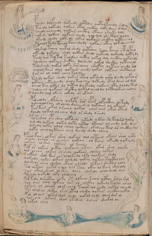

# Voynich Speculative Procedural Protocol — f80v

IMPORTANT: this is NOT a real or validated translation of the Voynich Manuscript. It is a speculative/procedural model that interprets EVA using a user-defined grammar to generate experimental recipes using safe, known edible substitutes.

This file is generated automatically from IVTFF/EVA transliteration plus a user-defined procedural grammar.



## Page / Folio
- currier: B
- folio: f80v
- page_number: 158
- section: biological

## EVA Text (Transliteration)
```text
pchedy dolfchedy qokeedy qotedy qotolfchedy roly
tshedy qotedy olkain otal chckhy qoky daiin doly
schedy qolchedy qokaiin chcthy otaiin sheeky qol
qokedy qokar qokain chedy qol qol shectyhy qoly
okeedy chedy olkeedy oithy qokaiin shckhy qotain ol
tcheol kedy pcheol kain shedy qokaiin otey qokedy chedy
polshol tchey qokol shedy qotshey saly kchey stolpchy
olteedy qokaiin shedy qokain sheol qokchdy qokchdy qoty dy
tchdy qol tol tal taldain chckhy qokal dol checthy qokal ly
sol sheey qokaiin shcthy dolshedy qokal shecthy qotainol
tol sheedy qokar olky rorcheey sheckhy qotain chedy rol
ycheol kain shey qokain chedy qokol olkain shcthhy l
lor ar ol olor chey koldy
tshedy qokain shedy qokas otal qopshedy qoty lchedy qopalor
qotaiin chty lchedy s aly tol chey qoteedy otal dain ol dal
cheol key qotar dy qotal dy keedy qokain oty loldy tal
solcheol qokaiin shecthy qokal cheol dy qotlolkal chedyr
ychedy qol okaiin olkedy or okain
psheoldy dkshey qokopy ror [o:a]por olpoikhy oltydy
ysheeyqorar ol cheey daiin shey qokaiin ol okaiin
tar kain okal y rchey qokal olor aiin okal otam
dchedy qokal ol chey dal or shedy lshedy
polteshol opy shey qopshedy qoteedy qotol shy kolshd qoky
yshedy qokeey qokey qoty qotol otaiin ol chedy qoky daiin
lshedy qoty olol cheey qokain okalchy tal or checthy sar
qoty cheyqytaiin chey lchedy shedy olchey
pshol kain olkar shey qokain dal oltaiin okain shal qoty
olcheol qokain or al chain qokain ol kaiin okeedy qokey ly
qokain olkain olkain ol keeol
pol or olkain oikhy qokaiin okain okar shey qolky
qol ol oiin olkain ol chedy qokain olshey qokain
s olkain shol kair or arolkeedy olky qolkain shedy
qokeedy qoker olkain olshedy qokey qokeey tchcthy lom
dol sheyr shey olshey cthor ylchdy olkain shcthy qoly
tol oltain olkar y qol qol kain okiin ol kain shey ldy
soin okain sheor ol shey daly olshedy olal shedy lchy
polshdy qokeedy shky ololchey
polkedy lsheckhy olky ot olkchy rchey qcthy rchey ral
sol aiin chey qokain ches ol chckhy qokeedy tchdy aral
qokain ol cheeor olar chey t[ch:?]ar ol chedy qotal olchedy
tor arol ar shckhy lkol otol chedy qokain chckhy qokal
pol ol aiin olkal shar shedy qokol chdy ldol dar al
sor ain shkain shar okshey dalar shokal dy
qokal orol
```

## Domain Context (Heuristic; Not a Translation)

This section summarizes recurring **basewords** in this IVTFF domain and shows simple substring evidence that the token markers used by the procedural grammar occur inside frequent words.

Any Italian anagram / English gloss is a best-effort lexicon match, not a decipherment.


### Associated basewords (non-generic; top by frequency in this domain)
- `qokain` (count=158) → Italian anagram `acconi`; English: [n/a]
- `qokal` (count=102) → Italian anagram `calco`; English: cast (of sculpture)
- `daiin` (count=81) → Italian anagram `piani`; English: plans (arrangements)
- `qokaiin` (count=81) → Italian anagram `ciancio`; English: [n/a]
- `qokar` (count=45) → Italian anagram `carco`; English: [n/a]
- `okain` (count=40) → Italian anagram `acino`; English: a berry
- `okaiin` (count=31) → Italian anagram `coniai`; English: [n/a]
- `saiin` (count=30) → Italian anagram `asini`; English: [n/a]
- `olkain` (count=26) → Italian anagram `alcino`; English: smart, clever, intelligent, bright
- `qotal` (count=25) → Italian anagram `colta`; English: [n/a]
- `otain` (count=23) → Italian anagram `anito`; English: [n/a]
- `qotain` (count=20) → Italian anagram `antico`; English: ancient
- `qotar` (count=16) → Italian anagram `corta`; English: [n/a]
- `qotaiin` (count=13) → Italian anagram `cationi`; English: [n/a]
- `kaiin` (count=7) → Italian anagram `acini`; English: [n/a]

### Marker evidence (substring in frequent basewords)
- `qo`: 49 basewords; examples: `qokain`, `qokedy`, `qokeedy`, `qol`, `qokal`, `qokaiin`
- `q`: 50 basewords; examples: `qokain`, `qokedy`, `qokeedy`, `qol`, `qokal`, `qokaiin`
- `o`: 173 basewords; examples: `ol`, `qokain`, `qokedy`, `qokeedy`, `qol`, `qokal`
- `k`: 114 basewords; examples: `qokain`, `qokedy`, `qokeedy`, `qokal`, `qokaiin`, `qokeey`
- `t`: 77 basewords; examples: `otedy`, `qotedy`, `qoteedy`, `qoty`, `qotal`, `otain`
- `p`: 11 basewords; examples: `pchedy`, `opchedy`, `pol`, `qopchedy`, `pchedar`, `opchey`
- `ch`: 93 basewords; examples: `chedy`, `chey`, `lchedy`, `cheey`, `chckhy`, `cheol`
- `sh`: 41 basewords; examples: `shedy`, `shey`, `sheedy`, `sheey`, `sheol`, `shckhy`
- `cth`: 9 basewords; examples: `chcthy`, `checthy`, `shcthy`, `shecthy`, `cthedy`, `cthey`
- `ckh`: 12 basewords; examples: `chckhy`, `shckhy`, `checkhy`, `sheckhy`, `chckhey`, `chckhdy`
- `cph`: 1 basewords; examples: `cphol`
- `dy`: 63 basewords; examples: `shedy`, `chedy`, `qokedy`, `qokeedy`, `dy`, `lchedy`
- `iin`: 27 basewords; examples: `daiin`, `qokaiin`, `aiin`, `okaiin`, `saiin`, `qotaiin`
- `aiin`: 21 basewords; examples: `daiin`, `qokaiin`, `aiin`, `okaiin`, `saiin`, `qotaiin`

## Recipes Index (This Page)
- [f80v.1,@P0](#f80v-1-f80v-1-p0)
- [f80v.2,+P0](#f80v-2-f80v-2-p0)
- [f80v.3,+P0](#f80v-3-f80v-3-p0)
- [f80v.4,+P0](#f80v-4-f80v-4-p0)
- [f80v.5,+P0](#f80v-5-f80v-5-p0)
- [f80v.6,+P0](#f80v-6-f80v-6-p0)
- [f80v.7,+P0](#f80v-7-f80v-7-p0)
- [f80v.8,+P0](#f80v-8-f80v-8-p0)
- [f80v.9,+P0](#f80v-9-f80v-9-p0)
- [f80v.10,+P0](#f80v-10-f80v-10-p0)
- [f80v.11,+P0](#f80v-11-f80v-11-p0)
- [f80v.12,+P0](#f80v-12-f80v-12-p0)
- [f80v.13,+P0](#f80v-13-f80v-13-p0)
- [f80v.14,+P0](#f80v-14-f80v-14-p0)
- [f80v.15,+P0](#f80v-15-f80v-15-p0)
- [f80v.16,+P0](#f80v-16-f80v-16-p0)
- [f80v.17,+P0](#f80v-17-f80v-17-p0)
- [f80v.18,+P0](#f80v-18-f80v-18-p0)
- [f80v.19,+P0](#f80v-19-f80v-19-p0)
- [f80v.20,+P0](#f80v-20-f80v-20-p0)
- [f80v.21,+P0](#f80v-21-f80v-21-p0)
- [f80v.22,+P0](#f80v-22-f80v-22-p0)
- [f80v.23,+P0](#f80v-23-f80v-23-p0)
- [f80v.24,+P0](#f80v-24-f80v-24-p0)
- [f80v.25,+P0](#f80v-25-f80v-25-p0)
- [f80v.26,+P0](#f80v-26-f80v-26-p0)
- [f80v.27,+P0](#f80v-27-f80v-27-p0)
- [f80v.28,+P0](#f80v-28-f80v-28-p0)
- [f80v.29,+P0](#f80v-29-f80v-29-p0)
- [f80v.30,+P0](#f80v-30-f80v-30-p0)
- [f80v.31,+P0](#f80v-31-f80v-31-p0)
- [f80v.32,+P0](#f80v-32-f80v-32-p0)
- [f80v.33,+P0](#f80v-33-f80v-33-p0)
- [f80v.34,+P0](#f80v-34-f80v-34-p0)
- [f80v.35,+P0](#f80v-35-f80v-35-p0)
- [f80v.36,+P0](#f80v-36-f80v-36-p0)
- [f80v.37,+P0](#f80v-37-f80v-37-p0)
- [f80v.38,+P0](#f80v-38-f80v-38-p0)
- [f80v.39,+P0](#f80v-39-f80v-39-p0)
- [f80v.40,+P0](#f80v-40-f80v-40-p0)
- [f80v.41,+P0](#f80v-41-f80v-41-p0)
- [f80v.42,+P0](#f80v-42-f80v-42-p0)
- [f80v.43,+P0](#f80v-43-f80v-43-p0)
- [f80v.44,+P0](#f80v-44-f80v-44-p0)

## Line Glosses (Procedural Gloss Only; Not a Translation)

<a id="f80v-1-f80v-1-p0"></a>

### f80v.1,@P0

EVA: pchedy dolfchedy qokeedy qotedy qotolfchedy roly

Direct Gloss (Procedural, Not a Real Translation):
- pchedy: tokens: p ch e p → vowel_run: e (level 1; class e)
- dolfchedy: tokens: p o l f ch e p → connectors: l → vowel_run: e (level 1; class e)
- qokeedy: tokens: qo k ee p → vowel_run: ee (level 2; class e)
- qotedy: tokens: qo t e p → vowel_run: e (level 1; class e)
- qotolfchedy: tokens: qo t o l f ch e p → connectors: l → vowel_run: e (level 1; class e)
- roly: tokens: r o l → connectors: r l

<a id="f80v-2-f80v-2-p0"></a>

### f80v.2,+P0

EVA: tshedy qotedy olkain otal chckhy qoky daiin doly

Direct Gloss (Procedural, Not a Real Translation):
- tshedy: tokens: t sh e p → vowel_run: e (level 1; class e)
- qotedy: tokens: qo t e p → vowel_run: e (level 1; class e)
- olkain: tokens: o l k a i n → connectors: l n → vowel_run: a (level 1; class a)
- otal: tokens: o t a l → connectors: l → vowel_run: a (level 1; class a)
- chckhy: tokens: ch ckh
- qoky: tokens: qo k
- daiin: tokens: p aiin → vowel_run: a (level 1; class a) → suffix: aiin
- doly: tokens: p o l → connectors: l

<a id="f80v-3-f80v-3-p0"></a>

### f80v.3,+P0

EVA: schedy qolchedy qokaiin chcthy otaiin sheeky qol

Direct Gloss (Procedural, Not a Real Translation):
- schedy: tokens: s ch e p → connectors: s → vowel_run: e (level 1; class e)
- qolchedy: tokens: qo l ch e p → connectors: l → vowel_run: e (level 1; class e)
- qokaiin: tokens: qo k aiin → vowel_run: a (level 1; class a) → suffix: aiin
- chcthy: tokens: ch cth
- otaiin: tokens: o t aiin → vowel_run: a (level 1; class a) → suffix: aiin
- sheeky: tokens: sh ee k → vowel_run: ee (level 2; class e)
- qol: tokens: qo l → connectors: l

<a id="f80v-4-f80v-4-p0"></a>

### f80v.4,+P0

EVA: qokedy qokar qokain chedy qol qol shectyhy qoly

Direct Gloss (Procedural, Not a Real Translation):
- qokedy: tokens: qo k e p → vowel_run: e (level 1; class e)
- qokar: tokens: qo k a r → connectors: r → vowel_run: a (level 1; class a)
- qokain: tokens: qo k a i n → connectors: n → vowel_run: a (level 1; class a)
- chedy: tokens: ch e p → vowel_run: e (level 1; class e)
- qol: tokens: qo l → connectors: l
- qol: tokens: qo l → connectors: l
- shectyhy: tokens: sh e cth → vowel_run: e (level 1; class e)
- qoly: tokens: qo l → connectors: l

<a id="f80v-5-f80v-5-p0"></a>

### f80v.5,+P0

EVA: okeedy chedy olkeedy oithy qokaiin shckhy qotain ol

Direct Gloss (Procedural, Not a Real Translation):
- okeedy: tokens: o k ee p → vowel_run: ee (level 2; class e)
- chedy: tokens: ch e p → vowel_run: e (level 1; class e)
- olkeedy: tokens: o l k ee p → connectors: l → vowel_run: ee (level 2; class e)
- oithy: tokens: o i t h → vowel_run: i (level 1; class i) → unmodeled_tokens: h
- qokaiin: tokens: qo k aiin → vowel_run: a (level 1; class a) → suffix: aiin
- shckhy: tokens: sh ckh
- qotain: tokens: qo t a i n → connectors: n → vowel_run: a (level 1; class a)
- ol: tokens: o l → connectors: l

<a id="f80v-6-f80v-6-p0"></a>

### f80v.6,+P0

EVA: tcheol kedy pcheol kain shedy qokaiin otey qokedy chedy

Direct Gloss (Procedural, Not a Real Translation):
- tcheol: tokens: t ch e o l → connectors: l → vowel_run: e (level 1; class e)
- kedy: tokens: k e p → vowel_run: e (level 1; class e)
- pcheol: tokens: p ch e o l → connectors: l → vowel_run: e (level 1; class e)
- kain: tokens: k a i n → connectors: n → vowel_run: a (level 1; class a)
- shedy: tokens: sh e p → vowel_run: e (level 1; class e)
- qokaiin: tokens: qo k aiin → vowel_run: a (level 1; class a) → suffix: aiin
- otey: tokens: o t e → vowel_run: e (level 1; class e)
- qokedy: tokens: qo k e p → vowel_run: e (level 1; class e)
- chedy: tokens: ch e p → vowel_run: e (level 1; class e)

<a id="f80v-7-f80v-7-p0"></a>

### f80v.7,+P0

EVA: polshol tchey qokol shedy qotshey saly kchey stolpchy

Direct Gloss (Procedural, Not a Real Translation):
- polshol: tokens: p o l sh o l → connectors: l l
- tchey: tokens: t ch e → vowel_run: e (level 1; class e)
- qokol: tokens: qo k o l → connectors: l
- shedy: tokens: sh e p → vowel_run: e (level 1; class e)
- qotshey: tokens: qo t sh e → vowel_run: e (level 1; class e)
- saly: tokens: s a l → connectors: s l → vowel_run: a (level 1; class a)
- kchey: tokens: k ch e → vowel_run: e (level 1; class e)
- stolpchy: tokens: s t o l p ch → connectors: s l

<a id="f80v-8-f80v-8-p0"></a>

### f80v.8,+P0

EVA: olteedy qokaiin shedy qokain sheol qokchdy qokchdy qoty dy

Direct Gloss (Procedural, Not a Real Translation):
- olteedy: tokens: o l t ee p → connectors: l → vowel_run: ee (level 2; class e)
- qokaiin: tokens: qo k aiin → vowel_run: a (level 1; class a) → suffix: aiin
- shedy: tokens: sh e p → vowel_run: e (level 1; class e)
- qokain: tokens: qo k a i n → connectors: n → vowel_run: a (level 1; class a)
- sheol: tokens: sh e o l → connectors: l → vowel_run: e (level 1; class e)
- qokchdy: tokens: qo k ch p
- qokchdy: tokens: qo k ch p
- qoty: tokens: qo t
- dy: tokens: p

<a id="f80v-9-f80v-9-p0"></a>

### f80v.9,+P0

EVA: tchdy qol tol tal taldain chckhy qokal dol checthy qokal ly

Direct Gloss (Procedural, Not a Real Translation):
- tchdy: tokens: t ch p
- qol: tokens: qo l → connectors: l
- tol: tokens: t o l → connectors: l
- tal: tokens: t a l → connectors: l → vowel_run: a (level 1; class a)
- taldain: tokens: t a l p a i n → connectors: l n → vowel_run: a (level 1; class a)
- chckhy: tokens: ch ckh
- qokal: tokens: qo k a l → connectors: l → vowel_run: a (level 1; class a)
- dol: tokens: p o l → connectors: l
- checthy: tokens: ch e cth → vowel_run: e (level 1; class e)
- qokal: tokens: qo k a l → connectors: l → vowel_run: a (level 1; class a)
- ly: tokens: l → connectors: l

<a id="f80v-10-f80v-10-p0"></a>

### f80v.10,+P0

EVA: sol sheey qokaiin shcthy dolshedy qokal shecthy qotainol

Direct Gloss (Procedural, Not a Real Translation):
- sol: tokens: s o l → connectors: s l
- sheey: tokens: sh ee → vowel_run: ee (level 2; class e)
- qokaiin: tokens: qo k aiin → vowel_run: a (level 1; class a) → suffix: aiin
- shcthy: tokens: sh cth
- dolshedy: tokens: p o l sh e p → connectors: l → vowel_run: e (level 1; class e)
- qokal: tokens: qo k a l → connectors: l → vowel_run: a (level 1; class a)
- shecthy: tokens: sh e cth → vowel_run: e (level 1; class e)
- qotainol: tokens: qo t a i n o l → connectors: n l → vowel_run: a (level 1; class a)

<a id="f80v-11-f80v-11-p0"></a>

### f80v.11,+P0

EVA: tol sheedy qokar olky rorcheey sheckhy qotain chedy rol

Direct Gloss (Procedural, Not a Real Translation):
- tol: tokens: t o l → connectors: l
- sheedy: tokens: sh ee p → vowel_run: ee (level 2; class e)
- qokar: tokens: qo k a r → connectors: r → vowel_run: a (level 1; class a)
- olky: tokens: o l k → connectors: l
- rorcheey: tokens: r o r ch ee → connectors: r r → vowel_run: ee (level 2; class e)
- sheckhy: tokens: sh e ckh → vowel_run: e (level 1; class e)
- qotain: tokens: qo t a i n → connectors: n → vowel_run: a (level 1; class a)
- chedy: tokens: ch e p → vowel_run: e (level 1; class e)
- rol: tokens: r o l → connectors: r l

<a id="f80v-12-f80v-12-p0"></a>

### f80v.12,+P0

EVA: ycheol kain shey qokain chedy qokol olkain shcthhy l

Direct Gloss (Procedural, Not a Real Translation):
- ycheol: tokens: ch e o l → connectors: l → vowel_run: e (level 1; class e)
- kain: tokens: k a i n → connectors: n → vowel_run: a (level 1; class a)
- shey: tokens: sh e → vowel_run: e (level 1; class e)
- qokain: tokens: qo k a i n → connectors: n → vowel_run: a (level 1; class a)
- chedy: tokens: ch e p → vowel_run: e (level 1; class e)
- qokol: tokens: qo k o l → connectors: l
- olkain: tokens: o l k a i n → connectors: l n → vowel_run: a (level 1; class a)
- shcthhy: tokens: sh cth h → unmodeled_tokens: h
- l: tokens: l → connectors: l

<a id="f80v-13-f80v-13-p0"></a>

### f80v.13,+P0

EVA: lor ar ol olor chey koldy

Direct Gloss (Procedural, Not a Real Translation):
- lor: tokens: l o r → connectors: l r
- ar: tokens: a r → connectors: r → vowel_run: a (level 1; class a)
- ol: tokens: o l → connectors: l
- olor: tokens: o l o r → connectors: l r
- chey: tokens: ch e → vowel_run: e (level 1; class e)
- koldy: tokens: k o l p → connectors: l

<a id="f80v-14-f80v-14-p0"></a>

### f80v.14,+P0

EVA: tshedy qokain shedy qokas otal qopshedy qoty lchedy qopalor

Direct Gloss (Procedural, Not a Real Translation):
- tshedy: tokens: t sh e p → vowel_run: e (level 1; class e)
- qokain: tokens: qo k a i n → connectors: n → vowel_run: a (level 1; class a)
- shedy: tokens: sh e p → vowel_run: e (level 1; class e)
- qokas: tokens: qo k a s → connectors: s → vowel_run: a (level 1; class a)
- otal: tokens: o t a l → connectors: l → vowel_run: a (level 1; class a)
- qopshedy: tokens: qo p sh e p → vowel_run: e (level 1; class e)
- qoty: tokens: qo t
- lchedy: tokens: l ch e p → connectors: l → vowel_run: e (level 1; class e)
- qopalor: tokens: qo p a l o r → connectors: l r → vowel_run: a (level 1; class a)

<a id="f80v-15-f80v-15-p0"></a>

### f80v.15,+P0

EVA: qotaiin chty lchedy s aly tol chey qoteedy otal dain ol dal

Direct Gloss (Procedural, Not a Real Translation):
- qotaiin: tokens: qo t aiin → vowel_run: a (level 1; class a) → suffix: aiin
- chty: tokens: ch t
- lchedy: tokens: l ch e p → connectors: l → vowel_run: e (level 1; class e)
- s: tokens: s → connectors: s
- aly: tokens: a l → connectors: l → vowel_run: a (level 1; class a)
- tol: tokens: t o l → connectors: l
- chey: tokens: ch e → vowel_run: e (level 1; class e)
- qoteedy: tokens: qo t ee p → vowel_run: ee (level 2; class e)
- otal: tokens: o t a l → connectors: l → vowel_run: a (level 1; class a)
- dain: tokens: p a i n → connectors: n → vowel_run: a (level 1; class a)
- ol: tokens: o l → connectors: l
- dal: tokens: p a l → connectors: l → vowel_run: a (level 1; class a)

<a id="f80v-16-f80v-16-p0"></a>

### f80v.16,+P0

EVA: cheol key qotar dy qotal dy keedy qokain oty loldy tal

Direct Gloss (Procedural, Not a Real Translation):
- cheol: tokens: ch e o l → connectors: l → vowel_run: e (level 1; class e)
- key: tokens: k e → vowel_run: e (level 1; class e)
- qotar: tokens: qo t a r → connectors: r → vowel_run: a (level 1; class a)
- dy: tokens: p
- qotal: tokens: qo t a l → connectors: l → vowel_run: a (level 1; class a)
- dy: tokens: p
- keedy: tokens: k ee p → vowel_run: ee (level 2; class e)
- qokain: tokens: qo k a i n → connectors: n → vowel_run: a (level 1; class a)
- oty: tokens: o t
- loldy: tokens: l o l p → connectors: l l
- tal: tokens: t a l → connectors: l → vowel_run: a (level 1; class a)

<a id="f80v-17-f80v-17-p0"></a>

### f80v.17,+P0

EVA: solcheol qokaiin shecthy qokal cheol dy qotlolkal chedyr

Direct Gloss (Procedural, Not a Real Translation):
- solcheol: tokens: s o l ch e o l → connectors: s l l → vowel_run: e (level 1; class e)
- qokaiin: tokens: qo k aiin → vowel_run: a (level 1; class a) → suffix: aiin
- shecthy: tokens: sh e cth → vowel_run: e (level 1; class e)
- qokal: tokens: qo k a l → connectors: l → vowel_run: a (level 1; class a)
- cheol: tokens: ch e o l → connectors: l → vowel_run: e (level 1; class e)
- dy: tokens: p
- qotlolkal: tokens: qo t l o l k a l → connectors: l l l → vowel_run: a (level 1; class a)
- chedyr: tokens: ch e p r → connectors: r → vowel_run: e (level 1; class e)

<a id="f80v-18-f80v-18-p0"></a>

### f80v.18,+P0

EVA: ychedy qol okaiin olkedy or okain

Direct Gloss (Procedural, Not a Real Translation):
- ychedy: tokens: ch e p → vowel_run: e (level 1; class e)
- qol: tokens: qo l → connectors: l
- okaiin: tokens: o k aiin → vowel_run: a (level 1; class a) → suffix: aiin
- olkedy: tokens: o l k e p → connectors: l → vowel_run: e (level 1; class e)
- or: tokens: o r → connectors: r
- okain: tokens: o k a i n → connectors: n → vowel_run: a (level 1; class a)

<a id="f80v-19-f80v-19-p0"></a>

### f80v.19,+P0

EVA: psheoldy dkshey qokopy ror [o:a]por olpoikhy oltydy

Direct Gloss (Procedural, Not a Real Translation):
- psheoldy: tokens: p sh e o l p → connectors: l → vowel_run: e (level 1; class e)
- dkshey: tokens: p k sh e → vowel_run: e (level 1; class e)
- qokopy: tokens: qo k o p
- ror: tokens: r o r → connectors: r r
- o: tokens: o
- a: tokens: a → vowel_run: a (level 1; class a)
- por: tokens: p o r → connectors: r
- olpoikhy: tokens: o l p o i k h → connectors: l → vowel_run: i (level 1; class i) → unmodeled_tokens: h
- oltydy: tokens: o l t p → connectors: l

<a id="f80v-20-f80v-20-p0"></a>

### f80v.20,+P0

EVA: ysheeyqorar ol cheey daiin shey qokaiin ol okaiin

Direct Gloss (Procedural, Not a Real Translation):
- ysheeyqorar: tokens: sh ee qo r a r → connectors: r r → vowel_run: ee (level 2; class e)
- ol: tokens: o l → connectors: l
- cheey: tokens: ch ee → vowel_run: ee (level 2; class e)
- daiin: tokens: p aiin → vowel_run: a (level 1; class a) → suffix: aiin
- shey: tokens: sh e → vowel_run: e (level 1; class e)
- qokaiin: tokens: qo k aiin → vowel_run: a (level 1; class a) → suffix: aiin
- ol: tokens: o l → connectors: l
- okaiin: tokens: o k aiin → vowel_run: a (level 1; class a) → suffix: aiin

<a id="f80v-21-f80v-21-p0"></a>

### f80v.21,+P0

EVA: tar kain okal y rchey qokal olor aiin okal otam

Direct Gloss (Procedural, Not a Real Translation):
- tar: tokens: t a r → connectors: r → vowel_run: a (level 1; class a)
- kain: tokens: k a i n → connectors: n → vowel_run: a (level 1; class a)
- okal: tokens: o k a l → connectors: l → vowel_run: a (level 1; class a)
- y: [unparsed]
- rchey: tokens: r ch e → connectors: r → vowel_run: e (level 1; class e)
- qokal: tokens: qo k a l → connectors: l → vowel_run: a (level 1; class a)
- olor: tokens: o l o r → connectors: l r
- aiin: tokens: aiin → vowel_run: a (level 1; class a) → suffix: aiin
- okal: tokens: o k a l → connectors: l → vowel_run: a (level 1; class a)
- otam: tokens: o t a m → connectors: m → vowel_run: a (level 1; class a)

<a id="f80v-22-f80v-22-p0"></a>

### f80v.22,+P0

EVA: dchedy qokal ol chey dal or shedy lshedy

Direct Gloss (Procedural, Not a Real Translation):
- dchedy: tokens: p ch e p → vowel_run: e (level 1; class e)
- qokal: tokens: qo k a l → connectors: l → vowel_run: a (level 1; class a)
- ol: tokens: o l → connectors: l
- chey: tokens: ch e → vowel_run: e (level 1; class e)
- dal: tokens: p a l → connectors: l → vowel_run: a (level 1; class a)
- or: tokens: o r → connectors: r
- shedy: tokens: sh e p → vowel_run: e (level 1; class e)
- lshedy: tokens: l sh e p → connectors: l → vowel_run: e (level 1; class e)

<a id="f80v-23-f80v-23-p0"></a>

### f80v.23,+P0

EVA: polteshol opy shey qopshedy qoteedy qotol shy kolshd qoky

Direct Gloss (Procedural, Not a Real Translation):
- polteshol: tokens: p o l t e sh o l → connectors: l l → vowel_run: e (level 1; class e)
- opy: tokens: o p
- shey: tokens: sh e → vowel_run: e (level 1; class e)
- qopshedy: tokens: qo p sh e p → vowel_run: e (level 1; class e)
- qoteedy: tokens: qo t ee p → vowel_run: ee (level 2; class e)
- qotol: tokens: qo t o l → connectors: l
- shy: tokens: sh
- kolshd: tokens: k o l sh p → connectors: l
- qoky: tokens: qo k

<a id="f80v-24-f80v-24-p0"></a>

### f80v.24,+P0

EVA: yshedy qokeey qokey qoty qotol otaiin ol chedy qoky daiin

Direct Gloss (Procedural, Not a Real Translation):
- yshedy: tokens: sh e p → vowel_run: e (level 1; class e)
- qokeey: tokens: qo k ee → vowel_run: ee (level 2; class e)
- qokey: tokens: qo k e → vowel_run: e (level 1; class e)
- qoty: tokens: qo t
- qotol: tokens: qo t o l → connectors: l
- otaiin: tokens: o t aiin → vowel_run: a (level 1; class a) → suffix: aiin
- ol: tokens: o l → connectors: l
- chedy: tokens: ch e p → vowel_run: e (level 1; class e)
- qoky: tokens: qo k
- daiin: tokens: p aiin → vowel_run: a (level 1; class a) → suffix: aiin

<a id="f80v-25-f80v-25-p0"></a>

### f80v.25,+P0

EVA: lshedy qoty olol cheey qokain okalchy tal or checthy sar

Direct Gloss (Procedural, Not a Real Translation):
- lshedy: tokens: l sh e p → connectors: l → vowel_run: e (level 1; class e)
- qoty: tokens: qo t
- olol: tokens: o l o l → connectors: l l
- cheey: tokens: ch ee → vowel_run: ee (level 2; class e)
- qokain: tokens: qo k a i n → connectors: n → vowel_run: a (level 1; class a)
- okalchy: tokens: o k a l ch → connectors: l → vowel_run: a (level 1; class a)
- tal: tokens: t a l → connectors: l → vowel_run: a (level 1; class a)
- or: tokens: o r → connectors: r
- checthy: tokens: ch e cth → vowel_run: e (level 1; class e)
- sar: tokens: s a r → connectors: s r → vowel_run: a (level 1; class a)

<a id="f80v-26-f80v-26-p0"></a>

### f80v.26,+P0

EVA: qoty cheyqytaiin chey lchedy shedy olchey

Direct Gloss (Procedural, Not a Real Translation):
- qoty: tokens: qo t
- cheyqytaiin: tokens: ch e q t aiin → vowel_run: e (level 1; class e) → suffix: aiin
- chey: tokens: ch e → vowel_run: e (level 1; class e)
- lchedy: tokens: l ch e p → connectors: l → vowel_run: e (level 1; class e)
- shedy: tokens: sh e p → vowel_run: e (level 1; class e)
- olchey: tokens: o l ch e → connectors: l → vowel_run: e (level 1; class e)

<a id="f80v-27-f80v-27-p0"></a>

### f80v.27,+P0

EVA: pshol kain olkar shey qokain dal oltaiin okain shal qoty

Direct Gloss (Procedural, Not a Real Translation):
- pshol: tokens: p sh o l → connectors: l
- kain: tokens: k a i n → connectors: n → vowel_run: a (level 1; class a)
- olkar: tokens: o l k a r → connectors: l r → vowel_run: a (level 1; class a)
- shey: tokens: sh e → vowel_run: e (level 1; class e)
- qokain: tokens: qo k a i n → connectors: n → vowel_run: a (level 1; class a)
- dal: tokens: p a l → connectors: l → vowel_run: a (level 1; class a)
- oltaiin: tokens: o l t aiin → connectors: l → vowel_run: a (level 1; class a) → suffix: aiin
- okain: tokens: o k a i n → connectors: n → vowel_run: a (level 1; class a)
- shal: tokens: sh a l → connectors: l → vowel_run: a (level 1; class a)
- qoty: tokens: qo t

<a id="f80v-28-f80v-28-p0"></a>

### f80v.28,+P0

EVA: olcheol qokain or al chain qokain ol kaiin okeedy qokey ly

Direct Gloss (Procedural, Not a Real Translation):
- olcheol: tokens: o l ch e o l → connectors: l l → vowel_run: e (level 1; class e)
- qokain: tokens: qo k a i n → connectors: n → vowel_run: a (level 1; class a)
- or: tokens: o r → connectors: r
- al: tokens: a l → connectors: l → vowel_run: a (level 1; class a)
- chain: tokens: ch a i n → connectors: n → vowel_run: a (level 1; class a)
- qokain: tokens: qo k a i n → connectors: n → vowel_run: a (level 1; class a)
- ol: tokens: o l → connectors: l
- kaiin: tokens: k aiin → vowel_run: a (level 1; class a) → suffix: aiin
- okeedy: tokens: o k ee p → vowel_run: ee (level 2; class e)
- qokey: tokens: qo k e → vowel_run: e (level 1; class e)
- ly: tokens: l → connectors: l

<a id="f80v-29-f80v-29-p0"></a>

### f80v.29,+P0

EVA: qokain olkain olkain ol keeol

Direct Gloss (Procedural, Not a Real Translation):
- qokain: tokens: qo k a i n → connectors: n → vowel_run: a (level 1; class a)
- olkain: tokens: o l k a i n → connectors: l n → vowel_run: a (level 1; class a)
- olkain: tokens: o l k a i n → connectors: l n → vowel_run: a (level 1; class a)
- ol: tokens: o l → connectors: l
- keeol: tokens: k ee o l → connectors: l → vowel_run: ee (level 2; class e)

<a id="f80v-30-f80v-30-p0"></a>

### f80v.30,+P0

EVA: pol or olkain oikhy qokaiin okain okar shey qolky

Direct Gloss (Procedural, Not a Real Translation):
- pol: tokens: p o l → connectors: l
- or: tokens: o r → connectors: r
- olkain: tokens: o l k a i n → connectors: l n → vowel_run: a (level 1; class a)
- oikhy: tokens: o i k h → vowel_run: i (level 1; class i) → unmodeled_tokens: h
- qokaiin: tokens: qo k aiin → vowel_run: a (level 1; class a) → suffix: aiin
- okain: tokens: o k a i n → connectors: n → vowel_run: a (level 1; class a)
- okar: tokens: o k a r → connectors: r → vowel_run: a (level 1; class a)
- shey: tokens: sh e → vowel_run: e (level 1; class e)
- qolky: tokens: qo l k → connectors: l

<a id="f80v-31-f80v-31-p0"></a>

### f80v.31,+P0

EVA: qol ol oiin olkain ol chedy qokain olshey qokain

Direct Gloss (Procedural, Not a Real Translation):
- qol: tokens: qo l → connectors: l
- ol: tokens: o l → connectors: l
- oiin: tokens: o iin → vowel_run: ii (level 2; class i) → suffix: iin
- olkain: tokens: o l k a i n → connectors: l n → vowel_run: a (level 1; class a)
- ol: tokens: o l → connectors: l
- chedy: tokens: ch e p → vowel_run: e (level 1; class e)
- qokain: tokens: qo k a i n → connectors: n → vowel_run: a (level 1; class a)
- olshey: tokens: o l sh e → connectors: l → vowel_run: e (level 1; class e)
- qokain: tokens: qo k a i n → connectors: n → vowel_run: a (level 1; class a)

<a id="f80v-32-f80v-32-p0"></a>

### f80v.32,+P0

EVA: s olkain shol kair or arolkeedy olky qolkain shedy

Direct Gloss (Procedural, Not a Real Translation):
- s: tokens: s → connectors: s
- olkain: tokens: o l k a i n → connectors: l n → vowel_run: a (level 1; class a)
- shol: tokens: sh o l → connectors: l
- kair: tokens: k a i r → connectors: r → vowel_run: a (level 1; class a)
- or: tokens: o r → connectors: r
- arolkeedy: tokens: a r o l k ee p → connectors: r l → vowel_run: a (level 1; class a)
- olky: tokens: o l k → connectors: l
- qolkain: tokens: qo l k a i n → connectors: l n → vowel_run: a (level 1; class a)
- shedy: tokens: sh e p → vowel_run: e (level 1; class e)

<a id="f80v-33-f80v-33-p0"></a>

### f80v.33,+P0

EVA: qokeedy qoker olkain olshedy qokey qokeey tchcthy lom

Direct Gloss (Procedural, Not a Real Translation):
- qokeedy: tokens: qo k ee p → vowel_run: ee (level 2; class e)
- qoker: tokens: qo k e r → connectors: r → vowel_run: e (level 1; class e)
- olkain: tokens: o l k a i n → connectors: l n → vowel_run: a (level 1; class a)
- olshedy: tokens: o l sh e p → connectors: l → vowel_run: e (level 1; class e)
- qokey: tokens: qo k e → vowel_run: e (level 1; class e)
- qokeey: tokens: qo k ee → vowel_run: ee (level 2; class e)
- tchcthy: tokens: t ch cth
- lom: tokens: l o m → connectors: l m

<a id="f80v-34-f80v-34-p0"></a>

### f80v.34,+P0

EVA: dol sheyr shey olshey cthor ylchdy olkain shcthy qoly

Direct Gloss (Procedural, Not a Real Translation):
- dol: tokens: p o l → connectors: l
- sheyr: tokens: sh e r → connectors: r → vowel_run: e (level 1; class e)
- shey: tokens: sh e → vowel_run: e (level 1; class e)
- olshey: tokens: o l sh e → connectors: l → vowel_run: e (level 1; class e)
- cthor: tokens: cth o r → connectors: r
- ylchdy: tokens: l ch p → connectors: l
- olkain: tokens: o l k a i n → connectors: l n → vowel_run: a (level 1; class a)
- shcthy: tokens: sh cth
- qoly: tokens: qo l → connectors: l

<a id="f80v-35-f80v-35-p0"></a>

### f80v.35,+P0

EVA: tol oltain olkar y qol qol kain okiin ol kain shey ldy

Direct Gloss (Procedural, Not a Real Translation):
- tol: tokens: t o l → connectors: l
- oltain: tokens: o l t a i n → connectors: l n → vowel_run: a (level 1; class a)
- olkar: tokens: o l k a r → connectors: l r → vowel_run: a (level 1; class a)
- y: [unparsed]
- qol: tokens: qo l → connectors: l
- qol: tokens: qo l → connectors: l
- kain: tokens: k a i n → connectors: n → vowel_run: a (level 1; class a)
- okiin: tokens: o k iin → vowel_run: ii (level 2; class i) → suffix: iin
- ol: tokens: o l → connectors: l
- kain: tokens: k a i n → connectors: n → vowel_run: a (level 1; class a)
- shey: tokens: sh e → vowel_run: e (level 1; class e)
- ldy: tokens: l p → connectors: l

<a id="f80v-36-f80v-36-p0"></a>

### f80v.36,+P0

EVA: soin okain sheor ol shey daly olshedy olal shedy lchy

Direct Gloss (Procedural, Not a Real Translation):
- soin: tokens: s o i n → connectors: s n → vowel_run: i (level 1; class i)
- okain: tokens: o k a i n → connectors: n → vowel_run: a (level 1; class a)
- sheor: tokens: sh e o r → connectors: r → vowel_run: e (level 1; class e)
- ol: tokens: o l → connectors: l
- shey: tokens: sh e → vowel_run: e (level 1; class e)
- daly: tokens: p a l → connectors: l → vowel_run: a (level 1; class a)
- olshedy: tokens: o l sh e p → connectors: l → vowel_run: e (level 1; class e)
- olal: tokens: o l a l → connectors: l l → vowel_run: a (level 1; class a)
- shedy: tokens: sh e p → vowel_run: e (level 1; class e)
- lchy: tokens: l ch → connectors: l

<a id="f80v-37-f80v-37-p0"></a>

### f80v.37,+P0

EVA: polshdy qokeedy shky ololchey

Direct Gloss (Procedural, Not a Real Translation):
- polshdy: tokens: p o l sh p → connectors: l
- qokeedy: tokens: qo k ee p → vowel_run: ee (level 2; class e)
- shky: tokens: sh k
- ololchey: tokens: o l o l ch e → connectors: l l → vowel_run: e (level 1; class e)

<a id="f80v-38-f80v-38-p0"></a>

### f80v.38,+P0

EVA: polkedy lsheckhy olky ot olkchy rchey qcthy rchey ral

Direct Gloss (Procedural, Not a Real Translation):
- polkedy: tokens: p o l k e p → connectors: l → vowel_run: e (level 1; class e)
- lsheckhy: tokens: l sh e ckh → connectors: l → vowel_run: e (level 1; class e)
- olky: tokens: o l k → connectors: l
- ot: tokens: o t
- olkchy: tokens: o l k ch → connectors: l
- rchey: tokens: r ch e → connectors: r → vowel_run: e (level 1; class e)
- qcthy: tokens: q cth
- rchey: tokens: r ch e → connectors: r → vowel_run: e (level 1; class e)
- ral: tokens: r a l → connectors: r l → vowel_run: a (level 1; class a)

<a id="f80v-39-f80v-39-p0"></a>

### f80v.39,+P0

EVA: sol aiin chey qokain ches ol chckhy qokeedy tchdy aral

Direct Gloss (Procedural, Not a Real Translation):
- sol: tokens: s o l → connectors: s l
- aiin: tokens: aiin → vowel_run: a (level 1; class a) → suffix: aiin
- chey: tokens: ch e → vowel_run: e (level 1; class e)
- qokain: tokens: qo k a i n → connectors: n → vowel_run: a (level 1; class a)
- ches: tokens: ch e s → connectors: s → vowel_run: e (level 1; class e)
- ol: tokens: o l → connectors: l
- chckhy: tokens: ch ckh
- qokeedy: tokens: qo k ee p → vowel_run: ee (level 2; class e)
- tchdy: tokens: t ch p
- aral: tokens: a r a l → connectors: r l → vowel_run: a (level 1; class a)

<a id="f80v-40-f80v-40-p0"></a>

### f80v.40,+P0

EVA: qokain ol cheeor olar chey t[ch:?]ar ol chedy qotal olchedy

Direct Gloss (Procedural, Not a Real Translation):
- qokain: tokens: qo k a i n → connectors: n → vowel_run: a (level 1; class a)
- ol: tokens: o l → connectors: l
- cheeor: tokens: ch ee o r → connectors: r → vowel_run: ee (level 2; class e)
- olar: tokens: o l a r → connectors: l r → vowel_run: a (level 1; class a)
- chey: tokens: ch e → vowel_run: e (level 1; class e)
- t: tokens: t
- ch: tokens: ch
- ar: tokens: a r → connectors: r → vowel_run: a (level 1; class a)
- ol: tokens: o l → connectors: l
- chedy: tokens: ch e p → vowel_run: e (level 1; class e)
- qotal: tokens: qo t a l → connectors: l → vowel_run: a (level 1; class a)
- olchedy: tokens: o l ch e p → connectors: l → vowel_run: e (level 1; class e)

<a id="f80v-41-f80v-41-p0"></a>

### f80v.41,+P0

EVA: tor arol ar shckhy lkol otol chedy qokain chckhy qokal

Direct Gloss (Procedural, Not a Real Translation):
- tor: tokens: t o r → connectors: r
- arol: tokens: a r o l → connectors: r l → vowel_run: a (level 1; class a)
- ar: tokens: a r → connectors: r → vowel_run: a (level 1; class a)
- shckhy: tokens: sh ckh
- lkol: tokens: l k o l → connectors: l l
- otol: tokens: o t o l → connectors: l
- chedy: tokens: ch e p → vowel_run: e (level 1; class e)
- qokain: tokens: qo k a i n → connectors: n → vowel_run: a (level 1; class a)
- chckhy: tokens: ch ckh
- qokal: tokens: qo k a l → connectors: l → vowel_run: a (level 1; class a)

<a id="f80v-42-f80v-42-p0"></a>

### f80v.42,+P0

EVA: pol ol aiin olkal shar shedy qokol chdy ldol dar al

Direct Gloss (Procedural, Not a Real Translation):
- pol: tokens: p o l → connectors: l
- ol: tokens: o l → connectors: l
- aiin: tokens: aiin → vowel_run: a (level 1; class a) → suffix: aiin
- olkal: tokens: o l k a l → connectors: l l → vowel_run: a (level 1; class a)
- shar: tokens: sh a r → connectors: r → vowel_run: a (level 1; class a)
- shedy: tokens: sh e p → vowel_run: e (level 1; class e)
- qokol: tokens: qo k o l → connectors: l
- chdy: tokens: ch p
- ldol: tokens: l p o l → connectors: l l
- dar: tokens: p a r → connectors: r → vowel_run: a (level 1; class a)
- al: tokens: a l → connectors: l → vowel_run: a (level 1; class a)

<a id="f80v-43-f80v-43-p0"></a>

### f80v.43,+P0

EVA: sor ain shkain shar okshey dalar shokal dy

Direct Gloss (Procedural, Not a Real Translation):
- sor: tokens: s o r → connectors: s r
- ain: tokens: a i n → connectors: n → vowel_run: a (level 1; class a)
- shkain: tokens: sh k a i n → connectors: n → vowel_run: a (level 1; class a)
- shar: tokens: sh a r → connectors: r → vowel_run: a (level 1; class a)
- okshey: tokens: o k sh e → vowel_run: e (level 1; class e)
- dalar: tokens: p a l a r → connectors: l r → vowel_run: a (level 1; class a)
- shokal: tokens: sh o k a l → connectors: l → vowel_run: a (level 1; class a)
- dy: tokens: p

<a id="f80v-44-f80v-44-p0"></a>

### f80v.44,+P0

EVA: qokal orol

Direct Gloss (Procedural, Not a Real Translation):
- qokal: tokens: qo k a l → connectors: l → vowel_run: a (level 1; class a)
- orol: tokens: o r o l → connectors: r l
