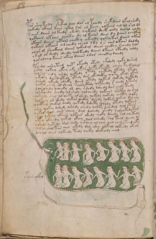

# Voynich Speculative Herbal Ferment Recipe — f81v

IMPORTANT: this is NOT a real or validated translation of the Voynich Manuscript. It is a speculative/procedural model that interprets EVA using a user-defined grammar to generate experimental recipes using safe, known edible substitutes.

This file is generated automatically from IVTFF/EVA transliteration plus a user-defined procedural grammar.



## Page / Folio
- currier: B
- folio: f81v
- page_number: 160
- section: biological

## EVA Text (Transliteration)
```text
par shey keedy shekal dal dar ol pchedy shek dain ofalsheky
qokedy okaiin kair okal sar ol kain olkain al ol rol dl
saiin daiin olkeedy okedy dykain shek chdy dalal oldy
qokaiin okain cheeky dy ol kaiin dain dy daiin chcthy
okaiin daiin otain chckhy okeedy qoky kar daiin okar
qokain okaiin ol chedy cheol lky l s aiin okain daldy
olor ol sheckhal daiin qokeedal daiin chckhy schedy qol
ykol or shedy sheedy qolkeedy daiin dkain cphedy oldy
yar olchey kaiin okeey daiin olor checkhy daiidy
polshy [a:o]shyteed qop okeedy otedy okshedy qoty dairam
[y:?]shey qokeey okeey oky ykeey qoky oky lky olchy ky dsholyd
qol ol chdy shedy qokedy ytedy chetedy lkedey ytedy
ykeshey dch[s:]ed ytedy ytedy dar ykedaiphy qoty ykedy okal
dshedy ykeedy sheeky daiin okedy qokeed qokedy lchpchdy
qokal chedy ol sheey salshcthdy qofchedy r chedy ltary
lor shedy qoeedy ol chy rshdy lshedy dar chdy pchdy
sshkchdy chedy ol shedy qolchedy qokain ch'ckhy dl ral
qokchdy chey ol cheky ol shedy qokedy qokedy chckhy qoky
solkeey ol shedy qokar shckhy dch'edy qokar qokal dol chy
qocthey chekal chedy qokedy lshety qoldy ltedy qotain
lsho qokey lshedy lshedy chedy qolky lchedal qol otar
qokal qol oiin cheey dal lchedy chedy salchtedytar
shol qe[t:k]chy ykaiin olkain shedy qoky dchedy rol olcthdy
ytey okchedy qokal okeey qol cheedy sal teol dchdy ly
oshedy qotedy sh[o:a]l chedy y shchey ol chey qol chedy tchd oky
[?:q]ol checholtar oiin okedy dal shey olkeol olkeedy okeol
dsheol oiiin olkeedy tedy cheky shckhedy chal
otain olkal
```

## Recipes Index (This Page)
- [f81v.1,@P0](#f81v-1-f81v-1-p0)
- [f81v.2,+P0](#f81v-2-f81v-2-p0)
- [f81v.3,+P0](#f81v-3-f81v-3-p0)
- [f81v.4,+P0](#f81v-4-f81v-4-p0)
- [f81v.5,+P0](#f81v-5-f81v-5-p0)
- [f81v.6,+P0](#f81v-6-f81v-6-p0)
- [f81v.7,+P0](#f81v-7-f81v-7-p0)
- [f81v.8,+P0](#f81v-8-f81v-8-p0)
- [f81v.9,+P0](#f81v-9-f81v-9-p0)
- [f81v.10,+P0](#f81v-10-f81v-10-p0)
- [f81v.11,+P0](#f81v-11-f81v-11-p0)
- [f81v.12,+P0](#f81v-12-f81v-12-p0)
- [f81v.13,+P0](#f81v-13-f81v-13-p0)
- [f81v.14,+P0](#f81v-14-f81v-14-p0)
- [f81v.15,+P0](#f81v-15-f81v-15-p0)
- [f81v.16,+P0](#f81v-16-f81v-16-p0)
- [f81v.17,+P0](#f81v-17-f81v-17-p0)
- [f81v.18,+P0](#f81v-18-f81v-18-p0)
- [f81v.19,+P0](#f81v-19-f81v-19-p0)
- [f81v.20,+P0](#f81v-20-f81v-20-p0)
- [f81v.21,+P0](#f81v-21-f81v-21-p0)
- [f81v.22,+P0](#f81v-22-f81v-22-p0)
- [f81v.23,+P0](#f81v-23-f81v-23-p0)
- [f81v.24,+P0](#f81v-24-f81v-24-p0)
- [f81v.25,+P0](#f81v-25-f81v-25-p0)
- [f81v.26,+P0](#f81v-26-f81v-26-p0)
- [f81v.27,+P0](#f81v-27-f81v-27-p0)
- [f81v.28,@Lt](#f81v-28-f81v-28-lt)

## Line Glosses (Procedural Gloss Only; Not a Translation)

<a id="f81v-1-f81v-1-p0"></a>

### f81v.1,@P0

EVA: par shey keedy shekal dal dar ol pchedy shek dain ofalsheky

Direct Gloss (Procedural, Not a Real Translation):
- par: start fermentation (yeast) → duration level 1 → state: fermentation start
- shey: add secondary herb (safe substitute) → duration level 1 → state: active extraction
- keedy: add fermentable sugars → start fermentation (yeast) → duration level 2 → state: active extraction
- shekal: add fermentable sugars → add secondary herb (safe substitute) → duration level 1 → state: active extraction
- dal: start fermentation (yeast) → duration level 1 → state: fermentation start
- dar: start fermentation (yeast) → duration level 1 → state: fermentation start
- ol: mix / transfer
- pchedy: add main plant (safe substitute) → start fermentation (yeast) → duration level 1 → state: active extraction
- shek: add fermentable sugars → add secondary herb (safe substitute) → duration level 1 → state: active extraction
- dain: start fermentation (yeast) → duration level 1 → state: fermentation start
- ofalsheky: add fermentable sugars → add secondary herb (safe substitute) → add aroma modifier → mix / transfer → duration level 1 → state: fermentation start

<a id="f81v-2-f81v-2-p0"></a>

### f81v.2,+P0

EVA: qokedy okaiin kair okal sar ol kain olkain al ol rol dl

Direct Gloss (Procedural, Not a Real Translation):
- qokedy: prepare liquid base → add fermentable sugars → start fermentation (yeast) → duration level 1 → state: active extraction
- okaiin: add fermentable sugars → mix / transfer → duration level 1 → state: fermentation start → long fermentation / aging phase
- kair: add fermentable sugars → duration level 1 → state: fermentation start
- okal: add fermentable sugars → mix / transfer → duration level 1 → state: fermentation start
- sar: duration level 1 → state: fermentation start
- ol: mix / transfer
- kain: add fermentable sugars → duration level 1 → state: fermentation start
- olkain: add fermentable sugars → mix / transfer → duration level 1 → state: fermentation start
- al: duration level 1 → state: fermentation start
- ol: mix / transfer
- rol: mix / transfer
- dl: start fermentation (yeast)

<a id="f81v-3-f81v-3-p0"></a>

### f81v.3,+P0

EVA: saiin daiin olkeedy okedy dykain shek chdy dalal oldy

Direct Gloss (Procedural, Not a Real Translation):
- saiin: duration level 1 → state: fermentation start → long fermentation / aging phase
- daiin: start fermentation (yeast) → duration level 1 → state: fermentation start → long fermentation / aging phase
- olkeedy: add fermentable sugars → mix / transfer → start fermentation (yeast) → duration level 2 → state: active extraction
- okedy: add fermentable sugars → mix / transfer → start fermentation (yeast) → duration level 1 → state: active extraction
- dykain: add fermentable sugars → start fermentation (yeast) → duration level 1 → state: fermentation start
- shek: add fermentable sugars → add secondary herb (safe substitute) → duration level 1 → state: active extraction
- chdy: add main plant (safe substitute) → start fermentation (yeast)
- dalal: start fermentation (yeast) → duration level 1 → state: fermentation start
- oldy: mix / transfer → start fermentation (yeast)

<a id="f81v-4-f81v-4-p0"></a>

### f81v.4,+P0

EVA: qokaiin okain cheeky dy ol kaiin dain dy daiin chcthy

Direct Gloss (Procedural, Not a Real Translation):
- qokaiin: prepare liquid base → add fermentable sugars → duration level 1 → state: fermentation start → long fermentation / aging phase
- okain: add fermentable sugars → mix / transfer → duration level 1 → state: fermentation start
- cheeky: add fermentable sugars → add main plant (safe substitute) → duration level 2 → state: active extraction
- dy: start fermentation (yeast)
- ol: mix / transfer
- kaiin: add fermentable sugars → duration level 1 → state: fermentation start → long fermentation / aging phase
- dain: start fermentation (yeast) → duration level 1 → state: fermentation start
- dy: start fermentation (yeast)
- daiin: start fermentation (yeast) → duration level 1 → state: fermentation start → long fermentation / aging phase
- chcthy: add main plant (safe substitute) → add complex herbal compound (safe blend)

<a id="f81v-5-f81v-5-p0"></a>

### f81v.5,+P0

EVA: okaiin daiin otain chckhy okeedy qoky kar daiin okar

Direct Gloss (Procedural, Not a Real Translation):
- okaiin: add fermentable sugars → mix / transfer → duration level 1 → state: fermentation start → long fermentation / aging phase
- daiin: start fermentation (yeast) → duration level 1 → state: fermentation start → long fermentation / aging phase
- otain: apply heat/cooking → mix / transfer → duration level 1 → state: fermentation start
- chckhy: add main plant (safe substitute) → add complex herbal compound (safe blend)
- okeedy: add fermentable sugars → mix / transfer → start fermentation (yeast) → duration level 2 → state: active extraction
- qoky: prepare liquid base → add fermentable sugars
- kar: add fermentable sugars → duration level 1 → state: fermentation start
- daiin: start fermentation (yeast) → duration level 1 → state: fermentation start → long fermentation / aging phase
- okar: add fermentable sugars → mix / transfer → duration level 1 → state: fermentation start

<a id="f81v-6-f81v-6-p0"></a>

### f81v.6,+P0

EVA: qokain okaiin ol chedy cheol lky l s aiin okain daldy

Direct Gloss (Procedural, Not a Real Translation):
- qokain: prepare liquid base → add fermentable sugars → duration level 1 → state: fermentation start
- okaiin: add fermentable sugars → mix / transfer → duration level 1 → state: fermentation start → long fermentation / aging phase
- ol: mix / transfer
- chedy: add main plant (safe substitute) → start fermentation (yeast) → duration level 1 → state: active extraction
- cheol: add main plant (safe substitute) → mix / transfer → duration level 1 → state: active extraction
- lky: add fermentable sugars
- l: [unparsed]
- s: [unparsed]
- aiin: duration level 1 → state: fermentation start → long fermentation / aging phase
- okain: add fermentable sugars → mix / transfer → duration level 1 → state: fermentation start
- daldy: start fermentation (yeast) → duration level 1 → state: fermentation start

<a id="f81v-7-f81v-7-p0"></a>

### f81v.7,+P0

EVA: olor ol sheckhal daiin qokeedal daiin chckhy schedy qol

Direct Gloss (Procedural, Not a Real Translation):
- olor: mix / transfer
- ol: mix / transfer
- sheckhal: add secondary herb (safe substitute) → add complex herbal compound (safe blend) → duration level 1 → state: active extraction
- daiin: start fermentation (yeast) → duration level 1 → state: fermentation start → long fermentation / aging phase
- qokeedal: prepare liquid base → add fermentable sugars → start fermentation (yeast) → duration level 2 → state: active extraction
- daiin: start fermentation (yeast) → duration level 1 → state: fermentation start → long fermentation / aging phase
- chckhy: add main plant (safe substitute) → add complex herbal compound (safe blend)
- schedy: add main plant (safe substitute) → start fermentation (yeast) → duration level 1 → state: active extraction
- qol: prepare liquid base

<a id="f81v-8-f81v-8-p0"></a>

### f81v.8,+P0

EVA: ykol or shedy sheedy qolkeedy daiin dkain cphedy oldy

Direct Gloss (Procedural, Not a Real Translation):
- ykol: add fermentable sugars → mix / transfer
- or: mix / transfer
- shedy: add secondary herb (safe substitute) → start fermentation (yeast) → duration level 1 → state: active extraction
- sheedy: add secondary herb (safe substitute) → start fermentation (yeast) → duration level 2 → state: active extraction
- qolkeedy: prepare liquid base → add fermentable sugars → start fermentation (yeast) → duration level 2 → state: active extraction
- daiin: start fermentation (yeast) → duration level 1 → state: fermentation start → long fermentation / aging phase
- dkain: add fermentable sugars → start fermentation (yeast) → duration level 1 → state: fermentation start
- cphedy: start fermentation (yeast) → add complex herbal compound (safe blend) → duration level 1 → state: active extraction
- oldy: mix / transfer → start fermentation (yeast)

<a id="f81v-9-f81v-9-p0"></a>

### f81v.9,+P0

EVA: yar olchey kaiin okeey daiin olor checkhy daiidy

Direct Gloss (Procedural, Not a Real Translation):
- yar: duration level 1 → state: fermentation start
- olchey: add main plant (safe substitute) → mix / transfer → duration level 1 → state: active extraction
- kaiin: add fermentable sugars → duration level 1 → state: fermentation start → long fermentation / aging phase
- okeey: add fermentable sugars → mix / transfer → duration level 2 → state: active extraction
- daiin: start fermentation (yeast) → duration level 1 → state: fermentation start → long fermentation / aging phase
- olor: mix / transfer
- checkhy: add main plant (safe substitute) → add complex herbal compound (safe blend) → duration level 1 → state: active extraction
- daiidy: start fermentation (yeast) → duration level 1 → state: fermentation start

<a id="f81v-10-f81v-10-p0"></a>

### f81v.10,+P0

EVA: polshy [a:o]shyteed qop okeedy otedy okshedy qoty dairam

Direct Gloss (Procedural, Not a Real Translation):
- polshy: add secondary herb (safe substitute) → mix / transfer → start fermentation (yeast)
- a: duration level 1 → state: fermentation start
- o: mix / transfer
- shyteed: apply heat/cooking → add secondary herb (safe substitute) → start fermentation (yeast) → duration level 2 → state: active extraction
- qop: prepare liquid base → start fermentation (yeast)
- okeedy: add fermentable sugars → mix / transfer → start fermentation (yeast) → duration level 2 → state: active extraction
- otedy: apply heat/cooking → mix / transfer → start fermentation (yeast) → duration level 1 → state: active extraction
- okshedy: add fermentable sugars → add secondary herb (safe substitute) → mix / transfer → start fermentation (yeast) → duration level 1 → state: active extraction
- qoty: prepare liquid base → apply heat/cooking
- dairam: start fermentation (yeast) → duration level 1 → state: fermentation start

<a id="f81v-11-f81v-11-p0"></a>

### f81v.11,+P0

EVA: [y:?]shey qokeey okeey oky ykeey qoky oky lky olchy ky dsholyd

Direct Gloss (Procedural, Not a Real Translation):
- y: [unparsed]
- shey: add secondary herb (safe substitute) → duration level 1 → state: active extraction
- qokeey: prepare liquid base → add fermentable sugars → duration level 2 → state: active extraction
- okeey: add fermentable sugars → mix / transfer → duration level 2 → state: active extraction
- oky: add fermentable sugars → mix / transfer
- ykeey: add fermentable sugars → duration level 2 → state: active extraction
- qoky: prepare liquid base → add fermentable sugars
- oky: add fermentable sugars → mix / transfer
- lky: add fermentable sugars
- olchy: add main plant (safe substitute) → mix / transfer
- ky: add fermentable sugars
- dsholyd: add secondary herb (safe substitute) → mix / transfer → start fermentation (yeast)

<a id="f81v-12-f81v-12-p0"></a>

### f81v.12,+P0

EVA: qol ol chdy shedy qokedy ytedy chetedy lkedey ytedy

Direct Gloss (Procedural, Not a Real Translation):
- qol: prepare liquid base
- ol: mix / transfer
- chdy: add main plant (safe substitute) → start fermentation (yeast)
- shedy: add secondary herb (safe substitute) → start fermentation (yeast) → duration level 1 → state: active extraction
- qokedy: prepare liquid base → add fermentable sugars → start fermentation (yeast) → duration level 1 → state: active extraction
- ytedy: apply heat/cooking → start fermentation (yeast) → duration level 1 → state: active extraction
- chetedy: apply heat/cooking → add main plant (safe substitute) → start fermentation (yeast) → duration level 1 → state: active extraction
- lkedey: add fermentable sugars → start fermentation (yeast) → duration level 1 → state: active extraction
- ytedy: apply heat/cooking → start fermentation (yeast) → duration level 1 → state: active extraction

<a id="f81v-13-f81v-13-p0"></a>

### f81v.13,+P0

EVA: ykeshey dch[s:]ed ytedy ytedy dar ykedaiphy qoty ykedy okal

Direct Gloss (Procedural, Not a Real Translation):
- ykeshey: add fermentable sugars → add secondary herb (safe substitute) → duration level 1 → state: active extraction
- dch: add main plant (safe substitute) → start fermentation (yeast)
- s: [unparsed]
- ed: start fermentation (yeast) → duration level 1 → state: active extraction
- ytedy: apply heat/cooking → start fermentation (yeast) → duration level 1 → state: active extraction
- ytedy: apply heat/cooking → start fermentation (yeast) → duration level 1 → state: active extraction
- dar: start fermentation (yeast) → duration level 1 → state: fermentation start
- ykedaiphy: add fermentable sugars → start fermentation (yeast) → duration level 1 → state: active extraction
- qoty: prepare liquid base → apply heat/cooking
- ykedy: add fermentable sugars → start fermentation (yeast) → duration level 1 → state: active extraction
- okal: add fermentable sugars → mix / transfer → duration level 1 → state: fermentation start

<a id="f81v-14-f81v-14-p0"></a>

### f81v.14,+P0

EVA: dshedy ykeedy sheeky daiin okedy qokeed qokedy lchpchdy

Direct Gloss (Procedural, Not a Real Translation):
- dshedy: add secondary herb (safe substitute) → start fermentation (yeast) → duration level 1 → state: active extraction
- ykeedy: add fermentable sugars → start fermentation (yeast) → duration level 2 → state: active extraction
- sheeky: add fermentable sugars → add secondary herb (safe substitute) → duration level 2 → state: active extraction
- daiin: start fermentation (yeast) → duration level 1 → state: fermentation start → long fermentation / aging phase
- okedy: add fermentable sugars → mix / transfer → start fermentation (yeast) → duration level 1 → state: active extraction
- qokeed: prepare liquid base → add fermentable sugars → start fermentation (yeast) → duration level 2 → state: active extraction
- qokedy: prepare liquid base → add fermentable sugars → start fermentation (yeast) → duration level 1 → state: active extraction
- lchpchdy: add main plant (safe substitute) → start fermentation (yeast)

<a id="f81v-15-f81v-15-p0"></a>

### f81v.15,+P0

EVA: qokal chedy ol sheey salshcthdy qofchedy r chedy ltary

Direct Gloss (Procedural, Not a Real Translation):
- qokal: prepare liquid base → add fermentable sugars → duration level 1 → state: fermentation start
- chedy: add main plant (safe substitute) → start fermentation (yeast) → duration level 1 → state: active extraction
- ol: mix / transfer
- sheey: add secondary herb (safe substitute) → duration level 2 → state: active extraction
- salshcthdy: add secondary herb (safe substitute) → start fermentation (yeast) → add complex herbal compound (safe blend) → duration level 1 → state: fermentation start
- qofchedy: prepare liquid base → add main plant (safe substitute) → add aroma modifier → start fermentation (yeast) → duration level 1 → state: active extraction
- r: [unparsed]
- chedy: add main plant (safe substitute) → start fermentation (yeast) → duration level 1 → state: active extraction
- ltary: apply heat/cooking → duration level 1 → state: fermentation start

<a id="f81v-16-f81v-16-p0"></a>

### f81v.16,+P0

EVA: lor shedy qoeedy ol chy rshdy lshedy dar chdy pchdy

Direct Gloss (Procedural, Not a Real Translation):
- lor: mix / transfer
- shedy: add secondary herb (safe substitute) → start fermentation (yeast) → duration level 1 → state: active extraction
- qoeedy: prepare liquid base → start fermentation (yeast) → duration level 2 → state: active extraction
- ol: mix / transfer
- chy: add main plant (safe substitute)
- rshdy: add secondary herb (safe substitute) → start fermentation (yeast)
- lshedy: add secondary herb (safe substitute) → start fermentation (yeast) → duration level 1 → state: active extraction
- dar: start fermentation (yeast) → duration level 1 → state: fermentation start
- chdy: add main plant (safe substitute) → start fermentation (yeast)
- pchdy: add main plant (safe substitute) → start fermentation (yeast)

<a id="f81v-17-f81v-17-p0"></a>

### f81v.17,+P0

EVA: sshkchdy chedy ol shedy qolchedy qokain ch'ckhy dl ral

Direct Gloss (Procedural, Not a Real Translation):
- sshkchdy: add fermentable sugars → add main plant (safe substitute) → add secondary herb (safe substitute) → start fermentation (yeast)
- chedy: add main plant (safe substitute) → start fermentation (yeast) → duration level 1 → state: active extraction
- ol: mix / transfer
- shedy: add secondary herb (safe substitute) → start fermentation (yeast) → duration level 1 → state: active extraction
- qolchedy: prepare liquid base → add main plant (safe substitute) → start fermentation (yeast) → duration level 1 → state: active extraction
- qokain: prepare liquid base → add fermentable sugars → duration level 1 → state: fermentation start
- ch: add main plant (safe substitute)
- ckhy: add complex herbal compound (safe blend)
- dl: start fermentation (yeast)
- ral: duration level 1 → state: fermentation start

<a id="f81v-18-f81v-18-p0"></a>

### f81v.18,+P0

EVA: qokchdy chey ol cheky ol shedy qokedy qokedy chckhy qoky

Direct Gloss (Procedural, Not a Real Translation):
- qokchdy: prepare liquid base → add fermentable sugars → add main plant (safe substitute) → start fermentation (yeast)
- chey: add main plant (safe substitute) → duration level 1 → state: active extraction
- ol: mix / transfer
- cheky: add fermentable sugars → add main plant (safe substitute) → duration level 1 → state: active extraction
- ol: mix / transfer
- shedy: add secondary herb (safe substitute) → start fermentation (yeast) → duration level 1 → state: active extraction
- qokedy: prepare liquid base → add fermentable sugars → start fermentation (yeast) → duration level 1 → state: active extraction
- qokedy: prepare liquid base → add fermentable sugars → start fermentation (yeast) → duration level 1 → state: active extraction
- chckhy: add main plant (safe substitute) → add complex herbal compound (safe blend)
- qoky: prepare liquid base → add fermentable sugars

<a id="f81v-19-f81v-19-p0"></a>

### f81v.19,+P0

EVA: solkeey ol shedy qokar shckhy dch'edy qokar qokal dol chy

Direct Gloss (Procedural, Not a Real Translation):
- solkeey: add fermentable sugars → mix / transfer → duration level 2 → state: active extraction
- ol: mix / transfer
- shedy: add secondary herb (safe substitute) → start fermentation (yeast) → duration level 1 → state: active extraction
- qokar: prepare liquid base → add fermentable sugars → duration level 1 → state: fermentation start
- shckhy: add secondary herb (safe substitute) → add complex herbal compound (safe blend)
- dch: add main plant (safe substitute) → start fermentation (yeast)
- edy: start fermentation (yeast) → duration level 1 → state: active extraction
- qokar: prepare liquid base → add fermentable sugars → duration level 1 → state: fermentation start
- qokal: prepare liquid base → add fermentable sugars → duration level 1 → state: fermentation start
- dol: mix / transfer → start fermentation (yeast)
- chy: add main plant (safe substitute)

<a id="f81v-20-f81v-20-p0"></a>

### f81v.20,+P0

EVA: qocthey chekal chedy qokedy lshety qoldy ltedy qotain

Direct Gloss (Procedural, Not a Real Translation):
- qocthey: prepare liquid base → add complex herbal compound (safe blend) → duration level 1 → state: active extraction
- chekal: add fermentable sugars → add main plant (safe substitute) → duration level 1 → state: active extraction
- chedy: add main plant (safe substitute) → start fermentation (yeast) → duration level 1 → state: active extraction
- qokedy: prepare liquid base → add fermentable sugars → start fermentation (yeast) → duration level 1 → state: active extraction
- lshety: apply heat/cooking → add secondary herb (safe substitute) → duration level 1 → state: active extraction
- qoldy: prepare liquid base → start fermentation (yeast)
- ltedy: apply heat/cooking → start fermentation (yeast) → duration level 1 → state: active extraction
- qotain: prepare liquid base → apply heat/cooking → duration level 1 → state: fermentation start

<a id="f81v-21-f81v-21-p0"></a>

### f81v.21,+P0

EVA: lsho qokey lshedy lshedy chedy qolky lchedal qol otar

Direct Gloss (Procedural, Not a Real Translation):
- lsho: add secondary herb (safe substitute) → mix / transfer
- qokey: prepare liquid base → add fermentable sugars → duration level 1 → state: active extraction
- lshedy: add secondary herb (safe substitute) → start fermentation (yeast) → duration level 1 → state: active extraction
- lshedy: add secondary herb (safe substitute) → start fermentation (yeast) → duration level 1 → state: active extraction
- chedy: add main plant (safe substitute) → start fermentation (yeast) → duration level 1 → state: active extraction
- qolky: prepare liquid base → add fermentable sugars
- lchedal: add main plant (safe substitute) → start fermentation (yeast) → duration level 1 → state: active extraction
- qol: prepare liquid base
- otar: apply heat/cooking → mix / transfer → duration level 1 → state: fermentation start

<a id="f81v-22-f81v-22-p0"></a>

### f81v.22,+P0

EVA: qokal qol oiin cheey dal lchedy chedy salchtedytar

Direct Gloss (Procedural, Not a Real Translation):
- qokal: prepare liquid base → add fermentable sugars → duration level 1 → state: fermentation start
- qol: prepare liquid base
- oiin: mix / transfer → duration level 2 → state: cooling/rest → medium fermentation phase
- cheey: add main plant (safe substitute) → duration level 2 → state: active extraction
- dal: start fermentation (yeast) → duration level 1 → state: fermentation start
- lchedy: add main plant (safe substitute) → start fermentation (yeast) → duration level 1 → state: active extraction
- chedy: add main plant (safe substitute) → start fermentation (yeast) → duration level 1 → state: active extraction
- salchtedytar: apply heat/cooking → add main plant (safe substitute) → start fermentation (yeast) → duration level 1 → state: fermentation start

<a id="f81v-23-f81v-23-p0"></a>

### f81v.23,+P0

EVA: shol qe[t:k]chy ykaiin olkain shedy qoky dchedy rol olcthdy

Direct Gloss (Procedural, Not a Real Translation):
- shol: add secondary herb (safe substitute) → mix / transfer
- qe: prepare base (generic) → duration level 1 → state: active extraction
- t: apply heat/cooking
- k: add fermentable sugars
- chy: add main plant (safe substitute)
- ykaiin: add fermentable sugars → duration level 1 → state: fermentation start → long fermentation / aging phase
- olkain: add fermentable sugars → mix / transfer → duration level 1 → state: fermentation start
- shedy: add secondary herb (safe substitute) → start fermentation (yeast) → duration level 1 → state: active extraction
- qoky: prepare liquid base → add fermentable sugars
- dchedy: add main plant (safe substitute) → start fermentation (yeast) → duration level 1 → state: active extraction
- rol: mix / transfer
- olcthdy: mix / transfer → start fermentation (yeast) → add complex herbal compound (safe blend)

<a id="f81v-24-f81v-24-p0"></a>

### f81v.24,+P0

EVA: ytey okchedy qokal okeey qol cheedy sal teol dchdy ly

Direct Gloss (Procedural, Not a Real Translation):
- ytey: apply heat/cooking → duration level 1 → state: active extraction
- okchedy: add fermentable sugars → add main plant (safe substitute) → mix / transfer → start fermentation (yeast) → duration level 1 → state: active extraction
- qokal: prepare liquid base → add fermentable sugars → duration level 1 → state: fermentation start
- okeey: add fermentable sugars → mix / transfer → duration level 2 → state: active extraction
- qol: prepare liquid base
- cheedy: add main plant (safe substitute) → start fermentation (yeast) → duration level 2 → state: active extraction
- sal: duration level 1 → state: fermentation start
- teol: apply heat/cooking → mix / transfer → duration level 1 → state: active extraction
- dchdy: add main plant (safe substitute) → start fermentation (yeast)
- ly: [unparsed]

<a id="f81v-25-f81v-25-p0"></a>

### f81v.25,+P0

EVA: oshedy qotedy sh[o:a]l chedy y shchey ol chey qol chedy tchd oky

Direct Gloss (Procedural, Not a Real Translation):
- oshedy: add secondary herb (safe substitute) → mix / transfer → start fermentation (yeast) → duration level 1 → state: active extraction
- qotedy: prepare liquid base → apply heat/cooking → start fermentation (yeast) → duration level 1 → state: active extraction
- sh: add secondary herb (safe substitute)
- o: mix / transfer
- a: duration level 1 → state: fermentation start
- l: [unparsed]
- chedy: add main plant (safe substitute) → start fermentation (yeast) → duration level 1 → state: active extraction
- y: [unparsed]
- shchey: add main plant (safe substitute) → add secondary herb (safe substitute) → duration level 1 → state: active extraction
- ol: mix / transfer
- chey: add main plant (safe substitute) → duration level 1 → state: active extraction
- qol: prepare liquid base
- chedy: add main plant (safe substitute) → start fermentation (yeast) → duration level 1 → state: active extraction
- tchd: apply heat/cooking → add main plant (safe substitute) → start fermentation (yeast)
- oky: add fermentable sugars → mix / transfer

<a id="f81v-26-f81v-26-p0"></a>

### f81v.26,+P0

EVA: [?:q]ol checholtar oiin okedy dal shey olkeol olkeedy okeol

Direct Gloss (Procedural, Not a Real Translation):
- q: prepare base (generic)
- ol: mix / transfer
- checholtar: apply heat/cooking → add main plant (safe substitute) → mix / transfer → duration level 1 → state: active extraction
- oiin: mix / transfer → duration level 2 → state: cooling/rest → medium fermentation phase
- okedy: add fermentable sugars → mix / transfer → start fermentation (yeast) → duration level 1 → state: active extraction
- dal: start fermentation (yeast) → duration level 1 → state: fermentation start
- shey: add secondary herb (safe substitute) → duration level 1 → state: active extraction
- olkeol: add fermentable sugars → mix / transfer → duration level 1 → state: active extraction
- olkeedy: add fermentable sugars → mix / transfer → start fermentation (yeast) → duration level 2 → state: active extraction
- okeol: add fermentable sugars → mix / transfer → duration level 1 → state: active extraction

<a id="f81v-27-f81v-27-p0"></a>

### f81v.27,+P0

EVA: dsheol oiiin olkeedy tedy cheky shckhedy chal

Direct Gloss (Procedural, Not a Real Translation):
- dsheol: add secondary herb (safe substitute) → mix / transfer → start fermentation (yeast) → duration level 1 → state: active extraction
- oiiin: mix / transfer → duration level 3 → state: cooling/rest → medium fermentation phase
- olkeedy: add fermentable sugars → mix / transfer → start fermentation (yeast) → duration level 2 → state: active extraction
- tedy: apply heat/cooking → start fermentation (yeast) → duration level 1 → state: active extraction
- cheky: add fermentable sugars → add main plant (safe substitute) → duration level 1 → state: active extraction
- shckhedy: add secondary herb (safe substitute) → start fermentation (yeast) → add complex herbal compound (safe blend) → duration level 1 → state: active extraction
- chal: add main plant (safe substitute) → duration level 1 → state: fermentation start

<a id="f81v-28-f81v-28-lt"></a>

### f81v.28,@Lt

EVA: otain olkal

Direct Gloss (Procedural, Not a Real Translation):
- otain: apply heat/cooking → mix / transfer → duration level 1 → state: fermentation start
- olkal: add fermentable sugars → mix / transfer → duration level 1 → state: fermentation start
