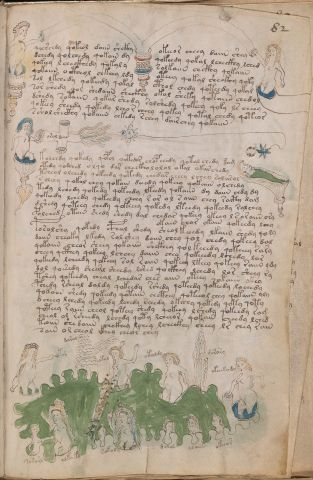

# Voynich Speculative Procedural Protocol — f82r

IMPORTANT: this is NOT a real or validated translation of the Voynich Manuscript. It is a speculative/procedural model that interprets EVA using a user-defined grammar to generate experimental recipes using safe, known edible substitutes.

This file is generated automatically from IVTFF/EVA transliteration plus a user-defined procedural grammar.



## Page / Folio
- currier: B
- folio: f82r
- page_number: 161
- section: biological

## EVA Text (Transliteration)
```text
qosheedy qokeol daiin shckhy okeeor cheey daiin shey
dchedy qolchedy qokain dy qokeedy qokal lcheckhy lched
qokeey lcheckhedy qokaly solkaiin chckhy qokaiin
qokaiin octheol chkeey ldy oteey qokal sheckhy qoky
sol lkchedy qokeedy qokal cthol chedy qoteedy qokal
sar shedy qol shedaiin sheckhy okal sheky qotaiin chedol
dshedy sotaiin qokar shedy solshedy qokeey qoky ls cheey
qekeey sheedy qokedy lcho r cheey qokey qotal chedy qoteor
ssholshecthy qokaiin chkedy rchey dairchey qokaiin
orolda[ir:in]
kolchdy qokedy qopol qotedor chopchedy qotal chedy kam
otedy qodched olqo dar checkho lolol okal okarchedy
tcheol olchedy qokeedy qotedy chedar cheey lchey solarol
r olchy qokal chey qokain deeedy qokeey qokaiin olchedy
kedy lchedy qokedy qok[ee:ch]dy lkeedy qokaiin dy daiin chdy dy
qokeedy lchedy qokeedy cheey r or ol s aiin chey racty dam
dshedy qoteey chedy qokeeey qokedy lteedy qokeedy ralchey
polched otain shedy shedy dal chedar qokeey ykeey l s araiin ory
okain char okain qokeedy lchy
posalshy qokedy cphal shedy sheol keeedy lkaiin shedy qoly
daiin cheoky lkedy salshey daiin chey qol chedy qokeey dal
qokaiin cheor sheey qokaiin shckhey qol keeedy qokeeey ra[s:r]y
cheey qcthey qokeey lcheey daiin chey qokeeedy lchedy lar
qokeedy lcheedy qokeoy sal raiin qokeey lkeey qokeey raiin ydy
dol qoesedy sheea'l sheedy lshed qockhey lchedy lar sheey ry
tshey qokeedy cheal lchedar ches aiin oteey qokaiin okey
pchedy rsheal daldy qokeedy rshedy qoteedy qokeedy lochedy
qokoiin shedy qokeedy qotaiin chcthey qoteeol chey qokaiin oly
d cheey lchedy qokeedy lchedy rchedy okchhy qotedy qoty qoty
qoteey raiin cheol qoteey shedy qokeey lshedy qokeedy rag
cheol ol rsheedy lchedy qoty lcheeor qokain cheedy lched
taiin shedaiin chckhey lchey lcheckhy sheey lr chey rain
sain ol cheol ikhey cheor chey
okor
darol
okal
okaldy
darary
okaira[d:j]y
sororl
olk[o:a]ky
sokoly
dolol
olaiin
okeear
```

## Domain Context (Heuristic; Not a Translation)

This section summarizes recurring **basewords** in this IVTFF domain and shows simple substring evidence that the token markers used by the procedural grammar occur inside frequent words.

Any Italian anagram / English gloss is a best-effort lexicon match, not a decipherment.


### Associated basewords (non-generic; top by frequency in this domain)
- `qokep` (count=160) → Italian anagram `pecco`; English: [n/a]
- `qokain` (count=159) → Italian anagram `acconi`; English: [n/a]
- `qokal` (count=108) → Italian anagram `calco`; English: cast (of sculpture)
- `paiin` (count=82) → Italian anagram `piani`; English: plans (arrangements)
- `qokaiin` (count=81) → Italian anagram `ciancio`; English: [n/a]
- `qokar` (count=45) → Italian anagram `carco`; English: [n/a]
- `okain` (count=41) → Italian anagram `acino`; English: a berry
- `okaiin` (count=31) → Italian anagram `coniai`; English: [n/a]
- `saiin` (count=30) → Italian anagram `asini`; English: [n/a]
- `olkain` (count=26) → Italian anagram `alcino`; English: smart, clever, intelligent, bright
- `qotal` (count=25) → Italian anagram `colta`; English: [n/a]
- `olchep` (count=24) → Italian anagram `colpe`; English: [n/a]
- `otain` (count=23) → Italian anagram `anito`; English: [n/a]
- `qotain` (count=20) → Italian anagram `antico`; English: ancient
- `olkep` (count=20) → Italian anagram `colpe`; English: [n/a]

### Marker evidence (substring in frequent basewords)
- `qo`: 50 basewords; examples: `qokep`, `qokain`, `qokeep`, `qol`, `qokal`, `qokaiin`
- `q`: 51 basewords; examples: `qokep`, `qokain`, `qokeep`, `qol`, `qokal`, `qokaiin`
- `o`: 184 basewords; examples: `ol`, `qokep`, `qokain`, `qokeep`, `qol`, `qokal`
- `k`: 114 basewords; examples: `qokep`, `qokain`, `qokeep`, `qokal`, `qokaiin`, `qokee`
- `t`: 73 basewords; examples: `otep`, `qotep`, `qoteep`, `tep`, `qot`, `otal`
- `p`: 112 basewords; examples: `shep`, `chep`, `qokep`, `qokeep`, `paiin`, `p`
- `ch`: 104 basewords; examples: `chep`, `che`, `lchep`, `chee`, `chckh`, `cheol`
- `sh`: 43 basewords; examples: `shep`, `she`, `sheep`, `shee`, `sheol`, `shckh`
- `f`: 1 basewords; examples: `fchep`
- `cth`: 10 basewords; examples: `chcth`, `checth`, `shecth`, `shcth`, `cthep`, `cthe`
- `ckh`: 13 basewords; examples: `chckh`, `shckh`, `checkh`, `sheckh`, `chckhe`, `chckhp`
- `cph`: 2 basewords; examples: `cphe`, `cphol`
- `iin`: 26 basewords; examples: `paiin`, `qokaiin`, `aiin`, `okaiin`, `saiin`, `qotaiin`
- `aiin`: 19 basewords; examples: `paiin`, `qokaiin`, `aiin`, `okaiin`, `saiin`, `qotaiin`

## Recipes Index (This Page)
- [f82r.1,@P0](#f82r-1-f82r-1-p0)
- [f82r.2,+P0](#f82r-2-f82r-2-p0)
- [f82r.3,+P0](#f82r-3-f82r-3-p0)
- [f82r.4,+P0](#f82r-4-f82r-4-p0)
- [f82r.5,+P0](#f82r-5-f82r-5-p0)
- [f82r.6,+P0](#f82r-6-f82r-6-p0)
- [f82r.7,+P0](#f82r-7-f82r-7-p0)
- [f82r.8,+P0](#f82r-8-f82r-8-p0)
- [f82r.9,+P0](#f82r-9-f82r-9-p0)
- [f82r.10,@Lt](#f82r-10-f82r-10-lt)
- [f82r.11,@P0](#f82r-11-f82r-11-p0)
- [f82r.12,+P0](#f82r-12-f82r-12-p0)
- [f82r.13,+P0](#f82r-13-f82r-13-p0)
- [f82r.14,+P0](#f82r-14-f82r-14-p0)
- [f82r.15,+P0](#f82r-15-f82r-15-p0)
- [f82r.16,+P0](#f82r-16-f82r-16-p0)
- [f82r.17,+P0](#f82r-17-f82r-17-p0)
- [f82r.18,+P0](#f82r-18-f82r-18-p0)
- [f82r.19,+Pr](#f82r-19-f82r-19-pr)
- [f82r.20,*P0](#f82r-20-f82r-20-p0)
- [f82r.21,+P0](#f82r-21-f82r-21-p0)
- [f82r.22,+P0](#f82r-22-f82r-22-p0)
- [f82r.23,+P0](#f82r-23-f82r-23-p0)
- [f82r.24,+P0](#f82r-24-f82r-24-p0)
- [f82r.25,+P0](#f82r-25-f82r-25-p0)
- [f82r.26,+P0](#f82r-26-f82r-26-p0)
- [f82r.27,+P0](#f82r-27-f82r-27-p0)
- [f82r.28,+P0](#f82r-28-f82r-28-p0)
- [f82r.29,+P0](#f82r-29-f82r-29-p0)
- [f82r.30,+P0](#f82r-30-f82r-30-p0)
- [f82r.31,+P0](#f82r-31-f82r-31-p0)
- [f82r.32,+P0](#f82r-32-f82r-32-p0)
- [f82r.33,+P0](#f82r-33-f82r-33-p0)
- [f82r.34,@Ln](#f82r-34-f82r-34-ln)
- [f82r.35,@Lt](#f82r-35-f82r-35-lt)
- [f82r.36,@Ln](#f82r-36-f82r-36-ln)
- [f82r.37,@Ln](#f82r-37-f82r-37-ln)
- [f82r.38,@Lt](#f82r-38-f82r-38-lt)
- [f82r.39,+Ln](#f82r-39-f82r-39-ln)
- [f82r.40,*Ln](#f82r-40-f82r-40-ln)
- [f82r.41,=Ln](#f82r-41-f82r-41-ln)
- [f82r.42,=Ln](#f82r-42-f82r-42-ln)
- [f82r.43,=Ln](#f82r-43-f82r-43-ln)
- [f82r.44,=Ln](#f82r-44-f82r-44-ln)
- [f82r.45,=Ln](#f82r-45-f82r-45-ln)

## Line Glosses (Procedural Gloss Only; Not a Translation)

<a id="f82r-1-f82r-1-p0"></a>

### f82r.1,@P0

EVA (original line):
```text
qosheedy qokeol daiin shckhy okeeor cheey daiin shey
```

English structural gloss (generated):

- qosheedy: tokens: qo sh ee p → vowel_run: ee (level 2; class e)
- qokeol: tokens: qo k e o l → connectors: l → vowel_run: e (level 1; class e)
- daiin: tokens: p aiin → vowel_run: a (level 1; class a) → suffix: aiin (lexicon-context: `paiin` → `piani`; plans (arrangements))
- shckhy: tokens: sh ckh
- okeeor: tokens: o k ee o r → connectors: r → vowel_run: ee (level 2; class e)
- cheey: tokens: ch ee → vowel_run: ee (level 2; class e)
- daiin: tokens: p aiin → vowel_run: a (level 1; class a) → suffix: aiin (lexicon-context: `paiin` → `piani`; plans (arrangements))
- shey: tokens: sh e → vowel_run: e (level 1; class e)

<a id="f82r-2-f82r-2-p0"></a>

### f82r.2,+P0

EVA (original line):
```text
dchedy qolchedy qokain dy qokeedy qokal lcheckhy lched
```

English structural gloss (generated):

- dchedy: tokens: p ch e p → vowel_run: e (level 1; class e)
- qolchedy: tokens: qo l ch e p → connectors: l → vowel_run: e (level 1; class e) (lexicon-context: `olchep` → `colpe`; [n/a])
- qokain: tokens: qo k a i n → connectors: n → vowel_run: a (level 1; class a) (lexicon-context: `qokain` → `concia`; tanning)
- dy: tokens: p
- qokeedy: tokens: qo k ee p → vowel_run: ee (level 2; class e)
- qokal: tokens: qo k a l → connectors: l → vowel_run: a (level 1; class a) (lexicon-context: `qokal` → `calco`; cast (of sculpture))
- lcheckhy: tokens: l ch e ckh → connectors: l → vowel_run: e (level 1; class e)
- lched: tokens: l ch e p → connectors: l → vowel_run: e (level 1; class e)

<a id="f82r-3-f82r-3-p0"></a>

### f82r.3,+P0

EVA (original line):
```text
qokeey lcheckhedy qokaly solkaiin chckhy qokaiin
```

English structural gloss (generated):

- qokeey: tokens: qo k ee → vowel_run: ee (level 2; class e)
- lcheckhedy: tokens: l ch e ckh e p → connectors: l → vowel_run: e (level 1; class e)
- qokaly: tokens: qo k a l → connectors: l → vowel_run: a (level 1; class a) (lexicon-context: `qokal` → `calco`; cast (of sculpture))
- solkaiin: tokens: s o l k aiin → connectors: s l → vowel_run: a (level 1; class a) → suffix: aiin
- chckhy: tokens: ch ckh
- qokaiin: tokens: qo k aiin → vowel_run: a (level 1; class a) → suffix: aiin (lexicon-context: `qokaiin` → `conciai`; [n/a])

<a id="f82r-4-f82r-4-p0"></a>

### f82r.4,+P0

EVA (original line):
```text
qokaiin octheol chkeey ldy oteey qokal sheckhy qoky
```

English structural gloss (generated):

- qokaiin: tokens: qo k aiin → vowel_run: a (level 1; class a) → suffix: aiin (lexicon-context: `qokaiin` → `conciai`; [n/a])
- octheol: tokens: o cth e o l → connectors: l → vowel_run: e (level 1; class e)
- chkeey: tokens: ch k ee → vowel_run: ee (level 2; class e)
- ldy: tokens: l p → connectors: l
- oteey: tokens: o t ee → vowel_run: ee (level 2; class e)
- qokal: tokens: qo k a l → connectors: l → vowel_run: a (level 1; class a) (lexicon-context: `qokal` → `calco`; cast (of sculpture))
- sheckhy: tokens: sh e ckh → vowel_run: e (level 1; class e)
- qoky: tokens: qo k

<a id="f82r-5-f82r-5-p0"></a>

### f82r.5,+P0

EVA (original line):
```text
sol lkchedy qokeedy qokal cthol chedy qoteedy qokal
```

English structural gloss (generated):

- sol: tokens: s o l → connectors: s l
- lkchedy: tokens: l k ch e p → connectors: l → vowel_run: e (level 1; class e)
- qokeedy: tokens: qo k ee p → vowel_run: ee (level 2; class e)
- qokal: tokens: qo k a l → connectors: l → vowel_run: a (level 1; class a) (lexicon-context: `qokal` → `calco`; cast (of sculpture))
- cthol: tokens: cth o l → connectors: l
- chedy: tokens: ch e p → vowel_run: e (level 1; class e)
- qoteedy: tokens: qo t ee p → vowel_run: ee (level 2; class e)
- qokal: tokens: qo k a l → connectors: l → vowel_run: a (level 1; class a) (lexicon-context: `qokal` → `calco`; cast (of sculpture))

<a id="f82r-6-f82r-6-p0"></a>

### f82r.6,+P0

EVA (original line):
```text
sar shedy qol shedaiin sheckhy okal sheky qotaiin chedol
```

English structural gloss (generated):

- sar: tokens: s a r → connectors: s r → vowel_run: a (level 1; class a)
- shedy: tokens: sh e p → vowel_run: e (level 1; class e)
- qol: tokens: qo l → connectors: l
- shedaiin: tokens: sh e p aiin → vowel_run: e (level 1; class e) → suffix: aiin (lexicon-context: `paiin` → `piani`; plans (arrangements))
- sheckhy: tokens: sh e ckh → vowel_run: e (level 1; class e)
- okal: tokens: o k a l → connectors: l → vowel_run: a (level 1; class a)
- sheky: tokens: sh e k → vowel_run: e (level 1; class e)
- qotaiin: tokens: qo t aiin → vowel_run: a (level 1; class a) → suffix: aiin (lexicon-context: `qotaiin` → `coniati`; [n/a])
- chedol: tokens: ch e p o l → connectors: l → vowel_run: e (level 1; class e)

<a id="f82r-7-f82r-7-p0"></a>

### f82r.7,+P0

EVA (original line):
```text
dshedy sotaiin qokar shedy solshedy qokeey qoky ls cheey
```

English structural gloss (generated):

- dshedy: tokens: p sh e p → vowel_run: e (level 1; class e)
- sotaiin: tokens: s o t aiin → connectors: s → vowel_run: a (level 1; class a) → suffix: aiin
- qokar: tokens: qo k a r → connectors: r → vowel_run: a (level 1; class a)
- shedy: tokens: sh e p → vowel_run: e (level 1; class e)
- solshedy: tokens: s o l sh e p → connectors: s l → vowel_run: e (level 1; class e) (lexicon-context: `olshep` → `spole`; [n/a])
- qokeey: tokens: qo k ee → vowel_run: ee (level 2; class e)
- qoky: tokens: qo k
- ls: tokens: l s → connectors: l s
- cheey: tokens: ch ee → vowel_run: ee (level 2; class e)

<a id="f82r-8-f82r-8-p0"></a>

### f82r.8,+P0

EVA (original line):
```text
qekeey sheedy qokedy lcho r cheey qokey qotal chedy qoteor
```

English structural gloss (generated):

- qekeey: tokens: q e k ee → vowel_run: e (level 1; class e)
- sheedy: tokens: sh ee p → vowel_run: ee (level 2; class e)
- qokedy: tokens: qo k e p → vowel_run: e (level 1; class e) (lexicon-context: `qokep` → `pecco`; [n/a])
- lcho: tokens: l ch o → connectors: l
- r: tokens: r → connectors: r
- cheey: tokens: ch ee → vowel_run: ee (level 2; class e)
- qokey: tokens: qo k e → vowel_run: e (level 1; class e)
- qotal: tokens: qo t a l → connectors: l → vowel_run: a (level 1; class a) (lexicon-context: `qotal` → `colta`; [n/a])
- chedy: tokens: ch e p → vowel_run: e (level 1; class e)
- qoteor: tokens: qo t e o r → connectors: r → vowel_run: e (level 1; class e)

<a id="f82r-9-f82r-9-p0"></a>

### f82r.9,+P0

EVA (original line):
```text
ssholshecthy qokaiin chkedy rchey dairchey qokaiin
```

English structural gloss (generated):

- ssholshecthy: tokens: s sh o l sh e cth → connectors: s l → vowel_run: e (level 1; class e)
- qokaiin: tokens: qo k aiin → vowel_run: a (level 1; class a) → suffix: aiin (lexicon-context: `qokaiin` → `conciai`; [n/a])
- chkedy: tokens: ch k e p → vowel_run: e (level 1; class e)
- rchey: tokens: r ch e → connectors: r → vowel_run: e (level 1; class e)
- dairchey: tokens: p a i r ch e → connectors: r → vowel_run: a (level 1; class a)
- qokaiin: tokens: qo k aiin → vowel_run: a (level 1; class a) → suffix: aiin (lexicon-context: `qokaiin` → `conciai`; [n/a])

<a id="f82r-10-f82r-10-lt"></a>

### f82r.10,@Lt

EVA (original line):
```text
orolda[ir:in]
```

English structural gloss (generated):

- orolda: tokens: o r o l p a → connectors: r l → vowel_run: a (level 1; class a)
- ir: tokens: i r → connectors: r → vowel_run: i (level 1; class i)
- in: tokens: i n → connectors: n → vowel_run: i (level 1; class i)

<a id="f82r-11-f82r-11-p0"></a>

### f82r.11,@P0

EVA (original line):
```text
kolchdy qokedy qopol qotedor chopchedy qotal chedy kam
```

English structural gloss (generated):

- kolchdy: tokens: k o l ch p → connectors: l
- qokedy: tokens: qo k e p → vowel_run: e (level 1; class e) (lexicon-context: `qokep` → `pecco`; [n/a])
- qopol: tokens: qo p o l → connectors: l
- qotedor: tokens: qo t e p o r → connectors: r → vowel_run: e (level 1; class e)
- chopchedy: tokens: ch o p ch e p → vowel_run: e (level 1; class e)
- qotal: tokens: qo t a l → connectors: l → vowel_run: a (level 1; class a) (lexicon-context: `qotal` → `colta`; [n/a])
- chedy: tokens: ch e p → vowel_run: e (level 1; class e)
- kam: tokens: k a m → connectors: m → vowel_run: a (level 1; class a)

<a id="f82r-12-f82r-12-p0"></a>

### f82r.12,+P0

EVA (original line):
```text
otedy qodched olqo dar checkho lolol okal okarchedy
```

English structural gloss (generated):

- otedy: tokens: o t e p → vowel_run: e (level 1; class e)
- qodched: tokens: qo p ch e p → vowel_run: e (level 1; class e)
- olqo: tokens: o l qo → connectors: l
- dar: tokens: p a r → connectors: r → vowel_run: a (level 1; class a)
- checkho: tokens: ch e ckh o → vowel_run: e (level 1; class e)
- lolol: tokens: l o l o l → connectors: l l l
- okal: tokens: o k a l → connectors: l → vowel_run: a (level 1; class a)
- okarchedy: tokens: o k a r ch e p → connectors: r → vowel_run: a (level 1; class a)

<a id="f82r-13-f82r-13-p0"></a>

### f82r.13,+P0

EVA (original line):
```text
tcheol olchedy qokeedy qotedy chedar cheey lchey solarol
```

English structural gloss (generated):

- tcheol: tokens: t ch e o l → connectors: l → vowel_run: e (level 1; class e)
- olchedy: tokens: o l ch e p → connectors: l → vowel_run: e (level 1; class e) (lexicon-context: `olchep` → `colpe`; [n/a])
- qokeedy: tokens: qo k ee p → vowel_run: ee (level 2; class e)
- qotedy: tokens: qo t e p → vowel_run: e (level 1; class e)
- chedar: tokens: ch e p a r → connectors: r → vowel_run: e (level 1; class e) (lexicon-context: `chepar` → `capre`; [n/a])
- cheey: tokens: ch ee → vowel_run: ee (level 2; class e)
- lchey: tokens: l ch e → connectors: l → vowel_run: e (level 1; class e)
- solarol: tokens: s o l a r o l → connectors: s l r l → vowel_run: a (level 1; class a)

<a id="f82r-14-f82r-14-p0"></a>

### f82r.14,+P0

EVA (original line):
```text
r olchy qokal chey qokain deeedy qokeey qokaiin olchedy
```

English structural gloss (generated):

- r: tokens: r → connectors: r
- olchy: tokens: o l ch → connectors: l
- qokal: tokens: qo k a l → connectors: l → vowel_run: a (level 1; class a) (lexicon-context: `qokal` → `calco`; cast (of sculpture))
- chey: tokens: ch e → vowel_run: e (level 1; class e)
- qokain: tokens: qo k a i n → connectors: n → vowel_run: a (level 1; class a) (lexicon-context: `qokain` → `concia`; tanning)
- deeedy: tokens: p eee p → vowel_run: eee (level 3; class e)
- qokeey: tokens: qo k ee → vowel_run: ee (level 2; class e)
- qokaiin: tokens: qo k aiin → vowel_run: a (level 1; class a) → suffix: aiin (lexicon-context: `qokaiin` → `conciai`; [n/a])
- olchedy: tokens: o l ch e p → connectors: l → vowel_run: e (level 1; class e) (lexicon-context: `olchep` → `colpe`; [n/a])

<a id="f82r-15-f82r-15-p0"></a>

### f82r.15,+P0

EVA (original line):
```text
kedy lchedy qokedy qok[ee:ch]dy lkeedy qokaiin dy daiin chdy dy
```

English structural gloss (generated):

- kedy: tokens: k e p → vowel_run: e (level 1; class e)
- lchedy: tokens: l ch e p → connectors: l → vowel_run: e (level 1; class e)
- qokedy: tokens: qo k e p → vowel_run: e (level 1; class e) (lexicon-context: `qokep` → `pecco`; [n/a])
- qok: tokens: qo k
- ee: tokens: ee → vowel_run: ee (level 2; class e)
- ch: tokens: ch
- dy: tokens: p
- lkeedy: tokens: l k ee p → connectors: l → vowel_run: ee (level 2; class e)
- qokaiin: tokens: qo k aiin → vowel_run: a (level 1; class a) → suffix: aiin (lexicon-context: `qokaiin` → `conciai`; [n/a])
- dy: tokens: p
- daiin: tokens: p aiin → vowel_run: a (level 1; class a) → suffix: aiin (lexicon-context: `paiin` → `piani`; plans (arrangements))
- chdy: tokens: ch p
- dy: tokens: p

<a id="f82r-16-f82r-16-p0"></a>

### f82r.16,+P0

EVA (original line):
```text
qokeedy lchedy qokeedy cheey r or ol s aiin chey racty dam
```

English structural gloss (generated):

- qokeedy: tokens: qo k ee p → vowel_run: ee (level 2; class e)
- lchedy: tokens: l ch e p → connectors: l → vowel_run: e (level 1; class e)
- qokeedy: tokens: qo k ee p → vowel_run: ee (level 2; class e)
- cheey: tokens: ch ee → vowel_run: ee (level 2; class e)
- r: tokens: r → connectors: r
- or: tokens: o r → connectors: r
- ol: tokens: o l → connectors: l
- s: tokens: s → connectors: s
- aiin: tokens: aiin → vowel_run: a (level 1; class a) → suffix: aiin
- chey: tokens: ch e → vowel_run: e (level 1; class e)
- racty: tokens: r a c t → connectors: r → vowel_run: a (level 1; class a)
- dam: tokens: p a m → connectors: m → vowel_run: a (level 1; class a)

<a id="f82r-17-f82r-17-p0"></a>

### f82r.17,+P0

EVA (original line):
```text
dshedy qoteey chedy qokeeey qokedy lteedy qokeedy ralchey
```

English structural gloss (generated):

- dshedy: tokens: p sh e p → vowel_run: e (level 1; class e)
- qoteey: tokens: qo t ee → vowel_run: ee (level 2; class e)
- chedy: tokens: ch e p → vowel_run: e (level 1; class e)
- qokeeey: tokens: qo k eee → vowel_run: eee (level 3; class e)
- qokedy: tokens: qo k e p → vowel_run: e (level 1; class e) (lexicon-context: `qokep` → `pecco`; [n/a])
- lteedy: tokens: l t ee p → connectors: l → vowel_run: ee (level 2; class e)
- qokeedy: tokens: qo k ee p → vowel_run: ee (level 2; class e)
- ralchey: tokens: r a l ch e → connectors: r l → vowel_run: a (level 1; class a)

<a id="f82r-18-f82r-18-p0"></a>

### f82r.18,+P0

EVA (original line):
```text
polched otain shedy shedy dal chedar qokeey ykeey l s araiin ory
```

English structural gloss (generated):

- polched: tokens: p o l ch e p → connectors: l → vowel_run: e (level 1; class e) (lexicon-context: `olchep` → `colpe`; [n/a])
- otain: tokens: o t a i n → connectors: n → vowel_run: a (level 1; class a) (lexicon-context: `otain` → `notai`; [n/a])
- shedy: tokens: sh e p → vowel_run: e (level 1; class e)
- shedy: tokens: sh e p → vowel_run: e (level 1; class e)
- dal: tokens: p a l → connectors: l → vowel_run: a (level 1; class a)
- chedar: tokens: ch e p a r → connectors: r → vowel_run: e (level 1; class e) (lexicon-context: `chepar` → `capre`; [n/a])
- qokeey: tokens: qo k ee → vowel_run: ee (level 2; class e)
- ykeey: tokens: k ee → vowel_run: ee (level 2; class e)
- l: tokens: l → connectors: l
- s: tokens: s → connectors: s
- araiin: tokens: a r aiin → connectors: r → vowel_run: a (level 1; class a) → suffix: aiin
- ory: tokens: o r → connectors: r

<a id="f82r-19-f82r-19-pr"></a>

### f82r.19,+Pr

EVA (original line):
```text
okain char okain qokeedy lchy
```

English structural gloss (generated):

- okain: tokens: o k a i n → connectors: n → vowel_run: a (level 1; class a) (lexicon-context: `okain` → `conia`; [n/a])
- char: tokens: ch a r → connectors: r → vowel_run: a (level 1; class a)
- okain: tokens: o k a i n → connectors: n → vowel_run: a (level 1; class a) (lexicon-context: `okain` → `conia`; [n/a])
- qokeedy: tokens: qo k ee p → vowel_run: ee (level 2; class e)
- lchy: tokens: l ch → connectors: l

<a id="f82r-20-f82r-20-p0"></a>

### f82r.20,*P0

EVA (original line):
```text
posalshy qokedy cphal shedy sheol keeedy lkaiin shedy qoly
```

English structural gloss (generated):

- posalshy: tokens: p o s a l sh → connectors: s l → vowel_run: a (level 1; class a)
- qokedy: tokens: qo k e p → vowel_run: e (level 1; class e) (lexicon-context: `qokep` → `pecco`; [n/a])
- cphal: tokens: cph a l → connectors: l → vowel_run: a (level 1; class a)
- shedy: tokens: sh e p → vowel_run: e (level 1; class e)
- sheol: tokens: sh e o l → connectors: l → vowel_run: e (level 1; class e)
- keeedy: tokens: k eee p → vowel_run: eee (level 3; class e)
- lkaiin: tokens: l k aiin → connectors: l → vowel_run: a (level 1; class a) → suffix: aiin (lexicon-context: `lkaiin` → `canili`; [n/a])
- shedy: tokens: sh e p → vowel_run: e (level 1; class e)
- qoly: tokens: qo l → connectors: l

<a id="f82r-21-f82r-21-p0"></a>

### f82r.21,+P0

EVA (original line):
```text
daiin cheoky lkedy salshey daiin chey qol chedy qokeey dal
```

English structural gloss (generated):

- daiin: tokens: p aiin → vowel_run: a (level 1; class a) → suffix: aiin (lexicon-context: `paiin` → `piani`; plans (arrangements))
- cheoky: tokens: ch e o k → vowel_run: e (level 1; class e)
- lkedy: tokens: l k e p → connectors: l → vowel_run: e (level 1; class e)
- salshey: tokens: s a l sh e → connectors: s l → vowel_run: a (level 1; class a)
- daiin: tokens: p aiin → vowel_run: a (level 1; class a) → suffix: aiin (lexicon-context: `paiin` → `piani`; plans (arrangements))
- chey: tokens: ch e → vowel_run: e (level 1; class e)
- qol: tokens: qo l → connectors: l
- chedy: tokens: ch e p → vowel_run: e (level 1; class e)
- qokeey: tokens: qo k ee → vowel_run: ee (level 2; class e)
- dal: tokens: p a l → connectors: l → vowel_run: a (level 1; class a)

<a id="f82r-22-f82r-22-p0"></a>

### f82r.22,+P0

EVA (original line):
```text
qokaiin cheor sheey qokaiin shckhey qol keeedy qokeeey ra[s:r]y
```

English structural gloss (generated):

- qokaiin: tokens: qo k aiin → vowel_run: a (level 1; class a) → suffix: aiin (lexicon-context: `qokaiin` → `conciai`; [n/a])
- cheor: tokens: ch e o r → connectors: r → vowel_run: e (level 1; class e)
- sheey: tokens: sh ee → vowel_run: ee (level 2; class e)
- qokaiin: tokens: qo k aiin → vowel_run: a (level 1; class a) → suffix: aiin (lexicon-context: `qokaiin` → `conciai`; [n/a])
- shckhey: tokens: sh ckh e → vowel_run: e (level 1; class e)
- qol: tokens: qo l → connectors: l
- keeedy: tokens: k eee p → vowel_run: eee (level 3; class e)
- qokeeey: tokens: qo k eee → vowel_run: eee (level 3; class e)
- ra: tokens: r a → connectors: r → vowel_run: a (level 1; class a)
- s: tokens: s → connectors: s
- r: tokens: r → connectors: r
- y: [unparsed]

<a id="f82r-23-f82r-23-p0"></a>

### f82r.23,+P0

EVA (original line):
```text
cheey qcthey qokeey lcheey daiin chey qokeeedy lchedy lar
```

English structural gloss (generated):

- cheey: tokens: ch ee → vowel_run: ee (level 2; class e)
- qcthey: tokens: q cth e → vowel_run: e (level 1; class e)
- qokeey: tokens: qo k ee → vowel_run: ee (level 2; class e)
- lcheey: tokens: l ch ee → connectors: l → vowel_run: ee (level 2; class e)
- daiin: tokens: p aiin → vowel_run: a (level 1; class a) → suffix: aiin (lexicon-context: `paiin` → `piani`; plans (arrangements))
- chey: tokens: ch e → vowel_run: e (level 1; class e)
- qokeeedy: tokens: qo k eee p → vowel_run: eee (level 3; class e)
- lchedy: tokens: l ch e p → connectors: l → vowel_run: e (level 1; class e)
- lar: tokens: l a r → connectors: l r → vowel_run: a (level 1; class a)

<a id="f82r-24-f82r-24-p0"></a>

### f82r.24,+P0

EVA (original line):
```text
qokeedy lcheedy qokeoy sal raiin qokeey lkeey qokeey raiin ydy
```

English structural gloss (generated):

- qokeedy: tokens: qo k ee p → vowel_run: ee (level 2; class e)
- lcheedy: tokens: l ch ee p → connectors: l → vowel_run: ee (level 2; class e)
- qokeoy: tokens: qo k e o → vowel_run: e (level 1; class e)
- sal: tokens: s a l → connectors: s l → vowel_run: a (level 1; class a)
- raiin: tokens: r aiin → connectors: r → vowel_run: a (level 1; class a) → suffix: aiin
- qokeey: tokens: qo k ee → vowel_run: ee (level 2; class e)
- lkeey: tokens: l k ee → connectors: l → vowel_run: ee (level 2; class e)
- qokeey: tokens: qo k ee → vowel_run: ee (level 2; class e)
- raiin: tokens: r aiin → connectors: r → vowel_run: a (level 1; class a) → suffix: aiin
- ydy: tokens: p

<a id="f82r-25-f82r-25-p0"></a>

### f82r.25,+P0

EVA (original line):
```text
dol qoesedy sheea'l sheedy lshed qockhey lchedy lar sheey ry
```

English structural gloss (generated):

- dol: tokens: p o l → connectors: l
- qoesedy: tokens: qo e s e p → connectors: s → vowel_run: e (level 1; class e)
- sheea: tokens: sh ee a → vowel_run: ee (level 2; class e)
- l: tokens: l → connectors: l
- sheedy: tokens: sh ee p → vowel_run: ee (level 2; class e)
- lshed: tokens: l sh e p → connectors: l → vowel_run: e (level 1; class e)
- qockhey: tokens: qo ckh e → vowel_run: e (level 1; class e)
- lchedy: tokens: l ch e p → connectors: l → vowel_run: e (level 1; class e)
- lar: tokens: l a r → connectors: l r → vowel_run: a (level 1; class a)
- sheey: tokens: sh ee → vowel_run: ee (level 2; class e)
- ry: tokens: r → connectors: r

<a id="f82r-26-f82r-26-p0"></a>

### f82r.26,+P0

EVA (original line):
```text
tshey qokeedy cheal lchedar ches aiin oteey qokaiin okey
```

English structural gloss (generated):

- tshey: tokens: t sh e → vowel_run: e (level 1; class e)
- qokeedy: tokens: qo k ee p → vowel_run: ee (level 2; class e)
- cheal: tokens: ch e a l → connectors: l → vowel_run: e (level 1; class e)
- lchedar: tokens: l ch e p a r → connectors: l r → vowel_run: e (level 1; class e) (lexicon-context: `chepar` → `capre`; [n/a])
- ches: tokens: ch e s → connectors: s → vowel_run: e (level 1; class e)
- aiin: tokens: aiin → vowel_run: a (level 1; class a) → suffix: aiin
- oteey: tokens: o t ee → vowel_run: ee (level 2; class e)
- qokaiin: tokens: qo k aiin → vowel_run: a (level 1; class a) → suffix: aiin (lexicon-context: `qokaiin` → `conciai`; [n/a])
- okey: tokens: o k e → vowel_run: e (level 1; class e)

<a id="f82r-27-f82r-27-p0"></a>

### f82r.27,+P0

EVA (original line):
```text
pchedy rsheal daldy qokeedy rshedy qoteedy qokeedy lochedy
```

English structural gloss (generated):

- pchedy: tokens: p ch e p → vowel_run: e (level 1; class e)
- rsheal: tokens: r sh e a l → connectors: r l → vowel_run: e (level 1; class e)
- daldy: tokens: p a l p → connectors: l → vowel_run: a (level 1; class a)
- qokeedy: tokens: qo k ee p → vowel_run: ee (level 2; class e)
- rshedy: tokens: r sh e p → connectors: r → vowel_run: e (level 1; class e)
- qoteedy: tokens: qo t ee p → vowel_run: ee (level 2; class e)
- qokeedy: tokens: qo k ee p → vowel_run: ee (level 2; class e)
- lochedy: tokens: l o ch e p → connectors: l → vowel_run: e (level 1; class e)

<a id="f82r-28-f82r-28-p0"></a>

### f82r.28,+P0

EVA (original line):
```text
qokoiin shedy qokeedy qotaiin chcthey qoteeol chey qokaiin oly
```

English structural gloss (generated):

- qokoiin: tokens: qo k o iin → vowel_run: ii (level 2; class i) → suffix: iin
- shedy: tokens: sh e p → vowel_run: e (level 1; class e)
- qokeedy: tokens: qo k ee p → vowel_run: ee (level 2; class e)
- qotaiin: tokens: qo t aiin → vowel_run: a (level 1; class a) → suffix: aiin (lexicon-context: `qotaiin` → `coniati`; [n/a])
- chcthey: tokens: ch cth e → vowel_run: e (level 1; class e)
- qoteeol: tokens: qo t ee o l → connectors: l → vowel_run: ee (level 2; class e)
- chey: tokens: ch e → vowel_run: e (level 1; class e)
- qokaiin: tokens: qo k aiin → vowel_run: a (level 1; class a) → suffix: aiin (lexicon-context: `qokaiin` → `conciai`; [n/a])
- oly: tokens: o l → connectors: l

<a id="f82r-29-f82r-29-p0"></a>

### f82r.29,+P0

EVA (original line):
```text
d cheey lchedy qokeedy lchedy rchedy okchhy qotedy qoty qoty
```

English structural gloss (generated):

- d: tokens: p
- cheey: tokens: ch ee → vowel_run: ee (level 2; class e)
- lchedy: tokens: l ch e p → connectors: l → vowel_run: e (level 1; class e)
- qokeedy: tokens: qo k ee p → vowel_run: ee (level 2; class e)
- lchedy: tokens: l ch e p → connectors: l → vowel_run: e (level 1; class e)
- rchedy: tokens: r ch e p → connectors: r → vowel_run: e (level 1; class e)
- okchhy: tokens: o k ch h → unmodeled_tokens: h
- qotedy: tokens: qo t e p → vowel_run: e (level 1; class e)
- qoty: tokens: qo t
- qoty: tokens: qo t

<a id="f82r-30-f82r-30-p0"></a>

### f82r.30,+P0

EVA (original line):
```text
qoteey raiin cheol qoteey shedy qokeey lshedy qokeedy rag
```

English structural gloss (generated):

- qoteey: tokens: qo t ee → vowel_run: ee (level 2; class e)
- raiin: tokens: r aiin → connectors: r → vowel_run: a (level 1; class a) → suffix: aiin
- cheol: tokens: ch e o l → connectors: l → vowel_run: e (level 1; class e)
- qoteey: tokens: qo t ee → vowel_run: ee (level 2; class e)
- shedy: tokens: sh e p → vowel_run: e (level 1; class e)
- qokeey: tokens: qo k ee → vowel_run: ee (level 2; class e)
- lshedy: tokens: l sh e p → connectors: l → vowel_run: e (level 1; class e)
- qokeedy: tokens: qo k ee p → vowel_run: ee (level 2; class e)
- rag: tokens: r a g → connectors: r → vowel_run: a (level 1; class a)

<a id="f82r-31-f82r-31-p0"></a>

### f82r.31,+P0

EVA (original line):
```text
cheol ol rsheedy lchedy qoty lcheeor qokain cheedy lched
```

English structural gloss (generated):

- cheol: tokens: ch e o l → connectors: l → vowel_run: e (level 1; class e)
- ol: tokens: o l → connectors: l
- rsheedy: tokens: r sh ee p → connectors: r → vowel_run: ee (level 2; class e)
- lchedy: tokens: l ch e p → connectors: l → vowel_run: e (level 1; class e)
- qoty: tokens: qo t
- lcheeor: tokens: l ch ee o r → connectors: l r → vowel_run: ee (level 2; class e)
- qokain: tokens: qo k a i n → connectors: n → vowel_run: a (level 1; class a) (lexicon-context: `qokain` → `concia`; tanning)
- cheedy: tokens: ch ee p → vowel_run: ee (level 2; class e)
- lched: tokens: l ch e p → connectors: l → vowel_run: e (level 1; class e)

<a id="f82r-32-f82r-32-p0"></a>

### f82r.32,+P0

EVA (original line):
```text
taiin shedaiin chckhey lchey lcheckhy sheey lr chey rain
```

English structural gloss (generated):

- taiin: tokens: t aiin → vowel_run: a (level 1; class a) → suffix: aiin
- shedaiin: tokens: sh e p aiin → vowel_run: e (level 1; class e) → suffix: aiin (lexicon-context: `paiin` → `piani`; plans (arrangements))
- chckhey: tokens: ch ckh e → vowel_run: e (level 1; class e)
- lchey: tokens: l ch e → connectors: l → vowel_run: e (level 1; class e)
- lcheckhy: tokens: l ch e ckh → connectors: l → vowel_run: e (level 1; class e)
- sheey: tokens: sh ee → vowel_run: ee (level 2; class e)
- lr: tokens: l r → connectors: l r
- chey: tokens: ch e → vowel_run: e (level 1; class e)
- rain: tokens: r a i n → connectors: r n → vowel_run: a (level 1; class a)

<a id="f82r-33-f82r-33-p0"></a>

### f82r.33,+P0

EVA (original line):
```text
sain ol cheol ikhey cheor chey
```

English structural gloss (generated):

- sain: tokens: s a i n → connectors: s n → vowel_run: a (level 1; class a)
- ol: tokens: o l → connectors: l
- cheol: tokens: ch e o l → connectors: l → vowel_run: e (level 1; class e)
- ikhey: tokens: i k h e → vowel_run: i (level 1; class i) → unmodeled_tokens: h
- cheor: tokens: ch e o r → connectors: r → vowel_run: e (level 1; class e)
- chey: tokens: ch e → vowel_run: e (level 1; class e)

<a id="f82r-34-f82r-34-ln"></a>

### f82r.34,@Ln

EVA (original line):
```text
okor
```

English structural gloss (generated):

- okor: tokens: o k o r → connectors: r

<a id="f82r-35-f82r-35-lt"></a>

### f82r.35,@Lt

EVA (original line):
```text
darol
```

English structural gloss (generated):

- darol: tokens: p a r o l → connectors: r l → vowel_run: a (level 1; class a)

<a id="f82r-36-f82r-36-ln"></a>

### f82r.36,@Ln

EVA (original line):
```text
okal
```

English structural gloss (generated):

- okal: tokens: o k a l → connectors: l → vowel_run: a (level 1; class a)

<a id="f82r-37-f82r-37-ln"></a>

### f82r.37,@Ln

EVA (original line):
```text
okaldy
```

English structural gloss (generated):

- okaldy: tokens: o k a l p → connectors: l → vowel_run: a (level 1; class a)

<a id="f82r-38-f82r-38-lt"></a>

### f82r.38,@Lt

EVA (original line):
```text
darary
```

English structural gloss (generated):

- darary: tokens: p a r a r → connectors: r r → vowel_run: a (level 1; class a)

<a id="f82r-39-f82r-39-ln"></a>

### f82r.39,+Ln

EVA (original line):
```text
okaira[d:j]y
```

English structural gloss (generated):

- okaira: tokens: o k a i r a → connectors: r → vowel_run: a (level 1; class a)
- d: tokens: p
- j: tokens: j
- y: [unparsed]

<a id="f82r-40-f82r-40-ln"></a>

### f82r.40,*Ln

EVA (original line):
```text
sororl
```

English structural gloss (generated):

- sororl: tokens: s o r o r l → connectors: s r r l

<a id="f82r-41-f82r-41-ln"></a>

### f82r.41,=Ln

EVA (original line):
```text
olk[o:a]ky
```

English structural gloss (generated):

- olk: tokens: o l k → connectors: l
- o: tokens: o
- a: tokens: a → vowel_run: a (level 1; class a)
- ky: tokens: k

<a id="f82r-42-f82r-42-ln"></a>

### f82r.42,=Ln

EVA (original line):
```text
sokoly
```

English structural gloss (generated):

- sokoly: tokens: s o k o l → connectors: s l

<a id="f82r-43-f82r-43-ln"></a>

### f82r.43,=Ln

EVA (original line):
```text
dolol
```

English structural gloss (generated):

- dolol: tokens: p o l o l → connectors: l l

<a id="f82r-44-f82r-44-ln"></a>

### f82r.44,=Ln

EVA (original line):
```text
olaiin
```

English structural gloss (generated):

- olaiin: tokens: o l aiin → connectors: l → vowel_run: a (level 1; class a) → suffix: aiin

<a id="f82r-45-f82r-45-ln"></a>

### f82r.45,=Ln

EVA (original line):
```text
okeear
```

English structural gloss (generated):

- okeear: tokens: o k ee a r → connectors: r → vowel_run: ee (level 2; class e)
