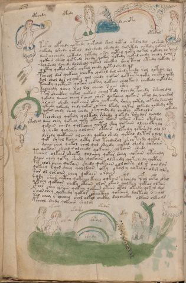

# Voynich Speculative Procedural Protocol — f82v

IMPORTANT: this is NOT a real or validated translation of the Voynich Manuscript. It is a speculative/procedural model that interprets EVA using a user-defined grammar to generate experimental recipes using safe, known edible substitutes.

This file is generated automatically from IVTFF/EVA transliteration plus a user-defined procedural grammar.



## Page / Folio
- currier: B
- folio: f82v
- page_number: 162
- section: biological

## EVA Text (Transliteration)
```text
otechdy
otedy
daiinoty
otedal
tokol olfchedy qokeedy qokedal shol qotal otdal dal olshedy
qokedy lshedy qotol dol shedy shedy dy darotedy chetedy lokam
dair o l chedy qotedy qotedy chsdy qotal qoty qokal qokedy lo
qokain sheol qoteedy chedy qokey qokedy qokol chedy chedy lchy
solshedy lchedy dolshedy qokal sheckhy shey teeol oteedy qokedy
qotey qokal shoky qokal chedy qotalchedy
pcheol dar qokeey cheeky qokal dal shedy pchdy rol qotedy rol
dal shol dar ol qoky qol chedy qokar qoteytyqoky chcthy qoky
tchedy qocthes qokar chckhy qokain cholkaiin chckhdy qokoldy
dalchedy lchey rol rol cheey s ain shey
tar sheckhy qokal qokain cheol tedy rchedy pchedy rsheol dal
qokedy lchey cheey raiin shes qokchey qokain okal dy lchedam
or ain shedy qok char okai qokeedy rcheey qotedy chtedy rches aly
ykeedy qokeedy chedy qokar okeey lkedy qokal olkeedy qokeedy oky
qokol chedy cheal chedy oty chdy dy checkhy otal chl s
tolsheol qokedy qolkedy rshedy qokedy rsheedar oinoly
dain chey qokeeey qoky okaiin okain olkain otain okar aly
qokain chedy qolkshey qotal shey qokain ol checkhy ly
yshedy qolchey qolaiin otain olkeedy qotshedy oll
dshedy qokaiin olchedy qokal shedy qotal dytar y l@152;l
qok sheol kechey qoty ral tchdarol sheytchdy qokal
saiin shey qokol chol qol sheedy qokal shedy qokaiin
qokain sheal qolchedy qokaiir olkaiin shedy
tchal olkair sheeky qolchey qokar shey qokain otshedy
daiin chey qoky shedy qokaiin olkeedy qokechedy qotar
pol olor chey qokain shedy qokaiin olchesy ol r aindar
qokeey r ain chey qolkain oky otaly qokal i'h olshalsy
sar al loraiin chey qokain o roiiin
qody shar aithy qokchey kchey olkain opchedy qfol shty oral
yckhey qokain cheky otaiin olor okain qolkeey qotar olkain
cthor chey qsain qokeey qokain otain otal okeedy qokal dym
saiin shey qokeedy qokar sheecthey qokaiin daltedy rcheald
sol chey r alchey chol olkol chckhy dalchckhy olkain olkeeyr
pcheol shedy qokaiin sholdy
olkeedy
okalchy
okain
ok[a:e]oky
okedor
okol
okoldy
olkol
otedol
oteedy
```

## Domain Context (Heuristic; Not a Translation)

This section summarizes recurring **basewords** in this IVTFF domain and shows simple substring evidence that the token markers used by the procedural grammar occur inside frequent words.

Any Italian anagram / English gloss is a best-effort lexicon match, not a decipherment.


### Associated basewords (non-generic; top by frequency in this domain)
- `qokain` (count=158) → Italian anagram `acconi`; English: [n/a]
- `qokal` (count=102) → Italian anagram `calco`; English: cast (of sculpture)
- `daiin` (count=81) → Italian anagram `piani`; English: plans (arrangements)
- `qokaiin` (count=81) → Italian anagram `ciancio`; English: [n/a]
- `qokar` (count=45) → Italian anagram `carco`; English: [n/a]
- `okain` (count=40) → Italian anagram `acino`; English: a berry
- `okaiin` (count=31) → Italian anagram `coniai`; English: [n/a]
- `saiin` (count=30) → Italian anagram `asini`; English: [n/a]
- `olkain` (count=26) → Italian anagram `alcino`; English: smart, clever, intelligent, bright
- `qotal` (count=25) → Italian anagram `colta`; English: [n/a]
- `otain` (count=23) → Italian anagram `anito`; English: [n/a]
- `qotain` (count=20) → Italian anagram `antico`; English: ancient
- `qotar` (count=16) → Italian anagram `corta`; English: [n/a]
- `qotaiin` (count=13) → Italian anagram `cationi`; English: [n/a]
- `kaiin` (count=7) → Italian anagram `acini`; English: [n/a]

### Marker evidence (substring in frequent basewords)
- `qo`: 49 basewords; examples: `qokain`, `qokedy`, `qokeedy`, `qol`, `qokal`, `qokaiin`
- `q`: 50 basewords; examples: `qokain`, `qokedy`, `qokeedy`, `qol`, `qokal`, `qokaiin`
- `o`: 173 basewords; examples: `ol`, `qokain`, `qokedy`, `qokeedy`, `qol`, `qokal`
- `k`: 114 basewords; examples: `qokain`, `qokedy`, `qokeedy`, `qokal`, `qokaiin`, `qokeey`
- `t`: 77 basewords; examples: `otedy`, `qotedy`, `qoteedy`, `qoty`, `qotal`, `otain`
- `p`: 11 basewords; examples: `pchedy`, `opchedy`, `pol`, `qopchedy`, `pchedar`, `opchey`
- `ch`: 93 basewords; examples: `chedy`, `chey`, `lchedy`, `cheey`, `chckhy`, `cheol`
- `sh`: 41 basewords; examples: `shedy`, `shey`, `sheedy`, `sheey`, `sheol`, `shckhy`
- `cth`: 9 basewords; examples: `chcthy`, `checthy`, `shcthy`, `shecthy`, `cthedy`, `cthey`
- `ckh`: 12 basewords; examples: `chckhy`, `shckhy`, `checkhy`, `sheckhy`, `chckhey`, `chckhdy`
- `cph`: 1 basewords; examples: `cphol`
- `dy`: 63 basewords; examples: `shedy`, `chedy`, `qokedy`, `qokeedy`, `dy`, `lchedy`
- `iin`: 27 basewords; examples: `daiin`, `qokaiin`, `aiin`, `okaiin`, `saiin`, `qotaiin`
- `aiin`: 21 basewords; examples: `daiin`, `qokaiin`, `aiin`, `okaiin`, `saiin`, `qotaiin`

## Recipes Index (This Page)
- [f82v.1,@Ln](#f82v-1-f82v-1-ln)
- [f82v.2,=Ln](#f82v-2-f82v-2-ln)
- [f82v.3,@Lt](#f82v-3-f82v-3-lt)
- [f82v.4,@Lt](#f82v-4-f82v-4-lt)
- [f82v.5,@P0](#f82v-5-f82v-5-p0)
- [f82v.6,+P0](#f82v-6-f82v-6-p0)
- [f82v.7,+P0](#f82v-7-f82v-7-p0)
- [f82v.8,+P0](#f82v-8-f82v-8-p0)
- [f82v.9,+P0](#f82v-9-f82v-9-p0)
- [f82v.10,+P0](#f82v-10-f82v-10-p0)
- [f82v.11,+P0](#f82v-11-f82v-11-p0)
- [f82v.12,+P0](#f82v-12-f82v-12-p0)
- [f82v.13,+P0](#f82v-13-f82v-13-p0)
- [f82v.14,+P0](#f82v-14-f82v-14-p0)
- [f82v.15,+P0](#f82v-15-f82v-15-p0)
- [f82v.16,+P0](#f82v-16-f82v-16-p0)
- [f82v.17,+P0](#f82v-17-f82v-17-p0)
- [f82v.18,+P0](#f82v-18-f82v-18-p0)
- [f82v.19,+P0](#f82v-19-f82v-19-p0)
- [f82v.20,+P0](#f82v-20-f82v-20-p0)
- [f82v.21,+P0](#f82v-21-f82v-21-p0)
- [f82v.22,+P0](#f82v-22-f82v-22-p0)
- [f82v.23,+P0](#f82v-23-f82v-23-p0)
- [f82v.24,+P0](#f82v-24-f82v-24-p0)
- [f82v.25,+P0](#f82v-25-f82v-25-p0)
- [f82v.26,+P0](#f82v-26-f82v-26-p0)
- [f82v.27,+P0](#f82v-27-f82v-27-p0)
- [f82v.28,*P0](#f82v-28-f82v-28-p0)
- [f82v.29,+P0](#f82v-29-f82v-29-p0)
- [f82v.30,+P0](#f82v-30-f82v-30-p0)
- [f82v.31,+P0](#f82v-31-f82v-31-p0)
- [f82v.32,+P0](#f82v-32-f82v-32-p0)
- [f82v.33,+P0](#f82v-33-f82v-33-p0)
- [f82v.34,+P0](#f82v-34-f82v-34-p0)
- [f82v.35,+P0](#f82v-35-f82v-35-p0)
- [f82v.36,+P0](#f82v-36-f82v-36-p0)
- [f82v.37,+P0](#f82v-37-f82v-37-p0)
- [f82v.38,+P0](#f82v-38-f82v-38-p0)
- [f82v.39,@Ln](#f82v-39-f82v-39-ln)
- [f82v.40,@Ln](#f82v-40-f82v-40-ln)
- [f82v.41,@Ln](#f82v-41-f82v-41-ln)
- [f82v.42,~Lt](#f82v-42-f82v-42-lt)
- [f82v.43,~Lt](#f82v-43-f82v-43-lt)
- [f82v.44,~Ln](#f82v-44-f82v-44-ln)
- [f82v.45,@Lt](#f82v-45-f82v-45-lt)
- [f82v.46,@Lt](#f82v-46-f82v-46-lt)
- [f82v.47,@Lt](#f82v-47-f82v-47-lt)
- [f82v.48,+Lt](#f82v-48-f82v-48-lt)

## Line Glosses (Procedural Gloss Only; Not a Translation)

<a id="f82v-1-f82v-1-ln"></a>

### f82v.1,@Ln

EVA: otechdy

Direct Gloss (Procedural, Not a Real Translation):
- otechdy: tokens: o t e ch p → vowel_run: e (level 1; class e)

<a id="f82v-2-f82v-2-ln"></a>

### f82v.2,=Ln

EVA: otedy

Direct Gloss (Procedural, Not a Real Translation):
- otedy: tokens: o t e p → vowel_run: e (level 1; class e)

<a id="f82v-3-f82v-3-lt"></a>

### f82v.3,@Lt

EVA: daiinoty

Direct Gloss (Procedural, Not a Real Translation):
- daiinoty: tokens: p aiin o t → vowel_run: a (level 1; class a) → suffix: aiin (lexicon-context: `daiin` → `piani`; plans (arrangements))

<a id="f82v-4-f82v-4-lt"></a>

### f82v.4,@Lt

EVA: otedal

Direct Gloss (Procedural, Not a Real Translation):
- otedal: tokens: o t e p a l → connectors: l → vowel_run: e (level 1; class e)

<a id="f82v-5-f82v-5-p0"></a>

### f82v.5,@P0

EVA: tokol olfchedy qokeedy qokedal shol qotal otdal dal olshedy

Direct Gloss (Procedural, Not a Real Translation):
- tokol: tokens: t o k o l → connectors: l
- olfchedy: tokens: o l f ch e p → connectors: l → vowel_run: e (level 1; class e)
- qokeedy: tokens: qo k ee p → vowel_run: ee (level 2; class e)
- qokedal: tokens: qo k e p a l → connectors: l → vowel_run: e (level 1; class e)
- shol: tokens: sh o l → connectors: l
- qotal: tokens: qo t a l → connectors: l → vowel_run: a (level 1; class a) (lexicon-context: `qotal` → `colta`; [n/a])
- otdal: tokens: o t p a l → connectors: l → vowel_run: a (level 1; class a)
- dal: tokens: p a l → connectors: l → vowel_run: a (level 1; class a)
- olshedy: tokens: o l sh e p → connectors: l → vowel_run: e (level 1; class e)

<a id="f82v-6-f82v-6-p0"></a>

### f82v.6,+P0

EVA: qokedy lshedy qotol dol shedy shedy dy darotedy chetedy lokam

Direct Gloss (Procedural, Not a Real Translation):
- qokedy: tokens: qo k e p → vowel_run: e (level 1; class e)
- lshedy: tokens: l sh e p → connectors: l → vowel_run: e (level 1; class e)
- qotol: tokens: qo t o l → connectors: l (lexicon-context: `qotol` → `colto`; cultivated)
- dol: tokens: p o l → connectors: l
- shedy: tokens: sh e p → vowel_run: e (level 1; class e)
- shedy: tokens: sh e p → vowel_run: e (level 1; class e)
- dy: tokens: p
- darotedy: tokens: p a r o t e p → connectors: r → vowel_run: a (level 1; class a)
- chetedy: tokens: ch e t e p → vowel_run: e (level 1; class e)
- lokam: tokens: l o k a m → connectors: l m → vowel_run: a (level 1; class a)

<a id="f82v-7-f82v-7-p0"></a>

### f82v.7,+P0

EVA: dair o l chedy qotedy qotedy chsdy qotal qoty qokal qokedy lo

Direct Gloss (Procedural, Not a Real Translation):
- dair: tokens: p a i r → connectors: r → vowel_run: a (level 1; class a)
- o: tokens: o
- l: tokens: l → connectors: l
- chedy: tokens: ch e p → vowel_run: e (level 1; class e)
- qotedy: tokens: qo t e p → vowel_run: e (level 1; class e)
- qotedy: tokens: qo t e p → vowel_run: e (level 1; class e)
- chsdy: tokens: ch s p → connectors: s
- qotal: tokens: qo t a l → connectors: l → vowel_run: a (level 1; class a) (lexicon-context: `qotal` → `colta`; [n/a])
- qoty: tokens: qo t
- qokal: tokens: qo k a l → connectors: l → vowel_run: a (level 1; class a) (lexicon-context: `qokal` → `calco`; cast (of sculpture))
- qokedy: tokens: qo k e p → vowel_run: e (level 1; class e)
- lo: tokens: l o → connectors: l

<a id="f82v-8-f82v-8-p0"></a>

### f82v.8,+P0

EVA: qokain sheol qoteedy chedy qokey qokedy qokol chedy chedy lchy

Direct Gloss (Procedural, Not a Real Translation):
- qokain: tokens: qo k a i n → connectors: n → vowel_run: a (level 1; class a) (lexicon-context: `qokain` → `acconi`; [n/a])
- sheol: tokens: sh e o l → connectors: l → vowel_run: e (level 1; class e)
- qoteedy: tokens: qo t ee p → vowel_run: ee (level 2; class e)
- chedy: tokens: ch e p → vowel_run: e (level 1; class e)
- qokey: tokens: qo k e → vowel_run: e (level 1; class e)
- qokedy: tokens: qo k e p → vowel_run: e (level 1; class e)
- qokol: tokens: qo k o l → connectors: l
- chedy: tokens: ch e p → vowel_run: e (level 1; class e)
- chedy: tokens: ch e p → vowel_run: e (level 1; class e)
- lchy: tokens: l ch → connectors: l

<a id="f82v-9-f82v-9-p0"></a>

### f82v.9,+P0

EVA: solshedy lchedy dolshedy qokal sheckhy shey teeol oteedy qokedy

Direct Gloss (Procedural, Not a Real Translation):
- solshedy: tokens: s o l sh e p → connectors: s l → vowel_run: e (level 1; class e)
- lchedy: tokens: l ch e p → connectors: l → vowel_run: e (level 1; class e)
- dolshedy: tokens: p o l sh e p → connectors: l → vowel_run: e (level 1; class e)
- qokal: tokens: qo k a l → connectors: l → vowel_run: a (level 1; class a) (lexicon-context: `qokal` → `calco`; cast (of sculpture))
- sheckhy: tokens: sh e ckh → vowel_run: e (level 1; class e)
- shey: tokens: sh e → vowel_run: e (level 1; class e)
- teeol: tokens: t ee o l → connectors: l → vowel_run: ee (level 2; class e)
- oteedy: tokens: o t ee p → vowel_run: ee (level 2; class e)
- qokedy: tokens: qo k e p → vowel_run: e (level 1; class e)

<a id="f82v-10-f82v-10-p0"></a>

### f82v.10,+P0

EVA: qotey qokal shoky qokal chedy qotalchedy

Direct Gloss (Procedural, Not a Real Translation):
- qotey: tokens: qo t e → vowel_run: e (level 1; class e)
- qokal: tokens: qo k a l → connectors: l → vowel_run: a (level 1; class a) (lexicon-context: `qokal` → `calco`; cast (of sculpture))
- shoky: tokens: sh o k
- qokal: tokens: qo k a l → connectors: l → vowel_run: a (level 1; class a) (lexicon-context: `qokal` → `calco`; cast (of sculpture))
- chedy: tokens: ch e p → vowel_run: e (level 1; class e)
- qotalchedy: tokens: qo t a l ch e p → connectors: l → vowel_run: a (level 1; class a) (lexicon-context: `qotal` → `colta`; [n/a])

<a id="f82v-11-f82v-11-p0"></a>

### f82v.11,+P0

EVA: pcheol dar qokeey cheeky qokal dal shedy pchdy rol qotedy rol

Direct Gloss (Procedural, Not a Real Translation):
- pcheol: tokens: p ch e o l → connectors: l → vowel_run: e (level 1; class e)
- dar: tokens: p a r → connectors: r → vowel_run: a (level 1; class a)
- qokeey: tokens: qo k ee → vowel_run: ee (level 2; class e)
- cheeky: tokens: ch ee k → vowel_run: ee (level 2; class e)
- qokal: tokens: qo k a l → connectors: l → vowel_run: a (level 1; class a) (lexicon-context: `qokal` → `calco`; cast (of sculpture))
- dal: tokens: p a l → connectors: l → vowel_run: a (level 1; class a)
- shedy: tokens: sh e p → vowel_run: e (level 1; class e)
- pchdy: tokens: p ch p
- rol: tokens: r o l → connectors: r l
- qotedy: tokens: qo t e p → vowel_run: e (level 1; class e)
- rol: tokens: r o l → connectors: r l

<a id="f82v-12-f82v-12-p0"></a>

### f82v.12,+P0

EVA: dal shol dar ol qoky qol chedy qokar qoteytyqoky chcthy qoky

Direct Gloss (Procedural, Not a Real Translation):
- dal: tokens: p a l → connectors: l → vowel_run: a (level 1; class a)
- shol: tokens: sh o l → connectors: l
- dar: tokens: p a r → connectors: r → vowel_run: a (level 1; class a)
- ol: tokens: o l → connectors: l
- qoky: tokens: qo k
- qol: tokens: qo l → connectors: l
- chedy: tokens: ch e p → vowel_run: e (level 1; class e)
- qokar: tokens: qo k a r → connectors: r → vowel_run: a (level 1; class a) (lexicon-context: `qokar` → `carco`; [n/a])
- qoteytyqoky: tokens: qo t e t qo k → vowel_run: e (level 1; class e)
- chcthy: tokens: ch cth
- qoky: tokens: qo k

<a id="f82v-13-f82v-13-p0"></a>

### f82v.13,+P0

EVA: tchedy qocthes qokar chckhy qokain cholkaiin chckhdy qokoldy

Direct Gloss (Procedural, Not a Real Translation):
- tchedy: tokens: t ch e p → vowel_run: e (level 1; class e)
- qocthes: tokens: qo cth e s → connectors: s → vowel_run: e (level 1; class e)
- qokar: tokens: qo k a r → connectors: r → vowel_run: a (level 1; class a) (lexicon-context: `qokar` → `carco`; [n/a])
- chckhy: tokens: ch ckh
- qokain: tokens: qo k a i n → connectors: n → vowel_run: a (level 1; class a) (lexicon-context: `qokain` → `acconi`; [n/a])
- cholkaiin: tokens: ch o l k aiin → connectors: l → vowel_run: a (level 1; class a) → suffix: aiin (lexicon-context: `olkaiin` → `caolini`; [n/a])
- chckhdy: tokens: ch ckh p
- qokoldy: tokens: qo k o l p → connectors: l

<a id="f82v-14-f82v-14-p0"></a>

### f82v.14,+P0

EVA: dalchedy lchey rol rol cheey s ain shey

Direct Gloss (Procedural, Not a Real Translation):
- dalchedy: tokens: p a l ch e p → connectors: l → vowel_run: a (level 1; class a)
- lchey: tokens: l ch e → connectors: l → vowel_run: e (level 1; class e)
- rol: tokens: r o l → connectors: r l
- rol: tokens: r o l → connectors: r l
- cheey: tokens: ch ee → vowel_run: ee (level 2; class e)
- s: tokens: s → connectors: s
- ain: tokens: a i n → connectors: n → vowel_run: a (level 1; class a)
- shey: tokens: sh e → vowel_run: e (level 1; class e)

<a id="f82v-15-f82v-15-p0"></a>

### f82v.15,+P0

EVA: tar sheckhy qokal qokain cheol tedy rchedy pchedy rsheol dal

Direct Gloss (Procedural, Not a Real Translation):
- tar: tokens: t a r → connectors: r → vowel_run: a (level 1; class a)
- sheckhy: tokens: sh e ckh → vowel_run: e (level 1; class e)
- qokal: tokens: qo k a l → connectors: l → vowel_run: a (level 1; class a) (lexicon-context: `qokal` → `calco`; cast (of sculpture))
- qokain: tokens: qo k a i n → connectors: n → vowel_run: a (level 1; class a) (lexicon-context: `qokain` → `acconi`; [n/a])
- cheol: tokens: ch e o l → connectors: l → vowel_run: e (level 1; class e)
- tedy: tokens: t e p → vowel_run: e (level 1; class e)
- rchedy: tokens: r ch e p → connectors: r → vowel_run: e (level 1; class e)
- pchedy: tokens: p ch e p → vowel_run: e (level 1; class e)
- rsheol: tokens: r sh e o l → connectors: r l → vowel_run: e (level 1; class e)
- dal: tokens: p a l → connectors: l → vowel_run: a (level 1; class a)

<a id="f82v-16-f82v-16-p0"></a>

### f82v.16,+P0

EVA: qokedy lchey cheey raiin shes qokchey qokain okal dy lchedam

Direct Gloss (Procedural, Not a Real Translation):
- qokedy: tokens: qo k e p → vowel_run: e (level 1; class e)
- lchey: tokens: l ch e → connectors: l → vowel_run: e (level 1; class e)
- cheey: tokens: ch ee → vowel_run: ee (level 2; class e)
- raiin: tokens: r aiin → connectors: r → vowel_run: a (level 1; class a) → suffix: aiin
- shes: tokens: sh e s → connectors: s → vowel_run: e (level 1; class e)
- qokchey: tokens: qo k ch e → vowel_run: e (level 1; class e) (lexicon-context: `qokchey` → `cecco`; [n/a])
- qokain: tokens: qo k a i n → connectors: n → vowel_run: a (level 1; class a) (lexicon-context: `qokain` → `acconi`; [n/a])
- okal: tokens: o k a l → connectors: l → vowel_run: a (level 1; class a)
- dy: tokens: p
- lchedam: tokens: l ch e p a m → connectors: l m → vowel_run: e (level 1; class e)

<a id="f82v-17-f82v-17-p0"></a>

### f82v.17,+P0

EVA: or ain shedy qok char okai qokeedy rcheey qotedy chtedy rches aly

Direct Gloss (Procedural, Not a Real Translation):
- or: tokens: o r → connectors: r
- ain: tokens: a i n → connectors: n → vowel_run: a (level 1; class a)
- shedy: tokens: sh e p → vowel_run: e (level 1; class e)
- qok: tokens: qo k
- char: tokens: ch a r → connectors: r → vowel_run: a (level 1; class a)
- okai: tokens: o k a i → vowel_run: a (level 1; class a)
- qokeedy: tokens: qo k ee p → vowel_run: ee (level 2; class e)
- rcheey: tokens: r ch ee → connectors: r → vowel_run: ee (level 2; class e)
- qotedy: tokens: qo t e p → vowel_run: e (level 1; class e)
- chtedy: tokens: ch t e p → vowel_run: e (level 1; class e)
- rches: tokens: r ch e s → connectors: r s → vowel_run: e (level 1; class e)
- aly: tokens: a l → connectors: l → vowel_run: a (level 1; class a)

<a id="f82v-18-f82v-18-p0"></a>

### f82v.18,+P0

EVA: ykeedy qokeedy chedy qokar okeey lkedy qokal olkeedy qokeedy oky

Direct Gloss (Procedural, Not a Real Translation):
- ykeedy: tokens: k ee p → vowel_run: ee (level 2; class e)
- qokeedy: tokens: qo k ee p → vowel_run: ee (level 2; class e)
- chedy: tokens: ch e p → vowel_run: e (level 1; class e)
- qokar: tokens: qo k a r → connectors: r → vowel_run: a (level 1; class a) (lexicon-context: `qokar` → `carco`; [n/a])
- okeey: tokens: o k ee → vowel_run: ee (level 2; class e)
- lkedy: tokens: l k e p → connectors: l → vowel_run: e (level 1; class e)
- qokal: tokens: qo k a l → connectors: l → vowel_run: a (level 1; class a) (lexicon-context: `qokal` → `calco`; cast (of sculpture))
- olkeedy: tokens: o l k ee p → connectors: l → vowel_run: ee (level 2; class e)
- qokeedy: tokens: qo k ee p → vowel_run: ee (level 2; class e)
- oky: tokens: o k

<a id="f82v-19-f82v-19-p0"></a>

### f82v.19,+P0

EVA: qokol chedy cheal chedy oty chdy dy checkhy otal chl s

Direct Gloss (Procedural, Not a Real Translation):
- qokol: tokens: qo k o l → connectors: l
- chedy: tokens: ch e p → vowel_run: e (level 1; class e)
- cheal: tokens: ch e a l → connectors: l → vowel_run: e (level 1; class e)
- chedy: tokens: ch e p → vowel_run: e (level 1; class e)
- oty: tokens: o t
- chdy: tokens: ch p
- dy: tokens: p
- checkhy: tokens: ch e ckh → vowel_run: e (level 1; class e)
- otal: tokens: o t a l → connectors: l → vowel_run: a (level 1; class a)
- chl: tokens: ch l → connectors: l
- s: tokens: s → connectors: s

<a id="f82v-20-f82v-20-p0"></a>

### f82v.20,+P0

EVA: tolsheol qokedy qolkedy rshedy qokedy rsheedar oinoly

Direct Gloss (Procedural, Not a Real Translation):
- tolsheol: tokens: t o l sh e o l → connectors: l l → vowel_run: e (level 1; class e)
- qokedy: tokens: qo k e p → vowel_run: e (level 1; class e)
- qolkedy: tokens: qo l k e p → connectors: l → vowel_run: e (level 1; class e)
- rshedy: tokens: r sh e p → connectors: r → vowel_run: e (level 1; class e)
- qokedy: tokens: qo k e p → vowel_run: e (level 1; class e)
- rsheedar: tokens: r sh ee p a r → connectors: r r → vowel_run: ee (level 2; class e)
- oinoly: tokens: o i n o l → connectors: n l → vowel_run: i (level 1; class i)

<a id="f82v-21-f82v-21-p0"></a>

### f82v.21,+P0

EVA: dain chey qokeeey qoky okaiin okain olkain otain okar aly

Direct Gloss (Procedural, Not a Real Translation):
- dain: tokens: p a i n → connectors: n → vowel_run: a (level 1; class a)
- chey: tokens: ch e → vowel_run: e (level 1; class e)
- qokeeey: tokens: qo k eee → vowel_run: eee (level 3; class e)
- qoky: tokens: qo k
- okaiin: tokens: o k aiin → vowel_run: a (level 1; class a) → suffix: aiin (lexicon-context: `okaiin` → `coniai`; [n/a])
- okain: tokens: o k a i n → connectors: n → vowel_run: a (level 1; class a) (lexicon-context: `okain` → `acino`; a berry)
- olkain: tokens: o l k a i n → connectors: l n → vowel_run: a (level 1; class a) (lexicon-context: `olkain` → `alcino`; smart, clever, intelligent, bright)
- otain: tokens: o t a i n → connectors: n → vowel_run: a (level 1; class a) (lexicon-context: `otain` → `anito`; [n/a])
- okar: tokens: o k a r → connectors: r → vowel_run: a (level 1; class a)
- aly: tokens: a l → connectors: l → vowel_run: a (level 1; class a)

<a id="f82v-22-f82v-22-p0"></a>

### f82v.22,+P0

EVA: qokain chedy qolkshey qotal shey qokain ol checkhy ly

Direct Gloss (Procedural, Not a Real Translation):
- qokain: tokens: qo k a i n → connectors: n → vowel_run: a (level 1; class a) (lexicon-context: `qokain` → `acconi`; [n/a])
- chedy: tokens: ch e p → vowel_run: e (level 1; class e)
- qolkshey: tokens: qo l k sh e → connectors: l → vowel_run: e (level 1; class e)
- qotal: tokens: qo t a l → connectors: l → vowel_run: a (level 1; class a) (lexicon-context: `qotal` → `colta`; [n/a])
- shey: tokens: sh e → vowel_run: e (level 1; class e)
- qokain: tokens: qo k a i n → connectors: n → vowel_run: a (level 1; class a) (lexicon-context: `qokain` → `acconi`; [n/a])
- ol: tokens: o l → connectors: l
- checkhy: tokens: ch e ckh → vowel_run: e (level 1; class e)
- ly: tokens: l → connectors: l

<a id="f82v-23-f82v-23-p0"></a>

### f82v.23,+P0

EVA: yshedy qolchey qolaiin otain olkeedy qotshedy oll

Direct Gloss (Procedural, Not a Real Translation):
- yshedy: tokens: sh e p → vowel_run: e (level 1; class e)
- qolchey: tokens: qo l ch e → connectors: l → vowel_run: e (level 1; class e)
- qolaiin: tokens: qo l aiin → connectors: l → vowel_run: a (level 1; class a) → suffix: aiin (lexicon-context: `olaiin` → `ialino`; hyaline, glassy)
- otain: tokens: o t a i n → connectors: n → vowel_run: a (level 1; class a) (lexicon-context: `otain` → `anito`; [n/a])
- olkeedy: tokens: o l k ee p → connectors: l → vowel_run: ee (level 2; class e)
- qotshedy: tokens: qo t sh e p → vowel_run: e (level 1; class e)
- oll: tokens: o l l → connectors: l l

<a id="f82v-24-f82v-24-p0"></a>

### f82v.24,+P0

EVA: dshedy qokaiin olchedy qokal shedy qotal dytar y l@152;l

Direct Gloss (Procedural, Not a Real Translation):
- dshedy: tokens: p sh e p → vowel_run: e (level 1; class e)
- qokaiin: tokens: qo k aiin → vowel_run: a (level 1; class a) → suffix: aiin (lexicon-context: `qokaiin` → `ciancio`; [n/a])
- olchedy: tokens: o l ch e p → connectors: l → vowel_run: e (level 1; class e)
- qokal: tokens: qo k a l → connectors: l → vowel_run: a (level 1; class a) (lexicon-context: `qokal` → `calco`; cast (of sculpture))
- shedy: tokens: sh e p → vowel_run: e (level 1; class e)
- qotal: tokens: qo t a l → connectors: l → vowel_run: a (level 1; class a) (lexicon-context: `qotal` → `colta`; [n/a])
- dytar: tokens: p t a r → connectors: r → vowel_run: a (level 1; class a)
- y: [unparsed]
- l: tokens: l → connectors: l
- l: tokens: l → connectors: l

<a id="f82v-25-f82v-25-p0"></a>

### f82v.25,+P0

EVA: qok sheol kechey qoty ral tchdarol sheytchdy qokal

Direct Gloss (Procedural, Not a Real Translation):
- qok: tokens: qo k
- sheol: tokens: sh e o l → connectors: l → vowel_run: e (level 1; class e)
- kechey: tokens: k e ch e → vowel_run: e (level 1; class e)
- qoty: tokens: qo t
- ral: tokens: r a l → connectors: r l → vowel_run: a (level 1; class a)
- tchdarol: tokens: t ch p a r o l → connectors: r l → vowel_run: a (level 1; class a)
- sheytchdy: tokens: sh e t ch p → vowel_run: e (level 1; class e)
- qokal: tokens: qo k a l → connectors: l → vowel_run: a (level 1; class a) (lexicon-context: `qokal` → `calco`; cast (of sculpture))

<a id="f82v-26-f82v-26-p0"></a>

### f82v.26,+P0

EVA: saiin shey qokol chol qol sheedy qokal shedy qokaiin

Direct Gloss (Procedural, Not a Real Translation):
- saiin: tokens: s aiin → connectors: s → vowel_run: a (level 1; class a) → suffix: aiin (lexicon-context: `saiin` → `asini`; [n/a])
- shey: tokens: sh e → vowel_run: e (level 1; class e)
- qokol: tokens: qo k o l → connectors: l
- chol: tokens: ch o l → connectors: l
- qol: tokens: qo l → connectors: l
- sheedy: tokens: sh ee p → vowel_run: ee (level 2; class e)
- qokal: tokens: qo k a l → connectors: l → vowel_run: a (level 1; class a) (lexicon-context: `qokal` → `calco`; cast (of sculpture))
- shedy: tokens: sh e p → vowel_run: e (level 1; class e)
- qokaiin: tokens: qo k aiin → vowel_run: a (level 1; class a) → suffix: aiin (lexicon-context: `qokaiin` → `ciancio`; [n/a])

<a id="f82v-27-f82v-27-p0"></a>

### f82v.27,+P0

EVA: qokain sheal qolchedy qokaiir olkaiin shedy

Direct Gloss (Procedural, Not a Real Translation):
- qokain: tokens: qo k a i n → connectors: n → vowel_run: a (level 1; class a) (lexicon-context: `qokain` → `acconi`; [n/a])
- sheal: tokens: sh e a l → connectors: l → vowel_run: e (level 1; class e)
- qolchedy: tokens: qo l ch e p → connectors: l → vowel_run: e (level 1; class e)
- qokaiir: tokens: qo k a ii r → connectors: r → vowel_run: a (level 1; class a)
- olkaiin: tokens: o l k aiin → connectors: l → vowel_run: a (level 1; class a) → suffix: aiin (lexicon-context: `olkaiin` → `caolini`; [n/a])
- shedy: tokens: sh e p → vowel_run: e (level 1; class e)

<a id="f82v-28-f82v-28-p0"></a>

### f82v.28,*P0

EVA: tchal olkair sheeky qolchey qokar shey qokain otshedy

Direct Gloss (Procedural, Not a Real Translation):
- tchal: tokens: t ch a l → connectors: l → vowel_run: a (level 1; class a)
- olkair: tokens: o l k a i r → connectors: l r → vowel_run: a (level 1; class a)
- sheeky: tokens: sh ee k → vowel_run: ee (level 2; class e)
- qolchey: tokens: qo l ch e → connectors: l → vowel_run: e (level 1; class e)
- qokar: tokens: qo k a r → connectors: r → vowel_run: a (level 1; class a) (lexicon-context: `qokar` → `carco`; [n/a])
- shey: tokens: sh e → vowel_run: e (level 1; class e)
- qokain: tokens: qo k a i n → connectors: n → vowel_run: a (level 1; class a) (lexicon-context: `qokain` → `acconi`; [n/a])
- otshedy: tokens: o t sh e p → vowel_run: e (level 1; class e)

<a id="f82v-29-f82v-29-p0"></a>

### f82v.29,+P0

EVA: daiin chey qoky shedy qokaiin olkeedy qokechedy qotar

Direct Gloss (Procedural, Not a Real Translation):
- daiin: tokens: p aiin → vowel_run: a (level 1; class a) → suffix: aiin (lexicon-context: `daiin` → `piani`; plans (arrangements))
- chey: tokens: ch e → vowel_run: e (level 1; class e)
- qoky: tokens: qo k
- shedy: tokens: sh e p → vowel_run: e (level 1; class e)
- qokaiin: tokens: qo k aiin → vowel_run: a (level 1; class a) → suffix: aiin (lexicon-context: `qokaiin` → `ciancio`; [n/a])
- olkeedy: tokens: o l k ee p → connectors: l → vowel_run: ee (level 2; class e)
- qokechedy: tokens: qo k e ch e p → vowel_run: e (level 1; class e)
- qotar: tokens: qo t a r → connectors: r → vowel_run: a (level 1; class a) (lexicon-context: `qotar` → `corta`; [n/a])

<a id="f82v-30-f82v-30-p0"></a>

### f82v.30,+P0

EVA: pol olor chey qokain shedy qokaiin olchesy ol r aindar

Direct Gloss (Procedural, Not a Real Translation):
- pol: tokens: p o l → connectors: l
- olor: tokens: o l o r → connectors: l r
- chey: tokens: ch e → vowel_run: e (level 1; class e)
- qokain: tokens: qo k a i n → connectors: n → vowel_run: a (level 1; class a) (lexicon-context: `qokain` → `acconi`; [n/a])
- shedy: tokens: sh e p → vowel_run: e (level 1; class e)
- qokaiin: tokens: qo k aiin → vowel_run: a (level 1; class a) → suffix: aiin (lexicon-context: `qokaiin` → `ciancio`; [n/a])
- olchesy: tokens: o l ch e s → connectors: l s → vowel_run: e (level 1; class e)
- ol: tokens: o l → connectors: l
- r: tokens: r → connectors: r
- aindar: tokens: a i n p a r → connectors: n r → vowel_run: a (level 1; class a)

<a id="f82v-31-f82v-31-p0"></a>

### f82v.31,+P0

EVA: qokeey r ain chey qolkain oky otaly qokal i'h olshalsy

Direct Gloss (Procedural, Not a Real Translation):
- qokeey: tokens: qo k ee → vowel_run: ee (level 2; class e)
- r: tokens: r → connectors: r
- ain: tokens: a i n → connectors: n → vowel_run: a (level 1; class a)
- chey: tokens: ch e → vowel_run: e (level 1; class e)
- qolkain: tokens: qo l k a i n → connectors: l n → vowel_run: a (level 1; class a) (lexicon-context: `olkain` → `alcino`; smart, clever, intelligent, bright)
- oky: tokens: o k
- otaly: tokens: o t a l → connectors: l → vowel_run: a (level 1; class a)
- qokal: tokens: qo k a l → connectors: l → vowel_run: a (level 1; class a) (lexicon-context: `qokal` → `calco`; cast (of sculpture))
- i: tokens: i → vowel_run: i (level 1; class i)
- h: tokens: h → unmodeled_tokens: h
- olshalsy: tokens: o l sh a l s → connectors: l l s → vowel_run: a (level 1; class a)

<a id="f82v-32-f82v-32-p0"></a>

### f82v.32,+P0

EVA: sar al loraiin chey qokain o roiiin

Direct Gloss (Procedural, Not a Real Translation):
- sar: tokens: s a r → connectors: s r → vowel_run: a (level 1; class a)
- al: tokens: a l → connectors: l → vowel_run: a (level 1; class a)
- loraiin: tokens: l o r aiin → connectors: l r → vowel_run: a (level 1; class a) → suffix: aiin
- chey: tokens: ch e → vowel_run: e (level 1; class e)
- qokain: tokens: qo k a i n → connectors: n → vowel_run: a (level 1; class a) (lexicon-context: `qokain` → `acconi`; [n/a])
- o: tokens: o
- roiiin: tokens: r o iii n → connectors: r n → vowel_run: iii (level 3; class i) → suffix: iin

<a id="f82v-33-f82v-33-p0"></a>

### f82v.33,+P0

EVA: qody shar aithy qokchey kchey olkain opchedy qfol shty oral

Direct Gloss (Procedural, Not a Real Translation):
- qody: tokens: qo p
- shar: tokens: sh a r → connectors: r → vowel_run: a (level 1; class a)
- aithy: tokens: a i t h → vowel_run: a (level 1; class a) → unmodeled_tokens: h
- qokchey: tokens: qo k ch e → vowel_run: e (level 1; class e) (lexicon-context: `qokchey` → `cecco`; [n/a])
- kchey: tokens: k ch e → vowel_run: e (level 1; class e)
- olkain: tokens: o l k a i n → connectors: l n → vowel_run: a (level 1; class a) (lexicon-context: `olkain` → `alcino`; smart, clever, intelligent, bright)
- opchedy: tokens: o p ch e p → vowel_run: e (level 1; class e)
- qfol: tokens: q f o l → connectors: l
- shty: tokens: sh t
- oral: tokens: o r a l → connectors: r l → vowel_run: a (level 1; class a)

<a id="f82v-34-f82v-34-p0"></a>

### f82v.34,+P0

EVA: yckhey qokain cheky otaiin olor okain qolkeey qotar olkain

Direct Gloss (Procedural, Not a Real Translation):
- yckhey: tokens: ckh e → vowel_run: e (level 1; class e)
- qokain: tokens: qo k a i n → connectors: n → vowel_run: a (level 1; class a) (lexicon-context: `qokain` → `acconi`; [n/a])
- cheky: tokens: ch e k → vowel_run: e (level 1; class e)
- otaiin: tokens: o t aiin → vowel_run: a (level 1; class a) → suffix: aiin
- olor: tokens: o l o r → connectors: l r
- okain: tokens: o k a i n → connectors: n → vowel_run: a (level 1; class a) (lexicon-context: `okain` → `acino`; a berry)
- qolkeey: tokens: qo l k ee → connectors: l → vowel_run: ee (level 2; class e)
- qotar: tokens: qo t a r → connectors: r → vowel_run: a (level 1; class a) (lexicon-context: `qotar` → `corta`; [n/a])
- olkain: tokens: o l k a i n → connectors: l n → vowel_run: a (level 1; class a) (lexicon-context: `olkain` → `alcino`; smart, clever, intelligent, bright)

<a id="f82v-35-f82v-35-p0"></a>

### f82v.35,+P0

EVA: cthor chey qsain qokeey qokain otain otal okeedy qokal dym

Direct Gloss (Procedural, Not a Real Translation):
- cthor: tokens: cth o r → connectors: r
- chey: tokens: ch e → vowel_run: e (level 1; class e)
- qsain: tokens: q s a i n → connectors: s n → vowel_run: a (level 1; class a)
- qokeey: tokens: qo k ee → vowel_run: ee (level 2; class e)
- qokain: tokens: qo k a i n → connectors: n → vowel_run: a (level 1; class a) (lexicon-context: `qokain` → `acconi`; [n/a])
- otain: tokens: o t a i n → connectors: n → vowel_run: a (level 1; class a) (lexicon-context: `otain` → `anito`; [n/a])
- otal: tokens: o t a l → connectors: l → vowel_run: a (level 1; class a)
- okeedy: tokens: o k ee p → vowel_run: ee (level 2; class e)
- qokal: tokens: qo k a l → connectors: l → vowel_run: a (level 1; class a) (lexicon-context: `qokal` → `calco`; cast (of sculpture))
- dym: tokens: p m → connectors: m

<a id="f82v-36-f82v-36-p0"></a>

### f82v.36,+P0

EVA: saiin shey qokeedy qokar sheecthey qokaiin daltedy rcheald

Direct Gloss (Procedural, Not a Real Translation):
- saiin: tokens: s aiin → connectors: s → vowel_run: a (level 1; class a) → suffix: aiin (lexicon-context: `saiin` → `asini`; [n/a])
- shey: tokens: sh e → vowel_run: e (level 1; class e)
- qokeedy: tokens: qo k ee p → vowel_run: ee (level 2; class e)
- qokar: tokens: qo k a r → connectors: r → vowel_run: a (level 1; class a) (lexicon-context: `qokar` → `carco`; [n/a])
- sheecthey: tokens: sh ee cth e → vowel_run: ee (level 2; class e)
- qokaiin: tokens: qo k aiin → vowel_run: a (level 1; class a) → suffix: aiin (lexicon-context: `qokaiin` → `ciancio`; [n/a])
- daltedy: tokens: p a l t e p → connectors: l → vowel_run: a (level 1; class a)
- rcheald: tokens: r ch e a l p → connectors: r l → vowel_run: e (level 1; class e)

<a id="f82v-37-f82v-37-p0"></a>

### f82v.37,+P0

EVA: sol chey r alchey chol olkol chckhy dalchckhy olkain olkeeyr

Direct Gloss (Procedural, Not a Real Translation):
- sol: tokens: s o l → connectors: s l
- chey: tokens: ch e → vowel_run: e (level 1; class e)
- r: tokens: r → connectors: r
- alchey: tokens: a l ch e → connectors: l → vowel_run: a (level 1; class a)
- chol: tokens: ch o l → connectors: l
- olkol: tokens: o l k o l → connectors: l l
- chckhy: tokens: ch ckh
- dalchckhy: tokens: p a l ch ckh → connectors: l → vowel_run: a (level 1; class a)
- olkain: tokens: o l k a i n → connectors: l n → vowel_run: a (level 1; class a) (lexicon-context: `olkain` → `alcino`; smart, clever, intelligent, bright)
- olkeeyr: tokens: o l k ee r → connectors: l r → vowel_run: ee (level 2; class e)

<a id="f82v-38-f82v-38-p0"></a>

### f82v.38,+P0

EVA: pcheol shedy qokaiin sholdy

Direct Gloss (Procedural, Not a Real Translation):
- pcheol: tokens: p ch e o l → connectors: l → vowel_run: e (level 1; class e)
- shedy: tokens: sh e p → vowel_run: e (level 1; class e)
- qokaiin: tokens: qo k aiin → vowel_run: a (level 1; class a) → suffix: aiin (lexicon-context: `qokaiin` → `ciancio`; [n/a])
- sholdy: tokens: sh o l p → connectors: l

<a id="f82v-39-f82v-39-ln"></a>

### f82v.39,@Ln

EVA: olkeedy

Direct Gloss (Procedural, Not a Real Translation):
- olkeedy: tokens: o l k ee p → connectors: l → vowel_run: ee (level 2; class e)

<a id="f82v-40-f82v-40-ln"></a>

### f82v.40,@Ln

EVA: okalchy

Direct Gloss (Procedural, Not a Real Translation):
- okalchy: tokens: o k a l ch → connectors: l → vowel_run: a (level 1; class a)

<a id="f82v-41-f82v-41-ln"></a>

### f82v.41,@Ln

EVA: okain

Direct Gloss (Procedural, Not a Real Translation):
- okain: tokens: o k a i n → connectors: n → vowel_run: a (level 1; class a) (lexicon-context: `okain` → `acino`; a berry)

<a id="f82v-42-f82v-42-lt"></a>

### f82v.42,~Lt

EVA: ok[a:e]oky

Direct Gloss (Procedural, Not a Real Translation):
- ok: tokens: o k
- a: tokens: a → vowel_run: a (level 1; class a)
- e: tokens: e → vowel_run: e (level 1; class e)
- oky: tokens: o k

<a id="f82v-43-f82v-43-lt"></a>

### f82v.43,~Lt

EVA: okedor

Direct Gloss (Procedural, Not a Real Translation):
- okedor: tokens: o k e p o r → connectors: r → vowel_run: e (level 1; class e)

<a id="f82v-44-f82v-44-ln"></a>

### f82v.44,~Ln

EVA: okol

Direct Gloss (Procedural, Not a Real Translation):
- okol: tokens: o k o l → connectors: l

<a id="f82v-45-f82v-45-lt"></a>

### f82v.45,@Lt

EVA: okoldy

Direct Gloss (Procedural, Not a Real Translation):
- okoldy: tokens: o k o l p → connectors: l

<a id="f82v-46-f82v-46-lt"></a>

### f82v.46,@Lt

EVA: olkol

Direct Gloss (Procedural, Not a Real Translation):
- olkol: tokens: o l k o l → connectors: l l

<a id="f82v-47-f82v-47-lt"></a>

### f82v.47,@Lt

EVA: otedol

Direct Gloss (Procedural, Not a Real Translation):
- otedol: tokens: o t e p o l → connectors: l → vowel_run: e (level 1; class e)

<a id="f82v-48-f82v-48-lt"></a>

### f82v.48,+Lt

EVA: oteedy

Direct Gloss (Procedural, Not a Real Translation):
- oteedy: tokens: o t ee p → vowel_run: ee (level 2; class e)
