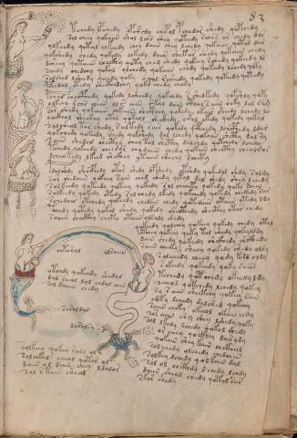

# Voynich Speculative Procedural Protocol — f83r

IMPORTANT: this is NOT a real or validated translation of the Voynich Manuscript. It is a speculative/procedural model that interprets EVA using a user-defined grammar to generate experimental recipes using safe, known edible substitutes.

This file is generated automatically from IVTFF/EVA transliteration plus a user-defined procedural grammar.



## Page / Folio
- currier: B
- folio: f83r
- page_number: 163
- section: biological

## EVA Text (Transliteration)
```text
tchedy lpchedy opch'edy chepol pchedar shedy qopchedy
sol cheey qokaiin shol lchs shey qoteedy rches ar chedy dor
olkeedy qotal chkeedy chey daiin chey lchedy qokaiin qotal dar
qokshedy chedy qokedy chkedy daiin shetar shedy qekaiin chedy
dch'eey qotaiin checkhy qoty che[g:d] shedy qokeey rchedy qoteedy lo
schedy chedchy qokal olchedy qokaiin chedy qokeedy lchedy qoky
solshed lsheedy qeeedy qoky o qol rsheedy qokedy qoteedy qoteedy
pchedal otedy shecthedchy qoky chedy chary
pchor checphedy qokedy lsheedy qokchdy r shedkedy qopshdy qopy
olkeey rchs cheeb ols aiin skal dain cthal s aiin chky lal sam
sor shedy qokaiin chkain shcthey qokedy okair sheedy lchedy lo
qockhol sheckhy otal qokeal sheckhdy ckal okedy qokedy qokal
salcheol tar shedy s altedy sair qokedy qcphhedy lchcphedy ldar
qokchedy qokeedy shedy qokshedy dal lchedy qokaiin shcthy dal sy
saiin shedal shecthy chey tal shcthy dalchdy qotchedy lchedy
tchedy qokchdy cheedar chldaiin chedy qokain checthy chealror
dche[o:?]kedy lkeed shckhey ytaiin shechy schety
pdalshdy shocphedy otor shedy opshedy otshdy qokedol shdy soldy
sar shedaiin ockhey sain ched shedy qetal dal shedy shey lchedy
solkeedy qoteedy qokeey qokedy sol cheeety qokedy qoky saiin
solkeedy qokedy otedy sol chedy lkedy qokchedy qokedy chckhdy sar
schedair otchedy qokeedy chedain chedy qotedaiin otaiin otedy ldy
tchedy qotedy qokal shedy qokedy shecthedy shecthy otor chedy
soiiin checthy chety otaiin olsaly shedy
qokeedy qolchey qokeey qokedy chedy otal
otchey qokeey qoky tol shedy qokylddy
dain chedy qokeedy shckhedy shckhedy
saiin cheeky sheey qokedy shedy oldy
salche'dy cheey qody kesd oldy
s okeedy qokeedy qoky saii@208;
techedy qotchedy okeedy ldy
[?:s]cheol qokchedy lchedy qokey
sy s aiin sheekchy qokey sain
shky lchedy dolshed qokchy
saiin cheky okeeol okain chdy
so[r:s] aiin shy shey lshedy qoky
sol lkedy lchedy qokol shedy
or chey qockhey dairydy
qokain shey kain chckhal
solchedy olchedy chedaiin
solkey lchedy qolkain dal
sol ol chcthdy l chedy lchdy
daiin sheol chedy qotal sar
skar shedy
chtorol
olsaiin
otchdy qokchdy shedal
dal cheol lol chdal aiin
sol daiiin chedy
sasoldal
darolsy
solkeey qekey raly ol
solchkal cheol qotar ol
daiin ol dain chey ldalor
sol rtain cthal
```

## Domain Context (Heuristic; Not a Translation)

This section summarizes recurring **basewords** in this IVTFF domain and shows simple substring evidence that the token markers used by the procedural grammar occur inside frequent words.

Any Italian anagram / English gloss is a best-effort lexicon match, not a decipherment.


### Associated basewords (non-generic; top by frequency in this domain)
- `qokain` (count=158) → Italian anagram `acconi`; English: [n/a]
- `qokal` (count=102) → Italian anagram `calco`; English: cast (of sculpture)
- `daiin` (count=81) → Italian anagram `piani`; English: plans (arrangements)
- `qokaiin` (count=81) → Italian anagram `ciancio`; English: [n/a]
- `qokar` (count=45) → Italian anagram `carco`; English: [n/a]
- `okain` (count=40) → Italian anagram `acino`; English: a berry
- `okaiin` (count=31) → Italian anagram `coniai`; English: [n/a]
- `saiin` (count=30) → Italian anagram `asini`; English: [n/a]
- `olkain` (count=26) → Italian anagram `alcino`; English: smart, clever, intelligent, bright
- `qotal` (count=25) → Italian anagram `colta`; English: [n/a]
- `otain` (count=23) → Italian anagram `anito`; English: [n/a]
- `qotain` (count=20) → Italian anagram `antico`; English: ancient
- `qotar` (count=16) → Italian anagram `corta`; English: [n/a]
- `qotaiin` (count=13) → Italian anagram `cationi`; English: [n/a]
- `kaiin` (count=7) → Italian anagram `acini`; English: [n/a]

### Marker evidence (substring in frequent basewords)
- `qo`: 49 basewords; examples: `qokain`, `qokedy`, `qokeedy`, `qol`, `qokal`, `qokaiin`
- `q`: 50 basewords; examples: `qokain`, `qokedy`, `qokeedy`, `qol`, `qokal`, `qokaiin`
- `o`: 173 basewords; examples: `ol`, `qokain`, `qokedy`, `qokeedy`, `qol`, `qokal`
- `k`: 114 basewords; examples: `qokain`, `qokedy`, `qokeedy`, `qokal`, `qokaiin`, `qokeey`
- `t`: 77 basewords; examples: `otedy`, `qotedy`, `qoteedy`, `qoty`, `qotal`, `otain`
- `p`: 11 basewords; examples: `pchedy`, `opchedy`, `pol`, `qopchedy`, `pchedar`, `opchey`
- `ch`: 93 basewords; examples: `chedy`, `chey`, `lchedy`, `cheey`, `chckhy`, `cheol`
- `sh`: 41 basewords; examples: `shedy`, `shey`, `sheedy`, `sheey`, `sheol`, `shckhy`
- `cth`: 9 basewords; examples: `chcthy`, `checthy`, `shcthy`, `shecthy`, `cthedy`, `cthey`
- `ckh`: 12 basewords; examples: `chckhy`, `shckhy`, `checkhy`, `sheckhy`, `chckhey`, `chckhdy`
- `cph`: 1 basewords; examples: `cphol`
- `dy`: 63 basewords; examples: `shedy`, `chedy`, `qokedy`, `qokeedy`, `dy`, `lchedy`
- `iin`: 27 basewords; examples: `daiin`, `qokaiin`, `aiin`, `okaiin`, `saiin`, `qotaiin`
- `aiin`: 21 basewords; examples: `daiin`, `qokaiin`, `aiin`, `okaiin`, `saiin`, `qotaiin`

## Recipes Index (This Page)
- [f83r.1,@P0](#f83r-1-f83r-1-p0)
- [f83r.2,+P0](#f83r-2-f83r-2-p0)
- [f83r.3,+P0](#f83r-3-f83r-3-p0)
- [f83r.4,+P0](#f83r-4-f83r-4-p0)
- [f83r.5,+P0](#f83r-5-f83r-5-p0)
- [f83r.6,+P0](#f83r-6-f83r-6-p0)
- [f83r.7,+P0](#f83r-7-f83r-7-p0)
- [f83r.8,+P0](#f83r-8-f83r-8-p0)
- [f83r.9,+P0](#f83r-9-f83r-9-p0)
- [f83r.10,+P0](#f83r-10-f83r-10-p0)
- [f83r.11,+P0](#f83r-11-f83r-11-p0)
- [f83r.12,+P0](#f83r-12-f83r-12-p0)
- [f83r.13,+P0](#f83r-13-f83r-13-p0)
- [f83r.14,+P0](#f83r-14-f83r-14-p0)
- [f83r.15,+P0](#f83r-15-f83r-15-p0)
- [f83r.16,+P0](#f83r-16-f83r-16-p0)
- [f83r.17,+P0](#f83r-17-f83r-17-p0)
- [f83r.18,+P0](#f83r-18-f83r-18-p0)
- [f83r.19,+P0](#f83r-19-f83r-19-p0)
- [f83r.20,+P0](#f83r-20-f83r-20-p0)
- [f83r.21,+P0](#f83r-21-f83r-21-p0)
- [f83r.22,+P0](#f83r-22-f83r-22-p0)
- [f83r.23,+P0](#f83r-23-f83r-23-p0)
- [f83r.24,+P0](#f83r-24-f83r-24-p0)
- [f83r.25,@P1](#f83r-25-f83r-25-p1)
- [f83r.26,+P1](#f83r-26-f83r-26-p1)
- [f83r.27,+P1](#f83r-27-f83r-27-p1)
- [f83r.28,+P1](#f83r-28-f83r-28-p1)
- [f83r.29,+P1](#f83r-29-f83r-29-p1)
- [f83r.30,+P1](#f83r-30-f83r-30-p1)
- [f83r.31,+P1](#f83r-31-f83r-31-p1)
- [f83r.32,+P1](#f83r-32-f83r-32-p1)
- [f83r.33,+P1](#f83r-33-f83r-33-p1)
- [f83r.34,+P1](#f83r-34-f83r-34-p1)
- [f83r.35,+P1](#f83r-35-f83r-35-p1)
- [f83r.36,+P1](#f83r-36-f83r-36-p1)
- [f83r.37,+P1](#f83r-37-f83r-37-p1)
- [f83r.38,+P1](#f83r-38-f83r-38-p1)
- [f83r.39,+P1](#f83r-39-f83r-39-p1)
- [f83r.40,+P1](#f83r-40-f83r-40-p1)
- [f83r.41,+P1](#f83r-41-f83r-41-p1)
- [f83r.42,+P1](#f83r-42-f83r-42-p1)
- [f83r.43,+P1](#f83r-43-f83r-43-p1)
- [f83r.44,+P1](#f83r-44-f83r-44-p1)
- [f83r.45,@Lt](#f83r-45-f83r-45-lt)
- [f83r.46,=Lt](#f83r-46-f83r-46-lt)
- [f83r.47,@Pb](#f83r-47-f83r-47-pb)
- [f83r.48,+Pb](#f83r-48-f83r-48-pb)
- [f83r.49,+Pb](#f83r-49-f83r-49-pb)
- [f83r.50,@Lt](#f83r-50-f83r-50-lt)
- [f83r.51,+Lt](#f83r-51-f83r-51-lt)
- [f83r.52,@Pb](#f83r-52-f83r-52-pb)
- [f83r.53,+Pb](#f83r-53-f83r-53-pb)
- [f83r.54,+Pb](#f83r-54-f83r-54-pb)
- [f83r.55,+Pb](#f83r-55-f83r-55-pb)

## Line Glosses (Procedural Gloss Only; Not a Translation)

<a id="f83r-1-f83r-1-p0"></a>

### f83r.1,@P0

EVA: tchedy lpchedy opch'edy chepol pchedar shedy qopchedy

Direct Gloss (Procedural, Not a Real Translation):
- tchedy: tokens: t ch e p → vowel_run: e (level 1; class e)
- lpchedy: tokens: l p ch e p → connectors: l → vowel_run: e (level 1; class e)
- opch: tokens: o p ch
- edy: tokens: e p → vowel_run: e (level 1; class e)
- chepol: tokens: ch e p o l → connectors: l → vowel_run: e (level 1; class e)
- pchedar: tokens: p ch e p a r → connectors: r → vowel_run: e (level 1; class e)
- shedy: tokens: sh e p → vowel_run: e (level 1; class e)
- qopchedy: tokens: qo p ch e p → vowel_run: e (level 1; class e)

<a id="f83r-2-f83r-2-p0"></a>

### f83r.2,+P0

EVA: sol cheey qokaiin shol lchs shey qoteedy rches ar chedy dor

Direct Gloss (Procedural, Not a Real Translation):
- sol: tokens: s o l → connectors: s l
- cheey: tokens: ch ee → vowel_run: ee (level 2; class e)
- qokaiin: tokens: qo k aiin → vowel_run: a (level 1; class a) → suffix: aiin
- shol: tokens: sh o l → connectors: l
- lchs: tokens: l ch s → connectors: l s
- shey: tokens: sh e → vowel_run: e (level 1; class e)
- qoteedy: tokens: qo t ee p → vowel_run: ee (level 2; class e)
- rches: tokens: r ch e s → connectors: r s → vowel_run: e (level 1; class e)
- ar: tokens: a r → connectors: r → vowel_run: a (level 1; class a)
- chedy: tokens: ch e p → vowel_run: e (level 1; class e)
- dor: tokens: p o r → connectors: r

<a id="f83r-3-f83r-3-p0"></a>

### f83r.3,+P0

EVA: olkeedy qotal chkeedy chey daiin chey lchedy qokaiin qotal dar

Direct Gloss (Procedural, Not a Real Translation):
- olkeedy: tokens: o l k ee p → connectors: l → vowel_run: ee (level 2; class e)
- qotal: tokens: qo t a l → connectors: l → vowel_run: a (level 1; class a)
- chkeedy: tokens: ch k ee p → vowel_run: ee (level 2; class e)
- chey: tokens: ch e → vowel_run: e (level 1; class e)
- daiin: tokens: p aiin → vowel_run: a (level 1; class a) → suffix: aiin
- chey: tokens: ch e → vowel_run: e (level 1; class e)
- lchedy: tokens: l ch e p → connectors: l → vowel_run: e (level 1; class e)
- qokaiin: tokens: qo k aiin → vowel_run: a (level 1; class a) → suffix: aiin
- qotal: tokens: qo t a l → connectors: l → vowel_run: a (level 1; class a)
- dar: tokens: p a r → connectors: r → vowel_run: a (level 1; class a)

<a id="f83r-4-f83r-4-p0"></a>

### f83r.4,+P0

EVA: qokshedy chedy qokedy chkedy daiin shetar shedy qekaiin chedy

Direct Gloss (Procedural, Not a Real Translation):
- qokshedy: tokens: qo k sh e p → vowel_run: e (level 1; class e)
- chedy: tokens: ch e p → vowel_run: e (level 1; class e)
- qokedy: tokens: qo k e p → vowel_run: e (level 1; class e)
- chkedy: tokens: ch k e p → vowel_run: e (level 1; class e)
- daiin: tokens: p aiin → vowel_run: a (level 1; class a) → suffix: aiin
- shetar: tokens: sh e t a r → connectors: r → vowel_run: e (level 1; class e)
- shedy: tokens: sh e p → vowel_run: e (level 1; class e)
- qekaiin: tokens: q e k aiin → vowel_run: e (level 1; class e) → suffix: aiin
- chedy: tokens: ch e p → vowel_run: e (level 1; class e)

<a id="f83r-5-f83r-5-p0"></a>

### f83r.5,+P0

EVA: dch'eey qotaiin checkhy qoty che[g:d] shedy qokeey rchedy qoteedy lo

Direct Gloss (Procedural, Not a Real Translation):
- dch: tokens: p ch
- eey: tokens: ee → vowel_run: ee (level 2; class e)
- qotaiin: tokens: qo t aiin → vowel_run: a (level 1; class a) → suffix: aiin
- checkhy: tokens: ch e ckh → vowel_run: e (level 1; class e)
- qoty: tokens: qo t
- che: tokens: ch e → vowel_run: e (level 1; class e)
- g: tokens: g
- d: tokens: p
- shedy: tokens: sh e p → vowel_run: e (level 1; class e)
- qokeey: tokens: qo k ee → vowel_run: ee (level 2; class e)
- rchedy: tokens: r ch e p → connectors: r → vowel_run: e (level 1; class e)
- qoteedy: tokens: qo t ee p → vowel_run: ee (level 2; class e)
- lo: tokens: l o → connectors: l

<a id="f83r-6-f83r-6-p0"></a>

### f83r.6,+P0

EVA: schedy chedchy qokal olchedy qokaiin chedy qokeedy lchedy qoky

Direct Gloss (Procedural, Not a Real Translation):
- schedy: tokens: s ch e p → connectors: s → vowel_run: e (level 1; class e)
- chedchy: tokens: ch e p ch → vowel_run: e (level 1; class e)
- qokal: tokens: qo k a l → connectors: l → vowel_run: a (level 1; class a)
- olchedy: tokens: o l ch e p → connectors: l → vowel_run: e (level 1; class e)
- qokaiin: tokens: qo k aiin → vowel_run: a (level 1; class a) → suffix: aiin
- chedy: tokens: ch e p → vowel_run: e (level 1; class e)
- qokeedy: tokens: qo k ee p → vowel_run: ee (level 2; class e)
- lchedy: tokens: l ch e p → connectors: l → vowel_run: e (level 1; class e)
- qoky: tokens: qo k

<a id="f83r-7-f83r-7-p0"></a>

### f83r.7,+P0

EVA: solshed lsheedy qeeedy qoky o qol rsheedy qokedy qoteedy qoteedy

Direct Gloss (Procedural, Not a Real Translation):
- solshed: tokens: s o l sh e p → connectors: s l → vowel_run: e (level 1; class e)
- lsheedy: tokens: l sh ee p → connectors: l → vowel_run: ee (level 2; class e)
- qeeedy: tokens: q eee p → vowel_run: eee (level 3; class e)
- qoky: tokens: qo k
- o: tokens: o
- qol: tokens: qo l → connectors: l
- rsheedy: tokens: r sh ee p → connectors: r → vowel_run: ee (level 2; class e)
- qokedy: tokens: qo k e p → vowel_run: e (level 1; class e)
- qoteedy: tokens: qo t ee p → vowel_run: ee (level 2; class e)
- qoteedy: tokens: qo t ee p → vowel_run: ee (level 2; class e)

<a id="f83r-8-f83r-8-p0"></a>

### f83r.8,+P0

EVA: pchedal otedy shecthedchy qoky chedy chary

Direct Gloss (Procedural, Not a Real Translation):
- pchedal: tokens: p ch e p a l → connectors: l → vowel_run: e (level 1; class e)
- otedy: tokens: o t e p → vowel_run: e (level 1; class e)
- shecthedchy: tokens: sh e cth e p ch → vowel_run: e (level 1; class e)
- qoky: tokens: qo k
- chedy: tokens: ch e p → vowel_run: e (level 1; class e)
- chary: tokens: ch a r → connectors: r → vowel_run: a (level 1; class a)

<a id="f83r-9-f83r-9-p0"></a>

### f83r.9,+P0

EVA: pchor checphedy qokedy lsheedy qokchdy r shedkedy qopshdy qopy

Direct Gloss (Procedural, Not a Real Translation):
- pchor: tokens: p ch o r → connectors: r
- checphedy: tokens: ch e cph e p → vowel_run: e (level 1; class e)
- qokedy: tokens: qo k e p → vowel_run: e (level 1; class e)
- lsheedy: tokens: l sh ee p → connectors: l → vowel_run: ee (level 2; class e)
- qokchdy: tokens: qo k ch p
- r: tokens: r → connectors: r
- shedkedy: tokens: sh e p k e p → vowel_run: e (level 1; class e)
- qopshdy: tokens: qo p sh p
- qopy: tokens: qo p

<a id="f83r-10-f83r-10-p0"></a>

### f83r.10,+P0

EVA: olkeey rchs cheeb ols aiin skal dain cthal s aiin chky lal sam

Direct Gloss (Procedural, Not a Real Translation):
- olkeey: tokens: o l k ee → connectors: l → vowel_run: ee (level 2; class e)
- rchs: tokens: r ch s → connectors: r s
- cheeb: tokens: ch ee b → vowel_run: ee (level 2; class e) → unmodeled_tokens: b
- ols: tokens: o l s → connectors: l s
- aiin: tokens: aiin → vowel_run: a (level 1; class a) → suffix: aiin
- skal: tokens: s k a l → connectors: s l → vowel_run: a (level 1; class a)
- dain: tokens: p a i n → connectors: n → vowel_run: a (level 1; class a)
- cthal: tokens: cth a l → connectors: l → vowel_run: a (level 1; class a)
- s: tokens: s → connectors: s
- aiin: tokens: aiin → vowel_run: a (level 1; class a) → suffix: aiin
- chky: tokens: ch k
- lal: tokens: l a l → connectors: l l → vowel_run: a (level 1; class a)
- sam: tokens: s a m → connectors: s m → vowel_run: a (level 1; class a)

<a id="f83r-11-f83r-11-p0"></a>

### f83r.11,+P0

EVA: sor shedy qokaiin chkain shcthey qokedy okair sheedy lchedy lo

Direct Gloss (Procedural, Not a Real Translation):
- sor: tokens: s o r → connectors: s r
- shedy: tokens: sh e p → vowel_run: e (level 1; class e)
- qokaiin: tokens: qo k aiin → vowel_run: a (level 1; class a) → suffix: aiin
- chkain: tokens: ch k a i n → connectors: n → vowel_run: a (level 1; class a)
- shcthey: tokens: sh cth e → vowel_run: e (level 1; class e)
- qokedy: tokens: qo k e p → vowel_run: e (level 1; class e)
- okair: tokens: o k a i r → connectors: r → vowel_run: a (level 1; class a)
- sheedy: tokens: sh ee p → vowel_run: ee (level 2; class e)
- lchedy: tokens: l ch e p → connectors: l → vowel_run: e (level 1; class e)
- lo: tokens: l o → connectors: l

<a id="f83r-12-f83r-12-p0"></a>

### f83r.12,+P0

EVA: qockhol sheckhy otal qokeal sheckhdy ckal okedy qokedy qokal

Direct Gloss (Procedural, Not a Real Translation):
- qockhol: tokens: qo ckh o l → connectors: l
- sheckhy: tokens: sh e ckh → vowel_run: e (level 1; class e)
- otal: tokens: o t a l → connectors: l → vowel_run: a (level 1; class a)
- qokeal: tokens: qo k e a l → connectors: l → vowel_run: e (level 1; class e)
- sheckhdy: tokens: sh e ckh p → vowel_run: e (level 1; class e)
- ckal: tokens: c k a l → connectors: l → vowel_run: a (level 1; class a)
- okedy: tokens: o k e p → vowel_run: e (level 1; class e)
- qokedy: tokens: qo k e p → vowel_run: e (level 1; class e)
- qokal: tokens: qo k a l → connectors: l → vowel_run: a (level 1; class a)

<a id="f83r-13-f83r-13-p0"></a>

### f83r.13,+P0

EVA: salcheol tar shedy s altedy sair qokedy qcphhedy lchcphedy ldar

Direct Gloss (Procedural, Not a Real Translation):
- salcheol: tokens: s a l ch e o l → connectors: s l l → vowel_run: a (level 1; class a)
- tar: tokens: t a r → connectors: r → vowel_run: a (level 1; class a)
- shedy: tokens: sh e p → vowel_run: e (level 1; class e)
- s: tokens: s → connectors: s
- altedy: tokens: a l t e p → connectors: l → vowel_run: a (level 1; class a)
- sair: tokens: s a i r → connectors: s r → vowel_run: a (level 1; class a)
- qokedy: tokens: qo k e p → vowel_run: e (level 1; class e)
- qcphhedy: tokens: q cph h e p → vowel_run: e (level 1; class e) → unmodeled_tokens: h
- lchcphedy: tokens: l ch cph e p → connectors: l → vowel_run: e (level 1; class e)
- ldar: tokens: l p a r → connectors: l r → vowel_run: a (level 1; class a)

<a id="f83r-14-f83r-14-p0"></a>

### f83r.14,+P0

EVA: qokchedy qokeedy shedy qokshedy dal lchedy qokaiin shcthy dal sy

Direct Gloss (Procedural, Not a Real Translation):
- qokchedy: tokens: qo k ch e p → vowel_run: e (level 1; class e)
- qokeedy: tokens: qo k ee p → vowel_run: ee (level 2; class e)
- shedy: tokens: sh e p → vowel_run: e (level 1; class e)
- qokshedy: tokens: qo k sh e p → vowel_run: e (level 1; class e)
- dal: tokens: p a l → connectors: l → vowel_run: a (level 1; class a)
- lchedy: tokens: l ch e p → connectors: l → vowel_run: e (level 1; class e)
- qokaiin: tokens: qo k aiin → vowel_run: a (level 1; class a) → suffix: aiin
- shcthy: tokens: sh cth
- dal: tokens: p a l → connectors: l → vowel_run: a (level 1; class a)
- sy: tokens: s → connectors: s

<a id="f83r-15-f83r-15-p0"></a>

### f83r.15,+P0

EVA: saiin shedal shecthy chey tal shcthy dalchdy qotchedy lchedy

Direct Gloss (Procedural, Not a Real Translation):
- saiin: tokens: s aiin → connectors: s → vowel_run: a (level 1; class a) → suffix: aiin
- shedal: tokens: sh e p a l → connectors: l → vowel_run: e (level 1; class e)
- shecthy: tokens: sh e cth → vowel_run: e (level 1; class e)
- chey: tokens: ch e → vowel_run: e (level 1; class e)
- tal: tokens: t a l → connectors: l → vowel_run: a (level 1; class a)
- shcthy: tokens: sh cth
- dalchdy: tokens: p a l ch p → connectors: l → vowel_run: a (level 1; class a)
- qotchedy: tokens: qo t ch e p → vowel_run: e (level 1; class e)
- lchedy: tokens: l ch e p → connectors: l → vowel_run: e (level 1; class e)

<a id="f83r-16-f83r-16-p0"></a>

### f83r.16,+P0

EVA: tchedy qokchdy cheedar chldaiin chedy qokain checthy chealror

Direct Gloss (Procedural, Not a Real Translation):
- tchedy: tokens: t ch e p → vowel_run: e (level 1; class e)
- qokchdy: tokens: qo k ch p
- cheedar: tokens: ch ee p a r → connectors: r → vowel_run: ee (level 2; class e)
- chldaiin: tokens: ch l p aiin → connectors: l → vowel_run: a (level 1; class a) → suffix: aiin
- chedy: tokens: ch e p → vowel_run: e (level 1; class e)
- qokain: tokens: qo k a i n → connectors: n → vowel_run: a (level 1; class a)
- checthy: tokens: ch e cth → vowel_run: e (level 1; class e)
- chealror: tokens: ch e a l r o r → connectors: l r r → vowel_run: e (level 1; class e)

<a id="f83r-17-f83r-17-p0"></a>

### f83r.17,+P0

EVA: dche[o:?]kedy lkeed shckhey ytaiin shechy schety

Direct Gloss (Procedural, Not a Real Translation):
- dche: tokens: p ch e → vowel_run: e (level 1; class e)
- o: tokens: o
- kedy: tokens: k e p → vowel_run: e (level 1; class e)
- lkeed: tokens: l k ee p → connectors: l → vowel_run: ee (level 2; class e)
- shckhey: tokens: sh ckh e → vowel_run: e (level 1; class e)
- ytaiin: tokens: t aiin → vowel_run: a (level 1; class a) → suffix: aiin
- shechy: tokens: sh e ch → vowel_run: e (level 1; class e)
- schety: tokens: s ch e t → connectors: s → vowel_run: e (level 1; class e)

<a id="f83r-18-f83r-18-p0"></a>

### f83r.18,+P0

EVA: pdalshdy shocphedy otor shedy opshedy otshdy qokedol shdy soldy

Direct Gloss (Procedural, Not a Real Translation):
- pdalshdy: tokens: p p a l sh p → connectors: l → vowel_run: a (level 1; class a)
- shocphedy: tokens: sh o cph e p → vowel_run: e (level 1; class e)
- otor: tokens: o t o r → connectors: r
- shedy: tokens: sh e p → vowel_run: e (level 1; class e)
- opshedy: tokens: o p sh e p → vowel_run: e (level 1; class e)
- otshdy: tokens: o t sh p
- qokedol: tokens: qo k e p o l → connectors: l → vowel_run: e (level 1; class e)
- shdy: tokens: sh p
- soldy: tokens: s o l p → connectors: s l

<a id="f83r-19-f83r-19-p0"></a>

### f83r.19,+P0

EVA: sar shedaiin ockhey sain ched shedy qetal dal shedy shey lchedy

Direct Gloss (Procedural, Not a Real Translation):
- sar: tokens: s a r → connectors: s r → vowel_run: a (level 1; class a)
- shedaiin: tokens: sh e p aiin → vowel_run: e (level 1; class e) → suffix: aiin
- ockhey: tokens: o ckh e → vowel_run: e (level 1; class e)
- sain: tokens: s a i n → connectors: s n → vowel_run: a (level 1; class a)
- ched: tokens: ch e p → vowel_run: e (level 1; class e)
- shedy: tokens: sh e p → vowel_run: e (level 1; class e)
- qetal: tokens: q e t a l → connectors: l → vowel_run: e (level 1; class e)
- dal: tokens: p a l → connectors: l → vowel_run: a (level 1; class a)
- shedy: tokens: sh e p → vowel_run: e (level 1; class e)
- shey: tokens: sh e → vowel_run: e (level 1; class e)
- lchedy: tokens: l ch e p → connectors: l → vowel_run: e (level 1; class e)

<a id="f83r-20-f83r-20-p0"></a>

### f83r.20,+P0

EVA: solkeedy qoteedy qokeey qokedy sol cheeety qokedy qoky saiin

Direct Gloss (Procedural, Not a Real Translation):
- solkeedy: tokens: s o l k ee p → connectors: s l → vowel_run: ee (level 2; class e)
- qoteedy: tokens: qo t ee p → vowel_run: ee (level 2; class e)
- qokeey: tokens: qo k ee → vowel_run: ee (level 2; class e)
- qokedy: tokens: qo k e p → vowel_run: e (level 1; class e)
- sol: tokens: s o l → connectors: s l
- cheeety: tokens: ch eee t → vowel_run: eee (level 3; class e)
- qokedy: tokens: qo k e p → vowel_run: e (level 1; class e)
- qoky: tokens: qo k
- saiin: tokens: s aiin → connectors: s → vowel_run: a (level 1; class a) → suffix: aiin

<a id="f83r-21-f83r-21-p0"></a>

### f83r.21,+P0

EVA: solkeedy qokedy otedy sol chedy lkedy qokchedy qokedy chckhdy sar

Direct Gloss (Procedural, Not a Real Translation):
- solkeedy: tokens: s o l k ee p → connectors: s l → vowel_run: ee (level 2; class e)
- qokedy: tokens: qo k e p → vowel_run: e (level 1; class e)
- otedy: tokens: o t e p → vowel_run: e (level 1; class e)
- sol: tokens: s o l → connectors: s l
- chedy: tokens: ch e p → vowel_run: e (level 1; class e)
- lkedy: tokens: l k e p → connectors: l → vowel_run: e (level 1; class e)
- qokchedy: tokens: qo k ch e p → vowel_run: e (level 1; class e)
- qokedy: tokens: qo k e p → vowel_run: e (level 1; class e)
- chckhdy: tokens: ch ckh p
- sar: tokens: s a r → connectors: s r → vowel_run: a (level 1; class a)

<a id="f83r-22-f83r-22-p0"></a>

### f83r.22,+P0

EVA: schedair otchedy qokeedy chedain chedy qotedaiin otaiin otedy ldy

Direct Gloss (Procedural, Not a Real Translation):
- schedair: tokens: s ch e p a i r → connectors: s r → vowel_run: e (level 1; class e)
- otchedy: tokens: o t ch e p → vowel_run: e (level 1; class e)
- qokeedy: tokens: qo k ee p → vowel_run: ee (level 2; class e)
- chedain: tokens: ch e p a i n → connectors: n → vowel_run: e (level 1; class e)
- chedy: tokens: ch e p → vowel_run: e (level 1; class e)
- qotedaiin: tokens: qo t e p aiin → vowel_run: e (level 1; class e) → suffix: aiin
- otaiin: tokens: o t aiin → vowel_run: a (level 1; class a) → suffix: aiin
- otedy: tokens: o t e p → vowel_run: e (level 1; class e)
- ldy: tokens: l p → connectors: l

<a id="f83r-23-f83r-23-p0"></a>

### f83r.23,+P0

EVA: tchedy qotedy qokal shedy qokedy shecthedy shecthy otor chedy

Direct Gloss (Procedural, Not a Real Translation):
- tchedy: tokens: t ch e p → vowel_run: e (level 1; class e)
- qotedy: tokens: qo t e p → vowel_run: e (level 1; class e)
- qokal: tokens: qo k a l → connectors: l → vowel_run: a (level 1; class a)
- shedy: tokens: sh e p → vowel_run: e (level 1; class e)
- qokedy: tokens: qo k e p → vowel_run: e (level 1; class e)
- shecthedy: tokens: sh e cth e p → vowel_run: e (level 1; class e)
- shecthy: tokens: sh e cth → vowel_run: e (level 1; class e)
- otor: tokens: o t o r → connectors: r
- chedy: tokens: ch e p → vowel_run: e (level 1; class e)

<a id="f83r-24-f83r-24-p0"></a>

### f83r.24,+P0

EVA: soiiin checthy chety otaiin olsaly shedy

Direct Gloss (Procedural, Not a Real Translation):
- soiiin: tokens: s o iii n → connectors: s n → vowel_run: iii (level 3; class i) → suffix: iin
- checthy: tokens: ch e cth → vowel_run: e (level 1; class e)
- chety: tokens: ch e t → vowel_run: e (level 1; class e)
- otaiin: tokens: o t aiin → vowel_run: a (level 1; class a) → suffix: aiin
- olsaly: tokens: o l s a l → connectors: l s l → vowel_run: a (level 1; class a)
- shedy: tokens: sh e p → vowel_run: e (level 1; class e)

<a id="f83r-25-f83r-25-p1"></a>

### f83r.25,@P1

EVA: qokeedy qolchey qokeey qokedy chedy otal

Direct Gloss (Procedural, Not a Real Translation):
- qokeedy: tokens: qo k ee p → vowel_run: ee (level 2; class e)
- qolchey: tokens: qo l ch e → connectors: l → vowel_run: e (level 1; class e)
- qokeey: tokens: qo k ee → vowel_run: ee (level 2; class e)
- qokedy: tokens: qo k e p → vowel_run: e (level 1; class e)
- chedy: tokens: ch e p → vowel_run: e (level 1; class e)
- otal: tokens: o t a l → connectors: l → vowel_run: a (level 1; class a)

<a id="f83r-26-f83r-26-p1"></a>

### f83r.26,+P1

EVA: otchey qokeey qoky tol shedy qokylddy

Direct Gloss (Procedural, Not a Real Translation):
- otchey: tokens: o t ch e → vowel_run: e (level 1; class e)
- qokeey: tokens: qo k ee → vowel_run: ee (level 2; class e)
- qoky: tokens: qo k
- tol: tokens: t o l → connectors: l
- shedy: tokens: sh e p → vowel_run: e (level 1; class e)
- qokylddy: tokens: qo k l p p → connectors: l

<a id="f83r-27-f83r-27-p1"></a>

### f83r.27,+P1

EVA: dain chedy qokeedy shckhedy shckhedy

Direct Gloss (Procedural, Not a Real Translation):
- dain: tokens: p a i n → connectors: n → vowel_run: a (level 1; class a)
- chedy: tokens: ch e p → vowel_run: e (level 1; class e)
- qokeedy: tokens: qo k ee p → vowel_run: ee (level 2; class e)
- shckhedy: tokens: sh ckh e p → vowel_run: e (level 1; class e)
- shckhedy: tokens: sh ckh e p → vowel_run: e (level 1; class e)

<a id="f83r-28-f83r-28-p1"></a>

### f83r.28,+P1

EVA: saiin cheeky sheey qokedy shedy oldy

Direct Gloss (Procedural, Not a Real Translation):
- saiin: tokens: s aiin → connectors: s → vowel_run: a (level 1; class a) → suffix: aiin
- cheeky: tokens: ch ee k → vowel_run: ee (level 2; class e)
- sheey: tokens: sh ee → vowel_run: ee (level 2; class e)
- qokedy: tokens: qo k e p → vowel_run: e (level 1; class e)
- shedy: tokens: sh e p → vowel_run: e (level 1; class e)
- oldy: tokens: o l p → connectors: l

<a id="f83r-29-f83r-29-p1"></a>

### f83r.29,+P1

EVA: salche'dy cheey qody kesd oldy

Direct Gloss (Procedural, Not a Real Translation):
- salche: tokens: s a l ch e → connectors: s l → vowel_run: a (level 1; class a)
- dy: tokens: p
- cheey: tokens: ch ee → vowel_run: ee (level 2; class e)
- qody: tokens: qo p
- kesd: tokens: k e s p → connectors: s → vowel_run: e (level 1; class e)
- oldy: tokens: o l p → connectors: l

<a id="f83r-30-f83r-30-p1"></a>

### f83r.30,+P1

EVA: s okeedy qokeedy qoky saii@208;

Direct Gloss (Procedural, Not a Real Translation):
- s: tokens: s → connectors: s
- okeedy: tokens: o k ee p → vowel_run: ee (level 2; class e)
- qokeedy: tokens: qo k ee p → vowel_run: ee (level 2; class e)
- qoky: tokens: qo k
- saii: tokens: s a ii → connectors: s → vowel_run: a (level 1; class a)

<a id="f83r-31-f83r-31-p1"></a>

### f83r.31,+P1

EVA: techedy qotchedy okeedy ldy

Direct Gloss (Procedural, Not a Real Translation):
- techedy: tokens: t e ch e p → vowel_run: e (level 1; class e)
- qotchedy: tokens: qo t ch e p → vowel_run: e (level 1; class e)
- okeedy: tokens: o k ee p → vowel_run: ee (level 2; class e)
- ldy: tokens: l p → connectors: l

<a id="f83r-32-f83r-32-p1"></a>

### f83r.32,+P1

EVA: [?:s]cheol qokchedy lchedy qokey

Direct Gloss (Procedural, Not a Real Translation):
- s: tokens: s → connectors: s
- cheol: tokens: ch e o l → connectors: l → vowel_run: e (level 1; class e)
- qokchedy: tokens: qo k ch e p → vowel_run: e (level 1; class e)
- lchedy: tokens: l ch e p → connectors: l → vowel_run: e (level 1; class e)
- qokey: tokens: qo k e → vowel_run: e (level 1; class e)

<a id="f83r-33-f83r-33-p1"></a>

### f83r.33,+P1

EVA: sy s aiin sheekchy qokey sain

Direct Gloss (Procedural, Not a Real Translation):
- sy: tokens: s → connectors: s
- s: tokens: s → connectors: s
- aiin: tokens: aiin → vowel_run: a (level 1; class a) → suffix: aiin
- sheekchy: tokens: sh ee k ch → vowel_run: ee (level 2; class e)
- qokey: tokens: qo k e → vowel_run: e (level 1; class e)
- sain: tokens: s a i n → connectors: s n → vowel_run: a (level 1; class a)

<a id="f83r-34-f83r-34-p1"></a>

### f83r.34,+P1

EVA: shky lchedy dolshed qokchy

Direct Gloss (Procedural, Not a Real Translation):
- shky: tokens: sh k
- lchedy: tokens: l ch e p → connectors: l → vowel_run: e (level 1; class e)
- dolshed: tokens: p o l sh e p → connectors: l → vowel_run: e (level 1; class e)
- qokchy: tokens: qo k ch

<a id="f83r-35-f83r-35-p1"></a>

### f83r.35,+P1

EVA: saiin cheky okeeol okain chdy

Direct Gloss (Procedural, Not a Real Translation):
- saiin: tokens: s aiin → connectors: s → vowel_run: a (level 1; class a) → suffix: aiin
- cheky: tokens: ch e k → vowel_run: e (level 1; class e)
- okeeol: tokens: o k ee o l → connectors: l → vowel_run: ee (level 2; class e)
- okain: tokens: o k a i n → connectors: n → vowel_run: a (level 1; class a)
- chdy: tokens: ch p

<a id="f83r-36-f83r-36-p1"></a>

### f83r.36,+P1

EVA: so[r:s] aiin shy shey lshedy qoky

Direct Gloss (Procedural, Not a Real Translation):
- so: tokens: s o → connectors: s
- r: tokens: r → connectors: r
- s: tokens: s → connectors: s
- aiin: tokens: aiin → vowel_run: a (level 1; class a) → suffix: aiin
- shy: tokens: sh
- shey: tokens: sh e → vowel_run: e (level 1; class e)
- lshedy: tokens: l sh e p → connectors: l → vowel_run: e (level 1; class e)
- qoky: tokens: qo k

<a id="f83r-37-f83r-37-p1"></a>

### f83r.37,+P1

EVA: sol lkedy lchedy qokol shedy

Direct Gloss (Procedural, Not a Real Translation):
- sol: tokens: s o l → connectors: s l
- lkedy: tokens: l k e p → connectors: l → vowel_run: e (level 1; class e)
- lchedy: tokens: l ch e p → connectors: l → vowel_run: e (level 1; class e)
- qokol: tokens: qo k o l → connectors: l
- shedy: tokens: sh e p → vowel_run: e (level 1; class e)

<a id="f83r-38-f83r-38-p1"></a>

### f83r.38,+P1

EVA: or chey qockhey dairydy

Direct Gloss (Procedural, Not a Real Translation):
- or: tokens: o r → connectors: r
- chey: tokens: ch e → vowel_run: e (level 1; class e)
- qockhey: tokens: qo ckh e → vowel_run: e (level 1; class e)
- dairydy: tokens: p a i r p → connectors: r → vowel_run: a (level 1; class a)

<a id="f83r-39-f83r-39-p1"></a>

### f83r.39,+P1

EVA: qokain shey kain chckhal

Direct Gloss (Procedural, Not a Real Translation):
- qokain: tokens: qo k a i n → connectors: n → vowel_run: a (level 1; class a)
- shey: tokens: sh e → vowel_run: e (level 1; class e)
- kain: tokens: k a i n → connectors: n → vowel_run: a (level 1; class a)
- chckhal: tokens: ch ckh a l → connectors: l → vowel_run: a (level 1; class a)

<a id="f83r-40-f83r-40-p1"></a>

### f83r.40,+P1

EVA: solchedy olchedy chedaiin

Direct Gloss (Procedural, Not a Real Translation):
- solchedy: tokens: s o l ch e p → connectors: s l → vowel_run: e (level 1; class e)
- olchedy: tokens: o l ch e p → connectors: l → vowel_run: e (level 1; class e)
- chedaiin: tokens: ch e p aiin → vowel_run: e (level 1; class e) → suffix: aiin

<a id="f83r-41-f83r-41-p1"></a>

### f83r.41,+P1

EVA: solkey lchedy qolkain dal

Direct Gloss (Procedural, Not a Real Translation):
- solkey: tokens: s o l k e → connectors: s l → vowel_run: e (level 1; class e)
- lchedy: tokens: l ch e p → connectors: l → vowel_run: e (level 1; class e)
- qolkain: tokens: qo l k a i n → connectors: l n → vowel_run: a (level 1; class a)
- dal: tokens: p a l → connectors: l → vowel_run: a (level 1; class a)

<a id="f83r-42-f83r-42-p1"></a>

### f83r.42,+P1

EVA: sol ol chcthdy l chedy lchdy

Direct Gloss (Procedural, Not a Real Translation):
- sol: tokens: s o l → connectors: s l
- ol: tokens: o l → connectors: l
- chcthdy: tokens: ch cth p
- l: tokens: l → connectors: l
- chedy: tokens: ch e p → vowel_run: e (level 1; class e)
- lchdy: tokens: l ch p → connectors: l

<a id="f83r-43-f83r-43-p1"></a>

### f83r.43,+P1

EVA: daiin sheol chedy qotal sar

Direct Gloss (Procedural, Not a Real Translation):
- daiin: tokens: p aiin → vowel_run: a (level 1; class a) → suffix: aiin
- sheol: tokens: sh e o l → connectors: l → vowel_run: e (level 1; class e)
- chedy: tokens: ch e p → vowel_run: e (level 1; class e)
- qotal: tokens: qo t a l → connectors: l → vowel_run: a (level 1; class a)
- sar: tokens: s a r → connectors: s r → vowel_run: a (level 1; class a)

<a id="f83r-44-f83r-44-p1"></a>

### f83r.44,+P1

EVA: skar shedy

Direct Gloss (Procedural, Not a Real Translation):
- skar: tokens: s k a r → connectors: s r → vowel_run: a (level 1; class a)
- shedy: tokens: sh e p → vowel_run: e (level 1; class e)

<a id="f83r-45-f83r-45-lt"></a>

### f83r.45,@Lt

EVA: chtorol

Direct Gloss (Procedural, Not a Real Translation):
- chtorol: tokens: ch t o r o l → connectors: r l

<a id="f83r-46-f83r-46-lt"></a>

### f83r.46,=Lt

EVA: olsaiin

Direct Gloss (Procedural, Not a Real Translation):
- olsaiin: tokens: o l s aiin → connectors: l s → vowel_run: a (level 1; class a) → suffix: aiin

<a id="f83r-47-f83r-47-pb"></a>

### f83r.47,@Pb

EVA: otchdy qokchdy shedal

Direct Gloss (Procedural, Not a Real Translation):
- otchdy: tokens: o t ch p
- qokchdy: tokens: qo k ch p
- shedal: tokens: sh e p a l → connectors: l → vowel_run: e (level 1; class e)

<a id="f83r-48-f83r-48-pb"></a>

### f83r.48,+Pb

EVA: dal cheol lol chdal aiin

Direct Gloss (Procedural, Not a Real Translation):
- dal: tokens: p a l → connectors: l → vowel_run: a (level 1; class a)
- cheol: tokens: ch e o l → connectors: l → vowel_run: e (level 1; class e)
- lol: tokens: l o l → connectors: l l
- chdal: tokens: ch p a l → connectors: l → vowel_run: a (level 1; class a)
- aiin: tokens: aiin → vowel_run: a (level 1; class a) → suffix: aiin

<a id="f83r-49-f83r-49-pb"></a>

### f83r.49,+Pb

EVA: sol daiiin chedy

Direct Gloss (Procedural, Not a Real Translation):
- sol: tokens: s o l → connectors: s l
- daiiin: tokens: p a iii n → connectors: n → vowel_run: a (level 1; class a) → suffix: iin
- chedy: tokens: ch e p → vowel_run: e (level 1; class e)

<a id="f83r-50-f83r-50-lt"></a>

### f83r.50,@Lt

EVA: sasoldal

Direct Gloss (Procedural, Not a Real Translation):
- sasoldal: tokens: s a s o l p a l → connectors: s s l l → vowel_run: a (level 1; class a)

<a id="f83r-51-f83r-51-lt"></a>

### f83r.51,+Lt

EVA: darolsy

Direct Gloss (Procedural, Not a Real Translation):
- darolsy: tokens: p a r o l s → connectors: r l s → vowel_run: a (level 1; class a)

<a id="f83r-52-f83r-52-pb"></a>

### f83r.52,@Pb

EVA: solkeey qekey raly ol

Direct Gloss (Procedural, Not a Real Translation):
- solkeey: tokens: s o l k ee → connectors: s l → vowel_run: ee (level 2; class e)
- qekey: tokens: q e k e → vowel_run: e (level 1; class e)
- raly: tokens: r a l → connectors: r l → vowel_run: a (level 1; class a)
- ol: tokens: o l → connectors: l

<a id="f83r-53-f83r-53-pb"></a>

### f83r.53,+Pb

EVA: solchkal cheol qotar ol

Direct Gloss (Procedural, Not a Real Translation):
- solchkal: tokens: s o l ch k a l → connectors: s l l → vowel_run: a (level 1; class a)
- cheol: tokens: ch e o l → connectors: l → vowel_run: e (level 1; class e)
- qotar: tokens: qo t a r → connectors: r → vowel_run: a (level 1; class a)
- ol: tokens: o l → connectors: l

<a id="f83r-54-f83r-54-pb"></a>

### f83r.54,+Pb

EVA: daiin ol dain chey ldalor

Direct Gloss (Procedural, Not a Real Translation):
- daiin: tokens: p aiin → vowel_run: a (level 1; class a) → suffix: aiin
- ol: tokens: o l → connectors: l
- dain: tokens: p a i n → connectors: n → vowel_run: a (level 1; class a)
- chey: tokens: ch e → vowel_run: e (level 1; class e)
- ldalor: tokens: l p a l o r → connectors: l l r → vowel_run: a (level 1; class a)

<a id="f83r-55-f83r-55-pb"></a>

### f83r.55,+Pb

EVA: sol rtain cthal

Direct Gloss (Procedural, Not a Real Translation):
- sol: tokens: s o l → connectors: s l
- rtain: tokens: r t a i n → connectors: r n → vowel_run: a (level 1; class a)
- cthal: tokens: cth a l → connectors: l → vowel_run: a (level 1; class a)
