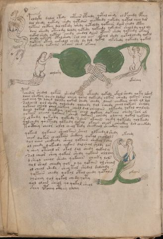

# Voynich Speculative Procedural Protocol — f83v

IMPORTANT: this is NOT a real or validated translation of the Voynich Manuscript. It is a speculative/procedural model that interprets EVA using a user-defined grammar to generate experimental recipes using safe, known edible substitutes.

This file is generated automatically from IVTFF/EVA transliteration plus a user-defined procedural grammar.



## Page / Folio
- currier: B
- folio: f83v
- page_number: 164
- section: biological

## EVA Text (Transliteration)
```text
poldaky dalol otedy chtair opchedy qotal chedy chepchedy opchey
dol shedy qokedy shedy qotedar checthedy qokedy qotal chey dar
qotain chcthy dal olkedy shedy qotaldy qokaiin dair shedy oteey
dain sheedy oteeody doldy qotedy qokeedy qokedar sheoldy qol oly
qokal shedy qotain chedy chedol daiin otaiin shedy qokeedy okaiin
chedy qoteedy otalshedy sol chl ?es okeol shedy qokolchedy qokal
qokeey oteey qokalol chedy dy dol qokal olkshedy qokeedy qokal
rolkeedy qokaiin okaiin ched okchey
ololary
okarchy
pchedar shedal qokar shedal okchdy qokedy okail shedy qoky lsheg
daiin shckhy qoeeo lldar cheey qoal qokeedy olkar sheedy qokain olal
qol chey qo lched qolky qokal chedy chedy daiin chckhy cheor ol lal
salched qol shedy qolchedy qolchdy qol rchedy cheol qokeor sholdy
qokaiin cheol shey qokeey cheol dal cheeaiin olkeedy qokal chaloly
daiin qokal sheckhey qokeey chal qokeey qokaiin chedy sar al
qokain cheeal qokaiin sheol qokear cheedy olcheey qokal qoka[?:n]y
s olkeedy qokeedy qokeedy saiin okaiin chedy qokeedy qolkeedy
qolchedy qolteedy qokeedy qokal okaiin chear checkhy dal checkhdy
tocthey cheor olol cheol tedy sheckhal sheeckhy cheal
qokeed qokaiin sheolkain sheol olkeedy l shedy
char qokar cheolkain shckhey qokal cheor ols
qol aiiin chckhedy sheol qokaiin shckhy lchey
ol cheedy qokeedy qokain dalshal shldy lor
y shey otechd ar okol dal shedy qokaly
sal chear shey qokar shedy qokain ollchy
dsheol cheol shedy qokaiin cheeky lols
qol shol cheedy qol oqo qokain olsheam
ol cheal shedy chey tal shedal dalshdy
qokaiin chedy qokal otal chedy qotals
oy[ch:sh]ey qol qokal chedy qoty
qol olain sheol qo qokal sheol
shey opchey cthey olohy
okchdy
okaiin
```

## Domain Context (Heuristic; Not a Translation)

This section summarizes recurring **basewords** in this IVTFF domain and shows simple substring evidence that the token markers used by the procedural grammar occur inside frequent words.

Any Italian anagram / English gloss is a best-effort lexicon match, not a decipherment.


### Associated basewords (non-generic; top by frequency in this domain)
- `qokep` (count=160) → Italian anagram `pecco`; English: [n/a]
- `qokain` (count=159) → Italian anagram `acconi`; English: [n/a]
- `qokal` (count=108) → Italian anagram `calco`; English: cast (of sculpture)
- `paiin` (count=82) → Italian anagram `piani`; English: plans (arrangements)
- `qokaiin` (count=81) → Italian anagram `ciancio`; English: [n/a]
- `qokar` (count=45) → Italian anagram `carco`; English: [n/a]
- `okain` (count=41) → Italian anagram `acino`; English: a berry
- `okaiin` (count=31) → Italian anagram `coniai`; English: [n/a]
- `saiin` (count=30) → Italian anagram `asini`; English: [n/a]
- `olkain` (count=26) → Italian anagram `alcino`; English: smart, clever, intelligent, bright
- `qotal` (count=25) → Italian anagram `colta`; English: [n/a]
- `olchep` (count=24) → Italian anagram `colpe`; English: [n/a]
- `otain` (count=23) → Italian anagram `anito`; English: [n/a]
- `qotain` (count=20) → Italian anagram `antico`; English: ancient
- `olkep` (count=20) → Italian anagram `colpe`; English: [n/a]

### Marker evidence (substring in frequent basewords)
- `qo`: 50 basewords; examples: `qokep`, `qokain`, `qokeep`, `qol`, `qokal`, `qokaiin`
- `q`: 51 basewords; examples: `qokep`, `qokain`, `qokeep`, `qol`, `qokal`, `qokaiin`
- `o`: 184 basewords; examples: `ol`, `qokep`, `qokain`, `qokeep`, `qol`, `qokal`
- `k`: 114 basewords; examples: `qokep`, `qokain`, `qokeep`, `qokal`, `qokaiin`, `qokee`
- `t`: 73 basewords; examples: `otep`, `qotep`, `qoteep`, `tep`, `qot`, `otal`
- `p`: 112 basewords; examples: `shep`, `chep`, `qokep`, `qokeep`, `paiin`, `p`
- `ch`: 104 basewords; examples: `chep`, `che`, `lchep`, `chee`, `chckh`, `cheol`
- `sh`: 43 basewords; examples: `shep`, `she`, `sheep`, `shee`, `sheol`, `shckh`
- `f`: 1 basewords; examples: `fchep`
- `cth`: 10 basewords; examples: `chcth`, `checth`, `shecth`, `shcth`, `cthep`, `cthe`
- `ckh`: 13 basewords; examples: `chckh`, `shckh`, `checkh`, `sheckh`, `chckhe`, `chckhp`
- `cph`: 2 basewords; examples: `cphe`, `cphol`
- `iin`: 26 basewords; examples: `paiin`, `qokaiin`, `aiin`, `okaiin`, `saiin`, `qotaiin`
- `aiin`: 19 basewords; examples: `paiin`, `qokaiin`, `aiin`, `okaiin`, `saiin`, `qotaiin`

## Recipes Index (This Page)
- [f83v.1,@P0](#f83v-1-f83v-1-p0)
- [f83v.2,+P0](#f83v-2-f83v-2-p0)
- [f83v.3,+P0](#f83v-3-f83v-3-p0)
- [f83v.4,+P0](#f83v-4-f83v-4-p0)
- [f83v.5,+P0](#f83v-5-f83v-5-p0)
- [f83v.6,+P0](#f83v-6-f83v-6-p0)
- [f83v.7,+P0](#f83v-7-f83v-7-p0)
- [f83v.8,+P0](#f83v-8-f83v-8-p0)
- [f83v.9,@Lt](#f83v-9-f83v-9-lt)
- [f83v.10,@Lt](#f83v-10-f83v-10-lt)
- [f83v.11,@P0](#f83v-11-f83v-11-p0)
- [f83v.12,+P0](#f83v-12-f83v-12-p0)
- [f83v.13,+P0](#f83v-13-f83v-13-p0)
- [f83v.14,+P0](#f83v-14-f83v-14-p0)
- [f83v.15,+P0](#f83v-15-f83v-15-p0)
- [f83v.16,+P0](#f83v-16-f83v-16-p0)
- [f83v.17,+P0](#f83v-17-f83v-17-p0)
- [f83v.18,+P0](#f83v-18-f83v-18-p0)
- [f83v.19,+P0](#f83v-19-f83v-19-p0)
- [f83v.20,+P0](#f83v-20-f83v-20-p0)
- [f83v.21,+P0](#f83v-21-f83v-21-p0)
- [f83v.22,+P0](#f83v-22-f83v-22-p0)
- [f83v.23,+P0](#f83v-23-f83v-23-p0)
- [f83v.24,+P0](#f83v-24-f83v-24-p0)
- [f83v.25,+P0](#f83v-25-f83v-25-p0)
- [f83v.26,+P0](#f83v-26-f83v-26-p0)
- [f83v.27,+P0](#f83v-27-f83v-27-p0)
- [f83v.28,+P0](#f83v-28-f83v-28-p0)
- [f83v.29,+P0](#f83v-29-f83v-29-p0)
- [f83v.30,+P0](#f83v-30-f83v-30-p0)
- [f83v.31,+P0](#f83v-31-f83v-31-p0)
- [f83v.32,+P0](#f83v-32-f83v-32-p0)
- [f83v.33,+P0](#f83v-33-f83v-33-p0)
- [f83v.34,@Ln](#f83v-34-f83v-34-ln)
- [f83v.35,@Lt](#f83v-35-f83v-35-lt)

## Line Glosses (Procedural Gloss Only; Not a Translation)

<a id="f83v-1-f83v-1-p0"></a>

### f83v.1,@P0

EVA (original line):
```text
poldaky dalol otedy chtair opchedy qotal chedy chepchedy opchey
```

English structural gloss (generated):

- poldaky: tokens: p o l p a k → connectors: l → vowel_run: a (level 1; class a)
- dalol: tokens: p a l o l → connectors: l l → vowel_run: a (level 1; class a)
- otedy: tokens: o t e p → vowel_run: e (level 1; class e)
- chtair: tokens: ch t a i r → connectors: r → vowel_run: a (level 1; class a)
- opchedy: tokens: o p ch e p → vowel_run: e (level 1; class e)
- qotal: tokens: qo t a l → connectors: l → vowel_run: a (level 1; class a) (lexicon-context: `qotal` → `colta`; [n/a])
- chedy: tokens: ch e p → vowel_run: e (level 1; class e)
- chepchedy: tokens: ch e p ch e p → vowel_run: e (level 1; class e)
- opchey: tokens: o p ch e → vowel_run: e (level 1; class e)

<a id="f83v-2-f83v-2-p0"></a>

### f83v.2,+P0

EVA (original line):
```text
dol shedy qokedy shedy qotedar checthedy qokedy qotal chey dar
```

English structural gloss (generated):

- dol: tokens: p o l → connectors: l
- shedy: tokens: sh e p → vowel_run: e (level 1; class e)
- qokedy: tokens: qo k e p → vowel_run: e (level 1; class e) (lexicon-context: `qokep` → `pecco`; [n/a])
- shedy: tokens: sh e p → vowel_run: e (level 1; class e)
- qotedar: tokens: qo t e p a r → connectors: r → vowel_run: e (level 1; class e)
- checthedy: tokens: ch e cth e p → vowel_run: e (level 1; class e)
- qokedy: tokens: qo k e p → vowel_run: e (level 1; class e) (lexicon-context: `qokep` → `pecco`; [n/a])
- qotal: tokens: qo t a l → connectors: l → vowel_run: a (level 1; class a) (lexicon-context: `qotal` → `colta`; [n/a])
- chey: tokens: ch e → vowel_run: e (level 1; class e)
- dar: tokens: p a r → connectors: r → vowel_run: a (level 1; class a)

<a id="f83v-3-f83v-3-p0"></a>

### f83v.3,+P0

EVA (original line):
```text
qotain chcthy dal olkedy shedy qotaldy qokaiin dair shedy oteey
```

English structural gloss (generated):

- qotain: tokens: qo t a i n → connectors: n → vowel_run: a (level 1; class a) (lexicon-context: `qotain` → `antico`; ancient)
- chcthy: tokens: ch cth
- dal: tokens: p a l → connectors: l → vowel_run: a (level 1; class a)
- olkedy: tokens: o l k e p → connectors: l → vowel_run: e (level 1; class e) (lexicon-context: `olkep` → `colpe`; [n/a])
- shedy: tokens: sh e p → vowel_run: e (level 1; class e)
- qotaldy: tokens: qo t a l p → connectors: l → vowel_run: a (level 1; class a) (lexicon-context: `qotal` → `colta`; [n/a])
- qokaiin: tokens: qo k aiin → vowel_run: a (level 1; class a) → suffix: aiin (lexicon-context: `qokaiin` → `conciai`; [n/a])
- dair: tokens: p a i r → connectors: r → vowel_run: a (level 1; class a)
- shedy: tokens: sh e p → vowel_run: e (level 1; class e)
- oteey: tokens: o t ee → vowel_run: ee (level 2; class e)

<a id="f83v-4-f83v-4-p0"></a>

### f83v.4,+P0

EVA (original line):
```text
dain sheedy oteeody doldy qotedy qokeedy qokedar sheoldy qol oly
```

English structural gloss (generated):

- dain: tokens: p a i n → connectors: n → vowel_run: a (level 1; class a)
- sheedy: tokens: sh ee p → vowel_run: ee (level 2; class e)
- oteeody: tokens: o t ee o p → vowel_run: ee (level 2; class e)
- doldy: tokens: p o l p → connectors: l
- qotedy: tokens: qo t e p → vowel_run: e (level 1; class e)
- qokeedy: tokens: qo k ee p → vowel_run: ee (level 2; class e)
- qokedar: tokens: qo k e p a r → connectors: r → vowel_run: e (level 1; class e) (lexicon-context: `qokep` → `pecco`; [n/a])
- sheoldy: tokens: sh e o l p → connectors: l → vowel_run: e (level 1; class e)
- qol: tokens: qo l → connectors: l
- oly: tokens: o l → connectors: l

<a id="f83v-5-f83v-5-p0"></a>

### f83v.5,+P0

EVA (original line):
```text
qokal shedy qotain chedy chedol daiin otaiin shedy qokeedy okaiin
```

English structural gloss (generated):

- qokal: tokens: qo k a l → connectors: l → vowel_run: a (level 1; class a) (lexicon-context: `qokal` → `calco`; cast (of sculpture))
- shedy: tokens: sh e p → vowel_run: e (level 1; class e)
- qotain: tokens: qo t a i n → connectors: n → vowel_run: a (level 1; class a) (lexicon-context: `qotain` → `antico`; ancient)
- chedy: tokens: ch e p → vowel_run: e (level 1; class e)
- chedol: tokens: ch e p o l → connectors: l → vowel_run: e (level 1; class e)
- daiin: tokens: p aiin → vowel_run: a (level 1; class a) → suffix: aiin (lexicon-context: `paiin` → `piani`; plans (arrangements))
- otaiin: tokens: o t aiin → vowel_run: a (level 1; class a) → suffix: aiin
- shedy: tokens: sh e p → vowel_run: e (level 1; class e)
- qokeedy: tokens: qo k ee p → vowel_run: ee (level 2; class e)
- okaiin: tokens: o k aiin → vowel_run: a (level 1; class a) → suffix: aiin (lexicon-context: `okaiin` → `coniai`; [n/a])

<a id="f83v-6-f83v-6-p0"></a>

### f83v.6,+P0

EVA (original line):
```text
chedy qoteedy otalshedy sol chl ?es okeol shedy qokolchedy qokal
```

English structural gloss (generated):

- chedy: tokens: ch e p → vowel_run: e (level 1; class e)
- qoteedy: tokens: qo t ee p → vowel_run: ee (level 2; class e)
- otalshedy: tokens: o t a l sh e p → connectors: l → vowel_run: a (level 1; class a)
- sol: tokens: s o l → connectors: s l
- chl: tokens: ch l → connectors: l
- es: tokens: e s → connectors: s → vowel_run: e (level 1; class e)
- okeol: tokens: o k e o l → connectors: l → vowel_run: e (level 1; class e)
- shedy: tokens: sh e p → vowel_run: e (level 1; class e)
- qokolchedy: tokens: qo k o l ch e p → connectors: l → vowel_run: e (level 1; class e) (lexicon-context: `olchep` → `colpe`; [n/a])
- qokal: tokens: qo k a l → connectors: l → vowel_run: a (level 1; class a) (lexicon-context: `qokal` → `calco`; cast (of sculpture))

<a id="f83v-7-f83v-7-p0"></a>

### f83v.7,+P0

EVA (original line):
```text
qokeey oteey qokalol chedy dy dol qokal olkshedy qokeedy qokal
```

English structural gloss (generated):

- qokeey: tokens: qo k ee → vowel_run: ee (level 2; class e)
- oteey: tokens: o t ee → vowel_run: ee (level 2; class e)
- qokalol: tokens: qo k a l o l → connectors: l l → vowel_run: a (level 1; class a) (lexicon-context: `qokal` → `calco`; cast (of sculpture))
- chedy: tokens: ch e p → vowel_run: e (level 1; class e)
- dy: tokens: p
- dol: tokens: p o l → connectors: l
- qokal: tokens: qo k a l → connectors: l → vowel_run: a (level 1; class a) (lexicon-context: `qokal` → `calco`; cast (of sculpture))
- olkshedy: tokens: o l k sh e p → connectors: l → vowel_run: e (level 1; class e)
- qokeedy: tokens: qo k ee p → vowel_run: ee (level 2; class e)
- qokal: tokens: qo k a l → connectors: l → vowel_run: a (level 1; class a) (lexicon-context: `qokal` → `calco`; cast (of sculpture))

<a id="f83v-8-f83v-8-p0"></a>

### f83v.8,+P0

EVA (original line):
```text
rolkeedy qokaiin okaiin ched okchey
```

English structural gloss (generated):

- rolkeedy: tokens: r o l k ee p → connectors: r l → vowel_run: ee (level 2; class e)
- qokaiin: tokens: qo k aiin → vowel_run: a (level 1; class a) → suffix: aiin (lexicon-context: `qokaiin` → `conciai`; [n/a])
- okaiin: tokens: o k aiin → vowel_run: a (level 1; class a) → suffix: aiin (lexicon-context: `okaiin` → `coniai`; [n/a])
- ched: tokens: ch e p → vowel_run: e (level 1; class e)
- okchey: tokens: o k ch e → vowel_run: e (level 1; class e)

<a id="f83v-9-f83v-9-lt"></a>

### f83v.9,@Lt

EVA (original line):
```text
ololary
```

English structural gloss (generated):

- ololary: tokens: o l o l a r → connectors: l l r → vowel_run: a (level 1; class a)

<a id="f83v-10-f83v-10-lt"></a>

### f83v.10,@Lt

EVA (original line):
```text
okarchy
```

English structural gloss (generated):

- okarchy: tokens: o k a r ch → connectors: r → vowel_run: a (level 1; class a)

<a id="f83v-11-f83v-11-p0"></a>

### f83v.11,@P0

EVA (original line):
```text
pchedar shedal qokar shedal okchdy qokedy okail shedy qoky lsheg
```

English structural gloss (generated):

- pchedar: tokens: p ch e p a r → connectors: r → vowel_run: e (level 1; class e) (lexicon-context: `chepar` → `capre`; [n/a])
- shedal: tokens: sh e p a l → connectors: l → vowel_run: e (level 1; class e)
- qokar: tokens: qo k a r → connectors: r → vowel_run: a (level 1; class a)
- shedal: tokens: sh e p a l → connectors: l → vowel_run: e (level 1; class e)
- okchdy: tokens: o k ch p
- qokedy: tokens: qo k e p → vowel_run: e (level 1; class e) (lexicon-context: `qokep` → `pecco`; [n/a])
- okail: tokens: o k a i l → connectors: l → vowel_run: a (level 1; class a)
- shedy: tokens: sh e p → vowel_run: e (level 1; class e)
- qoky: tokens: qo k
- lsheg: tokens: l sh e g → connectors: l → vowel_run: e (level 1; class e)

<a id="f83v-12-f83v-12-p0"></a>

### f83v.12,+P0

EVA (original line):
```text
daiin shckhy qoeeo lldar cheey qoal qokeedy olkar sheedy qokain olal
```

English structural gloss (generated):

- daiin: tokens: p aiin → vowel_run: a (level 1; class a) → suffix: aiin (lexicon-context: `paiin` → `piani`; plans (arrangements))
- shckhy: tokens: sh ckh
- qoeeo: tokens: qo ee o → vowel_run: ee (level 2; class e)
- lldar: tokens: l l p a r → connectors: l l r → vowel_run: a (level 1; class a)
- cheey: tokens: ch ee → vowel_run: ee (level 2; class e)
- qoal: tokens: qo a l → connectors: l → vowel_run: a (level 1; class a)
- qokeedy: tokens: qo k ee p → vowel_run: ee (level 2; class e)
- olkar: tokens: o l k a r → connectors: l r → vowel_run: a (level 1; class a)
- sheedy: tokens: sh ee p → vowel_run: ee (level 2; class e)
- qokain: tokens: qo k a i n → connectors: n → vowel_run: a (level 1; class a) (lexicon-context: `qokain` → `concia`; tanning)
- olal: tokens: o l a l → connectors: l l → vowel_run: a (level 1; class a)

<a id="f83v-13-f83v-13-p0"></a>

### f83v.13,+P0

EVA (original line):
```text
qol chey qo lched qolky qokal chedy chedy daiin chckhy cheor ol lal
```

English structural gloss (generated):

- qol: tokens: qo l → connectors: l
- chey: tokens: ch e → vowel_run: e (level 1; class e)
- qo: tokens: qo
- lched: tokens: l ch e p → connectors: l → vowel_run: e (level 1; class e)
- qolky: tokens: qo l k → connectors: l
- qokal: tokens: qo k a l → connectors: l → vowel_run: a (level 1; class a) (lexicon-context: `qokal` → `calco`; cast (of sculpture))
- chedy: tokens: ch e p → vowel_run: e (level 1; class e)
- chedy: tokens: ch e p → vowel_run: e (level 1; class e)
- daiin: tokens: p aiin → vowel_run: a (level 1; class a) → suffix: aiin (lexicon-context: `paiin` → `piani`; plans (arrangements))
- chckhy: tokens: ch ckh
- cheor: tokens: ch e o r → connectors: r → vowel_run: e (level 1; class e)
- ol: tokens: o l → connectors: l
- lal: tokens: l a l → connectors: l l → vowel_run: a (level 1; class a)

<a id="f83v-14-f83v-14-p0"></a>

### f83v.14,+P0

EVA (original line):
```text
salched qol shedy qolchedy qolchdy qol rchedy cheol qokeor sholdy
```

English structural gloss (generated):

- salched: tokens: s a l ch e p → connectors: s l → vowel_run: a (level 1; class a)
- qol: tokens: qo l → connectors: l
- shedy: tokens: sh e p → vowel_run: e (level 1; class e)
- qolchedy: tokens: qo l ch e p → connectors: l → vowel_run: e (level 1; class e) (lexicon-context: `olchep` → `colpe`; [n/a])
- qolchdy: tokens: qo l ch p → connectors: l
- qol: tokens: qo l → connectors: l
- rchedy: tokens: r ch e p → connectors: r → vowel_run: e (level 1; class e)
- cheol: tokens: ch e o l → connectors: l → vowel_run: e (level 1; class e)
- qokeor: tokens: qo k e o r → connectors: r → vowel_run: e (level 1; class e)
- sholdy: tokens: sh o l p → connectors: l

<a id="f83v-15-f83v-15-p0"></a>

### f83v.15,+P0

EVA (original line):
```text
qokaiin cheol shey qokeey cheol dal cheeaiin olkeedy qokal chaloly
```

English structural gloss (generated):

- qokaiin: tokens: qo k aiin → vowel_run: a (level 1; class a) → suffix: aiin (lexicon-context: `qokaiin` → `conciai`; [n/a])
- cheol: tokens: ch e o l → connectors: l → vowel_run: e (level 1; class e)
- shey: tokens: sh e → vowel_run: e (level 1; class e)
- qokeey: tokens: qo k ee → vowel_run: ee (level 2; class e)
- cheol: tokens: ch e o l → connectors: l → vowel_run: e (level 1; class e)
- dal: tokens: p a l → connectors: l → vowel_run: a (level 1; class a)
- cheeaiin: tokens: ch ee aiin → vowel_run: ee (level 2; class e) → suffix: aiin
- olkeedy: tokens: o l k ee p → connectors: l → vowel_run: ee (level 2; class e)
- qokal: tokens: qo k a l → connectors: l → vowel_run: a (level 1; class a) (lexicon-context: `qokal` → `calco`; cast (of sculpture))
- chaloly: tokens: ch a l o l → connectors: l l → vowel_run: a (level 1; class a)

<a id="f83v-16-f83v-16-p0"></a>

### f83v.16,+P0

EVA (original line):
```text
daiin qokal sheckhey qokeey chal qokeey qokaiin chedy sar al
```

English structural gloss (generated):

- daiin: tokens: p aiin → vowel_run: a (level 1; class a) → suffix: aiin (lexicon-context: `paiin` → `piani`; plans (arrangements))
- qokal: tokens: qo k a l → connectors: l → vowel_run: a (level 1; class a) (lexicon-context: `qokal` → `calco`; cast (of sculpture))
- sheckhey: tokens: sh e ckh e → vowel_run: e (level 1; class e)
- qokeey: tokens: qo k ee → vowel_run: ee (level 2; class e)
- chal: tokens: ch a l → connectors: l → vowel_run: a (level 1; class a)
- qokeey: tokens: qo k ee → vowel_run: ee (level 2; class e)
- qokaiin: tokens: qo k aiin → vowel_run: a (level 1; class a) → suffix: aiin (lexicon-context: `qokaiin` → `conciai`; [n/a])
- chedy: tokens: ch e p → vowel_run: e (level 1; class e)
- sar: tokens: s a r → connectors: s r → vowel_run: a (level 1; class a)
- al: tokens: a l → connectors: l → vowel_run: a (level 1; class a)

<a id="f83v-17-f83v-17-p0"></a>

### f83v.17,+P0

EVA (original line):
```text
qokain cheeal qokaiin sheol qokear cheedy olcheey qokal qoka[?:n]y
```

English structural gloss (generated):

- qokain: tokens: qo k a i n → connectors: n → vowel_run: a (level 1; class a) (lexicon-context: `qokain` → `concia`; tanning)
- cheeal: tokens: ch ee a l → connectors: l → vowel_run: ee (level 2; class e)
- qokaiin: tokens: qo k aiin → vowel_run: a (level 1; class a) → suffix: aiin (lexicon-context: `qokaiin` → `conciai`; [n/a])
- sheol: tokens: sh e o l → connectors: l → vowel_run: e (level 1; class e)
- qokear: tokens: qo k e a r → connectors: r → vowel_run: e (level 1; class e)
- cheedy: tokens: ch ee p → vowel_run: ee (level 2; class e)
- olcheey: tokens: o l ch ee → connectors: l → vowel_run: ee (level 2; class e)
- qokal: tokens: qo k a l → connectors: l → vowel_run: a (level 1; class a) (lexicon-context: `qokal` → `calco`; cast (of sculpture))
- qoka: tokens: qo k a → vowel_run: a (level 1; class a)
- n: tokens: n → connectors: n
- y: [unparsed]

<a id="f83v-18-f83v-18-p0"></a>

### f83v.18,+P0

EVA (original line):
```text
s olkeedy qokeedy qokeedy saiin okaiin chedy qokeedy qolkeedy
```

English structural gloss (generated):

- s: tokens: s → connectors: s
- olkeedy: tokens: o l k ee p → connectors: l → vowel_run: ee (level 2; class e)
- qokeedy: tokens: qo k ee p → vowel_run: ee (level 2; class e)
- qokeedy: tokens: qo k ee p → vowel_run: ee (level 2; class e)
- saiin: tokens: s aiin → connectors: s → vowel_run: a (level 1; class a) → suffix: aiin (lexicon-context: `saiin` → `asini`; [n/a])
- okaiin: tokens: o k aiin → vowel_run: a (level 1; class a) → suffix: aiin (lexicon-context: `okaiin` → `coniai`; [n/a])
- chedy: tokens: ch e p → vowel_run: e (level 1; class e)
- qokeedy: tokens: qo k ee p → vowel_run: ee (level 2; class e)
- qolkeedy: tokens: qo l k ee p → connectors: l → vowel_run: ee (level 2; class e)

<a id="f83v-19-f83v-19-p0"></a>

### f83v.19,+P0

EVA (original line):
```text
qolchedy qolteedy qokeedy qokal okaiin chear checkhy dal checkhdy
```

English structural gloss (generated):

- qolchedy: tokens: qo l ch e p → connectors: l → vowel_run: e (level 1; class e) (lexicon-context: `olchep` → `colpe`; [n/a])
- qolteedy: tokens: qo l t ee p → connectors: l → vowel_run: ee (level 2; class e)
- qokeedy: tokens: qo k ee p → vowel_run: ee (level 2; class e)
- qokal: tokens: qo k a l → connectors: l → vowel_run: a (level 1; class a) (lexicon-context: `qokal` → `calco`; cast (of sculpture))
- okaiin: tokens: o k aiin → vowel_run: a (level 1; class a) → suffix: aiin (lexicon-context: `okaiin` → `coniai`; [n/a])
- chear: tokens: ch e a r → connectors: r → vowel_run: e (level 1; class e)
- checkhy: tokens: ch e ckh → vowel_run: e (level 1; class e)
- dal: tokens: p a l → connectors: l → vowel_run: a (level 1; class a)
- checkhdy: tokens: ch e ckh p → vowel_run: e (level 1; class e)

<a id="f83v-20-f83v-20-p0"></a>

### f83v.20,+P0

EVA (original line):
```text
tocthey cheor olol cheol tedy sheckhal sheeckhy cheal
```

English structural gloss (generated):

- tocthey: tokens: t o cth e → vowel_run: e (level 1; class e)
- cheor: tokens: ch e o r → connectors: r → vowel_run: e (level 1; class e)
- olol: tokens: o l o l → connectors: l l
- cheol: tokens: ch e o l → connectors: l → vowel_run: e (level 1; class e)
- tedy: tokens: t e p → vowel_run: e (level 1; class e)
- sheckhal: tokens: sh e ckh a l → connectors: l → vowel_run: e (level 1; class e)
- sheeckhy: tokens: sh ee ckh → vowel_run: ee (level 2; class e)
- cheal: tokens: ch e a l → connectors: l → vowel_run: e (level 1; class e)

<a id="f83v-21-f83v-21-p0"></a>

### f83v.21,+P0

EVA (original line):
```text
qokeed qokaiin sheolkain sheol olkeedy l shedy
```

English structural gloss (generated):

- qokeed: tokens: qo k ee p → vowel_run: ee (level 2; class e)
- qokaiin: tokens: qo k aiin → vowel_run: a (level 1; class a) → suffix: aiin (lexicon-context: `qokaiin` → `conciai`; [n/a])
- sheolkain: tokens: sh e o l k a i n → connectors: l n → vowel_run: e (level 1; class e) (lexicon-context: `olkain` → `calino`; [n/a])
- sheol: tokens: sh e o l → connectors: l → vowel_run: e (level 1; class e)
- olkeedy: tokens: o l k ee p → connectors: l → vowel_run: ee (level 2; class e)
- l: tokens: l → connectors: l
- shedy: tokens: sh e p → vowel_run: e (level 1; class e)

<a id="f83v-22-f83v-22-p0"></a>

### f83v.22,+P0

EVA (original line):
```text
char qokar cheolkain shckhey qokal cheor ols
```

English structural gloss (generated):

- char: tokens: ch a r → connectors: r → vowel_run: a (level 1; class a)
- qokar: tokens: qo k a r → connectors: r → vowel_run: a (level 1; class a)
- cheolkain: tokens: ch e o l k a i n → connectors: l n → vowel_run: e (level 1; class e) (lexicon-context: `olkain` → `calino`; [n/a])
- shckhey: tokens: sh ckh e → vowel_run: e (level 1; class e)
- qokal: tokens: qo k a l → connectors: l → vowel_run: a (level 1; class a) (lexicon-context: `qokal` → `calco`; cast (of sculpture))
- cheor: tokens: ch e o r → connectors: r → vowel_run: e (level 1; class e)
- ols: tokens: o l s → connectors: l s

<a id="f83v-23-f83v-23-p0"></a>

### f83v.23,+P0

EVA (original line):
```text
qol aiiin chckhedy sheol qokaiin shckhy lchey
```

English structural gloss (generated):

- qol: tokens: qo l → connectors: l
- aiiin: tokens: a iii n → connectors: n → vowel_run: a (level 1; class a) → suffix: iin
- chckhedy: tokens: ch ckh e p → vowel_run: e (level 1; class e)
- sheol: tokens: sh e o l → connectors: l → vowel_run: e (level 1; class e)
- qokaiin: tokens: qo k aiin → vowel_run: a (level 1; class a) → suffix: aiin (lexicon-context: `qokaiin` → `conciai`; [n/a])
- shckhy: tokens: sh ckh
- lchey: tokens: l ch e → connectors: l → vowel_run: e (level 1; class e)

<a id="f83v-24-f83v-24-p0"></a>

### f83v.24,+P0

EVA (original line):
```text
ol cheedy qokeedy qokain dalshal shldy lor
```

English structural gloss (generated):

- ol: tokens: o l → connectors: l
- cheedy: tokens: ch ee p → vowel_run: ee (level 2; class e)
- qokeedy: tokens: qo k ee p → vowel_run: ee (level 2; class e)
- qokain: tokens: qo k a i n → connectors: n → vowel_run: a (level 1; class a) (lexicon-context: `qokain` → `concia`; tanning)
- dalshal: tokens: p a l sh a l → connectors: l l → vowel_run: a (level 1; class a)
- shldy: tokens: sh l p → connectors: l
- lor: tokens: l o r → connectors: l r

<a id="f83v-25-f83v-25-p0"></a>

### f83v.25,+P0

EVA (original line):
```text
y shey otechd ar okol dal shedy qokaly
```

English structural gloss (generated):

- y: [unparsed]
- shey: tokens: sh e → vowel_run: e (level 1; class e)
- otechd: tokens: o t e ch p → vowel_run: e (level 1; class e)
- ar: tokens: a r → connectors: r → vowel_run: a (level 1; class a)
- okol: tokens: o k o l → connectors: l
- dal: tokens: p a l → connectors: l → vowel_run: a (level 1; class a)
- shedy: tokens: sh e p → vowel_run: e (level 1; class e)
- qokaly: tokens: qo k a l → connectors: l → vowel_run: a (level 1; class a) (lexicon-context: `qokal` → `calco`; cast (of sculpture))

<a id="f83v-26-f83v-26-p0"></a>

### f83v.26,+P0

EVA (original line):
```text
sal chear shey qokar shedy qokain ollchy
```

English structural gloss (generated):

- sal: tokens: s a l → connectors: s l → vowel_run: a (level 1; class a)
- chear: tokens: ch e a r → connectors: r → vowel_run: e (level 1; class e)
- shey: tokens: sh e → vowel_run: e (level 1; class e)
- qokar: tokens: qo k a r → connectors: r → vowel_run: a (level 1; class a)
- shedy: tokens: sh e p → vowel_run: e (level 1; class e)
- qokain: tokens: qo k a i n → connectors: n → vowel_run: a (level 1; class a) (lexicon-context: `qokain` → `concia`; tanning)
- ollchy: tokens: o l l ch → connectors: l l

<a id="f83v-27-f83v-27-p0"></a>

### f83v.27,+P0

EVA (original line):
```text
dsheol cheol shedy qokaiin cheeky lols
```

English structural gloss (generated):

- dsheol: tokens: p sh e o l → connectors: l → vowel_run: e (level 1; class e)
- cheol: tokens: ch e o l → connectors: l → vowel_run: e (level 1; class e)
- shedy: tokens: sh e p → vowel_run: e (level 1; class e)
- qokaiin: tokens: qo k aiin → vowel_run: a (level 1; class a) → suffix: aiin (lexicon-context: `qokaiin` → `conciai`; [n/a])
- cheeky: tokens: ch ee k → vowel_run: ee (level 2; class e)
- lols: tokens: l o l s → connectors: l l s

<a id="f83v-28-f83v-28-p0"></a>

### f83v.28,+P0

EVA (original line):
```text
qol shol cheedy qol oqo qokain olsheam
```

English structural gloss (generated):

- qol: tokens: qo l → connectors: l
- shol: tokens: sh o l → connectors: l
- cheedy: tokens: ch ee p → vowel_run: ee (level 2; class e)
- qol: tokens: qo l → connectors: l
- oqo: tokens: o qo
- qokain: tokens: qo k a i n → connectors: n → vowel_run: a (level 1; class a) (lexicon-context: `qokain` → `concia`; tanning)
- olsheam: tokens: o l sh e a m → connectors: l m → vowel_run: e (level 1; class e)

<a id="f83v-29-f83v-29-p0"></a>

### f83v.29,+P0

EVA (original line):
```text
ol cheal shedy chey tal shedal dalshdy
```

English structural gloss (generated):

- ol: tokens: o l → connectors: l
- cheal: tokens: ch e a l → connectors: l → vowel_run: e (level 1; class e)
- shedy: tokens: sh e p → vowel_run: e (level 1; class e)
- chey: tokens: ch e → vowel_run: e (level 1; class e)
- tal: tokens: t a l → connectors: l → vowel_run: a (level 1; class a)
- shedal: tokens: sh e p a l → connectors: l → vowel_run: e (level 1; class e)
- dalshdy: tokens: p a l sh p → connectors: l → vowel_run: a (level 1; class a)

<a id="f83v-30-f83v-30-p0"></a>

### f83v.30,+P0

EVA (original line):
```text
qokaiin chedy qokal otal chedy qotals
```

English structural gloss (generated):

- qokaiin: tokens: qo k aiin → vowel_run: a (level 1; class a) → suffix: aiin (lexicon-context: `qokaiin` → `conciai`; [n/a])
- chedy: tokens: ch e p → vowel_run: e (level 1; class e)
- qokal: tokens: qo k a l → connectors: l → vowel_run: a (level 1; class a) (lexicon-context: `qokal` → `calco`; cast (of sculpture))
- otal: tokens: o t a l → connectors: l → vowel_run: a (level 1; class a)
- chedy: tokens: ch e p → vowel_run: e (level 1; class e)
- qotals: tokens: qo t a l s → connectors: l s → vowel_run: a (level 1; class a) (lexicon-context: `qotal` → `colta`; [n/a])

<a id="f83v-31-f83v-31-p0"></a>

### f83v.31,+P0

EVA (original line):
```text
oy[ch:sh]ey qol qokal chedy qoty
```

English structural gloss (generated):

- oy: tokens: o
- ch: tokens: ch
- sh: tokens: sh
- ey: tokens: e → vowel_run: e (level 1; class e)
- qol: tokens: qo l → connectors: l
- qokal: tokens: qo k a l → connectors: l → vowel_run: a (level 1; class a) (lexicon-context: `qokal` → `calco`; cast (of sculpture))
- chedy: tokens: ch e p → vowel_run: e (level 1; class e)
- qoty: tokens: qo t

<a id="f83v-32-f83v-32-p0"></a>

### f83v.32,+P0

EVA (original line):
```text
qol olain sheol qo qokal sheol
```

English structural gloss (generated):

- qol: tokens: qo l → connectors: l
- olain: tokens: o l a i n → connectors: l n → vowel_run: a (level 1; class a)
- sheol: tokens: sh e o l → connectors: l → vowel_run: e (level 1; class e)
- qo: tokens: qo
- qokal: tokens: qo k a l → connectors: l → vowel_run: a (level 1; class a) (lexicon-context: `qokal` → `calco`; cast (of sculpture))
- sheol: tokens: sh e o l → connectors: l → vowel_run: e (level 1; class e)

<a id="f83v-33-f83v-33-p0"></a>

### f83v.33,+P0

EVA (original line):
```text
shey opchey cthey olohy
```

English structural gloss (generated):

- shey: tokens: sh e → vowel_run: e (level 1; class e)
- opchey: tokens: o p ch e → vowel_run: e (level 1; class e)
- cthey: tokens: cth e → vowel_run: e (level 1; class e)
- olohy: tokens: o l o h → connectors: l → unmodeled_tokens: h

<a id="f83v-34-f83v-34-ln"></a>

### f83v.34,@Ln

EVA (original line):
```text
okchdy
```

English structural gloss (generated):

- okchdy: tokens: o k ch p

<a id="f83v-35-f83v-35-lt"></a>

### f83v.35,@Lt

EVA (original line):
```text
okaiin
```

English structural gloss (generated):

- okaiin: tokens: o k aiin → vowel_run: a (level 1; class a) → suffix: aiin (lexicon-context: `okaiin` → `coniai`; [n/a])
