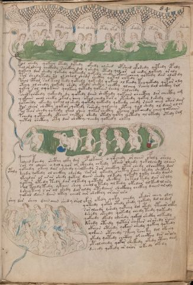

# Voynich Speculative Procedural Protocol — f84r

IMPORTANT: this is NOT a real or validated translation of the Voynich Manuscript. It is a speculative/procedural model that interprets EVA using a user-defined grammar to generate experimental recipes using safe, known edible substitutes.

This file is generated automatically from IVTFF/EVA transliteration plus a user-defined procedural grammar.



## Page / Folio
- currier: B
- folio: f84r
- page_number: 165
- section: biological

## EVA Text (Transliteration)
```text
ololal
or shekar
ydy
okedy
loly
doiir
olshy
otedy
lkol
okolshy
otoly
dshedy
kol chedy qokeey otedy dytedy okeedy olshed opshed ykshedy qotedy opoly
tol or sheey chckhdy schckhy dal y shedy otedy qol or ol eedy qokeey or oly
qokeey dar shedy qokedy qokeedy qokedy chedy okain chey qokedy dar olardy
tor shedytedy o'l ol cheol shedy shckhy qokal olkedy
pchol cphol sol teol tedy qotedy qokeedy qokeey ol keedy teyqokedy qopor oly
otchy olshedy qokedy shedy okedy shckhy chckhy olchey schey dal chckhy ral
qokey sol yqokain qolkeey qotedy qokain shedy salchedy
psholpchcfhdy qokeedy dy qokedy daiin shckhedy qokaiin checthy dar checthy am
qokaiin chol cheky okal y chey okal chedy tor y otshedy qokey l shedy
qotchsdy ykeedy qokal ol shedy qokedy qokeedy qokeedy chedy raiin chey otar dar
dar sheor shcthy qokeor qotedy rshedy qolchey oteey qol shedy ol dain ol or
pol tar shedy qokedy okal shey qokar chckhy otchey qokchedy chey qokaiin
pchedy qotchedy otaiiin chcthy shedy otedy qoty qotedy ol okedy otedy ram
qotol shcthhy oty dar shcthy schdy qokeedy olkey
p[a:o]lchd @146;chedy shcthy olky dar opalkaiin o qofchedy or aiiin ofoly oroly
sar ol olaiin y qol y qor or ckhedy chkedy okain shedy qokolchedy olain
qokeedy okeey dar olchedy qsolkeedy rar checkhy otar chedy olchcthy lor
dchdy qokedy ol chckhy olchdy sar or ykeedy chetey rain shedy shekam
ykchdar or arar shedy qokal daiin shedy olkedy qokedy qoky chedy daiin
qotar ytedy tedy dar olkedy qotedy shckhy chtol tedy dar or oly
shol tchdy tedy ykain shey cheol y tedy ol kedy okedar ol keed ol ary
dsheyteey sor ol shedy daraldy otedaiin shckhchy chckhy daiin aryly
qokal daiin dain otey cheor air shckhy or air oro
shey dar shey dain aiin shedy orol ykar okedy qoky chedy okedar chey alol
qoteedy qokol otedy shedy qokeedy dal ol dam
s or olchdy lshedy qokchy dol otedy ytchor olky
dshedy sheedy qokedy chedy teedy qokeedy
qokeedy dkedy olshedy qokal shckhy olkeedy
dsheedy oteedy qotar chekar orshedy saiin
okaiin otchdy qokain shedy qokeey qotedy
qokain otchedy skeey rcheky dal okeedy
ykedy qotedy chcthy ol chcthy dar ar ory
yteolchedy qokor shekedy okedy cthhy dam
d[ch:?]edy qokedy ar oror okedy okedy
otaly
```

## Domain Context (Heuristic; Not a Translation)

This section summarizes recurring **basewords** in this IVTFF domain and shows simple substring evidence that the token markers used by the procedural grammar occur inside frequent words.

Any Italian anagram / English gloss is a best-effort lexicon match, not a decipherment.


### Associated basewords (non-generic; top by frequency in this domain)
- `qokain` (count=158) → Italian anagram `acconi`; English: [n/a]
- `qokal` (count=102) → Italian anagram `calco`; English: cast (of sculpture)
- `daiin` (count=81) → Italian anagram `piani`; English: plans (arrangements)
- `qokaiin` (count=81) → Italian anagram `ciancio`; English: [n/a]
- `qokar` (count=45) → Italian anagram `carco`; English: [n/a]
- `okain` (count=40) → Italian anagram `acino`; English: a berry
- `okaiin` (count=31) → Italian anagram `coniai`; English: [n/a]
- `saiin` (count=30) → Italian anagram `asini`; English: [n/a]
- `olkain` (count=26) → Italian anagram `alcino`; English: smart, clever, intelligent, bright
- `qotal` (count=25) → Italian anagram `colta`; English: [n/a]
- `otain` (count=23) → Italian anagram `anito`; English: [n/a]
- `qotain` (count=20) → Italian anagram `antico`; English: ancient
- `qotar` (count=16) → Italian anagram `corta`; English: [n/a]
- `qotaiin` (count=13) → Italian anagram `cationi`; English: [n/a]
- `kaiin` (count=7) → Italian anagram `acini`; English: [n/a]

### Marker evidence (substring in frequent basewords)
- `qo`: 49 basewords; examples: `qokain`, `qokedy`, `qokeedy`, `qol`, `qokal`, `qokaiin`
- `q`: 50 basewords; examples: `qokain`, `qokedy`, `qokeedy`, `qol`, `qokal`, `qokaiin`
- `o`: 173 basewords; examples: `ol`, `qokain`, `qokedy`, `qokeedy`, `qol`, `qokal`
- `k`: 114 basewords; examples: `qokain`, `qokedy`, `qokeedy`, `qokal`, `qokaiin`, `qokeey`
- `t`: 77 basewords; examples: `otedy`, `qotedy`, `qoteedy`, `qoty`, `qotal`, `otain`
- `p`: 11 basewords; examples: `pchedy`, `opchedy`, `pol`, `qopchedy`, `pchedar`, `opchey`
- `ch`: 93 basewords; examples: `chedy`, `chey`, `lchedy`, `cheey`, `chckhy`, `cheol`
- `sh`: 41 basewords; examples: `shedy`, `shey`, `sheedy`, `sheey`, `sheol`, `shckhy`
- `cth`: 9 basewords; examples: `chcthy`, `checthy`, `shcthy`, `shecthy`, `cthedy`, `cthey`
- `ckh`: 12 basewords; examples: `chckhy`, `shckhy`, `checkhy`, `sheckhy`, `chckhey`, `chckhdy`
- `cph`: 1 basewords; examples: `cphol`
- `dy`: 63 basewords; examples: `shedy`, `chedy`, `qokedy`, `qokeedy`, `dy`, `lchedy`
- `iin`: 27 basewords; examples: `daiin`, `qokaiin`, `aiin`, `okaiin`, `saiin`, `qotaiin`
- `aiin`: 21 basewords; examples: `daiin`, `qokaiin`, `aiin`, `okaiin`, `saiin`, `qotaiin`

## Recipes Index (This Page)
- [f84r.1,@Lt](#f84r-1-f84r-1-lt)
- [f84r.2,@Ln](#f84r-2-f84r-2-ln)
- [f84r.3,+Ln](#f84r-3-f84r-3-ln)
- [f84r.4,@Ln](#f84r-4-f84r-4-ln)
- [f84r.5,=Ln](#f84r-5-f84r-5-ln)
- [f84r.6,@Ln](#f84r-6-f84r-6-ln)
- [f84r.7,=Ln](#f84r-7-f84r-7-ln)
- [f84r.8,@Ln](#f84r-8-f84r-8-ln)
- [f84r.9,=Ln](#f84r-9-f84r-9-ln)
- [f84r.10,@Ln](#f84r-10-f84r-10-ln)
- [f84r.11,@Ln](#f84r-11-f84r-11-ln)
- [f84r.12,@Ln](#f84r-12-f84r-12-ln)
- [f84r.13,@P0](#f84r-13-f84r-13-p0)
- [f84r.14,+P0](#f84r-14-f84r-14-p0)
- [f84r.15,+P0](#f84r-15-f84r-15-p0)
- [f84r.16,+P0](#f84r-16-f84r-16-p0)
- [f84r.17,+P0](#f84r-17-f84r-17-p0)
- [f84r.18,+P0](#f84r-18-f84r-18-p0)
- [f84r.19,+P0](#f84r-19-f84r-19-p0)
- [f84r.20,+P0](#f84r-20-f84r-20-p0)
- [f84r.21,+P0](#f84r-21-f84r-21-p0)
- [f84r.22,+P0](#f84r-22-f84r-22-p0)
- [f84r.23,+P0](#f84r-23-f84r-23-p0)
- [f84r.24,+P0](#f84r-24-f84r-24-p0)
- [f84r.25,+P0](#f84r-25-f84r-25-p0)
- [f84r.26,+P0](#f84r-26-f84r-26-p0)
- [f84r.27,+P0](#f84r-27-f84r-27-p0)
- [f84r.28,+P0](#f84r-28-f84r-28-p0)
- [f84r.29,+P0](#f84r-29-f84r-29-p0)
- [f84r.30,+P0](#f84r-30-f84r-30-p0)
- [f84r.31,+P0](#f84r-31-f84r-31-p0)
- [f84r.32,+P0](#f84r-32-f84r-32-p0)
- [f84r.33,+P0](#f84r-33-f84r-33-p0)
- [f84r.34,+P0](#f84r-34-f84r-34-p0)
- [f84r.35,+P0](#f84r-35-f84r-35-p0)
- [f84r.36,+P0](#f84r-36-f84r-36-p0)
- [f84r.37,@P1](#f84r-37-f84r-37-p1)
- [f84r.38,+P1](#f84r-38-f84r-38-p1)
- [f84r.39,+P1](#f84r-39-f84r-39-p1)
- [f84r.40,+P1](#f84r-40-f84r-40-p1)
- [f84r.41,+P1](#f84r-41-f84r-41-p1)
- [f84r.42,+P1](#f84r-42-f84r-42-p1)
- [f84r.43,+P1](#f84r-43-f84r-43-p1)
- [f84r.44,+P1](#f84r-44-f84r-44-p1)
- [f84r.45,+P1](#f84r-45-f84r-45-p1)
- [f84r.46,+P1](#f84r-46-f84r-46-p1)
- [f84r.47,@Lt](#f84r-47-f84r-47-lt)

## Line Glosses (Procedural Gloss Only; Not a Translation)

<a id="f84r-1-f84r-1-lt"></a>

### f84r.1,@Lt

EVA: ololal

Direct Gloss (Procedural, Not a Real Translation):
- ololal: tokens: o l o l a l → connectors: l l l → vowel_run: a (level 1; class a)

<a id="f84r-2-f84r-2-ln"></a>

### f84r.2,@Ln

EVA: or shekar

Direct Gloss (Procedural, Not a Real Translation):
- or: tokens: o r → connectors: r
- shekar: tokens: sh e k a r → connectors: r → vowel_run: e (level 1; class e)

<a id="f84r-3-f84r-3-ln"></a>

### f84r.3,+Ln

EVA: ydy

Direct Gloss (Procedural, Not a Real Translation):
- ydy: tokens: p

<a id="f84r-4-f84r-4-ln"></a>

### f84r.4,@Ln

EVA: okedy

Direct Gloss (Procedural, Not a Real Translation):
- okedy: tokens: o k e p → vowel_run: e (level 1; class e)

<a id="f84r-5-f84r-5-ln"></a>

### f84r.5,=Ln

EVA: loly

Direct Gloss (Procedural, Not a Real Translation):
- loly: tokens: l o l → connectors: l l

<a id="f84r-6-f84r-6-ln"></a>

### f84r.6,@Ln

EVA: doiir

Direct Gloss (Procedural, Not a Real Translation):
- doiir: tokens: p o ii r → connectors: r → vowel_run: ii (level 2; class i)

<a id="f84r-7-f84r-7-ln"></a>

### f84r.7,=Ln

EVA: olshy

Direct Gloss (Procedural, Not a Real Translation):
- olshy: tokens: o l sh → connectors: l

<a id="f84r-8-f84r-8-ln"></a>

### f84r.8,@Ln

EVA: otedy

Direct Gloss (Procedural, Not a Real Translation):
- otedy: tokens: o t e p → vowel_run: e (level 1; class e)

<a id="f84r-9-f84r-9-ln"></a>

### f84r.9,=Ln

EVA: lkol

Direct Gloss (Procedural, Not a Real Translation):
- lkol: tokens: l k o l → connectors: l l

<a id="f84r-10-f84r-10-ln"></a>

### f84r.10,@Ln

EVA: okolshy

Direct Gloss (Procedural, Not a Real Translation):
- okolshy: tokens: o k o l sh → connectors: l

<a id="f84r-11-f84r-11-ln"></a>

### f84r.11,@Ln

EVA: otoly

Direct Gloss (Procedural, Not a Real Translation):
- otoly: tokens: o t o l → connectors: l

<a id="f84r-12-f84r-12-ln"></a>

### f84r.12,@Ln

EVA: dshedy

Direct Gloss (Procedural, Not a Real Translation):
- dshedy: tokens: p sh e p → vowel_run: e (level 1; class e)

<a id="f84r-13-f84r-13-p0"></a>

### f84r.13,@P0

EVA: kol chedy qokeey otedy dytedy okeedy olshed opshed ykshedy qotedy opoly

Direct Gloss (Procedural, Not a Real Translation):
- kol: tokens: k o l → connectors: l
- chedy: tokens: ch e p → vowel_run: e (level 1; class e)
- qokeey: tokens: qo k ee → vowel_run: ee (level 2; class e)
- otedy: tokens: o t e p → vowel_run: e (level 1; class e)
- dytedy: tokens: p t e p → vowel_run: e (level 1; class e)
- okeedy: tokens: o k ee p → vowel_run: ee (level 2; class e)
- olshed: tokens: o l sh e p → connectors: l → vowel_run: e (level 1; class e)
- opshed: tokens: o p sh e p → vowel_run: e (level 1; class e)
- ykshedy: tokens: k sh e p → vowel_run: e (level 1; class e)
- qotedy: tokens: qo t e p → vowel_run: e (level 1; class e)
- opoly: tokens: o p o l → connectors: l

<a id="f84r-14-f84r-14-p0"></a>

### f84r.14,+P0

EVA: tol or sheey chckhdy schckhy dal y shedy otedy qol or ol eedy qokeey or oly

Direct Gloss (Procedural, Not a Real Translation):
- tol: tokens: t o l → connectors: l
- or: tokens: o r → connectors: r
- sheey: tokens: sh ee → vowel_run: ee (level 2; class e)
- chckhdy: tokens: ch ckh p
- schckhy: tokens: s ch ckh → connectors: s
- dal: tokens: p a l → connectors: l → vowel_run: a (level 1; class a)
- y: [unparsed]
- shedy: tokens: sh e p → vowel_run: e (level 1; class e)
- otedy: tokens: o t e p → vowel_run: e (level 1; class e)
- qol: tokens: qo l → connectors: l
- or: tokens: o r → connectors: r
- ol: tokens: o l → connectors: l
- eedy: tokens: ee p → vowel_run: ee (level 2; class e)
- qokeey: tokens: qo k ee → vowel_run: ee (level 2; class e)
- or: tokens: o r → connectors: r
- oly: tokens: o l → connectors: l

<a id="f84r-15-f84r-15-p0"></a>

### f84r.15,+P0

EVA: qokeey dar shedy qokedy qokeedy qokedy chedy okain chey qokedy dar olardy

Direct Gloss (Procedural, Not a Real Translation):
- qokeey: tokens: qo k ee → vowel_run: ee (level 2; class e)
- dar: tokens: p a r → connectors: r → vowel_run: a (level 1; class a)
- shedy: tokens: sh e p → vowel_run: e (level 1; class e)
- qokedy: tokens: qo k e p → vowel_run: e (level 1; class e)
- qokeedy: tokens: qo k ee p → vowel_run: ee (level 2; class e)
- qokedy: tokens: qo k e p → vowel_run: e (level 1; class e)
- chedy: tokens: ch e p → vowel_run: e (level 1; class e)
- okain: tokens: o k a i n → connectors: n → vowel_run: a (level 1; class a) (lexicon-context: `okain` → `acino`; a berry)
- chey: tokens: ch e → vowel_run: e (level 1; class e)
- qokedy: tokens: qo k e p → vowel_run: e (level 1; class e)
- dar: tokens: p a r → connectors: r → vowel_run: a (level 1; class a)
- olardy: tokens: o l a r p → connectors: l r → vowel_run: a (level 1; class a)

<a id="f84r-16-f84r-16-p0"></a>

### f84r.16,+P0

EVA: tor shedytedy o'l ol cheol shedy shckhy qokal olkedy

Direct Gloss (Procedural, Not a Real Translation):
- tor: tokens: t o r → connectors: r
- shedytedy: tokens: sh e p t e p → vowel_run: e (level 1; class e)
- o: tokens: o
- l: tokens: l → connectors: l
- ol: tokens: o l → connectors: l
- cheol: tokens: ch e o l → connectors: l → vowel_run: e (level 1; class e)
- shedy: tokens: sh e p → vowel_run: e (level 1; class e)
- shckhy: tokens: sh ckh
- qokal: tokens: qo k a l → connectors: l → vowel_run: a (level 1; class a) (lexicon-context: `qokal` → `calco`; cast (of sculpture))
- olkedy: tokens: o l k e p → connectors: l → vowel_run: e (level 1; class e)

<a id="f84r-17-f84r-17-p0"></a>

### f84r.17,+P0

EVA: pchol cphol sol teol tedy qotedy qokeedy qokeey ol keedy teyqokedy qopor oly

Direct Gloss (Procedural, Not a Real Translation):
- pchol: tokens: p ch o l → connectors: l
- cphol: tokens: cph o l → connectors: l
- sol: tokens: s o l → connectors: s l
- teol: tokens: t e o l → connectors: l → vowel_run: e (level 1; class e)
- tedy: tokens: t e p → vowel_run: e (level 1; class e)
- qotedy: tokens: qo t e p → vowel_run: e (level 1; class e)
- qokeedy: tokens: qo k ee p → vowel_run: ee (level 2; class e)
- qokeey: tokens: qo k ee → vowel_run: ee (level 2; class e)
- ol: tokens: o l → connectors: l
- keedy: tokens: k ee p → vowel_run: ee (level 2; class e)
- teyqokedy: tokens: t e qo k e p → vowel_run: e (level 1; class e)
- qopor: tokens: qo p o r → connectors: r
- oly: tokens: o l → connectors: l

<a id="f84r-18-f84r-18-p0"></a>

### f84r.18,+P0

EVA: otchy olshedy qokedy shedy okedy shckhy chckhy olchey schey dal chckhy ral

Direct Gloss (Procedural, Not a Real Translation):
- otchy: tokens: o t ch
- olshedy: tokens: o l sh e p → connectors: l → vowel_run: e (level 1; class e)
- qokedy: tokens: qo k e p → vowel_run: e (level 1; class e)
- shedy: tokens: sh e p → vowel_run: e (level 1; class e)
- okedy: tokens: o k e p → vowel_run: e (level 1; class e)
- shckhy: tokens: sh ckh
- chckhy: tokens: ch ckh
- olchey: tokens: o l ch e → connectors: l → vowel_run: e (level 1; class e)
- schey: tokens: s ch e → connectors: s → vowel_run: e (level 1; class e)
- dal: tokens: p a l → connectors: l → vowel_run: a (level 1; class a)
- chckhy: tokens: ch ckh
- ral: tokens: r a l → connectors: r l → vowel_run: a (level 1; class a)

<a id="f84r-19-f84r-19-p0"></a>

### f84r.19,+P0

EVA: qokey sol yqokain qolkeey qotedy qokain shedy salchedy

Direct Gloss (Procedural, Not a Real Translation):
- qokey: tokens: qo k e → vowel_run: e (level 1; class e)
- sol: tokens: s o l → connectors: s l
- yqokain: tokens: qo k a i n → connectors: n → vowel_run: a (level 1; class a) (lexicon-context: `qokain` → `acconi`; [n/a])
- qolkeey: tokens: qo l k ee → connectors: l → vowel_run: ee (level 2; class e)
- qotedy: tokens: qo t e p → vowel_run: e (level 1; class e)
- qokain: tokens: qo k a i n → connectors: n → vowel_run: a (level 1; class a) (lexicon-context: `qokain` → `acconi`; [n/a])
- shedy: tokens: sh e p → vowel_run: e (level 1; class e)
- salchedy: tokens: s a l ch e p → connectors: s l → vowel_run: a (level 1; class a)

<a id="f84r-20-f84r-20-p0"></a>

### f84r.20,+P0

EVA: psholpchcfhdy qokeedy dy qokedy daiin shckhedy qokaiin checthy dar checthy am

Direct Gloss (Procedural, Not a Real Translation):
- psholpchcfhdy: tokens: p sh o l p ch cfh p → connectors: l
- qokeedy: tokens: qo k ee p → vowel_run: ee (level 2; class e)
- dy: tokens: p
- qokedy: tokens: qo k e p → vowel_run: e (level 1; class e)
- daiin: tokens: p aiin → vowel_run: a (level 1; class a) → suffix: aiin (lexicon-context: `daiin` → `piani`; plans (arrangements))
- shckhedy: tokens: sh ckh e p → vowel_run: e (level 1; class e)
- qokaiin: tokens: qo k aiin → vowel_run: a (level 1; class a) → suffix: aiin (lexicon-context: `qokaiin` → `ciancio`; [n/a])
- checthy: tokens: ch e cth → vowel_run: e (level 1; class e)
- dar: tokens: p a r → connectors: r → vowel_run: a (level 1; class a)
- checthy: tokens: ch e cth → vowel_run: e (level 1; class e)
- am: tokens: a m → connectors: m → vowel_run: a (level 1; class a)

<a id="f84r-21-f84r-21-p0"></a>

### f84r.21,+P0

EVA: qokaiin chol cheky okal y chey okal chedy tor y otshedy qokey l shedy

Direct Gloss (Procedural, Not a Real Translation):
- qokaiin: tokens: qo k aiin → vowel_run: a (level 1; class a) → suffix: aiin (lexicon-context: `qokaiin` → `ciancio`; [n/a])
- chol: tokens: ch o l → connectors: l
- cheky: tokens: ch e k → vowel_run: e (level 1; class e)
- okal: tokens: o k a l → connectors: l → vowel_run: a (level 1; class a)
- y: [unparsed]
- chey: tokens: ch e → vowel_run: e (level 1; class e)
- okal: tokens: o k a l → connectors: l → vowel_run: a (level 1; class a)
- chedy: tokens: ch e p → vowel_run: e (level 1; class e)
- tor: tokens: t o r → connectors: r
- y: [unparsed]
- otshedy: tokens: o t sh e p → vowel_run: e (level 1; class e)
- qokey: tokens: qo k e → vowel_run: e (level 1; class e)
- l: tokens: l → connectors: l
- shedy: tokens: sh e p → vowel_run: e (level 1; class e)

<a id="f84r-22-f84r-22-p0"></a>

### f84r.22,+P0

EVA: qotchsdy ykeedy qokal ol shedy qokedy qokeedy qokeedy chedy raiin chey otar dar

Direct Gloss (Procedural, Not a Real Translation):
- qotchsdy: tokens: qo t ch s p → connectors: s
- ykeedy: tokens: k ee p → vowel_run: ee (level 2; class e)
- qokal: tokens: qo k a l → connectors: l → vowel_run: a (level 1; class a) (lexicon-context: `qokal` → `calco`; cast (of sculpture))
- ol: tokens: o l → connectors: l
- shedy: tokens: sh e p → vowel_run: e (level 1; class e)
- qokedy: tokens: qo k e p → vowel_run: e (level 1; class e)
- qokeedy: tokens: qo k ee p → vowel_run: ee (level 2; class e)
- qokeedy: tokens: qo k ee p → vowel_run: ee (level 2; class e)
- chedy: tokens: ch e p → vowel_run: e (level 1; class e)
- raiin: tokens: r aiin → connectors: r → vowel_run: a (level 1; class a) → suffix: aiin
- chey: tokens: ch e → vowel_run: e (level 1; class e)
- otar: tokens: o t a r → connectors: r → vowel_run: a (level 1; class a)
- dar: tokens: p a r → connectors: r → vowel_run: a (level 1; class a)

<a id="f84r-23-f84r-23-p0"></a>

### f84r.23,+P0

EVA: dar sheor shcthy qokeor qotedy rshedy qolchey oteey qol shedy ol dain ol or

Direct Gloss (Procedural, Not a Real Translation):
- dar: tokens: p a r → connectors: r → vowel_run: a (level 1; class a)
- sheor: tokens: sh e o r → connectors: r → vowel_run: e (level 1; class e)
- shcthy: tokens: sh cth
- qokeor: tokens: qo k e o r → connectors: r → vowel_run: e (level 1; class e) (lexicon-context: `qokeor` → `croceo`; saffron-coloured/colored)
- qotedy: tokens: qo t e p → vowel_run: e (level 1; class e)
- rshedy: tokens: r sh e p → connectors: r → vowel_run: e (level 1; class e)
- qolchey: tokens: qo l ch e → connectors: l → vowel_run: e (level 1; class e)
- oteey: tokens: o t ee → vowel_run: ee (level 2; class e)
- qol: tokens: qo l → connectors: l
- shedy: tokens: sh e p → vowel_run: e (level 1; class e)
- ol: tokens: o l → connectors: l
- dain: tokens: p a i n → connectors: n → vowel_run: a (level 1; class a)
- ol: tokens: o l → connectors: l
- or: tokens: o r → connectors: r

<a id="f84r-24-f84r-24-p0"></a>

### f84r.24,+P0

EVA: pol tar shedy qokedy okal shey qokar chckhy otchey qokchedy chey qokaiin

Direct Gloss (Procedural, Not a Real Translation):
- pol: tokens: p o l → connectors: l
- tar: tokens: t a r → connectors: r → vowel_run: a (level 1; class a)
- shedy: tokens: sh e p → vowel_run: e (level 1; class e)
- qokedy: tokens: qo k e p → vowel_run: e (level 1; class e)
- okal: tokens: o k a l → connectors: l → vowel_run: a (level 1; class a)
- shey: tokens: sh e → vowel_run: e (level 1; class e)
- qokar: tokens: qo k a r → connectors: r → vowel_run: a (level 1; class a) (lexicon-context: `qokar` → `carco`; [n/a])
- chckhy: tokens: ch ckh
- otchey: tokens: o t ch e → vowel_run: e (level 1; class e)
- qokchedy: tokens: qo k ch e p → vowel_run: e (level 1; class e)
- chey: tokens: ch e → vowel_run: e (level 1; class e)
- qokaiin: tokens: qo k aiin → vowel_run: a (level 1; class a) → suffix: aiin (lexicon-context: `qokaiin` → `ciancio`; [n/a])

<a id="f84r-25-f84r-25-p0"></a>

### f84r.25,+P0

EVA: pchedy qotchedy otaiiin chcthy shedy otedy qoty qotedy ol okedy otedy ram

Direct Gloss (Procedural, Not a Real Translation):
- pchedy: tokens: p ch e p → vowel_run: e (level 1; class e)
- qotchedy: tokens: qo t ch e p → vowel_run: e (level 1; class e)
- otaiiin: tokens: o t a iii n → connectors: n → vowel_run: a (level 1; class a) → suffix: iin
- chcthy: tokens: ch cth
- shedy: tokens: sh e p → vowel_run: e (level 1; class e)
- otedy: tokens: o t e p → vowel_run: e (level 1; class e)
- qoty: tokens: qo t
- qotedy: tokens: qo t e p → vowel_run: e (level 1; class e)
- ol: tokens: o l → connectors: l
- okedy: tokens: o k e p → vowel_run: e (level 1; class e)
- otedy: tokens: o t e p → vowel_run: e (level 1; class e)
- ram: tokens: r a m → connectors: r m → vowel_run: a (level 1; class a)

<a id="f84r-26-f84r-26-p0"></a>

### f84r.26,+P0

EVA: qotol shcthhy oty dar shcthy schdy qokeedy olkey

Direct Gloss (Procedural, Not a Real Translation):
- qotol: tokens: qo t o l → connectors: l (lexicon-context: `qotol` → `colto`; cultivated)
- shcthhy: tokens: sh cth h → unmodeled_tokens: h
- oty: tokens: o t
- dar: tokens: p a r → connectors: r → vowel_run: a (level 1; class a)
- shcthy: tokens: sh cth
- schdy: tokens: s ch p → connectors: s
- qokeedy: tokens: qo k ee p → vowel_run: ee (level 2; class e)
- olkey: tokens: o l k e → connectors: l → vowel_run: e (level 1; class e)

<a id="f84r-27-f84r-27-p0"></a>

### f84r.27,+P0

EVA: p[a:o]lchd @146;chedy shcthy olky dar opalkaiin o qofchedy or aiiin ofoly oroly

Direct Gloss (Procedural, Not a Real Translation):
- p: tokens: p
- a: tokens: a → vowel_run: a (level 1; class a)
- o: tokens: o
- lchd: tokens: l ch p → connectors: l
- chedy: tokens: ch e p → vowel_run: e (level 1; class e)
- shcthy: tokens: sh cth
- olky: tokens: o l k → connectors: l
- dar: tokens: p a r → connectors: r → vowel_run: a (level 1; class a)
- opalkaiin: tokens: o p a l k aiin → connectors: l → vowel_run: a (level 1; class a) → suffix: aiin (lexicon-context: `lkaiin` → `ancili`; [n/a])
- o: tokens: o
- qofchedy: tokens: qo f ch e p → vowel_run: e (level 1; class e)
- or: tokens: o r → connectors: r
- aiiin: tokens: a iii n → connectors: n → vowel_run: a (level 1; class a) → suffix: iin
- ofoly: tokens: o f o l → connectors: l
- oroly: tokens: o r o l → connectors: r l

<a id="f84r-28-f84r-28-p0"></a>

### f84r.28,+P0

EVA: sar ol olaiin y qol y qor or ckhedy chkedy okain shedy qokolchedy olain

Direct Gloss (Procedural, Not a Real Translation):
- sar: tokens: s a r → connectors: s r → vowel_run: a (level 1; class a)
- ol: tokens: o l → connectors: l
- olaiin: tokens: o l aiin → connectors: l → vowel_run: a (level 1; class a) → suffix: aiin (lexicon-context: `olaiin` → `ialino`; hyaline, glassy)
- y: [unparsed]
- qol: tokens: qo l → connectors: l
- y: [unparsed]
- qor: tokens: qo r → connectors: r
- or: tokens: o r → connectors: r
- ckhedy: tokens: ckh e p → vowel_run: e (level 1; class e)
- chkedy: tokens: ch k e p → vowel_run: e (level 1; class e)
- okain: tokens: o k a i n → connectors: n → vowel_run: a (level 1; class a) (lexicon-context: `okain` → `acino`; a berry)
- shedy: tokens: sh e p → vowel_run: e (level 1; class e)
- qokolchedy: tokens: qo k o l ch e p → connectors: l → vowel_run: e (level 1; class e)
- olain: tokens: o l a i n → connectors: l n → vowel_run: a (level 1; class a) (lexicon-context: `olain` → `alino`; [n/a])

<a id="f84r-29-f84r-29-p0"></a>

### f84r.29,+P0

EVA: qokeedy okeey dar olchedy qsolkeedy rar checkhy otar chedy olchcthy lor

Direct Gloss (Procedural, Not a Real Translation):
- qokeedy: tokens: qo k ee p → vowel_run: ee (level 2; class e)
- okeey: tokens: o k ee → vowel_run: ee (level 2; class e)
- dar: tokens: p a r → connectors: r → vowel_run: a (level 1; class a)
- olchedy: tokens: o l ch e p → connectors: l → vowel_run: e (level 1; class e)
- qsolkeedy: tokens: q s o l k ee p → connectors: s l → vowel_run: ee (level 2; class e)
- rar: tokens: r a r → connectors: r r → vowel_run: a (level 1; class a)
- checkhy: tokens: ch e ckh → vowel_run: e (level 1; class e)
- otar: tokens: o t a r → connectors: r → vowel_run: a (level 1; class a)
- chedy: tokens: ch e p → vowel_run: e (level 1; class e)
- olchcthy: tokens: o l ch cth → connectors: l
- lor: tokens: l o r → connectors: l r

<a id="f84r-30-f84r-30-p0"></a>

### f84r.30,+P0

EVA: dchdy qokedy ol chckhy olchdy sar or ykeedy chetey rain shedy shekam

Direct Gloss (Procedural, Not a Real Translation):
- dchdy: tokens: p ch p
- qokedy: tokens: qo k e p → vowel_run: e (level 1; class e)
- ol: tokens: o l → connectors: l
- chckhy: tokens: ch ckh
- olchdy: tokens: o l ch p → connectors: l
- sar: tokens: s a r → connectors: s r → vowel_run: a (level 1; class a)
- or: tokens: o r → connectors: r
- ykeedy: tokens: k ee p → vowel_run: ee (level 2; class e)
- chetey: tokens: ch e t e → vowel_run: e (level 1; class e)
- rain: tokens: r a i n → connectors: r n → vowel_run: a (level 1; class a)
- shedy: tokens: sh e p → vowel_run: e (level 1; class e)
- shekam: tokens: sh e k a m → connectors: m → vowel_run: e (level 1; class e)

<a id="f84r-31-f84r-31-p0"></a>

### f84r.31,+P0

EVA: ykchdar or arar shedy qokal daiin shedy olkedy qokedy qoky chedy daiin

Direct Gloss (Procedural, Not a Real Translation):
- ykchdar: tokens: k ch p a r → connectors: r → vowel_run: a (level 1; class a)
- or: tokens: o r → connectors: r
- arar: tokens: a r a r → connectors: r r → vowel_run: a (level 1; class a)
- shedy: tokens: sh e p → vowel_run: e (level 1; class e)
- qokal: tokens: qo k a l → connectors: l → vowel_run: a (level 1; class a) (lexicon-context: `qokal` → `calco`; cast (of sculpture))
- daiin: tokens: p aiin → vowel_run: a (level 1; class a) → suffix: aiin (lexicon-context: `daiin` → `piani`; plans (arrangements))
- shedy: tokens: sh e p → vowel_run: e (level 1; class e)
- olkedy: tokens: o l k e p → connectors: l → vowel_run: e (level 1; class e)
- qokedy: tokens: qo k e p → vowel_run: e (level 1; class e)
- qoky: tokens: qo k
- chedy: tokens: ch e p → vowel_run: e (level 1; class e)
- daiin: tokens: p aiin → vowel_run: a (level 1; class a) → suffix: aiin (lexicon-context: `daiin` → `piani`; plans (arrangements))

<a id="f84r-32-f84r-32-p0"></a>

### f84r.32,+P0

EVA: qotar ytedy tedy dar olkedy qotedy shckhy chtol tedy dar or oly

Direct Gloss (Procedural, Not a Real Translation):
- qotar: tokens: qo t a r → connectors: r → vowel_run: a (level 1; class a) (lexicon-context: `qotar` → `corta`; [n/a])
- ytedy: tokens: t e p → vowel_run: e (level 1; class e)
- tedy: tokens: t e p → vowel_run: e (level 1; class e)
- dar: tokens: p a r → connectors: r → vowel_run: a (level 1; class a)
- olkedy: tokens: o l k e p → connectors: l → vowel_run: e (level 1; class e)
- qotedy: tokens: qo t e p → vowel_run: e (level 1; class e)
- shckhy: tokens: sh ckh
- chtol: tokens: ch t o l → connectors: l
- tedy: tokens: t e p → vowel_run: e (level 1; class e)
- dar: tokens: p a r → connectors: r → vowel_run: a (level 1; class a)
- or: tokens: o r → connectors: r
- oly: tokens: o l → connectors: l

<a id="f84r-33-f84r-33-p0"></a>

### f84r.33,+P0

EVA: shol tchdy tedy ykain shey cheol y tedy ol kedy okedar ol keed ol ary

Direct Gloss (Procedural, Not a Real Translation):
- shol: tokens: sh o l → connectors: l
- tchdy: tokens: t ch p
- tedy: tokens: t e p → vowel_run: e (level 1; class e)
- ykain: tokens: k a i n → connectors: n → vowel_run: a (level 1; class a)
- shey: tokens: sh e → vowel_run: e (level 1; class e)
- cheol: tokens: ch e o l → connectors: l → vowel_run: e (level 1; class e)
- y: [unparsed]
- tedy: tokens: t e p → vowel_run: e (level 1; class e)
- ol: tokens: o l → connectors: l
- kedy: tokens: k e p → vowel_run: e (level 1; class e)
- okedar: tokens: o k e p a r → connectors: r → vowel_run: e (level 1; class e)
- ol: tokens: o l → connectors: l
- keed: tokens: k ee p → vowel_run: ee (level 2; class e)
- ol: tokens: o l → connectors: l
- ary: tokens: a r → connectors: r → vowel_run: a (level 1; class a)

<a id="f84r-34-f84r-34-p0"></a>

### f84r.34,+P0

EVA: dsheyteey sor ol shedy daraldy otedaiin shckhchy chckhy daiin aryly

Direct Gloss (Procedural, Not a Real Translation):
- dsheyteey: tokens: p sh e t ee → vowel_run: e (level 1; class e)
- sor: tokens: s o r → connectors: s r
- ol: tokens: o l → connectors: l
- shedy: tokens: sh e p → vowel_run: e (level 1; class e)
- daraldy: tokens: p a r a l p → connectors: r l → vowel_run: a (level 1; class a)
- otedaiin: tokens: o t e p aiin → vowel_run: e (level 1; class e) → suffix: aiin (lexicon-context: `daiin` → `piani`; plans (arrangements))
- shckhchy: tokens: sh ckh ch
- chckhy: tokens: ch ckh
- daiin: tokens: p aiin → vowel_run: a (level 1; class a) → suffix: aiin (lexicon-context: `daiin` → `piani`; plans (arrangements))
- aryly: tokens: a r l → connectors: r l → vowel_run: a (level 1; class a)

<a id="f84r-35-f84r-35-p0"></a>

### f84r.35,+P0

EVA: qokal daiin dain otey cheor air shckhy or air oro

Direct Gloss (Procedural, Not a Real Translation):
- qokal: tokens: qo k a l → connectors: l → vowel_run: a (level 1; class a) (lexicon-context: `qokal` → `calco`; cast (of sculpture))
- daiin: tokens: p aiin → vowel_run: a (level 1; class a) → suffix: aiin (lexicon-context: `daiin` → `piani`; plans (arrangements))
- dain: tokens: p a i n → connectors: n → vowel_run: a (level 1; class a)
- otey: tokens: o t e → vowel_run: e (level 1; class e)
- cheor: tokens: ch e o r → connectors: r → vowel_run: e (level 1; class e)
- air: tokens: a i r → connectors: r → vowel_run: a (level 1; class a)
- shckhy: tokens: sh ckh
- or: tokens: o r → connectors: r
- air: tokens: a i r → connectors: r → vowel_run: a (level 1; class a)
- oro: tokens: o r o → connectors: r

<a id="f84r-36-f84r-36-p0"></a>

### f84r.36,+P0

EVA: shey dar shey dain aiin shedy orol ykar okedy qoky chedy okedar chey alol

Direct Gloss (Procedural, Not a Real Translation):
- shey: tokens: sh e → vowel_run: e (level 1; class e)
- dar: tokens: p a r → connectors: r → vowel_run: a (level 1; class a)
- shey: tokens: sh e → vowel_run: e (level 1; class e)
- dain: tokens: p a i n → connectors: n → vowel_run: a (level 1; class a)
- aiin: tokens: aiin → vowel_run: a (level 1; class a) → suffix: aiin
- shedy: tokens: sh e p → vowel_run: e (level 1; class e)
- orol: tokens: o r o l → connectors: r l
- ykar: tokens: k a r → connectors: r → vowel_run: a (level 1; class a)
- okedy: tokens: o k e p → vowel_run: e (level 1; class e)
- qoky: tokens: qo k
- chedy: tokens: ch e p → vowel_run: e (level 1; class e)
- okedar: tokens: o k e p a r → connectors: r → vowel_run: e (level 1; class e)
- chey: tokens: ch e → vowel_run: e (level 1; class e)
- alol: tokens: a l o l → connectors: l l → vowel_run: a (level 1; class a)

<a id="f84r-37-f84r-37-p1"></a>

### f84r.37,@P1

EVA: qoteedy qokol otedy shedy qokeedy dal ol dam

Direct Gloss (Procedural, Not a Real Translation):
- qoteedy: tokens: qo t ee p → vowel_run: ee (level 2; class e)
- qokol: tokens: qo k o l → connectors: l
- otedy: tokens: o t e p → vowel_run: e (level 1; class e)
- shedy: tokens: sh e p → vowel_run: e (level 1; class e)
- qokeedy: tokens: qo k ee p → vowel_run: ee (level 2; class e)
- dal: tokens: p a l → connectors: l → vowel_run: a (level 1; class a)
- ol: tokens: o l → connectors: l
- dam: tokens: p a m → connectors: m → vowel_run: a (level 1; class a)

<a id="f84r-38-f84r-38-p1"></a>

### f84r.38,+P1

EVA: s or olchdy lshedy qokchy dol otedy ytchor olky

Direct Gloss (Procedural, Not a Real Translation):
- s: tokens: s → connectors: s
- or: tokens: o r → connectors: r
- olchdy: tokens: o l ch p → connectors: l
- lshedy: tokens: l sh e p → connectors: l → vowel_run: e (level 1; class e)
- qokchy: tokens: qo k ch
- dol: tokens: p o l → connectors: l
- otedy: tokens: o t e p → vowel_run: e (level 1; class e)
- ytchor: tokens: t ch o r → connectors: r
- olky: tokens: o l k → connectors: l

<a id="f84r-39-f84r-39-p1"></a>

### f84r.39,+P1

EVA: dshedy sheedy qokedy chedy teedy qokeedy

Direct Gloss (Procedural, Not a Real Translation):
- dshedy: tokens: p sh e p → vowel_run: e (level 1; class e)
- sheedy: tokens: sh ee p → vowel_run: ee (level 2; class e)
- qokedy: tokens: qo k e p → vowel_run: e (level 1; class e)
- chedy: tokens: ch e p → vowel_run: e (level 1; class e)
- teedy: tokens: t ee p → vowel_run: ee (level 2; class e)
- qokeedy: tokens: qo k ee p → vowel_run: ee (level 2; class e)

<a id="f84r-40-f84r-40-p1"></a>

### f84r.40,+P1

EVA: qokeedy dkedy olshedy qokal shckhy olkeedy

Direct Gloss (Procedural, Not a Real Translation):
- qokeedy: tokens: qo k ee p → vowel_run: ee (level 2; class e)
- dkedy: tokens: p k e p → vowel_run: e (level 1; class e)
- olshedy: tokens: o l sh e p → connectors: l → vowel_run: e (level 1; class e)
- qokal: tokens: qo k a l → connectors: l → vowel_run: a (level 1; class a) (lexicon-context: `qokal` → `calco`; cast (of sculpture))
- shckhy: tokens: sh ckh
- olkeedy: tokens: o l k ee p → connectors: l → vowel_run: ee (level 2; class e)

<a id="f84r-41-f84r-41-p1"></a>

### f84r.41,+P1

EVA: dsheedy oteedy qotar chekar orshedy saiin

Direct Gloss (Procedural, Not a Real Translation):
- dsheedy: tokens: p sh ee p → vowel_run: ee (level 2; class e)
- oteedy: tokens: o t ee p → vowel_run: ee (level 2; class e)
- qotar: tokens: qo t a r → connectors: r → vowel_run: a (level 1; class a) (lexicon-context: `qotar` → `corta`; [n/a])
- chekar: tokens: ch e k a r → connectors: r → vowel_run: e (level 1; class e)
- orshedy: tokens: o r sh e p → connectors: r → vowel_run: e (level 1; class e)
- saiin: tokens: s aiin → connectors: s → vowel_run: a (level 1; class a) → suffix: aiin (lexicon-context: `saiin` → `asini`; [n/a])

<a id="f84r-42-f84r-42-p1"></a>

### f84r.42,+P1

EVA: okaiin otchdy qokain shedy qokeey qotedy

Direct Gloss (Procedural, Not a Real Translation):
- okaiin: tokens: o k aiin → vowel_run: a (level 1; class a) → suffix: aiin (lexicon-context: `okaiin` → `coniai`; [n/a])
- otchdy: tokens: o t ch p
- qokain: tokens: qo k a i n → connectors: n → vowel_run: a (level 1; class a) (lexicon-context: `qokain` → `acconi`; [n/a])
- shedy: tokens: sh e p → vowel_run: e (level 1; class e)
- qokeey: tokens: qo k ee → vowel_run: ee (level 2; class e)
- qotedy: tokens: qo t e p → vowel_run: e (level 1; class e)

<a id="f84r-43-f84r-43-p1"></a>

### f84r.43,+P1

EVA: qokain otchedy skeey rcheky dal okeedy

Direct Gloss (Procedural, Not a Real Translation):
- qokain: tokens: qo k a i n → connectors: n → vowel_run: a (level 1; class a) (lexicon-context: `qokain` → `acconi`; [n/a])
- otchedy: tokens: o t ch e p → vowel_run: e (level 1; class e)
- skeey: tokens: s k ee → connectors: s → vowel_run: ee (level 2; class e)
- rcheky: tokens: r ch e k → connectors: r → vowel_run: e (level 1; class e)
- dal: tokens: p a l → connectors: l → vowel_run: a (level 1; class a)
- okeedy: tokens: o k ee p → vowel_run: ee (level 2; class e)

<a id="f84r-44-f84r-44-p1"></a>

### f84r.44,+P1

EVA: ykedy qotedy chcthy ol chcthy dar ar ory

Direct Gloss (Procedural, Not a Real Translation):
- ykedy: tokens: k e p → vowel_run: e (level 1; class e)
- qotedy: tokens: qo t e p → vowel_run: e (level 1; class e)
- chcthy: tokens: ch cth
- ol: tokens: o l → connectors: l
- chcthy: tokens: ch cth
- dar: tokens: p a r → connectors: r → vowel_run: a (level 1; class a)
- ar: tokens: a r → connectors: r → vowel_run: a (level 1; class a)
- ory: tokens: o r → connectors: r

<a id="f84r-45-f84r-45-p1"></a>

### f84r.45,+P1

EVA: yteolchedy qokor shekedy okedy cthhy dam

Direct Gloss (Procedural, Not a Real Translation):
- yteolchedy: tokens: t e o l ch e p → connectors: l → vowel_run: e (level 1; class e)
- qokor: tokens: qo k o r → connectors: r (lexicon-context: `qokor` → `corco`; [n/a])
- shekedy: tokens: sh e k e p → vowel_run: e (level 1; class e)
- okedy: tokens: o k e p → vowel_run: e (level 1; class e)
- cthhy: tokens: cth h → unmodeled_tokens: h
- dam: tokens: p a m → connectors: m → vowel_run: a (level 1; class a)

<a id="f84r-46-f84r-46-p1"></a>

### f84r.46,+P1

EVA: d[ch:?]edy qokedy ar oror okedy okedy

Direct Gloss (Procedural, Not a Real Translation):
- d: tokens: p
- ch: tokens: ch
- edy: tokens: e p → vowel_run: e (level 1; class e)
- qokedy: tokens: qo k e p → vowel_run: e (level 1; class e)
- ar: tokens: a r → connectors: r → vowel_run: a (level 1; class a)
- oror: tokens: o r o r → connectors: r r
- okedy: tokens: o k e p → vowel_run: e (level 1; class e)
- okedy: tokens: o k e p → vowel_run: e (level 1; class e)

<a id="f84r-47-f84r-47-lt"></a>

### f84r.47,@Lt

EVA: otaly

Direct Gloss (Procedural, Not a Real Translation):
- otaly: tokens: o t a l → connectors: l → vowel_run: a (level 1; class a)
