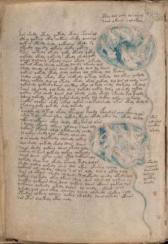

# Voynich Speculative Procedural Protocol — f84v

IMPORTANT: this is NOT a real or validated translation of the Voynich Manuscript. It is a speculative/procedural model that interprets EVA using a user-defined grammar to generate experimental recipes using safe, known edible substitutes.

This file is generated automatically from IVTFF/EVA transliteration plus a user-defined procedural grammar.



## Page / Folio
- currier: B
- folio: f84v
- page_number: 166
- section: biological

## EVA Text (Transliteration)
```text
otdy dar chdy dar oram
soiin okeeey sol okaly
kor shedy otedy qotedy otedar cfhdarol
oteey qoteey okey chetain sheeky daiin al
qokeey oteedy shedy qokeed or okeedy ry
ykeedy qoeedy olkeey sheky qokeey
poiin ol kedy okedy qoky ok[ch:ee]dy qokey
qokedy okedy qokeedy okeedy shedy qoky
ch'eol qolchey okeedy saiin okeedy chkeedy
qoteed otedy sheedy qokeedy qoeedy okeedy dam
ch'edy qoeedy ol cheey daiin chckhedy dain dy daiin
qokees qokedy otedy shedy qokedy dol olkeedy dol teedam
shedol chedy okedy otal chckhedy qotedy dokedy dol lkeey qokydy
dshey olkeey dol ol otedy okedy okedy qokedy dal dar ol chedy sain
qokshedy qokeed y daiin checthy okal ol kedy chedy dolkedy okedam
soiiin ol chedy qol tedy shey qokedy qokey dol y ol shedy qokedy
qokeey otol chedy daiin dol sheedy chedy okedy r kchdy kol koldy
dsheey qokeedy ykedy qokor shedy qoky dol shckhy qokain ol koldy
solkes olokar sheky shkol qokar chdy tal shedy okar okedy shedy dy
tolshy qoky qokedy shedy qoteedy
pcholshedy shtol okedy opcholor kchdy ofched y r aiin cfheey ols
oshey tedy okain shey qokedy kchdy okedy okey dy okedy olshdy
qokeey olkaiin okol shedy cthy korol oror
y cheey okeedy olkain olchey saiin oly
qokain okain olol okal chedy chedy
ol qokar shdy qol otedy olchedy
y or shedy qolkeedy olchedy olkal
dal shedy qokedy shedy dain daiin
sain shedy qokeey daiin okedy oldy
qokey ol keed qokedy qokey qokeoly
chal daiin otal chdy otal chckhor aly
qokedy shey kal okedy yfchedy tedy lolor
shedy qokey qokedy chey dar okey okeshy olchy
qokain ol chedy alchey s al or chdy dchey okey lchy
shor ol okain shedy olshedy tol okeedy chedy okedy lol
qokey sol kedy okey lkain shey shes ol shedy qokeey ror
chckhy qokaiin shey dain qokeey daiin okaiin qokal dys
qokchey qokeedy okedy dolor ol chedy oteol olol
lshedy qol aiin okey olchey lchey olshedy shckhy soly
yteedar olkeey olchey qokey lkeoldy daiin olkedy ykaiin
sor otes doltedy otol chedy
okar
ydairol
ychckhy
dshedy
okchdy
solchey
dair oldy
darchy
yc'thy
ochedy
```

## Domain Context (Heuristic; Not a Translation)

This section summarizes recurring **basewords** in this IVTFF domain and shows simple substring evidence that the token markers used by the procedural grammar occur inside frequent words.

Any Italian anagram / English gloss is a best-effort lexicon match, not a decipherment.


### Associated basewords (non-generic; top by frequency in this domain)
- `qokep` (count=160) → Italian anagram `pecco`; English: [n/a]
- `qokain` (count=159) → Italian anagram `acconi`; English: [n/a]
- `qokal` (count=108) → Italian anagram `calco`; English: cast (of sculpture)
- `paiin` (count=82) → Italian anagram `piani`; English: plans (arrangements)
- `qokaiin` (count=81) → Italian anagram `ciancio`; English: [n/a]
- `qokar` (count=45) → Italian anagram `carco`; English: [n/a]
- `okain` (count=41) → Italian anagram `acino`; English: a berry
- `okaiin` (count=31) → Italian anagram `coniai`; English: [n/a]
- `saiin` (count=30) → Italian anagram `asini`; English: [n/a]
- `olkain` (count=26) → Italian anagram `alcino`; English: smart, clever, intelligent, bright
- `qotal` (count=25) → Italian anagram `colta`; English: [n/a]
- `olchep` (count=24) → Italian anagram `colpe`; English: [n/a]
- `otain` (count=23) → Italian anagram `anito`; English: [n/a]
- `qotain` (count=20) → Italian anagram `antico`; English: ancient
- `olkep` (count=20) → Italian anagram `colpe`; English: [n/a]

### Marker evidence (substring in frequent basewords)
- `qo`: 50 basewords; examples: `qokep`, `qokain`, `qokeep`, `qol`, `qokal`, `qokaiin`
- `q`: 51 basewords; examples: `qokep`, `qokain`, `qokeep`, `qol`, `qokal`, `qokaiin`
- `o`: 184 basewords; examples: `ol`, `qokep`, `qokain`, `qokeep`, `qol`, `qokal`
- `k`: 114 basewords; examples: `qokep`, `qokain`, `qokeep`, `qokal`, `qokaiin`, `qokee`
- `t`: 73 basewords; examples: `otep`, `qotep`, `qoteep`, `tep`, `qot`, `otal`
- `p`: 112 basewords; examples: `shep`, `chep`, `qokep`, `qokeep`, `paiin`, `p`
- `ch`: 104 basewords; examples: `chep`, `che`, `lchep`, `chee`, `chckh`, `cheol`
- `sh`: 43 basewords; examples: `shep`, `she`, `sheep`, `shee`, `sheol`, `shckh`
- `f`: 1 basewords; examples: `fchep`
- `cth`: 10 basewords; examples: `chcth`, `checth`, `shecth`, `shcth`, `cthep`, `cthe`
- `ckh`: 13 basewords; examples: `chckh`, `shckh`, `checkh`, `sheckh`, `chckhe`, `chckhp`
- `cph`: 2 basewords; examples: `cphe`, `cphol`
- `iin`: 26 basewords; examples: `paiin`, `qokaiin`, `aiin`, `okaiin`, `saiin`, `qotaiin`
- `aiin`: 19 basewords; examples: `paiin`, `qokaiin`, `aiin`, `okaiin`, `saiin`, `qotaiin`

## Recipes Index (This Page)
- [f84v.1,@P1](#f84v-1-f84v-1-p1)
- [f84v.2,+P1](#f84v-2-f84v-2-p1)
- [f84v.3,@P0](#f84v-3-f84v-3-p0)
- [f84v.4,+P0](#f84v-4-f84v-4-p0)
- [f84v.5,+P0](#f84v-5-f84v-5-p0)
- [f84v.6,+P0](#f84v-6-f84v-6-p0)
- [f84v.7,+P0](#f84v-7-f84v-7-p0)
- [f84v.8,+P0](#f84v-8-f84v-8-p0)
- [f84v.9,+P0](#f84v-9-f84v-9-p0)
- [f84v.10,+P0](#f84v-10-f84v-10-p0)
- [f84v.11,+P0](#f84v-11-f84v-11-p0)
- [f84v.12,+P0](#f84v-12-f84v-12-p0)
- [f84v.13,+P0](#f84v-13-f84v-13-p0)
- [f84v.14,+P0](#f84v-14-f84v-14-p0)
- [f84v.15,+P0](#f84v-15-f84v-15-p0)
- [f84v.16,+P0](#f84v-16-f84v-16-p0)
- [f84v.17,+P0](#f84v-17-f84v-17-p0)
- [f84v.18,+P0](#f84v-18-f84v-18-p0)
- [f84v.19,+P0](#f84v-19-f84v-19-p0)
- [f84v.20,+P0](#f84v-20-f84v-20-p0)
- [f84v.21,+P0](#f84v-21-f84v-21-p0)
- [f84v.22,+P0](#f84v-22-f84v-22-p0)
- [f84v.23,+P0](#f84v-23-f84v-23-p0)
- [f84v.24,+P0](#f84v-24-f84v-24-p0)
- [f84v.25,+P0](#f84v-25-f84v-25-p0)
- [f84v.26,+P0](#f84v-26-f84v-26-p0)
- [f84v.27,+P0](#f84v-27-f84v-27-p0)
- [f84v.28,+P0](#f84v-28-f84v-28-p0)
- [f84v.29,+P0](#f84v-29-f84v-29-p0)
- [f84v.30,+P0](#f84v-30-f84v-30-p0)
- [f84v.31,+P0](#f84v-31-f84v-31-p0)
- [f84v.32,+P0](#f84v-32-f84v-32-p0)
- [f84v.33,+P0](#f84v-33-f84v-33-p0)
- [f84v.34,+P0](#f84v-34-f84v-34-p0)
- [f84v.35,+P0](#f84v-35-f84v-35-p0)
- [f84v.36,+P0](#f84v-36-f84v-36-p0)
- [f84v.37,+P0](#f84v-37-f84v-37-p0)
- [f84v.38,+P0](#f84v-38-f84v-38-p0)
- [f84v.39,+P0](#f84v-39-f84v-39-p0)
- [f84v.40,+P0](#f84v-40-f84v-40-p0)
- [f84v.41,+P0](#f84v-41-f84v-41-p0)
- [f84v.42,@Pb](#f84v-42-f84v-42-pb)
- [f84v.43,+Pb](#f84v-43-f84v-43-pb)
- [f84v.44,+Pb](#f84v-44-f84v-44-pb)
- [f84v.45,+Pb](#f84v-45-f84v-45-pb)
- [f84v.46,@Pb](#f84v-46-f84v-46-pb)
- [f84v.47,+Pb](#f84v-47-f84v-47-pb)
- [f84v.48,+Pb](#f84v-48-f84v-48-pb)
- [f84v.49,+Pb](#f84v-49-f84v-49-pb)
- [f84v.50,+Pb](#f84v-50-f84v-50-pb)
- [f84v.51,+Pb](#f84v-51-f84v-51-pb)

## Line Glosses (Procedural Gloss Only; Not a Translation)

<a id="f84v-1-f84v-1-p1"></a>

### f84v.1,@P1

EVA: otdy dar chdy dar oram

Direct Gloss (Procedural, Not a Real Translation):
- otdy: tokens: o t p
- dar: tokens: p a r → connectors: r → vowel_run: a (level 1; class a)
- chdy: tokens: ch p
- dar: tokens: p a r → connectors: r → vowel_run: a (level 1; class a)
- oram: tokens: o r a m → connectors: r m → vowel_run: a (level 1; class a)

<a id="f84v-2-f84v-2-p1"></a>

### f84v.2,+P1

EVA: soiin okeeey sol okaly

Direct Gloss (Procedural, Not a Real Translation):
- soiin: tokens: s o iin → connectors: s → vowel_run: ii (level 2; class i) → suffix: iin
- okeeey: tokens: o k eee → vowel_run: eee (level 3; class e)
- sol: tokens: s o l → connectors: s l
- okaly: tokens: o k a l → connectors: l → vowel_run: a (level 1; class a)

<a id="f84v-3-f84v-3-p0"></a>

### f84v.3,@P0

EVA: kor shedy otedy qotedy otedar cfhdarol

Direct Gloss (Procedural, Not a Real Translation):
- kor: tokens: k o r → connectors: r
- shedy: tokens: sh e p → vowel_run: e (level 1; class e)
- otedy: tokens: o t e p → vowel_run: e (level 1; class e)
- qotedy: tokens: qo t e p → vowel_run: e (level 1; class e)
- otedar: tokens: o t e p a r → connectors: r → vowel_run: e (level 1; class e)
- cfhdarol: tokens: cfh p a r o l → connectors: r l → vowel_run: a (level 1; class a)

<a id="f84v-4-f84v-4-p0"></a>

### f84v.4,+P0

EVA: oteey qoteey okey chetain sheeky daiin al

Direct Gloss (Procedural, Not a Real Translation):
- oteey: tokens: o t ee → vowel_run: ee (level 2; class e)
- qoteey: tokens: qo t ee → vowel_run: ee (level 2; class e)
- okey: tokens: o k e → vowel_run: e (level 1; class e)
- chetain: tokens: ch e t a i n → connectors: n → vowel_run: e (level 1; class e)
- sheeky: tokens: sh ee k → vowel_run: ee (level 2; class e)
- daiin: tokens: p aiin → vowel_run: a (level 1; class a) → suffix: aiin (lexicon-context: `paiin` → `piani`; plans (arrangements))
- al: tokens: a l → connectors: l → vowel_run: a (level 1; class a)

<a id="f84v-5-f84v-5-p0"></a>

### f84v.5,+P0

EVA: qokeey oteedy shedy qokeed or okeedy ry

Direct Gloss (Procedural, Not a Real Translation):
- qokeey: tokens: qo k ee → vowel_run: ee (level 2; class e)
- oteedy: tokens: o t ee p → vowel_run: ee (level 2; class e)
- shedy: tokens: sh e p → vowel_run: e (level 1; class e)
- qokeed: tokens: qo k ee p → vowel_run: ee (level 2; class e)
- or: tokens: o r → connectors: r
- okeedy: tokens: o k ee p → vowel_run: ee (level 2; class e)
- ry: tokens: r → connectors: r

<a id="f84v-6-f84v-6-p0"></a>

### f84v.6,+P0

EVA: ykeedy qoeedy olkeey sheky qokeey

Direct Gloss (Procedural, Not a Real Translation):
- ykeedy: tokens: k ee p → vowel_run: ee (level 2; class e)
- qoeedy: tokens: qo ee p → vowel_run: ee (level 2; class e)
- olkeey: tokens: o l k ee → connectors: l → vowel_run: ee (level 2; class e)
- sheky: tokens: sh e k → vowel_run: e (level 1; class e)
- qokeey: tokens: qo k ee → vowel_run: ee (level 2; class e)

<a id="f84v-7-f84v-7-p0"></a>

### f84v.7,+P0

EVA: poiin ol kedy okedy qoky ok[ch:ee]dy qokey

Direct Gloss (Procedural, Not a Real Translation):
- poiin: tokens: p o iin → vowel_run: ii (level 2; class i) → suffix: iin
- ol: tokens: o l → connectors: l
- kedy: tokens: k e p → vowel_run: e (level 1; class e)
- okedy: tokens: o k e p → vowel_run: e (level 1; class e)
- qoky: tokens: qo k
- ok: tokens: o k
- ch: tokens: ch
- ee: tokens: ee → vowel_run: ee (level 2; class e)
- dy: tokens: p
- qokey: tokens: qo k e → vowel_run: e (level 1; class e)

<a id="f84v-8-f84v-8-p0"></a>

### f84v.8,+P0

EVA: qokedy okedy qokeedy okeedy shedy qoky

Direct Gloss (Procedural, Not a Real Translation):
- qokedy: tokens: qo k e p → vowel_run: e (level 1; class e) (lexicon-context: `qokep` → `pecco`; [n/a])
- okedy: tokens: o k e p → vowel_run: e (level 1; class e)
- qokeedy: tokens: qo k ee p → vowel_run: ee (level 2; class e)
- okeedy: tokens: o k ee p → vowel_run: ee (level 2; class e)
- shedy: tokens: sh e p → vowel_run: e (level 1; class e)
- qoky: tokens: qo k

<a id="f84v-9-f84v-9-p0"></a>

### f84v.9,+P0

EVA: ch'eol qolchey okeedy saiin okeedy chkeedy

Direct Gloss (Procedural, Not a Real Translation):
- ch: tokens: ch
- eol: tokens: e o l → connectors: l → vowel_run: e (level 1; class e)
- qolchey: tokens: qo l ch e → connectors: l → vowel_run: e (level 1; class e) (lexicon-context: `qolche` → `lecco`; [n/a])
- okeedy: tokens: o k ee p → vowel_run: ee (level 2; class e)
- saiin: tokens: s aiin → connectors: s → vowel_run: a (level 1; class a) → suffix: aiin (lexicon-context: `saiin` → `asini`; [n/a])
- okeedy: tokens: o k ee p → vowel_run: ee (level 2; class e)
- chkeedy: tokens: ch k ee p → vowel_run: ee (level 2; class e)

<a id="f84v-10-f84v-10-p0"></a>

### f84v.10,+P0

EVA: qoteed otedy sheedy qokeedy qoeedy okeedy dam

Direct Gloss (Procedural, Not a Real Translation):
- qoteed: tokens: qo t ee p → vowel_run: ee (level 2; class e)
- otedy: tokens: o t e p → vowel_run: e (level 1; class e)
- sheedy: tokens: sh ee p → vowel_run: ee (level 2; class e)
- qokeedy: tokens: qo k ee p → vowel_run: ee (level 2; class e)
- qoeedy: tokens: qo ee p → vowel_run: ee (level 2; class e)
- okeedy: tokens: o k ee p → vowel_run: ee (level 2; class e)
- dam: tokens: p a m → connectors: m → vowel_run: a (level 1; class a)

<a id="f84v-11-f84v-11-p0"></a>

### f84v.11,+P0

EVA: ch'edy qoeedy ol cheey daiin chckhedy dain dy daiin

Direct Gloss (Procedural, Not a Real Translation):
- ch: tokens: ch
- edy: tokens: e p → vowel_run: e (level 1; class e)
- qoeedy: tokens: qo ee p → vowel_run: ee (level 2; class e)
- ol: tokens: o l → connectors: l
- cheey: tokens: ch ee → vowel_run: ee (level 2; class e)
- daiin: tokens: p aiin → vowel_run: a (level 1; class a) → suffix: aiin (lexicon-context: `paiin` → `piani`; plans (arrangements))
- chckhedy: tokens: ch ckh e p → vowel_run: e (level 1; class e)
- dain: tokens: p a i n → connectors: n → vowel_run: a (level 1; class a)
- dy: tokens: p
- daiin: tokens: p aiin → vowel_run: a (level 1; class a) → suffix: aiin (lexicon-context: `paiin` → `piani`; plans (arrangements))

<a id="f84v-12-f84v-12-p0"></a>

### f84v.12,+P0

EVA: qokees qokedy otedy shedy qokedy dol olkeedy dol teedam

Direct Gloss (Procedural, Not a Real Translation):
- qokees: tokens: qo k ee s → connectors: s → vowel_run: ee (level 2; class e)
- qokedy: tokens: qo k e p → vowel_run: e (level 1; class e) (lexicon-context: `qokep` → `pecco`; [n/a])
- otedy: tokens: o t e p → vowel_run: e (level 1; class e)
- shedy: tokens: sh e p → vowel_run: e (level 1; class e)
- qokedy: tokens: qo k e p → vowel_run: e (level 1; class e) (lexicon-context: `qokep` → `pecco`; [n/a])
- dol: tokens: p o l → connectors: l
- olkeedy: tokens: o l k ee p → connectors: l → vowel_run: ee (level 2; class e)
- dol: tokens: p o l → connectors: l
- teedam: tokens: t ee p a m → connectors: m → vowel_run: ee (level 2; class e)

<a id="f84v-13-f84v-13-p0"></a>

### f84v.13,+P0

EVA: shedol chedy okedy otal chckhedy qotedy dokedy dol lkeey qokydy

Direct Gloss (Procedural, Not a Real Translation):
- shedol: tokens: sh e p o l → connectors: l → vowel_run: e (level 1; class e)
- chedy: tokens: ch e p → vowel_run: e (level 1; class e)
- okedy: tokens: o k e p → vowel_run: e (level 1; class e)
- otal: tokens: o t a l → connectors: l → vowel_run: a (level 1; class a)
- chckhedy: tokens: ch ckh e p → vowel_run: e (level 1; class e)
- qotedy: tokens: qo t e p → vowel_run: e (level 1; class e)
- dokedy: tokens: p o k e p → vowel_run: e (level 1; class e)
- dol: tokens: p o l → connectors: l
- lkeey: tokens: l k ee → connectors: l → vowel_run: ee (level 2; class e)
- qokydy: tokens: qo k p

<a id="f84v-14-f84v-14-p0"></a>

### f84v.14,+P0

EVA: dshey olkeey dol ol otedy okedy okedy qokedy dal dar ol chedy sain

Direct Gloss (Procedural, Not a Real Translation):
- dshey: tokens: p sh e → vowel_run: e (level 1; class e)
- olkeey: tokens: o l k ee → connectors: l → vowel_run: ee (level 2; class e)
- dol: tokens: p o l → connectors: l
- ol: tokens: o l → connectors: l
- otedy: tokens: o t e p → vowel_run: e (level 1; class e)
- okedy: tokens: o k e p → vowel_run: e (level 1; class e)
- okedy: tokens: o k e p → vowel_run: e (level 1; class e)
- qokedy: tokens: qo k e p → vowel_run: e (level 1; class e) (lexicon-context: `qokep` → `pecco`; [n/a])
- dal: tokens: p a l → connectors: l → vowel_run: a (level 1; class a)
- dar: tokens: p a r → connectors: r → vowel_run: a (level 1; class a)
- ol: tokens: o l → connectors: l
- chedy: tokens: ch e p → vowel_run: e (level 1; class e)
- sain: tokens: s a i n → connectors: s n → vowel_run: a (level 1; class a)

<a id="f84v-15-f84v-15-p0"></a>

### f84v.15,+P0

EVA: qokshedy qokeed y daiin checthy okal ol kedy chedy dolkedy okedam

Direct Gloss (Procedural, Not a Real Translation):
- qokshedy: tokens: qo k sh e p → vowel_run: e (level 1; class e)
- qokeed: tokens: qo k ee p → vowel_run: ee (level 2; class e)
- y: [unparsed]
- daiin: tokens: p aiin → vowel_run: a (level 1; class a) → suffix: aiin (lexicon-context: `paiin` → `piani`; plans (arrangements))
- checthy: tokens: ch e cth → vowel_run: e (level 1; class e)
- okal: tokens: o k a l → connectors: l → vowel_run: a (level 1; class a)
- ol: tokens: o l → connectors: l
- kedy: tokens: k e p → vowel_run: e (level 1; class e)
- chedy: tokens: ch e p → vowel_run: e (level 1; class e)
- dolkedy: tokens: p o l k e p → connectors: l → vowel_run: e (level 1; class e) (lexicon-context: `olkep` → `colpe`; [n/a])
- okedam: tokens: o k e p a m → connectors: m → vowel_run: e (level 1; class e)

<a id="f84v-16-f84v-16-p0"></a>

### f84v.16,+P0

EVA: soiiin ol chedy qol tedy shey qokedy qokey dol y ol shedy qokedy

Direct Gloss (Procedural, Not a Real Translation):
- soiiin: tokens: s o iii n → connectors: s n → vowel_run: iii (level 3; class i) → suffix: iin
- ol: tokens: o l → connectors: l
- chedy: tokens: ch e p → vowel_run: e (level 1; class e)
- qol: tokens: qo l → connectors: l
- tedy: tokens: t e p → vowel_run: e (level 1; class e)
- shey: tokens: sh e → vowel_run: e (level 1; class e)
- qokedy: tokens: qo k e p → vowel_run: e (level 1; class e) (lexicon-context: `qokep` → `pecco`; [n/a])
- qokey: tokens: qo k e → vowel_run: e (level 1; class e)
- dol: tokens: p o l → connectors: l
- y: [unparsed]
- ol: tokens: o l → connectors: l
- shedy: tokens: sh e p → vowel_run: e (level 1; class e)
- qokedy: tokens: qo k e p → vowel_run: e (level 1; class e) (lexicon-context: `qokep` → `pecco`; [n/a])

<a id="f84v-17-f84v-17-p0"></a>

### f84v.17,+P0

EVA: qokeey otol chedy daiin dol sheedy chedy okedy r kchdy kol koldy

Direct Gloss (Procedural, Not a Real Translation):
- qokeey: tokens: qo k ee → vowel_run: ee (level 2; class e)
- otol: tokens: o t o l → connectors: l
- chedy: tokens: ch e p → vowel_run: e (level 1; class e)
- daiin: tokens: p aiin → vowel_run: a (level 1; class a) → suffix: aiin (lexicon-context: `paiin` → `piani`; plans (arrangements))
- dol: tokens: p o l → connectors: l
- sheedy: tokens: sh ee p → vowel_run: ee (level 2; class e)
- chedy: tokens: ch e p → vowel_run: e (level 1; class e)
- okedy: tokens: o k e p → vowel_run: e (level 1; class e)
- r: tokens: r → connectors: r
- kchdy: tokens: k ch p
- kol: tokens: k o l → connectors: l
- koldy: tokens: k o l p → connectors: l

<a id="f84v-18-f84v-18-p0"></a>

### f84v.18,+P0

EVA: dsheey qokeedy ykedy qokor shedy qoky dol shckhy qokain ol koldy

Direct Gloss (Procedural, Not a Real Translation):
- dsheey: tokens: p sh ee → vowel_run: ee (level 2; class e)
- qokeedy: tokens: qo k ee p → vowel_run: ee (level 2; class e)
- ykedy: tokens: k e p → vowel_run: e (level 1; class e)
- qokor: tokens: qo k o r → connectors: r
- shedy: tokens: sh e p → vowel_run: e (level 1; class e)
- qoky: tokens: qo k
- dol: tokens: p o l → connectors: l
- shckhy: tokens: sh ckh
- qokain: tokens: qo k a i n → connectors: n → vowel_run: a (level 1; class a) (lexicon-context: `qokain` → `concia`; tanning)
- ol: tokens: o l → connectors: l
- koldy: tokens: k o l p → connectors: l

<a id="f84v-19-f84v-19-p0"></a>

### f84v.19,+P0

EVA: solkes olokar sheky shkol qokar chdy tal shedy okar okedy shedy dy

Direct Gloss (Procedural, Not a Real Translation):
- solkes: tokens: s o l k e s → connectors: s l s → vowel_run: e (level 1; class e)
- olokar: tokens: o l o k a r → connectors: l r → vowel_run: a (level 1; class a)
- sheky: tokens: sh e k → vowel_run: e (level 1; class e)
- shkol: tokens: sh k o l → connectors: l
- qokar: tokens: qo k a r → connectors: r → vowel_run: a (level 1; class a)
- chdy: tokens: ch p
- tal: tokens: t a l → connectors: l → vowel_run: a (level 1; class a)
- shedy: tokens: sh e p → vowel_run: e (level 1; class e)
- okar: tokens: o k a r → connectors: r → vowel_run: a (level 1; class a)
- okedy: tokens: o k e p → vowel_run: e (level 1; class e)
- shedy: tokens: sh e p → vowel_run: e (level 1; class e)
- dy: tokens: p

<a id="f84v-20-f84v-20-p0"></a>

### f84v.20,+P0

EVA: tolshy qoky qokedy shedy qoteedy

Direct Gloss (Procedural, Not a Real Translation):
- tolshy: tokens: t o l sh → connectors: l
- qoky: tokens: qo k
- qokedy: tokens: qo k e p → vowel_run: e (level 1; class e) (lexicon-context: `qokep` → `pecco`; [n/a])
- shedy: tokens: sh e p → vowel_run: e (level 1; class e)
- qoteedy: tokens: qo t ee p → vowel_run: ee (level 2; class e)

<a id="f84v-21-f84v-21-p0"></a>

### f84v.21,+P0

EVA: pcholshedy shtol okedy opcholor kchdy ofched y r aiin cfheey ols

Direct Gloss (Procedural, Not a Real Translation):
- pcholshedy: tokens: p ch o l sh e p → connectors: l → vowel_run: e (level 1; class e) (lexicon-context: `olshep` → `spole`; [n/a])
- shtol: tokens: sh t o l → connectors: l
- okedy: tokens: o k e p → vowel_run: e (level 1; class e)
- opcholor: tokens: o p ch o l o r → connectors: l r
- kchdy: tokens: k ch p
- ofched: tokens: o f ch e p → vowel_run: e (level 1; class e)
- y: [unparsed]
- r: tokens: r → connectors: r
- aiin: tokens: aiin → vowel_run: a (level 1; class a) → suffix: aiin
- cfheey: tokens: cfh ee → vowel_run: ee (level 2; class e)
- ols: tokens: o l s → connectors: l s

<a id="f84v-22-f84v-22-p0"></a>

### f84v.22,+P0

EVA: oshey tedy okain shey qokedy kchdy okedy okey dy okedy olshdy

Direct Gloss (Procedural, Not a Real Translation):
- oshey: tokens: o sh e → vowel_run: e (level 1; class e)
- tedy: tokens: t e p → vowel_run: e (level 1; class e)
- okain: tokens: o k a i n → connectors: n → vowel_run: a (level 1; class a) (lexicon-context: `okain` → `conia`; [n/a])
- shey: tokens: sh e → vowel_run: e (level 1; class e)
- qokedy: tokens: qo k e p → vowel_run: e (level 1; class e) (lexicon-context: `qokep` → `pecco`; [n/a])
- kchdy: tokens: k ch p
- okedy: tokens: o k e p → vowel_run: e (level 1; class e)
- okey: tokens: o k e → vowel_run: e (level 1; class e)
- dy: tokens: p
- okedy: tokens: o k e p → vowel_run: e (level 1; class e)
- olshdy: tokens: o l sh p → connectors: l

<a id="f84v-23-f84v-23-p0"></a>

### f84v.23,+P0

EVA: qokeey olkaiin okol shedy cthy korol oror

Direct Gloss (Procedural, Not a Real Translation):
- qokeey: tokens: qo k ee → vowel_run: ee (level 2; class e)
- olkaiin: tokens: o l k aiin → connectors: l → vowel_run: a (level 1; class a) → suffix: aiin
- okol: tokens: o k o l → connectors: l
- shedy: tokens: sh e p → vowel_run: e (level 1; class e)
- cthy: tokens: cth
- korol: tokens: k o r o l → connectors: r l
- oror: tokens: o r o r → connectors: r r

<a id="f84v-24-f84v-24-p0"></a>

### f84v.24,+P0

EVA: y cheey okeedy olkain olchey saiin oly

Direct Gloss (Procedural, Not a Real Translation):
- y: [unparsed]
- cheey: tokens: ch ee → vowel_run: ee (level 2; class e)
- okeedy: tokens: o k ee p → vowel_run: ee (level 2; class e)
- olkain: tokens: o l k a i n → connectors: l n → vowel_run: a (level 1; class a) (lexicon-context: `olkain` → `calino`; [n/a])
- olchey: tokens: o l ch e → connectors: l → vowel_run: e (level 1; class e)
- saiin: tokens: s aiin → connectors: s → vowel_run: a (level 1; class a) → suffix: aiin (lexicon-context: `saiin` → `asini`; [n/a])
- oly: tokens: o l → connectors: l

<a id="f84v-25-f84v-25-p0"></a>

### f84v.25,+P0

EVA: qokain okain olol okal chedy chedy

Direct Gloss (Procedural, Not a Real Translation):
- qokain: tokens: qo k a i n → connectors: n → vowel_run: a (level 1; class a) (lexicon-context: `qokain` → `concia`; tanning)
- okain: tokens: o k a i n → connectors: n → vowel_run: a (level 1; class a) (lexicon-context: `okain` → `conia`; [n/a])
- olol: tokens: o l o l → connectors: l l
- okal: tokens: o k a l → connectors: l → vowel_run: a (level 1; class a)
- chedy: tokens: ch e p → vowel_run: e (level 1; class e)
- chedy: tokens: ch e p → vowel_run: e (level 1; class e)

<a id="f84v-26-f84v-26-p0"></a>

### f84v.26,+P0

EVA: ol qokar shdy qol otedy olchedy

Direct Gloss (Procedural, Not a Real Translation):
- ol: tokens: o l → connectors: l
- qokar: tokens: qo k a r → connectors: r → vowel_run: a (level 1; class a)
- shdy: tokens: sh p
- qol: tokens: qo l → connectors: l
- otedy: tokens: o t e p → vowel_run: e (level 1; class e)
- olchedy: tokens: o l ch e p → connectors: l → vowel_run: e (level 1; class e) (lexicon-context: `olchep` → `colpe`; [n/a])

<a id="f84v-27-f84v-27-p0"></a>

### f84v.27,+P0

EVA: y or shedy qolkeedy olchedy olkal

Direct Gloss (Procedural, Not a Real Translation):
- y: [unparsed]
- or: tokens: o r → connectors: r
- shedy: tokens: sh e p → vowel_run: e (level 1; class e)
- qolkeedy: tokens: qo l k ee p → connectors: l → vowel_run: ee (level 2; class e)
- olchedy: tokens: o l ch e p → connectors: l → vowel_run: e (level 1; class e) (lexicon-context: `olchep` → `colpe`; [n/a])
- olkal: tokens: o l k a l → connectors: l l → vowel_run: a (level 1; class a) (lexicon-context: `olkal` → `alcol`; alcohol (general use))

<a id="f84v-28-f84v-28-p0"></a>

### f84v.28,+P0

EVA: dal shedy qokedy shedy dain daiin

Direct Gloss (Procedural, Not a Real Translation):
- dal: tokens: p a l → connectors: l → vowel_run: a (level 1; class a)
- shedy: tokens: sh e p → vowel_run: e (level 1; class e)
- qokedy: tokens: qo k e p → vowel_run: e (level 1; class e) (lexicon-context: `qokep` → `pecco`; [n/a])
- shedy: tokens: sh e p → vowel_run: e (level 1; class e)
- dain: tokens: p a i n → connectors: n → vowel_run: a (level 1; class a)
- daiin: tokens: p aiin → vowel_run: a (level 1; class a) → suffix: aiin (lexicon-context: `paiin` → `piani`; plans (arrangements))

<a id="f84v-29-f84v-29-p0"></a>

### f84v.29,+P0

EVA: sain shedy qokeey daiin okedy oldy

Direct Gloss (Procedural, Not a Real Translation):
- sain: tokens: s a i n → connectors: s n → vowel_run: a (level 1; class a)
- shedy: tokens: sh e p → vowel_run: e (level 1; class e)
- qokeey: tokens: qo k ee → vowel_run: ee (level 2; class e)
- daiin: tokens: p aiin → vowel_run: a (level 1; class a) → suffix: aiin (lexicon-context: `paiin` → `piani`; plans (arrangements))
- okedy: tokens: o k e p → vowel_run: e (level 1; class e)
- oldy: tokens: o l p → connectors: l

<a id="f84v-30-f84v-30-p0"></a>

### f84v.30,+P0

EVA: qokey ol keed qokedy qokey qokeoly

Direct Gloss (Procedural, Not a Real Translation):
- qokey: tokens: qo k e → vowel_run: e (level 1; class e)
- ol: tokens: o l → connectors: l
- keed: tokens: k ee p → vowel_run: ee (level 2; class e)
- qokedy: tokens: qo k e p → vowel_run: e (level 1; class e) (lexicon-context: `qokep` → `pecco`; [n/a])
- qokey: tokens: qo k e → vowel_run: e (level 1; class e)
- qokeoly: tokens: qo k e o l → connectors: l → vowel_run: e (level 1; class e)

<a id="f84v-31-f84v-31-p0"></a>

### f84v.31,+P0

EVA: chal daiin otal chdy otal chckhor aly

Direct Gloss (Procedural, Not a Real Translation):
- chal: tokens: ch a l → connectors: l → vowel_run: a (level 1; class a)
- daiin: tokens: p aiin → vowel_run: a (level 1; class a) → suffix: aiin (lexicon-context: `paiin` → `piani`; plans (arrangements))
- otal: tokens: o t a l → connectors: l → vowel_run: a (level 1; class a)
- chdy: tokens: ch p
- otal: tokens: o t a l → connectors: l → vowel_run: a (level 1; class a)
- chckhor: tokens: ch ckh o r → connectors: r
- aly: tokens: a l → connectors: l → vowel_run: a (level 1; class a)

<a id="f84v-32-f84v-32-p0"></a>

### f84v.32,+P0

EVA: qokedy shey kal okedy yfchedy tedy lolor

Direct Gloss (Procedural, Not a Real Translation):
- qokedy: tokens: qo k e p → vowel_run: e (level 1; class e) (lexicon-context: `qokep` → `pecco`; [n/a])
- shey: tokens: sh e → vowel_run: e (level 1; class e)
- kal: tokens: k a l → connectors: l → vowel_run: a (level 1; class a)
- okedy: tokens: o k e p → vowel_run: e (level 1; class e)
- yfchedy: tokens: f ch e p → vowel_run: e (level 1; class e)
- tedy: tokens: t e p → vowel_run: e (level 1; class e)
- lolor: tokens: l o l o r → connectors: l l r

<a id="f84v-33-f84v-33-p0"></a>

### f84v.33,+P0

EVA: shedy qokey qokedy chey dar okey okeshy olchy

Direct Gloss (Procedural, Not a Real Translation):
- shedy: tokens: sh e p → vowel_run: e (level 1; class e)
- qokey: tokens: qo k e → vowel_run: e (level 1; class e)
- qokedy: tokens: qo k e p → vowel_run: e (level 1; class e) (lexicon-context: `qokep` → `pecco`; [n/a])
- chey: tokens: ch e → vowel_run: e (level 1; class e)
- dar: tokens: p a r → connectors: r → vowel_run: a (level 1; class a)
- okey: tokens: o k e → vowel_run: e (level 1; class e)
- okeshy: tokens: o k e sh → vowel_run: e (level 1; class e)
- olchy: tokens: o l ch → connectors: l

<a id="f84v-34-f84v-34-p0"></a>

### f84v.34,+P0

EVA: qokain ol chedy alchey s al or chdy dchey okey lchy

Direct Gloss (Procedural, Not a Real Translation):
- qokain: tokens: qo k a i n → connectors: n → vowel_run: a (level 1; class a) (lexicon-context: `qokain` → `concia`; tanning)
- ol: tokens: o l → connectors: l
- chedy: tokens: ch e p → vowel_run: e (level 1; class e)
- alchey: tokens: a l ch e → connectors: l → vowel_run: a (level 1; class a)
- s: tokens: s → connectors: s
- al: tokens: a l → connectors: l → vowel_run: a (level 1; class a)
- or: tokens: o r → connectors: r
- chdy: tokens: ch p
- dchey: tokens: p ch e → vowel_run: e (level 1; class e)
- okey: tokens: o k e → vowel_run: e (level 1; class e)
- lchy: tokens: l ch → connectors: l

<a id="f84v-35-f84v-35-p0"></a>

### f84v.35,+P0

EVA: shor ol okain shedy olshedy tol okeedy chedy okedy lol

Direct Gloss (Procedural, Not a Real Translation):
- shor: tokens: sh o r → connectors: r
- ol: tokens: o l → connectors: l
- okain: tokens: o k a i n → connectors: n → vowel_run: a (level 1; class a) (lexicon-context: `okain` → `conia`; [n/a])
- shedy: tokens: sh e p → vowel_run: e (level 1; class e)
- olshedy: tokens: o l sh e p → connectors: l → vowel_run: e (level 1; class e) (lexicon-context: `olshep` → `spole`; [n/a])
- tol: tokens: t o l → connectors: l
- okeedy: tokens: o k ee p → vowel_run: ee (level 2; class e)
- chedy: tokens: ch e p → vowel_run: e (level 1; class e)
- okedy: tokens: o k e p → vowel_run: e (level 1; class e)
- lol: tokens: l o l → connectors: l l

<a id="f84v-36-f84v-36-p0"></a>

### f84v.36,+P0

EVA: qokey sol kedy okey lkain shey shes ol shedy qokeey ror

Direct Gloss (Procedural, Not a Real Translation):
- qokey: tokens: qo k e → vowel_run: e (level 1; class e)
- sol: tokens: s o l → connectors: s l
- kedy: tokens: k e p → vowel_run: e (level 1; class e)
- okey: tokens: o k e → vowel_run: e (level 1; class e)
- lkain: tokens: l k a i n → connectors: l n → vowel_run: a (level 1; class a) (lexicon-context: `lkain` → `lanci`; [n/a])
- shey: tokens: sh e → vowel_run: e (level 1; class e)
- shes: tokens: sh e s → connectors: s → vowel_run: e (level 1; class e)
- ol: tokens: o l → connectors: l
- shedy: tokens: sh e p → vowel_run: e (level 1; class e)
- qokeey: tokens: qo k ee → vowel_run: ee (level 2; class e)
- ror: tokens: r o r → connectors: r r

<a id="f84v-37-f84v-37-p0"></a>

### f84v.37,+P0

EVA: chckhy qokaiin shey dain qokeey daiin okaiin qokal dys

Direct Gloss (Procedural, Not a Real Translation):
- chckhy: tokens: ch ckh
- qokaiin: tokens: qo k aiin → vowel_run: a (level 1; class a) → suffix: aiin (lexicon-context: `qokaiin` → `conciai`; [n/a])
- shey: tokens: sh e → vowel_run: e (level 1; class e)
- dain: tokens: p a i n → connectors: n → vowel_run: a (level 1; class a)
- qokeey: tokens: qo k ee → vowel_run: ee (level 2; class e)
- daiin: tokens: p aiin → vowel_run: a (level 1; class a) → suffix: aiin (lexicon-context: `paiin` → `piani`; plans (arrangements))
- okaiin: tokens: o k aiin → vowel_run: a (level 1; class a) → suffix: aiin (lexicon-context: `okaiin` → `coniai`; [n/a])
- qokal: tokens: qo k a l → connectors: l → vowel_run: a (level 1; class a) (lexicon-context: `qokal` → `calco`; cast (of sculpture))
- dys: tokens: p s → connectors: s

<a id="f84v-38-f84v-38-p0"></a>

### f84v.38,+P0

EVA: qokchey qokeedy okedy dolor ol chedy oteol olol

Direct Gloss (Procedural, Not a Real Translation):
- qokchey: tokens: qo k ch e → vowel_run: e (level 1; class e)
- qokeedy: tokens: qo k ee p → vowel_run: ee (level 2; class e)
- okedy: tokens: o k e p → vowel_run: e (level 1; class e)
- dolor: tokens: p o l o r → connectors: l r
- ol: tokens: o l → connectors: l
- chedy: tokens: ch e p → vowel_run: e (level 1; class e)
- oteol: tokens: o t e o l → connectors: l → vowel_run: e (level 1; class e)
- olol: tokens: o l o l → connectors: l l

<a id="f84v-39-f84v-39-p0"></a>

### f84v.39,+P0

EVA: lshedy qol aiin okey olchey lchey olshedy shckhy soly

Direct Gloss (Procedural, Not a Real Translation):
- lshedy: tokens: l sh e p → connectors: l → vowel_run: e (level 1; class e)
- qol: tokens: qo l → connectors: l
- aiin: tokens: aiin → vowel_run: a (level 1; class a) → suffix: aiin
- okey: tokens: o k e → vowel_run: e (level 1; class e)
- olchey: tokens: o l ch e → connectors: l → vowel_run: e (level 1; class e)
- lchey: tokens: l ch e → connectors: l → vowel_run: e (level 1; class e)
- olshedy: tokens: o l sh e p → connectors: l → vowel_run: e (level 1; class e) (lexicon-context: `olshep` → `spole`; [n/a])
- shckhy: tokens: sh ckh
- soly: tokens: s o l → connectors: s l

<a id="f84v-40-f84v-40-p0"></a>

### f84v.40,+P0

EVA: yteedar olkeey olchey qokey lkeoldy daiin olkedy ykaiin

Direct Gloss (Procedural, Not a Real Translation):
- yteedar: tokens: t ee p a r → connectors: r → vowel_run: ee (level 2; class e)
- olkeey: tokens: o l k ee → connectors: l → vowel_run: ee (level 2; class e)
- olchey: tokens: o l ch e → connectors: l → vowel_run: e (level 1; class e)
- qokey: tokens: qo k e → vowel_run: e (level 1; class e)
- lkeoldy: tokens: l k e o l p → connectors: l l → vowel_run: e (level 1; class e)
- daiin: tokens: p aiin → vowel_run: a (level 1; class a) → suffix: aiin (lexicon-context: `paiin` → `piani`; plans (arrangements))
- olkedy: tokens: o l k e p → connectors: l → vowel_run: e (level 1; class e) (lexicon-context: `olkep` → `colpe`; [n/a])
- ykaiin: tokens: k aiin → vowel_run: a (level 1; class a) → suffix: aiin

<a id="f84v-41-f84v-41-p0"></a>

### f84v.41,+P0

EVA: sor otes doltedy otol chedy

Direct Gloss (Procedural, Not a Real Translation):
- sor: tokens: s o r → connectors: s r
- otes: tokens: o t e s → connectors: s → vowel_run: e (level 1; class e)
- doltedy: tokens: p o l t e p → connectors: l → vowel_run: e (level 1; class e)
- otol: tokens: o t o l → connectors: l
- chedy: tokens: ch e p → vowel_run: e (level 1; class e)

<a id="f84v-42-f84v-42-pb"></a>

### f84v.42,@Pb

EVA: okar

Direct Gloss (Procedural, Not a Real Translation):
- okar: tokens: o k a r → connectors: r → vowel_run: a (level 1; class a)

<a id="f84v-43-f84v-43-pb"></a>

### f84v.43,+Pb

EVA: ydairol

Direct Gloss (Procedural, Not a Real Translation):
- ydairol: tokens: p a i r o l → connectors: r l → vowel_run: a (level 1; class a)

<a id="f84v-44-f84v-44-pb"></a>

### f84v.44,+Pb

EVA: ychckhy

Direct Gloss (Procedural, Not a Real Translation):
- ychckhy: tokens: ch ckh

<a id="f84v-45-f84v-45-pb"></a>

### f84v.45,+Pb

EVA: dshedy

Direct Gloss (Procedural, Not a Real Translation):
- dshedy: tokens: p sh e p → vowel_run: e (level 1; class e)

<a id="f84v-46-f84v-46-pb"></a>

### f84v.46,@Pb

EVA: okchdy

Direct Gloss (Procedural, Not a Real Translation):
- okchdy: tokens: o k ch p

<a id="f84v-47-f84v-47-pb"></a>

### f84v.47,+Pb

EVA: solchey

Direct Gloss (Procedural, Not a Real Translation):
- solchey: tokens: s o l ch e → connectors: s l → vowel_run: e (level 1; class e)

<a id="f84v-48-f84v-48-pb"></a>

### f84v.48,+Pb

EVA: dair oldy

Direct Gloss (Procedural, Not a Real Translation):
- dair: tokens: p a i r → connectors: r → vowel_run: a (level 1; class a)
- oldy: tokens: o l p → connectors: l

<a id="f84v-49-f84v-49-pb"></a>

### f84v.49,+Pb

EVA: darchy

Direct Gloss (Procedural, Not a Real Translation):
- darchy: tokens: p a r ch → connectors: r → vowel_run: a (level 1; class a)

<a id="f84v-50-f84v-50-pb"></a>

### f84v.50,+Pb

EVA: yc'thy

Direct Gloss (Procedural, Not a Real Translation):
- yc: tokens: c
- thy: tokens: t h → unmodeled_tokens: h

<a id="f84v-51-f84v-51-pb"></a>

### f84v.51,+Pb

EVA: ochedy

Direct Gloss (Procedural, Not a Real Translation):
- ochedy: tokens: o ch e p → vowel_run: e (level 1; class e)
