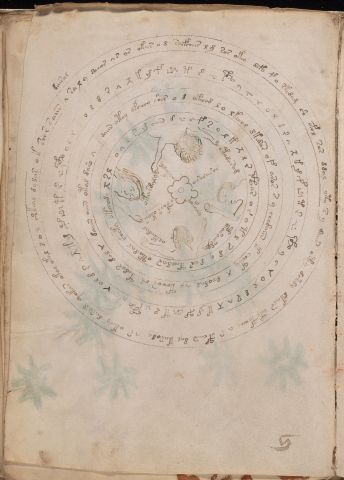

# Voynich Speculative Procedural Protocol — f57v

IMPORTANT: this is NOT a real or validated translation of the Voynich Manuscript. It is a speculative/procedural model that interprets EVA using a user-defined grammar to generate experimental recipes using safe, known edible substitutes.

This file is generated automatically from IVTFF/EVA transliteration plus a user-defined procedural grammar.



## Page / Folio
- currier: B
- folio: f57v
- page_number: 112
- section: cosmological

## EVA Text (Transliteration)
```text
dairal
v sal y soeos vs ar okees o d soefchees l g sos okey defo f o rkedam sh ofol sar ddal yty s y daiir otey dshdy dkal[s:r] oty pchchy a r opaiin dal karody v r okeey daram qokar okal okal d o l shkeal dy das o k sher s aiin
o l [d:j] r v x k m f @169;v t r @170; @171; y I @172; o l d r v x k m f @169;v t r @170; @171; y c @172; o l d r v x k m p @169;v t r @170; @171; y c @172; o l d r v x k m p @169;v t r @170; @171; y c @172;
daiin otey of[che:eee]y shes o d okeeod l o lkeeol dkedar yf aros s y chedaiin k eeety x deeodal vo tchor ch' kedar dal @172; daiin aiin otal daro v
o [v:a] l r m aiin d @170; c f [s:r] y l k x l r @171; ar o r [a:?] t l [s:r] d y dar teodar otodal sheky oteeody x [s:r] l
otodara[g:m]
oparairdly
olkeedal
otardaly
ark[a:o]ldy
ara?arar
okeely
ocfhor okear
```

## Domain Context (Heuristic; Not a Translation)

This section summarizes recurring **basewords** in this IVTFF domain and shows simple substring evidence that the token markers used by the procedural grammar occur inside frequent words.

Any Italian anagram / English gloss is a best-effort lexicon match, not a decipherment.


### Associated basewords (non-generic; top by frequency in this domain)
- `daiin` (count=28) → Italian anagram `piani`; English: plans (arrangements)
- `qokal` (count=13) → Italian anagram `calco`; English: cast (of sculpture)
- `odaiin` (count=8) → Italian anagram `inopia`; English: poverty
- `okees` (count=7) → Italian anagram `coese`; English: [n/a]
- `opaiin` (count=6) → Italian anagram `inopia`; English: poverty
- `ykaiin` (count=5) → Italian anagram `acini`; English: [n/a]
- `qodaiin` (count=5) → Italian anagram `apocini`; English: [n/a]
- `oteos` (count=5) → Italian anagram `osteo`; English: [n/a]
- `olkar` (count=5) → Italian anagram `carlo`; English: [n/a]
- `okaiin` (count=4) → Italian anagram `coniai`; English: [n/a]
- `qotaiin` (count=4) → Italian anagram `cationi`; English: [n/a]
- `qokaiin` (count=3) → Italian anagram `ciancio`; English: [n/a]
- `qokar` (count=3) → Italian anagram `carco`; English: [n/a]
- `olaiin` (count=3) → Italian anagram `ialino`; English: hyaline, glassy
- `oraiin` (count=3) → Italian anagram `aironi`; English: [n/a]

### Marker evidence (substring in frequent basewords)
- `qo`: 35 basewords; examples: `qokal`, `qodaiin`, `qokedy`, `qotaiin`, `qokaiin`, `qokar`
- `q`: 36 basewords; examples: `qokal`, `qodaiin`, `qokedy`, `qotaiin`, `qokaiin`, `qokar`
- `o`: 173 basewords; examples: `o`, `ol`, `or`, `otedy`, `oteey`, `okal`
- `k`: 85 basewords; examples: `okal`, `k`, `qokal`, `okeey`, `okar`, `okody`
- `t`: 73 basewords; examples: `otedy`, `oteey`, `otar`, `oteedy`, `otody`, `oty`
- `p`: 8 basewords; examples: `opaiin`, `opar`, `opchdy`, `p`, `opchedy`, `pol`
- `ch`: 81 basewords; examples: `chol`, `chedy`, `chey`, `chdy`, `ch`, `chy`
- `sh`: 28 basewords; examples: `shedy`, `sheey`, `shol`, `shedaiin`, `sho`, `sheody`
- `f`: 1 basewords; examples: `f`
- `cth`: 6 basewords; examples: `chcthy`, `cthy`, `cthol`, `chocthy`, `cthody`, `ctheey`
- `ckh`: 4 basewords; examples: `chckhy`, `chckhey`, `checkhy`, `ockhy`
- `dy`: 59 basewords; examples: `dy`, `otedy`, `chedy`, `shedy`, `chdy`, `oteedy`
- `iin`: 26 basewords; examples: `aiin`, `daiin`, `odaiin`, `opaiin`, `shedaiin`, `otaiin`
- `aiin`: 23 basewords; examples: `aiin`, `daiin`, `odaiin`, `opaiin`, `shedaiin`, `otaiin`

## Recipes Index (This Page)
- [f57v.1,@L0](#f57v-1-f57v-1-l0)
- [f57v.2,@Cc](#f57v-2-f57v-2-cc)
- [f57v.3,+Cc](#f57v-3-f57v-3-cc)
- [f57v.4,+Cc](#f57v-4-f57v-4-cc)
- [f57v.5,+Cc](#f57v-5-f57v-5-cc)
- [f57v.6,@L0](#f57v-6-f57v-6-l0)
- [f57v.7,@L0](#f57v-7-f57v-7-l0)
- [f57v.8,@L0](#f57v-8-f57v-8-l0)
- [f57v.9,@L0](#f57v-9-f57v-9-l0)
- [f57v.10,@Ro](#f57v-10-f57v-10-ro)
- [f57v.11,@Ro](#f57v-11-f57v-11-ro)
- [f57v.12,@Ro](#f57v-12-f57v-12-ro)
- [f57v.13,@Ro](#f57v-13-f57v-13-ro)

## Line Glosses (Procedural Gloss Only; Not a Translation)

<a id="f57v-1-f57v-1-l0"></a>

### f57v.1,@L0

EVA: dairal

Direct Gloss (Procedural, Not a Real Translation):
- dairal: add starter / activate → duration level 1 → state: phase transition/start

<a id="f57v-2-f57v-2-cc"></a>

### f57v.2,@Cc

EVA: v sal y soeos vs ar okees o d soefchees l g sos okey defo f o rkedam sh ofol sar ddal yty s y daiir otey dshdy dkal[s:r] oty pchchy a r opaiin dal karody v r okeey daram qokar okal okal d o l shkeal dy das o k sher s aiin

Direct Gloss (Procedural, Not a Real Translation):
- v: [unparsed]
- sal: duration level 1 → state: phase transition/start
- y: [unparsed]
- soeos: mix / transfer → duration level 1 → state: active extraction
- vs: [unparsed]
- ar: duration level 1 → state: phase transition/start
- okees: add fermentable sugars → mix / transfer → duration level 2 → state: active extraction
- o: mix / transfer
- d: add starter / activate
- soefchees: add main plant (safe substitute) → add aroma modifier → mix / transfer → duration level 1 → state: active extraction
- l: [unparsed]
- g: [unparsed]
- sos: mix / transfer
- okey: add fermentable sugars → mix / transfer → duration level 1 → state: active extraction
- defo: add aroma modifier → mix / transfer → add starter / activate → duration level 1 → state: active extraction
- f: add aroma modifier
- o: mix / transfer
- rkedam: add fermentable sugars → add starter / activate → duration level 1 → state: active extraction
- sh: add secondary herb (safe substitute)
- ofol: add aroma modifier → mix / transfer
- sar: duration level 1 → state: phase transition/start
- ddal: add starter / activate → duration level 1 → state: phase transition/start
- yty: apply heat/cooking
- s: [unparsed]
- y: [unparsed]
- daiir: add starter / activate → duration level 1 → state: phase transition/start
- otey: apply heat/cooking → mix / transfer → duration level 1 → state: active extraction
- dshdy: add secondary herb (safe substitute) → add starter / activate
- dkal: add fermentable sugars → add starter / activate → duration level 1 → state: phase transition/start
- s: [unparsed]
- r: [unparsed]
- oty: apply heat/cooking → mix / transfer
- pchchy: add main plant (safe substitute) → add starter / activate
- a: duration level 1 → state: phase transition/start
- r: [unparsed]
- opaiin: mix / transfer → add starter / activate → duration level 1 → state: phase transition/start → long phase
- dal: add starter / activate → duration level 1 → state: phase transition/start
- karody: add fermentable sugars → mix / transfer → add starter / activate → duration level 1 → state: phase transition/start
- v: [unparsed]
- r: [unparsed]
- okeey: add fermentable sugars → mix / transfer → duration level 2 → state: active extraction
- daram: add starter / activate → duration level 1 → state: phase transition/start
- qokar: prepare liquid base → add fermentable sugars → duration level 1 → state: phase transition/start
- okal: add fermentable sugars → mix / transfer → duration level 1 → state: phase transition/start
- okal: add fermentable sugars → mix / transfer → duration level 1 → state: phase transition/start
- d: add starter / activate
- o: mix / transfer
- l: [unparsed]
- shkeal: add fermentable sugars → add secondary herb (safe substitute) → duration level 1 → state: active extraction
- dy: add starter / activate
- das: add starter / activate → duration level 1 → state: phase transition/start
- o: mix / transfer
- k: add fermentable sugars
- sher: add secondary herb (safe substitute) → duration level 1 → state: active extraction
- s: [unparsed]
- aiin: duration level 1 → state: phase transition/start → long phase

<a id="f57v-3-f57v-3-cc"></a>

### f57v.3,+Cc

EVA: o l [d:j] r v x k m f @169;v t r @170; @171; y I @172; o l d r v x k m f @169;v t r @170; @171; y c @172; o l d r v x k m p @169;v t r @170; @171; y c @172; o l d r v x k m p @169;v t r @170; @171; y c @172;

Direct Gloss (Procedural, Not a Real Translation):
- o: mix / transfer
- l: [unparsed]
- d: add starter / activate
- j: [unparsed]
- r: [unparsed]
- v: [unparsed]
- x: [unparsed]
- k: add fermentable sugars
- m: [unparsed]
- f: add aroma modifier
- v: [unparsed]
- t: apply heat/cooking
- r: [unparsed]
- y: [unparsed]
- I: duration level 1 → state: cooling/rest
- o: mix / transfer
- l: [unparsed]
- d: add starter / activate
- r: [unparsed]
- v: [unparsed]
- x: [unparsed]
- k: add fermentable sugars
- m: [unparsed]
- f: add aroma modifier
- v: [unparsed]
- t: apply heat/cooking
- r: [unparsed]
- y: [unparsed]
- c: [unparsed]
- o: mix / transfer
- l: [unparsed]
- d: add starter / activate
- r: [unparsed]
- v: [unparsed]
- x: [unparsed]
- k: add fermentable sugars
- m: [unparsed]
- p: add starter / activate
- v: [unparsed]
- t: apply heat/cooking
- r: [unparsed]
- y: [unparsed]
- c: [unparsed]
- o: mix / transfer
- l: [unparsed]
- d: add starter / activate
- r: [unparsed]
- v: [unparsed]
- x: [unparsed]
- k: add fermentable sugars
- m: [unparsed]
- p: add starter / activate
- v: [unparsed]
- t: apply heat/cooking
- r: [unparsed]
- y: [unparsed]
- c: [unparsed]

<a id="f57v-4-f57v-4-cc"></a>

### f57v.4,+Cc

EVA: daiin otey of[che:eee]y shes o d okeeod l o lkeeol dkedar yf aros s y chedaiin k eeety x deeodal vo tchor ch' kedar dal @172; daiin aiin otal daro v

Direct Gloss (Procedural, Not a Real Translation):
- daiin: add starter / activate → duration level 1 → state: phase transition/start → long phase
- otey: apply heat/cooking → mix / transfer → duration level 1 → state: active extraction
- of: add aroma modifier → mix / transfer
- che: add main plant (safe substitute) → duration level 1 → state: active extraction
- eee: duration level 3 → state: active extraction
- y: [unparsed]
- shes: add secondary herb (safe substitute) → duration level 1 → state: active extraction
- o: mix / transfer
- d: add starter / activate
- okeeod: add fermentable sugars → mix / transfer → add starter / activate → duration level 2 → state: active extraction
- l: [unparsed]
- o: mix / transfer
- lkeeol: add fermentable sugars → mix / transfer → duration level 2 → state: active extraction
- dkedar: add fermentable sugars → add starter / activate → duration level 1 → state: active extraction
- yf: add aroma modifier
- aros: mix / transfer → duration level 1 → state: phase transition/start
- s: [unparsed]
- y: [unparsed]
- chedaiin: add main plant (safe substitute) → add starter / activate → duration level 1 → state: active extraction → long phase
- k: add fermentable sugars
- eeety: apply heat/cooking → duration level 3 → state: active extraction
- x: [unparsed]
- deeodal: mix / transfer → add starter / activate → duration level 2 → state: active extraction
- vo: mix / transfer
- tchor: apply heat/cooking → add main plant (safe substitute) → mix / transfer
- ch: add main plant (safe substitute)
- kedar: add fermentable sugars → add starter / activate → duration level 1 → state: active extraction
- dal: add starter / activate → duration level 1 → state: phase transition/start
- daiin: add starter / activate → duration level 1 → state: phase transition/start → long phase
- aiin: duration level 1 → state: phase transition/start → long phase
- otal: apply heat/cooking → mix / transfer → duration level 1 → state: phase transition/start
- daro: mix / transfer → add starter / activate → duration level 1 → state: phase transition/start
- v: [unparsed]

<a id="f57v-5-f57v-5-cc"></a>

### f57v.5,+Cc

EVA: o [v:a] l r m aiin d @170; c f [s:r] y l k x l r @171; ar o r [a:?] t l [s:r] d y dar teodar otodal sheky oteeody x [s:r] l

Direct Gloss (Procedural, Not a Real Translation):
- o: mix / transfer
- v: [unparsed]
- a: duration level 1 → state: phase transition/start
- l: [unparsed]
- r: [unparsed]
- m: [unparsed]
- aiin: duration level 1 → state: phase transition/start → long phase
- d: add starter / activate
- c: [unparsed]
- f: add aroma modifier
- s: [unparsed]
- r: [unparsed]
- y: [unparsed]
- l: [unparsed]
- k: add fermentable sugars
- x: [unparsed]
- l: [unparsed]
- r: [unparsed]
- ar: duration level 1 → state: phase transition/start
- o: mix / transfer
- r: [unparsed]
- a: duration level 1 → state: phase transition/start
- t: apply heat/cooking
- l: [unparsed]
- s: [unparsed]
- r: [unparsed]
- d: add starter / activate
- y: [unparsed]
- dar: add starter / activate → duration level 1 → state: phase transition/start
- teodar: apply heat/cooking → mix / transfer → add starter / activate → duration level 1 → state: active extraction
- otodal: apply heat/cooking → mix / transfer → add starter / activate → duration level 1 → state: phase transition/start
- sheky: add fermentable sugars → add secondary herb (safe substitute) → duration level 1 → state: active extraction
- oteeody: apply heat/cooking → mix / transfer → add starter / activate → duration level 2 → state: active extraction
- x: [unparsed]
- s: [unparsed]
- r: [unparsed]
- l: [unparsed]

<a id="f57v-6-f57v-6-l0"></a>

### f57v.6,@L0

EVA: otodara[g:m]

Direct Gloss (Procedural, Not a Real Translation):
- otodara: apply heat/cooking → mix / transfer → add starter / activate → duration level 1 → state: phase transition/start
- g: [unparsed]
- m: [unparsed]

<a id="f57v-7-f57v-7-l0"></a>

### f57v.7,@L0

EVA: oparairdly

Direct Gloss (Procedural, Not a Real Translation):
- oparairdly: mix / transfer → add starter / activate → duration level 1 → state: phase transition/start

<a id="f57v-8-f57v-8-l0"></a>

### f57v.8,@L0

EVA: olkeedal

Direct Gloss (Procedural, Not a Real Translation):
- olkeedal: add fermentable sugars → mix / transfer → add starter / activate → duration level 2 → state: active extraction

<a id="f57v-9-f57v-9-l0"></a>

### f57v.9,@L0

EVA: otardaly

Direct Gloss (Procedural, Not a Real Translation):
- otardaly: apply heat/cooking → mix / transfer → add starter / activate → duration level 1 → state: phase transition/start

<a id="f57v-10-f57v-10-ro"></a>

### f57v.10,@Ro

EVA: ark[a:o]ldy

Direct Gloss (Procedural, Not a Real Translation):
- ark: add fermentable sugars → duration level 1 → state: phase transition/start
- a: duration level 1 → state: phase transition/start
- o: mix / transfer
- ldy: add starter / activate

<a id="f57v-11-f57v-11-ro"></a>

### f57v.11,@Ro

EVA: ara?arar

Direct Gloss (Procedural, Not a Real Translation):
- ara: duration level 1 → state: phase transition/start
- arar: duration level 1 → state: phase transition/start

<a id="f57v-12-f57v-12-ro"></a>

### f57v.12,@Ro

EVA: okeely

Direct Gloss (Procedural, Not a Real Translation):
- okeely: add fermentable sugars → mix / transfer → duration level 2 → state: active extraction

<a id="f57v-13-f57v-13-ro"></a>

### f57v.13,@Ro

EVA: ocfhor okear

Direct Gloss (Procedural, Not a Real Translation):
- ocfhor: mix / transfer → add complex herbal compound (safe blend)
- okear: add fermentable sugars → mix / transfer → duration level 1 → state: active extraction
