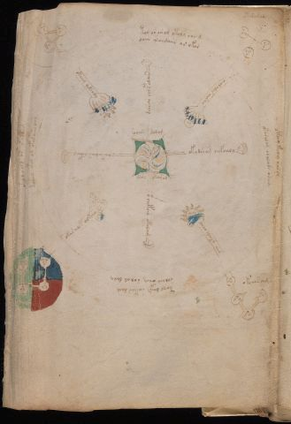

# Voynich Speculative Herbal Ferment Recipe — f67v2

IMPORTANT: this is NOT a real or validated translation of the Voynich Manuscript. It is a speculative/procedural model that interprets EVA using a user-defined grammar to generate experimental recipes using safe, known edible substitutes.

This file is generated automatically from IVTFF/EVA transliteration plus a user-defined procedural grammar.



## Page / Folio
- folio: f67v2
- page_number: 122
- section: cosmological

## EVA Text (Transliteration)
```text
otchdy
otararain
tol or ain am otoly sair [g:m]
daiin [t:k]aedaiin ar okor
okeey keoy salal
ykaralam olalade odam
taol daig sakar dam
solair cphey solal daly
okeal o?ol ar okaldam
koain opal ol of[o:y]lain oar
dcheeor ochepalain
oeolales ai[s:r]ar
okydseog oeepoaly
o?r ykaly char
o chekais okolaim
okar alet olkao
qokoaiin ocfhhy
okeeey oekchdy
soaiin dalam
sary okora[l:n]
oko???
okchos am
```

## Recipes Index (This Page)
- [f67v2.1,@La](#f67v2-1-f67v2-1-la)
- [f67v2.2,@La](#f67v2-2-f67v2-2-la)
- [f67v2.3,@Pb](#f67v2-3-f67v2-3-pb)
- [f67v2.4,+Pb](#f67v2-4-f67v2-4-pb)
- [f67v2.5,@Pb](#f67v2-5-f67v2-5-pb)
- [f67v2.6,+Pb](#f67v2-6-f67v2-6-pb)
- [f67v2.7,@Pb](#f67v2-7-f67v2-7-pb)
- [f67v2.8,+Pb](#f67v2-8-f67v2-8-pb)
- [f67v2.9,@Pb](#f67v2-9-f67v2-9-pb)
- [f67v2.10,+Pb](#f67v2-10-f67v2-10-pb)
- [f67v2.11,@Ro](#f67v2-11-f67v2-11-ro)
- [f67v2.12,@Ri](#f67v2-12-f67v2-12-ri)
- [f67v2.13,@Ro](#f67v2-13-f67v2-13-ro)
- [f67v2.14,@Ri](#f67v2-14-f67v2-14-ri)
- [f67v2.15,@Ro](#f67v2-15-f67v2-15-ro)
- [f67v2.16,@Ri](#f67v2-16-f67v2-16-ri)
- [f67v2.17,@Ro](#f67v2-17-f67v2-17-ro)
- [f67v2.18,@Ri](#f67v2-18-f67v2-18-ri)
- [f67v2.19,@La](#f67v2-19-f67v2-19-la)
- [f67v2.20,+La](#f67v2-20-f67v2-20-la)
- [f67v2.21,@La](#f67v2-21-f67v2-21-la)
- [f67v2.22,@La](#f67v2-22-f67v2-22-la)

## Line Glosses (Procedural Gloss Only; Not a Translation)

<a id="f67v2-1-f67v2-1-la"></a>

### f67v2.1,@La

EVA: otchdy

Direct Gloss (Procedural, Not a Real Translation):
- otchdy: apply heat/cooking → add main plant (safe substitute) → mix / transfer → start fermentation (yeast)

<a id="f67v2-2-f67v2-2-la"></a>

### f67v2.2,@La

EVA: otararain

Direct Gloss (Procedural, Not a Real Translation):
- otararain: apply heat/cooking → mix / transfer → duration level 1 → state: fermentation start

<a id="f67v2-3-f67v2-3-pb"></a>

### f67v2.3,@Pb

EVA: tol or ain am otoly sair [g:m]

Direct Gloss (Procedural, Not a Real Translation):
- tol: apply heat/cooking → mix / transfer
- or: mix / transfer
- ain: duration level 1 → state: fermentation start
- am: duration level 1 → state: fermentation start
- otoly: apply heat/cooking → mix / transfer
- sair: duration level 1 → state: fermentation start
- g: [unparsed]
- m: [unparsed]

<a id="f67v2-4-f67v2-4-pb"></a>

### f67v2.4,+Pb

EVA: daiin [t:k]aedaiin ar okor

Direct Gloss (Procedural, Not a Real Translation):
- daiin: start fermentation (yeast) → duration level 1 → state: fermentation start → long fermentation / aging phase
- t: apply heat/cooking
- k: add fermentable sugars
- aedaiin: start fermentation (yeast) → duration level 1 → state: fermentation start → long fermentation / aging phase
- ar: duration level 1 → state: fermentation start
- okor: add fermentable sugars → mix / transfer

<a id="f67v2-5-f67v2-5-pb"></a>

### f67v2.5,@Pb

EVA: okeey keoy salal

Direct Gloss (Procedural, Not a Real Translation):
- okeey: add fermentable sugars → mix / transfer → duration level 2 → state: active extraction
- keoy: add fermentable sugars → mix / transfer → duration level 1 → state: active extraction
- salal: duration level 1 → state: fermentation start

<a id="f67v2-6-f67v2-6-pb"></a>

### f67v2.6,+Pb

EVA: ykaralam olalade odam

Direct Gloss (Procedural, Not a Real Translation):
- ykaralam: add fermentable sugars → duration level 1 → state: fermentation start
- olalade: mix / transfer → start fermentation (yeast) → duration level 1 → state: fermentation start
- odam: mix / transfer → start fermentation (yeast) → duration level 1 → state: fermentation start

<a id="f67v2-7-f67v2-7-pb"></a>

### f67v2.7,@Pb

EVA: taol daig sakar dam

Direct Gloss (Procedural, Not a Real Translation):
- taol: apply heat/cooking → mix / transfer → duration level 1 → state: fermentation start
- daig: start fermentation (yeast) → duration level 1 → state: fermentation start
- sakar: add fermentable sugars → duration level 1 → state: fermentation start
- dam: start fermentation (yeast) → duration level 1 → state: fermentation start

<a id="f67v2-8-f67v2-8-pb"></a>

### f67v2.8,+Pb

EVA: solair cphey solal daly

Direct Gloss (Procedural, Not a Real Translation):
- solair: mix / transfer → duration level 1 → state: fermentation start
- cphey: add complex herbal compound (safe blend) → duration level 1 → state: active extraction
- solal: mix / transfer → duration level 1 → state: fermentation start
- daly: start fermentation (yeast) → duration level 1 → state: fermentation start

<a id="f67v2-9-f67v2-9-pb"></a>

### f67v2.9,@Pb

EVA: okeal o?ol ar okaldam

Direct Gloss (Procedural, Not a Real Translation):
- okeal: add fermentable sugars → mix / transfer → duration level 1 → state: active extraction
- o: mix / transfer
- ol: mix / transfer
- ar: duration level 1 → state: fermentation start
- okaldam: add fermentable sugars → mix / transfer → start fermentation (yeast) → duration level 1 → state: fermentation start

<a id="f67v2-10-f67v2-10-pb"></a>

### f67v2.10,+Pb

EVA: koain opal ol of[o:y]lain oar

Direct Gloss (Procedural, Not a Real Translation):
- koain: add fermentable sugars → mix / transfer → duration level 1 → state: fermentation start
- opal: mix / transfer → start fermentation (yeast) → duration level 1 → state: fermentation start
- ol: mix / transfer
- of: add aroma modifier → mix / transfer
- o: mix / transfer
- y: [unparsed]
- lain: duration level 1 → state: fermentation start
- oar: mix / transfer → duration level 1 → state: fermentation start

<a id="f67v2-11-f67v2-11-ro"></a>

### f67v2.11,@Ro

EVA: dcheeor ochepalain

Direct Gloss (Procedural, Not a Real Translation):
- dcheeor: add main plant (safe substitute) → mix / transfer → start fermentation (yeast) → duration level 2 → state: active extraction
- ochepalain: add main plant (safe substitute) → mix / transfer → start fermentation (yeast) → duration level 1 → state: active extraction

<a id="f67v2-12-f67v2-12-ri"></a>

### f67v2.12,@Ri

EVA: oeolales ai[s:r]ar

Direct Gloss (Procedural, Not a Real Translation):
- oeolales: mix / transfer → duration level 1 → state: active extraction
- ai: duration level 1 → state: fermentation start
- s: [unparsed]
- r: [unparsed]
- ar: duration level 1 → state: fermentation start

<a id="f67v2-13-f67v2-13-ro"></a>

### f67v2.13,@Ro

EVA: okydseog oeepoaly

Direct Gloss (Procedural, Not a Real Translation):
- okydseog: add fermentable sugars → mix / transfer → start fermentation (yeast) → duration level 1 → state: active extraction
- oeepoaly: mix / transfer → start fermentation (yeast) → duration level 2 → state: active extraction

<a id="f67v2-14-f67v2-14-ri"></a>

### f67v2.14,@Ri

EVA: o?r ykaly char

Direct Gloss (Procedural, Not a Real Translation):
- o: mix / transfer
- r: [unparsed]
- ykaly: add fermentable sugars → duration level 1 → state: fermentation start
- char: add main plant (safe substitute) → duration level 1 → state: fermentation start

<a id="f67v2-15-f67v2-15-ro"></a>

### f67v2.15,@Ro

EVA: o chekais okolaim

Direct Gloss (Procedural, Not a Real Translation):
- o: mix / transfer
- chekais: add fermentable sugars → add main plant (safe substitute) → duration level 1 → state: active extraction
- okolaim: add fermentable sugars → mix / transfer → duration level 1 → state: fermentation start

<a id="f67v2-16-f67v2-16-ri"></a>

### f67v2.16,@Ri

EVA: okar alet olkao

Direct Gloss (Procedural, Not a Real Translation):
- okar: add fermentable sugars → mix / transfer → duration level 1 → state: fermentation start
- alet: apply heat/cooking → duration level 1 → state: fermentation start
- olkao: add fermentable sugars → mix / transfer → duration level 1 → state: fermentation start

<a id="f67v2-17-f67v2-17-ro"></a>

### f67v2.17,@Ro

EVA: qokoaiin ocfhhy

Direct Gloss (Procedural, Not a Real Translation):
- qokoaiin: prepare liquid base → add fermentable sugars → mix / transfer → duration level 1 → state: fermentation start → long fermentation / aging phase
- ocfhhy: mix / transfer → add complex herbal compound (safe blend)

<a id="f67v2-18-f67v2-18-ri"></a>

### f67v2.18,@Ri

EVA: okeeey oekchdy

Direct Gloss (Procedural, Not a Real Translation):
- okeeey: add fermentable sugars → mix / transfer → duration level 3 → state: active extraction
- oekchdy: add fermentable sugars → add main plant (safe substitute) → mix / transfer → start fermentation (yeast) → duration level 1 → state: active extraction

<a id="f67v2-19-f67v2-19-la"></a>

### f67v2.19,@La

EVA: soaiin dalam

Direct Gloss (Procedural, Not a Real Translation):
- soaiin: mix / transfer → duration level 1 → state: fermentation start → long fermentation / aging phase
- dalam: start fermentation (yeast) → duration level 1 → state: fermentation start

<a id="f67v2-20-f67v2-20-la"></a>

### f67v2.20,+La

EVA: sary okora[l:n]

Direct Gloss (Procedural, Not a Real Translation):
- sary: duration level 1 → state: fermentation start
- okora: add fermentable sugars → mix / transfer → duration level 1 → state: fermentation start
- l: [unparsed]
- n: [unparsed]

<a id="f67v2-21-f67v2-21-la"></a>

### f67v2.21,@La

EVA: oko???

Direct Gloss (Procedural, Not a Real Translation):
- oko: add fermentable sugars → mix / transfer

<a id="f67v2-22-f67v2-22-la"></a>

### f67v2.22,@La

EVA: okchos am

Direct Gloss (Procedural, Not a Real Translation):
- okchos: add fermentable sugars → add main plant (safe substitute) → mix / transfer
- am: duration level 1 → state: fermentation start
