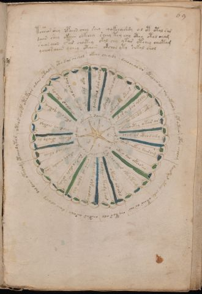

# Voynich Speculative Herbal Ferment Recipe — f69r

IMPORTANT: this is NOT a real or validated translation of the Voynich Manuscript. It is a speculative/procedural model that interprets EVA using a user-defined grammar to generate experimental recipes using safe, known edible substitutes.

This file is generated automatically from IVTFF/EVA transliteration plus a user-defined procedural grammar.



## Page / Folio
- folio: f69r
- page_number: 131
- section: cosmological

## EVA Text (Transliteration)
```text
tcheeos shey opaiin chey shey qokeeyshdy ol ot otal sar
daiin shey okaiin shkechy sheey tey chy cthy otol cham
sheos aiin c@178;ar choetey okal chy ykar ytchey cheotam
ycheoraiin ychey otaiin okchor yty chkal shol
oteos ch[o:?]p otaike
ar odair chtaly
oto dar archol
okeey chey dy
dcho char ar
ytal air al
shy chtairy
yt oetear
ytey cholam
dair ar yteey chdy
okair os air
chytos [o:a]ly
chetar araly
dair alody
dal daiin otalam
ytcheodytor
chodchy chotal
okeo sho qotam
okeodar oteody
ykeeos al dair dar
ykeey dal oky
doly dal dar chyky
okchol qokol daly
ykechody otar
dary dar aloly
okeeocthy okar ar
chey ar cthorary
sair chekey sairam
okeeo dal okar a[r:s]
sol aiir okeytam
okeos ar ald
docheeo kody sar
dchokey shkchodyal
chor al [a:y]lchy ral
sair al okody otedy
okody cheody sar
chokeod okeey
dkochy cthody dy
okoeese daiikey oees chear yteey oteeodar ch[y:o] okeeos alaiin
y
d
o
l
s
e[d:g]
```

## Recipes Index (This Page)
- [f69r.1,@P0](#f69r-1-f69r-1-p0)
- [f69r.2,+P0](#f69r-2-f69r-2-p0)
- [f69r.3,+P0](#f69r-3-f69r-3-p0)
- [f69r.4,+P0](#f69r-4-f69r-4-p0)
- [f69r.5,@L0](#f69r-5-f69r-5-l0)
- [f69r.6,&L0](#f69r-6-f69r-6-l0)
- [f69r.7,&L0](#f69r-7-f69r-7-l0)
- [f69r.8,&L0](#f69r-8-f69r-8-l0)
- [f69r.9,&L0](#f69r-9-f69r-9-l0)
- [f69r.10,&L0](#f69r-10-f69r-10-l0)
- [f69r.11,&L0](#f69r-11-f69r-11-l0)
- [f69r.12,&L0](#f69r-12-f69r-12-l0)
- [f69r.13,&L0](#f69r-13-f69r-13-l0)
- [f69r.14,&L0](#f69r-14-f69r-14-l0)
- [f69r.15,&L0](#f69r-15-f69r-15-l0)
- [f69r.16,&L0](#f69r-16-f69r-16-l0)
- [f69r.17,&L0](#f69r-17-f69r-17-l0)
- [f69r.18,&L0](#f69r-18-f69r-18-l0)
- [f69r.19,&L0](#f69r-19-f69r-19-l0)
- [f69r.20,&L0](#f69r-20-f69r-20-l0)
- [f69r.21,@Ro](#f69r-21-f69r-21-ro)
- [f69r.22,@Ro](#f69r-22-f69r-22-ro)
- [f69r.23,@Ro](#f69r-23-f69r-23-ro)
- [f69r.24,@Ro](#f69r-24-f69r-24-ro)
- [f69r.25,@Ro](#f69r-25-f69r-25-ro)
- [f69r.26,@Ro](#f69r-26-f69r-26-ro)
- [f69r.27,@Ro](#f69r-27-f69r-27-ro)
- [f69r.28,@Ro](#f69r-28-f69r-28-ro)
- [f69r.29,@Ro](#f69r-29-f69r-29-ro)
- [f69r.30,@Ro](#f69r-30-f69r-30-ro)
- [f69r.31,@Ro](#f69r-31-f69r-31-ro)
- [f69r.32,@Ro](#f69r-32-f69r-32-ro)
- [f69r.33,@Ro](#f69r-33-f69r-33-ro)
- [f69r.34,@Ro](#f69r-34-f69r-34-ro)
- [f69r.35,@Ro](#f69r-35-f69r-35-ro)
- [f69r.36,@Ro](#f69r-36-f69r-36-ro)
- [f69r.37,@Ro](#f69r-37-f69r-37-ro)
- [f69r.38,@Ro](#f69r-38-f69r-38-ro)
- [f69r.39,@Ro](#f69r-39-f69r-39-ro)
- [f69r.40,@Ro](#f69r-40-f69r-40-ro)
- [f69r.41,@Ro](#f69r-41-f69r-41-ro)
- [f69r.42,@Ro](#f69r-42-f69r-42-ro)
- [f69r.43,@Cc](#f69r-43-f69r-43-cc)
- [f69r.44,@L0](#f69r-44-f69r-44-l0)
- [f69r.45,@L0](#f69r-45-f69r-45-l0)
- [f69r.46,@L0](#f69r-46-f69r-46-l0)
- [f69r.47,@L0](#f69r-47-f69r-47-l0)
- [f69r.48,@L0](#f69r-48-f69r-48-l0)
- [f69r.49,@L0](#f69r-49-f69r-49-l0)

## Line Glosses (Procedural Gloss Only; Not a Translation)

<a id="f69r-1-f69r-1-p0"></a>

### f69r.1,@P0

EVA: tcheeos shey opaiin chey shey qokeeyshdy ol ot otal sar

Direct Gloss (Procedural, Not a Real Translation):
- tcheeos: apply heat/cooking → add main plant (safe substitute) → mix / transfer → duration level 2 → state: active extraction
- shey: add secondary herb (safe substitute) → duration level 1 → state: active extraction
- opaiin: mix / transfer → start fermentation (yeast) → duration level 1 → state: fermentation start → long fermentation / aging phase
- chey: add main plant (safe substitute) → duration level 1 → state: active extraction
- shey: add secondary herb (safe substitute) → duration level 1 → state: active extraction
- qokeeyshdy: prepare liquid base → add fermentable sugars → add secondary herb (safe substitute) → start fermentation (yeast) → duration level 2 → state: active extraction
- ol: mix / transfer
- ot: apply heat/cooking → mix / transfer
- otal: apply heat/cooking → mix / transfer → duration level 1 → state: fermentation start
- sar: duration level 1 → state: fermentation start

<a id="f69r-2-f69r-2-p0"></a>

### f69r.2,+P0

EVA: daiin shey okaiin shkechy sheey tey chy cthy otol cham

Direct Gloss (Procedural, Not a Real Translation):
- daiin: start fermentation (yeast) → duration level 1 → state: fermentation start → long fermentation / aging phase
- shey: add secondary herb (safe substitute) → duration level 1 → state: active extraction
- okaiin: add fermentable sugars → mix / transfer → duration level 1 → state: fermentation start → long fermentation / aging phase
- shkechy: add fermentable sugars → add main plant (safe substitute) → add secondary herb (safe substitute) → duration level 1 → state: active extraction
- sheey: add secondary herb (safe substitute) → duration level 2 → state: active extraction
- tey: apply heat/cooking → duration level 1 → state: active extraction
- chy: add main plant (safe substitute)
- cthy: add complex herbal compound (safe blend)
- otol: apply heat/cooking → mix / transfer
- cham: add main plant (safe substitute) → duration level 1 → state: fermentation start

<a id="f69r-3-f69r-3-p0"></a>

### f69r.3,+P0

EVA: sheos aiin c@178;ar choetey okal chy ykar ytchey cheotam

Direct Gloss (Procedural, Not a Real Translation):
- sheos: add secondary herb (safe substitute) → mix / transfer → duration level 1 → state: active extraction
- aiin: duration level 1 → state: fermentation start → long fermentation / aging phase
- c: [unparsed]
- ar: duration level 1 → state: fermentation start
- choetey: apply heat/cooking → add main plant (safe substitute) → mix / transfer → duration level 1 → state: active extraction
- okal: add fermentable sugars → mix / transfer → duration level 1 → state: fermentation start
- chy: add main plant (safe substitute)
- ykar: add fermentable sugars → duration level 1 → state: fermentation start
- ytchey: apply heat/cooking → add main plant (safe substitute) → duration level 1 → state: active extraction
- cheotam: apply heat/cooking → add main plant (safe substitute) → mix / transfer → duration level 1 → state: active extraction

<a id="f69r-4-f69r-4-p0"></a>

### f69r.4,+P0

EVA: ycheoraiin ychey otaiin okchor yty chkal shol

Direct Gloss (Procedural, Not a Real Translation):
- ycheoraiin: add main plant (safe substitute) → mix / transfer → duration level 1 → state: active extraction → long fermentation / aging phase
- ychey: add main plant (safe substitute) → duration level 1 → state: active extraction
- otaiin: apply heat/cooking → mix / transfer → duration level 1 → state: fermentation start → long fermentation / aging phase
- okchor: add fermentable sugars → add main plant (safe substitute) → mix / transfer
- yty: apply heat/cooking
- chkal: add fermentable sugars → add main plant (safe substitute) → duration level 1 → state: fermentation start
- shol: add secondary herb (safe substitute) → mix / transfer

<a id="f69r-5-f69r-5-l0"></a>

### f69r.5,@L0

EVA: oteos ch[o:?]p otaike

Direct Gloss (Procedural, Not a Real Translation):
- oteos: apply heat/cooking → mix / transfer → duration level 1 → state: active extraction
- ch: add main plant (safe substitute)
- o: mix / transfer
- p: start fermentation (yeast)
- otaike: add fermentable sugars → apply heat/cooking → mix / transfer → duration level 1 → state: fermentation start

<a id="f69r-6-f69r-6-l0"></a>

### f69r.6,&L0

EVA: ar odair chtaly

Direct Gloss (Procedural, Not a Real Translation):
- ar: duration level 1 → state: fermentation start
- odair: mix / transfer → start fermentation (yeast) → duration level 1 → state: fermentation start
- chtaly: apply heat/cooking → add main plant (safe substitute) → duration level 1 → state: fermentation start

<a id="f69r-7-f69r-7-l0"></a>

### f69r.7,&L0

EVA: oto dar archol

Direct Gloss (Procedural, Not a Real Translation):
- oto: apply heat/cooking → mix / transfer
- dar: start fermentation (yeast) → duration level 1 → state: fermentation start
- archol: add main plant (safe substitute) → mix / transfer → duration level 1 → state: fermentation start

<a id="f69r-8-f69r-8-l0"></a>

### f69r.8,&L0

EVA: okeey chey dy

Direct Gloss (Procedural, Not a Real Translation):
- okeey: add fermentable sugars → mix / transfer → duration level 2 → state: active extraction
- chey: add main plant (safe substitute) → duration level 1 → state: active extraction
- dy: start fermentation (yeast)

<a id="f69r-9-f69r-9-l0"></a>

### f69r.9,&L0

EVA: dcho char ar

Direct Gloss (Procedural, Not a Real Translation):
- dcho: add main plant (safe substitute) → mix / transfer → start fermentation (yeast)
- char: add main plant (safe substitute) → duration level 1 → state: fermentation start
- ar: duration level 1 → state: fermentation start

<a id="f69r-10-f69r-10-l0"></a>

### f69r.10,&L0

EVA: ytal air al

Direct Gloss (Procedural, Not a Real Translation):
- ytal: apply heat/cooking → duration level 1 → state: fermentation start
- air: duration level 1 → state: fermentation start
- al: duration level 1 → state: fermentation start

<a id="f69r-11-f69r-11-l0"></a>

### f69r.11,&L0

EVA: shy chtairy

Direct Gloss (Procedural, Not a Real Translation):
- shy: add secondary herb (safe substitute)
- chtairy: apply heat/cooking → add main plant (safe substitute) → duration level 1 → state: fermentation start

<a id="f69r-12-f69r-12-l0"></a>

### f69r.12,&L0

EVA: yt oetear

Direct Gloss (Procedural, Not a Real Translation):
- yt: apply heat/cooking
- oetear: apply heat/cooking → mix / transfer → duration level 1 → state: active extraction

<a id="f69r-13-f69r-13-l0"></a>

### f69r.13,&L0

EVA: ytey cholam

Direct Gloss (Procedural, Not a Real Translation):
- ytey: apply heat/cooking → duration level 1 → state: active extraction
- cholam: add main plant (safe substitute) → mix / transfer → duration level 1 → state: fermentation start

<a id="f69r-14-f69r-14-l0"></a>

### f69r.14,&L0

EVA: dair ar yteey chdy

Direct Gloss (Procedural, Not a Real Translation):
- dair: start fermentation (yeast) → duration level 1 → state: fermentation start
- ar: duration level 1 → state: fermentation start
- yteey: apply heat/cooking → duration level 2 → state: active extraction
- chdy: add main plant (safe substitute) → start fermentation (yeast)

<a id="f69r-15-f69r-15-l0"></a>

### f69r.15,&L0

EVA: okair os air

Direct Gloss (Procedural, Not a Real Translation):
- okair: add fermentable sugars → mix / transfer → duration level 1 → state: fermentation start
- os: mix / transfer
- air: duration level 1 → state: fermentation start

<a id="f69r-16-f69r-16-l0"></a>

### f69r.16,&L0

EVA: chytos [o:a]ly

Direct Gloss (Procedural, Not a Real Translation):
- chytos: apply heat/cooking → add main plant (safe substitute) → mix / transfer
- o: mix / transfer
- a: duration level 1 → state: fermentation start
- ly: [unparsed]

<a id="f69r-17-f69r-17-l0"></a>

### f69r.17,&L0

EVA: chetar araly

Direct Gloss (Procedural, Not a Real Translation):
- chetar: apply heat/cooking → add main plant (safe substitute) → duration level 1 → state: active extraction
- araly: duration level 1 → state: fermentation start

<a id="f69r-18-f69r-18-l0"></a>

### f69r.18,&L0

EVA: dair alody

Direct Gloss (Procedural, Not a Real Translation):
- dair: start fermentation (yeast) → duration level 1 → state: fermentation start
- alody: mix / transfer → start fermentation (yeast) → duration level 1 → state: fermentation start

<a id="f69r-19-f69r-19-l0"></a>

### f69r.19,&L0

EVA: dal daiin otalam

Direct Gloss (Procedural, Not a Real Translation):
- dal: start fermentation (yeast) → duration level 1 → state: fermentation start
- daiin: start fermentation (yeast) → duration level 1 → state: fermentation start → long fermentation / aging phase
- otalam: apply heat/cooking → mix / transfer → duration level 1 → state: fermentation start

<a id="f69r-20-f69r-20-l0"></a>

### f69r.20,&L0

EVA: ytcheodytor

Direct Gloss (Procedural, Not a Real Translation):
- ytcheodytor: apply heat/cooking → add main plant (safe substitute) → mix / transfer → start fermentation (yeast) → duration level 1 → state: active extraction

<a id="f69r-21-f69r-21-ro"></a>

### f69r.21,@Ro

EVA: chodchy chotal

Direct Gloss (Procedural, Not a Real Translation):
- chodchy: add main plant (safe substitute) → mix / transfer → start fermentation (yeast)
- chotal: apply heat/cooking → add main plant (safe substitute) → mix / transfer → duration level 1 → state: fermentation start

<a id="f69r-22-f69r-22-ro"></a>

### f69r.22,@Ro

EVA: okeo sho qotam

Direct Gloss (Procedural, Not a Real Translation):
- okeo: add fermentable sugars → mix / transfer → duration level 1 → state: active extraction
- sho: add secondary herb (safe substitute) → mix / transfer
- qotam: prepare liquid base → apply heat/cooking → duration level 1 → state: fermentation start

<a id="f69r-23-f69r-23-ro"></a>

### f69r.23,@Ro

EVA: okeodar oteody

Direct Gloss (Procedural, Not a Real Translation):
- okeodar: add fermentable sugars → mix / transfer → start fermentation (yeast) → duration level 1 → state: active extraction
- oteody: apply heat/cooking → mix / transfer → start fermentation (yeast) → duration level 1 → state: active extraction

<a id="f69r-24-f69r-24-ro"></a>

### f69r.24,@Ro

EVA: ykeeos al dair dar

Direct Gloss (Procedural, Not a Real Translation):
- ykeeos: add fermentable sugars → mix / transfer → duration level 2 → state: active extraction
- al: duration level 1 → state: fermentation start
- dair: start fermentation (yeast) → duration level 1 → state: fermentation start
- dar: start fermentation (yeast) → duration level 1 → state: fermentation start

<a id="f69r-25-f69r-25-ro"></a>

### f69r.25,@Ro

EVA: ykeey dal oky

Direct Gloss (Procedural, Not a Real Translation):
- ykeey: add fermentable sugars → duration level 2 → state: active extraction
- dal: start fermentation (yeast) → duration level 1 → state: fermentation start
- oky: add fermentable sugars → mix / transfer

<a id="f69r-26-f69r-26-ro"></a>

### f69r.26,@Ro

EVA: doly dal dar chyky

Direct Gloss (Procedural, Not a Real Translation):
- doly: mix / transfer → start fermentation (yeast)
- dal: start fermentation (yeast) → duration level 1 → state: fermentation start
- dar: start fermentation (yeast) → duration level 1 → state: fermentation start
- chyky: add fermentable sugars → add main plant (safe substitute)

<a id="f69r-27-f69r-27-ro"></a>

### f69r.27,@Ro

EVA: okchol qokol daly

Direct Gloss (Procedural, Not a Real Translation):
- okchol: add fermentable sugars → add main plant (safe substitute) → mix / transfer
- qokol: prepare liquid base → add fermentable sugars → mix / transfer
- daly: start fermentation (yeast) → duration level 1 → state: fermentation start

<a id="f69r-28-f69r-28-ro"></a>

### f69r.28,@Ro

EVA: ykechody otar

Direct Gloss (Procedural, Not a Real Translation):
- ykechody: add fermentable sugars → add main plant (safe substitute) → mix / transfer → start fermentation (yeast) → duration level 1 → state: active extraction
- otar: apply heat/cooking → mix / transfer → duration level 1 → state: fermentation start

<a id="f69r-29-f69r-29-ro"></a>

### f69r.29,@Ro

EVA: dary dar aloly

Direct Gloss (Procedural, Not a Real Translation):
- dary: start fermentation (yeast) → duration level 1 → state: fermentation start
- dar: start fermentation (yeast) → duration level 1 → state: fermentation start
- aloly: mix / transfer → duration level 1 → state: fermentation start

<a id="f69r-30-f69r-30-ro"></a>

### f69r.30,@Ro

EVA: okeeocthy okar ar

Direct Gloss (Procedural, Not a Real Translation):
- okeeocthy: add fermentable sugars → mix / transfer → add complex herbal compound (safe blend) → duration level 2 → state: active extraction
- okar: add fermentable sugars → mix / transfer → duration level 1 → state: fermentation start
- ar: duration level 1 → state: fermentation start

<a id="f69r-31-f69r-31-ro"></a>

### f69r.31,@Ro

EVA: chey ar cthorary

Direct Gloss (Procedural, Not a Real Translation):
- chey: add main plant (safe substitute) → duration level 1 → state: active extraction
- ar: duration level 1 → state: fermentation start
- cthorary: mix / transfer → add complex herbal compound (safe blend) → duration level 1 → state: fermentation start

<a id="f69r-32-f69r-32-ro"></a>

### f69r.32,@Ro

EVA: sair chekey sairam

Direct Gloss (Procedural, Not a Real Translation):
- sair: duration level 1 → state: fermentation start
- chekey: add fermentable sugars → add main plant (safe substitute) → duration level 1 → state: active extraction
- sairam: duration level 1 → state: fermentation start

<a id="f69r-33-f69r-33-ro"></a>

### f69r.33,@Ro

EVA: okeeo dal okar a[r:s]

Direct Gloss (Procedural, Not a Real Translation):
- okeeo: add fermentable sugars → mix / transfer → duration level 2 → state: active extraction
- dal: start fermentation (yeast) → duration level 1 → state: fermentation start
- okar: add fermentable sugars → mix / transfer → duration level 1 → state: fermentation start
- a: duration level 1 → state: fermentation start
- r: [unparsed]
- s: [unparsed]

<a id="f69r-34-f69r-34-ro"></a>

### f69r.34,@Ro

EVA: sol aiir okeytam

Direct Gloss (Procedural, Not a Real Translation):
- sol: mix / transfer
- aiir: duration level 1 → state: fermentation start
- okeytam: add fermentable sugars → apply heat/cooking → mix / transfer → duration level 1 → state: active extraction

<a id="f69r-35-f69r-35-ro"></a>

### f69r.35,@Ro

EVA: okeos ar ald

Direct Gloss (Procedural, Not a Real Translation):
- okeos: add fermentable sugars → mix / transfer → duration level 1 → state: active extraction
- ar: duration level 1 → state: fermentation start
- ald: start fermentation (yeast) → duration level 1 → state: fermentation start

<a id="f69r-36-f69r-36-ro"></a>

### f69r.36,@Ro

EVA: docheeo kody sar

Direct Gloss (Procedural, Not a Real Translation):
- docheeo: add main plant (safe substitute) → mix / transfer → start fermentation (yeast) → duration level 2 → state: active extraction
- kody: add fermentable sugars → mix / transfer → start fermentation (yeast)
- sar: duration level 1 → state: fermentation start

<a id="f69r-37-f69r-37-ro"></a>

### f69r.37,@Ro

EVA: dchokey shkchodyal

Direct Gloss (Procedural, Not a Real Translation):
- dchokey: add fermentable sugars → add main plant (safe substitute) → mix / transfer → start fermentation (yeast) → duration level 1 → state: active extraction
- shkchodyal: add fermentable sugars → add main plant (safe substitute) → add secondary herb (safe substitute) → mix / transfer → start fermentation (yeast) → duration level 1 → state: fermentation start

<a id="f69r-38-f69r-38-ro"></a>

### f69r.38,@Ro

EVA: chor al [a:y]lchy ral

Direct Gloss (Procedural, Not a Real Translation):
- chor: add main plant (safe substitute) → mix / transfer
- al: duration level 1 → state: fermentation start
- a: duration level 1 → state: fermentation start
- y: [unparsed]
- lchy: add main plant (safe substitute)
- ral: duration level 1 → state: fermentation start

<a id="f69r-39-f69r-39-ro"></a>

### f69r.39,@Ro

EVA: sair al okody otedy

Direct Gloss (Procedural, Not a Real Translation):
- sair: duration level 1 → state: fermentation start
- al: duration level 1 → state: fermentation start
- okody: add fermentable sugars → mix / transfer → start fermentation (yeast)
- otedy: apply heat/cooking → mix / transfer → start fermentation (yeast) → duration level 1 → state: active extraction

<a id="f69r-40-f69r-40-ro"></a>

### f69r.40,@Ro

EVA: okody cheody sar

Direct Gloss (Procedural, Not a Real Translation):
- okody: add fermentable sugars → mix / transfer → start fermentation (yeast)
- cheody: add main plant (safe substitute) → mix / transfer → start fermentation (yeast) → duration level 1 → state: active extraction
- sar: duration level 1 → state: fermentation start

<a id="f69r-41-f69r-41-ro"></a>

### f69r.41,@Ro

EVA: chokeod okeey

Direct Gloss (Procedural, Not a Real Translation):
- chokeod: add fermentable sugars → add main plant (safe substitute) → mix / transfer → start fermentation (yeast) → duration level 1 → state: active extraction
- okeey: add fermentable sugars → mix / transfer → duration level 2 → state: active extraction

<a id="f69r-42-f69r-42-ro"></a>

### f69r.42,@Ro

EVA: dkochy cthody dy

Direct Gloss (Procedural, Not a Real Translation):
- dkochy: add fermentable sugars → add main plant (safe substitute) → mix / transfer → start fermentation (yeast)
- cthody: mix / transfer → start fermentation (yeast) → add complex herbal compound (safe blend)
- dy: start fermentation (yeast)

<a id="f69r-43-f69r-43-cc"></a>

### f69r.43,@Cc

EVA: okoeese daiikey oees chear yteey oteeodar ch[y:o] okeeos alaiin

Direct Gloss (Procedural, Not a Real Translation):
- okoeese: add fermentable sugars → mix / transfer → duration level 2 → state: active extraction
- daiikey: add fermentable sugars → start fermentation (yeast) → duration level 1 → state: fermentation start
- oees: mix / transfer → duration level 2 → state: active extraction
- chear: add main plant (safe substitute) → duration level 1 → state: active extraction
- yteey: apply heat/cooking → duration level 2 → state: active extraction
- oteeodar: apply heat/cooking → mix / transfer → start fermentation (yeast) → duration level 2 → state: active extraction
- ch: add main plant (safe substitute)
- y: [unparsed]
- o: mix / transfer
- okeeos: add fermentable sugars → mix / transfer → duration level 2 → state: active extraction
- alaiin: duration level 1 → state: fermentation start → long fermentation / aging phase

<a id="f69r-44-f69r-44-l0"></a>

### f69r.44,@L0

EVA: y

Direct Gloss (Procedural, Not a Real Translation):
- y: [unparsed]

<a id="f69r-45-f69r-45-l0"></a>

### f69r.45,@L0

EVA: d

Direct Gloss (Procedural, Not a Real Translation):
- d: start fermentation (yeast)

<a id="f69r-46-f69r-46-l0"></a>

### f69r.46,@L0

EVA: o

Direct Gloss (Procedural, Not a Real Translation):
- o: mix / transfer

<a id="f69r-47-f69r-47-l0"></a>

### f69r.47,@L0

EVA: l

Direct Gloss (Procedural, Not a Real Translation):
- l: [unparsed]

<a id="f69r-48-f69r-48-l0"></a>

### f69r.48,@L0

EVA: s

Direct Gloss (Procedural, Not a Real Translation):
- s: [unparsed]

<a id="f69r-49-f69r-49-l0"></a>

### f69r.49,@L0

EVA: e[d:g]

Direct Gloss (Procedural, Not a Real Translation):
- e: duration level 1 → state: active extraction
- d: start fermentation (yeast)
- g: [unparsed]
