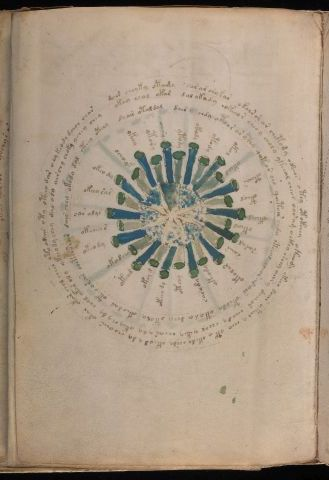

# Voynich Speculative Procedural Protocol — f69v

IMPORTANT: this is NOT a real or validated translation of the Voynich Manuscript. It is a speculative/procedural model that interprets EVA using a user-defined grammar to generate experimental recipes using safe, known edible substitutes.

This file is generated automatically from IVTFF/EVA transliteration plus a user-defined procedural grammar.



## Page / Folio
- folio: f69v
- page_number: 132
- section: cosmological

## EVA Text (Transliteration)
```text
dair cheyky otaza sar ar chykar okoirsh ar chetody okeeos o tey otokeeey okeeody okeey doiir c@204;teeo y chey ot y okedy chsdy okeod y dy choaiin okar okar chol chees yto odair oty oteeo dar o eykeody dchor char
ykac@204; chol ykar dal ykady [i:?]okeeor cheey choly ykeeal cheo[?:s] oaram ockhy sheey aiin y daii[a:?]l cheody cheal yetey chear y dy ykey ch y dy chol ykar ol y ykeeody chey dal ody airchy choky ychey chey
doair otaldal dair @240; chdy otoar ar @240; chy qoteor cho qotair chda oteeal cheor ar air oteody ytyd a dchy otoly okeodal oteoarar cheteese?r dair chey okody dal oteey oteey
okeey sar
okeo dy
ochoyk
ykeey
ytory
oeesy
ytody
okody
otody
oke[a:o]l
okeod
oteeys
oteol
ykeydy
okeod
saral
saiir
okolar
ykeody
sarydy
otchy
okeey dy
okey [d:g]
okeod
okodchy
okeody
okchey[s:r]
oar alys
```

## Domain Context (Heuristic; Not a Translation)

This section summarizes recurring **basewords** in this IVTFF domain and shows simple substring evidence that the token markers used by the procedural grammar occur inside frequent words.

Any Italian anagram / English gloss is a best-effort lexicon match, not a decipherment.


### Associated basewords (non-generic; top by frequency in this domain)
- `daiin` (count=28) → Italian anagram `piani`; English: plans (arrangements)
- `qokal` (count=13) → Italian anagram `calco`; English: cast (of sculpture)
- `odaiin` (count=8) → Italian anagram `inopia`; English: poverty
- `okees` (count=7) → Italian anagram `coese`; English: [n/a]
- `opaiin` (count=6) → Italian anagram `inopia`; English: poverty
- `ykaiin` (count=5) → Italian anagram `acini`; English: [n/a]
- `qodaiin` (count=5) → Italian anagram `apocini`; English: [n/a]
- `oteos` (count=5) → Italian anagram `osteo`; English: [n/a]
- `olkar` (count=5) → Italian anagram `carlo`; English: [n/a]
- `okaiin` (count=4) → Italian anagram `coniai`; English: [n/a]
- `qotaiin` (count=4) → Italian anagram `cationi`; English: [n/a]
- `qokaiin` (count=3) → Italian anagram `ciancio`; English: [n/a]
- `qokar` (count=3) → Italian anagram `carco`; English: [n/a]
- `olaiin` (count=3) → Italian anagram `ialino`; English: hyaline, glassy
- `oraiin` (count=3) → Italian anagram `aironi`; English: [n/a]

### Marker evidence (substring in frequent basewords)
- `qo`: 35 basewords; examples: `qokal`, `qodaiin`, `qokedy`, `qotaiin`, `qokaiin`, `qokar`
- `q`: 36 basewords; examples: `qokal`, `qodaiin`, `qokedy`, `qotaiin`, `qokaiin`, `qokar`
- `o`: 173 basewords; examples: `o`, `ol`, `or`, `otedy`, `oteey`, `okal`
- `k`: 85 basewords; examples: `okal`, `k`, `qokal`, `okeey`, `okar`, `okody`
- `t`: 73 basewords; examples: `otedy`, `oteey`, `otar`, `oteedy`, `otody`, `oty`
- `p`: 8 basewords; examples: `opaiin`, `opar`, `opchdy`, `p`, `opchedy`, `pol`
- `ch`: 81 basewords; examples: `chol`, `chedy`, `chey`, `chdy`, `ch`, `chy`
- `sh`: 28 basewords; examples: `shedy`, `sheey`, `shol`, `shedaiin`, `sho`, `sheody`
- `f`: 1 basewords; examples: `f`
- `cth`: 6 basewords; examples: `chcthy`, `cthy`, `cthol`, `chocthy`, `cthody`, `ctheey`
- `ckh`: 4 basewords; examples: `chckhy`, `chckhey`, `checkhy`, `ockhy`
- `dy`: 59 basewords; examples: `dy`, `otedy`, `chedy`, `shedy`, `chdy`, `oteedy`
- `iin`: 26 basewords; examples: `aiin`, `daiin`, `odaiin`, `opaiin`, `shedaiin`, `otaiin`
- `aiin`: 23 basewords; examples: `aiin`, `daiin`, `odaiin`, `opaiin`, `shedaiin`, `otaiin`

## Recipes Index (This Page)
- [f69v.1,@Cc](#f69v-1-f69v-1-cc)
- [f69v.2,@Cc](#f69v-2-f69v-2-cc)
- [f69v.3,@Cc](#f69v-3-f69v-3-cc)
- [f69v.4,@Ri](#f69v-4-f69v-4-ri)
- [f69v.5,@Ri](#f69v-5-f69v-5-ri)
- [f69v.6,@Ri](#f69v-6-f69v-6-ri)
- [f69v.7,@Ri](#f69v-7-f69v-7-ri)
- [f69v.8,@Ri](#f69v-8-f69v-8-ri)
- [f69v.9,@Ri](#f69v-9-f69v-9-ri)
- [f69v.10,@Ri](#f69v-10-f69v-10-ri)
- [f69v.11,@Ri](#f69v-11-f69v-11-ri)
- [f69v.12,@Ri](#f69v-12-f69v-12-ri)
- [f69v.13,@Ri](#f69v-13-f69v-13-ri)
- [f69v.14,@Ri](#f69v-14-f69v-14-ri)
- [f69v.15,@Ri](#f69v-15-f69v-15-ri)
- [f69v.16,@Ri](#f69v-16-f69v-16-ri)
- [f69v.17,@Ri](#f69v-17-f69v-17-ri)
- [f69v.18,@Ri](#f69v-18-f69v-18-ri)
- [f69v.19,@Ri](#f69v-19-f69v-19-ri)
- [f69v.20,@Ri](#f69v-20-f69v-20-ri)
- [f69v.21,@Ri](#f69v-21-f69v-21-ri)
- [f69v.22,@Ri](#f69v-22-f69v-22-ri)
- [f69v.23,@Ri](#f69v-23-f69v-23-ri)
- [f69v.24,@Ri](#f69v-24-f69v-24-ri)
- [f69v.25,@Ri](#f69v-25-f69v-25-ri)
- [f69v.26,@Ri](#f69v-26-f69v-26-ri)
- [f69v.27,@Ri](#f69v-27-f69v-27-ri)
- [f69v.28,@Ri](#f69v-28-f69v-28-ri)
- [f69v.29,@Ri](#f69v-29-f69v-29-ri)
- [f69v.30,@Ri](#f69v-30-f69v-30-ri)
- [f69v.31,@Ri](#f69v-31-f69v-31-ri)

## Line Glosses (Procedural Gloss Only; Not a Translation)

<a id="f69v-1-f69v-1-cc"></a>

### f69v.1,@Cc

EVA: dair cheyky otaza sar ar chykar okoirsh ar chetody okeeos o tey otokeeey okeeody okeey doiir c@204;teeo y chey ot y okedy chsdy okeod y dy choaiin okar okar chol chees yto odair oty oteeo dar o eykeody dchor char

Direct Gloss (Procedural, Not a Real Translation):
- dair: add starter / activate → duration level 1 → state: phase transition/start
- cheyky: add fermentable sugars → add main plant (safe substitute) → duration level 1 → state: active extraction
- otaza: apply heat/cooking → mix / transfer → duration level 1 → state: phase transition/start → unmodeled token(s) present: z
- sar: duration level 1 → state: phase transition/start
- ar: duration level 1 → state: phase transition/start
- chykar: add fermentable sugars → add main plant (safe substitute) → duration level 1 → state: phase transition/start
- okoirsh: add fermentable sugars → add secondary herb (safe substitute) → mix / transfer → duration level 1 → state: cooling/rest
- ar: duration level 1 → state: phase transition/start
- chetody: apply heat/cooking → add main plant (safe substitute) → mix / transfer → add starter / activate → duration level 1 → state: active extraction
- okeeos: add fermentable sugars → mix / transfer → duration level 2 → state: active extraction
- o: mix / transfer
- tey: apply heat/cooking → duration level 1 → state: active extraction
- otokeeey: add fermentable sugars → apply heat/cooking → mix / transfer → duration level 3 → state: active extraction
- okeeody: add fermentable sugars → mix / transfer → add starter / activate → duration level 2 → state: active extraction
- okeey: add fermentable sugars → mix / transfer → duration level 2 → state: active extraction
- doiir: mix / transfer → add starter / activate → duration level 2 → state: cooling/rest
- c: [unparsed]
- teeo: apply heat/cooking → mix / transfer → duration level 2 → state: active extraction
- y: [unparsed]
- chey: add main plant (safe substitute) → duration level 1 → state: active extraction
- ot: apply heat/cooking → mix / transfer
- y: [unparsed]
- okedy: add fermentable sugars → mix / transfer → add starter / activate → duration level 1 → state: active extraction
- chsdy: add main plant (safe substitute) → add starter / activate
- okeod: add fermentable sugars → mix / transfer → add starter / activate → duration level 1 → state: active extraction
- y: [unparsed]
- dy: add starter / activate
- choaiin: add main plant (safe substitute) → mix / transfer → duration level 1 → state: phase transition/start → long phase
- okar: add fermentable sugars → mix / transfer → duration level 1 → state: phase transition/start
- okar: add fermentable sugars → mix / transfer → duration level 1 → state: phase transition/start
- chol: add main plant (safe substitute) → mix / transfer
- chees: add main plant (safe substitute) → duration level 2 → state: active extraction
- yto: apply heat/cooking → mix / transfer
- odair: mix / transfer → add starter / activate → duration level 1 → state: phase transition/start
- oty: apply heat/cooking → mix / transfer
- oteeo: apply heat/cooking → mix / transfer → duration level 2 → state: active extraction
- dar: add starter / activate → duration level 1 → state: phase transition/start
- o: mix / transfer
- eykeody: add fermentable sugars → mix / transfer → add starter / activate → duration level 1 → state: active extraction
- dchor: add main plant (safe substitute) → mix / transfer → add starter / activate
- char: add main plant (safe substitute) → duration level 1 → state: phase transition/start

<a id="f69v-2-f69v-2-cc"></a>

### f69v.2,@Cc

EVA: ykac@204; chol ykar dal ykady [i:?]okeeor cheey choly ykeeal cheo[?:s] oaram ockhy sheey aiin y daii[a:?]l cheody cheal yetey chear y dy ykey ch y dy chol ykar ol y ykeeody chey dal ody airchy choky ychey chey

Direct Gloss (Procedural, Not a Real Translation):
- ykac: add fermentable sugars → duration level 1 → state: phase transition/start
- chol: add main plant (safe substitute) → mix / transfer
- ykar: add fermentable sugars → duration level 1 → state: phase transition/start
- dal: add starter / activate → duration level 1 → state: phase transition/start
- ykady: add fermentable sugars → add starter / activate → duration level 1 → state: phase transition/start
- i: duration level 1 → state: cooling/rest
- okeeor: add fermentable sugars → mix / transfer → duration level 2 → state: active extraction
- cheey: add main plant (safe substitute) → duration level 2 → state: active extraction
- choly: add main plant (safe substitute) → mix / transfer
- ykeeal: add fermentable sugars → duration level 2 → state: active extraction
- cheo: add main plant (safe substitute) → mix / transfer → duration level 1 → state: active extraction
- s: [unparsed]
- oaram: mix / transfer → duration level 1 → state: phase transition/start
- ockhy: mix / transfer → add complex herbal compound (safe blend)
- sheey: add secondary herb (safe substitute) → duration level 2 → state: active extraction
- aiin: duration level 1 → state: phase transition/start → long phase
- y: [unparsed]
- daii: add starter / activate → duration level 1 → state: phase transition/start
- a: duration level 1 → state: phase transition/start
- l: [unparsed]
- cheody: add main plant (safe substitute) → mix / transfer → add starter / activate → duration level 1 → state: active extraction
- cheal: add main plant (safe substitute) → duration level 1 → state: active extraction
- yetey: apply heat/cooking → duration level 1 → state: active extraction
- chear: add main plant (safe substitute) → duration level 1 → state: active extraction
- y: [unparsed]
- dy: add starter / activate
- ykey: add fermentable sugars → duration level 1 → state: active extraction
- ch: add main plant (safe substitute)
- y: [unparsed]
- dy: add starter / activate
- chol: add main plant (safe substitute) → mix / transfer
- ykar: add fermentable sugars → duration level 1 → state: phase transition/start
- ol: mix / transfer
- y: [unparsed]
- ykeeody: add fermentable sugars → mix / transfer → add starter / activate → duration level 2 → state: active extraction
- chey: add main plant (safe substitute) → duration level 1 → state: active extraction
- dal: add starter / activate → duration level 1 → state: phase transition/start
- ody: mix / transfer → add starter / activate
- airchy: add main plant (safe substitute) → duration level 1 → state: phase transition/start
- choky: add fermentable sugars → add main plant (safe substitute) → mix / transfer
- ychey: add main plant (safe substitute) → duration level 1 → state: active extraction
- chey: add main plant (safe substitute) → duration level 1 → state: active extraction

<a id="f69v-3-f69v-3-cc"></a>

### f69v.3,@Cc

EVA: doair otaldal dair @240; chdy otoar ar @240; chy qoteor cho qotair chda oteeal cheor ar air oteody ytyd a dchy otoly okeodal oteoarar cheteese?r dair chey okody dal oteey oteey

Direct Gloss (Procedural, Not a Real Translation):
- doair: mix / transfer → add starter / activate → duration level 1 → state: phase transition/start
- otaldal: apply heat/cooking → mix / transfer → add starter / activate → duration level 1 → state: phase transition/start
- dair: add starter / activate → duration level 1 → state: phase transition/start
- chdy: add main plant (safe substitute) → add starter / activate
- otoar: apply heat/cooking → mix / transfer → duration level 1 → state: phase transition/start
- ar: duration level 1 → state: phase transition/start
- chy: add main plant (safe substitute)
- qoteor: prepare liquid base → apply heat/cooking → mix / transfer → duration level 1 → state: active extraction
- cho: add main plant (safe substitute) → mix / transfer
- qotair: prepare liquid base → apply heat/cooking → duration level 1 → state: phase transition/start
- chda: add main plant (safe substitute) → add starter / activate → duration level 1 → state: phase transition/start
- oteeal: apply heat/cooking → mix / transfer → duration level 2 → state: active extraction
- cheor: add main plant (safe substitute) → mix / transfer → duration level 1 → state: active extraction
- ar: duration level 1 → state: phase transition/start
- air: duration level 1 → state: phase transition/start
- oteody: apply heat/cooking → mix / transfer → add starter / activate → duration level 1 → state: active extraction
- ytyd: apply heat/cooking → add starter / activate
- a: duration level 1 → state: phase transition/start
- dchy: add main plant (safe substitute) → add starter / activate
- otoly: apply heat/cooking → mix / transfer
- okeodal: add fermentable sugars → mix / transfer → add starter / activate → duration level 1 → state: active extraction
- oteoarar: apply heat/cooking → mix / transfer → duration level 1 → state: active extraction
- cheteese: apply heat/cooking → add main plant (safe substitute) → duration level 1 → state: active extraction
- r: [unparsed]
- dair: add starter / activate → duration level 1 → state: phase transition/start
- chey: add main plant (safe substitute) → duration level 1 → state: active extraction
- okody: add fermentable sugars → mix / transfer → add starter / activate
- dal: add starter / activate → duration level 1 → state: phase transition/start
- oteey: apply heat/cooking → mix / transfer → duration level 2 → state: active extraction
- oteey: apply heat/cooking → mix / transfer → duration level 2 → state: active extraction

<a id="f69v-4-f69v-4-ri"></a>

### f69v.4,@Ri

EVA: okeey sar

Direct Gloss (Procedural, Not a Real Translation):
- okeey: add fermentable sugars → mix / transfer → duration level 2 → state: active extraction
- sar: duration level 1 → state: phase transition/start

<a id="f69v-5-f69v-5-ri"></a>

### f69v.5,@Ri

EVA: okeo dy

Direct Gloss (Procedural, Not a Real Translation):
- okeo: add fermentable sugars → mix / transfer → duration level 1 → state: active extraction
- dy: add starter / activate

<a id="f69v-6-f69v-6-ri"></a>

### f69v.6,@Ri

EVA: ochoyk

Direct Gloss (Procedural, Not a Real Translation):
- ochoyk: add fermentable sugars → add main plant (safe substitute) → mix / transfer

<a id="f69v-7-f69v-7-ri"></a>

### f69v.7,@Ri

EVA: ykeey

Direct Gloss (Procedural, Not a Real Translation):
- ykeey: add fermentable sugars → duration level 2 → state: active extraction

<a id="f69v-8-f69v-8-ri"></a>

### f69v.8,@Ri

EVA: ytory

Direct Gloss (Procedural, Not a Real Translation):
- ytory: apply heat/cooking → mix / transfer

<a id="f69v-9-f69v-9-ri"></a>

### f69v.9,@Ri

EVA: oeesy

Direct Gloss (Procedural, Not a Real Translation):
- oeesy: mix / transfer → duration level 2 → state: active extraction

<a id="f69v-10-f69v-10-ri"></a>

### f69v.10,@Ri

EVA: ytody

Direct Gloss (Procedural, Not a Real Translation):
- ytody: apply heat/cooking → mix / transfer → add starter / activate

<a id="f69v-11-f69v-11-ri"></a>

### f69v.11,@Ri

EVA: okody

Direct Gloss (Procedural, Not a Real Translation):
- okody: add fermentable sugars → mix / transfer → add starter / activate

<a id="f69v-12-f69v-12-ri"></a>

### f69v.12,@Ri

EVA: otody

Direct Gloss (Procedural, Not a Real Translation):
- otody: apply heat/cooking → mix / transfer → add starter / activate

<a id="f69v-13-f69v-13-ri"></a>

### f69v.13,@Ri

EVA: oke[a:o]l

Direct Gloss (Procedural, Not a Real Translation):
- oke: add fermentable sugars → mix / transfer → duration level 1 → state: active extraction
- a: duration level 1 → state: phase transition/start
- o: mix / transfer
- l: [unparsed]

<a id="f69v-14-f69v-14-ri"></a>

### f69v.14,@Ri

EVA: okeod

Direct Gloss (Procedural, Not a Real Translation):
- okeod: add fermentable sugars → mix / transfer → add starter / activate → duration level 1 → state: active extraction

<a id="f69v-15-f69v-15-ri"></a>

### f69v.15,@Ri

EVA: oteeys

Direct Gloss (Procedural, Not a Real Translation):
- oteeys: apply heat/cooking → mix / transfer → duration level 2 → state: active extraction

<a id="f69v-16-f69v-16-ri"></a>

### f69v.16,@Ri

EVA: oteol

Direct Gloss (Procedural, Not a Real Translation):
- oteol: apply heat/cooking → mix / transfer → duration level 1 → state: active extraction

<a id="f69v-17-f69v-17-ri"></a>

### f69v.17,@Ri

EVA: ykeydy

Direct Gloss (Procedural, Not a Real Translation):
- ykeydy: add fermentable sugars → add starter / activate → duration level 1 → state: active extraction

<a id="f69v-18-f69v-18-ri"></a>

### f69v.18,@Ri

EVA: okeod

Direct Gloss (Procedural, Not a Real Translation):
- okeod: add fermentable sugars → mix / transfer → add starter / activate → duration level 1 → state: active extraction

<a id="f69v-19-f69v-19-ri"></a>

### f69v.19,@Ri

EVA: saral

Direct Gloss (Procedural, Not a Real Translation):
- saral: duration level 1 → state: phase transition/start

<a id="f69v-20-f69v-20-ri"></a>

### f69v.20,@Ri

EVA: saiir

Direct Gloss (Procedural, Not a Real Translation):
- saiir: duration level 1 → state: phase transition/start

<a id="f69v-21-f69v-21-ri"></a>

### f69v.21,@Ri

EVA: okolar

Direct Gloss (Procedural, Not a Real Translation):
- okolar: add fermentable sugars → mix / transfer → duration level 1 → state: phase transition/start

<a id="f69v-22-f69v-22-ri"></a>

### f69v.22,@Ri

EVA: ykeody

Direct Gloss (Procedural, Not a Real Translation):
- ykeody: add fermentable sugars → mix / transfer → add starter / activate → duration level 1 → state: active extraction

<a id="f69v-23-f69v-23-ri"></a>

### f69v.23,@Ri

EVA: sarydy

Direct Gloss (Procedural, Not a Real Translation):
- sarydy: add starter / activate → duration level 1 → state: phase transition/start

<a id="f69v-24-f69v-24-ri"></a>

### f69v.24,@Ri

EVA: otchy

Direct Gloss (Procedural, Not a Real Translation):
- otchy: apply heat/cooking → add main plant (safe substitute) → mix / transfer

<a id="f69v-25-f69v-25-ri"></a>

### f69v.25,@Ri

EVA: okeey dy

Direct Gloss (Procedural, Not a Real Translation):
- okeey: add fermentable sugars → mix / transfer → duration level 2 → state: active extraction
- dy: add starter / activate

<a id="f69v-26-f69v-26-ri"></a>

### f69v.26,@Ri

EVA: okey [d:g]

Direct Gloss (Procedural, Not a Real Translation):
- okey: add fermentable sugars → mix / transfer → duration level 1 → state: active extraction
- d: add starter / activate
- g: [unparsed]

<a id="f69v-27-f69v-27-ri"></a>

### f69v.27,@Ri

EVA: okeod

Direct Gloss (Procedural, Not a Real Translation):
- okeod: add fermentable sugars → mix / transfer → add starter / activate → duration level 1 → state: active extraction

<a id="f69v-28-f69v-28-ri"></a>

### f69v.28,@Ri

EVA: okodchy

Direct Gloss (Procedural, Not a Real Translation):
- okodchy: add fermentable sugars → add main plant (safe substitute) → mix / transfer → add starter / activate

<a id="f69v-29-f69v-29-ri"></a>

### f69v.29,@Ri

EVA: okeody

Direct Gloss (Procedural, Not a Real Translation):
- okeody: add fermentable sugars → mix / transfer → add starter / activate → duration level 1 → state: active extraction

<a id="f69v-30-f69v-30-ri"></a>

### f69v.30,@Ri

EVA: okchey[s:r]

Direct Gloss (Procedural, Not a Real Translation):
- okchey: add fermentable sugars → add main plant (safe substitute) → mix / transfer → duration level 1 → state: active extraction
- s: [unparsed]
- r: [unparsed]

<a id="f69v-31-f69v-31-ri"></a>

### f69v.31,@Ri

EVA: oar alys

Direct Gloss (Procedural, Not a Real Translation):
- oar: mix / transfer → duration level 1 → state: phase transition/start
- alys: duration level 1 → state: phase transition/start
