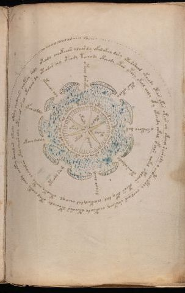

# Voynich Speculative Herbal Ferment Recipe — f70r1

IMPORTANT: this is NOT a real or validated translation of the Voynich Manuscript. It is a speculative/procedural model that interprets EVA using a user-defined grammar to generate experimental recipes using safe, known edible substitutes.

This file is generated automatically from IVTFF/EVA transliteration plus a user-defined procedural grammar.



## Page / Folio
- folio: f70r1
- page_number: 133
- section: cosmological

## EVA Text (Transliteration)
```text
???ooooooooolar sasa
oteody choekeeos alair dy okol okeey dasy ot[a:o]rsheod okchody oteos okes okeys [e:i]y okchol sairody o chopcheopchy chol air shekchy choteody oteeshs opcheody otol choky chody chotey sheal ar ykeody oteey chedaiin chotar soly
okeodar chy oteody tochady okchody ytar ytory okeol choly yk y okchedy chkal ofchon qokal opolaiin okeos oty dal cheokeey dal cheo al oteeoky chety chodalar okal chear aly oteos ar os al okolair dy
yfcheodly
ytcheos aly
otchy dar yky
opar ykchy
y saikchy dam
otair oroldy
dchal daim
yteody sam
okchy daldy
tshey ol oteey ched ar oteos cheor alal otar ar y oteodchey keody oteos al oteeed
ykeal
okeody
otody
ypolol
chodal
okasd
```

## Domain Context (Heuristic; Not a Translation)

This section summarizes recurring **basewords** in this IVTFF domain and shows simple substring evidence that the token markers used by the procedural grammar occur inside frequent words.

Any Italian anagram / English gloss is a best-effort lexicon match, not a decipherment.


### Associated basewords (non-generic; top by frequency in this domain)
- `daiin` (count=28) → Italian anagram `piani`; English: plans (arrangements)
- `qokal` (count=13) → Italian anagram `calco`; English: cast (of sculpture)
- `odaiin` (count=8) → Italian anagram `inopia`; English: poverty
- `okees` (count=7) → Italian anagram `coese`; English: [n/a]
- `opaiin` (count=6) → Italian anagram `inopia`; English: poverty
- `ykaiin` (count=5) → Italian anagram `acini`; English: [n/a]
- `qodaiin` (count=5) → Italian anagram `apocini`; English: [n/a]
- `oteos` (count=5) → Italian anagram `osteo`; English: [n/a]
- `olkar` (count=5) → Italian anagram `carlo`; English: [n/a]
- `okaiin` (count=4) → Italian anagram `coniai`; English: [n/a]
- `qotaiin` (count=4) → Italian anagram `cationi`; English: [n/a]
- `qokaiin` (count=3) → Italian anagram `ciancio`; English: [n/a]
- `qokar` (count=3) → Italian anagram `carco`; English: [n/a]
- `olaiin` (count=3) → Italian anagram `ialino`; English: hyaline, glassy
- `oraiin` (count=3) → Italian anagram `aironi`; English: [n/a]

### Marker evidence (substring in frequent basewords)
- `qo`: 35 basewords; examples: `qokal`, `qodaiin`, `qokedy`, `qotaiin`, `qokaiin`, `qokar`
- `q`: 36 basewords; examples: `qokal`, `qodaiin`, `qokedy`, `qotaiin`, `qokaiin`, `qokar`
- `o`: 173 basewords; examples: `o`, `ol`, `or`, `otedy`, `oteey`, `okal`
- `k`: 85 basewords; examples: `okal`, `k`, `qokal`, `okeey`, `okar`, `okody`
- `t`: 73 basewords; examples: `otedy`, `oteey`, `otar`, `oteedy`, `otody`, `oty`
- `p`: 8 basewords; examples: `opaiin`, `opar`, `opchdy`, `p`, `opchedy`, `pol`
- `ch`: 81 basewords; examples: `chol`, `chedy`, `chey`, `chdy`, `ch`, `chy`
- `sh`: 28 basewords; examples: `shedy`, `sheey`, `shol`, `shedaiin`, `sho`, `sheody`
- `f`: 1 basewords; examples: `f`
- `cth`: 6 basewords; examples: `chcthy`, `cthy`, `cthol`, `chocthy`, `cthody`, `ctheey`
- `ckh`: 4 basewords; examples: `chckhy`, `chckhey`, `checkhy`, `ockhy`
- `dy`: 59 basewords; examples: `dy`, `otedy`, `chedy`, `shedy`, `chdy`, `oteedy`
- `iin`: 26 basewords; examples: `aiin`, `daiin`, `odaiin`, `opaiin`, `shedaiin`, `otaiin`
- `aiin`: 23 basewords; examples: `aiin`, `daiin`, `odaiin`, `opaiin`, `shedaiin`, `otaiin`

## Recipes Index (This Page)
- [f70r1.1,@Cc](#f70r1-1-f70r1-1-cc)
- [f70r1.2,@Cc](#f70r1-2-f70r1-2-cc)
- [f70r1.3,+Cc](#f70r1-3-f70r1-3-cc)
- [f70r1.4,@Ri](#f70r1-4-f70r1-4-ri)
- [f70r1.5,@Ri](#f70r1-5-f70r1-5-ri)
- [f70r1.6,@Ri](#f70r1-6-f70r1-6-ri)
- [f70r1.7,@Ri](#f70r1-7-f70r1-7-ri)
- [f70r1.8,@Ri](#f70r1-8-f70r1-8-ri)
- [f70r1.9,@Ri](#f70r1-9-f70r1-9-ri)
- [f70r1.10,@Ri](#f70r1-10-f70r1-10-ri)
- [f70r1.11,@Ri](#f70r1-11-f70r1-11-ri)
- [f70r1.12,@Ri](#f70r1-12-f70r1-12-ri)
- [f70r1.13,@Cc](#f70r1-13-f70r1-13-cc)
- [f70r1.14,@Ri](#f70r1-14-f70r1-14-ri)
- [f70r1.15,@Ri](#f70r1-15-f70r1-15-ri)
- [f70r1.16,@Ri](#f70r1-16-f70r1-16-ri)
- [f70r1.17,@Ri](#f70r1-17-f70r1-17-ri)
- [f70r1.18,@Ri](#f70r1-18-f70r1-18-ri)
- [f70r1.19,@Ri](#f70r1-19-f70r1-19-ri)

## Line Glosses (Procedural Gloss Only; Not a Translation)

<a id="f70r1-1-f70r1-1-cc"></a>

### f70r1.1,@Cc

EVA: ???ooooooooolar sasa

Direct Gloss (Procedural, Not a Real Translation):
- ooooooooolar: mix / transfer → duration level 1 → state: fermentation start
- sasa: duration level 1 → state: fermentation start

<a id="f70r1-2-f70r1-2-cc"></a>

### f70r1.2,@Cc

EVA: oteody choekeeos alair dy okol okeey dasy ot[a:o]rsheod okchody oteos okes okeys [e:i]y okchol sairody o chopcheopchy chol air shekchy choteody oteeshs opcheody otol choky chody chotey sheal ar ykeody oteey chedaiin chotar soly

Direct Gloss (Procedural, Not a Real Translation):
- oteody: apply heat/cooking → mix / transfer → start fermentation (yeast) → duration level 1 → state: active extraction
- choekeeos: add fermentable sugars → add main plant (safe substitute) → mix / transfer → duration level 1 → state: active extraction
- alair: duration level 1 → state: fermentation start
- dy: start fermentation (yeast)
- okol: add fermentable sugars → mix / transfer
- okeey: add fermentable sugars → mix / transfer → duration level 2 → state: active extraction
- dasy: start fermentation (yeast) → duration level 1 → state: fermentation start
- ot: apply heat/cooking → mix / transfer
- a: duration level 1 → state: fermentation start
- o: mix / transfer
- rsheod: add secondary herb (safe substitute) → mix / transfer → start fermentation (yeast) → duration level 1 → state: active extraction
- okchody: add fermentable sugars → add main plant (safe substitute) → mix / transfer → start fermentation (yeast)
- oteos: apply heat/cooking → mix / transfer → duration level 1 → state: active extraction
- okes: add fermentable sugars → mix / transfer → duration level 1 → state: active extraction
- okeys: add fermentable sugars → mix / transfer → duration level 1 → state: active extraction
- e: duration level 1 → state: active extraction
- i: duration level 1 → state: cooling/rest
- y: [unparsed]
- okchol: add fermentable sugars → add main plant (safe substitute) → mix / transfer
- sairody: mix / transfer → start fermentation (yeast) → duration level 1 → state: fermentation start
- o: mix / transfer
- chopcheopchy: add main plant (safe substitute) → mix / transfer → start fermentation (yeast) → duration level 1 → state: active extraction
- chol: add main plant (safe substitute) → mix / transfer
- air: duration level 1 → state: fermentation start
- shekchy: add fermentable sugars → add main plant (safe substitute) → add secondary herb (safe substitute) → duration level 1 → state: active extraction
- choteody: apply heat/cooking → add main plant (safe substitute) → mix / transfer → start fermentation (yeast) → duration level 1 → state: active extraction
- oteeshs: apply heat/cooking → add secondary herb (safe substitute) → mix / transfer → duration level 2 → state: active extraction
- opcheody: add main plant (safe substitute) → mix / transfer → start fermentation (yeast) → duration level 1 → state: active extraction
- otol: apply heat/cooking → mix / transfer
- choky: add fermentable sugars → add main plant (safe substitute) → mix / transfer
- chody: add main plant (safe substitute) → mix / transfer → start fermentation (yeast)
- chotey: apply heat/cooking → add main plant (safe substitute) → mix / transfer → duration level 1 → state: active extraction
- sheal: add secondary herb (safe substitute) → duration level 1 → state: active extraction
- ar: duration level 1 → state: fermentation start
- ykeody: add fermentable sugars → mix / transfer → start fermentation (yeast) → duration level 1 → state: active extraction
- oteey: apply heat/cooking → mix / transfer → duration level 2 → state: active extraction
- chedaiin: add main plant (safe substitute) → start fermentation (yeast) → duration level 1 → state: active extraction → long fermentation / aging phase
- chotar: apply heat/cooking → add main plant (safe substitute) → mix / transfer → duration level 1 → state: fermentation start
- soly: mix / transfer

<a id="f70r1-3-f70r1-3-cc"></a>

### f70r1.3,+Cc

EVA: okeodar chy oteody tochady okchody ytar ytory okeol choly yk y okchedy chkal ofchon qokal opolaiin okeos oty dal cheokeey dal cheo al oteeoky chety chodalar okal chear aly oteos ar os al okolair dy

Direct Gloss (Procedural, Not a Real Translation):
- okeodar: add fermentable sugars → mix / transfer → start fermentation (yeast) → duration level 1 → state: active extraction
- chy: add main plant (safe substitute)
- oteody: apply heat/cooking → mix / transfer → start fermentation (yeast) → duration level 1 → state: active extraction
- tochady: apply heat/cooking → add main plant (safe substitute) → mix / transfer → start fermentation (yeast) → duration level 1 → state: fermentation start
- okchody: add fermentable sugars → add main plant (safe substitute) → mix / transfer → start fermentation (yeast)
- ytar: apply heat/cooking → duration level 1 → state: fermentation start
- ytory: apply heat/cooking → mix / transfer
- okeol: add fermentable sugars → mix / transfer → duration level 1 → state: active extraction
- choly: add main plant (safe substitute) → mix / transfer
- yk: add fermentable sugars
- y: [unparsed]
- okchedy: add fermentable sugars → add main plant (safe substitute) → mix / transfer → start fermentation (yeast) → duration level 1 → state: active extraction
- chkal: add fermentable sugars → add main plant (safe substitute) → duration level 1 → state: fermentation start
- ofchon: add main plant (safe substitute) → add aroma modifier → mix / transfer
- qokal: prepare liquid base → add fermentable sugars → duration level 1 → state: fermentation start
- opolaiin: mix / transfer → start fermentation (yeast) → duration level 1 → state: fermentation start → long fermentation / aging phase
- okeos: add fermentable sugars → mix / transfer → duration level 1 → state: active extraction
- oty: apply heat/cooking → mix / transfer
- dal: start fermentation (yeast) → duration level 1 → state: fermentation start
- cheokeey: add fermentable sugars → add main plant (safe substitute) → mix / transfer → duration level 1 → state: active extraction
- dal: start fermentation (yeast) → duration level 1 → state: fermentation start
- cheo: add main plant (safe substitute) → mix / transfer → duration level 1 → state: active extraction
- al: duration level 1 → state: fermentation start
- oteeoky: add fermentable sugars → apply heat/cooking → mix / transfer → duration level 2 → state: active extraction
- chety: apply heat/cooking → add main plant (safe substitute) → duration level 1 → state: active extraction
- chodalar: add main plant (safe substitute) → mix / transfer → start fermentation (yeast) → duration level 1 → state: fermentation start
- okal: add fermentable sugars → mix / transfer → duration level 1 → state: fermentation start
- chear: add main plant (safe substitute) → duration level 1 → state: active extraction
- aly: duration level 1 → state: fermentation start
- oteos: apply heat/cooking → mix / transfer → duration level 1 → state: active extraction
- ar: duration level 1 → state: fermentation start
- os: mix / transfer
- al: duration level 1 → state: fermentation start
- okolair: add fermentable sugars → mix / transfer → duration level 1 → state: fermentation start
- dy: start fermentation (yeast)

<a id="f70r1-4-f70r1-4-ri"></a>

### f70r1.4,@Ri

EVA: yfcheodly

Direct Gloss (Procedural, Not a Real Translation):
- yfcheodly: add main plant (safe substitute) → add aroma modifier → mix / transfer → start fermentation (yeast) → duration level 1 → state: active extraction

<a id="f70r1-5-f70r1-5-ri"></a>

### f70r1.5,@Ri

EVA: ytcheos aly

Direct Gloss (Procedural, Not a Real Translation):
- ytcheos: apply heat/cooking → add main plant (safe substitute) → mix / transfer → duration level 1 → state: active extraction
- aly: duration level 1 → state: fermentation start

<a id="f70r1-6-f70r1-6-ri"></a>

### f70r1.6,@Ri

EVA: otchy dar yky

Direct Gloss (Procedural, Not a Real Translation):
- otchy: apply heat/cooking → add main plant (safe substitute) → mix / transfer
- dar: start fermentation (yeast) → duration level 1 → state: fermentation start
- yky: add fermentable sugars

<a id="f70r1-7-f70r1-7-ri"></a>

### f70r1.7,@Ri

EVA: opar ykchy

Direct Gloss (Procedural, Not a Real Translation):
- opar: mix / transfer → start fermentation (yeast) → duration level 1 → state: fermentation start
- ykchy: add fermentable sugars → add main plant (safe substitute)

<a id="f70r1-8-f70r1-8-ri"></a>

### f70r1.8,@Ri

EVA: y saikchy dam

Direct Gloss (Procedural, Not a Real Translation):
- y: [unparsed]
- saikchy: add fermentable sugars → add main plant (safe substitute) → duration level 1 → state: fermentation start
- dam: start fermentation (yeast) → duration level 1 → state: fermentation start

<a id="f70r1-9-f70r1-9-ri"></a>

### f70r1.9,@Ri

EVA: otair oroldy

Direct Gloss (Procedural, Not a Real Translation):
- otair: apply heat/cooking → mix / transfer → duration level 1 → state: fermentation start
- oroldy: mix / transfer → start fermentation (yeast)

<a id="f70r1-10-f70r1-10-ri"></a>

### f70r1.10,@Ri

EVA: dchal daim

Direct Gloss (Procedural, Not a Real Translation):
- dchal: add main plant (safe substitute) → start fermentation (yeast) → duration level 1 → state: fermentation start
- daim: start fermentation (yeast) → duration level 1 → state: fermentation start

<a id="f70r1-11-f70r1-11-ri"></a>

### f70r1.11,@Ri

EVA: yteody sam

Direct Gloss (Procedural, Not a Real Translation):
- yteody: apply heat/cooking → mix / transfer → start fermentation (yeast) → duration level 1 → state: active extraction
- sam: duration level 1 → state: fermentation start

<a id="f70r1-12-f70r1-12-ri"></a>

### f70r1.12,@Ri

EVA: okchy daldy

Direct Gloss (Procedural, Not a Real Translation):
- okchy: add fermentable sugars → add main plant (safe substitute) → mix / transfer
- daldy: start fermentation (yeast) → duration level 1 → state: fermentation start

<a id="f70r1-13-f70r1-13-cc"></a>

### f70r1.13,@Cc

EVA: tshey ol oteey ched ar oteos cheor alal otar ar y oteodchey keody oteos al oteeed

Direct Gloss (Procedural, Not a Real Translation):
- tshey: apply heat/cooking → add secondary herb (safe substitute) → duration level 1 → state: active extraction
- ol: mix / transfer
- oteey: apply heat/cooking → mix / transfer → duration level 2 → state: active extraction
- ched: add main plant (safe substitute) → start fermentation (yeast) → duration level 1 → state: active extraction
- ar: duration level 1 → state: fermentation start
- oteos: apply heat/cooking → mix / transfer → duration level 1 → state: active extraction
- cheor: add main plant (safe substitute) → mix / transfer → duration level 1 → state: active extraction
- alal: duration level 1 → state: fermentation start
- otar: apply heat/cooking → mix / transfer → duration level 1 → state: fermentation start
- ar: duration level 1 → state: fermentation start
- y: [unparsed]
- oteodchey: apply heat/cooking → add main plant (safe substitute) → mix / transfer → start fermentation (yeast) → duration level 1 → state: active extraction
- keody: add fermentable sugars → mix / transfer → start fermentation (yeast) → duration level 1 → state: active extraction
- oteos: apply heat/cooking → mix / transfer → duration level 1 → state: active extraction
- al: duration level 1 → state: fermentation start
- oteeed: apply heat/cooking → mix / transfer → start fermentation (yeast) → duration level 3 → state: active extraction

<a id="f70r1-14-f70r1-14-ri"></a>

### f70r1.14,@Ri

EVA: ykeal

Direct Gloss (Procedural, Not a Real Translation):
- ykeal: add fermentable sugars → duration level 1 → state: active extraction

<a id="f70r1-15-f70r1-15-ri"></a>

### f70r1.15,@Ri

EVA: okeody

Direct Gloss (Procedural, Not a Real Translation):
- okeody: add fermentable sugars → mix / transfer → start fermentation (yeast) → duration level 1 → state: active extraction

<a id="f70r1-16-f70r1-16-ri"></a>

### f70r1.16,@Ri

EVA: otody

Direct Gloss (Procedural, Not a Real Translation):
- otody: apply heat/cooking → mix / transfer → start fermentation (yeast)

<a id="f70r1-17-f70r1-17-ri"></a>

### f70r1.17,@Ri

EVA: ypolol

Direct Gloss (Procedural, Not a Real Translation):
- ypolol: mix / transfer → start fermentation (yeast)

<a id="f70r1-18-f70r1-18-ri"></a>

### f70r1.18,@Ri

EVA: chodal

Direct Gloss (Procedural, Not a Real Translation):
- chodal: add main plant (safe substitute) → mix / transfer → start fermentation (yeast) → duration level 1 → state: fermentation start

<a id="f70r1-19-f70r1-19-ri"></a>

### f70r1.19,@Ri

EVA: okasd

Direct Gloss (Procedural, Not a Real Translation):
- okasd: add fermentable sugars → mix / transfer → start fermentation (yeast) → duration level 1 → state: fermentation start
