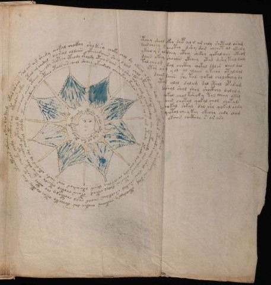

# Voynich Speculative Procedural Protocol — f70r2

IMPORTANT: this is NOT a real or validated translation of the Voynich Manuscript. It is a speculative/procedural model that interprets EVA using a user-defined grammar to generate experimental recipes using safe, known edible substitutes.

This file is generated automatically from IVTFF/EVA transliteration plus a user-defined procedural grammar.



## Page / Folio
- folio: f70r2
- page_number: 134
- section: cosmological

## EVA Text (Transliteration)
```text
otchey sheol chkey shep al r ar chly sheteal aram
dair cheey s cheotey dshy dam chchet al ykec'y
ykeeo y s ald shey cthy shekey qokal aiir oteog
daiin okeey shoaiin ckhhey otal shshy tal dam
tal cheeog dal chcthy qotal ddl[a:o]r chal dal
ytar ar al yol al aloees ytaiir otaldal
daiin daiin she tal qokal cholckhhy dy
ytals alal dalam dal cthol oparam
dolshol shol shol shocthhy dalal y
shokal chol kshody tol cheey okal
daiin chotal qokal chol chotals
qokal shkal dal shy qokal chdy
qotal che y key okechy chdy cham
okaiin chcthhy s or ary
sal air am shedy chokal choikhy shokeey choky chol dy okeeal o teedy dgr dair aiin okees okeear ar alekeey ar kam oteoodalry chekeoar chokey dar dcheoky otai doithy dair otchetchar okear okeeo lal kch[g:?] okar ar dar
otar ar chedal oaral aldaiin ykeeedaiis sheo l dar chol ykees aiir dl cheey [s:r]keeod oteeodar aiin aral daiir sheedal sheodaiin choar chol chot[e:i]oly cho oteey chotey choeky chedy choteosam oteodar ockhh
oches air chese ctheey sheeody shopcho yteody ykaldy oteeos aiin sh[e:?]y shee farar aim cheoteeodal sho choetchaldy dal aiir ches otesar dalol chtam opaiir chokeo oteedy oteeo okol chotal otol al dl
otoy ar arodchedy cheocphey oteeos ees cheal sheeey okeedaly cheeoekey yk[ee:ei]d[cr:ar] oteey s al s air oteody oteody dar aiir ody cheeos chey daiin otoeeseor air chedy okodar al sho chotol dal dy
oteesy ol chy oteo sal ol keey oteol choky otcho[sh:ch]a
```

## Domain Context (Heuristic; Not a Translation)

This section summarizes recurring **basewords** in this IVTFF domain and shows simple substring evidence that the token markers used by the procedural grammar occur inside frequent words.

Any Italian anagram / English gloss is a best-effort lexicon match, not a decipherment.


### Associated basewords (non-generic; top by frequency in this domain)
- `daiin` (count=28) → Italian anagram `piani`; English: plans (arrangements)
- `qokal` (count=13) → Italian anagram `calco`; English: cast (of sculpture)
- `odaiin` (count=8) → Italian anagram `inopia`; English: poverty
- `okees` (count=7) → Italian anagram `coese`; English: [n/a]
- `opaiin` (count=6) → Italian anagram `inopia`; English: poverty
- `ykaiin` (count=5) → Italian anagram `acini`; English: [n/a]
- `qodaiin` (count=5) → Italian anagram `apocini`; English: [n/a]
- `oteos` (count=5) → Italian anagram `osteo`; English: [n/a]
- `olkar` (count=5) → Italian anagram `carlo`; English: [n/a]
- `okaiin` (count=4) → Italian anagram `coniai`; English: [n/a]
- `qotaiin` (count=4) → Italian anagram `cationi`; English: [n/a]
- `qokaiin` (count=3) → Italian anagram `ciancio`; English: [n/a]
- `qokar` (count=3) → Italian anagram `carco`; English: [n/a]
- `olaiin` (count=3) → Italian anagram `ialino`; English: hyaline, glassy
- `oraiin` (count=3) → Italian anagram `aironi`; English: [n/a]

### Marker evidence (substring in frequent basewords)
- `qo`: 35 basewords; examples: `qokal`, `qodaiin`, `qokedy`, `qotaiin`, `qokaiin`, `qokar`
- `q`: 36 basewords; examples: `qokal`, `qodaiin`, `qokedy`, `qotaiin`, `qokaiin`, `qokar`
- `o`: 173 basewords; examples: `o`, `ol`, `or`, `otedy`, `oteey`, `okal`
- `k`: 85 basewords; examples: `okal`, `k`, `qokal`, `okeey`, `okar`, `okody`
- `t`: 73 basewords; examples: `otedy`, `oteey`, `otar`, `oteedy`, `otody`, `oty`
- `p`: 8 basewords; examples: `opaiin`, `opar`, `opchdy`, `p`, `opchedy`, `pol`
- `ch`: 81 basewords; examples: `chol`, `chedy`, `chey`, `chdy`, `ch`, `chy`
- `sh`: 28 basewords; examples: `shedy`, `sheey`, `shol`, `shedaiin`, `sho`, `sheody`
- `f`: 1 basewords; examples: `f`
- `cth`: 6 basewords; examples: `chcthy`, `cthy`, `cthol`, `chocthy`, `cthody`, `ctheey`
- `ckh`: 4 basewords; examples: `chckhy`, `chckhey`, `checkhy`, `ockhy`
- `dy`: 59 basewords; examples: `dy`, `otedy`, `chedy`, `shedy`, `chdy`, `oteedy`
- `iin`: 26 basewords; examples: `aiin`, `daiin`, `odaiin`, `opaiin`, `shedaiin`, `otaiin`
- `aiin`: 23 basewords; examples: `aiin`, `daiin`, `odaiin`, `opaiin`, `shedaiin`, `otaiin`

## Recipes Index (This Page)
- [f70r2.1,@P1](#f70r2-1-f70r2-1-p1)
- [f70r2.2,+P1](#f70r2-2-f70r2-2-p1)
- [f70r2.3,+P1](#f70r2-3-f70r2-3-p1)
- [f70r2.4,+P1](#f70r2-4-f70r2-4-p1)
- [f70r2.5,+P1](#f70r2-5-f70r2-5-p1)
- [f70r2.6,+P1](#f70r2-6-f70r2-6-p1)
- [f70r2.7,+P1](#f70r2-7-f70r2-7-p1)
- [f70r2.8,+P1](#f70r2-8-f70r2-8-p1)
- [f70r2.9,+P1](#f70r2-9-f70r2-9-p1)
- [f70r2.10,+P1](#f70r2-10-f70r2-10-p1)
- [f70r2.11,+P1](#f70r2-11-f70r2-11-p1)
- [f70r2.12,+P1](#f70r2-12-f70r2-12-p1)
- [f70r2.13,+P1](#f70r2-13-f70r2-13-p1)
- [f70r2.14,+P1](#f70r2-14-f70r2-14-p1)
- [f70r2.15,@Cc](#f70r2-15-f70r2-15-cc)
- [f70r2.16,+Cc](#f70r2-16-f70r2-16-cc)
- [f70r2.17,+Cc](#f70r2-17-f70r2-17-cc)
- [f70r2.18,+Cc](#f70r2-18-f70r2-18-cc)
- [f70r2.19,@Cc](#f70r2-19-f70r2-19-cc)

## Line Glosses (Procedural Gloss Only; Not a Translation)

<a id="f70r2-1-f70r2-1-p1"></a>

### f70r2.1,@P1

EVA: otchey sheol chkey shep al r ar chly sheteal aram

Direct Gloss (Procedural, Not a Real Translation):
- otchey: tokens: o t ch e → vowel_run: e (level 1; class e)
- sheol: tokens: sh e o l → connectors: l → vowel_run: e (level 1; class e)
- chkey: tokens: ch k e → vowel_run: e (level 1; class e)
- shep: tokens: sh e p → vowel_run: e (level 1; class e)
- al: tokens: a l → connectors: l → vowel_run: a (level 1; class a)
- r: tokens: r → connectors: r
- ar: tokens: a r → connectors: r → vowel_run: a (level 1; class a)
- chly: tokens: ch l → connectors: l
- sheteal: tokens: sh e t e a l → connectors: l → vowel_run: e (level 1; class e)
- aram: tokens: a r a m → connectors: r m → vowel_run: a (level 1; class a)

<a id="f70r2-2-f70r2-2-p1"></a>

### f70r2.2,+P1

EVA: dair cheey s cheotey dshy dam chchet al ykec'y

Direct Gloss (Procedural, Not a Real Translation):
- dair: tokens: p a i r → connectors: r → vowel_run: a (level 1; class a)
- cheey: tokens: ch ee → vowel_run: ee (level 2; class e)
- s: tokens: s → connectors: s
- cheotey: tokens: ch e o t e → vowel_run: e (level 1; class e)
- dshy: tokens: p sh
- dam: tokens: p a m → connectors: m → vowel_run: a (level 1; class a)
- chchet: tokens: ch ch e t → vowel_run: e (level 1; class e)
- al: tokens: a l → connectors: l → vowel_run: a (level 1; class a)
- ykec: tokens: k e c → vowel_run: e (level 1; class e)
- y: [unparsed]

<a id="f70r2-3-f70r2-3-p1"></a>

### f70r2.3,+P1

EVA: ykeeo y s ald shey cthy shekey qokal aiir oteog

Direct Gloss (Procedural, Not a Real Translation):
- ykeeo: tokens: k ee o → vowel_run: ee (level 2; class e)
- y: [unparsed]
- s: tokens: s → connectors: s
- ald: tokens: a l p → connectors: l → vowel_run: a (level 1; class a)
- shey: tokens: sh e → vowel_run: e (level 1; class e)
- cthy: tokens: cth
- shekey: tokens: sh e k e → vowel_run: e (level 1; class e)
- qokal: tokens: qo k a l → connectors: l → vowel_run: a (level 1; class a)
- aiir: tokens: a ii r → connectors: r → vowel_run: a (level 1; class a)
- oteog: tokens: o t e o g → vowel_run: e (level 1; class e)

<a id="f70r2-4-f70r2-4-p1"></a>

### f70r2.4,+P1

EVA: daiin okeey shoaiin ckhhey otal shshy tal dam

Direct Gloss (Procedural, Not a Real Translation):
- daiin: tokens: p aiin → vowel_run: a (level 1; class a) → suffix: aiin
- okeey: tokens: o k ee → vowel_run: ee (level 2; class e)
- shoaiin: tokens: sh o aiin → vowel_run: a (level 1; class a) → suffix: aiin
- ckhhey: tokens: ckh h e → vowel_run: e (level 1; class e) → unmodeled_tokens: h
- otal: tokens: o t a l → connectors: l → vowel_run: a (level 1; class a)
- shshy: tokens: sh sh
- tal: tokens: t a l → connectors: l → vowel_run: a (level 1; class a)
- dam: tokens: p a m → connectors: m → vowel_run: a (level 1; class a)

<a id="f70r2-5-f70r2-5-p1"></a>

### f70r2.5,+P1

EVA: tal cheeog dal chcthy qotal ddl[a:o]r chal dal

Direct Gloss (Procedural, Not a Real Translation):
- tal: tokens: t a l → connectors: l → vowel_run: a (level 1; class a)
- cheeog: tokens: ch ee o g → vowel_run: ee (level 2; class e)
- dal: tokens: p a l → connectors: l → vowel_run: a (level 1; class a)
- chcthy: tokens: ch cth
- qotal: tokens: qo t a l → connectors: l → vowel_run: a (level 1; class a)
- ddl: tokens: p p l → connectors: l
- a: tokens: a → vowel_run: a (level 1; class a)
- o: tokens: o
- r: tokens: r → connectors: r
- chal: tokens: ch a l → connectors: l → vowel_run: a (level 1; class a)
- dal: tokens: p a l → connectors: l → vowel_run: a (level 1; class a)

<a id="f70r2-6-f70r2-6-p1"></a>

### f70r2.6,+P1

EVA: ytar ar al yol al aloees ytaiir otaldal

Direct Gloss (Procedural, Not a Real Translation):
- ytar: tokens: t a r → connectors: r → vowel_run: a (level 1; class a)
- ar: tokens: a r → connectors: r → vowel_run: a (level 1; class a)
- al: tokens: a l → connectors: l → vowel_run: a (level 1; class a)
- yol: tokens: o l → connectors: l
- al: tokens: a l → connectors: l → vowel_run: a (level 1; class a)
- aloees: tokens: a l o ee s → connectors: l s → vowel_run: a (level 1; class a)
- ytaiir: tokens: t a ii r → connectors: r → vowel_run: a (level 1; class a)
- otaldal: tokens: o t a l p a l → connectors: l l → vowel_run: a (level 1; class a)

<a id="f70r2-7-f70r2-7-p1"></a>

### f70r2.7,+P1

EVA: daiin daiin she tal qokal cholckhhy dy

Direct Gloss (Procedural, Not a Real Translation):
- daiin: tokens: p aiin → vowel_run: a (level 1; class a) → suffix: aiin
- daiin: tokens: p aiin → vowel_run: a (level 1; class a) → suffix: aiin
- she: tokens: sh e → vowel_run: e (level 1; class e)
- tal: tokens: t a l → connectors: l → vowel_run: a (level 1; class a)
- qokal: tokens: qo k a l → connectors: l → vowel_run: a (level 1; class a)
- cholckhhy: tokens: ch o l ckh h → connectors: l → unmodeled_tokens: h
- dy: tokens: p

<a id="f70r2-8-f70r2-8-p1"></a>

### f70r2.8,+P1

EVA: ytals alal dalam dal cthol oparam

Direct Gloss (Procedural, Not a Real Translation):
- ytals: tokens: t a l s → connectors: l s → vowel_run: a (level 1; class a)
- alal: tokens: a l a l → connectors: l l → vowel_run: a (level 1; class a)
- dalam: tokens: p a l a m → connectors: l m → vowel_run: a (level 1; class a)
- dal: tokens: p a l → connectors: l → vowel_run: a (level 1; class a)
- cthol: tokens: cth o l → connectors: l
- oparam: tokens: o p a r a m → connectors: r m → vowel_run: a (level 1; class a)

<a id="f70r2-9-f70r2-9-p1"></a>

### f70r2.9,+P1

EVA: dolshol shol shol shocthhy dalal y

Direct Gloss (Procedural, Not a Real Translation):
- dolshol: tokens: p o l sh o l → connectors: l l
- shol: tokens: sh o l → connectors: l
- shol: tokens: sh o l → connectors: l
- shocthhy: tokens: sh o cth h → unmodeled_tokens: h
- dalal: tokens: p a l a l → connectors: l l → vowel_run: a (level 1; class a)
- y: [unparsed]

<a id="f70r2-10-f70r2-10-p1"></a>

### f70r2.10,+P1

EVA: shokal chol kshody tol cheey okal

Direct Gloss (Procedural, Not a Real Translation):
- shokal: tokens: sh o k a l → connectors: l → vowel_run: a (level 1; class a)
- chol: tokens: ch o l → connectors: l
- kshody: tokens: k sh o p
- tol: tokens: t o l → connectors: l
- cheey: tokens: ch ee → vowel_run: ee (level 2; class e)
- okal: tokens: o k a l → connectors: l → vowel_run: a (level 1; class a)

<a id="f70r2-11-f70r2-11-p1"></a>

### f70r2.11,+P1

EVA: daiin chotal qokal chol chotals

Direct Gloss (Procedural, Not a Real Translation):
- daiin: tokens: p aiin → vowel_run: a (level 1; class a) → suffix: aiin
- chotal: tokens: ch o t a l → connectors: l → vowel_run: a (level 1; class a)
- qokal: tokens: qo k a l → connectors: l → vowel_run: a (level 1; class a)
- chol: tokens: ch o l → connectors: l
- chotals: tokens: ch o t a l s → connectors: l s → vowel_run: a (level 1; class a)

<a id="f70r2-12-f70r2-12-p1"></a>

### f70r2.12,+P1

EVA: qokal shkal dal shy qokal chdy

Direct Gloss (Procedural, Not a Real Translation):
- qokal: tokens: qo k a l → connectors: l → vowel_run: a (level 1; class a)
- shkal: tokens: sh k a l → connectors: l → vowel_run: a (level 1; class a)
- dal: tokens: p a l → connectors: l → vowel_run: a (level 1; class a)
- shy: tokens: sh
- qokal: tokens: qo k a l → connectors: l → vowel_run: a (level 1; class a)
- chdy: tokens: ch p

<a id="f70r2-13-f70r2-13-p1"></a>

### f70r2.13,+P1

EVA: qotal che y key okechy chdy cham

Direct Gloss (Procedural, Not a Real Translation):
- qotal: tokens: qo t a l → connectors: l → vowel_run: a (level 1; class a)
- che: tokens: ch e → vowel_run: e (level 1; class e)
- y: [unparsed]
- key: tokens: k e → vowel_run: e (level 1; class e)
- okechy: tokens: o k e ch → vowel_run: e (level 1; class e)
- chdy: tokens: ch p
- cham: tokens: ch a m → connectors: m → vowel_run: a (level 1; class a)

<a id="f70r2-14-f70r2-14-p1"></a>

### f70r2.14,+P1

EVA: okaiin chcthhy s or ary

Direct Gloss (Procedural, Not a Real Translation):
- okaiin: tokens: o k aiin → vowel_run: a (level 1; class a) → suffix: aiin
- chcthhy: tokens: ch cth h → unmodeled_tokens: h
- s: tokens: s → connectors: s
- or: tokens: o r → connectors: r
- ary: tokens: a r → connectors: r → vowel_run: a (level 1; class a)

<a id="f70r2-15-f70r2-15-cc"></a>

### f70r2.15,@Cc

EVA: sal air am shedy chokal choikhy shokeey choky chol dy okeeal o teedy dgr dair aiin okees okeear ar alekeey ar kam oteoodalry chekeoar chokey dar dcheoky otai doithy dair otchetchar okear okeeo lal kch[g:?] okar ar dar

Direct Gloss (Procedural, Not a Real Translation):
- sal: tokens: s a l → connectors: s l → vowel_run: a (level 1; class a)
- air: tokens: a i r → connectors: r → vowel_run: a (level 1; class a)
- am: tokens: a m → connectors: m → vowel_run: a (level 1; class a)
- shedy: tokens: sh e p → vowel_run: e (level 1; class e)
- chokal: tokens: ch o k a l → connectors: l → vowel_run: a (level 1; class a)
- choikhy: tokens: ch o i k h → vowel_run: i (level 1; class i) → unmodeled_tokens: h
- shokeey: tokens: sh o k ee → vowel_run: ee (level 2; class e)
- choky: tokens: ch o k
- chol: tokens: ch o l → connectors: l
- dy: tokens: p
- okeeal: tokens: o k ee a l → connectors: l → vowel_run: ee (level 2; class e)
- o: tokens: o
- teedy: tokens: t ee p → vowel_run: ee (level 2; class e)
- dgr: tokens: p g r → connectors: r
- dair: tokens: p a i r → connectors: r → vowel_run: a (level 1; class a)
- aiin: tokens: aiin → vowel_run: a (level 1; class a) → suffix: aiin
- okees: tokens: o k ee s → connectors: s → vowel_run: ee (level 2; class e)
- okeear: tokens: o k ee a r → connectors: r → vowel_run: ee (level 2; class e)
- ar: tokens: a r → connectors: r → vowel_run: a (level 1; class a)
- alekeey: tokens: a l e k ee → connectors: l → vowel_run: a (level 1; class a)
- ar: tokens: a r → connectors: r → vowel_run: a (level 1; class a)
- kam: tokens: k a m → connectors: m → vowel_run: a (level 1; class a)
- oteoodalry: tokens: o t e o o p a l r → connectors: l r → vowel_run: e (level 1; class e)
- chekeoar: tokens: ch e k e o a r → connectors: r → vowel_run: e (level 1; class e)
- chokey: tokens: ch o k e → vowel_run: e (level 1; class e)
- dar: tokens: p a r → connectors: r → vowel_run: a (level 1; class a)
- dcheoky: tokens: p ch e o k → vowel_run: e (level 1; class e)
- otai: tokens: o t a i → vowel_run: a (level 1; class a)
- doithy: tokens: p o i t h → vowel_run: i (level 1; class i) → unmodeled_tokens: h
- dair: tokens: p a i r → connectors: r → vowel_run: a (level 1; class a)
- otchetchar: tokens: o t ch e t ch a r → connectors: r → vowel_run: e (level 1; class e)
- okear: tokens: o k e a r → connectors: r → vowel_run: e (level 1; class e)
- okeeo: tokens: o k ee o → vowel_run: ee (level 2; class e)
- lal: tokens: l a l → connectors: l l → vowel_run: a (level 1; class a)
- kch: tokens: k ch
- g: tokens: g
- okar: tokens: o k a r → connectors: r → vowel_run: a (level 1; class a)
- ar: tokens: a r → connectors: r → vowel_run: a (level 1; class a)
- dar: tokens: p a r → connectors: r → vowel_run: a (level 1; class a)

<a id="f70r2-16-f70r2-16-cc"></a>

### f70r2.16,+Cc

EVA: otar ar chedal oaral aldaiin ykeeedaiis sheo l dar chol ykees aiir dl cheey [s:r]keeod oteeodar aiin aral daiir sheedal sheodaiin choar chol chot[e:i]oly cho oteey chotey choeky chedy choteosam oteodar ockhh

Direct Gloss (Procedural, Not a Real Translation):
- otar: tokens: o t a r → connectors: r → vowel_run: a (level 1; class a)
- ar: tokens: a r → connectors: r → vowel_run: a (level 1; class a)
- chedal: tokens: ch e p a l → connectors: l → vowel_run: e (level 1; class e)
- oaral: tokens: o a r a l → connectors: r l → vowel_run: a (level 1; class a)
- aldaiin: tokens: a l p aiin → connectors: l → vowel_run: a (level 1; class a) → suffix: aiin
- ykeeedaiis: tokens: k eee p a ii s → connectors: s → vowel_run: eee (level 3; class e)
- sheo: tokens: sh e o → vowel_run: e (level 1; class e)
- l: tokens: l → connectors: l
- dar: tokens: p a r → connectors: r → vowel_run: a (level 1; class a)
- chol: tokens: ch o l → connectors: l
- ykees: tokens: k ee s → connectors: s → vowel_run: ee (level 2; class e)
- aiir: tokens: a ii r → connectors: r → vowel_run: a (level 1; class a)
- dl: tokens: p l → connectors: l
- cheey: tokens: ch ee → vowel_run: ee (level 2; class e)
- s: tokens: s → connectors: s
- r: tokens: r → connectors: r
- keeod: tokens: k ee o p → vowel_run: ee (level 2; class e)
- oteeodar: tokens: o t ee o p a r → connectors: r → vowel_run: ee (level 2; class e)
- aiin: tokens: aiin → vowel_run: a (level 1; class a) → suffix: aiin
- aral: tokens: a r a l → connectors: r l → vowel_run: a (level 1; class a)
- daiir: tokens: p a ii r → connectors: r → vowel_run: a (level 1; class a)
- sheedal: tokens: sh ee p a l → connectors: l → vowel_run: ee (level 2; class e)
- sheodaiin: tokens: sh e o p aiin → vowel_run: e (level 1; class e) → suffix: aiin
- choar: tokens: ch o a r → connectors: r → vowel_run: a (level 1; class a)
- chol: tokens: ch o l → connectors: l
- chot: tokens: ch o t
- e: tokens: e → vowel_run: e (level 1; class e)
- i: tokens: i → vowel_run: i (level 1; class i)
- oly: tokens: o l → connectors: l
- cho: tokens: ch o
- oteey: tokens: o t ee → vowel_run: ee (level 2; class e)
- chotey: tokens: ch o t e → vowel_run: e (level 1; class e)
- choeky: tokens: ch o e k → vowel_run: e (level 1; class e)
- chedy: tokens: ch e p → vowel_run: e (level 1; class e)
- choteosam: tokens: ch o t e o s a m → connectors: s m → vowel_run: e (level 1; class e)
- oteodar: tokens: o t e o p a r → connectors: r → vowel_run: e (level 1; class e)
- ockhh: tokens: o ckh h → unmodeled_tokens: h

<a id="f70r2-17-f70r2-17-cc"></a>

### f70r2.17,+Cc

EVA: oches air chese ctheey sheeody shopcho yteody ykaldy oteeos aiin sh[e:?]y shee farar aim cheoteeodal sho choetchaldy dal aiir ches otesar dalol chtam opaiir chokeo oteedy oteeo okol chotal otol al dl

Direct Gloss (Procedural, Not a Real Translation):
- oches: tokens: o ch e s → connectors: s → vowel_run: e (level 1; class e)
- air: tokens: a i r → connectors: r → vowel_run: a (level 1; class a)
- chese: tokens: ch e s e → connectors: s → vowel_run: e (level 1; class e)
- ctheey: tokens: cth ee → vowel_run: ee (level 2; class e)
- sheeody: tokens: sh ee o p → vowel_run: ee (level 2; class e)
- shopcho: tokens: sh o p ch o
- yteody: tokens: t e o p → vowel_run: e (level 1; class e)
- ykaldy: tokens: k a l p → connectors: l → vowel_run: a (level 1; class a)
- oteeos: tokens: o t ee o s → connectors: s → vowel_run: ee (level 2; class e)
- aiin: tokens: aiin → vowel_run: a (level 1; class a) → suffix: aiin
- sh: tokens: sh
- e: tokens: e → vowel_run: e (level 1; class e)
- y: [unparsed]
- shee: tokens: sh ee → vowel_run: ee (level 2; class e)
- farar: tokens: f a r a r → connectors: r r → vowel_run: a (level 1; class a)
- aim: tokens: a i m → connectors: m → vowel_run: a (level 1; class a)
- cheoteeodal: tokens: ch e o t ee o p a l → connectors: l → vowel_run: e (level 1; class e)
- sho: tokens: sh o
- choetchaldy: tokens: ch o e t ch a l p → connectors: l → vowel_run: e (level 1; class e)
- dal: tokens: p a l → connectors: l → vowel_run: a (level 1; class a)
- aiir: tokens: a ii r → connectors: r → vowel_run: a (level 1; class a)
- ches: tokens: ch e s → connectors: s → vowel_run: e (level 1; class e)
- otesar: tokens: o t e s a r → connectors: s r → vowel_run: e (level 1; class e)
- dalol: tokens: p a l o l → connectors: l l → vowel_run: a (level 1; class a)
- chtam: tokens: ch t a m → connectors: m → vowel_run: a (level 1; class a)
- opaiir: tokens: o p a ii r → connectors: r → vowel_run: a (level 1; class a)
- chokeo: tokens: ch o k e o → vowel_run: e (level 1; class e)
- oteedy: tokens: o t ee p → vowel_run: ee (level 2; class e)
- oteeo: tokens: o t ee o → vowel_run: ee (level 2; class e)
- okol: tokens: o k o l → connectors: l
- chotal: tokens: ch o t a l → connectors: l → vowel_run: a (level 1; class a)
- otol: tokens: o t o l → connectors: l
- al: tokens: a l → connectors: l → vowel_run: a (level 1; class a)
- dl: tokens: p l → connectors: l

<a id="f70r2-18-f70r2-18-cc"></a>

### f70r2.18,+Cc

EVA: otoy ar arodchedy cheocphey oteeos ees cheal sheeey okeedaly cheeoekey yk[ee:ei]d[cr:ar] oteey s al s air oteody oteody dar aiir ody cheeos chey daiin otoeeseor air chedy okodar al sho chotol dal dy

Direct Gloss (Procedural, Not a Real Translation):
- otoy: tokens: o t o
- ar: tokens: a r → connectors: r → vowel_run: a (level 1; class a)
- arodchedy: tokens: a r o p ch e p → connectors: r → vowel_run: a (level 1; class a)
- cheocphey: tokens: ch e o cph e → vowel_run: e (level 1; class e)
- oteeos: tokens: o t ee o s → connectors: s → vowel_run: ee (level 2; class e)
- ees: tokens: ee s → connectors: s → vowel_run: ee (level 2; class e)
- cheal: tokens: ch e a l → connectors: l → vowel_run: e (level 1; class e)
- sheeey: tokens: sh eee → vowel_run: eee (level 3; class e)
- okeedaly: tokens: o k ee p a l → connectors: l → vowel_run: ee (level 2; class e)
- cheeoekey: tokens: ch ee o e k e → vowel_run: ee (level 2; class e)
- yk: tokens: k
- ee: tokens: ee → vowel_run: ee (level 2; class e)
- ei: tokens: e i → vowel_run: e (level 1; class e)
- d: tokens: p
- cr: tokens: c r → connectors: r
- ar: tokens: a r → connectors: r → vowel_run: a (level 1; class a)
- oteey: tokens: o t ee → vowel_run: ee (level 2; class e)
- s: tokens: s → connectors: s
- al: tokens: a l → connectors: l → vowel_run: a (level 1; class a)
- s: tokens: s → connectors: s
- air: tokens: a i r → connectors: r → vowel_run: a (level 1; class a)
- oteody: tokens: o t e o p → vowel_run: e (level 1; class e)
- oteody: tokens: o t e o p → vowel_run: e (level 1; class e)
- dar: tokens: p a r → connectors: r → vowel_run: a (level 1; class a)
- aiir: tokens: a ii r → connectors: r → vowel_run: a (level 1; class a)
- ody: tokens: o p
- cheeos: tokens: ch ee o s → connectors: s → vowel_run: ee (level 2; class e)
- chey: tokens: ch e → vowel_run: e (level 1; class e)
- daiin: tokens: p aiin → vowel_run: a (level 1; class a) → suffix: aiin
- otoeeseor: tokens: o t o ee s e o r → connectors: s r → vowel_run: ee (level 2; class e)
- air: tokens: a i r → connectors: r → vowel_run: a (level 1; class a)
- chedy: tokens: ch e p → vowel_run: e (level 1; class e)
- okodar: tokens: o k o p a r → connectors: r → vowel_run: a (level 1; class a)
- al: tokens: a l → connectors: l → vowel_run: a (level 1; class a)
- sho: tokens: sh o
- chotol: tokens: ch o t o l → connectors: l
- dal: tokens: p a l → connectors: l → vowel_run: a (level 1; class a)
- dy: tokens: p

<a id="f70r2-19-f70r2-19-cc"></a>

### f70r2.19,@Cc

EVA: oteesy ol chy oteo sal ol keey oteol choky otcho[sh:ch]a

Direct Gloss (Procedural, Not a Real Translation):
- oteesy: tokens: o t ee s → connectors: s → vowel_run: ee (level 2; class e)
- ol: tokens: o l → connectors: l
- chy: tokens: ch
- oteo: tokens: o t e o → vowel_run: e (level 1; class e)
- sal: tokens: s a l → connectors: s l → vowel_run: a (level 1; class a)
- ol: tokens: o l → connectors: l
- keey: tokens: k ee → vowel_run: ee (level 2; class e)
- oteol: tokens: o t e o l → connectors: l → vowel_run: e (level 1; class e)
- choky: tokens: ch o k
- otcho: tokens: o t ch o
- sh: tokens: sh
- ch: tokens: ch
- a: tokens: a → vowel_run: a (level 1; class a)
