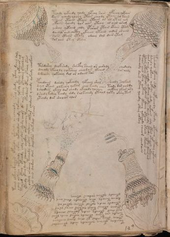

# Voynich Speculative Procedural Protocol — f86v3

IMPORTANT: this is NOT a real or validated translation of the Voynich Manuscript. It is a speculative/procedural model that interprets EVA using a user-defined grammar to generate experimental recipes using safe, known edible substitutes.

This file is generated automatically from IVTFF/EVA transliteration plus a user-defined procedural grammar.



## Page / Folio
- currier: B
- folio: f86v3
- section: cosmological

## EVA Text (Transliteration)
```text
tchedy qokeedy qoedy qopchy raiin olpchey qokaiin
rain ychedy qoeeey otair cheody ytain q[y:o] kaiin
taiin ytaiin ytaiin ytaiin or ar yta[s:r] am
ykaiin qoeedy q[a:o]r aiin yteeey ar aiin ar am
ych'eey qotaiin chdy ypch'eor ytain otain ytam
daiinls aiin chcthy ykaiin ykaiin chdar ar aiin
sain ytaiin ytapy odeeey dal dair ytam
sor aiin otey otair
tchol olkey cfhy aiin opchedy okchedy or acheody shol shedy yteey daiin dady
ychey olkeeey qotchedy qokeey qotchedar sheedy qokaiin qokedy ykaiin qotaiior am
tcheod oteey yteeody chdy chedos shedy cheos [ol:?]s aiir sheey yteech'eey oteeodam
yteedy ykeey daim choaiin checkhy c'ykeeeochy tcheey otodaiin opaiin otchey otam
osheey orsheey tcheody qokain qodaiin olkar chedaiin y chedy qokady cholkain
ar aiin shodain shor chalkar shekshol okchor
tshdch'ey dalkshdy shocfhy saiin or airody chedaly
dcheody skeeody qokshey cheodain ykched sar aldy
dsheody qokchey dal or odaiin sar
pchedaiin dchedy qokchdy qopchol shol sheody solkam
dchey otain olkechy qokam chol kchdy chol tchdy dar aiindy
lshodair ykcho dar chody ykeeody qochey chckhey lkar ary
dshedy kshey tchdy shdy ralkchedy ytchol qoty okshy tam
ytchdy dar sholor alor
tshedal ypchey shdy qopcheeody opchdy olfchey ypchey qotaiin
dshedy qokeey qotee[?:y] shedy qokaiin chdy otar otaiin ykaiin
qodaiin y ochedy qotchey qoky daiin chdy oteedy qoty daiin am
shor yteey oteedy shedaiin sheey otaiin ytaiin otodar aiin
teeos aiin yteey qoteey otchey qoteeody cheeor cheedaiin
ycheeody daii[s:r] oteey qoedy oteey olteey
toeeedchy okchey qokchedy shedy ytcheodar
ytchey yteey chdal or cheey daiin cheokaii[@175;:m]
tchedy chy tchey otchedy qokal oeedy lkam
oees aiiin yteeedy chedy qotaiin cheody
ytchey otaiin kshd qotar chear or am
yteeo dy chedy qokal yteey qokar am
dcheey teeody oty otchedy daiiraii[@175;:m]
ykeeedy qoteey qodaiin okeeey
```

## Domain Context (Heuristic; Not a Translation)

This section summarizes recurring **basewords** in this IVTFF domain and shows simple substring evidence that the token markers used by the procedural grammar occur inside frequent words.

Any Italian anagram / English gloss is a best-effort lexicon match, not a decipherment.


### Associated basewords (non-generic; top by frequency in this domain)
- `daiin` (count=28) → Italian anagram `piani`; English: plans (arrangements)
- `qokal` (count=13) → Italian anagram `calco`; English: cast (of sculpture)
- `odaiin` (count=8) → Italian anagram `inopia`; English: poverty
- `okees` (count=7) → Italian anagram `coese`; English: [n/a]
- `opaiin` (count=6) → Italian anagram `inopia`; English: poverty
- `ykaiin` (count=5) → Italian anagram `acini`; English: [n/a]
- `qodaiin` (count=5) → Italian anagram `apocini`; English: [n/a]
- `oteos` (count=5) → Italian anagram `osteo`; English: [n/a]
- `olkar` (count=5) → Italian anagram `carlo`; English: [n/a]
- `okaiin` (count=4) → Italian anagram `coniai`; English: [n/a]
- `qotaiin` (count=4) → Italian anagram `cationi`; English: [n/a]
- `qokaiin` (count=3) → Italian anagram `ciancio`; English: [n/a]
- `qokar` (count=3) → Italian anagram `carco`; English: [n/a]
- `olaiin` (count=3) → Italian anagram `ialino`; English: hyaline, glassy
- `oraiin` (count=3) → Italian anagram `aironi`; English: [n/a]

### Marker evidence (substring in frequent basewords)
- `qo`: 35 basewords; examples: `qokal`, `qodaiin`, `qokedy`, `qotaiin`, `qokaiin`, `qokar`
- `q`: 36 basewords; examples: `qokal`, `qodaiin`, `qokedy`, `qotaiin`, `qokaiin`, `qokar`
- `o`: 173 basewords; examples: `o`, `ol`, `or`, `otedy`, `oteey`, `okal`
- `k`: 85 basewords; examples: `okal`, `k`, `qokal`, `okeey`, `okar`, `okody`
- `t`: 73 basewords; examples: `otedy`, `oteey`, `otar`, `oteedy`, `otody`, `oty`
- `p`: 8 basewords; examples: `opaiin`, `opar`, `opchdy`, `p`, `opchedy`, `pol`
- `ch`: 81 basewords; examples: `chol`, `chedy`, `chey`, `chdy`, `ch`, `chy`
- `sh`: 28 basewords; examples: `shedy`, `sheey`, `shol`, `shedaiin`, `sho`, `sheody`
- `f`: 1 basewords; examples: `f`
- `cth`: 6 basewords; examples: `chcthy`, `cthy`, `cthol`, `chocthy`, `cthody`, `ctheey`
- `ckh`: 4 basewords; examples: `chckhy`, `chckhey`, `checkhy`, `ockhy`
- `dy`: 59 basewords; examples: `dy`, `otedy`, `chedy`, `shedy`, `chdy`, `oteedy`
- `iin`: 26 basewords; examples: `aiin`, `daiin`, `odaiin`, `opaiin`, `shedaiin`, `otaiin`
- `aiin`: 23 basewords; examples: `aiin`, `daiin`, `odaiin`, `opaiin`, `shedaiin`, `otaiin`

## Recipes Index (This Page)
- [f86v3.1,@Pb](#f86v3-1-f86v3-1-pb)
- [f86v3.2,+Pb](#f86v3-2-f86v3-2-pb)
- [f86v3.3,+Pb](#f86v3-3-f86v3-3-pb)
- [f86v3.4,+Pb](#f86v3-4-f86v3-4-pb)
- [f86v3.5,+Pb](#f86v3-5-f86v3-5-pb)
- [f86v3.6,+Pb](#f86v3-6-f86v3-6-pb)
- [f86v3.7,+Pb](#f86v3-7-f86v3-7-pb)
- [f86v3.8,+Pb](#f86v3-8-f86v3-8-pb)
- [f86v3.9,@Pb](#f86v3-9-f86v3-9-pb)
- [f86v3.10,+Pb](#f86v3-10-f86v3-10-pb)
- [f86v3.11,+Pb](#f86v3-11-f86v3-11-pb)
- [f86v3.12,+Pb](#f86v3-12-f86v3-12-pb)
- [f86v3.13,+Pb](#f86v3-13-f86v3-13-pb)
- [f86v3.14,+Pb](#f86v3-14-f86v3-14-pb)
- [f86v3.15,@P0](#f86v3-15-f86v3-15-p0)
- [f86v3.16,+P0](#f86v3-16-f86v3-16-p0)
- [f86v3.17,+P0](#f86v3-17-f86v3-17-p0)
- [f86v3.18,+P0](#f86v3-18-f86v3-18-p0)
- [f86v3.19,+P0](#f86v3-19-f86v3-19-p0)
- [f86v3.20,+P0](#f86v3-20-f86v3-20-p0)
- [f86v3.21,+P0](#f86v3-21-f86v3-21-p0)
- [f86v3.22,+P0](#f86v3-22-f86v3-22-p0)
- [f86v3.23,@Pb](#f86v3-23-f86v3-23-pb)
- [f86v3.24,+Pb](#f86v3-24-f86v3-24-pb)
- [f86v3.25,+Pb](#f86v3-25-f86v3-25-pb)
- [f86v3.26,+Pb](#f86v3-26-f86v3-26-pb)
- [f86v3.27,+Pb](#f86v3-27-f86v3-27-pb)
- [f86v3.28,+Pb](#f86v3-28-f86v3-28-pb)
- [f86v3.29,@Pb](#f86v3-29-f86v3-29-pb)
- [f86v3.30,+Pb](#f86v3-30-f86v3-30-pb)
- [f86v3.31,+Pb](#f86v3-31-f86v3-31-pb)
- [f86v3.32,+Pb](#f86v3-32-f86v3-32-pb)
- [f86v3.33,+Pb](#f86v3-33-f86v3-33-pb)
- [f86v3.34,+Pb](#f86v3-34-f86v3-34-pb)
- [f86v3.35,+Pb](#f86v3-35-f86v3-35-pb)
- [f86v3.36,+Pb](#f86v3-36-f86v3-36-pb)

## Line Glosses (Procedural Gloss Only; Not a Translation)

<a id="f86v3-1-f86v3-1-pb"></a>

### f86v3.1,@Pb

EVA: tchedy qokeedy qoedy qopchy raiin olpchey qokaiin

Direct Gloss (Procedural, Not a Real Translation):
- tchedy: apply heat/cooking → add main plant (safe substitute) → add starter / activate → duration level 1 → state: active extraction
- qokeedy: prepare liquid base → add fermentable sugars → add starter / activate → duration level 2 → state: active extraction
- qoedy: prepare liquid base → add starter / activate → duration level 1 → state: active extraction
- qopchy: prepare liquid base → add main plant (safe substitute) → add starter / activate
- raiin: duration level 1 → state: phase transition/start → long phase
- olpchey: add main plant (safe substitute) → mix / transfer → add starter / activate → duration level 1 → state: active extraction
- qokaiin: prepare liquid base → add fermentable sugars → duration level 1 → state: phase transition/start → long phase

<a id="f86v3-2-f86v3-2-pb"></a>

### f86v3.2,+Pb

EVA: rain ychedy qoeeey otair cheody ytain q[y:o] kaiin

Direct Gloss (Procedural, Not a Real Translation):
- rain: duration level 1 → state: phase transition/start
- ychedy: add main plant (safe substitute) → add starter / activate → duration level 1 → state: active extraction
- qoeeey: prepare liquid base → duration level 3 → state: active extraction
- otair: apply heat/cooking → mix / transfer → duration level 1 → state: phase transition/start
- cheody: add main plant (safe substitute) → mix / transfer → add starter / activate → duration level 1 → state: active extraction
- ytain: apply heat/cooking → duration level 1 → state: phase transition/start
- q: prepare base (generic)
- y: [unparsed]
- o: mix / transfer
- kaiin: add fermentable sugars → duration level 1 → state: phase transition/start → long phase

<a id="f86v3-3-f86v3-3-pb"></a>

### f86v3.3,+Pb

EVA: taiin ytaiin ytaiin ytaiin or ar yta[s:r] am

Direct Gloss (Procedural, Not a Real Translation):
- taiin: apply heat/cooking → duration level 1 → state: phase transition/start → long phase
- ytaiin: apply heat/cooking → duration level 1 → state: phase transition/start → long phase
- ytaiin: apply heat/cooking → duration level 1 → state: phase transition/start → long phase
- ytaiin: apply heat/cooking → duration level 1 → state: phase transition/start → long phase
- or: mix / transfer
- ar: duration level 1 → state: phase transition/start
- yta: apply heat/cooking → duration level 1 → state: phase transition/start
- s: [unparsed]
- r: [unparsed]
- am: duration level 1 → state: phase transition/start

<a id="f86v3-4-f86v3-4-pb"></a>

### f86v3.4,+Pb

EVA: ykaiin qoeedy q[a:o]r aiin yteeey ar aiin ar am

Direct Gloss (Procedural, Not a Real Translation):
- ykaiin: add fermentable sugars → duration level 1 → state: phase transition/start → long phase
- qoeedy: prepare liquid base → add starter / activate → duration level 2 → state: active extraction
- q: prepare base (generic)
- a: duration level 1 → state: phase transition/start
- o: mix / transfer
- r: [unparsed]
- aiin: duration level 1 → state: phase transition/start → long phase
- yteeey: apply heat/cooking → duration level 3 → state: active extraction
- ar: duration level 1 → state: phase transition/start
- aiin: duration level 1 → state: phase transition/start → long phase
- ar: duration level 1 → state: phase transition/start
- am: duration level 1 → state: phase transition/start

<a id="f86v3-5-f86v3-5-pb"></a>

### f86v3.5,+Pb

EVA: ych'eey qotaiin chdy ypch'eor ytain otain ytam

Direct Gloss (Procedural, Not a Real Translation):
- ych: add main plant (safe substitute)
- eey: duration level 2 → state: active extraction
- qotaiin: prepare liquid base → apply heat/cooking → duration level 1 → state: phase transition/start → long phase
- chdy: add main plant (safe substitute) → add starter / activate
- ypch: add main plant (safe substitute) → add starter / activate
- eor: mix / transfer → duration level 1 → state: active extraction
- ytain: apply heat/cooking → duration level 1 → state: phase transition/start
- otain: apply heat/cooking → mix / transfer → duration level 1 → state: phase transition/start
- ytam: apply heat/cooking → duration level 1 → state: phase transition/start

<a id="f86v3-6-f86v3-6-pb"></a>

### f86v3.6,+Pb

EVA: daiinls aiin chcthy ykaiin ykaiin chdar ar aiin

Direct Gloss (Procedural, Not a Real Translation):
- daiinls: add starter / activate → duration level 1 → state: phase transition/start → long phase
- aiin: duration level 1 → state: phase transition/start → long phase
- chcthy: add main plant (safe substitute) → add complex herbal compound (safe blend)
- ykaiin: add fermentable sugars → duration level 1 → state: phase transition/start → long phase
- ykaiin: add fermentable sugars → duration level 1 → state: phase transition/start → long phase
- chdar: add main plant (safe substitute) → add starter / activate → duration level 1 → state: phase transition/start
- ar: duration level 1 → state: phase transition/start
- aiin: duration level 1 → state: phase transition/start → long phase

<a id="f86v3-7-f86v3-7-pb"></a>

### f86v3.7,+Pb

EVA: sain ytaiin ytapy odeeey dal dair ytam

Direct Gloss (Procedural, Not a Real Translation):
- sain: duration level 1 → state: phase transition/start
- ytaiin: apply heat/cooking → duration level 1 → state: phase transition/start → long phase
- ytapy: apply heat/cooking → add starter / activate → duration level 1 → state: phase transition/start
- odeeey: mix / transfer → add starter / activate → duration level 3 → state: active extraction
- dal: add starter / activate → duration level 1 → state: phase transition/start
- dair: add starter / activate → duration level 1 → state: phase transition/start
- ytam: apply heat/cooking → duration level 1 → state: phase transition/start

<a id="f86v3-8-f86v3-8-pb"></a>

### f86v3.8,+Pb

EVA: sor aiin otey otair

Direct Gloss (Procedural, Not a Real Translation):
- sor: mix / transfer
- aiin: duration level 1 → state: phase transition/start → long phase
- otey: apply heat/cooking → mix / transfer → duration level 1 → state: active extraction
- otair: apply heat/cooking → mix / transfer → duration level 1 → state: phase transition/start

<a id="f86v3-9-f86v3-9-pb"></a>

### f86v3.9,@Pb

EVA: tchol olkey cfhy aiin opchedy okchedy or acheody shol shedy yteey daiin dady

Direct Gloss (Procedural, Not a Real Translation):
- tchol: apply heat/cooking → add main plant (safe substitute) → mix / transfer
- olkey: add fermentable sugars → mix / transfer → duration level 1 → state: active extraction
- cfhy: add complex herbal compound (safe blend)
- aiin: duration level 1 → state: phase transition/start → long phase
- opchedy: add main plant (safe substitute) → mix / transfer → add starter / activate → duration level 1 → state: active extraction
- okchedy: add fermentable sugars → add main plant (safe substitute) → mix / transfer → add starter / activate → duration level 1 → state: active extraction
- or: mix / transfer
- acheody: add main plant (safe substitute) → mix / transfer → add starter / activate → duration level 1 → state: phase transition/start
- shol: add secondary herb (safe substitute) → mix / transfer
- shedy: add secondary herb (safe substitute) → add starter / activate → duration level 1 → state: active extraction
- yteey: apply heat/cooking → duration level 2 → state: active extraction
- daiin: add starter / activate → duration level 1 → state: phase transition/start → long phase
- dady: add starter / activate → duration level 1 → state: phase transition/start

<a id="f86v3-10-f86v3-10-pb"></a>

### f86v3.10,+Pb

EVA: ychey olkeeey qotchedy qokeey qotchedar sheedy qokaiin qokedy ykaiin qotaiior am

Direct Gloss (Procedural, Not a Real Translation):
- ychey: add main plant (safe substitute) → duration level 1 → state: active extraction
- olkeeey: add fermentable sugars → mix / transfer → duration level 3 → state: active extraction
- qotchedy: prepare liquid base → apply heat/cooking → add main plant (safe substitute) → add starter / activate → duration level 1 → state: active extraction
- qokeey: prepare liquid base → add fermentable sugars → duration level 2 → state: active extraction
- qotchedar: prepare liquid base → apply heat/cooking → add main plant (safe substitute) → add starter / activate → duration level 1 → state: active extraction
- sheedy: add secondary herb (safe substitute) → add starter / activate → duration level 2 → state: active extraction
- qokaiin: prepare liquid base → add fermentable sugars → duration level 1 → state: phase transition/start → long phase
- qokedy: prepare liquid base → add fermentable sugars → add starter / activate → duration level 1 → state: active extraction
- ykaiin: add fermentable sugars → duration level 1 → state: phase transition/start → long phase
- qotaiior: prepare liquid base → apply heat/cooking → mix / transfer → duration level 1 → state: phase transition/start
- am: duration level 1 → state: phase transition/start

<a id="f86v3-11-f86v3-11-pb"></a>

### f86v3.11,+Pb

EVA: tcheod oteey yteeody chdy chedos shedy cheos [ol:?]s aiir sheey yteech'eey oteeodam

Direct Gloss (Procedural, Not a Real Translation):
- tcheod: apply heat/cooking → add main plant (safe substitute) → mix / transfer → add starter / activate → duration level 1 → state: active extraction
- oteey: apply heat/cooking → mix / transfer → duration level 2 → state: active extraction
- yteeody: apply heat/cooking → mix / transfer → add starter / activate → duration level 2 → state: active extraction
- chdy: add main plant (safe substitute) → add starter / activate
- chedos: add main plant (safe substitute) → mix / transfer → add starter / activate → duration level 1 → state: active extraction
- shedy: add secondary herb (safe substitute) → add starter / activate → duration level 1 → state: active extraction
- cheos: add main plant (safe substitute) → mix / transfer → duration level 1 → state: active extraction
- ol: mix / transfer
- s: [unparsed]
- aiir: duration level 1 → state: phase transition/start
- sheey: add secondary herb (safe substitute) → duration level 2 → state: active extraction
- yteech: apply heat/cooking → add main plant (safe substitute) → duration level 2 → state: active extraction
- eey: duration level 2 → state: active extraction
- oteeodam: apply heat/cooking → mix / transfer → add starter / activate → duration level 2 → state: active extraction

<a id="f86v3-12-f86v3-12-pb"></a>

### f86v3.12,+Pb

EVA: yteedy ykeey daim choaiin checkhy c'ykeeeochy tcheey otodaiin opaiin otchey otam

Direct Gloss (Procedural, Not a Real Translation):
- yteedy: apply heat/cooking → add starter / activate → duration level 2 → state: active extraction
- ykeey: add fermentable sugars → duration level 2 → state: active extraction
- daim: add starter / activate → duration level 1 → state: phase transition/start
- choaiin: add main plant (safe substitute) → mix / transfer → duration level 1 → state: phase transition/start → long phase
- checkhy: add main plant (safe substitute) → add complex herbal compound (safe blend) → duration level 1 → state: active extraction
- c: [unparsed]
- ykeeeochy: add fermentable sugars → add main plant (safe substitute) → mix / transfer → duration level 3 → state: active extraction
- tcheey: apply heat/cooking → add main plant (safe substitute) → duration level 2 → state: active extraction
- otodaiin: apply heat/cooking → mix / transfer → add starter / activate → duration level 1 → state: phase transition/start → long phase
- opaiin: mix / transfer → add starter / activate → duration level 1 → state: phase transition/start → long phase
- otchey: apply heat/cooking → add main plant (safe substitute) → mix / transfer → duration level 1 → state: active extraction
- otam: apply heat/cooking → mix / transfer → duration level 1 → state: phase transition/start

<a id="f86v3-13-f86v3-13-pb"></a>

### f86v3.13,+Pb

EVA: osheey orsheey tcheody qokain qodaiin olkar chedaiin y chedy qokady cholkain

Direct Gloss (Procedural, Not a Real Translation):
- osheey: add secondary herb (safe substitute) → mix / transfer → duration level 2 → state: active extraction
- orsheey: add secondary herb (safe substitute) → mix / transfer → duration level 2 → state: active extraction
- tcheody: apply heat/cooking → add main plant (safe substitute) → mix / transfer → add starter / activate → duration level 1 → state: active extraction
- qokain: prepare liquid base → add fermentable sugars → duration level 1 → state: phase transition/start
- qodaiin: prepare liquid base → add starter / activate → duration level 1 → state: phase transition/start → long phase
- olkar: add fermentable sugars → mix / transfer → duration level 1 → state: phase transition/start
- chedaiin: add main plant (safe substitute) → add starter / activate → duration level 1 → state: active extraction → long phase
- y: [unparsed]
- chedy: add main plant (safe substitute) → add starter / activate → duration level 1 → state: active extraction
- qokady: prepare liquid base → add fermentable sugars → add starter / activate → duration level 1 → state: phase transition/start
- cholkain: add fermentable sugars → add main plant (safe substitute) → mix / transfer → duration level 1 → state: phase transition/start

<a id="f86v3-14-f86v3-14-pb"></a>

### f86v3.14,+Pb

EVA: ar aiin shodain shor chalkar shekshol okchor

Direct Gloss (Procedural, Not a Real Translation):
- ar: duration level 1 → state: phase transition/start
- aiin: duration level 1 → state: phase transition/start → long phase
- shodain: add secondary herb (safe substitute) → mix / transfer → add starter / activate → duration level 1 → state: phase transition/start
- shor: add secondary herb (safe substitute) → mix / transfer
- chalkar: add fermentable sugars → add main plant (safe substitute) → duration level 1 → state: phase transition/start
- shekshol: add fermentable sugars → add secondary herb (safe substitute) → mix / transfer → duration level 1 → state: active extraction
- okchor: add fermentable sugars → add main plant (safe substitute) → mix / transfer

<a id="f86v3-15-f86v3-15-p0"></a>

### f86v3.15,@P0

EVA: tshdch'ey dalkshdy shocfhy saiin or airody chedaly

Direct Gloss (Procedural, Not a Real Translation):
- tshdch: apply heat/cooking → add main plant (safe substitute) → add secondary herb (safe substitute) → add starter / activate
- ey: duration level 1 → state: active extraction
- dalkshdy: add fermentable sugars → add secondary herb (safe substitute) → add starter / activate → duration level 1 → state: phase transition/start
- shocfhy: add secondary herb (safe substitute) → mix / transfer → add complex herbal compound (safe blend)
- saiin: duration level 1 → state: phase transition/start → long phase
- or: mix / transfer
- airody: mix / transfer → add starter / activate → duration level 1 → state: phase transition/start
- chedaly: add main plant (safe substitute) → add starter / activate → duration level 1 → state: active extraction

<a id="f86v3-16-f86v3-16-p0"></a>

### f86v3.16,+P0

EVA: dcheody skeeody qokshey cheodain ykched sar aldy

Direct Gloss (Procedural, Not a Real Translation):
- dcheody: add main plant (safe substitute) → mix / transfer → add starter / activate → duration level 1 → state: active extraction
- skeeody: add fermentable sugars → mix / transfer → add starter / activate → duration level 2 → state: active extraction
- qokshey: prepare liquid base → add fermentable sugars → add secondary herb (safe substitute) → duration level 1 → state: active extraction
- cheodain: add main plant (safe substitute) → mix / transfer → add starter / activate → duration level 1 → state: active extraction
- ykched: add fermentable sugars → add main plant (safe substitute) → add starter / activate → duration level 1 → state: active extraction
- sar: duration level 1 → state: phase transition/start
- aldy: add starter / activate → duration level 1 → state: phase transition/start

<a id="f86v3-17-f86v3-17-p0"></a>

### f86v3.17,+P0

EVA: dsheody qokchey dal or odaiin sar

Direct Gloss (Procedural, Not a Real Translation):
- dsheody: add secondary herb (safe substitute) → mix / transfer → add starter / activate → duration level 1 → state: active extraction
- qokchey: prepare liquid base → add fermentable sugars → add main plant (safe substitute) → duration level 1 → state: active extraction
- dal: add starter / activate → duration level 1 → state: phase transition/start
- or: mix / transfer
- odaiin: mix / transfer → add starter / activate → duration level 1 → state: phase transition/start → long phase
- sar: duration level 1 → state: phase transition/start

<a id="f86v3-18-f86v3-18-p0"></a>

### f86v3.18,+P0

EVA: pchedaiin dchedy qokchdy qopchol shol sheody solkam

Direct Gloss (Procedural, Not a Real Translation):
- pchedaiin: add main plant (safe substitute) → add starter / activate → duration level 1 → state: active extraction → long phase
- dchedy: add main plant (safe substitute) → add starter / activate → duration level 1 → state: active extraction
- qokchdy: prepare liquid base → add fermentable sugars → add main plant (safe substitute) → add starter / activate
- qopchol: prepare liquid base → add main plant (safe substitute) → mix / transfer → add starter / activate
- shol: add secondary herb (safe substitute) → mix / transfer
- sheody: add secondary herb (safe substitute) → mix / transfer → add starter / activate → duration level 1 → state: active extraction
- solkam: add fermentable sugars → mix / transfer → duration level 1 → state: phase transition/start

<a id="f86v3-19-f86v3-19-p0"></a>

### f86v3.19,+P0

EVA: dchey otain olkechy qokam chol kchdy chol tchdy dar aiindy

Direct Gloss (Procedural, Not a Real Translation):
- dchey: add main plant (safe substitute) → add starter / activate → duration level 1 → state: active extraction
- otain: apply heat/cooking → mix / transfer → duration level 1 → state: phase transition/start
- olkechy: add fermentable sugars → add main plant (safe substitute) → mix / transfer → duration level 1 → state: active extraction
- qokam: prepare liquid base → add fermentable sugars → duration level 1 → state: phase transition/start
- chol: add main plant (safe substitute) → mix / transfer
- kchdy: add fermentable sugars → add main plant (safe substitute) → add starter / activate
- chol: add main plant (safe substitute) → mix / transfer
- tchdy: apply heat/cooking → add main plant (safe substitute) → add starter / activate
- dar: add starter / activate → duration level 1 → state: phase transition/start
- aiindy: add starter / activate → duration level 1 → state: phase transition/start → long phase

<a id="f86v3-20-f86v3-20-p0"></a>

### f86v3.20,+P0

EVA: lshodair ykcho dar chody ykeeody qochey chckhey lkar ary

Direct Gloss (Procedural, Not a Real Translation):
- lshodair: add secondary herb (safe substitute) → mix / transfer → add starter / activate → duration level 1 → state: phase transition/start
- ykcho: add fermentable sugars → add main plant (safe substitute) → mix / transfer
- dar: add starter / activate → duration level 1 → state: phase transition/start
- chody: add main plant (safe substitute) → mix / transfer → add starter / activate
- ykeeody: add fermentable sugars → mix / transfer → add starter / activate → duration level 2 → state: active extraction
- qochey: prepare liquid base → add main plant (safe substitute) → duration level 1 → state: active extraction
- chckhey: add main plant (safe substitute) → add complex herbal compound (safe blend) → duration level 1 → state: active extraction
- lkar: add fermentable sugars → duration level 1 → state: phase transition/start
- ary: duration level 1 → state: phase transition/start

<a id="f86v3-21-f86v3-21-p0"></a>

### f86v3.21,+P0

EVA: dshedy kshey tchdy shdy ralkchedy ytchol qoty okshy tam

Direct Gloss (Procedural, Not a Real Translation):
- dshedy: add secondary herb (safe substitute) → add starter / activate → duration level 1 → state: active extraction
- kshey: add fermentable sugars → add secondary herb (safe substitute) → duration level 1 → state: active extraction
- tchdy: apply heat/cooking → add main plant (safe substitute) → add starter / activate
- shdy: add secondary herb (safe substitute) → add starter / activate
- ralkchedy: add fermentable sugars → add main plant (safe substitute) → add starter / activate → duration level 1 → state: phase transition/start
- ytchol: apply heat/cooking → add main plant (safe substitute) → mix / transfer
- qoty: prepare liquid base → apply heat/cooking
- okshy: add fermentable sugars → add secondary herb (safe substitute) → mix / transfer
- tam: apply heat/cooking → duration level 1 → state: phase transition/start

<a id="f86v3-22-f86v3-22-p0"></a>

### f86v3.22,+P0

EVA: ytchdy dar sholor alor

Direct Gloss (Procedural, Not a Real Translation):
- ytchdy: apply heat/cooking → add main plant (safe substitute) → add starter / activate
- dar: add starter / activate → duration level 1 → state: phase transition/start
- sholor: add secondary herb (safe substitute) → mix / transfer
- alor: mix / transfer → duration level 1 → state: phase transition/start

<a id="f86v3-23-f86v3-23-pb"></a>

### f86v3.23,@Pb

EVA: tshedal ypchey shdy qopcheeody opchdy olfchey ypchey qotaiin

Direct Gloss (Procedural, Not a Real Translation):
- tshedal: apply heat/cooking → add secondary herb (safe substitute) → add starter / activate → duration level 1 → state: active extraction
- ypchey: add main plant (safe substitute) → add starter / activate → duration level 1 → state: active extraction
- shdy: add secondary herb (safe substitute) → add starter / activate
- qopcheeody: prepare liquid base → add main plant (safe substitute) → mix / transfer → add starter / activate → duration level 2 → state: active extraction
- opchdy: add main plant (safe substitute) → mix / transfer → add starter / activate
- olfchey: add main plant (safe substitute) → add aroma modifier → mix / transfer → duration level 1 → state: active extraction
- ypchey: add main plant (safe substitute) → add starter / activate → duration level 1 → state: active extraction
- qotaiin: prepare liquid base → apply heat/cooking → duration level 1 → state: phase transition/start → long phase

<a id="f86v3-24-f86v3-24-pb"></a>

### f86v3.24,+Pb

EVA: dshedy qokeey qotee[?:y] shedy qokaiin chdy otar otaiin ykaiin

Direct Gloss (Procedural, Not a Real Translation):
- dshedy: add secondary herb (safe substitute) → add starter / activate → duration level 1 → state: active extraction
- qokeey: prepare liquid base → add fermentable sugars → duration level 2 → state: active extraction
- qotee: prepare liquid base → apply heat/cooking → duration level 2 → state: active extraction
- y: [unparsed]
- shedy: add secondary herb (safe substitute) → add starter / activate → duration level 1 → state: active extraction
- qokaiin: prepare liquid base → add fermentable sugars → duration level 1 → state: phase transition/start → long phase
- chdy: add main plant (safe substitute) → add starter / activate
- otar: apply heat/cooking → mix / transfer → duration level 1 → state: phase transition/start
- otaiin: apply heat/cooking → mix / transfer → duration level 1 → state: phase transition/start → long phase
- ykaiin: add fermentable sugars → duration level 1 → state: phase transition/start → long phase

<a id="f86v3-25-f86v3-25-pb"></a>

### f86v3.25,+Pb

EVA: qodaiin y ochedy qotchey qoky daiin chdy oteedy qoty daiin am

Direct Gloss (Procedural, Not a Real Translation):
- qodaiin: prepare liquid base → add starter / activate → duration level 1 → state: phase transition/start → long phase
- y: [unparsed]
- ochedy: add main plant (safe substitute) → mix / transfer → add starter / activate → duration level 1 → state: active extraction
- qotchey: prepare liquid base → apply heat/cooking → add main plant (safe substitute) → duration level 1 → state: active extraction
- qoky: prepare liquid base → add fermentable sugars
- daiin: add starter / activate → duration level 1 → state: phase transition/start → long phase
- chdy: add main plant (safe substitute) → add starter / activate
- oteedy: apply heat/cooking → mix / transfer → add starter / activate → duration level 2 → state: active extraction
- qoty: prepare liquid base → apply heat/cooking
- daiin: add starter / activate → duration level 1 → state: phase transition/start → long phase
- am: duration level 1 → state: phase transition/start

<a id="f86v3-26-f86v3-26-pb"></a>

### f86v3.26,+Pb

EVA: shor yteey oteedy shedaiin sheey otaiin ytaiin otodar aiin

Direct Gloss (Procedural, Not a Real Translation):
- shor: add secondary herb (safe substitute) → mix / transfer
- yteey: apply heat/cooking → duration level 2 → state: active extraction
- oteedy: apply heat/cooking → mix / transfer → add starter / activate → duration level 2 → state: active extraction
- shedaiin: add secondary herb (safe substitute) → add starter / activate → duration level 1 → state: active extraction → long phase
- sheey: add secondary herb (safe substitute) → duration level 2 → state: active extraction
- otaiin: apply heat/cooking → mix / transfer → duration level 1 → state: phase transition/start → long phase
- ytaiin: apply heat/cooking → duration level 1 → state: phase transition/start → long phase
- otodar: apply heat/cooking → mix / transfer → add starter / activate → duration level 1 → state: phase transition/start
- aiin: duration level 1 → state: phase transition/start → long phase

<a id="f86v3-27-f86v3-27-pb"></a>

### f86v3.27,+Pb

EVA: teeos aiin yteey qoteey otchey qoteeody cheeor cheedaiin

Direct Gloss (Procedural, Not a Real Translation):
- teeos: apply heat/cooking → mix / transfer → duration level 2 → state: active extraction
- aiin: duration level 1 → state: phase transition/start → long phase
- yteey: apply heat/cooking → duration level 2 → state: active extraction
- qoteey: prepare liquid base → apply heat/cooking → duration level 2 → state: active extraction
- otchey: apply heat/cooking → add main plant (safe substitute) → mix / transfer → duration level 1 → state: active extraction
- qoteeody: prepare liquid base → apply heat/cooking → mix / transfer → add starter / activate → duration level 2 → state: active extraction
- cheeor: add main plant (safe substitute) → mix / transfer → duration level 2 → state: active extraction
- cheedaiin: add main plant (safe substitute) → add starter / activate → duration level 2 → state: active extraction → long phase

<a id="f86v3-28-f86v3-28-pb"></a>

### f86v3.28,+Pb

EVA: ycheeody daii[s:r] oteey qoedy oteey olteey

Direct Gloss (Procedural, Not a Real Translation):
- ycheeody: add main plant (safe substitute) → mix / transfer → add starter / activate → duration level 2 → state: active extraction
- daii: add starter / activate → duration level 1 → state: phase transition/start
- s: [unparsed]
- r: [unparsed]
- oteey: apply heat/cooking → mix / transfer → duration level 2 → state: active extraction
- qoedy: prepare liquid base → add starter / activate → duration level 1 → state: active extraction
- oteey: apply heat/cooking → mix / transfer → duration level 2 → state: active extraction
- olteey: apply heat/cooking → mix / transfer → duration level 2 → state: active extraction

<a id="f86v3-29-f86v3-29-pb"></a>

### f86v3.29,@Pb

EVA: toeeedchy okchey qokchedy shedy ytcheodar

Direct Gloss (Procedural, Not a Real Translation):
- toeeedchy: apply heat/cooking → add main plant (safe substitute) → mix / transfer → add starter / activate → duration level 3 → state: active extraction
- okchey: add fermentable sugars → add main plant (safe substitute) → mix / transfer → duration level 1 → state: active extraction
- qokchedy: prepare liquid base → add fermentable sugars → add main plant (safe substitute) → add starter / activate → duration level 1 → state: active extraction
- shedy: add secondary herb (safe substitute) → add starter / activate → duration level 1 → state: active extraction
- ytcheodar: apply heat/cooking → add main plant (safe substitute) → mix / transfer → add starter / activate → duration level 1 → state: active extraction

<a id="f86v3-30-f86v3-30-pb"></a>

### f86v3.30,+Pb

EVA: ytchey yteey chdal or cheey daiin cheokaii[@175;:m]

Direct Gloss (Procedural, Not a Real Translation):
- ytchey: apply heat/cooking → add main plant (safe substitute) → duration level 1 → state: active extraction
- yteey: apply heat/cooking → duration level 2 → state: active extraction
- chdal: add main plant (safe substitute) → add starter / activate → duration level 1 → state: phase transition/start
- or: mix / transfer
- cheey: add main plant (safe substitute) → duration level 2 → state: active extraction
- daiin: add starter / activate → duration level 1 → state: phase transition/start → long phase
- cheokaii: add fermentable sugars → add main plant (safe substitute) → mix / transfer → duration level 1 → state: active extraction
- m: [unparsed]

<a id="f86v3-31-f86v3-31-pb"></a>

### f86v3.31,+Pb

EVA: tchedy chy tchey otchedy qokal oeedy lkam

Direct Gloss (Procedural, Not a Real Translation):
- tchedy: apply heat/cooking → add main plant (safe substitute) → add starter / activate → duration level 1 → state: active extraction
- chy: add main plant (safe substitute)
- tchey: apply heat/cooking → add main plant (safe substitute) → duration level 1 → state: active extraction
- otchedy: apply heat/cooking → add main plant (safe substitute) → mix / transfer → add starter / activate → duration level 1 → state: active extraction
- qokal: prepare liquid base → add fermentable sugars → duration level 1 → state: phase transition/start
- oeedy: mix / transfer → add starter / activate → duration level 2 → state: active extraction
- lkam: add fermentable sugars → duration level 1 → state: phase transition/start

<a id="f86v3-32-f86v3-32-pb"></a>

### f86v3.32,+Pb

EVA: oees aiiin yteeedy chedy qotaiin cheody

Direct Gloss (Procedural, Not a Real Translation):
- oees: mix / transfer → duration level 2 → state: active extraction
- aiiin: duration level 1 → state: phase transition/start → medium phase
- yteeedy: apply heat/cooking → add starter / activate → duration level 3 → state: active extraction
- chedy: add main plant (safe substitute) → add starter / activate → duration level 1 → state: active extraction
- qotaiin: prepare liquid base → apply heat/cooking → duration level 1 → state: phase transition/start → long phase
- cheody: add main plant (safe substitute) → mix / transfer → add starter / activate → duration level 1 → state: active extraction

<a id="f86v3-33-f86v3-33-pb"></a>

### f86v3.33,+Pb

EVA: ytchey otaiin kshd qotar chear or am

Direct Gloss (Procedural, Not a Real Translation):
- ytchey: apply heat/cooking → add main plant (safe substitute) → duration level 1 → state: active extraction
- otaiin: apply heat/cooking → mix / transfer → duration level 1 → state: phase transition/start → long phase
- kshd: add fermentable sugars → add secondary herb (safe substitute) → add starter / activate
- qotar: prepare liquid base → apply heat/cooking → duration level 1 → state: phase transition/start
- chear: add main plant (safe substitute) → duration level 1 → state: active extraction
- or: mix / transfer
- am: duration level 1 → state: phase transition/start

<a id="f86v3-34-f86v3-34-pb"></a>

### f86v3.34,+Pb

EVA: yteeo dy chedy qokal yteey qokar am

Direct Gloss (Procedural, Not a Real Translation):
- yteeo: apply heat/cooking → mix / transfer → duration level 2 → state: active extraction
- dy: add starter / activate
- chedy: add main plant (safe substitute) → add starter / activate → duration level 1 → state: active extraction
- qokal: prepare liquid base → add fermentable sugars → duration level 1 → state: phase transition/start
- yteey: apply heat/cooking → duration level 2 → state: active extraction
- qokar: prepare liquid base → add fermentable sugars → duration level 1 → state: phase transition/start
- am: duration level 1 → state: phase transition/start

<a id="f86v3-35-f86v3-35-pb"></a>

### f86v3.35,+Pb

EVA: dcheey teeody oty otchedy daiiraii[@175;:m]

Direct Gloss (Procedural, Not a Real Translation):
- dcheey: add main plant (safe substitute) → add starter / activate → duration level 2 → state: active extraction
- teeody: apply heat/cooking → mix / transfer → add starter / activate → duration level 2 → state: active extraction
- oty: apply heat/cooking → mix / transfer
- otchedy: apply heat/cooking → add main plant (safe substitute) → mix / transfer → add starter / activate → duration level 1 → state: active extraction
- daiiraii: add starter / activate → duration level 1 → state: phase transition/start
- m: [unparsed]

<a id="f86v3-36-f86v3-36-pb"></a>

### f86v3.36,+Pb

EVA: ykeeedy qoteey qodaiin okeeey

Direct Gloss (Procedural, Not a Real Translation):
- ykeeedy: add fermentable sugars → add starter / activate → duration level 3 → state: active extraction
- qoteey: prepare liquid base → apply heat/cooking → duration level 2 → state: active extraction
- qodaiin: prepare liquid base → add starter / activate → duration level 1 → state: phase transition/start → long phase
- okeeey: add fermentable sugars → mix / transfer → duration level 3 → state: active extraction
