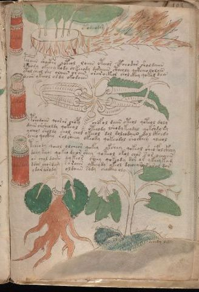

# Voynich Speculative Herbal Ferment Recipe — f102r1

IMPORTANT: this is NOT a real or validated translation of the Voynich Manuscript. It is a speculative/procedural model that interprets EVA using a user-defined grammar to generate experimental recipes using safe, known edible substitutes.

This file is generated automatically from IVTFF/EVA transliteration plus a user-defined procedural grammar.



## Page / Folio
- currier: A
- folio: f102r1
- page_number: 208

## EVA Text (Transliteration)
```text
daarod
otodeeodor
polaiin shocthy qoteol loiiin oteeor cpheodar sholdaiin
dsheody okeeoy kod[?:a] chkeeody daraiiin ctheoly qokcheololain
ytol sheol she olaiin orain oraroekeol chol ekey qokol dain
daiin ykeeol oldy okodaiin
okolaly
pshodaiin qoorar chopy chofol daiin oteol qoteol doly
daiin orsheoldy qokeol oteeody lshodykeodal qokshdy sy
ycheol sholdy chol chol ykeeol dol doleodaiin dal cthedy
dcheo qockhy sol sheey okeody qokeodol shockhey oleeol
ddardsh
teesody qoeol olcheor qokey okshey qokeol sheofolckhhy
doeey keeol qokeo daor shey qoteol okol chos s or oeeaiin
or chol daiin dykeor sheey qokeody dor os ykeeykam
ddor chordam soraiin ykeey dy okeol doeoear s aral dor
ydar arody oldaiin sody chockhy oly
```

## Recipes Index (This Page)
- [f102r1.1,@Lc](#f102r1-1-f102r1-1-lc)
- [f102r1.2,@Lf](#f102r1-2-f102r1-2-lf)
- [f102r1.3,@P0](#f102r1-3-f102r1-3-p0)
- [f102r1.4,+P0](#f102r1-4-f102r1-4-p0)
- [f102r1.5,+P0](#f102r1-5-f102r1-5-p0)
- [f102r1.6,+P0](#f102r1-6-f102r1-6-p0)
- [f102r1.7,@Lc](#f102r1-7-f102r1-7-lc)
- [f102r1.8,@P0](#f102r1-8-f102r1-8-p0)
- [f102r1.9,+P0](#f102r1-9-f102r1-9-p0)
- [f102r1.10,+P0](#f102r1-10-f102r1-10-p0)
- [f102r1.11,+P0](#f102r1-11-f102r1-11-p0)
- [f102r1.12,@Lc](#f102r1-12-f102r1-12-lc)
- [f102r1.13,@P0](#f102r1-13-f102r1-13-p0)
- [f102r1.14,+P0](#f102r1-14-f102r1-14-p0)
- [f102r1.15,+P0](#f102r1-15-f102r1-15-p0)
- [f102r1.16,+P0](#f102r1-16-f102r1-16-p0)
- [f102r1.17,+P0](#f102r1-17-f102r1-17-p0)

## Line Glosses (Procedural Gloss Only; Not a Translation)

<a id="f102r1-1-f102r1-1-lc"></a>

### f102r1.1,@Lc

EVA: daarod

Direct Gloss (Procedural, Not a Real Translation):
- daarod: mix / transfer → start fermentation (yeast) → duration level 2 → state: fermentation start

<a id="f102r1-2-f102r1-2-lf"></a>

### f102r1.2,@Lf

EVA: otodeeodor

Direct Gloss (Procedural, Not a Real Translation):
- otodeeodor: apply heat/cooking → mix / transfer → start fermentation (yeast) → duration level 2 → state: active extraction

<a id="f102r1-3-f102r1-3-p0"></a>

### f102r1.3,@P0

EVA: polaiin shocthy qoteol loiiin oteeor cpheodar sholdaiin

Direct Gloss (Procedural, Not a Real Translation):
- polaiin: mix / transfer → start fermentation (yeast) → duration level 1 → state: fermentation start → long fermentation / aging phase
- shocthy: add secondary herb (safe substitute) → mix / transfer → add complex herbal compound (safe blend)
- qoteol: prepare liquid base → apply heat/cooking → mix / transfer → duration level 1 → state: active extraction
- loiiin: mix / transfer → duration level 3 → state: cooling/rest → medium fermentation phase
- oteeor: apply heat/cooking → mix / transfer → duration level 2 → state: active extraction
- cpheodar: mix / transfer → start fermentation (yeast) → add complex herbal compound (safe blend) → duration level 1 → state: active extraction
- sholdaiin: add secondary herb (safe substitute) → mix / transfer → start fermentation (yeast) → duration level 1 → state: fermentation start → long fermentation / aging phase

<a id="f102r1-4-f102r1-4-p0"></a>

### f102r1.4,+P0

EVA: dsheody okeeoy kod[?:a] chkeeody daraiiin ctheoly qokcheololain

Direct Gloss (Procedural, Not a Real Translation):
- dsheody: add secondary herb (safe substitute) → mix / transfer → start fermentation (yeast) → duration level 1 → state: active extraction
- okeeoy: add fermentable sugars → mix / transfer → duration level 2 → state: active extraction
- kod: add fermentable sugars → mix / transfer → start fermentation (yeast)
- a: duration level 1 → state: fermentation start
- chkeeody: add fermentable sugars → add main plant (safe substitute) → mix / transfer → start fermentation (yeast) → duration level 2 → state: active extraction
- daraiiin: start fermentation (yeast) → duration level 1 → state: fermentation start → medium fermentation phase
- ctheoly: mix / transfer → add complex herbal compound (safe blend) → duration level 1 → state: active extraction
- qokcheololain: prepare liquid base → add fermentable sugars → add main plant (safe substitute) → mix / transfer → duration level 1 → state: active extraction

<a id="f102r1-5-f102r1-5-p0"></a>

### f102r1.5,+P0

EVA: ytol sheol she olaiin orain oraroekeol chol ekey qokol dain

Direct Gloss (Procedural, Not a Real Translation):
- ytol: apply heat/cooking → mix / transfer
- sheol: add secondary herb (safe substitute) → mix / transfer → duration level 1 → state: active extraction
- she: add secondary herb (safe substitute) → duration level 1 → state: active extraction
- olaiin: mix / transfer → duration level 1 → state: fermentation start → long fermentation / aging phase
- orain: mix / transfer → duration level 1 → state: fermentation start
- oraroekeol: add fermentable sugars → mix / transfer → duration level 1 → state: fermentation start
- chol: add main plant (safe substitute) → mix / transfer
- ekey: add fermentable sugars → duration level 1 → state: active extraction
- qokol: prepare liquid base → add fermentable sugars → mix / transfer
- dain: start fermentation (yeast) → duration level 1 → state: fermentation start

<a id="f102r1-6-f102r1-6-p0"></a>

### f102r1.6,+P0

EVA: daiin ykeeol oldy okodaiin

Direct Gloss (Procedural, Not a Real Translation):
- daiin: start fermentation (yeast) → duration level 1 → state: fermentation start → long fermentation / aging phase
- ykeeol: add fermentable sugars → mix / transfer → duration level 2 → state: active extraction
- oldy: mix / transfer → start fermentation (yeast)
- okodaiin: add fermentable sugars → mix / transfer → start fermentation (yeast) → duration level 1 → state: fermentation start → long fermentation / aging phase

<a id="f102r1-7-f102r1-7-lc"></a>

### f102r1.7,@Lc

EVA: okolaly

Direct Gloss (Procedural, Not a Real Translation):
- okolaly: add fermentable sugars → mix / transfer → duration level 1 → state: fermentation start

<a id="f102r1-8-f102r1-8-p0"></a>

### f102r1.8,@P0

EVA: pshodaiin qoorar chopy chofol daiin oteol qoteol doly

Direct Gloss (Procedural, Not a Real Translation):
- pshodaiin: add secondary herb (safe substitute) → mix / transfer → start fermentation (yeast) → duration level 1 → state: fermentation start → long fermentation / aging phase
- qoorar: prepare liquid base → mix / transfer → duration level 1 → state: fermentation start
- chopy: add main plant (safe substitute) → mix / transfer → start fermentation (yeast)
- chofol: add main plant (safe substitute) → add aroma modifier → mix / transfer
- daiin: start fermentation (yeast) → duration level 1 → state: fermentation start → long fermentation / aging phase
- oteol: apply heat/cooking → mix / transfer → duration level 1 → state: active extraction
- qoteol: prepare liquid base → apply heat/cooking → mix / transfer → duration level 1 → state: active extraction
- doly: mix / transfer → start fermentation (yeast)

<a id="f102r1-9-f102r1-9-p0"></a>

### f102r1.9,+P0

EVA: daiin orsheoldy qokeol oteeody lshodykeodal qokshdy sy

Direct Gloss (Procedural, Not a Real Translation):
- daiin: start fermentation (yeast) → duration level 1 → state: fermentation start → long fermentation / aging phase
- orsheoldy: add secondary herb (safe substitute) → mix / transfer → start fermentation (yeast) → duration level 1 → state: active extraction
- qokeol: prepare liquid base → add fermentable sugars → mix / transfer → duration level 1 → state: active extraction
- oteeody: apply heat/cooking → mix / transfer → start fermentation (yeast) → duration level 2 → state: active extraction
- lshodykeodal: add fermentable sugars → add secondary herb (safe substitute) → mix / transfer → start fermentation (yeast) → duration level 1 → state: active extraction
- qokshdy: prepare liquid base → add fermentable sugars → add secondary herb (safe substitute) → start fermentation (yeast)
- sy: [unparsed]

<a id="f102r1-10-f102r1-10-p0"></a>

### f102r1.10,+P0

EVA: ycheol sholdy chol chol ykeeol dol doleodaiin dal cthedy

Direct Gloss (Procedural, Not a Real Translation):
- ycheol: add main plant (safe substitute) → mix / transfer → duration level 1 → state: active extraction
- sholdy: add secondary herb (safe substitute) → mix / transfer → start fermentation (yeast)
- chol: add main plant (safe substitute) → mix / transfer
- chol: add main plant (safe substitute) → mix / transfer
- ykeeol: add fermentable sugars → mix / transfer → duration level 2 → state: active extraction
- dol: mix / transfer → start fermentation (yeast)
- doleodaiin: mix / transfer → start fermentation (yeast) → duration level 1 → state: active extraction → long fermentation / aging phase
- dal: start fermentation (yeast) → duration level 1 → state: fermentation start
- cthedy: start fermentation (yeast) → add complex herbal compound (safe blend) → duration level 1 → state: active extraction

<a id="f102r1-11-f102r1-11-p0"></a>

### f102r1.11,+P0

EVA: dcheo qockhy sol sheey okeody qokeodol shockhey oleeol

Direct Gloss (Procedural, Not a Real Translation):
- dcheo: add main plant (safe substitute) → mix / transfer → start fermentation (yeast) → duration level 1 → state: active extraction
- qockhy: prepare liquid base → add complex herbal compound (safe blend)
- sol: mix / transfer
- sheey: add secondary herb (safe substitute) → duration level 2 → state: active extraction
- okeody: add fermentable sugars → mix / transfer → start fermentation (yeast) → duration level 1 → state: active extraction
- qokeodol: prepare liquid base → add fermentable sugars → mix / transfer → start fermentation (yeast) → duration level 1 → state: active extraction
- shockhey: add secondary herb (safe substitute) → mix / transfer → add complex herbal compound (safe blend) → duration level 1 → state: active extraction
- oleeol: mix / transfer → duration level 2 → state: active extraction

<a id="f102r1-12-f102r1-12-lc"></a>

### f102r1.12,@Lc

EVA: ddardsh

Direct Gloss (Procedural, Not a Real Translation):
- ddardsh: add secondary herb (safe substitute) → start fermentation (yeast) → duration level 1 → state: fermentation start

<a id="f102r1-13-f102r1-13-p0"></a>

### f102r1.13,@P0

EVA: teesody qoeol olcheor qokey okshey qokeol sheofolckhhy

Direct Gloss (Procedural, Not a Real Translation):
- teesody: apply heat/cooking → mix / transfer → start fermentation (yeast) → duration level 2 → state: active extraction
- qoeol: prepare liquid base → mix / transfer → duration level 1 → state: active extraction
- olcheor: add main plant (safe substitute) → mix / transfer → duration level 1 → state: active extraction
- qokey: prepare liquid base → add fermentable sugars → duration level 1 → state: active extraction
- okshey: add fermentable sugars → add secondary herb (safe substitute) → mix / transfer → duration level 1 → state: active extraction
- qokeol: prepare liquid base → add fermentable sugars → mix / transfer → duration level 1 → state: active extraction
- sheofolckhhy: add secondary herb (safe substitute) → add aroma modifier → mix / transfer → add complex herbal compound (safe blend) → duration level 1 → state: active extraction

<a id="f102r1-14-f102r1-14-p0"></a>

### f102r1.14,+P0

EVA: doeey keeol qokeo daor shey qoteol okol chos s or oeeaiin

Direct Gloss (Procedural, Not a Real Translation):
- doeey: mix / transfer → start fermentation (yeast) → duration level 2 → state: active extraction
- keeol: add fermentable sugars → mix / transfer → duration level 2 → state: active extraction
- qokeo: prepare liquid base → add fermentable sugars → mix / transfer → duration level 1 → state: active extraction
- daor: mix / transfer → start fermentation (yeast) → duration level 1 → state: fermentation start
- shey: add secondary herb (safe substitute) → duration level 1 → state: active extraction
- qoteol: prepare liquid base → apply heat/cooking → mix / transfer → duration level 1 → state: active extraction
- okol: add fermentable sugars → mix / transfer
- chos: add main plant (safe substitute) → mix / transfer
- s: [unparsed]
- or: mix / transfer
- oeeaiin: mix / transfer → duration level 2 → state: active extraction → long fermentation / aging phase

<a id="f102r1-15-f102r1-15-p0"></a>

### f102r1.15,+P0

EVA: or chol daiin dykeor sheey qokeody dor os ykeeykam

Direct Gloss (Procedural, Not a Real Translation):
- or: mix / transfer
- chol: add main plant (safe substitute) → mix / transfer
- daiin: start fermentation (yeast) → duration level 1 → state: fermentation start → long fermentation / aging phase
- dykeor: add fermentable sugars → mix / transfer → start fermentation (yeast) → duration level 1 → state: active extraction
- sheey: add secondary herb (safe substitute) → duration level 2 → state: active extraction
- qokeody: prepare liquid base → add fermentable sugars → mix / transfer → start fermentation (yeast) → duration level 1 → state: active extraction
- dor: mix / transfer → start fermentation (yeast)
- os: mix / transfer
- ykeeykam: add fermentable sugars → duration level 2 → state: active extraction

<a id="f102r1-16-f102r1-16-p0"></a>

### f102r1.16,+P0

EVA: ddor chordam soraiin ykeey dy okeol doeoear s aral dor

Direct Gloss (Procedural, Not a Real Translation):
- ddor: mix / transfer → start fermentation (yeast)
- chordam: add main plant (safe substitute) → mix / transfer → start fermentation (yeast) → duration level 1 → state: fermentation start
- soraiin: mix / transfer → duration level 1 → state: fermentation start → long fermentation / aging phase
- ykeey: add fermentable sugars → duration level 2 → state: active extraction
- dy: start fermentation (yeast)
- okeol: add fermentable sugars → mix / transfer → duration level 1 → state: active extraction
- doeoear: mix / transfer → start fermentation (yeast) → duration level 1 → state: active extraction
- s: [unparsed]
- aral: duration level 1 → state: fermentation start
- dor: mix / transfer → start fermentation (yeast)

<a id="f102r1-17-f102r1-17-p0"></a>

### f102r1.17,+P0

EVA: ydar arody oldaiin sody chockhy oly

Direct Gloss (Procedural, Not a Real Translation):
- ydar: start fermentation (yeast) → duration level 1 → state: fermentation start
- arody: mix / transfer → start fermentation (yeast) → duration level 1 → state: fermentation start
- oldaiin: mix / transfer → start fermentation (yeast) → duration level 1 → state: fermentation start → long fermentation / aging phase
- sody: mix / transfer → start fermentation (yeast)
- chockhy: add main plant (safe substitute) → mix / transfer → add complex herbal compound (safe blend)
- oly: mix / transfer
