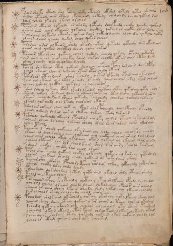

# Voynich Speculative Herbal Ferment Recipe — f106r

IMPORTANT: this is NOT a real or validated translation of the Voynich Manuscript. It is a speculative/procedural model that interprets EVA using a user-defined grammar to generate experimental recipes using safe, known edible substitutes.

This file is generated automatically from IVTFF/EVA transliteration plus a user-defined procedural grammar.

## Page / Folio
- currier: B
- folio: f106r
- page_number: 218
- plant_category_confidence: 0.0
- plant_category_guess: unknown

## Plant Interpretation (Heuristic)
- category: unknown
- confidence: 0.0
- note: Heuristic classification based on the IVTFF 'Plant ID' string (not the drawing). Does not imply real identification of the manuscript plant.

## EVA Text (Transliteration)
pshdar shoefy yteedy sh[a:o]l korchy sheky otchedy okshed qotedy qoted yteeody
shedchy ytchedy chees otshes okcho chdy qokeedy ched chedy chedy qotar rod
dshes lchedy lkchedy ytchdy or cheos
pcheodair okchedy olkeeedy or arojy qopchdy sholfchdy cheeky lchedy qokam
ysheor aiin char okaiin qokeechy checkhy qokeod ar qokeo lkeo lchor[o:a]m
shor sheor orkchsd otair or qokeeo raiin qokeeolchedy olchedy qokeol qoky
olched qoiin ychedy qokam sheol qokor cheees
porarchy orar ol kaiin shedy oteedy qotor qoteedo qoteedy dair ok[ch:ee]daim
ychor chol qokain chocphol lchedy qocheo qokar
pshoair lkeeshedy qokain cheoly qokedy lchedy qokedy otedy qotoky
sar aiin cheol aiin cheokey raiin chokar cholky okeees aiin okeey lchg
okeey lcheedy olkeey qokeeo dchedy
pcheol sheokaiin otey qokeeor sheo aiin otchey pcheo ror aiin daiinopal
ychol okaiin olcheey dolchedy otair otal chedy okeor
podaroar oteeo lchor shol tchedy chotar opchedy opches aiin okchdam
soin oin okain aiin arol ocheedy lkeeeody daiin chedar okol otar chdam
yochor lshedy qockhey qokedain or aiinchodar
kshed dsheol qokeedy otol okeedy lkeedar sheopchy qopchy qotolchy qoty chdy
otchedy qokeey shosaiin qokaiin okain cholkeeey ltal olcheey qotchoraiin y
ytaiin cheey qokaiin shaiin qokeedy sail chedy cheodal qochedy qokaiin
olkeedy qokchedy cheo lkeedy chearaiin okain
tshodair olkeees odain qokeedy opchor aror pcheeody daiir opchedy opchody
ychedy qckhedy dair al qokedy shecphy qokchy otedy dar aror
podshedy qokchedy lkechor otchodar cho lky chedar otaiin chkchedaram
soraiin cheeo lo lchey qokaiin shedy okain shear qokain chees ykarain
ycheeo lkeey
tcheoky lkshedy qokaiin lky raiin chy rody chlar cheeorfor cheoly
okaiin ol lcho rcheo raiin qokaiin chey chokaiin chear ar ol raralchl
saiin chal chlal okal ykalaiin okain qokain ar okaiin char aiiny
ycheeo lkaiin cho ror sheo l kain shor sar aiiry sheo al kairam
ysha[r:ir] chkar aiiiky ral cheol oraiin
poral sho keeody qokain chckhy olteeedy qopche[r:s] al karchy qotedary
ycheol chokaiin sheody chody qokaiin ar akair aiir okaly
tcheorsho lkshey lpcheo ro lpchey oporaiin chpchy qopcheody qotarain
okaiin choky lkar chdy lchedy
psheodalo dar sheodal qotedy qotes aiin okalal shdy otaiin shedy
tchodaiin tcheo dlchy
pshodaiin opchy sh o teeody shotchey yteey sholfaiin opchdy lchdy dol
ycheool cheeey ol aiin cheody laiiin chekol cheey okchar aiin aloal
shaiin ar aiin sheey lkaiin sheedy shedy qokal chey okaiin chdaldy
dair alsheod shedy cholchedy cheol shory
pcheodar shol ka[in:ir] oke'echedy qoteey shotchy qoty lpaiin shedy lar
daiiral sheol daiin otedy qokain okar cheor al taiin chekal otaras
dshedy qoteey otaiin chy chealol chlchd aiin oty otair otaiikam
y sheedal okain okain otar kaiin chdalkair olkai[?:r] al keedy okal
sotchdaiin shodaiin otedy qokeedy qokaiin ykar qokain cheedy lol
ycheoar okain qokain char oky cheokam

## Page Summary (Procedural, Aggregated)
- compound_counts: {'yeast fermentation': 176, 'secondary herb': 61, 'mix/transfer': 235, 'aroma modifier': 4, 'heat': 62, 'sugars': 131, 'main herb': 162, 'liquid base': 68, 'complex herbal compound': 6, 'general base': 1}
- dose_level: 3
- fermentation_estimate: 7–14 days

## Pantry (Max Needed For Any Single Line-Recipe)
- aroma_modifier: ['lemon peel (optional)']
- aroma_modifier_dose: ['2–5 g (or 1 strip of peel, avoiding the bitter pith)']
- main_plant_dry_g: 15
- main_plant_substitute: ['chamomile (safe default substitute)']
- safe_complex_herbal_blend: ['gentle spices (e.g., 1 g cinnamon + 1 g clove) or a commercial herbal tea blend']
- secondary_herb_dry_g: 7
- secondary_herb_substitute: ['mint']
- sugar_or_honey_g: 75
- water_l: 0.5
- yeast_g: 1

## Line Recipes (Each Line = One Recipe, 0.5L batch)

### f106r.1,@P0

EVA: pshdar shoefy yteedy sh[a:o]l korchy sheky otchedy okshed qotedy qoted yteeody

## Ingredients
- aroma_modifier: lemon peel (optional)
- aroma_modifier_dose: 2–5 g (or 1 strip of peel, avoiding the bitter pith)
- main_plant_dry_g: 10
- main_plant_substitute: chamomile (safe default substitute)
- secondary_herb_dry_g: 5
- secondary_herb_substitute: mint
- sugar_or_honey_g: 50
- water_l: 0.5
- yeast_g: 1

Process:
1. Sanitize the jar/fermenter and utensils.
2. Base: combine 0.5 L water with 50 g sugar or honey.
3. Apply gentle heat: simmer 10–15 min, then cool to <30°C before adding yeast.
4. Add main plant: chamomile (safe default substitute) (~10 g dried).
5. Add secondary herb: mint (~5 g dried).
6. Add aroma modifier (optional) in a low dose.
7. Pitch yeast: 1 g (ideally cider/beer yeast).
8. Ferment with an airlock: 2–4 days (guided by iin/aiin markers).
9. Strain/rack (if very solid-heavy) and cold-crash 24 h.
10. Bottle only when activity clearly slows; refrigerate. Avoid overpressure.

Expected Result: A mild, aromatic herbal ferment, low-to-medium intensity depending on dose level.

Does It Make Sense?: partial

Direct Gloss (Procedural, Not a Real Translation):
- pshdar: add secondary herb (safe substitute) → start fermentation (yeast) → duration level 1 → state: fermentation start
- shoefy: add secondary herb (safe substitute) → add aroma modifier → mix / transfer → duration level 1 → state: active extraction
- yteedy: apply heat/cooking → start fermentation (yeast) → duration level 2 → state: active extraction
- sh: add secondary herb (safe substitute)
- a: duration level 1 → state: fermentation start
- o: mix / transfer
- l: [unparsed]
- korchy: add fermentable sugars → add main plant (safe substitute) → mix / transfer
- sheky: add fermentable sugars → add secondary herb (safe substitute) → duration level 1 → state: active extraction
- otchedy: apply heat/cooking → add main plant (safe substitute) → mix / transfer → start fermentation (yeast) → duration level 1 → state: active extraction
- okshed: add fermentable sugars → add secondary herb (safe substitute) → mix / transfer → start fermentation (yeast) → duration level 1 → state: active extraction
- qotedy: prepare liquid base → apply heat/cooking → start fermentation (yeast) → duration level 1 → state: active extraction
- qoted: prepare liquid base → apply heat/cooking → start fermentation (yeast) → duration level 1 → state: active extraction
- yteeody: apply heat/cooking → mix / transfer → start fermentation (yeast) → duration level 2 → state: active extraction

### f106r.2,+P0

EVA: shedchy ytchedy chees otshes okcho chdy qokeedy ched chedy chedy qotar rod

## Ingredients
- main_plant_dry_g: 10
- main_plant_substitute: chamomile (safe default substitute)
- secondary_herb_dry_g: 5
- secondary_herb_substitute: mint
- sugar_or_honey_g: 50
- water_l: 0.5
- yeast_g: 1

Process:
1. Sanitize the jar/fermenter and utensils.
2. Base: combine 0.5 L water with 50 g sugar or honey.
3. Apply gentle heat: simmer 10–15 min, then cool to <30°C before adding yeast.
4. Add main plant: chamomile (safe default substitute) (~10 g dried).
5. Add secondary herb: mint (~5 g dried).
6. Pitch yeast: 1 g (ideally cider/beer yeast).
7. Ferment with an airlock: 2–4 days (guided by iin/aiin markers).
8. Strain/rack (if very solid-heavy) and cold-crash 24 h.
9. Bottle only when activity clearly slows; refrigerate. Avoid overpressure.

Expected Result: A mild, aromatic herbal ferment, low-to-medium intensity depending on dose level.

Does It Make Sense?: partial

Direct Gloss (Procedural, Not a Real Translation):
- shedchy: add main plant (safe substitute) → add secondary herb (safe substitute) → start fermentation (yeast) → duration level 1 → state: active extraction
- ytchedy: apply heat/cooking → add main plant (safe substitute) → start fermentation (yeast) → duration level 1 → state: active extraction
- chees: add main plant (safe substitute) → duration level 2 → state: active extraction
- otshes: apply heat/cooking → add secondary herb (safe substitute) → mix / transfer → duration level 1 → state: active extraction
- okcho: add fermentable sugars → add main plant (safe substitute) → mix / transfer
- chdy: add main plant (safe substitute) → start fermentation (yeast)
- qokeedy: prepare liquid base → add fermentable sugars → start fermentation (yeast) → duration level 2 → state: active extraction
- ched: add main plant (safe substitute) → start fermentation (yeast) → duration level 1 → state: active extraction
- chedy: add main plant (safe substitute) → start fermentation (yeast) → duration level 1 → state: active extraction
- chedy: add main plant (safe substitute) → start fermentation (yeast) → duration level 1 → state: active extraction
- qotar: prepare liquid base → apply heat/cooking → duration level 1 → state: fermentation start
- rod: mix / transfer → start fermentation (yeast)

### f106r.3,+P0

EVA: dshes lchedy lkchedy ytchdy or cheos

## Ingredients
- main_plant_dry_g: 5
- main_plant_substitute: chamomile (safe default substitute)
- secondary_herb_dry_g: 2
- secondary_herb_substitute: mint
- sugar_or_honey_g: 25
- water_l: 0.5
- yeast_g: 1

Process:
1. Sanitize the jar/fermenter and utensils.
2. Base: combine 0.5 L water with 25 g sugar or honey.
3. Apply gentle heat: simmer 10–15 min, then cool to <30°C before adding yeast.
4. Add main plant: chamomile (safe default substitute) (~5 g dried).
5. Add secondary herb: mint (~2 g dried).
6. Pitch yeast: 1 g (ideally cider/beer yeast).
7. Ferment with an airlock: 2–4 days (guided by iin/aiin markers).
8. Strain/rack (if very solid-heavy) and cold-crash 24 h.
9. Bottle only when activity clearly slows; refrigerate. Avoid overpressure.

Expected Result: A mild, aromatic herbal ferment, low-to-medium intensity depending on dose level.

Does It Make Sense?: partial

Direct Gloss (Procedural, Not a Real Translation):
- dshes: add secondary herb (safe substitute) → start fermentation (yeast) → duration level 1 → state: active extraction
- lchedy: add main plant (safe substitute) → start fermentation (yeast) → duration level 1 → state: active extraction
- lkchedy: add fermentable sugars → add main plant (safe substitute) → start fermentation (yeast) → duration level 1 → state: active extraction
- ytchdy: apply heat/cooking → add main plant (safe substitute) → start fermentation (yeast)
- or: mix / transfer
- cheos: add main plant (safe substitute) → mix / transfer → duration level 1 → state: active extraction

### f106r.4,+P0

EVA: pcheodair okchedy olkeeedy or arojy qopchdy sholfchdy cheeky lchedy qokam

## Ingredients
- aroma_modifier: lemon peel (optional)
- aroma_modifier_dose: 2–5 g (or 1 strip of peel, avoiding the bitter pith)
- main_plant_dry_g: 15
- main_plant_substitute: chamomile (safe default substitute)
- secondary_herb_dry_g: 7
- secondary_herb_substitute: mint
- sugar_or_honey_g: 75
- water_l: 0.5
- yeast_g: 1

Process:
1. Sanitize the jar/fermenter and utensils.
2. Base: combine 0.5 L water with 75 g sugar or honey.
3. Infusion: use hot (not boiling) water, then let it cool before adding yeast.
4. Add main plant: chamomile (safe default substitute) (~15 g dried).
5. Add secondary herb: mint (~7 g dried).
6. Add aroma modifier (optional) in a low dose.
7. Pitch yeast: 1 g (ideally cider/beer yeast).
8. Ferment with an airlock: 2–4 days (guided by iin/aiin markers).
9. Strain/rack (if very solid-heavy) and cold-crash 24 h.
10. Bottle only when activity clearly slows; refrigerate. Avoid overpressure.

Expected Result: A mild, aromatic herbal ferment, low-to-medium intensity depending on dose level.

Does It Make Sense?: partial

Direct Gloss (Procedural, Not a Real Translation):
- pcheodair: add main plant (safe substitute) → mix / transfer → start fermentation (yeast) → duration level 1 → state: active extraction
- okchedy: add fermentable sugars → add main plant (safe substitute) → mix / transfer → start fermentation (yeast) → duration level 1 → state: active extraction
- olkeeedy: add fermentable sugars → mix / transfer → start fermentation (yeast) → duration level 3 → state: active extraction
- or: mix / transfer
- arojy: mix / transfer → duration level 1 → state: fermentation start
- qopchdy: prepare liquid base → add main plant (safe substitute) → start fermentation (yeast)
- sholfchdy: add main plant (safe substitute) → add secondary herb (safe substitute) → add aroma modifier → mix / transfer → start fermentation (yeast)
- cheeky: add fermentable sugars → add main plant (safe substitute) → duration level 2 → state: active extraction
- lchedy: add main plant (safe substitute) → start fermentation (yeast) → duration level 1 → state: active extraction
- qokam: prepare liquid base → add fermentable sugars → duration level 1 → state: fermentation start

### f106r.5,+P0

EVA: ysheor aiin char okaiin qokeechy checkhy qokeod ar qokeo lkeo lchor[o:a]m

## Ingredients
- main_plant_dry_g: 10
- main_plant_substitute: chamomile (safe default substitute)
- safe_complex_herbal_blend: gentle spices (e.g., 1 g cinnamon + 1 g clove) or a commercial herbal tea blend
- secondary_herb_dry_g: 5
- secondary_herb_substitute: mint
- sugar_or_honey_g: 50
- water_l: 0.5
- yeast_g: 1

Process:
1. Sanitize the jar/fermenter and utensils.
2. Base: combine 0.5 L water with 50 g sugar or honey.
3. Infusion: use hot (not boiling) water, then let it cool before adding yeast.
4. Add main plant: chamomile (safe default substitute) (~10 g dried).
5. Add secondary herb: mint (~5 g dried).
6. If a complex herbal compound appears, use a safe commercial blend or gentle spices in micro-doses.
7. Pitch yeast: 1 g (ideally cider/beer yeast).
8. Ferment with an airlock: 7–14 days (guided by iin/aiin markers).
9. Strain/rack (if very solid-heavy) and cold-crash 24 h.
10. Bottle only when activity clearly slows; refrigerate. Avoid overpressure.

Expected Result: A mild, aromatic herbal ferment, low-to-medium intensity depending on dose level.

Does It Make Sense?: partial

Direct Gloss (Procedural, Not a Real Translation):
- ysheor: add secondary herb (safe substitute) → mix / transfer → duration level 1 → state: active extraction
- aiin: duration level 1 → state: fermentation start → long fermentation / aging phase
- char: add main plant (safe substitute) → duration level 1 → state: fermentation start
- okaiin: add fermentable sugars → mix / transfer → duration level 1 → state: fermentation start → long fermentation / aging phase
- qokeechy: prepare liquid base → add fermentable sugars → add main plant (safe substitute) → duration level 2 → state: active extraction
- checkhy: add main plant (safe substitute) → add complex herbal compound (safe blend) → duration level 1 → state: active extraction
- qokeod: prepare liquid base → add fermentable sugars → mix / transfer → start fermentation (yeast) → duration level 1 → state: active extraction
- ar: duration level 1 → state: fermentation start
- qokeo: prepare liquid base → add fermentable sugars → mix / transfer → duration level 1 → state: active extraction
- lkeo: add fermentable sugars → mix / transfer → duration level 1 → state: active extraction
- lchor: add main plant (safe substitute) → mix / transfer
- o: mix / transfer
- a: duration level 1 → state: fermentation start
- m: [unparsed]

### f106r.6,+P0

EVA: shor sheor orkchsd otair or qokeeo raiin qokeeolchedy olchedy qokeol qoky

## Ingredients
- main_plant_dry_g: 10
- main_plant_substitute: chamomile (safe default substitute)
- secondary_herb_dry_g: 5
- secondary_herb_substitute: mint
- sugar_or_honey_g: 50
- water_l: 0.5
- yeast_g: 1

Process:
1. Sanitize the jar/fermenter and utensils.
2. Base: combine 0.5 L water with 50 g sugar or honey.
3. Apply gentle heat: simmer 10–15 min, then cool to <30°C before adding yeast.
4. Add main plant: chamomile (safe default substitute) (~10 g dried).
5. Add secondary herb: mint (~5 g dried).
6. Pitch yeast: 1 g (ideally cider/beer yeast).
7. Ferment with an airlock: 7–14 days (guided by iin/aiin markers).
8. Strain/rack (if very solid-heavy) and cold-crash 24 h.
9. Bottle only when activity clearly slows; refrigerate. Avoid overpressure.

Expected Result: A mild, aromatic herbal ferment, low-to-medium intensity depending on dose level.

Does It Make Sense?: partial

Direct Gloss (Procedural, Not a Real Translation):
- shor: add secondary herb (safe substitute) → mix / transfer
- sheor: add secondary herb (safe substitute) → mix / transfer → duration level 1 → state: active extraction
- orkchsd: add fermentable sugars → add main plant (safe substitute) → mix / transfer → start fermentation (yeast)
- otair: apply heat/cooking → mix / transfer → duration level 1 → state: fermentation start
- or: mix / transfer
- qokeeo: prepare liquid base → add fermentable sugars → mix / transfer → duration level 2 → state: active extraction
- raiin: duration level 1 → state: fermentation start → long fermentation / aging phase
- qokeeolchedy: prepare liquid base → add fermentable sugars → add main plant (safe substitute) → mix / transfer → start fermentation (yeast) → duration level 2 → state: active extraction
- olchedy: add main plant (safe substitute) → mix / transfer → start fermentation (yeast) → duration level 1 → state: active extraction
- qokeol: prepare liquid base → add fermentable sugars → mix / transfer → duration level 1 → state: active extraction
- qoky: prepare liquid base → add fermentable sugars

### f106r.7,+P0

EVA: olched qoiin ychedy qokam sheol qokor cheees

## Ingredients
- main_plant_dry_g: 15
- main_plant_substitute: chamomile (safe default substitute)
- secondary_herb_dry_g: 7
- secondary_herb_substitute: mint
- sugar_or_honey_g: 75
- water_l: 0.5
- yeast_g: 1

Process:
1. Sanitize the jar/fermenter and utensils.
2. Base: combine 0.5 L water with 75 g sugar or honey.
3. Infusion: use hot (not boiling) water, then let it cool before adding yeast.
4. Add main plant: chamomile (safe default substitute) (~15 g dried).
5. Add secondary herb: mint (~7 g dried).
6. Pitch yeast: 1 g (ideally cider/beer yeast).
7. Ferment with an airlock: 3–5 days (guided by iin/aiin markers).
8. Strain/rack (if very solid-heavy) and cold-crash 24 h.
9. Bottle only when activity clearly slows; refrigerate. Avoid overpressure.

Expected Result: A mild, aromatic herbal ferment, low-to-medium intensity depending on dose level.

Does It Make Sense?: partial

Direct Gloss (Procedural, Not a Real Translation):
- olched: add main plant (safe substitute) → mix / transfer → start fermentation (yeast) → duration level 1 → state: active extraction
- qoiin: prepare liquid base → duration level 2 → state: cooling/rest → medium fermentation phase
- ychedy: add main plant (safe substitute) → start fermentation (yeast) → duration level 1 → state: active extraction
- qokam: prepare liquid base → add fermentable sugars → duration level 1 → state: fermentation start
- sheol: add secondary herb (safe substitute) → mix / transfer → duration level 1 → state: active extraction
- qokor: prepare liquid base → add fermentable sugars → mix / transfer
- cheees: add main plant (safe substitute) → duration level 3 → state: active extraction

### f106r.8,+P0

EVA: porarchy orar ol kaiin shedy oteedy qotor qoteedo qoteedy dair ok[ch:ee]daim

## Ingredients
- main_plant_dry_g: 10
- main_plant_substitute: chamomile (safe default substitute)
- secondary_herb_dry_g: 5
- secondary_herb_substitute: mint
- sugar_or_honey_g: 50
- water_l: 0.5
- yeast_g: 1

Process:
1. Sanitize the jar/fermenter and utensils.
2. Base: combine 0.5 L water with 50 g sugar or honey.
3. Apply gentle heat: simmer 10–15 min, then cool to <30°C before adding yeast.
4. Add main plant: chamomile (safe default substitute) (~10 g dried).
5. Add secondary herb: mint (~5 g dried).
6. Pitch yeast: 1 g (ideally cider/beer yeast).
7. Ferment with an airlock: 7–14 days (guided by iin/aiin markers).
8. Strain/rack (if very solid-heavy) and cold-crash 24 h.
9. Bottle only when activity clearly slows; refrigerate. Avoid overpressure.

Expected Result: A mild, aromatic herbal ferment, low-to-medium intensity depending on dose level.

Does It Make Sense?: partial

Direct Gloss (Procedural, Not a Real Translation):
- porarchy: add main plant (safe substitute) → mix / transfer → start fermentation (yeast) → duration level 1 → state: fermentation start
- orar: mix / transfer → duration level 1 → state: fermentation start
- ol: mix / transfer
- kaiin: add fermentable sugars → duration level 1 → state: fermentation start → long fermentation / aging phase
- shedy: add secondary herb (safe substitute) → start fermentation (yeast) → duration level 1 → state: active extraction
- oteedy: apply heat/cooking → mix / transfer → start fermentation (yeast) → duration level 2 → state: active extraction
- qotor: prepare liquid base → apply heat/cooking → mix / transfer
- qoteedo: prepare liquid base → apply heat/cooking → mix / transfer → start fermentation (yeast) → duration level 2 → state: active extraction
- qoteedy: prepare liquid base → apply heat/cooking → start fermentation (yeast) → duration level 2 → state: active extraction
- dair: start fermentation (yeast) → duration level 1 → state: fermentation start
- ok: add fermentable sugars → mix / transfer
- ch: add main plant (safe substitute)
- ee: duration level 2 → state: active extraction
- daim: start fermentation (yeast) → duration level 1 → state: fermentation start

### f106r.9,+P0

EVA: ychor chol qokain chocphol lchedy qocheo qokar

## Ingredients
- main_plant_dry_g: 5
- main_plant_substitute: chamomile (safe default substitute)
- safe_complex_herbal_blend: gentle spices (e.g., 1 g cinnamon + 1 g clove) or a commercial herbal tea blend
- secondary_herb_dry_g: 1
- secondary_herb_substitute: mint
- sugar_or_honey_g: 25
- water_l: 0.5
- yeast_g: 1

Process:
1. Sanitize the jar/fermenter and utensils.
2. Base: combine 0.5 L water with 25 g sugar or honey.
3. Infusion: use hot (not boiling) water, then let it cool before adding yeast.
4. Add main plant: chamomile (safe default substitute) (~5 g dried).
5. Add secondary herb: mint (~1 g dried).
6. If a complex herbal compound appears, use a safe commercial blend or gentle spices in micro-doses.
7. Pitch yeast: 1 g (ideally cider/beer yeast).
8. Ferment with an airlock: 2–4 days (guided by iin/aiin markers).
9. Strain/rack (if very solid-heavy) and cold-crash 24 h.
10. Bottle only when activity clearly slows; refrigerate. Avoid overpressure.

Expected Result: A mild, aromatic herbal ferment, low-to-medium intensity depending on dose level.

Does It Make Sense?: partial

Direct Gloss (Procedural, Not a Real Translation):
- ychor: add main plant (safe substitute) → mix / transfer
- chol: add main plant (safe substitute) → mix / transfer
- qokain: prepare liquid base → add fermentable sugars → duration level 1 → state: fermentation start
- chocphol: add main plant (safe substitute) → mix / transfer → add complex herbal compound (safe blend)
- lchedy: add main plant (safe substitute) → start fermentation (yeast) → duration level 1 → state: active extraction
- qocheo: prepare liquid base → add main plant (safe substitute) → mix / transfer → duration level 1 → state: active extraction
- qokar: prepare liquid base → add fermentable sugars → duration level 1 → state: fermentation start

### f106r.10,+P0

EVA: pshoair lkeeshedy qokain cheoly qokedy lchedy qokedy otedy qotoky

## Ingredients
- main_plant_dry_g: 10
- main_plant_substitute: chamomile (safe default substitute)
- secondary_herb_dry_g: 5
- secondary_herb_substitute: mint
- sugar_or_honey_g: 50
- water_l: 0.5
- yeast_g: 1

Process:
1. Sanitize the jar/fermenter and utensils.
2. Base: combine 0.5 L water with 50 g sugar or honey.
3. Apply gentle heat: simmer 10–15 min, then cool to <30°C before adding yeast.
4. Add main plant: chamomile (safe default substitute) (~10 g dried).
5. Add secondary herb: mint (~5 g dried).
6. Pitch yeast: 1 g (ideally cider/beer yeast).
7. Ferment with an airlock: 2–4 days (guided by iin/aiin markers).
8. Strain/rack (if very solid-heavy) and cold-crash 24 h.
9. Bottle only when activity clearly slows; refrigerate. Avoid overpressure.

Expected Result: A mild, aromatic herbal ferment, low-to-medium intensity depending on dose level.

Does It Make Sense?: partial

Direct Gloss (Procedural, Not a Real Translation):
- pshoair: add secondary herb (safe substitute) → mix / transfer → start fermentation (yeast) → duration level 1 → state: fermentation start
- lkeeshedy: add fermentable sugars → add secondary herb (safe substitute) → start fermentation (yeast) → duration level 2 → state: active extraction
- qokain: prepare liquid base → add fermentable sugars → duration level 1 → state: fermentation start
- cheoly: add main plant (safe substitute) → mix / transfer → duration level 1 → state: active extraction
- qokedy: prepare liquid base → add fermentable sugars → start fermentation (yeast) → duration level 1 → state: active extraction
- lchedy: add main plant (safe substitute) → start fermentation (yeast) → duration level 1 → state: active extraction
- qokedy: prepare liquid base → add fermentable sugars → start fermentation (yeast) → duration level 1 → state: active extraction
- otedy: apply heat/cooking → mix / transfer → start fermentation (yeast) → duration level 1 → state: active extraction
- qotoky: prepare liquid base → add fermentable sugars → apply heat/cooking → mix / transfer

### f106r.11,+P0

EVA: sar aiin cheol aiin cheokey raiin chokar cholky okeees aiin okeey lchg

## Ingredients
- main_plant_dry_g: 15
- main_plant_substitute: chamomile (safe default substitute)
- secondary_herb_dry_g: 3
- secondary_herb_substitute: mint
- sugar_or_honey_g: 75
- water_l: 0.5
- yeast_g: 1

Process:
1. Sanitize the jar/fermenter and utensils.
2. Base: combine 0.5 L water with 75 g sugar or honey.
3. Infusion: use hot (not boiling) water, then let it cool before adding yeast.
4. Add main plant: chamomile (safe default substitute) (~15 g dried).
5. Add secondary herb: mint (~3 g dried).
6. Pitch yeast: 1 g (ideally cider/beer yeast).
7. Ferment with an airlock: 7–14 days (guided by iin/aiin markers).
8. Strain/rack (if very solid-heavy) and cold-crash 24 h.
9. Bottle only when activity clearly slows; refrigerate. Avoid overpressure.

Expected Result: A mild, aromatic herbal ferment, low-to-medium intensity depending on dose level.

Does It Make Sense?: partial

Direct Gloss (Procedural, Not a Real Translation):
- sar: duration level 1 → state: fermentation start
- aiin: duration level 1 → state: fermentation start → long fermentation / aging phase
- cheol: add main plant (safe substitute) → mix / transfer → duration level 1 → state: active extraction
- aiin: duration level 1 → state: fermentation start → long fermentation / aging phase
- cheokey: add fermentable sugars → add main plant (safe substitute) → mix / transfer → duration level 1 → state: active extraction
- raiin: duration level 1 → state: fermentation start → long fermentation / aging phase
- chokar: add fermentable sugars → add main plant (safe substitute) → mix / transfer → duration level 1 → state: fermentation start
- cholky: add fermentable sugars → add main plant (safe substitute) → mix / transfer
- okeees: add fermentable sugars → mix / transfer → duration level 3 → state: active extraction
- aiin: duration level 1 → state: fermentation start → long fermentation / aging phase
- okeey: add fermentable sugars → mix / transfer → duration level 2 → state: active extraction
- lchg: add main plant (safe substitute)

### f106r.12,+P0

EVA: okeey lcheedy olkeey qokeeo dchedy

## Ingredients
- main_plant_dry_g: 10
- main_plant_substitute: chamomile (safe default substitute)
- secondary_herb_dry_g: 2
- secondary_herb_substitute: mint
- sugar_or_honey_g: 50
- water_l: 0.5
- yeast_g: 1

Process:
1. Sanitize the jar/fermenter and utensils.
2. Base: combine 0.5 L water with 50 g sugar or honey.
3. Infusion: use hot (not boiling) water, then let it cool before adding yeast.
4. Add main plant: chamomile (safe default substitute) (~10 g dried).
5. Add secondary herb: mint (~2 g dried).
6. Pitch yeast: 1 g (ideally cider/beer yeast).
7. Ferment with an airlock: 2–4 days (guided by iin/aiin markers).
8. Strain/rack (if very solid-heavy) and cold-crash 24 h.
9. Bottle only when activity clearly slows; refrigerate. Avoid overpressure.

Expected Result: A mild, aromatic herbal ferment, low-to-medium intensity depending on dose level.

Does It Make Sense?: partial

Direct Gloss (Procedural, Not a Real Translation):
- okeey: add fermentable sugars → mix / transfer → duration level 2 → state: active extraction
- lcheedy: add main plant (safe substitute) → start fermentation (yeast) → duration level 2 → state: active extraction
- olkeey: add fermentable sugars → mix / transfer → duration level 2 → state: active extraction
- qokeeo: prepare liquid base → add fermentable sugars → mix / transfer → duration level 2 → state: active extraction
- dchedy: add main plant (safe substitute) → start fermentation (yeast) → duration level 1 → state: active extraction

### f106r.13,+P0

EVA: pcheol sheokaiin otey qokeeor sheo aiin otchey pcheo ror aiin daiinopal

## Ingredients
- main_plant_dry_g: 10
- main_plant_substitute: chamomile (safe default substitute)
- secondary_herb_dry_g: 5
- secondary_herb_substitute: mint
- sugar_or_honey_g: 50
- water_l: 0.5
- yeast_g: 1

Process:
1. Sanitize the jar/fermenter and utensils.
2. Base: combine 0.5 L water with 50 g sugar or honey.
3. Apply gentle heat: simmer 10–15 min, then cool to <30°C before adding yeast.
4. Add main plant: chamomile (safe default substitute) (~10 g dried).
5. Add secondary herb: mint (~5 g dried).
6. Pitch yeast: 1 g (ideally cider/beer yeast).
7. Ferment with an airlock: 7–14 days (guided by iin/aiin markers).
8. Strain/rack (if very solid-heavy) and cold-crash 24 h.
9. Bottle only when activity clearly slows; refrigerate. Avoid overpressure.

Expected Result: A mild, aromatic herbal ferment, low-to-medium intensity depending on dose level.

Does It Make Sense?: partial

Direct Gloss (Procedural, Not a Real Translation):
- pcheol: add main plant (safe substitute) → mix / transfer → start fermentation (yeast) → duration level 1 → state: active extraction
- sheokaiin: add fermentable sugars → add secondary herb (safe substitute) → mix / transfer → duration level 1 → state: active extraction → long fermentation / aging phase
- otey: apply heat/cooking → mix / transfer → duration level 1 → state: active extraction
- qokeeor: prepare liquid base → add fermentable sugars → mix / transfer → duration level 2 → state: active extraction
- sheo: add secondary herb (safe substitute) → mix / transfer → duration level 1 → state: active extraction
- aiin: duration level 1 → state: fermentation start → long fermentation / aging phase
- otchey: apply heat/cooking → add main plant (safe substitute) → mix / transfer → duration level 1 → state: active extraction
- pcheo: add main plant (safe substitute) → mix / transfer → start fermentation (yeast) → duration level 1 → state: active extraction
- ror: mix / transfer
- aiin: duration level 1 → state: fermentation start → long fermentation / aging phase
- daiinopal: mix / transfer → start fermentation (yeast) → duration level 1 → state: fermentation start → long fermentation / aging phase

### f106r.14,+P0

EVA: ychol okaiin olcheey dolchedy otair otal chedy okeor

## Ingredients
- main_plant_dry_g: 10
- main_plant_substitute: chamomile (safe default substitute)
- secondary_herb_dry_g: 2
- secondary_herb_substitute: mint
- sugar_or_honey_g: 50
- water_l: 0.5
- yeast_g: 1

Process:
1. Sanitize the jar/fermenter and utensils.
2. Base: combine 0.5 L water with 50 g sugar or honey.
3. Apply gentle heat: simmer 10–15 min, then cool to <30°C before adding yeast.
4. Add main plant: chamomile (safe default substitute) (~10 g dried).
5. Add secondary herb: mint (~2 g dried).
6. Pitch yeast: 1 g (ideally cider/beer yeast).
7. Ferment with an airlock: 7–14 days (guided by iin/aiin markers).
8. Strain/rack (if very solid-heavy) and cold-crash 24 h.
9. Bottle only when activity clearly slows; refrigerate. Avoid overpressure.

Expected Result: A mild, aromatic herbal ferment, low-to-medium intensity depending on dose level.

Does It Make Sense?: partial

Direct Gloss (Procedural, Not a Real Translation):
- ychol: add main plant (safe substitute) → mix / transfer
- okaiin: add fermentable sugars → mix / transfer → duration level 1 → state: fermentation start → long fermentation / aging phase
- olcheey: add main plant (safe substitute) → mix / transfer → duration level 2 → state: active extraction
- dolchedy: add main plant (safe substitute) → mix / transfer → start fermentation (yeast) → duration level 1 → state: active extraction
- otair: apply heat/cooking → mix / transfer → duration level 1 → state: fermentation start
- otal: apply heat/cooking → mix / transfer → duration level 1 → state: fermentation start
- chedy: add main plant (safe substitute) → start fermentation (yeast) → duration level 1 → state: active extraction
- okeor: add fermentable sugars → mix / transfer → duration level 1 → state: active extraction

### f106r.15,+P0

EVA: podaroar oteeo lchor shol tchedy chotar opchedy opches aiin okchdam

## Ingredients
- main_plant_dry_g: 10
- main_plant_substitute: chamomile (safe default substitute)
- secondary_herb_dry_g: 5
- secondary_herb_substitute: mint
- sugar_or_honey_g: 50
- water_l: 0.5
- yeast_g: 1

Process:
1. Sanitize the jar/fermenter and utensils.
2. Base: combine 0.5 L water with 50 g sugar or honey.
3. Apply gentle heat: simmer 10–15 min, then cool to <30°C before adding yeast.
4. Add main plant: chamomile (safe default substitute) (~10 g dried).
5. Add secondary herb: mint (~5 g dried).
6. Pitch yeast: 1 g (ideally cider/beer yeast).
7. Ferment with an airlock: 7–14 days (guided by iin/aiin markers).
8. Strain/rack (if very solid-heavy) and cold-crash 24 h.
9. Bottle only when activity clearly slows; refrigerate. Avoid overpressure.

Expected Result: A mild, aromatic herbal ferment, low-to-medium intensity depending on dose level.

Does It Make Sense?: partial

Direct Gloss (Procedural, Not a Real Translation):
- podaroar: mix / transfer → start fermentation (yeast) → duration level 1 → state: fermentation start
- oteeo: apply heat/cooking → mix / transfer → duration level 2 → state: active extraction
- lchor: add main plant (safe substitute) → mix / transfer
- shol: add secondary herb (safe substitute) → mix / transfer
- tchedy: apply heat/cooking → add main plant (safe substitute) → start fermentation (yeast) → duration level 1 → state: active extraction
- chotar: apply heat/cooking → add main plant (safe substitute) → mix / transfer → duration level 1 → state: fermentation start
- opchedy: add main plant (safe substitute) → mix / transfer → start fermentation (yeast) → duration level 1 → state: active extraction
- opches: add main plant (safe substitute) → mix / transfer → start fermentation (yeast) → duration level 1 → state: active extraction
- aiin: duration level 1 → state: fermentation start → long fermentation / aging phase
- okchdam: add fermentable sugars → add main plant (safe substitute) → mix / transfer → start fermentation (yeast) → duration level 1 → state: fermentation start

### f106r.16,+P0

EVA: soin oin okain aiin arol ocheedy lkeeeody daiin chedar okol otar chdam

## Ingredients
- main_plant_dry_g: 15
- main_plant_substitute: chamomile (safe default substitute)
- secondary_herb_dry_g: 3
- secondary_herb_substitute: mint
- sugar_or_honey_g: 75
- water_l: 0.5
- yeast_g: 1

Process:
1. Sanitize the jar/fermenter and utensils.
2. Base: combine 0.5 L water with 75 g sugar or honey.
3. Apply gentle heat: simmer 10–15 min, then cool to <30°C before adding yeast.
4. Add main plant: chamomile (safe default substitute) (~15 g dried).
5. Add secondary herb: mint (~3 g dried).
6. Pitch yeast: 1 g (ideally cider/beer yeast).
7. Ferment with an airlock: 7–14 days (guided by iin/aiin markers).
8. Strain/rack (if very solid-heavy) and cold-crash 24 h.
9. Bottle only when activity clearly slows; refrigerate. Avoid overpressure.

Expected Result: A mild, aromatic herbal ferment, low-to-medium intensity depending on dose level.

Does It Make Sense?: partial

Direct Gloss (Procedural, Not a Real Translation):
- soin: mix / transfer → duration level 1 → state: cooling/rest
- oin: mix / transfer → duration level 1 → state: cooling/rest
- okain: add fermentable sugars → mix / transfer → duration level 1 → state: fermentation start
- aiin: duration level 1 → state: fermentation start → long fermentation / aging phase
- arol: mix / transfer → duration level 1 → state: fermentation start
- ocheedy: add main plant (safe substitute) → mix / transfer → start fermentation (yeast) → duration level 2 → state: active extraction
- lkeeeody: add fermentable sugars → mix / transfer → start fermentation (yeast) → duration level 3 → state: active extraction
- daiin: start fermentation (yeast) → duration level 1 → state: fermentation start → long fermentation / aging phase
- chedar: add main plant (safe substitute) → start fermentation (yeast) → duration level 1 → state: active extraction
- okol: add fermentable sugars → mix / transfer
- otar: apply heat/cooking → mix / transfer → duration level 1 → state: fermentation start
- chdam: add main plant (safe substitute) → start fermentation (yeast) → duration level 1 → state: fermentation start

### f106r.17,+P0

EVA: yochor lshedy qockhey qokedain or aiinchodar

## Ingredients
- main_plant_dry_g: 5
- main_plant_substitute: chamomile (safe default substitute)
- safe_complex_herbal_blend: gentle spices (e.g., 1 g cinnamon + 1 g clove) or a commercial herbal tea blend
- secondary_herb_dry_g: 2
- secondary_herb_substitute: mint
- sugar_or_honey_g: 25
- water_l: 0.5
- yeast_g: 1

Process:
1. Sanitize the jar/fermenter and utensils.
2. Base: combine 0.5 L water with 25 g sugar or honey.
3. Infusion: use hot (not boiling) water, then let it cool before adding yeast.
4. Add main plant: chamomile (safe default substitute) (~5 g dried).
5. Add secondary herb: mint (~2 g dried).
6. If a complex herbal compound appears, use a safe commercial blend or gentle spices in micro-doses.
7. Pitch yeast: 1 g (ideally cider/beer yeast).
8. Ferment with an airlock: 7–14 days (guided by iin/aiin markers).
9. Strain/rack (if very solid-heavy) and cold-crash 24 h.
10. Bottle only when activity clearly slows; refrigerate. Avoid overpressure.

Expected Result: A mild, aromatic herbal ferment, low-to-medium intensity depending on dose level.

Does It Make Sense?: partial

Direct Gloss (Procedural, Not a Real Translation):
- yochor: add main plant (safe substitute) → mix / transfer
- lshedy: add secondary herb (safe substitute) → start fermentation (yeast) → duration level 1 → state: active extraction
- qockhey: prepare liquid base → add complex herbal compound (safe blend) → duration level 1 → state: active extraction
- qokedain: prepare liquid base → add fermentable sugars → start fermentation (yeast) → duration level 1 → state: active extraction
- or: mix / transfer
- aiinchodar: add main plant (safe substitute) → mix / transfer → start fermentation (yeast) → duration level 1 → state: fermentation start → long fermentation / aging phase

### f106r.18,+P0

EVA: kshed dsheol qokeedy otol okeedy lkeedar sheopchy qopchy qotolchy qoty chdy

## Ingredients
- main_plant_dry_g: 10
- main_plant_substitute: chamomile (safe default substitute)
- secondary_herb_dry_g: 5
- secondary_herb_substitute: mint
- sugar_or_honey_g: 50
- water_l: 0.5
- yeast_g: 1

Process:
1. Sanitize the jar/fermenter and utensils.
2. Base: combine 0.5 L water with 50 g sugar or honey.
3. Apply gentle heat: simmer 10–15 min, then cool to <30°C before adding yeast.
4. Add main plant: chamomile (safe default substitute) (~10 g dried).
5. Add secondary herb: mint (~5 g dried).
6. Pitch yeast: 1 g (ideally cider/beer yeast).
7. Ferment with an airlock: 2–4 days (guided by iin/aiin markers).
8. Strain/rack (if very solid-heavy) and cold-crash 24 h.
9. Bottle only when activity clearly slows; refrigerate. Avoid overpressure.

Expected Result: A mild, aromatic herbal ferment, low-to-medium intensity depending on dose level.

Does It Make Sense?: partial

Direct Gloss (Procedural, Not a Real Translation):
- kshed: add fermentable sugars → add secondary herb (safe substitute) → start fermentation (yeast) → duration level 1 → state: active extraction
- dsheol: add secondary herb (safe substitute) → mix / transfer → start fermentation (yeast) → duration level 1 → state: active extraction
- qokeedy: prepare liquid base → add fermentable sugars → start fermentation (yeast) → duration level 2 → state: active extraction
- otol: apply heat/cooking → mix / transfer
- okeedy: add fermentable sugars → mix / transfer → start fermentation (yeast) → duration level 2 → state: active extraction
- lkeedar: add fermentable sugars → start fermentation (yeast) → duration level 2 → state: active extraction
- sheopchy: add main plant (safe substitute) → add secondary herb (safe substitute) → mix / transfer → start fermentation (yeast) → duration level 1 → state: active extraction
- qopchy: prepare liquid base → add main plant (safe substitute) → start fermentation (yeast)
- qotolchy: prepare liquid base → apply heat/cooking → add main plant (safe substitute) → mix / transfer
- qoty: prepare liquid base → apply heat/cooking
- chdy: add main plant (safe substitute) → start fermentation (yeast)

### f106r.19,+P0

EVA: otchedy qokeey shosaiin qokaiin okain cholkeeey ltal olcheey qotchoraiin y

## Ingredients
- main_plant_dry_g: 15
- main_plant_substitute: chamomile (safe default substitute)
- secondary_herb_dry_g: 7
- secondary_herb_substitute: mint
- sugar_or_honey_g: 75
- water_l: 0.5
- yeast_g: 1

Process:
1. Sanitize the jar/fermenter and utensils.
2. Base: combine 0.5 L water with 75 g sugar or honey.
3. Apply gentle heat: simmer 10–15 min, then cool to <30°C before adding yeast.
4. Add main plant: chamomile (safe default substitute) (~15 g dried).
5. Add secondary herb: mint (~7 g dried).
6. Pitch yeast: 1 g (ideally cider/beer yeast).
7. Ferment with an airlock: 7–14 days (guided by iin/aiin markers).
8. Strain/rack (if very solid-heavy) and cold-crash 24 h.
9. Bottle only when activity clearly slows; refrigerate. Avoid overpressure.

Expected Result: A mild, aromatic herbal ferment, low-to-medium intensity depending on dose level.

Does It Make Sense?: partial

Direct Gloss (Procedural, Not a Real Translation):
- otchedy: apply heat/cooking → add main plant (safe substitute) → mix / transfer → start fermentation (yeast) → duration level 1 → state: active extraction
- qokeey: prepare liquid base → add fermentable sugars → duration level 2 → state: active extraction
- shosaiin: add secondary herb (safe substitute) → mix / transfer → duration level 1 → state: fermentation start → long fermentation / aging phase
- qokaiin: prepare liquid base → add fermentable sugars → duration level 1 → state: fermentation start → long fermentation / aging phase
- okain: add fermentable sugars → mix / transfer → duration level 1 → state: fermentation start
- cholkeeey: add fermentable sugars → add main plant (safe substitute) → mix / transfer → duration level 3 → state: active extraction
- ltal: apply heat/cooking → duration level 1 → state: fermentation start
- olcheey: add main plant (safe substitute) → mix / transfer → duration level 2 → state: active extraction
- qotchoraiin: prepare liquid base → apply heat/cooking → add main plant (safe substitute) → mix / transfer → duration level 1 → state: fermentation start → long fermentation / aging phase
- y: [unparsed]

### f106r.20,+P0

EVA: ytaiin cheey qokaiin shaiin qokeedy sail chedy cheodal qochedy qokaiin

## Ingredients
- main_plant_dry_g: 10
- main_plant_substitute: chamomile (safe default substitute)
- secondary_herb_dry_g: 5
- secondary_herb_substitute: mint
- sugar_or_honey_g: 50
- water_l: 0.5
- yeast_g: 1

Process:
1. Sanitize the jar/fermenter and utensils.
2. Base: combine 0.5 L water with 50 g sugar or honey.
3. Apply gentle heat: simmer 10–15 min, then cool to <30°C before adding yeast.
4. Add main plant: chamomile (safe default substitute) (~10 g dried).
5. Add secondary herb: mint (~5 g dried).
6. Pitch yeast: 1 g (ideally cider/beer yeast).
7. Ferment with an airlock: 7–14 days (guided by iin/aiin markers).
8. Strain/rack (if very solid-heavy) and cold-crash 24 h.
9. Bottle only when activity clearly slows; refrigerate. Avoid overpressure.

Expected Result: A mild, aromatic herbal ferment, low-to-medium intensity depending on dose level.

Does It Make Sense?: partial

Direct Gloss (Procedural, Not a Real Translation):
- ytaiin: apply heat/cooking → duration level 1 → state: fermentation start → long fermentation / aging phase
- cheey: add main plant (safe substitute) → duration level 2 → state: active extraction
- qokaiin: prepare liquid base → add fermentable sugars → duration level 1 → state: fermentation start → long fermentation / aging phase
- shaiin: add secondary herb (safe substitute) → duration level 1 → state: fermentation start → long fermentation / aging phase
- qokeedy: prepare liquid base → add fermentable sugars → start fermentation (yeast) → duration level 2 → state: active extraction
- sail: duration level 1 → state: fermentation start
- chedy: add main plant (safe substitute) → start fermentation (yeast) → duration level 1 → state: active extraction
- cheodal: add main plant (safe substitute) → mix / transfer → start fermentation (yeast) → duration level 1 → state: active extraction
- qochedy: prepare liquid base → add main plant (safe substitute) → start fermentation (yeast) → duration level 1 → state: active extraction
- qokaiin: prepare liquid base → add fermentable sugars → duration level 1 → state: fermentation start → long fermentation / aging phase

### f106r.21,+P0

EVA: olkeedy qokchedy cheo lkeedy chearaiin okain

## Ingredients
- main_plant_dry_g: 10
- main_plant_substitute: chamomile (safe default substitute)
- secondary_herb_dry_g: 2
- secondary_herb_substitute: mint
- sugar_or_honey_g: 50
- water_l: 0.5
- yeast_g: 1

Process:
1. Sanitize the jar/fermenter and utensils.
2. Base: combine 0.5 L water with 50 g sugar or honey.
3. Infusion: use hot (not boiling) water, then let it cool before adding yeast.
4. Add main plant: chamomile (safe default substitute) (~10 g dried).
5. Add secondary herb: mint (~2 g dried).
6. Pitch yeast: 1 g (ideally cider/beer yeast).
7. Ferment with an airlock: 7–14 days (guided by iin/aiin markers).
8. Strain/rack (if very solid-heavy) and cold-crash 24 h.
9. Bottle only when activity clearly slows; refrigerate. Avoid overpressure.

Expected Result: A mild, aromatic herbal ferment, low-to-medium intensity depending on dose level.

Does It Make Sense?: partial

Direct Gloss (Procedural, Not a Real Translation):
- olkeedy: add fermentable sugars → mix / transfer → start fermentation (yeast) → duration level 2 → state: active extraction
- qokchedy: prepare liquid base → add fermentable sugars → add main plant (safe substitute) → start fermentation (yeast) → duration level 1 → state: active extraction
- cheo: add main plant (safe substitute) → mix / transfer → duration level 1 → state: active extraction
- lkeedy: add fermentable sugars → start fermentation (yeast) → duration level 2 → state: active extraction
- chearaiin: add main plant (safe substitute) → duration level 1 → state: active extraction → long fermentation / aging phase
- okain: add fermentable sugars → mix / transfer → duration level 1 → state: fermentation start

### f106r.22,+P0

EVA: tshodair olkeees odain qokeedy opchor aror pcheeody daiir opchedy opchody

## Ingredients
- main_plant_dry_g: 15
- main_plant_substitute: chamomile (safe default substitute)
- secondary_herb_dry_g: 7
- secondary_herb_substitute: mint
- sugar_or_honey_g: 75
- water_l: 0.5
- yeast_g: 1

Process:
1. Sanitize the jar/fermenter and utensils.
2. Base: combine 0.5 L water with 75 g sugar or honey.
3. Apply gentle heat: simmer 10–15 min, then cool to <30°C before adding yeast.
4. Add main plant: chamomile (safe default substitute) (~15 g dried).
5. Add secondary herb: mint (~7 g dried).
6. Pitch yeast: 1 g (ideally cider/beer yeast).
7. Ferment with an airlock: 2–4 days (guided by iin/aiin markers).
8. Strain/rack (if very solid-heavy) and cold-crash 24 h.
9. Bottle only when activity clearly slows; refrigerate. Avoid overpressure.

Expected Result: A mild, aromatic herbal ferment, low-to-medium intensity depending on dose level.

Does It Make Sense?: partial

Direct Gloss (Procedural, Not a Real Translation):
- tshodair: apply heat/cooking → add secondary herb (safe substitute) → mix / transfer → start fermentation (yeast) → duration level 1 → state: fermentation start
- olkeees: add fermentable sugars → mix / transfer → duration level 3 → state: active extraction
- odain: mix / transfer → start fermentation (yeast) → duration level 1 → state: fermentation start
- qokeedy: prepare liquid base → add fermentable sugars → start fermentation (yeast) → duration level 2 → state: active extraction
- opchor: add main plant (safe substitute) → mix / transfer → start fermentation (yeast)
- aror: mix / transfer → duration level 1 → state: fermentation start
- pcheeody: add main plant (safe substitute) → mix / transfer → start fermentation (yeast) → duration level 2 → state: active extraction
- daiir: start fermentation (yeast) → duration level 1 → state: fermentation start
- opchedy: add main plant (safe substitute) → mix / transfer → start fermentation (yeast) → duration level 1 → state: active extraction
- opchody: add main plant (safe substitute) → mix / transfer → start fermentation (yeast)

### f106r.23,+P0

EVA: ychedy qckhedy dair al qokedy shecphy qokchy otedy dar aror

## Ingredients
- main_plant_dry_g: 5
- main_plant_substitute: chamomile (safe default substitute)
- safe_complex_herbal_blend: gentle spices (e.g., 1 g cinnamon + 1 g clove) or a commercial herbal tea blend
- secondary_herb_dry_g: 2
- secondary_herb_substitute: mint
- sugar_or_honey_g: 25
- water_l: 0.5
- yeast_g: 1

Process:
1. Sanitize the jar/fermenter and utensils.
2. Base: combine 0.5 L water with 25 g sugar or honey.
3. Apply gentle heat: simmer 10–15 min, then cool to <30°C before adding yeast.
4. Add main plant: chamomile (safe default substitute) (~5 g dried).
5. Add secondary herb: mint (~2 g dried).
6. If a complex herbal compound appears, use a safe commercial blend or gentle spices in micro-doses.
7. Pitch yeast: 1 g (ideally cider/beer yeast).
8. Ferment with an airlock: 2–4 days (guided by iin/aiin markers).
9. Strain/rack (if very solid-heavy) and cold-crash 24 h.
10. Bottle only when activity clearly slows; refrigerate. Avoid overpressure.

Expected Result: A mild, aromatic herbal ferment, low-to-medium intensity depending on dose level.

Does It Make Sense?: partial

Direct Gloss (Procedural, Not a Real Translation):
- ychedy: add main plant (safe substitute) → start fermentation (yeast) → duration level 1 → state: active extraction
- qckhedy: prepare base (generic) → start fermentation (yeast) → add complex herbal compound (safe blend) → duration level 1 → state: active extraction
- dair: start fermentation (yeast) → duration level 1 → state: fermentation start
- al: duration level 1 → state: fermentation start
- qokedy: prepare liquid base → add fermentable sugars → start fermentation (yeast) → duration level 1 → state: active extraction
- shecphy: add secondary herb (safe substitute) → add complex herbal compound (safe blend) → duration level 1 → state: active extraction
- qokchy: prepare liquid base → add fermentable sugars → add main plant (safe substitute)
- otedy: apply heat/cooking → mix / transfer → start fermentation (yeast) → duration level 1 → state: active extraction
- dar: start fermentation (yeast) → duration level 1 → state: fermentation start
- aror: mix / transfer → duration level 1 → state: fermentation start

### f106r.24,+P0

EVA: podshedy qokchedy lkechor otchodar cho lky chedar otaiin chkchedaram

## Ingredients
- main_plant_dry_g: 5
- main_plant_substitute: chamomile (safe default substitute)
- secondary_herb_dry_g: 2
- secondary_herb_substitute: mint
- sugar_or_honey_g: 25
- water_l: 0.5
- yeast_g: 1

Process:
1. Sanitize the jar/fermenter and utensils.
2. Base: combine 0.5 L water with 25 g sugar or honey.
3. Apply gentle heat: simmer 10–15 min, then cool to <30°C before adding yeast.
4. Add main plant: chamomile (safe default substitute) (~5 g dried).
5. Add secondary herb: mint (~2 g dried).
6. Pitch yeast: 1 g (ideally cider/beer yeast).
7. Ferment with an airlock: 7–14 days (guided by iin/aiin markers).
8. Strain/rack (if very solid-heavy) and cold-crash 24 h.
9. Bottle only when activity clearly slows; refrigerate. Avoid overpressure.

Expected Result: A mild, aromatic herbal ferment, low-to-medium intensity depending on dose level.

Does It Make Sense?: partial

Direct Gloss (Procedural, Not a Real Translation):
- podshedy: add secondary herb (safe substitute) → mix / transfer → start fermentation (yeast) → duration level 1 → state: active extraction
- qokchedy: prepare liquid base → add fermentable sugars → add main plant (safe substitute) → start fermentation (yeast) → duration level 1 → state: active extraction
- lkechor: add fermentable sugars → add main plant (safe substitute) → mix / transfer → duration level 1 → state: active extraction
- otchodar: apply heat/cooking → add main plant (safe substitute) → mix / transfer → start fermentation (yeast) → duration level 1 → state: fermentation start
- cho: add main plant (safe substitute) → mix / transfer
- lky: add fermentable sugars
- chedar: add main plant (safe substitute) → start fermentation (yeast) → duration level 1 → state: active extraction
- otaiin: apply heat/cooking → mix / transfer → duration level 1 → state: fermentation start → long fermentation / aging phase
- chkchedaram: add fermentable sugars → add main plant (safe substitute) → start fermentation (yeast) → duration level 1 → state: active extraction

### f106r.25,+P0

EVA: soraiin cheeo lo lchey qokaiin shedy okain shear qokain chees ykarain

## Ingredients
- main_plant_dry_g: 10
- main_plant_substitute: chamomile (safe default substitute)
- secondary_herb_dry_g: 5
- secondary_herb_substitute: mint
- sugar_or_honey_g: 50
- water_l: 0.5
- yeast_g: 1

Process:
1. Sanitize the jar/fermenter and utensils.
2. Base: combine 0.5 L water with 50 g sugar or honey.
3. Infusion: use hot (not boiling) water, then let it cool before adding yeast.
4. Add main plant: chamomile (safe default substitute) (~10 g dried).
5. Add secondary herb: mint (~5 g dried).
6. Pitch yeast: 1 g (ideally cider/beer yeast).
7. Ferment with an airlock: 7–14 days (guided by iin/aiin markers).
8. Strain/rack (if very solid-heavy) and cold-crash 24 h.
9. Bottle only when activity clearly slows; refrigerate. Avoid overpressure.

Expected Result: A mild, aromatic herbal ferment, low-to-medium intensity depending on dose level.

Does It Make Sense?: partial

Direct Gloss (Procedural, Not a Real Translation):
- soraiin: mix / transfer → duration level 1 → state: fermentation start → long fermentation / aging phase
- cheeo: add main plant (safe substitute) → mix / transfer → duration level 2 → state: active extraction
- lo: mix / transfer
- lchey: add main plant (safe substitute) → duration level 1 → state: active extraction
- qokaiin: prepare liquid base → add fermentable sugars → duration level 1 → state: fermentation start → long fermentation / aging phase
- shedy: add secondary herb (safe substitute) → start fermentation (yeast) → duration level 1 → state: active extraction
- okain: add fermentable sugars → mix / transfer → duration level 1 → state: fermentation start
- shear: add secondary herb (safe substitute) → duration level 1 → state: active extraction
- qokain: prepare liquid base → add fermentable sugars → duration level 1 → state: fermentation start
- chees: add main plant (safe substitute) → duration level 2 → state: active extraction
- ykarain: add fermentable sugars → duration level 1 → state: fermentation start

### f106r.26,+P0

EVA: ycheeo lkeey

## Ingredients
- main_plant_dry_g: 10
- main_plant_substitute: chamomile (safe default substitute)
- secondary_herb_dry_g: 2
- secondary_herb_substitute: mint
- sugar_or_honey_g: 50
- water_l: 0.5
- yeast_g: 1

Process:
1. Sanitize the jar/fermenter and utensils.
2. Base: combine 0.5 L water with 50 g sugar or honey.
3. Infusion: use hot (not boiling) water, then let it cool before adding yeast.
4. Add main plant: chamomile (safe default substitute) (~10 g dried).
5. Add secondary herb: mint (~2 g dried).
6. Pitch yeast: 1 g (ideally cider/beer yeast).
7. Ferment with an airlock: 2–4 days (guided by iin/aiin markers).
8. Strain/rack (if very solid-heavy) and cold-crash 24 h.
9. Bottle only when activity clearly slows; refrigerate. Avoid overpressure.

Expected Result: A mild, aromatic herbal ferment, low-to-medium intensity depending on dose level.

Does It Make Sense?: partial

Direct Gloss (Procedural, Not a Real Translation):
- ycheeo: add main plant (safe substitute) → mix / transfer → duration level 2 → state: active extraction
- lkeey: add fermentable sugars → duration level 2 → state: active extraction

### f106r.27,+P0

EVA: tcheoky lkshedy qokaiin lky raiin chy rody chlar cheeorfor cheoly

## Ingredients
- aroma_modifier: lemon peel (optional)
- aroma_modifier_dose: 2–5 g (or 1 strip of peel, avoiding the bitter pith)
- main_plant_dry_g: 10
- main_plant_substitute: chamomile (safe default substitute)
- secondary_herb_dry_g: 5
- secondary_herb_substitute: mint
- sugar_or_honey_g: 50
- water_l: 0.5
- yeast_g: 1

Process:
1. Sanitize the jar/fermenter and utensils.
2. Base: combine 0.5 L water with 50 g sugar or honey.
3. Apply gentle heat: simmer 10–15 min, then cool to <30°C before adding yeast.
4. Add main plant: chamomile (safe default substitute) (~10 g dried).
5. Add secondary herb: mint (~5 g dried).
6. Add aroma modifier (optional) in a low dose.
7. Pitch yeast: 1 g (ideally cider/beer yeast).
8. Ferment with an airlock: 7–14 days (guided by iin/aiin markers).
9. Strain/rack (if very solid-heavy) and cold-crash 24 h.
10. Bottle only when activity clearly slows; refrigerate. Avoid overpressure.

Expected Result: A mild, aromatic herbal ferment, low-to-medium intensity depending on dose level.

Does It Make Sense?: partial

Direct Gloss (Procedural, Not a Real Translation):
- tcheoky: add fermentable sugars → apply heat/cooking → add main plant (safe substitute) → mix / transfer → duration level 1 → state: active extraction
- lkshedy: add fermentable sugars → add secondary herb (safe substitute) → start fermentation (yeast) → duration level 1 → state: active extraction
- qokaiin: prepare liquid base → add fermentable sugars → duration level 1 → state: fermentation start → long fermentation / aging phase
- lky: add fermentable sugars
- raiin: duration level 1 → state: fermentation start → long fermentation / aging phase
- chy: add main plant (safe substitute)
- rody: mix / transfer → start fermentation (yeast)
- chlar: add main plant (safe substitute) → duration level 1 → state: fermentation start
- cheeorfor: add main plant (safe substitute) → add aroma modifier → mix / transfer → duration level 2 → state: active extraction
- cheoly: add main plant (safe substitute) → mix / transfer → duration level 1 → state: active extraction

### f106r.28,+P0

EVA: okaiin ol lcho rcheo raiin qokaiin chey chokaiin chear ar ol raralchl

## Ingredients
- main_plant_dry_g: 5
- main_plant_substitute: chamomile (safe default substitute)
- secondary_herb_dry_g: 1
- secondary_herb_substitute: mint
- sugar_or_honey_g: 25
- water_l: 0.5
- yeast_g: 1

Process:
1. Sanitize the jar/fermenter and utensils.
2. Base: combine 0.5 L water with 25 g sugar or honey.
3. Infusion: use hot (not boiling) water, then let it cool before adding yeast.
4. Add main plant: chamomile (safe default substitute) (~5 g dried).
5. Add secondary herb: mint (~1 g dried).
6. Pitch yeast: 1 g (ideally cider/beer yeast).
7. Ferment with an airlock: 7–14 days (guided by iin/aiin markers).
8. Strain/rack (if very solid-heavy) and cold-crash 24 h.
9. Bottle only when activity clearly slows; refrigerate. Avoid overpressure.

Expected Result: A mild, aromatic herbal ferment, low-to-medium intensity depending on dose level.

Does It Make Sense?: partial

Direct Gloss (Procedural, Not a Real Translation):
- okaiin: add fermentable sugars → mix / transfer → duration level 1 → state: fermentation start → long fermentation / aging phase
- ol: mix / transfer
- lcho: add main plant (safe substitute) → mix / transfer
- rcheo: add main plant (safe substitute) → mix / transfer → duration level 1 → state: active extraction
- raiin: duration level 1 → state: fermentation start → long fermentation / aging phase
- qokaiin: prepare liquid base → add fermentable sugars → duration level 1 → state: fermentation start → long fermentation / aging phase
- chey: add main plant (safe substitute) → duration level 1 → state: active extraction
- chokaiin: add fermentable sugars → add main plant (safe substitute) → mix / transfer → duration level 1 → state: fermentation start → long fermentation / aging phase
- chear: add main plant (safe substitute) → duration level 1 → state: active extraction
- ar: duration level 1 → state: fermentation start
- ol: mix / transfer
- raralchl: add main plant (safe substitute) → duration level 1 → state: fermentation start

### f106r.29,+P0

EVA: saiin chal chlal okal ykalaiin okain qokain ar okaiin char aiiny

## Ingredients
- main_plant_dry_g: 5
- main_plant_substitute: chamomile (safe default substitute)
- secondary_herb_dry_g: 1
- secondary_herb_substitute: mint
- sugar_or_honey_g: 25
- water_l: 0.5
- yeast_g: 1

Process:
1. Sanitize the jar/fermenter and utensils.
2. Base: combine 0.5 L water with 25 g sugar or honey.
3. Infusion: use hot (not boiling) water, then let it cool before adding yeast.
4. Add main plant: chamomile (safe default substitute) (~5 g dried).
5. Add secondary herb: mint (~1 g dried).
6. Pitch yeast: 1 g (ideally cider/beer yeast).
7. Ferment with an airlock: 7–14 days (guided by iin/aiin markers).
8. Strain/rack (if very solid-heavy) and cold-crash 24 h.
9. Bottle only when activity clearly slows; refrigerate. Avoid overpressure.

Expected Result: A mild, aromatic herbal ferment, low-to-medium intensity depending on dose level.

Does It Make Sense?: partial

Direct Gloss (Procedural, Not a Real Translation):
- saiin: duration level 1 → state: fermentation start → long fermentation / aging phase
- chal: add main plant (safe substitute) → duration level 1 → state: fermentation start
- chlal: add main plant (safe substitute) → duration level 1 → state: fermentation start
- okal: add fermentable sugars → mix / transfer → duration level 1 → state: fermentation start
- ykalaiin: add fermentable sugars → duration level 1 → state: fermentation start → long fermentation / aging phase
- okain: add fermentable sugars → mix / transfer → duration level 1 → state: fermentation start
- qokain: prepare liquid base → add fermentable sugars → duration level 1 → state: fermentation start
- ar: duration level 1 → state: fermentation start
- okaiin: add fermentable sugars → mix / transfer → duration level 1 → state: fermentation start → long fermentation / aging phase
- char: add main plant (safe substitute) → duration level 1 → state: fermentation start
- aiiny: duration level 1 → state: fermentation start → long fermentation / aging phase

### f106r.30,+P0

EVA: ycheeo lkaiin cho ror sheo l kain shor sar aiiry sheo al kairam

## Ingredients
- main_plant_dry_g: 10
- main_plant_substitute: chamomile (safe default substitute)
- secondary_herb_dry_g: 5
- secondary_herb_substitute: mint
- sugar_or_honey_g: 50
- water_l: 0.5
- yeast_g: 1

Process:
1. Sanitize the jar/fermenter and utensils.
2. Base: combine 0.5 L water with 50 g sugar or honey.
3. Infusion: use hot (not boiling) water, then let it cool before adding yeast.
4. Add main plant: chamomile (safe default substitute) (~10 g dried).
5. Add secondary herb: mint (~5 g dried).
6. Pitch yeast: 1 g (ideally cider/beer yeast).
7. Ferment with an airlock: 7–14 days (guided by iin/aiin markers).
8. Strain/rack (if very solid-heavy) and cold-crash 24 h.
9. Bottle only when activity clearly slows; refrigerate. Avoid overpressure.

Expected Result: A mild, aromatic herbal ferment, low-to-medium intensity depending on dose level.

Does It Make Sense?: partial

Direct Gloss (Procedural, Not a Real Translation):
- ycheeo: add main plant (safe substitute) → mix / transfer → duration level 2 → state: active extraction
- lkaiin: add fermentable sugars → duration level 1 → state: fermentation start → long fermentation / aging phase
- cho: add main plant (safe substitute) → mix / transfer
- ror: mix / transfer
- sheo: add secondary herb (safe substitute) → mix / transfer → duration level 1 → state: active extraction
- l: [unparsed]
- kain: add fermentable sugars → duration level 1 → state: fermentation start
- shor: add secondary herb (safe substitute) → mix / transfer
- sar: duration level 1 → state: fermentation start
- aiiry: duration level 1 → state: fermentation start
- sheo: add secondary herb (safe substitute) → mix / transfer → duration level 1 → state: active extraction
- al: duration level 1 → state: fermentation start
- kairam: add fermentable sugars → duration level 1 → state: fermentation start

### f106r.31,+P0

EVA: ysha[r:ir] chkar aiiiky ral cheol oraiin

## Ingredients
- main_plant_dry_g: 5
- main_plant_substitute: chamomile (safe default substitute)
- secondary_herb_dry_g: 2
- secondary_herb_substitute: mint
- sugar_or_honey_g: 25
- water_l: 0.5
- yeast_g: 1

Process:
1. Sanitize the jar/fermenter and utensils.
2. Base: combine 0.5 L water with 25 g sugar or honey.
3. Infusion: use hot (not boiling) water, then let it cool before adding yeast.
4. Add main plant: chamomile (safe default substitute) (~5 g dried).
5. Add secondary herb: mint (~2 g dried).
6. Pitch yeast: 1 g (ideally cider/beer yeast).
7. Ferment with an airlock: 7–14 days (guided by iin/aiin markers).
8. Strain/rack (if very solid-heavy) and cold-crash 24 h.
9. Bottle only when activity clearly slows; refrigerate. Avoid overpressure.

Expected Result: A mild, aromatic herbal ferment, low-to-medium intensity depending on dose level.

Does It Make Sense?: partial

Direct Gloss (Procedural, Not a Real Translation):
- ysha: add secondary herb (safe substitute) → duration level 1 → state: fermentation start
- r: [unparsed]
- ir: duration level 1 → state: cooling/rest
- chkar: add fermentable sugars → add main plant (safe substitute) → duration level 1 → state: fermentation start
- aiiiky: add fermentable sugars → duration level 1 → state: fermentation start
- ral: duration level 1 → state: fermentation start
- cheol: add main plant (safe substitute) → mix / transfer → duration level 1 → state: active extraction
- oraiin: mix / transfer → duration level 1 → state: fermentation start → long fermentation / aging phase

### f106r.32,+P0

EVA: poral sho keeody qokain chckhy olteeedy qopche[r:s] al karchy qotedary

## Ingredients
- main_plant_dry_g: 15
- main_plant_substitute: chamomile (safe default substitute)
- safe_complex_herbal_blend: gentle spices (e.g., 1 g cinnamon + 1 g clove) or a commercial herbal tea blend
- secondary_herb_dry_g: 7
- secondary_herb_substitute: mint
- sugar_or_honey_g: 75
- water_l: 0.5
- yeast_g: 1

Process:
1. Sanitize the jar/fermenter and utensils.
2. Base: combine 0.5 L water with 75 g sugar or honey.
3. Apply gentle heat: simmer 10–15 min, then cool to <30°C before adding yeast.
4. Add main plant: chamomile (safe default substitute) (~15 g dried).
5. Add secondary herb: mint (~7 g dried).
6. If a complex herbal compound appears, use a safe commercial blend or gentle spices in micro-doses.
7. Pitch yeast: 1 g (ideally cider/beer yeast).
8. Ferment with an airlock: 2–4 days (guided by iin/aiin markers).
9. Strain/rack (if very solid-heavy) and cold-crash 24 h.
10. Bottle only when activity clearly slows; refrigerate. Avoid overpressure.

Expected Result: A mild, aromatic herbal ferment, low-to-medium intensity depending on dose level.

Does It Make Sense?: partial

Direct Gloss (Procedural, Not a Real Translation):
- poral: mix / transfer → start fermentation (yeast) → duration level 1 → state: fermentation start
- sho: add secondary herb (safe substitute) → mix / transfer
- keeody: add fermentable sugars → mix / transfer → start fermentation (yeast) → duration level 2 → state: active extraction
- qokain: prepare liquid base → add fermentable sugars → duration level 1 → state: fermentation start
- chckhy: add main plant (safe substitute) → add complex herbal compound (safe blend)
- olteeedy: apply heat/cooking → mix / transfer → start fermentation (yeast) → duration level 3 → state: active extraction
- qopche: prepare liquid base → add main plant (safe substitute) → start fermentation (yeast) → duration level 1 → state: active extraction
- r: [unparsed]
- s: [unparsed]
- al: duration level 1 → state: fermentation start
- karchy: add fermentable sugars → add main plant (safe substitute) → duration level 1 → state: fermentation start
- qotedary: prepare liquid base → apply heat/cooking → start fermentation (yeast) → duration level 1 → state: active extraction

### f106r.33,+P0

EVA: ycheol chokaiin sheody chody qokaiin ar akair aiir okaly

## Ingredients
- main_plant_dry_g: 5
- main_plant_substitute: chamomile (safe default substitute)
- secondary_herb_dry_g: 2
- secondary_herb_substitute: mint
- sugar_or_honey_g: 25
- water_l: 0.5
- yeast_g: 1

Process:
1. Sanitize the jar/fermenter and utensils.
2. Base: combine 0.5 L water with 25 g sugar or honey.
3. Infusion: use hot (not boiling) water, then let it cool before adding yeast.
4. Add main plant: chamomile (safe default substitute) (~5 g dried).
5. Add secondary herb: mint (~2 g dried).
6. Pitch yeast: 1 g (ideally cider/beer yeast).
7. Ferment with an airlock: 7–14 days (guided by iin/aiin markers).
8. Strain/rack (if very solid-heavy) and cold-crash 24 h.
9. Bottle only when activity clearly slows; refrigerate. Avoid overpressure.

Expected Result: A mild, aromatic herbal ferment, low-to-medium intensity depending on dose level.

Does It Make Sense?: partial

Direct Gloss (Procedural, Not a Real Translation):
- ycheol: add main plant (safe substitute) → mix / transfer → duration level 1 → state: active extraction
- chokaiin: add fermentable sugars → add main plant (safe substitute) → mix / transfer → duration level 1 → state: fermentation start → long fermentation / aging phase
- sheody: add secondary herb (safe substitute) → mix / transfer → start fermentation (yeast) → duration level 1 → state: active extraction
- chody: add main plant (safe substitute) → mix / transfer → start fermentation (yeast)
- qokaiin: prepare liquid base → add fermentable sugars → duration level 1 → state: fermentation start → long fermentation / aging phase
- ar: duration level 1 → state: fermentation start
- akair: add fermentable sugars → duration level 1 → state: fermentation start
- aiir: duration level 1 → state: fermentation start
- okaly: add fermentable sugars → mix / transfer → duration level 1 → state: fermentation start

### f106r.34,+P0

EVA: tcheorsho lkshey lpcheo ro lpchey oporaiin chpchy qopcheody qotarain

## Ingredients
- main_plant_dry_g: 5
- main_plant_substitute: chamomile (safe default substitute)
- secondary_herb_dry_g: 2
- secondary_herb_substitute: mint
- sugar_or_honey_g: 25
- water_l: 0.5
- yeast_g: 1

Process:
1. Sanitize the jar/fermenter and utensils.
2. Base: combine 0.5 L water with 25 g sugar or honey.
3. Apply gentle heat: simmer 10–15 min, then cool to <30°C before adding yeast.
4. Add main plant: chamomile (safe default substitute) (~5 g dried).
5. Add secondary herb: mint (~2 g dried).
6. Pitch yeast: 1 g (ideally cider/beer yeast).
7. Ferment with an airlock: 7–14 days (guided by iin/aiin markers).
8. Strain/rack (if very solid-heavy) and cold-crash 24 h.
9. Bottle only when activity clearly slows; refrigerate. Avoid overpressure.

Expected Result: A mild, aromatic herbal ferment, low-to-medium intensity depending on dose level.

Does It Make Sense?: partial

Direct Gloss (Procedural, Not a Real Translation):
- tcheorsho: apply heat/cooking → add main plant (safe substitute) → add secondary herb (safe substitute) → mix / transfer → duration level 1 → state: active extraction
- lkshey: add fermentable sugars → add secondary herb (safe substitute) → duration level 1 → state: active extraction
- lpcheo: add main plant (safe substitute) → mix / transfer → start fermentation (yeast) → duration level 1 → state: active extraction
- ro: mix / transfer
- lpchey: add main plant (safe substitute) → start fermentation (yeast) → duration level 1 → state: active extraction
- oporaiin: mix / transfer → start fermentation (yeast) → duration level 1 → state: fermentation start → long fermentation / aging phase
- chpchy: add main plant (safe substitute) → start fermentation (yeast)
- qopcheody: prepare liquid base → add main plant (safe substitute) → mix / transfer → start fermentation (yeast) → duration level 1 → state: active extraction
- qotarain: prepare liquid base → apply heat/cooking → duration level 1 → state: fermentation start

### f106r.35,+P0

EVA: okaiin choky lkar chdy lchedy

## Ingredients
- main_plant_dry_g: 5
- main_plant_substitute: chamomile (safe default substitute)
- secondary_herb_dry_g: 1
- secondary_herb_substitute: mint
- sugar_or_honey_g: 25
- water_l: 0.5
- yeast_g: 1

Process:
1. Sanitize the jar/fermenter and utensils.
2. Base: combine 0.5 L water with 25 g sugar or honey.
3. Infusion: use hot (not boiling) water, then let it cool before adding yeast.
4. Add main plant: chamomile (safe default substitute) (~5 g dried).
5. Add secondary herb: mint (~1 g dried).
6. Pitch yeast: 1 g (ideally cider/beer yeast).
7. Ferment with an airlock: 7–14 days (guided by iin/aiin markers).
8. Strain/rack (if very solid-heavy) and cold-crash 24 h.
9. Bottle only when activity clearly slows; refrigerate. Avoid overpressure.

Expected Result: A mild, aromatic herbal ferment, low-to-medium intensity depending on dose level.

Does It Make Sense?: partial

Direct Gloss (Procedural, Not a Real Translation):
- okaiin: add fermentable sugars → mix / transfer → duration level 1 → state: fermentation start → long fermentation / aging phase
- choky: add fermentable sugars → add main plant (safe substitute) → mix / transfer
- lkar: add fermentable sugars → duration level 1 → state: fermentation start
- chdy: add main plant (safe substitute) → start fermentation (yeast)
- lchedy: add main plant (safe substitute) → start fermentation (yeast) → duration level 1 → state: active extraction

### f106r.36,+P0

EVA: psheodalo dar sheodal qotedy qotes aiin okalal shdy otaiin shedy

## Ingredients
- main_plant_dry_g: 2
- main_plant_substitute: chamomile (safe default substitute)
- secondary_herb_dry_g: 2
- secondary_herb_substitute: mint
- sugar_or_honey_g: 25
- water_l: 0.5
- yeast_g: 1

Process:
1. Sanitize the jar/fermenter and utensils.
2. Base: combine 0.5 L water with 25 g sugar or honey.
3. Apply gentle heat: simmer 10–15 min, then cool to <30°C before adding yeast.
4. Add main plant: chamomile (safe default substitute) (~2 g dried).
5. Add secondary herb: mint (~2 g dried).
6. Pitch yeast: 1 g (ideally cider/beer yeast).
7. Ferment with an airlock: 7–14 days (guided by iin/aiin markers).
8. Strain/rack (if very solid-heavy) and cold-crash 24 h.
9. Bottle only when activity clearly slows; refrigerate. Avoid overpressure.

Expected Result: A mild, aromatic herbal ferment, low-to-medium intensity depending on dose level.

Does It Make Sense?: partial

Direct Gloss (Procedural, Not a Real Translation):
- psheodalo: add secondary herb (safe substitute) → mix / transfer → start fermentation (yeast) → duration level 1 → state: active extraction
- dar: start fermentation (yeast) → duration level 1 → state: fermentation start
- sheodal: add secondary herb (safe substitute) → mix / transfer → start fermentation (yeast) → duration level 1 → state: active extraction
- qotedy: prepare liquid base → apply heat/cooking → start fermentation (yeast) → duration level 1 → state: active extraction
- qotes: prepare liquid base → apply heat/cooking → duration level 1 → state: active extraction
- aiin: duration level 1 → state: fermentation start → long fermentation / aging phase
- okalal: add fermentable sugars → mix / transfer → duration level 1 → state: fermentation start
- shdy: add secondary herb (safe substitute) → start fermentation (yeast)
- otaiin: apply heat/cooking → mix / transfer → duration level 1 → state: fermentation start → long fermentation / aging phase
- shedy: add secondary herb (safe substitute) → start fermentation (yeast) → duration level 1 → state: active extraction

### f106r.37,+P0

EVA: tchodaiin tcheo dlchy

## Ingredients
- main_plant_dry_g: 5
- main_plant_substitute: chamomile (safe default substitute)
- secondary_herb_dry_g: 1
- secondary_herb_substitute: mint
- sugar_or_honey_g: 12
- water_l: 0.5
- yeast_g: 1

Process:
1. Sanitize the jar/fermenter and utensils.
2. Base: combine 0.5 L water with 12 g sugar or honey.
3. Apply gentle heat: simmer 10–15 min, then cool to <30°C before adding yeast.
4. Add main plant: chamomile (safe default substitute) (~5 g dried).
5. Add secondary herb: mint (~1 g dried).
6. Pitch yeast: 1 g (ideally cider/beer yeast).
7. Ferment with an airlock: 7–14 days (guided by iin/aiin markers).
8. Strain/rack (if very solid-heavy) and cold-crash 24 h.
9. Bottle only when activity clearly slows; refrigerate. Avoid overpressure.

Expected Result: A mild, aromatic herbal ferment, low-to-medium intensity depending on dose level.

Does It Make Sense?: partial

Direct Gloss (Procedural, Not a Real Translation):
- tchodaiin: apply heat/cooking → add main plant (safe substitute) → mix / transfer → start fermentation (yeast) → duration level 1 → state: fermentation start → long fermentation / aging phase
- tcheo: apply heat/cooking → add main plant (safe substitute) → mix / transfer → duration level 1 → state: active extraction
- dlchy: add main plant (safe substitute) → start fermentation (yeast)

### f106r.38,+P0

EVA: pshodaiin opchy sh o teeody shotchey yteey sholfaiin opchdy lchdy dol

## Ingredients
- aroma_modifier: lemon peel (optional)
- aroma_modifier_dose: 2–5 g (or 1 strip of peel, avoiding the bitter pith)
- main_plant_dry_g: 10
- main_plant_substitute: chamomile (safe default substitute)
- secondary_herb_dry_g: 5
- secondary_herb_substitute: mint
- sugar_or_honey_g: 25
- water_l: 0.5
- yeast_g: 1

Process:
1. Sanitize the jar/fermenter and utensils.
2. Base: combine 0.5 L water with 25 g sugar or honey.
3. Apply gentle heat: simmer 10–15 min, then cool to <30°C before adding yeast.
4. Add main plant: chamomile (safe default substitute) (~10 g dried).
5. Add secondary herb: mint (~5 g dried).
6. Add aroma modifier (optional) in a low dose.
7. Pitch yeast: 1 g (ideally cider/beer yeast).
8. Ferment with an airlock: 7–14 days (guided by iin/aiin markers).
9. Strain/rack (if very solid-heavy) and cold-crash 24 h.
10. Bottle only when activity clearly slows; refrigerate. Avoid overpressure.

Expected Result: A mild, aromatic herbal ferment, low-to-medium intensity depending on dose level.

Does It Make Sense?: partial

Direct Gloss (Procedural, Not a Real Translation):
- pshodaiin: add secondary herb (safe substitute) → mix / transfer → start fermentation (yeast) → duration level 1 → state: fermentation start → long fermentation / aging phase
- opchy: add main plant (safe substitute) → mix / transfer → start fermentation (yeast)
- sh: add secondary herb (safe substitute)
- o: mix / transfer
- teeody: apply heat/cooking → mix / transfer → start fermentation (yeast) → duration level 2 → state: active extraction
- shotchey: apply heat/cooking → add main plant (safe substitute) → add secondary herb (safe substitute) → mix / transfer → duration level 1 → state: active extraction
- yteey: apply heat/cooking → duration level 2 → state: active extraction
- sholfaiin: add secondary herb (safe substitute) → add aroma modifier → mix / transfer → duration level 1 → state: fermentation start → long fermentation / aging phase
- opchdy: add main plant (safe substitute) → mix / transfer → start fermentation (yeast)
- lchdy: add main plant (safe substitute) → start fermentation (yeast)
- dol: mix / transfer → start fermentation (yeast)

### f106r.39,+P0

EVA: ycheool cheeey ol aiin cheody laiiin chekol cheey okchar aiin aloal

## Ingredients
- main_plant_dry_g: 15
- main_plant_substitute: chamomile (safe default substitute)
- secondary_herb_dry_g: 3
- secondary_herb_substitute: mint
- sugar_or_honey_g: 75
- water_l: 0.5
- yeast_g: 1

Process:
1. Sanitize the jar/fermenter and utensils.
2. Base: combine 0.5 L water with 75 g sugar or honey.
3. Infusion: use hot (not boiling) water, then let it cool before adding yeast.
4. Add main plant: chamomile (safe default substitute) (~15 g dried).
5. Add secondary herb: mint (~3 g dried).
6. Pitch yeast: 1 g (ideally cider/beer yeast).
7. Ferment with an airlock: 7–14 days (guided by iin/aiin markers).
8. Strain/rack (if very solid-heavy) and cold-crash 24 h.
9. Bottle only when activity clearly slows; refrigerate. Avoid overpressure.

Expected Result: A mild, aromatic herbal ferment, low-to-medium intensity depending on dose level.

Does It Make Sense?: partial

Direct Gloss (Procedural, Not a Real Translation):
- ycheool: add main plant (safe substitute) → mix / transfer → duration level 1 → state: active extraction
- cheeey: add main plant (safe substitute) → duration level 3 → state: active extraction
- ol: mix / transfer
- aiin: duration level 1 → state: fermentation start → long fermentation / aging phase
- cheody: add main plant (safe substitute) → mix / transfer → start fermentation (yeast) → duration level 1 → state: active extraction
- laiiin: duration level 1 → state: fermentation start → medium fermentation phase
- chekol: add fermentable sugars → add main plant (safe substitute) → mix / transfer → duration level 1 → state: active extraction
- cheey: add main plant (safe substitute) → duration level 2 → state: active extraction
- okchar: add fermentable sugars → add main plant (safe substitute) → mix / transfer → duration level 1 → state: fermentation start
- aiin: duration level 1 → state: fermentation start → long fermentation / aging phase
- aloal: mix / transfer → duration level 1 → state: fermentation start

### f106r.40,+P0

EVA: shaiin ar aiin sheey lkaiin sheedy shedy qokal chey okaiin chdaldy

## Ingredients
- main_plant_dry_g: 10
- main_plant_substitute: chamomile (safe default substitute)
- secondary_herb_dry_g: 5
- secondary_herb_substitute: mint
- sugar_or_honey_g: 50
- water_l: 0.5
- yeast_g: 1

Process:
1. Sanitize the jar/fermenter and utensils.
2. Base: combine 0.5 L water with 50 g sugar or honey.
3. Infusion: use hot (not boiling) water, then let it cool before adding yeast.
4. Add main plant: chamomile (safe default substitute) (~10 g dried).
5. Add secondary herb: mint (~5 g dried).
6. Pitch yeast: 1 g (ideally cider/beer yeast).
7. Ferment with an airlock: 7–14 days (guided by iin/aiin markers).
8. Strain/rack (if very solid-heavy) and cold-crash 24 h.
9. Bottle only when activity clearly slows; refrigerate. Avoid overpressure.

Expected Result: A mild, aromatic herbal ferment, low-to-medium intensity depending on dose level.

Does It Make Sense?: partial

Direct Gloss (Procedural, Not a Real Translation):
- shaiin: add secondary herb (safe substitute) → duration level 1 → state: fermentation start → long fermentation / aging phase
- ar: duration level 1 → state: fermentation start
- aiin: duration level 1 → state: fermentation start → long fermentation / aging phase
- sheey: add secondary herb (safe substitute) → duration level 2 → state: active extraction
- lkaiin: add fermentable sugars → duration level 1 → state: fermentation start → long fermentation / aging phase
- sheedy: add secondary herb (safe substitute) → start fermentation (yeast) → duration level 2 → state: active extraction
- shedy: add secondary herb (safe substitute) → start fermentation (yeast) → duration level 1 → state: active extraction
- qokal: prepare liquid base → add fermentable sugars → duration level 1 → state: fermentation start
- chey: add main plant (safe substitute) → duration level 1 → state: active extraction
- okaiin: add fermentable sugars → mix / transfer → duration level 1 → state: fermentation start → long fermentation / aging phase
- chdaldy: add main plant (safe substitute) → start fermentation (yeast) → duration level 1 → state: fermentation start

### f106r.41,+P0

EVA: dair alsheod shedy cholchedy cheol shory

## Ingredients
- main_plant_dry_g: 5
- main_plant_substitute: chamomile (safe default substitute)
- secondary_herb_dry_g: 2
- secondary_herb_substitute: mint
- sugar_or_honey_g: 12
- water_l: 0.5
- yeast_g: 1

Process:
1. Sanitize the jar/fermenter and utensils.
2. Base: combine 0.5 L water with 12 g sugar or honey.
3. Infusion: use hot (not boiling) water, then let it cool before adding yeast.
4. Add main plant: chamomile (safe default substitute) (~5 g dried).
5. Add secondary herb: mint (~2 g dried).
6. Pitch yeast: 1 g (ideally cider/beer yeast).
7. Ferment with an airlock: 2–4 days (guided by iin/aiin markers).
8. Strain/rack (if very solid-heavy) and cold-crash 24 h.
9. Bottle only when activity clearly slows; refrigerate. Avoid overpressure.

Expected Result: A mild, aromatic herbal ferment, low-to-medium intensity depending on dose level.

Does It Make Sense?: partial

Direct Gloss (Procedural, Not a Real Translation):
- dair: start fermentation (yeast) → duration level 1 → state: fermentation start
- alsheod: add secondary herb (safe substitute) → mix / transfer → start fermentation (yeast) → duration level 1 → state: fermentation start
- shedy: add secondary herb (safe substitute) → start fermentation (yeast) → duration level 1 → state: active extraction
- cholchedy: add main plant (safe substitute) → mix / transfer → start fermentation (yeast) → duration level 1 → state: active extraction
- cheol: add main plant (safe substitute) → mix / transfer → duration level 1 → state: active extraction
- shory: add secondary herb (safe substitute) → mix / transfer

### f106r.42,+P0

EVA: pcheodar shol ka[in:ir] oke'echedy qoteey shotchy qoty lpaiin shedy lar

## Ingredients
- main_plant_dry_g: 10
- main_plant_substitute: chamomile (safe default substitute)
- secondary_herb_dry_g: 5
- secondary_herb_substitute: mint
- sugar_or_honey_g: 50
- water_l: 0.5
- yeast_g: 1

Process:
1. Sanitize the jar/fermenter and utensils.
2. Base: combine 0.5 L water with 50 g sugar or honey.
3. Apply gentle heat: simmer 10–15 min, then cool to <30°C before adding yeast.
4. Add main plant: chamomile (safe default substitute) (~10 g dried).
5. Add secondary herb: mint (~5 g dried).
6. Pitch yeast: 1 g (ideally cider/beer yeast).
7. Ferment with an airlock: 7–14 days (guided by iin/aiin markers).
8. Strain/rack (if very solid-heavy) and cold-crash 24 h.
9. Bottle only when activity clearly slows; refrigerate. Avoid overpressure.

Expected Result: A mild, aromatic herbal ferment, low-to-medium intensity depending on dose level.

Does It Make Sense?: partial

Direct Gloss (Procedural, Not a Real Translation):
- pcheodar: add main plant (safe substitute) → mix / transfer → start fermentation (yeast) → duration level 1 → state: active extraction
- shol: add secondary herb (safe substitute) → mix / transfer
- ka: add fermentable sugars → duration level 1 → state: fermentation start
- in: duration level 1 → state: cooling/rest
- ir: duration level 1 → state: cooling/rest
- oke: add fermentable sugars → mix / transfer → duration level 1 → state: active extraction
- echedy: add main plant (safe substitute) → start fermentation (yeast) → duration level 1 → state: active extraction
- qoteey: prepare liquid base → apply heat/cooking → duration level 2 → state: active extraction
- shotchy: apply heat/cooking → add main plant (safe substitute) → add secondary herb (safe substitute) → mix / transfer
- qoty: prepare liquid base → apply heat/cooking
- lpaiin: start fermentation (yeast) → duration level 1 → state: fermentation start → long fermentation / aging phase
- shedy: add secondary herb (safe substitute) → start fermentation (yeast) → duration level 1 → state: active extraction
- lar: duration level 1 → state: fermentation start

### f106r.43,+P0

EVA: daiiral sheol daiin otedy qokain okar cheor al taiin chekal otaras

## Ingredients
- main_plant_dry_g: 5
- main_plant_substitute: chamomile (safe default substitute)
- secondary_herb_dry_g: 2
- secondary_herb_substitute: mint
- sugar_or_honey_g: 25
- water_l: 0.5
- yeast_g: 1

Process:
1. Sanitize the jar/fermenter and utensils.
2. Base: combine 0.5 L water with 25 g sugar or honey.
3. Apply gentle heat: simmer 10–15 min, then cool to <30°C before adding yeast.
4. Add main plant: chamomile (safe default substitute) (~5 g dried).
5. Add secondary herb: mint (~2 g dried).
6. Pitch yeast: 1 g (ideally cider/beer yeast).
7. Ferment with an airlock: 7–14 days (guided by iin/aiin markers).
8. Strain/rack (if very solid-heavy) and cold-crash 24 h.
9. Bottle only when activity clearly slows; refrigerate. Avoid overpressure.

Expected Result: A mild, aromatic herbal ferment, low-to-medium intensity depending on dose level.

Does It Make Sense?: partial

Direct Gloss (Procedural, Not a Real Translation):
- daiiral: start fermentation (yeast) → duration level 1 → state: fermentation start
- sheol: add secondary herb (safe substitute) → mix / transfer → duration level 1 → state: active extraction
- daiin: start fermentation (yeast) → duration level 1 → state: fermentation start → long fermentation / aging phase
- otedy: apply heat/cooking → mix / transfer → start fermentation (yeast) → duration level 1 → state: active extraction
- qokain: prepare liquid base → add fermentable sugars → duration level 1 → state: fermentation start
- okar: add fermentable sugars → mix / transfer → duration level 1 → state: fermentation start
- cheor: add main plant (safe substitute) → mix / transfer → duration level 1 → state: active extraction
- al: duration level 1 → state: fermentation start
- taiin: apply heat/cooking → duration level 1 → state: fermentation start → long fermentation / aging phase
- chekal: add fermentable sugars → add main plant (safe substitute) → duration level 1 → state: active extraction
- otaras: apply heat/cooking → mix / transfer → duration level 1 → state: fermentation start

### f106r.44,+P0

EVA: dshedy qoteey otaiin chy chealol chlchd aiin oty otair otaiikam

## Ingredients
- main_plant_dry_g: 10
- main_plant_substitute: chamomile (safe default substitute)
- secondary_herb_dry_g: 5
- secondary_herb_substitute: mint
- sugar_or_honey_g: 50
- water_l: 0.5
- yeast_g: 1

Process:
1. Sanitize the jar/fermenter and utensils.
2. Base: combine 0.5 L water with 50 g sugar or honey.
3. Apply gentle heat: simmer 10–15 min, then cool to <30°C before adding yeast.
4. Add main plant: chamomile (safe default substitute) (~10 g dried).
5. Add secondary herb: mint (~5 g dried).
6. Pitch yeast: 1 g (ideally cider/beer yeast).
7. Ferment with an airlock: 7–14 days (guided by iin/aiin markers).
8. Strain/rack (if very solid-heavy) and cold-crash 24 h.
9. Bottle only when activity clearly slows; refrigerate. Avoid overpressure.

Expected Result: A mild, aromatic herbal ferment, low-to-medium intensity depending on dose level.

Does It Make Sense?: partial

Direct Gloss (Procedural, Not a Real Translation):
- dshedy: add secondary herb (safe substitute) → start fermentation (yeast) → duration level 1 → state: active extraction
- qoteey: prepare liquid base → apply heat/cooking → duration level 2 → state: active extraction
- otaiin: apply heat/cooking → mix / transfer → duration level 1 → state: fermentation start → long fermentation / aging phase
- chy: add main plant (safe substitute)
- chealol: add main plant (safe substitute) → mix / transfer → duration level 1 → state: active extraction
- chlchd: add main plant (safe substitute) → start fermentation (yeast)
- aiin: duration level 1 → state: fermentation start → long fermentation / aging phase
- oty: apply heat/cooking → mix / transfer
- otair: apply heat/cooking → mix / transfer → duration level 1 → state: fermentation start
- otaiikam: add fermentable sugars → apply heat/cooking → mix / transfer → duration level 1 → state: fermentation start

### f106r.45,+P0

EVA: y sheedal okain okain otar kaiin chdalkair olkai[?:r] al keedy okal

## Ingredients
- main_plant_dry_g: 10
- main_plant_substitute: chamomile (safe default substitute)
- secondary_herb_dry_g: 5
- secondary_herb_substitute: mint
- sugar_or_honey_g: 50
- water_l: 0.5
- yeast_g: 1

Process:
1. Sanitize the jar/fermenter and utensils.
2. Base: combine 0.5 L water with 50 g sugar or honey.
3. Apply gentle heat: simmer 10–15 min, then cool to <30°C before adding yeast.
4. Add main plant: chamomile (safe default substitute) (~10 g dried).
5. Add secondary herb: mint (~5 g dried).
6. Pitch yeast: 1 g (ideally cider/beer yeast).
7. Ferment with an airlock: 7–14 days (guided by iin/aiin markers).
8. Strain/rack (if very solid-heavy) and cold-crash 24 h.
9. Bottle only when activity clearly slows; refrigerate. Avoid overpressure.

Expected Result: A mild, aromatic herbal ferment, low-to-medium intensity depending on dose level.

Does It Make Sense?: partial

Direct Gloss (Procedural, Not a Real Translation):
- y: [unparsed]
- sheedal: add secondary herb (safe substitute) → start fermentation (yeast) → duration level 2 → state: active extraction
- okain: add fermentable sugars → mix / transfer → duration level 1 → state: fermentation start
- okain: add fermentable sugars → mix / transfer → duration level 1 → state: fermentation start
- otar: apply heat/cooking → mix / transfer → duration level 1 → state: fermentation start
- kaiin: add fermentable sugars → duration level 1 → state: fermentation start → long fermentation / aging phase
- chdalkair: add fermentable sugars → add main plant (safe substitute) → start fermentation (yeast) → duration level 1 → state: fermentation start
- olkai: add fermentable sugars → mix / transfer → duration level 1 → state: fermentation start
- r: [unparsed]
- al: duration level 1 → state: fermentation start
- keedy: add fermentable sugars → start fermentation (yeast) → duration level 2 → state: active extraction
- okal: add fermentable sugars → mix / transfer → duration level 1 → state: fermentation start

### f106r.46,+P0

EVA: sotchdaiin shodaiin otedy qokeedy qokaiin ykar qokain cheedy lol

## Ingredients
- main_plant_dry_g: 10
- main_plant_substitute: chamomile (safe default substitute)
- secondary_herb_dry_g: 5
- secondary_herb_substitute: mint
- sugar_or_honey_g: 50
- water_l: 0.5
- yeast_g: 1

Process:
1. Sanitize the jar/fermenter and utensils.
2. Base: combine 0.5 L water with 50 g sugar or honey.
3. Apply gentle heat: simmer 10–15 min, then cool to <30°C before adding yeast.
4. Add main plant: chamomile (safe default substitute) (~10 g dried).
5. Add secondary herb: mint (~5 g dried).
6. Pitch yeast: 1 g (ideally cider/beer yeast).
7. Ferment with an airlock: 7–14 days (guided by iin/aiin markers).
8. Strain/rack (if very solid-heavy) and cold-crash 24 h.
9. Bottle only when activity clearly slows; refrigerate. Avoid overpressure.

Expected Result: A mild, aromatic herbal ferment, low-to-medium intensity depending on dose level.

Does It Make Sense?: partial

Direct Gloss (Procedural, Not a Real Translation):
- sotchdaiin: apply heat/cooking → add main plant (safe substitute) → mix / transfer → start fermentation (yeast) → duration level 1 → state: fermentation start → long fermentation / aging phase
- shodaiin: add secondary herb (safe substitute) → mix / transfer → start fermentation (yeast) → duration level 1 → state: fermentation start → long fermentation / aging phase
- otedy: apply heat/cooking → mix / transfer → start fermentation (yeast) → duration level 1 → state: active extraction
- qokeedy: prepare liquid base → add fermentable sugars → start fermentation (yeast) → duration level 2 → state: active extraction
- qokaiin: prepare liquid base → add fermentable sugars → duration level 1 → state: fermentation start → long fermentation / aging phase
- ykar: add fermentable sugars → duration level 1 → state: fermentation start
- qokain: prepare liquid base → add fermentable sugars → duration level 1 → state: fermentation start
- cheedy: add main plant (safe substitute) → start fermentation (yeast) → duration level 2 → state: active extraction
- lol: mix / transfer

### f106r.47,+P0

EVA: ycheoar okain qokain char oky cheokam

## Ingredients
- main_plant_dry_g: 5
- main_plant_substitute: chamomile (safe default substitute)
- secondary_herb_dry_g: 1
- secondary_herb_substitute: mint
- sugar_or_honey_g: 25
- water_l: 0.5
- yeast_g: 1

Process:
1. Sanitize the jar/fermenter and utensils.
2. Base: combine 0.5 L water with 25 g sugar or honey.
3. Infusion: use hot (not boiling) water, then let it cool before adding yeast.
4. Add main plant: chamomile (safe default substitute) (~5 g dried).
5. Add secondary herb: mint (~1 g dried).
6. Pitch yeast: 1 g (ideally cider/beer yeast).
7. Ferment with an airlock: 2–4 days (guided by iin/aiin markers).
8. Strain/rack (if very solid-heavy) and cold-crash 24 h.
9. Bottle only when activity clearly slows; refrigerate. Avoid overpressure.

Expected Result: A mild, aromatic herbal ferment, low-to-medium intensity depending on dose level.

Does It Make Sense?: partial

Direct Gloss (Procedural, Not a Real Translation):
- ycheoar: add main plant (safe substitute) → mix / transfer → duration level 1 → state: active extraction
- okain: add fermentable sugars → mix / transfer → duration level 1 → state: fermentation start
- qokain: prepare liquid base → add fermentable sugars → duration level 1 → state: fermentation start
- char: add main plant (safe substitute) → duration level 1 → state: fermentation start
- oky: add fermentable sugars → mix / transfer
- cheokam: add fermentable sugars → add main plant (safe substitute) → mix / transfer → duration level 1 → state: active extraction

## Risks & Warnings (Applies To All Line-Recipes)
- Never use unidentified Voynich plants directly; only use known edible substitutes.
- Do not consume if you see mold, smell rot, notice abnormal sliminess, or taste something clearly foul.
- Overpressure/bottle-bomb risk: do not bottle before stable; prefer an airlock and refrigeration.
- Avoid if pregnant/breastfeeding, for minors, or with medical conditions; consult a professional.
- No medical claims: this is an experimental beverage.

## Recommended Adjustments (General)
- If too bitter (leafy profile), halve the herbs or shorten steep/maceration time.
- If too sweet, extend fermentation or reduce sugar by 25–50%.
- For a non-alcoholic version, omit yeast and keep refrigerated as an infusion (not fermented).
