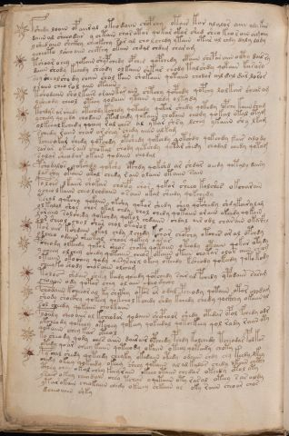

# Voynich Speculative Herbal Ferment Recipe — f106v

IMPORTANT: this is NOT a real or validated translation of the Voynich Manuscript. It is a speculative/procedural model that interprets EVA using a user-defined grammar to generate experimental recipes using safe, known edible substitutes.

This file is generated automatically from IVTFF/EVA transliteration plus a user-defined procedural grammar.



## Page / Folio
- currier: B
- folio: f106v
- page_number: 219
- plant_category_confidence: 0.0
- plant_category_guess: unknown

## Plant Interpretation (Heuristic)
- category: unknown
- confidence: 0.0
- note: Heuristic classification based on the IVTFF 'Plant ID' string (not the drawing). Does not imply real identification of the manuscript plant.

## EVA Text (Transliteration)
```text
fsheda looin opaiiral oteodaiin chopchy otair kar alalor aiin aly kar
daiin al sheeodar y chtain char otar qokar o[t:k]ar shed sheo keorain amchy
yshedaiin shckhy cheokchy sar al cho lchedy ytain otar al chdy daly lody
ycheoto lsheo aiin chcthy okain chdal chdam charam
tshoar oeey qokain shypchedy opched qopchedy otaiin chepar aiin octhy dair ry
daiin shody kchedy sheody olkaiin shkar chody talshdy qokain kararo
soy she[a:o]lsho dy chain shol kain shokaiin qotaiin chodar ail dal dar loror
oraiin cheo rol aiin otaiin
tshodaiin sholkair orainkar aiin shtchy qopchdy qopchy lolkair shear am
ysheody cheol oteey qodaiin ytain ychdy oltydy
tchdys arshedy oteeody kshedy qotchdy qotar shedy qotedy opchy kaiin sham
ycheey qoeeda chodain otalchdy qokaiin chokaiin chody qokal otal otam
olkeealkchedy qoeeey ral ches al ytar shsy lchey ykaiin shy lkam
schedy raiin char arshey chedy aiiin alkam
kcheo[a:y]kar shedy qofchdy otshedy qokchdy qotshdy qokchdy kair alody
sarar okear aiin chotal shody qotchdy qotar shedy chodal chedy qotam
salar she[o:a]dar okain qodaiin chodal
pshodalos qokshdy qokshy opchdy qokshd ar shdar oeedy qotaly dairy
darshy otaiin otal chedy r ain olaiin otaiin sain
polchs lkaiir shokar choefy shor qokor sheeo kolch'es okcharain
ycheo lkaiin cheo lchdaiin osaiin okal sheedy qokchedy
tshod qokchy qokaiin okshy qokar shedy shey qopshedy shdykairylam
ol kalol shar chor okal chdy chol chedy qotaiin or aiin okeedy qokain
soraiin solshedy qokchdy qokol chdaiin chdal air odl charain okaifhy
sar sheol chol shar chol okarol
tar air kshdain okal chdy lchedy kshar chopchy otches aral opchdy
olcheo odaiin sheotal shoor qokeey oarar
psheody olkeedy qokor sheos choty qotaiin oteody otaiin qokar otydy
ycheey olchey chedy qotaiin cheos otaiin otain chotar olos aiin cheog
otaiin okochey qody oeesysarx [o:y]keey oteedy ksheody qokeedy qotokody
sheeyko shody chosaiin olcham
polos shdair sheky keedy qoeedy qofchedy sair al pchedy ypodaiin saram
choaiin ody qotar chey ol aiin chey dychy
pchodaiin kcheeor al ky shcthy otos ar odal pcheody qotaiin otor alodam
shody shockhy qokeey qokcho l kchedy shdy kchedy chedy qockhey okaiin al
sol sheedy qokaiin cholkaiin
pyoaly cheo aiir al kcheodar qodaiin shcphoor shedy otedar opol fchedy odr
okcheody qokeey otchey qokeey qokeedal qotchkeey qol rody raiin oty
qokaiin chey kar oteol
ko sheody qody ches aiin dair air opchedy pchdy kolchedy tcheodar podkor
otedy qoar cheey kaiin qokeeody okaiin oteey qoteedy choty
py chal shedy qoteedy cheyky okedaiin otedy odaiin chdy chy keedy lkey
chedy okeey qokeedy okeey sheey qokaiin al al kalos chedy dkaiin chcthy
cthey chey okal chey keeyrain okeeo otaiin chedar oteedy otol oty
ysair okeey cheodain chey tchar oqotaiin oty rasal oteey sar aildy
ytar okain cheokaiin chedy okeeey chkaiin ol oky raiin cheoar chos
dcheoaiin shky
```

## Page Summary (Procedural, Aggregated)
- compound_counts: {'aroma modifier': 6, 'secondary herb': 77, 'yeast fermentation': 183, 'mix/transfer': 227, 'heat': 79, 'main herb': 137, 'sugars': 117, 'liquid base': 68, 'complex herbal compound': 9}
- dose_level: 3
- fermentation_estimate: 7–14 days

## Pantry (Max Needed For Any Single Line-Recipe)
- aroma_modifier: ['lemon peel (optional)']
- aroma_modifier_dose: ['2–5 g (or 1 strip of peel, avoiding the bitter pith)']
- main_plant_dry_g: 15
- main_plant_substitute: ['chamomile (safe default substitute)']
- safe_complex_herbal_blend: ['gentle spices (e.g., 1 g cinnamon + 1 g clove) or a commercial herbal tea blend']
- secondary_herb_dry_g: 7
- secondary_herb_substitute: ['mint']
- sugar_or_honey_g: 75
- water_l: 0.5
- yeast_g: 1

## Recipes Index (This Page)
- [f106v.1,@P0](#f106v-1-f106v-1-p0)
- [f106v.2,+P0](#f106v-2-f106v-2-p0)
- [f106v.3,+P0](#f106v-3-f106v-3-p0)
- [f106v.4,+P0](#f106v-4-f106v-4-p0)
- [f106v.5,+P0](#f106v-5-f106v-5-p0)
- [f106v.6,+P0](#f106v-6-f106v-6-p0)
- [f106v.7,+P0](#f106v-7-f106v-7-p0)
- [f106v.8,+P0](#f106v-8-f106v-8-p0)
- [f106v.9,+P0](#f106v-9-f106v-9-p0)
- [f106v.10,+P0](#f106v-10-f106v-10-p0)
- [f106v.11,+P0](#f106v-11-f106v-11-p0)
- [f106v.12,+P0](#f106v-12-f106v-12-p0)
- [f106v.13,+P0](#f106v-13-f106v-13-p0)
- [f106v.14,+P0](#f106v-14-f106v-14-p0)
- [f106v.15,+P0](#f106v-15-f106v-15-p0)
- [f106v.16,+P0](#f106v-16-f106v-16-p0)
- [f106v.17,+P0](#f106v-17-f106v-17-p0)
- [f106v.18,+P0](#f106v-18-f106v-18-p0)
- [f106v.19,+P0](#f106v-19-f106v-19-p0)
- [f106v.20,+P0](#f106v-20-f106v-20-p0)
- [f106v.21,+P0](#f106v-21-f106v-21-p0)
- [f106v.22,+P0](#f106v-22-f106v-22-p0)
- [f106v.23,+P0](#f106v-23-f106v-23-p0)
- [f106v.24,+P0](#f106v-24-f106v-24-p0)
- [f106v.25,+P0](#f106v-25-f106v-25-p0)
- [f106v.26,+P0](#f106v-26-f106v-26-p0)
- [f106v.27,+P0](#f106v-27-f106v-27-p0)
- [f106v.28,+P0](#f106v-28-f106v-28-p0)
- [f106v.29,+P0](#f106v-29-f106v-29-p0)
- [f106v.30,+P0](#f106v-30-f106v-30-p0)
- [f106v.31,+P0](#f106v-31-f106v-31-p0)
- [f106v.32,+P0](#f106v-32-f106v-32-p0)
- [f106v.33,+P0](#f106v-33-f106v-33-p0)
- [f106v.34,+P0](#f106v-34-f106v-34-p0)
- [f106v.35,+P0](#f106v-35-f106v-35-p0)
- [f106v.36,+P0](#f106v-36-f106v-36-p0)
- [f106v.37,+P0](#f106v-37-f106v-37-p0)
- [f106v.38,+P0](#f106v-38-f106v-38-p0)
- [f106v.39,+P0](#f106v-39-f106v-39-p0)
- [f106v.40,+P0](#f106v-40-f106v-40-p0)
- [f106v.41,+P0](#f106v-41-f106v-41-p0)
- [f106v.42,+P0](#f106v-42-f106v-42-p0)
- [f106v.43,+P0](#f106v-43-f106v-43-p0)
- [f106v.44,+P0](#f106v-44-f106v-44-p0)
- [f106v.45,+P0](#f106v-45-f106v-45-p0)
- [f106v.46,+P0](#f106v-46-f106v-46-p0)
- [f106v.47,+P0](#f106v-47-f106v-47-p0)

## Line Recipes (Each Line = One Recipe, 0.5L batch)

<a id="f106v-1-f106v-1-p0"></a>

### f106v.1,@P0

EVA: fsheda looin opaiiral oteodaiin chopchy otair kar alalor aiin aly kar

## Ingredients
- aroma_modifier: lemon peel (optional)
- aroma_modifier_dose: 2–5 g (or 1 strip of peel, avoiding the bitter pith)
- main_plant_dry_g: 5
- main_plant_substitute: chamomile (safe default substitute)
- secondary_herb_dry_g: 2
- secondary_herb_substitute: mint
- sugar_or_honey_g: 25
- water_l: 0.5
- yeast_g: 1

Process:
1. Sanitize the jar/fermenter and utensils.
2. Base: combine 0.5 L water with 25 g sugar or honey.
3. Apply gentle heat: simmer 10–15 min, then cool to <30°C before adding yeast.
4. Add main plant: chamomile (safe default substitute) (~5 g dried).
5. Add secondary herb: mint (~2 g dried).
6. Add aroma modifier (optional) in a low dose.
7. Pitch yeast: 1 g (ideally cider/beer yeast).
8. Ferment with an airlock: 7–14 days (guided by iin/aiin markers).
9. Strain/rack (if very solid-heavy) and cold-crash 24 h.
10. Bottle only when activity clearly slows; refrigerate. Avoid overpressure.

Expected Result: A mild, aromatic herbal ferment, low-to-medium intensity depending on dose level.

Does It Make Sense?: partial

Direct Gloss (Procedural, Not a Real Translation):
- fsheda: add secondary herb (safe substitute) → add aroma modifier → start fermentation (yeast) → duration level 1 → state: active extraction
- looin: mix / transfer → duration level 1 → state: cooling/rest
- opaiiral: mix / transfer → start fermentation (yeast) → duration level 1 → state: fermentation start
- oteodaiin: apply heat/cooking → mix / transfer → start fermentation (yeast) → duration level 1 → state: active extraction → long fermentation / aging phase
- chopchy: add main plant (safe substitute) → mix / transfer → start fermentation (yeast)
- otair: apply heat/cooking → mix / transfer → duration level 1 → state: fermentation start
- kar: add fermentable sugars → duration level 1 → state: fermentation start
- alalor: mix / transfer → duration level 1 → state: fermentation start
- aiin: duration level 1 → state: fermentation start → long fermentation / aging phase
- aly: duration level 1 → state: fermentation start
- kar: add fermentable sugars → duration level 1 → state: fermentation start

<a id="f106v-2-f106v-2-p0"></a>

### f106v.2,+P0

EVA: daiin al sheeodar y chtain char otar qokar o[t:k]ar shed sheo keorain amchy

## Ingredients
- main_plant_dry_g: 10
- main_plant_substitute: chamomile (safe default substitute)
- secondary_herb_dry_g: 5
- secondary_herb_substitute: mint
- sugar_or_honey_g: 50
- water_l: 0.5
- yeast_g: 1

Process:
1. Sanitize the jar/fermenter and utensils.
2. Base: combine 0.5 L water with 50 g sugar or honey.
3. Apply gentle heat: simmer 10–15 min, then cool to <30°C before adding yeast.
4. Add main plant: chamomile (safe default substitute) (~10 g dried).
5. Add secondary herb: mint (~5 g dried).
6. Pitch yeast: 1 g (ideally cider/beer yeast).
7. Ferment with an airlock: 7–14 days (guided by iin/aiin markers).
8. Strain/rack (if very solid-heavy) and cold-crash 24 h.
9. Bottle only when activity clearly slows; refrigerate. Avoid overpressure.

Expected Result: A mild, aromatic herbal ferment, low-to-medium intensity depending on dose level.

Does It Make Sense?: partial

Direct Gloss (Procedural, Not a Real Translation):
- daiin: start fermentation (yeast) → duration level 1 → state: fermentation start → long fermentation / aging phase
- al: duration level 1 → state: fermentation start
- sheeodar: add secondary herb (safe substitute) → mix / transfer → start fermentation (yeast) → duration level 2 → state: active extraction
- y: [unparsed]
- chtain: apply heat/cooking → add main plant (safe substitute) → duration level 1 → state: fermentation start
- char: add main plant (safe substitute) → duration level 1 → state: fermentation start
- otar: apply heat/cooking → mix / transfer → duration level 1 → state: fermentation start
- qokar: prepare liquid base → add fermentable sugars → duration level 1 → state: fermentation start
- o: mix / transfer
- t: apply heat/cooking
- k: add fermentable sugars
- ar: duration level 1 → state: fermentation start
- shed: add secondary herb (safe substitute) → start fermentation (yeast) → duration level 1 → state: active extraction
- sheo: add secondary herb (safe substitute) → mix / transfer → duration level 1 → state: active extraction
- keorain: add fermentable sugars → mix / transfer → duration level 1 → state: active extraction
- amchy: add main plant (safe substitute) → duration level 1 → state: fermentation start

<a id="f106v-3-f106v-3-p0"></a>

### f106v.3,+P0

EVA: yshedaiin shckhy cheokchy sar al cho lchedy ytain otar al chdy daly lody

## Ingredients
- main_plant_dry_g: 5
- main_plant_substitute: chamomile (safe default substitute)
- safe_complex_herbal_blend: gentle spices (e.g., 1 g cinnamon + 1 g clove) or a commercial herbal tea blend
- secondary_herb_dry_g: 2
- secondary_herb_substitute: mint
- sugar_or_honey_g: 25
- water_l: 0.5
- yeast_g: 1

Process:
1. Sanitize the jar/fermenter and utensils.
2. Base: combine 0.5 L water with 25 g sugar or honey.
3. Apply gentle heat: simmer 10–15 min, then cool to <30°C before adding yeast.
4. Add main plant: chamomile (safe default substitute) (~5 g dried).
5. Add secondary herb: mint (~2 g dried).
6. If a complex herbal compound appears, use a safe commercial blend or gentle spices in micro-doses.
7. Pitch yeast: 1 g (ideally cider/beer yeast).
8. Ferment with an airlock: 7–14 days (guided by iin/aiin markers).
9. Strain/rack (if very solid-heavy) and cold-crash 24 h.
10. Bottle only when activity clearly slows; refrigerate. Avoid overpressure.

Expected Result: A mild, aromatic herbal ferment, low-to-medium intensity depending on dose level.

Does It Make Sense?: partial

Direct Gloss (Procedural, Not a Real Translation):
- yshedaiin: add secondary herb (safe substitute) → start fermentation (yeast) → duration level 1 → state: active extraction → long fermentation / aging phase
- shckhy: add secondary herb (safe substitute) → add complex herbal compound (safe blend)
- cheokchy: add fermentable sugars → add main plant (safe substitute) → mix / transfer → duration level 1 → state: active extraction
- sar: duration level 1 → state: fermentation start
- al: duration level 1 → state: fermentation start
- cho: add main plant (safe substitute) → mix / transfer
- lchedy: add main plant (safe substitute) → start fermentation (yeast) → duration level 1 → state: active extraction
- ytain: apply heat/cooking → duration level 1 → state: fermentation start
- otar: apply heat/cooking → mix / transfer → duration level 1 → state: fermentation start
- al: duration level 1 → state: fermentation start
- chdy: add main plant (safe substitute) → start fermentation (yeast)
- daly: start fermentation (yeast) → duration level 1 → state: fermentation start
- lody: mix / transfer → start fermentation (yeast)

<a id="f106v-4-f106v-4-p0"></a>

### f106v.4,+P0

EVA: ycheoto lsheo aiin chcthy okain chdal chdam charam

## Ingredients
- main_plant_dry_g: 5
- main_plant_substitute: chamomile (safe default substitute)
- safe_complex_herbal_blend: gentle spices (e.g., 1 g cinnamon + 1 g clove) or a commercial herbal tea blend
- secondary_herb_dry_g: 2
- secondary_herb_substitute: mint
- sugar_or_honey_g: 25
- water_l: 0.5
- yeast_g: 1

Process:
1. Sanitize the jar/fermenter and utensils.
2. Base: combine 0.5 L water with 25 g sugar or honey.
3. Apply gentle heat: simmer 10–15 min, then cool to <30°C before adding yeast.
4. Add main plant: chamomile (safe default substitute) (~5 g dried).
5. Add secondary herb: mint (~2 g dried).
6. If a complex herbal compound appears, use a safe commercial blend or gentle spices in micro-doses.
7. Pitch yeast: 1 g (ideally cider/beer yeast).
8. Ferment with an airlock: 7–14 days (guided by iin/aiin markers).
9. Strain/rack (if very solid-heavy) and cold-crash 24 h.
10. Bottle only when activity clearly slows; refrigerate. Avoid overpressure.

Expected Result: A mild, aromatic herbal ferment, low-to-medium intensity depending on dose level.

Does It Make Sense?: partial

Direct Gloss (Procedural, Not a Real Translation):
- ycheoto: apply heat/cooking → add main plant (safe substitute) → mix / transfer → duration level 1 → state: active extraction
- lsheo: add secondary herb (safe substitute) → mix / transfer → duration level 1 → state: active extraction
- aiin: duration level 1 → state: fermentation start → long fermentation / aging phase
- chcthy: add main plant (safe substitute) → add complex herbal compound (safe blend)
- okain: add fermentable sugars → mix / transfer → duration level 1 → state: fermentation start
- chdal: add main plant (safe substitute) → start fermentation (yeast) → duration level 1 → state: fermentation start
- chdam: add main plant (safe substitute) → start fermentation (yeast) → duration level 1 → state: fermentation start
- charam: add main plant (safe substitute) → duration level 1 → state: fermentation start

<a id="f106v-5-f106v-5-p0"></a>

### f106v.5,+P0

EVA: tshoar oeey qokain shypchedy opched qopchedy otaiin chepar aiin octhy dair ry

## Ingredients
- main_plant_dry_g: 10
- main_plant_substitute: chamomile (safe default substitute)
- safe_complex_herbal_blend: gentle spices (e.g., 1 g cinnamon + 1 g clove) or a commercial herbal tea blend
- secondary_herb_dry_g: 5
- secondary_herb_substitute: mint
- sugar_or_honey_g: 50
- water_l: 0.5
- yeast_g: 1

Process:
1. Sanitize the jar/fermenter and utensils.
2. Base: combine 0.5 L water with 50 g sugar or honey.
3. Apply gentle heat: simmer 10–15 min, then cool to <30°C before adding yeast.
4. Add main plant: chamomile (safe default substitute) (~10 g dried).
5. Add secondary herb: mint (~5 g dried).
6. If a complex herbal compound appears, use a safe commercial blend or gentle spices in micro-doses.
7. Pitch yeast: 1 g (ideally cider/beer yeast).
8. Ferment with an airlock: 7–14 days (guided by iin/aiin markers).
9. Strain/rack (if very solid-heavy) and cold-crash 24 h.
10. Bottle only when activity clearly slows; refrigerate. Avoid overpressure.

Expected Result: A mild, aromatic herbal ferment, low-to-medium intensity depending on dose level.

Does It Make Sense?: partial

Direct Gloss (Procedural, Not a Real Translation):
- tshoar: apply heat/cooking → add secondary herb (safe substitute) → mix / transfer → duration level 1 → state: fermentation start
- oeey: mix / transfer → duration level 2 → state: active extraction
- qokain: prepare liquid base → add fermentable sugars → duration level 1 → state: fermentation start
- shypchedy: add main plant (safe substitute) → add secondary herb (safe substitute) → start fermentation (yeast) → duration level 1 → state: active extraction
- opched: add main plant (safe substitute) → mix / transfer → start fermentation (yeast) → duration level 1 → state: active extraction
- qopchedy: prepare liquid base → add main plant (safe substitute) → start fermentation (yeast) → duration level 1 → state: active extraction
- otaiin: apply heat/cooking → mix / transfer → duration level 1 → state: fermentation start → long fermentation / aging phase
- chepar: add main plant (safe substitute) → start fermentation (yeast) → duration level 1 → state: active extraction
- aiin: duration level 1 → state: fermentation start → long fermentation / aging phase
- octhy: mix / transfer → add complex herbal compound (safe blend)
- dair: start fermentation (yeast) → duration level 1 → state: fermentation start
- ry: [unparsed]

<a id="f106v-6-f106v-6-p0"></a>

### f106v.6,+P0

EVA: daiin shody kchedy sheody olkaiin shkar chody talshdy qokain kararo

## Ingredients
- main_plant_dry_g: 5
- main_plant_substitute: chamomile (safe default substitute)
- secondary_herb_dry_g: 2
- secondary_herb_substitute: mint
- sugar_or_honey_g: 25
- water_l: 0.5
- yeast_g: 1

Process:
1. Sanitize the jar/fermenter and utensils.
2. Base: combine 0.5 L water with 25 g sugar or honey.
3. Apply gentle heat: simmer 10–15 min, then cool to <30°C before adding yeast.
4. Add main plant: chamomile (safe default substitute) (~5 g dried).
5. Add secondary herb: mint (~2 g dried).
6. Pitch yeast: 1 g (ideally cider/beer yeast).
7. Ferment with an airlock: 7–14 days (guided by iin/aiin markers).
8. Strain/rack (if very solid-heavy) and cold-crash 24 h.
9. Bottle only when activity clearly slows; refrigerate. Avoid overpressure.

Expected Result: A mild, aromatic herbal ferment, low-to-medium intensity depending on dose level.

Does It Make Sense?: partial

Direct Gloss (Procedural, Not a Real Translation):
- daiin: start fermentation (yeast) → duration level 1 → state: fermentation start → long fermentation / aging phase
- shody: add secondary herb (safe substitute) → mix / transfer → start fermentation (yeast)
- kchedy: add fermentable sugars → add main plant (safe substitute) → start fermentation (yeast) → duration level 1 → state: active extraction
- sheody: add secondary herb (safe substitute) → mix / transfer → start fermentation (yeast) → duration level 1 → state: active extraction
- olkaiin: add fermentable sugars → mix / transfer → duration level 1 → state: fermentation start → long fermentation / aging phase
- shkar: add fermentable sugars → add secondary herb (safe substitute) → duration level 1 → state: fermentation start
- chody: add main plant (safe substitute) → mix / transfer → start fermentation (yeast)
- talshdy: apply heat/cooking → add secondary herb (safe substitute) → start fermentation (yeast) → duration level 1 → state: fermentation start
- qokain: prepare liquid base → add fermentable sugars → duration level 1 → state: fermentation start
- kararo: add fermentable sugars → mix / transfer → duration level 1 → state: fermentation start

<a id="f106v-7-f106v-7-p0"></a>

### f106v.7,+P0

EVA: soy she[a:o]lsho dy chain shol kain shokaiin qotaiin chodar ail dal dar loror

## Ingredients
- main_plant_dry_g: 5
- main_plant_substitute: chamomile (safe default substitute)
- secondary_herb_dry_g: 2
- secondary_herb_substitute: mint
- sugar_or_honey_g: 25
- water_l: 0.5
- yeast_g: 1

Process:
1. Sanitize the jar/fermenter and utensils.
2. Base: combine 0.5 L water with 25 g sugar or honey.
3. Apply gentle heat: simmer 10–15 min, then cool to <30°C before adding yeast.
4. Add main plant: chamomile (safe default substitute) (~5 g dried).
5. Add secondary herb: mint (~2 g dried).
6. Pitch yeast: 1 g (ideally cider/beer yeast).
7. Ferment with an airlock: 7–14 days (guided by iin/aiin markers).
8. Strain/rack (if very solid-heavy) and cold-crash 24 h.
9. Bottle only when activity clearly slows; refrigerate. Avoid overpressure.

Expected Result: A mild, aromatic herbal ferment, low-to-medium intensity depending on dose level.

Does It Make Sense?: partial

Direct Gloss (Procedural, Not a Real Translation):
- soy: mix / transfer
- she: add secondary herb (safe substitute) → duration level 1 → state: active extraction
- a: duration level 1 → state: fermentation start
- o: mix / transfer
- lsho: add secondary herb (safe substitute) → mix / transfer
- dy: start fermentation (yeast)
- chain: add main plant (safe substitute) → duration level 1 → state: fermentation start
- shol: add secondary herb (safe substitute) → mix / transfer
- kain: add fermentable sugars → duration level 1 → state: fermentation start
- shokaiin: add fermentable sugars → add secondary herb (safe substitute) → mix / transfer → duration level 1 → state: fermentation start → long fermentation / aging phase
- qotaiin: prepare liquid base → apply heat/cooking → duration level 1 → state: fermentation start → long fermentation / aging phase
- chodar: add main plant (safe substitute) → mix / transfer → start fermentation (yeast) → duration level 1 → state: fermentation start
- ail: duration level 1 → state: fermentation start
- dal: start fermentation (yeast) → duration level 1 → state: fermentation start
- dar: start fermentation (yeast) → duration level 1 → state: fermentation start
- loror: mix / transfer

<a id="f106v-8-f106v-8-p0"></a>

### f106v.8,+P0

EVA: oraiin cheo rol aiin otaiin

## Ingredients
- main_plant_dry_g: 5
- main_plant_substitute: chamomile (safe default substitute)
- secondary_herb_dry_g: 1
- secondary_herb_substitute: mint
- sugar_or_honey_g: 12
- water_l: 0.5
- yeast_g: 1

Process:
1. Sanitize the jar/fermenter and utensils.
2. Base: combine 0.5 L water with 12 g sugar or honey.
3. Apply gentle heat: simmer 10–15 min, then cool to <30°C before adding yeast.
4. Add main plant: chamomile (safe default substitute) (~5 g dried).
5. Add secondary herb: mint (~1 g dried).
6. Pitch yeast: 1 g (ideally cider/beer yeast).
7. Ferment with an airlock: 7–14 days (guided by iin/aiin markers).
8. Strain/rack (if very solid-heavy) and cold-crash 24 h.
9. Bottle only when activity clearly slows; refrigerate. Avoid overpressure.

Expected Result: A mild, aromatic herbal ferment, low-to-medium intensity depending on dose level.

Does It Make Sense?: partial

Direct Gloss (Procedural, Not a Real Translation):
- oraiin: mix / transfer → duration level 1 → state: fermentation start → long fermentation / aging phase
- cheo: add main plant (safe substitute) → mix / transfer → duration level 1 → state: active extraction
- rol: mix / transfer
- aiin: duration level 1 → state: fermentation start → long fermentation / aging phase
- otaiin: apply heat/cooking → mix / transfer → duration level 1 → state: fermentation start → long fermentation / aging phase

<a id="f106v-9-f106v-9-p0"></a>

### f106v.9,+P0

EVA: tshodaiin sholkair orainkar aiin shtchy qopchdy qopchy lolkair shear am

## Ingredients
- main_plant_dry_g: 5
- main_plant_substitute: chamomile (safe default substitute)
- secondary_herb_dry_g: 2
- secondary_herb_substitute: mint
- sugar_or_honey_g: 25
- water_l: 0.5
- yeast_g: 1

Process:
1. Sanitize the jar/fermenter and utensils.
2. Base: combine 0.5 L water with 25 g sugar or honey.
3. Apply gentle heat: simmer 10–15 min, then cool to <30°C before adding yeast.
4. Add main plant: chamomile (safe default substitute) (~5 g dried).
5. Add secondary herb: mint (~2 g dried).
6. Pitch yeast: 1 g (ideally cider/beer yeast).
7. Ferment with an airlock: 7–14 days (guided by iin/aiin markers).
8. Strain/rack (if very solid-heavy) and cold-crash 24 h.
9. Bottle only when activity clearly slows; refrigerate. Avoid overpressure.

Expected Result: A mild, aromatic herbal ferment, low-to-medium intensity depending on dose level.

Does It Make Sense?: partial

Direct Gloss (Procedural, Not a Real Translation):
- tshodaiin: apply heat/cooking → add secondary herb (safe substitute) → mix / transfer → start fermentation (yeast) → duration level 1 → state: fermentation start → long fermentation / aging phase
- sholkair: add fermentable sugars → add secondary herb (safe substitute) → mix / transfer → duration level 1 → state: fermentation start
- orainkar: add fermentable sugars → mix / transfer → duration level 1 → state: fermentation start
- aiin: duration level 1 → state: fermentation start → long fermentation / aging phase
- shtchy: apply heat/cooking → add main plant (safe substitute) → add secondary herb (safe substitute)
- qopchdy: prepare liquid base → add main plant (safe substitute) → start fermentation (yeast)
- qopchy: prepare liquid base → add main plant (safe substitute) → start fermentation (yeast)
- lolkair: add fermentable sugars → mix / transfer → duration level 1 → state: fermentation start
- shear: add secondary herb (safe substitute) → duration level 1 → state: active extraction
- am: duration level 1 → state: fermentation start

<a id="f106v-10-f106v-10-p0"></a>

### f106v.10,+P0

EVA: ysheody cheol oteey qodaiin ytain ychdy oltydy

## Ingredients
- main_plant_dry_g: 10
- main_plant_substitute: chamomile (safe default substitute)
- secondary_herb_dry_g: 5
- secondary_herb_substitute: mint
- sugar_or_honey_g: 25
- water_l: 0.5
- yeast_g: 1

Process:
1. Sanitize the jar/fermenter and utensils.
2. Base: combine 0.5 L water with 25 g sugar or honey.
3. Apply gentle heat: simmer 10–15 min, then cool to <30°C before adding yeast.
4. Add main plant: chamomile (safe default substitute) (~10 g dried).
5. Add secondary herb: mint (~5 g dried).
6. Pitch yeast: 1 g (ideally cider/beer yeast).
7. Ferment with an airlock: 7–14 days (guided by iin/aiin markers).
8. Strain/rack (if very solid-heavy) and cold-crash 24 h.
9. Bottle only when activity clearly slows; refrigerate. Avoid overpressure.

Expected Result: A mild, aromatic herbal ferment, low-to-medium intensity depending on dose level.

Does It Make Sense?: partial

Direct Gloss (Procedural, Not a Real Translation):
- ysheody: add secondary herb (safe substitute) → mix / transfer → start fermentation (yeast) → duration level 1 → state: active extraction
- cheol: add main plant (safe substitute) → mix / transfer → duration level 1 → state: active extraction
- oteey: apply heat/cooking → mix / transfer → duration level 2 → state: active extraction
- qodaiin: prepare liquid base → start fermentation (yeast) → duration level 1 → state: fermentation start → long fermentation / aging phase
- ytain: apply heat/cooking → duration level 1 → state: fermentation start
- ychdy: add main plant (safe substitute) → start fermentation (yeast)
- oltydy: apply heat/cooking → mix / transfer → start fermentation (yeast)

<a id="f106v-11-f106v-11-p0"></a>

### f106v.11,+P0

EVA: tchdys arshedy oteeody kshedy qotchdy qotar shedy qotedy opchy kaiin sham

## Ingredients
- main_plant_dry_g: 10
- main_plant_substitute: chamomile (safe default substitute)
- secondary_herb_dry_g: 5
- secondary_herb_substitute: mint
- sugar_or_honey_g: 50
- water_l: 0.5
- yeast_g: 1

Process:
1. Sanitize the jar/fermenter and utensils.
2. Base: combine 0.5 L water with 50 g sugar or honey.
3. Apply gentle heat: simmer 10–15 min, then cool to <30°C before adding yeast.
4. Add main plant: chamomile (safe default substitute) (~10 g dried).
5. Add secondary herb: mint (~5 g dried).
6. Pitch yeast: 1 g (ideally cider/beer yeast).
7. Ferment with an airlock: 7–14 days (guided by iin/aiin markers).
8. Strain/rack (if very solid-heavy) and cold-crash 24 h.
9. Bottle only when activity clearly slows; refrigerate. Avoid overpressure.

Expected Result: A mild, aromatic herbal ferment, low-to-medium intensity depending on dose level.

Does It Make Sense?: partial

Direct Gloss (Procedural, Not a Real Translation):
- tchdys: apply heat/cooking → add main plant (safe substitute) → start fermentation (yeast)
- arshedy: add secondary herb (safe substitute) → start fermentation (yeast) → duration level 1 → state: fermentation start
- oteeody: apply heat/cooking → mix / transfer → start fermentation (yeast) → duration level 2 → state: active extraction
- kshedy: add fermentable sugars → add secondary herb (safe substitute) → start fermentation (yeast) → duration level 1 → state: active extraction
- qotchdy: prepare liquid base → apply heat/cooking → add main plant (safe substitute) → start fermentation (yeast)
- qotar: prepare liquid base → apply heat/cooking → duration level 1 → state: fermentation start
- shedy: add secondary herb (safe substitute) → start fermentation (yeast) → duration level 1 → state: active extraction
- qotedy: prepare liquid base → apply heat/cooking → start fermentation (yeast) → duration level 1 → state: active extraction
- opchy: add main plant (safe substitute) → mix / transfer → start fermentation (yeast)
- kaiin: add fermentable sugars → duration level 1 → state: fermentation start → long fermentation / aging phase
- sham: add secondary herb (safe substitute) → duration level 1 → state: fermentation start

<a id="f106v-12-f106v-12-p0"></a>

### f106v.12,+P0

EVA: ycheey qoeeda chodain otalchdy qokaiin chokaiin chody qokal otal otam

## Ingredients
- main_plant_dry_g: 10
- main_plant_substitute: chamomile (safe default substitute)
- secondary_herb_dry_g: 2
- secondary_herb_substitute: mint
- sugar_or_honey_g: 50
- water_l: 0.5
- yeast_g: 1

Process:
1. Sanitize the jar/fermenter and utensils.
2. Base: combine 0.5 L water with 50 g sugar or honey.
3. Apply gentle heat: simmer 10–15 min, then cool to <30°C before adding yeast.
4. Add main plant: chamomile (safe default substitute) (~10 g dried).
5. Add secondary herb: mint (~2 g dried).
6. Pitch yeast: 1 g (ideally cider/beer yeast).
7. Ferment with an airlock: 7–14 days (guided by iin/aiin markers).
8. Strain/rack (if very solid-heavy) and cold-crash 24 h.
9. Bottle only when activity clearly slows; refrigerate. Avoid overpressure.

Expected Result: A mild, aromatic herbal ferment, low-to-medium intensity depending on dose level.

Does It Make Sense?: partial

Direct Gloss (Procedural, Not a Real Translation):
- ycheey: add main plant (safe substitute) → duration level 2 → state: active extraction
- qoeeda: prepare liquid base → start fermentation (yeast) → duration level 2 → state: active extraction
- chodain: add main plant (safe substitute) → mix / transfer → start fermentation (yeast) → duration level 1 → state: fermentation start
- otalchdy: apply heat/cooking → add main plant (safe substitute) → mix / transfer → start fermentation (yeast) → duration level 1 → state: fermentation start
- qokaiin: prepare liquid base → add fermentable sugars → duration level 1 → state: fermentation start → long fermentation / aging phase
- chokaiin: add fermentable sugars → add main plant (safe substitute) → mix / transfer → duration level 1 → state: fermentation start → long fermentation / aging phase
- chody: add main plant (safe substitute) → mix / transfer → start fermentation (yeast)
- qokal: prepare liquid base → add fermentable sugars → duration level 1 → state: fermentation start
- otal: apply heat/cooking → mix / transfer → duration level 1 → state: fermentation start
- otam: apply heat/cooking → mix / transfer → duration level 1 → state: fermentation start

<a id="f106v-13-f106v-13-p0"></a>

### f106v.13,+P0

EVA: olkeealkchedy qoeeey ral ches al ytar shsy lchey ykaiin shy lkam

## Ingredients
- main_plant_dry_g: 15
- main_plant_substitute: chamomile (safe default substitute)
- secondary_herb_dry_g: 7
- secondary_herb_substitute: mint
- sugar_or_honey_g: 75
- water_l: 0.5
- yeast_g: 1

Process:
1. Sanitize the jar/fermenter and utensils.
2. Base: combine 0.5 L water with 75 g sugar or honey.
3. Apply gentle heat: simmer 10–15 min, then cool to <30°C before adding yeast.
4. Add main plant: chamomile (safe default substitute) (~15 g dried).
5. Add secondary herb: mint (~7 g dried).
6. Pitch yeast: 1 g (ideally cider/beer yeast).
7. Ferment with an airlock: 7–14 days (guided by iin/aiin markers).
8. Strain/rack (if very solid-heavy) and cold-crash 24 h.
9. Bottle only when activity clearly slows; refrigerate. Avoid overpressure.

Expected Result: A mild, aromatic herbal ferment, low-to-medium intensity depending on dose level.

Does It Make Sense?: partial

Direct Gloss (Procedural, Not a Real Translation):
- olkeealkchedy: add fermentable sugars → add main plant (safe substitute) → mix / transfer → start fermentation (yeast) → duration level 2 → state: active extraction
- qoeeey: prepare liquid base → duration level 3 → state: active extraction
- ral: duration level 1 → state: fermentation start
- ches: add main plant (safe substitute) → duration level 1 → state: active extraction
- al: duration level 1 → state: fermentation start
- ytar: apply heat/cooking → duration level 1 → state: fermentation start
- shsy: add secondary herb (safe substitute)
- lchey: add main plant (safe substitute) → duration level 1 → state: active extraction
- ykaiin: add fermentable sugars → duration level 1 → state: fermentation start → long fermentation / aging phase
- shy: add secondary herb (safe substitute)
- lkam: add fermentable sugars → duration level 1 → state: fermentation start

<a id="f106v-14-f106v-14-p0"></a>

### f106v.14,+P0

EVA: schedy raiin char arshey chedy aiiin alkam

## Ingredients
- main_plant_dry_g: 5
- main_plant_substitute: chamomile (safe default substitute)
- secondary_herb_dry_g: 2
- secondary_herb_substitute: mint
- sugar_or_honey_g: 25
- water_l: 0.5
- yeast_g: 1

Process:
1. Sanitize the jar/fermenter and utensils.
2. Base: combine 0.5 L water with 25 g sugar or honey.
3. Infusion: use hot (not boiling) water, then let it cool before adding yeast.
4. Add main plant: chamomile (safe default substitute) (~5 g dried).
5. Add secondary herb: mint (~2 g dried).
6. Pitch yeast: 1 g (ideally cider/beer yeast).
7. Ferment with an airlock: 7–14 days (guided by iin/aiin markers).
8. Strain/rack (if very solid-heavy) and cold-crash 24 h.
9. Bottle only when activity clearly slows; refrigerate. Avoid overpressure.

Expected Result: A mild, aromatic herbal ferment, low-to-medium intensity depending on dose level.

Does It Make Sense?: partial

Direct Gloss (Procedural, Not a Real Translation):
- schedy: add main plant (safe substitute) → start fermentation (yeast) → duration level 1 → state: active extraction
- raiin: duration level 1 → state: fermentation start → long fermentation / aging phase
- char: add main plant (safe substitute) → duration level 1 → state: fermentation start
- arshey: add secondary herb (safe substitute) → duration level 1 → state: fermentation start
- chedy: add main plant (safe substitute) → start fermentation (yeast) → duration level 1 → state: active extraction
- aiiin: duration level 1 → state: fermentation start → medium fermentation phase
- alkam: add fermentable sugars → duration level 1 → state: fermentation start

<a id="f106v-15-f106v-15-p0"></a>

### f106v.15,+P0

EVA: kcheo[a:y]kar shedy qofchdy otshedy qokchdy qotshdy qokchdy kair alody

## Ingredients
- aroma_modifier: lemon peel (optional)
- aroma_modifier_dose: 2–5 g (or 1 strip of peel, avoiding the bitter pith)
- main_plant_dry_g: 5
- main_plant_substitute: chamomile (safe default substitute)
- secondary_herb_dry_g: 2
- secondary_herb_substitute: mint
- sugar_or_honey_g: 25
- water_l: 0.5
- yeast_g: 1

Process:
1. Sanitize the jar/fermenter and utensils.
2. Base: combine 0.5 L water with 25 g sugar or honey.
3. Apply gentle heat: simmer 10–15 min, then cool to <30°C before adding yeast.
4. Add main plant: chamomile (safe default substitute) (~5 g dried).
5. Add secondary herb: mint (~2 g dried).
6. Add aroma modifier (optional) in a low dose.
7. Pitch yeast: 1 g (ideally cider/beer yeast).
8. Ferment with an airlock: 2–4 days (guided by iin/aiin markers).
9. Strain/rack (if very solid-heavy) and cold-crash 24 h.
10. Bottle only when activity clearly slows; refrigerate. Avoid overpressure.

Expected Result: A mild, aromatic herbal ferment, low-to-medium intensity depending on dose level.

Does It Make Sense?: partial

Direct Gloss (Procedural, Not a Real Translation):
- kcheo: add fermentable sugars → add main plant (safe substitute) → mix / transfer → duration level 1 → state: active extraction
- a: duration level 1 → state: fermentation start
- y: [unparsed]
- kar: add fermentable sugars → duration level 1 → state: fermentation start
- shedy: add secondary herb (safe substitute) → start fermentation (yeast) → duration level 1 → state: active extraction
- qofchdy: prepare liquid base → add main plant (safe substitute) → add aroma modifier → start fermentation (yeast)
- otshedy: apply heat/cooking → add secondary herb (safe substitute) → mix / transfer → start fermentation (yeast) → duration level 1 → state: active extraction
- qokchdy: prepare liquid base → add fermentable sugars → add main plant (safe substitute) → start fermentation (yeast)
- qotshdy: prepare liquid base → apply heat/cooking → add secondary herb (safe substitute) → start fermentation (yeast)
- qokchdy: prepare liquid base → add fermentable sugars → add main plant (safe substitute) → start fermentation (yeast)
- kair: add fermentable sugars → duration level 1 → state: fermentation start
- alody: mix / transfer → start fermentation (yeast) → duration level 1 → state: fermentation start

<a id="f106v-16-f106v-16-p0"></a>

### f106v.16,+P0

EVA: sarar okear aiin chotal shody qotchdy qotar shedy chodal chedy qotam

## Ingredients
- main_plant_dry_g: 5
- main_plant_substitute: chamomile (safe default substitute)
- secondary_herb_dry_g: 2
- secondary_herb_substitute: mint
- sugar_or_honey_g: 25
- water_l: 0.5
- yeast_g: 1

Process:
1. Sanitize the jar/fermenter and utensils.
2. Base: combine 0.5 L water with 25 g sugar or honey.
3. Apply gentle heat: simmer 10–15 min, then cool to <30°C before adding yeast.
4. Add main plant: chamomile (safe default substitute) (~5 g dried).
5. Add secondary herb: mint (~2 g dried).
6. Pitch yeast: 1 g (ideally cider/beer yeast).
7. Ferment with an airlock: 7–14 days (guided by iin/aiin markers).
8. Strain/rack (if very solid-heavy) and cold-crash 24 h.
9. Bottle only when activity clearly slows; refrigerate. Avoid overpressure.

Expected Result: A mild, aromatic herbal ferment, low-to-medium intensity depending on dose level.

Does It Make Sense?: partial

Direct Gloss (Procedural, Not a Real Translation):
- sarar: duration level 1 → state: fermentation start
- okear: add fermentable sugars → mix / transfer → duration level 1 → state: active extraction
- aiin: duration level 1 → state: fermentation start → long fermentation / aging phase
- chotal: apply heat/cooking → add main plant (safe substitute) → mix / transfer → duration level 1 → state: fermentation start
- shody: add secondary herb (safe substitute) → mix / transfer → start fermentation (yeast)
- qotchdy: prepare liquid base → apply heat/cooking → add main plant (safe substitute) → start fermentation (yeast)
- qotar: prepare liquid base → apply heat/cooking → duration level 1 → state: fermentation start
- shedy: add secondary herb (safe substitute) → start fermentation (yeast) → duration level 1 → state: active extraction
- chodal: add main plant (safe substitute) → mix / transfer → start fermentation (yeast) → duration level 1 → state: fermentation start
- chedy: add main plant (safe substitute) → start fermentation (yeast) → duration level 1 → state: active extraction
- qotam: prepare liquid base → apply heat/cooking → duration level 1 → state: fermentation start

<a id="f106v-17-f106v-17-p0"></a>

### f106v.17,+P0

EVA: salar she[o:a]dar okain qodaiin chodal

## Ingredients
- main_plant_dry_g: 5
- main_plant_substitute: chamomile (safe default substitute)
- secondary_herb_dry_g: 2
- secondary_herb_substitute: mint
- sugar_or_honey_g: 25
- water_l: 0.5
- yeast_g: 1

Process:
1. Sanitize the jar/fermenter and utensils.
2. Base: combine 0.5 L water with 25 g sugar or honey.
3. Infusion: use hot (not boiling) water, then let it cool before adding yeast.
4. Add main plant: chamomile (safe default substitute) (~5 g dried).
5. Add secondary herb: mint (~2 g dried).
6. Pitch yeast: 1 g (ideally cider/beer yeast).
7. Ferment with an airlock: 7–14 days (guided by iin/aiin markers).
8. Strain/rack (if very solid-heavy) and cold-crash 24 h.
9. Bottle only when activity clearly slows; refrigerate. Avoid overpressure.

Expected Result: A mild, aromatic herbal ferment, low-to-medium intensity depending on dose level.

Does It Make Sense?: partial

Direct Gloss (Procedural, Not a Real Translation):
- salar: duration level 1 → state: fermentation start
- she: add secondary herb (safe substitute) → duration level 1 → state: active extraction
- o: mix / transfer
- a: duration level 1 → state: fermentation start
- dar: start fermentation (yeast) → duration level 1 → state: fermentation start
- okain: add fermentable sugars → mix / transfer → duration level 1 → state: fermentation start
- qodaiin: prepare liquid base → start fermentation (yeast) → duration level 1 → state: fermentation start → long fermentation / aging phase
- chodal: add main plant (safe substitute) → mix / transfer → start fermentation (yeast) → duration level 1 → state: fermentation start

<a id="f106v-18-f106v-18-p0"></a>

### f106v.18,+P0

EVA: pshodalos qokshdy qokshy opchdy qokshd ar shdar oeedy qotaly dairy

## Ingredients
- main_plant_dry_g: 10
- main_plant_substitute: chamomile (safe default substitute)
- secondary_herb_dry_g: 5
- secondary_herb_substitute: mint
- sugar_or_honey_g: 50
- water_l: 0.5
- yeast_g: 1

Process:
1. Sanitize the jar/fermenter and utensils.
2. Base: combine 0.5 L water with 50 g sugar or honey.
3. Apply gentle heat: simmer 10–15 min, then cool to <30°C before adding yeast.
4. Add main plant: chamomile (safe default substitute) (~10 g dried).
5. Add secondary herb: mint (~5 g dried).
6. Pitch yeast: 1 g (ideally cider/beer yeast).
7. Ferment with an airlock: 2–4 days (guided by iin/aiin markers).
8. Strain/rack (if very solid-heavy) and cold-crash 24 h.
9. Bottle only when activity clearly slows; refrigerate. Avoid overpressure.

Expected Result: A mild, aromatic herbal ferment, low-to-medium intensity depending on dose level.

Does It Make Sense?: partial

Direct Gloss (Procedural, Not a Real Translation):
- pshodalos: add secondary herb (safe substitute) → mix / transfer → start fermentation (yeast) → duration level 1 → state: fermentation start
- qokshdy: prepare liquid base → add fermentable sugars → add secondary herb (safe substitute) → start fermentation (yeast)
- qokshy: prepare liquid base → add fermentable sugars → add secondary herb (safe substitute)
- opchdy: add main plant (safe substitute) → mix / transfer → start fermentation (yeast)
- qokshd: prepare liquid base → add fermentable sugars → add secondary herb (safe substitute) → start fermentation (yeast)
- ar: duration level 1 → state: fermentation start
- shdar: add secondary herb (safe substitute) → start fermentation (yeast) → duration level 1 → state: fermentation start
- oeedy: mix / transfer → start fermentation (yeast) → duration level 2 → state: active extraction
- qotaly: prepare liquid base → apply heat/cooking → duration level 1 → state: fermentation start
- dairy: start fermentation (yeast) → duration level 1 → state: fermentation start

<a id="f106v-19-f106v-19-p0"></a>

### f106v.19,+P0

EVA: darshy otaiin otal chedy r ain olaiin otaiin sain

## Ingredients
- main_plant_dry_g: 5
- main_plant_substitute: chamomile (safe default substitute)
- secondary_herb_dry_g: 2
- secondary_herb_substitute: mint
- sugar_or_honey_g: 12
- water_l: 0.5
- yeast_g: 1

Process:
1. Sanitize the jar/fermenter and utensils.
2. Base: combine 0.5 L water with 12 g sugar or honey.
3. Apply gentle heat: simmer 10–15 min, then cool to <30°C before adding yeast.
4. Add main plant: chamomile (safe default substitute) (~5 g dried).
5. Add secondary herb: mint (~2 g dried).
6. Pitch yeast: 1 g (ideally cider/beer yeast).
7. Ferment with an airlock: 7–14 days (guided by iin/aiin markers).
8. Strain/rack (if very solid-heavy) and cold-crash 24 h.
9. Bottle only when activity clearly slows; refrigerate. Avoid overpressure.

Expected Result: A mild, aromatic herbal ferment, low-to-medium intensity depending on dose level.

Does It Make Sense?: partial

Direct Gloss (Procedural, Not a Real Translation):
- darshy: add secondary herb (safe substitute) → start fermentation (yeast) → duration level 1 → state: fermentation start
- otaiin: apply heat/cooking → mix / transfer → duration level 1 → state: fermentation start → long fermentation / aging phase
- otal: apply heat/cooking → mix / transfer → duration level 1 → state: fermentation start
- chedy: add main plant (safe substitute) → start fermentation (yeast) → duration level 1 → state: active extraction
- r: [unparsed]
- ain: duration level 1 → state: fermentation start
- olaiin: mix / transfer → duration level 1 → state: fermentation start → long fermentation / aging phase
- otaiin: apply heat/cooking → mix / transfer → duration level 1 → state: fermentation start → long fermentation / aging phase
- sain: duration level 1 → state: fermentation start

<a id="f106v-20-f106v-20-p0"></a>

### f106v.20,+P0

EVA: polchs lkaiir shokar choefy shor qokor sheeo kolch'es okcharain

## Ingredients
- aroma_modifier: lemon peel (optional)
- aroma_modifier_dose: 2–5 g (or 1 strip of peel, avoiding the bitter pith)
- main_plant_dry_g: 10
- main_plant_substitute: chamomile (safe default substitute)
- secondary_herb_dry_g: 5
- secondary_herb_substitute: mint
- sugar_or_honey_g: 50
- water_l: 0.5
- yeast_g: 1

Process:
1. Sanitize the jar/fermenter and utensils.
2. Base: combine 0.5 L water with 50 g sugar or honey.
3. Infusion: use hot (not boiling) water, then let it cool before adding yeast.
4. Add main plant: chamomile (safe default substitute) (~10 g dried).
5. Add secondary herb: mint (~5 g dried).
6. Add aroma modifier (optional) in a low dose.
7. Pitch yeast: 1 g (ideally cider/beer yeast).
8. Ferment with an airlock: 2–4 days (guided by iin/aiin markers).
9. Strain/rack (if very solid-heavy) and cold-crash 24 h.
10. Bottle only when activity clearly slows; refrigerate. Avoid overpressure.

Expected Result: A mild, aromatic herbal ferment, low-to-medium intensity depending on dose level.

Does It Make Sense?: partial

Direct Gloss (Procedural, Not a Real Translation):
- polchs: add main plant (safe substitute) → mix / transfer → start fermentation (yeast)
- lkaiir: add fermentable sugars → duration level 1 → state: fermentation start
- shokar: add fermentable sugars → add secondary herb (safe substitute) → mix / transfer → duration level 1 → state: fermentation start
- choefy: add main plant (safe substitute) → add aroma modifier → mix / transfer → duration level 1 → state: active extraction
- shor: add secondary herb (safe substitute) → mix / transfer
- qokor: prepare liquid base → add fermentable sugars → mix / transfer
- sheeo: add secondary herb (safe substitute) → mix / transfer → duration level 2 → state: active extraction
- kolch: add fermentable sugars → add main plant (safe substitute) → mix / transfer
- es: duration level 1 → state: active extraction
- okcharain: add fermentable sugars → add main plant (safe substitute) → mix / transfer → duration level 1 → state: fermentation start

<a id="f106v-21-f106v-21-p0"></a>

### f106v.21,+P0

EVA: ycheo lkaiin cheo lchdaiin osaiin okal sheedy qokchedy

## Ingredients
- main_plant_dry_g: 10
- main_plant_substitute: chamomile (safe default substitute)
- secondary_herb_dry_g: 5
- secondary_herb_substitute: mint
- sugar_or_honey_g: 50
- water_l: 0.5
- yeast_g: 1

Process:
1. Sanitize the jar/fermenter and utensils.
2. Base: combine 0.5 L water with 50 g sugar or honey.
3. Infusion: use hot (not boiling) water, then let it cool before adding yeast.
4. Add main plant: chamomile (safe default substitute) (~10 g dried).
5. Add secondary herb: mint (~5 g dried).
6. Pitch yeast: 1 g (ideally cider/beer yeast).
7. Ferment with an airlock: 7–14 days (guided by iin/aiin markers).
8. Strain/rack (if very solid-heavy) and cold-crash 24 h.
9. Bottle only when activity clearly slows; refrigerate. Avoid overpressure.

Expected Result: A mild, aromatic herbal ferment, low-to-medium intensity depending on dose level.

Does It Make Sense?: partial

Direct Gloss (Procedural, Not a Real Translation):
- ycheo: add main plant (safe substitute) → mix / transfer → duration level 1 → state: active extraction
- lkaiin: add fermentable sugars → duration level 1 → state: fermentation start → long fermentation / aging phase
- cheo: add main plant (safe substitute) → mix / transfer → duration level 1 → state: active extraction
- lchdaiin: add main plant (safe substitute) → start fermentation (yeast) → duration level 1 → state: fermentation start → long fermentation / aging phase
- osaiin: mix / transfer → duration level 1 → state: fermentation start → long fermentation / aging phase
- okal: add fermentable sugars → mix / transfer → duration level 1 → state: fermentation start
- sheedy: add secondary herb (safe substitute) → start fermentation (yeast) → duration level 2 → state: active extraction
- qokchedy: prepare liquid base → add fermentable sugars → add main plant (safe substitute) → start fermentation (yeast) → duration level 1 → state: active extraction

<a id="f106v-22-f106v-22-p0"></a>

### f106v.22,+P0

EVA: tshod qokchy qokaiin okshy qokar shedy shey qopshedy shdykairylam

## Ingredients
- main_plant_dry_g: 5
- main_plant_substitute: chamomile (safe default substitute)
- secondary_herb_dry_g: 2
- secondary_herb_substitute: mint
- sugar_or_honey_g: 25
- water_l: 0.5
- yeast_g: 1

Process:
1. Sanitize the jar/fermenter and utensils.
2. Base: combine 0.5 L water with 25 g sugar or honey.
3. Apply gentle heat: simmer 10–15 min, then cool to <30°C before adding yeast.
4. Add main plant: chamomile (safe default substitute) (~5 g dried).
5. Add secondary herb: mint (~2 g dried).
6. Pitch yeast: 1 g (ideally cider/beer yeast).
7. Ferment with an airlock: 7–14 days (guided by iin/aiin markers).
8. Strain/rack (if very solid-heavy) and cold-crash 24 h.
9. Bottle only when activity clearly slows; refrigerate. Avoid overpressure.

Expected Result: A mild, aromatic herbal ferment, low-to-medium intensity depending on dose level.

Does It Make Sense?: partial

Direct Gloss (Procedural, Not a Real Translation):
- tshod: apply heat/cooking → add secondary herb (safe substitute) → mix / transfer → start fermentation (yeast)
- qokchy: prepare liquid base → add fermentable sugars → add main plant (safe substitute)
- qokaiin: prepare liquid base → add fermentable sugars → duration level 1 → state: fermentation start → long fermentation / aging phase
- okshy: add fermentable sugars → add secondary herb (safe substitute) → mix / transfer
- qokar: prepare liquid base → add fermentable sugars → duration level 1 → state: fermentation start
- shedy: add secondary herb (safe substitute) → start fermentation (yeast) → duration level 1 → state: active extraction
- shey: add secondary herb (safe substitute) → duration level 1 → state: active extraction
- qopshedy: prepare liquid base → add secondary herb (safe substitute) → start fermentation (yeast) → duration level 1 → state: active extraction
- shdykairylam: add fermentable sugars → add secondary herb (safe substitute) → start fermentation (yeast) → duration level 1 → state: fermentation start

<a id="f106v-23-f106v-23-p0"></a>

### f106v.23,+P0

EVA: ol kalol shar chor okal chdy chol chedy qotaiin or aiin okeedy qokain

## Ingredients
- main_plant_dry_g: 10
- main_plant_substitute: chamomile (safe default substitute)
- secondary_herb_dry_g: 5
- secondary_herb_substitute: mint
- sugar_or_honey_g: 50
- water_l: 0.5
- yeast_g: 1

Process:
1. Sanitize the jar/fermenter and utensils.
2. Base: combine 0.5 L water with 50 g sugar or honey.
3. Apply gentle heat: simmer 10–15 min, then cool to <30°C before adding yeast.
4. Add main plant: chamomile (safe default substitute) (~10 g dried).
5. Add secondary herb: mint (~5 g dried).
6. Pitch yeast: 1 g (ideally cider/beer yeast).
7. Ferment with an airlock: 7–14 days (guided by iin/aiin markers).
8. Strain/rack (if very solid-heavy) and cold-crash 24 h.
9. Bottle only when activity clearly slows; refrigerate. Avoid overpressure.

Expected Result: A mild, aromatic herbal ferment, low-to-medium intensity depending on dose level.

Does It Make Sense?: partial

Direct Gloss (Procedural, Not a Real Translation):
- ol: mix / transfer
- kalol: add fermentable sugars → mix / transfer → duration level 1 → state: fermentation start
- shar: add secondary herb (safe substitute) → duration level 1 → state: fermentation start
- chor: add main plant (safe substitute) → mix / transfer
- okal: add fermentable sugars → mix / transfer → duration level 1 → state: fermentation start
- chdy: add main plant (safe substitute) → start fermentation (yeast)
- chol: add main plant (safe substitute) → mix / transfer
- chedy: add main plant (safe substitute) → start fermentation (yeast) → duration level 1 → state: active extraction
- qotaiin: prepare liquid base → apply heat/cooking → duration level 1 → state: fermentation start → long fermentation / aging phase
- or: mix / transfer
- aiin: duration level 1 → state: fermentation start → long fermentation / aging phase
- okeedy: add fermentable sugars → mix / transfer → start fermentation (yeast) → duration level 2 → state: active extraction
- qokain: prepare liquid base → add fermentable sugars → duration level 1 → state: fermentation start

<a id="f106v-24-f106v-24-p0"></a>

### f106v.24,+P0

EVA: soraiin solshedy qokchdy qokol chdaiin chdal air odl charain okaifhy

## Ingredients
- aroma_modifier: lemon peel (optional)
- aroma_modifier_dose: 2–5 g (or 1 strip of peel, avoiding the bitter pith)
- main_plant_dry_g: 5
- main_plant_substitute: chamomile (safe default substitute)
- secondary_herb_dry_g: 2
- secondary_herb_substitute: mint
- sugar_or_honey_g: 25
- water_l: 0.5
- yeast_g: 1

Process:
1. Sanitize the jar/fermenter and utensils.
2. Base: combine 0.5 L water with 25 g sugar or honey.
3. Infusion: use hot (not boiling) water, then let it cool before adding yeast.
4. Add main plant: chamomile (safe default substitute) (~5 g dried).
5. Add secondary herb: mint (~2 g dried).
6. Add aroma modifier (optional) in a low dose.
7. Pitch yeast: 1 g (ideally cider/beer yeast).
8. Ferment with an airlock: 7–14 days (guided by iin/aiin markers).
9. Strain/rack (if very solid-heavy) and cold-crash 24 h.
10. Bottle only when activity clearly slows; refrigerate. Avoid overpressure.

Expected Result: A mild, aromatic herbal ferment, low-to-medium intensity depending on dose level.

Does It Make Sense?: partial

Direct Gloss (Procedural, Not a Real Translation):
- soraiin: mix / transfer → duration level 1 → state: fermentation start → long fermentation / aging phase
- solshedy: add secondary herb (safe substitute) → mix / transfer → start fermentation (yeast) → duration level 1 → state: active extraction
- qokchdy: prepare liquid base → add fermentable sugars → add main plant (safe substitute) → start fermentation (yeast)
- qokol: prepare liquid base → add fermentable sugars → mix / transfer
- chdaiin: add main plant (safe substitute) → start fermentation (yeast) → duration level 1 → state: fermentation start → long fermentation / aging phase
- chdal: add main plant (safe substitute) → start fermentation (yeast) → duration level 1 → state: fermentation start
- air: duration level 1 → state: fermentation start
- odl: mix / transfer → start fermentation (yeast)
- charain: add main plant (safe substitute) → duration level 1 → state: fermentation start
- okaifhy: add fermentable sugars → add aroma modifier → mix / transfer → duration level 1 → state: fermentation start

<a id="f106v-25-f106v-25-p0"></a>

### f106v.25,+P0

EVA: sar sheol chol shar chol okarol

## Ingredients
- main_plant_dry_g: 5
- main_plant_substitute: chamomile (safe default substitute)
- secondary_herb_dry_g: 2
- secondary_herb_substitute: mint
- sugar_or_honey_g: 25
- water_l: 0.5
- yeast_g: 1

Process:
1. Sanitize the jar/fermenter and utensils.
2. Base: combine 0.5 L water with 25 g sugar or honey.
3. Infusion: use hot (not boiling) water, then let it cool before adding yeast.
4. Add main plant: chamomile (safe default substitute) (~5 g dried).
5. Add secondary herb: mint (~2 g dried).
6. Pitch yeast: 1 g (ideally cider/beer yeast).
7. Ferment with an airlock: 2–4 days (guided by iin/aiin markers).
8. Strain/rack (if very solid-heavy) and cold-crash 24 h.
9. Bottle only when activity clearly slows; refrigerate. Avoid overpressure.

Expected Result: A mild, aromatic herbal ferment, low-to-medium intensity depending on dose level.

Does It Make Sense?: partial

Direct Gloss (Procedural, Not a Real Translation):
- sar: duration level 1 → state: fermentation start
- sheol: add secondary herb (safe substitute) → mix / transfer → duration level 1 → state: active extraction
- chol: add main plant (safe substitute) → mix / transfer
- shar: add secondary herb (safe substitute) → duration level 1 → state: fermentation start
- chol: add main plant (safe substitute) → mix / transfer
- okarol: add fermentable sugars → mix / transfer → duration level 1 → state: fermentation start

<a id="f106v-26-f106v-26-p0"></a>

### f106v.26,+P0

EVA: tar air kshdain okal chdy lchedy kshar chopchy otches aral opchdy

## Ingredients
- main_plant_dry_g: 5
- main_plant_substitute: chamomile (safe default substitute)
- secondary_herb_dry_g: 2
- secondary_herb_substitute: mint
- sugar_or_honey_g: 25
- water_l: 0.5
- yeast_g: 1

Process:
1. Sanitize the jar/fermenter and utensils.
2. Base: combine 0.5 L water with 25 g sugar or honey.
3. Apply gentle heat: simmer 10–15 min, then cool to <30°C before adding yeast.
4. Add main plant: chamomile (safe default substitute) (~5 g dried).
5. Add secondary herb: mint (~2 g dried).
6. Pitch yeast: 1 g (ideally cider/beer yeast).
7. Ferment with an airlock: 2–4 days (guided by iin/aiin markers).
8. Strain/rack (if very solid-heavy) and cold-crash 24 h.
9. Bottle only when activity clearly slows; refrigerate. Avoid overpressure.

Expected Result: A mild, aromatic herbal ferment, low-to-medium intensity depending on dose level.

Does It Make Sense?: partial

Direct Gloss (Procedural, Not a Real Translation):
- tar: apply heat/cooking → duration level 1 → state: fermentation start
- air: duration level 1 → state: fermentation start
- kshdain: add fermentable sugars → add secondary herb (safe substitute) → start fermentation (yeast) → duration level 1 → state: fermentation start
- okal: add fermentable sugars → mix / transfer → duration level 1 → state: fermentation start
- chdy: add main plant (safe substitute) → start fermentation (yeast)
- lchedy: add main plant (safe substitute) → start fermentation (yeast) → duration level 1 → state: active extraction
- kshar: add fermentable sugars → add secondary herb (safe substitute) → duration level 1 → state: fermentation start
- chopchy: add main plant (safe substitute) → mix / transfer → start fermentation (yeast)
- otches: apply heat/cooking → add main plant (safe substitute) → mix / transfer → duration level 1 → state: active extraction
- aral: duration level 1 → state: fermentation start
- opchdy: add main plant (safe substitute) → mix / transfer → start fermentation (yeast)

<a id="f106v-27-f106v-27-p0"></a>

### f106v.27,+P0

EVA: olcheo odaiin sheotal shoor qokeey oarar

## Ingredients
- main_plant_dry_g: 10
- main_plant_substitute: chamomile (safe default substitute)
- secondary_herb_dry_g: 5
- secondary_herb_substitute: mint
- sugar_or_honey_g: 50
- water_l: 0.5
- yeast_g: 1

Process:
1. Sanitize the jar/fermenter and utensils.
2. Base: combine 0.5 L water with 50 g sugar or honey.
3. Apply gentle heat: simmer 10–15 min, then cool to <30°C before adding yeast.
4. Add main plant: chamomile (safe default substitute) (~10 g dried).
5. Add secondary herb: mint (~5 g dried).
6. Pitch yeast: 1 g (ideally cider/beer yeast).
7. Ferment with an airlock: 7–14 days (guided by iin/aiin markers).
8. Strain/rack (if very solid-heavy) and cold-crash 24 h.
9. Bottle only when activity clearly slows; refrigerate. Avoid overpressure.

Expected Result: A mild, aromatic herbal ferment, low-to-medium intensity depending on dose level.

Does It Make Sense?: partial

Direct Gloss (Procedural, Not a Real Translation):
- olcheo: add main plant (safe substitute) → mix / transfer → duration level 1 → state: active extraction
- odaiin: mix / transfer → start fermentation (yeast) → duration level 1 → state: fermentation start → long fermentation / aging phase
- sheotal: apply heat/cooking → add secondary herb (safe substitute) → mix / transfer → duration level 1 → state: active extraction
- shoor: add secondary herb (safe substitute) → mix / transfer
- qokeey: prepare liquid base → add fermentable sugars → duration level 2 → state: active extraction
- oarar: mix / transfer → duration level 1 → state: fermentation start

<a id="f106v-28-f106v-28-p0"></a>

### f106v.28,+P0

EVA: psheody olkeedy qokor sheos choty qotaiin oteody otaiin qokar otydy

## Ingredients
- main_plant_dry_g: 10
- main_plant_substitute: chamomile (safe default substitute)
- secondary_herb_dry_g: 5
- secondary_herb_substitute: mint
- sugar_or_honey_g: 50
- water_l: 0.5
- yeast_g: 1

Process:
1. Sanitize the jar/fermenter and utensils.
2. Base: combine 0.5 L water with 50 g sugar or honey.
3. Apply gentle heat: simmer 10–15 min, then cool to <30°C before adding yeast.
4. Add main plant: chamomile (safe default substitute) (~10 g dried).
5. Add secondary herb: mint (~5 g dried).
6. Pitch yeast: 1 g (ideally cider/beer yeast).
7. Ferment with an airlock: 7–14 days (guided by iin/aiin markers).
8. Strain/rack (if very solid-heavy) and cold-crash 24 h.
9. Bottle only when activity clearly slows; refrigerate. Avoid overpressure.

Expected Result: A mild, aromatic herbal ferment, low-to-medium intensity depending on dose level.

Does It Make Sense?: partial

Direct Gloss (Procedural, Not a Real Translation):
- psheody: add secondary herb (safe substitute) → mix / transfer → start fermentation (yeast) → duration level 1 → state: active extraction
- olkeedy: add fermentable sugars → mix / transfer → start fermentation (yeast) → duration level 2 → state: active extraction
- qokor: prepare liquid base → add fermentable sugars → mix / transfer
- sheos: add secondary herb (safe substitute) → mix / transfer → duration level 1 → state: active extraction
- choty: apply heat/cooking → add main plant (safe substitute) → mix / transfer
- qotaiin: prepare liquid base → apply heat/cooking → duration level 1 → state: fermentation start → long fermentation / aging phase
- oteody: apply heat/cooking → mix / transfer → start fermentation (yeast) → duration level 1 → state: active extraction
- otaiin: apply heat/cooking → mix / transfer → duration level 1 → state: fermentation start → long fermentation / aging phase
- qokar: prepare liquid base → add fermentable sugars → duration level 1 → state: fermentation start
- otydy: apply heat/cooking → mix / transfer → start fermentation (yeast)

<a id="f106v-29-f106v-29-p0"></a>

### f106v.29,+P0

EVA: ycheey olchey chedy qotaiin cheos otaiin otain chotar olos aiin cheog

## Ingredients
- main_plant_dry_g: 10
- main_plant_substitute: chamomile (safe default substitute)
- secondary_herb_dry_g: 2
- secondary_herb_substitute: mint
- sugar_or_honey_g: 25
- water_l: 0.5
- yeast_g: 1

Process:
1. Sanitize the jar/fermenter and utensils.
2. Base: combine 0.5 L water with 25 g sugar or honey.
3. Apply gentle heat: simmer 10–15 min, then cool to <30°C before adding yeast.
4. Add main plant: chamomile (safe default substitute) (~10 g dried).
5. Add secondary herb: mint (~2 g dried).
6. Pitch yeast: 1 g (ideally cider/beer yeast).
7. Ferment with an airlock: 7–14 days (guided by iin/aiin markers).
8. Strain/rack (if very solid-heavy) and cold-crash 24 h.
9. Bottle only when activity clearly slows; refrigerate. Avoid overpressure.

Expected Result: A mild, aromatic herbal ferment, low-to-medium intensity depending on dose level.

Does It Make Sense?: partial

Direct Gloss (Procedural, Not a Real Translation):
- ycheey: add main plant (safe substitute) → duration level 2 → state: active extraction
- olchey: add main plant (safe substitute) → mix / transfer → duration level 1 → state: active extraction
- chedy: add main plant (safe substitute) → start fermentation (yeast) → duration level 1 → state: active extraction
- qotaiin: prepare liquid base → apply heat/cooking → duration level 1 → state: fermentation start → long fermentation / aging phase
- cheos: add main plant (safe substitute) → mix / transfer → duration level 1 → state: active extraction
- otaiin: apply heat/cooking → mix / transfer → duration level 1 → state: fermentation start → long fermentation / aging phase
- otain: apply heat/cooking → mix / transfer → duration level 1 → state: fermentation start
- chotar: apply heat/cooking → add main plant (safe substitute) → mix / transfer → duration level 1 → state: fermentation start
- olos: mix / transfer
- aiin: duration level 1 → state: fermentation start → long fermentation / aging phase
- cheog: add main plant (safe substitute) → mix / transfer → duration level 1 → state: active extraction

<a id="f106v-30-f106v-30-p0"></a>

### f106v.30,+P0

EVA: otaiin okochey qody oeesysarx [o:y]keey oteedy ksheody qokeedy qotokody

## Ingredients
- main_plant_dry_g: 10
- main_plant_substitute: chamomile (safe default substitute)
- secondary_herb_dry_g: 5
- secondary_herb_substitute: mint
- sugar_or_honey_g: 50
- water_l: 0.5
- yeast_g: 1

Process:
1. Sanitize the jar/fermenter and utensils.
2. Base: combine 0.5 L water with 50 g sugar or honey.
3. Apply gentle heat: simmer 10–15 min, then cool to <30°C before adding yeast.
4. Add main plant: chamomile (safe default substitute) (~10 g dried).
5. Add secondary herb: mint (~5 g dried).
6. Pitch yeast: 1 g (ideally cider/beer yeast).
7. Ferment with an airlock: 7–14 days (guided by iin/aiin markers).
8. Strain/rack (if very solid-heavy) and cold-crash 24 h.
9. Bottle only when activity clearly slows; refrigerate. Avoid overpressure.

Expected Result: A mild, aromatic herbal ferment, low-to-medium intensity depending on dose level.

Does It Make Sense?: partial

Direct Gloss (Procedural, Not a Real Translation):
- otaiin: apply heat/cooking → mix / transfer → duration level 1 → state: fermentation start → long fermentation / aging phase
- okochey: add fermentable sugars → add main plant (safe substitute) → mix / transfer → duration level 1 → state: active extraction
- qody: prepare liquid base → start fermentation (yeast)
- oeesysarx: mix / transfer → duration level 2 → state: active extraction
- o: mix / transfer
- y: [unparsed]
- keey: add fermentable sugars → duration level 2 → state: active extraction
- oteedy: apply heat/cooking → mix / transfer → start fermentation (yeast) → duration level 2 → state: active extraction
- ksheody: add fermentable sugars → add secondary herb (safe substitute) → mix / transfer → start fermentation (yeast) → duration level 1 → state: active extraction
- qokeedy: prepare liquid base → add fermentable sugars → start fermentation (yeast) → duration level 2 → state: active extraction
- qotokody: prepare liquid base → add fermentable sugars → apply heat/cooking → mix / transfer → start fermentation (yeast)

<a id="f106v-31-f106v-31-p0"></a>

### f106v.31,+P0

EVA: sheeyko shody chosaiin olcham

## Ingredients
- main_plant_dry_g: 10
- main_plant_substitute: chamomile (safe default substitute)
- secondary_herb_dry_g: 5
- secondary_herb_substitute: mint
- sugar_or_honey_g: 50
- water_l: 0.5
- yeast_g: 1

Process:
1. Sanitize the jar/fermenter and utensils.
2. Base: combine 0.5 L water with 50 g sugar or honey.
3. Infusion: use hot (not boiling) water, then let it cool before adding yeast.
4. Add main plant: chamomile (safe default substitute) (~10 g dried).
5. Add secondary herb: mint (~5 g dried).
6. Pitch yeast: 1 g (ideally cider/beer yeast).
7. Ferment with an airlock: 7–14 days (guided by iin/aiin markers).
8. Strain/rack (if very solid-heavy) and cold-crash 24 h.
9. Bottle only when activity clearly slows; refrigerate. Avoid overpressure.

Expected Result: A mild, aromatic herbal ferment, low-to-medium intensity depending on dose level.

Does It Make Sense?: partial

Direct Gloss (Procedural, Not a Real Translation):
- sheeyko: add fermentable sugars → add secondary herb (safe substitute) → mix / transfer → duration level 2 → state: active extraction
- shody: add secondary herb (safe substitute) → mix / transfer → start fermentation (yeast)
- chosaiin: add main plant (safe substitute) → mix / transfer → duration level 1 → state: fermentation start → long fermentation / aging phase
- olcham: add main plant (safe substitute) → mix / transfer → duration level 1 → state: fermentation start

<a id="f106v-32-f106v-32-p0"></a>

### f106v.32,+P0

EVA: polos shdair sheky keedy qoeedy qofchedy sair al pchedy ypodaiin saram

## Ingredients
- aroma_modifier: lemon peel (optional)
- aroma_modifier_dose: 2–5 g (or 1 strip of peel, avoiding the bitter pith)
- main_plant_dry_g: 10
- main_plant_substitute: chamomile (safe default substitute)
- secondary_herb_dry_g: 5
- secondary_herb_substitute: mint
- sugar_or_honey_g: 50
- water_l: 0.5
- yeast_g: 1

Process:
1. Sanitize the jar/fermenter and utensils.
2. Base: combine 0.5 L water with 50 g sugar or honey.
3. Infusion: use hot (not boiling) water, then let it cool before adding yeast.
4. Add main plant: chamomile (safe default substitute) (~10 g dried).
5. Add secondary herb: mint (~5 g dried).
6. Add aroma modifier (optional) in a low dose.
7. Pitch yeast: 1 g (ideally cider/beer yeast).
8. Ferment with an airlock: 7–14 days (guided by iin/aiin markers).
9. Strain/rack (if very solid-heavy) and cold-crash 24 h.
10. Bottle only when activity clearly slows; refrigerate. Avoid overpressure.

Expected Result: A mild, aromatic herbal ferment, low-to-medium intensity depending on dose level.

Does It Make Sense?: partial

Direct Gloss (Procedural, Not a Real Translation):
- polos: mix / transfer → start fermentation (yeast)
- shdair: add secondary herb (safe substitute) → start fermentation (yeast) → duration level 1 → state: fermentation start
- sheky: add fermentable sugars → add secondary herb (safe substitute) → duration level 1 → state: active extraction
- keedy: add fermentable sugars → start fermentation (yeast) → duration level 2 → state: active extraction
- qoeedy: prepare liquid base → start fermentation (yeast) → duration level 2 → state: active extraction
- qofchedy: prepare liquid base → add main plant (safe substitute) → add aroma modifier → start fermentation (yeast) → duration level 1 → state: active extraction
- sair: duration level 1 → state: fermentation start
- al: duration level 1 → state: fermentation start
- pchedy: add main plant (safe substitute) → start fermentation (yeast) → duration level 1 → state: active extraction
- ypodaiin: mix / transfer → start fermentation (yeast) → duration level 1 → state: fermentation start → long fermentation / aging phase
- saram: duration level 1 → state: fermentation start

<a id="f106v-33-f106v-33-p0"></a>

### f106v.33,+P0

EVA: choaiin ody qotar chey ol aiin chey dychy

## Ingredients
- main_plant_dry_g: 5
- main_plant_substitute: chamomile (safe default substitute)
- secondary_herb_dry_g: 1
- secondary_herb_substitute: mint
- sugar_or_honey_g: 12
- water_l: 0.5
- yeast_g: 1

Process:
1. Sanitize the jar/fermenter and utensils.
2. Base: combine 0.5 L water with 12 g sugar or honey.
3. Apply gentle heat: simmer 10–15 min, then cool to <30°C before adding yeast.
4. Add main plant: chamomile (safe default substitute) (~5 g dried).
5. Add secondary herb: mint (~1 g dried).
6. Pitch yeast: 1 g (ideally cider/beer yeast).
7. Ferment with an airlock: 7–14 days (guided by iin/aiin markers).
8. Strain/rack (if very solid-heavy) and cold-crash 24 h.
9. Bottle only when activity clearly slows; refrigerate. Avoid overpressure.

Expected Result: A mild, aromatic herbal ferment, low-to-medium intensity depending on dose level.

Does It Make Sense?: partial

Direct Gloss (Procedural, Not a Real Translation):
- choaiin: add main plant (safe substitute) → mix / transfer → duration level 1 → state: fermentation start → long fermentation / aging phase
- ody: mix / transfer → start fermentation (yeast)
- qotar: prepare liquid base → apply heat/cooking → duration level 1 → state: fermentation start
- chey: add main plant (safe substitute) → duration level 1 → state: active extraction
- ol: mix / transfer
- aiin: duration level 1 → state: fermentation start → long fermentation / aging phase
- chey: add main plant (safe substitute) → duration level 1 → state: active extraction
- dychy: add main plant (safe substitute) → start fermentation (yeast)

<a id="f106v-34-f106v-34-p0"></a>

### f106v.34,+P0

EVA: pchodaiin kcheeor al ky shcthy otos ar odal pcheody qotaiin otor alodam

## Ingredients
- main_plant_dry_g: 10
- main_plant_substitute: chamomile (safe default substitute)
- safe_complex_herbal_blend: gentle spices (e.g., 1 g cinnamon + 1 g clove) or a commercial herbal tea blend
- secondary_herb_dry_g: 5
- secondary_herb_substitute: mint
- sugar_or_honey_g: 50
- water_l: 0.5
- yeast_g: 1

Process:
1. Sanitize the jar/fermenter and utensils.
2. Base: combine 0.5 L water with 50 g sugar or honey.
3. Apply gentle heat: simmer 10–15 min, then cool to <30°C before adding yeast.
4. Add main plant: chamomile (safe default substitute) (~10 g dried).
5. Add secondary herb: mint (~5 g dried).
6. If a complex herbal compound appears, use a safe commercial blend or gentle spices in micro-doses.
7. Pitch yeast: 1 g (ideally cider/beer yeast).
8. Ferment with an airlock: 7–14 days (guided by iin/aiin markers).
9. Strain/rack (if very solid-heavy) and cold-crash 24 h.
10. Bottle only when activity clearly slows; refrigerate. Avoid overpressure.

Expected Result: A mild, aromatic herbal ferment, low-to-medium intensity depending on dose level.

Does It Make Sense?: partial

Direct Gloss (Procedural, Not a Real Translation):
- pchodaiin: add main plant (safe substitute) → mix / transfer → start fermentation (yeast) → duration level 1 → state: fermentation start → long fermentation / aging phase
- kcheeor: add fermentable sugars → add main plant (safe substitute) → mix / transfer → duration level 2 → state: active extraction
- al: duration level 1 → state: fermentation start
- ky: add fermentable sugars
- shcthy: add secondary herb (safe substitute) → add complex herbal compound (safe blend)
- otos: apply heat/cooking → mix / transfer
- ar: duration level 1 → state: fermentation start
- odal: mix / transfer → start fermentation (yeast) → duration level 1 → state: fermentation start
- pcheody: add main plant (safe substitute) → mix / transfer → start fermentation (yeast) → duration level 1 → state: active extraction
- qotaiin: prepare liquid base → apply heat/cooking → duration level 1 → state: fermentation start → long fermentation / aging phase
- otor: apply heat/cooking → mix / transfer
- alodam: mix / transfer → start fermentation (yeast) → duration level 1 → state: fermentation start

<a id="f106v-35-f106v-35-p0"></a>

### f106v.35,+P0

EVA: shody shockhy qokeey qokcho l kchedy shdy kchedy chedy qockhey okaiin al

## Ingredients
- main_plant_dry_g: 10
- main_plant_substitute: chamomile (safe default substitute)
- safe_complex_herbal_blend: gentle spices (e.g., 1 g cinnamon + 1 g clove) or a commercial herbal tea blend
- secondary_herb_dry_g: 5
- secondary_herb_substitute: mint
- sugar_or_honey_g: 50
- water_l: 0.5
- yeast_g: 1

Process:
1. Sanitize the jar/fermenter and utensils.
2. Base: combine 0.5 L water with 50 g sugar or honey.
3. Infusion: use hot (not boiling) water, then let it cool before adding yeast.
4. Add main plant: chamomile (safe default substitute) (~10 g dried).
5. Add secondary herb: mint (~5 g dried).
6. If a complex herbal compound appears, use a safe commercial blend or gentle spices in micro-doses.
7. Pitch yeast: 1 g (ideally cider/beer yeast).
8. Ferment with an airlock: 7–14 days (guided by iin/aiin markers).
9. Strain/rack (if very solid-heavy) and cold-crash 24 h.
10. Bottle only when activity clearly slows; refrigerate. Avoid overpressure.

Expected Result: A mild, aromatic herbal ferment, low-to-medium intensity depending on dose level.

Does It Make Sense?: partial

Direct Gloss (Procedural, Not a Real Translation):
- shody: add secondary herb (safe substitute) → mix / transfer → start fermentation (yeast)
- shockhy: add secondary herb (safe substitute) → mix / transfer → add complex herbal compound (safe blend)
- qokeey: prepare liquid base → add fermentable sugars → duration level 2 → state: active extraction
- qokcho: prepare liquid base → add fermentable sugars → add main plant (safe substitute) → mix / transfer
- l: [unparsed]
- kchedy: add fermentable sugars → add main plant (safe substitute) → start fermentation (yeast) → duration level 1 → state: active extraction
- shdy: add secondary herb (safe substitute) → start fermentation (yeast)
- kchedy: add fermentable sugars → add main plant (safe substitute) → start fermentation (yeast) → duration level 1 → state: active extraction
- chedy: add main plant (safe substitute) → start fermentation (yeast) → duration level 1 → state: active extraction
- qockhey: prepare liquid base → add complex herbal compound (safe blend) → duration level 1 → state: active extraction
- okaiin: add fermentable sugars → mix / transfer → duration level 1 → state: fermentation start → long fermentation / aging phase
- al: duration level 1 → state: fermentation start

<a id="f106v-36-f106v-36-p0"></a>

### f106v.36,+P0

EVA: sol sheedy qokaiin cholkaiin

## Ingredients
- main_plant_dry_g: 10
- main_plant_substitute: chamomile (safe default substitute)
- secondary_herb_dry_g: 5
- secondary_herb_substitute: mint
- sugar_or_honey_g: 50
- water_l: 0.5
- yeast_g: 1

Process:
1. Sanitize the jar/fermenter and utensils.
2. Base: combine 0.5 L water with 50 g sugar or honey.
3. Infusion: use hot (not boiling) water, then let it cool before adding yeast.
4. Add main plant: chamomile (safe default substitute) (~10 g dried).
5. Add secondary herb: mint (~5 g dried).
6. Pitch yeast: 1 g (ideally cider/beer yeast).
7. Ferment with an airlock: 7–14 days (guided by iin/aiin markers).
8. Strain/rack (if very solid-heavy) and cold-crash 24 h.
9. Bottle only when activity clearly slows; refrigerate. Avoid overpressure.

Expected Result: A mild, aromatic herbal ferment, low-to-medium intensity depending on dose level.

Does It Make Sense?: partial

Direct Gloss (Procedural, Not a Real Translation):
- sol: mix / transfer
- sheedy: add secondary herb (safe substitute) → start fermentation (yeast) → duration level 2 → state: active extraction
- qokaiin: prepare liquid base → add fermentable sugars → duration level 1 → state: fermentation start → long fermentation / aging phase
- cholkaiin: add fermentable sugars → add main plant (safe substitute) → mix / transfer → duration level 1 → state: fermentation start → long fermentation / aging phase

<a id="f106v-37-f106v-37-p0"></a>

### f106v.37,+P0

EVA: pyoaly cheo aiir al kcheodar qodaiin shcphoor shedy otedar opol fchedy odr

## Ingredients
- aroma_modifier: lemon peel (optional)
- aroma_modifier_dose: 2–5 g (or 1 strip of peel, avoiding the bitter pith)
- main_plant_dry_g: 5
- main_plant_substitute: chamomile (safe default substitute)
- safe_complex_herbal_blend: gentle spices (e.g., 1 g cinnamon + 1 g clove) or a commercial herbal tea blend
- secondary_herb_dry_g: 2
- secondary_herb_substitute: mint
- sugar_or_honey_g: 25
- water_l: 0.5
- yeast_g: 1

Process:
1. Sanitize the jar/fermenter and utensils.
2. Base: combine 0.5 L water with 25 g sugar or honey.
3. Apply gentle heat: simmer 10–15 min, then cool to <30°C before adding yeast.
4. Add main plant: chamomile (safe default substitute) (~5 g dried).
5. Add secondary herb: mint (~2 g dried).
6. Add aroma modifier (optional) in a low dose.
7. If a complex herbal compound appears, use a safe commercial blend or gentle spices in micro-doses.
8. Pitch yeast: 1 g (ideally cider/beer yeast).
9. Ferment with an airlock: 7–14 days (guided by iin/aiin markers).
10. Strain/rack (if very solid-heavy) and cold-crash 24 h.
11. Bottle only when activity clearly slows; refrigerate. Avoid overpressure.

Expected Result: A mild, aromatic herbal ferment, low-to-medium intensity depending on dose level.

Does It Make Sense?: partial

Direct Gloss (Procedural, Not a Real Translation):
- pyoaly: mix / transfer → start fermentation (yeast) → duration level 1 → state: fermentation start
- cheo: add main plant (safe substitute) → mix / transfer → duration level 1 → state: active extraction
- aiir: duration level 1 → state: fermentation start
- al: duration level 1 → state: fermentation start
- kcheodar: add fermentable sugars → add main plant (safe substitute) → mix / transfer → start fermentation (yeast) → duration level 1 → state: active extraction
- qodaiin: prepare liquid base → start fermentation (yeast) → duration level 1 → state: fermentation start → long fermentation / aging phase
- shcphoor: add secondary herb (safe substitute) → mix / transfer → add complex herbal compound (safe blend)
- shedy: add secondary herb (safe substitute) → start fermentation (yeast) → duration level 1 → state: active extraction
- otedar: apply heat/cooking → mix / transfer → start fermentation (yeast) → duration level 1 → state: active extraction
- opol: mix / transfer → start fermentation (yeast)
- fchedy: add main plant (safe substitute) → add aroma modifier → start fermentation (yeast) → duration level 1 → state: active extraction
- odr: mix / transfer → start fermentation (yeast)

<a id="f106v-38-f106v-38-p0"></a>

### f106v.38,+P0

EVA: okcheody qokeey otchey qokeey qokeedal qotchkeey qol rody raiin oty

## Ingredients
- main_plant_dry_g: 10
- main_plant_substitute: chamomile (safe default substitute)
- secondary_herb_dry_g: 2
- secondary_herb_substitute: mint
- sugar_or_honey_g: 50
- water_l: 0.5
- yeast_g: 1

Process:
1. Sanitize the jar/fermenter and utensils.
2. Base: combine 0.5 L water with 50 g sugar or honey.
3. Apply gentle heat: simmer 10–15 min, then cool to <30°C before adding yeast.
4. Add main plant: chamomile (safe default substitute) (~10 g dried).
5. Add secondary herb: mint (~2 g dried).
6. Pitch yeast: 1 g (ideally cider/beer yeast).
7. Ferment with an airlock: 7–14 days (guided by iin/aiin markers).
8. Strain/rack (if very solid-heavy) and cold-crash 24 h.
9. Bottle only when activity clearly slows; refrigerate. Avoid overpressure.

Expected Result: A mild, aromatic herbal ferment, low-to-medium intensity depending on dose level.

Does It Make Sense?: partial

Direct Gloss (Procedural, Not a Real Translation):
- okcheody: add fermentable sugars → add main plant (safe substitute) → mix / transfer → start fermentation (yeast) → duration level 1 → state: active extraction
- qokeey: prepare liquid base → add fermentable sugars → duration level 2 → state: active extraction
- otchey: apply heat/cooking → add main plant (safe substitute) → mix / transfer → duration level 1 → state: active extraction
- qokeey: prepare liquid base → add fermentable sugars → duration level 2 → state: active extraction
- qokeedal: prepare liquid base → add fermentable sugars → start fermentation (yeast) → duration level 2 → state: active extraction
- qotchkeey: prepare liquid base → add fermentable sugars → apply heat/cooking → add main plant (safe substitute) → duration level 2 → state: active extraction
- qol: prepare liquid base
- rody: mix / transfer → start fermentation (yeast)
- raiin: duration level 1 → state: fermentation start → long fermentation / aging phase
- oty: apply heat/cooking → mix / transfer

<a id="f106v-39-f106v-39-p0"></a>

### f106v.39,+P0

EVA: qokaiin chey kar oteol

## Ingredients
- main_plant_dry_g: 5
- main_plant_substitute: chamomile (safe default substitute)
- secondary_herb_dry_g: 1
- secondary_herb_substitute: mint
- sugar_or_honey_g: 25
- water_l: 0.5
- yeast_g: 1

Process:
1. Sanitize the jar/fermenter and utensils.
2. Base: combine 0.5 L water with 25 g sugar or honey.
3. Apply gentle heat: simmer 10–15 min, then cool to <30°C before adding yeast.
4. Add main plant: chamomile (safe default substitute) (~5 g dried).
5. Add secondary herb: mint (~1 g dried).
6. Pitch yeast: 1 g (ideally cider/beer yeast).
7. Ferment with an airlock: 7–14 days (guided by iin/aiin markers).
8. Strain/rack (if very solid-heavy) and cold-crash 24 h.
9. Bottle only when activity clearly slows; refrigerate. Avoid overpressure.

Expected Result: A mild, aromatic herbal ferment, low-to-medium intensity depending on dose level.

Does It Make Sense?: partial

Direct Gloss (Procedural, Not a Real Translation):
- qokaiin: prepare liquid base → add fermentable sugars → duration level 1 → state: fermentation start → long fermentation / aging phase
- chey: add main plant (safe substitute) → duration level 1 → state: active extraction
- kar: add fermentable sugars → duration level 1 → state: fermentation start
- oteol: apply heat/cooking → mix / transfer → duration level 1 → state: active extraction

<a id="f106v-40-f106v-40-p0"></a>

### f106v.40,+P0

EVA: ko sheody qody ches aiin dair air opchedy pchdy kolchedy tcheodar podkor

## Ingredients
- main_plant_dry_g: 5
- main_plant_substitute: chamomile (safe default substitute)
- secondary_herb_dry_g: 2
- secondary_herb_substitute: mint
- sugar_or_honey_g: 25
- water_l: 0.5
- yeast_g: 1

Process:
1. Sanitize the jar/fermenter and utensils.
2. Base: combine 0.5 L water with 25 g sugar or honey.
3. Apply gentle heat: simmer 10–15 min, then cool to <30°C before adding yeast.
4. Add main plant: chamomile (safe default substitute) (~5 g dried).
5. Add secondary herb: mint (~2 g dried).
6. Pitch yeast: 1 g (ideally cider/beer yeast).
7. Ferment with an airlock: 7–14 days (guided by iin/aiin markers).
8. Strain/rack (if very solid-heavy) and cold-crash 24 h.
9. Bottle only when activity clearly slows; refrigerate. Avoid overpressure.

Expected Result: A mild, aromatic herbal ferment, low-to-medium intensity depending on dose level.

Does It Make Sense?: partial

Direct Gloss (Procedural, Not a Real Translation):
- ko: add fermentable sugars → mix / transfer
- sheody: add secondary herb (safe substitute) → mix / transfer → start fermentation (yeast) → duration level 1 → state: active extraction
- qody: prepare liquid base → start fermentation (yeast)
- ches: add main plant (safe substitute) → duration level 1 → state: active extraction
- aiin: duration level 1 → state: fermentation start → long fermentation / aging phase
- dair: start fermentation (yeast) → duration level 1 → state: fermentation start
- air: duration level 1 → state: fermentation start
- opchedy: add main plant (safe substitute) → mix / transfer → start fermentation (yeast) → duration level 1 → state: active extraction
- pchdy: add main plant (safe substitute) → start fermentation (yeast)
- kolchedy: add fermentable sugars → add main plant (safe substitute) → mix / transfer → start fermentation (yeast) → duration level 1 → state: active extraction
- tcheodar: apply heat/cooking → add main plant (safe substitute) → mix / transfer → start fermentation (yeast) → duration level 1 → state: active extraction
- podkor: add fermentable sugars → mix / transfer → start fermentation (yeast)

<a id="f106v-41-f106v-41-p0"></a>

### f106v.41,+P0

EVA: otedy qoar cheey kaiin qokeeody okaiin oteey qoteedy choty

## Ingredients
- main_plant_dry_g: 10
- main_plant_substitute: chamomile (safe default substitute)
- secondary_herb_dry_g: 2
- secondary_herb_substitute: mint
- sugar_or_honey_g: 50
- water_l: 0.5
- yeast_g: 1

Process:
1. Sanitize the jar/fermenter and utensils.
2. Base: combine 0.5 L water with 50 g sugar or honey.
3. Apply gentle heat: simmer 10–15 min, then cool to <30°C before adding yeast.
4. Add main plant: chamomile (safe default substitute) (~10 g dried).
5. Add secondary herb: mint (~2 g dried).
6. Pitch yeast: 1 g (ideally cider/beer yeast).
7. Ferment with an airlock: 7–14 days (guided by iin/aiin markers).
8. Strain/rack (if very solid-heavy) and cold-crash 24 h.
9. Bottle only when activity clearly slows; refrigerate. Avoid overpressure.

Expected Result: A mild, aromatic herbal ferment, low-to-medium intensity depending on dose level.

Does It Make Sense?: partial

Direct Gloss (Procedural, Not a Real Translation):
- otedy: apply heat/cooking → mix / transfer → start fermentation (yeast) → duration level 1 → state: active extraction
- qoar: prepare liquid base → duration level 1 → state: fermentation start
- cheey: add main plant (safe substitute) → duration level 2 → state: active extraction
- kaiin: add fermentable sugars → duration level 1 → state: fermentation start → long fermentation / aging phase
- qokeeody: prepare liquid base → add fermentable sugars → mix / transfer → start fermentation (yeast) → duration level 2 → state: active extraction
- okaiin: add fermentable sugars → mix / transfer → duration level 1 → state: fermentation start → long fermentation / aging phase
- oteey: apply heat/cooking → mix / transfer → duration level 2 → state: active extraction
- qoteedy: prepare liquid base → apply heat/cooking → start fermentation (yeast) → duration level 2 → state: active extraction
- choty: apply heat/cooking → add main plant (safe substitute) → mix / transfer

<a id="f106v-42-f106v-42-p0"></a>

### f106v.42,+P0

EVA: py chal shedy qoteedy cheyky okedaiin otedy odaiin chdy chy keedy lkey

## Ingredients
- main_plant_dry_g: 10
- main_plant_substitute: chamomile (safe default substitute)
- secondary_herb_dry_g: 5
- secondary_herb_substitute: mint
- sugar_or_honey_g: 50
- water_l: 0.5
- yeast_g: 1

Process:
1. Sanitize the jar/fermenter and utensils.
2. Base: combine 0.5 L water with 50 g sugar or honey.
3. Apply gentle heat: simmer 10–15 min, then cool to <30°C before adding yeast.
4. Add main plant: chamomile (safe default substitute) (~10 g dried).
5. Add secondary herb: mint (~5 g dried).
6. Pitch yeast: 1 g (ideally cider/beer yeast).
7. Ferment with an airlock: 7–14 days (guided by iin/aiin markers).
8. Strain/rack (if very solid-heavy) and cold-crash 24 h.
9. Bottle only when activity clearly slows; refrigerate. Avoid overpressure.

Expected Result: A mild, aromatic herbal ferment, low-to-medium intensity depending on dose level.

Does It Make Sense?: partial

Direct Gloss (Procedural, Not a Real Translation):
- py: start fermentation (yeast)
- chal: add main plant (safe substitute) → duration level 1 → state: fermentation start
- shedy: add secondary herb (safe substitute) → start fermentation (yeast) → duration level 1 → state: active extraction
- qoteedy: prepare liquid base → apply heat/cooking → start fermentation (yeast) → duration level 2 → state: active extraction
- cheyky: add fermentable sugars → add main plant (safe substitute) → duration level 1 → state: active extraction
- okedaiin: add fermentable sugars → mix / transfer → start fermentation (yeast) → duration level 1 → state: active extraction → long fermentation / aging phase
- otedy: apply heat/cooking → mix / transfer → start fermentation (yeast) → duration level 1 → state: active extraction
- odaiin: mix / transfer → start fermentation (yeast) → duration level 1 → state: fermentation start → long fermentation / aging phase
- chdy: add main plant (safe substitute) → start fermentation (yeast)
- chy: add main plant (safe substitute)
- keedy: add fermentable sugars → start fermentation (yeast) → duration level 2 → state: active extraction
- lkey: add fermentable sugars → duration level 1 → state: active extraction

<a id="f106v-43-f106v-43-p0"></a>

### f106v.43,+P0

EVA: chedy okeey qokeedy okeey sheey qokaiin al al kalos chedy dkaiin chcthy

## Ingredients
- main_plant_dry_g: 10
- main_plant_substitute: chamomile (safe default substitute)
- safe_complex_herbal_blend: gentle spices (e.g., 1 g cinnamon + 1 g clove) or a commercial herbal tea blend
- secondary_herb_dry_g: 5
- secondary_herb_substitute: mint
- sugar_or_honey_g: 50
- water_l: 0.5
- yeast_g: 1

Process:
1. Sanitize the jar/fermenter and utensils.
2. Base: combine 0.5 L water with 50 g sugar or honey.
3. Infusion: use hot (not boiling) water, then let it cool before adding yeast.
4. Add main plant: chamomile (safe default substitute) (~10 g dried).
5. Add secondary herb: mint (~5 g dried).
6. If a complex herbal compound appears, use a safe commercial blend or gentle spices in micro-doses.
7. Pitch yeast: 1 g (ideally cider/beer yeast).
8. Ferment with an airlock: 7–14 days (guided by iin/aiin markers).
9. Strain/rack (if very solid-heavy) and cold-crash 24 h.
10. Bottle only when activity clearly slows; refrigerate. Avoid overpressure.

Expected Result: A mild, aromatic herbal ferment, low-to-medium intensity depending on dose level.

Does It Make Sense?: partial

Direct Gloss (Procedural, Not a Real Translation):
- chedy: add main plant (safe substitute) → start fermentation (yeast) → duration level 1 → state: active extraction
- okeey: add fermentable sugars → mix / transfer → duration level 2 → state: active extraction
- qokeedy: prepare liquid base → add fermentable sugars → start fermentation (yeast) → duration level 2 → state: active extraction
- okeey: add fermentable sugars → mix / transfer → duration level 2 → state: active extraction
- sheey: add secondary herb (safe substitute) → duration level 2 → state: active extraction
- qokaiin: prepare liquid base → add fermentable sugars → duration level 1 → state: fermentation start → long fermentation / aging phase
- al: duration level 1 → state: fermentation start
- al: duration level 1 → state: fermentation start
- kalos: add fermentable sugars → mix / transfer → duration level 1 → state: fermentation start
- chedy: add main plant (safe substitute) → start fermentation (yeast) → duration level 1 → state: active extraction
- dkaiin: add fermentable sugars → start fermentation (yeast) → duration level 1 → state: fermentation start → long fermentation / aging phase
- chcthy: add main plant (safe substitute) → add complex herbal compound (safe blend)

<a id="f106v-44-f106v-44-p0"></a>

### f106v.44,+P0

EVA: cthey chey okal chey keeyrain okeeo otaiin chedar oteedy otol oty

## Ingredients
- main_plant_dry_g: 10
- main_plant_substitute: chamomile (safe default substitute)
- safe_complex_herbal_blend: gentle spices (e.g., 1 g cinnamon + 1 g clove) or a commercial herbal tea blend
- secondary_herb_dry_g: 2
- secondary_herb_substitute: mint
- sugar_or_honey_g: 50
- water_l: 0.5
- yeast_g: 1

Process:
1. Sanitize the jar/fermenter and utensils.
2. Base: combine 0.5 L water with 50 g sugar or honey.
3. Apply gentle heat: simmer 10–15 min, then cool to <30°C before adding yeast.
4. Add main plant: chamomile (safe default substitute) (~10 g dried).
5. Add secondary herb: mint (~2 g dried).
6. If a complex herbal compound appears, use a safe commercial blend or gentle spices in micro-doses.
7. Pitch yeast: 1 g (ideally cider/beer yeast).
8. Ferment with an airlock: 7–14 days (guided by iin/aiin markers).
9. Strain/rack (if very solid-heavy) and cold-crash 24 h.
10. Bottle only when activity clearly slows; refrigerate. Avoid overpressure.

Expected Result: A mild, aromatic herbal ferment, low-to-medium intensity depending on dose level.

Does It Make Sense?: partial

Direct Gloss (Procedural, Not a Real Translation):
- cthey: add complex herbal compound (safe blend) → duration level 1 → state: active extraction
- chey: add main plant (safe substitute) → duration level 1 → state: active extraction
- okal: add fermentable sugars → mix / transfer → duration level 1 → state: fermentation start
- chey: add main plant (safe substitute) → duration level 1 → state: active extraction
- keeyrain: add fermentable sugars → duration level 2 → state: active extraction
- okeeo: add fermentable sugars → mix / transfer → duration level 2 → state: active extraction
- otaiin: apply heat/cooking → mix / transfer → duration level 1 → state: fermentation start → long fermentation / aging phase
- chedar: add main plant (safe substitute) → start fermentation (yeast) → duration level 1 → state: active extraction
- oteedy: apply heat/cooking → mix / transfer → start fermentation (yeast) → duration level 2 → state: active extraction
- otol: apply heat/cooking → mix / transfer
- oty: apply heat/cooking → mix / transfer

<a id="f106v-45-f106v-45-p0"></a>

### f106v.45,+P0

EVA: ysair okeey cheodain chey tchar oqotaiin oty rasal oteey sar aildy

## Ingredients
- main_plant_dry_g: 10
- main_plant_substitute: chamomile (safe default substitute)
- secondary_herb_dry_g: 2
- secondary_herb_substitute: mint
- sugar_or_honey_g: 50
- water_l: 0.5
- yeast_g: 1

Process:
1. Sanitize the jar/fermenter and utensils.
2. Base: combine 0.5 L water with 50 g sugar or honey.
3. Apply gentle heat: simmer 10–15 min, then cool to <30°C before adding yeast.
4. Add main plant: chamomile (safe default substitute) (~10 g dried).
5. Add secondary herb: mint (~2 g dried).
6. Pitch yeast: 1 g (ideally cider/beer yeast).
7. Ferment with an airlock: 7–14 days (guided by iin/aiin markers).
8. Strain/rack (if very solid-heavy) and cold-crash 24 h.
9. Bottle only when activity clearly slows; refrigerate. Avoid overpressure.

Expected Result: A mild, aromatic herbal ferment, low-to-medium intensity depending on dose level.

Does It Make Sense?: partial

Direct Gloss (Procedural, Not a Real Translation):
- ysair: duration level 1 → state: fermentation start
- okeey: add fermentable sugars → mix / transfer → duration level 2 → state: active extraction
- cheodain: add main plant (safe substitute) → mix / transfer → start fermentation (yeast) → duration level 1 → state: active extraction
- chey: add main plant (safe substitute) → duration level 1 → state: active extraction
- tchar: apply heat/cooking → add main plant (safe substitute) → duration level 1 → state: fermentation start
- oqotaiin: prepare liquid base → apply heat/cooking → mix / transfer → duration level 1 → state: fermentation start → long fermentation / aging phase
- oty: apply heat/cooking → mix / transfer
- rasal: duration level 1 → state: fermentation start
- oteey: apply heat/cooking → mix / transfer → duration level 2 → state: active extraction
- sar: duration level 1 → state: fermentation start
- aildy: start fermentation (yeast) → duration level 1 → state: fermentation start

<a id="f106v-46-f106v-46-p0"></a>

### f106v.46,+P0

EVA: ytar okain cheokaiin chedy okeeey chkaiin ol oky raiin cheoar chos

## Ingredients
- main_plant_dry_g: 15
- main_plant_substitute: chamomile (safe default substitute)
- secondary_herb_dry_g: 3
- secondary_herb_substitute: mint
- sugar_or_honey_g: 75
- water_l: 0.5
- yeast_g: 1

Process:
1. Sanitize the jar/fermenter and utensils.
2. Base: combine 0.5 L water with 75 g sugar or honey.
3. Apply gentle heat: simmer 10–15 min, then cool to <30°C before adding yeast.
4. Add main plant: chamomile (safe default substitute) (~15 g dried).
5. Add secondary herb: mint (~3 g dried).
6. Pitch yeast: 1 g (ideally cider/beer yeast).
7. Ferment with an airlock: 7–14 days (guided by iin/aiin markers).
8. Strain/rack (if very solid-heavy) and cold-crash 24 h.
9. Bottle only when activity clearly slows; refrigerate. Avoid overpressure.

Expected Result: A mild, aromatic herbal ferment, low-to-medium intensity depending on dose level.

Does It Make Sense?: partial

Direct Gloss (Procedural, Not a Real Translation):
- ytar: apply heat/cooking → duration level 1 → state: fermentation start
- okain: add fermentable sugars → mix / transfer → duration level 1 → state: fermentation start
- cheokaiin: add fermentable sugars → add main plant (safe substitute) → mix / transfer → duration level 1 → state: active extraction → long fermentation / aging phase
- chedy: add main plant (safe substitute) → start fermentation (yeast) → duration level 1 → state: active extraction
- okeeey: add fermentable sugars → mix / transfer → duration level 3 → state: active extraction
- chkaiin: add fermentable sugars → add main plant (safe substitute) → duration level 1 → state: fermentation start → long fermentation / aging phase
- ol: mix / transfer
- oky: add fermentable sugars → mix / transfer
- raiin: duration level 1 → state: fermentation start → long fermentation / aging phase
- cheoar: add main plant (safe substitute) → mix / transfer → duration level 1 → state: active extraction
- chos: add main plant (safe substitute) → mix / transfer

<a id="f106v-47-f106v-47-p0"></a>

### f106v.47,+P0

EVA: dcheoaiin shky

## Ingredients
- main_plant_dry_g: 5
- main_plant_substitute: chamomile (safe default substitute)
- secondary_herb_dry_g: 2
- secondary_herb_substitute: mint
- sugar_or_honey_g: 25
- water_l: 0.5
- yeast_g: 1

Process:
1. Sanitize the jar/fermenter and utensils.
2. Base: combine 0.5 L water with 25 g sugar or honey.
3. Infusion: use hot (not boiling) water, then let it cool before adding yeast.
4. Add main plant: chamomile (safe default substitute) (~5 g dried).
5. Add secondary herb: mint (~2 g dried).
6. Pitch yeast: 1 g (ideally cider/beer yeast).
7. Ferment with an airlock: 7–14 days (guided by iin/aiin markers).
8. Strain/rack (if very solid-heavy) and cold-crash 24 h.
9. Bottle only when activity clearly slows; refrigerate. Avoid overpressure.

Expected Result: A mild, aromatic herbal ferment, low-to-medium intensity depending on dose level.

Does It Make Sense?: partial

Direct Gloss (Procedural, Not a Real Translation):
- dcheoaiin: add main plant (safe substitute) → mix / transfer → start fermentation (yeast) → duration level 1 → state: active extraction → long fermentation / aging phase
- shky: add fermentable sugars → add secondary herb (safe substitute)

## Risks & Warnings (Applies To All Line-Recipes)
- Never use unidentified Voynich plants directly; only use known edible substitutes.
- Do not consume if you see mold, smell rot, notice abnormal sliminess, or taste something clearly foul.
- Overpressure/bottle-bomb risk: do not bottle before stable; prefer an airlock and refrigeration.
- Avoid if pregnant/breastfeeding, for minors, or with medical conditions; consult a professional.
- No medical claims: this is an experimental beverage.

## Recommended Adjustments (General)
- If too bitter (leafy profile), halve the herbs or shorten steep/maceration time.
- If too sweet, extend fermentation or reduce sugar by 25–50%.
- For a non-alcoholic version, omit yeast and keep refrigerated as an infusion (not fermented).
