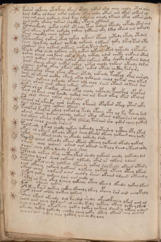

# Voynich Speculative Herbal Ferment Recipe — f107v

IMPORTANT: this is NOT a real or validated translation of the Voynich Manuscript. It is a speculative/procedural model that interprets EVA using a user-defined grammar to generate experimental recipes using safe, known edible substitutes.

This file is generated automatically from IVTFF/EVA transliteration plus a user-defined procedural grammar.



## Page / Folio
- currier: B
- folio: f107v
- page_number: 221
- plant_category_confidence: 0.0
- plant_category_guess: unknown

## Plant Interpretation (Heuristic)
- category: unknown
- confidence: 0.0
- note: Heuristic classification based on the IVTFF 'Plant ID' string (not the drawing). Does not imply real identification of the manuscript plant.

## EVA Text (Transliteration)
```text
kaisar olkeeey otalkchy lkaiin ot[o:e]dy qokair lkal chey chody otal cheey
daiin dckhy ol daiin chkal qokedy otal chedy oteos aiin otar alkain ol
sain ain aiiin qokaiin shol kal qokar al ochedy lkaiin otal olkiir alody
dain cheky okechy qokain shocthy otaiin alkaiin
tol sheockhedy qotol chdor otechdy teol tedaiin opchedy qopchdy ytar aiiil
paiin okaiin qokaiy olkeedy qokeey qotaiin oky lkal otaiin aiin qokaldy
taiin cheockhy chain qokain
polcheolkain qokair okeol qokol qokaiin opcheol qotedy ltedy otedam
saiin shey kedy qokain qokedy qokaiin y lkaiin qoky lkal tar aty
shodaiin shey qokair qokaiin chokedy tain shedy
tshedy okal shedy qokchey chky qokeey qotaiin otol qoteedy qopchcfhy
qokeey lcheol chol kaiin olkal shedy qokaly odar choty qokaiin otam
ycheey qokain ockheody qokair otal qokaiin otal shocky qokaiin dalam
daiin shaiin okaiin qokar qokal qokal cheody qokain okchdy dlkal
solain qokal okeey lkaiin okain chkal otain chcthy tarairy
parair okal opchol okal opaiin otedy qokeody tolkol lkar aiiraly
saiin or ykeear chckhy okaiin okal qoklaiin cheol qokar chey lkam
qokain qokchey qekchdy okaiin lkl chol raiin otaiin alkaiin dal
soral olaiin chor okaiin chkain okaiin
palar or air kalkal okaiin chpal cheody qopchedy pcholkal opalkam
taiin ol kaiin chol kchedy qokol ain air kaiin okal otar otalal
dar alol olaiin olkal chol chdar
palchar ar akaiiky char raikchy opchain opalkar otal otar alky
dain olaiin chol olkain lkaiin
kaolkar kolkar okeol qokeor al tody opchey oty al ky pchey ra[g:m]
oraiin sheor qokain cheody qokain otal okaiin olkeeo r ar al oldy
dal okain okchey qokshy okol lkshedy taraiin sho qokor cheey qokam
y cheor cheol lcheedy raraiin
tolkeeedy okeol cheody qokeey qokchedy qotyshey qcthhy lty ltam
okain ol okaiin lkeody otaiin chol lkaiin lkeeey qokaiin chey qoky
sokod chey lkaiin chedy qe okeody qokeedy rary
tay oaiin okeeody okaiin otaiin otchey qokaiin otedy qokam
orain chol qodaiin odain aiin okain chkaly raiin y kaiin aldy
dyair chey lkchy lchedy raiin sheey
polchedy olkeey lkey chcthy lkar shedy qokaiin chedy qokeedy lol
tol chey lcheor sheol qokaiin olkeedy okar ar olkain odain
poraiin o kal chedy qolkeey lpcheedy qokol rol keedy okaiin otary
dain okchey qokchey qokaiin olkeey qokol oteey oteey lkain
okain cheor olkaiin oain cheary raiin okoiin odaiin okaiin y
chokeey qokey qokaiii lor aiin aiily
pokar ar keey okeeo l cheey qokchey oteey lkeeo l lkeedy qokeey lkain
or ain oloeeey qokain
pol keeeo kaii[s:r]r qokeey chckhy lkchaly lkeey opchey rar aiin cheokaly
kaich o l air arody qokeey qokeey
porain okain okechdy dal keeedal shedy okeeolkcheey lkar aiin al
soain aiin chey qolaiin al chedy kedy qoteey oteey qokeeylkain
y cheey qokeey okeoteey qokey qokey qokeey daiin y okeey odain
oteedy qokey qokeedy chody chey qoky oteey otain chey aiinal
ycheosaiin oekey chey qokeey y cheey dy qoy
```

## Page Summary (Procedural, Aggregated)
- compound_counts: {'sugars': 211, 'mix/transfer': 217, 'heat': 65, 'main herb': 101, 'yeast fermentation': 119, 'liquid base': 89, 'complex herbal compound': 11, 'secondary herb': 21, 'general base': 3}
- dose_level: 3
- fermentation_estimate: 7–14 days

## Pantry (Max Needed For Any Single Line-Recipe)
- main_plant_dry_g: 15
- main_plant_substitute: ['chamomile (safe default substitute)']
- safe_complex_herbal_blend: ['gentle spices (e.g., 1 g cinnamon + 1 g clove) or a commercial herbal tea blend']
- secondary_herb_dry_g: 7
- secondary_herb_substitute: ['mint']
- sugar_or_honey_g: 75
- water_l: 0.5
- yeast_g: 1

## Recipes Index (This Page)
- [f107v.1,@P0](#f107v-1-f107v-1-p0)
- [f107v.2,+P0](#f107v-2-f107v-2-p0)
- [f107v.3,+P0](#f107v-3-f107v-3-p0)
- [f107v.4,+P0](#f107v-4-f107v-4-p0)
- [f107v.5,+P0](#f107v-5-f107v-5-p0)
- [f107v.6,+P0](#f107v-6-f107v-6-p0)
- [f107v.7,+P0](#f107v-7-f107v-7-p0)
- [f107v.8,+P0](#f107v-8-f107v-8-p0)
- [f107v.9,+P0](#f107v-9-f107v-9-p0)
- [f107v.10,+P0](#f107v-10-f107v-10-p0)
- [f107v.11,+P0](#f107v-11-f107v-11-p0)
- [f107v.12,+P0](#f107v-12-f107v-12-p0)
- [f107v.13,+P0](#f107v-13-f107v-13-p0)
- [f107v.14,+P0](#f107v-14-f107v-14-p0)
- [f107v.15,+P0](#f107v-15-f107v-15-p0)
- [f107v.16,+P0](#f107v-16-f107v-16-p0)
- [f107v.17,+P0](#f107v-17-f107v-17-p0)
- [f107v.18,+P0](#f107v-18-f107v-18-p0)
- [f107v.19,+P0](#f107v-19-f107v-19-p0)
- [f107v.20,+P0](#f107v-20-f107v-20-p0)
- [f107v.21,+P0](#f107v-21-f107v-21-p0)
- [f107v.22,+P0](#f107v-22-f107v-22-p0)
- [f107v.23,+P0](#f107v-23-f107v-23-p0)
- [f107v.24,+P0](#f107v-24-f107v-24-p0)
- [f107v.25,+P0](#f107v-25-f107v-25-p0)
- [f107v.26,+P0](#f107v-26-f107v-26-p0)
- [f107v.27,+P0](#f107v-27-f107v-27-p0)
- [f107v.28,+P0](#f107v-28-f107v-28-p0)
- [f107v.29,+P0](#f107v-29-f107v-29-p0)
- [f107v.30,+P0](#f107v-30-f107v-30-p0)
- [f107v.31,+P0](#f107v-31-f107v-31-p0)
- [f107v.32,+P0](#f107v-32-f107v-32-p0)
- [f107v.33,+P0](#f107v-33-f107v-33-p0)
- [f107v.34,+P0](#f107v-34-f107v-34-p0)
- [f107v.35,+P0](#f107v-35-f107v-35-p0)
- [f107v.36,+P0](#f107v-36-f107v-36-p0)
- [f107v.37,+P0](#f107v-37-f107v-37-p0)
- [f107v.38,+P0](#f107v-38-f107v-38-p0)
- [f107v.39,+P0](#f107v-39-f107v-39-p0)
- [f107v.40,+P0](#f107v-40-f107v-40-p0)
- [f107v.41,+P0](#f107v-41-f107v-41-p0)
- [f107v.42,+P0](#f107v-42-f107v-42-p0)
- [f107v.43,+P0](#f107v-43-f107v-43-p0)
- [f107v.44,+P0](#f107v-44-f107v-44-p0)
- [f107v.45,+P0](#f107v-45-f107v-45-p0)
- [f107v.46,+P0](#f107v-46-f107v-46-p0)
- [f107v.47,+P0](#f107v-47-f107v-47-p0)
- [f107v.48,+P0](#f107v-48-f107v-48-p0)
- [f107v.49,+P0](#f107v-49-f107v-49-p0)

## Line Recipes (Each Line = One Recipe, 0.5L batch)

<a id="f107v-1-f107v-1-p0"></a>

### f107v.1,@P0

EVA: kaisar olkeeey otalkchy lkaiin ot[o:e]dy qokair lkal chey chody otal cheey

## Ingredients
- main_plant_dry_g: 15
- main_plant_substitute: chamomile (safe default substitute)
- secondary_herb_dry_g: 3
- secondary_herb_substitute: mint
- sugar_or_honey_g: 75
- water_l: 0.5
- yeast_g: 1

Process:
1. Sanitize the jar/fermenter and utensils.
2. Base: combine 0.5 L water with 75 g sugar or honey.
3. Apply gentle heat: simmer 10–15 min, then cool to <30°C before adding yeast.
4. Add main plant: chamomile (safe default substitute) (~15 g dried).
5. Add secondary herb: mint (~3 g dried).
6. Pitch yeast: 1 g (ideally cider/beer yeast).
7. Ferment with an airlock: 7–14 days (guided by iin/aiin markers).
8. Strain/rack (if very solid-heavy) and cold-crash 24 h.
9. Bottle only when activity clearly slows; refrigerate. Avoid overpressure.

Expected Result: A mild, aromatic herbal ferment, low-to-medium intensity depending on dose level.

Does It Make Sense?: partial

Direct Gloss (Procedural, Not a Real Translation):
- kaisar: add fermentable sugars → duration level 1 → state: fermentation start
- olkeeey: add fermentable sugars → mix / transfer → duration level 3 → state: active extraction
- otalkchy: add fermentable sugars → apply heat/cooking → add main plant (safe substitute) → mix / transfer → duration level 1 → state: fermentation start
- lkaiin: add fermentable sugars → duration level 1 → state: fermentation start → long fermentation / aging phase
- ot: apply heat/cooking → mix / transfer
- o: mix / transfer
- e: duration level 1 → state: active extraction
- dy: start fermentation (yeast)
- qokair: prepare liquid base → add fermentable sugars → duration level 1 → state: fermentation start
- lkal: add fermentable sugars → duration level 1 → state: fermentation start
- chey: add main plant (safe substitute) → duration level 1 → state: active extraction
- chody: add main plant (safe substitute) → mix / transfer → start fermentation (yeast)
- otal: apply heat/cooking → mix / transfer → duration level 1 → state: fermentation start
- cheey: add main plant (safe substitute) → duration level 2 → state: active extraction

<a id="f107v-2-f107v-2-p0"></a>

### f107v.2,+P0

EVA: daiin dckhy ol daiin chkal qokedy otal chedy oteos aiin otar alkain ol

## Ingredients
- main_plant_dry_g: 5
- main_plant_substitute: chamomile (safe default substitute)
- safe_complex_herbal_blend: gentle spices (e.g., 1 g cinnamon + 1 g clove) or a commercial herbal tea blend
- secondary_herb_dry_g: 1
- secondary_herb_substitute: mint
- sugar_or_honey_g: 25
- water_l: 0.5
- yeast_g: 1

Process:
1. Sanitize the jar/fermenter and utensils.
2. Base: combine 0.5 L water with 25 g sugar or honey.
3. Apply gentle heat: simmer 10–15 min, then cool to <30°C before adding yeast.
4. Add main plant: chamomile (safe default substitute) (~5 g dried).
5. Add secondary herb: mint (~1 g dried).
6. If a complex herbal compound appears, use a safe commercial blend or gentle spices in micro-doses.
7. Pitch yeast: 1 g (ideally cider/beer yeast).
8. Ferment with an airlock: 7–14 days (guided by iin/aiin markers).
9. Strain/rack (if very solid-heavy) and cold-crash 24 h.
10. Bottle only when activity clearly slows; refrigerate. Avoid overpressure.

Expected Result: A mild, aromatic herbal ferment, low-to-medium intensity depending on dose level.

Does It Make Sense?: partial

Direct Gloss (Procedural, Not a Real Translation):
- daiin: start fermentation (yeast) → duration level 1 → state: fermentation start → long fermentation / aging phase
- dckhy: start fermentation (yeast) → add complex herbal compound (safe blend)
- ol: mix / transfer
- daiin: start fermentation (yeast) → duration level 1 → state: fermentation start → long fermentation / aging phase
- chkal: add fermentable sugars → add main plant (safe substitute) → duration level 1 → state: fermentation start
- qokedy: prepare liquid base → add fermentable sugars → start fermentation (yeast) → duration level 1 → state: active extraction
- otal: apply heat/cooking → mix / transfer → duration level 1 → state: fermentation start
- chedy: add main plant (safe substitute) → start fermentation (yeast) → duration level 1 → state: active extraction
- oteos: apply heat/cooking → mix / transfer → duration level 1 → state: active extraction
- aiin: duration level 1 → state: fermentation start → long fermentation / aging phase
- otar: apply heat/cooking → mix / transfer → duration level 1 → state: fermentation start
- alkain: add fermentable sugars → duration level 1 → state: fermentation start
- ol: mix / transfer

<a id="f107v-3-f107v-3-p0"></a>

### f107v.3,+P0

EVA: sain ain aiiin qokaiin shol kal qokar al ochedy lkaiin otal olkiir alody

## Ingredients
- main_plant_dry_g: 10
- main_plant_substitute: chamomile (safe default substitute)
- secondary_herb_dry_g: 5
- secondary_herb_substitute: mint
- sugar_or_honey_g: 50
- water_l: 0.5
- yeast_g: 1

Process:
1. Sanitize the jar/fermenter and utensils.
2. Base: combine 0.5 L water with 50 g sugar or honey.
3. Apply gentle heat: simmer 10–15 min, then cool to <30°C before adding yeast.
4. Add main plant: chamomile (safe default substitute) (~10 g dried).
5. Add secondary herb: mint (~5 g dried).
6. Pitch yeast: 1 g (ideally cider/beer yeast).
7. Ferment with an airlock: 7–14 days (guided by iin/aiin markers).
8. Strain/rack (if very solid-heavy) and cold-crash 24 h.
9. Bottle only when activity clearly slows; refrigerate. Avoid overpressure.

Expected Result: A mild, aromatic herbal ferment, low-to-medium intensity depending on dose level.

Does It Make Sense?: partial

Direct Gloss (Procedural, Not a Real Translation):
- sain: duration level 1 → state: fermentation start
- ain: duration level 1 → state: fermentation start
- aiiin: duration level 1 → state: fermentation start → medium fermentation phase
- qokaiin: prepare liquid base → add fermentable sugars → duration level 1 → state: fermentation start → long fermentation / aging phase
- shol: add secondary herb (safe substitute) → mix / transfer
- kal: add fermentable sugars → duration level 1 → state: fermentation start
- qokar: prepare liquid base → add fermentable sugars → duration level 1 → state: fermentation start
- al: duration level 1 → state: fermentation start
- ochedy: add main plant (safe substitute) → mix / transfer → start fermentation (yeast) → duration level 1 → state: active extraction
- lkaiin: add fermentable sugars → duration level 1 → state: fermentation start → long fermentation / aging phase
- otal: apply heat/cooking → mix / transfer → duration level 1 → state: fermentation start
- olkiir: add fermentable sugars → mix / transfer → duration level 2 → state: cooling/rest
- alody: mix / transfer → start fermentation (yeast) → duration level 1 → state: fermentation start

<a id="f107v-4-f107v-4-p0"></a>

### f107v.4,+P0

EVA: dain cheky okechy qokain shocthy otaiin alkaiin

## Ingredients
- main_plant_dry_g: 5
- main_plant_substitute: chamomile (safe default substitute)
- safe_complex_herbal_blend: gentle spices (e.g., 1 g cinnamon + 1 g clove) or a commercial herbal tea blend
- secondary_herb_dry_g: 2
- secondary_herb_substitute: mint
- sugar_or_honey_g: 25
- water_l: 0.5
- yeast_g: 1

Process:
1. Sanitize the jar/fermenter and utensils.
2. Base: combine 0.5 L water with 25 g sugar or honey.
3. Apply gentle heat: simmer 10–15 min, then cool to <30°C before adding yeast.
4. Add main plant: chamomile (safe default substitute) (~5 g dried).
5. Add secondary herb: mint (~2 g dried).
6. If a complex herbal compound appears, use a safe commercial blend or gentle spices in micro-doses.
7. Pitch yeast: 1 g (ideally cider/beer yeast).
8. Ferment with an airlock: 7–14 days (guided by iin/aiin markers).
9. Strain/rack (if very solid-heavy) and cold-crash 24 h.
10. Bottle only when activity clearly slows; refrigerate. Avoid overpressure.

Expected Result: A mild, aromatic herbal ferment, low-to-medium intensity depending on dose level.

Does It Make Sense?: partial

Direct Gloss (Procedural, Not a Real Translation):
- dain: start fermentation (yeast) → duration level 1 → state: fermentation start
- cheky: add fermentable sugars → add main plant (safe substitute) → duration level 1 → state: active extraction
- okechy: add fermentable sugars → add main plant (safe substitute) → mix / transfer → duration level 1 → state: active extraction
- qokain: prepare liquid base → add fermentable sugars → duration level 1 → state: fermentation start
- shocthy: add secondary herb (safe substitute) → mix / transfer → add complex herbal compound (safe blend)
- otaiin: apply heat/cooking → mix / transfer → duration level 1 → state: fermentation start → long fermentation / aging phase
- alkaiin: add fermentable sugars → duration level 1 → state: fermentation start → long fermentation / aging phase

<a id="f107v-5-f107v-5-p0"></a>

### f107v.5,+P0

EVA: tol sheockhedy qotol chdor otechdy teol tedaiin opchedy qopchdy ytar aiiil

## Ingredients
- main_plant_dry_g: 5
- main_plant_substitute: chamomile (safe default substitute)
- safe_complex_herbal_blend: gentle spices (e.g., 1 g cinnamon + 1 g clove) or a commercial herbal tea blend
- secondary_herb_dry_g: 2
- secondary_herb_substitute: mint
- sugar_or_honey_g: 12
- water_l: 0.5
- yeast_g: 1

Process:
1. Sanitize the jar/fermenter and utensils.
2. Base: combine 0.5 L water with 12 g sugar or honey.
3. Apply gentle heat: simmer 10–15 min, then cool to <30°C before adding yeast.
4. Add main plant: chamomile (safe default substitute) (~5 g dried).
5. Add secondary herb: mint (~2 g dried).
6. If a complex herbal compound appears, use a safe commercial blend or gentle spices in micro-doses.
7. Pitch yeast: 1 g (ideally cider/beer yeast).
8. Ferment with an airlock: 7–14 days (guided by iin/aiin markers).
9. Strain/rack (if very solid-heavy) and cold-crash 24 h.
10. Bottle only when activity clearly slows; refrigerate. Avoid overpressure.

Expected Result: A mild, aromatic herbal ferment, low-to-medium intensity depending on dose level.

Does It Make Sense?: partial

Direct Gloss (Procedural, Not a Real Translation):
- tol: apply heat/cooking → mix / transfer
- sheockhedy: add secondary herb (safe substitute) → mix / transfer → start fermentation (yeast) → add complex herbal compound (safe blend) → duration level 1 → state: active extraction
- qotol: prepare liquid base → apply heat/cooking → mix / transfer
- chdor: add main plant (safe substitute) → mix / transfer → start fermentation (yeast)
- otechdy: apply heat/cooking → add main plant (safe substitute) → mix / transfer → start fermentation (yeast) → duration level 1 → state: active extraction
- teol: apply heat/cooking → mix / transfer → duration level 1 → state: active extraction
- tedaiin: apply heat/cooking → start fermentation (yeast) → duration level 1 → state: active extraction → long fermentation / aging phase
- opchedy: add main plant (safe substitute) → mix / transfer → start fermentation (yeast) → duration level 1 → state: active extraction
- qopchdy: prepare liquid base → add main plant (safe substitute) → start fermentation (yeast)
- ytar: apply heat/cooking → duration level 1 → state: fermentation start
- aiiil: duration level 1 → state: fermentation start

<a id="f107v-6-f107v-6-p0"></a>

### f107v.6,+P0

EVA: paiin okaiin qokaiy olkeedy qokeey qotaiin oky lkal otaiin aiin qokaldy

## Ingredients
- main_plant_dry_g: 5
- main_plant_substitute: chamomile (safe default substitute)
- secondary_herb_dry_g: 2
- secondary_herb_substitute: mint
- sugar_or_honey_g: 50
- water_l: 0.5
- yeast_g: 1

Process:
1. Sanitize the jar/fermenter and utensils.
2. Base: combine 0.5 L water with 50 g sugar or honey.
3. Apply gentle heat: simmer 10–15 min, then cool to <30°C before adding yeast.
4. Add main plant: chamomile (safe default substitute) (~5 g dried).
5. Add secondary herb: mint (~2 g dried).
6. Pitch yeast: 1 g (ideally cider/beer yeast).
7. Ferment with an airlock: 7–14 days (guided by iin/aiin markers).
8. Strain/rack (if very solid-heavy) and cold-crash 24 h.
9. Bottle only when activity clearly slows; refrigerate. Avoid overpressure.

Expected Result: A mild, aromatic herbal ferment, low-to-medium intensity depending on dose level.

Does It Make Sense?: partial

Direct Gloss (Procedural, Not a Real Translation):
- paiin: start fermentation (yeast) → duration level 1 → state: fermentation start → long fermentation / aging phase
- okaiin: add fermentable sugars → mix / transfer → duration level 1 → state: fermentation start → long fermentation / aging phase
- qokaiy: prepare liquid base → add fermentable sugars → duration level 1 → state: fermentation start
- olkeedy: add fermentable sugars → mix / transfer → start fermentation (yeast) → duration level 2 → state: active extraction
- qokeey: prepare liquid base → add fermentable sugars → duration level 2 → state: active extraction
- qotaiin: prepare liquid base → apply heat/cooking → duration level 1 → state: fermentation start → long fermentation / aging phase
- oky: add fermentable sugars → mix / transfer
- lkal: add fermentable sugars → duration level 1 → state: fermentation start
- otaiin: apply heat/cooking → mix / transfer → duration level 1 → state: fermentation start → long fermentation / aging phase
- aiin: duration level 1 → state: fermentation start → long fermentation / aging phase
- qokaldy: prepare liquid base → add fermentable sugars → start fermentation (yeast) → duration level 1 → state: fermentation start

<a id="f107v-7-f107v-7-p0"></a>

### f107v.7,+P0

EVA: taiin cheockhy chain qokain

## Ingredients
- main_plant_dry_g: 5
- main_plant_substitute: chamomile (safe default substitute)
- safe_complex_herbal_blend: gentle spices (e.g., 1 g cinnamon + 1 g clove) or a commercial herbal tea blend
- secondary_herb_dry_g: 1
- secondary_herb_substitute: mint
- sugar_or_honey_g: 25
- water_l: 0.5
- yeast_g: 1

Process:
1. Sanitize the jar/fermenter and utensils.
2. Base: combine 0.5 L water with 25 g sugar or honey.
3. Apply gentle heat: simmer 10–15 min, then cool to <30°C before adding yeast.
4. Add main plant: chamomile (safe default substitute) (~5 g dried).
5. Add secondary herb: mint (~1 g dried).
6. If a complex herbal compound appears, use a safe commercial blend or gentle spices in micro-doses.
7. Pitch yeast: 1 g (ideally cider/beer yeast).
8. Ferment with an airlock: 7–14 days (guided by iin/aiin markers).
9. Strain/rack (if very solid-heavy) and cold-crash 24 h.
10. Bottle only when activity clearly slows; refrigerate. Avoid overpressure.

Expected Result: A mild, aromatic herbal ferment, low-to-medium intensity depending on dose level.

Does It Make Sense?: partial

Direct Gloss (Procedural, Not a Real Translation):
- taiin: apply heat/cooking → duration level 1 → state: fermentation start → long fermentation / aging phase
- cheockhy: add main plant (safe substitute) → mix / transfer → add complex herbal compound (safe blend) → duration level 1 → state: active extraction
- chain: add main plant (safe substitute) → duration level 1 → state: fermentation start
- qokain: prepare liquid base → add fermentable sugars → duration level 1 → state: fermentation start

<a id="f107v-8-f107v-8-p0"></a>

### f107v.8,+P0

EVA: polcheolkain qokair okeol qokol qokaiin opcheol qotedy ltedy otedam

## Ingredients
- main_plant_dry_g: 5
- main_plant_substitute: chamomile (safe default substitute)
- secondary_herb_dry_g: 1
- secondary_herb_substitute: mint
- sugar_or_honey_g: 25
- water_l: 0.5
- yeast_g: 1

Process:
1. Sanitize the jar/fermenter and utensils.
2. Base: combine 0.5 L water with 25 g sugar or honey.
3. Apply gentle heat: simmer 10–15 min, then cool to <30°C before adding yeast.
4. Add main plant: chamomile (safe default substitute) (~5 g dried).
5. Add secondary herb: mint (~1 g dried).
6. Pitch yeast: 1 g (ideally cider/beer yeast).
7. Ferment with an airlock: 7–14 days (guided by iin/aiin markers).
8. Strain/rack (if very solid-heavy) and cold-crash 24 h.
9. Bottle only when activity clearly slows; refrigerate. Avoid overpressure.

Expected Result: A mild, aromatic herbal ferment, low-to-medium intensity depending on dose level.

Does It Make Sense?: partial

Direct Gloss (Procedural, Not a Real Translation):
- polcheolkain: add fermentable sugars → add main plant (safe substitute) → mix / transfer → start fermentation (yeast) → duration level 1 → state: active extraction
- qokair: prepare liquid base → add fermentable sugars → duration level 1 → state: fermentation start
- okeol: add fermentable sugars → mix / transfer → duration level 1 → state: active extraction
- qokol: prepare liquid base → add fermentable sugars → mix / transfer
- qokaiin: prepare liquid base → add fermentable sugars → duration level 1 → state: fermentation start → long fermentation / aging phase
- opcheol: add main plant (safe substitute) → mix / transfer → start fermentation (yeast) → duration level 1 → state: active extraction
- qotedy: prepare liquid base → apply heat/cooking → start fermentation (yeast) → duration level 1 → state: active extraction
- ltedy: apply heat/cooking → start fermentation (yeast) → duration level 1 → state: active extraction
- otedam: apply heat/cooking → mix / transfer → start fermentation (yeast) → duration level 1 → state: active extraction

<a id="f107v-9-f107v-9-p0"></a>

### f107v.9,+P0

EVA: saiin shey kedy qokain qokedy qokaiin y lkaiin qoky lkal tar aty

## Ingredients
- main_plant_dry_g: 2
- main_plant_substitute: chamomile (safe default substitute)
- secondary_herb_dry_g: 2
- secondary_herb_substitute: mint
- sugar_or_honey_g: 25
- water_l: 0.5
- yeast_g: 1

Process:
1. Sanitize the jar/fermenter and utensils.
2. Base: combine 0.5 L water with 25 g sugar or honey.
3. Apply gentle heat: simmer 10–15 min, then cool to <30°C before adding yeast.
4. Add main plant: chamomile (safe default substitute) (~2 g dried).
5. Add secondary herb: mint (~2 g dried).
6. Pitch yeast: 1 g (ideally cider/beer yeast).
7. Ferment with an airlock: 7–14 days (guided by iin/aiin markers).
8. Strain/rack (if very solid-heavy) and cold-crash 24 h.
9. Bottle only when activity clearly slows; refrigerate. Avoid overpressure.

Expected Result: A mild, aromatic herbal ferment, low-to-medium intensity depending on dose level.

Does It Make Sense?: partial

Direct Gloss (Procedural, Not a Real Translation):
- saiin: duration level 1 → state: fermentation start → long fermentation / aging phase
- shey: add secondary herb (safe substitute) → duration level 1 → state: active extraction
- kedy: add fermentable sugars → start fermentation (yeast) → duration level 1 → state: active extraction
- qokain: prepare liquid base → add fermentable sugars → duration level 1 → state: fermentation start
- qokedy: prepare liquid base → add fermentable sugars → start fermentation (yeast) → duration level 1 → state: active extraction
- qokaiin: prepare liquid base → add fermentable sugars → duration level 1 → state: fermentation start → long fermentation / aging phase
- y: [unparsed]
- lkaiin: add fermentable sugars → duration level 1 → state: fermentation start → long fermentation / aging phase
- qoky: prepare liquid base → add fermentable sugars
- lkal: add fermentable sugars → duration level 1 → state: fermentation start
- tar: apply heat/cooking → duration level 1 → state: fermentation start
- aty: apply heat/cooking → duration level 1 → state: fermentation start

<a id="f107v-10-f107v-10-p0"></a>

### f107v.10,+P0

EVA: shodaiin shey qokair qokaiin chokedy tain shedy

## Ingredients
- main_plant_dry_g: 5
- main_plant_substitute: chamomile (safe default substitute)
- secondary_herb_dry_g: 2
- secondary_herb_substitute: mint
- sugar_or_honey_g: 25
- water_l: 0.5
- yeast_g: 1

Process:
1. Sanitize the jar/fermenter and utensils.
2. Base: combine 0.5 L water with 25 g sugar or honey.
3. Apply gentle heat: simmer 10–15 min, then cool to <30°C before adding yeast.
4. Add main plant: chamomile (safe default substitute) (~5 g dried).
5. Add secondary herb: mint (~2 g dried).
6. Pitch yeast: 1 g (ideally cider/beer yeast).
7. Ferment with an airlock: 7–14 days (guided by iin/aiin markers).
8. Strain/rack (if very solid-heavy) and cold-crash 24 h.
9. Bottle only when activity clearly slows; refrigerate. Avoid overpressure.

Expected Result: A mild, aromatic herbal ferment, low-to-medium intensity depending on dose level.

Does It Make Sense?: partial

Direct Gloss (Procedural, Not a Real Translation):
- shodaiin: add secondary herb (safe substitute) → mix / transfer → start fermentation (yeast) → duration level 1 → state: fermentation start → long fermentation / aging phase
- shey: add secondary herb (safe substitute) → duration level 1 → state: active extraction
- qokair: prepare liquid base → add fermentable sugars → duration level 1 → state: fermentation start
- qokaiin: prepare liquid base → add fermentable sugars → duration level 1 → state: fermentation start → long fermentation / aging phase
- chokedy: add fermentable sugars → add main plant (safe substitute) → mix / transfer → start fermentation (yeast) → duration level 1 → state: active extraction
- tain: apply heat/cooking → duration level 1 → state: fermentation start
- shedy: add secondary herb (safe substitute) → start fermentation (yeast) → duration level 1 → state: active extraction

<a id="f107v-11-f107v-11-p0"></a>

### f107v.11,+P0

EVA: tshedy okal shedy qokchey chky qokeey qotaiin otol qoteedy qopchcfhy

## Ingredients
- main_plant_dry_g: 10
- main_plant_substitute: chamomile (safe default substitute)
- safe_complex_herbal_blend: gentle spices (e.g., 1 g cinnamon + 1 g clove) or a commercial herbal tea blend
- secondary_herb_dry_g: 5
- secondary_herb_substitute: mint
- sugar_or_honey_g: 50
- water_l: 0.5
- yeast_g: 1

Process:
1. Sanitize the jar/fermenter and utensils.
2. Base: combine 0.5 L water with 50 g sugar or honey.
3. Apply gentle heat: simmer 10–15 min, then cool to <30°C before adding yeast.
4. Add main plant: chamomile (safe default substitute) (~10 g dried).
5. Add secondary herb: mint (~5 g dried).
6. If a complex herbal compound appears, use a safe commercial blend or gentle spices in micro-doses.
7. Pitch yeast: 1 g (ideally cider/beer yeast).
8. Ferment with an airlock: 7–14 days (guided by iin/aiin markers).
9. Strain/rack (if very solid-heavy) and cold-crash 24 h.
10. Bottle only when activity clearly slows; refrigerate. Avoid overpressure.

Expected Result: A mild, aromatic herbal ferment, low-to-medium intensity depending on dose level.

Does It Make Sense?: partial

Direct Gloss (Procedural, Not a Real Translation):
- tshedy: apply heat/cooking → add secondary herb (safe substitute) → start fermentation (yeast) → duration level 1 → state: active extraction
- okal: add fermentable sugars → mix / transfer → duration level 1 → state: fermentation start
- shedy: add secondary herb (safe substitute) → start fermentation (yeast) → duration level 1 → state: active extraction
- qokchey: prepare liquid base → add fermentable sugars → add main plant (safe substitute) → duration level 1 → state: active extraction
- chky: add fermentable sugars → add main plant (safe substitute)
- qokeey: prepare liquid base → add fermentable sugars → duration level 2 → state: active extraction
- qotaiin: prepare liquid base → apply heat/cooking → duration level 1 → state: fermentation start → long fermentation / aging phase
- otol: apply heat/cooking → mix / transfer
- qoteedy: prepare liquid base → apply heat/cooking → start fermentation (yeast) → duration level 2 → state: active extraction
- qopchcfhy: prepare liquid base → add main plant (safe substitute) → start fermentation (yeast) → add complex herbal compound (safe blend)

<a id="f107v-12-f107v-12-p0"></a>

### f107v.12,+P0

EVA: qokeey lcheol chol kaiin olkal shedy qokaly odar choty qokaiin otam

## Ingredients
- main_plant_dry_g: 10
- main_plant_substitute: chamomile (safe default substitute)
- secondary_herb_dry_g: 5
- secondary_herb_substitute: mint
- sugar_or_honey_g: 50
- water_l: 0.5
- yeast_g: 1

Process:
1. Sanitize the jar/fermenter and utensils.
2. Base: combine 0.5 L water with 50 g sugar or honey.
3. Apply gentle heat: simmer 10–15 min, then cool to <30°C before adding yeast.
4. Add main plant: chamomile (safe default substitute) (~10 g dried).
5. Add secondary herb: mint (~5 g dried).
6. Pitch yeast: 1 g (ideally cider/beer yeast).
7. Ferment with an airlock: 7–14 days (guided by iin/aiin markers).
8. Strain/rack (if very solid-heavy) and cold-crash 24 h.
9. Bottle only when activity clearly slows; refrigerate. Avoid overpressure.

Expected Result: A mild, aromatic herbal ferment, low-to-medium intensity depending on dose level.

Does It Make Sense?: partial

Direct Gloss (Procedural, Not a Real Translation):
- qokeey: prepare liquid base → add fermentable sugars → duration level 2 → state: active extraction
- lcheol: add main plant (safe substitute) → mix / transfer → duration level 1 → state: active extraction
- chol: add main plant (safe substitute) → mix / transfer
- kaiin: add fermentable sugars → duration level 1 → state: fermentation start → long fermentation / aging phase
- olkal: add fermentable sugars → mix / transfer → duration level 1 → state: fermentation start
- shedy: add secondary herb (safe substitute) → start fermentation (yeast) → duration level 1 → state: active extraction
- qokaly: prepare liquid base → add fermentable sugars → duration level 1 → state: fermentation start
- odar: mix / transfer → start fermentation (yeast) → duration level 1 → state: fermentation start
- choty: apply heat/cooking → add main plant (safe substitute) → mix / transfer
- qokaiin: prepare liquid base → add fermentable sugars → duration level 1 → state: fermentation start → long fermentation / aging phase
- otam: apply heat/cooking → mix / transfer → duration level 1 → state: fermentation start

<a id="f107v-13-f107v-13-p0"></a>

### f107v.13,+P0

EVA: ycheey qokain ockheody qokair otal qokaiin otal shocky qokaiin dalam

## Ingredients
- main_plant_dry_g: 10
- main_plant_substitute: chamomile (safe default substitute)
- safe_complex_herbal_blend: gentle spices (e.g., 1 g cinnamon + 1 g clove) or a commercial herbal tea blend
- secondary_herb_dry_g: 5
- secondary_herb_substitute: mint
- sugar_or_honey_g: 50
- water_l: 0.5
- yeast_g: 1

Process:
1. Sanitize the jar/fermenter and utensils.
2. Base: combine 0.5 L water with 50 g sugar or honey.
3. Apply gentle heat: simmer 10–15 min, then cool to <30°C before adding yeast.
4. Add main plant: chamomile (safe default substitute) (~10 g dried).
5. Add secondary herb: mint (~5 g dried).
6. If a complex herbal compound appears, use a safe commercial blend or gentle spices in micro-doses.
7. Pitch yeast: 1 g (ideally cider/beer yeast).
8. Ferment with an airlock: 7–14 days (guided by iin/aiin markers).
9. Strain/rack (if very solid-heavy) and cold-crash 24 h.
10. Bottle only when activity clearly slows; refrigerate. Avoid overpressure.

Expected Result: A mild, aromatic herbal ferment, low-to-medium intensity depending on dose level.

Does It Make Sense?: partial

Direct Gloss (Procedural, Not a Real Translation):
- ycheey: add main plant (safe substitute) → duration level 2 → state: active extraction
- qokain: prepare liquid base → add fermentable sugars → duration level 1 → state: fermentation start
- ockheody: mix / transfer → start fermentation (yeast) → add complex herbal compound (safe blend) → duration level 1 → state: active extraction
- qokair: prepare liquid base → add fermentable sugars → duration level 1 → state: fermentation start
- otal: apply heat/cooking → mix / transfer → duration level 1 → state: fermentation start
- qokaiin: prepare liquid base → add fermentable sugars → duration level 1 → state: fermentation start → long fermentation / aging phase
- otal: apply heat/cooking → mix / transfer → duration level 1 → state: fermentation start
- shocky: add fermentable sugars → add secondary herb (safe substitute) → mix / transfer
- qokaiin: prepare liquid base → add fermentable sugars → duration level 1 → state: fermentation start → long fermentation / aging phase
- dalam: start fermentation (yeast) → duration level 1 → state: fermentation start

<a id="f107v-14-f107v-14-p0"></a>

### f107v.14,+P0

EVA: daiin shaiin okaiin qokar qokal qokal cheody qokain okchdy dlkal

## Ingredients
- main_plant_dry_g: 5
- main_plant_substitute: chamomile (safe default substitute)
- secondary_herb_dry_g: 2
- secondary_herb_substitute: mint
- sugar_or_honey_g: 25
- water_l: 0.5
- yeast_g: 1

Process:
1. Sanitize the jar/fermenter and utensils.
2. Base: combine 0.5 L water with 25 g sugar or honey.
3. Infusion: use hot (not boiling) water, then let it cool before adding yeast.
4. Add main plant: chamomile (safe default substitute) (~5 g dried).
5. Add secondary herb: mint (~2 g dried).
6. Pitch yeast: 1 g (ideally cider/beer yeast).
7. Ferment with an airlock: 7–14 days (guided by iin/aiin markers).
8. Strain/rack (if very solid-heavy) and cold-crash 24 h.
9. Bottle only when activity clearly slows; refrigerate. Avoid overpressure.

Expected Result: A mild, aromatic herbal ferment, low-to-medium intensity depending on dose level.

Does It Make Sense?: partial

Direct Gloss (Procedural, Not a Real Translation):
- daiin: start fermentation (yeast) → duration level 1 → state: fermentation start → long fermentation / aging phase
- shaiin: add secondary herb (safe substitute) → duration level 1 → state: fermentation start → long fermentation / aging phase
- okaiin: add fermentable sugars → mix / transfer → duration level 1 → state: fermentation start → long fermentation / aging phase
- qokar: prepare liquid base → add fermentable sugars → duration level 1 → state: fermentation start
- qokal: prepare liquid base → add fermentable sugars → duration level 1 → state: fermentation start
- qokal: prepare liquid base → add fermentable sugars → duration level 1 → state: fermentation start
- cheody: add main plant (safe substitute) → mix / transfer → start fermentation (yeast) → duration level 1 → state: active extraction
- qokain: prepare liquid base → add fermentable sugars → duration level 1 → state: fermentation start
- okchdy: add fermentable sugars → add main plant (safe substitute) → mix / transfer → start fermentation (yeast)
- dlkal: add fermentable sugars → start fermentation (yeast) → duration level 1 → state: fermentation start

<a id="f107v-15-f107v-15-p0"></a>

### f107v.15,+P0

EVA: solain qokal okeey lkaiin okain chkal otain chcthy tarairy

## Ingredients
- main_plant_dry_g: 10
- main_plant_substitute: chamomile (safe default substitute)
- safe_complex_herbal_blend: gentle spices (e.g., 1 g cinnamon + 1 g clove) or a commercial herbal tea blend
- secondary_herb_dry_g: 2
- secondary_herb_substitute: mint
- sugar_or_honey_g: 50
- water_l: 0.5
- yeast_g: 1

Process:
1. Sanitize the jar/fermenter and utensils.
2. Base: combine 0.5 L water with 50 g sugar or honey.
3. Apply gentle heat: simmer 10–15 min, then cool to <30°C before adding yeast.
4. Add main plant: chamomile (safe default substitute) (~10 g dried).
5. Add secondary herb: mint (~2 g dried).
6. If a complex herbal compound appears, use a safe commercial blend or gentle spices in micro-doses.
7. Pitch yeast: 1 g (ideally cider/beer yeast).
8. Ferment with an airlock: 7–14 days (guided by iin/aiin markers).
9. Strain/rack (if very solid-heavy) and cold-crash 24 h.
10. Bottle only when activity clearly slows; refrigerate. Avoid overpressure.

Expected Result: A mild, aromatic herbal ferment, low-to-medium intensity depending on dose level.

Does It Make Sense?: partial

Direct Gloss (Procedural, Not a Real Translation):
- solain: mix / transfer → duration level 1 → state: fermentation start
- qokal: prepare liquid base → add fermentable sugars → duration level 1 → state: fermentation start
- okeey: add fermentable sugars → mix / transfer → duration level 2 → state: active extraction
- lkaiin: add fermentable sugars → duration level 1 → state: fermentation start → long fermentation / aging phase
- okain: add fermentable sugars → mix / transfer → duration level 1 → state: fermentation start
- chkal: add fermentable sugars → add main plant (safe substitute) → duration level 1 → state: fermentation start
- otain: apply heat/cooking → mix / transfer → duration level 1 → state: fermentation start
- chcthy: add main plant (safe substitute) → add complex herbal compound (safe blend)
- tarairy: apply heat/cooking → duration level 1 → state: fermentation start

<a id="f107v-16-f107v-16-p0"></a>

### f107v.16,+P0

EVA: parair okal opchol okal opaiin otedy qokeody tolkol lkar aiiraly

## Ingredients
- main_plant_dry_g: 5
- main_plant_substitute: chamomile (safe default substitute)
- secondary_herb_dry_g: 1
- secondary_herb_substitute: mint
- sugar_or_honey_g: 25
- water_l: 0.5
- yeast_g: 1

Process:
1. Sanitize the jar/fermenter and utensils.
2. Base: combine 0.5 L water with 25 g sugar or honey.
3. Apply gentle heat: simmer 10–15 min, then cool to <30°C before adding yeast.
4. Add main plant: chamomile (safe default substitute) (~5 g dried).
5. Add secondary herb: mint (~1 g dried).
6. Pitch yeast: 1 g (ideally cider/beer yeast).
7. Ferment with an airlock: 7–14 days (guided by iin/aiin markers).
8. Strain/rack (if very solid-heavy) and cold-crash 24 h.
9. Bottle only when activity clearly slows; refrigerate. Avoid overpressure.

Expected Result: A mild, aromatic herbal ferment, low-to-medium intensity depending on dose level.

Does It Make Sense?: partial

Direct Gloss (Procedural, Not a Real Translation):
- parair: start fermentation (yeast) → duration level 1 → state: fermentation start
- okal: add fermentable sugars → mix / transfer → duration level 1 → state: fermentation start
- opchol: add main plant (safe substitute) → mix / transfer → start fermentation (yeast)
- okal: add fermentable sugars → mix / transfer → duration level 1 → state: fermentation start
- opaiin: mix / transfer → start fermentation (yeast) → duration level 1 → state: fermentation start → long fermentation / aging phase
- otedy: apply heat/cooking → mix / transfer → start fermentation (yeast) → duration level 1 → state: active extraction
- qokeody: prepare liquid base → add fermentable sugars → mix / transfer → start fermentation (yeast) → duration level 1 → state: active extraction
- tolkol: add fermentable sugars → apply heat/cooking → mix / transfer
- lkar: add fermentable sugars → duration level 1 → state: fermentation start
- aiiraly: duration level 1 → state: fermentation start

<a id="f107v-17-f107v-17-p0"></a>

### f107v.17,+P0

EVA: saiin or ykeear chckhy okaiin okal qoklaiin cheol qokar chey lkam

## Ingredients
- main_plant_dry_g: 10
- main_plant_substitute: chamomile (safe default substitute)
- safe_complex_herbal_blend: gentle spices (e.g., 1 g cinnamon + 1 g clove) or a commercial herbal tea blend
- secondary_herb_dry_g: 2
- secondary_herb_substitute: mint
- sugar_or_honey_g: 50
- water_l: 0.5
- yeast_g: 1

Process:
1. Sanitize the jar/fermenter and utensils.
2. Base: combine 0.5 L water with 50 g sugar or honey.
3. Infusion: use hot (not boiling) water, then let it cool before adding yeast.
4. Add main plant: chamomile (safe default substitute) (~10 g dried).
5. Add secondary herb: mint (~2 g dried).
6. If a complex herbal compound appears, use a safe commercial blend or gentle spices in micro-doses.
7. Pitch yeast: 1 g (ideally cider/beer yeast).
8. Ferment with an airlock: 7–14 days (guided by iin/aiin markers).
9. Strain/rack (if very solid-heavy) and cold-crash 24 h.
10. Bottle only when activity clearly slows; refrigerate. Avoid overpressure.

Expected Result: A mild, aromatic herbal ferment, low-to-medium intensity depending on dose level.

Does It Make Sense?: partial

Direct Gloss (Procedural, Not a Real Translation):
- saiin: duration level 1 → state: fermentation start → long fermentation / aging phase
- or: mix / transfer
- ykeear: add fermentable sugars → duration level 2 → state: active extraction
- chckhy: add main plant (safe substitute) → add complex herbal compound (safe blend)
- okaiin: add fermentable sugars → mix / transfer → duration level 1 → state: fermentation start → long fermentation / aging phase
- okal: add fermentable sugars → mix / transfer → duration level 1 → state: fermentation start
- qoklaiin: prepare liquid base → add fermentable sugars → duration level 1 → state: fermentation start → long fermentation / aging phase
- cheol: add main plant (safe substitute) → mix / transfer → duration level 1 → state: active extraction
- qokar: prepare liquid base → add fermentable sugars → duration level 1 → state: fermentation start
- chey: add main plant (safe substitute) → duration level 1 → state: active extraction
- lkam: add fermentable sugars → duration level 1 → state: fermentation start

<a id="f107v-18-f107v-18-p0"></a>

### f107v.18,+P0

EVA: qokain qokchey qekchdy okaiin lkl chol raiin otaiin alkaiin dal

## Ingredients
- main_plant_dry_g: 5
- main_plant_substitute: chamomile (safe default substitute)
- secondary_herb_dry_g: 1
- secondary_herb_substitute: mint
- sugar_or_honey_g: 25
- water_l: 0.5
- yeast_g: 1

Process:
1. Sanitize the jar/fermenter and utensils.
2. Base: combine 0.5 L water with 25 g sugar or honey.
3. Apply gentle heat: simmer 10–15 min, then cool to <30°C before adding yeast.
4. Add main plant: chamomile (safe default substitute) (~5 g dried).
5. Add secondary herb: mint (~1 g dried).
6. Pitch yeast: 1 g (ideally cider/beer yeast).
7. Ferment with an airlock: 7–14 days (guided by iin/aiin markers).
8. Strain/rack (if very solid-heavy) and cold-crash 24 h.
9. Bottle only when activity clearly slows; refrigerate. Avoid overpressure.

Expected Result: A mild, aromatic herbal ferment, low-to-medium intensity depending on dose level.

Does It Make Sense?: partial

Direct Gloss (Procedural, Not a Real Translation):
- qokain: prepare liquid base → add fermentable sugars → duration level 1 → state: fermentation start
- qokchey: prepare liquid base → add fermentable sugars → add main plant (safe substitute) → duration level 1 → state: active extraction
- qekchdy: prepare base (generic) → add fermentable sugars → add main plant (safe substitute) → start fermentation (yeast) → duration level 1 → state: active extraction
- okaiin: add fermentable sugars → mix / transfer → duration level 1 → state: fermentation start → long fermentation / aging phase
- lkl: add fermentable sugars
- chol: add main plant (safe substitute) → mix / transfer
- raiin: duration level 1 → state: fermentation start → long fermentation / aging phase
- otaiin: apply heat/cooking → mix / transfer → duration level 1 → state: fermentation start → long fermentation / aging phase
- alkaiin: add fermentable sugars → duration level 1 → state: fermentation start → long fermentation / aging phase
- dal: start fermentation (yeast) → duration level 1 → state: fermentation start

<a id="f107v-19-f107v-19-p0"></a>

### f107v.19,+P0

EVA: soral olaiin chor okaiin chkain okaiin

## Ingredients
- main_plant_dry_g: 5
- main_plant_substitute: chamomile (safe default substitute)
- secondary_herb_dry_g: 1
- secondary_herb_substitute: mint
- sugar_or_honey_g: 25
- water_l: 0.5
- yeast_g: 1

Process:
1. Sanitize the jar/fermenter and utensils.
2. Base: combine 0.5 L water with 25 g sugar or honey.
3. Infusion: use hot (not boiling) water, then let it cool before adding yeast.
4. Add main plant: chamomile (safe default substitute) (~5 g dried).
5. Add secondary herb: mint (~1 g dried).
6. Pitch yeast: 1 g (ideally cider/beer yeast).
7. Ferment with an airlock: 7–14 days (guided by iin/aiin markers).
8. Strain/rack (if very solid-heavy) and cold-crash 24 h.
9. Bottle only when activity clearly slows; refrigerate. Avoid overpressure.

Expected Result: A mild, aromatic herbal ferment, low-to-medium intensity depending on dose level.

Does It Make Sense?: partial

Direct Gloss (Procedural, Not a Real Translation):
- soral: mix / transfer → duration level 1 → state: fermentation start
- olaiin: mix / transfer → duration level 1 → state: fermentation start → long fermentation / aging phase
- chor: add main plant (safe substitute) → mix / transfer
- okaiin: add fermentable sugars → mix / transfer → duration level 1 → state: fermentation start → long fermentation / aging phase
- chkain: add fermentable sugars → add main plant (safe substitute) → duration level 1 → state: fermentation start
- okaiin: add fermentable sugars → mix / transfer → duration level 1 → state: fermentation start → long fermentation / aging phase

<a id="f107v-20-f107v-20-p0"></a>

### f107v.20,+P0

EVA: palar or air kalkal okaiin chpal cheody qopchedy pcholkal opalkam

## Ingredients
- main_plant_dry_g: 5
- main_plant_substitute: chamomile (safe default substitute)
- secondary_herb_dry_g: 1
- secondary_herb_substitute: mint
- sugar_or_honey_g: 25
- water_l: 0.5
- yeast_g: 1

Process:
1. Sanitize the jar/fermenter and utensils.
2. Base: combine 0.5 L water with 25 g sugar or honey.
3. Infusion: use hot (not boiling) water, then let it cool before adding yeast.
4. Add main plant: chamomile (safe default substitute) (~5 g dried).
5. Add secondary herb: mint (~1 g dried).
6. Pitch yeast: 1 g (ideally cider/beer yeast).
7. Ferment with an airlock: 7–14 days (guided by iin/aiin markers).
8. Strain/rack (if very solid-heavy) and cold-crash 24 h.
9. Bottle only when activity clearly slows; refrigerate. Avoid overpressure.

Expected Result: A mild, aromatic herbal ferment, low-to-medium intensity depending on dose level.

Does It Make Sense?: partial

Direct Gloss (Procedural, Not a Real Translation):
- palar: start fermentation (yeast) → duration level 1 → state: fermentation start
- or: mix / transfer
- air: duration level 1 → state: fermentation start
- kalkal: add fermentable sugars → duration level 1 → state: fermentation start
- okaiin: add fermentable sugars → mix / transfer → duration level 1 → state: fermentation start → long fermentation / aging phase
- chpal: add main plant (safe substitute) → start fermentation (yeast) → duration level 1 → state: fermentation start
- cheody: add main plant (safe substitute) → mix / transfer → start fermentation (yeast) → duration level 1 → state: active extraction
- qopchedy: prepare liquid base → add main plant (safe substitute) → start fermentation (yeast) → duration level 1 → state: active extraction
- pcholkal: add fermentable sugars → add main plant (safe substitute) → mix / transfer → start fermentation (yeast) → duration level 1 → state: fermentation start
- opalkam: add fermentable sugars → mix / transfer → start fermentation (yeast) → duration level 1 → state: fermentation start

<a id="f107v-21-f107v-21-p0"></a>

### f107v.21,+P0

EVA: taiin ol kaiin chol kchedy qokol ain air kaiin okal otar otalal

## Ingredients
- main_plant_dry_g: 5
- main_plant_substitute: chamomile (safe default substitute)
- secondary_herb_dry_g: 1
- secondary_herb_substitute: mint
- sugar_or_honey_g: 25
- water_l: 0.5
- yeast_g: 1

Process:
1. Sanitize the jar/fermenter and utensils.
2. Base: combine 0.5 L water with 25 g sugar or honey.
3. Apply gentle heat: simmer 10–15 min, then cool to <30°C before adding yeast.
4. Add main plant: chamomile (safe default substitute) (~5 g dried).
5. Add secondary herb: mint (~1 g dried).
6. Pitch yeast: 1 g (ideally cider/beer yeast).
7. Ferment with an airlock: 7–14 days (guided by iin/aiin markers).
8. Strain/rack (if very solid-heavy) and cold-crash 24 h.
9. Bottle only when activity clearly slows; refrigerate. Avoid overpressure.

Expected Result: A mild, aromatic herbal ferment, low-to-medium intensity depending on dose level.

Does It Make Sense?: partial

Direct Gloss (Procedural, Not a Real Translation):
- taiin: apply heat/cooking → duration level 1 → state: fermentation start → long fermentation / aging phase
- ol: mix / transfer
- kaiin: add fermentable sugars → duration level 1 → state: fermentation start → long fermentation / aging phase
- chol: add main plant (safe substitute) → mix / transfer
- kchedy: add fermentable sugars → add main plant (safe substitute) → start fermentation (yeast) → duration level 1 → state: active extraction
- qokol: prepare liquid base → add fermentable sugars → mix / transfer
- ain: duration level 1 → state: fermentation start
- air: duration level 1 → state: fermentation start
- kaiin: add fermentable sugars → duration level 1 → state: fermentation start → long fermentation / aging phase
- okal: add fermentable sugars → mix / transfer → duration level 1 → state: fermentation start
- otar: apply heat/cooking → mix / transfer → duration level 1 → state: fermentation start
- otalal: apply heat/cooking → mix / transfer → duration level 1 → state: fermentation start

<a id="f107v-22-f107v-22-p0"></a>

### f107v.22,+P0

EVA: dar alol olaiin olkal chol chdar

## Ingredients
- main_plant_dry_g: 5
- main_plant_substitute: chamomile (safe default substitute)
- secondary_herb_dry_g: 1
- secondary_herb_substitute: mint
- sugar_or_honey_g: 25
- water_l: 0.5
- yeast_g: 1

Process:
1. Sanitize the jar/fermenter and utensils.
2. Base: combine 0.5 L water with 25 g sugar or honey.
3. Infusion: use hot (not boiling) water, then let it cool before adding yeast.
4. Add main plant: chamomile (safe default substitute) (~5 g dried).
5. Add secondary herb: mint (~1 g dried).
6. Pitch yeast: 1 g (ideally cider/beer yeast).
7. Ferment with an airlock: 7–14 days (guided by iin/aiin markers).
8. Strain/rack (if very solid-heavy) and cold-crash 24 h.
9. Bottle only when activity clearly slows; refrigerate. Avoid overpressure.

Expected Result: A mild, aromatic herbal ferment, low-to-medium intensity depending on dose level.

Does It Make Sense?: partial

Direct Gloss (Procedural, Not a Real Translation):
- dar: start fermentation (yeast) → duration level 1 → state: fermentation start
- alol: mix / transfer → duration level 1 → state: fermentation start
- olaiin: mix / transfer → duration level 1 → state: fermentation start → long fermentation / aging phase
- olkal: add fermentable sugars → mix / transfer → duration level 1 → state: fermentation start
- chol: add main plant (safe substitute) → mix / transfer
- chdar: add main plant (safe substitute) → start fermentation (yeast) → duration level 1 → state: fermentation start

<a id="f107v-23-f107v-23-p0"></a>

### f107v.23,+P0

EVA: palchar ar akaiiky char raikchy opchain opalkar otal otar alky

## Ingredients
- main_plant_dry_g: 5
- main_plant_substitute: chamomile (safe default substitute)
- secondary_herb_dry_g: 1
- secondary_herb_substitute: mint
- sugar_or_honey_g: 25
- water_l: 0.5
- yeast_g: 1

Process:
1. Sanitize the jar/fermenter and utensils.
2. Base: combine 0.5 L water with 25 g sugar or honey.
3. Apply gentle heat: simmer 10–15 min, then cool to <30°C before adding yeast.
4. Add main plant: chamomile (safe default substitute) (~5 g dried).
5. Add secondary herb: mint (~1 g dried).
6. Pitch yeast: 1 g (ideally cider/beer yeast).
7. Ferment with an airlock: 2–4 days (guided by iin/aiin markers).
8. Strain/rack (if very solid-heavy) and cold-crash 24 h.
9. Bottle only when activity clearly slows; refrigerate. Avoid overpressure.

Expected Result: A mild, aromatic herbal ferment, low-to-medium intensity depending on dose level.

Does It Make Sense?: partial

Direct Gloss (Procedural, Not a Real Translation):
- palchar: add main plant (safe substitute) → start fermentation (yeast) → duration level 1 → state: fermentation start
- ar: duration level 1 → state: fermentation start
- akaiiky: add fermentable sugars → duration level 1 → state: fermentation start
- char: add main plant (safe substitute) → duration level 1 → state: fermentation start
- raikchy: add fermentable sugars → add main plant (safe substitute) → duration level 1 → state: fermentation start
- opchain: add main plant (safe substitute) → mix / transfer → start fermentation (yeast) → duration level 1 → state: fermentation start
- opalkar: add fermentable sugars → mix / transfer → start fermentation (yeast) → duration level 1 → state: fermentation start
- otal: apply heat/cooking → mix / transfer → duration level 1 → state: fermentation start
- otar: apply heat/cooking → mix / transfer → duration level 1 → state: fermentation start
- alky: add fermentable sugars → duration level 1 → state: fermentation start

<a id="f107v-24-f107v-24-p0"></a>

### f107v.24,+P0

EVA: dain olaiin chol olkain lkaiin

## Ingredients
- main_plant_dry_g: 5
- main_plant_substitute: chamomile (safe default substitute)
- secondary_herb_dry_g: 1
- secondary_herb_substitute: mint
- sugar_or_honey_g: 25
- water_l: 0.5
- yeast_g: 1

Process:
1. Sanitize the jar/fermenter and utensils.
2. Base: combine 0.5 L water with 25 g sugar or honey.
3. Infusion: use hot (not boiling) water, then let it cool before adding yeast.
4. Add main plant: chamomile (safe default substitute) (~5 g dried).
5. Add secondary herb: mint (~1 g dried).
6. Pitch yeast: 1 g (ideally cider/beer yeast).
7. Ferment with an airlock: 7–14 days (guided by iin/aiin markers).
8. Strain/rack (if very solid-heavy) and cold-crash 24 h.
9. Bottle only when activity clearly slows; refrigerate. Avoid overpressure.

Expected Result: A mild, aromatic herbal ferment, low-to-medium intensity depending on dose level.

Does It Make Sense?: partial

Direct Gloss (Procedural, Not a Real Translation):
- dain: start fermentation (yeast) → duration level 1 → state: fermentation start
- olaiin: mix / transfer → duration level 1 → state: fermentation start → long fermentation / aging phase
- chol: add main plant (safe substitute) → mix / transfer
- olkain: add fermentable sugars → mix / transfer → duration level 1 → state: fermentation start
- lkaiin: add fermentable sugars → duration level 1 → state: fermentation start → long fermentation / aging phase

<a id="f107v-25-f107v-25-p0"></a>

### f107v.25,+P0

EVA: kaolkar kolkar okeol qokeor al tody opchey oty al ky pchey ra[g:m]

## Ingredients
- main_plant_dry_g: 5
- main_plant_substitute: chamomile (safe default substitute)
- secondary_herb_dry_g: 1
- secondary_herb_substitute: mint
- sugar_or_honey_g: 25
- water_l: 0.5
- yeast_g: 1

Process:
1. Sanitize the jar/fermenter and utensils.
2. Base: combine 0.5 L water with 25 g sugar or honey.
3. Apply gentle heat: simmer 10–15 min, then cool to <30°C before adding yeast.
4. Add main plant: chamomile (safe default substitute) (~5 g dried).
5. Add secondary herb: mint (~1 g dried).
6. Pitch yeast: 1 g (ideally cider/beer yeast).
7. Ferment with an airlock: 2–4 days (guided by iin/aiin markers).
8. Strain/rack (if very solid-heavy) and cold-crash 24 h.
9. Bottle only when activity clearly slows; refrigerate. Avoid overpressure.

Expected Result: A mild, aromatic herbal ferment, low-to-medium intensity depending on dose level.

Does It Make Sense?: partial

Direct Gloss (Procedural, Not a Real Translation):
- kaolkar: add fermentable sugars → mix / transfer → duration level 1 → state: fermentation start
- kolkar: add fermentable sugars → mix / transfer → duration level 1 → state: fermentation start
- okeol: add fermentable sugars → mix / transfer → duration level 1 → state: active extraction
- qokeor: prepare liquid base → add fermentable sugars → mix / transfer → duration level 1 → state: active extraction
- al: duration level 1 → state: fermentation start
- tody: apply heat/cooking → mix / transfer → start fermentation (yeast)
- opchey: add main plant (safe substitute) → mix / transfer → start fermentation (yeast) → duration level 1 → state: active extraction
- oty: apply heat/cooking → mix / transfer
- al: duration level 1 → state: fermentation start
- ky: add fermentable sugars
- pchey: add main plant (safe substitute) → start fermentation (yeast) → duration level 1 → state: active extraction
- ra: duration level 1 → state: fermentation start
- g: [unparsed]
- m: [unparsed]

<a id="f107v-26-f107v-26-p0"></a>

### f107v.26,+P0

EVA: oraiin sheor qokain cheody qokain otal okaiin olkeeo r ar al oldy

## Ingredients
- main_plant_dry_g: 10
- main_plant_substitute: chamomile (safe default substitute)
- secondary_herb_dry_g: 5
- secondary_herb_substitute: mint
- sugar_or_honey_g: 50
- water_l: 0.5
- yeast_g: 1

Process:
1. Sanitize the jar/fermenter and utensils.
2. Base: combine 0.5 L water with 50 g sugar or honey.
3. Apply gentle heat: simmer 10–15 min, then cool to <30°C before adding yeast.
4. Add main plant: chamomile (safe default substitute) (~10 g dried).
5. Add secondary herb: mint (~5 g dried).
6. Pitch yeast: 1 g (ideally cider/beer yeast).
7. Ferment with an airlock: 7–14 days (guided by iin/aiin markers).
8. Strain/rack (if very solid-heavy) and cold-crash 24 h.
9. Bottle only when activity clearly slows; refrigerate. Avoid overpressure.

Expected Result: A mild, aromatic herbal ferment, low-to-medium intensity depending on dose level.

Does It Make Sense?: partial

Direct Gloss (Procedural, Not a Real Translation):
- oraiin: mix / transfer → duration level 1 → state: fermentation start → long fermentation / aging phase
- sheor: add secondary herb (safe substitute) → mix / transfer → duration level 1 → state: active extraction
- qokain: prepare liquid base → add fermentable sugars → duration level 1 → state: fermentation start
- cheody: add main plant (safe substitute) → mix / transfer → start fermentation (yeast) → duration level 1 → state: active extraction
- qokain: prepare liquid base → add fermentable sugars → duration level 1 → state: fermentation start
- otal: apply heat/cooking → mix / transfer → duration level 1 → state: fermentation start
- okaiin: add fermentable sugars → mix / transfer → duration level 1 → state: fermentation start → long fermentation / aging phase
- olkeeo: add fermentable sugars → mix / transfer → duration level 2 → state: active extraction
- r: [unparsed]
- ar: duration level 1 → state: fermentation start
- al: duration level 1 → state: fermentation start
- oldy: mix / transfer → start fermentation (yeast)

<a id="f107v-27-f107v-27-p0"></a>

### f107v.27,+P0

EVA: dal okain okchey qokshy okol lkshedy taraiin sho qokor cheey qokam

## Ingredients
- main_plant_dry_g: 10
- main_plant_substitute: chamomile (safe default substitute)
- secondary_herb_dry_g: 5
- secondary_herb_substitute: mint
- sugar_or_honey_g: 50
- water_l: 0.5
- yeast_g: 1

Process:
1. Sanitize the jar/fermenter and utensils.
2. Base: combine 0.5 L water with 50 g sugar or honey.
3. Apply gentle heat: simmer 10–15 min, then cool to <30°C before adding yeast.
4. Add main plant: chamomile (safe default substitute) (~10 g dried).
5. Add secondary herb: mint (~5 g dried).
6. Pitch yeast: 1 g (ideally cider/beer yeast).
7. Ferment with an airlock: 7–14 days (guided by iin/aiin markers).
8. Strain/rack (if very solid-heavy) and cold-crash 24 h.
9. Bottle only when activity clearly slows; refrigerate. Avoid overpressure.

Expected Result: A mild, aromatic herbal ferment, low-to-medium intensity depending on dose level.

Does It Make Sense?: partial

Direct Gloss (Procedural, Not a Real Translation):
- dal: start fermentation (yeast) → duration level 1 → state: fermentation start
- okain: add fermentable sugars → mix / transfer → duration level 1 → state: fermentation start
- okchey: add fermentable sugars → add main plant (safe substitute) → mix / transfer → duration level 1 → state: active extraction
- qokshy: prepare liquid base → add fermentable sugars → add secondary herb (safe substitute)
- okol: add fermentable sugars → mix / transfer
- lkshedy: add fermentable sugars → add secondary herb (safe substitute) → start fermentation (yeast) → duration level 1 → state: active extraction
- taraiin: apply heat/cooking → duration level 1 → state: fermentation start → long fermentation / aging phase
- sho: add secondary herb (safe substitute) → mix / transfer
- qokor: prepare liquid base → add fermentable sugars → mix / transfer
- cheey: add main plant (safe substitute) → duration level 2 → state: active extraction
- qokam: prepare liquid base → add fermentable sugars → duration level 1 → state: fermentation start

<a id="f107v-28-f107v-28-p0"></a>

### f107v.28,+P0

EVA: y cheor cheol lcheedy raraiin

## Ingredients
- main_plant_dry_g: 10
- main_plant_substitute: chamomile (safe default substitute)
- secondary_herb_dry_g: 2
- secondary_herb_substitute: mint
- sugar_or_honey_g: 25
- water_l: 0.5
- yeast_g: 1

Process:
1. Sanitize the jar/fermenter and utensils.
2. Base: combine 0.5 L water with 25 g sugar or honey.
3. Infusion: use hot (not boiling) water, then let it cool before adding yeast.
4. Add main plant: chamomile (safe default substitute) (~10 g dried).
5. Add secondary herb: mint (~2 g dried).
6. Pitch yeast: 1 g (ideally cider/beer yeast).
7. Ferment with an airlock: 7–14 days (guided by iin/aiin markers).
8. Strain/rack (if very solid-heavy) and cold-crash 24 h.
9. Bottle only when activity clearly slows; refrigerate. Avoid overpressure.

Expected Result: A mild, aromatic herbal ferment, low-to-medium intensity depending on dose level.

Does It Make Sense?: partial

Direct Gloss (Procedural, Not a Real Translation):
- y: [unparsed]
- cheor: add main plant (safe substitute) → mix / transfer → duration level 1 → state: active extraction
- cheol: add main plant (safe substitute) → mix / transfer → duration level 1 → state: active extraction
- lcheedy: add main plant (safe substitute) → start fermentation (yeast) → duration level 2 → state: active extraction
- raraiin: duration level 1 → state: fermentation start → long fermentation / aging phase

<a id="f107v-29-f107v-29-p0"></a>

### f107v.29,+P0

EVA: tolkeeedy okeol cheody qokeey qokchedy qotyshey qcthhy lty ltam

## Ingredients
- main_plant_dry_g: 15
- main_plant_substitute: chamomile (safe default substitute)
- safe_complex_herbal_blend: gentle spices (e.g., 1 g cinnamon + 1 g clove) or a commercial herbal tea blend
- secondary_herb_dry_g: 7
- secondary_herb_substitute: mint
- sugar_or_honey_g: 75
- water_l: 0.5
- yeast_g: 1

Process:
1. Sanitize the jar/fermenter and utensils.
2. Base: combine 0.5 L water with 75 g sugar or honey.
3. Apply gentle heat: simmer 10–15 min, then cool to <30°C before adding yeast.
4. Add main plant: chamomile (safe default substitute) (~15 g dried).
5. Add secondary herb: mint (~7 g dried).
6. If a complex herbal compound appears, use a safe commercial blend or gentle spices in micro-doses.
7. Pitch yeast: 1 g (ideally cider/beer yeast).
8. Ferment with an airlock: 2–4 days (guided by iin/aiin markers).
9. Strain/rack (if very solid-heavy) and cold-crash 24 h.
10. Bottle only when activity clearly slows; refrigerate. Avoid overpressure.

Expected Result: A mild, aromatic herbal ferment, low-to-medium intensity depending on dose level.

Does It Make Sense?: partial

Direct Gloss (Procedural, Not a Real Translation):
- tolkeeedy: add fermentable sugars → apply heat/cooking → mix / transfer → start fermentation (yeast) → duration level 3 → state: active extraction
- okeol: add fermentable sugars → mix / transfer → duration level 1 → state: active extraction
- cheody: add main plant (safe substitute) → mix / transfer → start fermentation (yeast) → duration level 1 → state: active extraction
- qokeey: prepare liquid base → add fermentable sugars → duration level 2 → state: active extraction
- qokchedy: prepare liquid base → add fermentable sugars → add main plant (safe substitute) → start fermentation (yeast) → duration level 1 → state: active extraction
- qotyshey: prepare liquid base → apply heat/cooking → add secondary herb (safe substitute) → duration level 1 → state: active extraction
- qcthhy: prepare base (generic) → add complex herbal compound (safe blend)
- lty: apply heat/cooking
- ltam: apply heat/cooking → duration level 1 → state: fermentation start

<a id="f107v-30-f107v-30-p0"></a>

### f107v.30,+P0

EVA: okain ol okaiin lkeody otaiin chol lkaiin lkeeey qokaiin chey qoky

## Ingredients
- main_plant_dry_g: 15
- main_plant_substitute: chamomile (safe default substitute)
- secondary_herb_dry_g: 3
- secondary_herb_substitute: mint
- sugar_or_honey_g: 75
- water_l: 0.5
- yeast_g: 1

Process:
1. Sanitize the jar/fermenter and utensils.
2. Base: combine 0.5 L water with 75 g sugar or honey.
3. Apply gentle heat: simmer 10–15 min, then cool to <30°C before adding yeast.
4. Add main plant: chamomile (safe default substitute) (~15 g dried).
5. Add secondary herb: mint (~3 g dried).
6. Pitch yeast: 1 g (ideally cider/beer yeast).
7. Ferment with an airlock: 7–14 days (guided by iin/aiin markers).
8. Strain/rack (if very solid-heavy) and cold-crash 24 h.
9. Bottle only when activity clearly slows; refrigerate. Avoid overpressure.

Expected Result: A mild, aromatic herbal ferment, low-to-medium intensity depending on dose level.

Does It Make Sense?: partial

Direct Gloss (Procedural, Not a Real Translation):
- okain: add fermentable sugars → mix / transfer → duration level 1 → state: fermentation start
- ol: mix / transfer
- okaiin: add fermentable sugars → mix / transfer → duration level 1 → state: fermentation start → long fermentation / aging phase
- lkeody: add fermentable sugars → mix / transfer → start fermentation (yeast) → duration level 1 → state: active extraction
- otaiin: apply heat/cooking → mix / transfer → duration level 1 → state: fermentation start → long fermentation / aging phase
- chol: add main plant (safe substitute) → mix / transfer
- lkaiin: add fermentable sugars → duration level 1 → state: fermentation start → long fermentation / aging phase
- lkeeey: add fermentable sugars → duration level 3 → state: active extraction
- qokaiin: prepare liquid base → add fermentable sugars → duration level 1 → state: fermentation start → long fermentation / aging phase
- chey: add main plant (safe substitute) → duration level 1 → state: active extraction
- qoky: prepare liquid base → add fermentable sugars

<a id="f107v-31-f107v-31-p0"></a>

### f107v.31,+P0

EVA: sokod chey lkaiin chedy qe okeody qokeedy rary

## Ingredients
- main_plant_dry_g: 10
- main_plant_substitute: chamomile (safe default substitute)
- secondary_herb_dry_g: 2
- secondary_herb_substitute: mint
- sugar_or_honey_g: 50
- water_l: 0.5
- yeast_g: 1

Process:
1. Sanitize the jar/fermenter and utensils.
2. Base: combine 0.5 L water with 50 g sugar or honey.
3. Infusion: use hot (not boiling) water, then let it cool before adding yeast.
4. Add main plant: chamomile (safe default substitute) (~10 g dried).
5. Add secondary herb: mint (~2 g dried).
6. Pitch yeast: 1 g (ideally cider/beer yeast).
7. Ferment with an airlock: 7–14 days (guided by iin/aiin markers).
8. Strain/rack (if very solid-heavy) and cold-crash 24 h.
9. Bottle only when activity clearly slows; refrigerate. Avoid overpressure.

Expected Result: A mild, aromatic herbal ferment, low-to-medium intensity depending on dose level.

Does It Make Sense?: partial

Direct Gloss (Procedural, Not a Real Translation):
- sokod: add fermentable sugars → mix / transfer → start fermentation (yeast)
- chey: add main plant (safe substitute) → duration level 1 → state: active extraction
- lkaiin: add fermentable sugars → duration level 1 → state: fermentation start → long fermentation / aging phase
- chedy: add main plant (safe substitute) → start fermentation (yeast) → duration level 1 → state: active extraction
- qe: prepare base (generic) → duration level 1 → state: active extraction
- okeody: add fermentable sugars → mix / transfer → start fermentation (yeast) → duration level 1 → state: active extraction
- qokeedy: prepare liquid base → add fermentable sugars → start fermentation (yeast) → duration level 2 → state: active extraction
- rary: duration level 1 → state: fermentation start

<a id="f107v-32-f107v-32-p0"></a>

### f107v.32,+P0

EVA: tay oaiin okeeody okaiin otaiin otchey qokaiin otedy qokam

## Ingredients
- main_plant_dry_g: 10
- main_plant_substitute: chamomile (safe default substitute)
- secondary_herb_dry_g: 2
- secondary_herb_substitute: mint
- sugar_or_honey_g: 50
- water_l: 0.5
- yeast_g: 1

Process:
1. Sanitize the jar/fermenter and utensils.
2. Base: combine 0.5 L water with 50 g sugar or honey.
3. Apply gentle heat: simmer 10–15 min, then cool to <30°C before adding yeast.
4. Add main plant: chamomile (safe default substitute) (~10 g dried).
5. Add secondary herb: mint (~2 g dried).
6. Pitch yeast: 1 g (ideally cider/beer yeast).
7. Ferment with an airlock: 7–14 days (guided by iin/aiin markers).
8. Strain/rack (if very solid-heavy) and cold-crash 24 h.
9. Bottle only when activity clearly slows; refrigerate. Avoid overpressure.

Expected Result: A mild, aromatic herbal ferment, low-to-medium intensity depending on dose level.

Does It Make Sense?: partial

Direct Gloss (Procedural, Not a Real Translation):
- tay: apply heat/cooking → duration level 1 → state: fermentation start
- oaiin: mix / transfer → duration level 1 → state: fermentation start → long fermentation / aging phase
- okeeody: add fermentable sugars → mix / transfer → start fermentation (yeast) → duration level 2 → state: active extraction
- okaiin: add fermentable sugars → mix / transfer → duration level 1 → state: fermentation start → long fermentation / aging phase
- otaiin: apply heat/cooking → mix / transfer → duration level 1 → state: fermentation start → long fermentation / aging phase
- otchey: apply heat/cooking → add main plant (safe substitute) → mix / transfer → duration level 1 → state: active extraction
- qokaiin: prepare liquid base → add fermentable sugars → duration level 1 → state: fermentation start → long fermentation / aging phase
- otedy: apply heat/cooking → mix / transfer → start fermentation (yeast) → duration level 1 → state: active extraction
- qokam: prepare liquid base → add fermentable sugars → duration level 1 → state: fermentation start

<a id="f107v-33-f107v-33-p0"></a>

### f107v.33,+P0

EVA: orain chol qodaiin odain aiin okain chkaly raiin y kaiin aldy

## Ingredients
- main_plant_dry_g: 5
- main_plant_substitute: chamomile (safe default substitute)
- secondary_herb_dry_g: 1
- secondary_herb_substitute: mint
- sugar_or_honey_g: 25
- water_l: 0.5
- yeast_g: 1

Process:
1. Sanitize the jar/fermenter and utensils.
2. Base: combine 0.5 L water with 25 g sugar or honey.
3. Infusion: use hot (not boiling) water, then let it cool before adding yeast.
4. Add main plant: chamomile (safe default substitute) (~5 g dried).
5. Add secondary herb: mint (~1 g dried).
6. Pitch yeast: 1 g (ideally cider/beer yeast).
7. Ferment with an airlock: 7–14 days (guided by iin/aiin markers).
8. Strain/rack (if very solid-heavy) and cold-crash 24 h.
9. Bottle only when activity clearly slows; refrigerate. Avoid overpressure.

Expected Result: A mild, aromatic herbal ferment, low-to-medium intensity depending on dose level.

Does It Make Sense?: partial

Direct Gloss (Procedural, Not a Real Translation):
- orain: mix / transfer → duration level 1 → state: fermentation start
- chol: add main plant (safe substitute) → mix / transfer
- qodaiin: prepare liquid base → start fermentation (yeast) → duration level 1 → state: fermentation start → long fermentation / aging phase
- odain: mix / transfer → start fermentation (yeast) → duration level 1 → state: fermentation start
- aiin: duration level 1 → state: fermentation start → long fermentation / aging phase
- okain: add fermentable sugars → mix / transfer → duration level 1 → state: fermentation start
- chkaly: add fermentable sugars → add main plant (safe substitute) → duration level 1 → state: fermentation start
- raiin: duration level 1 → state: fermentation start → long fermentation / aging phase
- y: [unparsed]
- kaiin: add fermentable sugars → duration level 1 → state: fermentation start → long fermentation / aging phase
- aldy: start fermentation (yeast) → duration level 1 → state: fermentation start

<a id="f107v-34-f107v-34-p0"></a>

### f107v.34,+P0

EVA: dyair chey lkchy lchedy raiin sheey

## Ingredients
- main_plant_dry_g: 10
- main_plant_substitute: chamomile (safe default substitute)
- secondary_herb_dry_g: 5
- secondary_herb_substitute: mint
- sugar_or_honey_g: 50
- water_l: 0.5
- yeast_g: 1

Process:
1. Sanitize the jar/fermenter and utensils.
2. Base: combine 0.5 L water with 50 g sugar or honey.
3. Infusion: use hot (not boiling) water, then let it cool before adding yeast.
4. Add main plant: chamomile (safe default substitute) (~10 g dried).
5. Add secondary herb: mint (~5 g dried).
6. Pitch yeast: 1 g (ideally cider/beer yeast).
7. Ferment with an airlock: 7–14 days (guided by iin/aiin markers).
8. Strain/rack (if very solid-heavy) and cold-crash 24 h.
9. Bottle only when activity clearly slows; refrigerate. Avoid overpressure.

Expected Result: A mild, aromatic herbal ferment, low-to-medium intensity depending on dose level.

Does It Make Sense?: partial

Direct Gloss (Procedural, Not a Real Translation):
- dyair: start fermentation (yeast) → duration level 1 → state: fermentation start
- chey: add main plant (safe substitute) → duration level 1 → state: active extraction
- lkchy: add fermentable sugars → add main plant (safe substitute)
- lchedy: add main plant (safe substitute) → start fermentation (yeast) → duration level 1 → state: active extraction
- raiin: duration level 1 → state: fermentation start → long fermentation / aging phase
- sheey: add secondary herb (safe substitute) → duration level 2 → state: active extraction

<a id="f107v-35-f107v-35-p0"></a>

### f107v.35,+P0

EVA: polchedy olkeey lkey chcthy lkar shedy qokaiin chedy qokeedy lol

## Ingredients
- main_plant_dry_g: 10
- main_plant_substitute: chamomile (safe default substitute)
- safe_complex_herbal_blend: gentle spices (e.g., 1 g cinnamon + 1 g clove) or a commercial herbal tea blend
- secondary_herb_dry_g: 5
- secondary_herb_substitute: mint
- sugar_or_honey_g: 50
- water_l: 0.5
- yeast_g: 1

Process:
1. Sanitize the jar/fermenter and utensils.
2. Base: combine 0.5 L water with 50 g sugar or honey.
3. Infusion: use hot (not boiling) water, then let it cool before adding yeast.
4. Add main plant: chamomile (safe default substitute) (~10 g dried).
5. Add secondary herb: mint (~5 g dried).
6. If a complex herbal compound appears, use a safe commercial blend or gentle spices in micro-doses.
7. Pitch yeast: 1 g (ideally cider/beer yeast).
8. Ferment with an airlock: 7–14 days (guided by iin/aiin markers).
9. Strain/rack (if very solid-heavy) and cold-crash 24 h.
10. Bottle only when activity clearly slows; refrigerate. Avoid overpressure.

Expected Result: A mild, aromatic herbal ferment, low-to-medium intensity depending on dose level.

Does It Make Sense?: partial

Direct Gloss (Procedural, Not a Real Translation):
- polchedy: add main plant (safe substitute) → mix / transfer → start fermentation (yeast) → duration level 1 → state: active extraction
- olkeey: add fermentable sugars → mix / transfer → duration level 2 → state: active extraction
- lkey: add fermentable sugars → duration level 1 → state: active extraction
- chcthy: add main plant (safe substitute) → add complex herbal compound (safe blend)
- lkar: add fermentable sugars → duration level 1 → state: fermentation start
- shedy: add secondary herb (safe substitute) → start fermentation (yeast) → duration level 1 → state: active extraction
- qokaiin: prepare liquid base → add fermentable sugars → duration level 1 → state: fermentation start → long fermentation / aging phase
- chedy: add main plant (safe substitute) → start fermentation (yeast) → duration level 1 → state: active extraction
- qokeedy: prepare liquid base → add fermentable sugars → start fermentation (yeast) → duration level 2 → state: active extraction
- lol: mix / transfer

<a id="f107v-36-f107v-36-p0"></a>

### f107v.36,+P0

EVA: tol chey lcheor sheol qokaiin olkeedy okar ar olkain odain

## Ingredients
- main_plant_dry_g: 10
- main_plant_substitute: chamomile (safe default substitute)
- secondary_herb_dry_g: 5
- secondary_herb_substitute: mint
- sugar_or_honey_g: 50
- water_l: 0.5
- yeast_g: 1

Process:
1. Sanitize the jar/fermenter and utensils.
2. Base: combine 0.5 L water with 50 g sugar or honey.
3. Apply gentle heat: simmer 10–15 min, then cool to <30°C before adding yeast.
4. Add main plant: chamomile (safe default substitute) (~10 g dried).
5. Add secondary herb: mint (~5 g dried).
6. Pitch yeast: 1 g (ideally cider/beer yeast).
7. Ferment with an airlock: 7–14 days (guided by iin/aiin markers).
8. Strain/rack (if very solid-heavy) and cold-crash 24 h.
9. Bottle only when activity clearly slows; refrigerate. Avoid overpressure.

Expected Result: A mild, aromatic herbal ferment, low-to-medium intensity depending on dose level.

Does It Make Sense?: partial

Direct Gloss (Procedural, Not a Real Translation):
- tol: apply heat/cooking → mix / transfer
- chey: add main plant (safe substitute) → duration level 1 → state: active extraction
- lcheor: add main plant (safe substitute) → mix / transfer → duration level 1 → state: active extraction
- sheol: add secondary herb (safe substitute) → mix / transfer → duration level 1 → state: active extraction
- qokaiin: prepare liquid base → add fermentable sugars → duration level 1 → state: fermentation start → long fermentation / aging phase
- olkeedy: add fermentable sugars → mix / transfer → start fermentation (yeast) → duration level 2 → state: active extraction
- okar: add fermentable sugars → mix / transfer → duration level 1 → state: fermentation start
- ar: duration level 1 → state: fermentation start
- olkain: add fermentable sugars → mix / transfer → duration level 1 → state: fermentation start
- odain: mix / transfer → start fermentation (yeast) → duration level 1 → state: fermentation start

<a id="f107v-37-f107v-37-p0"></a>

### f107v.37,+P0

EVA: poraiin o kal chedy qolkeey lpcheedy qokol rol keedy okaiin otary

## Ingredients
- main_plant_dry_g: 10
- main_plant_substitute: chamomile (safe default substitute)
- secondary_herb_dry_g: 2
- secondary_herb_substitute: mint
- sugar_or_honey_g: 50
- water_l: 0.5
- yeast_g: 1

Process:
1. Sanitize the jar/fermenter and utensils.
2. Base: combine 0.5 L water with 50 g sugar or honey.
3. Apply gentle heat: simmer 10–15 min, then cool to <30°C before adding yeast.
4. Add main plant: chamomile (safe default substitute) (~10 g dried).
5. Add secondary herb: mint (~2 g dried).
6. Pitch yeast: 1 g (ideally cider/beer yeast).
7. Ferment with an airlock: 7–14 days (guided by iin/aiin markers).
8. Strain/rack (if very solid-heavy) and cold-crash 24 h.
9. Bottle only when activity clearly slows; refrigerate. Avoid overpressure.

Expected Result: A mild, aromatic herbal ferment, low-to-medium intensity depending on dose level.

Does It Make Sense?: partial

Direct Gloss (Procedural, Not a Real Translation):
- poraiin: mix / transfer → start fermentation (yeast) → duration level 1 → state: fermentation start → long fermentation / aging phase
- o: mix / transfer
- kal: add fermentable sugars → duration level 1 → state: fermentation start
- chedy: add main plant (safe substitute) → start fermentation (yeast) → duration level 1 → state: active extraction
- qolkeey: prepare liquid base → add fermentable sugars → duration level 2 → state: active extraction
- lpcheedy: add main plant (safe substitute) → start fermentation (yeast) → duration level 2 → state: active extraction
- qokol: prepare liquid base → add fermentable sugars → mix / transfer
- rol: mix / transfer
- keedy: add fermentable sugars → start fermentation (yeast) → duration level 2 → state: active extraction
- okaiin: add fermentable sugars → mix / transfer → duration level 1 → state: fermentation start → long fermentation / aging phase
- otary: apply heat/cooking → mix / transfer → duration level 1 → state: fermentation start

<a id="f107v-38-f107v-38-p0"></a>

### f107v.38,+P0

EVA: dain okchey qokchey qokaiin olkeey qokol oteey oteey lkain

## Ingredients
- main_plant_dry_g: 10
- main_plant_substitute: chamomile (safe default substitute)
- secondary_herb_dry_g: 2
- secondary_herb_substitute: mint
- sugar_or_honey_g: 50
- water_l: 0.5
- yeast_g: 1

Process:
1. Sanitize the jar/fermenter and utensils.
2. Base: combine 0.5 L water with 50 g sugar or honey.
3. Apply gentle heat: simmer 10–15 min, then cool to <30°C before adding yeast.
4. Add main plant: chamomile (safe default substitute) (~10 g dried).
5. Add secondary herb: mint (~2 g dried).
6. Pitch yeast: 1 g (ideally cider/beer yeast).
7. Ferment with an airlock: 7–14 days (guided by iin/aiin markers).
8. Strain/rack (if very solid-heavy) and cold-crash 24 h.
9. Bottle only when activity clearly slows; refrigerate. Avoid overpressure.

Expected Result: A mild, aromatic herbal ferment, low-to-medium intensity depending on dose level.

Does It Make Sense?: partial

Direct Gloss (Procedural, Not a Real Translation):
- dain: start fermentation (yeast) → duration level 1 → state: fermentation start
- okchey: add fermentable sugars → add main plant (safe substitute) → mix / transfer → duration level 1 → state: active extraction
- qokchey: prepare liquid base → add fermentable sugars → add main plant (safe substitute) → duration level 1 → state: active extraction
- qokaiin: prepare liquid base → add fermentable sugars → duration level 1 → state: fermentation start → long fermentation / aging phase
- olkeey: add fermentable sugars → mix / transfer → duration level 2 → state: active extraction
- qokol: prepare liquid base → add fermentable sugars → mix / transfer
- oteey: apply heat/cooking → mix / transfer → duration level 2 → state: active extraction
- oteey: apply heat/cooking → mix / transfer → duration level 2 → state: active extraction
- lkain: add fermentable sugars → duration level 1 → state: fermentation start

<a id="f107v-39-f107v-39-p0"></a>

### f107v.39,+P0

EVA: okain cheor olkaiin oain cheary raiin okoiin odaiin okaiin y

## Ingredients
- main_plant_dry_g: 10
- main_plant_substitute: chamomile (safe default substitute)
- secondary_herb_dry_g: 2
- secondary_herb_substitute: mint
- sugar_or_honey_g: 50
- water_l: 0.5
- yeast_g: 1

Process:
1. Sanitize the jar/fermenter and utensils.
2. Base: combine 0.5 L water with 50 g sugar or honey.
3. Infusion: use hot (not boiling) water, then let it cool before adding yeast.
4. Add main plant: chamomile (safe default substitute) (~10 g dried).
5. Add secondary herb: mint (~2 g dried).
6. Pitch yeast: 1 g (ideally cider/beer yeast).
7. Ferment with an airlock: 7–14 days (guided by iin/aiin markers).
8. Strain/rack (if very solid-heavy) and cold-crash 24 h.
9. Bottle only when activity clearly slows; refrigerate. Avoid overpressure.

Expected Result: A mild, aromatic herbal ferment, low-to-medium intensity depending on dose level.

Does It Make Sense?: partial

Direct Gloss (Procedural, Not a Real Translation):
- okain: add fermentable sugars → mix / transfer → duration level 1 → state: fermentation start
- cheor: add main plant (safe substitute) → mix / transfer → duration level 1 → state: active extraction
- olkaiin: add fermentable sugars → mix / transfer → duration level 1 → state: fermentation start → long fermentation / aging phase
- oain: mix / transfer → duration level 1 → state: fermentation start
- cheary: add main plant (safe substitute) → duration level 1 → state: active extraction
- raiin: duration level 1 → state: fermentation start → long fermentation / aging phase
- okoiin: add fermentable sugars → mix / transfer → duration level 2 → state: cooling/rest → medium fermentation phase
- odaiin: mix / transfer → start fermentation (yeast) → duration level 1 → state: fermentation start → long fermentation / aging phase
- okaiin: add fermentable sugars → mix / transfer → duration level 1 → state: fermentation start → long fermentation / aging phase
- y: [unparsed]

<a id="f107v-40-f107v-40-p0"></a>

### f107v.40,+P0

EVA: chokeey qokey qokaiii lor aiin aiily

## Ingredients
- main_plant_dry_g: 10
- main_plant_substitute: chamomile (safe default substitute)
- secondary_herb_dry_g: 2
- secondary_herb_substitute: mint
- sugar_or_honey_g: 50
- water_l: 0.5
- yeast_g: 1

Process:
1. Sanitize the jar/fermenter and utensils.
2. Base: combine 0.5 L water with 50 g sugar or honey.
3. Infusion: use hot (not boiling) water, then let it cool before adding yeast.
4. Add main plant: chamomile (safe default substitute) (~10 g dried).
5. Add secondary herb: mint (~2 g dried).
6. Pitch yeast: 1 g (ideally cider/beer yeast).
7. Ferment with an airlock: 7–14 days (guided by iin/aiin markers).
8. Strain/rack (if very solid-heavy) and cold-crash 24 h.
9. Bottle only when activity clearly slows; refrigerate. Avoid overpressure.

Expected Result: A mild, aromatic herbal ferment, low-to-medium intensity depending on dose level.

Does It Make Sense?: partial

Direct Gloss (Procedural, Not a Real Translation):
- chokeey: add fermentable sugars → add main plant (safe substitute) → mix / transfer → duration level 2 → state: active extraction
- qokey: prepare liquid base → add fermentable sugars → duration level 1 → state: active extraction
- qokaiii: prepare liquid base → add fermentable sugars → duration level 1 → state: fermentation start
- lor: mix / transfer
- aiin: duration level 1 → state: fermentation start → long fermentation / aging phase
- aiily: duration level 1 → state: fermentation start

<a id="f107v-41-f107v-41-p0"></a>

### f107v.41,+P0

EVA: pokar ar keey okeeo l cheey qokchey oteey lkeeo l lkeedy qokeey lkain

## Ingredients
- main_plant_dry_g: 10
- main_plant_substitute: chamomile (safe default substitute)
- secondary_herb_dry_g: 2
- secondary_herb_substitute: mint
- sugar_or_honey_g: 50
- water_l: 0.5
- yeast_g: 1

Process:
1. Sanitize the jar/fermenter and utensils.
2. Base: combine 0.5 L water with 50 g sugar or honey.
3. Apply gentle heat: simmer 10–15 min, then cool to <30°C before adding yeast.
4. Add main plant: chamomile (safe default substitute) (~10 g dried).
5. Add secondary herb: mint (~2 g dried).
6. Pitch yeast: 1 g (ideally cider/beer yeast).
7. Ferment with an airlock: 2–4 days (guided by iin/aiin markers).
8. Strain/rack (if very solid-heavy) and cold-crash 24 h.
9. Bottle only when activity clearly slows; refrigerate. Avoid overpressure.

Expected Result: A mild, aromatic herbal ferment, low-to-medium intensity depending on dose level.

Does It Make Sense?: partial

Direct Gloss (Procedural, Not a Real Translation):
- pokar: add fermentable sugars → mix / transfer → start fermentation (yeast) → duration level 1 → state: fermentation start
- ar: duration level 1 → state: fermentation start
- keey: add fermentable sugars → duration level 2 → state: active extraction
- okeeo: add fermentable sugars → mix / transfer → duration level 2 → state: active extraction
- l: [unparsed]
- cheey: add main plant (safe substitute) → duration level 2 → state: active extraction
- qokchey: prepare liquid base → add fermentable sugars → add main plant (safe substitute) → duration level 1 → state: active extraction
- oteey: apply heat/cooking → mix / transfer → duration level 2 → state: active extraction
- lkeeo: add fermentable sugars → mix / transfer → duration level 2 → state: active extraction
- l: [unparsed]
- lkeedy: add fermentable sugars → start fermentation (yeast) → duration level 2 → state: active extraction
- qokeey: prepare liquid base → add fermentable sugars → duration level 2 → state: active extraction
- lkain: add fermentable sugars → duration level 1 → state: fermentation start

<a id="f107v-42-f107v-42-p0"></a>

### f107v.42,+P0

EVA: or ain oloeeey qokain

## Ingredients
- main_plant_dry_g: 7
- main_plant_substitute: chamomile (safe default substitute)
- secondary_herb_dry_g: 3
- secondary_herb_substitute: mint
- sugar_or_honey_g: 75
- water_l: 0.5
- yeast_g: 1

Process:
1. Sanitize the jar/fermenter and utensils.
2. Base: combine 0.5 L water with 75 g sugar or honey.
3. Infusion: use hot (not boiling) water, then let it cool before adding yeast.
4. Add main plant: chamomile (safe default substitute) (~7 g dried).
5. Add secondary herb: mint (~3 g dried).
6. Pitch yeast: 1 g (ideally cider/beer yeast).
7. Ferment with an airlock: 2–4 days (guided by iin/aiin markers).
8. Strain/rack (if very solid-heavy) and cold-crash 24 h.
9. Bottle only when activity clearly slows; refrigerate. Avoid overpressure.

Expected Result: A mild, aromatic herbal ferment, low-to-medium intensity depending on dose level.

Does It Make Sense?: partial

Direct Gloss (Procedural, Not a Real Translation):
- or: mix / transfer
- ain: duration level 1 → state: fermentation start
- oloeeey: mix / transfer → duration level 3 → state: active extraction
- qokain: prepare liquid base → add fermentable sugars → duration level 1 → state: fermentation start

<a id="f107v-43-f107v-43-p0"></a>

### f107v.43,+P0

EVA: pol keeeo kaii[s:r]r qokeey chckhy lkchaly lkeey opchey rar aiin cheokaly

## Ingredients
- main_plant_dry_g: 15
- main_plant_substitute: chamomile (safe default substitute)
- safe_complex_herbal_blend: gentle spices (e.g., 1 g cinnamon + 1 g clove) or a commercial herbal tea blend
- secondary_herb_dry_g: 3
- secondary_herb_substitute: mint
- sugar_or_honey_g: 75
- water_l: 0.5
- yeast_g: 1

Process:
1. Sanitize the jar/fermenter and utensils.
2. Base: combine 0.5 L water with 75 g sugar or honey.
3. Infusion: use hot (not boiling) water, then let it cool before adding yeast.
4. Add main plant: chamomile (safe default substitute) (~15 g dried).
5. Add secondary herb: mint (~3 g dried).
6. If a complex herbal compound appears, use a safe commercial blend or gentle spices in micro-doses.
7. Pitch yeast: 1 g (ideally cider/beer yeast).
8. Ferment with an airlock: 7–14 days (guided by iin/aiin markers).
9. Strain/rack (if very solid-heavy) and cold-crash 24 h.
10. Bottle only when activity clearly slows; refrigerate. Avoid overpressure.

Expected Result: A mild, aromatic herbal ferment, low-to-medium intensity depending on dose level.

Does It Make Sense?: partial

Direct Gloss (Procedural, Not a Real Translation):
- pol: mix / transfer → start fermentation (yeast)
- keeeo: add fermentable sugars → mix / transfer → duration level 3 → state: active extraction
- kaii: add fermentable sugars → duration level 1 → state: fermentation start
- s: [unparsed]
- r: [unparsed]
- r: [unparsed]
- qokeey: prepare liquid base → add fermentable sugars → duration level 2 → state: active extraction
- chckhy: add main plant (safe substitute) → add complex herbal compound (safe blend)
- lkchaly: add fermentable sugars → add main plant (safe substitute) → duration level 1 → state: fermentation start
- lkeey: add fermentable sugars → duration level 2 → state: active extraction
- opchey: add main plant (safe substitute) → mix / transfer → start fermentation (yeast) → duration level 1 → state: active extraction
- rar: duration level 1 → state: fermentation start
- aiin: duration level 1 → state: fermentation start → long fermentation / aging phase
- cheokaly: add fermentable sugars → add main plant (safe substitute) → mix / transfer → duration level 1 → state: active extraction

<a id="f107v-44-f107v-44-p0"></a>

### f107v.44,+P0

EVA: kaich o l air arody qokeey qokeey

## Ingredients
- main_plant_dry_g: 10
- main_plant_substitute: chamomile (safe default substitute)
- secondary_herb_dry_g: 2
- secondary_herb_substitute: mint
- sugar_or_honey_g: 50
- water_l: 0.5
- yeast_g: 1

Process:
1. Sanitize the jar/fermenter and utensils.
2. Base: combine 0.5 L water with 50 g sugar or honey.
3. Infusion: use hot (not boiling) water, then let it cool before adding yeast.
4. Add main plant: chamomile (safe default substitute) (~10 g dried).
5. Add secondary herb: mint (~2 g dried).
6. Pitch yeast: 1 g (ideally cider/beer yeast).
7. Ferment with an airlock: 2–4 days (guided by iin/aiin markers).
8. Strain/rack (if very solid-heavy) and cold-crash 24 h.
9. Bottle only when activity clearly slows; refrigerate. Avoid overpressure.

Expected Result: A mild, aromatic herbal ferment, low-to-medium intensity depending on dose level.

Does It Make Sense?: partial

Direct Gloss (Procedural, Not a Real Translation):
- kaich: add fermentable sugars → add main plant (safe substitute) → duration level 1 → state: fermentation start
- o: mix / transfer
- l: [unparsed]
- air: duration level 1 → state: fermentation start
- arody: mix / transfer → start fermentation (yeast) → duration level 1 → state: fermentation start
- qokeey: prepare liquid base → add fermentable sugars → duration level 2 → state: active extraction
- qokeey: prepare liquid base → add fermentable sugars → duration level 2 → state: active extraction

<a id="f107v-45-f107v-45-p0"></a>

### f107v.45,+P0

EVA: porain okain okechdy dal keeedal shedy okeeolkcheey lkar aiin al

## Ingredients
- main_plant_dry_g: 15
- main_plant_substitute: chamomile (safe default substitute)
- secondary_herb_dry_g: 7
- secondary_herb_substitute: mint
- sugar_or_honey_g: 75
- water_l: 0.5
- yeast_g: 1

Process:
1. Sanitize the jar/fermenter and utensils.
2. Base: combine 0.5 L water with 75 g sugar or honey.
3. Infusion: use hot (not boiling) water, then let it cool before adding yeast.
4. Add main plant: chamomile (safe default substitute) (~15 g dried).
5. Add secondary herb: mint (~7 g dried).
6. Pitch yeast: 1 g (ideally cider/beer yeast).
7. Ferment with an airlock: 7–14 days (guided by iin/aiin markers).
8. Strain/rack (if very solid-heavy) and cold-crash 24 h.
9. Bottle only when activity clearly slows; refrigerate. Avoid overpressure.

Expected Result: A mild, aromatic herbal ferment, low-to-medium intensity depending on dose level.

Does It Make Sense?: partial

Direct Gloss (Procedural, Not a Real Translation):
- porain: mix / transfer → start fermentation (yeast) → duration level 1 → state: fermentation start
- okain: add fermentable sugars → mix / transfer → duration level 1 → state: fermentation start
- okechdy: add fermentable sugars → add main plant (safe substitute) → mix / transfer → start fermentation (yeast) → duration level 1 → state: active extraction
- dal: start fermentation (yeast) → duration level 1 → state: fermentation start
- keeedal: add fermentable sugars → start fermentation (yeast) → duration level 3 → state: active extraction
- shedy: add secondary herb (safe substitute) → start fermentation (yeast) → duration level 1 → state: active extraction
- okeeolkcheey: add fermentable sugars → add main plant (safe substitute) → mix / transfer → duration level 2 → state: active extraction
- lkar: add fermentable sugars → duration level 1 → state: fermentation start
- aiin: duration level 1 → state: fermentation start → long fermentation / aging phase
- al: duration level 1 → state: fermentation start

<a id="f107v-46-f107v-46-p0"></a>

### f107v.46,+P0

EVA: soain aiin chey qolaiin al chedy kedy qoteey oteey qokeeylkain

## Ingredients
- main_plant_dry_g: 10
- main_plant_substitute: chamomile (safe default substitute)
- secondary_herb_dry_g: 2
- secondary_herb_substitute: mint
- sugar_or_honey_g: 50
- water_l: 0.5
- yeast_g: 1

Process:
1. Sanitize the jar/fermenter and utensils.
2. Base: combine 0.5 L water with 50 g sugar or honey.
3. Apply gentle heat: simmer 10–15 min, then cool to <30°C before adding yeast.
4. Add main plant: chamomile (safe default substitute) (~10 g dried).
5. Add secondary herb: mint (~2 g dried).
6. Pitch yeast: 1 g (ideally cider/beer yeast).
7. Ferment with an airlock: 7–14 days (guided by iin/aiin markers).
8. Strain/rack (if very solid-heavy) and cold-crash 24 h.
9. Bottle only when activity clearly slows; refrigerate. Avoid overpressure.

Expected Result: A mild, aromatic herbal ferment, low-to-medium intensity depending on dose level.

Does It Make Sense?: partial

Direct Gloss (Procedural, Not a Real Translation):
- soain: mix / transfer → duration level 1 → state: fermentation start
- aiin: duration level 1 → state: fermentation start → long fermentation / aging phase
- chey: add main plant (safe substitute) → duration level 1 → state: active extraction
- qolaiin: prepare liquid base → duration level 1 → state: fermentation start → long fermentation / aging phase
- al: duration level 1 → state: fermentation start
- chedy: add main plant (safe substitute) → start fermentation (yeast) → duration level 1 → state: active extraction
- kedy: add fermentable sugars → start fermentation (yeast) → duration level 1 → state: active extraction
- qoteey: prepare liquid base → apply heat/cooking → duration level 2 → state: active extraction
- oteey: apply heat/cooking → mix / transfer → duration level 2 → state: active extraction
- qokeeylkain: prepare liquid base → add fermentable sugars → duration level 2 → state: active extraction

<a id="f107v-47-f107v-47-p0"></a>

### f107v.47,+P0

EVA: y cheey qokeey okeoteey qokey qokey qokeey daiin y okeey odain

## Ingredients
- main_plant_dry_g: 10
- main_plant_substitute: chamomile (safe default substitute)
- secondary_herb_dry_g: 2
- secondary_herb_substitute: mint
- sugar_or_honey_g: 50
- water_l: 0.5
- yeast_g: 1

Process:
1. Sanitize the jar/fermenter and utensils.
2. Base: combine 0.5 L water with 50 g sugar or honey.
3. Apply gentle heat: simmer 10–15 min, then cool to <30°C before adding yeast.
4. Add main plant: chamomile (safe default substitute) (~10 g dried).
5. Add secondary herb: mint (~2 g dried).
6. Pitch yeast: 1 g (ideally cider/beer yeast).
7. Ferment with an airlock: 7–14 days (guided by iin/aiin markers).
8. Strain/rack (if very solid-heavy) and cold-crash 24 h.
9. Bottle only when activity clearly slows; refrigerate. Avoid overpressure.

Expected Result: A mild, aromatic herbal ferment, low-to-medium intensity depending on dose level.

Does It Make Sense?: partial

Direct Gloss (Procedural, Not a Real Translation):
- y: [unparsed]
- cheey: add main plant (safe substitute) → duration level 2 → state: active extraction
- qokeey: prepare liquid base → add fermentable sugars → duration level 2 → state: active extraction
- okeoteey: add fermentable sugars → apply heat/cooking → mix / transfer → duration level 1 → state: active extraction
- qokey: prepare liquid base → add fermentable sugars → duration level 1 → state: active extraction
- qokey: prepare liquid base → add fermentable sugars → duration level 1 → state: active extraction
- qokeey: prepare liquid base → add fermentable sugars → duration level 2 → state: active extraction
- daiin: start fermentation (yeast) → duration level 1 → state: fermentation start → long fermentation / aging phase
- y: [unparsed]
- okeey: add fermentable sugars → mix / transfer → duration level 2 → state: active extraction
- odain: mix / transfer → start fermentation (yeast) → duration level 1 → state: fermentation start

<a id="f107v-48-f107v-48-p0"></a>

### f107v.48,+P0

EVA: oteedy qokey qokeedy chody chey qoky oteey otain chey aiinal

## Ingredients
- main_plant_dry_g: 10
- main_plant_substitute: chamomile (safe default substitute)
- secondary_herb_dry_g: 2
- secondary_herb_substitute: mint
- sugar_or_honey_g: 50
- water_l: 0.5
- yeast_g: 1

Process:
1. Sanitize the jar/fermenter and utensils.
2. Base: combine 0.5 L water with 50 g sugar or honey.
3. Apply gentle heat: simmer 10–15 min, then cool to <30°C before adding yeast.
4. Add main plant: chamomile (safe default substitute) (~10 g dried).
5. Add secondary herb: mint (~2 g dried).
6. Pitch yeast: 1 g (ideally cider/beer yeast).
7. Ferment with an airlock: 7–14 days (guided by iin/aiin markers).
8. Strain/rack (if very solid-heavy) and cold-crash 24 h.
9. Bottle only when activity clearly slows; refrigerate. Avoid overpressure.

Expected Result: A mild, aromatic herbal ferment, low-to-medium intensity depending on dose level.

Does It Make Sense?: partial

Direct Gloss (Procedural, Not a Real Translation):
- oteedy: apply heat/cooking → mix / transfer → start fermentation (yeast) → duration level 2 → state: active extraction
- qokey: prepare liquid base → add fermentable sugars → duration level 1 → state: active extraction
- qokeedy: prepare liquid base → add fermentable sugars → start fermentation (yeast) → duration level 2 → state: active extraction
- chody: add main plant (safe substitute) → mix / transfer → start fermentation (yeast)
- chey: add main plant (safe substitute) → duration level 1 → state: active extraction
- qoky: prepare liquid base → add fermentable sugars
- oteey: apply heat/cooking → mix / transfer → duration level 2 → state: active extraction
- otain: apply heat/cooking → mix / transfer → duration level 1 → state: fermentation start
- chey: add main plant (safe substitute) → duration level 1 → state: active extraction
- aiinal: duration level 1 → state: fermentation start → long fermentation / aging phase

<a id="f107v-49-f107v-49-p0"></a>

### f107v.49,+P0

EVA: ycheosaiin oekey chey qokeey y cheey dy qoy

## Ingredients
- main_plant_dry_g: 10
- main_plant_substitute: chamomile (safe default substitute)
- secondary_herb_dry_g: 2
- secondary_herb_substitute: mint
- sugar_or_honey_g: 50
- water_l: 0.5
- yeast_g: 1

Process:
1. Sanitize the jar/fermenter and utensils.
2. Base: combine 0.5 L water with 50 g sugar or honey.
3. Infusion: use hot (not boiling) water, then let it cool before adding yeast.
4. Add main plant: chamomile (safe default substitute) (~10 g dried).
5. Add secondary herb: mint (~2 g dried).
6. Pitch yeast: 1 g (ideally cider/beer yeast).
7. Ferment with an airlock: 7–14 days (guided by iin/aiin markers).
8. Strain/rack (if very solid-heavy) and cold-crash 24 h.
9. Bottle only when activity clearly slows; refrigerate. Avoid overpressure.

Expected Result: A mild, aromatic herbal ferment, low-to-medium intensity depending on dose level.

Does It Make Sense?: partial

Direct Gloss (Procedural, Not a Real Translation):
- ycheosaiin: add main plant (safe substitute) → mix / transfer → duration level 1 → state: active extraction → long fermentation / aging phase
- oekey: add fermentable sugars → mix / transfer → duration level 1 → state: active extraction
- chey: add main plant (safe substitute) → duration level 1 → state: active extraction
- qokeey: prepare liquid base → add fermentable sugars → duration level 2 → state: active extraction
- y: [unparsed]
- cheey: add main plant (safe substitute) → duration level 2 → state: active extraction
- dy: start fermentation (yeast)
- qoy: prepare liquid base

## Risks & Warnings (Applies To All Line-Recipes)
- Never use unidentified Voynich plants directly; only use known edible substitutes.
- Do not consume if you see mold, smell rot, notice abnormal sliminess, or taste something clearly foul.
- Overpressure/bottle-bomb risk: do not bottle before stable; prefer an airlock and refrigeration.
- Avoid if pregnant/breastfeeding, for minors, or with medical conditions; consult a professional.
- No medical claims: this is an experimental beverage.

## Recommended Adjustments (General)
- If too bitter (leafy profile), halve the herbs or shorten steep/maceration time.
- If too sweet, extend fermentation or reduce sugar by 25–50%.
- For a non-alcoholic version, omit yeast and keep refrigerated as an infusion (not fermented).
