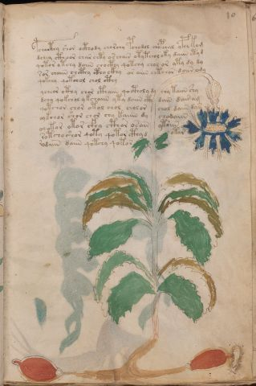

# Voynich Speculative Herbal Ferment Recipe — f10r

IMPORTANT: this is NOT a real or validated translation of the Voynich Manuscript. It is a speculative/procedural model that interprets EVA using a user-defined grammar to generate experimental recipes using safe, known edible substitutes.

This file is generated automatically from IVTFF/EVA transliteration plus a user-defined procedural grammar.



## Page / Folio
- currier: A
- folio: f10r
- page_number: 19
- section: herbal

## EVA Text (Transliteration)
```text
pchocthy shor octhody chorchy pchodol chopchal ypch kom
dchey cthoor char chty os chair otytchol oky daiin etyd
qotor o tchy daiin chocthy qotchy chol or yty dy dy
sor chaiin chcthy ctho ckhy or aiin chtchor do[iir:iin] ody
qokchy qotchol chol cthy
ycheor cthy chor cthaiin qoctholy dy chy taiin shy
dchy qokchol y kchaiin yty daiin cth dain dair am
qotchor chor otol chol cholor chol daiin dar
oykchor shor chor chy kaiiin dy chodaiin
oqot[o:a]r otor cfhy cthor osain ytoiin
@135;otchoshor qoty qotor cthyd otar
@135;odaiin daiin qotchy qotor
```

## Recipes Index (This Page)
- [f10r.1,@P0](#f10r-1-f10r-1-p0)
- [f10r.2,+P0](#f10r-2-f10r-2-p0)
- [f10r.3,+P0](#f10r-3-f10r-3-p0)
- [f10r.4,+P0](#f10r-4-f10r-4-p0)
- [f10r.5,+P0](#f10r-5-f10r-5-p0)
- [f10r.6,+P0](#f10r-6-f10r-6-p0)
- [f10r.7,+P0](#f10r-7-f10r-7-p0)
- [f10r.8,+P0](#f10r-8-f10r-8-p0)
- [f10r.9,+P0](#f10r-9-f10r-9-p0)
- [f10r.10,+P0](#f10r-10-f10r-10-p0)
- [f10r.11,+P0](#f10r-11-f10r-11-p0)
- [f10r.12,+P0](#f10r-12-f10r-12-p0)

## Line Glosses (Procedural Gloss Only; Not a Translation)

<a id="f10r-1-f10r-1-p0"></a>

### f10r.1,@P0

EVA: pchocthy shor octhody chorchy pchodol chopchal ypch kom

Direct Gloss (Procedural, Not a Real Translation):
- pchocthy: add main plant (safe substitute) → mix / transfer → start fermentation (yeast) → add complex herbal compound (safe blend)
- shor: add secondary herb (safe substitute) → mix / transfer
- octhody: mix / transfer → start fermentation (yeast) → add complex herbal compound (safe blend)
- chorchy: add main plant (safe substitute) → mix / transfer
- pchodol: add main plant (safe substitute) → mix / transfer → start fermentation (yeast)
- chopchal: add main plant (safe substitute) → mix / transfer → start fermentation (yeast) → duration level 1 → state: fermentation start
- ypch: add main plant (safe substitute) → start fermentation (yeast)
- kom: add fermentable sugars → mix / transfer

<a id="f10r-2-f10r-2-p0"></a>

### f10r.2,+P0

EVA: dchey cthoor char chty os chair otytchol oky daiin etyd

Direct Gloss (Procedural, Not a Real Translation):
- dchey: add main plant (safe substitute) → start fermentation (yeast) → duration level 1 → state: active extraction
- cthoor: mix / transfer → add complex herbal compound (safe blend)
- char: add main plant (safe substitute) → duration level 1 → state: fermentation start
- chty: apply heat/cooking → add main plant (safe substitute)
- os: mix / transfer
- chair: add main plant (safe substitute) → duration level 1 → state: fermentation start
- otytchol: apply heat/cooking → add main plant (safe substitute) → mix / transfer
- oky: add fermentable sugars → mix / transfer
- daiin: start fermentation (yeast) → duration level 1 → state: fermentation start → long fermentation / aging phase
- etyd: apply heat/cooking → start fermentation (yeast) → duration level 1 → state: active extraction

<a id="f10r-3-f10r-3-p0"></a>

### f10r.3,+P0

EVA: qotor o tchy daiin chocthy qotchy chol or yty dy dy

Direct Gloss (Procedural, Not a Real Translation):
- qotor: prepare liquid base → apply heat/cooking → mix / transfer
- o: mix / transfer
- tchy: apply heat/cooking → add main plant (safe substitute)
- daiin: start fermentation (yeast) → duration level 1 → state: fermentation start → long fermentation / aging phase
- chocthy: add main plant (safe substitute) → mix / transfer → add complex herbal compound (safe blend)
- qotchy: prepare liquid base → apply heat/cooking → add main plant (safe substitute)
- chol: add main plant (safe substitute) → mix / transfer
- or: mix / transfer
- yty: apply heat/cooking
- dy: start fermentation (yeast)
- dy: start fermentation (yeast)

<a id="f10r-4-f10r-4-p0"></a>

### f10r.4,+P0

EVA: sor chaiin chcthy ctho ckhy or aiin chtchor do[iir:iin] ody

Direct Gloss (Procedural, Not a Real Translation):
- sor: mix / transfer
- chaiin: add main plant (safe substitute) → duration level 1 → state: fermentation start → long fermentation / aging phase
- chcthy: add main plant (safe substitute) → add complex herbal compound (safe blend)
- ctho: mix / transfer → add complex herbal compound (safe blend)
- ckhy: add complex herbal compound (safe blend)
- or: mix / transfer
- aiin: duration level 1 → state: fermentation start → long fermentation / aging phase
- chtchor: apply heat/cooking → add main plant (safe substitute) → mix / transfer
- do: mix / transfer → start fermentation (yeast)
- iir: duration level 2 → state: cooling/rest
- iin: duration level 2 → state: cooling/rest → medium fermentation phase
- ody: mix / transfer → start fermentation (yeast)

<a id="f10r-5-f10r-5-p0"></a>

### f10r.5,+P0

EVA: qokchy qotchol chol cthy

Direct Gloss (Procedural, Not a Real Translation):
- qokchy: prepare liquid base → add fermentable sugars → add main plant (safe substitute)
- qotchol: prepare liquid base → apply heat/cooking → add main plant (safe substitute) → mix / transfer
- chol: add main plant (safe substitute) → mix / transfer
- cthy: add complex herbal compound (safe blend)

<a id="f10r-6-f10r-6-p0"></a>

### f10r.6,+P0

EVA: ycheor cthy chor cthaiin qoctholy dy chy taiin shy

Direct Gloss (Procedural, Not a Real Translation):
- ycheor: add main plant (safe substitute) → mix / transfer → duration level 1 → state: active extraction
- cthy: add complex herbal compound (safe blend)
- chor: add main plant (safe substitute) → mix / transfer
- cthaiin: add complex herbal compound (safe blend) → duration level 1 → state: fermentation start → long fermentation / aging phase
- qoctholy: prepare liquid base → mix / transfer → add complex herbal compound (safe blend)
- dy: start fermentation (yeast)
- chy: add main plant (safe substitute)
- taiin: apply heat/cooking → duration level 1 → state: fermentation start → long fermentation / aging phase
- shy: add secondary herb (safe substitute)

<a id="f10r-7-f10r-7-p0"></a>

### f10r.7,+P0

EVA: dchy qokchol y kchaiin yty daiin cth dain dair am

Direct Gloss (Procedural, Not a Real Translation):
- dchy: add main plant (safe substitute) → start fermentation (yeast)
- qokchol: prepare liquid base → add fermentable sugars → add main plant (safe substitute) → mix / transfer
- y: [unparsed]
- kchaiin: add fermentable sugars → add main plant (safe substitute) → duration level 1 → state: fermentation start → long fermentation / aging phase
- yty: apply heat/cooking
- daiin: start fermentation (yeast) → duration level 1 → state: fermentation start → long fermentation / aging phase
- cth: add complex herbal compound (safe blend)
- dain: start fermentation (yeast) → duration level 1 → state: fermentation start
- dair: start fermentation (yeast) → duration level 1 → state: fermentation start
- am: duration level 1 → state: fermentation start

<a id="f10r-8-f10r-8-p0"></a>

### f10r.8,+P0

EVA: qotchor chor otol chol cholor chol daiin dar

Direct Gloss (Procedural, Not a Real Translation):
- qotchor: prepare liquid base → apply heat/cooking → add main plant (safe substitute) → mix / transfer
- chor: add main plant (safe substitute) → mix / transfer
- otol: apply heat/cooking → mix / transfer
- chol: add main plant (safe substitute) → mix / transfer
- cholor: add main plant (safe substitute) → mix / transfer
- chol: add main plant (safe substitute) → mix / transfer
- daiin: start fermentation (yeast) → duration level 1 → state: fermentation start → long fermentation / aging phase
- dar: start fermentation (yeast) → duration level 1 → state: fermentation start

<a id="f10r-9-f10r-9-p0"></a>

### f10r.9,+P0

EVA: oykchor shor chor chy kaiiin dy chodaiin

Direct Gloss (Procedural, Not a Real Translation):
- oykchor: add fermentable sugars → add main plant (safe substitute) → mix / transfer
- shor: add secondary herb (safe substitute) → mix / transfer
- chor: add main plant (safe substitute) → mix / transfer
- chy: add main plant (safe substitute)
- kaiiin: add fermentable sugars → duration level 1 → state: fermentation start → medium fermentation phase
- dy: start fermentation (yeast)
- chodaiin: add main plant (safe substitute) → mix / transfer → start fermentation (yeast) → duration level 1 → state: fermentation start → long fermentation / aging phase

<a id="f10r-10-f10r-10-p0"></a>

### f10r.10,+P0

EVA: oqot[o:a]r otor cfhy cthor osain ytoiin

Direct Gloss (Procedural, Not a Real Translation):
- oqot: prepare liquid base → apply heat/cooking → mix / transfer
- o: mix / transfer
- a: duration level 1 → state: fermentation start
- r: [unparsed]
- otor: apply heat/cooking → mix / transfer
- cfhy: add complex herbal compound (safe blend)
- cthor: mix / transfer → add complex herbal compound (safe blend)
- osain: mix / transfer → duration level 1 → state: fermentation start
- ytoiin: apply heat/cooking → mix / transfer → duration level 2 → state: cooling/rest → medium fermentation phase

<a id="f10r-11-f10r-11-p0"></a>

### f10r.11,+P0

EVA: @135;otchoshor qoty qotor cthyd otar

Direct Gloss (Procedural, Not a Real Translation):
- otchoshor: apply heat/cooking → add main plant (safe substitute) → add secondary herb (safe substitute) → mix / transfer
- qoty: prepare liquid base → apply heat/cooking
- qotor: prepare liquid base → apply heat/cooking → mix / transfer
- cthyd: start fermentation (yeast) → add complex herbal compound (safe blend)
- otar: apply heat/cooking → mix / transfer → duration level 1 → state: fermentation start

<a id="f10r-12-f10r-12-p0"></a>

### f10r.12,+P0

EVA: @135;odaiin daiin qotchy qotor

Direct Gloss (Procedural, Not a Real Translation):
- odaiin: mix / transfer → start fermentation (yeast) → duration level 1 → state: fermentation start → long fermentation / aging phase
- daiin: start fermentation (yeast) → duration level 1 → state: fermentation start → long fermentation / aging phase
- qotchy: prepare liquid base → apply heat/cooking → add main plant (safe substitute)
- qotor: prepare liquid base → apply heat/cooking → mix / transfer
