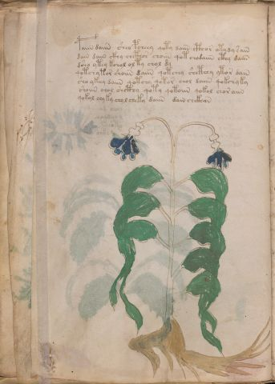

# Voynich Speculative Herbal Ferment Recipe — f10v

IMPORTANT: this is NOT a real or validated translation of the Voynich Manuscript. It is a speculative/procedural model that interprets EVA using a user-defined grammar to generate experimental recipes using safe, known edible substitutes.

This file is generated automatically from IVTFF/EVA transliteration plus a user-defined procedural grammar.



## Page / Folio
- currier: A
- folio: f10v
- page_number: 20
- plant_candidates: ['Hellebore? orientalis']
- plant_category_confidence: 0.25
- plant_category_guess: leaf
- plant_category_matches: ['section=herbal_default']
- plant_id: Hellebore? orientalis
- section: herbal

## Plant Interpretation (Heuristic)
- category: leaf
- confidence: 0.25
- note: Heuristic classification based on the IVTFF 'Plant ID' string (not the drawing). Does not imply real identification of the manuscript plant.
- textual_evidence_terms: ['section=herbal_default']

## EVA Text (Transliteration)
```text
paiin daiin sheo pcheey qoty daiin cthor otydy sain
dain daiin ckhy chcthor choiin qot chodaiin cthy daiin
dsho ytey kchol ol ty chol dy
qotchytor shoiin daiin qotchey shcthhy ytor dain
sho ykeey daiin qotchy qotor chol daiin qokchy ky
shoiin chor shcthy qoty qotoiin qokol chor aiin
qokol chy ky chol cheky daiin dain chckhan
```

## Page Summary (Procedural, Aggregated)
- compound_counts: {'yeast fermentation': 17, 'secondary herb': 7, 'mix/transfer': 23, 'main herb': 17, 'liquid base': 11, 'heat': 13, 'complex herbal compound': 7, 'sugars': 8}
- dose_level: 2
- fermentation_estimate: 7–14 days

## Pantry (Max Needed For Any Single Line-Recipe)
- main_plant_dry_g: 10
- main_plant_substitute: ['lemon balm']
- safe_complex_herbal_blend: ['gentle spices (e.g., 1 g cinnamon + 1 g clove) or a commercial herbal tea blend']
- secondary_herb_dry_g: 5
- secondary_herb_substitute: ['mint']
- sugar_or_honey_g: 50
- water_l: 0.5
- yeast_g: 1

## Recipes Index (This Page)
- [f10v.1,@P0](#f10v-1-f10v-1-p0)
- [f10v.2,+P0](#f10v-2-f10v-2-p0)
- [f10v.3,+P0](#f10v-3-f10v-3-p0)
- [f10v.4,+P0](#f10v-4-f10v-4-p0)
- [f10v.5,+P0](#f10v-5-f10v-5-p0)
- [f10v.6,+P0](#f10v-6-f10v-6-p0)
- [f10v.7,+P0](#f10v-7-f10v-7-p0)

## Line Recipes (Each Line = One Recipe, 0.5L batch)

<a id="f10v-1-f10v-1-p0"></a>

### f10v.1,@P0

EVA: paiin daiin sheo pcheey qoty daiin cthor otydy sain

## Ingredients
- main_plant_dry_g: 10
- main_plant_substitute: lemon balm
- safe_complex_herbal_blend: gentle spices (e.g., 1 g cinnamon + 1 g clove) or a commercial herbal tea blend
- secondary_herb_dry_g: 5
- secondary_herb_substitute: mint
- sugar_or_honey_g: 25
- water_l: 0.5
- yeast_g: 1

Process:
1. Sanitize the jar/fermenter and utensils.
2. Base: combine 0.5 L water with 25 g sugar or honey.
3. Apply gentle heat: simmer 10–15 min, then cool to <30°C before adding yeast.
4. Add main plant: lemon balm (~10 g dried).
5. Add secondary herb: mint (~5 g dried).
6. If a complex herbal compound appears, use a safe commercial blend or gentle spices in micro-doses.
7. Pitch yeast: 1 g (ideally cider/beer yeast).
8. Ferment with an airlock: 7–14 days (guided by iin/aiin markers).
9. Strain/rack (if very solid-heavy) and cold-crash 24 h.
10. Bottle only when activity clearly slows; refrigerate. Avoid overpressure.

Expected Result: A mild, aromatic herbal ferment, low-to-medium intensity depending on dose level.

Does It Make Sense?: yes

Direct Gloss (Procedural, Not a Real Translation):
- paiin: start fermentation (yeast) → duration level 1 → state: fermentation start → long fermentation / aging phase
- daiin: start fermentation (yeast) → duration level 1 → state: fermentation start → long fermentation / aging phase
- sheo: add secondary herb (safe substitute) → mix / transfer → duration level 1 → state: active extraction
- pcheey: add main plant (safe substitute) → start fermentation (yeast) → duration level 2 → state: active extraction
- qoty: prepare liquid base → apply heat/cooking
- daiin: start fermentation (yeast) → duration level 1 → state: fermentation start → long fermentation / aging phase
- cthor: mix / transfer → add complex herbal compound (safe blend)
- otydy: apply heat/cooking → mix / transfer → start fermentation (yeast)
- sain: duration level 1 → state: fermentation start

<a id="f10v-2-f10v-2-p0"></a>

### f10v.2,+P0

EVA: dain daiin ckhy chcthor choiin qot chodaiin cthy daiin

## Ingredients
- main_plant_dry_g: 10
- main_plant_substitute: lemon balm
- safe_complex_herbal_blend: gentle spices (e.g., 1 g cinnamon + 1 g clove) or a commercial herbal tea blend
- secondary_herb_dry_g: 2
- secondary_herb_substitute: mint
- sugar_or_honey_g: 25
- water_l: 0.5
- yeast_g: 1

Process:
1. Sanitize the jar/fermenter and utensils.
2. Base: combine 0.5 L water with 25 g sugar or honey.
3. Apply gentle heat: simmer 10–15 min, then cool to <30°C before adding yeast.
4. Add main plant: lemon balm (~10 g dried).
5. Add secondary herb: mint (~2 g dried).
6. If a complex herbal compound appears, use a safe commercial blend or gentle spices in micro-doses.
7. Pitch yeast: 1 g (ideally cider/beer yeast).
8. Ferment with an airlock: 7–14 days (guided by iin/aiin markers).
9. Strain/rack (if very solid-heavy) and cold-crash 24 h.
10. Bottle only when activity clearly slows; refrigerate. Avoid overpressure.

Expected Result: A mild, aromatic herbal ferment, low-to-medium intensity depending on dose level.

Does It Make Sense?: yes

Direct Gloss (Procedural, Not a Real Translation):
- dain: start fermentation (yeast) → duration level 1 → state: fermentation start
- daiin: start fermentation (yeast) → duration level 1 → state: fermentation start → long fermentation / aging phase
- ckhy: add complex herbal compound (safe blend)
- chcthor: add main plant (safe substitute) → mix / transfer → add complex herbal compound (safe blend)
- choiin: add main plant (safe substitute) → mix / transfer → duration level 2 → state: cooling/rest → medium fermentation phase
- qot: prepare liquid base → apply heat/cooking
- chodaiin: add main plant (safe substitute) → mix / transfer → start fermentation (yeast) → duration level 1 → state: fermentation start → long fermentation / aging phase
- cthy: add complex herbal compound (safe blend)
- daiin: start fermentation (yeast) → duration level 1 → state: fermentation start → long fermentation / aging phase

<a id="f10v-3-f10v-3-p0"></a>

### f10v.3,+P0

EVA: dsho ytey kchol ol ty chol dy

## Ingredients
- main_plant_dry_g: 5
- main_plant_substitute: lemon balm
- secondary_herb_dry_g: 2
- secondary_herb_substitute: mint
- sugar_or_honey_g: 25
- water_l: 0.5
- yeast_g: 1

Process:
1. Sanitize the jar/fermenter and utensils.
2. Base: combine 0.5 L water with 25 g sugar or honey.
3. Apply gentle heat: simmer 10–15 min, then cool to <30°C before adding yeast.
4. Add main plant: lemon balm (~5 g dried).
5. Add secondary herb: mint (~2 g dried).
6. Pitch yeast: 1 g (ideally cider/beer yeast).
7. Ferment with an airlock: 2–4 days (guided by iin/aiin markers).
8. Strain/rack (if very solid-heavy) and cold-crash 24 h.
9. Bottle only when activity clearly slows; refrigerate. Avoid overpressure.

Expected Result: A mild, aromatic herbal ferment, low-to-medium intensity depending on dose level.

Does It Make Sense?: yes

Direct Gloss (Procedural, Not a Real Translation):
- dsho: add secondary herb (safe substitute) → mix / transfer → start fermentation (yeast)
- ytey: apply heat/cooking → duration level 1 → state: active extraction
- kchol: add fermentable sugars → add main plant (safe substitute) → mix / transfer
- ol: mix / transfer
- ty: apply heat/cooking
- chol: add main plant (safe substitute) → mix / transfer
- dy: start fermentation (yeast)

<a id="f10v-4-f10v-4-p0"></a>

### f10v.4,+P0

EVA: qotchytor shoiin daiin qotchey shcthhy ytor dain

## Ingredients
- main_plant_dry_g: 10
- main_plant_substitute: lemon balm
- safe_complex_herbal_blend: gentle spices (e.g., 1 g cinnamon + 1 g clove) or a commercial herbal tea blend
- secondary_herb_dry_g: 5
- secondary_herb_substitute: mint
- sugar_or_honey_g: 25
- water_l: 0.5
- yeast_g: 1

Process:
1. Sanitize the jar/fermenter and utensils.
2. Base: combine 0.5 L water with 25 g sugar or honey.
3. Apply gentle heat: simmer 10–15 min, then cool to <30°C before adding yeast.
4. Add main plant: lemon balm (~10 g dried).
5. Add secondary herb: mint (~5 g dried).
6. If a complex herbal compound appears, use a safe commercial blend or gentle spices in micro-doses.
7. Pitch yeast: 1 g (ideally cider/beer yeast).
8. Ferment with an airlock: 7–14 days (guided by iin/aiin markers).
9. Strain/rack (if very solid-heavy) and cold-crash 24 h.
10. Bottle only when activity clearly slows; refrigerate. Avoid overpressure.

Expected Result: A mild, aromatic herbal ferment, low-to-medium intensity depending on dose level.

Does It Make Sense?: yes

Direct Gloss (Procedural, Not a Real Translation):
- qotchytor: prepare liquid base → apply heat/cooking → add main plant (safe substitute) → mix / transfer
- shoiin: add secondary herb (safe substitute) → mix / transfer → duration level 2 → state: cooling/rest → medium fermentation phase
- daiin: start fermentation (yeast) → duration level 1 → state: fermentation start → long fermentation / aging phase
- qotchey: prepare liquid base → apply heat/cooking → add main plant (safe substitute) → duration level 1 → state: active extraction
- shcthhy: add secondary herb (safe substitute) → add complex herbal compound (safe blend)
- ytor: apply heat/cooking → mix / transfer
- dain: start fermentation (yeast) → duration level 1 → state: fermentation start

<a id="f10v-5-f10v-5-p0"></a>

### f10v.5,+P0

EVA: sho ykeey daiin qotchy qotor chol daiin qokchy ky

## Ingredients
- main_plant_dry_g: 10
- main_plant_substitute: lemon balm
- secondary_herb_dry_g: 5
- secondary_herb_substitute: mint
- sugar_or_honey_g: 50
- water_l: 0.5
- yeast_g: 1

Process:
1. Sanitize the jar/fermenter and utensils.
2. Base: combine 0.5 L water with 50 g sugar or honey.
3. Apply gentle heat: simmer 10–15 min, then cool to <30°C before adding yeast.
4. Add main plant: lemon balm (~10 g dried).
5. Add secondary herb: mint (~5 g dried).
6. Pitch yeast: 1 g (ideally cider/beer yeast).
7. Ferment with an airlock: 7–14 days (guided by iin/aiin markers).
8. Strain/rack (if very solid-heavy) and cold-crash 24 h.
9. Bottle only when activity clearly slows; refrigerate. Avoid overpressure.

Expected Result: A mild, aromatic herbal ferment, low-to-medium intensity depending on dose level.

Does It Make Sense?: yes

Direct Gloss (Procedural, Not a Real Translation):
- sho: add secondary herb (safe substitute) → mix / transfer
- ykeey: add fermentable sugars → duration level 2 → state: active extraction
- daiin: start fermentation (yeast) → duration level 1 → state: fermentation start → long fermentation / aging phase
- qotchy: prepare liquid base → apply heat/cooking → add main plant (safe substitute)
- qotor: prepare liquid base → apply heat/cooking → mix / transfer
- chol: add main plant (safe substitute) → mix / transfer
- daiin: start fermentation (yeast) → duration level 1 → state: fermentation start → long fermentation / aging phase
- qokchy: prepare liquid base → add fermentable sugars → add main plant (safe substitute)
- ky: add fermentable sugars

<a id="f10v-6-f10v-6-p0"></a>

### f10v.6,+P0

EVA: shoiin chor shcthy qoty qotoiin qokol chor aiin

## Ingredients
- main_plant_dry_g: 10
- main_plant_substitute: lemon balm
- safe_complex_herbal_blend: gentle spices (e.g., 1 g cinnamon + 1 g clove) or a commercial herbal tea blend
- secondary_herb_dry_g: 5
- secondary_herb_substitute: mint
- sugar_or_honey_g: 50
- water_l: 0.5
- yeast_g: 1

Process:
1. Sanitize the jar/fermenter and utensils.
2. Base: combine 0.5 L water with 50 g sugar or honey.
3. Apply gentle heat: simmer 10–15 min, then cool to <30°C before adding yeast.
4. Add main plant: lemon balm (~10 g dried).
5. Add secondary herb: mint (~5 g dried).
6. If a complex herbal compound appears, use a safe commercial blend or gentle spices in micro-doses.
7. Pitch yeast: 1 g (ideally cider/beer yeast).
8. Ferment with an airlock: 7–14 days (guided by iin/aiin markers).
9. Strain/rack (if very solid-heavy) and cold-crash 24 h.
10. Bottle only when activity clearly slows; refrigerate. Avoid overpressure.

Expected Result: A mild, aromatic herbal ferment, low-to-medium intensity depending on dose level.

Does It Make Sense?: yes

Direct Gloss (Procedural, Not a Real Translation):
- shoiin: add secondary herb (safe substitute) → mix / transfer → duration level 2 → state: cooling/rest → medium fermentation phase
- chor: add main plant (safe substitute) → mix / transfer
- shcthy: add secondary herb (safe substitute) → add complex herbal compound (safe blend)
- qoty: prepare liquid base → apply heat/cooking
- qotoiin: prepare liquid base → apply heat/cooking → mix / transfer → duration level 2 → state: cooling/rest → medium fermentation phase
- qokol: prepare liquid base → add fermentable sugars → mix / transfer
- chor: add main plant (safe substitute) → mix / transfer
- aiin: duration level 1 → state: fermentation start → long fermentation / aging phase

<a id="f10v-7-f10v-7-p0"></a>

### f10v.7,+P0

EVA: qokol chy ky chol cheky daiin dain chckhan

## Ingredients
- main_plant_dry_g: 5
- main_plant_substitute: lemon balm
- safe_complex_herbal_blend: gentle spices (e.g., 1 g cinnamon + 1 g clove) or a commercial herbal tea blend
- secondary_herb_dry_g: 1
- secondary_herb_substitute: mint
- sugar_or_honey_g: 25
- water_l: 0.5
- yeast_g: 1

Process:
1. Sanitize the jar/fermenter and utensils.
2. Base: combine 0.5 L water with 25 g sugar or honey.
3. Infusion: use hot (not boiling) water, then let it cool before adding yeast.
4. Add main plant: lemon balm (~5 g dried).
5. Add secondary herb: mint (~1 g dried).
6. If a complex herbal compound appears, use a safe commercial blend or gentle spices in micro-doses.
7. Pitch yeast: 1 g (ideally cider/beer yeast).
8. Ferment with an airlock: 7–14 days (guided by iin/aiin markers).
9. Strain/rack (if very solid-heavy) and cold-crash 24 h.
10. Bottle only when activity clearly slows; refrigerate. Avoid overpressure.

Expected Result: A mild, aromatic herbal ferment, low-to-medium intensity depending on dose level.

Does It Make Sense?: yes

Direct Gloss (Procedural, Not a Real Translation):
- qokol: prepare liquid base → add fermentable sugars → mix / transfer
- chy: add main plant (safe substitute)
- ky: add fermentable sugars
- chol: add main plant (safe substitute) → mix / transfer
- cheky: add fermentable sugars → add main plant (safe substitute) → duration level 1 → state: active extraction
- daiin: start fermentation (yeast) → duration level 1 → state: fermentation start → long fermentation / aging phase
- dain: start fermentation (yeast) → duration level 1 → state: fermentation start
- chckhan: add main plant (safe substitute) → add complex herbal compound (safe blend) → duration level 1 → state: fermentation start

## Risks & Warnings (Applies To All Line-Recipes)
- Never use unidentified Voynich plants directly; only use known edible substitutes.
- Do not consume if you see mold, smell rot, notice abnormal sliminess, or taste something clearly foul.
- Overpressure/bottle-bomb risk: do not bottle before stable; prefer an airlock and refrigeration.
- Avoid if pregnant/breastfeeding, for minors, or with medical conditions; consult a professional.
- No medical claims: this is an experimental beverage.

## Recommended Adjustments (General)
- If too bitter (leafy profile), halve the herbs or shorten steep/maceration time.
- If too sweet, extend fermentation or reduce sugar by 25–50%.
- For a non-alcoholic version, omit yeast and keep refrigerated as an infusion (not fermented).
