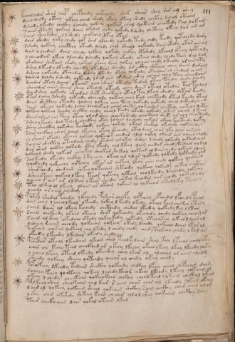

# Voynich Speculative Herbal Ferment Recipe — f111r

IMPORTANT: this is NOT a real or validated translation of the Voynich Manuscript. It is a speculative/procedural model that interprets EVA using a user-defined grammar to generate experimental recipes using safe, known edible substitutes.

This file is generated automatically from IVTFF/EVA transliteration plus a user-defined procedural grammar.

## Page / Folio
- currier: B
- folio: f111r
- page_number: 224
- plant_category_confidence: 0.0
- plant_category_guess: unknown

## Plant Interpretation (Heuristic)
- category: unknown
- confidence: 0.0
- note: Heuristic classification based on the IVTFF 'Plant ID' string (not the drawing). Does not imply real identification of the manuscript plant.

## EVA Text (Transliteration)
kcholchdar shar aiip chepchedy chetalshy sheek shear shey ror am shey
daiin sheeky okeey okeey qaal shedy okeey oteey shedy chcthy lcheol oteeam
dsheedy lkeedy chckhy lchedy qokeey qokear chal qokeear cheokedy sal lokam
saiin oteedy qokeey daiin okedal chedy qokedy l shedy chctchy okeey lor ar am
saiin sheekshy ol shedy chokchey lkey otain
dain shedy qoky chedy qok shed olchedy qokeedy teedy chdy keedy qotchedy dary
sshedy qokeey checthey oteedy lchedy chol sheeol qokeody raiin otedy otar aiin om
daiin o chedain daiin cheedy qokeey qokedy chckhhy otshedy lkeeol lkeey qotchdy
ycheeodain okeeo olchedy lchedy qokeey okeeedy okain chedy chedyteey dal lam
ykeedaiin shekain shedy qokear ochey reeey qokeey olaiiin chedy lkeeody oraiin oty
dshey lkeedy lkeedy cheedy oteedaiin sheedy ar aikhy shkaiin chey daiin daram
dsheeo qokeedy otchedey lshey lkeedy oteey qokeedy oteolair ar shedam cheam
qosheo lchdy lshedy olkeeedy lr al chr or dain shey arain chey teey cheodaiin
dchedar oteey lchey ykeeeos aiin shear oteedy tedam oteey pchedey chedy lchedy
sheeodar aiin sheey shey oteody oteedy chey daiin oteol otedar tar pchdam
dchedshey qokeedy okeodain shet sheota[?:im] oteal tey lkeey sheedy shtar keedy
otes lchey lshedy qoteedy olcheody qokeey chey kal chekeedy oteed keedy otam
daiin shecthey oteody qochey qokeey chey teey qokeedy qokeedy cheol lokeedy lched
saiin okeeol qokeedy lchey lcheoekam oaiin cheky qokeeodar checthdy qoted l loty
qokeey qokeey l[ch:a]edy checthy chedey cheol teedy okeedy qokeedy okeey cho ol l kai@175;
daiin okar ain teey oteey ox o r shey chey ky deedy cheo dain sheet ar al l cheotydy
ssheo l keedy dal tched checkhey okey qo ain qo chedy qokeor okeey keo cthedy qokey
dshey sheeckhy qokeshey keeshody qokeey qokedy okain shekal okechedy qokechedy
sain chckhey cheos lchal lkechey okeey lkechedy oteodain char lky lchr ainai@175;
so sheor okeedy oteeey qokeey qokeeo s chedar alal oikhy oxar aiin odaiin chody
soaiin shecthy oteodaiin chedy otedar air ykeey shedain l chedy qokeedy qoteedaiin
dar sheod qokeey qokeody otey lkeedy chl lkeey daiin chedar chedyteedain olkal
qokeeol shedy qokeod cheokeey sheokar shekeey qotees al dain chedy qotain alam
salkeedy lkeedy chckhy rky chey okeeo chr al ar qokeedy qokedy qoteedy qod
qockhedy qokeechy qotchey chtar ar chkeey lkar aiin chedy qokeey q[o:?]irain
sheotchedy shedain shkeyqokeaiin shkeody qokeey qokeedy chkal checthy
dsheeoteey qokeeo l keey tear qoteey qotain cho lkeeedy lchechdy qokechy
qoeeeo [s:d] ain ar ol keey lkair cheda chkal keeodal eees chody qokeedy dl
teo olkeeo al lkeeey olain ar akeom qokain al qokeeod lkedlkey teedar
y chedl ar aiin aiy dam
polal shedal pchedy qofchedy pykeor cheefy qopchey opchedal lfchedy pchal
dain chol l cheeol keeol lkeeedy qokeey l keedy l kedy okeal kain chckhy ltedy
dched daiin al okeey kechedy chcthedy chedain otedy qokeedy key l ltain
saiin chckhedy okain oteain shok qokechdy okechedy chedy qokeey cheamar
saiin al keey okedain otedy qokeokedy qokeedy oteeolkeey okeeo l lainal
ycheey raiin cheody qokechy qokeey okedy lchedy qokeeal daiin otaral
qokeol qok[a:ee]l qokeeol cho lkedy l chedy chedy chedyteokain chedy l kag am
okeedy lkeedy lkedar okeedy chedy
pchedar oteeol lkeedain okeam sheo teolkedain shal keey lteeal cheal oty
oain ain keeey teed checkhed iir okeey lkeeey okeeo lkeey lkeey lkeedy qoky
y cheeo lkeey oteed lkeedy okeeshey chey lkar al olchal or aiin che[o:?]m
sheedy qokeey sheey qoteedy qeear al chedy okeey chedy
poeokeey lkeedy tedain shecthy qokeedy chckhy lfchy cheal chepcham daim
dcheey keeey qockhey qokeey lchedy keeor okeey lkeedy lkeey qokaiin ol
okeey l chedy cheekain qokeeokain chckhy cheal k[ee:ei]l qokain chckhal lkal
polkeeo shey cheokeain chl kar r aiin char ?ain al lkeedy qokal okchy
dair al qokeey qokaiin sheal qokeain shckhy sain chckhy char aiin alom
yshe aiin okshdy shkeey kain chaiin alolshey qokaiin chcthydain
tair chckhaiin dair qokal otain okal

## Page Summary (Procedural, Aggregated)
- compound_counts: {'sugars': 226, 'main herb': 169, 'mix/transfer': 203, 'yeast fermentation': 255, 'secondary herb': 76, 'heat': 85, 'general base': 3, 'complex herbal compound': 28, 'liquid base': 99, 'aroma modifier': 4}
- dose_level: 3
- fermentation_estimate: 7–14 days

## Pantry (Max Needed For Any Single Line-Recipe)
- aroma_modifier: ['lemon peel (optional)']
- aroma_modifier_dose: ['2–5 g (or 1 strip of peel, avoiding the bitter pith)']
- main_plant_dry_g: 15
- main_plant_substitute: ['chamomile (safe default substitute)']
- safe_complex_herbal_blend: ['gentle spices (e.g., 1 g cinnamon + 1 g clove) or a commercial herbal tea blend']
- secondary_herb_dry_g: 7
- secondary_herb_substitute: ['mint']
- sugar_or_honey_g: 75
- water_l: 0.5
- yeast_g: 1

## Line Recipes (Each Line = One Recipe, 0.5L batch)

### f111r.1,@P0

EVA: kcholchdar shar aiip chepchedy chetalshy sheek shear shey ror am shey

## Ingredients
- main_plant_dry_g: 10
- main_plant_substitute: chamomile (safe default substitute)
- secondary_herb_dry_g: 5
- secondary_herb_substitute: mint
- sugar_or_honey_g: 50
- water_l: 0.5
- yeast_g: 1

Process:
1. Sanitize the jar/fermenter and utensils.
2. Base: combine 0.5 L water with 50 g sugar or honey.
3. Apply gentle heat: simmer 10–15 min, then cool to <30°C before adding yeast.
4. Add main plant: chamomile (safe default substitute) (~10 g dried).
5. Add secondary herb: mint (~5 g dried).
6. Pitch yeast: 1 g (ideally cider/beer yeast).
7. Ferment with an airlock: 2–4 days (guided by iin/aiin markers).
8. Strain/rack (if very solid-heavy) and cold-crash 24 h.
9. Bottle only when activity clearly slows; refrigerate. Avoid overpressure.

Expected Result: A mild, aromatic herbal ferment, low-to-medium intensity depending on dose level.

Does It Make Sense?: partial

Direct Gloss (Procedural, Not a Real Translation):
- kcholchdar: add fermentable sugars → add main plant (safe substitute) → mix / transfer → start fermentation (yeast) → duration level 1 → state: fermentation start
- shar: add secondary herb (safe substitute) → duration level 1 → state: fermentation start
- aiip: start fermentation (yeast) → duration level 1 → state: fermentation start
- chepchedy: add main plant (safe substitute) → start fermentation (yeast) → duration level 1 → state: active extraction
- chetalshy: apply heat/cooking → add main plant (safe substitute) → add secondary herb (safe substitute) → duration level 1 → state: active extraction
- sheek: add fermentable sugars → add secondary herb (safe substitute) → duration level 2 → state: active extraction
- shear: add secondary herb (safe substitute) → duration level 1 → state: active extraction
- shey: add secondary herb (safe substitute) → duration level 1 → state: active extraction
- ror: mix / transfer
- am: duration level 1 → state: fermentation start
- shey: add secondary herb (safe substitute) → duration level 1 → state: active extraction

### f111r.2,+P0

EVA: daiin sheeky okeey okeey qaal shedy okeey oteey shedy chcthy lcheol oteeam

## Ingredients
- main_plant_dry_g: 10
- main_plant_substitute: chamomile (safe default substitute)
- safe_complex_herbal_blend: gentle spices (e.g., 1 g cinnamon + 1 g clove) or a commercial herbal tea blend
- secondary_herb_dry_g: 5
- secondary_herb_substitute: mint
- sugar_or_honey_g: 50
- water_l: 0.5
- yeast_g: 1

Process:
1. Sanitize the jar/fermenter and utensils.
2. Base: combine 0.5 L water with 50 g sugar or honey.
3. Apply gentle heat: simmer 10–15 min, then cool to <30°C before adding yeast.
4. Add main plant: chamomile (safe default substitute) (~10 g dried).
5. Add secondary herb: mint (~5 g dried).
6. If a complex herbal compound appears, use a safe commercial blend or gentle spices in micro-doses.
7. Pitch yeast: 1 g (ideally cider/beer yeast).
8. Ferment with an airlock: 7–14 days (guided by iin/aiin markers).
9. Strain/rack (if very solid-heavy) and cold-crash 24 h.
10. Bottle only when activity clearly slows; refrigerate. Avoid overpressure.

Expected Result: A mild, aromatic herbal ferment, low-to-medium intensity depending on dose level.

Does It Make Sense?: partial

Direct Gloss (Procedural, Not a Real Translation):
- daiin: start fermentation (yeast) → duration level 1 → state: fermentation start → long fermentation / aging phase
- sheeky: add fermentable sugars → add secondary herb (safe substitute) → duration level 2 → state: active extraction
- okeey: add fermentable sugars → mix / transfer → duration level 2 → state: active extraction
- okeey: add fermentable sugars → mix / transfer → duration level 2 → state: active extraction
- qaal: prepare base (generic) → duration level 2 → state: fermentation start
- shedy: add secondary herb (safe substitute) → start fermentation (yeast) → duration level 1 → state: active extraction
- okeey: add fermentable sugars → mix / transfer → duration level 2 → state: active extraction
- oteey: apply heat/cooking → mix / transfer → duration level 2 → state: active extraction
- shedy: add secondary herb (safe substitute) → start fermentation (yeast) → duration level 1 → state: active extraction
- chcthy: add main plant (safe substitute) → add complex herbal compound (safe blend)
- lcheol: add main plant (safe substitute) → mix / transfer → duration level 1 → state: active extraction
- oteeam: apply heat/cooking → mix / transfer → duration level 2 → state: active extraction

### f111r.3,+P0

EVA: dsheedy lkeedy chckhy lchedy qokeey qokear chal qokeear cheokedy sal lokam

## Ingredients
- main_plant_dry_g: 10
- main_plant_substitute: chamomile (safe default substitute)
- safe_complex_herbal_blend: gentle spices (e.g., 1 g cinnamon + 1 g clove) or a commercial herbal tea blend
- secondary_herb_dry_g: 5
- secondary_herb_substitute: mint
- sugar_or_honey_g: 50
- water_l: 0.5
- yeast_g: 1

Process:
1. Sanitize the jar/fermenter and utensils.
2. Base: combine 0.5 L water with 50 g sugar or honey.
3. Infusion: use hot (not boiling) water, then let it cool before adding yeast.
4. Add main plant: chamomile (safe default substitute) (~10 g dried).
5. Add secondary herb: mint (~5 g dried).
6. If a complex herbal compound appears, use a safe commercial blend or gentle spices in micro-doses.
7. Pitch yeast: 1 g (ideally cider/beer yeast).
8. Ferment with an airlock: 2–4 days (guided by iin/aiin markers).
9. Strain/rack (if very solid-heavy) and cold-crash 24 h.
10. Bottle only when activity clearly slows; refrigerate. Avoid overpressure.

Expected Result: A mild, aromatic herbal ferment, low-to-medium intensity depending on dose level.

Does It Make Sense?: partial

Direct Gloss (Procedural, Not a Real Translation):
- dsheedy: add secondary herb (safe substitute) → start fermentation (yeast) → duration level 2 → state: active extraction
- lkeedy: add fermentable sugars → start fermentation (yeast) → duration level 2 → state: active extraction
- chckhy: add main plant (safe substitute) → add complex herbal compound (safe blend)
- lchedy: add main plant (safe substitute) → start fermentation (yeast) → duration level 1 → state: active extraction
- qokeey: prepare liquid base → add fermentable sugars → duration level 2 → state: active extraction
- qokear: prepare liquid base → add fermentable sugars → duration level 1 → state: active extraction
- chal: add main plant (safe substitute) → duration level 1 → state: fermentation start
- qokeear: prepare liquid base → add fermentable sugars → duration level 2 → state: active extraction
- cheokedy: add fermentable sugars → add main plant (safe substitute) → mix / transfer → start fermentation (yeast) → duration level 1 → state: active extraction
- sal: duration level 1 → state: fermentation start
- lokam: add fermentable sugars → mix / transfer → duration level 1 → state: fermentation start

### f111r.4,+P0

EVA: saiin oteedy qokeey daiin okedal chedy qokedy l shedy chctchy okeey lor ar am

## Ingredients
- main_plant_dry_g: 10
- main_plant_substitute: chamomile (safe default substitute)
- secondary_herb_dry_g: 5
- secondary_herb_substitute: mint
- sugar_or_honey_g: 50
- water_l: 0.5
- yeast_g: 1

Process:
1. Sanitize the jar/fermenter and utensils.
2. Base: combine 0.5 L water with 50 g sugar or honey.
3. Apply gentle heat: simmer 10–15 min, then cool to <30°C before adding yeast.
4. Add main plant: chamomile (safe default substitute) (~10 g dried).
5. Add secondary herb: mint (~5 g dried).
6. Pitch yeast: 1 g (ideally cider/beer yeast).
7. Ferment with an airlock: 7–14 days (guided by iin/aiin markers).
8. Strain/rack (if very solid-heavy) and cold-crash 24 h.
9. Bottle only when activity clearly slows; refrigerate. Avoid overpressure.

Expected Result: A mild, aromatic herbal ferment, low-to-medium intensity depending on dose level.

Does It Make Sense?: partial

Direct Gloss (Procedural, Not a Real Translation):
- saiin: duration level 1 → state: fermentation start → long fermentation / aging phase
- oteedy: apply heat/cooking → mix / transfer → start fermentation (yeast) → duration level 2 → state: active extraction
- qokeey: prepare liquid base → add fermentable sugars → duration level 2 → state: active extraction
- daiin: start fermentation (yeast) → duration level 1 → state: fermentation start → long fermentation / aging phase
- okedal: add fermentable sugars → mix / transfer → start fermentation (yeast) → duration level 1 → state: active extraction
- chedy: add main plant (safe substitute) → start fermentation (yeast) → duration level 1 → state: active extraction
- qokedy: prepare liquid base → add fermentable sugars → start fermentation (yeast) → duration level 1 → state: active extraction
- l: [unparsed]
- shedy: add secondary herb (safe substitute) → start fermentation (yeast) → duration level 1 → state: active extraction
- chctchy: apply heat/cooking → add main plant (safe substitute)
- okeey: add fermentable sugars → mix / transfer → duration level 2 → state: active extraction
- lor: mix / transfer
- ar: duration level 1 → state: fermentation start
- am: duration level 1 → state: fermentation start

### f111r.5,+P0

EVA: saiin sheekshy ol shedy chokchey lkey otain

## Ingredients
- main_plant_dry_g: 10
- main_plant_substitute: chamomile (safe default substitute)
- secondary_herb_dry_g: 5
- secondary_herb_substitute: mint
- sugar_or_honey_g: 50
- water_l: 0.5
- yeast_g: 1

Process:
1. Sanitize the jar/fermenter and utensils.
2. Base: combine 0.5 L water with 50 g sugar or honey.
3. Apply gentle heat: simmer 10–15 min, then cool to <30°C before adding yeast.
4. Add main plant: chamomile (safe default substitute) (~10 g dried).
5. Add secondary herb: mint (~5 g dried).
6. Pitch yeast: 1 g (ideally cider/beer yeast).
7. Ferment with an airlock: 7–14 days (guided by iin/aiin markers).
8. Strain/rack (if very solid-heavy) and cold-crash 24 h.
9. Bottle only when activity clearly slows; refrigerate. Avoid overpressure.

Expected Result: A mild, aromatic herbal ferment, low-to-medium intensity depending on dose level.

Does It Make Sense?: partial

Direct Gloss (Procedural, Not a Real Translation):
- saiin: duration level 1 → state: fermentation start → long fermentation / aging phase
- sheekshy: add fermentable sugars → add secondary herb (safe substitute) → duration level 2 → state: active extraction
- ol: mix / transfer
- shedy: add secondary herb (safe substitute) → start fermentation (yeast) → duration level 1 → state: active extraction
- chokchey: add fermentable sugars → add main plant (safe substitute) → mix / transfer → duration level 1 → state: active extraction
- lkey: add fermentable sugars → duration level 1 → state: active extraction
- otain: apply heat/cooking → mix / transfer → duration level 1 → state: fermentation start

### f111r.6,+P0

EVA: dain shedy qoky chedy qok shed olchedy qokeedy teedy chdy keedy qotchedy dary

## Ingredients
- main_plant_dry_g: 10
- main_plant_substitute: chamomile (safe default substitute)
- secondary_herb_dry_g: 5
- secondary_herb_substitute: mint
- sugar_or_honey_g: 50
- water_l: 0.5
- yeast_g: 1

Process:
1. Sanitize the jar/fermenter and utensils.
2. Base: combine 0.5 L water with 50 g sugar or honey.
3. Apply gentle heat: simmer 10–15 min, then cool to <30°C before adding yeast.
4. Add main plant: chamomile (safe default substitute) (~10 g dried).
5. Add secondary herb: mint (~5 g dried).
6. Pitch yeast: 1 g (ideally cider/beer yeast).
7. Ferment with an airlock: 2–4 days (guided by iin/aiin markers).
8. Strain/rack (if very solid-heavy) and cold-crash 24 h.
9. Bottle only when activity clearly slows; refrigerate. Avoid overpressure.

Expected Result: A mild, aromatic herbal ferment, low-to-medium intensity depending on dose level.

Does It Make Sense?: partial

Direct Gloss (Procedural, Not a Real Translation):
- dain: start fermentation (yeast) → duration level 1 → state: fermentation start
- shedy: add secondary herb (safe substitute) → start fermentation (yeast) → duration level 1 → state: active extraction
- qoky: prepare liquid base → add fermentable sugars
- chedy: add main plant (safe substitute) → start fermentation (yeast) → duration level 1 → state: active extraction
- qok: prepare liquid base → add fermentable sugars
- shed: add secondary herb (safe substitute) → start fermentation (yeast) → duration level 1 → state: active extraction
- olchedy: add main plant (safe substitute) → mix / transfer → start fermentation (yeast) → duration level 1 → state: active extraction
- qokeedy: prepare liquid base → add fermentable sugars → start fermentation (yeast) → duration level 2 → state: active extraction
- teedy: apply heat/cooking → start fermentation (yeast) → duration level 2 → state: active extraction
- chdy: add main plant (safe substitute) → start fermentation (yeast)
- keedy: add fermentable sugars → start fermentation (yeast) → duration level 2 → state: active extraction
- qotchedy: prepare liquid base → apply heat/cooking → add main plant (safe substitute) → start fermentation (yeast) → duration level 1 → state: active extraction
- dary: start fermentation (yeast) → duration level 1 → state: fermentation start

### f111r.7,+P0

EVA: sshedy qokeey checthey oteedy lchedy chol sheeol qokeody raiin otedy otar aiin om

## Ingredients
- main_plant_dry_g: 10
- main_plant_substitute: chamomile (safe default substitute)
- safe_complex_herbal_blend: gentle spices (e.g., 1 g cinnamon + 1 g clove) or a commercial herbal tea blend
- secondary_herb_dry_g: 5
- secondary_herb_substitute: mint
- sugar_or_honey_g: 50
- water_l: 0.5
- yeast_g: 1

Process:
1. Sanitize the jar/fermenter and utensils.
2. Base: combine 0.5 L water with 50 g sugar or honey.
3. Apply gentle heat: simmer 10–15 min, then cool to <30°C before adding yeast.
4. Add main plant: chamomile (safe default substitute) (~10 g dried).
5. Add secondary herb: mint (~5 g dried).
6. If a complex herbal compound appears, use a safe commercial blend or gentle spices in micro-doses.
7. Pitch yeast: 1 g (ideally cider/beer yeast).
8. Ferment with an airlock: 7–14 days (guided by iin/aiin markers).
9. Strain/rack (if very solid-heavy) and cold-crash 24 h.
10. Bottle only when activity clearly slows; refrigerate. Avoid overpressure.

Expected Result: A mild, aromatic herbal ferment, low-to-medium intensity depending on dose level.

Does It Make Sense?: partial

Direct Gloss (Procedural, Not a Real Translation):
- sshedy: add secondary herb (safe substitute) → start fermentation (yeast) → duration level 1 → state: active extraction
- qokeey: prepare liquid base → add fermentable sugars → duration level 2 → state: active extraction
- checthey: add main plant (safe substitute) → add complex herbal compound (safe blend) → duration level 1 → state: active extraction
- oteedy: apply heat/cooking → mix / transfer → start fermentation (yeast) → duration level 2 → state: active extraction
- lchedy: add main plant (safe substitute) → start fermentation (yeast) → duration level 1 → state: active extraction
- chol: add main plant (safe substitute) → mix / transfer
- sheeol: add secondary herb (safe substitute) → mix / transfer → duration level 2 → state: active extraction
- qokeody: prepare liquid base → add fermentable sugars → mix / transfer → start fermentation (yeast) → duration level 1 → state: active extraction
- raiin: duration level 1 → state: fermentation start → long fermentation / aging phase
- otedy: apply heat/cooking → mix / transfer → start fermentation (yeast) → duration level 1 → state: active extraction
- otar: apply heat/cooking → mix / transfer → duration level 1 → state: fermentation start
- aiin: duration level 1 → state: fermentation start → long fermentation / aging phase
- om: mix / transfer

### f111r.8,+P0

EVA: daiin o chedain daiin cheedy qokeey qokedy chckhhy otshedy lkeeol lkeey qotchdy

## Ingredients
- main_plant_dry_g: 10
- main_plant_substitute: chamomile (safe default substitute)
- safe_complex_herbal_blend: gentle spices (e.g., 1 g cinnamon + 1 g clove) or a commercial herbal tea blend
- secondary_herb_dry_g: 5
- secondary_herb_substitute: mint
- sugar_or_honey_g: 50
- water_l: 0.5
- yeast_g: 1

Process:
1. Sanitize the jar/fermenter and utensils.
2. Base: combine 0.5 L water with 50 g sugar or honey.
3. Apply gentle heat: simmer 10–15 min, then cool to <30°C before adding yeast.
4. Add main plant: chamomile (safe default substitute) (~10 g dried).
5. Add secondary herb: mint (~5 g dried).
6. If a complex herbal compound appears, use a safe commercial blend or gentle spices in micro-doses.
7. Pitch yeast: 1 g (ideally cider/beer yeast).
8. Ferment with an airlock: 7–14 days (guided by iin/aiin markers).
9. Strain/rack (if very solid-heavy) and cold-crash 24 h.
10. Bottle only when activity clearly slows; refrigerate. Avoid overpressure.

Expected Result: A mild, aromatic herbal ferment, low-to-medium intensity depending on dose level.

Does It Make Sense?: partial

Direct Gloss (Procedural, Not a Real Translation):
- daiin: start fermentation (yeast) → duration level 1 → state: fermentation start → long fermentation / aging phase
- o: mix / transfer
- chedain: add main plant (safe substitute) → start fermentation (yeast) → duration level 1 → state: active extraction
- daiin: start fermentation (yeast) → duration level 1 → state: fermentation start → long fermentation / aging phase
- cheedy: add main plant (safe substitute) → start fermentation (yeast) → duration level 2 → state: active extraction
- qokeey: prepare liquid base → add fermentable sugars → duration level 2 → state: active extraction
- qokedy: prepare liquid base → add fermentable sugars → start fermentation (yeast) → duration level 1 → state: active extraction
- chckhhy: add main plant (safe substitute) → add complex herbal compound (safe blend)
- otshedy: apply heat/cooking → add secondary herb (safe substitute) → mix / transfer → start fermentation (yeast) → duration level 1 → state: active extraction
- lkeeol: add fermentable sugars → mix / transfer → duration level 2 → state: active extraction
- lkeey: add fermentable sugars → duration level 2 → state: active extraction
- qotchdy: prepare liquid base → apply heat/cooking → add main plant (safe substitute) → start fermentation (yeast)

### f111r.9,+P0

EVA: ycheeodain okeeo olchedy lchedy qokeey okeeedy okain chedy chedyteey dal lam

## Ingredients
- main_plant_dry_g: 15
- main_plant_substitute: chamomile (safe default substitute)
- secondary_herb_dry_g: 3
- secondary_herb_substitute: mint
- sugar_or_honey_g: 75
- water_l: 0.5
- yeast_g: 1

Process:
1. Sanitize the jar/fermenter and utensils.
2. Base: combine 0.5 L water with 75 g sugar or honey.
3. Apply gentle heat: simmer 10–15 min, then cool to <30°C before adding yeast.
4. Add main plant: chamomile (safe default substitute) (~15 g dried).
5. Add secondary herb: mint (~3 g dried).
6. Pitch yeast: 1 g (ideally cider/beer yeast).
7. Ferment with an airlock: 2–4 days (guided by iin/aiin markers).
8. Strain/rack (if very solid-heavy) and cold-crash 24 h.
9. Bottle only when activity clearly slows; refrigerate. Avoid overpressure.

Expected Result: A mild, aromatic herbal ferment, low-to-medium intensity depending on dose level.

Does It Make Sense?: partial

Direct Gloss (Procedural, Not a Real Translation):
- ycheeodain: add main plant (safe substitute) → mix / transfer → start fermentation (yeast) → duration level 2 → state: active extraction
- okeeo: add fermentable sugars → mix / transfer → duration level 2 → state: active extraction
- olchedy: add main plant (safe substitute) → mix / transfer → start fermentation (yeast) → duration level 1 → state: active extraction
- lchedy: add main plant (safe substitute) → start fermentation (yeast) → duration level 1 → state: active extraction
- qokeey: prepare liquid base → add fermentable sugars → duration level 2 → state: active extraction
- okeeedy: add fermentable sugars → mix / transfer → start fermentation (yeast) → duration level 3 → state: active extraction
- okain: add fermentable sugars → mix / transfer → duration level 1 → state: fermentation start
- chedy: add main plant (safe substitute) → start fermentation (yeast) → duration level 1 → state: active extraction
- chedyteey: apply heat/cooking → add main plant (safe substitute) → start fermentation (yeast) → duration level 1 → state: active extraction
- dal: start fermentation (yeast) → duration level 1 → state: fermentation start
- lam: duration level 1 → state: fermentation start

### f111r.10,+P0

EVA: ykeedaiin shekain shedy qokear ochey reeey qokeey olaiiin chedy lkeeody oraiin oty

## Ingredients
- main_plant_dry_g: 15
- main_plant_substitute: chamomile (safe default substitute)
- secondary_herb_dry_g: 7
- secondary_herb_substitute: mint
- sugar_or_honey_g: 75
- water_l: 0.5
- yeast_g: 1

Process:
1. Sanitize the jar/fermenter and utensils.
2. Base: combine 0.5 L water with 75 g sugar or honey.
3. Apply gentle heat: simmer 10–15 min, then cool to <30°C before adding yeast.
4. Add main plant: chamomile (safe default substitute) (~15 g dried).
5. Add secondary herb: mint (~7 g dried).
6. Pitch yeast: 1 g (ideally cider/beer yeast).
7. Ferment with an airlock: 7–14 days (guided by iin/aiin markers).
8. Strain/rack (if very solid-heavy) and cold-crash 24 h.
9. Bottle only when activity clearly slows; refrigerate. Avoid overpressure.

Expected Result: A mild, aromatic herbal ferment, low-to-medium intensity depending on dose level.

Does It Make Sense?: partial

Direct Gloss (Procedural, Not a Real Translation):
- ykeedaiin: add fermentable sugars → start fermentation (yeast) → duration level 2 → state: active extraction → long fermentation / aging phase
- shekain: add fermentable sugars → add secondary herb (safe substitute) → duration level 1 → state: active extraction
- shedy: add secondary herb (safe substitute) → start fermentation (yeast) → duration level 1 → state: active extraction
- qokear: prepare liquid base → add fermentable sugars → duration level 1 → state: active extraction
- ochey: add main plant (safe substitute) → mix / transfer → duration level 1 → state: active extraction
- reeey: duration level 3 → state: active extraction
- qokeey: prepare liquid base → add fermentable sugars → duration level 2 → state: active extraction
- olaiiin: mix / transfer → duration level 1 → state: fermentation start → medium fermentation phase
- chedy: add main plant (safe substitute) → start fermentation (yeast) → duration level 1 → state: active extraction
- lkeeody: add fermentable sugars → mix / transfer → start fermentation (yeast) → duration level 2 → state: active extraction
- oraiin: mix / transfer → duration level 1 → state: fermentation start → long fermentation / aging phase
- oty: apply heat/cooking → mix / transfer

### f111r.11,+P0

EVA: dshey lkeedy lkeedy cheedy oteedaiin sheedy ar aikhy shkaiin chey daiin daram

## Ingredients
- main_plant_dry_g: 10
- main_plant_substitute: chamomile (safe default substitute)
- secondary_herb_dry_g: 5
- secondary_herb_substitute: mint
- sugar_or_honey_g: 50
- water_l: 0.5
- yeast_g: 1

Process:
1. Sanitize the jar/fermenter and utensils.
2. Base: combine 0.5 L water with 50 g sugar or honey.
3. Apply gentle heat: simmer 10–15 min, then cool to <30°C before adding yeast.
4. Add main plant: chamomile (safe default substitute) (~10 g dried).
5. Add secondary herb: mint (~5 g dried).
6. Pitch yeast: 1 g (ideally cider/beer yeast).
7. Ferment with an airlock: 7–14 days (guided by iin/aiin markers).
8. Strain/rack (if very solid-heavy) and cold-crash 24 h.
9. Bottle only when activity clearly slows; refrigerate. Avoid overpressure.

Expected Result: A mild, aromatic herbal ferment, low-to-medium intensity depending on dose level.

Does It Make Sense?: partial

Direct Gloss (Procedural, Not a Real Translation):
- dshey: add secondary herb (safe substitute) → start fermentation (yeast) → duration level 1 → state: active extraction
- lkeedy: add fermentable sugars → start fermentation (yeast) → duration level 2 → state: active extraction
- lkeedy: add fermentable sugars → start fermentation (yeast) → duration level 2 → state: active extraction
- cheedy: add main plant (safe substitute) → start fermentation (yeast) → duration level 2 → state: active extraction
- oteedaiin: apply heat/cooking → mix / transfer → start fermentation (yeast) → duration level 2 → state: active extraction → long fermentation / aging phase
- sheedy: add secondary herb (safe substitute) → start fermentation (yeast) → duration level 2 → state: active extraction
- ar: duration level 1 → state: fermentation start
- aikhy: add fermentable sugars → duration level 1 → state: fermentation start
- shkaiin: add fermentable sugars → add secondary herb (safe substitute) → duration level 1 → state: fermentation start → long fermentation / aging phase
- chey: add main plant (safe substitute) → duration level 1 → state: active extraction
- daiin: start fermentation (yeast) → duration level 1 → state: fermentation start → long fermentation / aging phase
- daram: start fermentation (yeast) → duration level 1 → state: fermentation start

### f111r.12,+P0

EVA: dsheeo qokeedy otchedey lshey lkeedy oteey qokeedy oteolair ar shedam cheam

## Ingredients
- main_plant_dry_g: 10
- main_plant_substitute: chamomile (safe default substitute)
- secondary_herb_dry_g: 5
- secondary_herb_substitute: mint
- sugar_or_honey_g: 50
- water_l: 0.5
- yeast_g: 1

Process:
1. Sanitize the jar/fermenter and utensils.
2. Base: combine 0.5 L water with 50 g sugar or honey.
3. Apply gentle heat: simmer 10–15 min, then cool to <30°C before adding yeast.
4. Add main plant: chamomile (safe default substitute) (~10 g dried).
5. Add secondary herb: mint (~5 g dried).
6. Pitch yeast: 1 g (ideally cider/beer yeast).
7. Ferment with an airlock: 2–4 days (guided by iin/aiin markers).
8. Strain/rack (if very solid-heavy) and cold-crash 24 h.
9. Bottle only when activity clearly slows; refrigerate. Avoid overpressure.

Expected Result: A mild, aromatic herbal ferment, low-to-medium intensity depending on dose level.

Does It Make Sense?: partial

Direct Gloss (Procedural, Not a Real Translation):
- dsheeo: add secondary herb (safe substitute) → mix / transfer → start fermentation (yeast) → duration level 2 → state: active extraction
- qokeedy: prepare liquid base → add fermentable sugars → start fermentation (yeast) → duration level 2 → state: active extraction
- otchedey: apply heat/cooking → add main plant (safe substitute) → mix / transfer → start fermentation (yeast) → duration level 1 → state: active extraction
- lshey: add secondary herb (safe substitute) → duration level 1 → state: active extraction
- lkeedy: add fermentable sugars → start fermentation (yeast) → duration level 2 → state: active extraction
- oteey: apply heat/cooking → mix / transfer → duration level 2 → state: active extraction
- qokeedy: prepare liquid base → add fermentable sugars → start fermentation (yeast) → duration level 2 → state: active extraction
- oteolair: apply heat/cooking → mix / transfer → duration level 1 → state: active extraction
- ar: duration level 1 → state: fermentation start
- shedam: add secondary herb (safe substitute) → start fermentation (yeast) → duration level 1 → state: active extraction
- cheam: add main plant (safe substitute) → duration level 1 → state: active extraction

### f111r.13,+P0

EVA: qosheo lchdy lshedy olkeeedy lr al chr or dain shey arain chey teey cheodaiin

## Ingredients
- main_plant_dry_g: 15
- main_plant_substitute: chamomile (safe default substitute)
- secondary_herb_dry_g: 7
- secondary_herb_substitute: mint
- sugar_or_honey_g: 75
- water_l: 0.5
- yeast_g: 1

Process:
1. Sanitize the jar/fermenter and utensils.
2. Base: combine 0.5 L water with 75 g sugar or honey.
3. Apply gentle heat: simmer 10–15 min, then cool to <30°C before adding yeast.
4. Add main plant: chamomile (safe default substitute) (~15 g dried).
5. Add secondary herb: mint (~7 g dried).
6. Pitch yeast: 1 g (ideally cider/beer yeast).
7. Ferment with an airlock: 7–14 days (guided by iin/aiin markers).
8. Strain/rack (if very solid-heavy) and cold-crash 24 h.
9. Bottle only when activity clearly slows; refrigerate. Avoid overpressure.

Expected Result: A mild, aromatic herbal ferment, low-to-medium intensity depending on dose level.

Does It Make Sense?: partial

Direct Gloss (Procedural, Not a Real Translation):
- qosheo: prepare liquid base → add secondary herb (safe substitute) → mix / transfer → duration level 1 → state: active extraction
- lchdy: add main plant (safe substitute) → start fermentation (yeast)
- lshedy: add secondary herb (safe substitute) → start fermentation (yeast) → duration level 1 → state: active extraction
- olkeeedy: add fermentable sugars → mix / transfer → start fermentation (yeast) → duration level 3 → state: active extraction
- lr: [unparsed]
- al: duration level 1 → state: fermentation start
- chr: add main plant (safe substitute)
- or: mix / transfer
- dain: start fermentation (yeast) → duration level 1 → state: fermentation start
- shey: add secondary herb (safe substitute) → duration level 1 → state: active extraction
- arain: duration level 1 → state: fermentation start
- chey: add main plant (safe substitute) → duration level 1 → state: active extraction
- teey: apply heat/cooking → duration level 2 → state: active extraction
- cheodaiin: add main plant (safe substitute) → mix / transfer → start fermentation (yeast) → duration level 1 → state: active extraction → long fermentation / aging phase

### f111r.14,+P0

EVA: dchedar oteey lchey ykeeeos aiin shear oteedy tedam oteey pchedey chedy lchedy

## Ingredients
- main_plant_dry_g: 15
- main_plant_substitute: chamomile (safe default substitute)
- secondary_herb_dry_g: 7
- secondary_herb_substitute: mint
- sugar_or_honey_g: 75
- water_l: 0.5
- yeast_g: 1

Process:
1. Sanitize the jar/fermenter and utensils.
2. Base: combine 0.5 L water with 75 g sugar or honey.
3. Apply gentle heat: simmer 10–15 min, then cool to <30°C before adding yeast.
4. Add main plant: chamomile (safe default substitute) (~15 g dried).
5. Add secondary herb: mint (~7 g dried).
6. Pitch yeast: 1 g (ideally cider/beer yeast).
7. Ferment with an airlock: 7–14 days (guided by iin/aiin markers).
8. Strain/rack (if very solid-heavy) and cold-crash 24 h.
9. Bottle only when activity clearly slows; refrigerate. Avoid overpressure.

Expected Result: A mild, aromatic herbal ferment, low-to-medium intensity depending on dose level.

Does It Make Sense?: partial

Direct Gloss (Procedural, Not a Real Translation):
- dchedar: add main plant (safe substitute) → start fermentation (yeast) → duration level 1 → state: active extraction
- oteey: apply heat/cooking → mix / transfer → duration level 2 → state: active extraction
- lchey: add main plant (safe substitute) → duration level 1 → state: active extraction
- ykeeeos: add fermentable sugars → mix / transfer → duration level 3 → state: active extraction
- aiin: duration level 1 → state: fermentation start → long fermentation / aging phase
- shear: add secondary herb (safe substitute) → duration level 1 → state: active extraction
- oteedy: apply heat/cooking → mix / transfer → start fermentation (yeast) → duration level 2 → state: active extraction
- tedam: apply heat/cooking → start fermentation (yeast) → duration level 1 → state: active extraction
- oteey: apply heat/cooking → mix / transfer → duration level 2 → state: active extraction
- pchedey: add main plant (safe substitute) → start fermentation (yeast) → duration level 1 → state: active extraction
- chedy: add main plant (safe substitute) → start fermentation (yeast) → duration level 1 → state: active extraction
- lchedy: add main plant (safe substitute) → start fermentation (yeast) → duration level 1 → state: active extraction

### f111r.15,+P0

EVA: sheeodar aiin sheey shey oteody oteedy chey daiin oteol otedar tar pchdam

## Ingredients
- main_plant_dry_g: 10
- main_plant_substitute: chamomile (safe default substitute)
- secondary_herb_dry_g: 5
- secondary_herb_substitute: mint
- sugar_or_honey_g: 25
- water_l: 0.5
- yeast_g: 1

Process:
1. Sanitize the jar/fermenter and utensils.
2. Base: combine 0.5 L water with 25 g sugar or honey.
3. Apply gentle heat: simmer 10–15 min, then cool to <30°C before adding yeast.
4. Add main plant: chamomile (safe default substitute) (~10 g dried).
5. Add secondary herb: mint (~5 g dried).
6. Pitch yeast: 1 g (ideally cider/beer yeast).
7. Ferment with an airlock: 7–14 days (guided by iin/aiin markers).
8. Strain/rack (if very solid-heavy) and cold-crash 24 h.
9. Bottle only when activity clearly slows; refrigerate. Avoid overpressure.

Expected Result: A mild, aromatic herbal ferment, low-to-medium intensity depending on dose level.

Does It Make Sense?: partial

Direct Gloss (Procedural, Not a Real Translation):
- sheeodar: add secondary herb (safe substitute) → mix / transfer → start fermentation (yeast) → duration level 2 → state: active extraction
- aiin: duration level 1 → state: fermentation start → long fermentation / aging phase
- sheey: add secondary herb (safe substitute) → duration level 2 → state: active extraction
- shey: add secondary herb (safe substitute) → duration level 1 → state: active extraction
- oteody: apply heat/cooking → mix / transfer → start fermentation (yeast) → duration level 1 → state: active extraction
- oteedy: apply heat/cooking → mix / transfer → start fermentation (yeast) → duration level 2 → state: active extraction
- chey: add main plant (safe substitute) → duration level 1 → state: active extraction
- daiin: start fermentation (yeast) → duration level 1 → state: fermentation start → long fermentation / aging phase
- oteol: apply heat/cooking → mix / transfer → duration level 1 → state: active extraction
- otedar: apply heat/cooking → mix / transfer → start fermentation (yeast) → duration level 1 → state: active extraction
- tar: apply heat/cooking → duration level 1 → state: fermentation start
- pchdam: add main plant (safe substitute) → start fermentation (yeast) → duration level 1 → state: fermentation start

### f111r.16,+P0

EVA: dchedshey qokeedy okeodain shet sheota[?:im] oteal tey lkeey sheedy shtar keedy

## Ingredients
- main_plant_dry_g: 10
- main_plant_substitute: chamomile (safe default substitute)
- secondary_herb_dry_g: 5
- secondary_herb_substitute: mint
- sugar_or_honey_g: 50
- water_l: 0.5
- yeast_g: 1

Process:
1. Sanitize the jar/fermenter and utensils.
2. Base: combine 0.5 L water with 50 g sugar or honey.
3. Apply gentle heat: simmer 10–15 min, then cool to <30°C before adding yeast.
4. Add main plant: chamomile (safe default substitute) (~10 g dried).
5. Add secondary herb: mint (~5 g dried).
6. Pitch yeast: 1 g (ideally cider/beer yeast).
7. Ferment with an airlock: 2–4 days (guided by iin/aiin markers).
8. Strain/rack (if very solid-heavy) and cold-crash 24 h.
9. Bottle only when activity clearly slows; refrigerate. Avoid overpressure.

Expected Result: A mild, aromatic herbal ferment, low-to-medium intensity depending on dose level.

Does It Make Sense?: partial

Direct Gloss (Procedural, Not a Real Translation):
- dchedshey: add main plant (safe substitute) → add secondary herb (safe substitute) → start fermentation (yeast) → duration level 1 → state: active extraction
- qokeedy: prepare liquid base → add fermentable sugars → start fermentation (yeast) → duration level 2 → state: active extraction
- okeodain: add fermentable sugars → mix / transfer → start fermentation (yeast) → duration level 1 → state: active extraction
- shet: apply heat/cooking → add secondary herb (safe substitute) → duration level 1 → state: active extraction
- sheota: apply heat/cooking → add secondary herb (safe substitute) → mix / transfer → duration level 1 → state: active extraction
- im: duration level 1 → state: cooling/rest
- oteal: apply heat/cooking → mix / transfer → duration level 1 → state: active extraction
- tey: apply heat/cooking → duration level 1 → state: active extraction
- lkeey: add fermentable sugars → duration level 2 → state: active extraction
- sheedy: add secondary herb (safe substitute) → start fermentation (yeast) → duration level 2 → state: active extraction
- shtar: apply heat/cooking → add secondary herb (safe substitute) → duration level 1 → state: fermentation start
- keedy: add fermentable sugars → start fermentation (yeast) → duration level 2 → state: active extraction

### f111r.17,+P0

EVA: otes lchey lshedy qoteedy olcheody qokeey chey kal chekeedy oteed keedy otam

## Ingredients
- main_plant_dry_g: 10
- main_plant_substitute: chamomile (safe default substitute)
- secondary_herb_dry_g: 5
- secondary_herb_substitute: mint
- sugar_or_honey_g: 50
- water_l: 0.5
- yeast_g: 1

Process:
1. Sanitize the jar/fermenter and utensils.
2. Base: combine 0.5 L water with 50 g sugar or honey.
3. Apply gentle heat: simmer 10–15 min, then cool to <30°C before adding yeast.
4. Add main plant: chamomile (safe default substitute) (~10 g dried).
5. Add secondary herb: mint (~5 g dried).
6. Pitch yeast: 1 g (ideally cider/beer yeast).
7. Ferment with an airlock: 2–4 days (guided by iin/aiin markers).
8. Strain/rack (if very solid-heavy) and cold-crash 24 h.
9. Bottle only when activity clearly slows; refrigerate. Avoid overpressure.

Expected Result: A mild, aromatic herbal ferment, low-to-medium intensity depending on dose level.

Does It Make Sense?: partial

Direct Gloss (Procedural, Not a Real Translation):
- otes: apply heat/cooking → mix / transfer → duration level 1 → state: active extraction
- lchey: add main plant (safe substitute) → duration level 1 → state: active extraction
- lshedy: add secondary herb (safe substitute) → start fermentation (yeast) → duration level 1 → state: active extraction
- qoteedy: prepare liquid base → apply heat/cooking → start fermentation (yeast) → duration level 2 → state: active extraction
- olcheody: add main plant (safe substitute) → mix / transfer → start fermentation (yeast) → duration level 1 → state: active extraction
- qokeey: prepare liquid base → add fermentable sugars → duration level 2 → state: active extraction
- chey: add main plant (safe substitute) → duration level 1 → state: active extraction
- kal: add fermentable sugars → duration level 1 → state: fermentation start
- chekeedy: add fermentable sugars → add main plant (safe substitute) → start fermentation (yeast) → duration level 1 → state: active extraction
- oteed: apply heat/cooking → mix / transfer → start fermentation (yeast) → duration level 2 → state: active extraction
- keedy: add fermentable sugars → start fermentation (yeast) → duration level 2 → state: active extraction
- otam: apply heat/cooking → mix / transfer → duration level 1 → state: fermentation start

### f111r.18,+P0

EVA: daiin shecthey oteody qochey qokeey chey teey qokeedy qokeedy cheol lokeedy lched

## Ingredients
- main_plant_dry_g: 10
- main_plant_substitute: chamomile (safe default substitute)
- safe_complex_herbal_blend: gentle spices (e.g., 1 g cinnamon + 1 g clove) or a commercial herbal tea blend
- secondary_herb_dry_g: 5
- secondary_herb_substitute: mint
- sugar_or_honey_g: 50
- water_l: 0.5
- yeast_g: 1

Process:
1. Sanitize the jar/fermenter and utensils.
2. Base: combine 0.5 L water with 50 g sugar or honey.
3. Apply gentle heat: simmer 10–15 min, then cool to <30°C before adding yeast.
4. Add main plant: chamomile (safe default substitute) (~10 g dried).
5. Add secondary herb: mint (~5 g dried).
6. If a complex herbal compound appears, use a safe commercial blend or gentle spices in micro-doses.
7. Pitch yeast: 1 g (ideally cider/beer yeast).
8. Ferment with an airlock: 7–14 days (guided by iin/aiin markers).
9. Strain/rack (if very solid-heavy) and cold-crash 24 h.
10. Bottle only when activity clearly slows; refrigerate. Avoid overpressure.

Expected Result: A mild, aromatic herbal ferment, low-to-medium intensity depending on dose level.

Does It Make Sense?: partial

Direct Gloss (Procedural, Not a Real Translation):
- daiin: start fermentation (yeast) → duration level 1 → state: fermentation start → long fermentation / aging phase
- shecthey: add secondary herb (safe substitute) → add complex herbal compound (safe blend) → duration level 1 → state: active extraction
- oteody: apply heat/cooking → mix / transfer → start fermentation (yeast) → duration level 1 → state: active extraction
- qochey: prepare liquid base → add main plant (safe substitute) → duration level 1 → state: active extraction
- qokeey: prepare liquid base → add fermentable sugars → duration level 2 → state: active extraction
- chey: add main plant (safe substitute) → duration level 1 → state: active extraction
- teey: apply heat/cooking → duration level 2 → state: active extraction
- qokeedy: prepare liquid base → add fermentable sugars → start fermentation (yeast) → duration level 2 → state: active extraction
- qokeedy: prepare liquid base → add fermentable sugars → start fermentation (yeast) → duration level 2 → state: active extraction
- cheol: add main plant (safe substitute) → mix / transfer → duration level 1 → state: active extraction
- lokeedy: add fermentable sugars → mix / transfer → start fermentation (yeast) → duration level 2 → state: active extraction
- lched: add main plant (safe substitute) → start fermentation (yeast) → duration level 1 → state: active extraction

### f111r.19,+P0

EVA: saiin okeeol qokeedy lchey lcheoekam oaiin cheky qokeeodar checthdy qoted l loty

## Ingredients
- main_plant_dry_g: 10
- main_plant_substitute: chamomile (safe default substitute)
- safe_complex_herbal_blend: gentle spices (e.g., 1 g cinnamon + 1 g clove) or a commercial herbal tea blend
- secondary_herb_dry_g: 2
- secondary_herb_substitute: mint
- sugar_or_honey_g: 50
- water_l: 0.5
- yeast_g: 1

Process:
1. Sanitize the jar/fermenter and utensils.
2. Base: combine 0.5 L water with 50 g sugar or honey.
3. Apply gentle heat: simmer 10–15 min, then cool to <30°C before adding yeast.
4. Add main plant: chamomile (safe default substitute) (~10 g dried).
5. Add secondary herb: mint (~2 g dried).
6. If a complex herbal compound appears, use a safe commercial blend or gentle spices in micro-doses.
7. Pitch yeast: 1 g (ideally cider/beer yeast).
8. Ferment with an airlock: 7–14 days (guided by iin/aiin markers).
9. Strain/rack (if very solid-heavy) and cold-crash 24 h.
10. Bottle only when activity clearly slows; refrigerate. Avoid overpressure.

Expected Result: A mild, aromatic herbal ferment, low-to-medium intensity depending on dose level.

Does It Make Sense?: partial

Direct Gloss (Procedural, Not a Real Translation):
- saiin: duration level 1 → state: fermentation start → long fermentation / aging phase
- okeeol: add fermentable sugars → mix / transfer → duration level 2 → state: active extraction
- qokeedy: prepare liquid base → add fermentable sugars → start fermentation (yeast) → duration level 2 → state: active extraction
- lchey: add main plant (safe substitute) → duration level 1 → state: active extraction
- lcheoekam: add fermentable sugars → add main plant (safe substitute) → mix / transfer → duration level 1 → state: active extraction
- oaiin: mix / transfer → duration level 1 → state: fermentation start → long fermentation / aging phase
- cheky: add fermentable sugars → add main plant (safe substitute) → duration level 1 → state: active extraction
- qokeeodar: prepare liquid base → add fermentable sugars → mix / transfer → start fermentation (yeast) → duration level 2 → state: active extraction
- checthdy: add main plant (safe substitute) → start fermentation (yeast) → add complex herbal compound (safe blend) → duration level 1 → state: active extraction
- qoted: prepare liquid base → apply heat/cooking → start fermentation (yeast) → duration level 1 → state: active extraction
- l: [unparsed]
- loty: apply heat/cooking → mix / transfer

### f111r.20,+P0

EVA: qokeey qokeey l[ch:a]edy checthy chedey cheol teedy okeedy qokeedy okeey cho ol l kai@175;

## Ingredients
- main_plant_dry_g: 10
- main_plant_substitute: chamomile (safe default substitute)
- safe_complex_herbal_blend: gentle spices (e.g., 1 g cinnamon + 1 g clove) or a commercial herbal tea blend
- secondary_herb_dry_g: 2
- secondary_herb_substitute: mint
- sugar_or_honey_g: 50
- water_l: 0.5
- yeast_g: 1

Process:
1. Sanitize the jar/fermenter and utensils.
2. Base: combine 0.5 L water with 50 g sugar or honey.
3. Apply gentle heat: simmer 10–15 min, then cool to <30°C before adding yeast.
4. Add main plant: chamomile (safe default substitute) (~10 g dried).
5. Add secondary herb: mint (~2 g dried).
6. If a complex herbal compound appears, use a safe commercial blend or gentle spices in micro-doses.
7. Pitch yeast: 1 g (ideally cider/beer yeast).
8. Ferment with an airlock: 2–4 days (guided by iin/aiin markers).
9. Strain/rack (if very solid-heavy) and cold-crash 24 h.
10. Bottle only when activity clearly slows; refrigerate. Avoid overpressure.

Expected Result: A mild, aromatic herbal ferment, low-to-medium intensity depending on dose level.

Does It Make Sense?: partial

Direct Gloss (Procedural, Not a Real Translation):
- qokeey: prepare liquid base → add fermentable sugars → duration level 2 → state: active extraction
- qokeey: prepare liquid base → add fermentable sugars → duration level 2 → state: active extraction
- l: [unparsed]
- ch: add main plant (safe substitute)
- a: duration level 1 → state: fermentation start
- edy: start fermentation (yeast) → duration level 1 → state: active extraction
- checthy: add main plant (safe substitute) → add complex herbal compound (safe blend) → duration level 1 → state: active extraction
- chedey: add main plant (safe substitute) → start fermentation (yeast) → duration level 1 → state: active extraction
- cheol: add main plant (safe substitute) → mix / transfer → duration level 1 → state: active extraction
- teedy: apply heat/cooking → start fermentation (yeast) → duration level 2 → state: active extraction
- okeedy: add fermentable sugars → mix / transfer → start fermentation (yeast) → duration level 2 → state: active extraction
- qokeedy: prepare liquid base → add fermentable sugars → start fermentation (yeast) → duration level 2 → state: active extraction
- okeey: add fermentable sugars → mix / transfer → duration level 2 → state: active extraction
- cho: add main plant (safe substitute) → mix / transfer
- ol: mix / transfer
- l: [unparsed]
- kai: add fermentable sugars → duration level 1 → state: fermentation start

### f111r.21,+P0

EVA: daiin okar ain teey oteey ox o r shey chey ky deedy cheo dain sheet ar al l cheotydy

## Ingredients
- main_plant_dry_g: 10
- main_plant_substitute: chamomile (safe default substitute)
- secondary_herb_dry_g: 5
- secondary_herb_substitute: mint
- sugar_or_honey_g: 50
- water_l: 0.5
- yeast_g: 1

Process:
1. Sanitize the jar/fermenter and utensils.
2. Base: combine 0.5 L water with 50 g sugar or honey.
3. Apply gentle heat: simmer 10–15 min, then cool to <30°C before adding yeast.
4. Add main plant: chamomile (safe default substitute) (~10 g dried).
5. Add secondary herb: mint (~5 g dried).
6. Pitch yeast: 1 g (ideally cider/beer yeast).
7. Ferment with an airlock: 7–14 days (guided by iin/aiin markers).
8. Strain/rack (if very solid-heavy) and cold-crash 24 h.
9. Bottle only when activity clearly slows; refrigerate. Avoid overpressure.

Expected Result: A mild, aromatic herbal ferment, low-to-medium intensity depending on dose level.

Does It Make Sense?: partial

Direct Gloss (Procedural, Not a Real Translation):
- daiin: start fermentation (yeast) → duration level 1 → state: fermentation start → long fermentation / aging phase
- okar: add fermentable sugars → mix / transfer → duration level 1 → state: fermentation start
- ain: duration level 1 → state: fermentation start
- teey: apply heat/cooking → duration level 2 → state: active extraction
- oteey: apply heat/cooking → mix / transfer → duration level 2 → state: active extraction
- ox: mix / transfer
- o: mix / transfer
- r: [unparsed]
- shey: add secondary herb (safe substitute) → duration level 1 → state: active extraction
- chey: add main plant (safe substitute) → duration level 1 → state: active extraction
- ky: add fermentable sugars
- deedy: start fermentation (yeast) → duration level 2 → state: active extraction
- cheo: add main plant (safe substitute) → mix / transfer → duration level 1 → state: active extraction
- dain: start fermentation (yeast) → duration level 1 → state: fermentation start
- sheet: apply heat/cooking → add secondary herb (safe substitute) → duration level 2 → state: active extraction
- ar: duration level 1 → state: fermentation start
- al: duration level 1 → state: fermentation start
- l: [unparsed]
- cheotydy: apply heat/cooking → add main plant (safe substitute) → mix / transfer → start fermentation (yeast) → duration level 1 → state: active extraction

### f111r.22,+P0

EVA: ssheo l keedy dal tched checkhey okey qo ain qo chedy qokeor okeey keo cthedy qokey

## Ingredients
- main_plant_dry_g: 10
- main_plant_substitute: chamomile (safe default substitute)
- safe_complex_herbal_blend: gentle spices (e.g., 1 g cinnamon + 1 g clove) or a commercial herbal tea blend
- secondary_herb_dry_g: 5
- secondary_herb_substitute: mint
- sugar_or_honey_g: 50
- water_l: 0.5
- yeast_g: 1

Process:
1. Sanitize the jar/fermenter and utensils.
2. Base: combine 0.5 L water with 50 g sugar or honey.
3. Apply gentle heat: simmer 10–15 min, then cool to <30°C before adding yeast.
4. Add main plant: chamomile (safe default substitute) (~10 g dried).
5. Add secondary herb: mint (~5 g dried).
6. If a complex herbal compound appears, use a safe commercial blend or gentle spices in micro-doses.
7. Pitch yeast: 1 g (ideally cider/beer yeast).
8. Ferment with an airlock: 2–4 days (guided by iin/aiin markers).
9. Strain/rack (if very solid-heavy) and cold-crash 24 h.
10. Bottle only when activity clearly slows; refrigerate. Avoid overpressure.

Expected Result: A mild, aromatic herbal ferment, low-to-medium intensity depending on dose level.

Does It Make Sense?: partial

Direct Gloss (Procedural, Not a Real Translation):
- ssheo: add secondary herb (safe substitute) → mix / transfer → duration level 1 → state: active extraction
- l: [unparsed]
- keedy: add fermentable sugars → start fermentation (yeast) → duration level 2 → state: active extraction
- dal: start fermentation (yeast) → duration level 1 → state: fermentation start
- tched: apply heat/cooking → add main plant (safe substitute) → start fermentation (yeast) → duration level 1 → state: active extraction
- checkhey: add main plant (safe substitute) → add complex herbal compound (safe blend) → duration level 1 → state: active extraction
- okey: add fermentable sugars → mix / transfer → duration level 1 → state: active extraction
- qo: prepare liquid base
- ain: duration level 1 → state: fermentation start
- qo: prepare liquid base
- chedy: add main plant (safe substitute) → start fermentation (yeast) → duration level 1 → state: active extraction
- qokeor: prepare liquid base → add fermentable sugars → mix / transfer → duration level 1 → state: active extraction
- okeey: add fermentable sugars → mix / transfer → duration level 2 → state: active extraction
- keo: add fermentable sugars → mix / transfer → duration level 1 → state: active extraction
- cthedy: start fermentation (yeast) → add complex herbal compound (safe blend) → duration level 1 → state: active extraction
- qokey: prepare liquid base → add fermentable sugars → duration level 1 → state: active extraction

### f111r.23,+P0

EVA: dshey sheeckhy qokeshey keeshody qokeey qokedy okain shekal okechedy qokechedy

## Ingredients
- main_plant_dry_g: 10
- main_plant_substitute: chamomile (safe default substitute)
- safe_complex_herbal_blend: gentle spices (e.g., 1 g cinnamon + 1 g clove) or a commercial herbal tea blend
- secondary_herb_dry_g: 5
- secondary_herb_substitute: mint
- sugar_or_honey_g: 50
- water_l: 0.5
- yeast_g: 1

Process:
1. Sanitize the jar/fermenter and utensils.
2. Base: combine 0.5 L water with 50 g sugar or honey.
3. Infusion: use hot (not boiling) water, then let it cool before adding yeast.
4. Add main plant: chamomile (safe default substitute) (~10 g dried).
5. Add secondary herb: mint (~5 g dried).
6. If a complex herbal compound appears, use a safe commercial blend or gentle spices in micro-doses.
7. Pitch yeast: 1 g (ideally cider/beer yeast).
8. Ferment with an airlock: 2–4 days (guided by iin/aiin markers).
9. Strain/rack (if very solid-heavy) and cold-crash 24 h.
10. Bottle only when activity clearly slows; refrigerate. Avoid overpressure.

Expected Result: A mild, aromatic herbal ferment, low-to-medium intensity depending on dose level.

Does It Make Sense?: partial

Direct Gloss (Procedural, Not a Real Translation):
- dshey: add secondary herb (safe substitute) → start fermentation (yeast) → duration level 1 → state: active extraction
- sheeckhy: add secondary herb (safe substitute) → add complex herbal compound (safe blend) → duration level 2 → state: active extraction
- qokeshey: prepare liquid base → add fermentable sugars → add secondary herb (safe substitute) → duration level 1 → state: active extraction
- keeshody: add fermentable sugars → add secondary herb (safe substitute) → mix / transfer → start fermentation (yeast) → duration level 2 → state: active extraction
- qokeey: prepare liquid base → add fermentable sugars → duration level 2 → state: active extraction
- qokedy: prepare liquid base → add fermentable sugars → start fermentation (yeast) → duration level 1 → state: active extraction
- okain: add fermentable sugars → mix / transfer → duration level 1 → state: fermentation start
- shekal: add fermentable sugars → add secondary herb (safe substitute) → duration level 1 → state: active extraction
- okechedy: add fermentable sugars → add main plant (safe substitute) → mix / transfer → start fermentation (yeast) → duration level 1 → state: active extraction
- qokechedy: prepare liquid base → add fermentable sugars → add main plant (safe substitute) → start fermentation (yeast) → duration level 1 → state: active extraction

### f111r.24,+P0

EVA: sain chckhey cheos lchal lkechey okeey lkechedy oteodain char lky lchr ainai@175;

## Ingredients
- main_plant_dry_g: 10
- main_plant_substitute: chamomile (safe default substitute)
- safe_complex_herbal_blend: gentle spices (e.g., 1 g cinnamon + 1 g clove) or a commercial herbal tea blend
- secondary_herb_dry_g: 2
- secondary_herb_substitute: mint
- sugar_or_honey_g: 50
- water_l: 0.5
- yeast_g: 1

Process:
1. Sanitize the jar/fermenter and utensils.
2. Base: combine 0.5 L water with 50 g sugar or honey.
3. Apply gentle heat: simmer 10–15 min, then cool to <30°C before adding yeast.
4. Add main plant: chamomile (safe default substitute) (~10 g dried).
5. Add secondary herb: mint (~2 g dried).
6. If a complex herbal compound appears, use a safe commercial blend or gentle spices in micro-doses.
7. Pitch yeast: 1 g (ideally cider/beer yeast).
8. Ferment with an airlock: 2–4 days (guided by iin/aiin markers).
9. Strain/rack (if very solid-heavy) and cold-crash 24 h.
10. Bottle only when activity clearly slows; refrigerate. Avoid overpressure.

Expected Result: A mild, aromatic herbal ferment, low-to-medium intensity depending on dose level.

Does It Make Sense?: partial

Direct Gloss (Procedural, Not a Real Translation):
- sain: duration level 1 → state: fermentation start
- chckhey: add main plant (safe substitute) → add complex herbal compound (safe blend) → duration level 1 → state: active extraction
- cheos: add main plant (safe substitute) → mix / transfer → duration level 1 → state: active extraction
- lchal: add main plant (safe substitute) → duration level 1 → state: fermentation start
- lkechey: add fermentable sugars → add main plant (safe substitute) → duration level 1 → state: active extraction
- okeey: add fermentable sugars → mix / transfer → duration level 2 → state: active extraction
- lkechedy: add fermentable sugars → add main plant (safe substitute) → start fermentation (yeast) → duration level 1 → state: active extraction
- oteodain: apply heat/cooking → mix / transfer → start fermentation (yeast) → duration level 1 → state: active extraction
- char: add main plant (safe substitute) → duration level 1 → state: fermentation start
- lky: add fermentable sugars
- lchr: add main plant (safe substitute)
- ainai: duration level 1 → state: fermentation start

### f111r.25,+P0

EVA: so sheor okeedy oteeey qokeey qokeeo s chedar alal oikhy oxar aiin odaiin chody

## Ingredients
- main_plant_dry_g: 15
- main_plant_substitute: chamomile (safe default substitute)
- secondary_herb_dry_g: 7
- secondary_herb_substitute: mint
- sugar_or_honey_g: 75
- water_l: 0.5
- yeast_g: 1

Process:
1. Sanitize the jar/fermenter and utensils.
2. Base: combine 0.5 L water with 75 g sugar or honey.
3. Apply gentle heat: simmer 10–15 min, then cool to <30°C before adding yeast.
4. Add main plant: chamomile (safe default substitute) (~15 g dried).
5. Add secondary herb: mint (~7 g dried).
6. Pitch yeast: 1 g (ideally cider/beer yeast).
7. Ferment with an airlock: 7–14 days (guided by iin/aiin markers).
8. Strain/rack (if very solid-heavy) and cold-crash 24 h.
9. Bottle only when activity clearly slows; refrigerate. Avoid overpressure.

Expected Result: A mild, aromatic herbal ferment, low-to-medium intensity depending on dose level.

Does It Make Sense?: partial

Direct Gloss (Procedural, Not a Real Translation):
- so: mix / transfer
- sheor: add secondary herb (safe substitute) → mix / transfer → duration level 1 → state: active extraction
- okeedy: add fermentable sugars → mix / transfer → start fermentation (yeast) → duration level 2 → state: active extraction
- oteeey: apply heat/cooking → mix / transfer → duration level 3 → state: active extraction
- qokeey: prepare liquid base → add fermentable sugars → duration level 2 → state: active extraction
- qokeeo: prepare liquid base → add fermentable sugars → mix / transfer → duration level 2 → state: active extraction
- s: [unparsed]
- chedar: add main plant (safe substitute) → start fermentation (yeast) → duration level 1 → state: active extraction
- alal: duration level 1 → state: fermentation start
- oikhy: add fermentable sugars → mix / transfer → duration level 1 → state: cooling/rest
- oxar: mix / transfer → duration level 1 → state: fermentation start
- aiin: duration level 1 → state: fermentation start → long fermentation / aging phase
- odaiin: mix / transfer → start fermentation (yeast) → duration level 1 → state: fermentation start → long fermentation / aging phase
- chody: add main plant (safe substitute) → mix / transfer → start fermentation (yeast)

### f111r.26,+P0

EVA: soaiin shecthy oteodaiin chedy otedar air ykeey shedain l chedy qokeedy qoteedaiin

## Ingredients
- main_plant_dry_g: 10
- main_plant_substitute: chamomile (safe default substitute)
- safe_complex_herbal_blend: gentle spices (e.g., 1 g cinnamon + 1 g clove) or a commercial herbal tea blend
- secondary_herb_dry_g: 5
- secondary_herb_substitute: mint
- sugar_or_honey_g: 50
- water_l: 0.5
- yeast_g: 1

Process:
1. Sanitize the jar/fermenter and utensils.
2. Base: combine 0.5 L water with 50 g sugar or honey.
3. Apply gentle heat: simmer 10–15 min, then cool to <30°C before adding yeast.
4. Add main plant: chamomile (safe default substitute) (~10 g dried).
5. Add secondary herb: mint (~5 g dried).
6. If a complex herbal compound appears, use a safe commercial blend or gentle spices in micro-doses.
7. Pitch yeast: 1 g (ideally cider/beer yeast).
8. Ferment with an airlock: 7–14 days (guided by iin/aiin markers).
9. Strain/rack (if very solid-heavy) and cold-crash 24 h.
10. Bottle only when activity clearly slows; refrigerate. Avoid overpressure.

Expected Result: A mild, aromatic herbal ferment, low-to-medium intensity depending on dose level.

Does It Make Sense?: partial

Direct Gloss (Procedural, Not a Real Translation):
- soaiin: mix / transfer → duration level 1 → state: fermentation start → long fermentation / aging phase
- shecthy: add secondary herb (safe substitute) → add complex herbal compound (safe blend) → duration level 1 → state: active extraction
- oteodaiin: apply heat/cooking → mix / transfer → start fermentation (yeast) → duration level 1 → state: active extraction → long fermentation / aging phase
- chedy: add main plant (safe substitute) → start fermentation (yeast) → duration level 1 → state: active extraction
- otedar: apply heat/cooking → mix / transfer → start fermentation (yeast) → duration level 1 → state: active extraction
- air: duration level 1 → state: fermentation start
- ykeey: add fermentable sugars → duration level 2 → state: active extraction
- shedain: add secondary herb (safe substitute) → start fermentation (yeast) → duration level 1 → state: active extraction
- l: [unparsed]
- chedy: add main plant (safe substitute) → start fermentation (yeast) → duration level 1 → state: active extraction
- qokeedy: prepare liquid base → add fermentable sugars → start fermentation (yeast) → duration level 2 → state: active extraction
- qoteedaiin: prepare liquid base → apply heat/cooking → start fermentation (yeast) → duration level 2 → state: active extraction → long fermentation / aging phase

### f111r.27,+P0

EVA: dar sheod qokeey qokeody otey lkeedy chl lkeey daiin chedar chedyteedain olkal

## Ingredients
- main_plant_dry_g: 10
- main_plant_substitute: chamomile (safe default substitute)
- secondary_herb_dry_g: 5
- secondary_herb_substitute: mint
- sugar_or_honey_g: 50
- water_l: 0.5
- yeast_g: 1

Process:
1. Sanitize the jar/fermenter and utensils.
2. Base: combine 0.5 L water with 50 g sugar or honey.
3. Apply gentle heat: simmer 10–15 min, then cool to <30°C before adding yeast.
4. Add main plant: chamomile (safe default substitute) (~10 g dried).
5. Add secondary herb: mint (~5 g dried).
6. Pitch yeast: 1 g (ideally cider/beer yeast).
7. Ferment with an airlock: 7–14 days (guided by iin/aiin markers).
8. Strain/rack (if very solid-heavy) and cold-crash 24 h.
9. Bottle only when activity clearly slows; refrigerate. Avoid overpressure.

Expected Result: A mild, aromatic herbal ferment, low-to-medium intensity depending on dose level.

Does It Make Sense?: partial

Direct Gloss (Procedural, Not a Real Translation):
- dar: start fermentation (yeast) → duration level 1 → state: fermentation start
- sheod: add secondary herb (safe substitute) → mix / transfer → start fermentation (yeast) → duration level 1 → state: active extraction
- qokeey: prepare liquid base → add fermentable sugars → duration level 2 → state: active extraction
- qokeody: prepare liquid base → add fermentable sugars → mix / transfer → start fermentation (yeast) → duration level 1 → state: active extraction
- otey: apply heat/cooking → mix / transfer → duration level 1 → state: active extraction
- lkeedy: add fermentable sugars → start fermentation (yeast) → duration level 2 → state: active extraction
- chl: add main plant (safe substitute)
- lkeey: add fermentable sugars → duration level 2 → state: active extraction
- daiin: start fermentation (yeast) → duration level 1 → state: fermentation start → long fermentation / aging phase
- chedar: add main plant (safe substitute) → start fermentation (yeast) → duration level 1 → state: active extraction
- chedyteedain: apply heat/cooking → add main plant (safe substitute) → start fermentation (yeast) → duration level 1 → state: active extraction
- olkal: add fermentable sugars → mix / transfer → duration level 1 → state: fermentation start

### f111r.28,+P0

EVA: qokeeol shedy qokeod cheokeey sheokar shekeey qotees al dain chedy qotain alam

## Ingredients
- main_plant_dry_g: 10
- main_plant_substitute: chamomile (safe default substitute)
- secondary_herb_dry_g: 5
- secondary_herb_substitute: mint
- sugar_or_honey_g: 50
- water_l: 0.5
- yeast_g: 1

Process:
1. Sanitize the jar/fermenter and utensils.
2. Base: combine 0.5 L water with 50 g sugar or honey.
3. Apply gentle heat: simmer 10–15 min, then cool to <30°C before adding yeast.
4. Add main plant: chamomile (safe default substitute) (~10 g dried).
5. Add secondary herb: mint (~5 g dried).
6. Pitch yeast: 1 g (ideally cider/beer yeast).
7. Ferment with an airlock: 2–4 days (guided by iin/aiin markers).
8. Strain/rack (if very solid-heavy) and cold-crash 24 h.
9. Bottle only when activity clearly slows; refrigerate. Avoid overpressure.

Expected Result: A mild, aromatic herbal ferment, low-to-medium intensity depending on dose level.

Does It Make Sense?: partial

Direct Gloss (Procedural, Not a Real Translation):
- qokeeol: prepare liquid base → add fermentable sugars → mix / transfer → duration level 2 → state: active extraction
- shedy: add secondary herb (safe substitute) → start fermentation (yeast) → duration level 1 → state: active extraction
- qokeod: prepare liquid base → add fermentable sugars → mix / transfer → start fermentation (yeast) → duration level 1 → state: active extraction
- cheokeey: add fermentable sugars → add main plant (safe substitute) → mix / transfer → duration level 1 → state: active extraction
- sheokar: add fermentable sugars → add secondary herb (safe substitute) → mix / transfer → duration level 1 → state: active extraction
- shekeey: add fermentable sugars → add secondary herb (safe substitute) → duration level 1 → state: active extraction
- qotees: prepare liquid base → apply heat/cooking → duration level 2 → state: active extraction
- al: duration level 1 → state: fermentation start
- dain: start fermentation (yeast) → duration level 1 → state: fermentation start
- chedy: add main plant (safe substitute) → start fermentation (yeast) → duration level 1 → state: active extraction
- qotain: prepare liquid base → apply heat/cooking → duration level 1 → state: fermentation start
- alam: duration level 1 → state: fermentation start

### f111r.29,+P0

EVA: salkeedy lkeedy chckhy rky chey okeeo chr al ar qokeedy qokedy qoteedy qod

## Ingredients
- main_plant_dry_g: 10
- main_plant_substitute: chamomile (safe default substitute)
- safe_complex_herbal_blend: gentle spices (e.g., 1 g cinnamon + 1 g clove) or a commercial herbal tea blend
- secondary_herb_dry_g: 2
- secondary_herb_substitute: mint
- sugar_or_honey_g: 50
- water_l: 0.5
- yeast_g: 1

Process:
1. Sanitize the jar/fermenter and utensils.
2. Base: combine 0.5 L water with 50 g sugar or honey.
3. Apply gentle heat: simmer 10–15 min, then cool to <30°C before adding yeast.
4. Add main plant: chamomile (safe default substitute) (~10 g dried).
5. Add secondary herb: mint (~2 g dried).
6. If a complex herbal compound appears, use a safe commercial blend or gentle spices in micro-doses.
7. Pitch yeast: 1 g (ideally cider/beer yeast).
8. Ferment with an airlock: 2–4 days (guided by iin/aiin markers).
9. Strain/rack (if very solid-heavy) and cold-crash 24 h.
10. Bottle only when activity clearly slows; refrigerate. Avoid overpressure.

Expected Result: A mild, aromatic herbal ferment, low-to-medium intensity depending on dose level.

Does It Make Sense?: partial

Direct Gloss (Procedural, Not a Real Translation):
- salkeedy: add fermentable sugars → start fermentation (yeast) → duration level 1 → state: fermentation start
- lkeedy: add fermentable sugars → start fermentation (yeast) → duration level 2 → state: active extraction
- chckhy: add main plant (safe substitute) → add complex herbal compound (safe blend)
- rky: add fermentable sugars
- chey: add main plant (safe substitute) → duration level 1 → state: active extraction
- okeeo: add fermentable sugars → mix / transfer → duration level 2 → state: active extraction
- chr: add main plant (safe substitute)
- al: duration level 1 → state: fermentation start
- ar: duration level 1 → state: fermentation start
- qokeedy: prepare liquid base → add fermentable sugars → start fermentation (yeast) → duration level 2 → state: active extraction
- qokedy: prepare liquid base → add fermentable sugars → start fermentation (yeast) → duration level 1 → state: active extraction
- qoteedy: prepare liquid base → apply heat/cooking → start fermentation (yeast) → duration level 2 → state: active extraction
- qod: prepare liquid base → start fermentation (yeast)

### f111r.30,+P0

EVA: qockhedy qokeechy qotchey chtar ar chkeey lkar aiin chedy qokeey q[o:?]irain

## Ingredients
- main_plant_dry_g: 10
- main_plant_substitute: chamomile (safe default substitute)
- safe_complex_herbal_blend: gentle spices (e.g., 1 g cinnamon + 1 g clove) or a commercial herbal tea blend
- secondary_herb_dry_g: 2
- secondary_herb_substitute: mint
- sugar_or_honey_g: 50
- water_l: 0.5
- yeast_g: 1

Process:
1. Sanitize the jar/fermenter and utensils.
2. Base: combine 0.5 L water with 50 g sugar or honey.
3. Apply gentle heat: simmer 10–15 min, then cool to <30°C before adding yeast.
4. Add main plant: chamomile (safe default substitute) (~10 g dried).
5. Add secondary herb: mint (~2 g dried).
6. If a complex herbal compound appears, use a safe commercial blend or gentle spices in micro-doses.
7. Pitch yeast: 1 g (ideally cider/beer yeast).
8. Ferment with an airlock: 7–14 days (guided by iin/aiin markers).
9. Strain/rack (if very solid-heavy) and cold-crash 24 h.
10. Bottle only when activity clearly slows; refrigerate. Avoid overpressure.

Expected Result: A mild, aromatic herbal ferment, low-to-medium intensity depending on dose level.

Does It Make Sense?: partial

Direct Gloss (Procedural, Not a Real Translation):
- qockhedy: prepare liquid base → start fermentation (yeast) → add complex herbal compound (safe blend) → duration level 1 → state: active extraction
- qokeechy: prepare liquid base → add fermentable sugars → add main plant (safe substitute) → duration level 2 → state: active extraction
- qotchey: prepare liquid base → apply heat/cooking → add main plant (safe substitute) → duration level 1 → state: active extraction
- chtar: apply heat/cooking → add main plant (safe substitute) → duration level 1 → state: fermentation start
- ar: duration level 1 → state: fermentation start
- chkeey: add fermentable sugars → add main plant (safe substitute) → duration level 2 → state: active extraction
- lkar: add fermentable sugars → duration level 1 → state: fermentation start
- aiin: duration level 1 → state: fermentation start → long fermentation / aging phase
- chedy: add main plant (safe substitute) → start fermentation (yeast) → duration level 1 → state: active extraction
- qokeey: prepare liquid base → add fermentable sugars → duration level 2 → state: active extraction
- q: prepare base (generic)
- o: mix / transfer
- irain: duration level 1 → state: cooling/rest

### f111r.31,+P0

EVA: sheotchedy shedain shkeyqokeaiin shkeody qokeey qokeedy chkal checthy

## Ingredients
- main_plant_dry_g: 10
- main_plant_substitute: chamomile (safe default substitute)
- safe_complex_herbal_blend: gentle spices (e.g., 1 g cinnamon + 1 g clove) or a commercial herbal tea blend
- secondary_herb_dry_g: 5
- secondary_herb_substitute: mint
- sugar_or_honey_g: 50
- water_l: 0.5
- yeast_g: 1

Process:
1. Sanitize the jar/fermenter and utensils.
2. Base: combine 0.5 L water with 50 g sugar or honey.
3. Apply gentle heat: simmer 10–15 min, then cool to <30°C before adding yeast.
4. Add main plant: chamomile (safe default substitute) (~10 g dried).
5. Add secondary herb: mint (~5 g dried).
6. If a complex herbal compound appears, use a safe commercial blend or gentle spices in micro-doses.
7. Pitch yeast: 1 g (ideally cider/beer yeast).
8. Ferment with an airlock: 7–14 days (guided by iin/aiin markers).
9. Strain/rack (if very solid-heavy) and cold-crash 24 h.
10. Bottle only when activity clearly slows; refrigerate. Avoid overpressure.

Expected Result: A mild, aromatic herbal ferment, low-to-medium intensity depending on dose level.

Does It Make Sense?: partial

Direct Gloss (Procedural, Not a Real Translation):
- sheotchedy: apply heat/cooking → add main plant (safe substitute) → add secondary herb (safe substitute) → mix / transfer → start fermentation (yeast) → duration level 1 → state: active extraction
- shedain: add secondary herb (safe substitute) → start fermentation (yeast) → duration level 1 → state: active extraction
- shkeyqokeaiin: prepare liquid base → add fermentable sugars → add secondary herb (safe substitute) → duration level 1 → state: active extraction → long fermentation / aging phase
- shkeody: add fermentable sugars → add secondary herb (safe substitute) → mix / transfer → start fermentation (yeast) → duration level 1 → state: active extraction
- qokeey: prepare liquid base → add fermentable sugars → duration level 2 → state: active extraction
- qokeedy: prepare liquid base → add fermentable sugars → start fermentation (yeast) → duration level 2 → state: active extraction
- chkal: add fermentable sugars → add main plant (safe substitute) → duration level 1 → state: fermentation start
- checthy: add main plant (safe substitute) → add complex herbal compound (safe blend) → duration level 1 → state: active extraction

### f111r.32,+P0

EVA: dsheeoteey qokeeo l keey tear qoteey qotain cho lkeeedy lchechdy qokechy

## Ingredients
- main_plant_dry_g: 15
- main_plant_substitute: chamomile (safe default substitute)
- secondary_herb_dry_g: 7
- secondary_herb_substitute: mint
- sugar_or_honey_g: 75
- water_l: 0.5
- yeast_g: 1

Process:
1. Sanitize the jar/fermenter and utensils.
2. Base: combine 0.5 L water with 75 g sugar or honey.
3. Apply gentle heat: simmer 10–15 min, then cool to <30°C before adding yeast.
4. Add main plant: chamomile (safe default substitute) (~15 g dried).
5. Add secondary herb: mint (~7 g dried).
6. Pitch yeast: 1 g (ideally cider/beer yeast).
7. Ferment with an airlock: 2–4 days (guided by iin/aiin markers).
8. Strain/rack (if very solid-heavy) and cold-crash 24 h.
9. Bottle only when activity clearly slows; refrigerate. Avoid overpressure.

Expected Result: A mild, aromatic herbal ferment, low-to-medium intensity depending on dose level.

Does It Make Sense?: partial

Direct Gloss (Procedural, Not a Real Translation):
- dsheeoteey: apply heat/cooking → add secondary herb (safe substitute) → mix / transfer → start fermentation (yeast) → duration level 2 → state: active extraction
- qokeeo: prepare liquid base → add fermentable sugars → mix / transfer → duration level 2 → state: active extraction
- l: [unparsed]
- keey: add fermentable sugars → duration level 2 → state: active extraction
- tear: apply heat/cooking → duration level 1 → state: active extraction
- qoteey: prepare liquid base → apply heat/cooking → duration level 2 → state: active extraction
- qotain: prepare liquid base → apply heat/cooking → duration level 1 → state: fermentation start
- cho: add main plant (safe substitute) → mix / transfer
- lkeeedy: add fermentable sugars → start fermentation (yeast) → duration level 3 → state: active extraction
- lchechdy: add main plant (safe substitute) → start fermentation (yeast) → duration level 1 → state: active extraction
- qokechy: prepare liquid base → add fermentable sugars → add main plant (safe substitute) → duration level 1 → state: active extraction

### f111r.33,+P0

EVA: qoeeeo [s:d] ain ar ol keey lkair cheda chkal keeodal eees chody qokeedy dl

## Ingredients
- main_plant_dry_g: 15
- main_plant_substitute: chamomile (safe default substitute)
- secondary_herb_dry_g: 3
- secondary_herb_substitute: mint
- sugar_or_honey_g: 75
- water_l: 0.5
- yeast_g: 1

Process:
1. Sanitize the jar/fermenter and utensils.
2. Base: combine 0.5 L water with 75 g sugar or honey.
3. Infusion: use hot (not boiling) water, then let it cool before adding yeast.
4. Add main plant: chamomile (safe default substitute) (~15 g dried).
5. Add secondary herb: mint (~3 g dried).
6. Pitch yeast: 1 g (ideally cider/beer yeast).
7. Ferment with an airlock: 2–4 days (guided by iin/aiin markers).
8. Strain/rack (if very solid-heavy) and cold-crash 24 h.
9. Bottle only when activity clearly slows; refrigerate. Avoid overpressure.

Expected Result: A mild, aromatic herbal ferment, low-to-medium intensity depending on dose level.

Does It Make Sense?: partial

Direct Gloss (Procedural, Not a Real Translation):
- qoeeeo: prepare liquid base → mix / transfer → duration level 3 → state: active extraction
- s: [unparsed]
- d: start fermentation (yeast)
- ain: duration level 1 → state: fermentation start
- ar: duration level 1 → state: fermentation start
- ol: mix / transfer
- keey: add fermentable sugars → duration level 2 → state: active extraction
- lkair: add fermentable sugars → duration level 1 → state: fermentation start
- cheda: add main plant (safe substitute) → start fermentation (yeast) → duration level 1 → state: active extraction
- chkal: add fermentable sugars → add main plant (safe substitute) → duration level 1 → state: fermentation start
- keeodal: add fermentable sugars → mix / transfer → start fermentation (yeast) → duration level 2 → state: active extraction
- eees: duration level 3 → state: active extraction
- chody: add main plant (safe substitute) → mix / transfer → start fermentation (yeast)
- qokeedy: prepare liquid base → add fermentable sugars → start fermentation (yeast) → duration level 2 → state: active extraction
- dl: start fermentation (yeast)

### f111r.34,+P0

EVA: teo olkeeo al lkeeey olain ar akeom qokain al qokeeod lkedlkey teedar

## Ingredients
- main_plant_dry_g: 7
- main_plant_substitute: chamomile (safe default substitute)
- secondary_herb_dry_g: 3
- secondary_herb_substitute: mint
- sugar_or_honey_g: 75
- water_l: 0.5
- yeast_g: 1

Process:
1. Sanitize the jar/fermenter and utensils.
2. Base: combine 0.5 L water with 75 g sugar or honey.
3. Apply gentle heat: simmer 10–15 min, then cool to <30°C before adding yeast.
4. Add main plant: chamomile (safe default substitute) (~7 g dried).
5. Add secondary herb: mint (~3 g dried).
6. Pitch yeast: 1 g (ideally cider/beer yeast).
7. Ferment with an airlock: 2–4 days (guided by iin/aiin markers).
8. Strain/rack (if very solid-heavy) and cold-crash 24 h.
9. Bottle only when activity clearly slows; refrigerate. Avoid overpressure.

Expected Result: A mild, aromatic herbal ferment, low-to-medium intensity depending on dose level.

Does It Make Sense?: partial

Direct Gloss (Procedural, Not a Real Translation):
- teo: apply heat/cooking → mix / transfer → duration level 1 → state: active extraction
- olkeeo: add fermentable sugars → mix / transfer → duration level 2 → state: active extraction
- al: duration level 1 → state: fermentation start
- lkeeey: add fermentable sugars → duration level 3 → state: active extraction
- olain: mix / transfer → duration level 1 → state: fermentation start
- ar: duration level 1 → state: fermentation start
- akeom: add fermentable sugars → mix / transfer → duration level 1 → state: fermentation start
- qokain: prepare liquid base → add fermentable sugars → duration level 1 → state: fermentation start
- al: duration level 1 → state: fermentation start
- qokeeod: prepare liquid base → add fermentable sugars → mix / transfer → start fermentation (yeast) → duration level 2 → state: active extraction
- lkedlkey: add fermentable sugars → start fermentation (yeast) → duration level 1 → state: active extraction
- teedar: apply heat/cooking → start fermentation (yeast) → duration level 2 → state: active extraction

### f111r.35,+P0

EVA: y chedl ar aiin aiy dam

## Ingredients
- main_plant_dry_g: 5
- main_plant_substitute: chamomile (safe default substitute)
- secondary_herb_dry_g: 1
- secondary_herb_substitute: mint
- sugar_or_honey_g: 12
- water_l: 0.5
- yeast_g: 1

Process:
1. Sanitize the jar/fermenter and utensils.
2. Base: combine 0.5 L water with 12 g sugar or honey.
3. Infusion: use hot (not boiling) water, then let it cool before adding yeast.
4. Add main plant: chamomile (safe default substitute) (~5 g dried).
5. Add secondary herb: mint (~1 g dried).
6. Pitch yeast: 1 g (ideally cider/beer yeast).
7. Ferment with an airlock: 7–14 days (guided by iin/aiin markers).
8. Strain/rack (if very solid-heavy) and cold-crash 24 h.
9. Bottle only when activity clearly slows; refrigerate. Avoid overpressure.

Expected Result: A mild, aromatic herbal ferment, low-to-medium intensity depending on dose level.

Does It Make Sense?: partial

Direct Gloss (Procedural, Not a Real Translation):
- y: [unparsed]
- chedl: add main plant (safe substitute) → start fermentation (yeast) → duration level 1 → state: active extraction
- ar: duration level 1 → state: fermentation start
- aiin: duration level 1 → state: fermentation start → long fermentation / aging phase
- aiy: duration level 1 → state: fermentation start
- dam: start fermentation (yeast) → duration level 1 → state: fermentation start

### f111r.36,+P0

EVA: polal shedal pchedy qofchedy pykeor cheefy qopchey opchedal lfchedy pchal

## Ingredients
- aroma_modifier: lemon peel (optional)
- aroma_modifier_dose: 2–5 g (or 1 strip of peel, avoiding the bitter pith)
- main_plant_dry_g: 10
- main_plant_substitute: chamomile (safe default substitute)
- secondary_herb_dry_g: 5
- secondary_herb_substitute: mint
- sugar_or_honey_g: 50
- water_l: 0.5
- yeast_g: 1

Process:
1. Sanitize the jar/fermenter and utensils.
2. Base: combine 0.5 L water with 50 g sugar or honey.
3. Infusion: use hot (not boiling) water, then let it cool before adding yeast.
4. Add main plant: chamomile (safe default substitute) (~10 g dried).
5. Add secondary herb: mint (~5 g dried).
6. Add aroma modifier (optional) in a low dose.
7. Pitch yeast: 1 g (ideally cider/beer yeast).
8. Ferment with an airlock: 2–4 days (guided by iin/aiin markers).
9. Strain/rack (if very solid-heavy) and cold-crash 24 h.
10. Bottle only when activity clearly slows; refrigerate. Avoid overpressure.

Expected Result: A mild, aromatic herbal ferment, low-to-medium intensity depending on dose level.

Does It Make Sense?: partial

Direct Gloss (Procedural, Not a Real Translation):
- polal: mix / transfer → start fermentation (yeast) → duration level 1 → state: fermentation start
- shedal: add secondary herb (safe substitute) → start fermentation (yeast) → duration level 1 → state: active extraction
- pchedy: add main plant (safe substitute) → start fermentation (yeast) → duration level 1 → state: active extraction
- qofchedy: prepare liquid base → add main plant (safe substitute) → add aroma modifier → start fermentation (yeast) → duration level 1 → state: active extraction
- pykeor: add fermentable sugars → mix / transfer → start fermentation (yeast) → duration level 1 → state: active extraction
- cheefy: add main plant (safe substitute) → add aroma modifier → duration level 2 → state: active extraction
- qopchey: prepare liquid base → add main plant (safe substitute) → start fermentation (yeast) → duration level 1 → state: active extraction
- opchedal: add main plant (safe substitute) → mix / transfer → start fermentation (yeast) → duration level 1 → state: active extraction
- lfchedy: add main plant (safe substitute) → add aroma modifier → start fermentation (yeast) → duration level 1 → state: active extraction
- pchal: add main plant (safe substitute) → start fermentation (yeast) → duration level 1 → state: fermentation start

### f111r.37,+P0

EVA: dain chol l cheeol keeol lkeeedy qokeey l keedy l kedy okeal kain chckhy ltedy

## Ingredients
- main_plant_dry_g: 15
- main_plant_substitute: chamomile (safe default substitute)
- safe_complex_herbal_blend: gentle spices (e.g., 1 g cinnamon + 1 g clove) or a commercial herbal tea blend
- secondary_herb_dry_g: 3
- secondary_herb_substitute: mint
- sugar_or_honey_g: 75
- water_l: 0.5
- yeast_g: 1

Process:
1. Sanitize the jar/fermenter and utensils.
2. Base: combine 0.5 L water with 75 g sugar or honey.
3. Apply gentle heat: simmer 10–15 min, then cool to <30°C before adding yeast.
4. Add main plant: chamomile (safe default substitute) (~15 g dried).
5. Add secondary herb: mint (~3 g dried).
6. If a complex herbal compound appears, use a safe commercial blend or gentle spices in micro-doses.
7. Pitch yeast: 1 g (ideally cider/beer yeast).
8. Ferment with an airlock: 2–4 days (guided by iin/aiin markers).
9. Strain/rack (if very solid-heavy) and cold-crash 24 h.
10. Bottle only when activity clearly slows; refrigerate. Avoid overpressure.

Expected Result: A mild, aromatic herbal ferment, low-to-medium intensity depending on dose level.

Does It Make Sense?: partial

Direct Gloss (Procedural, Not a Real Translation):
- dain: start fermentation (yeast) → duration level 1 → state: fermentation start
- chol: add main plant (safe substitute) → mix / transfer
- l: [unparsed]
- cheeol: add main plant (safe substitute) → mix / transfer → duration level 2 → state: active extraction
- keeol: add fermentable sugars → mix / transfer → duration level 2 → state: active extraction
- lkeeedy: add fermentable sugars → start fermentation (yeast) → duration level 3 → state: active extraction
- qokeey: prepare liquid base → add fermentable sugars → duration level 2 → state: active extraction
- l: [unparsed]
- keedy: add fermentable sugars → start fermentation (yeast) → duration level 2 → state: active extraction
- l: [unparsed]
- kedy: add fermentable sugars → start fermentation (yeast) → duration level 1 → state: active extraction
- okeal: add fermentable sugars → mix / transfer → duration level 1 → state: active extraction
- kain: add fermentable sugars → duration level 1 → state: fermentation start
- chckhy: add main plant (safe substitute) → add complex herbal compound (safe blend)
- ltedy: apply heat/cooking → start fermentation (yeast) → duration level 1 → state: active extraction

### f111r.38,+P0

EVA: dched daiin al okeey kechedy chcthedy chedain otedy qokeedy key l ltain

## Ingredients
- main_plant_dry_g: 10
- main_plant_substitute: chamomile (safe default substitute)
- safe_complex_herbal_blend: gentle spices (e.g., 1 g cinnamon + 1 g clove) or a commercial herbal tea blend
- secondary_herb_dry_g: 2
- secondary_herb_substitute: mint
- sugar_or_honey_g: 50
- water_l: 0.5
- yeast_g: 1

Process:
1. Sanitize the jar/fermenter and utensils.
2. Base: combine 0.5 L water with 50 g sugar or honey.
3. Apply gentle heat: simmer 10–15 min, then cool to <30°C before adding yeast.
4. Add main plant: chamomile (safe default substitute) (~10 g dried).
5. Add secondary herb: mint (~2 g dried).
6. If a complex herbal compound appears, use a safe commercial blend or gentle spices in micro-doses.
7. Pitch yeast: 1 g (ideally cider/beer yeast).
8. Ferment with an airlock: 7–14 days (guided by iin/aiin markers).
9. Strain/rack (if very solid-heavy) and cold-crash 24 h.
10. Bottle only when activity clearly slows; refrigerate. Avoid overpressure.

Expected Result: A mild, aromatic herbal ferment, low-to-medium intensity depending on dose level.

Does It Make Sense?: partial

Direct Gloss (Procedural, Not a Real Translation):
- dched: add main plant (safe substitute) → start fermentation (yeast) → duration level 1 → state: active extraction
- daiin: start fermentation (yeast) → duration level 1 → state: fermentation start → long fermentation / aging phase
- al: duration level 1 → state: fermentation start
- okeey: add fermentable sugars → mix / transfer → duration level 2 → state: active extraction
- kechedy: add fermentable sugars → add main plant (safe substitute) → start fermentation (yeast) → duration level 1 → state: active extraction
- chcthedy: add main plant (safe substitute) → start fermentation (yeast) → add complex herbal compound (safe blend) → duration level 1 → state: active extraction
- chedain: add main plant (safe substitute) → start fermentation (yeast) → duration level 1 → state: active extraction
- otedy: apply heat/cooking → mix / transfer → start fermentation (yeast) → duration level 1 → state: active extraction
- qokeedy: prepare liquid base → add fermentable sugars → start fermentation (yeast) → duration level 2 → state: active extraction
- key: add fermentable sugars → duration level 1 → state: active extraction
- l: [unparsed]
- ltain: apply heat/cooking → duration level 1 → state: fermentation start

### f111r.39,+P0

EVA: saiin chckhedy okain oteain shok qokechdy okechedy chedy qokeey cheamar

## Ingredients
- main_plant_dry_g: 10
- main_plant_substitute: chamomile (safe default substitute)
- safe_complex_herbal_blend: gentle spices (e.g., 1 g cinnamon + 1 g clove) or a commercial herbal tea blend
- secondary_herb_dry_g: 5
- secondary_herb_substitute: mint
- sugar_or_honey_g: 50
- water_l: 0.5
- yeast_g: 1

Process:
1. Sanitize the jar/fermenter and utensils.
2. Base: combine 0.5 L water with 50 g sugar or honey.
3. Apply gentle heat: simmer 10–15 min, then cool to <30°C before adding yeast.
4. Add main plant: chamomile (safe default substitute) (~10 g dried).
5. Add secondary herb: mint (~5 g dried).
6. If a complex herbal compound appears, use a safe commercial blend or gentle spices in micro-doses.
7. Pitch yeast: 1 g (ideally cider/beer yeast).
8. Ferment with an airlock: 7–14 days (guided by iin/aiin markers).
9. Strain/rack (if very solid-heavy) and cold-crash 24 h.
10. Bottle only when activity clearly slows; refrigerate. Avoid overpressure.

Expected Result: A mild, aromatic herbal ferment, low-to-medium intensity depending on dose level.

Does It Make Sense?: partial

Direct Gloss (Procedural, Not a Real Translation):
- saiin: duration level 1 → state: fermentation start → long fermentation / aging phase
- chckhedy: add main plant (safe substitute) → start fermentation (yeast) → add complex herbal compound (safe blend) → duration level 1 → state: active extraction
- okain: add fermentable sugars → mix / transfer → duration level 1 → state: fermentation start
- oteain: apply heat/cooking → mix / transfer → duration level 1 → state: active extraction
- shok: add fermentable sugars → add secondary herb (safe substitute) → mix / transfer
- qokechdy: prepare liquid base → add fermentable sugars → add main plant (safe substitute) → start fermentation (yeast) → duration level 1 → state: active extraction
- okechedy: add fermentable sugars → add main plant (safe substitute) → mix / transfer → start fermentation (yeast) → duration level 1 → state: active extraction
- chedy: add main plant (safe substitute) → start fermentation (yeast) → duration level 1 → state: active extraction
- qokeey: prepare liquid base → add fermentable sugars → duration level 2 → state: active extraction
- cheamar: add main plant (safe substitute) → duration level 1 → state: active extraction

### f111r.40,+P0

EVA: saiin al keey okedain otedy qokeokedy qokeedy oteeolkeey okeeo l lainal

## Ingredients
- main_plant_dry_g: 5
- main_plant_substitute: chamomile (safe default substitute)
- secondary_herb_dry_g: 2
- secondary_herb_substitute: mint
- sugar_or_honey_g: 50
- water_l: 0.5
- yeast_g: 1

Process:
1. Sanitize the jar/fermenter and utensils.
2. Base: combine 0.5 L water with 50 g sugar or honey.
3. Apply gentle heat: simmer 10–15 min, then cool to <30°C before adding yeast.
4. Add main plant: chamomile (safe default substitute) (~5 g dried).
5. Add secondary herb: mint (~2 g dried).
6. Pitch yeast: 1 g (ideally cider/beer yeast).
7. Ferment with an airlock: 7–14 days (guided by iin/aiin markers).
8. Strain/rack (if very solid-heavy) and cold-crash 24 h.
9. Bottle only when activity clearly slows; refrigerate. Avoid overpressure.

Expected Result: A mild, aromatic herbal ferment, low-to-medium intensity depending on dose level.

Does It Make Sense?: partial

Direct Gloss (Procedural, Not a Real Translation):
- saiin: duration level 1 → state: fermentation start → long fermentation / aging phase
- al: duration level 1 → state: fermentation start
- keey: add fermentable sugars → duration level 2 → state: active extraction
- okedain: add fermentable sugars → mix / transfer → start fermentation (yeast) → duration level 1 → state: active extraction
- otedy: apply heat/cooking → mix / transfer → start fermentation (yeast) → duration level 1 → state: active extraction
- qokeokedy: prepare liquid base → add fermentable sugars → mix / transfer → start fermentation (yeast) → duration level 1 → state: active extraction
- qokeedy: prepare liquid base → add fermentable sugars → start fermentation (yeast) → duration level 2 → state: active extraction
- oteeolkeey: add fermentable sugars → apply heat/cooking → mix / transfer → duration level 2 → state: active extraction
- okeeo: add fermentable sugars → mix / transfer → duration level 2 → state: active extraction
- l: [unparsed]
- lainal: duration level 1 → state: fermentation start

### f111r.41,+P0

EVA: ycheey raiin cheody qokechy qokeey okedy lchedy qokeeal daiin otaral

## Ingredients
- main_plant_dry_g: 10
- main_plant_substitute: chamomile (safe default substitute)
- secondary_herb_dry_g: 2
- secondary_herb_substitute: mint
- sugar_or_honey_g: 50
- water_l: 0.5
- yeast_g: 1

Process:
1. Sanitize the jar/fermenter and utensils.
2. Base: combine 0.5 L water with 50 g sugar or honey.
3. Apply gentle heat: simmer 10–15 min, then cool to <30°C before adding yeast.
4. Add main plant: chamomile (safe default substitute) (~10 g dried).
5. Add secondary herb: mint (~2 g dried).
6. Pitch yeast: 1 g (ideally cider/beer yeast).
7. Ferment with an airlock: 7–14 days (guided by iin/aiin markers).
8. Strain/rack (if very solid-heavy) and cold-crash 24 h.
9. Bottle only when activity clearly slows; refrigerate. Avoid overpressure.

Expected Result: A mild, aromatic herbal ferment, low-to-medium intensity depending on dose level.

Does It Make Sense?: partial

Direct Gloss (Procedural, Not a Real Translation):
- ycheey: add main plant (safe substitute) → duration level 2 → state: active extraction
- raiin: duration level 1 → state: fermentation start → long fermentation / aging phase
- cheody: add main plant (safe substitute) → mix / transfer → start fermentation (yeast) → duration level 1 → state: active extraction
- qokechy: prepare liquid base → add fermentable sugars → add main plant (safe substitute) → duration level 1 → state: active extraction
- qokeey: prepare liquid base → add fermentable sugars → duration level 2 → state: active extraction
- okedy: add fermentable sugars → mix / transfer → start fermentation (yeast) → duration level 1 → state: active extraction
- lchedy: add main plant (safe substitute) → start fermentation (yeast) → duration level 1 → state: active extraction
- qokeeal: prepare liquid base → add fermentable sugars → duration level 2 → state: active extraction
- daiin: start fermentation (yeast) → duration level 1 → state: fermentation start → long fermentation / aging phase
- otaral: apply heat/cooking → mix / transfer → duration level 1 → state: fermentation start

### f111r.42,+P0

EVA: qokeol qok[a:ee]l qokeeol cho lkedy l chedy chedy chedyteokain chedy l kag am

## Ingredients
- main_plant_dry_g: 10
- main_plant_substitute: chamomile (safe default substitute)
- secondary_herb_dry_g: 2
- secondary_herb_substitute: mint
- sugar_or_honey_g: 50
- water_l: 0.5
- yeast_g: 1

Process:
1. Sanitize the jar/fermenter and utensils.
2. Base: combine 0.5 L water with 50 g sugar or honey.
3. Apply gentle heat: simmer 10–15 min, then cool to <30°C before adding yeast.
4. Add main plant: chamomile (safe default substitute) (~10 g dried).
5. Add secondary herb: mint (~2 g dried).
6. Pitch yeast: 1 g (ideally cider/beer yeast).
7. Ferment with an airlock: 2–4 days (guided by iin/aiin markers).
8. Strain/rack (if very solid-heavy) and cold-crash 24 h.
9. Bottle only when activity clearly slows; refrigerate. Avoid overpressure.

Expected Result: A mild, aromatic herbal ferment, low-to-medium intensity depending on dose level.

Does It Make Sense?: partial

Direct Gloss (Procedural, Not a Real Translation):
- qokeol: prepare liquid base → add fermentable sugars → mix / transfer → duration level 1 → state: active extraction
- qok: prepare liquid base → add fermentable sugars
- a: duration level 1 → state: fermentation start
- ee: duration level 2 → state: active extraction
- l: [unparsed]
- qokeeol: prepare liquid base → add fermentable sugars → mix / transfer → duration level 2 → state: active extraction
- cho: add main plant (safe substitute) → mix / transfer
- lkedy: add fermentable sugars → start fermentation (yeast) → duration level 1 → state: active extraction
- l: [unparsed]
- chedy: add main plant (safe substitute) → start fermentation (yeast) → duration level 1 → state: active extraction
- chedy: add main plant (safe substitute) → start fermentation (yeast) → duration level 1 → state: active extraction
- chedyteokain: add fermentable sugars → apply heat/cooking → add main plant (safe substitute) → mix / transfer → start fermentation (yeast) → duration level 1 → state: active extraction
- chedy: add main plant (safe substitute) → start fermentation (yeast) → duration level 1 → state: active extraction
- l: [unparsed]
- kag: add fermentable sugars → duration level 1 → state: fermentation start
- am: duration level 1 → state: fermentation start

### f111r.43,+P0

EVA: okeedy lkeedy lkedar okeedy chedy

## Ingredients
- main_plant_dry_g: 10
- main_plant_substitute: chamomile (safe default substitute)
- secondary_herb_dry_g: 2
- secondary_herb_substitute: mint
- sugar_or_honey_g: 50
- water_l: 0.5
- yeast_g: 1

Process:
1. Sanitize the jar/fermenter and utensils.
2. Base: combine 0.5 L water with 50 g sugar or honey.
3. Infusion: use hot (not boiling) water, then let it cool before adding yeast.
4. Add main plant: chamomile (safe default substitute) (~10 g dried).
5. Add secondary herb: mint (~2 g dried).
6. Pitch yeast: 1 g (ideally cider/beer yeast).
7. Ferment with an airlock: 2–4 days (guided by iin/aiin markers).
8. Strain/rack (if very solid-heavy) and cold-crash 24 h.
9. Bottle only when activity clearly slows; refrigerate. Avoid overpressure.

Expected Result: A mild, aromatic herbal ferment, low-to-medium intensity depending on dose level.

Does It Make Sense?: partial

Direct Gloss (Procedural, Not a Real Translation):
- okeedy: add fermentable sugars → mix / transfer → start fermentation (yeast) → duration level 2 → state: active extraction
- lkeedy: add fermentable sugars → start fermentation (yeast) → duration level 2 → state: active extraction
- lkedar: add fermentable sugars → start fermentation (yeast) → duration level 1 → state: active extraction
- okeedy: add fermentable sugars → mix / transfer → start fermentation (yeast) → duration level 2 → state: active extraction
- chedy: add main plant (safe substitute) → start fermentation (yeast) → duration level 1 → state: active extraction

### f111r.44,+P0

EVA: pchedar oteeol lkeedain okeam sheo teolkedain shal keey lteeal cheal oty

## Ingredients
- main_plant_dry_g: 10
- main_plant_substitute: chamomile (safe default substitute)
- secondary_herb_dry_g: 5
- secondary_herb_substitute: mint
- sugar_or_honey_g: 50
- water_l: 0.5
- yeast_g: 1

Process:
1. Sanitize the jar/fermenter and utensils.
2. Base: combine 0.5 L water with 50 g sugar or honey.
3. Apply gentle heat: simmer 10–15 min, then cool to <30°C before adding yeast.
4. Add main plant: chamomile (safe default substitute) (~10 g dried).
5. Add secondary herb: mint (~5 g dried).
6. Pitch yeast: 1 g (ideally cider/beer yeast).
7. Ferment with an airlock: 2–4 days (guided by iin/aiin markers).
8. Strain/rack (if very solid-heavy) and cold-crash 24 h.
9. Bottle only when activity clearly slows; refrigerate. Avoid overpressure.

Expected Result: A mild, aromatic herbal ferment, low-to-medium intensity depending on dose level.

Does It Make Sense?: partial

Direct Gloss (Procedural, Not a Real Translation):
- pchedar: add main plant (safe substitute) → start fermentation (yeast) → duration level 1 → state: active extraction
- oteeol: apply heat/cooking → mix / transfer → duration level 2 → state: active extraction
- lkeedain: add fermentable sugars → start fermentation (yeast) → duration level 2 → state: active extraction
- okeam: add fermentable sugars → mix / transfer → duration level 1 → state: active extraction
- sheo: add secondary herb (safe substitute) → mix / transfer → duration level 1 → state: active extraction
- teolkedain: add fermentable sugars → apply heat/cooking → mix / transfer → start fermentation (yeast) → duration level 1 → state: active extraction
- shal: add secondary herb (safe substitute) → duration level 1 → state: fermentation start
- keey: add fermentable sugars → duration level 2 → state: active extraction
- lteeal: apply heat/cooking → duration level 2 → state: active extraction
- cheal: add main plant (safe substitute) → duration level 1 → state: active extraction
- oty: apply heat/cooking → mix / transfer

### f111r.45,+P0

EVA: oain ain keeey teed checkhed iir okeey lkeeey okeeo lkeey lkeey lkeedy qoky

## Ingredients
- main_plant_dry_g: 15
- main_plant_substitute: chamomile (safe default substitute)
- safe_complex_herbal_blend: gentle spices (e.g., 1 g cinnamon + 1 g clove) or a commercial herbal tea blend
- secondary_herb_dry_g: 3
- secondary_herb_substitute: mint
- sugar_or_honey_g: 75
- water_l: 0.5
- yeast_g: 1

Process:
1. Sanitize the jar/fermenter and utensils.
2. Base: combine 0.5 L water with 75 g sugar or honey.
3. Apply gentle heat: simmer 10–15 min, then cool to <30°C before adding yeast.
4. Add main plant: chamomile (safe default substitute) (~15 g dried).
5. Add secondary herb: mint (~3 g dried).
6. If a complex herbal compound appears, use a safe commercial blend or gentle spices in micro-doses.
7. Pitch yeast: 1 g (ideally cider/beer yeast).
8. Ferment with an airlock: 2–4 days (guided by iin/aiin markers).
9. Strain/rack (if very solid-heavy) and cold-crash 24 h.
10. Bottle only when activity clearly slows; refrigerate. Avoid overpressure.

Expected Result: A mild, aromatic herbal ferment, low-to-medium intensity depending on dose level.

Does It Make Sense?: partial

Direct Gloss (Procedural, Not a Real Translation):
- oain: mix / transfer → duration level 1 → state: fermentation start
- ain: duration level 1 → state: fermentation start
- keeey: add fermentable sugars → duration level 3 → state: active extraction
- teed: apply heat/cooking → start fermentation (yeast) → duration level 2 → state: active extraction
- checkhed: add main plant (safe substitute) → start fermentation (yeast) → add complex herbal compound (safe blend) → duration level 1 → state: active extraction
- iir: duration level 2 → state: cooling/rest
- okeey: add fermentable sugars → mix / transfer → duration level 2 → state: active extraction
- lkeeey: add fermentable sugars → duration level 3 → state: active extraction
- okeeo: add fermentable sugars → mix / transfer → duration level 2 → state: active extraction
- lkeey: add fermentable sugars → duration level 2 → state: active extraction
- lkeey: add fermentable sugars → duration level 2 → state: active extraction
- lkeedy: add fermentable sugars → start fermentation (yeast) → duration level 2 → state: active extraction
- qoky: prepare liquid base → add fermentable sugars

### f111r.46,+P0

EVA: y cheeo lkeey oteed lkeedy okeeshey chey lkar al olchal or aiin che[o:?]m

## Ingredients
- main_plant_dry_g: 10
- main_plant_substitute: chamomile (safe default substitute)
- secondary_herb_dry_g: 5
- secondary_herb_substitute: mint
- sugar_or_honey_g: 50
- water_l: 0.5
- yeast_g: 1

Process:
1. Sanitize the jar/fermenter and utensils.
2. Base: combine 0.5 L water with 50 g sugar or honey.
3. Apply gentle heat: simmer 10–15 min, then cool to <30°C before adding yeast.
4. Add main plant: chamomile (safe default substitute) (~10 g dried).
5. Add secondary herb: mint (~5 g dried).
6. Pitch yeast: 1 g (ideally cider/beer yeast).
7. Ferment with an airlock: 7–14 days (guided by iin/aiin markers).
8. Strain/rack (if very solid-heavy) and cold-crash 24 h.
9. Bottle only when activity clearly slows; refrigerate. Avoid overpressure.

Expected Result: A mild, aromatic herbal ferment, low-to-medium intensity depending on dose level.

Does It Make Sense?: partial

Direct Gloss (Procedural, Not a Real Translation):
- y: [unparsed]
- cheeo: add main plant (safe substitute) → mix / transfer → duration level 2 → state: active extraction
- lkeey: add fermentable sugars → duration level 2 → state: active extraction
- oteed: apply heat/cooking → mix / transfer → start fermentation (yeast) → duration level 2 → state: active extraction
- lkeedy: add fermentable sugars → start fermentation (yeast) → duration level 2 → state: active extraction
- okeeshey: add fermentable sugars → add secondary herb (safe substitute) → mix / transfer → duration level 2 → state: active extraction
- chey: add main plant (safe substitute) → duration level 1 → state: active extraction
- lkar: add fermentable sugars → duration level 1 → state: fermentation start
- al: duration level 1 → state: fermentation start
- olchal: add main plant (safe substitute) → mix / transfer → duration level 1 → state: fermentation start
- or: mix / transfer
- aiin: duration level 1 → state: fermentation start → long fermentation / aging phase
- che: add main plant (safe substitute) → duration level 1 → state: active extraction
- o: mix / transfer
- m: [unparsed]

### f111r.47,+P0

EVA: sheedy qokeey sheey qoteedy qeear al chedy okeey chedy

## Ingredients
- main_plant_dry_g: 10
- main_plant_substitute: chamomile (safe default substitute)
- secondary_herb_dry_g: 5
- secondary_herb_substitute: mint
- sugar_or_honey_g: 50
- water_l: 0.5
- yeast_g: 1

Process:
1. Sanitize the jar/fermenter and utensils.
2. Base: combine 0.5 L water with 50 g sugar or honey.
3. Apply gentle heat: simmer 10–15 min, then cool to <30°C before adding yeast.
4. Add main plant: chamomile (safe default substitute) (~10 g dried).
5. Add secondary herb: mint (~5 g dried).
6. Pitch yeast: 1 g (ideally cider/beer yeast).
7. Ferment with an airlock: 2–4 days (guided by iin/aiin markers).
8. Strain/rack (if very solid-heavy) and cold-crash 24 h.
9. Bottle only when activity clearly slows; refrigerate. Avoid overpressure.

Expected Result: A mild, aromatic herbal ferment, low-to-medium intensity depending on dose level.

Does It Make Sense?: partial

Direct Gloss (Procedural, Not a Real Translation):
- sheedy: add secondary herb (safe substitute) → start fermentation (yeast) → duration level 2 → state: active extraction
- qokeey: prepare liquid base → add fermentable sugars → duration level 2 → state: active extraction
- sheey: add secondary herb (safe substitute) → duration level 2 → state: active extraction
- qoteedy: prepare liquid base → apply heat/cooking → start fermentation (yeast) → duration level 2 → state: active extraction
- qeear: prepare base (generic) → duration level 2 → state: active extraction
- al: duration level 1 → state: fermentation start
- chedy: add main plant (safe substitute) → start fermentation (yeast) → duration level 1 → state: active extraction
- okeey: add fermentable sugars → mix / transfer → duration level 2 → state: active extraction
- chedy: add main plant (safe substitute) → start fermentation (yeast) → duration level 1 → state: active extraction

### f111r.48,+P0

EVA: poeokeey lkeedy tedain shecthy qokeedy chckhy lfchy cheal chepcham daim

## Ingredients
- aroma_modifier: lemon peel (optional)
- aroma_modifier_dose: 2–5 g (or 1 strip of peel, avoiding the bitter pith)
- main_plant_dry_g: 10
- main_plant_substitute: chamomile (safe default substitute)
- safe_complex_herbal_blend: gentle spices (e.g., 1 g cinnamon + 1 g clove) or a commercial herbal tea blend
- secondary_herb_dry_g: 5
- secondary_herb_substitute: mint
- sugar_or_honey_g: 50
- water_l: 0.5
- yeast_g: 1

Process:
1. Sanitize the jar/fermenter and utensils.
2. Base: combine 0.5 L water with 50 g sugar or honey.
3. Apply gentle heat: simmer 10–15 min, then cool to <30°C before adding yeast.
4. Add main plant: chamomile (safe default substitute) (~10 g dried).
5. Add secondary herb: mint (~5 g dried).
6. Add aroma modifier (optional) in a low dose.
7. If a complex herbal compound appears, use a safe commercial blend or gentle spices in micro-doses.
8. Pitch yeast: 1 g (ideally cider/beer yeast).
9. Ferment with an airlock: 2–4 days (guided by iin/aiin markers).
10. Strain/rack (if very solid-heavy) and cold-crash 24 h.
11. Bottle only when activity clearly slows; refrigerate. Avoid overpressure.

Expected Result: A mild, aromatic herbal ferment, low-to-medium intensity depending on dose level.

Does It Make Sense?: partial

Direct Gloss (Procedural, Not a Real Translation):
- poeokeey: add fermentable sugars → mix / transfer → start fermentation (yeast) → duration level 1 → state: active extraction
- lkeedy: add fermentable sugars → start fermentation (yeast) → duration level 2 → state: active extraction
- tedain: apply heat/cooking → start fermentation (yeast) → duration level 1 → state: active extraction
- shecthy: add secondary herb (safe substitute) → add complex herbal compound (safe blend) → duration level 1 → state: active extraction
- qokeedy: prepare liquid base → add fermentable sugars → start fermentation (yeast) → duration level 2 → state: active extraction
- chckhy: add main plant (safe substitute) → add complex herbal compound (safe blend)
- lfchy: add main plant (safe substitute) → add aroma modifier
- cheal: add main plant (safe substitute) → duration level 1 → state: active extraction
- chepcham: add main plant (safe substitute) → start fermentation (yeast) → duration level 1 → state: active extraction
- daim: start fermentation (yeast) → duration level 1 → state: fermentation start

### f111r.49,+P0

EVA: dcheey keeey qockhey qokeey lchedy keeor okeey lkeedy lkeey qokaiin ol

## Ingredients
- main_plant_dry_g: 15
- main_plant_substitute: chamomile (safe default substitute)
- safe_complex_herbal_blend: gentle spices (e.g., 1 g cinnamon + 1 g clove) or a commercial herbal tea blend
- secondary_herb_dry_g: 3
- secondary_herb_substitute: mint
- sugar_or_honey_g: 75
- water_l: 0.5
- yeast_g: 1

Process:
1. Sanitize the jar/fermenter and utensils.
2. Base: combine 0.5 L water with 75 g sugar or honey.
3. Infusion: use hot (not boiling) water, then let it cool before adding yeast.
4. Add main plant: chamomile (safe default substitute) (~15 g dried).
5. Add secondary herb: mint (~3 g dried).
6. If a complex herbal compound appears, use a safe commercial blend or gentle spices in micro-doses.
7. Pitch yeast: 1 g (ideally cider/beer yeast).
8. Ferment with an airlock: 7–14 days (guided by iin/aiin markers).
9. Strain/rack (if very solid-heavy) and cold-crash 24 h.
10. Bottle only when activity clearly slows; refrigerate. Avoid overpressure.

Expected Result: A mild, aromatic herbal ferment, low-to-medium intensity depending on dose level.

Does It Make Sense?: partial

Direct Gloss (Procedural, Not a Real Translation):
- dcheey: add main plant (safe substitute) → start fermentation (yeast) → duration level 2 → state: active extraction
- keeey: add fermentable sugars → duration level 3 → state: active extraction
- qockhey: prepare liquid base → add complex herbal compound (safe blend) → duration level 1 → state: active extraction
- qokeey: prepare liquid base → add fermentable sugars → duration level 2 → state: active extraction
- lchedy: add main plant (safe substitute) → start fermentation (yeast) → duration level 1 → state: active extraction
- keeor: add fermentable sugars → mix / transfer → duration level 2 → state: active extraction
- okeey: add fermentable sugars → mix / transfer → duration level 2 → state: active extraction
- lkeedy: add fermentable sugars → start fermentation (yeast) → duration level 2 → state: active extraction
- lkeey: add fermentable sugars → duration level 2 → state: active extraction
- qokaiin: prepare liquid base → add fermentable sugars → duration level 1 → state: fermentation start → long fermentation / aging phase
- ol: mix / transfer

### f111r.50,+P0

EVA: okeey l chedy cheekain qokeeokain chckhy cheal k[ee:ei]l qokain chckhal lkal

## Ingredients
- main_plant_dry_g: 10
- main_plant_substitute: chamomile (safe default substitute)
- safe_complex_herbal_blend: gentle spices (e.g., 1 g cinnamon + 1 g clove) or a commercial herbal tea blend
- secondary_herb_dry_g: 2
- secondary_herb_substitute: mint
- sugar_or_honey_g: 50
- water_l: 0.5
- yeast_g: 1

Process:
1. Sanitize the jar/fermenter and utensils.
2. Base: combine 0.5 L water with 50 g sugar or honey.
3. Infusion: use hot (not boiling) water, then let it cool before adding yeast.
4. Add main plant: chamomile (safe default substitute) (~10 g dried).
5. Add secondary herb: mint (~2 g dried).
6. If a complex herbal compound appears, use a safe commercial blend or gentle spices in micro-doses.
7. Pitch yeast: 1 g (ideally cider/beer yeast).
8. Ferment with an airlock: 2–4 days (guided by iin/aiin markers).
9. Strain/rack (if very solid-heavy) and cold-crash 24 h.
10. Bottle only when activity clearly slows; refrigerate. Avoid overpressure.

Expected Result: A mild, aromatic herbal ferment, low-to-medium intensity depending on dose level.

Does It Make Sense?: partial

Direct Gloss (Procedural, Not a Real Translation):
- okeey: add fermentable sugars → mix / transfer → duration level 2 → state: active extraction
- l: [unparsed]
- chedy: add main plant (safe substitute) → start fermentation (yeast) → duration level 1 → state: active extraction
- cheekain: add fermentable sugars → add main plant (safe substitute) → duration level 2 → state: active extraction
- qokeeokain: prepare liquid base → add fermentable sugars → mix / transfer → duration level 2 → state: active extraction
- chckhy: add main plant (safe substitute) → add complex herbal compound (safe blend)
- cheal: add main plant (safe substitute) → duration level 1 → state: active extraction
- k: add fermentable sugars
- ee: duration level 2 → state: active extraction
- ei: duration level 1 → state: active extraction
- l: [unparsed]
- qokain: prepare liquid base → add fermentable sugars → duration level 1 → state: fermentation start
- chckhal: add main plant (safe substitute) → add complex herbal compound (safe blend) → duration level 1 → state: fermentation start
- lkal: add fermentable sugars → duration level 1 → state: fermentation start

### f111r.51,+P0

EVA: polkeeo shey cheokeain chl kar r aiin char ?ain al lkeedy qokal okchy

## Ingredients
- main_plant_dry_g: 10
- main_plant_substitute: chamomile (safe default substitute)
- secondary_herb_dry_g: 5
- secondary_herb_substitute: mint
- sugar_or_honey_g: 50
- water_l: 0.5
- yeast_g: 1

Process:
1. Sanitize the jar/fermenter and utensils.
2. Base: combine 0.5 L water with 50 g sugar or honey.
3. Infusion: use hot (not boiling) water, then let it cool before adding yeast.
4. Add main plant: chamomile (safe default substitute) (~10 g dried).
5. Add secondary herb: mint (~5 g dried).
6. Pitch yeast: 1 g (ideally cider/beer yeast).
7. Ferment with an airlock: 7–14 days (guided by iin/aiin markers).
8. Strain/rack (if very solid-heavy) and cold-crash 24 h.
9. Bottle only when activity clearly slows; refrigerate. Avoid overpressure.

Expected Result: A mild, aromatic herbal ferment, low-to-medium intensity depending on dose level.

Does It Make Sense?: partial

Direct Gloss (Procedural, Not a Real Translation):
- polkeeo: add fermentable sugars → mix / transfer → start fermentation (yeast) → duration level 2 → state: active extraction
- shey: add secondary herb (safe substitute) → duration level 1 → state: active extraction
- cheokeain: add fermentable sugars → add main plant (safe substitute) → mix / transfer → duration level 1 → state: active extraction
- chl: add main plant (safe substitute)
- kar: add fermentable sugars → duration level 1 → state: fermentation start
- r: [unparsed]
- aiin: duration level 1 → state: fermentation start → long fermentation / aging phase
- char: add main plant (safe substitute) → duration level 1 → state: fermentation start
- ain: duration level 1 → state: fermentation start
- al: duration level 1 → state: fermentation start
- lkeedy: add fermentable sugars → start fermentation (yeast) → duration level 2 → state: active extraction
- qokal: prepare liquid base → add fermentable sugars → duration level 1 → state: fermentation start
- okchy: add fermentable sugars → add main plant (safe substitute) → mix / transfer

### f111r.52,+P0

EVA: dair al qokeey qokaiin sheal qokeain shckhy sain chckhy char aiin alom

## Ingredients
- main_plant_dry_g: 10
- main_plant_substitute: chamomile (safe default substitute)
- safe_complex_herbal_blend: gentle spices (e.g., 1 g cinnamon + 1 g clove) or a commercial herbal tea blend
- secondary_herb_dry_g: 5
- secondary_herb_substitute: mint
- sugar_or_honey_g: 50
- water_l: 0.5
- yeast_g: 1

Process:
1. Sanitize the jar/fermenter and utensils.
2. Base: combine 0.5 L water with 50 g sugar or honey.
3. Infusion: use hot (not boiling) water, then let it cool before adding yeast.
4. Add main plant: chamomile (safe default substitute) (~10 g dried).
5. Add secondary herb: mint (~5 g dried).
6. If a complex herbal compound appears, use a safe commercial blend or gentle spices in micro-doses.
7. Pitch yeast: 1 g (ideally cider/beer yeast).
8. Ferment with an airlock: 7–14 days (guided by iin/aiin markers).
9. Strain/rack (if very solid-heavy) and cold-crash 24 h.
10. Bottle only when activity clearly slows; refrigerate. Avoid overpressure.

Expected Result: A mild, aromatic herbal ferment, low-to-medium intensity depending on dose level.

Does It Make Sense?: partial

Direct Gloss (Procedural, Not a Real Translation):
- dair: start fermentation (yeast) → duration level 1 → state: fermentation start
- al: duration level 1 → state: fermentation start
- qokeey: prepare liquid base → add fermentable sugars → duration level 2 → state: active extraction
- qokaiin: prepare liquid base → add fermentable sugars → duration level 1 → state: fermentation start → long fermentation / aging phase
- sheal: add secondary herb (safe substitute) → duration level 1 → state: active extraction
- qokeain: prepare liquid base → add fermentable sugars → duration level 1 → state: active extraction
- shckhy: add secondary herb (safe substitute) → add complex herbal compound (safe blend)
- sain: duration level 1 → state: fermentation start
- chckhy: add main plant (safe substitute) → add complex herbal compound (safe blend)
- char: add main plant (safe substitute) → duration level 1 → state: fermentation start
- aiin: duration level 1 → state: fermentation start → long fermentation / aging phase
- alom: mix / transfer → duration level 1 → state: fermentation start

### f111r.53,+P0

EVA: yshe aiin okshdy shkeey kain chaiin alolshey qokaiin chcthydain

## Ingredients
- main_plant_dry_g: 10
- main_plant_substitute: chamomile (safe default substitute)
- safe_complex_herbal_blend: gentle spices (e.g., 1 g cinnamon + 1 g clove) or a commercial herbal tea blend
- secondary_herb_dry_g: 5
- secondary_herb_substitute: mint
- sugar_or_honey_g: 50
- water_l: 0.5
- yeast_g: 1

Process:
1. Sanitize the jar/fermenter and utensils.
2. Base: combine 0.5 L water with 50 g sugar or honey.
3. Infusion: use hot (not boiling) water, then let it cool before adding yeast.
4. Add main plant: chamomile (safe default substitute) (~10 g dried).
5. Add secondary herb: mint (~5 g dried).
6. If a complex herbal compound appears, use a safe commercial blend or gentle spices in micro-doses.
7. Pitch yeast: 1 g (ideally cider/beer yeast).
8. Ferment with an airlock: 7–14 days (guided by iin/aiin markers).
9. Strain/rack (if very solid-heavy) and cold-crash 24 h.
10. Bottle only when activity clearly slows; refrigerate. Avoid overpressure.

Expected Result: A mild, aromatic herbal ferment, low-to-medium intensity depending on dose level.

Does It Make Sense?: partial

Direct Gloss (Procedural, Not a Real Translation):
- yshe: add secondary herb (safe substitute) → duration level 1 → state: active extraction
- aiin: duration level 1 → state: fermentation start → long fermentation / aging phase
- okshdy: add fermentable sugars → add secondary herb (safe substitute) → mix / transfer → start fermentation (yeast)
- shkeey: add fermentable sugars → add secondary herb (safe substitute) → duration level 2 → state: active extraction
- kain: add fermentable sugars → duration level 1 → state: fermentation start
- chaiin: add main plant (safe substitute) → duration level 1 → state: fermentation start → long fermentation / aging phase
- alolshey: add secondary herb (safe substitute) → mix / transfer → duration level 1 → state: fermentation start
- qokaiin: prepare liquid base → add fermentable sugars → duration level 1 → state: fermentation start → long fermentation / aging phase
- chcthydain: add main plant (safe substitute) → start fermentation (yeast) → add complex herbal compound (safe blend) → duration level 1 → state: fermentation start

### f111r.54,+P0

EVA: tair chckhaiin dair qokal otain okal

## Ingredients
- main_plant_dry_g: 5
- main_plant_substitute: chamomile (safe default substitute)
- safe_complex_herbal_blend: gentle spices (e.g., 1 g cinnamon + 1 g clove) or a commercial herbal tea blend
- secondary_herb_dry_g: 1
- secondary_herb_substitute: mint
- sugar_or_honey_g: 25
- water_l: 0.5
- yeast_g: 1

Process:
1. Sanitize the jar/fermenter and utensils.
2. Base: combine 0.5 L water with 25 g sugar or honey.
3. Apply gentle heat: simmer 10–15 min, then cool to <30°C before adding yeast.
4. Add main plant: chamomile (safe default substitute) (~5 g dried).
5. Add secondary herb: mint (~1 g dried).
6. If a complex herbal compound appears, use a safe commercial blend or gentle spices in micro-doses.
7. Pitch yeast: 1 g (ideally cider/beer yeast).
8. Ferment with an airlock: 7–14 days (guided by iin/aiin markers).
9. Strain/rack (if very solid-heavy) and cold-crash 24 h.
10. Bottle only when activity clearly slows; refrigerate. Avoid overpressure.

Expected Result: A mild, aromatic herbal ferment, low-to-medium intensity depending on dose level.

Does It Make Sense?: partial

Direct Gloss (Procedural, Not a Real Translation):
- tair: apply heat/cooking → duration level 1 → state: fermentation start
- chckhaiin: add main plant (safe substitute) → add complex herbal compound (safe blend) → duration level 1 → state: fermentation start → long fermentation / aging phase
- dair: start fermentation (yeast) → duration level 1 → state: fermentation start
- qokal: prepare liquid base → add fermentable sugars → duration level 1 → state: fermentation start
- otain: apply heat/cooking → mix / transfer → duration level 1 → state: fermentation start
- okal: add fermentable sugars → mix / transfer → duration level 1 → state: fermentation start

## Risks & Warnings (Applies To All Line-Recipes)
- Never use unidentified Voynich plants directly; only use known edible substitutes.
- Do not consume if you see mold, smell rot, notice abnormal sliminess, or taste something clearly foul.
- Overpressure/bottle-bomb risk: do not bottle before stable; prefer an airlock and refrigeration.
- Avoid if pregnant/breastfeeding, for minors, or with medical conditions; consult a professional.
- No medical claims: this is an experimental beverage.

## Recommended Adjustments (General)
- If too bitter (leafy profile), halve the herbs or shorten steep/maceration time.
- If too sweet, extend fermentation or reduce sugar by 25–50%.
- For a non-alcoholic version, omit yeast and keep refrigerated as an infusion (not fermented).
