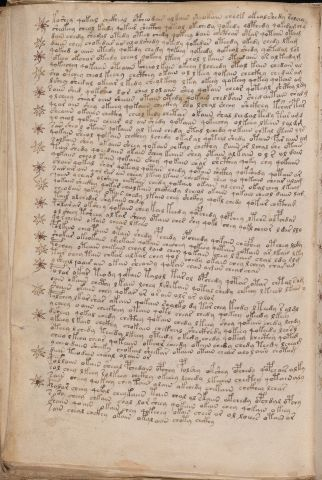

# Voynich Speculative Herbal Ferment Recipe — f111v

IMPORTANT: this is NOT a real or validated translation of the Voynich Manuscript. It is a speculative/procedural model that interprets EVA using a user-defined grammar to generate experimental recipes using safe, known edible substitutes.

This file is generated automatically from IVTFF/EVA transliteration plus a user-defined procedural grammar.

## Page / Folio
- currier: B
- folio: f111v
- page_number: 225
- plant_category_confidence: 0.0
- plant_category_guess: unknown

## Plant Interpretation (Heuristic)
- category: unknown
- confidence: 0.0
- note: Heuristic classification based on the IVTFF 'Plant ID' string (not the drawing). Does not imply real identification of the manuscript plant.

## EVA Text (Transliteration)
koshey qokal chckheal opcheodair alkain sheokain cheok okeal shedy ralchy
sheekeey cheol keedy qokair shecthy qokeol okechedy qokedy qopchedy qokedam chy
dain chedy shedal otedy otee[y:o] chedy qokeey dain chcthar otar qotain otaim
daiin chey chokedair air alo lshedy qotedy qokedar oteedy okedy chedy lkam
qokeed o aiin otedy qokedy chedy qokeey qokeedy qokeol shedy qotedal lol
okeeo okch[o:a]r oteedy cheal qokeey lkeey chol l kaiin oteedaiin as alkeedym
qokeechey qokaiin oteaiin fcheeo l kain okeey l lcheedy otal kain chedain al
sho otchey cheol kechy chcthey okain ol l keey qokain checkhy chedar am
lshey shedal okear l kedy cheolkeey lkey okeey qokeey qokey qokain am
soiin shed qoksheo lor cheo lol aiin shey qokain chear qoteol shcthy ldy
y lcheey shear aiin shee[a:o]r otain otedy qokain chedkain shedaitain shalg
qear ain shey okeeey qokaiin checkhy sho lchal sh[ee:ea]y shckhey kshartar
sheaiin okaiin shckhy cheol kedy chetar okaiin shal lchdal tedy tar amd
qocheol qokain chear ol oin shedy qotaiin qokeechy olkeey lkain lal [g:d]m
sar she[y:o] l otain qokaiin al kain chedy otal lchedy qokain chtal otain [?:l] l s
qokain sheol qokain shckhey lchedy okar al qotal shedy otain far aiin am
solkain shey okaiin sheey qokain chkal chckhy saiin ar lchal she otain
tai[s:r] shedy qoeedaiin okain c'hhey kaiin shey otain alkain o l r ol dain
qokaiin cheal tain qokain shey qokain char shcthey qoky chy qokaiin
shain qokal shar qoteal qotain chedy qotain shcthy qokshedy qotain ar
sair air ain qol rar ain cheey lkeey lkain cheokain sheo qo qokain chear alam
saiin ychear olsheey chetain chedy qokain okain al chan okalchey lkeeey
qokaiin sheckhy qokar chalkain chckhedy lcheol okaiin qokain cheol daiin lam
cheodain qokar otain chedy lkain chey shckhy qokl chedy qokar chctham
tair alchedar shykaiin chd[?:e][?:y]
polar ar okshey qokain chey kal keedy qopchedy qopchey ltchs alpchdar
ol sheey tsheey alkar sheey otain ches shy qokl chey qoklcheor ldar llo
qorchain okain chear lkain
polkiin cheopaiin otain shedy pchedy opcheedy qokain chcfhey otchey lldy
shokar okeokain sheekain qokain chechey qokeey qetain otain ar lkain lky
pochey oteain chekain cheal lain chey qokain chey lkain chal ldy llm
tar chey tain chkar alkar chey qol chedy okain chey l cheey charan
y sh[eei:ea]l [?:q]oair ain okan sheain y qokan chan aman cheal char
polar okar teody qokain talol tarol opchedy qotar otar chtal sam
oain okaiin chcthy lkain lchey lshekain qotal shedy chkeey lkeeed lkain y
shain okaiin chey qokar ar ar ain olr ar olor
polchey lkarshar ykain qokain shalky dy tor chey keedy lteedy r aldl
ycheey o aiin checkhey otain qotl chear chedy qokeey okeedy lkeey
dsheey qokal chedy chcthy qokain chedy lkeey shey qokain chedy lchdy
ykeeey lkain chckhy chokain chckhal sheckhedy qokeey qokeedy lchsl
oteey l chedy teeedy lkeey oteedy okedy chedy qokeey checthy qotal
cheeo l keey chear qokeain okeeor cheedy okain chedy chedy teedy lcheam
ycheo daiin sheeky chokeal sheekar okaiin otain chear alo laiin chota[g:m]
dain teeodain cheeal olaiin or
pollaiin okain sheal pchedain opchey polshy okshey opchedy qopchair alky
sol chey lkeey rolkeey chckhy okeeey lchedy lkeain checthy qotainaly
sain cheey qokeey cheytain olain ykeeedy chekain chckhey lchar
psalar cheey qekal cheykaiin tain chal al skaiin okchedy opchdal opchy
s[o:a]iry cheey chkain chal lor sheey qokain okain chey qokain o keey
shaiin qoiiin okain chey qokeeey okain chees ar ol loeees otain or
sain cheal chckhy okain okal aiin choty chckhy

## Page Summary (Procedural, Aggregated)
- compound_counts: {'sugars': 187, 'mix/transfer': 165, 'secondary herb': 73, 'liquid base': 94, 'main herb': 168, 'complex herbal compound': 30, 'yeast fermentation': 132, 'heat': 74, 'aroma modifier': 2, 'general base': 4}
- dose_level: 3
- fermentation_estimate: 7–14 days

## Pantry (Max Needed For Any Single Line-Recipe)
- aroma_modifier: ['lemon peel (optional)']
- aroma_modifier_dose: ['2–5 g (or 1 strip of peel, avoiding the bitter pith)']
- main_plant_dry_g: 15
- main_plant_substitute: ['chamomile (safe default substitute)']
- safe_complex_herbal_blend: ['gentle spices (e.g., 1 g cinnamon + 1 g clove) or a commercial herbal tea blend']
- secondary_herb_dry_g: 7
- secondary_herb_substitute: ['mint']
- sugar_or_honey_g: 75
- water_l: 0.5
- yeast_g: 1

## Line Recipes (Each Line = One Recipe, 0.5L batch)

### f111v.1,@P0

EVA: koshey qokal chckheal opcheodair alkain sheokain cheok okeal shedy ralchy

## Ingredients
- main_plant_dry_g: 5
- main_plant_substitute: chamomile (safe default substitute)
- safe_complex_herbal_blend: gentle spices (e.g., 1 g cinnamon + 1 g clove) or a commercial herbal tea blend
- secondary_herb_dry_g: 2
- secondary_herb_substitute: mint
- sugar_or_honey_g: 25
- water_l: 0.5
- yeast_g: 1

Process:
1. Sanitize the jar/fermenter and utensils.
2. Base: combine 0.5 L water with 25 g sugar or honey.
3. Infusion: use hot (not boiling) water, then let it cool before adding yeast.
4. Add main plant: chamomile (safe default substitute) (~5 g dried).
5. Add secondary herb: mint (~2 g dried).
6. If a complex herbal compound appears, use a safe commercial blend or gentle spices in micro-doses.
7. Pitch yeast: 1 g (ideally cider/beer yeast).
8. Ferment with an airlock: 2–4 days (guided by iin/aiin markers).
9. Strain/rack (if very solid-heavy) and cold-crash 24 h.
10. Bottle only when activity clearly slows; refrigerate. Avoid overpressure.

Expected Result: A mild, aromatic herbal ferment, low-to-medium intensity depending on dose level.

Does It Make Sense?: partial

Direct Gloss (Procedural, Not a Real Translation):
- koshey: add fermentable sugars → add secondary herb (safe substitute) → mix / transfer → duration level 1 → state: active extraction
- qokal: prepare liquid base → add fermentable sugars → duration level 1 → state: fermentation start
- chckheal: add main plant (safe substitute) → add complex herbal compound (safe blend) → duration level 1 → state: active extraction
- opcheodair: add main plant (safe substitute) → mix / transfer → start fermentation (yeast) → duration level 1 → state: active extraction
- alkain: add fermentable sugars → duration level 1 → state: fermentation start
- sheokain: add fermentable sugars → add secondary herb (safe substitute) → mix / transfer → duration level 1 → state: active extraction
- cheok: add fermentable sugars → add main plant (safe substitute) → mix / transfer → duration level 1 → state: active extraction
- okeal: add fermentable sugars → mix / transfer → duration level 1 → state: active extraction
- shedy: add secondary herb (safe substitute) → start fermentation (yeast) → duration level 1 → state: active extraction
- ralchy: add main plant (safe substitute) → duration level 1 → state: fermentation start

### f111v.2,+P0

EVA: sheekeey cheol keedy qokair shecthy qokeol okechedy qokedy qopchedy qokedam chy

## Ingredients
- main_plant_dry_g: 10
- main_plant_substitute: chamomile (safe default substitute)
- safe_complex_herbal_blend: gentle spices (e.g., 1 g cinnamon + 1 g clove) or a commercial herbal tea blend
- secondary_herb_dry_g: 5
- secondary_herb_substitute: mint
- sugar_or_honey_g: 50
- water_l: 0.5
- yeast_g: 1

Process:
1. Sanitize the jar/fermenter and utensils.
2. Base: combine 0.5 L water with 50 g sugar or honey.
3. Infusion: use hot (not boiling) water, then let it cool before adding yeast.
4. Add main plant: chamomile (safe default substitute) (~10 g dried).
5. Add secondary herb: mint (~5 g dried).
6. If a complex herbal compound appears, use a safe commercial blend or gentle spices in micro-doses.
7. Pitch yeast: 1 g (ideally cider/beer yeast).
8. Ferment with an airlock: 2–4 days (guided by iin/aiin markers).
9. Strain/rack (if very solid-heavy) and cold-crash 24 h.
10. Bottle only when activity clearly slows; refrigerate. Avoid overpressure.

Expected Result: A mild, aromatic herbal ferment, low-to-medium intensity depending on dose level.

Does It Make Sense?: partial

Direct Gloss (Procedural, Not a Real Translation):
- sheekeey: add fermentable sugars → add secondary herb (safe substitute) → duration level 2 → state: active extraction
- cheol: add main plant (safe substitute) → mix / transfer → duration level 1 → state: active extraction
- keedy: add fermentable sugars → start fermentation (yeast) → duration level 2 → state: active extraction
- qokair: prepare liquid base → add fermentable sugars → duration level 1 → state: fermentation start
- shecthy: add secondary herb (safe substitute) → add complex herbal compound (safe blend) → duration level 1 → state: active extraction
- qokeol: prepare liquid base → add fermentable sugars → mix / transfer → duration level 1 → state: active extraction
- okechedy: add fermentable sugars → add main plant (safe substitute) → mix / transfer → start fermentation (yeast) → duration level 1 → state: active extraction
- qokedy: prepare liquid base → add fermentable sugars → start fermentation (yeast) → duration level 1 → state: active extraction
- qopchedy: prepare liquid base → add main plant (safe substitute) → start fermentation (yeast) → duration level 1 → state: active extraction
- qokedam: prepare liquid base → add fermentable sugars → start fermentation (yeast) → duration level 1 → state: active extraction
- chy: add main plant (safe substitute)

### f111v.3,+P0

EVA: dain chedy shedal otedy otee[y:o] chedy qokeey dain chcthar otar qotain otaim

## Ingredients
- main_plant_dry_g: 10
- main_plant_substitute: chamomile (safe default substitute)
- safe_complex_herbal_blend: gentle spices (e.g., 1 g cinnamon + 1 g clove) or a commercial herbal tea blend
- secondary_herb_dry_g: 5
- secondary_herb_substitute: mint
- sugar_or_honey_g: 50
- water_l: 0.5
- yeast_g: 1

Process:
1. Sanitize the jar/fermenter and utensils.
2. Base: combine 0.5 L water with 50 g sugar or honey.
3. Apply gentle heat: simmer 10–15 min, then cool to <30°C before adding yeast.
4. Add main plant: chamomile (safe default substitute) (~10 g dried).
5. Add secondary herb: mint (~5 g dried).
6. If a complex herbal compound appears, use a safe commercial blend or gentle spices in micro-doses.
7. Pitch yeast: 1 g (ideally cider/beer yeast).
8. Ferment with an airlock: 2–4 days (guided by iin/aiin markers).
9. Strain/rack (if very solid-heavy) and cold-crash 24 h.
10. Bottle only when activity clearly slows; refrigerate. Avoid overpressure.

Expected Result: A mild, aromatic herbal ferment, low-to-medium intensity depending on dose level.

Does It Make Sense?: partial

Direct Gloss (Procedural, Not a Real Translation):
- dain: start fermentation (yeast) → duration level 1 → state: fermentation start
- chedy: add main plant (safe substitute) → start fermentation (yeast) → duration level 1 → state: active extraction
- shedal: add secondary herb (safe substitute) → start fermentation (yeast) → duration level 1 → state: active extraction
- otedy: apply heat/cooking → mix / transfer → start fermentation (yeast) → duration level 1 → state: active extraction
- otee: apply heat/cooking → mix / transfer → duration level 2 → state: active extraction
- y: [unparsed]
- o: mix / transfer
- chedy: add main plant (safe substitute) → start fermentation (yeast) → duration level 1 → state: active extraction
- qokeey: prepare liquid base → add fermentable sugars → duration level 2 → state: active extraction
- dain: start fermentation (yeast) → duration level 1 → state: fermentation start
- chcthar: add main plant (safe substitute) → add complex herbal compound (safe blend) → duration level 1 → state: fermentation start
- otar: apply heat/cooking → mix / transfer → duration level 1 → state: fermentation start
- qotain: prepare liquid base → apply heat/cooking → duration level 1 → state: fermentation start
- otaim: apply heat/cooking → mix / transfer → duration level 1 → state: fermentation start

### f111v.4,+P0

EVA: daiin chey chokedair air alo lshedy qotedy qokedar oteedy okedy chedy lkam

## Ingredients
- main_plant_dry_g: 10
- main_plant_substitute: chamomile (safe default substitute)
- secondary_herb_dry_g: 5
- secondary_herb_substitute: mint
- sugar_or_honey_g: 50
- water_l: 0.5
- yeast_g: 1

Process:
1. Sanitize the jar/fermenter and utensils.
2. Base: combine 0.5 L water with 50 g sugar or honey.
3. Apply gentle heat: simmer 10–15 min, then cool to <30°C before adding yeast.
4. Add main plant: chamomile (safe default substitute) (~10 g dried).
5. Add secondary herb: mint (~5 g dried).
6. Pitch yeast: 1 g (ideally cider/beer yeast).
7. Ferment with an airlock: 7–14 days (guided by iin/aiin markers).
8. Strain/rack (if very solid-heavy) and cold-crash 24 h.
9. Bottle only when activity clearly slows; refrigerate. Avoid overpressure.

Expected Result: A mild, aromatic herbal ferment, low-to-medium intensity depending on dose level.

Does It Make Sense?: partial

Direct Gloss (Procedural, Not a Real Translation):
- daiin: start fermentation (yeast) → duration level 1 → state: fermentation start → long fermentation / aging phase
- chey: add main plant (safe substitute) → duration level 1 → state: active extraction
- chokedair: add fermentable sugars → add main plant (safe substitute) → mix / transfer → start fermentation (yeast) → duration level 1 → state: active extraction
- air: duration level 1 → state: fermentation start
- alo: mix / transfer → duration level 1 → state: fermentation start
- lshedy: add secondary herb (safe substitute) → start fermentation (yeast) → duration level 1 → state: active extraction
- qotedy: prepare liquid base → apply heat/cooking → start fermentation (yeast) → duration level 1 → state: active extraction
- qokedar: prepare liquid base → add fermentable sugars → start fermentation (yeast) → duration level 1 → state: active extraction
- oteedy: apply heat/cooking → mix / transfer → start fermentation (yeast) → duration level 2 → state: active extraction
- okedy: add fermentable sugars → mix / transfer → start fermentation (yeast) → duration level 1 → state: active extraction
- chedy: add main plant (safe substitute) → start fermentation (yeast) → duration level 1 → state: active extraction
- lkam: add fermentable sugars → duration level 1 → state: fermentation start

### f111v.5,+P0

EVA: qokeed o aiin otedy qokedy chedy qokeey qokeedy qokeol shedy qotedal lol

## Ingredients
- main_plant_dry_g: 10
- main_plant_substitute: chamomile (safe default substitute)
- secondary_herb_dry_g: 5
- secondary_herb_substitute: mint
- sugar_or_honey_g: 50
- water_l: 0.5
- yeast_g: 1

Process:
1. Sanitize the jar/fermenter and utensils.
2. Base: combine 0.5 L water with 50 g sugar or honey.
3. Apply gentle heat: simmer 10–15 min, then cool to <30°C before adding yeast.
4. Add main plant: chamomile (safe default substitute) (~10 g dried).
5. Add secondary herb: mint (~5 g dried).
6. Pitch yeast: 1 g (ideally cider/beer yeast).
7. Ferment with an airlock: 7–14 days (guided by iin/aiin markers).
8. Strain/rack (if very solid-heavy) and cold-crash 24 h.
9. Bottle only when activity clearly slows; refrigerate. Avoid overpressure.

Expected Result: A mild, aromatic herbal ferment, low-to-medium intensity depending on dose level.

Does It Make Sense?: partial

Direct Gloss (Procedural, Not a Real Translation):
- qokeed: prepare liquid base → add fermentable sugars → start fermentation (yeast) → duration level 2 → state: active extraction
- o: mix / transfer
- aiin: duration level 1 → state: fermentation start → long fermentation / aging phase
- otedy: apply heat/cooking → mix / transfer → start fermentation (yeast) → duration level 1 → state: active extraction
- qokedy: prepare liquid base → add fermentable sugars → start fermentation (yeast) → duration level 1 → state: active extraction
- chedy: add main plant (safe substitute) → start fermentation (yeast) → duration level 1 → state: active extraction
- qokeey: prepare liquid base → add fermentable sugars → duration level 2 → state: active extraction
- qokeedy: prepare liquid base → add fermentable sugars → start fermentation (yeast) → duration level 2 → state: active extraction
- qokeol: prepare liquid base → add fermentable sugars → mix / transfer → duration level 1 → state: active extraction
- shedy: add secondary herb (safe substitute) → start fermentation (yeast) → duration level 1 → state: active extraction
- qotedal: prepare liquid base → apply heat/cooking → start fermentation (yeast) → duration level 1 → state: active extraction
- lol: mix / transfer

### f111v.6,+P0

EVA: okeeo okch[o:a]r oteedy cheal qokeey lkeey chol l kaiin oteedaiin as alkeedym

## Ingredients
- main_plant_dry_g: 10
- main_plant_substitute: chamomile (safe default substitute)
- secondary_herb_dry_g: 2
- secondary_herb_substitute: mint
- sugar_or_honey_g: 50
- water_l: 0.5
- yeast_g: 1

Process:
1. Sanitize the jar/fermenter and utensils.
2. Base: combine 0.5 L water with 50 g sugar or honey.
3. Apply gentle heat: simmer 10–15 min, then cool to <30°C before adding yeast.
4. Add main plant: chamomile (safe default substitute) (~10 g dried).
5. Add secondary herb: mint (~2 g dried).
6. Pitch yeast: 1 g (ideally cider/beer yeast).
7. Ferment with an airlock: 7–14 days (guided by iin/aiin markers).
8. Strain/rack (if very solid-heavy) and cold-crash 24 h.
9. Bottle only when activity clearly slows; refrigerate. Avoid overpressure.

Expected Result: A mild, aromatic herbal ferment, low-to-medium intensity depending on dose level.

Does It Make Sense?: partial

Direct Gloss (Procedural, Not a Real Translation):
- okeeo: add fermentable sugars → mix / transfer → duration level 2 → state: active extraction
- okch: add fermentable sugars → add main plant (safe substitute) → mix / transfer
- o: mix / transfer
- a: duration level 1 → state: fermentation start
- r: [unparsed]
- oteedy: apply heat/cooking → mix / transfer → start fermentation (yeast) → duration level 2 → state: active extraction
- cheal: add main plant (safe substitute) → duration level 1 → state: active extraction
- qokeey: prepare liquid base → add fermentable sugars → duration level 2 → state: active extraction
- lkeey: add fermentable sugars → duration level 2 → state: active extraction
- chol: add main plant (safe substitute) → mix / transfer
- l: [unparsed]
- kaiin: add fermentable sugars → duration level 1 → state: fermentation start → long fermentation / aging phase
- oteedaiin: apply heat/cooking → mix / transfer → start fermentation (yeast) → duration level 2 → state: active extraction → long fermentation / aging phase
- as: duration level 1 → state: fermentation start
- alkeedym: add fermentable sugars → start fermentation (yeast) → duration level 1 → state: fermentation start

### f111v.7,+P0

EVA: qokeechey qokaiin oteaiin fcheeo l kain okeey l lcheedy otal kain chedain al

## Ingredients
- aroma_modifier: lemon peel (optional)
- aroma_modifier_dose: 2–5 g (or 1 strip of peel, avoiding the bitter pith)
- main_plant_dry_g: 10
- main_plant_substitute: chamomile (safe default substitute)
- secondary_herb_dry_g: 2
- secondary_herb_substitute: mint
- sugar_or_honey_g: 50
- water_l: 0.5
- yeast_g: 1

Process:
1. Sanitize the jar/fermenter and utensils.
2. Base: combine 0.5 L water with 50 g sugar or honey.
3. Apply gentle heat: simmer 10–15 min, then cool to <30°C before adding yeast.
4. Add main plant: chamomile (safe default substitute) (~10 g dried).
5. Add secondary herb: mint (~2 g dried).
6. Add aroma modifier (optional) in a low dose.
7. Pitch yeast: 1 g (ideally cider/beer yeast).
8. Ferment with an airlock: 7–14 days (guided by iin/aiin markers).
9. Strain/rack (if very solid-heavy) and cold-crash 24 h.
10. Bottle only when activity clearly slows; refrigerate. Avoid overpressure.

Expected Result: A mild, aromatic herbal ferment, low-to-medium intensity depending on dose level.

Does It Make Sense?: partial

Direct Gloss (Procedural, Not a Real Translation):
- qokeechey: prepare liquid base → add fermentable sugars → add main plant (safe substitute) → duration level 2 → state: active extraction
- qokaiin: prepare liquid base → add fermentable sugars → duration level 1 → state: fermentation start → long fermentation / aging phase
- oteaiin: apply heat/cooking → mix / transfer → duration level 1 → state: active extraction → long fermentation / aging phase
- fcheeo: add main plant (safe substitute) → add aroma modifier → mix / transfer → duration level 2 → state: active extraction
- l: [unparsed]
- kain: add fermentable sugars → duration level 1 → state: fermentation start
- okeey: add fermentable sugars → mix / transfer → duration level 2 → state: active extraction
- l: [unparsed]
- lcheedy: add main plant (safe substitute) → start fermentation (yeast) → duration level 2 → state: active extraction
- otal: apply heat/cooking → mix / transfer → duration level 1 → state: fermentation start
- kain: add fermentable sugars → duration level 1 → state: fermentation start
- chedain: add main plant (safe substitute) → start fermentation (yeast) → duration level 1 → state: active extraction
- al: duration level 1 → state: fermentation start

### f111v.8,+P0

EVA: sho otchey cheol kechy chcthey okain ol l keey qokain checkhy chedar am

## Ingredients
- main_plant_dry_g: 10
- main_plant_substitute: chamomile (safe default substitute)
- safe_complex_herbal_blend: gentle spices (e.g., 1 g cinnamon + 1 g clove) or a commercial herbal tea blend
- secondary_herb_dry_g: 5
- secondary_herb_substitute: mint
- sugar_or_honey_g: 50
- water_l: 0.5
- yeast_g: 1

Process:
1. Sanitize the jar/fermenter and utensils.
2. Base: combine 0.5 L water with 50 g sugar or honey.
3. Apply gentle heat: simmer 10–15 min, then cool to <30°C before adding yeast.
4. Add main plant: chamomile (safe default substitute) (~10 g dried).
5. Add secondary herb: mint (~5 g dried).
6. If a complex herbal compound appears, use a safe commercial blend or gentle spices in micro-doses.
7. Pitch yeast: 1 g (ideally cider/beer yeast).
8. Ferment with an airlock: 2–4 days (guided by iin/aiin markers).
9. Strain/rack (if very solid-heavy) and cold-crash 24 h.
10. Bottle only when activity clearly slows; refrigerate. Avoid overpressure.

Expected Result: A mild, aromatic herbal ferment, low-to-medium intensity depending on dose level.

Does It Make Sense?: partial

Direct Gloss (Procedural, Not a Real Translation):
- sho: add secondary herb (safe substitute) → mix / transfer
- otchey: apply heat/cooking → add main plant (safe substitute) → mix / transfer → duration level 1 → state: active extraction
- cheol: add main plant (safe substitute) → mix / transfer → duration level 1 → state: active extraction
- kechy: add fermentable sugars → add main plant (safe substitute) → duration level 1 → state: active extraction
- chcthey: add main plant (safe substitute) → add complex herbal compound (safe blend) → duration level 1 → state: active extraction
- okain: add fermentable sugars → mix / transfer → duration level 1 → state: fermentation start
- ol: mix / transfer
- l: [unparsed]
- keey: add fermentable sugars → duration level 2 → state: active extraction
- qokain: prepare liquid base → add fermentable sugars → duration level 1 → state: fermentation start
- checkhy: add main plant (safe substitute) → add complex herbal compound (safe blend) → duration level 1 → state: active extraction
- chedar: add main plant (safe substitute) → start fermentation (yeast) → duration level 1 → state: active extraction
- am: duration level 1 → state: fermentation start

### f111v.9,+P0

EVA: lshey shedal okear l kedy cheolkeey lkey okeey qokeey qokey qokain am

## Ingredients
- main_plant_dry_g: 10
- main_plant_substitute: chamomile (safe default substitute)
- secondary_herb_dry_g: 5
- secondary_herb_substitute: mint
- sugar_or_honey_g: 50
- water_l: 0.5
- yeast_g: 1

Process:
1. Sanitize the jar/fermenter and utensils.
2. Base: combine 0.5 L water with 50 g sugar or honey.
3. Infusion: use hot (not boiling) water, then let it cool before adding yeast.
4. Add main plant: chamomile (safe default substitute) (~10 g dried).
5. Add secondary herb: mint (~5 g dried).
6. Pitch yeast: 1 g (ideally cider/beer yeast).
7. Ferment with an airlock: 2–4 days (guided by iin/aiin markers).
8. Strain/rack (if very solid-heavy) and cold-crash 24 h.
9. Bottle only when activity clearly slows; refrigerate. Avoid overpressure.

Expected Result: A mild, aromatic herbal ferment, low-to-medium intensity depending on dose level.

Does It Make Sense?: partial

Direct Gloss (Procedural, Not a Real Translation):
- lshey: add secondary herb (safe substitute) → duration level 1 → state: active extraction
- shedal: add secondary herb (safe substitute) → start fermentation (yeast) → duration level 1 → state: active extraction
- okear: add fermentable sugars → mix / transfer → duration level 1 → state: active extraction
- l: [unparsed]
- kedy: add fermentable sugars → start fermentation (yeast) → duration level 1 → state: active extraction
- cheolkeey: add fermentable sugars → add main plant (safe substitute) → mix / transfer → duration level 1 → state: active extraction
- lkey: add fermentable sugars → duration level 1 → state: active extraction
- okeey: add fermentable sugars → mix / transfer → duration level 2 → state: active extraction
- qokeey: prepare liquid base → add fermentable sugars → duration level 2 → state: active extraction
- qokey: prepare liquid base → add fermentable sugars → duration level 1 → state: active extraction
- qokain: prepare liquid base → add fermentable sugars → duration level 1 → state: fermentation start
- am: duration level 1 → state: fermentation start

### f111v.10,+P0

EVA: soiin shed qoksheo lor cheo lol aiin shey qokain chear qoteol shcthy ldy

## Ingredients
- main_plant_dry_g: 10
- main_plant_substitute: chamomile (safe default substitute)
- safe_complex_herbal_blend: gentle spices (e.g., 1 g cinnamon + 1 g clove) or a commercial herbal tea blend
- secondary_herb_dry_g: 5
- secondary_herb_substitute: mint
- sugar_or_honey_g: 50
- water_l: 0.5
- yeast_g: 1

Process:
1. Sanitize the jar/fermenter and utensils.
2. Base: combine 0.5 L water with 50 g sugar or honey.
3. Apply gentle heat: simmer 10–15 min, then cool to <30°C before adding yeast.
4. Add main plant: chamomile (safe default substitute) (~10 g dried).
5. Add secondary herb: mint (~5 g dried).
6. If a complex herbal compound appears, use a safe commercial blend or gentle spices in micro-doses.
7. Pitch yeast: 1 g (ideally cider/beer yeast).
8. Ferment with an airlock: 7–14 days (guided by iin/aiin markers).
9. Strain/rack (if very solid-heavy) and cold-crash 24 h.
10. Bottle only when activity clearly slows; refrigerate. Avoid overpressure.

Expected Result: A mild, aromatic herbal ferment, low-to-medium intensity depending on dose level.

Does It Make Sense?: partial

Direct Gloss (Procedural, Not a Real Translation):
- soiin: mix / transfer → duration level 2 → state: cooling/rest → medium fermentation phase
- shed: add secondary herb (safe substitute) → start fermentation (yeast) → duration level 1 → state: active extraction
- qoksheo: prepare liquid base → add fermentable sugars → add secondary herb (safe substitute) → mix / transfer → duration level 1 → state: active extraction
- lor: mix / transfer
- cheo: add main plant (safe substitute) → mix / transfer → duration level 1 → state: active extraction
- lol: mix / transfer
- aiin: duration level 1 → state: fermentation start → long fermentation / aging phase
- shey: add secondary herb (safe substitute) → duration level 1 → state: active extraction
- qokain: prepare liquid base → add fermentable sugars → duration level 1 → state: fermentation start
- chear: add main plant (safe substitute) → duration level 1 → state: active extraction
- qoteol: prepare liquid base → apply heat/cooking → mix / transfer → duration level 1 → state: active extraction
- shcthy: add secondary herb (safe substitute) → add complex herbal compound (safe blend)
- ldy: start fermentation (yeast)

### f111v.11,+P0

EVA: y lcheey shear aiin shee[a:o]r otain otedy qokain chedkain shedaitain shalg

## Ingredients
- main_plant_dry_g: 10
- main_plant_substitute: chamomile (safe default substitute)
- secondary_herb_dry_g: 5
- secondary_herb_substitute: mint
- sugar_or_honey_g: 50
- water_l: 0.5
- yeast_g: 1

Process:
1. Sanitize the jar/fermenter and utensils.
2. Base: combine 0.5 L water with 50 g sugar or honey.
3. Apply gentle heat: simmer 10–15 min, then cool to <30°C before adding yeast.
4. Add main plant: chamomile (safe default substitute) (~10 g dried).
5. Add secondary herb: mint (~5 g dried).
6. Pitch yeast: 1 g (ideally cider/beer yeast).
7. Ferment with an airlock: 7–14 days (guided by iin/aiin markers).
8. Strain/rack (if very solid-heavy) and cold-crash 24 h.
9. Bottle only when activity clearly slows; refrigerate. Avoid overpressure.

Expected Result: A mild, aromatic herbal ferment, low-to-medium intensity depending on dose level.

Does It Make Sense?: partial

Direct Gloss (Procedural, Not a Real Translation):
- y: [unparsed]
- lcheey: add main plant (safe substitute) → duration level 2 → state: active extraction
- shear: add secondary herb (safe substitute) → duration level 1 → state: active extraction
- aiin: duration level 1 → state: fermentation start → long fermentation / aging phase
- shee: add secondary herb (safe substitute) → duration level 2 → state: active extraction
- a: duration level 1 → state: fermentation start
- o: mix / transfer
- r: [unparsed]
- otain: apply heat/cooking → mix / transfer → duration level 1 → state: fermentation start
- otedy: apply heat/cooking → mix / transfer → start fermentation (yeast) → duration level 1 → state: active extraction
- qokain: prepare liquid base → add fermentable sugars → duration level 1 → state: fermentation start
- chedkain: add fermentable sugars → add main plant (safe substitute) → start fermentation (yeast) → duration level 1 → state: active extraction
- shedaitain: apply heat/cooking → add secondary herb (safe substitute) → start fermentation (yeast) → duration level 1 → state: active extraction
- shalg: add secondary herb (safe substitute) → duration level 1 → state: fermentation start

### f111v.12,+P0

EVA: qear ain shey okeeey qokaiin checkhy sho lchal sh[ee:ea]y shckhey kshartar

## Ingredients
- main_plant_dry_g: 15
- main_plant_substitute: chamomile (safe default substitute)
- safe_complex_herbal_blend: gentle spices (e.g., 1 g cinnamon + 1 g clove) or a commercial herbal tea blend
- secondary_herb_dry_g: 7
- secondary_herb_substitute: mint
- sugar_or_honey_g: 75
- water_l: 0.5
- yeast_g: 1

Process:
1. Sanitize the jar/fermenter and utensils.
2. Base: combine 0.5 L water with 75 g sugar or honey.
3. Apply gentle heat: simmer 10–15 min, then cool to <30°C before adding yeast.
4. Add main plant: chamomile (safe default substitute) (~15 g dried).
5. Add secondary herb: mint (~7 g dried).
6. If a complex herbal compound appears, use a safe commercial blend or gentle spices in micro-doses.
7. Pitch yeast: 1 g (ideally cider/beer yeast).
8. Ferment with an airlock: 7–14 days (guided by iin/aiin markers).
9. Strain/rack (if very solid-heavy) and cold-crash 24 h.
10. Bottle only when activity clearly slows; refrigerate. Avoid overpressure.

Expected Result: A mild, aromatic herbal ferment, low-to-medium intensity depending on dose level.

Does It Make Sense?: partial

Direct Gloss (Procedural, Not a Real Translation):
- qear: prepare base (generic) → duration level 1 → state: active extraction
- ain: duration level 1 → state: fermentation start
- shey: add secondary herb (safe substitute) → duration level 1 → state: active extraction
- okeeey: add fermentable sugars → mix / transfer → duration level 3 → state: active extraction
- qokaiin: prepare liquid base → add fermentable sugars → duration level 1 → state: fermentation start → long fermentation / aging phase
- checkhy: add main plant (safe substitute) → add complex herbal compound (safe blend) → duration level 1 → state: active extraction
- sho: add secondary herb (safe substitute) → mix / transfer
- lchal: add main plant (safe substitute) → duration level 1 → state: fermentation start
- sh: add secondary herb (safe substitute)
- ee: duration level 2 → state: active extraction
- ea: duration level 1 → state: active extraction
- y: [unparsed]
- shckhey: add secondary herb (safe substitute) → add complex herbal compound (safe blend) → duration level 1 → state: active extraction
- kshartar: add fermentable sugars → apply heat/cooking → add secondary herb (safe substitute) → duration level 1 → state: fermentation start

### f111v.13,+P0

EVA: sheaiin okaiin shckhy cheol kedy chetar okaiin shal lchdal tedy tar amd

## Ingredients
- main_plant_dry_g: 5
- main_plant_substitute: chamomile (safe default substitute)
- safe_complex_herbal_blend: gentle spices (e.g., 1 g cinnamon + 1 g clove) or a commercial herbal tea blend
- secondary_herb_dry_g: 2
- secondary_herb_substitute: mint
- sugar_or_honey_g: 25
- water_l: 0.5
- yeast_g: 1

Process:
1. Sanitize the jar/fermenter and utensils.
2. Base: combine 0.5 L water with 25 g sugar or honey.
3. Apply gentle heat: simmer 10–15 min, then cool to <30°C before adding yeast.
4. Add main plant: chamomile (safe default substitute) (~5 g dried).
5. Add secondary herb: mint (~2 g dried).
6. If a complex herbal compound appears, use a safe commercial blend or gentle spices in micro-doses.
7. Pitch yeast: 1 g (ideally cider/beer yeast).
8. Ferment with an airlock: 7–14 days (guided by iin/aiin markers).
9. Strain/rack (if very solid-heavy) and cold-crash 24 h.
10. Bottle only when activity clearly slows; refrigerate. Avoid overpressure.

Expected Result: A mild, aromatic herbal ferment, low-to-medium intensity depending on dose level.

Does It Make Sense?: partial

Direct Gloss (Procedural, Not a Real Translation):
- sheaiin: add secondary herb (safe substitute) → duration level 1 → state: active extraction → long fermentation / aging phase
- okaiin: add fermentable sugars → mix / transfer → duration level 1 → state: fermentation start → long fermentation / aging phase
- shckhy: add secondary herb (safe substitute) → add complex herbal compound (safe blend)
- cheol: add main plant (safe substitute) → mix / transfer → duration level 1 → state: active extraction
- kedy: add fermentable sugars → start fermentation (yeast) → duration level 1 → state: active extraction
- chetar: apply heat/cooking → add main plant (safe substitute) → duration level 1 → state: active extraction
- okaiin: add fermentable sugars → mix / transfer → duration level 1 → state: fermentation start → long fermentation / aging phase
- shal: add secondary herb (safe substitute) → duration level 1 → state: fermentation start
- lchdal: add main plant (safe substitute) → start fermentation (yeast) → duration level 1 → state: fermentation start
- tedy: apply heat/cooking → start fermentation (yeast) → duration level 1 → state: active extraction
- tar: apply heat/cooking → duration level 1 → state: fermentation start
- amd: start fermentation (yeast) → duration level 1 → state: fermentation start

### f111v.14,+P0

EVA: qocheol qokain chear ol oin shedy qotaiin qokeechy olkeey lkain lal [g:d]m

## Ingredients
- main_plant_dry_g: 10
- main_plant_substitute: chamomile (safe default substitute)
- secondary_herb_dry_g: 5
- secondary_herb_substitute: mint
- sugar_or_honey_g: 50
- water_l: 0.5
- yeast_g: 1

Process:
1. Sanitize the jar/fermenter and utensils.
2. Base: combine 0.5 L water with 50 g sugar or honey.
3. Apply gentle heat: simmer 10–15 min, then cool to <30°C before adding yeast.
4. Add main plant: chamomile (safe default substitute) (~10 g dried).
5. Add secondary herb: mint (~5 g dried).
6. Pitch yeast: 1 g (ideally cider/beer yeast).
7. Ferment with an airlock: 7–14 days (guided by iin/aiin markers).
8. Strain/rack (if very solid-heavy) and cold-crash 24 h.
9. Bottle only when activity clearly slows; refrigerate. Avoid overpressure.

Expected Result: A mild, aromatic herbal ferment, low-to-medium intensity depending on dose level.

Does It Make Sense?: partial

Direct Gloss (Procedural, Not a Real Translation):
- qocheol: prepare liquid base → add main plant (safe substitute) → mix / transfer → duration level 1 → state: active extraction
- qokain: prepare liquid base → add fermentable sugars → duration level 1 → state: fermentation start
- chear: add main plant (safe substitute) → duration level 1 → state: active extraction
- ol: mix / transfer
- oin: mix / transfer → duration level 1 → state: cooling/rest
- shedy: add secondary herb (safe substitute) → start fermentation (yeast) → duration level 1 → state: active extraction
- qotaiin: prepare liquid base → apply heat/cooking → duration level 1 → state: fermentation start → long fermentation / aging phase
- qokeechy: prepare liquid base → add fermentable sugars → add main plant (safe substitute) → duration level 2 → state: active extraction
- olkeey: add fermentable sugars → mix / transfer → duration level 2 → state: active extraction
- lkain: add fermentable sugars → duration level 1 → state: fermentation start
- lal: duration level 1 → state: fermentation start
- g: [unparsed]
- d: start fermentation (yeast)
- m: [unparsed]

### f111v.15,+P0

EVA: sar she[y:o] l otain qokaiin al kain chedy otal lchedy qokain chtal otain [?:l] l s

## Ingredients
- main_plant_dry_g: 5
- main_plant_substitute: chamomile (safe default substitute)
- secondary_herb_dry_g: 2
- secondary_herb_substitute: mint
- sugar_or_honey_g: 25
- water_l: 0.5
- yeast_g: 1

Process:
1. Sanitize the jar/fermenter and utensils.
2. Base: combine 0.5 L water with 25 g sugar or honey.
3. Apply gentle heat: simmer 10–15 min, then cool to <30°C before adding yeast.
4. Add main plant: chamomile (safe default substitute) (~5 g dried).
5. Add secondary herb: mint (~2 g dried).
6. Pitch yeast: 1 g (ideally cider/beer yeast).
7. Ferment with an airlock: 7–14 days (guided by iin/aiin markers).
8. Strain/rack (if very solid-heavy) and cold-crash 24 h.
9. Bottle only when activity clearly slows; refrigerate. Avoid overpressure.

Expected Result: A mild, aromatic herbal ferment, low-to-medium intensity depending on dose level.

Does It Make Sense?: partial

Direct Gloss (Procedural, Not a Real Translation):
- sar: duration level 1 → state: fermentation start
- she: add secondary herb (safe substitute) → duration level 1 → state: active extraction
- y: [unparsed]
- o: mix / transfer
- l: [unparsed]
- otain: apply heat/cooking → mix / transfer → duration level 1 → state: fermentation start
- qokaiin: prepare liquid base → add fermentable sugars → duration level 1 → state: fermentation start → long fermentation / aging phase
- al: duration level 1 → state: fermentation start
- kain: add fermentable sugars → duration level 1 → state: fermentation start
- chedy: add main plant (safe substitute) → start fermentation (yeast) → duration level 1 → state: active extraction
- otal: apply heat/cooking → mix / transfer → duration level 1 → state: fermentation start
- lchedy: add main plant (safe substitute) → start fermentation (yeast) → duration level 1 → state: active extraction
- qokain: prepare liquid base → add fermentable sugars → duration level 1 → state: fermentation start
- chtal: apply heat/cooking → add main plant (safe substitute) → duration level 1 → state: fermentation start
- otain: apply heat/cooking → mix / transfer → duration level 1 → state: fermentation start
- l: [unparsed]
- l: [unparsed]
- s: [unparsed]

### f111v.16,+P0

EVA: qokain sheol qokain shckhey lchedy okar al qotal shedy otain far aiin am

## Ingredients
- aroma_modifier: lemon peel (optional)
- aroma_modifier_dose: 2–5 g (or 1 strip of peel, avoiding the bitter pith)
- main_plant_dry_g: 5
- main_plant_substitute: chamomile (safe default substitute)
- safe_complex_herbal_blend: gentle spices (e.g., 1 g cinnamon + 1 g clove) or a commercial herbal tea blend
- secondary_herb_dry_g: 2
- secondary_herb_substitute: mint
- sugar_or_honey_g: 25
- water_l: 0.5
- yeast_g: 1

Process:
1. Sanitize the jar/fermenter and utensils.
2. Base: combine 0.5 L water with 25 g sugar or honey.
3. Apply gentle heat: simmer 10–15 min, then cool to <30°C before adding yeast.
4. Add main plant: chamomile (safe default substitute) (~5 g dried).
5. Add secondary herb: mint (~2 g dried).
6. Add aroma modifier (optional) in a low dose.
7. If a complex herbal compound appears, use a safe commercial blend or gentle spices in micro-doses.
8. Pitch yeast: 1 g (ideally cider/beer yeast).
9. Ferment with an airlock: 7–14 days (guided by iin/aiin markers).
10. Strain/rack (if very solid-heavy) and cold-crash 24 h.
11. Bottle only when activity clearly slows; refrigerate. Avoid overpressure.

Expected Result: A mild, aromatic herbal ferment, low-to-medium intensity depending on dose level.

Does It Make Sense?: partial

Direct Gloss (Procedural, Not a Real Translation):
- qokain: prepare liquid base → add fermentable sugars → duration level 1 → state: fermentation start
- sheol: add secondary herb (safe substitute) → mix / transfer → duration level 1 → state: active extraction
- qokain: prepare liquid base → add fermentable sugars → duration level 1 → state: fermentation start
- shckhey: add secondary herb (safe substitute) → add complex herbal compound (safe blend) → duration level 1 → state: active extraction
- lchedy: add main plant (safe substitute) → start fermentation (yeast) → duration level 1 → state: active extraction
- okar: add fermentable sugars → mix / transfer → duration level 1 → state: fermentation start
- al: duration level 1 → state: fermentation start
- qotal: prepare liquid base → apply heat/cooking → duration level 1 → state: fermentation start
- shedy: add secondary herb (safe substitute) → start fermentation (yeast) → duration level 1 → state: active extraction
- otain: apply heat/cooking → mix / transfer → duration level 1 → state: fermentation start
- far: add aroma modifier → duration level 1 → state: fermentation start
- aiin: duration level 1 → state: fermentation start → long fermentation / aging phase
- am: duration level 1 → state: fermentation start

### f111v.17,+P0

EVA: solkain shey okaiin sheey qokain chkal chckhy saiin ar lchal she otain

## Ingredients
- main_plant_dry_g: 10
- main_plant_substitute: chamomile (safe default substitute)
- safe_complex_herbal_blend: gentle spices (e.g., 1 g cinnamon + 1 g clove) or a commercial herbal tea blend
- secondary_herb_dry_g: 5
- secondary_herb_substitute: mint
- sugar_or_honey_g: 50
- water_l: 0.5
- yeast_g: 1

Process:
1. Sanitize the jar/fermenter and utensils.
2. Base: combine 0.5 L water with 50 g sugar or honey.
3. Apply gentle heat: simmer 10–15 min, then cool to <30°C before adding yeast.
4. Add main plant: chamomile (safe default substitute) (~10 g dried).
5. Add secondary herb: mint (~5 g dried).
6. If a complex herbal compound appears, use a safe commercial blend or gentle spices in micro-doses.
7. Pitch yeast: 1 g (ideally cider/beer yeast).
8. Ferment with an airlock: 7–14 days (guided by iin/aiin markers).
9. Strain/rack (if very solid-heavy) and cold-crash 24 h.
10. Bottle only when activity clearly slows; refrigerate. Avoid overpressure.

Expected Result: A mild, aromatic herbal ferment, low-to-medium intensity depending on dose level.

Does It Make Sense?: partial

Direct Gloss (Procedural, Not a Real Translation):
- solkain: add fermentable sugars → mix / transfer → duration level 1 → state: fermentation start
- shey: add secondary herb (safe substitute) → duration level 1 → state: active extraction
- okaiin: add fermentable sugars → mix / transfer → duration level 1 → state: fermentation start → long fermentation / aging phase
- sheey: add secondary herb (safe substitute) → duration level 2 → state: active extraction
- qokain: prepare liquid base → add fermentable sugars → duration level 1 → state: fermentation start
- chkal: add fermentable sugars → add main plant (safe substitute) → duration level 1 → state: fermentation start
- chckhy: add main plant (safe substitute) → add complex herbal compound (safe blend)
- saiin: duration level 1 → state: fermentation start → long fermentation / aging phase
- ar: duration level 1 → state: fermentation start
- lchal: add main plant (safe substitute) → duration level 1 → state: fermentation start
- she: add secondary herb (safe substitute) → duration level 1 → state: active extraction
- otain: apply heat/cooking → mix / transfer → duration level 1 → state: fermentation start

### f111v.18,+P0

EVA: tai[s:r] shedy qoeedaiin okain c'hhey kaiin shey otain alkain o l r ol dain

## Ingredients
- main_plant_dry_g: 5
- main_plant_substitute: chamomile (safe default substitute)
- secondary_herb_dry_g: 5
- secondary_herb_substitute: mint
- sugar_or_honey_g: 50
- water_l: 0.5
- yeast_g: 1

Process:
1. Sanitize the jar/fermenter and utensils.
2. Base: combine 0.5 L water with 50 g sugar or honey.
3. Apply gentle heat: simmer 10–15 min, then cool to <30°C before adding yeast.
4. Add main plant: chamomile (safe default substitute) (~5 g dried).
5. Add secondary herb: mint (~5 g dried).
6. Pitch yeast: 1 g (ideally cider/beer yeast).
7. Ferment with an airlock: 7–14 days (guided by iin/aiin markers).
8. Strain/rack (if very solid-heavy) and cold-crash 24 h.
9. Bottle only when activity clearly slows; refrigerate. Avoid overpressure.

Expected Result: A mild, aromatic herbal ferment, low-to-medium intensity depending on dose level.

Does It Make Sense?: partial

Direct Gloss (Procedural, Not a Real Translation):
- tai: apply heat/cooking → duration level 1 → state: fermentation start
- s: [unparsed]
- r: [unparsed]
- shedy: add secondary herb (safe substitute) → start fermentation (yeast) → duration level 1 → state: active extraction
- qoeedaiin: prepare liquid base → start fermentation (yeast) → duration level 2 → state: active extraction → long fermentation / aging phase
- okain: add fermentable sugars → mix / transfer → duration level 1 → state: fermentation start
- c: [unparsed]
- hhey: duration level 1 → state: active extraction
- kaiin: add fermentable sugars → duration level 1 → state: fermentation start → long fermentation / aging phase
- shey: add secondary herb (safe substitute) → duration level 1 → state: active extraction
- otain: apply heat/cooking → mix / transfer → duration level 1 → state: fermentation start
- alkain: add fermentable sugars → duration level 1 → state: fermentation start
- o: mix / transfer
- l: [unparsed]
- r: [unparsed]
- ol: mix / transfer
- dain: start fermentation (yeast) → duration level 1 → state: fermentation start

### f111v.19,+P0

EVA: qokaiin cheal tain qokain shey qokain char shcthey qoky chy qokaiin

## Ingredients
- main_plant_dry_g: 5
- main_plant_substitute: chamomile (safe default substitute)
- safe_complex_herbal_blend: gentle spices (e.g., 1 g cinnamon + 1 g clove) or a commercial herbal tea blend
- secondary_herb_dry_g: 2
- secondary_herb_substitute: mint
- sugar_or_honey_g: 25
- water_l: 0.5
- yeast_g: 1

Process:
1. Sanitize the jar/fermenter and utensils.
2. Base: combine 0.5 L water with 25 g sugar or honey.
3. Apply gentle heat: simmer 10–15 min, then cool to <30°C before adding yeast.
4. Add main plant: chamomile (safe default substitute) (~5 g dried).
5. Add secondary herb: mint (~2 g dried).
6. If a complex herbal compound appears, use a safe commercial blend or gentle spices in micro-doses.
7. Pitch yeast: 1 g (ideally cider/beer yeast).
8. Ferment with an airlock: 7–14 days (guided by iin/aiin markers).
9. Strain/rack (if very solid-heavy) and cold-crash 24 h.
10. Bottle only when activity clearly slows; refrigerate. Avoid overpressure.

Expected Result: A mild, aromatic herbal ferment, low-to-medium intensity depending on dose level.

Does It Make Sense?: partial

Direct Gloss (Procedural, Not a Real Translation):
- qokaiin: prepare liquid base → add fermentable sugars → duration level 1 → state: fermentation start → long fermentation / aging phase
- cheal: add main plant (safe substitute) → duration level 1 → state: active extraction
- tain: apply heat/cooking → duration level 1 → state: fermentation start
- qokain: prepare liquid base → add fermentable sugars → duration level 1 → state: fermentation start
- shey: add secondary herb (safe substitute) → duration level 1 → state: active extraction
- qokain: prepare liquid base → add fermentable sugars → duration level 1 → state: fermentation start
- char: add main plant (safe substitute) → duration level 1 → state: fermentation start
- shcthey: add secondary herb (safe substitute) → add complex herbal compound (safe blend) → duration level 1 → state: active extraction
- qoky: prepare liquid base → add fermentable sugars
- chy: add main plant (safe substitute)
- qokaiin: prepare liquid base → add fermentable sugars → duration level 1 → state: fermentation start → long fermentation / aging phase

### f111v.20,+P0

EVA: shain qokal shar qoteal qotain chedy qotain shcthy qokshedy qotain ar

## Ingredients
- main_plant_dry_g: 5
- main_plant_substitute: chamomile (safe default substitute)
- safe_complex_herbal_blend: gentle spices (e.g., 1 g cinnamon + 1 g clove) or a commercial herbal tea blend
- secondary_herb_dry_g: 2
- secondary_herb_substitute: mint
- sugar_or_honey_g: 25
- water_l: 0.5
- yeast_g: 1

Process:
1. Sanitize the jar/fermenter and utensils.
2. Base: combine 0.5 L water with 25 g sugar or honey.
3. Apply gentle heat: simmer 10–15 min, then cool to <30°C before adding yeast.
4. Add main plant: chamomile (safe default substitute) (~5 g dried).
5. Add secondary herb: mint (~2 g dried).
6. If a complex herbal compound appears, use a safe commercial blend or gentle spices in micro-doses.
7. Pitch yeast: 1 g (ideally cider/beer yeast).
8. Ferment with an airlock: 2–4 days (guided by iin/aiin markers).
9. Strain/rack (if very solid-heavy) and cold-crash 24 h.
10. Bottle only when activity clearly slows; refrigerate. Avoid overpressure.

Expected Result: A mild, aromatic herbal ferment, low-to-medium intensity depending on dose level.

Does It Make Sense?: partial

Direct Gloss (Procedural, Not a Real Translation):
- shain: add secondary herb (safe substitute) → duration level 1 → state: fermentation start
- qokal: prepare liquid base → add fermentable sugars → duration level 1 → state: fermentation start
- shar: add secondary herb (safe substitute) → duration level 1 → state: fermentation start
- qoteal: prepare liquid base → apply heat/cooking → duration level 1 → state: active extraction
- qotain: prepare liquid base → apply heat/cooking → duration level 1 → state: fermentation start
- chedy: add main plant (safe substitute) → start fermentation (yeast) → duration level 1 → state: active extraction
- qotain: prepare liquid base → apply heat/cooking → duration level 1 → state: fermentation start
- shcthy: add secondary herb (safe substitute) → add complex herbal compound (safe blend)
- qokshedy: prepare liquid base → add fermentable sugars → add secondary herb (safe substitute) → start fermentation (yeast) → duration level 1 → state: active extraction
- qotain: prepare liquid base → apply heat/cooking → duration level 1 → state: fermentation start
- ar: duration level 1 → state: fermentation start

### f111v.21,+P0

EVA: sair air ain qol rar ain cheey lkeey lkain cheokain sheo qo qokain chear alam

## Ingredients
- main_plant_dry_g: 10
- main_plant_substitute: chamomile (safe default substitute)
- secondary_herb_dry_g: 5
- secondary_herb_substitute: mint
- sugar_or_honey_g: 50
- water_l: 0.5
- yeast_g: 1

Process:
1. Sanitize the jar/fermenter and utensils.
2. Base: combine 0.5 L water with 50 g sugar or honey.
3. Infusion: use hot (not boiling) water, then let it cool before adding yeast.
4. Add main plant: chamomile (safe default substitute) (~10 g dried).
5. Add secondary herb: mint (~5 g dried).
6. Pitch yeast: 1 g (ideally cider/beer yeast).
7. Ferment with an airlock: 2–4 days (guided by iin/aiin markers).
8. Strain/rack (if very solid-heavy) and cold-crash 24 h.
9. Bottle only when activity clearly slows; refrigerate. Avoid overpressure.

Expected Result: A mild, aromatic herbal ferment, low-to-medium intensity depending on dose level.

Does It Make Sense?: partial

Direct Gloss (Procedural, Not a Real Translation):
- sair: duration level 1 → state: fermentation start
- air: duration level 1 → state: fermentation start
- ain: duration level 1 → state: fermentation start
- qol: prepare liquid base
- rar: duration level 1 → state: fermentation start
- ain: duration level 1 → state: fermentation start
- cheey: add main plant (safe substitute) → duration level 2 → state: active extraction
- lkeey: add fermentable sugars → duration level 2 → state: active extraction
- lkain: add fermentable sugars → duration level 1 → state: fermentation start
- cheokain: add fermentable sugars → add main plant (safe substitute) → mix / transfer → duration level 1 → state: active extraction
- sheo: add secondary herb (safe substitute) → mix / transfer → duration level 1 → state: active extraction
- qo: prepare liquid base
- qokain: prepare liquid base → add fermentable sugars → duration level 1 → state: fermentation start
- chear: add main plant (safe substitute) → duration level 1 → state: active extraction
- alam: duration level 1 → state: fermentation start

### f111v.22,+P0

EVA: saiin ychear olsheey chetain chedy qokain okain al chan okalchey lkeeey

## Ingredients
- main_plant_dry_g: 15
- main_plant_substitute: chamomile (safe default substitute)
- secondary_herb_dry_g: 7
- secondary_herb_substitute: mint
- sugar_or_honey_g: 75
- water_l: 0.5
- yeast_g: 1

Process:
1. Sanitize the jar/fermenter and utensils.
2. Base: combine 0.5 L water with 75 g sugar or honey.
3. Apply gentle heat: simmer 10–15 min, then cool to <30°C before adding yeast.
4. Add main plant: chamomile (safe default substitute) (~15 g dried).
5. Add secondary herb: mint (~7 g dried).
6. Pitch yeast: 1 g (ideally cider/beer yeast).
7. Ferment with an airlock: 7–14 days (guided by iin/aiin markers).
8. Strain/rack (if very solid-heavy) and cold-crash 24 h.
9. Bottle only when activity clearly slows; refrigerate. Avoid overpressure.

Expected Result: A mild, aromatic herbal ferment, low-to-medium intensity depending on dose level.

Does It Make Sense?: partial

Direct Gloss (Procedural, Not a Real Translation):
- saiin: duration level 1 → state: fermentation start → long fermentation / aging phase
- ychear: add main plant (safe substitute) → duration level 1 → state: active extraction
- olsheey: add secondary herb (safe substitute) → mix / transfer → duration level 2 → state: active extraction
- chetain: apply heat/cooking → add main plant (safe substitute) → duration level 1 → state: active extraction
- chedy: add main plant (safe substitute) → start fermentation (yeast) → duration level 1 → state: active extraction
- qokain: prepare liquid base → add fermentable sugars → duration level 1 → state: fermentation start
- okain: add fermentable sugars → mix / transfer → duration level 1 → state: fermentation start
- al: duration level 1 → state: fermentation start
- chan: add main plant (safe substitute) → duration level 1 → state: fermentation start
- okalchey: add fermentable sugars → add main plant (safe substitute) → mix / transfer → duration level 1 → state: fermentation start
- lkeeey: add fermentable sugars → duration level 3 → state: active extraction

### f111v.23,+P0

EVA: qokaiin sheckhy qokar chalkain chckhedy lcheol okaiin qokain cheol daiin lam

## Ingredients
- main_plant_dry_g: 5
- main_plant_substitute: chamomile (safe default substitute)
- safe_complex_herbal_blend: gentle spices (e.g., 1 g cinnamon + 1 g clove) or a commercial herbal tea blend
- secondary_herb_dry_g: 2
- secondary_herb_substitute: mint
- sugar_or_honey_g: 25
- water_l: 0.5
- yeast_g: 1

Process:
1. Sanitize the jar/fermenter and utensils.
2. Base: combine 0.5 L water with 25 g sugar or honey.
3. Infusion: use hot (not boiling) water, then let it cool before adding yeast.
4. Add main plant: chamomile (safe default substitute) (~5 g dried).
5. Add secondary herb: mint (~2 g dried).
6. If a complex herbal compound appears, use a safe commercial blend or gentle spices in micro-doses.
7. Pitch yeast: 1 g (ideally cider/beer yeast).
8. Ferment with an airlock: 7–14 days (guided by iin/aiin markers).
9. Strain/rack (if very solid-heavy) and cold-crash 24 h.
10. Bottle only when activity clearly slows; refrigerate. Avoid overpressure.

Expected Result: A mild, aromatic herbal ferment, low-to-medium intensity depending on dose level.

Does It Make Sense?: partial

Direct Gloss (Procedural, Not a Real Translation):
- qokaiin: prepare liquid base → add fermentable sugars → duration level 1 → state: fermentation start → long fermentation / aging phase
- sheckhy: add secondary herb (safe substitute) → add complex herbal compound (safe blend) → duration level 1 → state: active extraction
- qokar: prepare liquid base → add fermentable sugars → duration level 1 → state: fermentation start
- chalkain: add fermentable sugars → add main plant (safe substitute) → duration level 1 → state: fermentation start
- chckhedy: add main plant (safe substitute) → start fermentation (yeast) → add complex herbal compound (safe blend) → duration level 1 → state: active extraction
- lcheol: add main plant (safe substitute) → mix / transfer → duration level 1 → state: active extraction
- okaiin: add fermentable sugars → mix / transfer → duration level 1 → state: fermentation start → long fermentation / aging phase
- qokain: prepare liquid base → add fermentable sugars → duration level 1 → state: fermentation start
- cheol: add main plant (safe substitute) → mix / transfer → duration level 1 → state: active extraction
- daiin: start fermentation (yeast) → duration level 1 → state: fermentation start → long fermentation / aging phase
- lam: duration level 1 → state: fermentation start

### f111v.24,+P0

EVA: cheodain qokar otain chedy lkain chey shckhy qokl chedy qokar chctham

## Ingredients
- main_plant_dry_g: 5
- main_plant_substitute: chamomile (safe default substitute)
- safe_complex_herbal_blend: gentle spices (e.g., 1 g cinnamon + 1 g clove) or a commercial herbal tea blend
- secondary_herb_dry_g: 2
- secondary_herb_substitute: mint
- sugar_or_honey_g: 25
- water_l: 0.5
- yeast_g: 1

Process:
1. Sanitize the jar/fermenter and utensils.
2. Base: combine 0.5 L water with 25 g sugar or honey.
3. Apply gentle heat: simmer 10–15 min, then cool to <30°C before adding yeast.
4. Add main plant: chamomile (safe default substitute) (~5 g dried).
5. Add secondary herb: mint (~2 g dried).
6. If a complex herbal compound appears, use a safe commercial blend or gentle spices in micro-doses.
7. Pitch yeast: 1 g (ideally cider/beer yeast).
8. Ferment with an airlock: 2–4 days (guided by iin/aiin markers).
9. Strain/rack (if very solid-heavy) and cold-crash 24 h.
10. Bottle only when activity clearly slows; refrigerate. Avoid overpressure.

Expected Result: A mild, aromatic herbal ferment, low-to-medium intensity depending on dose level.

Does It Make Sense?: partial

Direct Gloss (Procedural, Not a Real Translation):
- cheodain: add main plant (safe substitute) → mix / transfer → start fermentation (yeast) → duration level 1 → state: active extraction
- qokar: prepare liquid base → add fermentable sugars → duration level 1 → state: fermentation start
- otain: apply heat/cooking → mix / transfer → duration level 1 → state: fermentation start
- chedy: add main plant (safe substitute) → start fermentation (yeast) → duration level 1 → state: active extraction
- lkain: add fermentable sugars → duration level 1 → state: fermentation start
- chey: add main plant (safe substitute) → duration level 1 → state: active extraction
- shckhy: add secondary herb (safe substitute) → add complex herbal compound (safe blend)
- qokl: prepare liquid base → add fermentable sugars
- chedy: add main plant (safe substitute) → start fermentation (yeast) → duration level 1 → state: active extraction
- qokar: prepare liquid base → add fermentable sugars → duration level 1 → state: fermentation start
- chctham: add main plant (safe substitute) → add complex herbal compound (safe blend) → duration level 1 → state: fermentation start

### f111v.25,+P0

EVA: tair alchedar shykaiin chd[?:e][?:y]

## Ingredients
- main_plant_dry_g: 5
- main_plant_substitute: chamomile (safe default substitute)
- secondary_herb_dry_g: 2
- secondary_herb_substitute: mint
- sugar_or_honey_g: 25
- water_l: 0.5
- yeast_g: 1

Process:
1. Sanitize the jar/fermenter and utensils.
2. Base: combine 0.5 L water with 25 g sugar or honey.
3. Apply gentle heat: simmer 10–15 min, then cool to <30°C before adding yeast.
4. Add main plant: chamomile (safe default substitute) (~5 g dried).
5. Add secondary herb: mint (~2 g dried).
6. Pitch yeast: 1 g (ideally cider/beer yeast).
7. Ferment with an airlock: 7–14 days (guided by iin/aiin markers).
8. Strain/rack (if very solid-heavy) and cold-crash 24 h.
9. Bottle only when activity clearly slows; refrigerate. Avoid overpressure.

Expected Result: A mild, aromatic herbal ferment, low-to-medium intensity depending on dose level.

Does It Make Sense?: partial

Direct Gloss (Procedural, Not a Real Translation):
- tair: apply heat/cooking → duration level 1 → state: fermentation start
- alchedar: add main plant (safe substitute) → start fermentation (yeast) → duration level 1 → state: fermentation start
- shykaiin: add fermentable sugars → add secondary herb (safe substitute) → duration level 1 → state: fermentation start → long fermentation / aging phase
- chd: add main plant (safe substitute) → start fermentation (yeast)
- e: duration level 1 → state: active extraction
- y: [unparsed]

### f111v.26,+P0

EVA: polar ar okshey qokain chey kal keedy qopchedy qopchey ltchs alpchdar

## Ingredients
- main_plant_dry_g: 10
- main_plant_substitute: chamomile (safe default substitute)
- secondary_herb_dry_g: 5
- secondary_herb_substitute: mint
- sugar_or_honey_g: 50
- water_l: 0.5
- yeast_g: 1

Process:
1. Sanitize the jar/fermenter and utensils.
2. Base: combine 0.5 L water with 50 g sugar or honey.
3. Apply gentle heat: simmer 10–15 min, then cool to <30°C before adding yeast.
4. Add main plant: chamomile (safe default substitute) (~10 g dried).
5. Add secondary herb: mint (~5 g dried).
6. Pitch yeast: 1 g (ideally cider/beer yeast).
7. Ferment with an airlock: 2–4 days (guided by iin/aiin markers).
8. Strain/rack (if very solid-heavy) and cold-crash 24 h.
9. Bottle only when activity clearly slows; refrigerate. Avoid overpressure.

Expected Result: A mild, aromatic herbal ferment, low-to-medium intensity depending on dose level.

Does It Make Sense?: partial

Direct Gloss (Procedural, Not a Real Translation):
- polar: mix / transfer → start fermentation (yeast) → duration level 1 → state: fermentation start
- ar: duration level 1 → state: fermentation start
- okshey: add fermentable sugars → add secondary herb (safe substitute) → mix / transfer → duration level 1 → state: active extraction
- qokain: prepare liquid base → add fermentable sugars → duration level 1 → state: fermentation start
- chey: add main plant (safe substitute) → duration level 1 → state: active extraction
- kal: add fermentable sugars → duration level 1 → state: fermentation start
- keedy: add fermentable sugars → start fermentation (yeast) → duration level 2 → state: active extraction
- qopchedy: prepare liquid base → add main plant (safe substitute) → start fermentation (yeast) → duration level 1 → state: active extraction
- qopchey: prepare liquid base → add main plant (safe substitute) → start fermentation (yeast) → duration level 1 → state: active extraction
- ltchs: apply heat/cooking → add main plant (safe substitute)
- alpchdar: add main plant (safe substitute) → start fermentation (yeast) → duration level 1 → state: fermentation start

### f111v.27,+P0

EVA: ol sheey tsheey alkar sheey otain ches shy qokl chey qoklcheor ldar llo

## Ingredients
- main_plant_dry_g: 10
- main_plant_substitute: chamomile (safe default substitute)
- secondary_herb_dry_g: 5
- secondary_herb_substitute: mint
- sugar_or_honey_g: 50
- water_l: 0.5
- yeast_g: 1

Process:
1. Sanitize the jar/fermenter and utensils.
2. Base: combine 0.5 L water with 50 g sugar or honey.
3. Apply gentle heat: simmer 10–15 min, then cool to <30°C before adding yeast.
4. Add main plant: chamomile (safe default substitute) (~10 g dried).
5. Add secondary herb: mint (~5 g dried).
6. Pitch yeast: 1 g (ideally cider/beer yeast).
7. Ferment with an airlock: 2–4 days (guided by iin/aiin markers).
8. Strain/rack (if very solid-heavy) and cold-crash 24 h.
9. Bottle only when activity clearly slows; refrigerate. Avoid overpressure.

Expected Result: A mild, aromatic herbal ferment, low-to-medium intensity depending on dose level.

Does It Make Sense?: partial

Direct Gloss (Procedural, Not a Real Translation):
- ol: mix / transfer
- sheey: add secondary herb (safe substitute) → duration level 2 → state: active extraction
- tsheey: apply heat/cooking → add secondary herb (safe substitute) → duration level 2 → state: active extraction
- alkar: add fermentable sugars → duration level 1 → state: fermentation start
- sheey: add secondary herb (safe substitute) → duration level 2 → state: active extraction
- otain: apply heat/cooking → mix / transfer → duration level 1 → state: fermentation start
- ches: add main plant (safe substitute) → duration level 1 → state: active extraction
- shy: add secondary herb (safe substitute)
- qokl: prepare liquid base → add fermentable sugars
- chey: add main plant (safe substitute) → duration level 1 → state: active extraction
- qoklcheor: prepare liquid base → add fermentable sugars → add main plant (safe substitute) → mix / transfer → duration level 1 → state: active extraction
- ldar: start fermentation (yeast) → duration level 1 → state: fermentation start
- llo: mix / transfer

### f111v.28,+P0

EVA: qorchain okain chear lkain

## Ingredients
- main_plant_dry_g: 5
- main_plant_substitute: chamomile (safe default substitute)
- secondary_herb_dry_g: 1
- secondary_herb_substitute: mint
- sugar_or_honey_g: 25
- water_l: 0.5
- yeast_g: 1

Process:
1. Sanitize the jar/fermenter and utensils.
2. Base: combine 0.5 L water with 25 g sugar or honey.
3. Infusion: use hot (not boiling) water, then let it cool before adding yeast.
4. Add main plant: chamomile (safe default substitute) (~5 g dried).
5. Add secondary herb: mint (~1 g dried).
6. Pitch yeast: 1 g (ideally cider/beer yeast).
7. Ferment with an airlock: 2–4 days (guided by iin/aiin markers).
8. Strain/rack (if very solid-heavy) and cold-crash 24 h.
9. Bottle only when activity clearly slows; refrigerate. Avoid overpressure.

Expected Result: A mild, aromatic herbal ferment, low-to-medium intensity depending on dose level.

Does It Make Sense?: partial

Direct Gloss (Procedural, Not a Real Translation):
- qorchain: prepare liquid base → add main plant (safe substitute) → duration level 1 → state: fermentation start
- okain: add fermentable sugars → mix / transfer → duration level 1 → state: fermentation start
- chear: add main plant (safe substitute) → duration level 1 → state: active extraction
- lkain: add fermentable sugars → duration level 1 → state: fermentation start

### f111v.29,+P0

EVA: polkiin cheopaiin otain shedy pchedy opcheedy qokain chcfhey otchey lldy

## Ingredients
- main_plant_dry_g: 10
- main_plant_substitute: chamomile (safe default substitute)
- safe_complex_herbal_blend: gentle spices (e.g., 1 g cinnamon + 1 g clove) or a commercial herbal tea blend
- secondary_herb_dry_g: 5
- secondary_herb_substitute: mint
- sugar_or_honey_g: 50
- water_l: 0.5
- yeast_g: 1

Process:
1. Sanitize the jar/fermenter and utensils.
2. Base: combine 0.5 L water with 50 g sugar or honey.
3. Apply gentle heat: simmer 10–15 min, then cool to <30°C before adding yeast.
4. Add main plant: chamomile (safe default substitute) (~10 g dried).
5. Add secondary herb: mint (~5 g dried).
6. If a complex herbal compound appears, use a safe commercial blend or gentle spices in micro-doses.
7. Pitch yeast: 1 g (ideally cider/beer yeast).
8. Ferment with an airlock: 7–14 days (guided by iin/aiin markers).
9. Strain/rack (if very solid-heavy) and cold-crash 24 h.
10. Bottle only when activity clearly slows; refrigerate. Avoid overpressure.

Expected Result: A mild, aromatic herbal ferment, low-to-medium intensity depending on dose level.

Does It Make Sense?: partial

Direct Gloss (Procedural, Not a Real Translation):
- polkiin: add fermentable sugars → mix / transfer → start fermentation (yeast) → duration level 2 → state: cooling/rest → medium fermentation phase
- cheopaiin: add main plant (safe substitute) → mix / transfer → start fermentation (yeast) → duration level 1 → state: active extraction → long fermentation / aging phase
- otain: apply heat/cooking → mix / transfer → duration level 1 → state: fermentation start
- shedy: add secondary herb (safe substitute) → start fermentation (yeast) → duration level 1 → state: active extraction
- pchedy: add main plant (safe substitute) → start fermentation (yeast) → duration level 1 → state: active extraction
- opcheedy: add main plant (safe substitute) → mix / transfer → start fermentation (yeast) → duration level 2 → state: active extraction
- qokain: prepare liquid base → add fermentable sugars → duration level 1 → state: fermentation start
- chcfhey: add main plant (safe substitute) → add complex herbal compound (safe blend) → duration level 1 → state: active extraction
- otchey: apply heat/cooking → add main plant (safe substitute) → mix / transfer → duration level 1 → state: active extraction
- lldy: start fermentation (yeast)

### f111v.30,+P0

EVA: shokar okeokain sheekain qokain chechey qokeey qetain otain ar lkain lky

## Ingredients
- main_plant_dry_g: 10
- main_plant_substitute: chamomile (safe default substitute)
- secondary_herb_dry_g: 5
- secondary_herb_substitute: mint
- sugar_or_honey_g: 50
- water_l: 0.5
- yeast_g: 1

Process:
1. Sanitize the jar/fermenter and utensils.
2. Base: combine 0.5 L water with 50 g sugar or honey.
3. Apply gentle heat: simmer 10–15 min, then cool to <30°C before adding yeast.
4. Add main plant: chamomile (safe default substitute) (~10 g dried).
5. Add secondary herb: mint (~5 g dried).
6. Pitch yeast: 1 g (ideally cider/beer yeast).
7. Ferment with an airlock: 2–4 days (guided by iin/aiin markers).
8. Strain/rack (if very solid-heavy) and cold-crash 24 h.
9. Bottle only when activity clearly slows; refrigerate. Avoid overpressure.

Expected Result: A mild, aromatic herbal ferment, low-to-medium intensity depending on dose level.

Does It Make Sense?: partial

Direct Gloss (Procedural, Not a Real Translation):
- shokar: add fermentable sugars → add secondary herb (safe substitute) → mix / transfer → duration level 1 → state: fermentation start
- okeokain: add fermentable sugars → mix / transfer → duration level 1 → state: active extraction
- sheekain: add fermentable sugars → add secondary herb (safe substitute) → duration level 2 → state: active extraction
- qokain: prepare liquid base → add fermentable sugars → duration level 1 → state: fermentation start
- chechey: add main plant (safe substitute) → duration level 1 → state: active extraction
- qokeey: prepare liquid base → add fermentable sugars → duration level 2 → state: active extraction
- qetain: prepare base (generic) → apply heat/cooking → duration level 1 → state: active extraction
- otain: apply heat/cooking → mix / transfer → duration level 1 → state: fermentation start
- ar: duration level 1 → state: fermentation start
- lkain: add fermentable sugars → duration level 1 → state: fermentation start
- lky: add fermentable sugars

### f111v.31,+P0

EVA: pochey oteain chekain cheal lain chey qokain chey lkain chal ldy llm

## Ingredients
- main_plant_dry_g: 5
- main_plant_substitute: chamomile (safe default substitute)
- secondary_herb_dry_g: 1
- secondary_herb_substitute: mint
- sugar_or_honey_g: 25
- water_l: 0.5
- yeast_g: 1

Process:
1. Sanitize the jar/fermenter and utensils.
2. Base: combine 0.5 L water with 25 g sugar or honey.
3. Apply gentle heat: simmer 10–15 min, then cool to <30°C before adding yeast.
4. Add main plant: chamomile (safe default substitute) (~5 g dried).
5. Add secondary herb: mint (~1 g dried).
6. Pitch yeast: 1 g (ideally cider/beer yeast).
7. Ferment with an airlock: 2–4 days (guided by iin/aiin markers).
8. Strain/rack (if very solid-heavy) and cold-crash 24 h.
9. Bottle only when activity clearly slows; refrigerate. Avoid overpressure.

Expected Result: A mild, aromatic herbal ferment, low-to-medium intensity depending on dose level.

Does It Make Sense?: partial

Direct Gloss (Procedural, Not a Real Translation):
- pochey: add main plant (safe substitute) → mix / transfer → start fermentation (yeast) → duration level 1 → state: active extraction
- oteain: apply heat/cooking → mix / transfer → duration level 1 → state: active extraction
- chekain: add fermentable sugars → add main plant (safe substitute) → duration level 1 → state: active extraction
- cheal: add main plant (safe substitute) → duration level 1 → state: active extraction
- lain: duration level 1 → state: fermentation start
- chey: add main plant (safe substitute) → duration level 1 → state: active extraction
- qokain: prepare liquid base → add fermentable sugars → duration level 1 → state: fermentation start
- chey: add main plant (safe substitute) → duration level 1 → state: active extraction
- lkain: add fermentable sugars → duration level 1 → state: fermentation start
- chal: add main plant (safe substitute) → duration level 1 → state: fermentation start
- ldy: start fermentation (yeast)
- llm: [unparsed]

### f111v.32,+P0

EVA: tar chey tain chkar alkar chey qol chedy okain chey l cheey charan

## Ingredients
- main_plant_dry_g: 10
- main_plant_substitute: chamomile (safe default substitute)
- secondary_herb_dry_g: 2
- secondary_herb_substitute: mint
- sugar_or_honey_g: 50
- water_l: 0.5
- yeast_g: 1

Process:
1. Sanitize the jar/fermenter and utensils.
2. Base: combine 0.5 L water with 50 g sugar or honey.
3. Apply gentle heat: simmer 10–15 min, then cool to <30°C before adding yeast.
4. Add main plant: chamomile (safe default substitute) (~10 g dried).
5. Add secondary herb: mint (~2 g dried).
6. Pitch yeast: 1 g (ideally cider/beer yeast).
7. Ferment with an airlock: 2–4 days (guided by iin/aiin markers).
8. Strain/rack (if very solid-heavy) and cold-crash 24 h.
9. Bottle only when activity clearly slows; refrigerate. Avoid overpressure.

Expected Result: A mild, aromatic herbal ferment, low-to-medium intensity depending on dose level.

Does It Make Sense?: partial

Direct Gloss (Procedural, Not a Real Translation):
- tar: apply heat/cooking → duration level 1 → state: fermentation start
- chey: add main plant (safe substitute) → duration level 1 → state: active extraction
- tain: apply heat/cooking → duration level 1 → state: fermentation start
- chkar: add fermentable sugars → add main plant (safe substitute) → duration level 1 → state: fermentation start
- alkar: add fermentable sugars → duration level 1 → state: fermentation start
- chey: add main plant (safe substitute) → duration level 1 → state: active extraction
- qol: prepare liquid base
- chedy: add main plant (safe substitute) → start fermentation (yeast) → duration level 1 → state: active extraction
- okain: add fermentable sugars → mix / transfer → duration level 1 → state: fermentation start
- chey: add main plant (safe substitute) → duration level 1 → state: active extraction
- l: [unparsed]
- cheey: add main plant (safe substitute) → duration level 2 → state: active extraction
- charan: add main plant (safe substitute) → duration level 1 → state: fermentation start

### f111v.33,+P0

EVA: y sh[eei:ea]l [?:q]oair ain okan sheain y qokan chan aman cheal char

## Ingredients
- main_plant_dry_g: 10
- main_plant_substitute: chamomile (safe default substitute)
- secondary_herb_dry_g: 5
- secondary_herb_substitute: mint
- sugar_or_honey_g: 50
- water_l: 0.5
- yeast_g: 1

Process:
1. Sanitize the jar/fermenter and utensils.
2. Base: combine 0.5 L water with 50 g sugar or honey.
3. Infusion: use hot (not boiling) water, then let it cool before adding yeast.
4. Add main plant: chamomile (safe default substitute) (~10 g dried).
5. Add secondary herb: mint (~5 g dried).
6. Pitch yeast: 1 g (ideally cider/beer yeast).
7. Ferment with an airlock: 2–4 days (guided by iin/aiin markers).
8. Strain/rack (if very solid-heavy) and cold-crash 24 h.
9. Bottle only when activity clearly slows; refrigerate. Avoid overpressure.

Expected Result: A mild, aromatic herbal ferment, low-to-medium intensity depending on dose level.

Does It Make Sense?: partial

Direct Gloss (Procedural, Not a Real Translation):
- y: [unparsed]
- sh: add secondary herb (safe substitute)
- eei: duration level 2 → state: active extraction
- ea: duration level 1 → state: active extraction
- l: [unparsed]
- q: prepare base (generic)
- oair: mix / transfer → duration level 1 → state: fermentation start
- ain: duration level 1 → state: fermentation start
- okan: add fermentable sugars → mix / transfer → duration level 1 → state: fermentation start
- sheain: add secondary herb (safe substitute) → duration level 1 → state: active extraction
- y: [unparsed]
- qokan: prepare liquid base → add fermentable sugars → duration level 1 → state: fermentation start
- chan: add main plant (safe substitute) → duration level 1 → state: fermentation start
- aman: duration level 1 → state: fermentation start
- cheal: add main plant (safe substitute) → duration level 1 → state: active extraction
- char: add main plant (safe substitute) → duration level 1 → state: fermentation start

### f111v.34,+P0

EVA: polar okar teody qokain talol tarol opchedy qotar otar chtal sam

## Ingredients
- main_plant_dry_g: 5
- main_plant_substitute: chamomile (safe default substitute)
- secondary_herb_dry_g: 1
- secondary_herb_substitute: mint
- sugar_or_honey_g: 25
- water_l: 0.5
- yeast_g: 1

Process:
1. Sanitize the jar/fermenter and utensils.
2. Base: combine 0.5 L water with 25 g sugar or honey.
3. Apply gentle heat: simmer 10–15 min, then cool to <30°C before adding yeast.
4. Add main plant: chamomile (safe default substitute) (~5 g dried).
5. Add secondary herb: mint (~1 g dried).
6. Pitch yeast: 1 g (ideally cider/beer yeast).
7. Ferment with an airlock: 2–4 days (guided by iin/aiin markers).
8. Strain/rack (if very solid-heavy) and cold-crash 24 h.
9. Bottle only when activity clearly slows; refrigerate. Avoid overpressure.

Expected Result: A mild, aromatic herbal ferment, low-to-medium intensity depending on dose level.

Does It Make Sense?: partial

Direct Gloss (Procedural, Not a Real Translation):
- polar: mix / transfer → start fermentation (yeast) → duration level 1 → state: fermentation start
- okar: add fermentable sugars → mix / transfer → duration level 1 → state: fermentation start
- teody: apply heat/cooking → mix / transfer → start fermentation (yeast) → duration level 1 → state: active extraction
- qokain: prepare liquid base → add fermentable sugars → duration level 1 → state: fermentation start
- talol: apply heat/cooking → mix / transfer → duration level 1 → state: fermentation start
- tarol: apply heat/cooking → mix / transfer → duration level 1 → state: fermentation start
- opchedy: add main plant (safe substitute) → mix / transfer → start fermentation (yeast) → duration level 1 → state: active extraction
- qotar: prepare liquid base → apply heat/cooking → duration level 1 → state: fermentation start
- otar: apply heat/cooking → mix / transfer → duration level 1 → state: fermentation start
- chtal: apply heat/cooking → add main plant (safe substitute) → duration level 1 → state: fermentation start
- sam: duration level 1 → state: fermentation start

### f111v.35,+P0

EVA: oain okaiin chcthy lkain lchey lshekain qotal shedy chkeey lkeeed lkain y

## Ingredients
- main_plant_dry_g: 15
- main_plant_substitute: chamomile (safe default substitute)
- safe_complex_herbal_blend: gentle spices (e.g., 1 g cinnamon + 1 g clove) or a commercial herbal tea blend
- secondary_herb_dry_g: 7
- secondary_herb_substitute: mint
- sugar_or_honey_g: 75
- water_l: 0.5
- yeast_g: 1

Process:
1. Sanitize the jar/fermenter and utensils.
2. Base: combine 0.5 L water with 75 g sugar or honey.
3. Apply gentle heat: simmer 10–15 min, then cool to <30°C before adding yeast.
4. Add main plant: chamomile (safe default substitute) (~15 g dried).
5. Add secondary herb: mint (~7 g dried).
6. If a complex herbal compound appears, use a safe commercial blend or gentle spices in micro-doses.
7. Pitch yeast: 1 g (ideally cider/beer yeast).
8. Ferment with an airlock: 7–14 days (guided by iin/aiin markers).
9. Strain/rack (if very solid-heavy) and cold-crash 24 h.
10. Bottle only when activity clearly slows; refrigerate. Avoid overpressure.

Expected Result: A mild, aromatic herbal ferment, low-to-medium intensity depending on dose level.

Does It Make Sense?: partial

Direct Gloss (Procedural, Not a Real Translation):
- oain: mix / transfer → duration level 1 → state: fermentation start
- okaiin: add fermentable sugars → mix / transfer → duration level 1 → state: fermentation start → long fermentation / aging phase
- chcthy: add main plant (safe substitute) → add complex herbal compound (safe blend)
- lkain: add fermentable sugars → duration level 1 → state: fermentation start
- lchey: add main plant (safe substitute) → duration level 1 → state: active extraction
- lshekain: add fermentable sugars → add secondary herb (safe substitute) → duration level 1 → state: active extraction
- qotal: prepare liquid base → apply heat/cooking → duration level 1 → state: fermentation start
- shedy: add secondary herb (safe substitute) → start fermentation (yeast) → duration level 1 → state: active extraction
- chkeey: add fermentable sugars → add main plant (safe substitute) → duration level 2 → state: active extraction
- lkeeed: add fermentable sugars → start fermentation (yeast) → duration level 3 → state: active extraction
- lkain: add fermentable sugars → duration level 1 → state: fermentation start
- y: [unparsed]

### f111v.36,+P0

EVA: shain okaiin chey qokar ar ar ain olr ar olor

## Ingredients
- main_plant_dry_g: 5
- main_plant_substitute: chamomile (safe default substitute)
- secondary_herb_dry_g: 2
- secondary_herb_substitute: mint
- sugar_or_honey_g: 25
- water_l: 0.5
- yeast_g: 1

Process:
1. Sanitize the jar/fermenter and utensils.
2. Base: combine 0.5 L water with 25 g sugar or honey.
3. Infusion: use hot (not boiling) water, then let it cool before adding yeast.
4. Add main plant: chamomile (safe default substitute) (~5 g dried).
5. Add secondary herb: mint (~2 g dried).
6. Pitch yeast: 1 g (ideally cider/beer yeast).
7. Ferment with an airlock: 7–14 days (guided by iin/aiin markers).
8. Strain/rack (if very solid-heavy) and cold-crash 24 h.
9. Bottle only when activity clearly slows; refrigerate. Avoid overpressure.

Expected Result: A mild, aromatic herbal ferment, low-to-medium intensity depending on dose level.

Does It Make Sense?: partial

Direct Gloss (Procedural, Not a Real Translation):
- shain: add secondary herb (safe substitute) → duration level 1 → state: fermentation start
- okaiin: add fermentable sugars → mix / transfer → duration level 1 → state: fermentation start → long fermentation / aging phase
- chey: add main plant (safe substitute) → duration level 1 → state: active extraction
- qokar: prepare liquid base → add fermentable sugars → duration level 1 → state: fermentation start
- ar: duration level 1 → state: fermentation start
- ar: duration level 1 → state: fermentation start
- ain: duration level 1 → state: fermentation start
- olr: mix / transfer
- ar: duration level 1 → state: fermentation start
- olor: mix / transfer

### f111v.37,+P0

EVA: polchey lkarshar ykain qokain shalky dy tor chey keedy lteedy r aldl

## Ingredients
- main_plant_dry_g: 10
- main_plant_substitute: chamomile (safe default substitute)
- secondary_herb_dry_g: 5
- secondary_herb_substitute: mint
- sugar_or_honey_g: 50
- water_l: 0.5
- yeast_g: 1

Process:
1. Sanitize the jar/fermenter and utensils.
2. Base: combine 0.5 L water with 50 g sugar or honey.
3. Apply gentle heat: simmer 10–15 min, then cool to <30°C before adding yeast.
4. Add main plant: chamomile (safe default substitute) (~10 g dried).
5. Add secondary herb: mint (~5 g dried).
6. Pitch yeast: 1 g (ideally cider/beer yeast).
7. Ferment with an airlock: 2–4 days (guided by iin/aiin markers).
8. Strain/rack (if very solid-heavy) and cold-crash 24 h.
9. Bottle only when activity clearly slows; refrigerate. Avoid overpressure.

Expected Result: A mild, aromatic herbal ferment, low-to-medium intensity depending on dose level.

Does It Make Sense?: partial

Direct Gloss (Procedural, Not a Real Translation):
- polchey: add main plant (safe substitute) → mix / transfer → start fermentation (yeast) → duration level 1 → state: active extraction
- lkarshar: add fermentable sugars → add secondary herb (safe substitute) → duration level 1 → state: fermentation start
- ykain: add fermentable sugars → duration level 1 → state: fermentation start
- qokain: prepare liquid base → add fermentable sugars → duration level 1 → state: fermentation start
- shalky: add fermentable sugars → add secondary herb (safe substitute) → duration level 1 → state: fermentation start
- dy: start fermentation (yeast)
- tor: apply heat/cooking → mix / transfer
- chey: add main plant (safe substitute) → duration level 1 → state: active extraction
- keedy: add fermentable sugars → start fermentation (yeast) → duration level 2 → state: active extraction
- lteedy: apply heat/cooking → start fermentation (yeast) → duration level 2 → state: active extraction
- r: [unparsed]
- aldl: start fermentation (yeast) → duration level 1 → state: fermentation start

### f111v.38,+P0

EVA: ycheey o aiin checkhey otain qotl chear chedy qokeey okeedy lkeey

## Ingredients
- main_plant_dry_g: 10
- main_plant_substitute: chamomile (safe default substitute)
- safe_complex_herbal_blend: gentle spices (e.g., 1 g cinnamon + 1 g clove) or a commercial herbal tea blend
- secondary_herb_dry_g: 2
- secondary_herb_substitute: mint
- sugar_or_honey_g: 50
- water_l: 0.5
- yeast_g: 1

Process:
1. Sanitize the jar/fermenter and utensils.
2. Base: combine 0.5 L water with 50 g sugar or honey.
3. Apply gentle heat: simmer 10–15 min, then cool to <30°C before adding yeast.
4. Add main plant: chamomile (safe default substitute) (~10 g dried).
5. Add secondary herb: mint (~2 g dried).
6. If a complex herbal compound appears, use a safe commercial blend or gentle spices in micro-doses.
7. Pitch yeast: 1 g (ideally cider/beer yeast).
8. Ferment with an airlock: 7–14 days (guided by iin/aiin markers).
9. Strain/rack (if very solid-heavy) and cold-crash 24 h.
10. Bottle only when activity clearly slows; refrigerate. Avoid overpressure.

Expected Result: A mild, aromatic herbal ferment, low-to-medium intensity depending on dose level.

Does It Make Sense?: partial

Direct Gloss (Procedural, Not a Real Translation):
- ycheey: add main plant (safe substitute) → duration level 2 → state: active extraction
- o: mix / transfer
- aiin: duration level 1 → state: fermentation start → long fermentation / aging phase
- checkhey: add main plant (safe substitute) → add complex herbal compound (safe blend) → duration level 1 → state: active extraction
- otain: apply heat/cooking → mix / transfer → duration level 1 → state: fermentation start
- qotl: prepare liquid base → apply heat/cooking
- chear: add main plant (safe substitute) → duration level 1 → state: active extraction
- chedy: add main plant (safe substitute) → start fermentation (yeast) → duration level 1 → state: active extraction
- qokeey: prepare liquid base → add fermentable sugars → duration level 2 → state: active extraction
- okeedy: add fermentable sugars → mix / transfer → start fermentation (yeast) → duration level 2 → state: active extraction
- lkeey: add fermentable sugars → duration level 2 → state: active extraction

### f111v.39,+P0

EVA: dsheey qokal chedy chcthy qokain chedy lkeey shey qokain chedy lchdy

## Ingredients
- main_plant_dry_g: 10
- main_plant_substitute: chamomile (safe default substitute)
- safe_complex_herbal_blend: gentle spices (e.g., 1 g cinnamon + 1 g clove) or a commercial herbal tea blend
- secondary_herb_dry_g: 5
- secondary_herb_substitute: mint
- sugar_or_honey_g: 50
- water_l: 0.5
- yeast_g: 1

Process:
1. Sanitize the jar/fermenter and utensils.
2. Base: combine 0.5 L water with 50 g sugar or honey.
3. Infusion: use hot (not boiling) water, then let it cool before adding yeast.
4. Add main plant: chamomile (safe default substitute) (~10 g dried).
5. Add secondary herb: mint (~5 g dried).
6. If a complex herbal compound appears, use a safe commercial blend or gentle spices in micro-doses.
7. Pitch yeast: 1 g (ideally cider/beer yeast).
8. Ferment with an airlock: 2–4 days (guided by iin/aiin markers).
9. Strain/rack (if very solid-heavy) and cold-crash 24 h.
10. Bottle only when activity clearly slows; refrigerate. Avoid overpressure.

Expected Result: A mild, aromatic herbal ferment, low-to-medium intensity depending on dose level.

Does It Make Sense?: partial

Direct Gloss (Procedural, Not a Real Translation):
- dsheey: add secondary herb (safe substitute) → start fermentation (yeast) → duration level 2 → state: active extraction
- qokal: prepare liquid base → add fermentable sugars → duration level 1 → state: fermentation start
- chedy: add main plant (safe substitute) → start fermentation (yeast) → duration level 1 → state: active extraction
- chcthy: add main plant (safe substitute) → add complex herbal compound (safe blend)
- qokain: prepare liquid base → add fermentable sugars → duration level 1 → state: fermentation start
- chedy: add main plant (safe substitute) → start fermentation (yeast) → duration level 1 → state: active extraction
- lkeey: add fermentable sugars → duration level 2 → state: active extraction
- shey: add secondary herb (safe substitute) → duration level 1 → state: active extraction
- qokain: prepare liquid base → add fermentable sugars → duration level 1 → state: fermentation start
- chedy: add main plant (safe substitute) → start fermentation (yeast) → duration level 1 → state: active extraction
- lchdy: add main plant (safe substitute) → start fermentation (yeast)

### f111v.40,+P0

EVA: ykeeey lkain chckhy chokain chckhal sheckhedy qokeey qokeedy lchsl

## Ingredients
- main_plant_dry_g: 15
- main_plant_substitute: chamomile (safe default substitute)
- safe_complex_herbal_blend: gentle spices (e.g., 1 g cinnamon + 1 g clove) or a commercial herbal tea blend
- secondary_herb_dry_g: 7
- secondary_herb_substitute: mint
- sugar_or_honey_g: 75
- water_l: 0.5
- yeast_g: 1

Process:
1. Sanitize the jar/fermenter and utensils.
2. Base: combine 0.5 L water with 75 g sugar or honey.
3. Infusion: use hot (not boiling) water, then let it cool before adding yeast.
4. Add main plant: chamomile (safe default substitute) (~15 g dried).
5. Add secondary herb: mint (~7 g dried).
6. If a complex herbal compound appears, use a safe commercial blend or gentle spices in micro-doses.
7. Pitch yeast: 1 g (ideally cider/beer yeast).
8. Ferment with an airlock: 2–4 days (guided by iin/aiin markers).
9. Strain/rack (if very solid-heavy) and cold-crash 24 h.
10. Bottle only when activity clearly slows; refrigerate. Avoid overpressure.

Expected Result: A mild, aromatic herbal ferment, low-to-medium intensity depending on dose level.

Does It Make Sense?: partial

Direct Gloss (Procedural, Not a Real Translation):
- ykeeey: add fermentable sugars → duration level 3 → state: active extraction
- lkain: add fermentable sugars → duration level 1 → state: fermentation start
- chckhy: add main plant (safe substitute) → add complex herbal compound (safe blend)
- chokain: add fermentable sugars → add main plant (safe substitute) → mix / transfer → duration level 1 → state: fermentation start
- chckhal: add main plant (safe substitute) → add complex herbal compound (safe blend) → duration level 1 → state: fermentation start
- sheckhedy: add secondary herb (safe substitute) → start fermentation (yeast) → add complex herbal compound (safe blend) → duration level 1 → state: active extraction
- qokeey: prepare liquid base → add fermentable sugars → duration level 2 → state: active extraction
- qokeedy: prepare liquid base → add fermentable sugars → start fermentation (yeast) → duration level 2 → state: active extraction
- lchsl: add main plant (safe substitute)

### f111v.41,+P0

EVA: oteey l chedy teeedy lkeey oteedy okedy chedy qokeey checthy qotal

## Ingredients
- main_plant_dry_g: 15
- main_plant_substitute: chamomile (safe default substitute)
- safe_complex_herbal_blend: gentle spices (e.g., 1 g cinnamon + 1 g clove) or a commercial herbal tea blend
- secondary_herb_dry_g: 3
- secondary_herb_substitute: mint
- sugar_or_honey_g: 75
- water_l: 0.5
- yeast_g: 1

Process:
1. Sanitize the jar/fermenter and utensils.
2. Base: combine 0.5 L water with 75 g sugar or honey.
3. Apply gentle heat: simmer 10–15 min, then cool to <30°C before adding yeast.
4. Add main plant: chamomile (safe default substitute) (~15 g dried).
5. Add secondary herb: mint (~3 g dried).
6. If a complex herbal compound appears, use a safe commercial blend or gentle spices in micro-doses.
7. Pitch yeast: 1 g (ideally cider/beer yeast).
8. Ferment with an airlock: 2–4 days (guided by iin/aiin markers).
9. Strain/rack (if very solid-heavy) and cold-crash 24 h.
10. Bottle only when activity clearly slows; refrigerate. Avoid overpressure.

Expected Result: A mild, aromatic herbal ferment, low-to-medium intensity depending on dose level.

Does It Make Sense?: partial

Direct Gloss (Procedural, Not a Real Translation):
- oteey: apply heat/cooking → mix / transfer → duration level 2 → state: active extraction
- l: [unparsed]
- chedy: add main plant (safe substitute) → start fermentation (yeast) → duration level 1 → state: active extraction
- teeedy: apply heat/cooking → start fermentation (yeast) → duration level 3 → state: active extraction
- lkeey: add fermentable sugars → duration level 2 → state: active extraction
- oteedy: apply heat/cooking → mix / transfer → start fermentation (yeast) → duration level 2 → state: active extraction
- okedy: add fermentable sugars → mix / transfer → start fermentation (yeast) → duration level 1 → state: active extraction
- chedy: add main plant (safe substitute) → start fermentation (yeast) → duration level 1 → state: active extraction
- qokeey: prepare liquid base → add fermentable sugars → duration level 2 → state: active extraction
- checthy: add main plant (safe substitute) → add complex herbal compound (safe blend) → duration level 1 → state: active extraction
- qotal: prepare liquid base → apply heat/cooking → duration level 1 → state: fermentation start

### f111v.42,+P0

EVA: cheeo l keey chear qokeain okeeor cheedy okain chedy chedy teedy lcheam

## Ingredients
- main_plant_dry_g: 10
- main_plant_substitute: chamomile (safe default substitute)
- secondary_herb_dry_g: 2
- secondary_herb_substitute: mint
- sugar_or_honey_g: 50
- water_l: 0.5
- yeast_g: 1

Process:
1. Sanitize the jar/fermenter and utensils.
2. Base: combine 0.5 L water with 50 g sugar or honey.
3. Apply gentle heat: simmer 10–15 min, then cool to <30°C before adding yeast.
4. Add main plant: chamomile (safe default substitute) (~10 g dried).
5. Add secondary herb: mint (~2 g dried).
6. Pitch yeast: 1 g (ideally cider/beer yeast).
7. Ferment with an airlock: 2–4 days (guided by iin/aiin markers).
8. Strain/rack (if very solid-heavy) and cold-crash 24 h.
9. Bottle only when activity clearly slows; refrigerate. Avoid overpressure.

Expected Result: A mild, aromatic herbal ferment, low-to-medium intensity depending on dose level.

Does It Make Sense?: partial

Direct Gloss (Procedural, Not a Real Translation):
- cheeo: add main plant (safe substitute) → mix / transfer → duration level 2 → state: active extraction
- l: [unparsed]
- keey: add fermentable sugars → duration level 2 → state: active extraction
- chear: add main plant (safe substitute) → duration level 1 → state: active extraction
- qokeain: prepare liquid base → add fermentable sugars → duration level 1 → state: active extraction
- okeeor: add fermentable sugars → mix / transfer → duration level 2 → state: active extraction
- cheedy: add main plant (safe substitute) → start fermentation (yeast) → duration level 2 → state: active extraction
- okain: add fermentable sugars → mix / transfer → duration level 1 → state: fermentation start
- chedy: add main plant (safe substitute) → start fermentation (yeast) → duration level 1 → state: active extraction
- chedy: add main plant (safe substitute) → start fermentation (yeast) → duration level 1 → state: active extraction
- teedy: apply heat/cooking → start fermentation (yeast) → duration level 2 → state: active extraction
- lcheam: add main plant (safe substitute) → duration level 1 → state: active extraction

### f111v.43,+P0

EVA: ycheo daiin sheeky chokeal sheekar okaiin otain chear alo laiin chota[g:m]

## Ingredients
- main_plant_dry_g: 10
- main_plant_substitute: chamomile (safe default substitute)
- secondary_herb_dry_g: 5
- secondary_herb_substitute: mint
- sugar_or_honey_g: 50
- water_l: 0.5
- yeast_g: 1

Process:
1. Sanitize the jar/fermenter and utensils.
2. Base: combine 0.5 L water with 50 g sugar or honey.
3. Apply gentle heat: simmer 10–15 min, then cool to <30°C before adding yeast.
4. Add main plant: chamomile (safe default substitute) (~10 g dried).
5. Add secondary herb: mint (~5 g dried).
6. Pitch yeast: 1 g (ideally cider/beer yeast).
7. Ferment with an airlock: 7–14 days (guided by iin/aiin markers).
8. Strain/rack (if very solid-heavy) and cold-crash 24 h.
9. Bottle only when activity clearly slows; refrigerate. Avoid overpressure.

Expected Result: A mild, aromatic herbal ferment, low-to-medium intensity depending on dose level.

Does It Make Sense?: partial

Direct Gloss (Procedural, Not a Real Translation):
- ycheo: add main plant (safe substitute) → mix / transfer → duration level 1 → state: active extraction
- daiin: start fermentation (yeast) → duration level 1 → state: fermentation start → long fermentation / aging phase
- sheeky: add fermentable sugars → add secondary herb (safe substitute) → duration level 2 → state: active extraction
- chokeal: add fermentable sugars → add main plant (safe substitute) → mix / transfer → duration level 1 → state: active extraction
- sheekar: add fermentable sugars → add secondary herb (safe substitute) → duration level 2 → state: active extraction
- okaiin: add fermentable sugars → mix / transfer → duration level 1 → state: fermentation start → long fermentation / aging phase
- otain: apply heat/cooking → mix / transfer → duration level 1 → state: fermentation start
- chear: add main plant (safe substitute) → duration level 1 → state: active extraction
- alo: mix / transfer → duration level 1 → state: fermentation start
- laiin: duration level 1 → state: fermentation start → long fermentation / aging phase
- chota: apply heat/cooking → add main plant (safe substitute) → mix / transfer → duration level 1 → state: fermentation start
- g: [unparsed]
- m: [unparsed]

### f111v.44,+P0

EVA: dain teeodain cheeal olaiin or

## Ingredients
- main_plant_dry_g: 10
- main_plant_substitute: chamomile (safe default substitute)
- secondary_herb_dry_g: 2
- secondary_herb_substitute: mint
- sugar_or_honey_g: 25
- water_l: 0.5
- yeast_g: 1

Process:
1. Sanitize the jar/fermenter and utensils.
2. Base: combine 0.5 L water with 25 g sugar or honey.
3. Apply gentle heat: simmer 10–15 min, then cool to <30°C before adding yeast.
4. Add main plant: chamomile (safe default substitute) (~10 g dried).
5. Add secondary herb: mint (~2 g dried).
6. Pitch yeast: 1 g (ideally cider/beer yeast).
7. Ferment with an airlock: 7–14 days (guided by iin/aiin markers).
8. Strain/rack (if very solid-heavy) and cold-crash 24 h.
9. Bottle only when activity clearly slows; refrigerate. Avoid overpressure.

Expected Result: A mild, aromatic herbal ferment, low-to-medium intensity depending on dose level.

Does It Make Sense?: partial

Direct Gloss (Procedural, Not a Real Translation):
- dain: start fermentation (yeast) → duration level 1 → state: fermentation start
- teeodain: apply heat/cooking → mix / transfer → start fermentation (yeast) → duration level 2 → state: active extraction
- cheeal: add main plant (safe substitute) → duration level 2 → state: active extraction
- olaiin: mix / transfer → duration level 1 → state: fermentation start → long fermentation / aging phase
- or: mix / transfer

### f111v.45,+P0

EVA: pollaiin okain sheal pchedain opchey polshy okshey opchedy qopchair alky

## Ingredients
- main_plant_dry_g: 5
- main_plant_substitute: chamomile (safe default substitute)
- secondary_herb_dry_g: 2
- secondary_herb_substitute: mint
- sugar_or_honey_g: 25
- water_l: 0.5
- yeast_g: 1

Process:
1. Sanitize the jar/fermenter and utensils.
2. Base: combine 0.5 L water with 25 g sugar or honey.
3. Infusion: use hot (not boiling) water, then let it cool before adding yeast.
4. Add main plant: chamomile (safe default substitute) (~5 g dried).
5. Add secondary herb: mint (~2 g dried).
6. Pitch yeast: 1 g (ideally cider/beer yeast).
7. Ferment with an airlock: 7–14 days (guided by iin/aiin markers).
8. Strain/rack (if very solid-heavy) and cold-crash 24 h.
9. Bottle only when activity clearly slows; refrigerate. Avoid overpressure.

Expected Result: A mild, aromatic herbal ferment, low-to-medium intensity depending on dose level.

Does It Make Sense?: partial

Direct Gloss (Procedural, Not a Real Translation):
- pollaiin: mix / transfer → start fermentation (yeast) → duration level 1 → state: fermentation start → long fermentation / aging phase
- okain: add fermentable sugars → mix / transfer → duration level 1 → state: fermentation start
- sheal: add secondary herb (safe substitute) → duration level 1 → state: active extraction
- pchedain: add main plant (safe substitute) → start fermentation (yeast) → duration level 1 → state: active extraction
- opchey: add main plant (safe substitute) → mix / transfer → start fermentation (yeast) → duration level 1 → state: active extraction
- polshy: add secondary herb (safe substitute) → mix / transfer → start fermentation (yeast)
- okshey: add fermentable sugars → add secondary herb (safe substitute) → mix / transfer → duration level 1 → state: active extraction
- opchedy: add main plant (safe substitute) → mix / transfer → start fermentation (yeast) → duration level 1 → state: active extraction
- qopchair: prepare liquid base → add main plant (safe substitute) → start fermentation (yeast) → duration level 1 → state: fermentation start
- alky: add fermentable sugars → duration level 1 → state: fermentation start

### f111v.46,+P0

EVA: sol chey lkeey rolkeey chckhy okeeey lchedy lkeain checthy qotainaly

## Ingredients
- main_plant_dry_g: 15
- main_plant_substitute: chamomile (safe default substitute)
- safe_complex_herbal_blend: gentle spices (e.g., 1 g cinnamon + 1 g clove) or a commercial herbal tea blend
- secondary_herb_dry_g: 3
- secondary_herb_substitute: mint
- sugar_or_honey_g: 75
- water_l: 0.5
- yeast_g: 1

Process:
1. Sanitize the jar/fermenter and utensils.
2. Base: combine 0.5 L water with 75 g sugar or honey.
3. Apply gentle heat: simmer 10–15 min, then cool to <30°C before adding yeast.
4. Add main plant: chamomile (safe default substitute) (~15 g dried).
5. Add secondary herb: mint (~3 g dried).
6. If a complex herbal compound appears, use a safe commercial blend or gentle spices in micro-doses.
7. Pitch yeast: 1 g (ideally cider/beer yeast).
8. Ferment with an airlock: 2–4 days (guided by iin/aiin markers).
9. Strain/rack (if very solid-heavy) and cold-crash 24 h.
10. Bottle only when activity clearly slows; refrigerate. Avoid overpressure.

Expected Result: A mild, aromatic herbal ferment, low-to-medium intensity depending on dose level.

Does It Make Sense?: partial

Direct Gloss (Procedural, Not a Real Translation):
- sol: mix / transfer
- chey: add main plant (safe substitute) → duration level 1 → state: active extraction
- lkeey: add fermentable sugars → duration level 2 → state: active extraction
- rolkeey: add fermentable sugars → mix / transfer → duration level 2 → state: active extraction
- chckhy: add main plant (safe substitute) → add complex herbal compound (safe blend)
- okeeey: add fermentable sugars → mix / transfer → duration level 3 → state: active extraction
- lchedy: add main plant (safe substitute) → start fermentation (yeast) → duration level 1 → state: active extraction
- lkeain: add fermentable sugars → duration level 1 → state: active extraction
- checthy: add main plant (safe substitute) → add complex herbal compound (safe blend) → duration level 1 → state: active extraction
- qotainaly: prepare liquid base → apply heat/cooking → duration level 1 → state: fermentation start

### f111v.47,+P0

EVA: sain cheey qokeey cheytain olain ykeeedy chekain chckhey lchar

## Ingredients
- main_plant_dry_g: 15
- main_plant_substitute: chamomile (safe default substitute)
- safe_complex_herbal_blend: gentle spices (e.g., 1 g cinnamon + 1 g clove) or a commercial herbal tea blend
- secondary_herb_dry_g: 3
- secondary_herb_substitute: mint
- sugar_or_honey_g: 75
- water_l: 0.5
- yeast_g: 1

Process:
1. Sanitize the jar/fermenter and utensils.
2. Base: combine 0.5 L water with 75 g sugar or honey.
3. Apply gentle heat: simmer 10–15 min, then cool to <30°C before adding yeast.
4. Add main plant: chamomile (safe default substitute) (~15 g dried).
5. Add secondary herb: mint (~3 g dried).
6. If a complex herbal compound appears, use a safe commercial blend or gentle spices in micro-doses.
7. Pitch yeast: 1 g (ideally cider/beer yeast).
8. Ferment with an airlock: 2–4 days (guided by iin/aiin markers).
9. Strain/rack (if very solid-heavy) and cold-crash 24 h.
10. Bottle only when activity clearly slows; refrigerate. Avoid overpressure.

Expected Result: A mild, aromatic herbal ferment, low-to-medium intensity depending on dose level.

Does It Make Sense?: partial

Direct Gloss (Procedural, Not a Real Translation):
- sain: duration level 1 → state: fermentation start
- cheey: add main plant (safe substitute) → duration level 2 → state: active extraction
- qokeey: prepare liquid base → add fermentable sugars → duration level 2 → state: active extraction
- cheytain: apply heat/cooking → add main plant (safe substitute) → duration level 1 → state: active extraction
- olain: mix / transfer → duration level 1 → state: fermentation start
- ykeeedy: add fermentable sugars → start fermentation (yeast) → duration level 3 → state: active extraction
- chekain: add fermentable sugars → add main plant (safe substitute) → duration level 1 → state: active extraction
- chckhey: add main plant (safe substitute) → add complex herbal compound (safe blend) → duration level 1 → state: active extraction
- lchar: add main plant (safe substitute) → duration level 1 → state: fermentation start

### f111v.48,+P0

EVA: psalar cheey qekal cheykaiin tain chal al skaiin okchedy opchdal opchy

## Ingredients
- main_plant_dry_g: 10
- main_plant_substitute: chamomile (safe default substitute)
- secondary_herb_dry_g: 2
- secondary_herb_substitute: mint
- sugar_or_honey_g: 50
- water_l: 0.5
- yeast_g: 1

Process:
1. Sanitize the jar/fermenter and utensils.
2. Base: combine 0.5 L water with 50 g sugar or honey.
3. Apply gentle heat: simmer 10–15 min, then cool to <30°C before adding yeast.
4. Add main plant: chamomile (safe default substitute) (~10 g dried).
5. Add secondary herb: mint (~2 g dried).
6. Pitch yeast: 1 g (ideally cider/beer yeast).
7. Ferment with an airlock: 7–14 days (guided by iin/aiin markers).
8. Strain/rack (if very solid-heavy) and cold-crash 24 h.
9. Bottle only when activity clearly slows; refrigerate. Avoid overpressure.

Expected Result: A mild, aromatic herbal ferment, low-to-medium intensity depending on dose level.

Does It Make Sense?: partial

Direct Gloss (Procedural, Not a Real Translation):
- psalar: start fermentation (yeast) → duration level 1 → state: fermentation start
- cheey: add main plant (safe substitute) → duration level 2 → state: active extraction
- qekal: prepare base (generic) → add fermentable sugars → duration level 1 → state: active extraction
- cheykaiin: add fermentable sugars → add main plant (safe substitute) → duration level 1 → state: active extraction → long fermentation / aging phase
- tain: apply heat/cooking → duration level 1 → state: fermentation start
- chal: add main plant (safe substitute) → duration level 1 → state: fermentation start
- al: duration level 1 → state: fermentation start
- skaiin: add fermentable sugars → duration level 1 → state: fermentation start → long fermentation / aging phase
- okchedy: add fermentable sugars → add main plant (safe substitute) → mix / transfer → start fermentation (yeast) → duration level 1 → state: active extraction
- opchdal: add main plant (safe substitute) → mix / transfer → start fermentation (yeast) → duration level 1 → state: fermentation start
- opchy: add main plant (safe substitute) → mix / transfer → start fermentation (yeast)

### f111v.49,+P0

EVA: s[o:a]iry cheey chkain chal lor sheey qokain okain chey qokain o keey

## Ingredients
- main_plant_dry_g: 10
- main_plant_substitute: chamomile (safe default substitute)
- secondary_herb_dry_g: 5
- secondary_herb_substitute: mint
- sugar_or_honey_g: 50
- water_l: 0.5
- yeast_g: 1

Process:
1. Sanitize the jar/fermenter and utensils.
2. Base: combine 0.5 L water with 50 g sugar or honey.
3. Infusion: use hot (not boiling) water, then let it cool before adding yeast.
4. Add main plant: chamomile (safe default substitute) (~10 g dried).
5. Add secondary herb: mint (~5 g dried).
6. Pitch yeast: 1 g (ideally cider/beer yeast).
7. Ferment with an airlock: 2–4 days (guided by iin/aiin markers).
8. Strain/rack (if very solid-heavy) and cold-crash 24 h.
9. Bottle only when activity clearly slows; refrigerate. Avoid overpressure.

Expected Result: A mild, aromatic herbal ferment, low-to-medium intensity depending on dose level.

Does It Make Sense?: partial

Direct Gloss (Procedural, Not a Real Translation):
- s: [unparsed]
- o: mix / transfer
- a: duration level 1 → state: fermentation start
- iry: duration level 1 → state: cooling/rest
- cheey: add main plant (safe substitute) → duration level 2 → state: active extraction
- chkain: add fermentable sugars → add main plant (safe substitute) → duration level 1 → state: fermentation start
- chal: add main plant (safe substitute) → duration level 1 → state: fermentation start
- lor: mix / transfer
- sheey: add secondary herb (safe substitute) → duration level 2 → state: active extraction
- qokain: prepare liquid base → add fermentable sugars → duration level 1 → state: fermentation start
- okain: add fermentable sugars → mix / transfer → duration level 1 → state: fermentation start
- chey: add main plant (safe substitute) → duration level 1 → state: active extraction
- qokain: prepare liquid base → add fermentable sugars → duration level 1 → state: fermentation start
- o: mix / transfer
- keey: add fermentable sugars → duration level 2 → state: active extraction

### f111v.50,+P0

EVA: shaiin qoiiin okain chey qokeeey okain chees ar ol loeees otain or

## Ingredients
- main_plant_dry_g: 15
- main_plant_substitute: chamomile (safe default substitute)
- secondary_herb_dry_g: 7
- secondary_herb_substitute: mint
- sugar_or_honey_g: 75
- water_l: 0.5
- yeast_g: 1

Process:
1. Sanitize the jar/fermenter and utensils.
2. Base: combine 0.5 L water with 75 g sugar or honey.
3. Apply gentle heat: simmer 10–15 min, then cool to <30°C before adding yeast.
4. Add main plant: chamomile (safe default substitute) (~15 g dried).
5. Add secondary herb: mint (~7 g dried).
6. Pitch yeast: 1 g (ideally cider/beer yeast).
7. Ferment with an airlock: 7–14 days (guided by iin/aiin markers).
8. Strain/rack (if very solid-heavy) and cold-crash 24 h.
9. Bottle only when activity clearly slows; refrigerate. Avoid overpressure.

Expected Result: A mild, aromatic herbal ferment, low-to-medium intensity depending on dose level.

Does It Make Sense?: partial

Direct Gloss (Procedural, Not a Real Translation):
- shaiin: add secondary herb (safe substitute) → duration level 1 → state: fermentation start → long fermentation / aging phase
- qoiiin: prepare liquid base → duration level 3 → state: cooling/rest → medium fermentation phase
- okain: add fermentable sugars → mix / transfer → duration level 1 → state: fermentation start
- chey: add main plant (safe substitute) → duration level 1 → state: active extraction
- qokeeey: prepare liquid base → add fermentable sugars → duration level 3 → state: active extraction
- okain: add fermentable sugars → mix / transfer → duration level 1 → state: fermentation start
- chees: add main plant (safe substitute) → duration level 2 → state: active extraction
- ar: duration level 1 → state: fermentation start
- ol: mix / transfer
- loeees: mix / transfer → duration level 3 → state: active extraction
- otain: apply heat/cooking → mix / transfer → duration level 1 → state: fermentation start
- or: mix / transfer

### f111v.51,+P0

EVA: sain cheal chckhy okain okal aiin choty chckhy

## Ingredients
- main_plant_dry_g: 5
- main_plant_substitute: chamomile (safe default substitute)
- safe_complex_herbal_blend: gentle spices (e.g., 1 g cinnamon + 1 g clove) or a commercial herbal tea blend
- secondary_herb_dry_g: 1
- secondary_herb_substitute: mint
- sugar_or_honey_g: 25
- water_l: 0.5
- yeast_g: 1

Process:
1. Sanitize the jar/fermenter and utensils.
2. Base: combine 0.5 L water with 25 g sugar or honey.
3. Apply gentle heat: simmer 10–15 min, then cool to <30°C before adding yeast.
4. Add main plant: chamomile (safe default substitute) (~5 g dried).
5. Add secondary herb: mint (~1 g dried).
6. If a complex herbal compound appears, use a safe commercial blend or gentle spices in micro-doses.
7. Pitch yeast: 1 g (ideally cider/beer yeast).
8. Ferment with an airlock: 7–14 days (guided by iin/aiin markers).
9. Strain/rack (if very solid-heavy) and cold-crash 24 h.
10. Bottle only when activity clearly slows; refrigerate. Avoid overpressure.

Expected Result: A mild, aromatic herbal ferment, low-to-medium intensity depending on dose level.

Does It Make Sense?: partial

Direct Gloss (Procedural, Not a Real Translation):
- sain: duration level 1 → state: fermentation start
- cheal: add main plant (safe substitute) → duration level 1 → state: active extraction
- chckhy: add main plant (safe substitute) → add complex herbal compound (safe blend)
- okain: add fermentable sugars → mix / transfer → duration level 1 → state: fermentation start
- okal: add fermentable sugars → mix / transfer → duration level 1 → state: fermentation start
- aiin: duration level 1 → state: fermentation start → long fermentation / aging phase
- choty: apply heat/cooking → add main plant (safe substitute) → mix / transfer
- chckhy: add main plant (safe substitute) → add complex herbal compound (safe blend)

## Risks & Warnings (Applies To All Line-Recipes)
- Never use unidentified Voynich plants directly; only use known edible substitutes.
- Do not consume if you see mold, smell rot, notice abnormal sliminess, or taste something clearly foul.
- Overpressure/bottle-bomb risk: do not bottle before stable; prefer an airlock and refrigeration.
- Avoid if pregnant/breastfeeding, for minors, or with medical conditions; consult a professional.
- No medical claims: this is an experimental beverage.

## Recommended Adjustments (General)
- If too bitter (leafy profile), halve the herbs or shorten steep/maceration time.
- If too sweet, extend fermentation or reduce sugar by 25–50%.
- For a non-alcoholic version, omit yeast and keep refrigerated as an infusion (not fermented).
