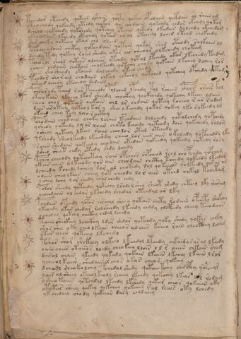

# Voynich Speculative Herbal Ferment Recipe — f115v

IMPORTANT: this is NOT a real or validated translation of the Voynich Manuscript. It is a speculative/procedural model that interprets EVA using a user-defined grammar to generate experimental recipes using safe, known edible substitutes.

This file is generated automatically from IVTFF/EVA transliteration plus a user-defined procedural grammar.



## Page / Folio
- currier: B
- folio: f115v
- page_number: 233
- plant_category_confidence: 0.0
- plant_category_guess: unknown

## Plant Interpretation (Heuristic)
- category: unknown
- confidence: 0.0
- note: Heuristic classification based on the IVTFF 'Plant ID' string (not the drawing). Does not imply real identification of the manuscript plant.

## EVA Text (Transliteration)
```text
tchedor otchedy qotees ytain qoty qotar opolaiin qotdain ol raiin om
ykeeochody qokeedy yteedy qokar qor chodaiin qokchdy chdar okchdy qokam
dsheol qokchedy qokshedy qotchey otaiin qotedy lkedain dalchdy okchedam
ykcheodain lkchedy otechdy qotar or al ytchedy lched otchd chokeedy
dair cheky qoteey otar chl oleed
pchody odaiin chcphy qokchdain qotain qokor shed oteody solkaiin al
dchedy tedy qokeey roiin shedy okor air cheoor olkchedy chotam
tchoros sheol qotchs olchees otchdy qotol lpchedy okar lkechedy pchdam
ychees chdaiin chotain cholkeedy qotchy chody qotain lkchey lchey ror
saiin sho sheody okaiin dalchedy oteeo chedy
tchdor shorail chodaiin chkol chkchol qotched qotchey dpchedy q[?:o]tam
ysheed lchedy lkchedy soraiin
pchdarody pcheed rar tcheody polched lpchdy tol rchees cphor orair kol
okeeo kaiin lkeeey lkor sheedy chockhy qockheedy qokechy lkeey ldaiin
saiin chol qotain qokain chl lr chdain qoteey rcheey r ar rodam
dain ar oteey qoteol kar y sheo lkechdy qokar qokey lko rokeedy ld
okai[?:r] chey keey lcho racthy
pchodain chotain choky lchain lpchdain dalchedy qotolchedy qopchedy
yshedy qokeedy lxor xoiin choto keeody qoteody dain qokchedy ralom
ysheey qoteey lkeey raiin cheo lor otal otchedy
tshedy sheolkeedy lkeeshdy cheeo lor eees aiin okchedy qopcheddy lky
soiin shedain qokeedy chodain otedain qokeedy qokeedy qotedy [r:s]osy
lshes sheet chdy otedy shdy lchedy
pcheo cheeody qoteeotchy soin opchees chpcheod rchl cho pchdy qopcham
ykees aiin olkeeody qos ain cheodain chcthy tchedy qokeedy lkeedas
dcheedy kchedy lcheey ror al chokedy dol qokeeeos qolkeedy qokar ar
olain cheo lkain cheey qot cheody lor aiin oteed chkal kchetam
y chey lcho lor chedy chol chedy chdy
polor sheedy qoteedy qokechy lraly l shey sheot shedy chteey lky raram
ycheedaiin ol chlor lkchedy rchedar oteedal ar lky
pchdair opchedy qopor iirchal sheey qotain chety rodaiin opchepy shokchy
ykchedy okar chedar rolsheedy lkchdy chddy ch[cph:cth]edy cheey teeodaiin
ychedal qotchy chcthy chdal lchedy
taiin sheckeey lchckhy ldar shdar qotchdy qoky shedy qokar chckhy
shos shee oky cheo lkain cheeos al ches kcheo rain checthey lcham
ytar aiin qoteey lkchedy
tshar shor shckhhy olkeeo lkeedol ltchdy chkaidararal lkeedy
oiiin chees otairos loedy cheo keeo llchs o l r aiiin chkain sham
dairal chain ykeedy qokedy qokain lkaiin lkchey lkain lror
ycheeol kaiin shedain s cho r okas cheos qokchy
dcheodl sheo kolchey fchedol shedy qotoee tchy choiphy qopch[y:?]r
yair al sheey oteeol keody rcheey lkchdy qokchey lkar l[k:?]l rodam
ysheo[k:t]aiin qotchdal lkchdy lkshedy qokar cheos qokaiin aky
ototar sheey qokey qokchey qokchey ral rchos oty lchedy
yk chedaiin chody qokaiin dary cholaiim
```

## Page Summary (Procedural, Aggregated)
- compound_counts: {'heat': 80, 'main herb': 179, 'yeast fermentation': 195, 'mix/transfer': 175, 'liquid base': 74, 'sugars': 115, 'secondary herb': 43, 'complex herbal compound': 13, 'general base': 1, 'aroma modifier': 1}
- dose_level: 3
- fermentation_estimate: 7–14 days

## Pantry (Max Needed For Any Single Line-Recipe)
- aroma_modifier: ['lemon peel (optional)']
- aroma_modifier_dose: ['2–5 g (or 1 strip of peel, avoiding the bitter pith)']
- main_plant_dry_g: 15
- main_plant_substitute: ['chamomile (safe default substitute)']
- safe_complex_herbal_blend: ['gentle spices (e.g., 1 g cinnamon + 1 g clove) or a commercial herbal tea blend']
- secondary_herb_dry_g: 7
- secondary_herb_substitute: ['mint']
- sugar_or_honey_g: 75
- water_l: 0.5
- yeast_g: 1

## Recipes Index (This Page)
- [f115v.1,@P0](#f115v-1-f115v-1-p0)
- [f115v.2,+P0](#f115v-2-f115v-2-p0)
- [f115v.3,+P0](#f115v-3-f115v-3-p0)
- [f115v.4,+P0](#f115v-4-f115v-4-p0)
- [f115v.5,+P0](#f115v-5-f115v-5-p0)
- [f115v.6,+P0](#f115v-6-f115v-6-p0)
- [f115v.7,+P0](#f115v-7-f115v-7-p0)
- [f115v.8,+P0](#f115v-8-f115v-8-p0)
- [f115v.9,+P0](#f115v-9-f115v-9-p0)
- [f115v.10,+P0](#f115v-10-f115v-10-p0)
- [f115v.11,+P0](#f115v-11-f115v-11-p0)
- [f115v.12,+P0](#f115v-12-f115v-12-p0)
- [f115v.13,+P0](#f115v-13-f115v-13-p0)
- [f115v.14,+P0](#f115v-14-f115v-14-p0)
- [f115v.15,+P0](#f115v-15-f115v-15-p0)
- [f115v.16,+P0](#f115v-16-f115v-16-p0)
- [f115v.17,+P0](#f115v-17-f115v-17-p0)
- [f115v.18,+P0](#f115v-18-f115v-18-p0)
- [f115v.19,+P0](#f115v-19-f115v-19-p0)
- [f115v.20,+P0](#f115v-20-f115v-20-p0)
- [f115v.21,+P0](#f115v-21-f115v-21-p0)
- [f115v.22,+P0](#f115v-22-f115v-22-p0)
- [f115v.23,+P0](#f115v-23-f115v-23-p0)
- [f115v.24,+P0](#f115v-24-f115v-24-p0)
- [f115v.25,+P0](#f115v-25-f115v-25-p0)
- [f115v.26,+P0](#f115v-26-f115v-26-p0)
- [f115v.27,+P0](#f115v-27-f115v-27-p0)
- [f115v.28,+P0](#f115v-28-f115v-28-p0)
- [f115v.29,+P0](#f115v-29-f115v-29-p0)
- [f115v.30,+P0](#f115v-30-f115v-30-p0)
- [f115v.31,+P0](#f115v-31-f115v-31-p0)
- [f115v.32,+P0](#f115v-32-f115v-32-p0)
- [f115v.33,+P0](#f115v-33-f115v-33-p0)
- [f115v.34,+P0](#f115v-34-f115v-34-p0)
- [f115v.35,+P0](#f115v-35-f115v-35-p0)
- [f115v.36,+P0](#f115v-36-f115v-36-p0)
- [f115v.37,+P0](#f115v-37-f115v-37-p0)
- [f115v.38,+P0](#f115v-38-f115v-38-p0)
- [f115v.39,+P0](#f115v-39-f115v-39-p0)
- [f115v.40,+P0](#f115v-40-f115v-40-p0)
- [f115v.41,+P0](#f115v-41-f115v-41-p0)
- [f115v.42,+P0](#f115v-42-f115v-42-p0)
- [f115v.43,+P0](#f115v-43-f115v-43-p0)
- [f115v.44,+P0](#f115v-44-f115v-44-p0)
- [f115v.45,+P0](#f115v-45-f115v-45-p0)

## Line Recipes (Each Line = One Recipe, 0.5L batch)

<a id="f115v-1-f115v-1-p0"></a>

### f115v.1,@P0

EVA: tchedor otchedy qotees ytain qoty qotar opolaiin qotdain ol raiin om

## Ingredients
- main_plant_dry_g: 10
- main_plant_substitute: chamomile (safe default substitute)
- secondary_herb_dry_g: 2
- secondary_herb_substitute: mint
- sugar_or_honey_g: 25
- water_l: 0.5
- yeast_g: 1

Process:
1. Sanitize the jar/fermenter and utensils.
2. Base: combine 0.5 L water with 25 g sugar or honey.
3. Apply gentle heat: simmer 10–15 min, then cool to <30°C before adding yeast.
4. Add main plant: chamomile (safe default substitute) (~10 g dried).
5. Add secondary herb: mint (~2 g dried).
6. Pitch yeast: 1 g (ideally cider/beer yeast).
7. Ferment with an airlock: 7–14 days (guided by iin/aiin markers).
8. Strain/rack (if very solid-heavy) and cold-crash 24 h.
9. Bottle only when activity clearly slows; refrigerate. Avoid overpressure.

Expected Result: A mild, aromatic herbal ferment, low-to-medium intensity depending on dose level.

Does It Make Sense?: partial

Direct Gloss (Procedural, Not a Real Translation):
- tchedor: apply heat/cooking → add main plant (safe substitute) → mix / transfer → start fermentation (yeast) → duration level 1 → state: active extraction
- otchedy: apply heat/cooking → add main plant (safe substitute) → mix / transfer → start fermentation (yeast) → duration level 1 → state: active extraction
- qotees: prepare liquid base → apply heat/cooking → duration level 2 → state: active extraction
- ytain: apply heat/cooking → duration level 1 → state: fermentation start
- qoty: prepare liquid base → apply heat/cooking
- qotar: prepare liquid base → apply heat/cooking → duration level 1 → state: fermentation start
- opolaiin: mix / transfer → start fermentation (yeast) → duration level 1 → state: fermentation start → long fermentation / aging phase
- qotdain: prepare liquid base → apply heat/cooking → start fermentation (yeast) → duration level 1 → state: fermentation start
- ol: mix / transfer
- raiin: duration level 1 → state: fermentation start → long fermentation / aging phase
- om: mix / transfer

<a id="f115v-2-f115v-2-p0"></a>

### f115v.2,+P0

EVA: ykeeochody qokeedy yteedy qokar qor chodaiin qokchdy chdar okchdy qokam

## Ingredients
- main_plant_dry_g: 10
- main_plant_substitute: chamomile (safe default substitute)
- secondary_herb_dry_g: 2
- secondary_herb_substitute: mint
- sugar_or_honey_g: 50
- water_l: 0.5
- yeast_g: 1

Process:
1. Sanitize the jar/fermenter and utensils.
2. Base: combine 0.5 L water with 50 g sugar or honey.
3. Apply gentle heat: simmer 10–15 min, then cool to <30°C before adding yeast.
4. Add main plant: chamomile (safe default substitute) (~10 g dried).
5. Add secondary herb: mint (~2 g dried).
6. Pitch yeast: 1 g (ideally cider/beer yeast).
7. Ferment with an airlock: 7–14 days (guided by iin/aiin markers).
8. Strain/rack (if very solid-heavy) and cold-crash 24 h.
9. Bottle only when activity clearly slows; refrigerate. Avoid overpressure.

Expected Result: A mild, aromatic herbal ferment, low-to-medium intensity depending on dose level.

Does It Make Sense?: partial

Direct Gloss (Procedural, Not a Real Translation):
- ykeeochody: add fermentable sugars → add main plant (safe substitute) → mix / transfer → start fermentation (yeast) → duration level 2 → state: active extraction
- qokeedy: prepare liquid base → add fermentable sugars → start fermentation (yeast) → duration level 2 → state: active extraction
- yteedy: apply heat/cooking → start fermentation (yeast) → duration level 2 → state: active extraction
- qokar: prepare liquid base → add fermentable sugars → duration level 1 → state: fermentation start
- qor: prepare liquid base
- chodaiin: add main plant (safe substitute) → mix / transfer → start fermentation (yeast) → duration level 1 → state: fermentation start → long fermentation / aging phase
- qokchdy: prepare liquid base → add fermentable sugars → add main plant (safe substitute) → start fermentation (yeast)
- chdar: add main plant (safe substitute) → start fermentation (yeast) → duration level 1 → state: fermentation start
- okchdy: add fermentable sugars → add main plant (safe substitute) → mix / transfer → start fermentation (yeast)
- qokam: prepare liquid base → add fermentable sugars → duration level 1 → state: fermentation start

<a id="f115v-3-f115v-3-p0"></a>

### f115v.3,+P0

EVA: dsheol qokchedy qokshedy qotchey otaiin qotedy lkedain dalchdy okchedam

## Ingredients
- main_plant_dry_g: 5
- main_plant_substitute: chamomile (safe default substitute)
- secondary_herb_dry_g: 2
- secondary_herb_substitute: mint
- sugar_or_honey_g: 25
- water_l: 0.5
- yeast_g: 1

Process:
1. Sanitize the jar/fermenter and utensils.
2. Base: combine 0.5 L water with 25 g sugar or honey.
3. Apply gentle heat: simmer 10–15 min, then cool to <30°C before adding yeast.
4. Add main plant: chamomile (safe default substitute) (~5 g dried).
5. Add secondary herb: mint (~2 g dried).
6. Pitch yeast: 1 g (ideally cider/beer yeast).
7. Ferment with an airlock: 7–14 days (guided by iin/aiin markers).
8. Strain/rack (if very solid-heavy) and cold-crash 24 h.
9. Bottle only when activity clearly slows; refrigerate. Avoid overpressure.

Expected Result: A mild, aromatic herbal ferment, low-to-medium intensity depending on dose level.

Does It Make Sense?: partial

Direct Gloss (Procedural, Not a Real Translation):
- dsheol: add secondary herb (safe substitute) → mix / transfer → start fermentation (yeast) → duration level 1 → state: active extraction
- qokchedy: prepare liquid base → add fermentable sugars → add main plant (safe substitute) → start fermentation (yeast) → duration level 1 → state: active extraction
- qokshedy: prepare liquid base → add fermentable sugars → add secondary herb (safe substitute) → start fermentation (yeast) → duration level 1 → state: active extraction
- qotchey: prepare liquid base → apply heat/cooking → add main plant (safe substitute) → duration level 1 → state: active extraction
- otaiin: apply heat/cooking → mix / transfer → duration level 1 → state: fermentation start → long fermentation / aging phase
- qotedy: prepare liquid base → apply heat/cooking → start fermentation (yeast) → duration level 1 → state: active extraction
- lkedain: add fermentable sugars → start fermentation (yeast) → duration level 1 → state: active extraction
- dalchdy: add main plant (safe substitute) → start fermentation (yeast) → duration level 1 → state: fermentation start
- okchedam: add fermentable sugars → add main plant (safe substitute) → mix / transfer → start fermentation (yeast) → duration level 1 → state: active extraction

<a id="f115v-4-f115v-4-p0"></a>

### f115v.4,+P0

EVA: ykcheodain lkchedy otechdy qotar or al ytchedy lched otchd chokeedy

## Ingredients
- main_plant_dry_g: 10
- main_plant_substitute: chamomile (safe default substitute)
- secondary_herb_dry_g: 2
- secondary_herb_substitute: mint
- sugar_or_honey_g: 50
- water_l: 0.5
- yeast_g: 1

Process:
1. Sanitize the jar/fermenter and utensils.
2. Base: combine 0.5 L water with 50 g sugar or honey.
3. Apply gentle heat: simmer 10–15 min, then cool to <30°C before adding yeast.
4. Add main plant: chamomile (safe default substitute) (~10 g dried).
5. Add secondary herb: mint (~2 g dried).
6. Pitch yeast: 1 g (ideally cider/beer yeast).
7. Ferment with an airlock: 2–4 days (guided by iin/aiin markers).
8. Strain/rack (if very solid-heavy) and cold-crash 24 h.
9. Bottle only when activity clearly slows; refrigerate. Avoid overpressure.

Expected Result: A mild, aromatic herbal ferment, low-to-medium intensity depending on dose level.

Does It Make Sense?: partial

Direct Gloss (Procedural, Not a Real Translation):
- ykcheodain: add fermentable sugars → add main plant (safe substitute) → mix / transfer → start fermentation (yeast) → duration level 1 → state: active extraction
- lkchedy: add fermentable sugars → add main plant (safe substitute) → start fermentation (yeast) → duration level 1 → state: active extraction
- otechdy: apply heat/cooking → add main plant (safe substitute) → mix / transfer → start fermentation (yeast) → duration level 1 → state: active extraction
- qotar: prepare liquid base → apply heat/cooking → duration level 1 → state: fermentation start
- or: mix / transfer
- al: duration level 1 → state: fermentation start
- ytchedy: apply heat/cooking → add main plant (safe substitute) → start fermentation (yeast) → duration level 1 → state: active extraction
- lched: add main plant (safe substitute) → start fermentation (yeast) → duration level 1 → state: active extraction
- otchd: apply heat/cooking → add main plant (safe substitute) → mix / transfer → start fermentation (yeast)
- chokeedy: add fermentable sugars → add main plant (safe substitute) → mix / transfer → start fermentation (yeast) → duration level 2 → state: active extraction

<a id="f115v-5-f115v-5-p0"></a>

### f115v.5,+P0

EVA: dair cheky qoteey otar chl oleed

## Ingredients
- main_plant_dry_g: 10
- main_plant_substitute: chamomile (safe default substitute)
- secondary_herb_dry_g: 2
- secondary_herb_substitute: mint
- sugar_or_honey_g: 50
- water_l: 0.5
- yeast_g: 1

Process:
1. Sanitize the jar/fermenter and utensils.
2. Base: combine 0.5 L water with 50 g sugar or honey.
3. Apply gentle heat: simmer 10–15 min, then cool to <30°C before adding yeast.
4. Add main plant: chamomile (safe default substitute) (~10 g dried).
5. Add secondary herb: mint (~2 g dried).
6. Pitch yeast: 1 g (ideally cider/beer yeast).
7. Ferment with an airlock: 2–4 days (guided by iin/aiin markers).
8. Strain/rack (if very solid-heavy) and cold-crash 24 h.
9. Bottle only when activity clearly slows; refrigerate. Avoid overpressure.

Expected Result: A mild, aromatic herbal ferment, low-to-medium intensity depending on dose level.

Does It Make Sense?: partial

Direct Gloss (Procedural, Not a Real Translation):
- dair: start fermentation (yeast) → duration level 1 → state: fermentation start
- cheky: add fermentable sugars → add main plant (safe substitute) → duration level 1 → state: active extraction
- qoteey: prepare liquid base → apply heat/cooking → duration level 2 → state: active extraction
- otar: apply heat/cooking → mix / transfer → duration level 1 → state: fermentation start
- chl: add main plant (safe substitute)
- oleed: mix / transfer → start fermentation (yeast) → duration level 2 → state: active extraction

<a id="f115v-6-f115v-6-p0"></a>

### f115v.6,+P0

EVA: pchody odaiin chcphy qokchdain qotain qokor shed oteody solkaiin al

## Ingredients
- main_plant_dry_g: 5
- main_plant_substitute: chamomile (safe default substitute)
- safe_complex_herbal_blend: gentle spices (e.g., 1 g cinnamon + 1 g clove) or a commercial herbal tea blend
- secondary_herb_dry_g: 2
- secondary_herb_substitute: mint
- sugar_or_honey_g: 25
- water_l: 0.5
- yeast_g: 1

Process:
1. Sanitize the jar/fermenter and utensils.
2. Base: combine 0.5 L water with 25 g sugar or honey.
3. Apply gentle heat: simmer 10–15 min, then cool to <30°C before adding yeast.
4. Add main plant: chamomile (safe default substitute) (~5 g dried).
5. Add secondary herb: mint (~2 g dried).
6. If a complex herbal compound appears, use a safe commercial blend or gentle spices in micro-doses.
7. Pitch yeast: 1 g (ideally cider/beer yeast).
8. Ferment with an airlock: 7–14 days (guided by iin/aiin markers).
9. Strain/rack (if very solid-heavy) and cold-crash 24 h.
10. Bottle only when activity clearly slows; refrigerate. Avoid overpressure.

Expected Result: A mild, aromatic herbal ferment, low-to-medium intensity depending on dose level.

Does It Make Sense?: partial

Direct Gloss (Procedural, Not a Real Translation):
- pchody: add main plant (safe substitute) → mix / transfer → start fermentation (yeast)
- odaiin: mix / transfer → start fermentation (yeast) → duration level 1 → state: fermentation start → long fermentation / aging phase
- chcphy: add main plant (safe substitute) → add complex herbal compound (safe blend)
- qokchdain: prepare liquid base → add fermentable sugars → add main plant (safe substitute) → start fermentation (yeast) → duration level 1 → state: fermentation start
- qotain: prepare liquid base → apply heat/cooking → duration level 1 → state: fermentation start
- qokor: prepare liquid base → add fermentable sugars → mix / transfer
- shed: add secondary herb (safe substitute) → start fermentation (yeast) → duration level 1 → state: active extraction
- oteody: apply heat/cooking → mix / transfer → start fermentation (yeast) → duration level 1 → state: active extraction
- solkaiin: add fermentable sugars → mix / transfer → duration level 1 → state: fermentation start → long fermentation / aging phase
- al: duration level 1 → state: fermentation start

<a id="f115v-7-f115v-7-p0"></a>

### f115v.7,+P0

EVA: dchedy tedy qokeey roiin shedy okor air cheoor olkchedy chotam

## Ingredients
- main_plant_dry_g: 10
- main_plant_substitute: chamomile (safe default substitute)
- secondary_herb_dry_g: 5
- secondary_herb_substitute: mint
- sugar_or_honey_g: 50
- water_l: 0.5
- yeast_g: 1

Process:
1. Sanitize the jar/fermenter and utensils.
2. Base: combine 0.5 L water with 50 g sugar or honey.
3. Apply gentle heat: simmer 10–15 min, then cool to <30°C before adding yeast.
4. Add main plant: chamomile (safe default substitute) (~10 g dried).
5. Add secondary herb: mint (~5 g dried).
6. Pitch yeast: 1 g (ideally cider/beer yeast).
7. Ferment with an airlock: 3–5 days (guided by iin/aiin markers).
8. Strain/rack (if very solid-heavy) and cold-crash 24 h.
9. Bottle only when activity clearly slows; refrigerate. Avoid overpressure.

Expected Result: A mild, aromatic herbal ferment, low-to-medium intensity depending on dose level.

Does It Make Sense?: partial

Direct Gloss (Procedural, Not a Real Translation):
- dchedy: add main plant (safe substitute) → start fermentation (yeast) → duration level 1 → state: active extraction
- tedy: apply heat/cooking → start fermentation (yeast) → duration level 1 → state: active extraction
- qokeey: prepare liquid base → add fermentable sugars → duration level 2 → state: active extraction
- roiin: mix / transfer → duration level 2 → state: cooling/rest → medium fermentation phase
- shedy: add secondary herb (safe substitute) → start fermentation (yeast) → duration level 1 → state: active extraction
- okor: add fermentable sugars → mix / transfer
- air: duration level 1 → state: fermentation start
- cheoor: add main plant (safe substitute) → mix / transfer → duration level 1 → state: active extraction
- olkchedy: add fermentable sugars → add main plant (safe substitute) → mix / transfer → start fermentation (yeast) → duration level 1 → state: active extraction
- chotam: apply heat/cooking → add main plant (safe substitute) → mix / transfer → duration level 1 → state: fermentation start

<a id="f115v-8-f115v-8-p0"></a>

### f115v.8,+P0

EVA: tchoros sheol qotchs olchees otchdy qotol lpchedy okar lkechedy pchdam

## Ingredients
- main_plant_dry_g: 10
- main_plant_substitute: chamomile (safe default substitute)
- secondary_herb_dry_g: 5
- secondary_herb_substitute: mint
- sugar_or_honey_g: 50
- water_l: 0.5
- yeast_g: 1

Process:
1. Sanitize the jar/fermenter and utensils.
2. Base: combine 0.5 L water with 50 g sugar or honey.
3. Apply gentle heat: simmer 10–15 min, then cool to <30°C before adding yeast.
4. Add main plant: chamomile (safe default substitute) (~10 g dried).
5. Add secondary herb: mint (~5 g dried).
6. Pitch yeast: 1 g (ideally cider/beer yeast).
7. Ferment with an airlock: 2–4 days (guided by iin/aiin markers).
8. Strain/rack (if very solid-heavy) and cold-crash 24 h.
9. Bottle only when activity clearly slows; refrigerate. Avoid overpressure.

Expected Result: A mild, aromatic herbal ferment, low-to-medium intensity depending on dose level.

Does It Make Sense?: partial

Direct Gloss (Procedural, Not a Real Translation):
- tchoros: apply heat/cooking → add main plant (safe substitute) → mix / transfer
- sheol: add secondary herb (safe substitute) → mix / transfer → duration level 1 → state: active extraction
- qotchs: prepare liquid base → apply heat/cooking → add main plant (safe substitute)
- olchees: add main plant (safe substitute) → mix / transfer → duration level 2 → state: active extraction
- otchdy: apply heat/cooking → add main plant (safe substitute) → mix / transfer → start fermentation (yeast)
- qotol: prepare liquid base → apply heat/cooking → mix / transfer
- lpchedy: add main plant (safe substitute) → start fermentation (yeast) → duration level 1 → state: active extraction
- okar: add fermentable sugars → mix / transfer → duration level 1 → state: fermentation start
- lkechedy: add fermentable sugars → add main plant (safe substitute) → start fermentation (yeast) → duration level 1 → state: active extraction
- pchdam: add main plant (safe substitute) → start fermentation (yeast) → duration level 1 → state: fermentation start

<a id="f115v-9-f115v-9-p0"></a>

### f115v.9,+P0

EVA: ychees chdaiin chotain cholkeedy qotchy chody qotain lkchey lchey ror

## Ingredients
- main_plant_dry_g: 10
- main_plant_substitute: chamomile (safe default substitute)
- secondary_herb_dry_g: 2
- secondary_herb_substitute: mint
- sugar_or_honey_g: 50
- water_l: 0.5
- yeast_g: 1

Process:
1. Sanitize the jar/fermenter and utensils.
2. Base: combine 0.5 L water with 50 g sugar or honey.
3. Apply gentle heat: simmer 10–15 min, then cool to <30°C before adding yeast.
4. Add main plant: chamomile (safe default substitute) (~10 g dried).
5. Add secondary herb: mint (~2 g dried).
6. Pitch yeast: 1 g (ideally cider/beer yeast).
7. Ferment with an airlock: 7–14 days (guided by iin/aiin markers).
8. Strain/rack (if very solid-heavy) and cold-crash 24 h.
9. Bottle only when activity clearly slows; refrigerate. Avoid overpressure.

Expected Result: A mild, aromatic herbal ferment, low-to-medium intensity depending on dose level.

Does It Make Sense?: partial

Direct Gloss (Procedural, Not a Real Translation):
- ychees: add main plant (safe substitute) → duration level 2 → state: active extraction
- chdaiin: add main plant (safe substitute) → start fermentation (yeast) → duration level 1 → state: fermentation start → long fermentation / aging phase
- chotain: apply heat/cooking → add main plant (safe substitute) → mix / transfer → duration level 1 → state: fermentation start
- cholkeedy: add fermentable sugars → add main plant (safe substitute) → mix / transfer → start fermentation (yeast) → duration level 2 → state: active extraction
- qotchy: prepare liquid base → apply heat/cooking → add main plant (safe substitute)
- chody: add main plant (safe substitute) → mix / transfer → start fermentation (yeast)
- qotain: prepare liquid base → apply heat/cooking → duration level 1 → state: fermentation start
- lkchey: add fermentable sugars → add main plant (safe substitute) → duration level 1 → state: active extraction
- lchey: add main plant (safe substitute) → duration level 1 → state: active extraction
- ror: mix / transfer

<a id="f115v-10-f115v-10-p0"></a>

### f115v.10,+P0

EVA: saiin sho sheody okaiin dalchedy oteeo chedy

## Ingredients
- main_plant_dry_g: 10
- main_plant_substitute: chamomile (safe default substitute)
- secondary_herb_dry_g: 5
- secondary_herb_substitute: mint
- sugar_or_honey_g: 50
- water_l: 0.5
- yeast_g: 1

Process:
1. Sanitize the jar/fermenter and utensils.
2. Base: combine 0.5 L water with 50 g sugar or honey.
3. Apply gentle heat: simmer 10–15 min, then cool to <30°C before adding yeast.
4. Add main plant: chamomile (safe default substitute) (~10 g dried).
5. Add secondary herb: mint (~5 g dried).
6. Pitch yeast: 1 g (ideally cider/beer yeast).
7. Ferment with an airlock: 7–14 days (guided by iin/aiin markers).
8. Strain/rack (if very solid-heavy) and cold-crash 24 h.
9. Bottle only when activity clearly slows; refrigerate. Avoid overpressure.

Expected Result: A mild, aromatic herbal ferment, low-to-medium intensity depending on dose level.

Does It Make Sense?: partial

Direct Gloss (Procedural, Not a Real Translation):
- saiin: duration level 1 → state: fermentation start → long fermentation / aging phase
- sho: add secondary herb (safe substitute) → mix / transfer
- sheody: add secondary herb (safe substitute) → mix / transfer → start fermentation (yeast) → duration level 1 → state: active extraction
- okaiin: add fermentable sugars → mix / transfer → duration level 1 → state: fermentation start → long fermentation / aging phase
- dalchedy: add main plant (safe substitute) → start fermentation (yeast) → duration level 1 → state: fermentation start
- oteeo: apply heat/cooking → mix / transfer → duration level 2 → state: active extraction
- chedy: add main plant (safe substitute) → start fermentation (yeast) → duration level 1 → state: active extraction

<a id="f115v-11-f115v-11-p0"></a>

### f115v.11,+P0

EVA: tchdor shorail chodaiin chkol chkchol qotched qotchey dpchedy q[?:o]tam

## Ingredients
- main_plant_dry_g: 5
- main_plant_substitute: chamomile (safe default substitute)
- secondary_herb_dry_g: 2
- secondary_herb_substitute: mint
- sugar_or_honey_g: 25
- water_l: 0.5
- yeast_g: 1

Process:
1. Sanitize the jar/fermenter and utensils.
2. Base: combine 0.5 L water with 25 g sugar or honey.
3. Apply gentle heat: simmer 10–15 min, then cool to <30°C before adding yeast.
4. Add main plant: chamomile (safe default substitute) (~5 g dried).
5. Add secondary herb: mint (~2 g dried).
6. Pitch yeast: 1 g (ideally cider/beer yeast).
7. Ferment with an airlock: 7–14 days (guided by iin/aiin markers).
8. Strain/rack (if very solid-heavy) and cold-crash 24 h.
9. Bottle only when activity clearly slows; refrigerate. Avoid overpressure.

Expected Result: A mild, aromatic herbal ferment, low-to-medium intensity depending on dose level.

Does It Make Sense?: partial

Direct Gloss (Procedural, Not a Real Translation):
- tchdor: apply heat/cooking → add main plant (safe substitute) → mix / transfer → start fermentation (yeast)
- shorail: add secondary herb (safe substitute) → mix / transfer → duration level 1 → state: fermentation start
- chodaiin: add main plant (safe substitute) → mix / transfer → start fermentation (yeast) → duration level 1 → state: fermentation start → long fermentation / aging phase
- chkol: add fermentable sugars → add main plant (safe substitute) → mix / transfer
- chkchol: add fermentable sugars → add main plant (safe substitute) → mix / transfer
- qotched: prepare liquid base → apply heat/cooking → add main plant (safe substitute) → start fermentation (yeast) → duration level 1 → state: active extraction
- qotchey: prepare liquid base → apply heat/cooking → add main plant (safe substitute) → duration level 1 → state: active extraction
- dpchedy: add main plant (safe substitute) → start fermentation (yeast) → duration level 1 → state: active extraction
- q: prepare base (generic)
- o: mix / transfer
- tam: apply heat/cooking → duration level 1 → state: fermentation start

<a id="f115v-12-f115v-12-p0"></a>

### f115v.12,+P0

EVA: ysheed lchedy lkchedy soraiin

## Ingredients
- main_plant_dry_g: 10
- main_plant_substitute: chamomile (safe default substitute)
- secondary_herb_dry_g: 5
- secondary_herb_substitute: mint
- sugar_or_honey_g: 50
- water_l: 0.5
- yeast_g: 1

Process:
1. Sanitize the jar/fermenter and utensils.
2. Base: combine 0.5 L water with 50 g sugar or honey.
3. Infusion: use hot (not boiling) water, then let it cool before adding yeast.
4. Add main plant: chamomile (safe default substitute) (~10 g dried).
5. Add secondary herb: mint (~5 g dried).
6. Pitch yeast: 1 g (ideally cider/beer yeast).
7. Ferment with an airlock: 7–14 days (guided by iin/aiin markers).
8. Strain/rack (if very solid-heavy) and cold-crash 24 h.
9. Bottle only when activity clearly slows; refrigerate. Avoid overpressure.

Expected Result: A mild, aromatic herbal ferment, low-to-medium intensity depending on dose level.

Does It Make Sense?: partial

Direct Gloss (Procedural, Not a Real Translation):
- ysheed: add secondary herb (safe substitute) → start fermentation (yeast) → duration level 2 → state: active extraction
- lchedy: add main plant (safe substitute) → start fermentation (yeast) → duration level 1 → state: active extraction
- lkchedy: add fermentable sugars → add main plant (safe substitute) → start fermentation (yeast) → duration level 1 → state: active extraction
- soraiin: mix / transfer → duration level 1 → state: fermentation start → long fermentation / aging phase

<a id="f115v-13-f115v-13-p0"></a>

### f115v.13,+P0

EVA: pchdarody pcheed rar tcheody polched lpchdy tol rchees cphor orair kol

## Ingredients
- main_plant_dry_g: 10
- main_plant_substitute: chamomile (safe default substitute)
- safe_complex_herbal_blend: gentle spices (e.g., 1 g cinnamon + 1 g clove) or a commercial herbal tea blend
- secondary_herb_dry_g: 2
- secondary_herb_substitute: mint
- sugar_or_honey_g: 50
- water_l: 0.5
- yeast_g: 1

Process:
1. Sanitize the jar/fermenter and utensils.
2. Base: combine 0.5 L water with 50 g sugar or honey.
3. Apply gentle heat: simmer 10–15 min, then cool to <30°C before adding yeast.
4. Add main plant: chamomile (safe default substitute) (~10 g dried).
5. Add secondary herb: mint (~2 g dried).
6. If a complex herbal compound appears, use a safe commercial blend or gentle spices in micro-doses.
7. Pitch yeast: 1 g (ideally cider/beer yeast).
8. Ferment with an airlock: 2–4 days (guided by iin/aiin markers).
9. Strain/rack (if very solid-heavy) and cold-crash 24 h.
10. Bottle only when activity clearly slows; refrigerate. Avoid overpressure.

Expected Result: A mild, aromatic herbal ferment, low-to-medium intensity depending on dose level.

Does It Make Sense?: partial

Direct Gloss (Procedural, Not a Real Translation):
- pchdarody: add main plant (safe substitute) → mix / transfer → start fermentation (yeast) → duration level 1 → state: fermentation start
- pcheed: add main plant (safe substitute) → start fermentation (yeast) → duration level 2 → state: active extraction
- rar: duration level 1 → state: fermentation start
- tcheody: apply heat/cooking → add main plant (safe substitute) → mix / transfer → start fermentation (yeast) → duration level 1 → state: active extraction
- polched: add main plant (safe substitute) → mix / transfer → start fermentation (yeast) → duration level 1 → state: active extraction
- lpchdy: add main plant (safe substitute) → start fermentation (yeast)
- tol: apply heat/cooking → mix / transfer
- rchees: add main plant (safe substitute) → duration level 2 → state: active extraction
- cphor: mix / transfer → add complex herbal compound (safe blend)
- orair: mix / transfer → duration level 1 → state: fermentation start
- kol: add fermentable sugars → mix / transfer

<a id="f115v-14-f115v-14-p0"></a>

### f115v.14,+P0

EVA: okeeo kaiin lkeeey lkor sheedy chockhy qockheedy qokechy lkeey ldaiin

## Ingredients
- main_plant_dry_g: 15
- main_plant_substitute: chamomile (safe default substitute)
- safe_complex_herbal_blend: gentle spices (e.g., 1 g cinnamon + 1 g clove) or a commercial herbal tea blend
- secondary_herb_dry_g: 7
- secondary_herb_substitute: mint
- sugar_or_honey_g: 75
- water_l: 0.5
- yeast_g: 1

Process:
1. Sanitize the jar/fermenter and utensils.
2. Base: combine 0.5 L water with 75 g sugar or honey.
3. Infusion: use hot (not boiling) water, then let it cool before adding yeast.
4. Add main plant: chamomile (safe default substitute) (~15 g dried).
5. Add secondary herb: mint (~7 g dried).
6. If a complex herbal compound appears, use a safe commercial blend or gentle spices in micro-doses.
7. Pitch yeast: 1 g (ideally cider/beer yeast).
8. Ferment with an airlock: 7–14 days (guided by iin/aiin markers).
9. Strain/rack (if very solid-heavy) and cold-crash 24 h.
10. Bottle only when activity clearly slows; refrigerate. Avoid overpressure.

Expected Result: A mild, aromatic herbal ferment, low-to-medium intensity depending on dose level.

Does It Make Sense?: partial

Direct Gloss (Procedural, Not a Real Translation):
- okeeo: add fermentable sugars → mix / transfer → duration level 2 → state: active extraction
- kaiin: add fermentable sugars → duration level 1 → state: fermentation start → long fermentation / aging phase
- lkeeey: add fermentable sugars → duration level 3 → state: active extraction
- lkor: add fermentable sugars → mix / transfer
- sheedy: add secondary herb (safe substitute) → start fermentation (yeast) → duration level 2 → state: active extraction
- chockhy: add main plant (safe substitute) → mix / transfer → add complex herbal compound (safe blend)
- qockheedy: prepare liquid base → start fermentation (yeast) → add complex herbal compound (safe blend) → duration level 2 → state: active extraction
- qokechy: prepare liquid base → add fermentable sugars → add main plant (safe substitute) → duration level 1 → state: active extraction
- lkeey: add fermentable sugars → duration level 2 → state: active extraction
- ldaiin: start fermentation (yeast) → duration level 1 → state: fermentation start → long fermentation / aging phase

<a id="f115v-15-f115v-15-p0"></a>

### f115v.15,+P0

EVA: saiin chol qotain qokain chl lr chdain qoteey rcheey r ar rodam

## Ingredients
- main_plant_dry_g: 10
- main_plant_substitute: chamomile (safe default substitute)
- secondary_herb_dry_g: 2
- secondary_herb_substitute: mint
- sugar_or_honey_g: 50
- water_l: 0.5
- yeast_g: 1

Process:
1. Sanitize the jar/fermenter and utensils.
2. Base: combine 0.5 L water with 50 g sugar or honey.
3. Apply gentle heat: simmer 10–15 min, then cool to <30°C before adding yeast.
4. Add main plant: chamomile (safe default substitute) (~10 g dried).
5. Add secondary herb: mint (~2 g dried).
6. Pitch yeast: 1 g (ideally cider/beer yeast).
7. Ferment with an airlock: 7–14 days (guided by iin/aiin markers).
8. Strain/rack (if very solid-heavy) and cold-crash 24 h.
9. Bottle only when activity clearly slows; refrigerate. Avoid overpressure.

Expected Result: A mild, aromatic herbal ferment, low-to-medium intensity depending on dose level.

Does It Make Sense?: partial

Direct Gloss (Procedural, Not a Real Translation):
- saiin: duration level 1 → state: fermentation start → long fermentation / aging phase
- chol: add main plant (safe substitute) → mix / transfer
- qotain: prepare liquid base → apply heat/cooking → duration level 1 → state: fermentation start
- qokain: prepare liquid base → add fermentable sugars → duration level 1 → state: fermentation start
- chl: add main plant (safe substitute)
- lr: [unparsed]
- chdain: add main plant (safe substitute) → start fermentation (yeast) → duration level 1 → state: fermentation start
- qoteey: prepare liquid base → apply heat/cooking → duration level 2 → state: active extraction
- rcheey: add main plant (safe substitute) → duration level 2 → state: active extraction
- r: [unparsed]
- ar: duration level 1 → state: fermentation start
- rodam: mix / transfer → start fermentation (yeast) → duration level 1 → state: fermentation start

<a id="f115v-16-f115v-16-p0"></a>

### f115v.16,+P0

EVA: dain ar oteey qoteol kar y sheo lkechdy qokar qokey lko rokeedy ld

## Ingredients
- main_plant_dry_g: 10
- main_plant_substitute: chamomile (safe default substitute)
- secondary_herb_dry_g: 5
- secondary_herb_substitute: mint
- sugar_or_honey_g: 50
- water_l: 0.5
- yeast_g: 1

Process:
1. Sanitize the jar/fermenter and utensils.
2. Base: combine 0.5 L water with 50 g sugar or honey.
3. Apply gentle heat: simmer 10–15 min, then cool to <30°C before adding yeast.
4. Add main plant: chamomile (safe default substitute) (~10 g dried).
5. Add secondary herb: mint (~5 g dried).
6. Pitch yeast: 1 g (ideally cider/beer yeast).
7. Ferment with an airlock: 2–4 days (guided by iin/aiin markers).
8. Strain/rack (if very solid-heavy) and cold-crash 24 h.
9. Bottle only when activity clearly slows; refrigerate. Avoid overpressure.

Expected Result: A mild, aromatic herbal ferment, low-to-medium intensity depending on dose level.

Does It Make Sense?: partial

Direct Gloss (Procedural, Not a Real Translation):
- dain: start fermentation (yeast) → duration level 1 → state: fermentation start
- ar: duration level 1 → state: fermentation start
- oteey: apply heat/cooking → mix / transfer → duration level 2 → state: active extraction
- qoteol: prepare liquid base → apply heat/cooking → mix / transfer → duration level 1 → state: active extraction
- kar: add fermentable sugars → duration level 1 → state: fermentation start
- y: [unparsed]
- sheo: add secondary herb (safe substitute) → mix / transfer → duration level 1 → state: active extraction
- lkechdy: add fermentable sugars → add main plant (safe substitute) → start fermentation (yeast) → duration level 1 → state: active extraction
- qokar: prepare liquid base → add fermentable sugars → duration level 1 → state: fermentation start
- qokey: prepare liquid base → add fermentable sugars → duration level 1 → state: active extraction
- lko: add fermentable sugars → mix / transfer
- rokeedy: add fermentable sugars → mix / transfer → start fermentation (yeast) → duration level 2 → state: active extraction
- ld: start fermentation (yeast)

<a id="f115v-17-f115v-17-p0"></a>

### f115v.17,+P0

EVA: okai[?:r] chey keey lcho racthy

## Ingredients
- main_plant_dry_g: 10
- main_plant_substitute: chamomile (safe default substitute)
- safe_complex_herbal_blend: gentle spices (e.g., 1 g cinnamon + 1 g clove) or a commercial herbal tea blend
- secondary_herb_dry_g: 2
- secondary_herb_substitute: mint
- sugar_or_honey_g: 50
- water_l: 0.5
- yeast_g: 1

Process:
1. Sanitize the jar/fermenter and utensils.
2. Base: combine 0.5 L water with 50 g sugar or honey.
3. Infusion: use hot (not boiling) water, then let it cool before adding yeast.
4. Add main plant: chamomile (safe default substitute) (~10 g dried).
5. Add secondary herb: mint (~2 g dried).
6. If a complex herbal compound appears, use a safe commercial blend or gentle spices in micro-doses.
7. Pitch yeast: 1 g (ideally cider/beer yeast).
8. Ferment with an airlock: 2–4 days (guided by iin/aiin markers).
9. Strain/rack (if very solid-heavy) and cold-crash 24 h.
10. Bottle only when activity clearly slows; refrigerate. Avoid overpressure.

Expected Result: A mild, aromatic herbal ferment, low-to-medium intensity depending on dose level.

Does It Make Sense?: partial

Direct Gloss (Procedural, Not a Real Translation):
- okai: add fermentable sugars → mix / transfer → duration level 1 → state: fermentation start
- r: [unparsed]
- chey: add main plant (safe substitute) → duration level 1 → state: active extraction
- keey: add fermentable sugars → duration level 2 → state: active extraction
- lcho: add main plant (safe substitute) → mix / transfer
- racthy: add complex herbal compound (safe blend) → duration level 1 → state: fermentation start

<a id="f115v-18-f115v-18-p0"></a>

### f115v.18,+P0

EVA: pchodain chotain choky lchain lpchdain dalchedy qotolchedy qopchedy

## Ingredients
- main_plant_dry_g: 5
- main_plant_substitute: chamomile (safe default substitute)
- secondary_herb_dry_g: 1
- secondary_herb_substitute: mint
- sugar_or_honey_g: 25
- water_l: 0.5
- yeast_g: 1

Process:
1. Sanitize the jar/fermenter and utensils.
2. Base: combine 0.5 L water with 25 g sugar or honey.
3. Apply gentle heat: simmer 10–15 min, then cool to <30°C before adding yeast.
4. Add main plant: chamomile (safe default substitute) (~5 g dried).
5. Add secondary herb: mint (~1 g dried).
6. Pitch yeast: 1 g (ideally cider/beer yeast).
7. Ferment with an airlock: 2–4 days (guided by iin/aiin markers).
8. Strain/rack (if very solid-heavy) and cold-crash 24 h.
9. Bottle only when activity clearly slows; refrigerate. Avoid overpressure.

Expected Result: A mild, aromatic herbal ferment, low-to-medium intensity depending on dose level.

Does It Make Sense?: partial

Direct Gloss (Procedural, Not a Real Translation):
- pchodain: add main plant (safe substitute) → mix / transfer → start fermentation (yeast) → duration level 1 → state: fermentation start
- chotain: apply heat/cooking → add main plant (safe substitute) → mix / transfer → duration level 1 → state: fermentation start
- choky: add fermentable sugars → add main plant (safe substitute) → mix / transfer
- lchain: add main plant (safe substitute) → duration level 1 → state: fermentation start
- lpchdain: add main plant (safe substitute) → start fermentation (yeast) → duration level 1 → state: fermentation start
- dalchedy: add main plant (safe substitute) → start fermentation (yeast) → duration level 1 → state: fermentation start
- qotolchedy: prepare liquid base → apply heat/cooking → add main plant (safe substitute) → mix / transfer → start fermentation (yeast) → duration level 1 → state: active extraction
- qopchedy: prepare liquid base → add main plant (safe substitute) → start fermentation (yeast) → duration level 1 → state: active extraction

<a id="f115v-19-f115v-19-p0"></a>

### f115v.19,+P0

EVA: yshedy qokeedy lxor xoiin choto keeody qoteody dain qokchedy ralom

## Ingredients
- main_plant_dry_g: 10
- main_plant_substitute: chamomile (safe default substitute)
- secondary_herb_dry_g: 5
- secondary_herb_substitute: mint
- sugar_or_honey_g: 50
- water_l: 0.5
- yeast_g: 1

Process:
1. Sanitize the jar/fermenter and utensils.
2. Base: combine 0.5 L water with 50 g sugar or honey.
3. Apply gentle heat: simmer 10–15 min, then cool to <30°C before adding yeast.
4. Add main plant: chamomile (safe default substitute) (~10 g dried).
5. Add secondary herb: mint (~5 g dried).
6. Pitch yeast: 1 g (ideally cider/beer yeast).
7. Ferment with an airlock: 3–5 days (guided by iin/aiin markers).
8. Strain/rack (if very solid-heavy) and cold-crash 24 h.
9. Bottle only when activity clearly slows; refrigerate. Avoid overpressure.

Expected Result: A mild, aromatic herbal ferment, low-to-medium intensity depending on dose level.

Does It Make Sense?: partial

Direct Gloss (Procedural, Not a Real Translation):
- yshedy: add secondary herb (safe substitute) → start fermentation (yeast) → duration level 1 → state: active extraction
- qokeedy: prepare liquid base → add fermentable sugars → start fermentation (yeast) → duration level 2 → state: active extraction
- lxor: mix / transfer
- xoiin: mix / transfer → duration level 2 → state: cooling/rest → medium fermentation phase
- choto: apply heat/cooking → add main plant (safe substitute) → mix / transfer
- keeody: add fermentable sugars → mix / transfer → start fermentation (yeast) → duration level 2 → state: active extraction
- qoteody: prepare liquid base → apply heat/cooking → mix / transfer → start fermentation (yeast) → duration level 1 → state: active extraction
- dain: start fermentation (yeast) → duration level 1 → state: fermentation start
- qokchedy: prepare liquid base → add fermentable sugars → add main plant (safe substitute) → start fermentation (yeast) → duration level 1 → state: active extraction
- ralom: mix / transfer → duration level 1 → state: fermentation start

<a id="f115v-20-f115v-20-p0"></a>

### f115v.20,+P0

EVA: ysheey qoteey lkeey raiin cheo lor otal otchedy

## Ingredients
- main_plant_dry_g: 10
- main_plant_substitute: chamomile (safe default substitute)
- secondary_herb_dry_g: 5
- secondary_herb_substitute: mint
- sugar_or_honey_g: 50
- water_l: 0.5
- yeast_g: 1

Process:
1. Sanitize the jar/fermenter and utensils.
2. Base: combine 0.5 L water with 50 g sugar or honey.
3. Apply gentle heat: simmer 10–15 min, then cool to <30°C before adding yeast.
4. Add main plant: chamomile (safe default substitute) (~10 g dried).
5. Add secondary herb: mint (~5 g dried).
6. Pitch yeast: 1 g (ideally cider/beer yeast).
7. Ferment with an airlock: 7–14 days (guided by iin/aiin markers).
8. Strain/rack (if very solid-heavy) and cold-crash 24 h.
9. Bottle only when activity clearly slows; refrigerate. Avoid overpressure.

Expected Result: A mild, aromatic herbal ferment, low-to-medium intensity depending on dose level.

Does It Make Sense?: partial

Direct Gloss (Procedural, Not a Real Translation):
- ysheey: add secondary herb (safe substitute) → duration level 2 → state: active extraction
- qoteey: prepare liquid base → apply heat/cooking → duration level 2 → state: active extraction
- lkeey: add fermentable sugars → duration level 2 → state: active extraction
- raiin: duration level 1 → state: fermentation start → long fermentation / aging phase
- cheo: add main plant (safe substitute) → mix / transfer → duration level 1 → state: active extraction
- lor: mix / transfer
- otal: apply heat/cooking → mix / transfer → duration level 1 → state: fermentation start
- otchedy: apply heat/cooking → add main plant (safe substitute) → mix / transfer → start fermentation (yeast) → duration level 1 → state: active extraction

<a id="f115v-21-f115v-21-p0"></a>

### f115v.21,+P0

EVA: tshedy sheolkeedy lkeeshdy cheeo lor eees aiin okchedy qopcheddy lky

## Ingredients
- main_plant_dry_g: 15
- main_plant_substitute: chamomile (safe default substitute)
- secondary_herb_dry_g: 7
- secondary_herb_substitute: mint
- sugar_or_honey_g: 75
- water_l: 0.5
- yeast_g: 1

Process:
1. Sanitize the jar/fermenter and utensils.
2. Base: combine 0.5 L water with 75 g sugar or honey.
3. Apply gentle heat: simmer 10–15 min, then cool to <30°C before adding yeast.
4. Add main plant: chamomile (safe default substitute) (~15 g dried).
5. Add secondary herb: mint (~7 g dried).
6. Pitch yeast: 1 g (ideally cider/beer yeast).
7. Ferment with an airlock: 7–14 days (guided by iin/aiin markers).
8. Strain/rack (if very solid-heavy) and cold-crash 24 h.
9. Bottle only when activity clearly slows; refrigerate. Avoid overpressure.

Expected Result: A mild, aromatic herbal ferment, low-to-medium intensity depending on dose level.

Does It Make Sense?: partial

Direct Gloss (Procedural, Not a Real Translation):
- tshedy: apply heat/cooking → add secondary herb (safe substitute) → start fermentation (yeast) → duration level 1 → state: active extraction
- sheolkeedy: add fermentable sugars → add secondary herb (safe substitute) → mix / transfer → start fermentation (yeast) → duration level 1 → state: active extraction
- lkeeshdy: add fermentable sugars → add secondary herb (safe substitute) → start fermentation (yeast) → duration level 2 → state: active extraction
- cheeo: add main plant (safe substitute) → mix / transfer → duration level 2 → state: active extraction
- lor: mix / transfer
- eees: duration level 3 → state: active extraction
- aiin: duration level 1 → state: fermentation start → long fermentation / aging phase
- okchedy: add fermentable sugars → add main plant (safe substitute) → mix / transfer → start fermentation (yeast) → duration level 1 → state: active extraction
- qopcheddy: prepare liquid base → add main plant (safe substitute) → start fermentation (yeast) → duration level 1 → state: active extraction
- lky: add fermentable sugars

<a id="f115v-22-f115v-22-p0"></a>

### f115v.22,+P0

EVA: soiin shedain qokeedy chodain otedain qokeedy qokeedy qotedy [r:s]osy

## Ingredients
- main_plant_dry_g: 10
- main_plant_substitute: chamomile (safe default substitute)
- secondary_herb_dry_g: 5
- secondary_herb_substitute: mint
- sugar_or_honey_g: 50
- water_l: 0.5
- yeast_g: 1

Process:
1. Sanitize the jar/fermenter and utensils.
2. Base: combine 0.5 L water with 50 g sugar or honey.
3. Apply gentle heat: simmer 10–15 min, then cool to <30°C before adding yeast.
4. Add main plant: chamomile (safe default substitute) (~10 g dried).
5. Add secondary herb: mint (~5 g dried).
6. Pitch yeast: 1 g (ideally cider/beer yeast).
7. Ferment with an airlock: 3–5 days (guided by iin/aiin markers).
8. Strain/rack (if very solid-heavy) and cold-crash 24 h.
9. Bottle only when activity clearly slows; refrigerate. Avoid overpressure.

Expected Result: A mild, aromatic herbal ferment, low-to-medium intensity depending on dose level.

Does It Make Sense?: partial

Direct Gloss (Procedural, Not a Real Translation):
- soiin: mix / transfer → duration level 2 → state: cooling/rest → medium fermentation phase
- shedain: add secondary herb (safe substitute) → start fermentation (yeast) → duration level 1 → state: active extraction
- qokeedy: prepare liquid base → add fermentable sugars → start fermentation (yeast) → duration level 2 → state: active extraction
- chodain: add main plant (safe substitute) → mix / transfer → start fermentation (yeast) → duration level 1 → state: fermentation start
- otedain: apply heat/cooking → mix / transfer → start fermentation (yeast) → duration level 1 → state: active extraction
- qokeedy: prepare liquid base → add fermentable sugars → start fermentation (yeast) → duration level 2 → state: active extraction
- qokeedy: prepare liquid base → add fermentable sugars → start fermentation (yeast) → duration level 2 → state: active extraction
- qotedy: prepare liquid base → apply heat/cooking → start fermentation (yeast) → duration level 1 → state: active extraction
- r: [unparsed]
- s: [unparsed]
- osy: mix / transfer

<a id="f115v-23-f115v-23-p0"></a>

### f115v.23,+P0

EVA: lshes sheet chdy otedy shdy lchedy

## Ingredients
- main_plant_dry_g: 10
- main_plant_substitute: chamomile (safe default substitute)
- secondary_herb_dry_g: 5
- secondary_herb_substitute: mint
- sugar_or_honey_g: 25
- water_l: 0.5
- yeast_g: 1

Process:
1. Sanitize the jar/fermenter and utensils.
2. Base: combine 0.5 L water with 25 g sugar or honey.
3. Apply gentle heat: simmer 10–15 min, then cool to <30°C before adding yeast.
4. Add main plant: chamomile (safe default substitute) (~10 g dried).
5. Add secondary herb: mint (~5 g dried).
6. Pitch yeast: 1 g (ideally cider/beer yeast).
7. Ferment with an airlock: 2–4 days (guided by iin/aiin markers).
8. Strain/rack (if very solid-heavy) and cold-crash 24 h.
9. Bottle only when activity clearly slows; refrigerate. Avoid overpressure.

Expected Result: A mild, aromatic herbal ferment, low-to-medium intensity depending on dose level.

Does It Make Sense?: partial

Direct Gloss (Procedural, Not a Real Translation):
- lshes: add secondary herb (safe substitute) → duration level 1 → state: active extraction
- sheet: apply heat/cooking → add secondary herb (safe substitute) → duration level 2 → state: active extraction
- chdy: add main plant (safe substitute) → start fermentation (yeast)
- otedy: apply heat/cooking → mix / transfer → start fermentation (yeast) → duration level 1 → state: active extraction
- shdy: add secondary herb (safe substitute) → start fermentation (yeast)
- lchedy: add main plant (safe substitute) → start fermentation (yeast) → duration level 1 → state: active extraction

<a id="f115v-24-f115v-24-p0"></a>

### f115v.24,+P0

EVA: pcheo cheeody qoteeotchy soin opchees chpcheod rchl cho pchdy qopcham

## Ingredients
- main_plant_dry_g: 10
- main_plant_substitute: chamomile (safe default substitute)
- secondary_herb_dry_g: 2
- secondary_herb_substitute: mint
- sugar_or_honey_g: 25
- water_l: 0.5
- yeast_g: 1

Process:
1. Sanitize the jar/fermenter and utensils.
2. Base: combine 0.5 L water with 25 g sugar or honey.
3. Apply gentle heat: simmer 10–15 min, then cool to <30°C before adding yeast.
4. Add main plant: chamomile (safe default substitute) (~10 g dried).
5. Add secondary herb: mint (~2 g dried).
6. Pitch yeast: 1 g (ideally cider/beer yeast).
7. Ferment with an airlock: 2–4 days (guided by iin/aiin markers).
8. Strain/rack (if very solid-heavy) and cold-crash 24 h.
9. Bottle only when activity clearly slows; refrigerate. Avoid overpressure.

Expected Result: A mild, aromatic herbal ferment, low-to-medium intensity depending on dose level.

Does It Make Sense?: partial

Direct Gloss (Procedural, Not a Real Translation):
- pcheo: add main plant (safe substitute) → mix / transfer → start fermentation (yeast) → duration level 1 → state: active extraction
- cheeody: add main plant (safe substitute) → mix / transfer → start fermentation (yeast) → duration level 2 → state: active extraction
- qoteeotchy: prepare liquid base → apply heat/cooking → add main plant (safe substitute) → mix / transfer → duration level 2 → state: active extraction
- soin: mix / transfer → duration level 1 → state: cooling/rest
- opchees: add main plant (safe substitute) → mix / transfer → start fermentation (yeast) → duration level 2 → state: active extraction
- chpcheod: add main plant (safe substitute) → mix / transfer → start fermentation (yeast) → duration level 1 → state: active extraction
- rchl: add main plant (safe substitute)
- cho: add main plant (safe substitute) → mix / transfer
- pchdy: add main plant (safe substitute) → start fermentation (yeast)
- qopcham: prepare liquid base → add main plant (safe substitute) → start fermentation (yeast) → duration level 1 → state: fermentation start

<a id="f115v-25-f115v-25-p0"></a>

### f115v.25,+P0

EVA: ykees aiin olkeeody qos ain cheodain chcthy tchedy qokeedy lkeedas

## Ingredients
- main_plant_dry_g: 10
- main_plant_substitute: chamomile (safe default substitute)
- safe_complex_herbal_blend: gentle spices (e.g., 1 g cinnamon + 1 g clove) or a commercial herbal tea blend
- secondary_herb_dry_g: 2
- secondary_herb_substitute: mint
- sugar_or_honey_g: 50
- water_l: 0.5
- yeast_g: 1

Process:
1. Sanitize the jar/fermenter and utensils.
2. Base: combine 0.5 L water with 50 g sugar or honey.
3. Apply gentle heat: simmer 10–15 min, then cool to <30°C before adding yeast.
4. Add main plant: chamomile (safe default substitute) (~10 g dried).
5. Add secondary herb: mint (~2 g dried).
6. If a complex herbal compound appears, use a safe commercial blend or gentle spices in micro-doses.
7. Pitch yeast: 1 g (ideally cider/beer yeast).
8. Ferment with an airlock: 7–14 days (guided by iin/aiin markers).
9. Strain/rack (if very solid-heavy) and cold-crash 24 h.
10. Bottle only when activity clearly slows; refrigerate. Avoid overpressure.

Expected Result: A mild, aromatic herbal ferment, low-to-medium intensity depending on dose level.

Does It Make Sense?: partial

Direct Gloss (Procedural, Not a Real Translation):
- ykees: add fermentable sugars → duration level 2 → state: active extraction
- aiin: duration level 1 → state: fermentation start → long fermentation / aging phase
- olkeeody: add fermentable sugars → mix / transfer → start fermentation (yeast) → duration level 2 → state: active extraction
- qos: prepare liquid base
- ain: duration level 1 → state: fermentation start
- cheodain: add main plant (safe substitute) → mix / transfer → start fermentation (yeast) → duration level 1 → state: active extraction
- chcthy: add main plant (safe substitute) → add complex herbal compound (safe blend)
- tchedy: apply heat/cooking → add main plant (safe substitute) → start fermentation (yeast) → duration level 1 → state: active extraction
- qokeedy: prepare liquid base → add fermentable sugars → start fermentation (yeast) → duration level 2 → state: active extraction
- lkeedas: add fermentable sugars → start fermentation (yeast) → duration level 2 → state: active extraction

<a id="f115v-26-f115v-26-p0"></a>

### f115v.26,+P0

EVA: dcheedy kchedy lcheey ror al chokedy dol qokeeeos qolkeedy qokar ar

## Ingredients
- main_plant_dry_g: 15
- main_plant_substitute: chamomile (safe default substitute)
- secondary_herb_dry_g: 3
- secondary_herb_substitute: mint
- sugar_or_honey_g: 75
- water_l: 0.5
- yeast_g: 1

Process:
1. Sanitize the jar/fermenter and utensils.
2. Base: combine 0.5 L water with 75 g sugar or honey.
3. Infusion: use hot (not boiling) water, then let it cool before adding yeast.
4. Add main plant: chamomile (safe default substitute) (~15 g dried).
5. Add secondary herb: mint (~3 g dried).
6. Pitch yeast: 1 g (ideally cider/beer yeast).
7. Ferment with an airlock: 2–4 days (guided by iin/aiin markers).
8. Strain/rack (if very solid-heavy) and cold-crash 24 h.
9. Bottle only when activity clearly slows; refrigerate. Avoid overpressure.

Expected Result: A mild, aromatic herbal ferment, low-to-medium intensity depending on dose level.

Does It Make Sense?: partial

Direct Gloss (Procedural, Not a Real Translation):
- dcheedy: add main plant (safe substitute) → start fermentation (yeast) → duration level 2 → state: active extraction
- kchedy: add fermentable sugars → add main plant (safe substitute) → start fermentation (yeast) → duration level 1 → state: active extraction
- lcheey: add main plant (safe substitute) → duration level 2 → state: active extraction
- ror: mix / transfer
- al: duration level 1 → state: fermentation start
- chokedy: add fermentable sugars → add main plant (safe substitute) → mix / transfer → start fermentation (yeast) → duration level 1 → state: active extraction
- dol: mix / transfer → start fermentation (yeast)
- qokeeeos: prepare liquid base → add fermentable sugars → mix / transfer → duration level 3 → state: active extraction
- qolkeedy: prepare liquid base → add fermentable sugars → start fermentation (yeast) → duration level 2 → state: active extraction
- qokar: prepare liquid base → add fermentable sugars → duration level 1 → state: fermentation start
- ar: duration level 1 → state: fermentation start

<a id="f115v-27-f115v-27-p0"></a>

### f115v.27,+P0

EVA: olain cheo lkain cheey qot cheody lor aiin oteed chkal kchetam

## Ingredients
- main_plant_dry_g: 10
- main_plant_substitute: chamomile (safe default substitute)
- secondary_herb_dry_g: 2
- secondary_herb_substitute: mint
- sugar_or_honey_g: 50
- water_l: 0.5
- yeast_g: 1

Process:
1. Sanitize the jar/fermenter and utensils.
2. Base: combine 0.5 L water with 50 g sugar or honey.
3. Apply gentle heat: simmer 10–15 min, then cool to <30°C before adding yeast.
4. Add main plant: chamomile (safe default substitute) (~10 g dried).
5. Add secondary herb: mint (~2 g dried).
6. Pitch yeast: 1 g (ideally cider/beer yeast).
7. Ferment with an airlock: 7–14 days (guided by iin/aiin markers).
8. Strain/rack (if very solid-heavy) and cold-crash 24 h.
9. Bottle only when activity clearly slows; refrigerate. Avoid overpressure.

Expected Result: A mild, aromatic herbal ferment, low-to-medium intensity depending on dose level.

Does It Make Sense?: partial

Direct Gloss (Procedural, Not a Real Translation):
- olain: mix / transfer → duration level 1 → state: fermentation start
- cheo: add main plant (safe substitute) → mix / transfer → duration level 1 → state: active extraction
- lkain: add fermentable sugars → duration level 1 → state: fermentation start
- cheey: add main plant (safe substitute) → duration level 2 → state: active extraction
- qot: prepare liquid base → apply heat/cooking
- cheody: add main plant (safe substitute) → mix / transfer → start fermentation (yeast) → duration level 1 → state: active extraction
- lor: mix / transfer
- aiin: duration level 1 → state: fermentation start → long fermentation / aging phase
- oteed: apply heat/cooking → mix / transfer → start fermentation (yeast) → duration level 2 → state: active extraction
- chkal: add fermentable sugars → add main plant (safe substitute) → duration level 1 → state: fermentation start
- kchetam: add fermentable sugars → apply heat/cooking → add main plant (safe substitute) → duration level 1 → state: active extraction

<a id="f115v-28-f115v-28-p0"></a>

### f115v.28,+P0

EVA: y chey lcho lor chedy chol chedy chdy

## Ingredients
- main_plant_dry_g: 5
- main_plant_substitute: chamomile (safe default substitute)
- secondary_herb_dry_g: 1
- secondary_herb_substitute: mint
- sugar_or_honey_g: 12
- water_l: 0.5
- yeast_g: 1

Process:
1. Sanitize the jar/fermenter and utensils.
2. Base: combine 0.5 L water with 12 g sugar or honey.
3. Infusion: use hot (not boiling) water, then let it cool before adding yeast.
4. Add main plant: chamomile (safe default substitute) (~5 g dried).
5. Add secondary herb: mint (~1 g dried).
6. Pitch yeast: 1 g (ideally cider/beer yeast).
7. Ferment with an airlock: 2–4 days (guided by iin/aiin markers).
8. Strain/rack (if very solid-heavy) and cold-crash 24 h.
9. Bottle only when activity clearly slows; refrigerate. Avoid overpressure.

Expected Result: A mild, aromatic herbal ferment, low-to-medium intensity depending on dose level.

Does It Make Sense?: partial

Direct Gloss (Procedural, Not a Real Translation):
- y: [unparsed]
- chey: add main plant (safe substitute) → duration level 1 → state: active extraction
- lcho: add main plant (safe substitute) → mix / transfer
- lor: mix / transfer
- chedy: add main plant (safe substitute) → start fermentation (yeast) → duration level 1 → state: active extraction
- chol: add main plant (safe substitute) → mix / transfer
- chedy: add main plant (safe substitute) → start fermentation (yeast) → duration level 1 → state: active extraction
- chdy: add main plant (safe substitute) → start fermentation (yeast)

<a id="f115v-29-f115v-29-p0"></a>

### f115v.29,+P0

EVA: polor sheedy qoteedy qokechy lraly l shey sheot shedy chteey lky raram

## Ingredients
- main_plant_dry_g: 10
- main_plant_substitute: chamomile (safe default substitute)
- secondary_herb_dry_g: 5
- secondary_herb_substitute: mint
- sugar_or_honey_g: 50
- water_l: 0.5
- yeast_g: 1

Process:
1. Sanitize the jar/fermenter and utensils.
2. Base: combine 0.5 L water with 50 g sugar or honey.
3. Apply gentle heat: simmer 10–15 min, then cool to <30°C before adding yeast.
4. Add main plant: chamomile (safe default substitute) (~10 g dried).
5. Add secondary herb: mint (~5 g dried).
6. Pitch yeast: 1 g (ideally cider/beer yeast).
7. Ferment with an airlock: 2–4 days (guided by iin/aiin markers).
8. Strain/rack (if very solid-heavy) and cold-crash 24 h.
9. Bottle only when activity clearly slows; refrigerate. Avoid overpressure.

Expected Result: A mild, aromatic herbal ferment, low-to-medium intensity depending on dose level.

Does It Make Sense?: partial

Direct Gloss (Procedural, Not a Real Translation):
- polor: mix / transfer → start fermentation (yeast)
- sheedy: add secondary herb (safe substitute) → start fermentation (yeast) → duration level 2 → state: active extraction
- qoteedy: prepare liquid base → apply heat/cooking → start fermentation (yeast) → duration level 2 → state: active extraction
- qokechy: prepare liquid base → add fermentable sugars → add main plant (safe substitute) → duration level 1 → state: active extraction
- lraly: duration level 1 → state: fermentation start
- l: [unparsed]
- shey: add secondary herb (safe substitute) → duration level 1 → state: active extraction
- sheot: apply heat/cooking → add secondary herb (safe substitute) → mix / transfer → duration level 1 → state: active extraction
- shedy: add secondary herb (safe substitute) → start fermentation (yeast) → duration level 1 → state: active extraction
- chteey: apply heat/cooking → add main plant (safe substitute) → duration level 2 → state: active extraction
- lky: add fermentable sugars
- raram: duration level 1 → state: fermentation start

<a id="f115v-30-f115v-30-p0"></a>

### f115v.30,+P0

EVA: ycheedaiin ol chlor lkchedy rchedar oteedal ar lky

## Ingredients
- main_plant_dry_g: 10
- main_plant_substitute: chamomile (safe default substitute)
- secondary_herb_dry_g: 2
- secondary_herb_substitute: mint
- sugar_or_honey_g: 50
- water_l: 0.5
- yeast_g: 1

Process:
1. Sanitize the jar/fermenter and utensils.
2. Base: combine 0.5 L water with 50 g sugar or honey.
3. Apply gentle heat: simmer 10–15 min, then cool to <30°C before adding yeast.
4. Add main plant: chamomile (safe default substitute) (~10 g dried).
5. Add secondary herb: mint (~2 g dried).
6. Pitch yeast: 1 g (ideally cider/beer yeast).
7. Ferment with an airlock: 7–14 days (guided by iin/aiin markers).
8. Strain/rack (if very solid-heavy) and cold-crash 24 h.
9. Bottle only when activity clearly slows; refrigerate. Avoid overpressure.

Expected Result: A mild, aromatic herbal ferment, low-to-medium intensity depending on dose level.

Does It Make Sense?: partial

Direct Gloss (Procedural, Not a Real Translation):
- ycheedaiin: add main plant (safe substitute) → start fermentation (yeast) → duration level 2 → state: active extraction → long fermentation / aging phase
- ol: mix / transfer
- chlor: add main plant (safe substitute) → mix / transfer
- lkchedy: add fermentable sugars → add main plant (safe substitute) → start fermentation (yeast) → duration level 1 → state: active extraction
- rchedar: add main plant (safe substitute) → start fermentation (yeast) → duration level 1 → state: active extraction
- oteedal: apply heat/cooking → mix / transfer → start fermentation (yeast) → duration level 2 → state: active extraction
- ar: duration level 1 → state: fermentation start
- lky: add fermentable sugars

<a id="f115v-31-f115v-31-p0"></a>

### f115v.31,+P0

EVA: pchdair opchedy qopor iirchal sheey qotain chety rodaiin opchepy shokchy

## Ingredients
- main_plant_dry_g: 10
- main_plant_substitute: chamomile (safe default substitute)
- secondary_herb_dry_g: 5
- secondary_herb_substitute: mint
- sugar_or_honey_g: 50
- water_l: 0.5
- yeast_g: 1

Process:
1. Sanitize the jar/fermenter and utensils.
2. Base: combine 0.5 L water with 50 g sugar or honey.
3. Apply gentle heat: simmer 10–15 min, then cool to <30°C before adding yeast.
4. Add main plant: chamomile (safe default substitute) (~10 g dried).
5. Add secondary herb: mint (~5 g dried).
6. Pitch yeast: 1 g (ideally cider/beer yeast).
7. Ferment with an airlock: 7–14 days (guided by iin/aiin markers).
8. Strain/rack (if very solid-heavy) and cold-crash 24 h.
9. Bottle only when activity clearly slows; refrigerate. Avoid overpressure.

Expected Result: A mild, aromatic herbal ferment, low-to-medium intensity depending on dose level.

Does It Make Sense?: partial

Direct Gloss (Procedural, Not a Real Translation):
- pchdair: add main plant (safe substitute) → start fermentation (yeast) → duration level 1 → state: fermentation start
- opchedy: add main plant (safe substitute) → mix / transfer → start fermentation (yeast) → duration level 1 → state: active extraction
- qopor: prepare liquid base → mix / transfer → start fermentation (yeast)
- iirchal: add main plant (safe substitute) → duration level 2 → state: cooling/rest
- sheey: add secondary herb (safe substitute) → duration level 2 → state: active extraction
- qotain: prepare liquid base → apply heat/cooking → duration level 1 → state: fermentation start
- chety: apply heat/cooking → add main plant (safe substitute) → duration level 1 → state: active extraction
- rodaiin: mix / transfer → start fermentation (yeast) → duration level 1 → state: fermentation start → long fermentation / aging phase
- opchepy: add main plant (safe substitute) → mix / transfer → start fermentation (yeast) → duration level 1 → state: active extraction
- shokchy: add fermentable sugars → add main plant (safe substitute) → add secondary herb (safe substitute) → mix / transfer

<a id="f115v-32-f115v-32-p0"></a>

### f115v.32,+P0

EVA: ykchedy okar chedar rolsheedy lkchdy chddy ch[cph:cth]edy cheey teeodaiin

## Ingredients
- main_plant_dry_g: 10
- main_plant_substitute: chamomile (safe default substitute)
- safe_complex_herbal_blend: gentle spices (e.g., 1 g cinnamon + 1 g clove) or a commercial herbal tea blend
- secondary_herb_dry_g: 5
- secondary_herb_substitute: mint
- sugar_or_honey_g: 50
- water_l: 0.5
- yeast_g: 1

Process:
1. Sanitize the jar/fermenter and utensils.
2. Base: combine 0.5 L water with 50 g sugar or honey.
3. Apply gentle heat: simmer 10–15 min, then cool to <30°C before adding yeast.
4. Add main plant: chamomile (safe default substitute) (~10 g dried).
5. Add secondary herb: mint (~5 g dried).
6. If a complex herbal compound appears, use a safe commercial blend or gentle spices in micro-doses.
7. Pitch yeast: 1 g (ideally cider/beer yeast).
8. Ferment with an airlock: 7–14 days (guided by iin/aiin markers).
9. Strain/rack (if very solid-heavy) and cold-crash 24 h.
10. Bottle only when activity clearly slows; refrigerate. Avoid overpressure.

Expected Result: A mild, aromatic herbal ferment, low-to-medium intensity depending on dose level.

Does It Make Sense?: partial

Direct Gloss (Procedural, Not a Real Translation):
- ykchedy: add fermentable sugars → add main plant (safe substitute) → start fermentation (yeast) → duration level 1 → state: active extraction
- okar: add fermentable sugars → mix / transfer → duration level 1 → state: fermentation start
- chedar: add main plant (safe substitute) → start fermentation (yeast) → duration level 1 → state: active extraction
- rolsheedy: add secondary herb (safe substitute) → mix / transfer → start fermentation (yeast) → duration level 2 → state: active extraction
- lkchdy: add fermentable sugars → add main plant (safe substitute) → start fermentation (yeast)
- chddy: add main plant (safe substitute) → start fermentation (yeast)
- ch: add main plant (safe substitute)
- cph: add complex herbal compound (safe blend)
- cth: add complex herbal compound (safe blend)
- edy: start fermentation (yeast) → duration level 1 → state: active extraction
- cheey: add main plant (safe substitute) → duration level 2 → state: active extraction
- teeodaiin: apply heat/cooking → mix / transfer → start fermentation (yeast) → duration level 2 → state: active extraction → long fermentation / aging phase

<a id="f115v-33-f115v-33-p0"></a>

### f115v.33,+P0

EVA: ychedal qotchy chcthy chdal lchedy

## Ingredients
- main_plant_dry_g: 5
- main_plant_substitute: chamomile (safe default substitute)
- safe_complex_herbal_blend: gentle spices (e.g., 1 g cinnamon + 1 g clove) or a commercial herbal tea blend
- secondary_herb_dry_g: 1
- secondary_herb_substitute: mint
- sugar_or_honey_g: 12
- water_l: 0.5
- yeast_g: 1

Process:
1. Sanitize the jar/fermenter and utensils.
2. Base: combine 0.5 L water with 12 g sugar or honey.
3. Apply gentle heat: simmer 10–15 min, then cool to <30°C before adding yeast.
4. Add main plant: chamomile (safe default substitute) (~5 g dried).
5. Add secondary herb: mint (~1 g dried).
6. If a complex herbal compound appears, use a safe commercial blend or gentle spices in micro-doses.
7. Pitch yeast: 1 g (ideally cider/beer yeast).
8. Ferment with an airlock: 2–4 days (guided by iin/aiin markers).
9. Strain/rack (if very solid-heavy) and cold-crash 24 h.
10. Bottle only when activity clearly slows; refrigerate. Avoid overpressure.

Expected Result: A mild, aromatic herbal ferment, low-to-medium intensity depending on dose level.

Does It Make Sense?: partial

Direct Gloss (Procedural, Not a Real Translation):
- ychedal: add main plant (safe substitute) → start fermentation (yeast) → duration level 1 → state: active extraction
- qotchy: prepare liquid base → apply heat/cooking → add main plant (safe substitute)
- chcthy: add main plant (safe substitute) → add complex herbal compound (safe blend)
- chdal: add main plant (safe substitute) → start fermentation (yeast) → duration level 1 → state: fermentation start
- lchedy: add main plant (safe substitute) → start fermentation (yeast) → duration level 1 → state: active extraction

<a id="f115v-34-f115v-34-p0"></a>

### f115v.34,+P0

EVA: taiin sheckeey lchckhy ldar shdar qotchdy qoky shedy qokar chckhy

## Ingredients
- main_plant_dry_g: 5
- main_plant_substitute: chamomile (safe default substitute)
- safe_complex_herbal_blend: gentle spices (e.g., 1 g cinnamon + 1 g clove) or a commercial herbal tea blend
- secondary_herb_dry_g: 2
- secondary_herb_substitute: mint
- sugar_or_honey_g: 25
- water_l: 0.5
- yeast_g: 1

Process:
1. Sanitize the jar/fermenter and utensils.
2. Base: combine 0.5 L water with 25 g sugar or honey.
3. Apply gentle heat: simmer 10–15 min, then cool to <30°C before adding yeast.
4. Add main plant: chamomile (safe default substitute) (~5 g dried).
5. Add secondary herb: mint (~2 g dried).
6. If a complex herbal compound appears, use a safe commercial blend or gentle spices in micro-doses.
7. Pitch yeast: 1 g (ideally cider/beer yeast).
8. Ferment with an airlock: 7–14 days (guided by iin/aiin markers).
9. Strain/rack (if very solid-heavy) and cold-crash 24 h.
10. Bottle only when activity clearly slows; refrigerate. Avoid overpressure.

Expected Result: A mild, aromatic herbal ferment, low-to-medium intensity depending on dose level.

Does It Make Sense?: partial

Direct Gloss (Procedural, Not a Real Translation):
- taiin: apply heat/cooking → duration level 1 → state: fermentation start → long fermentation / aging phase
- sheckeey: add fermentable sugars → add secondary herb (safe substitute) → duration level 1 → state: active extraction
- lchckhy: add main plant (safe substitute) → add complex herbal compound (safe blend)
- ldar: start fermentation (yeast) → duration level 1 → state: fermentation start
- shdar: add secondary herb (safe substitute) → start fermentation (yeast) → duration level 1 → state: fermentation start
- qotchdy: prepare liquid base → apply heat/cooking → add main plant (safe substitute) → start fermentation (yeast)
- qoky: prepare liquid base → add fermentable sugars
- shedy: add secondary herb (safe substitute) → start fermentation (yeast) → duration level 1 → state: active extraction
- qokar: prepare liquid base → add fermentable sugars → duration level 1 → state: fermentation start
- chckhy: add main plant (safe substitute) → add complex herbal compound (safe blend)

<a id="f115v-35-f115v-35-p0"></a>

### f115v.35,+P0

EVA: shos shee oky cheo lkain cheeos al ches kcheo rain checthey lcham

## Ingredients
- main_plant_dry_g: 10
- main_plant_substitute: chamomile (safe default substitute)
- safe_complex_herbal_blend: gentle spices (e.g., 1 g cinnamon + 1 g clove) or a commercial herbal tea blend
- secondary_herb_dry_g: 5
- secondary_herb_substitute: mint
- sugar_or_honey_g: 50
- water_l: 0.5
- yeast_g: 1

Process:
1. Sanitize the jar/fermenter and utensils.
2. Base: combine 0.5 L water with 50 g sugar or honey.
3. Infusion: use hot (not boiling) water, then let it cool before adding yeast.
4. Add main plant: chamomile (safe default substitute) (~10 g dried).
5. Add secondary herb: mint (~5 g dried).
6. If a complex herbal compound appears, use a safe commercial blend or gentle spices in micro-doses.
7. Pitch yeast: 1 g (ideally cider/beer yeast).
8. Ferment with an airlock: 2–4 days (guided by iin/aiin markers).
9. Strain/rack (if very solid-heavy) and cold-crash 24 h.
10. Bottle only when activity clearly slows; refrigerate. Avoid overpressure.

Expected Result: A mild, aromatic herbal ferment, low-to-medium intensity depending on dose level.

Does It Make Sense?: partial

Direct Gloss (Procedural, Not a Real Translation):
- shos: add secondary herb (safe substitute) → mix / transfer
- shee: add secondary herb (safe substitute) → duration level 2 → state: active extraction
- oky: add fermentable sugars → mix / transfer
- cheo: add main plant (safe substitute) → mix / transfer → duration level 1 → state: active extraction
- lkain: add fermentable sugars → duration level 1 → state: fermentation start
- cheeos: add main plant (safe substitute) → mix / transfer → duration level 2 → state: active extraction
- al: duration level 1 → state: fermentation start
- ches: add main plant (safe substitute) → duration level 1 → state: active extraction
- kcheo: add fermentable sugars → add main plant (safe substitute) → mix / transfer → duration level 1 → state: active extraction
- rain: duration level 1 → state: fermentation start
- checthey: add main plant (safe substitute) → add complex herbal compound (safe blend) → duration level 1 → state: active extraction
- lcham: add main plant (safe substitute) → duration level 1 → state: fermentation start

<a id="f115v-36-f115v-36-p0"></a>

### f115v.36,+P0

EVA: ytar aiin qoteey lkchedy

## Ingredients
- main_plant_dry_g: 10
- main_plant_substitute: chamomile (safe default substitute)
- secondary_herb_dry_g: 2
- secondary_herb_substitute: mint
- sugar_or_honey_g: 50
- water_l: 0.5
- yeast_g: 1

Process:
1. Sanitize the jar/fermenter and utensils.
2. Base: combine 0.5 L water with 50 g sugar or honey.
3. Apply gentle heat: simmer 10–15 min, then cool to <30°C before adding yeast.
4. Add main plant: chamomile (safe default substitute) (~10 g dried).
5. Add secondary herb: mint (~2 g dried).
6. Pitch yeast: 1 g (ideally cider/beer yeast).
7. Ferment with an airlock: 7–14 days (guided by iin/aiin markers).
8. Strain/rack (if very solid-heavy) and cold-crash 24 h.
9. Bottle only when activity clearly slows; refrigerate. Avoid overpressure.

Expected Result: A mild, aromatic herbal ferment, low-to-medium intensity depending on dose level.

Does It Make Sense?: partial

Direct Gloss (Procedural, Not a Real Translation):
- ytar: apply heat/cooking → duration level 1 → state: fermentation start
- aiin: duration level 1 → state: fermentation start → long fermentation / aging phase
- qoteey: prepare liquid base → apply heat/cooking → duration level 2 → state: active extraction
- lkchedy: add fermentable sugars → add main plant (safe substitute) → start fermentation (yeast) → duration level 1 → state: active extraction

<a id="f115v-37-f115v-37-p0"></a>

### f115v.37,+P0

EVA: tshar shor shckhhy olkeeo lkeedol ltchdy chkaidararal lkeedy

## Ingredients
- main_plant_dry_g: 10
- main_plant_substitute: chamomile (safe default substitute)
- safe_complex_herbal_blend: gentle spices (e.g., 1 g cinnamon + 1 g clove) or a commercial herbal tea blend
- secondary_herb_dry_g: 5
- secondary_herb_substitute: mint
- sugar_or_honey_g: 50
- water_l: 0.5
- yeast_g: 1

Process:
1. Sanitize the jar/fermenter and utensils.
2. Base: combine 0.5 L water with 50 g sugar or honey.
3. Apply gentle heat: simmer 10–15 min, then cool to <30°C before adding yeast.
4. Add main plant: chamomile (safe default substitute) (~10 g dried).
5. Add secondary herb: mint (~5 g dried).
6. If a complex herbal compound appears, use a safe commercial blend or gentle spices in micro-doses.
7. Pitch yeast: 1 g (ideally cider/beer yeast).
8. Ferment with an airlock: 2–4 days (guided by iin/aiin markers).
9. Strain/rack (if very solid-heavy) and cold-crash 24 h.
10. Bottle only when activity clearly slows; refrigerate. Avoid overpressure.

Expected Result: A mild, aromatic herbal ferment, low-to-medium intensity depending on dose level.

Does It Make Sense?: partial

Direct Gloss (Procedural, Not a Real Translation):
- tshar: apply heat/cooking → add secondary herb (safe substitute) → duration level 1 → state: fermentation start
- shor: add secondary herb (safe substitute) → mix / transfer
- shckhhy: add secondary herb (safe substitute) → add complex herbal compound (safe blend)
- olkeeo: add fermentable sugars → mix / transfer → duration level 2 → state: active extraction
- lkeedol: add fermentable sugars → mix / transfer → start fermentation (yeast) → duration level 2 → state: active extraction
- ltchdy: apply heat/cooking → add main plant (safe substitute) → start fermentation (yeast)
- chkaidararal: add fermentable sugars → add main plant (safe substitute) → start fermentation (yeast) → duration level 1 → state: fermentation start
- lkeedy: add fermentable sugars → start fermentation (yeast) → duration level 2 → state: active extraction

<a id="f115v-38-f115v-38-p0"></a>

### f115v.38,+P0

EVA: oiiin chees otairos loedy cheo keeo llchs o l r aiiin chkain sham

## Ingredients
- main_plant_dry_g: 15
- main_plant_substitute: chamomile (safe default substitute)
- secondary_herb_dry_g: 7
- secondary_herb_substitute: mint
- sugar_or_honey_g: 75
- water_l: 0.5
- yeast_g: 1

Process:
1. Sanitize the jar/fermenter and utensils.
2. Base: combine 0.5 L water with 75 g sugar or honey.
3. Apply gentle heat: simmer 10–15 min, then cool to <30°C before adding yeast.
4. Add main plant: chamomile (safe default substitute) (~15 g dried).
5. Add secondary herb: mint (~7 g dried).
6. Pitch yeast: 1 g (ideally cider/beer yeast).
7. Ferment with an airlock: 3–5 days (guided by iin/aiin markers).
8. Strain/rack (if very solid-heavy) and cold-crash 24 h.
9. Bottle only when activity clearly slows; refrigerate. Avoid overpressure.

Expected Result: A mild, aromatic herbal ferment, low-to-medium intensity depending on dose level.

Does It Make Sense?: partial

Direct Gloss (Procedural, Not a Real Translation):
- oiiin: mix / transfer → duration level 3 → state: cooling/rest → medium fermentation phase
- chees: add main plant (safe substitute) → duration level 2 → state: active extraction
- otairos: apply heat/cooking → mix / transfer → duration level 1 → state: fermentation start
- loedy: mix / transfer → start fermentation (yeast) → duration level 1 → state: active extraction
- cheo: add main plant (safe substitute) → mix / transfer → duration level 1 → state: active extraction
- keeo: add fermentable sugars → mix / transfer → duration level 2 → state: active extraction
- llchs: add main plant (safe substitute)
- o: mix / transfer
- l: [unparsed]
- r: [unparsed]
- aiiin: duration level 1 → state: fermentation start → medium fermentation phase
- chkain: add fermentable sugars → add main plant (safe substitute) → duration level 1 → state: fermentation start
- sham: add secondary herb (safe substitute) → duration level 1 → state: fermentation start

<a id="f115v-39-f115v-39-p0"></a>

### f115v.39,+P0

EVA: dairal chain ykeedy qokedy qokain lkaiin lkchey lkain lror

## Ingredients
- main_plant_dry_g: 10
- main_plant_substitute: chamomile (safe default substitute)
- secondary_herb_dry_g: 2
- secondary_herb_substitute: mint
- sugar_or_honey_g: 50
- water_l: 0.5
- yeast_g: 1

Process:
1. Sanitize the jar/fermenter and utensils.
2. Base: combine 0.5 L water with 50 g sugar or honey.
3. Infusion: use hot (not boiling) water, then let it cool before adding yeast.
4. Add main plant: chamomile (safe default substitute) (~10 g dried).
5. Add secondary herb: mint (~2 g dried).
6. Pitch yeast: 1 g (ideally cider/beer yeast).
7. Ferment with an airlock: 7–14 days (guided by iin/aiin markers).
8. Strain/rack (if very solid-heavy) and cold-crash 24 h.
9. Bottle only when activity clearly slows; refrigerate. Avoid overpressure.

Expected Result: A mild, aromatic herbal ferment, low-to-medium intensity depending on dose level.

Does It Make Sense?: partial

Direct Gloss (Procedural, Not a Real Translation):
- dairal: start fermentation (yeast) → duration level 1 → state: fermentation start
- chain: add main plant (safe substitute) → duration level 1 → state: fermentation start
- ykeedy: add fermentable sugars → start fermentation (yeast) → duration level 2 → state: active extraction
- qokedy: prepare liquid base → add fermentable sugars → start fermentation (yeast) → duration level 1 → state: active extraction
- qokain: prepare liquid base → add fermentable sugars → duration level 1 → state: fermentation start
- lkaiin: add fermentable sugars → duration level 1 → state: fermentation start → long fermentation / aging phase
- lkchey: add fermentable sugars → add main plant (safe substitute) → duration level 1 → state: active extraction
- lkain: add fermentable sugars → duration level 1 → state: fermentation start
- lror: mix / transfer

<a id="f115v-40-f115v-40-p0"></a>

### f115v.40,+P0

EVA: ycheeol kaiin shedain s cho r okas cheos qokchy

## Ingredients
- main_plant_dry_g: 10
- main_plant_substitute: chamomile (safe default substitute)
- secondary_herb_dry_g: 5
- secondary_herb_substitute: mint
- sugar_or_honey_g: 50
- water_l: 0.5
- yeast_g: 1

Process:
1. Sanitize the jar/fermenter and utensils.
2. Base: combine 0.5 L water with 50 g sugar or honey.
3. Infusion: use hot (not boiling) water, then let it cool before adding yeast.
4. Add main plant: chamomile (safe default substitute) (~10 g dried).
5. Add secondary herb: mint (~5 g dried).
6. Pitch yeast: 1 g (ideally cider/beer yeast).
7. Ferment with an airlock: 7–14 days (guided by iin/aiin markers).
8. Strain/rack (if very solid-heavy) and cold-crash 24 h.
9. Bottle only when activity clearly slows; refrigerate. Avoid overpressure.

Expected Result: A mild, aromatic herbal ferment, low-to-medium intensity depending on dose level.

Does It Make Sense?: partial

Direct Gloss (Procedural, Not a Real Translation):
- ycheeol: add main plant (safe substitute) → mix / transfer → duration level 2 → state: active extraction
- kaiin: add fermentable sugars → duration level 1 → state: fermentation start → long fermentation / aging phase
- shedain: add secondary herb (safe substitute) → start fermentation (yeast) → duration level 1 → state: active extraction
- s: [unparsed]
- cho: add main plant (safe substitute) → mix / transfer
- r: [unparsed]
- okas: add fermentable sugars → mix / transfer → duration level 1 → state: fermentation start
- cheos: add main plant (safe substitute) → mix / transfer → duration level 1 → state: active extraction
- qokchy: prepare liquid base → add fermentable sugars → add main plant (safe substitute)

<a id="f115v-41-f115v-41-p0"></a>

### f115v.41,+P0

EVA: dcheodl sheo kolchey fchedol shedy qotoee tchy choiphy qopch[y:?]r

## Ingredients
- aroma_modifier: lemon peel (optional)
- aroma_modifier_dose: 2–5 g (or 1 strip of peel, avoiding the bitter pith)
- main_plant_dry_g: 10
- main_plant_substitute: chamomile (safe default substitute)
- secondary_herb_dry_g: 5
- secondary_herb_substitute: mint
- sugar_or_honey_g: 50
- water_l: 0.5
- yeast_g: 1

Process:
1. Sanitize the jar/fermenter and utensils.
2. Base: combine 0.5 L water with 50 g sugar or honey.
3. Apply gentle heat: simmer 10–15 min, then cool to <30°C before adding yeast.
4. Add main plant: chamomile (safe default substitute) (~10 g dried).
5. Add secondary herb: mint (~5 g dried).
6. Add aroma modifier (optional) in a low dose.
7. Pitch yeast: 1 g (ideally cider/beer yeast).
8. Ferment with an airlock: 2–4 days (guided by iin/aiin markers).
9. Strain/rack (if very solid-heavy) and cold-crash 24 h.
10. Bottle only when activity clearly slows; refrigerate. Avoid overpressure.

Expected Result: A mild, aromatic herbal ferment, low-to-medium intensity depending on dose level.

Does It Make Sense?: partial

Direct Gloss (Procedural, Not a Real Translation):
- dcheodl: add main plant (safe substitute) → mix / transfer → start fermentation (yeast) → duration level 1 → state: active extraction
- sheo: add secondary herb (safe substitute) → mix / transfer → duration level 1 → state: active extraction
- kolchey: add fermentable sugars → add main plant (safe substitute) → mix / transfer → duration level 1 → state: active extraction
- fchedol: add main plant (safe substitute) → add aroma modifier → mix / transfer → start fermentation (yeast) → duration level 1 → state: active extraction
- shedy: add secondary herb (safe substitute) → start fermentation (yeast) → duration level 1 → state: active extraction
- qotoee: prepare liquid base → apply heat/cooking → mix / transfer → duration level 2 → state: active extraction
- tchy: apply heat/cooking → add main plant (safe substitute)
- choiphy: add main plant (safe substitute) → mix / transfer → start fermentation (yeast) → duration level 1 → state: cooling/rest
- qopch: prepare liquid base → add main plant (safe substitute) → start fermentation (yeast)
- y: [unparsed]
- r: [unparsed]

<a id="f115v-42-f115v-42-p0"></a>

### f115v.42,+P0

EVA: yair al sheey oteeol keody rcheey lkchdy qokchey lkar l[k:?]l rodam

## Ingredients
- main_plant_dry_g: 10
- main_plant_substitute: chamomile (safe default substitute)
- secondary_herb_dry_g: 5
- secondary_herb_substitute: mint
- sugar_or_honey_g: 50
- water_l: 0.5
- yeast_g: 1

Process:
1. Sanitize the jar/fermenter and utensils.
2. Base: combine 0.5 L water with 50 g sugar or honey.
3. Apply gentle heat: simmer 10–15 min, then cool to <30°C before adding yeast.
4. Add main plant: chamomile (safe default substitute) (~10 g dried).
5. Add secondary herb: mint (~5 g dried).
6. Pitch yeast: 1 g (ideally cider/beer yeast).
7. Ferment with an airlock: 2–4 days (guided by iin/aiin markers).
8. Strain/rack (if very solid-heavy) and cold-crash 24 h.
9. Bottle only when activity clearly slows; refrigerate. Avoid overpressure.

Expected Result: A mild, aromatic herbal ferment, low-to-medium intensity depending on dose level.

Does It Make Sense?: partial

Direct Gloss (Procedural, Not a Real Translation):
- yair: duration level 1 → state: fermentation start
- al: duration level 1 → state: fermentation start
- sheey: add secondary herb (safe substitute) → duration level 2 → state: active extraction
- oteeol: apply heat/cooking → mix / transfer → duration level 2 → state: active extraction
- keody: add fermentable sugars → mix / transfer → start fermentation (yeast) → duration level 1 → state: active extraction
- rcheey: add main plant (safe substitute) → duration level 2 → state: active extraction
- lkchdy: add fermentable sugars → add main plant (safe substitute) → start fermentation (yeast)
- qokchey: prepare liquid base → add fermentable sugars → add main plant (safe substitute) → duration level 1 → state: active extraction
- lkar: add fermentable sugars → duration level 1 → state: fermentation start
- l: [unparsed]
- k: add fermentable sugars
- l: [unparsed]
- rodam: mix / transfer → start fermentation (yeast) → duration level 1 → state: fermentation start

<a id="f115v-43-f115v-43-p0"></a>

### f115v.43,+P0

EVA: ysheo[k:t]aiin qotchdal lkchdy lkshedy qokar cheos qokaiin aky

## Ingredients
- main_plant_dry_g: 5
- main_plant_substitute: chamomile (safe default substitute)
- secondary_herb_dry_g: 2
- secondary_herb_substitute: mint
- sugar_or_honey_g: 25
- water_l: 0.5
- yeast_g: 1

Process:
1. Sanitize the jar/fermenter and utensils.
2. Base: combine 0.5 L water with 25 g sugar or honey.
3. Apply gentle heat: simmer 10–15 min, then cool to <30°C before adding yeast.
4. Add main plant: chamomile (safe default substitute) (~5 g dried).
5. Add secondary herb: mint (~2 g dried).
6. Pitch yeast: 1 g (ideally cider/beer yeast).
7. Ferment with an airlock: 7–14 days (guided by iin/aiin markers).
8. Strain/rack (if very solid-heavy) and cold-crash 24 h.
9. Bottle only when activity clearly slows; refrigerate. Avoid overpressure.

Expected Result: A mild, aromatic herbal ferment, low-to-medium intensity depending on dose level.

Does It Make Sense?: partial

Direct Gloss (Procedural, Not a Real Translation):
- ysheo: add secondary herb (safe substitute) → mix / transfer → duration level 1 → state: active extraction
- k: add fermentable sugars
- t: apply heat/cooking
- aiin: duration level 1 → state: fermentation start → long fermentation / aging phase
- qotchdal: prepare liquid base → apply heat/cooking → add main plant (safe substitute) → start fermentation (yeast) → duration level 1 → state: fermentation start
- lkchdy: add fermentable sugars → add main plant (safe substitute) → start fermentation (yeast)
- lkshedy: add fermentable sugars → add secondary herb (safe substitute) → start fermentation (yeast) → duration level 1 → state: active extraction
- qokar: prepare liquid base → add fermentable sugars → duration level 1 → state: fermentation start
- cheos: add main plant (safe substitute) → mix / transfer → duration level 1 → state: active extraction
- qokaiin: prepare liquid base → add fermentable sugars → duration level 1 → state: fermentation start → long fermentation / aging phase
- aky: add fermentable sugars → duration level 1 → state: fermentation start

<a id="f115v-44-f115v-44-p0"></a>

### f115v.44,+P0

EVA: ototar sheey qokey qokchey qokchey ral rchos oty lchedy

## Ingredients
- main_plant_dry_g: 10
- main_plant_substitute: chamomile (safe default substitute)
- secondary_herb_dry_g: 5
- secondary_herb_substitute: mint
- sugar_or_honey_g: 50
- water_l: 0.5
- yeast_g: 1

Process:
1. Sanitize the jar/fermenter and utensils.
2. Base: combine 0.5 L water with 50 g sugar or honey.
3. Apply gentle heat: simmer 10–15 min, then cool to <30°C before adding yeast.
4. Add main plant: chamomile (safe default substitute) (~10 g dried).
5. Add secondary herb: mint (~5 g dried).
6. Pitch yeast: 1 g (ideally cider/beer yeast).
7. Ferment with an airlock: 2–4 days (guided by iin/aiin markers).
8. Strain/rack (if very solid-heavy) and cold-crash 24 h.
9. Bottle only when activity clearly slows; refrigerate. Avoid overpressure.

Expected Result: A mild, aromatic herbal ferment, low-to-medium intensity depending on dose level.

Does It Make Sense?: partial

Direct Gloss (Procedural, Not a Real Translation):
- ototar: apply heat/cooking → mix / transfer → duration level 1 → state: fermentation start
- sheey: add secondary herb (safe substitute) → duration level 2 → state: active extraction
- qokey: prepare liquid base → add fermentable sugars → duration level 1 → state: active extraction
- qokchey: prepare liquid base → add fermentable sugars → add main plant (safe substitute) → duration level 1 → state: active extraction
- qokchey: prepare liquid base → add fermentable sugars → add main plant (safe substitute) → duration level 1 → state: active extraction
- ral: duration level 1 → state: fermentation start
- rchos: add main plant (safe substitute) → mix / transfer
- oty: apply heat/cooking → mix / transfer
- lchedy: add main plant (safe substitute) → start fermentation (yeast) → duration level 1 → state: active extraction

<a id="f115v-45-f115v-45-p0"></a>

### f115v.45,+P0

EVA: yk chedaiin chody qokaiin dary cholaiim

## Ingredients
- main_plant_dry_g: 5
- main_plant_substitute: chamomile (safe default substitute)
- secondary_herb_dry_g: 1
- secondary_herb_substitute: mint
- sugar_or_honey_g: 25
- water_l: 0.5
- yeast_g: 1

Process:
1. Sanitize the jar/fermenter and utensils.
2. Base: combine 0.5 L water with 25 g sugar or honey.
3. Infusion: use hot (not boiling) water, then let it cool before adding yeast.
4. Add main plant: chamomile (safe default substitute) (~5 g dried).
5. Add secondary herb: mint (~1 g dried).
6. Pitch yeast: 1 g (ideally cider/beer yeast).
7. Ferment with an airlock: 7–14 days (guided by iin/aiin markers).
8. Strain/rack (if very solid-heavy) and cold-crash 24 h.
9. Bottle only when activity clearly slows; refrigerate. Avoid overpressure.

Expected Result: A mild, aromatic herbal ferment, low-to-medium intensity depending on dose level.

Does It Make Sense?: partial

Direct Gloss (Procedural, Not a Real Translation):
- yk: add fermentable sugars
- chedaiin: add main plant (safe substitute) → start fermentation (yeast) → duration level 1 → state: active extraction → long fermentation / aging phase
- chody: add main plant (safe substitute) → mix / transfer → start fermentation (yeast)
- qokaiin: prepare liquid base → add fermentable sugars → duration level 1 → state: fermentation start → long fermentation / aging phase
- dary: start fermentation (yeast) → duration level 1 → state: fermentation start
- cholaiim: add main plant (safe substitute) → mix / transfer → duration level 1 → state: fermentation start

## Risks & Warnings (Applies To All Line-Recipes)
- Never use unidentified Voynich plants directly; only use known edible substitutes.
- Do not consume if you see mold, smell rot, notice abnormal sliminess, or taste something clearly foul.
- Overpressure/bottle-bomb risk: do not bottle before stable; prefer an airlock and refrigeration.
- Avoid if pregnant/breastfeeding, for minors, or with medical conditions; consult a professional.
- No medical claims: this is an experimental beverage.

## Recommended Adjustments (General)
- If too bitter (leafy profile), halve the herbs or shorten steep/maceration time.
- If too sweet, extend fermentation or reduce sugar by 25–50%.
- For a non-alcoholic version, omit yeast and keep refrigerated as an infusion (not fermented).
