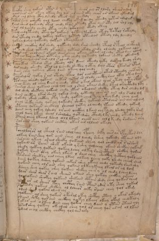

# Voynich Speculative Herbal Ferment Recipe — f116r

IMPORTANT: this is NOT a real or validated translation of the Voynich Manuscript. It is a speculative/procedural model that interprets EVA using a user-defined grammar to generate experimental recipes using safe, known edible substitutes.

This file is generated automatically from IVTFF/EVA transliteration plus a user-defined procedural grammar.



## Page / Folio
- currier: B
- folio: f116r
- page_number: 234

## EVA Text (Transliteration)
```text
kchdpy shey qokain otalsh[?:e]dy qoteey shear ain or llory i'hearamom
shain cheor ain okeey okeey shy lar ar aiiin oky char ar okain ykanam
dain chl lshey cthy lshedy oteor shey qo saly
padar shey osheeky qol laiin chckhy okam chedy oteedy qotar aralar y
dain sheed qokchdy otal chedy lkain oteedy otor aiin oty lol rol oly
sain ol lchedy chedy otey chedy ykolain otedy oteey
pcholchdy teody otey qo qokain qoteey tokain otedy totol rotydy
dar yteedy chedy qokeey qokain qotody oteedar otedy ldy lchedy
qokeey lchey qokeedy qokain okeeylkaiin
chd?in checkhy dar shedy qokeedy shdy rain sheedy cphol r teol chcpham
ol aiin shed qoteedy okeolshy qotain okedy chedy olchedy olkain als
qo?in ar cholches okain dain cheey okeey otain olchdy otal d[a:?]in olam
sar ain tey chetain shtch'ey okey chedy qoteedy qokain shety okeedam
sain cheychear ain chl l s oleedy
pchoetal otedal otal oteedy olr daiin okeedy qoky dar al keedy shdy
dar chedy sheedy otal al lchedy shcthy qotey dain otar otarar opam
dain chey qokeey okeey lain okeey qol chedy
pchar[a:o]lor qokey r ain otedy opain lor oiin otain otar oteeedy ches ar y
porchey sheedy qotain chetar qotar ar arody chcthy rain otey ot y dain
chol keedy ol cheey raiin y chedy otar o kal okain olar otedy qoty sf?m
sairol sheey qokain chal qol chl l rain okain shckhy dtal orchcthdy lty
dol shedy shekchy qokain chedy otar okalain shcthy oteey dar chedy lg
dain cheeteey lkar shedy qokal shedy qoteedy ches ain ain aly salo lm
qokedy okain chcthy oty shedy qokeey chalkeey okey kedy chey lag
chol sheky shedy qokeey qokeedy shckhy qokain otal ches oin ain al om
ytchey qokaiin chckhol shechol qotey ol cheedy otain okedy qotam
daiin chey qokey lshedy orain chckhy lkain chy pshedy lshedy qoky ram
cheol lchey lkeey sheal lshalshy qotalshy cthedy l ky chedy oteedy lched
cthan cheey lkeeal lshey chl l lkain chear aiin chl l keedy raraiin ory
saraiin shey qokain chcthy okar air ollaiin okaly
pchall[a:o]rar al ckhal rain alolfchy rpchey shfy ches ar opchekan dlr
olkeey rain shey qor aiin shey ol lchedy rshey qokeedy chtain oly
soraiin ykeey arain sheeky qokain sheey qol cheds ar r [?:a]rsheg
qokain ar raiin shek okain y r shey qolchey okaiin shckhy qokam
shedy qokeey qokain qokeey lchey olkey raiin cthar shckhy qorar
qokeey rain shey okeey lkain l dain chey sheckhy qcthhy qokl ain
pairain sheek l y oiin cheey lkeey olkeey lchey qoky lshedy cheam sham
daiin qokeey lshey qokaiin chkar shey okaiin chedy qokeedy raiin shy
qokain chey olr ain shey qokain o l keey keeey lkeal or al lom
dsheey shey qokey shey qokain shckhy chery ol chedy l chey lchy
dlar shar shar r ain sheain okain shey qokchy chckhy orain
qo qokain sheckhy qokain shekain shkain shedy shey qokan cham
[a:o]s??? ar al shear teey chcphy rain cphan ydar oty shey qokam
s[?:o] o[k:?]eedy qokain shckhy ol lcheor chky raiin chey qol okam
odain sh??y qoka[r:s] oleey chy
oqokaiin al shey qokar okaral okeyshcphhy oteey ookar okydy
osain shky qorain chckhey qokey lkechy okeey okal chedkaly
sykar ain olkeey dainchey qokar chey dain y otan otain oly
sysor shey qokey okeolan chey qol or cheey qor arom ol lkan
sodal ch al chcthy chckhy qol ain ary
```

## Recipes Index (This Page)
- [f116r.1,@P0](#f116r-1-f116r-1-p0)
- [f116r.2,+P0](#f116r-2-f116r-2-p0)
- [f116r.3,+P0](#f116r-3-f116r-3-p0)
- [f116r.4,+P0](#f116r-4-f116r-4-p0)
- [f116r.5,+P0](#f116r-5-f116r-5-p0)
- [f116r.6,+P0](#f116r-6-f116r-6-p0)
- [f116r.7,+P0](#f116r-7-f116r-7-p0)
- [f116r.8,+P0](#f116r-8-f116r-8-p0)
- [f116r.9,+P0](#f116r-9-f116r-9-p0)
- [f116r.10,+P0](#f116r-10-f116r-10-p0)
- [f116r.11,+P0](#f116r-11-f116r-11-p0)
- [f116r.12,+P0](#f116r-12-f116r-12-p0)
- [f116r.13,+P0](#f116r-13-f116r-13-p0)
- [f116r.14,+P0](#f116r-14-f116r-14-p0)
- [f116r.15,+P0](#f116r-15-f116r-15-p0)
- [f116r.16,+P0](#f116r-16-f116r-16-p0)
- [f116r.17,+P0](#f116r-17-f116r-17-p0)
- [f116r.18,+P0](#f116r-18-f116r-18-p0)
- [f116r.19,+P0](#f116r-19-f116r-19-p0)
- [f116r.20,+P0](#f116r-20-f116r-20-p0)
- [f116r.21,+P0](#f116r-21-f116r-21-p0)
- [f116r.22,+P0](#f116r-22-f116r-22-p0)
- [f116r.23,+P0](#f116r-23-f116r-23-p0)
- [f116r.24,+P0](#f116r-24-f116r-24-p0)
- [f116r.25,+P0](#f116r-25-f116r-25-p0)
- [f116r.26,+P0](#f116r-26-f116r-26-p0)
- [f116r.27,+P0](#f116r-27-f116r-27-p0)
- [f116r.28,+P0](#f116r-28-f116r-28-p0)
- [f116r.29,+P0](#f116r-29-f116r-29-p0)
- [f116r.30,+P0](#f116r-30-f116r-30-p0)
- [f116r.31,+P0](#f116r-31-f116r-31-p0)
- [f116r.32,+P0](#f116r-32-f116r-32-p0)
- [f116r.33,+P0](#f116r-33-f116r-33-p0)
- [f116r.34,+P0](#f116r-34-f116r-34-p0)
- [f116r.35,+P0](#f116r-35-f116r-35-p0)
- [f116r.36,+P0](#f116r-36-f116r-36-p0)
- [f116r.37,+P0](#f116r-37-f116r-37-p0)
- [f116r.38,+P0](#f116r-38-f116r-38-p0)
- [f116r.39,+P0](#f116r-39-f116r-39-p0)
- [f116r.40,+P0](#f116r-40-f116r-40-p0)
- [f116r.41,+P0](#f116r-41-f116r-41-p0)
- [f116r.42,+P0](#f116r-42-f116r-42-p0)
- [f116r.43,+P0](#f116r-43-f116r-43-p0)
- [f116r.44,+P0](#f116r-44-f116r-44-p0)
- [f116r.45,+P0](#f116r-45-f116r-45-p0)
- [f116r.46,+P0](#f116r-46-f116r-46-p0)
- [f116r.47,+P0](#f116r-47-f116r-47-p0)
- [f116r.48,+P0](#f116r-48-f116r-48-p0)
- [f116r.49,+P0](#f116r-49-f116r-49-p0)
- [f116r.50,+P0](#f116r-50-f116r-50-p0)

## Line Glosses (Procedural Gloss Only; Not a Translation)

<a id="f116r-1-f116r-1-p0"></a>

### f116r.1,@P0

EVA: kchdpy shey qokain otalsh[?:e]dy qoteey shear ain or llory i'hearamom

Direct Gloss (Procedural, Not a Real Translation):
- kchdpy: add fermentable sugars → add main plant (safe substitute) → start fermentation (yeast)
- shey: add secondary herb (safe substitute) → duration level 1 → state: active extraction
- qokain: prepare liquid base → add fermentable sugars → duration level 1 → state: fermentation start
- otalsh: apply heat/cooking → add secondary herb (safe substitute) → mix / transfer → duration level 1 → state: fermentation start
- e: duration level 1 → state: active extraction
- dy: start fermentation (yeast)
- qoteey: prepare liquid base → apply heat/cooking → duration level 2 → state: active extraction
- shear: add secondary herb (safe substitute) → duration level 1 → state: active extraction
- ain: duration level 1 → state: fermentation start
- or: mix / transfer
- llory: mix / transfer
- i: duration level 1 → state: cooling/rest
- hearamom: mix / transfer → duration level 1 → state: active extraction

<a id="f116r-2-f116r-2-p0"></a>

### f116r.2,+P0

EVA: shain cheor ain okeey okeey shy lar ar aiiin oky char ar okain ykanam

Direct Gloss (Procedural, Not a Real Translation):
- shain: add secondary herb (safe substitute) → duration level 1 → state: fermentation start
- cheor: add main plant (safe substitute) → mix / transfer → duration level 1 → state: active extraction
- ain: duration level 1 → state: fermentation start
- okeey: add fermentable sugars → mix / transfer → duration level 2 → state: active extraction
- okeey: add fermentable sugars → mix / transfer → duration level 2 → state: active extraction
- shy: add secondary herb (safe substitute)
- lar: duration level 1 → state: fermentation start
- ar: duration level 1 → state: fermentation start
- aiiin: duration level 1 → state: fermentation start → medium fermentation phase
- oky: add fermentable sugars → mix / transfer
- char: add main plant (safe substitute) → duration level 1 → state: fermentation start
- ar: duration level 1 → state: fermentation start
- okain: add fermentable sugars → mix / transfer → duration level 1 → state: fermentation start
- ykanam: add fermentable sugars → duration level 1 → state: fermentation start

<a id="f116r-3-f116r-3-p0"></a>

### f116r.3,+P0

EVA: dain chl lshey cthy lshedy oteor shey qo saly

Direct Gloss (Procedural, Not a Real Translation):
- dain: start fermentation (yeast) → duration level 1 → state: fermentation start
- chl: add main plant (safe substitute)
- lshey: add secondary herb (safe substitute) → duration level 1 → state: active extraction
- cthy: add complex herbal compound (safe blend)
- lshedy: add secondary herb (safe substitute) → start fermentation (yeast) → duration level 1 → state: active extraction
- oteor: apply heat/cooking → mix / transfer → duration level 1 → state: active extraction
- shey: add secondary herb (safe substitute) → duration level 1 → state: active extraction
- qo: prepare liquid base
- saly: duration level 1 → state: fermentation start

<a id="f116r-4-f116r-4-p0"></a>

### f116r.4,+P0

EVA: padar shey osheeky qol laiin chckhy okam chedy oteedy qotar aralar y

Direct Gloss (Procedural, Not a Real Translation):
- padar: start fermentation (yeast) → duration level 1 → state: fermentation start
- shey: add secondary herb (safe substitute) → duration level 1 → state: active extraction
- osheeky: add fermentable sugars → add secondary herb (safe substitute) → mix / transfer → duration level 2 → state: active extraction
- qol: prepare liquid base
- laiin: duration level 1 → state: fermentation start → long fermentation / aging phase
- chckhy: add main plant (safe substitute) → add complex herbal compound (safe blend)
- okam: add fermentable sugars → mix / transfer → duration level 1 → state: fermentation start
- chedy: add main plant (safe substitute) → start fermentation (yeast) → duration level 1 → state: active extraction
- oteedy: apply heat/cooking → mix / transfer → start fermentation (yeast) → duration level 2 → state: active extraction
- qotar: prepare liquid base → apply heat/cooking → duration level 1 → state: fermentation start
- aralar: duration level 1 → state: fermentation start
- y: [unparsed]

<a id="f116r-5-f116r-5-p0"></a>

### f116r.5,+P0

EVA: dain sheed qokchdy otal chedy lkain oteedy otor aiin oty lol rol oly

Direct Gloss (Procedural, Not a Real Translation):
- dain: start fermentation (yeast) → duration level 1 → state: fermentation start
- sheed: add secondary herb (safe substitute) → start fermentation (yeast) → duration level 2 → state: active extraction
- qokchdy: prepare liquid base → add fermentable sugars → add main plant (safe substitute) → start fermentation (yeast)
- otal: apply heat/cooking → mix / transfer → duration level 1 → state: fermentation start
- chedy: add main plant (safe substitute) → start fermentation (yeast) → duration level 1 → state: active extraction
- lkain: add fermentable sugars → duration level 1 → state: fermentation start
- oteedy: apply heat/cooking → mix / transfer → start fermentation (yeast) → duration level 2 → state: active extraction
- otor: apply heat/cooking → mix / transfer
- aiin: duration level 1 → state: fermentation start → long fermentation / aging phase
- oty: apply heat/cooking → mix / transfer
- lol: mix / transfer
- rol: mix / transfer
- oly: mix / transfer

<a id="f116r-6-f116r-6-p0"></a>

### f116r.6,+P0

EVA: sain ol lchedy chedy otey chedy ykolain otedy oteey

Direct Gloss (Procedural, Not a Real Translation):
- sain: duration level 1 → state: fermentation start
- ol: mix / transfer
- lchedy: add main plant (safe substitute) → start fermentation (yeast) → duration level 1 → state: active extraction
- chedy: add main plant (safe substitute) → start fermentation (yeast) → duration level 1 → state: active extraction
- otey: apply heat/cooking → mix / transfer → duration level 1 → state: active extraction
- chedy: add main plant (safe substitute) → start fermentation (yeast) → duration level 1 → state: active extraction
- ykolain: add fermentable sugars → mix / transfer → duration level 1 → state: fermentation start
- otedy: apply heat/cooking → mix / transfer → start fermentation (yeast) → duration level 1 → state: active extraction
- oteey: apply heat/cooking → mix / transfer → duration level 2 → state: active extraction

<a id="f116r-7-f116r-7-p0"></a>

### f116r.7,+P0

EVA: pcholchdy teody otey qo qokain qoteey tokain otedy totol rotydy

Direct Gloss (Procedural, Not a Real Translation):
- pcholchdy: add main plant (safe substitute) → mix / transfer → start fermentation (yeast)
- teody: apply heat/cooking → mix / transfer → start fermentation (yeast) → duration level 1 → state: active extraction
- otey: apply heat/cooking → mix / transfer → duration level 1 → state: active extraction
- qo: prepare liquid base
- qokain: prepare liquid base → add fermentable sugars → duration level 1 → state: fermentation start
- qoteey: prepare liquid base → apply heat/cooking → duration level 2 → state: active extraction
- tokain: add fermentable sugars → apply heat/cooking → mix / transfer → duration level 1 → state: fermentation start
- otedy: apply heat/cooking → mix / transfer → start fermentation (yeast) → duration level 1 → state: active extraction
- totol: apply heat/cooking → mix / transfer
- rotydy: apply heat/cooking → mix / transfer → start fermentation (yeast)

<a id="f116r-8-f116r-8-p0"></a>

### f116r.8,+P0

EVA: dar yteedy chedy qokeey qokain qotody oteedar otedy ldy lchedy

Direct Gloss (Procedural, Not a Real Translation):
- dar: start fermentation (yeast) → duration level 1 → state: fermentation start
- yteedy: apply heat/cooking → start fermentation (yeast) → duration level 2 → state: active extraction
- chedy: add main plant (safe substitute) → start fermentation (yeast) → duration level 1 → state: active extraction
- qokeey: prepare liquid base → add fermentable sugars → duration level 2 → state: active extraction
- qokain: prepare liquid base → add fermentable sugars → duration level 1 → state: fermentation start
- qotody: prepare liquid base → apply heat/cooking → mix / transfer → start fermentation (yeast)
- oteedar: apply heat/cooking → mix / transfer → start fermentation (yeast) → duration level 2 → state: active extraction
- otedy: apply heat/cooking → mix / transfer → start fermentation (yeast) → duration level 1 → state: active extraction
- ldy: start fermentation (yeast)
- lchedy: add main plant (safe substitute) → start fermentation (yeast) → duration level 1 → state: active extraction

<a id="f116r-9-f116r-9-p0"></a>

### f116r.9,+P0

EVA: qokeey lchey qokeedy qokain okeeylkaiin

Direct Gloss (Procedural, Not a Real Translation):
- qokeey: prepare liquid base → add fermentable sugars → duration level 2 → state: active extraction
- lchey: add main plant (safe substitute) → duration level 1 → state: active extraction
- qokeedy: prepare liquid base → add fermentable sugars → start fermentation (yeast) → duration level 2 → state: active extraction
- qokain: prepare liquid base → add fermentable sugars → duration level 1 → state: fermentation start
- okeeylkaiin: add fermentable sugars → mix / transfer → duration level 2 → state: active extraction → long fermentation / aging phase

<a id="f116r-10-f116r-10-p0"></a>

### f116r.10,+P0

EVA: chd?in checkhy dar shedy qokeedy shdy rain sheedy cphol r teol chcpham

Direct Gloss (Procedural, Not a Real Translation):
- chd: add main plant (safe substitute) → start fermentation (yeast)
- in: duration level 1 → state: cooling/rest
- checkhy: add main plant (safe substitute) → add complex herbal compound (safe blend) → duration level 1 → state: active extraction
- dar: start fermentation (yeast) → duration level 1 → state: fermentation start
- shedy: add secondary herb (safe substitute) → start fermentation (yeast) → duration level 1 → state: active extraction
- qokeedy: prepare liquid base → add fermentable sugars → start fermentation (yeast) → duration level 2 → state: active extraction
- shdy: add secondary herb (safe substitute) → start fermentation (yeast)
- rain: duration level 1 → state: fermentation start
- sheedy: add secondary herb (safe substitute) → start fermentation (yeast) → duration level 2 → state: active extraction
- cphol: mix / transfer → add complex herbal compound (safe blend)
- r: [unparsed]
- teol: apply heat/cooking → mix / transfer → duration level 1 → state: active extraction
- chcpham: add main plant (safe substitute) → add complex herbal compound (safe blend) → duration level 1 → state: fermentation start

<a id="f116r-11-f116r-11-p0"></a>

### f116r.11,+P0

EVA: ol aiin shed qoteedy okeolshy qotain okedy chedy olchedy olkain als

Direct Gloss (Procedural, Not a Real Translation):
- ol: mix / transfer
- aiin: duration level 1 → state: fermentation start → long fermentation / aging phase
- shed: add secondary herb (safe substitute) → start fermentation (yeast) → duration level 1 → state: active extraction
- qoteedy: prepare liquid base → apply heat/cooking → start fermentation (yeast) → duration level 2 → state: active extraction
- okeolshy: add fermentable sugars → add secondary herb (safe substitute) → mix / transfer → duration level 1 → state: active extraction
- qotain: prepare liquid base → apply heat/cooking → duration level 1 → state: fermentation start
- okedy: add fermentable sugars → mix / transfer → start fermentation (yeast) → duration level 1 → state: active extraction
- chedy: add main plant (safe substitute) → start fermentation (yeast) → duration level 1 → state: active extraction
- olchedy: add main plant (safe substitute) → mix / transfer → start fermentation (yeast) → duration level 1 → state: active extraction
- olkain: add fermentable sugars → mix / transfer → duration level 1 → state: fermentation start
- als: duration level 1 → state: fermentation start

<a id="f116r-12-f116r-12-p0"></a>

### f116r.12,+P0

EVA: qo?in ar cholches okain dain cheey okeey otain olchdy otal d[a:?]in olam

Direct Gloss (Procedural, Not a Real Translation):
- qo: prepare liquid base
- in: duration level 1 → state: cooling/rest
- ar: duration level 1 → state: fermentation start
- cholches: add main plant (safe substitute) → mix / transfer → duration level 1 → state: active extraction
- okain: add fermentable sugars → mix / transfer → duration level 1 → state: fermentation start
- dain: start fermentation (yeast) → duration level 1 → state: fermentation start
- cheey: add main plant (safe substitute) → duration level 2 → state: active extraction
- okeey: add fermentable sugars → mix / transfer → duration level 2 → state: active extraction
- otain: apply heat/cooking → mix / transfer → duration level 1 → state: fermentation start
- olchdy: add main plant (safe substitute) → mix / transfer → start fermentation (yeast)
- otal: apply heat/cooking → mix / transfer → duration level 1 → state: fermentation start
- d: start fermentation (yeast)
- a: duration level 1 → state: fermentation start
- in: duration level 1 → state: cooling/rest
- olam: mix / transfer → duration level 1 → state: fermentation start

<a id="f116r-13-f116r-13-p0"></a>

### f116r.13,+P0

EVA: sar ain tey chetain shtch'ey okey chedy qoteedy qokain shety okeedam

Direct Gloss (Procedural, Not a Real Translation):
- sar: duration level 1 → state: fermentation start
- ain: duration level 1 → state: fermentation start
- tey: apply heat/cooking → duration level 1 → state: active extraction
- chetain: apply heat/cooking → add main plant (safe substitute) → duration level 1 → state: active extraction
- shtch: apply heat/cooking → add main plant (safe substitute) → add secondary herb (safe substitute)
- ey: duration level 1 → state: active extraction
- okey: add fermentable sugars → mix / transfer → duration level 1 → state: active extraction
- chedy: add main plant (safe substitute) → start fermentation (yeast) → duration level 1 → state: active extraction
- qoteedy: prepare liquid base → apply heat/cooking → start fermentation (yeast) → duration level 2 → state: active extraction
- qokain: prepare liquid base → add fermentable sugars → duration level 1 → state: fermentation start
- shety: apply heat/cooking → add secondary herb (safe substitute) → duration level 1 → state: active extraction
- okeedam: add fermentable sugars → mix / transfer → start fermentation (yeast) → duration level 2 → state: active extraction

<a id="f116r-14-f116r-14-p0"></a>

### f116r.14,+P0

EVA: sain cheychear ain chl l s oleedy

Direct Gloss (Procedural, Not a Real Translation):
- sain: duration level 1 → state: fermentation start
- cheychear: add main plant (safe substitute) → duration level 1 → state: active extraction
- ain: duration level 1 → state: fermentation start
- chl: add main plant (safe substitute)
- l: [unparsed]
- s: [unparsed]
- oleedy: mix / transfer → start fermentation (yeast) → duration level 2 → state: active extraction

<a id="f116r-15-f116r-15-p0"></a>

### f116r.15,+P0

EVA: pchoetal otedal otal oteedy olr daiin okeedy qoky dar al keedy shdy

Direct Gloss (Procedural, Not a Real Translation):
- pchoetal: apply heat/cooking → add main plant (safe substitute) → mix / transfer → start fermentation (yeast) → duration level 1 → state: active extraction
- otedal: apply heat/cooking → mix / transfer → start fermentation (yeast) → duration level 1 → state: active extraction
- otal: apply heat/cooking → mix / transfer → duration level 1 → state: fermentation start
- oteedy: apply heat/cooking → mix / transfer → start fermentation (yeast) → duration level 2 → state: active extraction
- olr: mix / transfer
- daiin: start fermentation (yeast) → duration level 1 → state: fermentation start → long fermentation / aging phase
- okeedy: add fermentable sugars → mix / transfer → start fermentation (yeast) → duration level 2 → state: active extraction
- qoky: prepare liquid base → add fermentable sugars
- dar: start fermentation (yeast) → duration level 1 → state: fermentation start
- al: duration level 1 → state: fermentation start
- keedy: add fermentable sugars → start fermentation (yeast) → duration level 2 → state: active extraction
- shdy: add secondary herb (safe substitute) → start fermentation (yeast)

<a id="f116r-16-f116r-16-p0"></a>

### f116r.16,+P0

EVA: dar chedy sheedy otal al lchedy shcthy qotey dain otar otarar opam

Direct Gloss (Procedural, Not a Real Translation):
- dar: start fermentation (yeast) → duration level 1 → state: fermentation start
- chedy: add main plant (safe substitute) → start fermentation (yeast) → duration level 1 → state: active extraction
- sheedy: add secondary herb (safe substitute) → start fermentation (yeast) → duration level 2 → state: active extraction
- otal: apply heat/cooking → mix / transfer → duration level 1 → state: fermentation start
- al: duration level 1 → state: fermentation start
- lchedy: add main plant (safe substitute) → start fermentation (yeast) → duration level 1 → state: active extraction
- shcthy: add secondary herb (safe substitute) → add complex herbal compound (safe blend)
- qotey: prepare liquid base → apply heat/cooking → duration level 1 → state: active extraction
- dain: start fermentation (yeast) → duration level 1 → state: fermentation start
- otar: apply heat/cooking → mix / transfer → duration level 1 → state: fermentation start
- otarar: apply heat/cooking → mix / transfer → duration level 1 → state: fermentation start
- opam: mix / transfer → start fermentation (yeast) → duration level 1 → state: fermentation start

<a id="f116r-17-f116r-17-p0"></a>

### f116r.17,+P0

EVA: dain chey qokeey okeey lain okeey qol chedy

Direct Gloss (Procedural, Not a Real Translation):
- dain: start fermentation (yeast) → duration level 1 → state: fermentation start
- chey: add main plant (safe substitute) → duration level 1 → state: active extraction
- qokeey: prepare liquid base → add fermentable sugars → duration level 2 → state: active extraction
- okeey: add fermentable sugars → mix / transfer → duration level 2 → state: active extraction
- lain: duration level 1 → state: fermentation start
- okeey: add fermentable sugars → mix / transfer → duration level 2 → state: active extraction
- qol: prepare liquid base
- chedy: add main plant (safe substitute) → start fermentation (yeast) → duration level 1 → state: active extraction

<a id="f116r-18-f116r-18-p0"></a>

### f116r.18,+P0

EVA: pchar[a:o]lor qokey r ain otedy opain lor oiin otain otar oteeedy ches ar y

Direct Gloss (Procedural, Not a Real Translation):
- pchar: add main plant (safe substitute) → start fermentation (yeast) → duration level 1 → state: fermentation start
- a: duration level 1 → state: fermentation start
- o: mix / transfer
- lor: mix / transfer
- qokey: prepare liquid base → add fermentable sugars → duration level 1 → state: active extraction
- r: [unparsed]
- ain: duration level 1 → state: fermentation start
- otedy: apply heat/cooking → mix / transfer → start fermentation (yeast) → duration level 1 → state: active extraction
- opain: mix / transfer → start fermentation (yeast) → duration level 1 → state: fermentation start
- lor: mix / transfer
- oiin: mix / transfer → duration level 2 → state: cooling/rest → medium fermentation phase
- otain: apply heat/cooking → mix / transfer → duration level 1 → state: fermentation start
- otar: apply heat/cooking → mix / transfer → duration level 1 → state: fermentation start
- oteeedy: apply heat/cooking → mix / transfer → start fermentation (yeast) → duration level 3 → state: active extraction
- ches: add main plant (safe substitute) → duration level 1 → state: active extraction
- ar: duration level 1 → state: fermentation start
- y: [unparsed]

<a id="f116r-19-f116r-19-p0"></a>

### f116r.19,+P0

EVA: porchey sheedy qotain chetar qotar ar arody chcthy rain otey ot y dain

Direct Gloss (Procedural, Not a Real Translation):
- porchey: add main plant (safe substitute) → mix / transfer → start fermentation (yeast) → duration level 1 → state: active extraction
- sheedy: add secondary herb (safe substitute) → start fermentation (yeast) → duration level 2 → state: active extraction
- qotain: prepare liquid base → apply heat/cooking → duration level 1 → state: fermentation start
- chetar: apply heat/cooking → add main plant (safe substitute) → duration level 1 → state: active extraction
- qotar: prepare liquid base → apply heat/cooking → duration level 1 → state: fermentation start
- ar: duration level 1 → state: fermentation start
- arody: mix / transfer → start fermentation (yeast) → duration level 1 → state: fermentation start
- chcthy: add main plant (safe substitute) → add complex herbal compound (safe blend)
- rain: duration level 1 → state: fermentation start
- otey: apply heat/cooking → mix / transfer → duration level 1 → state: active extraction
- ot: apply heat/cooking → mix / transfer
- y: [unparsed]
- dain: start fermentation (yeast) → duration level 1 → state: fermentation start

<a id="f116r-20-f116r-20-p0"></a>

### f116r.20,+P0

EVA: chol keedy ol cheey raiin y chedy otar o kal okain olar otedy qoty sf?m

Direct Gloss (Procedural, Not a Real Translation):
- chol: add main plant (safe substitute) → mix / transfer
- keedy: add fermentable sugars → start fermentation (yeast) → duration level 2 → state: active extraction
- ol: mix / transfer
- cheey: add main plant (safe substitute) → duration level 2 → state: active extraction
- raiin: duration level 1 → state: fermentation start → long fermentation / aging phase
- y: [unparsed]
- chedy: add main plant (safe substitute) → start fermentation (yeast) → duration level 1 → state: active extraction
- otar: apply heat/cooking → mix / transfer → duration level 1 → state: fermentation start
- o: mix / transfer
- kal: add fermentable sugars → duration level 1 → state: fermentation start
- okain: add fermentable sugars → mix / transfer → duration level 1 → state: fermentation start
- olar: mix / transfer → duration level 1 → state: fermentation start
- otedy: apply heat/cooking → mix / transfer → start fermentation (yeast) → duration level 1 → state: active extraction
- qoty: prepare liquid base → apply heat/cooking
- sf: add aroma modifier
- m: [unparsed]

<a id="f116r-21-f116r-21-p0"></a>

### f116r.21,+P0

EVA: sairol sheey qokain chal qol chl l rain okain shckhy dtal orchcthdy lty

Direct Gloss (Procedural, Not a Real Translation):
- sairol: mix / transfer → duration level 1 → state: fermentation start
- sheey: add secondary herb (safe substitute) → duration level 2 → state: active extraction
- qokain: prepare liquid base → add fermentable sugars → duration level 1 → state: fermentation start
- chal: add main plant (safe substitute) → duration level 1 → state: fermentation start
- qol: prepare liquid base
- chl: add main plant (safe substitute)
- l: [unparsed]
- rain: duration level 1 → state: fermentation start
- okain: add fermentable sugars → mix / transfer → duration level 1 → state: fermentation start
- shckhy: add secondary herb (safe substitute) → add complex herbal compound (safe blend)
- dtal: apply heat/cooking → start fermentation (yeast) → duration level 1 → state: fermentation start
- orchcthdy: add main plant (safe substitute) → mix / transfer → start fermentation (yeast) → add complex herbal compound (safe blend)
- lty: apply heat/cooking

<a id="f116r-22-f116r-22-p0"></a>

### f116r.22,+P0

EVA: dol shedy shekchy qokain chedy otar okalain shcthy oteey dar chedy lg

Direct Gloss (Procedural, Not a Real Translation):
- dol: mix / transfer → start fermentation (yeast)
- shedy: add secondary herb (safe substitute) → start fermentation (yeast) → duration level 1 → state: active extraction
- shekchy: add fermentable sugars → add main plant (safe substitute) → add secondary herb (safe substitute) → duration level 1 → state: active extraction
- qokain: prepare liquid base → add fermentable sugars → duration level 1 → state: fermentation start
- chedy: add main plant (safe substitute) → start fermentation (yeast) → duration level 1 → state: active extraction
- otar: apply heat/cooking → mix / transfer → duration level 1 → state: fermentation start
- okalain: add fermentable sugars → mix / transfer → duration level 1 → state: fermentation start
- shcthy: add secondary herb (safe substitute) → add complex herbal compound (safe blend)
- oteey: apply heat/cooking → mix / transfer → duration level 2 → state: active extraction
- dar: start fermentation (yeast) → duration level 1 → state: fermentation start
- chedy: add main plant (safe substitute) → start fermentation (yeast) → duration level 1 → state: active extraction
- lg: [unparsed]

<a id="f116r-23-f116r-23-p0"></a>

### f116r.23,+P0

EVA: dain cheeteey lkar shedy qokal shedy qoteedy ches ain ain aly salo lm

Direct Gloss (Procedural, Not a Real Translation):
- dain: start fermentation (yeast) → duration level 1 → state: fermentation start
- cheeteey: apply heat/cooking → add main plant (safe substitute) → duration level 2 → state: active extraction
- lkar: add fermentable sugars → duration level 1 → state: fermentation start
- shedy: add secondary herb (safe substitute) → start fermentation (yeast) → duration level 1 → state: active extraction
- qokal: prepare liquid base → add fermentable sugars → duration level 1 → state: fermentation start
- shedy: add secondary herb (safe substitute) → start fermentation (yeast) → duration level 1 → state: active extraction
- qoteedy: prepare liquid base → apply heat/cooking → start fermentation (yeast) → duration level 2 → state: active extraction
- ches: add main plant (safe substitute) → duration level 1 → state: active extraction
- ain: duration level 1 → state: fermentation start
- ain: duration level 1 → state: fermentation start
- aly: duration level 1 → state: fermentation start
- salo: mix / transfer → duration level 1 → state: fermentation start
- lm: [unparsed]

<a id="f116r-24-f116r-24-p0"></a>

### f116r.24,+P0

EVA: qokedy okain chcthy oty shedy qokeey chalkeey okey kedy chey lag

Direct Gloss (Procedural, Not a Real Translation):
- qokedy: prepare liquid base → add fermentable sugars → start fermentation (yeast) → duration level 1 → state: active extraction
- okain: add fermentable sugars → mix / transfer → duration level 1 → state: fermentation start
- chcthy: add main plant (safe substitute) → add complex herbal compound (safe blend)
- oty: apply heat/cooking → mix / transfer
- shedy: add secondary herb (safe substitute) → start fermentation (yeast) → duration level 1 → state: active extraction
- qokeey: prepare liquid base → add fermentable sugars → duration level 2 → state: active extraction
- chalkeey: add fermentable sugars → add main plant (safe substitute) → duration level 1 → state: fermentation start
- okey: add fermentable sugars → mix / transfer → duration level 1 → state: active extraction
- kedy: add fermentable sugars → start fermentation (yeast) → duration level 1 → state: active extraction
- chey: add main plant (safe substitute) → duration level 1 → state: active extraction
- lag: duration level 1 → state: fermentation start

<a id="f116r-25-f116r-25-p0"></a>

### f116r.25,+P0

EVA: chol sheky shedy qokeey qokeedy shckhy qokain otal ches oin ain al om

Direct Gloss (Procedural, Not a Real Translation):
- chol: add main plant (safe substitute) → mix / transfer
- sheky: add fermentable sugars → add secondary herb (safe substitute) → duration level 1 → state: active extraction
- shedy: add secondary herb (safe substitute) → start fermentation (yeast) → duration level 1 → state: active extraction
- qokeey: prepare liquid base → add fermentable sugars → duration level 2 → state: active extraction
- qokeedy: prepare liquid base → add fermentable sugars → start fermentation (yeast) → duration level 2 → state: active extraction
- shckhy: add secondary herb (safe substitute) → add complex herbal compound (safe blend)
- qokain: prepare liquid base → add fermentable sugars → duration level 1 → state: fermentation start
- otal: apply heat/cooking → mix / transfer → duration level 1 → state: fermentation start
- ches: add main plant (safe substitute) → duration level 1 → state: active extraction
- oin: mix / transfer → duration level 1 → state: cooling/rest
- ain: duration level 1 → state: fermentation start
- al: duration level 1 → state: fermentation start
- om: mix / transfer

<a id="f116r-26-f116r-26-p0"></a>

### f116r.26,+P0

EVA: ytchey qokaiin chckhol shechol qotey ol cheedy otain okedy qotam

Direct Gloss (Procedural, Not a Real Translation):
- ytchey: apply heat/cooking → add main plant (safe substitute) → duration level 1 → state: active extraction
- qokaiin: prepare liquid base → add fermentable sugars → duration level 1 → state: fermentation start → long fermentation / aging phase
- chckhol: add main plant (safe substitute) → mix / transfer → add complex herbal compound (safe blend)
- shechol: add main plant (safe substitute) → add secondary herb (safe substitute) → mix / transfer → duration level 1 → state: active extraction
- qotey: prepare liquid base → apply heat/cooking → duration level 1 → state: active extraction
- ol: mix / transfer
- cheedy: add main plant (safe substitute) → start fermentation (yeast) → duration level 2 → state: active extraction
- otain: apply heat/cooking → mix / transfer → duration level 1 → state: fermentation start
- okedy: add fermentable sugars → mix / transfer → start fermentation (yeast) → duration level 1 → state: active extraction
- qotam: prepare liquid base → apply heat/cooking → duration level 1 → state: fermentation start

<a id="f116r-27-f116r-27-p0"></a>

### f116r.27,+P0

EVA: daiin chey qokey lshedy orain chckhy lkain chy pshedy lshedy qoky ram

Direct Gloss (Procedural, Not a Real Translation):
- daiin: start fermentation (yeast) → duration level 1 → state: fermentation start → long fermentation / aging phase
- chey: add main plant (safe substitute) → duration level 1 → state: active extraction
- qokey: prepare liquid base → add fermentable sugars → duration level 1 → state: active extraction
- lshedy: add secondary herb (safe substitute) → start fermentation (yeast) → duration level 1 → state: active extraction
- orain: mix / transfer → duration level 1 → state: fermentation start
- chckhy: add main plant (safe substitute) → add complex herbal compound (safe blend)
- lkain: add fermentable sugars → duration level 1 → state: fermentation start
- chy: add main plant (safe substitute)
- pshedy: add secondary herb (safe substitute) → start fermentation (yeast) → duration level 1 → state: active extraction
- lshedy: add secondary herb (safe substitute) → start fermentation (yeast) → duration level 1 → state: active extraction
- qoky: prepare liquid base → add fermentable sugars
- ram: duration level 1 → state: fermentation start

<a id="f116r-28-f116r-28-p0"></a>

### f116r.28,+P0

EVA: cheol lchey lkeey sheal lshalshy qotalshy cthedy l ky chedy oteedy lched

Direct Gloss (Procedural, Not a Real Translation):
- cheol: add main plant (safe substitute) → mix / transfer → duration level 1 → state: active extraction
- lchey: add main plant (safe substitute) → duration level 1 → state: active extraction
- lkeey: add fermentable sugars → duration level 2 → state: active extraction
- sheal: add secondary herb (safe substitute) → duration level 1 → state: active extraction
- lshalshy: add secondary herb (safe substitute) → duration level 1 → state: fermentation start
- qotalshy: prepare liquid base → apply heat/cooking → add secondary herb (safe substitute) → duration level 1 → state: fermentation start
- cthedy: start fermentation (yeast) → add complex herbal compound (safe blend) → duration level 1 → state: active extraction
- l: [unparsed]
- ky: add fermentable sugars
- chedy: add main plant (safe substitute) → start fermentation (yeast) → duration level 1 → state: active extraction
- oteedy: apply heat/cooking → mix / transfer → start fermentation (yeast) → duration level 2 → state: active extraction
- lched: add main plant (safe substitute) → start fermentation (yeast) → duration level 1 → state: active extraction

<a id="f116r-29-f116r-29-p0"></a>

### f116r.29,+P0

EVA: cthan cheey lkeeal lshey chl l lkain chear aiin chl l keedy raraiin ory

Direct Gloss (Procedural, Not a Real Translation):
- cthan: add complex herbal compound (safe blend) → duration level 1 → state: fermentation start
- cheey: add main plant (safe substitute) → duration level 2 → state: active extraction
- lkeeal: add fermentable sugars → duration level 2 → state: active extraction
- lshey: add secondary herb (safe substitute) → duration level 1 → state: active extraction
- chl: add main plant (safe substitute)
- l: [unparsed]
- lkain: add fermentable sugars → duration level 1 → state: fermentation start
- chear: add main plant (safe substitute) → duration level 1 → state: active extraction
- aiin: duration level 1 → state: fermentation start → long fermentation / aging phase
- chl: add main plant (safe substitute)
- l: [unparsed]
- keedy: add fermentable sugars → start fermentation (yeast) → duration level 2 → state: active extraction
- raraiin: duration level 1 → state: fermentation start → long fermentation / aging phase
- ory: mix / transfer

<a id="f116r-30-f116r-30-p0"></a>

### f116r.30,+P0

EVA: saraiin shey qokain chcthy okar air ollaiin okaly

Direct Gloss (Procedural, Not a Real Translation):
- saraiin: duration level 1 → state: fermentation start → long fermentation / aging phase
- shey: add secondary herb (safe substitute) → duration level 1 → state: active extraction
- qokain: prepare liquid base → add fermentable sugars → duration level 1 → state: fermentation start
- chcthy: add main plant (safe substitute) → add complex herbal compound (safe blend)
- okar: add fermentable sugars → mix / transfer → duration level 1 → state: fermentation start
- air: duration level 1 → state: fermentation start
- ollaiin: mix / transfer → duration level 1 → state: fermentation start → long fermentation / aging phase
- okaly: add fermentable sugars → mix / transfer → duration level 1 → state: fermentation start

<a id="f116r-31-f116r-31-p0"></a>

### f116r.31,+P0

EVA: pchall[a:o]rar al ckhal rain alolfchy rpchey shfy ches ar opchekan dlr

Direct Gloss (Procedural, Not a Real Translation):
- pchall: add main plant (safe substitute) → start fermentation (yeast) → duration level 1 → state: fermentation start
- a: duration level 1 → state: fermentation start
- o: mix / transfer
- rar: duration level 1 → state: fermentation start
- al: duration level 1 → state: fermentation start
- ckhal: add complex herbal compound (safe blend) → duration level 1 → state: fermentation start
- rain: duration level 1 → state: fermentation start
- alolfchy: add main plant (safe substitute) → add aroma modifier → mix / transfer → duration level 1 → state: fermentation start
- rpchey: add main plant (safe substitute) → start fermentation (yeast) → duration level 1 → state: active extraction
- shfy: add secondary herb (safe substitute) → add aroma modifier
- ches: add main plant (safe substitute) → duration level 1 → state: active extraction
- ar: duration level 1 → state: fermentation start
- opchekan: add fermentable sugars → add main plant (safe substitute) → mix / transfer → start fermentation (yeast) → duration level 1 → state: active extraction
- dlr: start fermentation (yeast)

<a id="f116r-32-f116r-32-p0"></a>

### f116r.32,+P0

EVA: olkeey rain shey qor aiin shey ol lchedy rshey qokeedy chtain oly

Direct Gloss (Procedural, Not a Real Translation):
- olkeey: add fermentable sugars → mix / transfer → duration level 2 → state: active extraction
- rain: duration level 1 → state: fermentation start
- shey: add secondary herb (safe substitute) → duration level 1 → state: active extraction
- qor: prepare liquid base
- aiin: duration level 1 → state: fermentation start → long fermentation / aging phase
- shey: add secondary herb (safe substitute) → duration level 1 → state: active extraction
- ol: mix / transfer
- lchedy: add main plant (safe substitute) → start fermentation (yeast) → duration level 1 → state: active extraction
- rshey: add secondary herb (safe substitute) → duration level 1 → state: active extraction
- qokeedy: prepare liquid base → add fermentable sugars → start fermentation (yeast) → duration level 2 → state: active extraction
- chtain: apply heat/cooking → add main plant (safe substitute) → duration level 1 → state: fermentation start
- oly: mix / transfer

<a id="f116r-33-f116r-33-p0"></a>

### f116r.33,+P0

EVA: soraiin ykeey arain sheeky qokain sheey qol cheds ar r [?:a]rsheg

Direct Gloss (Procedural, Not a Real Translation):
- soraiin: mix / transfer → duration level 1 → state: fermentation start → long fermentation / aging phase
- ykeey: add fermentable sugars → duration level 2 → state: active extraction
- arain: duration level 1 → state: fermentation start
- sheeky: add fermentable sugars → add secondary herb (safe substitute) → duration level 2 → state: active extraction
- qokain: prepare liquid base → add fermentable sugars → duration level 1 → state: fermentation start
- sheey: add secondary herb (safe substitute) → duration level 2 → state: active extraction
- qol: prepare liquid base
- cheds: add main plant (safe substitute) → start fermentation (yeast) → duration level 1 → state: active extraction
- ar: duration level 1 → state: fermentation start
- r: [unparsed]
- a: duration level 1 → state: fermentation start
- rsheg: add secondary herb (safe substitute) → duration level 1 → state: active extraction

<a id="f116r-34-f116r-34-p0"></a>

### f116r.34,+P0

EVA: qokain ar raiin shek okain y r shey qolchey okaiin shckhy qokam

Direct Gloss (Procedural, Not a Real Translation):
- qokain: prepare liquid base → add fermentable sugars → duration level 1 → state: fermentation start
- ar: duration level 1 → state: fermentation start
- raiin: duration level 1 → state: fermentation start → long fermentation / aging phase
- shek: add fermentable sugars → add secondary herb (safe substitute) → duration level 1 → state: active extraction
- okain: add fermentable sugars → mix / transfer → duration level 1 → state: fermentation start
- y: [unparsed]
- r: [unparsed]
- shey: add secondary herb (safe substitute) → duration level 1 → state: active extraction
- qolchey: prepare liquid base → add main plant (safe substitute) → duration level 1 → state: active extraction
- okaiin: add fermentable sugars → mix / transfer → duration level 1 → state: fermentation start → long fermentation / aging phase
- shckhy: add secondary herb (safe substitute) → add complex herbal compound (safe blend)
- qokam: prepare liquid base → add fermentable sugars → duration level 1 → state: fermentation start

<a id="f116r-35-f116r-35-p0"></a>

### f116r.35,+P0

EVA: shedy qokeey qokain qokeey lchey olkey raiin cthar shckhy qorar

Direct Gloss (Procedural, Not a Real Translation):
- shedy: add secondary herb (safe substitute) → start fermentation (yeast) → duration level 1 → state: active extraction
- qokeey: prepare liquid base → add fermentable sugars → duration level 2 → state: active extraction
- qokain: prepare liquid base → add fermentable sugars → duration level 1 → state: fermentation start
- qokeey: prepare liquid base → add fermentable sugars → duration level 2 → state: active extraction
- lchey: add main plant (safe substitute) → duration level 1 → state: active extraction
- olkey: add fermentable sugars → mix / transfer → duration level 1 → state: active extraction
- raiin: duration level 1 → state: fermentation start → long fermentation / aging phase
- cthar: add complex herbal compound (safe blend) → duration level 1 → state: fermentation start
- shckhy: add secondary herb (safe substitute) → add complex herbal compound (safe blend)
- qorar: prepare liquid base → duration level 1 → state: fermentation start

<a id="f116r-36-f116r-36-p0"></a>

### f116r.36,+P0

EVA: qokeey rain shey okeey lkain l dain chey sheckhy qcthhy qokl ain

Direct Gloss (Procedural, Not a Real Translation):
- qokeey: prepare liquid base → add fermentable sugars → duration level 2 → state: active extraction
- rain: duration level 1 → state: fermentation start
- shey: add secondary herb (safe substitute) → duration level 1 → state: active extraction
- okeey: add fermentable sugars → mix / transfer → duration level 2 → state: active extraction
- lkain: add fermentable sugars → duration level 1 → state: fermentation start
- l: [unparsed]
- dain: start fermentation (yeast) → duration level 1 → state: fermentation start
- chey: add main plant (safe substitute) → duration level 1 → state: active extraction
- sheckhy: add secondary herb (safe substitute) → add complex herbal compound (safe blend) → duration level 1 → state: active extraction
- qcthhy: prepare base (generic) → add complex herbal compound (safe blend)
- qokl: prepare liquid base → add fermentable sugars
- ain: duration level 1 → state: fermentation start

<a id="f116r-37-f116r-37-p0"></a>

### f116r.37,+P0

EVA: pairain sheek l y oiin cheey lkeey olkeey lchey qoky lshedy cheam sham

Direct Gloss (Procedural, Not a Real Translation):
- pairain: start fermentation (yeast) → duration level 1 → state: fermentation start
- sheek: add fermentable sugars → add secondary herb (safe substitute) → duration level 2 → state: active extraction
- l: [unparsed]
- y: [unparsed]
- oiin: mix / transfer → duration level 2 → state: cooling/rest → medium fermentation phase
- cheey: add main plant (safe substitute) → duration level 2 → state: active extraction
- lkeey: add fermentable sugars → duration level 2 → state: active extraction
- olkeey: add fermentable sugars → mix / transfer → duration level 2 → state: active extraction
- lchey: add main plant (safe substitute) → duration level 1 → state: active extraction
- qoky: prepare liquid base → add fermentable sugars
- lshedy: add secondary herb (safe substitute) → start fermentation (yeast) → duration level 1 → state: active extraction
- cheam: add main plant (safe substitute) → duration level 1 → state: active extraction
- sham: add secondary herb (safe substitute) → duration level 1 → state: fermentation start

<a id="f116r-38-f116r-38-p0"></a>

### f116r.38,+P0

EVA: daiin qokeey lshey qokaiin chkar shey okaiin chedy qokeedy raiin shy

Direct Gloss (Procedural, Not a Real Translation):
- daiin: start fermentation (yeast) → duration level 1 → state: fermentation start → long fermentation / aging phase
- qokeey: prepare liquid base → add fermentable sugars → duration level 2 → state: active extraction
- lshey: add secondary herb (safe substitute) → duration level 1 → state: active extraction
- qokaiin: prepare liquid base → add fermentable sugars → duration level 1 → state: fermentation start → long fermentation / aging phase
- chkar: add fermentable sugars → add main plant (safe substitute) → duration level 1 → state: fermentation start
- shey: add secondary herb (safe substitute) → duration level 1 → state: active extraction
- okaiin: add fermentable sugars → mix / transfer → duration level 1 → state: fermentation start → long fermentation / aging phase
- chedy: add main plant (safe substitute) → start fermentation (yeast) → duration level 1 → state: active extraction
- qokeedy: prepare liquid base → add fermentable sugars → start fermentation (yeast) → duration level 2 → state: active extraction
- raiin: duration level 1 → state: fermentation start → long fermentation / aging phase
- shy: add secondary herb (safe substitute)

<a id="f116r-39-f116r-39-p0"></a>

### f116r.39,+P0

EVA: qokain chey olr ain shey qokain o l keey keeey lkeal or al lom

Direct Gloss (Procedural, Not a Real Translation):
- qokain: prepare liquid base → add fermentable sugars → duration level 1 → state: fermentation start
- chey: add main plant (safe substitute) → duration level 1 → state: active extraction
- olr: mix / transfer
- ain: duration level 1 → state: fermentation start
- shey: add secondary herb (safe substitute) → duration level 1 → state: active extraction
- qokain: prepare liquid base → add fermentable sugars → duration level 1 → state: fermentation start
- o: mix / transfer
- l: [unparsed]
- keey: add fermentable sugars → duration level 2 → state: active extraction
- keeey: add fermentable sugars → duration level 3 → state: active extraction
- lkeal: add fermentable sugars → duration level 1 → state: active extraction
- or: mix / transfer
- al: duration level 1 → state: fermentation start
- lom: mix / transfer

<a id="f116r-40-f116r-40-p0"></a>

### f116r.40,+P0

EVA: dsheey shey qokey shey qokain shckhy chery ol chedy l chey lchy

Direct Gloss (Procedural, Not a Real Translation):
- dsheey: add secondary herb (safe substitute) → start fermentation (yeast) → duration level 2 → state: active extraction
- shey: add secondary herb (safe substitute) → duration level 1 → state: active extraction
- qokey: prepare liquid base → add fermentable sugars → duration level 1 → state: active extraction
- shey: add secondary herb (safe substitute) → duration level 1 → state: active extraction
- qokain: prepare liquid base → add fermentable sugars → duration level 1 → state: fermentation start
- shckhy: add secondary herb (safe substitute) → add complex herbal compound (safe blend)
- chery: add main plant (safe substitute) → duration level 1 → state: active extraction
- ol: mix / transfer
- chedy: add main plant (safe substitute) → start fermentation (yeast) → duration level 1 → state: active extraction
- l: [unparsed]
- chey: add main plant (safe substitute) → duration level 1 → state: active extraction
- lchy: add main plant (safe substitute)

<a id="f116r-41-f116r-41-p0"></a>

### f116r.41,+P0

EVA: dlar shar shar r ain sheain okain shey qokchy chckhy orain

Direct Gloss (Procedural, Not a Real Translation):
- dlar: start fermentation (yeast) → duration level 1 → state: fermentation start
- shar: add secondary herb (safe substitute) → duration level 1 → state: fermentation start
- shar: add secondary herb (safe substitute) → duration level 1 → state: fermentation start
- r: [unparsed]
- ain: duration level 1 → state: fermentation start
- sheain: add secondary herb (safe substitute) → duration level 1 → state: active extraction
- okain: add fermentable sugars → mix / transfer → duration level 1 → state: fermentation start
- shey: add secondary herb (safe substitute) → duration level 1 → state: active extraction
- qokchy: prepare liquid base → add fermentable sugars → add main plant (safe substitute)
- chckhy: add main plant (safe substitute) → add complex herbal compound (safe blend)
- orain: mix / transfer → duration level 1 → state: fermentation start

<a id="f116r-42-f116r-42-p0"></a>

### f116r.42,+P0

EVA: qo qokain sheckhy qokain shekain shkain shedy shey qokan cham

Direct Gloss (Procedural, Not a Real Translation):
- qo: prepare liquid base
- qokain: prepare liquid base → add fermentable sugars → duration level 1 → state: fermentation start
- sheckhy: add secondary herb (safe substitute) → add complex herbal compound (safe blend) → duration level 1 → state: active extraction
- qokain: prepare liquid base → add fermentable sugars → duration level 1 → state: fermentation start
- shekain: add fermentable sugars → add secondary herb (safe substitute) → duration level 1 → state: active extraction
- shkain: add fermentable sugars → add secondary herb (safe substitute) → duration level 1 → state: fermentation start
- shedy: add secondary herb (safe substitute) → start fermentation (yeast) → duration level 1 → state: active extraction
- shey: add secondary herb (safe substitute) → duration level 1 → state: active extraction
- qokan: prepare liquid base → add fermentable sugars → duration level 1 → state: fermentation start
- cham: add main plant (safe substitute) → duration level 1 → state: fermentation start

<a id="f116r-43-f116r-43-p0"></a>

### f116r.43,+P0

EVA: [a:o]s??? ar al shear teey chcphy rain cphan ydar oty shey qokam

Direct Gloss (Procedural, Not a Real Translation):
- a: duration level 1 → state: fermentation start
- o: mix / transfer
- s: [unparsed]
- ar: duration level 1 → state: fermentation start
- al: duration level 1 → state: fermentation start
- shear: add secondary herb (safe substitute) → duration level 1 → state: active extraction
- teey: apply heat/cooking → duration level 2 → state: active extraction
- chcphy: add main plant (safe substitute) → add complex herbal compound (safe blend)
- rain: duration level 1 → state: fermentation start
- cphan: add complex herbal compound (safe blend) → duration level 1 → state: fermentation start
- ydar: start fermentation (yeast) → duration level 1 → state: fermentation start
- oty: apply heat/cooking → mix / transfer
- shey: add secondary herb (safe substitute) → duration level 1 → state: active extraction
- qokam: prepare liquid base → add fermentable sugars → duration level 1 → state: fermentation start

<a id="f116r-44-f116r-44-p0"></a>

### f116r.44,+P0

EVA: s[?:o] o[k:?]eedy qokain shckhy ol lcheor chky raiin chey qol okam

Direct Gloss (Procedural, Not a Real Translation):
- s: [unparsed]
- o: mix / transfer
- o: mix / transfer
- k: add fermentable sugars
- eedy: start fermentation (yeast) → duration level 2 → state: active extraction
- qokain: prepare liquid base → add fermentable sugars → duration level 1 → state: fermentation start
- shckhy: add secondary herb (safe substitute) → add complex herbal compound (safe blend)
- ol: mix / transfer
- lcheor: add main plant (safe substitute) → mix / transfer → duration level 1 → state: active extraction
- chky: add fermentable sugars → add main plant (safe substitute)
- raiin: duration level 1 → state: fermentation start → long fermentation / aging phase
- chey: add main plant (safe substitute) → duration level 1 → state: active extraction
- qol: prepare liquid base
- okam: add fermentable sugars → mix / transfer → duration level 1 → state: fermentation start

<a id="f116r-45-f116r-45-p0"></a>

### f116r.45,+P0

EVA: odain sh??y qoka[r:s] oleey chy

Direct Gloss (Procedural, Not a Real Translation):
- odain: mix / transfer → start fermentation (yeast) → duration level 1 → state: fermentation start
- sh: add secondary herb (safe substitute)
- y: [unparsed]
- qoka: prepare liquid base → add fermentable sugars → duration level 1 → state: fermentation start
- r: [unparsed]
- s: [unparsed]
- oleey: mix / transfer → duration level 2 → state: active extraction
- chy: add main plant (safe substitute)

<a id="f116r-46-f116r-46-p0"></a>

### f116r.46,+P0

EVA: oqokaiin al shey qokar okaral okeyshcphhy oteey ookar okydy

Direct Gloss (Procedural, Not a Real Translation):
- oqokaiin: prepare liquid base → add fermentable sugars → mix / transfer → duration level 1 → state: fermentation start → long fermentation / aging phase
- al: duration level 1 → state: fermentation start
- shey: add secondary herb (safe substitute) → duration level 1 → state: active extraction
- qokar: prepare liquid base → add fermentable sugars → duration level 1 → state: fermentation start
- okaral: add fermentable sugars → mix / transfer → duration level 1 → state: fermentation start
- okeyshcphhy: add fermentable sugars → add secondary herb (safe substitute) → mix / transfer → add complex herbal compound (safe blend) → duration level 1 → state: active extraction
- oteey: apply heat/cooking → mix / transfer → duration level 2 → state: active extraction
- ookar: add fermentable sugars → mix / transfer → duration level 1 → state: fermentation start
- okydy: add fermentable sugars → mix / transfer → start fermentation (yeast)

<a id="f116r-47-f116r-47-p0"></a>

### f116r.47,+P0

EVA: osain shky qorain chckhey qokey lkechy okeey okal chedkaly

Direct Gloss (Procedural, Not a Real Translation):
- osain: mix / transfer → duration level 1 → state: fermentation start
- shky: add fermentable sugars → add secondary herb (safe substitute)
- qorain: prepare liquid base → duration level 1 → state: fermentation start
- chckhey: add main plant (safe substitute) → add complex herbal compound (safe blend) → duration level 1 → state: active extraction
- qokey: prepare liquid base → add fermentable sugars → duration level 1 → state: active extraction
- lkechy: add fermentable sugars → add main plant (safe substitute) → duration level 1 → state: active extraction
- okeey: add fermentable sugars → mix / transfer → duration level 2 → state: active extraction
- okal: add fermentable sugars → mix / transfer → duration level 1 → state: fermentation start
- chedkaly: add fermentable sugars → add main plant (safe substitute) → start fermentation (yeast) → duration level 1 → state: active extraction

<a id="f116r-48-f116r-48-p0"></a>

### f116r.48,+P0

EVA: sykar ain olkeey dainchey qokar chey dain y otan otain oly

Direct Gloss (Procedural, Not a Real Translation):
- sykar: add fermentable sugars → duration level 1 → state: fermentation start
- ain: duration level 1 → state: fermentation start
- olkeey: add fermentable sugars → mix / transfer → duration level 2 → state: active extraction
- dainchey: add main plant (safe substitute) → start fermentation (yeast) → duration level 1 → state: fermentation start
- qokar: prepare liquid base → add fermentable sugars → duration level 1 → state: fermentation start
- chey: add main plant (safe substitute) → duration level 1 → state: active extraction
- dain: start fermentation (yeast) → duration level 1 → state: fermentation start
- y: [unparsed]
- otan: apply heat/cooking → mix / transfer → duration level 1 → state: fermentation start
- otain: apply heat/cooking → mix / transfer → duration level 1 → state: fermentation start
- oly: mix / transfer

<a id="f116r-49-f116r-49-p0"></a>

### f116r.49,+P0

EVA: sysor shey qokey okeolan chey qol or cheey qor arom ol lkan

Direct Gloss (Procedural, Not a Real Translation):
- sysor: mix / transfer
- shey: add secondary herb (safe substitute) → duration level 1 → state: active extraction
- qokey: prepare liquid base → add fermentable sugars → duration level 1 → state: active extraction
- okeolan: add fermentable sugars → mix / transfer → duration level 1 → state: active extraction
- chey: add main plant (safe substitute) → duration level 1 → state: active extraction
- qol: prepare liquid base
- or: mix / transfer
- cheey: add main plant (safe substitute) → duration level 2 → state: active extraction
- qor: prepare liquid base
- arom: mix / transfer → duration level 1 → state: fermentation start
- ol: mix / transfer
- lkan: add fermentable sugars → duration level 1 → state: fermentation start

<a id="f116r-50-f116r-50-p0"></a>

### f116r.50,+P0

EVA: sodal ch al chcthy chckhy qol ain ary

Direct Gloss (Procedural, Not a Real Translation):
- sodal: mix / transfer → start fermentation (yeast) → duration level 1 → state: fermentation start
- ch: add main plant (safe substitute)
- al: duration level 1 → state: fermentation start
- chcthy: add main plant (safe substitute) → add complex herbal compound (safe blend)
- chckhy: add main plant (safe substitute) → add complex herbal compound (safe blend)
- qol: prepare liquid base
- ain: duration level 1 → state: fermentation start
- ary: duration level 1 → state: fermentation start
