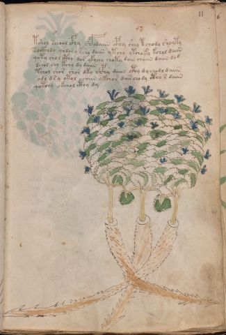

# Voynich Speculative Herbal Ferment Recipe — f11r

IMPORTANT: this is NOT a real or validated translation of the Voynich Manuscript. It is a speculative/procedural model that interprets EVA using a user-defined grammar to generate experimental recipes using safe, known edible substitutes.

This file is generated automatically from IVTFF/EVA transliteration plus a user-defined procedural grammar.



## Page / Folio
- currier: A
- folio: f11r
- page_number: 21
- plant_candidates: ['Silene Acaulis']
- plant_category_confidence: 0.95
- plant_category_guess: flower
- plant_category_matches: ['silene']
- plant_id: Silene Aca[ul|nt]is (O'N)
- section: herbal

## Plant Interpretation (Heuristic)
- category: flower
- confidence: 0.95
- note: Heuristic classification based on the IVTFF 'Plant ID' string (not the drawing). Does not imply real identification of the manuscript plant.
- textual_evidence_terms: ['silene']

## EVA Text (Transliteration)
```text
tshol schoal cfhy shfydaiin cphy shey tchody shoyty
socthody qodor y kshy daiin ytchy ytchoky kchol daiin
qoty chol cthy d[o:a]r ykychy choty dain chaiin daiin d[o:e]d
dchol chy kchy dy daiin
tchol shor shor dky c'h@148;hy daiin cthy d y chodl daiin
odl d s y otol chaiin ykchor dair chody cthy s daiin
qotchy okchol cthy dy
```

## Page Summary (Procedural, Aggregated)
- compound_counts: {'heat': 10, 'secondary herb': 7, 'mix/transfer': 25, 'main herb': 19, 'complex herbal compound': 7, 'aroma modifier': 1, 'yeast fermentation': 25, 'liquid base': 3, 'sugars': 8}
- dose_level: 1
- fermentation_estimate: 7–14 days

## Pantry (Max Needed For Any Single Line-Recipe)
- aroma_modifier: ['orange peel (optional)']
- aroma_modifier_dose: ['2–5 g (or 1 strip of peel, avoiding the bitter pith)']
- main_plant_dry_g: 5
- main_plant_substitute: ['chamomile']
- safe_complex_herbal_blend: ['gentle spices (e.g., 1 g cinnamon + 1 g clove) or a commercial herbal tea blend']
- secondary_herb_dry_g: 2
- secondary_herb_substitute: ['lemon balm']
- sugar_or_honey_g: 25
- water_l: 0.5
- yeast_g: 1

## Recipes Index (This Page)
- [f11r.1,@P0](#f11r-1-f11r-1-p0)
- [f11r.2,+P0](#f11r-2-f11r-2-p0)
- [f11r.3,+P0](#f11r-3-f11r-3-p0)
- [f11r.4,+P0](#f11r-4-f11r-4-p0)
- [f11r.5,+P0](#f11r-5-f11r-5-p0)
- [f11r.6,+P0](#f11r-6-f11r-6-p0)
- [f11r.7,+P0](#f11r-7-f11r-7-p0)

## Line Recipes (Each Line = One Recipe, 0.5L batch)

<a id="f11r-1-f11r-1-p0"></a>

### f11r.1,@P0

EVA: tshol schoal cfhy shfydaiin cphy shey tchody shoyty

## Ingredients
- aroma_modifier: orange peel (optional)
- aroma_modifier_dose: 2–5 g (or 1 strip of peel, avoiding the bitter pith)
- main_plant_dry_g: 5
- main_plant_substitute: chamomile
- safe_complex_herbal_blend: gentle spices (e.g., 1 g cinnamon + 1 g clove) or a commercial herbal tea blend
- secondary_herb_dry_g: 2
- secondary_herb_substitute: lemon balm
- sugar_or_honey_g: 12
- water_l: 0.5
- yeast_g: 1

Process:
1. Sanitize the jar/fermenter and utensils.
2. Base: combine 0.5 L water with 12 g sugar or honey.
3. Apply gentle heat: simmer 10–15 min, then cool to <30°C before adding yeast.
4. Add main plant: chamomile (~5 g dried).
5. Add secondary herb: lemon balm (~2 g dried).
6. Add aroma modifier (optional) in a low dose.
7. If a complex herbal compound appears, use a safe commercial blend or gentle spices in micro-doses.
8. Pitch yeast: 1 g (ideally cider/beer yeast).
9. Ferment with an airlock: 7–14 days (guided by iin/aiin markers).
10. Strain/rack (if very solid-heavy) and cold-crash 24 h.
11. Bottle only when activity clearly slows; refrigerate. Avoid overpressure.

Expected Result: A mild, aromatic herbal ferment, low-to-medium intensity depending on dose level.

Does It Make Sense?: yes

Direct Gloss (Procedural, Not a Real Translation):
- tshol: apply heat/cooking → add secondary herb (safe substitute) → mix / transfer
- schoal: add main plant (safe substitute) → mix / transfer → duration level 1 → state: fermentation start
- cfhy: add complex herbal compound (safe blend)
- shfydaiin: add secondary herb (safe substitute) → add aroma modifier → start fermentation (yeast) → duration level 1 → state: fermentation start → long fermentation / aging phase
- cphy: add complex herbal compound (safe blend)
- shey: add secondary herb (safe substitute) → duration level 1 → state: active extraction
- tchody: apply heat/cooking → add main plant (safe substitute) → mix / transfer → start fermentation (yeast)
- shoyty: apply heat/cooking → add secondary herb (safe substitute) → mix / transfer

<a id="f11r-2-f11r-2-p0"></a>

### f11r.2,+P0

EVA: socthody qodor y kshy daiin ytchy ytchoky kchol daiin

## Ingredients
- main_plant_dry_g: 5
- main_plant_substitute: chamomile
- safe_complex_herbal_blend: gentle spices (e.g., 1 g cinnamon + 1 g clove) or a commercial herbal tea blend
- secondary_herb_dry_g: 2
- secondary_herb_substitute: lemon balm
- sugar_or_honey_g: 25
- water_l: 0.5
- yeast_g: 1

Process:
1. Sanitize the jar/fermenter and utensils.
2. Base: combine 0.5 L water with 25 g sugar or honey.
3. Apply gentle heat: simmer 10–15 min, then cool to <30°C before adding yeast.
4. Add main plant: chamomile (~5 g dried).
5. Add secondary herb: lemon balm (~2 g dried).
6. If a complex herbal compound appears, use a safe commercial blend or gentle spices in micro-doses.
7. Pitch yeast: 1 g (ideally cider/beer yeast).
8. Ferment with an airlock: 7–14 days (guided by iin/aiin markers).
9. Strain/rack (if very solid-heavy) and cold-crash 24 h.
10. Bottle only when activity clearly slows; refrigerate. Avoid overpressure.

Expected Result: A mild, aromatic herbal ferment, low-to-medium intensity depending on dose level.

Does It Make Sense?: yes

Direct Gloss (Procedural, Not a Real Translation):
- socthody: mix / transfer → start fermentation (yeast) → add complex herbal compound (safe blend)
- qodor: prepare liquid base → mix / transfer → start fermentation (yeast)
- y: [unparsed]
- kshy: add fermentable sugars → add secondary herb (safe substitute)
- daiin: start fermentation (yeast) → duration level 1 → state: fermentation start → long fermentation / aging phase
- ytchy: apply heat/cooking → add main plant (safe substitute)
- ytchoky: add fermentable sugars → apply heat/cooking → add main plant (safe substitute) → mix / transfer
- kchol: add fermentable sugars → add main plant (safe substitute) → mix / transfer
- daiin: start fermentation (yeast) → duration level 1 → state: fermentation start → long fermentation / aging phase

<a id="f11r-3-f11r-3-p0"></a>

### f11r.3,+P0

EVA: qoty chol cthy d[o:a]r ykychy choty dain chaiin daiin d[o:e]d

## Ingredients
- main_plant_dry_g: 5
- main_plant_substitute: chamomile
- safe_complex_herbal_blend: gentle spices (e.g., 1 g cinnamon + 1 g clove) or a commercial herbal tea blend
- secondary_herb_dry_g: 1
- secondary_herb_substitute: lemon balm
- sugar_or_honey_g: 25
- water_l: 0.5
- yeast_g: 1

Process:
1. Sanitize the jar/fermenter and utensils.
2. Base: combine 0.5 L water with 25 g sugar or honey.
3. Apply gentle heat: simmer 10–15 min, then cool to <30°C before adding yeast.
4. Add main plant: chamomile (~5 g dried).
5. Add secondary herb: lemon balm (~1 g dried).
6. If a complex herbal compound appears, use a safe commercial blend or gentle spices in micro-doses.
7. Pitch yeast: 1 g (ideally cider/beer yeast).
8. Ferment with an airlock: 7–14 days (guided by iin/aiin markers).
9. Strain/rack (if very solid-heavy) and cold-crash 24 h.
10. Bottle only when activity clearly slows; refrigerate. Avoid overpressure.

Expected Result: A mild, aromatic herbal ferment, low-to-medium intensity depending on dose level.

Does It Make Sense?: yes

Direct Gloss (Procedural, Not a Real Translation):
- qoty: prepare liquid base → apply heat/cooking
- chol: add main plant (safe substitute) → mix / transfer
- cthy: add complex herbal compound (safe blend)
- d: start fermentation (yeast)
- o: mix / transfer
- a: duration level 1 → state: fermentation start
- r: [unparsed]
- ykychy: add fermentable sugars → add main plant (safe substitute)
- choty: apply heat/cooking → add main plant (safe substitute) → mix / transfer
- dain: start fermentation (yeast) → duration level 1 → state: fermentation start
- chaiin: add main plant (safe substitute) → duration level 1 → state: fermentation start → long fermentation / aging phase
- daiin: start fermentation (yeast) → duration level 1 → state: fermentation start → long fermentation / aging phase
- d: start fermentation (yeast)
- o: mix / transfer
- e: duration level 1 → state: active extraction
- d: start fermentation (yeast)

<a id="f11r-4-f11r-4-p0"></a>

### f11r.4,+P0

EVA: dchol chy kchy dy daiin

## Ingredients
- main_plant_dry_g: 5
- main_plant_substitute: chamomile
- secondary_herb_dry_g: 1
- secondary_herb_substitute: lemon balm
- sugar_or_honey_g: 25
- water_l: 0.5
- yeast_g: 1

Process:
1. Sanitize the jar/fermenter and utensils.
2. Base: combine 0.5 L water with 25 g sugar or honey.
3. Infusion: use hot (not boiling) water, then let it cool before adding yeast.
4. Add main plant: chamomile (~5 g dried).
5. Add secondary herb: lemon balm (~1 g dried).
6. Pitch yeast: 1 g (ideally cider/beer yeast).
7. Ferment with an airlock: 7–14 days (guided by iin/aiin markers).
8. Strain/rack (if very solid-heavy) and cold-crash 24 h.
9. Bottle only when activity clearly slows; refrigerate. Avoid overpressure.

Expected Result: A mild, aromatic herbal ferment, low-to-medium intensity depending on dose level.

Does It Make Sense?: yes

Direct Gloss (Procedural, Not a Real Translation):
- dchol: add main plant (safe substitute) → mix / transfer → start fermentation (yeast)
- chy: add main plant (safe substitute)
- kchy: add fermentable sugars → add main plant (safe substitute)
- dy: start fermentation (yeast)
- daiin: start fermentation (yeast) → duration level 1 → state: fermentation start → long fermentation / aging phase

<a id="f11r-5-f11r-5-p0"></a>

### f11r.5,+P0

EVA: tchol shor shor dky c'h@148;hy daiin cthy d y chodl daiin

## Ingredients
- main_plant_dry_g: 5
- main_plant_substitute: chamomile
- safe_complex_herbal_blend: gentle spices (e.g., 1 g cinnamon + 1 g clove) or a commercial herbal tea blend
- secondary_herb_dry_g: 2
- secondary_herb_substitute: lemon balm
- sugar_or_honey_g: 25
- water_l: 0.5
- yeast_g: 1

Process:
1. Sanitize the jar/fermenter and utensils.
2. Base: combine 0.5 L water with 25 g sugar or honey.
3. Apply gentle heat: simmer 10–15 min, then cool to <30°C before adding yeast.
4. Add main plant: chamomile (~5 g dried).
5. Add secondary herb: lemon balm (~2 g dried).
6. If a complex herbal compound appears, use a safe commercial blend or gentle spices in micro-doses.
7. Pitch yeast: 1 g (ideally cider/beer yeast).
8. Ferment with an airlock: 7–14 days (guided by iin/aiin markers).
9. Strain/rack (if very solid-heavy) and cold-crash 24 h.
10. Bottle only when activity clearly slows; refrigerate. Avoid overpressure.

Expected Result: A mild, aromatic herbal ferment, low-to-medium intensity depending on dose level.

Does It Make Sense?: yes

Direct Gloss (Procedural, Not a Real Translation):
- tchol: apply heat/cooking → add main plant (safe substitute) → mix / transfer
- shor: add secondary herb (safe substitute) → mix / transfer
- shor: add secondary herb (safe substitute) → mix / transfer
- dky: add fermentable sugars → start fermentation (yeast)
- c: [unparsed]
- h: [unparsed]
- hy: [unparsed]
- daiin: start fermentation (yeast) → duration level 1 → state: fermentation start → long fermentation / aging phase
- cthy: add complex herbal compound (safe blend)
- d: start fermentation (yeast)
- y: [unparsed]
- chodl: add main plant (safe substitute) → mix / transfer → start fermentation (yeast)
- daiin: start fermentation (yeast) → duration level 1 → state: fermentation start → long fermentation / aging phase

<a id="f11r-6-f11r-6-p0"></a>

### f11r.6,+P0

EVA: odl d s y otol chaiin ykchor dair chody cthy s daiin

## Ingredients
- main_plant_dry_g: 5
- main_plant_substitute: chamomile
- safe_complex_herbal_blend: gentle spices (e.g., 1 g cinnamon + 1 g clove) or a commercial herbal tea blend
- secondary_herb_dry_g: 1
- secondary_herb_substitute: lemon balm
- sugar_or_honey_g: 25
- water_l: 0.5
- yeast_g: 1

Process:
1. Sanitize the jar/fermenter and utensils.
2. Base: combine 0.5 L water with 25 g sugar or honey.
3. Apply gentle heat: simmer 10–15 min, then cool to <30°C before adding yeast.
4. Add main plant: chamomile (~5 g dried).
5. Add secondary herb: lemon balm (~1 g dried).
6. If a complex herbal compound appears, use a safe commercial blend or gentle spices in micro-doses.
7. Pitch yeast: 1 g (ideally cider/beer yeast).
8. Ferment with an airlock: 7–14 days (guided by iin/aiin markers).
9. Strain/rack (if very solid-heavy) and cold-crash 24 h.
10. Bottle only when activity clearly slows; refrigerate. Avoid overpressure.

Expected Result: A mild, aromatic herbal ferment, low-to-medium intensity depending on dose level.

Does It Make Sense?: yes

Direct Gloss (Procedural, Not a Real Translation):
- odl: mix / transfer → start fermentation (yeast)
- d: start fermentation (yeast)
- s: [unparsed]
- y: [unparsed]
- otol: apply heat/cooking → mix / transfer
- chaiin: add main plant (safe substitute) → duration level 1 → state: fermentation start → long fermentation / aging phase
- ykchor: add fermentable sugars → add main plant (safe substitute) → mix / transfer
- dair: start fermentation (yeast) → duration level 1 → state: fermentation start
- chody: add main plant (safe substitute) → mix / transfer → start fermentation (yeast)
- cthy: add complex herbal compound (safe blend)
- s: [unparsed]
- daiin: start fermentation (yeast) → duration level 1 → state: fermentation start → long fermentation / aging phase

<a id="f11r-7-f11r-7-p0"></a>

### f11r.7,+P0

EVA: qotchy okchol cthy dy

## Ingredients
- main_plant_dry_g: 5
- main_plant_substitute: chamomile
- safe_complex_herbal_blend: gentle spices (e.g., 1 g cinnamon + 1 g clove) or a commercial herbal tea blend
- secondary_herb_dry_g: 1
- secondary_herb_substitute: lemon balm
- sugar_or_honey_g: 25
- water_l: 0.5
- yeast_g: 1

Process:
1. Sanitize the jar/fermenter and utensils.
2. Base: combine 0.5 L water with 25 g sugar or honey.
3. Apply gentle heat: simmer 10–15 min, then cool to <30°C before adding yeast.
4. Add main plant: chamomile (~5 g dried).
5. Add secondary herb: lemon balm (~1 g dried).
6. If a complex herbal compound appears, use a safe commercial blend or gentle spices in micro-doses.
7. Pitch yeast: 1 g (ideally cider/beer yeast).
8. Ferment with an airlock: 2–4 days (guided by iin/aiin markers).
9. Strain/rack (if very solid-heavy) and cold-crash 24 h.
10. Bottle only when activity clearly slows; refrigerate. Avoid overpressure.

Expected Result: A mild, aromatic herbal ferment, low-to-medium intensity depending on dose level.

Does It Make Sense?: yes

Direct Gloss (Procedural, Not a Real Translation):
- qotchy: prepare liquid base → apply heat/cooking → add main plant (safe substitute)
- okchol: add fermentable sugars → add main plant (safe substitute) → mix / transfer
- cthy: add complex herbal compound (safe blend)
- dy: start fermentation (yeast)

## Risks & Warnings (Applies To All Line-Recipes)
- Never use unidentified Voynich plants directly; only use known edible substitutes.
- Do not consume if you see mold, smell rot, notice abnormal sliminess, or taste something clearly foul.
- Overpressure/bottle-bomb risk: do not bottle before stable; prefer an airlock and refrigeration.
- Avoid if pregnant/breastfeeding, for minors, or with medical conditions; consult a professional.
- No medical claims: this is an experimental beverage.

## Recommended Adjustments (General)
- If too bitter (leafy profile), halve the herbs or shorten steep/maceration time.
- If too sweet, extend fermentation or reduce sugar by 25–50%.
- For a non-alcoholic version, omit yeast and keep refrigerated as an infusion (not fermented).
