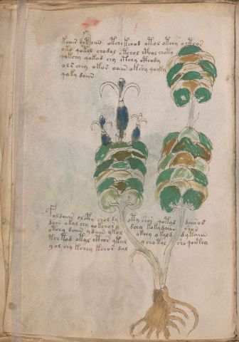

# Voynich Speculative Herbal Ferment Recipe — f13v

IMPORTANT: this is NOT a real or validated translation of the Voynich Manuscript. It is a speculative/procedural model that interprets EVA using a user-defined grammar to generate experimental recipes using safe, known edible substitutes.

This file is generated automatically from IVTFF/EVA transliteration plus a user-defined procedural grammar.



## Page / Folio
- currier: A
- folio: f13v
- page_number: 24
- section: herbal

## EVA Text (Transliteration)
```text
koair chtoiin otchy kchod otol otchy octhos
oko qokol chodal otchol cphol choty
qokchy qokod chy otchy cthody
o l s chey okos oa[iin:in] okshy qocky
qoky daiin
foldaiin olcphy shol dy oty shor qotyd dairod
dain okal chy qokchory dchy kok[y:a]daiin shon
otchy daiin y dain ykol okchy o kald d y taiin
tchtod otal cthor ytal y cho tal sho qocthy
y ol chy kchey kchor dal
```

## Recipes Index (This Page)
- [f13v.1,@P0](#f13v-1-f13v-1-p0)
- [f13v.2,+P0](#f13v-2-f13v-2-p0)
- [f13v.3,+P0](#f13v-3-f13v-3-p0)
- [f13v.4,+P0](#f13v-4-f13v-4-p0)
- [f13v.5,+P0](#f13v-5-f13v-5-p0)
- [f13v.6,+P0](#f13v-6-f13v-6-p0)
- [f13v.7,+P0](#f13v-7-f13v-7-p0)
- [f13v.8,+P0](#f13v-8-f13v-8-p0)
- [f13v.9,+P0](#f13v-9-f13v-9-p0)
- [f13v.10,+P0](#f13v-10-f13v-10-p0)

## Line Glosses (Procedural Gloss Only; Not a Translation)

<a id="f13v-1-f13v-1-p0"></a>

### f13v.1,@P0

EVA: koair chtoiin otchy kchod otol otchy octhos

Direct Gloss (Procedural, Not a Real Translation):
- koair: add fermentable sugars → mix / transfer → duration level 1 → state: fermentation start
- chtoiin: apply heat/cooking → add main plant (safe substitute) → mix / transfer → duration level 2 → state: cooling/rest → medium fermentation phase
- otchy: apply heat/cooking → add main plant (safe substitute) → mix / transfer
- kchod: add fermentable sugars → add main plant (safe substitute) → mix / transfer → start fermentation (yeast)
- otol: apply heat/cooking → mix / transfer
- otchy: apply heat/cooking → add main plant (safe substitute) → mix / transfer
- octhos: mix / transfer → add complex herbal compound (safe blend)

<a id="f13v-2-f13v-2-p0"></a>

### f13v.2,+P0

EVA: oko qokol chodal otchol cphol choty

Direct Gloss (Procedural, Not a Real Translation):
- oko: add fermentable sugars → mix / transfer
- qokol: prepare liquid base → add fermentable sugars → mix / transfer
- chodal: add main plant (safe substitute) → mix / transfer → start fermentation (yeast) → duration level 1 → state: fermentation start
- otchol: apply heat/cooking → add main plant (safe substitute) → mix / transfer
- cphol: mix / transfer → add complex herbal compound (safe blend)
- choty: apply heat/cooking → add main plant (safe substitute) → mix / transfer

<a id="f13v-3-f13v-3-p0"></a>

### f13v.3,+P0

EVA: qokchy qokod chy otchy cthody

Direct Gloss (Procedural, Not a Real Translation):
- qokchy: prepare liquid base → add fermentable sugars → add main plant (safe substitute)
- qokod: prepare liquid base → add fermentable sugars → mix / transfer → start fermentation (yeast)
- chy: add main plant (safe substitute)
- otchy: apply heat/cooking → add main plant (safe substitute) → mix / transfer
- cthody: mix / transfer → start fermentation (yeast) → add complex herbal compound (safe blend)

<a id="f13v-4-f13v-4-p0"></a>

### f13v.4,+P0

EVA: o l s chey okos oa[iin:in] okshy qocky

Direct Gloss (Procedural, Not a Real Translation):
- o: mix / transfer
- l: [unparsed]
- s: [unparsed]
- chey: add main plant (safe substitute) → duration level 1 → state: active extraction
- okos: add fermentable sugars → mix / transfer
- oa: mix / transfer → duration level 1 → state: fermentation start
- iin: duration level 2 → state: cooling/rest → medium fermentation phase
- in: duration level 1 → state: cooling/rest
- okshy: add fermentable sugars → add secondary herb (safe substitute) → mix / transfer
- qocky: prepare liquid base → add fermentable sugars

<a id="f13v-5-f13v-5-p0"></a>

### f13v.5,+P0

EVA: qoky daiin

Direct Gloss (Procedural, Not a Real Translation):
- qoky: prepare liquid base → add fermentable sugars
- daiin: start fermentation (yeast) → duration level 1 → state: fermentation start → long fermentation / aging phase

<a id="f13v-6-f13v-6-p0"></a>

### f13v.6,+P0

EVA: foldaiin olcphy shol dy oty shor qotyd dairod

Direct Gloss (Procedural, Not a Real Translation):
- foldaiin: add aroma modifier → mix / transfer → start fermentation (yeast) → duration level 1 → state: fermentation start → long fermentation / aging phase
- olcphy: mix / transfer → add complex herbal compound (safe blend)
- shol: add secondary herb (safe substitute) → mix / transfer
- dy: start fermentation (yeast)
- oty: apply heat/cooking → mix / transfer
- shor: add secondary herb (safe substitute) → mix / transfer
- qotyd: prepare liquid base → apply heat/cooking → start fermentation (yeast)
- dairod: mix / transfer → start fermentation (yeast) → duration level 1 → state: fermentation start

<a id="f13v-7-f13v-7-p0"></a>

### f13v.7,+P0

EVA: dain okal chy qokchory dchy kok[y:a]daiin shon

Direct Gloss (Procedural, Not a Real Translation):
- dain: start fermentation (yeast) → duration level 1 → state: fermentation start
- okal: add fermentable sugars → mix / transfer → duration level 1 → state: fermentation start
- chy: add main plant (safe substitute)
- qokchory: prepare liquid base → add fermentable sugars → add main plant (safe substitute) → mix / transfer
- dchy: add main plant (safe substitute) → start fermentation (yeast)
- kok: add fermentable sugars → mix / transfer
- y: [unparsed]
- a: duration level 1 → state: fermentation start
- daiin: start fermentation (yeast) → duration level 1 → state: fermentation start → long fermentation / aging phase
- shon: add secondary herb (safe substitute) → mix / transfer

<a id="f13v-8-f13v-8-p0"></a>

### f13v.8,+P0

EVA: otchy daiin y dain ykol okchy o kald d y taiin

Direct Gloss (Procedural, Not a Real Translation):
- otchy: apply heat/cooking → add main plant (safe substitute) → mix / transfer
- daiin: start fermentation (yeast) → duration level 1 → state: fermentation start → long fermentation / aging phase
- y: [unparsed]
- dain: start fermentation (yeast) → duration level 1 → state: fermentation start
- ykol: add fermentable sugars → mix / transfer
- okchy: add fermentable sugars → add main plant (safe substitute) → mix / transfer
- o: mix / transfer
- kald: add fermentable sugars → start fermentation (yeast) → duration level 1 → state: fermentation start
- d: start fermentation (yeast)
- y: [unparsed]
- taiin: apply heat/cooking → duration level 1 → state: fermentation start → long fermentation / aging phase

<a id="f13v-9-f13v-9-p0"></a>

### f13v.9,+P0

EVA: tchtod otal cthor ytal y cho tal sho qocthy

Direct Gloss (Procedural, Not a Real Translation):
- tchtod: apply heat/cooking → add main plant (safe substitute) → mix / transfer → start fermentation (yeast)
- otal: apply heat/cooking → mix / transfer → duration level 1 → state: fermentation start
- cthor: mix / transfer → add complex herbal compound (safe blend)
- ytal: apply heat/cooking → duration level 1 → state: fermentation start
- y: [unparsed]
- cho: add main plant (safe substitute) → mix / transfer
- tal: apply heat/cooking → duration level 1 → state: fermentation start
- sho: add secondary herb (safe substitute) → mix / transfer
- qocthy: prepare liquid base → add complex herbal compound (safe blend)

<a id="f13v-10-f13v-10-p0"></a>

### f13v.10,+P0

EVA: y ol chy kchey kchor dal

Direct Gloss (Procedural, Not a Real Translation):
- y: [unparsed]
- ol: mix / transfer
- chy: add main plant (safe substitute)
- kchey: add fermentable sugars → add main plant (safe substitute) → duration level 1 → state: active extraction
- kchor: add fermentable sugars → add main plant (safe substitute) → mix / transfer
- dal: start fermentation (yeast) → duration level 1 → state: fermentation start
