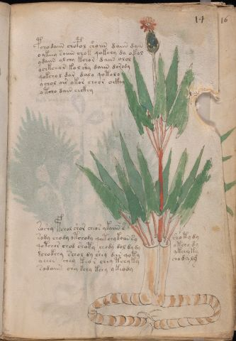

# Voynich Speculative Herbal Ferment Recipe — f14r

IMPORTANT: this is NOT a real or validated translation of the Voynich Manuscript. It is a speculative/procedural model that interprets EVA using a user-defined grammar to generate experimental recipes using safe, known edible substitutes.

This file is generated automatically from IVTFF/EVA transliteration plus a user-defined procedural grammar.



## Page / Folio
- currier: A
- folio: f14r
- page_number: 25
- plant_candidates: ['Pfeilkraut - scorpion', 'Sagittaria']
- plant_category_confidence: 0.25
- plant_category_guess: leaf
- plant_category_matches: ['section=herbal_default']
- plant_id: Pfeilkraut - scorpion, Sagittaria
- section: herbal

## Plant Interpretation (Heuristic)
- category: leaf
- confidence: 0.25
- note: Heuristic classification based on the IVTFF 'Plant ID' string (not the drawing). Does not imply real identification of the manuscript plant.
- textual_evidence_terms: ['section=herbal_default']

## EVA Text (Transliteration)
```text
pcho daiin chopol shoiin daiin dain
o ykeey soiiin chok qokchy da okol
ydaiin olchy kchor daiin olol
ochkch[o:a]r kol shy daiin dorody
qokchol dar dalo qotolo
ychol oir okor choor ockhy
otcho dain chckhy
soshy @137;chol shor cheos ykaiin s
sody chody otchody qotchy koiin sy sho ty dy
qotchor chod shoty chody dol dy dy okchydy
dchokchy schol dy shey dar qoty ykeeyky
oeeeb chey keor chey tchyky chodalg
sodaiin chy kchy kchy ykeody
```

## Page Summary (Procedural, Aggregated)
- compound_counts: {'yeast fermentation': 30, 'main herb': 32, 'mix/transfer': 54, 'secondary herb': 7, 'sugars': 20, 'liquid base': 6, 'heat': 9, 'complex herbal compound': 2}
- dose_level: 3
- fermentation_estimate: 7–14 days

## Pantry (Max Needed For Any Single Line-Recipe)
- main_plant_dry_g: 15
- main_plant_substitute: ['lemon balm']
- safe_complex_herbal_blend: ['gentle spices (e.g., 1 g cinnamon + 1 g clove) or a commercial herbal tea blend']
- secondary_herb_dry_g: 5
- secondary_herb_substitute: ['mint']
- sugar_or_honey_g: 75
- water_l: 0.5
- yeast_g: 1

## Recipes Index (This Page)
- [f14r.1,@P0](#f14r-1-f14r-1-p0)
- [f14r.2,+P0](#f14r-2-f14r-2-p0)
- [f14r.3,+P0](#f14r-3-f14r-3-p0)
- [f14r.4,+P0](#f14r-4-f14r-4-p0)
- [f14r.5,+P0](#f14r-5-f14r-5-p0)
- [f14r.6,+P0](#f14r-6-f14r-6-p0)
- [f14r.7,+P0](#f14r-7-f14r-7-p0)
- [f14r.8,+P0](#f14r-8-f14r-8-p0)
- [f14r.9,+P0](#f14r-9-f14r-9-p0)
- [f14r.10,+P0](#f14r-10-f14r-10-p0)
- [f14r.11,+P0](#f14r-11-f14r-11-p0)
- [f14r.12,+P0](#f14r-12-f14r-12-p0)
- [f14r.13,+P0](#f14r-13-f14r-13-p0)

## Line Recipes (Each Line = One Recipe, 0.5L batch)

<a id="f14r-1-f14r-1-p0"></a>

### f14r.1,@P0

EVA: pcho daiin chopol shoiin daiin dain

## Ingredients
- main_plant_dry_g: 10
- main_plant_substitute: lemon balm
- secondary_herb_dry_g: 5
- secondary_herb_substitute: mint
- sugar_or_honey_g: 25
- water_l: 0.5
- yeast_g: 1

Process:
1. Sanitize the jar/fermenter and utensils.
2. Base: combine 0.5 L water with 25 g sugar or honey.
3. Infusion: use hot (not boiling) water, then let it cool before adding yeast.
4. Add main plant: lemon balm (~10 g dried).
5. Add secondary herb: mint (~5 g dried).
6. Pitch yeast: 1 g (ideally cider/beer yeast).
7. Ferment with an airlock: 7–14 days (guided by iin/aiin markers).
8. Strain/rack (if very solid-heavy) and cold-crash 24 h.
9. Bottle only when activity clearly slows; refrigerate. Avoid overpressure.

Expected Result: A mild, aromatic herbal ferment, low-to-medium intensity depending on dose level.

Does It Make Sense?: yes

Direct Gloss (Procedural, Not a Real Translation):
- pcho: add main plant (safe substitute) → mix / transfer → start fermentation (yeast)
- daiin: start fermentation (yeast) → duration level 1 → state: fermentation start → long fermentation / aging phase
- chopol: add main plant (safe substitute) → mix / transfer → start fermentation (yeast)
- shoiin: add secondary herb (safe substitute) → mix / transfer → duration level 2 → state: cooling/rest → medium fermentation phase
- daiin: start fermentation (yeast) → duration level 1 → state: fermentation start → long fermentation / aging phase
- dain: start fermentation (yeast) → duration level 1 → state: fermentation start

<a id="f14r-2-f14r-2-p0"></a>

### f14r.2,+P0

EVA: o ykeey soiiin chok qokchy da okol

## Ingredients
- main_plant_dry_g: 15
- main_plant_substitute: lemon balm
- secondary_herb_dry_g: 3
- secondary_herb_substitute: mint
- sugar_or_honey_g: 75
- water_l: 0.5
- yeast_g: 1

Process:
1. Sanitize the jar/fermenter and utensils.
2. Base: combine 0.5 L water with 75 g sugar or honey.
3. Infusion: use hot (not boiling) water, then let it cool before adding yeast.
4. Add main plant: lemon balm (~15 g dried).
5. Add secondary herb: mint (~3 g dried).
6. Pitch yeast: 1 g (ideally cider/beer yeast).
7. Ferment with an airlock: 3–5 days (guided by iin/aiin markers).
8. Strain/rack (if very solid-heavy) and cold-crash 24 h.
9. Bottle only when activity clearly slows; refrigerate. Avoid overpressure.

Expected Result: A mild, aromatic herbal ferment, low-to-medium intensity depending on dose level.

Does It Make Sense?: yes

Direct Gloss (Procedural, Not a Real Translation):
- o: mix / transfer
- ykeey: add fermentable sugars → duration level 2 → state: active extraction
- soiiin: mix / transfer → duration level 3 → state: cooling/rest → medium fermentation phase
- chok: add fermentable sugars → add main plant (safe substitute) → mix / transfer
- qokchy: prepare liquid base → add fermentable sugars → add main plant (safe substitute)
- da: start fermentation (yeast) → duration level 1 → state: fermentation start
- okol: add fermentable sugars → mix / transfer

<a id="f14r-3-f14r-3-p0"></a>

### f14r.3,+P0

EVA: ydaiin olchy kchor daiin olol

## Ingredients
- main_plant_dry_g: 5
- main_plant_substitute: lemon balm
- secondary_herb_dry_g: 1
- secondary_herb_substitute: mint
- sugar_or_honey_g: 25
- water_l: 0.5
- yeast_g: 1

Process:
1. Sanitize the jar/fermenter and utensils.
2. Base: combine 0.5 L water with 25 g sugar or honey.
3. Infusion: use hot (not boiling) water, then let it cool before adding yeast.
4. Add main plant: lemon balm (~5 g dried).
5. Add secondary herb: mint (~1 g dried).
6. Pitch yeast: 1 g (ideally cider/beer yeast).
7. Ferment with an airlock: 7–14 days (guided by iin/aiin markers).
8. Strain/rack (if very solid-heavy) and cold-crash 24 h.
9. Bottle only when activity clearly slows; refrigerate. Avoid overpressure.

Expected Result: A mild, aromatic herbal ferment, low-to-medium intensity depending on dose level.

Does It Make Sense?: yes

Direct Gloss (Procedural, Not a Real Translation):
- ydaiin: start fermentation (yeast) → duration level 1 → state: fermentation start → long fermentation / aging phase
- olchy: add main plant (safe substitute) → mix / transfer
- kchor: add fermentable sugars → add main plant (safe substitute) → mix / transfer
- daiin: start fermentation (yeast) → duration level 1 → state: fermentation start → long fermentation / aging phase
- olol: mix / transfer

<a id="f14r-4-f14r-4-p0"></a>

### f14r.4,+P0

EVA: ochkch[o:a]r kol shy daiin dorody

## Ingredients
- main_plant_dry_g: 5
- main_plant_substitute: lemon balm
- secondary_herb_dry_g: 2
- secondary_herb_substitute: mint
- sugar_or_honey_g: 25
- water_l: 0.5
- yeast_g: 1

Process:
1. Sanitize the jar/fermenter and utensils.
2. Base: combine 0.5 L water with 25 g sugar or honey.
3. Infusion: use hot (not boiling) water, then let it cool before adding yeast.
4. Add main plant: lemon balm (~5 g dried).
5. Add secondary herb: mint (~2 g dried).
6. Pitch yeast: 1 g (ideally cider/beer yeast).
7. Ferment with an airlock: 7–14 days (guided by iin/aiin markers).
8. Strain/rack (if very solid-heavy) and cold-crash 24 h.
9. Bottle only when activity clearly slows; refrigerate. Avoid overpressure.

Expected Result: A mild, aromatic herbal ferment, low-to-medium intensity depending on dose level.

Does It Make Sense?: yes

Direct Gloss (Procedural, Not a Real Translation):
- ochkch: add fermentable sugars → add main plant (safe substitute) → mix / transfer
- o: mix / transfer
- a: duration level 1 → state: fermentation start
- r: [unparsed]
- kol: add fermentable sugars → mix / transfer
- shy: add secondary herb (safe substitute)
- daiin: start fermentation (yeast) → duration level 1 → state: fermentation start → long fermentation / aging phase
- dorody: mix / transfer → start fermentation (yeast)

<a id="f14r-5-f14r-5-p0"></a>

### f14r.5,+P0

EVA: qokchol dar dalo qotolo

## Ingredients
- main_plant_dry_g: 5
- main_plant_substitute: lemon balm
- secondary_herb_dry_g: 1
- secondary_herb_substitute: mint
- sugar_or_honey_g: 25
- water_l: 0.5
- yeast_g: 1

Process:
1. Sanitize the jar/fermenter and utensils.
2. Base: combine 0.5 L water with 25 g sugar or honey.
3. Apply gentle heat: simmer 10–15 min, then cool to <30°C before adding yeast.
4. Add main plant: lemon balm (~5 g dried).
5. Add secondary herb: mint (~1 g dried).
6. Pitch yeast: 1 g (ideally cider/beer yeast).
7. Ferment with an airlock: 2–4 days (guided by iin/aiin markers).
8. Strain/rack (if very solid-heavy) and cold-crash 24 h.
9. Bottle only when activity clearly slows; refrigerate. Avoid overpressure.

Expected Result: A mild, aromatic herbal ferment, low-to-medium intensity depending on dose level.

Does It Make Sense?: yes

Direct Gloss (Procedural, Not a Real Translation):
- qokchol: prepare liquid base → add fermentable sugars → add main plant (safe substitute) → mix / transfer
- dar: start fermentation (yeast) → duration level 1 → state: fermentation start
- dalo: mix / transfer → start fermentation (yeast) → duration level 1 → state: fermentation start
- qotolo: prepare liquid base → apply heat/cooking → mix / transfer

<a id="f14r-6-f14r-6-p0"></a>

### f14r.6,+P0

EVA: ychol oir okor choor ockhy

## Ingredients
- main_plant_dry_g: 5
- main_plant_substitute: lemon balm
- safe_complex_herbal_blend: gentle spices (e.g., 1 g cinnamon + 1 g clove) or a commercial herbal tea blend
- secondary_herb_dry_g: 1
- secondary_herb_substitute: mint
- sugar_or_honey_g: 25
- water_l: 0.5
- yeast_g: 1

Process:
1. Sanitize the jar/fermenter and utensils.
2. Base: combine 0.5 L water with 25 g sugar or honey.
3. Infusion: use hot (not boiling) water, then let it cool before adding yeast.
4. Add main plant: lemon balm (~5 g dried).
5. Add secondary herb: mint (~1 g dried).
6. If a complex herbal compound appears, use a safe commercial blend or gentle spices in micro-doses.
7. Pitch yeast: 1 g (ideally cider/beer yeast).
8. Ferment with an airlock: 2–4 days (guided by iin/aiin markers).
9. Strain/rack (if very solid-heavy) and cold-crash 24 h.
10. Bottle only when activity clearly slows; refrigerate. Avoid overpressure.

Expected Result: A mild, aromatic herbal ferment, low-to-medium intensity depending on dose level.

Does It Make Sense?: yes

Direct Gloss (Procedural, Not a Real Translation):
- ychol: add main plant (safe substitute) → mix / transfer
- oir: mix / transfer → duration level 1 → state: cooling/rest
- okor: add fermentable sugars → mix / transfer
- choor: add main plant (safe substitute) → mix / transfer
- ockhy: mix / transfer → add complex herbal compound (safe blend)

<a id="f14r-7-f14r-7-p0"></a>

### f14r.7,+P0

EVA: otcho dain chckhy

## Ingredients
- main_plant_dry_g: 5
- main_plant_substitute: lemon balm
- safe_complex_herbal_blend: gentle spices (e.g., 1 g cinnamon + 1 g clove) or a commercial herbal tea blend
- secondary_herb_dry_g: 1
- secondary_herb_substitute: mint
- sugar_or_honey_g: 12
- water_l: 0.5
- yeast_g: 1

Process:
1. Sanitize the jar/fermenter and utensils.
2. Base: combine 0.5 L water with 12 g sugar or honey.
3. Apply gentle heat: simmer 10–15 min, then cool to <30°C before adding yeast.
4. Add main plant: lemon balm (~5 g dried).
5. Add secondary herb: mint (~1 g dried).
6. If a complex herbal compound appears, use a safe commercial blend or gentle spices in micro-doses.
7. Pitch yeast: 1 g (ideally cider/beer yeast).
8. Ferment with an airlock: 2–4 days (guided by iin/aiin markers).
9. Strain/rack (if very solid-heavy) and cold-crash 24 h.
10. Bottle only when activity clearly slows; refrigerate. Avoid overpressure.

Expected Result: A mild, aromatic herbal ferment, low-to-medium intensity depending on dose level.

Does It Make Sense?: yes

Direct Gloss (Procedural, Not a Real Translation):
- otcho: apply heat/cooking → add main plant (safe substitute) → mix / transfer
- dain: start fermentation (yeast) → duration level 1 → state: fermentation start
- chckhy: add main plant (safe substitute) → add complex herbal compound (safe blend)

<a id="f14r-8-f14r-8-p0"></a>

### f14r.8,+P0

EVA: soshy @137;chol shor cheos ykaiin s

## Ingredients
- main_plant_dry_g: 5
- main_plant_substitute: lemon balm
- secondary_herb_dry_g: 2
- secondary_herb_substitute: mint
- sugar_or_honey_g: 25
- water_l: 0.5
- yeast_g: 1

Process:
1. Sanitize the jar/fermenter and utensils.
2. Base: combine 0.5 L water with 25 g sugar or honey.
3. Infusion: use hot (not boiling) water, then let it cool before adding yeast.
4. Add main plant: lemon balm (~5 g dried).
5. Add secondary herb: mint (~2 g dried).
6. Pitch yeast: 1 g (ideally cider/beer yeast).
7. Ferment with an airlock: 7–14 days (guided by iin/aiin markers).
8. Strain/rack (if very solid-heavy) and cold-crash 24 h.
9. Bottle only when activity clearly slows; refrigerate. Avoid overpressure.

Expected Result: A mild, aromatic herbal ferment, low-to-medium intensity depending on dose level.

Does It Make Sense?: yes

Direct Gloss (Procedural, Not a Real Translation):
- soshy: add secondary herb (safe substitute) → mix / transfer
- chol: add main plant (safe substitute) → mix / transfer
- shor: add secondary herb (safe substitute) → mix / transfer
- cheos: add main plant (safe substitute) → mix / transfer → duration level 1 → state: active extraction
- ykaiin: add fermentable sugars → duration level 1 → state: fermentation start → long fermentation / aging phase
- s: [unparsed]

<a id="f14r-9-f14r-9-p0"></a>

### f14r.9,+P0

EVA: sody chody otchody qotchy koiin sy sho ty dy

## Ingredients
- main_plant_dry_g: 10
- main_plant_substitute: lemon balm
- secondary_herb_dry_g: 5
- secondary_herb_substitute: mint
- sugar_or_honey_g: 50
- water_l: 0.5
- yeast_g: 1

Process:
1. Sanitize the jar/fermenter and utensils.
2. Base: combine 0.5 L water with 50 g sugar or honey.
3. Apply gentle heat: simmer 10–15 min, then cool to <30°C before adding yeast.
4. Add main plant: lemon balm (~10 g dried).
5. Add secondary herb: mint (~5 g dried).
6. Pitch yeast: 1 g (ideally cider/beer yeast).
7. Ferment with an airlock: 3–5 days (guided by iin/aiin markers).
8. Strain/rack (if very solid-heavy) and cold-crash 24 h.
9. Bottle only when activity clearly slows; refrigerate. Avoid overpressure.

Expected Result: A mild, aromatic herbal ferment, low-to-medium intensity depending on dose level.

Does It Make Sense?: yes

Direct Gloss (Procedural, Not a Real Translation):
- sody: mix / transfer → start fermentation (yeast)
- chody: add main plant (safe substitute) → mix / transfer → start fermentation (yeast)
- otchody: apply heat/cooking → add main plant (safe substitute) → mix / transfer → start fermentation (yeast)
- qotchy: prepare liquid base → apply heat/cooking → add main plant (safe substitute)
- koiin: add fermentable sugars → mix / transfer → duration level 2 → state: cooling/rest → medium fermentation phase
- sy: [unparsed]
- sho: add secondary herb (safe substitute) → mix / transfer
- ty: apply heat/cooking
- dy: start fermentation (yeast)

<a id="f14r-10-f14r-10-p0"></a>

### f14r.10,+P0

EVA: qotchor chod shoty chody dol dy dy okchydy

## Ingredients
- main_plant_dry_g: 5
- main_plant_substitute: lemon balm
- secondary_herb_dry_g: 2
- secondary_herb_substitute: mint
- sugar_or_honey_g: 25
- water_l: 0.5
- yeast_g: 1

Process:
1. Sanitize the jar/fermenter and utensils.
2. Base: combine 0.5 L water with 25 g sugar or honey.
3. Apply gentle heat: simmer 10–15 min, then cool to <30°C before adding yeast.
4. Add main plant: lemon balm (~5 g dried).
5. Add secondary herb: mint (~2 g dried).
6. Pitch yeast: 1 g (ideally cider/beer yeast).
7. Ferment with an airlock: 2–4 days (guided by iin/aiin markers).
8. Strain/rack (if very solid-heavy) and cold-crash 24 h.
9. Bottle only when activity clearly slows; refrigerate. Avoid overpressure.

Expected Result: A mild, aromatic herbal ferment, low-to-medium intensity depending on dose level.

Does It Make Sense?: yes

Direct Gloss (Procedural, Not a Real Translation):
- qotchor: prepare liquid base → apply heat/cooking → add main plant (safe substitute) → mix / transfer
- chod: add main plant (safe substitute) → mix / transfer → start fermentation (yeast)
- shoty: apply heat/cooking → add secondary herb (safe substitute) → mix / transfer
- chody: add main plant (safe substitute) → mix / transfer → start fermentation (yeast)
- dol: mix / transfer → start fermentation (yeast)
- dy: start fermentation (yeast)
- dy: start fermentation (yeast)
- okchydy: add fermentable sugars → add main plant (safe substitute) → mix / transfer → start fermentation (yeast)

<a id="f14r-11-f14r-11-p0"></a>

### f14r.11,+P0

EVA: dchokchy schol dy shey dar qoty ykeeyky

## Ingredients
- main_plant_dry_g: 10
- main_plant_substitute: lemon balm
- secondary_herb_dry_g: 5
- secondary_herb_substitute: mint
- sugar_or_honey_g: 50
- water_l: 0.5
- yeast_g: 1

Process:
1. Sanitize the jar/fermenter and utensils.
2. Base: combine 0.5 L water with 50 g sugar or honey.
3. Apply gentle heat: simmer 10–15 min, then cool to <30°C before adding yeast.
4. Add main plant: lemon balm (~10 g dried).
5. Add secondary herb: mint (~5 g dried).
6. Pitch yeast: 1 g (ideally cider/beer yeast).
7. Ferment with an airlock: 2–4 days (guided by iin/aiin markers).
8. Strain/rack (if very solid-heavy) and cold-crash 24 h.
9. Bottle only when activity clearly slows; refrigerate. Avoid overpressure.

Expected Result: A mild, aromatic herbal ferment, low-to-medium intensity depending on dose level.

Does It Make Sense?: yes

Direct Gloss (Procedural, Not a Real Translation):
- dchokchy: add fermentable sugars → add main plant (safe substitute) → mix / transfer → start fermentation (yeast)
- schol: add main plant (safe substitute) → mix / transfer
- dy: start fermentation (yeast)
- shey: add secondary herb (safe substitute) → duration level 1 → state: active extraction
- dar: start fermentation (yeast) → duration level 1 → state: fermentation start
- qoty: prepare liquid base → apply heat/cooking
- ykeeyky: add fermentable sugars → duration level 2 → state: active extraction

<a id="f14r-12-f14r-12-p0"></a>

### f14r.12,+P0

EVA: oeeeb chey keor chey tchyky chodalg

## Ingredients
- main_plant_dry_g: 15
- main_plant_substitute: lemon balm
- secondary_herb_dry_g: 3
- secondary_herb_substitute: mint
- sugar_or_honey_g: 75
- water_l: 0.5
- yeast_g: 1

Process:
1. Sanitize the jar/fermenter and utensils.
2. Base: combine 0.5 L water with 75 g sugar or honey.
3. Apply gentle heat: simmer 10–15 min, then cool to <30°C before adding yeast.
4. Add main plant: lemon balm (~15 g dried).
5. Add secondary herb: mint (~3 g dried).
6. Pitch yeast: 1 g (ideally cider/beer yeast).
7. Ferment with an airlock: 2–4 days (guided by iin/aiin markers).
8. Strain/rack (if very solid-heavy) and cold-crash 24 h.
9. Bottle only when activity clearly slows; refrigerate. Avoid overpressure.

Expected Result: A mild, aromatic herbal ferment, low-to-medium intensity depending on dose level.

Does It Make Sense?: yes

Direct Gloss (Procedural, Not a Real Translation):
- oeeeb: mix / transfer → duration level 3 → state: active extraction
- chey: add main plant (safe substitute) → duration level 1 → state: active extraction
- keor: add fermentable sugars → mix / transfer → duration level 1 → state: active extraction
- chey: add main plant (safe substitute) → duration level 1 → state: active extraction
- tchyky: add fermentable sugars → apply heat/cooking → add main plant (safe substitute)
- chodalg: add main plant (safe substitute) → mix / transfer → start fermentation (yeast) → duration level 1 → state: fermentation start

<a id="f14r-13-f14r-13-p0"></a>

### f14r.13,+P0

EVA: sodaiin chy kchy kchy ykeody

## Ingredients
- main_plant_dry_g: 5
- main_plant_substitute: lemon balm
- secondary_herb_dry_g: 1
- secondary_herb_substitute: mint
- sugar_or_honey_g: 25
- water_l: 0.5
- yeast_g: 1

Process:
1. Sanitize the jar/fermenter and utensils.
2. Base: combine 0.5 L water with 25 g sugar or honey.
3. Infusion: use hot (not boiling) water, then let it cool before adding yeast.
4. Add main plant: lemon balm (~5 g dried).
5. Add secondary herb: mint (~1 g dried).
6. Pitch yeast: 1 g (ideally cider/beer yeast).
7. Ferment with an airlock: 7–14 days (guided by iin/aiin markers).
8. Strain/rack (if very solid-heavy) and cold-crash 24 h.
9. Bottle only when activity clearly slows; refrigerate. Avoid overpressure.

Expected Result: A mild, aromatic herbal ferment, low-to-medium intensity depending on dose level.

Does It Make Sense?: yes

Direct Gloss (Procedural, Not a Real Translation):
- sodaiin: mix / transfer → start fermentation (yeast) → duration level 1 → state: fermentation start → long fermentation / aging phase
- chy: add main plant (safe substitute)
- kchy: add fermentable sugars → add main plant (safe substitute)
- kchy: add fermentable sugars → add main plant (safe substitute)
- ykeody: add fermentable sugars → mix / transfer → start fermentation (yeast) → duration level 1 → state: active extraction

## Risks & Warnings (Applies To All Line-Recipes)
- Never use unidentified Voynich plants directly; only use known edible substitutes.
- Do not consume if you see mold, smell rot, notice abnormal sliminess, or taste something clearly foul.
- Overpressure/bottle-bomb risk: do not bottle before stable; prefer an airlock and refrigeration.
- Avoid if pregnant/breastfeeding, for minors, or with medical conditions; consult a professional.
- No medical claims: this is an experimental beverage.

## Recommended Adjustments (General)
- If too bitter (leafy profile), halve the herbs or shorten steep/maceration time.
- If too sweet, extend fermentation or reduce sugar by 25–50%.
- For a non-alcoholic version, omit yeast and keep refrigerated as an infusion (not fermented).
