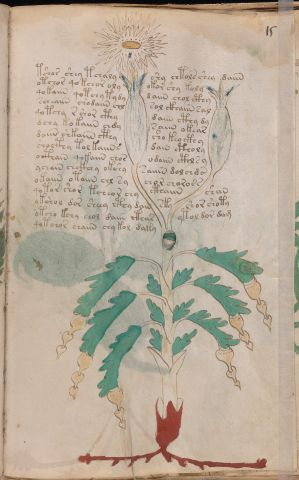

# Voynich Speculative Herbal Ferment Recipe — f15r

IMPORTANT: this is NOT a real or validated translation of the Voynich Manuscript. It is a speculative/procedural model that interprets EVA using a user-defined grammar to generate experimental recipes using safe, known edible substitutes.

This file is generated automatically from IVTFF/EVA transliteration plus a user-defined procedural grammar.

## Page / Folio
- currier: A
- folio: f15r
- page_number: 27
- plant_candidates: ['Saw/Some thistle?']
- plant_category_confidence: 0.25
- plant_category_guess: leaf
- plant_category_matches: ['section=herbal_default']
- plant_id: Saw/Some thistle?
- section: herbal

## Plant Interpretation (Heuristic)
- category: leaf
- confidence: 0.25
- note: Heuristic classification based on the IVTFF 'Plant ID' string (not the drawing). Does not imply real identification of the manuscript plant.
- textual_evidence_terms: ['section=herbal_default']

## EVA Text (Transliteration)
tshor shey tchaly shy chtols shey daiin
otchor qokchor oly okor shy koly
qokaiin qotchy tydy daiin chol cthy
scheaiin chodaiin chl sol ckhaiin sal
qotchy r shor cthy daiin cthy dy
dchy ko kaiin chdy saiin okear
daiin shkaiin cthy sho keocthy
shocthy tol kaiin s dain ctholy
octhain qokaiin chos odaiin cthl s y
ychain chckhhy okshy saiiin dolchds
okaiin otaiin chl sy chor choross
qotor shor tcheor chy cthaiin shan
ykshol dor sheey cthy dain sky shor shoty
otcho kchy chol daiin ithar ytol dor dom
qotchor chaiin chy kol daky

## Page Summary (Procedural, Aggregated)
- compound_counts: {'heat': 16, 'secondary herb': 16, 'mix/transfer': 45, 'main herb': 27, 'yeast fermentation': 19, 'liquid base': 7, 'sugars': 18, 'complex herbal compound': 13}
- dose_level: 2
- fermentation_estimate: 7–14 days

## Pantry (Max Needed For Any Single Line-Recipe)
- main_plant_dry_g: 5
- main_plant_substitute: ['lemon balm']
- safe_complex_herbal_blend: ['gentle spices (e.g., 1 g cinnamon + 1 g clove) or a commercial herbal tea blend']
- secondary_herb_dry_g: 5
- secondary_herb_substitute: ['mint']
- sugar_or_honey_g: 50
- water_l: 0.5
- yeast_g: 1

## Line Recipes (Each Line = One Recipe, 0.5L batch)

### f15r.1,@P0

EVA: tshor shey tchaly shy chtols shey daiin

## Ingredients
- main_plant_dry_g: 5
- main_plant_substitute: lemon balm
- secondary_herb_dry_g: 2
- secondary_herb_substitute: mint
- sugar_or_honey_g: 12
- water_l: 0.5
- yeast_g: 1

Process:
1. Sanitize the jar/fermenter and utensils.
2. Base: combine 0.5 L water with 12 g sugar or honey.
3. Apply gentle heat: simmer 10–15 min, then cool to <30°C before adding yeast.
4. Add main plant: lemon balm (~5 g dried).
5. Add secondary herb: mint (~2 g dried).
6. Pitch yeast: 1 g (ideally cider/beer yeast).
7. Ferment with an airlock: 7–14 days (guided by iin/aiin markers).
8. Strain/rack (if very solid-heavy) and cold-crash 24 h.
9. Bottle only when activity clearly slows; refrigerate. Avoid overpressure.

Expected Result: A mild, aromatic herbal ferment, low-to-medium intensity depending on dose level.

Does It Make Sense?: yes

Direct Gloss (Procedural, Not a Real Translation):
- tshor: apply heat/cooking → add secondary herb (safe substitute) → mix / transfer
- shey: add secondary herb (safe substitute) → duration level 1 → state: active extraction
- tchaly: apply heat/cooking → add main plant (safe substitute) → duration level 1 → state: fermentation start
- shy: add secondary herb (safe substitute)
- chtols: apply heat/cooking → add main plant (safe substitute) → mix / transfer
- shey: add secondary herb (safe substitute) → duration level 1 → state: active extraction
- daiin: start fermentation (yeast) → duration level 1 → state: fermentation start → long fermentation / aging phase

### f15r.2,+P0

EVA: otchor qokchor oly okor shy koly

## Ingredients
- main_plant_dry_g: 5
- main_plant_substitute: lemon balm
- secondary_herb_dry_g: 2
- secondary_herb_substitute: mint
- sugar_or_honey_g: 25
- water_l: 0.5
- yeast_g: 1

Process:
1. Sanitize the jar/fermenter and utensils.
2. Base: combine 0.5 L water with 25 g sugar or honey.
3. Apply gentle heat: simmer 10–15 min, then cool to <30°C before adding yeast.
4. Add main plant: lemon balm (~5 g dried).
5. Add secondary herb: mint (~2 g dried).
6. Pitch yeast: 1 g (ideally cider/beer yeast).
7. Ferment with an airlock: 2–4 days (guided by iin/aiin markers).
8. Strain/rack (if very solid-heavy) and cold-crash 24 h.
9. Bottle only when activity clearly slows; refrigerate. Avoid overpressure.

Expected Result: A mild, aromatic herbal ferment, low-to-medium intensity depending on dose level.

Does It Make Sense?: yes

Direct Gloss (Procedural, Not a Real Translation):
- otchor: apply heat/cooking → add main plant (safe substitute) → mix / transfer
- qokchor: prepare liquid base → add fermentable sugars → add main plant (safe substitute) → mix / transfer
- oly: mix / transfer
- okor: add fermentable sugars → mix / transfer
- shy: add secondary herb (safe substitute)
- koly: add fermentable sugars → mix / transfer

### f15r.3,+P0

EVA: qokaiin qotchy tydy daiin chol cthy

## Ingredients
- main_plant_dry_g: 5
- main_plant_substitute: lemon balm
- safe_complex_herbal_blend: gentle spices (e.g., 1 g cinnamon + 1 g clove) or a commercial herbal tea blend
- secondary_herb_dry_g: 1
- secondary_herb_substitute: mint
- sugar_or_honey_g: 25
- water_l: 0.5
- yeast_g: 1

Process:
1. Sanitize the jar/fermenter and utensils.
2. Base: combine 0.5 L water with 25 g sugar or honey.
3. Apply gentle heat: simmer 10–15 min, then cool to <30°C before adding yeast.
4. Add main plant: lemon balm (~5 g dried).
5. Add secondary herb: mint (~1 g dried).
6. If a complex herbal compound appears, use a safe commercial blend or gentle spices in micro-doses.
7. Pitch yeast: 1 g (ideally cider/beer yeast).
8. Ferment with an airlock: 7–14 days (guided by iin/aiin markers).
9. Strain/rack (if very solid-heavy) and cold-crash 24 h.
10. Bottle only when activity clearly slows; refrigerate. Avoid overpressure.

Expected Result: A mild, aromatic herbal ferment, low-to-medium intensity depending on dose level.

Does It Make Sense?: yes

Direct Gloss (Procedural, Not a Real Translation):
- qokaiin: prepare liquid base → add fermentable sugars → duration level 1 → state: fermentation start → long fermentation / aging phase
- qotchy: prepare liquid base → apply heat/cooking → add main plant (safe substitute)
- tydy: apply heat/cooking → start fermentation (yeast)
- daiin: start fermentation (yeast) → duration level 1 → state: fermentation start → long fermentation / aging phase
- chol: add main plant (safe substitute) → mix / transfer
- cthy: add complex herbal compound (safe blend)

### f15r.4,+P0

EVA: scheaiin chodaiin chl sol ckhaiin sal

## Ingredients
- main_plant_dry_g: 5
- main_plant_substitute: lemon balm
- safe_complex_herbal_blend: gentle spices (e.g., 1 g cinnamon + 1 g clove) or a commercial herbal tea blend
- secondary_herb_dry_g: 1
- secondary_herb_substitute: mint
- sugar_or_honey_g: 12
- water_l: 0.5
- yeast_g: 1

Process:
1. Sanitize the jar/fermenter and utensils.
2. Base: combine 0.5 L water with 12 g sugar or honey.
3. Infusion: use hot (not boiling) water, then let it cool before adding yeast.
4. Add main plant: lemon balm (~5 g dried).
5. Add secondary herb: mint (~1 g dried).
6. If a complex herbal compound appears, use a safe commercial blend or gentle spices in micro-doses.
7. Pitch yeast: 1 g (ideally cider/beer yeast).
8. Ferment with an airlock: 7–14 days (guided by iin/aiin markers).
9. Strain/rack (if very solid-heavy) and cold-crash 24 h.
10. Bottle only when activity clearly slows; refrigerate. Avoid overpressure.

Expected Result: A mild, aromatic herbal ferment, low-to-medium intensity depending on dose level.

Does It Make Sense?: yes

Direct Gloss (Procedural, Not a Real Translation):
- scheaiin: add main plant (safe substitute) → duration level 1 → state: active extraction → long fermentation / aging phase
- chodaiin: add main plant (safe substitute) → mix / transfer → start fermentation (yeast) → duration level 1 → state: fermentation start → long fermentation / aging phase
- chl: add main plant (safe substitute)
- sol: mix / transfer
- ckhaiin: add complex herbal compound (safe blend) → duration level 1 → state: fermentation start → long fermentation / aging phase
- sal: duration level 1 → state: fermentation start

### f15r.5,+P0

EVA: qotchy r shor cthy daiin cthy dy

## Ingredients
- main_plant_dry_g: 5
- main_plant_substitute: lemon balm
- safe_complex_herbal_blend: gentle spices (e.g., 1 g cinnamon + 1 g clove) or a commercial herbal tea blend
- secondary_herb_dry_g: 2
- secondary_herb_substitute: mint
- sugar_or_honey_g: 12
- water_l: 0.5
- yeast_g: 1

Process:
1. Sanitize the jar/fermenter and utensils.
2. Base: combine 0.5 L water with 12 g sugar or honey.
3. Apply gentle heat: simmer 10–15 min, then cool to <30°C before adding yeast.
4. Add main plant: lemon balm (~5 g dried).
5. Add secondary herb: mint (~2 g dried).
6. If a complex herbal compound appears, use a safe commercial blend or gentle spices in micro-doses.
7. Pitch yeast: 1 g (ideally cider/beer yeast).
8. Ferment with an airlock: 7–14 days (guided by iin/aiin markers).
9. Strain/rack (if very solid-heavy) and cold-crash 24 h.
10. Bottle only when activity clearly slows; refrigerate. Avoid overpressure.

Expected Result: A mild, aromatic herbal ferment, low-to-medium intensity depending on dose level.

Does It Make Sense?: yes

Direct Gloss (Procedural, Not a Real Translation):
- qotchy: prepare liquid base → apply heat/cooking → add main plant (safe substitute)
- r: [unparsed]
- shor: add secondary herb (safe substitute) → mix / transfer
- cthy: add complex herbal compound (safe blend)
- daiin: start fermentation (yeast) → duration level 1 → state: fermentation start → long fermentation / aging phase
- cthy: add complex herbal compound (safe blend)
- dy: start fermentation (yeast)

### f15r.6,+P0

EVA: dchy ko kaiin chdy saiin okear

## Ingredients
- main_plant_dry_g: 5
- main_plant_substitute: lemon balm
- secondary_herb_dry_g: 1
- secondary_herb_substitute: mint
- sugar_or_honey_g: 25
- water_l: 0.5
- yeast_g: 1

Process:
1. Sanitize the jar/fermenter and utensils.
2. Base: combine 0.5 L water with 25 g sugar or honey.
3. Infusion: use hot (not boiling) water, then let it cool before adding yeast.
4. Add main plant: lemon balm (~5 g dried).
5. Add secondary herb: mint (~1 g dried).
6. Pitch yeast: 1 g (ideally cider/beer yeast).
7. Ferment with an airlock: 7–14 days (guided by iin/aiin markers).
8. Strain/rack (if very solid-heavy) and cold-crash 24 h.
9. Bottle only when activity clearly slows; refrigerate. Avoid overpressure.

Expected Result: A mild, aromatic herbal ferment, low-to-medium intensity depending on dose level.

Does It Make Sense?: yes

Direct Gloss (Procedural, Not a Real Translation):
- dchy: add main plant (safe substitute) → start fermentation (yeast)
- ko: add fermentable sugars → mix / transfer
- kaiin: add fermentable sugars → duration level 1 → state: fermentation start → long fermentation / aging phase
- chdy: add main plant (safe substitute) → start fermentation (yeast)
- saiin: duration level 1 → state: fermentation start → long fermentation / aging phase
- okear: add fermentable sugars → mix / transfer → duration level 1 → state: active extraction

### f15r.7,+P0

EVA: daiin shkaiin cthy sho keocthy

## Ingredients
- main_plant_dry_g: 2
- main_plant_substitute: lemon balm
- safe_complex_herbal_blend: gentle spices (e.g., 1 g cinnamon + 1 g clove) or a commercial herbal tea blend
- secondary_herb_dry_g: 2
- secondary_herb_substitute: mint
- sugar_or_honey_g: 25
- water_l: 0.5
- yeast_g: 1

Process:
1. Sanitize the jar/fermenter and utensils.
2. Base: combine 0.5 L water with 25 g sugar or honey.
3. Infusion: use hot (not boiling) water, then let it cool before adding yeast.
4. Add main plant: lemon balm (~2 g dried).
5. Add secondary herb: mint (~2 g dried).
6. If a complex herbal compound appears, use a safe commercial blend or gentle spices in micro-doses.
7. Pitch yeast: 1 g (ideally cider/beer yeast).
8. Ferment with an airlock: 7–14 days (guided by iin/aiin markers).
9. Strain/rack (if very solid-heavy) and cold-crash 24 h.
10. Bottle only when activity clearly slows; refrigerate. Avoid overpressure.

Expected Result: A mild, aromatic herbal ferment, low-to-medium intensity depending on dose level.

Does It Make Sense?: yes

Direct Gloss (Procedural, Not a Real Translation):
- daiin: start fermentation (yeast) → duration level 1 → state: fermentation start → long fermentation / aging phase
- shkaiin: add fermentable sugars → add secondary herb (safe substitute) → duration level 1 → state: fermentation start → long fermentation / aging phase
- cthy: add complex herbal compound (safe blend)
- sho: add secondary herb (safe substitute) → mix / transfer
- keocthy: add fermentable sugars → mix / transfer → add complex herbal compound (safe blend) → duration level 1 → state: active extraction

### f15r.8,+P0

EVA: shocthy tol kaiin s dain ctholy

## Ingredients
- main_plant_dry_g: 2
- main_plant_substitute: lemon balm
- safe_complex_herbal_blend: gentle spices (e.g., 1 g cinnamon + 1 g clove) or a commercial herbal tea blend
- secondary_herb_dry_g: 2
- secondary_herb_substitute: mint
- sugar_or_honey_g: 25
- water_l: 0.5
- yeast_g: 1

Process:
1. Sanitize the jar/fermenter and utensils.
2. Base: combine 0.5 L water with 25 g sugar or honey.
3. Apply gentle heat: simmer 10–15 min, then cool to <30°C before adding yeast.
4. Add main plant: lemon balm (~2 g dried).
5. Add secondary herb: mint (~2 g dried).
6. If a complex herbal compound appears, use a safe commercial blend or gentle spices in micro-doses.
7. Pitch yeast: 1 g (ideally cider/beer yeast).
8. Ferment with an airlock: 7–14 days (guided by iin/aiin markers).
9. Strain/rack (if very solid-heavy) and cold-crash 24 h.
10. Bottle only when activity clearly slows; refrigerate. Avoid overpressure.

Expected Result: A mild, aromatic herbal ferment, low-to-medium intensity depending on dose level.

Does It Make Sense?: yes

Direct Gloss (Procedural, Not a Real Translation):
- shocthy: add secondary herb (safe substitute) → mix / transfer → add complex herbal compound (safe blend)
- tol: apply heat/cooking → mix / transfer
- kaiin: add fermentable sugars → duration level 1 → state: fermentation start → long fermentation / aging phase
- s: [unparsed]
- dain: start fermentation (yeast) → duration level 1 → state: fermentation start
- ctholy: mix / transfer → add complex herbal compound (safe blend)

### f15r.9,+P0

EVA: octhain qokaiin chos odaiin cthl s y

## Ingredients
- main_plant_dry_g: 5
- main_plant_substitute: lemon balm
- safe_complex_herbal_blend: gentle spices (e.g., 1 g cinnamon + 1 g clove) or a commercial herbal tea blend
- secondary_herb_dry_g: 1
- secondary_herb_substitute: mint
- sugar_or_honey_g: 25
- water_l: 0.5
- yeast_g: 1

Process:
1. Sanitize the jar/fermenter and utensils.
2. Base: combine 0.5 L water with 25 g sugar or honey.
3. Infusion: use hot (not boiling) water, then let it cool before adding yeast.
4. Add main plant: lemon balm (~5 g dried).
5. Add secondary herb: mint (~1 g dried).
6. If a complex herbal compound appears, use a safe commercial blend or gentle spices in micro-doses.
7. Pitch yeast: 1 g (ideally cider/beer yeast).
8. Ferment with an airlock: 7–14 days (guided by iin/aiin markers).
9. Strain/rack (if very solid-heavy) and cold-crash 24 h.
10. Bottle only when activity clearly slows; refrigerate. Avoid overpressure.

Expected Result: A mild, aromatic herbal ferment, low-to-medium intensity depending on dose level.

Does It Make Sense?: yes

Direct Gloss (Procedural, Not a Real Translation):
- octhain: mix / transfer → add complex herbal compound (safe blend) → duration level 1 → state: fermentation start
- qokaiin: prepare liquid base → add fermentable sugars → duration level 1 → state: fermentation start → long fermentation / aging phase
- chos: add main plant (safe substitute) → mix / transfer
- odaiin: mix / transfer → start fermentation (yeast) → duration level 1 → state: fermentation start → long fermentation / aging phase
- cthl: add complex herbal compound (safe blend)
- s: [unparsed]
- y: [unparsed]

### f15r.10,+P0

EVA: ychain chckhhy okshy saiiin dolchds

## Ingredients
- main_plant_dry_g: 5
- main_plant_substitute: lemon balm
- safe_complex_herbal_blend: gentle spices (e.g., 1 g cinnamon + 1 g clove) or a commercial herbal tea blend
- secondary_herb_dry_g: 2
- secondary_herb_substitute: mint
- sugar_or_honey_g: 25
- water_l: 0.5
- yeast_g: 1

Process:
1. Sanitize the jar/fermenter and utensils.
2. Base: combine 0.5 L water with 25 g sugar or honey.
3. Infusion: use hot (not boiling) water, then let it cool before adding yeast.
4. Add main plant: lemon balm (~5 g dried).
5. Add secondary herb: mint (~2 g dried).
6. If a complex herbal compound appears, use a safe commercial blend or gentle spices in micro-doses.
7. Pitch yeast: 1 g (ideally cider/beer yeast).
8. Ferment with an airlock: 3–5 days (guided by iin/aiin markers).
9. Strain/rack (if very solid-heavy) and cold-crash 24 h.
10. Bottle only when activity clearly slows; refrigerate. Avoid overpressure.

Expected Result: A mild, aromatic herbal ferment, low-to-medium intensity depending on dose level.

Does It Make Sense?: yes

Direct Gloss (Procedural, Not a Real Translation):
- ychain: add main plant (safe substitute) → duration level 1 → state: fermentation start
- chckhhy: add main plant (safe substitute) → add complex herbal compound (safe blend)
- okshy: add fermentable sugars → add secondary herb (safe substitute) → mix / transfer
- saiiin: duration level 1 → state: fermentation start → medium fermentation phase
- dolchds: add main plant (safe substitute) → mix / transfer → start fermentation (yeast)

### f15r.11,+P0

EVA: okaiin otaiin chl sy chor choross

## Ingredients
- main_plant_dry_g: 5
- main_plant_substitute: lemon balm
- secondary_herb_dry_g: 1
- secondary_herb_substitute: mint
- sugar_or_honey_g: 25
- water_l: 0.5
- yeast_g: 1

Process:
1. Sanitize the jar/fermenter and utensils.
2. Base: combine 0.5 L water with 25 g sugar or honey.
3. Apply gentle heat: simmer 10–15 min, then cool to <30°C before adding yeast.
4. Add main plant: lemon balm (~5 g dried).
5. Add secondary herb: mint (~1 g dried).
6. Pitch yeast: 1 g (ideally cider/beer yeast).
7. Ferment with an airlock: 7–14 days (guided by iin/aiin markers).
8. Strain/rack (if very solid-heavy) and cold-crash 24 h.
9. Bottle only when activity clearly slows; refrigerate. Avoid overpressure.

Expected Result: A mild, aromatic herbal ferment, low-to-medium intensity depending on dose level.

Does It Make Sense?: yes

Direct Gloss (Procedural, Not a Real Translation):
- okaiin: add fermentable sugars → mix / transfer → duration level 1 → state: fermentation start → long fermentation / aging phase
- otaiin: apply heat/cooking → mix / transfer → duration level 1 → state: fermentation start → long fermentation / aging phase
- chl: add main plant (safe substitute)
- sy: [unparsed]
- chor: add main plant (safe substitute) → mix / transfer
- choross: add main plant (safe substitute) → mix / transfer

### f15r.12,+P0

EVA: qotor shor tcheor chy cthaiin shan

## Ingredients
- main_plant_dry_g: 5
- main_plant_substitute: lemon balm
- safe_complex_herbal_blend: gentle spices (e.g., 1 g cinnamon + 1 g clove) or a commercial herbal tea blend
- secondary_herb_dry_g: 2
- secondary_herb_substitute: mint
- sugar_or_honey_g: 12
- water_l: 0.5
- yeast_g: 1

Process:
1. Sanitize the jar/fermenter and utensils.
2. Base: combine 0.5 L water with 12 g sugar or honey.
3. Apply gentle heat: simmer 10–15 min, then cool to <30°C before adding yeast.
4. Add main plant: lemon balm (~5 g dried).
5. Add secondary herb: mint (~2 g dried).
6. If a complex herbal compound appears, use a safe commercial blend or gentle spices in micro-doses.
7. Pitch yeast: 1 g (ideally cider/beer yeast).
8. Ferment with an airlock: 7–14 days (guided by iin/aiin markers).
9. Strain/rack (if very solid-heavy) and cold-crash 24 h.
10. Bottle only when activity clearly slows; refrigerate. Avoid overpressure.

Expected Result: A mild, aromatic herbal ferment, low-to-medium intensity depending on dose level.

Does It Make Sense?: yes

Direct Gloss (Procedural, Not a Real Translation):
- qotor: prepare liquid base → apply heat/cooking → mix / transfer
- shor: add secondary herb (safe substitute) → mix / transfer
- tcheor: apply heat/cooking → add main plant (safe substitute) → mix / transfer → duration level 1 → state: active extraction
- chy: add main plant (safe substitute)
- cthaiin: add complex herbal compound (safe blend) → duration level 1 → state: fermentation start → long fermentation / aging phase
- shan: add secondary herb (safe substitute) → duration level 1 → state: fermentation start

### f15r.13,+P0

EVA: ykshol dor sheey cthy dain sky shor shoty

## Ingredients
- main_plant_dry_g: 5
- main_plant_substitute: lemon balm
- safe_complex_herbal_blend: gentle spices (e.g., 1 g cinnamon + 1 g clove) or a commercial herbal tea blend
- secondary_herb_dry_g: 5
- secondary_herb_substitute: mint
- sugar_or_honey_g: 50
- water_l: 0.5
- yeast_g: 1

Process:
1. Sanitize the jar/fermenter and utensils.
2. Base: combine 0.5 L water with 50 g sugar or honey.
3. Apply gentle heat: simmer 10–15 min, then cool to <30°C before adding yeast.
4. Add main plant: lemon balm (~5 g dried).
5. Add secondary herb: mint (~5 g dried).
6. If a complex herbal compound appears, use a safe commercial blend or gentle spices in micro-doses.
7. Pitch yeast: 1 g (ideally cider/beer yeast).
8. Ferment with an airlock: 2–4 days (guided by iin/aiin markers).
9. Strain/rack (if very solid-heavy) and cold-crash 24 h.
10. Bottle only when activity clearly slows; refrigerate. Avoid overpressure.

Expected Result: A mild, aromatic herbal ferment, low-to-medium intensity depending on dose level.

Does It Make Sense?: yes

Direct Gloss (Procedural, Not a Real Translation):
- ykshol: add fermentable sugars → add secondary herb (safe substitute) → mix / transfer
- dor: mix / transfer → start fermentation (yeast)
- sheey: add secondary herb (safe substitute) → duration level 2 → state: active extraction
- cthy: add complex herbal compound (safe blend)
- dain: start fermentation (yeast) → duration level 1 → state: fermentation start
- sky: add fermentable sugars
- shor: add secondary herb (safe substitute) → mix / transfer
- shoty: apply heat/cooking → add secondary herb (safe substitute) → mix / transfer

### f15r.14,+P0

EVA: otcho kchy chol daiin ithar ytol dor dom

## Ingredients
- main_plant_dry_g: 5
- main_plant_substitute: lemon balm
- secondary_herb_dry_g: 1
- secondary_herb_substitute: mint
- sugar_or_honey_g: 25
- water_l: 0.5
- yeast_g: 1

Process:
1. Sanitize the jar/fermenter and utensils.
2. Base: combine 0.5 L water with 25 g sugar or honey.
3. Apply gentle heat: simmer 10–15 min, then cool to <30°C before adding yeast.
4. Add main plant: lemon balm (~5 g dried).
5. Add secondary herb: mint (~1 g dried).
6. Pitch yeast: 1 g (ideally cider/beer yeast).
7. Ferment with an airlock: 7–14 days (guided by iin/aiin markers).
8. Strain/rack (if very solid-heavy) and cold-crash 24 h.
9. Bottle only when activity clearly slows; refrigerate. Avoid overpressure.

Expected Result: A mild, aromatic herbal ferment, low-to-medium intensity depending on dose level.

Does It Make Sense?: yes

Direct Gloss (Procedural, Not a Real Translation):
- otcho: apply heat/cooking → add main plant (safe substitute) → mix / transfer
- kchy: add fermentable sugars → add main plant (safe substitute)
- chol: add main plant (safe substitute) → mix / transfer
- daiin: start fermentation (yeast) → duration level 1 → state: fermentation start → long fermentation / aging phase
- ithar: apply heat/cooking → duration level 1 → state: cooling/rest
- ytol: apply heat/cooking → mix / transfer
- dor: mix / transfer → start fermentation (yeast)
- dom: mix / transfer → start fermentation (yeast)

### f15r.15,+P0

EVA: qotchor chaiin chy kol daky

## Ingredients
- main_plant_dry_g: 5
- main_plant_substitute: lemon balm
- secondary_herb_dry_g: 1
- secondary_herb_substitute: mint
- sugar_or_honey_g: 25
- water_l: 0.5
- yeast_g: 1

Process:
1. Sanitize the jar/fermenter and utensils.
2. Base: combine 0.5 L water with 25 g sugar or honey.
3. Apply gentle heat: simmer 10–15 min, then cool to <30°C before adding yeast.
4. Add main plant: lemon balm (~5 g dried).
5. Add secondary herb: mint (~1 g dried).
6. Pitch yeast: 1 g (ideally cider/beer yeast).
7. Ferment with an airlock: 7–14 days (guided by iin/aiin markers).
8. Strain/rack (if very solid-heavy) and cold-crash 24 h.
9. Bottle only when activity clearly slows; refrigerate. Avoid overpressure.

Expected Result: A mild, aromatic herbal ferment, low-to-medium intensity depending on dose level.

Does It Make Sense?: yes

Direct Gloss (Procedural, Not a Real Translation):
- qotchor: prepare liquid base → apply heat/cooking → add main plant (safe substitute) → mix / transfer
- chaiin: add main plant (safe substitute) → duration level 1 → state: fermentation start → long fermentation / aging phase
- chy: add main plant (safe substitute)
- kol: add fermentable sugars → mix / transfer
- daky: add fermentable sugars → start fermentation (yeast) → duration level 1 → state: fermentation start

## Risks & Warnings (Applies To All Line-Recipes)
- Never use unidentified Voynich plants directly; only use known edible substitutes.
- Do not consume if you see mold, smell rot, notice abnormal sliminess, or taste something clearly foul.
- Overpressure/bottle-bomb risk: do not bottle before stable; prefer an airlock and refrigeration.
- Avoid if pregnant/breastfeeding, for minors, or with medical conditions; consult a professional.
- No medical claims: this is an experimental beverage.

## Recommended Adjustments (General)
- If too bitter (leafy profile), halve the herbs or shorten steep/maceration time.
- If too sweet, extend fermentation or reduce sugar by 25–50%.
- For a non-alcoholic version, omit yeast and keep refrigerated as an infusion (not fermented).
