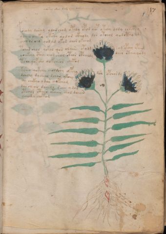

# Voynich Speculative Herbal Ferment Recipe — f17r

IMPORTANT: this is NOT a real or validated translation of the Voynich Manuscript. It is a speculative/procedural model that interprets EVA using a user-defined grammar to generate experimental recipes using safe, known edible substitutes.

This file is generated automatically from IVTFF/EVA transliteration plus a user-defined procedural grammar.



## Page / Folio
- currier: A
- folio: f17r
- page_number: 31
- plant_category_confidence: 0.0
- plant_category_guess: unknown
- section: herbal

## Plant Interpretation (Heuristic)
- category: unknown
- confidence: 0.0
- note: Heuristic classification based on the IVTFF 'Plant ID' string (not the drawing). Does not imply real identification of the manuscript plant.

## EVA Text (Transliteration)
```text
fshody daram ydar chog opydy ypod chop otchy dody oldckhy
ydair choky okshy qodar ckhody dor otchol qodcthy ods
chol or chy qodam okor chor okchom
tcho@154; shol qokol qor olaiin opydg som ypchy ypaim
ychekchy cthy chor shor cphor cphaldy dair cthey qody
tsho qof cho qokcheor cheteg
ksheo qokchy choldshy zepchy dc'a opchordy
dchchy dychear schar ykchy
soy chckho o da[s:r] chypcham
dar chear dcheor [s:?]ain y mol
otchol cthar okaiin chol daiiin
ychod y chotom
oteeeon oiil
```

## Page Summary (Procedural, Aggregated)
- compound_counts: {'aroma modifier': 2, 'secondary herb': 7, 'mix/transfer': 53, 'yeast fermentation': 38, 'main herb': 35, 'heat': 8, 'complex herbal compound': 9, 'sugars': 11, 'liquid base': 9}
- dose_level: 3
- fermentation_estimate: 7–14 days

## Pantry (Max Needed For Any Single Line-Recipe)
- aroma_modifier: ['lemon peel (optional)']
- aroma_modifier_dose: ['2–5 g (or 1 strip of peel, avoiding the bitter pith)']
- main_plant_dry_g: 7
- main_plant_substitute: ['chamomile (safe default substitute)']
- safe_complex_herbal_blend: ['gentle spices (e.g., 1 g cinnamon + 1 g clove) or a commercial herbal tea blend']
- secondary_herb_dry_g: 3
- secondary_herb_substitute: ['mint']
- sugar_or_honey_g: 37
- water_l: 0.5
- yeast_g: 1

## Recipes Index (This Page)
- [f17r.1,@P0](#f17r-1-f17r-1-p0)
- [f17r.2,+P0](#f17r-2-f17r-2-p0)
- [f17r.3,+P0](#f17r-3-f17r-3-p0)
- [f17r.4,+P0](#f17r-4-f17r-4-p0)
- [f17r.5,+P0](#f17r-5-f17r-5-p0)
- [f17r.6,+P0](#f17r-6-f17r-6-p0)
- [f17r.7,+P0](#f17r-7-f17r-7-p0)
- [f17r.8,+P0](#f17r-8-f17r-8-p0)
- [f17r.9,+P0](#f17r-9-f17r-9-p0)
- [f17r.10,+P0](#f17r-10-f17r-10-p0)
- [f17r.11,+P0](#f17r-11-f17r-11-p0)
- [f17r.12,+P0](#f17r-12-f17r-12-p0)
- [f17r.13,@Lx](#f17r-13-f17r-13-lx)

## Line Recipes (Each Line = One Recipe, 0.5L batch)

<a id="f17r-1-f17r-1-p0"></a>

### f17r.1,@P0

EVA: fshody daram ydar chog opydy ypod chop otchy dody oldckhy

## Ingredients
- aroma_modifier: lemon peel (optional)
- aroma_modifier_dose: 2–5 g (or 1 strip of peel, avoiding the bitter pith)
- main_plant_dry_g: 5
- main_plant_substitute: chamomile (safe default substitute)
- safe_complex_herbal_blend: gentle spices (e.g., 1 g cinnamon + 1 g clove) or a commercial herbal tea blend
- secondary_herb_dry_g: 2
- secondary_herb_substitute: mint
- sugar_or_honey_g: 12
- water_l: 0.5
- yeast_g: 1

Process:
1. Sanitize the jar/fermenter and utensils.
2. Base: combine 0.5 L water with 12 g sugar or honey.
3. Apply gentle heat: simmer 10–15 min, then cool to <30°C before adding yeast.
4. Add main plant: chamomile (safe default substitute) (~5 g dried).
5. Add secondary herb: mint (~2 g dried).
6. Add aroma modifier (optional) in a low dose.
7. If a complex herbal compound appears, use a safe commercial blend or gentle spices in micro-doses.
8. Pitch yeast: 1 g (ideally cider/beer yeast).
9. Ferment with an airlock: 2–4 days (guided by iin/aiin markers).
10. Strain/rack (if very solid-heavy) and cold-crash 24 h.
11. Bottle only when activity clearly slows; refrigerate. Avoid overpressure.

Expected Result: A mild, aromatic herbal ferment, low-to-medium intensity depending on dose level.

Does It Make Sense?: partial

Direct Gloss (Procedural, Not a Real Translation):
- fshody: add secondary herb (safe substitute) → add aroma modifier → mix / transfer → start fermentation (yeast)
- daram: start fermentation (yeast) → duration level 1 → state: fermentation start
- ydar: start fermentation (yeast) → duration level 1 → state: fermentation start
- chog: add main plant (safe substitute) → mix / transfer
- opydy: mix / transfer → start fermentation (yeast)
- ypod: mix / transfer → start fermentation (yeast)
- chop: add main plant (safe substitute) → mix / transfer → start fermentation (yeast)
- otchy: apply heat/cooking → add main plant (safe substitute) → mix / transfer
- dody: mix / transfer → start fermentation (yeast)
- oldckhy: mix / transfer → start fermentation (yeast) → add complex herbal compound (safe blend)

<a id="f17r-2-f17r-2-p0"></a>

### f17r.2,+P0

EVA: ydair choky okshy qodar ckhody dor otchol qodcthy ods

## Ingredients
- main_plant_dry_g: 5
- main_plant_substitute: chamomile (safe default substitute)
- safe_complex_herbal_blend: gentle spices (e.g., 1 g cinnamon + 1 g clove) or a commercial herbal tea blend
- secondary_herb_dry_g: 2
- secondary_herb_substitute: mint
- sugar_or_honey_g: 25
- water_l: 0.5
- yeast_g: 1

Process:
1. Sanitize the jar/fermenter and utensils.
2. Base: combine 0.5 L water with 25 g sugar or honey.
3. Apply gentle heat: simmer 10–15 min, then cool to <30°C before adding yeast.
4. Add main plant: chamomile (safe default substitute) (~5 g dried).
5. Add secondary herb: mint (~2 g dried).
6. If a complex herbal compound appears, use a safe commercial blend or gentle spices in micro-doses.
7. Pitch yeast: 1 g (ideally cider/beer yeast).
8. Ferment with an airlock: 2–4 days (guided by iin/aiin markers).
9. Strain/rack (if very solid-heavy) and cold-crash 24 h.
10. Bottle only when activity clearly slows; refrigerate. Avoid overpressure.

Expected Result: A mild, aromatic herbal ferment, low-to-medium intensity depending on dose level.

Does It Make Sense?: partial

Direct Gloss (Procedural, Not a Real Translation):
- ydair: start fermentation (yeast) → duration level 1 → state: fermentation start
- choky: add fermentable sugars → add main plant (safe substitute) → mix / transfer
- okshy: add fermentable sugars → add secondary herb (safe substitute) → mix / transfer
- qodar: prepare liquid base → start fermentation (yeast) → duration level 1 → state: fermentation start
- ckhody: mix / transfer → start fermentation (yeast) → add complex herbal compound (safe blend)
- dor: mix / transfer → start fermentation (yeast)
- otchol: apply heat/cooking → add main plant (safe substitute) → mix / transfer
- qodcthy: prepare liquid base → start fermentation (yeast) → add complex herbal compound (safe blend)
- ods: mix / transfer → start fermentation (yeast)

<a id="f17r-3-f17r-3-p0"></a>

### f17r.3,+P0

EVA: chol or chy qodam okor chor okchom

## Ingredients
- main_plant_dry_g: 5
- main_plant_substitute: chamomile (safe default substitute)
- secondary_herb_dry_g: 1
- secondary_herb_substitute: mint
- sugar_or_honey_g: 25
- water_l: 0.5
- yeast_g: 1

Process:
1. Sanitize the jar/fermenter and utensils.
2. Base: combine 0.5 L water with 25 g sugar or honey.
3. Infusion: use hot (not boiling) water, then let it cool before adding yeast.
4. Add main plant: chamomile (safe default substitute) (~5 g dried).
5. Add secondary herb: mint (~1 g dried).
6. Pitch yeast: 1 g (ideally cider/beer yeast).
7. Ferment with an airlock: 2–4 days (guided by iin/aiin markers).
8. Strain/rack (if very solid-heavy) and cold-crash 24 h.
9. Bottle only when activity clearly slows; refrigerate. Avoid overpressure.

Expected Result: A mild, aromatic herbal ferment, low-to-medium intensity depending on dose level.

Does It Make Sense?: partial

Direct Gloss (Procedural, Not a Real Translation):
- chol: add main plant (safe substitute) → mix / transfer
- or: mix / transfer
- chy: add main plant (safe substitute)
- qodam: prepare liquid base → start fermentation (yeast) → duration level 1 → state: fermentation start
- okor: add fermentable sugars → mix / transfer
- chor: add main plant (safe substitute) → mix / transfer
- okchom: add fermentable sugars → add main plant (safe substitute) → mix / transfer

<a id="f17r-4-f17r-4-p0"></a>

### f17r.4,+P0

EVA: tcho@154; shol qokol qor olaiin opydg som ypchy ypaim

## Ingredients
- main_plant_dry_g: 5
- main_plant_substitute: chamomile (safe default substitute)
- secondary_herb_dry_g: 2
- secondary_herb_substitute: mint
- sugar_or_honey_g: 25
- water_l: 0.5
- yeast_g: 1

Process:
1. Sanitize the jar/fermenter and utensils.
2. Base: combine 0.5 L water with 25 g sugar or honey.
3. Apply gentle heat: simmer 10–15 min, then cool to <30°C before adding yeast.
4. Add main plant: chamomile (safe default substitute) (~5 g dried).
5. Add secondary herb: mint (~2 g dried).
6. Pitch yeast: 1 g (ideally cider/beer yeast).
7. Ferment with an airlock: 7–14 days (guided by iin/aiin markers).
8. Strain/rack (if very solid-heavy) and cold-crash 24 h.
9. Bottle only when activity clearly slows; refrigerate. Avoid overpressure.

Expected Result: A mild, aromatic herbal ferment, low-to-medium intensity depending on dose level.

Does It Make Sense?: partial

Direct Gloss (Procedural, Not a Real Translation):
- tcho: apply heat/cooking → add main plant (safe substitute) → mix / transfer
- shol: add secondary herb (safe substitute) → mix / transfer
- qokol: prepare liquid base → add fermentable sugars → mix / transfer
- qor: prepare liquid base
- olaiin: mix / transfer → duration level 1 → state: fermentation start → long fermentation / aging phase
- opydg: mix / transfer → start fermentation (yeast)
- som: mix / transfer
- ypchy: add main plant (safe substitute) → start fermentation (yeast)
- ypaim: start fermentation (yeast) → duration level 1 → state: fermentation start

<a id="f17r-5-f17r-5-p0"></a>

### f17r.5,+P0

EVA: ychekchy cthy chor shor cphor cphaldy dair cthey qody

## Ingredients
- main_plant_dry_g: 5
- main_plant_substitute: chamomile (safe default substitute)
- safe_complex_herbal_blend: gentle spices (e.g., 1 g cinnamon + 1 g clove) or a commercial herbal tea blend
- secondary_herb_dry_g: 2
- secondary_herb_substitute: mint
- sugar_or_honey_g: 25
- water_l: 0.5
- yeast_g: 1

Process:
1. Sanitize the jar/fermenter and utensils.
2. Base: combine 0.5 L water with 25 g sugar or honey.
3. Infusion: use hot (not boiling) water, then let it cool before adding yeast.
4. Add main plant: chamomile (safe default substitute) (~5 g dried).
5. Add secondary herb: mint (~2 g dried).
6. If a complex herbal compound appears, use a safe commercial blend or gentle spices in micro-doses.
7. Pitch yeast: 1 g (ideally cider/beer yeast).
8. Ferment with an airlock: 2–4 days (guided by iin/aiin markers).
9. Strain/rack (if very solid-heavy) and cold-crash 24 h.
10. Bottle only when activity clearly slows; refrigerate. Avoid overpressure.

Expected Result: A mild, aromatic herbal ferment, low-to-medium intensity depending on dose level.

Does It Make Sense?: partial

Direct Gloss (Procedural, Not a Real Translation):
- ychekchy: add fermentable sugars → add main plant (safe substitute) → duration level 1 → state: active extraction
- cthy: add complex herbal compound (safe blend)
- chor: add main plant (safe substitute) → mix / transfer
- shor: add secondary herb (safe substitute) → mix / transfer
- cphor: mix / transfer → add complex herbal compound (safe blend)
- cphaldy: start fermentation (yeast) → add complex herbal compound (safe blend) → duration level 1 → state: fermentation start
- dair: start fermentation (yeast) → duration level 1 → state: fermentation start
- cthey: add complex herbal compound (safe blend) → duration level 1 → state: active extraction
- qody: prepare liquid base → start fermentation (yeast)

<a id="f17r-6-f17r-6-p0"></a>

### f17r.6,+P0

EVA: tsho qof cho qokcheor cheteg

## Ingredients
- aroma_modifier: lemon peel (optional)
- aroma_modifier_dose: 2–5 g (or 1 strip of peel, avoiding the bitter pith)
- main_plant_dry_g: 5
- main_plant_substitute: chamomile (safe default substitute)
- secondary_herb_dry_g: 2
- secondary_herb_substitute: mint
- sugar_or_honey_g: 25
- water_l: 0.5
- yeast_g: 1

Process:
1. Sanitize the jar/fermenter and utensils.
2. Base: combine 0.5 L water with 25 g sugar or honey.
3. Apply gentle heat: simmer 10–15 min, then cool to <30°C before adding yeast.
4. Add main plant: chamomile (safe default substitute) (~5 g dried).
5. Add secondary herb: mint (~2 g dried).
6. Add aroma modifier (optional) in a low dose.
7. Pitch yeast: 1 g (ideally cider/beer yeast).
8. Ferment with an airlock: 2–4 days (guided by iin/aiin markers).
9. Strain/rack (if very solid-heavy) and cold-crash 24 h.
10. Bottle only when activity clearly slows; refrigerate. Avoid overpressure.

Expected Result: A mild, aromatic herbal ferment, low-to-medium intensity depending on dose level.

Does It Make Sense?: partial

Direct Gloss (Procedural, Not a Real Translation):
- tsho: apply heat/cooking → add secondary herb (safe substitute) → mix / transfer
- qof: prepare liquid base → add aroma modifier
- cho: add main plant (safe substitute) → mix / transfer
- qokcheor: prepare liquid base → add fermentable sugars → add main plant (safe substitute) → mix / transfer → duration level 1 → state: active extraction
- cheteg: apply heat/cooking → add main plant (safe substitute) → duration level 1 → state: active extraction

<a id="f17r-7-f17r-7-p0"></a>

### f17r.7,+P0

EVA: ksheo qokchy choldshy zepchy dc'a opchordy

## Ingredients
- main_plant_dry_g: 5
- main_plant_substitute: chamomile (safe default substitute)
- secondary_herb_dry_g: 2
- secondary_herb_substitute: mint
- sugar_or_honey_g: 25
- water_l: 0.5
- yeast_g: 1

Process:
1. Sanitize the jar/fermenter and utensils.
2. Base: combine 0.5 L water with 25 g sugar or honey.
3. Infusion: use hot (not boiling) water, then let it cool before adding yeast.
4. Add main plant: chamomile (safe default substitute) (~5 g dried).
5. Add secondary herb: mint (~2 g dried).
6. Pitch yeast: 1 g (ideally cider/beer yeast).
7. Ferment with an airlock: 2–4 days (guided by iin/aiin markers).
8. Strain/rack (if very solid-heavy) and cold-crash 24 h.
9. Bottle only when activity clearly slows; refrigerate. Avoid overpressure.

Expected Result: A mild, aromatic herbal ferment, low-to-medium intensity depending on dose level.

Does It Make Sense?: partial

Direct Gloss (Procedural, Not a Real Translation):
- ksheo: add fermentable sugars → add secondary herb (safe substitute) → mix / transfer → duration level 1 → state: active extraction
- qokchy: prepare liquid base → add fermentable sugars → add main plant (safe substitute)
- choldshy: add main plant (safe substitute) → add secondary herb (safe substitute) → mix / transfer → start fermentation (yeast)
- zepchy: add main plant (safe substitute) → start fermentation (yeast) → duration level 1 → state: active extraction
- dc: start fermentation (yeast)
- a: duration level 1 → state: fermentation start
- opchordy: add main plant (safe substitute) → mix / transfer → start fermentation (yeast)

<a id="f17r-8-f17r-8-p0"></a>

### f17r.8,+P0

EVA: dchchy dychear schar ykchy

## Ingredients
- main_plant_dry_g: 5
- main_plant_substitute: chamomile (safe default substitute)
- secondary_herb_dry_g: 1
- secondary_herb_substitute: mint
- sugar_or_honey_g: 25
- water_l: 0.5
- yeast_g: 1

Process:
1. Sanitize the jar/fermenter and utensils.
2. Base: combine 0.5 L water with 25 g sugar or honey.
3. Infusion: use hot (not boiling) water, then let it cool before adding yeast.
4. Add main plant: chamomile (safe default substitute) (~5 g dried).
5. Add secondary herb: mint (~1 g dried).
6. Pitch yeast: 1 g (ideally cider/beer yeast).
7. Ferment with an airlock: 2–4 days (guided by iin/aiin markers).
8. Strain/rack (if very solid-heavy) and cold-crash 24 h.
9. Bottle only when activity clearly slows; refrigerate. Avoid overpressure.

Expected Result: A mild, aromatic herbal ferment, low-to-medium intensity depending on dose level.

Does It Make Sense?: partial

Direct Gloss (Procedural, Not a Real Translation):
- dchchy: add main plant (safe substitute) → start fermentation (yeast)
- dychear: add main plant (safe substitute) → start fermentation (yeast) → duration level 1 → state: active extraction
- schar: add main plant (safe substitute) → duration level 1 → state: fermentation start
- ykchy: add fermentable sugars → add main plant (safe substitute)

<a id="f17r-9-f17r-9-p0"></a>

### f17r.9,+P0

EVA: soy chckho o da[s:r] chypcham

## Ingredients
- main_plant_dry_g: 5
- main_plant_substitute: chamomile (safe default substitute)
- safe_complex_herbal_blend: gentle spices (e.g., 1 g cinnamon + 1 g clove) or a commercial herbal tea blend
- secondary_herb_dry_g: 1
- secondary_herb_substitute: mint
- sugar_or_honey_g: 12
- water_l: 0.5
- yeast_g: 1

Process:
1. Sanitize the jar/fermenter and utensils.
2. Base: combine 0.5 L water with 12 g sugar or honey.
3. Infusion: use hot (not boiling) water, then let it cool before adding yeast.
4. Add main plant: chamomile (safe default substitute) (~5 g dried).
5. Add secondary herb: mint (~1 g dried).
6. If a complex herbal compound appears, use a safe commercial blend or gentle spices in micro-doses.
7. Pitch yeast: 1 g (ideally cider/beer yeast).
8. Ferment with an airlock: 2–4 days (guided by iin/aiin markers).
9. Strain/rack (if very solid-heavy) and cold-crash 24 h.
10. Bottle only when activity clearly slows; refrigerate. Avoid overpressure.

Expected Result: A mild, aromatic herbal ferment, low-to-medium intensity depending on dose level.

Does It Make Sense?: partial

Direct Gloss (Procedural, Not a Real Translation):
- soy: mix / transfer
- chckho: add main plant (safe substitute) → mix / transfer → add complex herbal compound (safe blend)
- o: mix / transfer
- da: start fermentation (yeast) → duration level 1 → state: fermentation start
- s: [unparsed]
- r: [unparsed]
- chypcham: add main plant (safe substitute) → start fermentation (yeast) → duration level 1 → state: fermentation start

<a id="f17r-10-f17r-10-p0"></a>

### f17r.10,+P0

EVA: dar chear dcheor [s:?]ain y mol

## Ingredients
- main_plant_dry_g: 5
- main_plant_substitute: chamomile (safe default substitute)
- secondary_herb_dry_g: 1
- secondary_herb_substitute: mint
- sugar_or_honey_g: 12
- water_l: 0.5
- yeast_g: 1

Process:
1. Sanitize the jar/fermenter and utensils.
2. Base: combine 0.5 L water with 12 g sugar or honey.
3. Infusion: use hot (not boiling) water, then let it cool before adding yeast.
4. Add main plant: chamomile (safe default substitute) (~5 g dried).
5. Add secondary herb: mint (~1 g dried).
6. Pitch yeast: 1 g (ideally cider/beer yeast).
7. Ferment with an airlock: 2–4 days (guided by iin/aiin markers).
8. Strain/rack (if very solid-heavy) and cold-crash 24 h.
9. Bottle only when activity clearly slows; refrigerate. Avoid overpressure.

Expected Result: A mild, aromatic herbal ferment, low-to-medium intensity depending on dose level.

Does It Make Sense?: partial

Direct Gloss (Procedural, Not a Real Translation):
- dar: start fermentation (yeast) → duration level 1 → state: fermentation start
- chear: add main plant (safe substitute) → duration level 1 → state: active extraction
- dcheor: add main plant (safe substitute) → mix / transfer → start fermentation (yeast) → duration level 1 → state: active extraction
- s: [unparsed]
- ain: duration level 1 → state: fermentation start
- y: [unparsed]
- mol: mix / transfer

<a id="f17r-11-f17r-11-p0"></a>

### f17r.11,+P0

EVA: otchol cthar okaiin chol daiiin

## Ingredients
- main_plant_dry_g: 5
- main_plant_substitute: chamomile (safe default substitute)
- safe_complex_herbal_blend: gentle spices (e.g., 1 g cinnamon + 1 g clove) or a commercial herbal tea blend
- secondary_herb_dry_g: 1
- secondary_herb_substitute: mint
- sugar_or_honey_g: 25
- water_l: 0.5
- yeast_g: 1

Process:
1. Sanitize the jar/fermenter and utensils.
2. Base: combine 0.5 L water with 25 g sugar or honey.
3. Apply gentle heat: simmer 10–15 min, then cool to <30°C before adding yeast.
4. Add main plant: chamomile (safe default substitute) (~5 g dried).
5. Add secondary herb: mint (~1 g dried).
6. If a complex herbal compound appears, use a safe commercial blend or gentle spices in micro-doses.
7. Pitch yeast: 1 g (ideally cider/beer yeast).
8. Ferment with an airlock: 7–14 days (guided by iin/aiin markers).
9. Strain/rack (if very solid-heavy) and cold-crash 24 h.
10. Bottle only when activity clearly slows; refrigerate. Avoid overpressure.

Expected Result: A mild, aromatic herbal ferment, low-to-medium intensity depending on dose level.

Does It Make Sense?: partial

Direct Gloss (Procedural, Not a Real Translation):
- otchol: apply heat/cooking → add main plant (safe substitute) → mix / transfer
- cthar: add complex herbal compound (safe blend) → duration level 1 → state: fermentation start
- okaiin: add fermentable sugars → mix / transfer → duration level 1 → state: fermentation start → long fermentation / aging phase
- chol: add main plant (safe substitute) → mix / transfer
- daiiin: start fermentation (yeast) → duration level 1 → state: fermentation start → medium fermentation phase

<a id="f17r-12-f17r-12-p0"></a>

### f17r.12,+P0

EVA: ychod y chotom

## Ingredients
- main_plant_dry_g: 5
- main_plant_substitute: chamomile (safe default substitute)
- secondary_herb_dry_g: 1
- secondary_herb_substitute: mint
- sugar_or_honey_g: 12
- water_l: 0.5
- yeast_g: 1

Process:
1. Sanitize the jar/fermenter and utensils.
2. Base: combine 0.5 L water with 12 g sugar or honey.
3. Apply gentle heat: simmer 10–15 min, then cool to <30°C before adding yeast.
4. Add main plant: chamomile (safe default substitute) (~5 g dried).
5. Add secondary herb: mint (~1 g dried).
6. Pitch yeast: 1 g (ideally cider/beer yeast).
7. Ferment with an airlock: 2–4 days (guided by iin/aiin markers).
8. Strain/rack (if very solid-heavy) and cold-crash 24 h.
9. Bottle only when activity clearly slows; refrigerate. Avoid overpressure.

Expected Result: A mild, aromatic herbal ferment, low-to-medium intensity depending on dose level.

Does It Make Sense?: partial

Direct Gloss (Procedural, Not a Real Translation):
- ychod: add main plant (safe substitute) → mix / transfer → start fermentation (yeast)
- y: [unparsed]
- chotom: apply heat/cooking → add main plant (safe substitute) → mix / transfer

<a id="f17r-13-f17r-13-lx"></a>

### f17r.13,@Lx

EVA: oteeeon oiil

## Ingredients
- main_plant_dry_g: 7
- main_plant_substitute: chamomile (safe default substitute)
- secondary_herb_dry_g: 3
- secondary_herb_substitute: mint
- sugar_or_honey_g: 37
- water_l: 0.5
- yeast_g: 1

Process:
1. Sanitize the jar/fermenter and utensils.
2. Base: combine 0.5 L water with 37 g sugar or honey.
3. Apply gentle heat: simmer 10–15 min, then cool to <30°C before adding yeast.
4. Add main plant: chamomile (safe default substitute) (~7 g dried).
5. Add secondary herb: mint (~3 g dried).
6. Pitch yeast: 1 g (ideally cider/beer yeast).
7. Ferment with an airlock: 2–4 days (guided by iin/aiin markers).
8. Strain/rack (if very solid-heavy) and cold-crash 24 h.
9. Bottle only when activity clearly slows; refrigerate. Avoid overpressure.

Expected Result: A mild, aromatic herbal ferment, low-to-medium intensity depending on dose level.

Does It Make Sense?: partial

Direct Gloss (Procedural, Not a Real Translation):
- oteeeon: apply heat/cooking → mix / transfer → duration level 3 → state: active extraction
- oiil: mix / transfer → duration level 2 → state: cooling/rest

## Risks & Warnings (Applies To All Line-Recipes)
- Never use unidentified Voynich plants directly; only use known edible substitutes.
- Do not consume if you see mold, smell rot, notice abnormal sliminess, or taste something clearly foul.
- Overpressure/bottle-bomb risk: do not bottle before stable; prefer an airlock and refrigeration.
- Avoid if pregnant/breastfeeding, for minors, or with medical conditions; consult a professional.
- No medical claims: this is an experimental beverage.

## Recommended Adjustments (General)
- If too bitter (leafy profile), halve the herbs or shorten steep/maceration time.
- If too sweet, extend fermentation or reduce sugar by 25–50%.
- For a non-alcoholic version, omit yeast and keep refrigerated as an infusion (not fermented).
