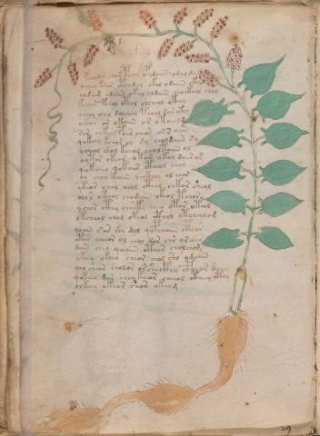

# Voynich Speculative Herbal Ferment Recipe — f17v

IMPORTANT: this is NOT a real or validated translation of the Voynich Manuscript. It is a speculative/procedural model that interprets EVA using a user-defined grammar to generate experimental recipes using safe, known edible substitutes.

This file is generated automatically from IVTFF/EVA transliteration plus a user-defined procedural grammar.



## Page / Folio
- currier: A
- folio: f17v
- page_number: 32
- section: herbal

## EVA Text (Transliteration)
```text
pchodol chor pchy opydaiin odal dy
ycheey keeor cthodal okol odaiin okal
oldaig odaiin okal oldaiin chockhol olol
kchor fchol cphol olcheol ok[eee:eeee]y
ychol chol dolcheey tchol dar ckhy
oekor or okaiin or otaiin d
sor chkeey poiis cheor os s aiin
qokeey kchar ol dy choldaiin sy
ycheol shol kchol choltaiin ol
oytor okeor okar okol daiir a[r:m]
qokcheo qokoiir ctheol chol
oy choy keaiin chckhey ol chor
ykeor chol chol cthol chkor sheol
olo r okeeol chodaiin okeol tchory
ychor cthy che'eky cheo otor oteol
okcheol chol okeol cthol otcheolom
qoain [s:e']ar she dol qopchaiin cthor
otor cheeor ol chol dor chr or eees
dain chey qoaiin cthor cholchom
ykeey okeey cheor chol sho odaiin
oal sheor sholor or shecthy cpheor daiin
qokeee dar chey keeor cheeol ctheey cthy
chkeey okeor sh[a:o]r okeom
```

## Recipes Index (This Page)
- [f17v.1,@P0](#f17v-1-f17v-1-p0)
- [f17v.2,+P0](#f17v-2-f17v-2-p0)
- [f17v.3,+P0](#f17v-3-f17v-3-p0)
- [f17v.4,+P0](#f17v-4-f17v-4-p0)
- [f17v.5,+P0](#f17v-5-f17v-5-p0)
- [f17v.6,+P0](#f17v-6-f17v-6-p0)
- [f17v.7,+P0](#f17v-7-f17v-7-p0)
- [f17v.8,+P0](#f17v-8-f17v-8-p0)
- [f17v.9,+P0](#f17v-9-f17v-9-p0)
- [f17v.10,+P0](#f17v-10-f17v-10-p0)
- [f17v.11,+P0](#f17v-11-f17v-11-p0)
- [f17v.12,+P0](#f17v-12-f17v-12-p0)
- [f17v.13,+P0](#f17v-13-f17v-13-p0)
- [f17v.14,+P0](#f17v-14-f17v-14-p0)
- [f17v.15,+P0](#f17v-15-f17v-15-p0)
- [f17v.16,+P0](#f17v-16-f17v-16-p0)
- [f17v.17,+P0](#f17v-17-f17v-17-p0)
- [f17v.18,+P0](#f17v-18-f17v-18-p0)
- [f17v.19,+P0](#f17v-19-f17v-19-p0)
- [f17v.20,+P0](#f17v-20-f17v-20-p0)
- [f17v.21,+P0](#f17v-21-f17v-21-p0)
- [f17v.22,+P0](#f17v-22-f17v-22-p0)
- [f17v.23,+P0](#f17v-23-f17v-23-p0)

## Line Glosses (Procedural Gloss Only; Not a Translation)

<a id="f17v-1-f17v-1-p0"></a>

### f17v.1,@P0

EVA: pchodol chor pchy opydaiin odal dy

Direct Gloss (Procedural, Not a Real Translation):
- pchodol: add main plant (safe substitute) → mix / transfer → start fermentation (yeast)
- chor: add main plant (safe substitute) → mix / transfer
- pchy: add main plant (safe substitute) → start fermentation (yeast)
- opydaiin: mix / transfer → start fermentation (yeast) → duration level 1 → state: fermentation start → long fermentation / aging phase
- odal: mix / transfer → start fermentation (yeast) → duration level 1 → state: fermentation start
- dy: start fermentation (yeast)

<a id="f17v-2-f17v-2-p0"></a>

### f17v.2,+P0

EVA: ycheey keeor cthodal okol odaiin okal

Direct Gloss (Procedural, Not a Real Translation):
- ycheey: add main plant (safe substitute) → duration level 2 → state: active extraction
- keeor: add fermentable sugars → mix / transfer → duration level 2 → state: active extraction
- cthodal: mix / transfer → start fermentation (yeast) → add complex herbal compound (safe blend) → duration level 1 → state: fermentation start
- okol: add fermentable sugars → mix / transfer
- odaiin: mix / transfer → start fermentation (yeast) → duration level 1 → state: fermentation start → long fermentation / aging phase
- okal: add fermentable sugars → mix / transfer → duration level 1 → state: fermentation start

<a id="f17v-3-f17v-3-p0"></a>

### f17v.3,+P0

EVA: oldaig odaiin okal oldaiin chockhol olol

Direct Gloss (Procedural, Not a Real Translation):
- oldaig: mix / transfer → start fermentation (yeast) → duration level 1 → state: fermentation start
- odaiin: mix / transfer → start fermentation (yeast) → duration level 1 → state: fermentation start → long fermentation / aging phase
- okal: add fermentable sugars → mix / transfer → duration level 1 → state: fermentation start
- oldaiin: mix / transfer → start fermentation (yeast) → duration level 1 → state: fermentation start → long fermentation / aging phase
- chockhol: add main plant (safe substitute) → mix / transfer → add complex herbal compound (safe blend)
- olol: mix / transfer

<a id="f17v-4-f17v-4-p0"></a>

### f17v.4,+P0

EVA: kchor fchol cphol olcheol ok[eee:eeee]y

Direct Gloss (Procedural, Not a Real Translation):
- kchor: add fermentable sugars → add main plant (safe substitute) → mix / transfer
- fchol: add main plant (safe substitute) → add aroma modifier → mix / transfer
- cphol: mix / transfer → add complex herbal compound (safe blend)
- olcheol: add main plant (safe substitute) → mix / transfer → duration level 1 → state: active extraction
- ok: add fermentable sugars → mix / transfer
- eee: duration level 3 → state: active extraction
- eeee: duration level 4 → state: active extraction
- y: [unparsed]

<a id="f17v-5-f17v-5-p0"></a>

### f17v.5,+P0

EVA: ychol chol dolcheey tchol dar ckhy

Direct Gloss (Procedural, Not a Real Translation):
- ychol: add main plant (safe substitute) → mix / transfer
- chol: add main plant (safe substitute) → mix / transfer
- dolcheey: add main plant (safe substitute) → mix / transfer → start fermentation (yeast) → duration level 2 → state: active extraction
- tchol: apply heat/cooking → add main plant (safe substitute) → mix / transfer
- dar: start fermentation (yeast) → duration level 1 → state: fermentation start
- ckhy: add complex herbal compound (safe blend)

<a id="f17v-6-f17v-6-p0"></a>

### f17v.6,+P0

EVA: oekor or okaiin or otaiin d

Direct Gloss (Procedural, Not a Real Translation):
- oekor: add fermentable sugars → mix / transfer → duration level 1 → state: active extraction
- or: mix / transfer
- okaiin: add fermentable sugars → mix / transfer → duration level 1 → state: fermentation start → long fermentation / aging phase
- or: mix / transfer
- otaiin: apply heat/cooking → mix / transfer → duration level 1 → state: fermentation start → long fermentation / aging phase
- d: start fermentation (yeast)

<a id="f17v-7-f17v-7-p0"></a>

### f17v.7,+P0

EVA: sor chkeey poiis cheor os s aiin

Direct Gloss (Procedural, Not a Real Translation):
- sor: mix / transfer
- chkeey: add fermentable sugars → add main plant (safe substitute) → duration level 2 → state: active extraction
- poiis: mix / transfer → start fermentation (yeast) → duration level 2 → state: cooling/rest
- cheor: add main plant (safe substitute) → mix / transfer → duration level 1 → state: active extraction
- os: mix / transfer
- s: [unparsed]
- aiin: duration level 1 → state: fermentation start → long fermentation / aging phase

<a id="f17v-8-f17v-8-p0"></a>

### f17v.8,+P0

EVA: qokeey kchar ol dy choldaiin sy

Direct Gloss (Procedural, Not a Real Translation):
- qokeey: prepare liquid base → add fermentable sugars → duration level 2 → state: active extraction
- kchar: add fermentable sugars → add main plant (safe substitute) → duration level 1 → state: fermentation start
- ol: mix / transfer
- dy: start fermentation (yeast)
- choldaiin: add main plant (safe substitute) → mix / transfer → start fermentation (yeast) → duration level 1 → state: fermentation start → long fermentation / aging phase
- sy: [unparsed]

<a id="f17v-9-f17v-9-p0"></a>

### f17v.9,+P0

EVA: ycheol shol kchol choltaiin ol

Direct Gloss (Procedural, Not a Real Translation):
- ycheol: add main plant (safe substitute) → mix / transfer → duration level 1 → state: active extraction
- shol: add secondary herb (safe substitute) → mix / transfer
- kchol: add fermentable sugars → add main plant (safe substitute) → mix / transfer
- choltaiin: apply heat/cooking → add main plant (safe substitute) → mix / transfer → duration level 1 → state: fermentation start → long fermentation / aging phase
- ol: mix / transfer

<a id="f17v-10-f17v-10-p0"></a>

### f17v.10,+P0

EVA: oytor okeor okar okol daiir a[r:m]

Direct Gloss (Procedural, Not a Real Translation):
- oytor: apply heat/cooking → mix / transfer
- okeor: add fermentable sugars → mix / transfer → duration level 1 → state: active extraction
- okar: add fermentable sugars → mix / transfer → duration level 1 → state: fermentation start
- okol: add fermentable sugars → mix / transfer
- daiir: start fermentation (yeast) → duration level 1 → state: fermentation start
- a: duration level 1 → state: fermentation start
- r: [unparsed]
- m: [unparsed]

<a id="f17v-11-f17v-11-p0"></a>

### f17v.11,+P0

EVA: qokcheo qokoiir ctheol chol

Direct Gloss (Procedural, Not a Real Translation):
- qokcheo: prepare liquid base → add fermentable sugars → add main plant (safe substitute) → mix / transfer → duration level 1 → state: active extraction
- qokoiir: prepare liquid base → add fermentable sugars → mix / transfer → duration level 2 → state: cooling/rest
- ctheol: mix / transfer → add complex herbal compound (safe blend) → duration level 1 → state: active extraction
- chol: add main plant (safe substitute) → mix / transfer

<a id="f17v-12-f17v-12-p0"></a>

### f17v.12,+P0

EVA: oy choy keaiin chckhey ol chor

Direct Gloss (Procedural, Not a Real Translation):
- oy: mix / transfer
- choy: add main plant (safe substitute) → mix / transfer
- keaiin: add fermentable sugars → duration level 1 → state: active extraction → long fermentation / aging phase
- chckhey: add main plant (safe substitute) → add complex herbal compound (safe blend) → duration level 1 → state: active extraction
- ol: mix / transfer
- chor: add main plant (safe substitute) → mix / transfer

<a id="f17v-13-f17v-13-p0"></a>

### f17v.13,+P0

EVA: ykeor chol chol cthol chkor sheol

Direct Gloss (Procedural, Not a Real Translation):
- ykeor: add fermentable sugars → mix / transfer → duration level 1 → state: active extraction
- chol: add main plant (safe substitute) → mix / transfer
- chol: add main plant (safe substitute) → mix / transfer
- cthol: mix / transfer → add complex herbal compound (safe blend)
- chkor: add fermentable sugars → add main plant (safe substitute) → mix / transfer
- sheol: add secondary herb (safe substitute) → mix / transfer → duration level 1 → state: active extraction

<a id="f17v-14-f17v-14-p0"></a>

### f17v.14,+P0

EVA: olo r okeeol chodaiin okeol tchory

Direct Gloss (Procedural, Not a Real Translation):
- olo: mix / transfer
- r: [unparsed]
- okeeol: add fermentable sugars → mix / transfer → duration level 2 → state: active extraction
- chodaiin: add main plant (safe substitute) → mix / transfer → start fermentation (yeast) → duration level 1 → state: fermentation start → long fermentation / aging phase
- okeol: add fermentable sugars → mix / transfer → duration level 1 → state: active extraction
- tchory: apply heat/cooking → add main plant (safe substitute) → mix / transfer

<a id="f17v-15-f17v-15-p0"></a>

### f17v.15,+P0

EVA: ychor cthy che'eky cheo otor oteol

Direct Gloss (Procedural, Not a Real Translation):
- ychor: add main plant (safe substitute) → mix / transfer
- cthy: add complex herbal compound (safe blend)
- che: add main plant (safe substitute) → duration level 1 → state: active extraction
- eky: add fermentable sugars → duration level 1 → state: active extraction
- cheo: add main plant (safe substitute) → mix / transfer → duration level 1 → state: active extraction
- otor: apply heat/cooking → mix / transfer
- oteol: apply heat/cooking → mix / transfer → duration level 1 → state: active extraction

<a id="f17v-16-f17v-16-p0"></a>

### f17v.16,+P0

EVA: okcheol chol okeol cthol otcheolom

Direct Gloss (Procedural, Not a Real Translation):
- okcheol: add fermentable sugars → add main plant (safe substitute) → mix / transfer → duration level 1 → state: active extraction
- chol: add main plant (safe substitute) → mix / transfer
- okeol: add fermentable sugars → mix / transfer → duration level 1 → state: active extraction
- cthol: mix / transfer → add complex herbal compound (safe blend)
- otcheolom: apply heat/cooking → add main plant (safe substitute) → mix / transfer → duration level 1 → state: active extraction

<a id="f17v-17-f17v-17-p0"></a>

### f17v.17,+P0

EVA: qoain [s:e']ar she dol qopchaiin cthor

Direct Gloss (Procedural, Not a Real Translation):
- qoain: prepare liquid base → duration level 1 → state: fermentation start
- s: [unparsed]
- e: duration level 1 → state: active extraction
- ar: duration level 1 → state: fermentation start
- she: add secondary herb (safe substitute) → duration level 1 → state: active extraction
- dol: mix / transfer → start fermentation (yeast)
- qopchaiin: prepare liquid base → add main plant (safe substitute) → start fermentation (yeast) → duration level 1 → state: fermentation start → long fermentation / aging phase
- cthor: mix / transfer → add complex herbal compound (safe blend)

<a id="f17v-18-f17v-18-p0"></a>

### f17v.18,+P0

EVA: otor cheeor ol chol dor chr or eees

Direct Gloss (Procedural, Not a Real Translation):
- otor: apply heat/cooking → mix / transfer
- cheeor: add main plant (safe substitute) → mix / transfer → duration level 2 → state: active extraction
- ol: mix / transfer
- chol: add main plant (safe substitute) → mix / transfer
- dor: mix / transfer → start fermentation (yeast)
- chr: add main plant (safe substitute)
- or: mix / transfer
- eees: duration level 3 → state: active extraction

<a id="f17v-19-f17v-19-p0"></a>

### f17v.19,+P0

EVA: dain chey qoaiin cthor cholchom

Direct Gloss (Procedural, Not a Real Translation):
- dain: start fermentation (yeast) → duration level 1 → state: fermentation start
- chey: add main plant (safe substitute) → duration level 1 → state: active extraction
- qoaiin: prepare liquid base → duration level 1 → state: fermentation start → long fermentation / aging phase
- cthor: mix / transfer → add complex herbal compound (safe blend)
- cholchom: add main plant (safe substitute) → mix / transfer

<a id="f17v-20-f17v-20-p0"></a>

### f17v.20,+P0

EVA: ykeey okeey cheor chol sho odaiin

Direct Gloss (Procedural, Not a Real Translation):
- ykeey: add fermentable sugars → duration level 2 → state: active extraction
- okeey: add fermentable sugars → mix / transfer → duration level 2 → state: active extraction
- cheor: add main plant (safe substitute) → mix / transfer → duration level 1 → state: active extraction
- chol: add main plant (safe substitute) → mix / transfer
- sho: add secondary herb (safe substitute) → mix / transfer
- odaiin: mix / transfer → start fermentation (yeast) → duration level 1 → state: fermentation start → long fermentation / aging phase

<a id="f17v-21-f17v-21-p0"></a>

### f17v.21,+P0

EVA: oal sheor sholor or shecthy cpheor daiin

Direct Gloss (Procedural, Not a Real Translation):
- oal: mix / transfer → duration level 1 → state: fermentation start
- sheor: add secondary herb (safe substitute) → mix / transfer → duration level 1 → state: active extraction
- sholor: add secondary herb (safe substitute) → mix / transfer
- or: mix / transfer
- shecthy: add secondary herb (safe substitute) → add complex herbal compound (safe blend) → duration level 1 → state: active extraction
- cpheor: mix / transfer → add complex herbal compound (safe blend) → duration level 1 → state: active extraction
- daiin: start fermentation (yeast) → duration level 1 → state: fermentation start → long fermentation / aging phase

<a id="f17v-22-f17v-22-p0"></a>

### f17v.22,+P0

EVA: qokeee dar chey keeor cheeol ctheey cthy

Direct Gloss (Procedural, Not a Real Translation):
- qokeee: prepare liquid base → add fermentable sugars → duration level 3 → state: active extraction
- dar: start fermentation (yeast) → duration level 1 → state: fermentation start
- chey: add main plant (safe substitute) → duration level 1 → state: active extraction
- keeor: add fermentable sugars → mix / transfer → duration level 2 → state: active extraction
- cheeol: add main plant (safe substitute) → mix / transfer → duration level 2 → state: active extraction
- ctheey: add complex herbal compound (safe blend) → duration level 2 → state: active extraction
- cthy: add complex herbal compound (safe blend)

<a id="f17v-23-f17v-23-p0"></a>

### f17v.23,+P0

EVA: chkeey okeor sh[a:o]r okeom

Direct Gloss (Procedural, Not a Real Translation):
- chkeey: add fermentable sugars → add main plant (safe substitute) → duration level 2 → state: active extraction
- okeor: add fermentable sugars → mix / transfer → duration level 1 → state: active extraction
- sh: add secondary herb (safe substitute)
- a: duration level 1 → state: fermentation start
- o: mix / transfer
- r: [unparsed]
- okeom: add fermentable sugars → mix / transfer → duration level 1 → state: active extraction
