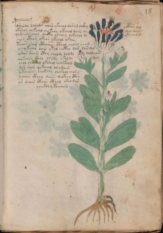

# Voynich Speculative Herbal Ferment Recipe — f18r

IMPORTANT: this is NOT a real or validated translation of the Voynich Manuscript. It is a speculative/procedural model that interprets EVA using a user-defined grammar to generate experimental recipes using safe, known edible substitutes.

This file is generated automatically from IVTFF/EVA transliteration plus a user-defined procedural grammar.



## Page / Folio
- currier: A
- folio: f18r
- page_number: 33
- section: herbal

## EVA Text (Transliteration)
```text
pdrairdy darodcf yoar ykchol dar om chckhy octhor dal
otshol qokchol chykchy okchal daiin dy chol dain
qokchor chor c@139;h@246;key or chey qokchol dy ytcharg
chor [cth:ith]or okeor ykchol okain
tchor shor cthaiin cthol chlol chom
ychy kchor dair ytol chcthy dar dar dal
oshor shaiin cthy sholdy doldy doldaiin
qokchor ckhol olody okal dy dary
chol chcthal okshal chykald
dar shor qokchol ol ydaiin
sotchaiin chokchy chckhol chor g
ychair cthol daiin qokchy cthy
or shaiin cth[a:o]r cthal okal dar
ychekch y kchaiin
```

## Recipes Index (This Page)
- [f18r.1,@P0](#f18r-1-f18r-1-p0)
- [f18r.2,+P0](#f18r-2-f18r-2-p0)
- [f18r.3,+P0](#f18r-3-f18r-3-p0)
- [f18r.4,+P0](#f18r-4-f18r-4-p0)
- [f18r.5,+P0](#f18r-5-f18r-5-p0)
- [f18r.6,+P0](#f18r-6-f18r-6-p0)
- [f18r.7,+P0](#f18r-7-f18r-7-p0)
- [f18r.8,+P0](#f18r-8-f18r-8-p0)
- [f18r.9,+P0](#f18r-9-f18r-9-p0)
- [f18r.10,+P0](#f18r-10-f18r-10-p0)
- [f18r.11,+P0](#f18r-11-f18r-11-p0)
- [f18r.12,+P0](#f18r-12-f18r-12-p0)
- [f18r.13,+P0](#f18r-13-f18r-13-p0)
- [f18r.14,+Pc](#f18r-14-f18r-14-pc)

## Line Glosses (Procedural Gloss Only; Not a Translation)

<a id="f18r-1-f18r-1-p0"></a>

### f18r.1,@P0

EVA: pdrairdy darodcf yoar ykchol dar om chckhy octhor dal

Direct Gloss (Procedural, Not a Real Translation):
- pdrairdy: start fermentation (yeast) → duration level 1 → state: fermentation start
- darodcf: add aroma modifier → mix / transfer → start fermentation (yeast) → duration level 1 → state: fermentation start
- yoar: mix / transfer → duration level 1 → state: fermentation start
- ykchol: add fermentable sugars → add main plant (safe substitute) → mix / transfer
- dar: start fermentation (yeast) → duration level 1 → state: fermentation start
- om: mix / transfer
- chckhy: add main plant (safe substitute) → add complex herbal compound (safe blend)
- octhor: mix / transfer → add complex herbal compound (safe blend)
- dal: start fermentation (yeast) → duration level 1 → state: fermentation start

<a id="f18r-2-f18r-2-p0"></a>

### f18r.2,+P0

EVA: otshol qokchol chykchy okchal daiin dy chol dain

Direct Gloss (Procedural, Not a Real Translation):
- otshol: apply heat/cooking → add secondary herb (safe substitute) → mix / transfer
- qokchol: prepare liquid base → add fermentable sugars → add main plant (safe substitute) → mix / transfer
- chykchy: add fermentable sugars → add main plant (safe substitute)
- okchal: add fermentable sugars → add main plant (safe substitute) → mix / transfer → duration level 1 → state: fermentation start
- daiin: start fermentation (yeast) → duration level 1 → state: fermentation start → long fermentation / aging phase
- dy: start fermentation (yeast)
- chol: add main plant (safe substitute) → mix / transfer
- dain: start fermentation (yeast) → duration level 1 → state: fermentation start

<a id="f18r-3-f18r-3-p0"></a>

### f18r.3,+P0

EVA: qokchor chor c@139;h@246;key or chey qokchol dy ytcharg

Direct Gloss (Procedural, Not a Real Translation):
- qokchor: prepare liquid base → add fermentable sugars → add main plant (safe substitute) → mix / transfer
- chor: add main plant (safe substitute) → mix / transfer
- c: [unparsed]
- h: [unparsed]
- key: add fermentable sugars → duration level 1 → state: active extraction
- or: mix / transfer
- chey: add main plant (safe substitute) → duration level 1 → state: active extraction
- qokchol: prepare liquid base → add fermentable sugars → add main plant (safe substitute) → mix / transfer
- dy: start fermentation (yeast)
- ytcharg: apply heat/cooking → add main plant (safe substitute) → duration level 1 → state: fermentation start

<a id="f18r-4-f18r-4-p0"></a>

### f18r.4,+P0

EVA: chor [cth:ith]or okeor ykchol okain

Direct Gloss (Procedural, Not a Real Translation):
- chor: add main plant (safe substitute) → mix / transfer
- cth: add complex herbal compound (safe blend)
- ith: apply heat/cooking → duration level 1 → state: cooling/rest
- or: mix / transfer
- okeor: add fermentable sugars → mix / transfer → duration level 1 → state: active extraction
- ykchol: add fermentable sugars → add main plant (safe substitute) → mix / transfer
- okain: add fermentable sugars → mix / transfer → duration level 1 → state: fermentation start

<a id="f18r-5-f18r-5-p0"></a>

### f18r.5,+P0

EVA: tchor shor cthaiin cthol chlol chom

Direct Gloss (Procedural, Not a Real Translation):
- tchor: apply heat/cooking → add main plant (safe substitute) → mix / transfer
- shor: add secondary herb (safe substitute) → mix / transfer
- cthaiin: add complex herbal compound (safe blend) → duration level 1 → state: fermentation start → long fermentation / aging phase
- cthol: mix / transfer → add complex herbal compound (safe blend)
- chlol: add main plant (safe substitute) → mix / transfer
- chom: add main plant (safe substitute) → mix / transfer

<a id="f18r-6-f18r-6-p0"></a>

### f18r.6,+P0

EVA: ychy kchor dair ytol chcthy dar dar dal

Direct Gloss (Procedural, Not a Real Translation):
- ychy: add main plant (safe substitute)
- kchor: add fermentable sugars → add main plant (safe substitute) → mix / transfer
- dair: start fermentation (yeast) → duration level 1 → state: fermentation start
- ytol: apply heat/cooking → mix / transfer
- chcthy: add main plant (safe substitute) → add complex herbal compound (safe blend)
- dar: start fermentation (yeast) → duration level 1 → state: fermentation start
- dar: start fermentation (yeast) → duration level 1 → state: fermentation start
- dal: start fermentation (yeast) → duration level 1 → state: fermentation start

<a id="f18r-7-f18r-7-p0"></a>

### f18r.7,+P0

EVA: oshor shaiin cthy sholdy doldy doldaiin

Direct Gloss (Procedural, Not a Real Translation):
- oshor: add secondary herb (safe substitute) → mix / transfer
- shaiin: add secondary herb (safe substitute) → duration level 1 → state: fermentation start → long fermentation / aging phase
- cthy: add complex herbal compound (safe blend)
- sholdy: add secondary herb (safe substitute) → mix / transfer → start fermentation (yeast)
- doldy: mix / transfer → start fermentation (yeast)
- doldaiin: mix / transfer → start fermentation (yeast) → duration level 1 → state: fermentation start → long fermentation / aging phase

<a id="f18r-8-f18r-8-p0"></a>

### f18r.8,+P0

EVA: qokchor ckhol olody okal dy dary

Direct Gloss (Procedural, Not a Real Translation):
- qokchor: prepare liquid base → add fermentable sugars → add main plant (safe substitute) → mix / transfer
- ckhol: mix / transfer → add complex herbal compound (safe blend)
- olody: mix / transfer → start fermentation (yeast)
- okal: add fermentable sugars → mix / transfer → duration level 1 → state: fermentation start
- dy: start fermentation (yeast)
- dary: start fermentation (yeast) → duration level 1 → state: fermentation start

<a id="f18r-9-f18r-9-p0"></a>

### f18r.9,+P0

EVA: chol chcthal okshal chykald

Direct Gloss (Procedural, Not a Real Translation):
- chol: add main plant (safe substitute) → mix / transfer
- chcthal: add main plant (safe substitute) → add complex herbal compound (safe blend) → duration level 1 → state: fermentation start
- okshal: add fermentable sugars → add secondary herb (safe substitute) → mix / transfer → duration level 1 → state: fermentation start
- chykald: add fermentable sugars → add main plant (safe substitute) → start fermentation (yeast) → duration level 1 → state: fermentation start

<a id="f18r-10-f18r-10-p0"></a>

### f18r.10,+P0

EVA: dar shor qokchol ol ydaiin

Direct Gloss (Procedural, Not a Real Translation):
- dar: start fermentation (yeast) → duration level 1 → state: fermentation start
- shor: add secondary herb (safe substitute) → mix / transfer
- qokchol: prepare liquid base → add fermentable sugars → add main plant (safe substitute) → mix / transfer
- ol: mix / transfer
- ydaiin: start fermentation (yeast) → duration level 1 → state: fermentation start → long fermentation / aging phase

<a id="f18r-11-f18r-11-p0"></a>

### f18r.11,+P0

EVA: sotchaiin chokchy chckhol chor g

Direct Gloss (Procedural, Not a Real Translation):
- sotchaiin: apply heat/cooking → add main plant (safe substitute) → mix / transfer → duration level 1 → state: fermentation start → long fermentation / aging phase
- chokchy: add fermentable sugars → add main plant (safe substitute) → mix / transfer
- chckhol: add main plant (safe substitute) → mix / transfer → add complex herbal compound (safe blend)
- chor: add main plant (safe substitute) → mix / transfer
- g: [unparsed]

<a id="f18r-12-f18r-12-p0"></a>

### f18r.12,+P0

EVA: ychair cthol daiin qokchy cthy

Direct Gloss (Procedural, Not a Real Translation):
- ychair: add main plant (safe substitute) → duration level 1 → state: fermentation start
- cthol: mix / transfer → add complex herbal compound (safe blend)
- daiin: start fermentation (yeast) → duration level 1 → state: fermentation start → long fermentation / aging phase
- qokchy: prepare liquid base → add fermentable sugars → add main plant (safe substitute)
- cthy: add complex herbal compound (safe blend)

<a id="f18r-13-f18r-13-p0"></a>

### f18r.13,+P0

EVA: or shaiin cth[a:o]r cthal okal dar

Direct Gloss (Procedural, Not a Real Translation):
- or: mix / transfer
- shaiin: add secondary herb (safe substitute) → duration level 1 → state: fermentation start → long fermentation / aging phase
- cth: add complex herbal compound (safe blend)
- a: duration level 1 → state: fermentation start
- o: mix / transfer
- r: [unparsed]
- cthal: add complex herbal compound (safe blend) → duration level 1 → state: fermentation start
- okal: add fermentable sugars → mix / transfer → duration level 1 → state: fermentation start
- dar: start fermentation (yeast) → duration level 1 → state: fermentation start

<a id="f18r-14-f18r-14-pc"></a>

### f18r.14,+Pc

EVA: ychekch y kchaiin

Direct Gloss (Procedural, Not a Real Translation):
- ychekch: add fermentable sugars → add main plant (safe substitute) → duration level 1 → state: active extraction
- y: [unparsed]
- kchaiin: add fermentable sugars → add main plant (safe substitute) → duration level 1 → state: fermentation start → long fermentation / aging phase
