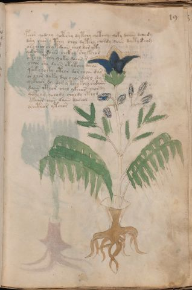

# Voynich Speculative Herbal Ferment Recipe — f19r

IMPORTANT: this is NOT a real or validated translation of the Voynich Manuscript. It is a speculative/procedural model that interprets EVA using a user-defined grammar to generate experimental recipes using safe, known edible substitutes.

This file is generated automatically from IVTFF/EVA transliteration plus a user-defined procedural grammar.



## Page / Folio
- currier: A
- folio: f19r
- page_number: 35
- section: herbal

## EVA Text (Transliteration)
```text
pchor qodchy qotshy dy tchy qotchy qoky daiin dchydy
dshy chor y tchy chol dytchy chordy daiin dyty @241; cho@242;
oscheor shy tdaiin chol dor yky
qokorar daiin chckhy shy kchor
otchy tchy qoky daiin @243;
yshor shy daiin otytchy daiin
qo'k cho ky cthar dor chan dar
or chor daky dal chor dorl shy
qotchor dy dor y tchy kchy shdaiin
daiin cthor chol ykchor chordy
qotchy qolody choldy cthyd
ykchor chor daiin daiinol
os octhor ytchor
```

## Recipes Index (This Page)
- [f19r.1,@P0](#f19r-1-f19r-1-p0)
- [f19r.2,+P0](#f19r-2-f19r-2-p0)
- [f19r.3,+P0](#f19r-3-f19r-3-p0)
- [f19r.4,+P0](#f19r-4-f19r-4-p0)
- [f19r.5,+P0](#f19r-5-f19r-5-p0)
- [f19r.6,+P0](#f19r-6-f19r-6-p0)
- [f19r.7,+P0](#f19r-7-f19r-7-p0)
- [f19r.8,+P0](#f19r-8-f19r-8-p0)
- [f19r.9,+P0](#f19r-9-f19r-9-p0)
- [f19r.10,+P0](#f19r-10-f19r-10-p0)
- [f19r.11,+P0](#f19r-11-f19r-11-p0)
- [f19r.12,+P0](#f19r-12-f19r-12-p0)
- [f19r.13,+P0](#f19r-13-f19r-13-p0)

## Line Glosses (Procedural Gloss Only; Not a Translation)

<a id="f19r-1-f19r-1-p0"></a>

### f19r.1,@P0

EVA: pchor qodchy qotshy dy tchy qotchy qoky daiin dchydy

Direct Gloss (Procedural, Not a Real Translation):
- pchor: add main plant (safe substitute) → mix / transfer → start fermentation (yeast)
- qodchy: prepare liquid base → add main plant (safe substitute) → start fermentation (yeast)
- qotshy: prepare liquid base → apply heat/cooking → add secondary herb (safe substitute)
- dy: start fermentation (yeast)
- tchy: apply heat/cooking → add main plant (safe substitute)
- qotchy: prepare liquid base → apply heat/cooking → add main plant (safe substitute)
- qoky: prepare liquid base → add fermentable sugars
- daiin: start fermentation (yeast) → duration level 1 → state: fermentation start → long fermentation / aging phase
- dchydy: add main plant (safe substitute) → start fermentation (yeast)

<a id="f19r-2-f19r-2-p0"></a>

### f19r.2,+P0

EVA: dshy chor y tchy chol dytchy chordy daiin dyty @241; cho@242;

Direct Gloss (Procedural, Not a Real Translation):
- dshy: add secondary herb (safe substitute) → start fermentation (yeast)
- chor: add main plant (safe substitute) → mix / transfer
- y: [unparsed]
- tchy: apply heat/cooking → add main plant (safe substitute)
- chol: add main plant (safe substitute) → mix / transfer
- dytchy: apply heat/cooking → add main plant (safe substitute) → start fermentation (yeast)
- chordy: add main plant (safe substitute) → mix / transfer → start fermentation (yeast)
- daiin: start fermentation (yeast) → duration level 1 → state: fermentation start → long fermentation / aging phase
- dyty: apply heat/cooking → start fermentation (yeast)
- cho: add main plant (safe substitute) → mix / transfer

<a id="f19r-3-f19r-3-p0"></a>

### f19r.3,+P0

EVA: oscheor shy tdaiin chol dor yky

Direct Gloss (Procedural, Not a Real Translation):
- oscheor: add main plant (safe substitute) → mix / transfer → duration level 1 → state: active extraction
- shy: add secondary herb (safe substitute)
- tdaiin: apply heat/cooking → start fermentation (yeast) → duration level 1 → state: fermentation start → long fermentation / aging phase
- chol: add main plant (safe substitute) → mix / transfer
- dor: mix / transfer → start fermentation (yeast)
- yky: add fermentable sugars

<a id="f19r-4-f19r-4-p0"></a>

### f19r.4,+P0

EVA: qokorar daiin chckhy shy kchor

Direct Gloss (Procedural, Not a Real Translation):
- qokorar: prepare liquid base → add fermentable sugars → mix / transfer → duration level 1 → state: fermentation start
- daiin: start fermentation (yeast) → duration level 1 → state: fermentation start → long fermentation / aging phase
- chckhy: add main plant (safe substitute) → add complex herbal compound (safe blend)
- shy: add secondary herb (safe substitute)
- kchor: add fermentable sugars → add main plant (safe substitute) → mix / transfer

<a id="f19r-5-f19r-5-p0"></a>

### f19r.5,+P0

EVA: otchy tchy qoky daiin @243;

Direct Gloss (Procedural, Not a Real Translation):
- otchy: apply heat/cooking → add main plant (safe substitute) → mix / transfer
- tchy: apply heat/cooking → add main plant (safe substitute)
- qoky: prepare liquid base → add fermentable sugars
- daiin: start fermentation (yeast) → duration level 1 → state: fermentation start → long fermentation / aging phase

<a id="f19r-6-f19r-6-p0"></a>

### f19r.6,+P0

EVA: yshor shy daiin otytchy daiin

Direct Gloss (Procedural, Not a Real Translation):
- yshor: add secondary herb (safe substitute) → mix / transfer
- shy: add secondary herb (safe substitute)
- daiin: start fermentation (yeast) → duration level 1 → state: fermentation start → long fermentation / aging phase
- otytchy: apply heat/cooking → add main plant (safe substitute) → mix / transfer
- daiin: start fermentation (yeast) → duration level 1 → state: fermentation start → long fermentation / aging phase

<a id="f19r-7-f19r-7-p0"></a>

### f19r.7,+P0

EVA: qo'k cho ky cthar dor chan dar

Direct Gloss (Procedural, Not a Real Translation):
- qo: prepare liquid base
- k: add fermentable sugars
- cho: add main plant (safe substitute) → mix / transfer
- ky: add fermentable sugars
- cthar: add complex herbal compound (safe blend) → duration level 1 → state: fermentation start
- dor: mix / transfer → start fermentation (yeast)
- chan: add main plant (safe substitute) → duration level 1 → state: fermentation start
- dar: start fermentation (yeast) → duration level 1 → state: fermentation start

<a id="f19r-8-f19r-8-p0"></a>

### f19r.8,+P0

EVA: or chor daky dal chor dorl shy

Direct Gloss (Procedural, Not a Real Translation):
- or: mix / transfer
- chor: add main plant (safe substitute) → mix / transfer
- daky: add fermentable sugars → start fermentation (yeast) → duration level 1 → state: fermentation start
- dal: start fermentation (yeast) → duration level 1 → state: fermentation start
- chor: add main plant (safe substitute) → mix / transfer
- dorl: mix / transfer → start fermentation (yeast)
- shy: add secondary herb (safe substitute)

<a id="f19r-9-f19r-9-p0"></a>

### f19r.9,+P0

EVA: qotchor dy dor y tchy kchy shdaiin

Direct Gloss (Procedural, Not a Real Translation):
- qotchor: prepare liquid base → apply heat/cooking → add main plant (safe substitute) → mix / transfer
- dy: start fermentation (yeast)
- dor: mix / transfer → start fermentation (yeast)
- y: [unparsed]
- tchy: apply heat/cooking → add main plant (safe substitute)
- kchy: add fermentable sugars → add main plant (safe substitute)
- shdaiin: add secondary herb (safe substitute) → start fermentation (yeast) → duration level 1 → state: fermentation start → long fermentation / aging phase

<a id="f19r-10-f19r-10-p0"></a>

### f19r.10,+P0

EVA: daiin cthor chol ykchor chordy

Direct Gloss (Procedural, Not a Real Translation):
- daiin: start fermentation (yeast) → duration level 1 → state: fermentation start → long fermentation / aging phase
- cthor: mix / transfer → add complex herbal compound (safe blend)
- chol: add main plant (safe substitute) → mix / transfer
- ykchor: add fermentable sugars → add main plant (safe substitute) → mix / transfer
- chordy: add main plant (safe substitute) → mix / transfer → start fermentation (yeast)

<a id="f19r-11-f19r-11-p0"></a>

### f19r.11,+P0

EVA: qotchy qolody choldy cthyd

Direct Gloss (Procedural, Not a Real Translation):
- qotchy: prepare liquid base → apply heat/cooking → add main plant (safe substitute)
- qolody: prepare liquid base → mix / transfer → start fermentation (yeast)
- choldy: add main plant (safe substitute) → mix / transfer → start fermentation (yeast)
- cthyd: start fermentation (yeast) → add complex herbal compound (safe blend)

<a id="f19r-12-f19r-12-p0"></a>

### f19r.12,+P0

EVA: ykchor chor daiin daiinol

Direct Gloss (Procedural, Not a Real Translation):
- ykchor: add fermentable sugars → add main plant (safe substitute) → mix / transfer
- chor: add main plant (safe substitute) → mix / transfer
- daiin: start fermentation (yeast) → duration level 1 → state: fermentation start → long fermentation / aging phase
- daiinol: mix / transfer → start fermentation (yeast) → duration level 1 → state: fermentation start → long fermentation / aging phase

<a id="f19r-13-f19r-13-p0"></a>

### f19r.13,+P0

EVA: os octhor ytchor

Direct Gloss (Procedural, Not a Real Translation):
- os: mix / transfer
- octhor: mix / transfer → add complex herbal compound (safe blend)
- ytchor: apply heat/cooking → add main plant (safe substitute) → mix / transfer
