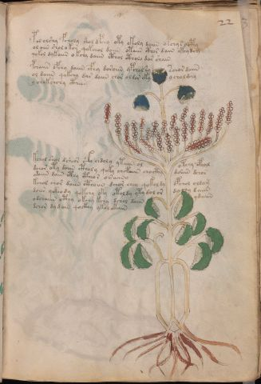

# Voynich Speculative Herbal Ferment Recipe — f22r

IMPORTANT: this is NOT a real or validated translation of the Voynich Manuscript. It is a speculative/procedural model that interprets EVA using a user-defined grammar to generate experimental recipes using safe, known edible substitutes.

This file is generated automatically from IVTFF/EVA transliteration plus a user-defined procedural grammar.

## Page / Folio
- currier: A
- folio: f22r
- page_number: 41
- plant_category_confidence: 0.0
- plant_category_guess: unknown
- section: herbal

## Plant Interpretation (Heuristic)
- category: unknown
- confidence: 0.0
- note: Heuristic classification based on the IVTFF 'Plant ID' string (not the drawing). Does not imply real identification of the manuscript plant.

## EVA Text (Transliteration)
pol olshy fcholy shol dpchy oty okoly daiin opchy s ocphy
ol oiin shol o kor qokchol daiin okaiin cthor dain ckhy dom
qokol dykaiin o kchy daiin cthol ctholo dar shain
pchaiin ofchy daiin cfhy doroiin ypchol sy schor daiin
ol daiin qokchy dar daiin chor oldor oky y choldchy
y chokshchy cth[eeb:een]
kchol shol dsheor c'@162;@136; chdoly ytaiin ol otchy cphal
dchor oty daiin ctholy qoky chotaiin chocthy do[@203;:l]iin dchor
odaiin dain cthy ctheo r o[r:in]aiino
kchol chor daiin cthoiin dchor chey qokol dy opchol oldam
do[iin:iir] yckhody qokchy oky otoldy yty dol or d[ch:a]chy daiin
odchaiin cthy okchy kchy dchol daiin ydaiin
dchor dy dain qockhy ykol okain

## Page Summary (Procedural, Aggregated)
- compound_counts: {'yeast fermentation': 47, 'mix/transfer': 73, 'secondary herb': 7, 'aroma modifier': 2, 'main herb': 35, 'heat': 7, 'sugars': 20, 'complex herbal compound': 16, 'liquid base': 7}
- dose_level: 2
- fermentation_estimate: 7–14 days

## Pantry (Max Needed For Any Single Line-Recipe)
- aroma_modifier: ['lemon peel (optional)']
- aroma_modifier_dose: ['2–5 g (or 1 strip of peel, avoiding the bitter pith)']
- main_plant_dry_g: 10
- main_plant_substitute: ['chamomile (safe default substitute)']
- safe_complex_herbal_blend: ['gentle spices (e.g., 1 g cinnamon + 1 g clove) or a commercial herbal tea blend']
- secondary_herb_dry_g: 5
- secondary_herb_substitute: ['mint']
- sugar_or_honey_g: 50
- water_l: 0.5
- yeast_g: 1

## Line Recipes (Each Line = One Recipe, 0.5L batch)

### f22r.1,@P0

EVA: pol olshy fcholy shol dpchy oty okoly daiin opchy s ocphy

## Ingredients
- aroma_modifier: lemon peel (optional)
- aroma_modifier_dose: 2–5 g (or 1 strip of peel, avoiding the bitter pith)
- main_plant_dry_g: 5
- main_plant_substitute: chamomile (safe default substitute)
- safe_complex_herbal_blend: gentle spices (e.g., 1 g cinnamon + 1 g clove) or a commercial herbal tea blend
- secondary_herb_dry_g: 2
- secondary_herb_substitute: mint
- sugar_or_honey_g: 25
- water_l: 0.5
- yeast_g: 1

Process:
1. Sanitize the jar/fermenter and utensils.
2. Base: combine 0.5 L water with 25 g sugar or honey.
3. Apply gentle heat: simmer 10–15 min, then cool to <30°C before adding yeast.
4. Add main plant: chamomile (safe default substitute) (~5 g dried).
5. Add secondary herb: mint (~2 g dried).
6. Add aroma modifier (optional) in a low dose.
7. If a complex herbal compound appears, use a safe commercial blend or gentle spices in micro-doses.
8. Pitch yeast: 1 g (ideally cider/beer yeast).
9. Ferment with an airlock: 7–14 days (guided by iin/aiin markers).
10. Strain/rack (if very solid-heavy) and cold-crash 24 h.
11. Bottle only when activity clearly slows; refrigerate. Avoid overpressure.

Expected Result: A mild, aromatic herbal ferment, low-to-medium intensity depending on dose level.

Does It Make Sense?: partial

Direct Gloss (Procedural, Not a Real Translation):
- pol: mix / transfer → start fermentation (yeast)
- olshy: add secondary herb (safe substitute) → mix / transfer
- fcholy: add main plant (safe substitute) → add aroma modifier → mix / transfer
- shol: add secondary herb (safe substitute) → mix / transfer
- dpchy: add main plant (safe substitute) → start fermentation (yeast)
- oty: apply heat/cooking → mix / transfer
- okoly: add fermentable sugars → mix / transfer
- daiin: start fermentation (yeast) → duration level 1 → state: fermentation start → long fermentation / aging phase
- opchy: add main plant (safe substitute) → mix / transfer → start fermentation (yeast)
- s: [unparsed]
- ocphy: mix / transfer → add complex herbal compound (safe blend)

### f22r.2,+P0

EVA: ol oiin shol o kor qokchol daiin okaiin cthor dain ckhy dom

## Ingredients
- main_plant_dry_g: 10
- main_plant_substitute: chamomile (safe default substitute)
- safe_complex_herbal_blend: gentle spices (e.g., 1 g cinnamon + 1 g clove) or a commercial herbal tea blend
- secondary_herb_dry_g: 5
- secondary_herb_substitute: mint
- sugar_or_honey_g: 50
- water_l: 0.5
- yeast_g: 1

Process:
1. Sanitize the jar/fermenter and utensils.
2. Base: combine 0.5 L water with 50 g sugar or honey.
3. Infusion: use hot (not boiling) water, then let it cool before adding yeast.
4. Add main plant: chamomile (safe default substitute) (~10 g dried).
5. Add secondary herb: mint (~5 g dried).
6. If a complex herbal compound appears, use a safe commercial blend or gentle spices in micro-doses.
7. Pitch yeast: 1 g (ideally cider/beer yeast).
8. Ferment with an airlock: 7–14 days (guided by iin/aiin markers).
9. Strain/rack (if very solid-heavy) and cold-crash 24 h.
10. Bottle only when activity clearly slows; refrigerate. Avoid overpressure.

Expected Result: A mild, aromatic herbal ferment, low-to-medium intensity depending on dose level.

Does It Make Sense?: partial

Direct Gloss (Procedural, Not a Real Translation):
- ol: mix / transfer
- oiin: mix / transfer → duration level 2 → state: cooling/rest → medium fermentation phase
- shol: add secondary herb (safe substitute) → mix / transfer
- o: mix / transfer
- kor: add fermentable sugars → mix / transfer
- qokchol: prepare liquid base → add fermentable sugars → add main plant (safe substitute) → mix / transfer
- daiin: start fermentation (yeast) → duration level 1 → state: fermentation start → long fermentation / aging phase
- okaiin: add fermentable sugars → mix / transfer → duration level 1 → state: fermentation start → long fermentation / aging phase
- cthor: mix / transfer → add complex herbal compound (safe blend)
- dain: start fermentation (yeast) → duration level 1 → state: fermentation start
- ckhy: add complex herbal compound (safe blend)
- dom: mix / transfer → start fermentation (yeast)

### f22r.3,+P0

EVA: qokol dykaiin o kchy daiin cthol ctholo dar shain

## Ingredients
- main_plant_dry_g: 5
- main_plant_substitute: chamomile (safe default substitute)
- safe_complex_herbal_blend: gentle spices (e.g., 1 g cinnamon + 1 g clove) or a commercial herbal tea blend
- secondary_herb_dry_g: 2
- secondary_herb_substitute: mint
- sugar_or_honey_g: 25
- water_l: 0.5
- yeast_g: 1

Process:
1. Sanitize the jar/fermenter and utensils.
2. Base: combine 0.5 L water with 25 g sugar or honey.
3. Infusion: use hot (not boiling) water, then let it cool before adding yeast.
4. Add main plant: chamomile (safe default substitute) (~5 g dried).
5. Add secondary herb: mint (~2 g dried).
6. If a complex herbal compound appears, use a safe commercial blend or gentle spices in micro-doses.
7. Pitch yeast: 1 g (ideally cider/beer yeast).
8. Ferment with an airlock: 7–14 days (guided by iin/aiin markers).
9. Strain/rack (if very solid-heavy) and cold-crash 24 h.
10. Bottle only when activity clearly slows; refrigerate. Avoid overpressure.

Expected Result: A mild, aromatic herbal ferment, low-to-medium intensity depending on dose level.

Does It Make Sense?: partial

Direct Gloss (Procedural, Not a Real Translation):
- qokol: prepare liquid base → add fermentable sugars → mix / transfer
- dykaiin: add fermentable sugars → start fermentation (yeast) → duration level 1 → state: fermentation start → long fermentation / aging phase
- o: mix / transfer
- kchy: add fermentable sugars → add main plant (safe substitute)
- daiin: start fermentation (yeast) → duration level 1 → state: fermentation start → long fermentation / aging phase
- cthol: mix / transfer → add complex herbal compound (safe blend)
- ctholo: mix / transfer → add complex herbal compound (safe blend)
- dar: start fermentation (yeast) → duration level 1 → state: fermentation start
- shain: add secondary herb (safe substitute) → duration level 1 → state: fermentation start

### f22r.4,+P0

EVA: pchaiin ofchy daiin cfhy doroiin ypchol sy schor daiin

## Ingredients
- aroma_modifier: lemon peel (optional)
- aroma_modifier_dose: 2–5 g (or 1 strip of peel, avoiding the bitter pith)
- main_plant_dry_g: 10
- main_plant_substitute: chamomile (safe default substitute)
- safe_complex_herbal_blend: gentle spices (e.g., 1 g cinnamon + 1 g clove) or a commercial herbal tea blend
- secondary_herb_dry_g: 2
- secondary_herb_substitute: mint
- sugar_or_honey_g: 25
- water_l: 0.5
- yeast_g: 1

Process:
1. Sanitize the jar/fermenter and utensils.
2. Base: combine 0.5 L water with 25 g sugar or honey.
3. Infusion: use hot (not boiling) water, then let it cool before adding yeast.
4. Add main plant: chamomile (safe default substitute) (~10 g dried).
5. Add secondary herb: mint (~2 g dried).
6. Add aroma modifier (optional) in a low dose.
7. If a complex herbal compound appears, use a safe commercial blend or gentle spices in micro-doses.
8. Pitch yeast: 1 g (ideally cider/beer yeast).
9. Ferment with an airlock: 7–14 days (guided by iin/aiin markers).
10. Strain/rack (if very solid-heavy) and cold-crash 24 h.
11. Bottle only when activity clearly slows; refrigerate. Avoid overpressure.

Expected Result: A mild, aromatic herbal ferment, low-to-medium intensity depending on dose level.

Does It Make Sense?: partial

Direct Gloss (Procedural, Not a Real Translation):
- pchaiin: add main plant (safe substitute) → start fermentation (yeast) → duration level 1 → state: fermentation start → long fermentation / aging phase
- ofchy: add main plant (safe substitute) → add aroma modifier → mix / transfer
- daiin: start fermentation (yeast) → duration level 1 → state: fermentation start → long fermentation / aging phase
- cfhy: add complex herbal compound (safe blend)
- doroiin: mix / transfer → start fermentation (yeast) → duration level 2 → state: cooling/rest → medium fermentation phase
- ypchol: add main plant (safe substitute) → mix / transfer → start fermentation (yeast)
- sy: [unparsed]
- schor: add main plant (safe substitute) → mix / transfer
- daiin: start fermentation (yeast) → duration level 1 → state: fermentation start → long fermentation / aging phase

### f22r.5,+P0

EVA: ol daiin qokchy dar daiin chor oldor oky y choldchy

## Ingredients
- main_plant_dry_g: 5
- main_plant_substitute: chamomile (safe default substitute)
- secondary_herb_dry_g: 1
- secondary_herb_substitute: mint
- sugar_or_honey_g: 25
- water_l: 0.5
- yeast_g: 1

Process:
1. Sanitize the jar/fermenter and utensils.
2. Base: combine 0.5 L water with 25 g sugar or honey.
3. Infusion: use hot (not boiling) water, then let it cool before adding yeast.
4. Add main plant: chamomile (safe default substitute) (~5 g dried).
5. Add secondary herb: mint (~1 g dried).
6. Pitch yeast: 1 g (ideally cider/beer yeast).
7. Ferment with an airlock: 7–14 days (guided by iin/aiin markers).
8. Strain/rack (if very solid-heavy) and cold-crash 24 h.
9. Bottle only when activity clearly slows; refrigerate. Avoid overpressure.

Expected Result: A mild, aromatic herbal ferment, low-to-medium intensity depending on dose level.

Does It Make Sense?: partial

Direct Gloss (Procedural, Not a Real Translation):
- ol: mix / transfer
- daiin: start fermentation (yeast) → duration level 1 → state: fermentation start → long fermentation / aging phase
- qokchy: prepare liquid base → add fermentable sugars → add main plant (safe substitute)
- dar: start fermentation (yeast) → duration level 1 → state: fermentation start
- daiin: start fermentation (yeast) → duration level 1 → state: fermentation start → long fermentation / aging phase
- chor: add main plant (safe substitute) → mix / transfer
- oldor: mix / transfer → start fermentation (yeast)
- oky: add fermentable sugars → mix / transfer
- y: [unparsed]
- choldchy: add main plant (safe substitute) → mix / transfer → start fermentation (yeast)

### f22r.6,+P0

EVA: y chokshchy cth[eeb:een]

## Ingredients
- main_plant_dry_g: 10
- main_plant_substitute: chamomile (safe default substitute)
- safe_complex_herbal_blend: gentle spices (e.g., 1 g cinnamon + 1 g clove) or a commercial herbal tea blend
- secondary_herb_dry_g: 5
- secondary_herb_substitute: mint
- sugar_or_honey_g: 50
- water_l: 0.5
- yeast_g: 1

Process:
1. Sanitize the jar/fermenter and utensils.
2. Base: combine 0.5 L water with 50 g sugar or honey.
3. Infusion: use hot (not boiling) water, then let it cool before adding yeast.
4. Add main plant: chamomile (safe default substitute) (~10 g dried).
5. Add secondary herb: mint (~5 g dried).
6. If a complex herbal compound appears, use a safe commercial blend or gentle spices in micro-doses.
7. Pitch yeast: 1 g (ideally cider/beer yeast).
8. Ferment with an airlock: 2–4 days (guided by iin/aiin markers).
9. Strain/rack (if very solid-heavy) and cold-crash 24 h.
10. Bottle only when activity clearly slows; refrigerate. Avoid overpressure.

Expected Result: A mild, aromatic herbal ferment, low-to-medium intensity depending on dose level.

Does It Make Sense?: partial

Direct Gloss (Procedural, Not a Real Translation):
- y: [unparsed]
- chokshchy: add fermentable sugars → add main plant (safe substitute) → add secondary herb (safe substitute) → mix / transfer
- cth: add complex herbal compound (safe blend)
- eeb: duration level 2 → state: active extraction
- een: duration level 2 → state: active extraction

### f22r.7,+P0

EVA: kchol shol dsheor c'@162;@136; chdoly ytaiin ol otchy cphal

## Ingredients
- main_plant_dry_g: 5
- main_plant_substitute: chamomile (safe default substitute)
- safe_complex_herbal_blend: gentle spices (e.g., 1 g cinnamon + 1 g clove) or a commercial herbal tea blend
- secondary_herb_dry_g: 2
- secondary_herb_substitute: mint
- sugar_or_honey_g: 25
- water_l: 0.5
- yeast_g: 1

Process:
1. Sanitize the jar/fermenter and utensils.
2. Base: combine 0.5 L water with 25 g sugar or honey.
3. Apply gentle heat: simmer 10–15 min, then cool to <30°C before adding yeast.
4. Add main plant: chamomile (safe default substitute) (~5 g dried).
5. Add secondary herb: mint (~2 g dried).
6. If a complex herbal compound appears, use a safe commercial blend or gentle spices in micro-doses.
7. Pitch yeast: 1 g (ideally cider/beer yeast).
8. Ferment with an airlock: 7–14 days (guided by iin/aiin markers).
9. Strain/rack (if very solid-heavy) and cold-crash 24 h.
10. Bottle only when activity clearly slows; refrigerate. Avoid overpressure.

Expected Result: A mild, aromatic herbal ferment, low-to-medium intensity depending on dose level.

Does It Make Sense?: partial

Direct Gloss (Procedural, Not a Real Translation):
- kchol: add fermentable sugars → add main plant (safe substitute) → mix / transfer
- shol: add secondary herb (safe substitute) → mix / transfer
- dsheor: add secondary herb (safe substitute) → mix / transfer → start fermentation (yeast) → duration level 1 → state: active extraction
- c: [unparsed]
- chdoly: add main plant (safe substitute) → mix / transfer → start fermentation (yeast)
- ytaiin: apply heat/cooking → duration level 1 → state: fermentation start → long fermentation / aging phase
- ol: mix / transfer
- otchy: apply heat/cooking → add main plant (safe substitute) → mix / transfer
- cphal: add complex herbal compound (safe blend) → duration level 1 → state: fermentation start

### f22r.8,+P0

EVA: dchor oty daiin ctholy qoky chotaiin chocthy do[@203;:l]iin dchor

## Ingredients
- main_plant_dry_g: 10
- main_plant_substitute: chamomile (safe default substitute)
- safe_complex_herbal_blend: gentle spices (e.g., 1 g cinnamon + 1 g clove) or a commercial herbal tea blend
- secondary_herb_dry_g: 2
- secondary_herb_substitute: mint
- sugar_or_honey_g: 50
- water_l: 0.5
- yeast_g: 1

Process:
1. Sanitize the jar/fermenter and utensils.
2. Base: combine 0.5 L water with 50 g sugar or honey.
3. Apply gentle heat: simmer 10–15 min, then cool to <30°C before adding yeast.
4. Add main plant: chamomile (safe default substitute) (~10 g dried).
5. Add secondary herb: mint (~2 g dried).
6. If a complex herbal compound appears, use a safe commercial blend or gentle spices in micro-doses.
7. Pitch yeast: 1 g (ideally cider/beer yeast).
8. Ferment with an airlock: 7–14 days (guided by iin/aiin markers).
9. Strain/rack (if very solid-heavy) and cold-crash 24 h.
10. Bottle only when activity clearly slows; refrigerate. Avoid overpressure.

Expected Result: A mild, aromatic herbal ferment, low-to-medium intensity depending on dose level.

Does It Make Sense?: partial

Direct Gloss (Procedural, Not a Real Translation):
- dchor: add main plant (safe substitute) → mix / transfer → start fermentation (yeast)
- oty: apply heat/cooking → mix / transfer
- daiin: start fermentation (yeast) → duration level 1 → state: fermentation start → long fermentation / aging phase
- ctholy: mix / transfer → add complex herbal compound (safe blend)
- qoky: prepare liquid base → add fermentable sugars
- chotaiin: apply heat/cooking → add main plant (safe substitute) → mix / transfer → duration level 1 → state: fermentation start → long fermentation / aging phase
- chocthy: add main plant (safe substitute) → mix / transfer → add complex herbal compound (safe blend)
- do: mix / transfer → start fermentation (yeast)
- l: [unparsed]
- iin: duration level 2 → state: cooling/rest → medium fermentation phase
- dchor: add main plant (safe substitute) → mix / transfer → start fermentation (yeast)

### f22r.9,+P0

EVA: odaiin dain cthy ctheo r o[r:in]aiino

## Ingredients
- main_plant_dry_g: 2
- main_plant_substitute: chamomile (safe default substitute)
- safe_complex_herbal_blend: gentle spices (e.g., 1 g cinnamon + 1 g clove) or a commercial herbal tea blend
- secondary_herb_dry_g: 1
- secondary_herb_substitute: mint
- sugar_or_honey_g: 12
- water_l: 0.5
- yeast_g: 1

Process:
1. Sanitize the jar/fermenter and utensils.
2. Base: combine 0.5 L water with 12 g sugar or honey.
3. Infusion: use hot (not boiling) water, then let it cool before adding yeast.
4. Add main plant: chamomile (safe default substitute) (~2 g dried).
5. Add secondary herb: mint (~1 g dried).
6. If a complex herbal compound appears, use a safe commercial blend or gentle spices in micro-doses.
7. Pitch yeast: 1 g (ideally cider/beer yeast).
8. Ferment with an airlock: 7–14 days (guided by iin/aiin markers).
9. Strain/rack (if very solid-heavy) and cold-crash 24 h.
10. Bottle only when activity clearly slows; refrigerate. Avoid overpressure.

Expected Result: A mild, aromatic herbal ferment, low-to-medium intensity depending on dose level.

Does It Make Sense?: partial

Direct Gloss (Procedural, Not a Real Translation):
- odaiin: mix / transfer → start fermentation (yeast) → duration level 1 → state: fermentation start → long fermentation / aging phase
- dain: start fermentation (yeast) → duration level 1 → state: fermentation start
- cthy: add complex herbal compound (safe blend)
- ctheo: mix / transfer → add complex herbal compound (safe blend) → duration level 1 → state: active extraction
- r: [unparsed]
- o: mix / transfer
- r: [unparsed]
- in: duration level 1 → state: cooling/rest
- aiino: mix / transfer → duration level 1 → state: fermentation start → long fermentation / aging phase

### f22r.10,+P0

EVA: kchol chor daiin cthoiin dchor chey qokol dy opchol oldam

## Ingredients
- main_plant_dry_g: 10
- main_plant_substitute: chamomile (safe default substitute)
- safe_complex_herbal_blend: gentle spices (e.g., 1 g cinnamon + 1 g clove) or a commercial herbal tea blend
- secondary_herb_dry_g: 2
- secondary_herb_substitute: mint
- sugar_or_honey_g: 50
- water_l: 0.5
- yeast_g: 1

Process:
1. Sanitize the jar/fermenter and utensils.
2. Base: combine 0.5 L water with 50 g sugar or honey.
3. Infusion: use hot (not boiling) water, then let it cool before adding yeast.
4. Add main plant: chamomile (safe default substitute) (~10 g dried).
5. Add secondary herb: mint (~2 g dried).
6. If a complex herbal compound appears, use a safe commercial blend or gentle spices in micro-doses.
7. Pitch yeast: 1 g (ideally cider/beer yeast).
8. Ferment with an airlock: 7–14 days (guided by iin/aiin markers).
9. Strain/rack (if very solid-heavy) and cold-crash 24 h.
10. Bottle only when activity clearly slows; refrigerate. Avoid overpressure.

Expected Result: A mild, aromatic herbal ferment, low-to-medium intensity depending on dose level.

Does It Make Sense?: partial

Direct Gloss (Procedural, Not a Real Translation):
- kchol: add fermentable sugars → add main plant (safe substitute) → mix / transfer
- chor: add main plant (safe substitute) → mix / transfer
- daiin: start fermentation (yeast) → duration level 1 → state: fermentation start → long fermentation / aging phase
- cthoiin: mix / transfer → add complex herbal compound (safe blend) → duration level 2 → state: cooling/rest → medium fermentation phase
- dchor: add main plant (safe substitute) → mix / transfer → start fermentation (yeast)
- chey: add main plant (safe substitute) → duration level 1 → state: active extraction
- qokol: prepare liquid base → add fermentable sugars → mix / transfer
- dy: start fermentation (yeast)
- opchol: add main plant (safe substitute) → mix / transfer → start fermentation (yeast)
- oldam: mix / transfer → start fermentation (yeast) → duration level 1 → state: fermentation start

### f22r.11,+P0

EVA: do[iin:iir] yckhody qokchy oky otoldy yty dol or d[ch:a]chy daiin

## Ingredients
- main_plant_dry_g: 10
- main_plant_substitute: chamomile (safe default substitute)
- safe_complex_herbal_blend: gentle spices (e.g., 1 g cinnamon + 1 g clove) or a commercial herbal tea blend
- secondary_herb_dry_g: 2
- secondary_herb_substitute: mint
- sugar_or_honey_g: 50
- water_l: 0.5
- yeast_g: 1

Process:
1. Sanitize the jar/fermenter and utensils.
2. Base: combine 0.5 L water with 50 g sugar or honey.
3. Apply gentle heat: simmer 10–15 min, then cool to <30°C before adding yeast.
4. Add main plant: chamomile (safe default substitute) (~10 g dried).
5. Add secondary herb: mint (~2 g dried).
6. If a complex herbal compound appears, use a safe commercial blend or gentle spices in micro-doses.
7. Pitch yeast: 1 g (ideally cider/beer yeast).
8. Ferment with an airlock: 7–14 days (guided by iin/aiin markers).
9. Strain/rack (if very solid-heavy) and cold-crash 24 h.
10. Bottle only when activity clearly slows; refrigerate. Avoid overpressure.

Expected Result: A mild, aromatic herbal ferment, low-to-medium intensity depending on dose level.

Does It Make Sense?: partial

Direct Gloss (Procedural, Not a Real Translation):
- do: mix / transfer → start fermentation (yeast)
- iin: duration level 2 → state: cooling/rest → medium fermentation phase
- iir: duration level 2 → state: cooling/rest
- yckhody: mix / transfer → start fermentation (yeast) → add complex herbal compound (safe blend)
- qokchy: prepare liquid base → add fermentable sugars → add main plant (safe substitute)
- oky: add fermentable sugars → mix / transfer
- otoldy: apply heat/cooking → mix / transfer → start fermentation (yeast)
- yty: apply heat/cooking
- dol: mix / transfer → start fermentation (yeast)
- or: mix / transfer
- d: start fermentation (yeast)
- ch: add main plant (safe substitute)
- a: duration level 1 → state: fermentation start
- chy: add main plant (safe substitute)
- daiin: start fermentation (yeast) → duration level 1 → state: fermentation start → long fermentation / aging phase

### f22r.12,+P0

EVA: odchaiin cthy okchy kchy dchol daiin ydaiin

## Ingredients
- main_plant_dry_g: 5
- main_plant_substitute: chamomile (safe default substitute)
- safe_complex_herbal_blend: gentle spices (e.g., 1 g cinnamon + 1 g clove) or a commercial herbal tea blend
- secondary_herb_dry_g: 1
- secondary_herb_substitute: mint
- sugar_or_honey_g: 25
- water_l: 0.5
- yeast_g: 1

Process:
1. Sanitize the jar/fermenter and utensils.
2. Base: combine 0.5 L water with 25 g sugar or honey.
3. Infusion: use hot (not boiling) water, then let it cool before adding yeast.
4. Add main plant: chamomile (safe default substitute) (~5 g dried).
5. Add secondary herb: mint (~1 g dried).
6. If a complex herbal compound appears, use a safe commercial blend or gentle spices in micro-doses.
7. Pitch yeast: 1 g (ideally cider/beer yeast).
8. Ferment with an airlock: 7–14 days (guided by iin/aiin markers).
9. Strain/rack (if very solid-heavy) and cold-crash 24 h.
10. Bottle only when activity clearly slows; refrigerate. Avoid overpressure.

Expected Result: A mild, aromatic herbal ferment, low-to-medium intensity depending on dose level.

Does It Make Sense?: partial

Direct Gloss (Procedural, Not a Real Translation):
- odchaiin: add main plant (safe substitute) → mix / transfer → start fermentation (yeast) → duration level 1 → state: fermentation start → long fermentation / aging phase
- cthy: add complex herbal compound (safe blend)
- okchy: add fermentable sugars → add main plant (safe substitute) → mix / transfer
- kchy: add fermentable sugars → add main plant (safe substitute)
- dchol: add main plant (safe substitute) → mix / transfer → start fermentation (yeast)
- daiin: start fermentation (yeast) → duration level 1 → state: fermentation start → long fermentation / aging phase
- ydaiin: start fermentation (yeast) → duration level 1 → state: fermentation start → long fermentation / aging phase

### f22r.13,+P0

EVA: dchor dy dain qockhy ykol okain

## Ingredients
- main_plant_dry_g: 5
- main_plant_substitute: chamomile (safe default substitute)
- safe_complex_herbal_blend: gentle spices (e.g., 1 g cinnamon + 1 g clove) or a commercial herbal tea blend
- secondary_herb_dry_g: 1
- secondary_herb_substitute: mint
- sugar_or_honey_g: 25
- water_l: 0.5
- yeast_g: 1

Process:
1. Sanitize the jar/fermenter and utensils.
2. Base: combine 0.5 L water with 25 g sugar or honey.
3. Infusion: use hot (not boiling) water, then let it cool before adding yeast.
4. Add main plant: chamomile (safe default substitute) (~5 g dried).
5. Add secondary herb: mint (~1 g dried).
6. If a complex herbal compound appears, use a safe commercial blend or gentle spices in micro-doses.
7. Pitch yeast: 1 g (ideally cider/beer yeast).
8. Ferment with an airlock: 2–4 days (guided by iin/aiin markers).
9. Strain/rack (if very solid-heavy) and cold-crash 24 h.
10. Bottle only when activity clearly slows; refrigerate. Avoid overpressure.

Expected Result: A mild, aromatic herbal ferment, low-to-medium intensity depending on dose level.

Does It Make Sense?: partial

Direct Gloss (Procedural, Not a Real Translation):
- dchor: add main plant (safe substitute) → mix / transfer → start fermentation (yeast)
- dy: start fermentation (yeast)
- dain: start fermentation (yeast) → duration level 1 → state: fermentation start
- qockhy: prepare liquid base → add complex herbal compound (safe blend)
- ykol: add fermentable sugars → mix / transfer
- okain: add fermentable sugars → mix / transfer → duration level 1 → state: fermentation start

## Risks & Warnings (Applies To All Line-Recipes)
- Never use unidentified Voynich plants directly; only use known edible substitutes.
- Do not consume if you see mold, smell rot, notice abnormal sliminess, or taste something clearly foul.
- Overpressure/bottle-bomb risk: do not bottle before stable; prefer an airlock and refrigeration.
- Avoid if pregnant/breastfeeding, for minors, or with medical conditions; consult a professional.
- No medical claims: this is an experimental beverage.

## Recommended Adjustments (General)
- If too bitter (leafy profile), halve the herbs or shorten steep/maceration time.
- If too sweet, extend fermentation or reduce sugar by 25–50%.
- For a non-alcoholic version, omit yeast and keep refrigerated as an infusion (not fermented).
