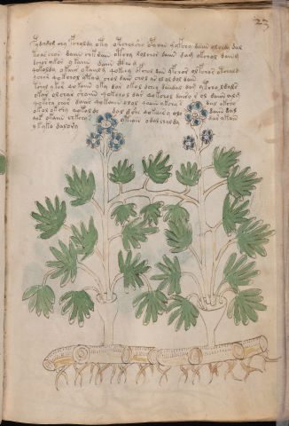

# Voynich Speculative Herbal Ferment Recipe — f23r

IMPORTANT: this is NOT a real or validated translation of the Voynich Manuscript. It is a speculative/procedural model that interprets EVA using a user-defined grammar to generate experimental recipes using safe, known edible substitutes.

This file is generated automatically from IVTFF/EVA transliteration plus a user-defined procedural grammar.

## Page / Folio
- currier: A
- folio: f23r
- page_number: 43
- plant_category_confidence: 0.0
- plant_category_guess: unknown
- section: herbal

## Plant Interpretation (Heuristic)
- category: unknown
- confidence: 0.0
- note: Heuristic classification based on the IVTFF 'Plant ID' string (not the drawing). Does not imply real identification of the manuscript plant.

## EVA Text (Transliteration)
pydchdom chy fcholdy oty otchol shy opyaiin y' yfchy daiin ololdy dal
to ar chor daiin chk dain otchy lolchor daiin dam okchol dain g
dchar ykor y kaiin daiin cth[?:o] g
qokoldy okaiir ykaiil g qokeey ofchol dain yfchor olfchor otchald
ychor qokchol ytym chol da[ir:in] chol ar ol ol dol dain
tshol y kor qokaiin yky dar okol dchey daiidal dam ytcho ldals
okar olchar shaiin qokchol dar qokchol dairo r ol daiin alg
qokshy char daiir qokaiin olol qoaiin ykchy s dal okchy
okol ok shy qokol dy dal [d:j]she qokeees y oly daiin dal
q[o:y]k okaiin chkchy s yteain odal chal dy dar ykain
ykyk[a:o] dalory

## Page Summary (Procedural, Aggregated)
- compound_counts: {'yeast fermentation': 41, 'main herb': 30, 'mix/transfer': 56, 'aroma modifier': 5, 'heat': 9, 'secondary herb': 6, 'sugars': 30, 'complex herbal compound': 1, 'liquid base': 11, 'general base': 1}
- dose_level: 3
- fermentation_estimate: 7–14 days

## Pantry (Max Needed For Any Single Line-Recipe)
- aroma_modifier: ['lemon peel (optional)']
- aroma_modifier_dose: ['2–5 g (or 1 strip of peel, avoiding the bitter pith)']
- main_plant_dry_g: 10
- main_plant_substitute: ['chamomile (safe default substitute)']
- safe_complex_herbal_blend: ['gentle spices (e.g., 1 g cinnamon + 1 g clove) or a commercial herbal tea blend']
- secondary_herb_dry_g: 7
- secondary_herb_substitute: ['mint']
- sugar_or_honey_g: 75
- water_l: 0.5
- yeast_g: 1

## Line Recipes (Each Line = One Recipe, 0.5L batch)

### f23r.1,@P0

EVA: pydchdom chy fcholdy oty otchol shy opyaiin y' yfchy daiin ololdy dal

## Ingredients
- aroma_modifier: lemon peel (optional)
- aroma_modifier_dose: 2–5 g (or 1 strip of peel, avoiding the bitter pith)
- main_plant_dry_g: 5
- main_plant_substitute: chamomile (safe default substitute)
- secondary_herb_dry_g: 2
- secondary_herb_substitute: mint
- sugar_or_honey_g: 12
- water_l: 0.5
- yeast_g: 1

Process:
1. Sanitize the jar/fermenter and utensils.
2. Base: combine 0.5 L water with 12 g sugar or honey.
3. Apply gentle heat: simmer 10–15 min, then cool to <30°C before adding yeast.
4. Add main plant: chamomile (safe default substitute) (~5 g dried).
5. Add secondary herb: mint (~2 g dried).
6. Add aroma modifier (optional) in a low dose.
7. Pitch yeast: 1 g (ideally cider/beer yeast).
8. Ferment with an airlock: 7–14 days (guided by iin/aiin markers).
9. Strain/rack (if very solid-heavy) and cold-crash 24 h.
10. Bottle only when activity clearly slows; refrigerate. Avoid overpressure.

Expected Result: A mild, aromatic herbal ferment, low-to-medium intensity depending on dose level.

Does It Make Sense?: partial

Direct Gloss (Procedural, Not a Real Translation):
- pydchdom: add main plant (safe substitute) → mix / transfer → start fermentation (yeast)
- chy: add main plant (safe substitute)
- fcholdy: add main plant (safe substitute) → add aroma modifier → mix / transfer → start fermentation (yeast)
- oty: apply heat/cooking → mix / transfer
- otchol: apply heat/cooking → add main plant (safe substitute) → mix / transfer
- shy: add secondary herb (safe substitute)
- opyaiin: mix / transfer → start fermentation (yeast) → duration level 1 → state: fermentation start → long fermentation / aging phase
- y: [unparsed]
- yfchy: add main plant (safe substitute) → add aroma modifier
- daiin: start fermentation (yeast) → duration level 1 → state: fermentation start → long fermentation / aging phase
- ololdy: mix / transfer → start fermentation (yeast)
- dal: start fermentation (yeast) → duration level 1 → state: fermentation start

### f23r.2,+P0

EVA: to ar chor daiin chk dain otchy lolchor daiin dam okchol dain g

## Ingredients
- main_plant_dry_g: 5
- main_plant_substitute: chamomile (safe default substitute)
- secondary_herb_dry_g: 1
- secondary_herb_substitute: mint
- sugar_or_honey_g: 25
- water_l: 0.5
- yeast_g: 1

Process:
1. Sanitize the jar/fermenter and utensils.
2. Base: combine 0.5 L water with 25 g sugar or honey.
3. Apply gentle heat: simmer 10–15 min, then cool to <30°C before adding yeast.
4. Add main plant: chamomile (safe default substitute) (~5 g dried).
5. Add secondary herb: mint (~1 g dried).
6. Pitch yeast: 1 g (ideally cider/beer yeast).
7. Ferment with an airlock: 7–14 days (guided by iin/aiin markers).
8. Strain/rack (if very solid-heavy) and cold-crash 24 h.
9. Bottle only when activity clearly slows; refrigerate. Avoid overpressure.

Expected Result: A mild, aromatic herbal ferment, low-to-medium intensity depending on dose level.

Does It Make Sense?: partial

Direct Gloss (Procedural, Not a Real Translation):
- to: apply heat/cooking → mix / transfer
- ar: duration level 1 → state: fermentation start
- chor: add main plant (safe substitute) → mix / transfer
- daiin: start fermentation (yeast) → duration level 1 → state: fermentation start → long fermentation / aging phase
- chk: add fermentable sugars → add main plant (safe substitute)
- dain: start fermentation (yeast) → duration level 1 → state: fermentation start
- otchy: apply heat/cooking → add main plant (safe substitute) → mix / transfer
- lolchor: add main plant (safe substitute) → mix / transfer
- daiin: start fermentation (yeast) → duration level 1 → state: fermentation start → long fermentation / aging phase
- dam: start fermentation (yeast) → duration level 1 → state: fermentation start
- okchol: add fermentable sugars → add main plant (safe substitute) → mix / transfer
- dain: start fermentation (yeast) → duration level 1 → state: fermentation start
- g: [unparsed]

### f23r.3,+P0

EVA: dchar ykor y kaiin daiin cth[?:o] g

## Ingredients
- main_plant_dry_g: 5
- main_plant_substitute: chamomile (safe default substitute)
- safe_complex_herbal_blend: gentle spices (e.g., 1 g cinnamon + 1 g clove) or a commercial herbal tea blend
- secondary_herb_dry_g: 1
- secondary_herb_substitute: mint
- sugar_or_honey_g: 25
- water_l: 0.5
- yeast_g: 1

Process:
1. Sanitize the jar/fermenter and utensils.
2. Base: combine 0.5 L water with 25 g sugar or honey.
3. Infusion: use hot (not boiling) water, then let it cool before adding yeast.
4. Add main plant: chamomile (safe default substitute) (~5 g dried).
5. Add secondary herb: mint (~1 g dried).
6. If a complex herbal compound appears, use a safe commercial blend or gentle spices in micro-doses.
7. Pitch yeast: 1 g (ideally cider/beer yeast).
8. Ferment with an airlock: 7–14 days (guided by iin/aiin markers).
9. Strain/rack (if very solid-heavy) and cold-crash 24 h.
10. Bottle only when activity clearly slows; refrigerate. Avoid overpressure.

Expected Result: A mild, aromatic herbal ferment, low-to-medium intensity depending on dose level.

Does It Make Sense?: partial

Direct Gloss (Procedural, Not a Real Translation):
- dchar: add main plant (safe substitute) → start fermentation (yeast) → duration level 1 → state: fermentation start
- ykor: add fermentable sugars → mix / transfer
- y: [unparsed]
- kaiin: add fermentable sugars → duration level 1 → state: fermentation start → long fermentation / aging phase
- daiin: start fermentation (yeast) → duration level 1 → state: fermentation start → long fermentation / aging phase
- cth: add complex herbal compound (safe blend)
- o: mix / transfer
- g: [unparsed]

### f23r.4,+P0

EVA: qokoldy okaiir ykaiil g qokeey ofchol dain yfchor olfchor otchald

## Ingredients
- aroma_modifier: lemon peel (optional)
- aroma_modifier_dose: 2–5 g (or 1 strip of peel, avoiding the bitter pith)
- main_plant_dry_g: 10
- main_plant_substitute: chamomile (safe default substitute)
- secondary_herb_dry_g: 2
- secondary_herb_substitute: mint
- sugar_or_honey_g: 50
- water_l: 0.5
- yeast_g: 1

Process:
1. Sanitize the jar/fermenter and utensils.
2. Base: combine 0.5 L water with 50 g sugar or honey.
3. Apply gentle heat: simmer 10–15 min, then cool to <30°C before adding yeast.
4. Add main plant: chamomile (safe default substitute) (~10 g dried).
5. Add secondary herb: mint (~2 g dried).
6. Add aroma modifier (optional) in a low dose.
7. Pitch yeast: 1 g (ideally cider/beer yeast).
8. Ferment with an airlock: 2–4 days (guided by iin/aiin markers).
9. Strain/rack (if very solid-heavy) and cold-crash 24 h.
10. Bottle only when activity clearly slows; refrigerate. Avoid overpressure.

Expected Result: A mild, aromatic herbal ferment, low-to-medium intensity depending on dose level.

Does It Make Sense?: partial

Direct Gloss (Procedural, Not a Real Translation):
- qokoldy: prepare liquid base → add fermentable sugars → mix / transfer → start fermentation (yeast)
- okaiir: add fermentable sugars → mix / transfer → duration level 1 → state: fermentation start
- ykaiil: add fermentable sugars → duration level 1 → state: fermentation start
- g: [unparsed]
- qokeey: prepare liquid base → add fermentable sugars → duration level 2 → state: active extraction
- ofchol: add main plant (safe substitute) → add aroma modifier → mix / transfer
- dain: start fermentation (yeast) → duration level 1 → state: fermentation start
- yfchor: add main plant (safe substitute) → add aroma modifier → mix / transfer
- olfchor: add main plant (safe substitute) → add aroma modifier → mix / transfer
- otchald: apply heat/cooking → add main plant (safe substitute) → mix / transfer → start fermentation (yeast) → duration level 1 → state: fermentation start

### f23r.5,+P0

EVA: ychor qokchol ytym chol da[ir:in] chol ar ol ol dol dain

## Ingredients
- main_plant_dry_g: 5
- main_plant_substitute: chamomile (safe default substitute)
- secondary_herb_dry_g: 1
- secondary_herb_substitute: mint
- sugar_or_honey_g: 25
- water_l: 0.5
- yeast_g: 1

Process:
1. Sanitize the jar/fermenter and utensils.
2. Base: combine 0.5 L water with 25 g sugar or honey.
3. Apply gentle heat: simmer 10–15 min, then cool to <30°C before adding yeast.
4. Add main plant: chamomile (safe default substitute) (~5 g dried).
5. Add secondary herb: mint (~1 g dried).
6. Pitch yeast: 1 g (ideally cider/beer yeast).
7. Ferment with an airlock: 2–4 days (guided by iin/aiin markers).
8. Strain/rack (if very solid-heavy) and cold-crash 24 h.
9. Bottle only when activity clearly slows; refrigerate. Avoid overpressure.

Expected Result: A mild, aromatic herbal ferment, low-to-medium intensity depending on dose level.

Does It Make Sense?: partial

Direct Gloss (Procedural, Not a Real Translation):
- ychor: add main plant (safe substitute) → mix / transfer
- qokchol: prepare liquid base → add fermentable sugars → add main plant (safe substitute) → mix / transfer
- ytym: apply heat/cooking
- chol: add main plant (safe substitute) → mix / transfer
- da: start fermentation (yeast) → duration level 1 → state: fermentation start
- ir: duration level 1 → state: cooling/rest
- in: duration level 1 → state: cooling/rest
- chol: add main plant (safe substitute) → mix / transfer
- ar: duration level 1 → state: fermentation start
- ol: mix / transfer
- ol: mix / transfer
- dol: mix / transfer → start fermentation (yeast)
- dain: start fermentation (yeast) → duration level 1 → state: fermentation start

### f23r.6,+P0

EVA: tshol y kor qokaiin yky dar okol dchey daiidal dam ytcho ldals

## Ingredients
- main_plant_dry_g: 5
- main_plant_substitute: chamomile (safe default substitute)
- secondary_herb_dry_g: 2
- secondary_herb_substitute: mint
- sugar_or_honey_g: 25
- water_l: 0.5
- yeast_g: 1

Process:
1. Sanitize the jar/fermenter and utensils.
2. Base: combine 0.5 L water with 25 g sugar or honey.
3. Apply gentle heat: simmer 10–15 min, then cool to <30°C before adding yeast.
4. Add main plant: chamomile (safe default substitute) (~5 g dried).
5. Add secondary herb: mint (~2 g dried).
6. Pitch yeast: 1 g (ideally cider/beer yeast).
7. Ferment with an airlock: 7–14 days (guided by iin/aiin markers).
8. Strain/rack (if very solid-heavy) and cold-crash 24 h.
9. Bottle only when activity clearly slows; refrigerate. Avoid overpressure.

Expected Result: A mild, aromatic herbal ferment, low-to-medium intensity depending on dose level.

Does It Make Sense?: partial

Direct Gloss (Procedural, Not a Real Translation):
- tshol: apply heat/cooking → add secondary herb (safe substitute) → mix / transfer
- y: [unparsed]
- kor: add fermentable sugars → mix / transfer
- qokaiin: prepare liquid base → add fermentable sugars → duration level 1 → state: fermentation start → long fermentation / aging phase
- yky: add fermentable sugars
- dar: start fermentation (yeast) → duration level 1 → state: fermentation start
- okol: add fermentable sugars → mix / transfer
- dchey: add main plant (safe substitute) → start fermentation (yeast) → duration level 1 → state: active extraction
- daiidal: start fermentation (yeast) → duration level 1 → state: fermentation start
- dam: start fermentation (yeast) → duration level 1 → state: fermentation start
- ytcho: apply heat/cooking → add main plant (safe substitute) → mix / transfer
- ldals: start fermentation (yeast) → duration level 1 → state: fermentation start

### f23r.7,+P0

EVA: okar olchar shaiin qokchol dar qokchol dairo r ol daiin alg

## Ingredients
- main_plant_dry_g: 5
- main_plant_substitute: chamomile (safe default substitute)
- secondary_herb_dry_g: 2
- secondary_herb_substitute: mint
- sugar_or_honey_g: 25
- water_l: 0.5
- yeast_g: 1

Process:
1. Sanitize the jar/fermenter and utensils.
2. Base: combine 0.5 L water with 25 g sugar or honey.
3. Infusion: use hot (not boiling) water, then let it cool before adding yeast.
4. Add main plant: chamomile (safe default substitute) (~5 g dried).
5. Add secondary herb: mint (~2 g dried).
6. Pitch yeast: 1 g (ideally cider/beer yeast).
7. Ferment with an airlock: 7–14 days (guided by iin/aiin markers).
8. Strain/rack (if very solid-heavy) and cold-crash 24 h.
9. Bottle only when activity clearly slows; refrigerate. Avoid overpressure.

Expected Result: A mild, aromatic herbal ferment, low-to-medium intensity depending on dose level.

Does It Make Sense?: partial

Direct Gloss (Procedural, Not a Real Translation):
- okar: add fermentable sugars → mix / transfer → duration level 1 → state: fermentation start
- olchar: add main plant (safe substitute) → mix / transfer → duration level 1 → state: fermentation start
- shaiin: add secondary herb (safe substitute) → duration level 1 → state: fermentation start → long fermentation / aging phase
- qokchol: prepare liquid base → add fermentable sugars → add main plant (safe substitute) → mix / transfer
- dar: start fermentation (yeast) → duration level 1 → state: fermentation start
- qokchol: prepare liquid base → add fermentable sugars → add main plant (safe substitute) → mix / transfer
- dairo: mix / transfer → start fermentation (yeast) → duration level 1 → state: fermentation start
- r: [unparsed]
- ol: mix / transfer
- daiin: start fermentation (yeast) → duration level 1 → state: fermentation start → long fermentation / aging phase
- alg: duration level 1 → state: fermentation start

### f23r.8,+P0

EVA: qokshy char daiir qokaiin olol qoaiin ykchy s dal okchy

## Ingredients
- main_plant_dry_g: 5
- main_plant_substitute: chamomile (safe default substitute)
- secondary_herb_dry_g: 2
- secondary_herb_substitute: mint
- sugar_or_honey_g: 25
- water_l: 0.5
- yeast_g: 1

Process:
1. Sanitize the jar/fermenter and utensils.
2. Base: combine 0.5 L water with 25 g sugar or honey.
3. Infusion: use hot (not boiling) water, then let it cool before adding yeast.
4. Add main plant: chamomile (safe default substitute) (~5 g dried).
5. Add secondary herb: mint (~2 g dried).
6. Pitch yeast: 1 g (ideally cider/beer yeast).
7. Ferment with an airlock: 7–14 days (guided by iin/aiin markers).
8. Strain/rack (if very solid-heavy) and cold-crash 24 h.
9. Bottle only when activity clearly slows; refrigerate. Avoid overpressure.

Expected Result: A mild, aromatic herbal ferment, low-to-medium intensity depending on dose level.

Does It Make Sense?: partial

Direct Gloss (Procedural, Not a Real Translation):
- qokshy: prepare liquid base → add fermentable sugars → add secondary herb (safe substitute)
- char: add main plant (safe substitute) → duration level 1 → state: fermentation start
- daiir: start fermentation (yeast) → duration level 1 → state: fermentation start
- qokaiin: prepare liquid base → add fermentable sugars → duration level 1 → state: fermentation start → long fermentation / aging phase
- olol: mix / transfer
- qoaiin: prepare liquid base → duration level 1 → state: fermentation start → long fermentation / aging phase
- ykchy: add fermentable sugars → add main plant (safe substitute)
- s: [unparsed]
- dal: start fermentation (yeast) → duration level 1 → state: fermentation start
- okchy: add fermentable sugars → add main plant (safe substitute) → mix / transfer

### f23r.9,+P0

EVA: okol ok shy qokol dy dal [d:j]she qokeees y oly daiin dal

## Ingredients
- main_plant_dry_g: 7
- main_plant_substitute: chamomile (safe default substitute)
- secondary_herb_dry_g: 7
- secondary_herb_substitute: mint
- sugar_or_honey_g: 75
- water_l: 0.5
- yeast_g: 1

Process:
1. Sanitize the jar/fermenter and utensils.
2. Base: combine 0.5 L water with 75 g sugar or honey.
3. Infusion: use hot (not boiling) water, then let it cool before adding yeast.
4. Add main plant: chamomile (safe default substitute) (~7 g dried).
5. Add secondary herb: mint (~7 g dried).
6. Pitch yeast: 1 g (ideally cider/beer yeast).
7. Ferment with an airlock: 7–14 days (guided by iin/aiin markers).
8. Strain/rack (if very solid-heavy) and cold-crash 24 h.
9. Bottle only when activity clearly slows; refrigerate. Avoid overpressure.

Expected Result: A mild, aromatic herbal ferment, low-to-medium intensity depending on dose level.

Does It Make Sense?: partial

Direct Gloss (Procedural, Not a Real Translation):
- okol: add fermentable sugars → mix / transfer
- ok: add fermentable sugars → mix / transfer
- shy: add secondary herb (safe substitute)
- qokol: prepare liquid base → add fermentable sugars → mix / transfer
- dy: start fermentation (yeast)
- dal: start fermentation (yeast) → duration level 1 → state: fermentation start
- d: start fermentation (yeast)
- j: [unparsed]
- she: add secondary herb (safe substitute) → duration level 1 → state: active extraction
- qokeees: prepare liquid base → add fermentable sugars → duration level 3 → state: active extraction
- y: [unparsed]
- oly: mix / transfer
- daiin: start fermentation (yeast) → duration level 1 → state: fermentation start → long fermentation / aging phase
- dal: start fermentation (yeast) → duration level 1 → state: fermentation start

### f23r.10,+P0

EVA: q[o:y]k okaiin chkchy s yteain odal chal dy dar ykain

## Ingredients
- main_plant_dry_g: 5
- main_plant_substitute: chamomile (safe default substitute)
- secondary_herb_dry_g: 1
- secondary_herb_substitute: mint
- sugar_or_honey_g: 25
- water_l: 0.5
- yeast_g: 1

Process:
1. Sanitize the jar/fermenter and utensils.
2. Base: combine 0.5 L water with 25 g sugar or honey.
3. Apply gentle heat: simmer 10–15 min, then cool to <30°C before adding yeast.
4. Add main plant: chamomile (safe default substitute) (~5 g dried).
5. Add secondary herb: mint (~1 g dried).
6. Pitch yeast: 1 g (ideally cider/beer yeast).
7. Ferment with an airlock: 7–14 days (guided by iin/aiin markers).
8. Strain/rack (if very solid-heavy) and cold-crash 24 h.
9. Bottle only when activity clearly slows; refrigerate. Avoid overpressure.

Expected Result: A mild, aromatic herbal ferment, low-to-medium intensity depending on dose level.

Does It Make Sense?: partial

Direct Gloss (Procedural, Not a Real Translation):
- q: prepare base (generic)
- o: mix / transfer
- y: [unparsed]
- k: add fermentable sugars
- okaiin: add fermentable sugars → mix / transfer → duration level 1 → state: fermentation start → long fermentation / aging phase
- chkchy: add fermentable sugars → add main plant (safe substitute)
- s: [unparsed]
- yteain: apply heat/cooking → duration level 1 → state: active extraction
- odal: mix / transfer → start fermentation (yeast) → duration level 1 → state: fermentation start
- chal: add main plant (safe substitute) → duration level 1 → state: fermentation start
- dy: start fermentation (yeast)
- dar: start fermentation (yeast) → duration level 1 → state: fermentation start
- ykain: add fermentable sugars → duration level 1 → state: fermentation start

### f23r.11,+P0

EVA: ykyk[a:o] dalory

## Ingredients
- main_plant_dry_g: 2
- main_plant_substitute: chamomile (safe default substitute)
- secondary_herb_dry_g: 1
- secondary_herb_substitute: mint
- sugar_or_honey_g: 25
- water_l: 0.5
- yeast_g: 1

Process:
1. Sanitize the jar/fermenter and utensils.
2. Base: combine 0.5 L water with 25 g sugar or honey.
3. Infusion: use hot (not boiling) water, then let it cool before adding yeast.
4. Add main plant: chamomile (safe default substitute) (~2 g dried).
5. Add secondary herb: mint (~1 g dried).
6. Pitch yeast: 1 g (ideally cider/beer yeast).
7. Ferment with an airlock: 2–4 days (guided by iin/aiin markers).
8. Strain/rack (if very solid-heavy) and cold-crash 24 h.
9. Bottle only when activity clearly slows; refrigerate. Avoid overpressure.

Expected Result: A mild, aromatic herbal ferment, low-to-medium intensity depending on dose level.

Does It Make Sense?: partial

Direct Gloss (Procedural, Not a Real Translation):
- ykyk: add fermentable sugars
- a: duration level 1 → state: fermentation start
- o: mix / transfer
- dalory: mix / transfer → start fermentation (yeast) → duration level 1 → state: fermentation start

## Risks & Warnings (Applies To All Line-Recipes)
- Never use unidentified Voynich plants directly; only use known edible substitutes.
- Do not consume if you see mold, smell rot, notice abnormal sliminess, or taste something clearly foul.
- Overpressure/bottle-bomb risk: do not bottle before stable; prefer an airlock and refrigeration.
- Avoid if pregnant/breastfeeding, for minors, or with medical conditions; consult a professional.
- No medical claims: this is an experimental beverage.

## Recommended Adjustments (General)
- If too bitter (leafy profile), halve the herbs or shorten steep/maceration time.
- If too sweet, extend fermentation or reduce sugar by 25–50%.
- For a non-alcoholic version, omit yeast and keep refrigerated as an infusion (not fermented).
