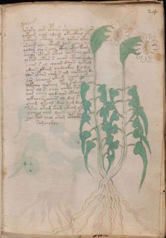

# Voynich Speculative Herbal Ferment Recipe — f24r

IMPORTANT: this is NOT a real or validated translation of the Voynich Manuscript. It is a speculative/procedural model that interprets EVA using a user-defined grammar to generate experimental recipes using safe, known edible substitutes.

This file is generated automatically from IVTFF/EVA transliteration plus a user-defined procedural grammar.



## Page / Folio
- currier: A
- folio: f24r
- page_number: 45
- section: herbal

## EVA Text (Transliteration)
```text
por or y chor opchar she cheol daiin or
qotaiin char odaiin okaiikhal oky
ycthar cthal okol qotar ckhy
or chckhaly cthar eeor chees da
qodar cho r chey cthy cthe keom
oeeeos cthor otal qocthol qoky
q@145;kar chtar s cheor cthol qodol
ychor s om qoear daiin qokeol
odaiin ckham qodaiikhy dol dal
q[?:e]or cfhar chor s am chotaiin dy
sar cheoiees okeem cheor qokain
qokchy qotchy tol tod ckhy
oees ol s chey chcth s ar
qor cheey qod char cthal
ockhoees oeees ol dal s
sham okeal dal dam dal
sshey otam sham cthoj oky
ycheol chol daiin chol s
yol kol chol shom otacphy
sam chorly
```

## Recipes Index (This Page)
- [f24r.1,@P0](#f24r-1-f24r-1-p0)
- [f24r.2,+P0](#f24r-2-f24r-2-p0)
- [f24r.3,+P0](#f24r-3-f24r-3-p0)
- [f24r.4,+P0](#f24r-4-f24r-4-p0)
- [f24r.5,+P0](#f24r-5-f24r-5-p0)
- [f24r.6,+P0](#f24r-6-f24r-6-p0)
- [f24r.7,+P0](#f24r-7-f24r-7-p0)
- [f24r.8,+P0](#f24r-8-f24r-8-p0)
- [f24r.9,+P0](#f24r-9-f24r-9-p0)
- [f24r.10,+P0](#f24r-10-f24r-10-p0)
- [f24r.11,+P0](#f24r-11-f24r-11-p0)
- [f24r.12,+P0](#f24r-12-f24r-12-p0)
- [f24r.13,+P0](#f24r-13-f24r-13-p0)
- [f24r.14,+P0](#f24r-14-f24r-14-p0)
- [f24r.15,+P0](#f24r-15-f24r-15-p0)
- [f24r.16,+P0](#f24r-16-f24r-16-p0)
- [f24r.17,+P0](#f24r-17-f24r-17-p0)
- [f24r.18,+P0](#f24r-18-f24r-18-p0)
- [f24r.19,+P0](#f24r-19-f24r-19-p0)
- [f24r.20,+Pc](#f24r-20-f24r-20-pc)

## Line Glosses (Procedural Gloss Only; Not a Translation)

<a id="f24r-1-f24r-1-p0"></a>

### f24r.1,@P0

EVA: por or y chor opchar she cheol daiin or

Direct Gloss (Procedural, Not a Real Translation):
- por: mix / transfer → start fermentation (yeast)
- or: mix / transfer
- y: [unparsed]
- chor: add main plant (safe substitute) → mix / transfer
- opchar: add main plant (safe substitute) → mix / transfer → start fermentation (yeast) → duration level 1 → state: fermentation start
- she: add secondary herb (safe substitute) → duration level 1 → state: active extraction
- cheol: add main plant (safe substitute) → mix / transfer → duration level 1 → state: active extraction
- daiin: start fermentation (yeast) → duration level 1 → state: fermentation start → long fermentation / aging phase
- or: mix / transfer

<a id="f24r-2-f24r-2-p0"></a>

### f24r.2,+P0

EVA: qotaiin char odaiin okaiikhal oky

Direct Gloss (Procedural, Not a Real Translation):
- qotaiin: prepare liquid base → apply heat/cooking → duration level 1 → state: fermentation start → long fermentation / aging phase
- char: add main plant (safe substitute) → duration level 1 → state: fermentation start
- odaiin: mix / transfer → start fermentation (yeast) → duration level 1 → state: fermentation start → long fermentation / aging phase
- okaiikhal: add fermentable sugars → mix / transfer → duration level 1 → state: fermentation start
- oky: add fermentable sugars → mix / transfer

<a id="f24r-3-f24r-3-p0"></a>

### f24r.3,+P0

EVA: ycthar cthal okol qotar ckhy

Direct Gloss (Procedural, Not a Real Translation):
- ycthar: add complex herbal compound (safe blend) → duration level 1 → state: fermentation start
- cthal: add complex herbal compound (safe blend) → duration level 1 → state: fermentation start
- okol: add fermentable sugars → mix / transfer
- qotar: prepare liquid base → apply heat/cooking → duration level 1 → state: fermentation start
- ckhy: add complex herbal compound (safe blend)

<a id="f24r-4-f24r-4-p0"></a>

### f24r.4,+P0

EVA: or chckhaly cthar eeor chees da

Direct Gloss (Procedural, Not a Real Translation):
- or: mix / transfer
- chckhaly: add main plant (safe substitute) → add complex herbal compound (safe blend) → duration level 1 → state: fermentation start
- cthar: add complex herbal compound (safe blend) → duration level 1 → state: fermentation start
- eeor: mix / transfer → duration level 2 → state: active extraction
- chees: add main plant (safe substitute) → duration level 2 → state: active extraction
- da: start fermentation (yeast) → duration level 1 → state: fermentation start

<a id="f24r-5-f24r-5-p0"></a>

### f24r.5,+P0

EVA: qodar cho r chey cthy cthe keom

Direct Gloss (Procedural, Not a Real Translation):
- qodar: prepare liquid base → start fermentation (yeast) → duration level 1 → state: fermentation start
- cho: add main plant (safe substitute) → mix / transfer
- r: [unparsed]
- chey: add main plant (safe substitute) → duration level 1 → state: active extraction
- cthy: add complex herbal compound (safe blend)
- cthe: add complex herbal compound (safe blend) → duration level 1 → state: active extraction
- keom: add fermentable sugars → mix / transfer → duration level 1 → state: active extraction

<a id="f24r-6-f24r-6-p0"></a>

### f24r.6,+P0

EVA: oeeeos cthor otal qocthol qoky

Direct Gloss (Procedural, Not a Real Translation):
- oeeeos: mix / transfer → duration level 3 → state: active extraction
- cthor: mix / transfer → add complex herbal compound (safe blend)
- otal: apply heat/cooking → mix / transfer → duration level 1 → state: fermentation start
- qocthol: prepare liquid base → mix / transfer → add complex herbal compound (safe blend)
- qoky: prepare liquid base → add fermentable sugars

<a id="f24r-7-f24r-7-p0"></a>

### f24r.7,+P0

EVA: q@145;kar chtar s cheor cthol qodol

Direct Gloss (Procedural, Not a Real Translation):
- q: prepare base (generic)
- kar: add fermentable sugars → duration level 1 → state: fermentation start
- chtar: apply heat/cooking → add main plant (safe substitute) → duration level 1 → state: fermentation start
- s: [unparsed]
- cheor: add main plant (safe substitute) → mix / transfer → duration level 1 → state: active extraction
- cthol: mix / transfer → add complex herbal compound (safe blend)
- qodol: prepare liquid base → mix / transfer → start fermentation (yeast)

<a id="f24r-8-f24r-8-p0"></a>

### f24r.8,+P0

EVA: ychor s om qoear daiin qokeol

Direct Gloss (Procedural, Not a Real Translation):
- ychor: add main plant (safe substitute) → mix / transfer
- s: [unparsed]
- om: mix / transfer
- qoear: prepare liquid base → duration level 1 → state: active extraction
- daiin: start fermentation (yeast) → duration level 1 → state: fermentation start → long fermentation / aging phase
- qokeol: prepare liquid base → add fermentable sugars → mix / transfer → duration level 1 → state: active extraction

<a id="f24r-9-f24r-9-p0"></a>

### f24r.9,+P0

EVA: odaiin ckham qodaiikhy dol dal

Direct Gloss (Procedural, Not a Real Translation):
- odaiin: mix / transfer → start fermentation (yeast) → duration level 1 → state: fermentation start → long fermentation / aging phase
- ckham: add complex herbal compound (safe blend) → duration level 1 → state: fermentation start
- qodaiikhy: prepare liquid base → add fermentable sugars → start fermentation (yeast) → duration level 1 → state: fermentation start
- dol: mix / transfer → start fermentation (yeast)
- dal: start fermentation (yeast) → duration level 1 → state: fermentation start

<a id="f24r-10-f24r-10-p0"></a>

### f24r.10,+P0

EVA: q[?:e]or cfhar chor s am chotaiin dy

Direct Gloss (Procedural, Not a Real Translation):
- q: prepare base (generic)
- e: duration level 1 → state: active extraction
- or: mix / transfer
- cfhar: add complex herbal compound (safe blend) → duration level 1 → state: fermentation start
- chor: add main plant (safe substitute) → mix / transfer
- s: [unparsed]
- am: duration level 1 → state: fermentation start
- chotaiin: apply heat/cooking → add main plant (safe substitute) → mix / transfer → duration level 1 → state: fermentation start → long fermentation / aging phase
- dy: start fermentation (yeast)

<a id="f24r-11-f24r-11-p0"></a>

### f24r.11,+P0

EVA: sar cheoiees okeem cheor qokain

Direct Gloss (Procedural, Not a Real Translation):
- sar: duration level 1 → state: fermentation start
- cheoiees: add main plant (safe substitute) → mix / transfer → duration level 1 → state: active extraction
- okeem: add fermentable sugars → mix / transfer → duration level 2 → state: active extraction
- cheor: add main plant (safe substitute) → mix / transfer → duration level 1 → state: active extraction
- qokain: prepare liquid base → add fermentable sugars → duration level 1 → state: fermentation start

<a id="f24r-12-f24r-12-p0"></a>

### f24r.12,+P0

EVA: qokchy qotchy tol tod ckhy

Direct Gloss (Procedural, Not a Real Translation):
- qokchy: prepare liquid base → add fermentable sugars → add main plant (safe substitute)
- qotchy: prepare liquid base → apply heat/cooking → add main plant (safe substitute)
- tol: apply heat/cooking → mix / transfer
- tod: apply heat/cooking → mix / transfer → start fermentation (yeast)
- ckhy: add complex herbal compound (safe blend)

<a id="f24r-13-f24r-13-p0"></a>

### f24r.13,+P0

EVA: oees ol s chey chcth s ar

Direct Gloss (Procedural, Not a Real Translation):
- oees: mix / transfer → duration level 2 → state: active extraction
- ol: mix / transfer
- s: [unparsed]
- chey: add main plant (safe substitute) → duration level 1 → state: active extraction
- chcth: add main plant (safe substitute) → add complex herbal compound (safe blend)
- s: [unparsed]
- ar: duration level 1 → state: fermentation start

<a id="f24r-14-f24r-14-p0"></a>

### f24r.14,+P0

EVA: qor cheey qod char cthal

Direct Gloss (Procedural, Not a Real Translation):
- qor: prepare liquid base
- cheey: add main plant (safe substitute) → duration level 2 → state: active extraction
- qod: prepare liquid base → start fermentation (yeast)
- char: add main plant (safe substitute) → duration level 1 → state: fermentation start
- cthal: add complex herbal compound (safe blend) → duration level 1 → state: fermentation start

<a id="f24r-15-f24r-15-p0"></a>

### f24r.15,+P0

EVA: ockhoees oeees ol dal s

Direct Gloss (Procedural, Not a Real Translation):
- ockhoees: mix / transfer → add complex herbal compound (safe blend) → duration level 2 → state: active extraction
- oeees: mix / transfer → duration level 3 → state: active extraction
- ol: mix / transfer
- dal: start fermentation (yeast) → duration level 1 → state: fermentation start
- s: [unparsed]

<a id="f24r-16-f24r-16-p0"></a>

### f24r.16,+P0

EVA: sham okeal dal dam dal

Direct Gloss (Procedural, Not a Real Translation):
- sham: add secondary herb (safe substitute) → duration level 1 → state: fermentation start
- okeal: add fermentable sugars → mix / transfer → duration level 1 → state: active extraction
- dal: start fermentation (yeast) → duration level 1 → state: fermentation start
- dam: start fermentation (yeast) → duration level 1 → state: fermentation start
- dal: start fermentation (yeast) → duration level 1 → state: fermentation start

<a id="f24r-17-f24r-17-p0"></a>

### f24r.17,+P0

EVA: sshey otam sham cthoj oky

Direct Gloss (Procedural, Not a Real Translation):
- sshey: add secondary herb (safe substitute) → duration level 1 → state: active extraction
- otam: apply heat/cooking → mix / transfer → duration level 1 → state: fermentation start
- sham: add secondary herb (safe substitute) → duration level 1 → state: fermentation start
- cthoj: mix / transfer → add complex herbal compound (safe blend)
- oky: add fermentable sugars → mix / transfer

<a id="f24r-18-f24r-18-p0"></a>

### f24r.18,+P0

EVA: ycheol chol daiin chol s

Direct Gloss (Procedural, Not a Real Translation):
- ycheol: add main plant (safe substitute) → mix / transfer → duration level 1 → state: active extraction
- chol: add main plant (safe substitute) → mix / transfer
- daiin: start fermentation (yeast) → duration level 1 → state: fermentation start → long fermentation / aging phase
- chol: add main plant (safe substitute) → mix / transfer
- s: [unparsed]

<a id="f24r-19-f24r-19-p0"></a>

### f24r.19,+P0

EVA: yol kol chol shom otacphy

Direct Gloss (Procedural, Not a Real Translation):
- yol: mix / transfer
- kol: add fermentable sugars → mix / transfer
- chol: add main plant (safe substitute) → mix / transfer
- shom: add secondary herb (safe substitute) → mix / transfer
- otacphy: apply heat/cooking → mix / transfer → add complex herbal compound (safe blend) → duration level 1 → state: fermentation start

<a id="f24r-20-f24r-20-pc"></a>

### f24r.20,+Pc

EVA: sam chorly

Direct Gloss (Procedural, Not a Real Translation):
- sam: duration level 1 → state: fermentation start
- chorly: add main plant (safe substitute) → mix / transfer
