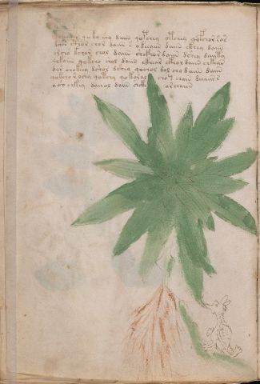

# Voynich Speculative Herbal Ferment Recipe — f25v

IMPORTANT: this is NOT a real or validated translation of the Voynich Manuscript. It is a speculative/procedural model that interprets EVA using a user-defined grammar to generate experimental recipes using safe, known edible substitutes.

This file is generated automatically from IVTFF/EVA transliteration plus a user-defined procedural grammar.



## Page / Folio
- currier: A
- folio: f25v
- page_number: 48
- plant_candidates: ['Leontopodium Edelweiss + unreadable']
- plant_category_confidence: 0.25
- plant_category_guess: leaf
- plant_category_matches: ['section=herbal_default']
- plant_id: Leontopodium Edelweiss + unreadable
- section: herbal

## Plant Interpretation (Heuristic)
- category: leaf
- confidence: 0.25
- note: Heuristic classification based on the IVTFF 'Plant ID' string (not the drawing). Does not imply real identification of the manuscript plant.
- textual_evidence_terms: ['section=herbal_default']

## EVA Text (Transliteration)
```text
poeeaiin qo ky shy daiin qopchey otchey qofchor sos
dchor cthor chor daiin s okeeaiin daiin ckhey daiin
orcho kchor chol daiin sh[cfh:ckh]o r daiin dshey daiity
qokaiin qokcho shol daiin ckhear ckhol daiin chkear
dar chokeey dshor dshey qochol dol cho daiin daiin
qokcho r ochy qotchy qotoral cho @147; chain deeaiir s
oc'o chkey daiiol daiin shckh orchaiin
```

## Page Summary (Procedural, Aggregated)
- compound_counts: {'yeast fermentation': 22, 'mix/transfer': 29, 'liquid base': 9, 'sugars': 9, 'secondary herb': 7, 'main herb': 20, 'heat': 4, 'aroma modifier': 1, 'complex herbal compound': 7}
- dose_level: 2
- fermentation_estimate: 7–14 days

## Pantry (Max Needed For Any Single Line-Recipe)
- aroma_modifier: ['lemon peel (optional)']
- aroma_modifier_dose: ['2–5 g (or 1 strip of peel, avoiding the bitter pith)']
- main_plant_dry_g: 10
- main_plant_substitute: ['lemon balm']
- safe_complex_herbal_blend: ['gentle spices (e.g., 1 g cinnamon + 1 g clove) or a commercial herbal tea blend']
- secondary_herb_dry_g: 5
- secondary_herb_substitute: ['mint']
- sugar_or_honey_g: 50
- water_l: 0.5
- yeast_g: 1

## Recipes Index (This Page)
- [f25v.1,@P0](#f25v-1-f25v-1-p0)
- [f25v.2,+P0](#f25v-2-f25v-2-p0)
- [f25v.3,+P0](#f25v-3-f25v-3-p0)
- [f25v.4,+P0](#f25v-4-f25v-4-p0)
- [f25v.5,+P0](#f25v-5-f25v-5-p0)
- [f25v.6,+P0](#f25v-6-f25v-6-p0)
- [f25v.7,+P0](#f25v-7-f25v-7-p0)

## Line Recipes (Each Line = One Recipe, 0.5L batch)

<a id="f25v-1-f25v-1-p0"></a>

### f25v.1,@P0

EVA: poeeaiin qo ky shy daiin qopchey otchey qofchor sos

## Ingredients
- aroma_modifier: lemon peel (optional)
- aroma_modifier_dose: 2–5 g (or 1 strip of peel, avoiding the bitter pith)
- main_plant_dry_g: 10
- main_plant_substitute: lemon balm
- secondary_herb_dry_g: 5
- secondary_herb_substitute: mint
- sugar_or_honey_g: 50
- water_l: 0.5
- yeast_g: 1

Process:
1. Sanitize the jar/fermenter and utensils.
2. Base: combine 0.5 L water with 50 g sugar or honey.
3. Apply gentle heat: simmer 10–15 min, then cool to <30°C before adding yeast.
4. Add main plant: lemon balm (~10 g dried).
5. Add secondary herb: mint (~5 g dried).
6. Add aroma modifier (optional) in a low dose.
7. Pitch yeast: 1 g (ideally cider/beer yeast).
8. Ferment with an airlock: 7–14 days (guided by iin/aiin markers).
9. Strain/rack (if very solid-heavy) and cold-crash 24 h.
10. Bottle only when activity clearly slows; refrigerate. Avoid overpressure.

Expected Result: A mild, aromatic herbal ferment, low-to-medium intensity depending on dose level.

Does It Make Sense?: yes

Direct Gloss (Procedural, Not a Real Translation):
- poeeaiin: mix / transfer → start fermentation (yeast) → duration level 2 → state: active extraction → long fermentation / aging phase
- qo: prepare liquid base
- ky: add fermentable sugars
- shy: add secondary herb (safe substitute)
- daiin: start fermentation (yeast) → duration level 1 → state: fermentation start → long fermentation / aging phase
- qopchey: prepare liquid base → add main plant (safe substitute) → start fermentation (yeast) → duration level 1 → state: active extraction
- otchey: apply heat/cooking → add main plant (safe substitute) → mix / transfer → duration level 1 → state: active extraction
- qofchor: prepare liquid base → add main plant (safe substitute) → add aroma modifier → mix / transfer
- sos: mix / transfer

<a id="f25v-2-f25v-2-p0"></a>

### f25v.2,+P0

EVA: dchor cthor chor daiin s okeeaiin daiin ckhey daiin

## Ingredients
- main_plant_dry_g: 10
- main_plant_substitute: lemon balm
- safe_complex_herbal_blend: gentle spices (e.g., 1 g cinnamon + 1 g clove) or a commercial herbal tea blend
- secondary_herb_dry_g: 2
- secondary_herb_substitute: mint
- sugar_or_honey_g: 50
- water_l: 0.5
- yeast_g: 1

Process:
1. Sanitize the jar/fermenter and utensils.
2. Base: combine 0.5 L water with 50 g sugar or honey.
3. Infusion: use hot (not boiling) water, then let it cool before adding yeast.
4. Add main plant: lemon balm (~10 g dried).
5. Add secondary herb: mint (~2 g dried).
6. If a complex herbal compound appears, use a safe commercial blend or gentle spices in micro-doses.
7. Pitch yeast: 1 g (ideally cider/beer yeast).
8. Ferment with an airlock: 7–14 days (guided by iin/aiin markers).
9. Strain/rack (if very solid-heavy) and cold-crash 24 h.
10. Bottle only when activity clearly slows; refrigerate. Avoid overpressure.

Expected Result: A mild, aromatic herbal ferment, low-to-medium intensity depending on dose level.

Does It Make Sense?: yes

Direct Gloss (Procedural, Not a Real Translation):
- dchor: add main plant (safe substitute) → mix / transfer → start fermentation (yeast)
- cthor: mix / transfer → add complex herbal compound (safe blend)
- chor: add main plant (safe substitute) → mix / transfer
- daiin: start fermentation (yeast) → duration level 1 → state: fermentation start → long fermentation / aging phase
- s: [unparsed]
- okeeaiin: add fermentable sugars → mix / transfer → duration level 2 → state: active extraction → long fermentation / aging phase
- daiin: start fermentation (yeast) → duration level 1 → state: fermentation start → long fermentation / aging phase
- ckhey: add complex herbal compound (safe blend) → duration level 1 → state: active extraction
- daiin: start fermentation (yeast) → duration level 1 → state: fermentation start → long fermentation / aging phase

<a id="f25v-3-f25v-3-p0"></a>

### f25v.3,+P0

EVA: orcho kchor chol daiin sh[cfh:ckh]o r daiin dshey daiity

## Ingredients
- main_plant_dry_g: 5
- main_plant_substitute: lemon balm
- safe_complex_herbal_blend: gentle spices (e.g., 1 g cinnamon + 1 g clove) or a commercial herbal tea blend
- secondary_herb_dry_g: 2
- secondary_herb_substitute: mint
- sugar_or_honey_g: 25
- water_l: 0.5
- yeast_g: 1

Process:
1. Sanitize the jar/fermenter and utensils.
2. Base: combine 0.5 L water with 25 g sugar or honey.
3. Apply gentle heat: simmer 10–15 min, then cool to <30°C before adding yeast.
4. Add main plant: lemon balm (~5 g dried).
5. Add secondary herb: mint (~2 g dried).
6. If a complex herbal compound appears, use a safe commercial blend or gentle spices in micro-doses.
7. Pitch yeast: 1 g (ideally cider/beer yeast).
8. Ferment with an airlock: 7–14 days (guided by iin/aiin markers).
9. Strain/rack (if very solid-heavy) and cold-crash 24 h.
10. Bottle only when activity clearly slows; refrigerate. Avoid overpressure.

Expected Result: A mild, aromatic herbal ferment, low-to-medium intensity depending on dose level.

Does It Make Sense?: yes

Direct Gloss (Procedural, Not a Real Translation):
- orcho: add main plant (safe substitute) → mix / transfer
- kchor: add fermentable sugars → add main plant (safe substitute) → mix / transfer
- chol: add main plant (safe substitute) → mix / transfer
- daiin: start fermentation (yeast) → duration level 1 → state: fermentation start → long fermentation / aging phase
- sh: add secondary herb (safe substitute)
- cfh: add complex herbal compound (safe blend)
- ckh: add complex herbal compound (safe blend)
- o: mix / transfer
- r: [unparsed]
- daiin: start fermentation (yeast) → duration level 1 → state: fermentation start → long fermentation / aging phase
- dshey: add secondary herb (safe substitute) → start fermentation (yeast) → duration level 1 → state: active extraction
- daiity: apply heat/cooking → start fermentation (yeast) → duration level 1 → state: fermentation start

<a id="f25v-4-f25v-4-p0"></a>

### f25v.4,+P0

EVA: qokaiin qokcho shol daiin ckhear ckhol daiin chkear

## Ingredients
- main_plant_dry_g: 5
- main_plant_substitute: lemon balm
- safe_complex_herbal_blend: gentle spices (e.g., 1 g cinnamon + 1 g clove) or a commercial herbal tea blend
- secondary_herb_dry_g: 2
- secondary_herb_substitute: mint
- sugar_or_honey_g: 25
- water_l: 0.5
- yeast_g: 1

Process:
1. Sanitize the jar/fermenter and utensils.
2. Base: combine 0.5 L water with 25 g sugar or honey.
3. Infusion: use hot (not boiling) water, then let it cool before adding yeast.
4. Add main plant: lemon balm (~5 g dried).
5. Add secondary herb: mint (~2 g dried).
6. If a complex herbal compound appears, use a safe commercial blend or gentle spices in micro-doses.
7. Pitch yeast: 1 g (ideally cider/beer yeast).
8. Ferment with an airlock: 7–14 days (guided by iin/aiin markers).
9. Strain/rack (if very solid-heavy) and cold-crash 24 h.
10. Bottle only when activity clearly slows; refrigerate. Avoid overpressure.

Expected Result: A mild, aromatic herbal ferment, low-to-medium intensity depending on dose level.

Does It Make Sense?: yes

Direct Gloss (Procedural, Not a Real Translation):
- qokaiin: prepare liquid base → add fermentable sugars → duration level 1 → state: fermentation start → long fermentation / aging phase
- qokcho: prepare liquid base → add fermentable sugars → add main plant (safe substitute) → mix / transfer
- shol: add secondary herb (safe substitute) → mix / transfer
- daiin: start fermentation (yeast) → duration level 1 → state: fermentation start → long fermentation / aging phase
- ckhear: add complex herbal compound (safe blend) → duration level 1 → state: active extraction
- ckhol: mix / transfer → add complex herbal compound (safe blend)
- daiin: start fermentation (yeast) → duration level 1 → state: fermentation start → long fermentation / aging phase
- chkear: add fermentable sugars → add main plant (safe substitute) → duration level 1 → state: active extraction

<a id="f25v-5-f25v-5-p0"></a>

### f25v.5,+P0

EVA: dar chokeey dshor dshey qochol dol cho daiin daiin

## Ingredients
- main_plant_dry_g: 10
- main_plant_substitute: lemon balm
- secondary_herb_dry_g: 5
- secondary_herb_substitute: mint
- sugar_or_honey_g: 50
- water_l: 0.5
- yeast_g: 1

Process:
1. Sanitize the jar/fermenter and utensils.
2. Base: combine 0.5 L water with 50 g sugar or honey.
3. Infusion: use hot (not boiling) water, then let it cool before adding yeast.
4. Add main plant: lemon balm (~10 g dried).
5. Add secondary herb: mint (~5 g dried).
6. Pitch yeast: 1 g (ideally cider/beer yeast).
7. Ferment with an airlock: 7–14 days (guided by iin/aiin markers).
8. Strain/rack (if very solid-heavy) and cold-crash 24 h.
9. Bottle only when activity clearly slows; refrigerate. Avoid overpressure.

Expected Result: A mild, aromatic herbal ferment, low-to-medium intensity depending on dose level.

Does It Make Sense?: yes

Direct Gloss (Procedural, Not a Real Translation):
- dar: start fermentation (yeast) → duration level 1 → state: fermentation start
- chokeey: add fermentable sugars → add main plant (safe substitute) → mix / transfer → duration level 2 → state: active extraction
- dshor: add secondary herb (safe substitute) → mix / transfer → start fermentation (yeast)
- dshey: add secondary herb (safe substitute) → start fermentation (yeast) → duration level 1 → state: active extraction
- qochol: prepare liquid base → add main plant (safe substitute) → mix / transfer
- dol: mix / transfer → start fermentation (yeast)
- cho: add main plant (safe substitute) → mix / transfer
- daiin: start fermentation (yeast) → duration level 1 → state: fermentation start → long fermentation / aging phase
- daiin: start fermentation (yeast) → duration level 1 → state: fermentation start → long fermentation / aging phase

<a id="f25v-6-f25v-6-p0"></a>

### f25v.6,+P0

EVA: qokcho r ochy qotchy qotoral cho @147; chain deeaiir s

## Ingredients
- main_plant_dry_g: 10
- main_plant_substitute: lemon balm
- secondary_herb_dry_g: 2
- secondary_herb_substitute: mint
- sugar_or_honey_g: 50
- water_l: 0.5
- yeast_g: 1

Process:
1. Sanitize the jar/fermenter and utensils.
2. Base: combine 0.5 L water with 50 g sugar or honey.
3. Apply gentle heat: simmer 10–15 min, then cool to <30°C before adding yeast.
4. Add main plant: lemon balm (~10 g dried).
5. Add secondary herb: mint (~2 g dried).
6. Pitch yeast: 1 g (ideally cider/beer yeast).
7. Ferment with an airlock: 2–4 days (guided by iin/aiin markers).
8. Strain/rack (if very solid-heavy) and cold-crash 24 h.
9. Bottle only when activity clearly slows; refrigerate. Avoid overpressure.

Expected Result: A mild, aromatic herbal ferment, low-to-medium intensity depending on dose level.

Does It Make Sense?: yes

Direct Gloss (Procedural, Not a Real Translation):
- qokcho: prepare liquid base → add fermentable sugars → add main plant (safe substitute) → mix / transfer
- r: [unparsed]
- ochy: add main plant (safe substitute) → mix / transfer
- qotchy: prepare liquid base → apply heat/cooking → add main plant (safe substitute)
- qotoral: prepare liquid base → apply heat/cooking → mix / transfer → duration level 1 → state: fermentation start
- cho: add main plant (safe substitute) → mix / transfer
- chain: add main plant (safe substitute) → duration level 1 → state: fermentation start
- deeaiir: start fermentation (yeast) → duration level 2 → state: active extraction
- s: [unparsed]

<a id="f25v-7-f25v-7-p0"></a>

### f25v.7,+P0

EVA: oc'o chkey daiiol daiin shckh orchaiin

## Ingredients
- main_plant_dry_g: 5
- main_plant_substitute: lemon balm
- safe_complex_herbal_blend: gentle spices (e.g., 1 g cinnamon + 1 g clove) or a commercial herbal tea blend
- secondary_herb_dry_g: 2
- secondary_herb_substitute: mint
- sugar_or_honey_g: 25
- water_l: 0.5
- yeast_g: 1

Process:
1. Sanitize the jar/fermenter and utensils.
2. Base: combine 0.5 L water with 25 g sugar or honey.
3. Infusion: use hot (not boiling) water, then let it cool before adding yeast.
4. Add main plant: lemon balm (~5 g dried).
5. Add secondary herb: mint (~2 g dried).
6. If a complex herbal compound appears, use a safe commercial blend or gentle spices in micro-doses.
7. Pitch yeast: 1 g (ideally cider/beer yeast).
8. Ferment with an airlock: 7–14 days (guided by iin/aiin markers).
9. Strain/rack (if very solid-heavy) and cold-crash 24 h.
10. Bottle only when activity clearly slows; refrigerate. Avoid overpressure.

Expected Result: A mild, aromatic herbal ferment, low-to-medium intensity depending on dose level.

Does It Make Sense?: yes

Direct Gloss (Procedural, Not a Real Translation):
- oc: mix / transfer
- o: mix / transfer
- chkey: add fermentable sugars → add main plant (safe substitute) → duration level 1 → state: active extraction
- daiiol: mix / transfer → start fermentation (yeast) → duration level 1 → state: fermentation start
- daiin: start fermentation (yeast) → duration level 1 → state: fermentation start → long fermentation / aging phase
- shckh: add secondary herb (safe substitute) → add complex herbal compound (safe blend)
- orchaiin: add main plant (safe substitute) → mix / transfer → duration level 1 → state: fermentation start → long fermentation / aging phase

## Risks & Warnings (Applies To All Line-Recipes)
- Never use unidentified Voynich plants directly; only use known edible substitutes.
- Do not consume if you see mold, smell rot, notice abnormal sliminess, or taste something clearly foul.
- Overpressure/bottle-bomb risk: do not bottle before stable; prefer an airlock and refrigeration.
- Avoid if pregnant/breastfeeding, for minors, or with medical conditions; consult a professional.
- No medical claims: this is an experimental beverage.

## Recommended Adjustments (General)
- If too bitter (leafy profile), halve the herbs or shorten steep/maceration time.
- If too sweet, extend fermentation or reduce sugar by 25–50%.
- For a non-alcoholic version, omit yeast and keep refrigerated as an infusion (not fermented).
