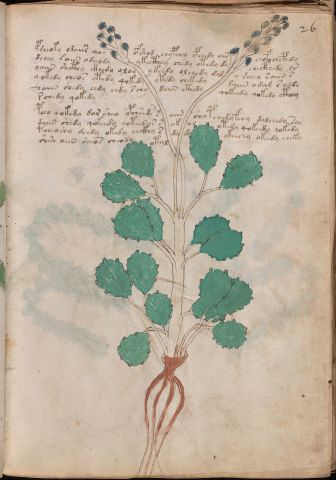

# Voynich Speculative Herbal Ferment Recipe — f26r

IMPORTANT: this is NOT a real or validated translation of the Voynich Manuscript. It is a speculative/procedural model that interprets EVA using a user-defined grammar to generate experimental recipes using safe, known edible substitutes.

This file is generated automatically from IVTFF/EVA transliteration plus a user-defined procedural grammar.

## Page / Folio
- currier: B
- folio: f26r
- page_number: 49
- plant_candidates: ['Flower like artemisium absinth / wermuth but leaves are not']
- plant_category_confidence: 0.95
- plant_category_guess: flower
- plant_category_matches: ['flower']
- plant_id: Flower like artemisium absinth / wermuth but leaves are not
- section: herbal

## Plant Interpretation (Heuristic)
- category: flower
- confidence: 0.95
- note: Heuristic classification based on the IVTFF 'Plant ID' string (not the drawing). Does not imply real identification of the manuscript plant.
- textual_evidence_terms: ['flower']

## EVA Text (Transliteration)
psheoky odaiir qoy ofshod chypchey ypchedy ain chofo chephdy
dchey @138;aiin adeeody ykecthey chedy ytedy dy checthedy ls
oaiin shcthy cthedy oloy ykeedy olchedy dal y sheey s aiin s
qokedy cheos ytedy qokedy ytedy chekedy daiin odam s aldy
saiin shedy eedy eedy s chy daiin cthedy qokeedy qokedy cthey
rchedy qokedy
pcho qokedy dar sheo ypchseds s aiin sha p chedyfchy dalchedy sar
daiin shedy qokeedy qoteedar s ok ol ytedy qokeedy qokedy
tcheoshy dchdy okedy chckhy s dy dy ykeechy okeedy cheky
shese aiin sheos cheody otal

## Page Summary (Procedural, Aggregated)
- compound_counts: {'yeast fermentation': 59, 'secondary herb': 11, 'mix/transfer': 23, 'sugars': 18, 'liquid base': 11, 'aroma modifier': 3, 'main herb': 24, 'complex herbal compound': 7, 'heat': 7}
- dose_level: 2
- fermentation_estimate: 7–14 days

## Pantry (Max Needed For Any Single Line-Recipe)
- aroma_modifier: ['orange peel (optional)']
- aroma_modifier_dose: ['2–5 g (or 1 strip of peel, avoiding the bitter pith)']
- main_plant_dry_g: 10
- main_plant_substitute: ['chamomile']
- safe_complex_herbal_blend: ['gentle spices (e.g., 1 g cinnamon + 1 g clove) or a commercial herbal tea blend']
- secondary_herb_dry_g: 5
- secondary_herb_substitute: ['lemon balm']
- sugar_or_honey_g: 50
- water_l: 0.5
- yeast_g: 1

## Line Recipes (Each Line = One Recipe, 0.5L batch)

### f26r.1,@P0

EVA: psheoky odaiir qoy ofshod chypchey ypchedy ain chofo chephdy

## Ingredients
- aroma_modifier: orange peel (optional)
- aroma_modifier_dose: 2–5 g (or 1 strip of peel, avoiding the bitter pith)
- main_plant_dry_g: 5
- main_plant_substitute: chamomile
- secondary_herb_dry_g: 2
- secondary_herb_substitute: lemon balm
- sugar_or_honey_g: 25
- water_l: 0.5
- yeast_g: 1

Process:
1. Sanitize the jar/fermenter and utensils.
2. Base: combine 0.5 L water with 25 g sugar or honey.
3. Infusion: use hot (not boiling) water, then let it cool before adding yeast.
4. Add main plant: chamomile (~5 g dried).
5. Add secondary herb: lemon balm (~2 g dried).
6. Add aroma modifier (optional) in a low dose.
7. Pitch yeast: 1 g (ideally cider/beer yeast).
8. Ferment with an airlock: 2–4 days (guided by iin/aiin markers).
9. Strain/rack (if very solid-heavy) and cold-crash 24 h.
10. Bottle only when activity clearly slows; refrigerate. Avoid overpressure.

Expected Result: A mild, aromatic herbal ferment, low-to-medium intensity depending on dose level.

Does It Make Sense?: yes

Direct Gloss (Procedural, Not a Real Translation):
- psheoky: add fermentable sugars → add secondary herb (safe substitute) → mix / transfer → start fermentation (yeast) → duration level 1 → state: active extraction
- odaiir: mix / transfer → start fermentation (yeast) → duration level 1 → state: fermentation start
- qoy: prepare liquid base
- ofshod: add secondary herb (safe substitute) → add aroma modifier → mix / transfer → start fermentation (yeast)
- chypchey: add main plant (safe substitute) → start fermentation (yeast) → duration level 1 → state: active extraction
- ypchedy: add main plant (safe substitute) → start fermentation (yeast) → duration level 1 → state: active extraction
- ain: duration level 1 → state: fermentation start
- chofo: add main plant (safe substitute) → add aroma modifier → mix / transfer
- chephdy: add main plant (safe substitute) → start fermentation (yeast) → duration level 1 → state: active extraction

### f26r.2,+P0

EVA: dchey @138;aiin adeeody ykecthey chedy ytedy dy checthedy ls

## Ingredients
- main_plant_dry_g: 5
- main_plant_substitute: chamomile
- safe_complex_herbal_blend: gentle spices (e.g., 1 g cinnamon + 1 g clove) or a commercial herbal tea blend
- secondary_herb_dry_g: 1
- secondary_herb_substitute: lemon balm
- sugar_or_honey_g: 25
- water_l: 0.5
- yeast_g: 1

Process:
1. Sanitize the jar/fermenter and utensils.
2. Base: combine 0.5 L water with 25 g sugar or honey.
3. Apply gentle heat: simmer 10–15 min, then cool to <30°C before adding yeast.
4. Add main plant: chamomile (~5 g dried).
5. Add secondary herb: lemon balm (~1 g dried).
6. If a complex herbal compound appears, use a safe commercial blend or gentle spices in micro-doses.
7. Pitch yeast: 1 g (ideally cider/beer yeast).
8. Ferment with an airlock: 7–14 days (guided by iin/aiin markers).
9. Strain/rack (if very solid-heavy) and cold-crash 24 h.
10. Bottle only when activity clearly slows; refrigerate. Avoid overpressure.

Expected Result: A mild, aromatic herbal ferment, low-to-medium intensity depending on dose level.

Does It Make Sense?: yes

Direct Gloss (Procedural, Not a Real Translation):
- dchey: add main plant (safe substitute) → start fermentation (yeast) → duration level 1 → state: active extraction
- aiin: duration level 1 → state: fermentation start → long fermentation / aging phase
- adeeody: mix / transfer → start fermentation (yeast) → duration level 1 → state: fermentation start
- ykecthey: add fermentable sugars → add complex herbal compound (safe blend) → duration level 1 → state: active extraction
- chedy: add main plant (safe substitute) → start fermentation (yeast) → duration level 1 → state: active extraction
- ytedy: apply heat/cooking → start fermentation (yeast) → duration level 1 → state: active extraction
- dy: start fermentation (yeast)
- checthedy: add main plant (safe substitute) → start fermentation (yeast) → add complex herbal compound (safe blend) → duration level 1 → state: active extraction
- ls: [unparsed]

### f26r.3,+P0

EVA: oaiin shcthy cthedy oloy ykeedy olchedy dal y sheey s aiin s

## Ingredients
- main_plant_dry_g: 10
- main_plant_substitute: chamomile
- safe_complex_herbal_blend: gentle spices (e.g., 1 g cinnamon + 1 g clove) or a commercial herbal tea blend
- secondary_herb_dry_g: 5
- secondary_herb_substitute: lemon balm
- sugar_or_honey_g: 50
- water_l: 0.5
- yeast_g: 1

Process:
1. Sanitize the jar/fermenter and utensils.
2. Base: combine 0.5 L water with 50 g sugar or honey.
3. Infusion: use hot (not boiling) water, then let it cool before adding yeast.
4. Add main plant: chamomile (~10 g dried).
5. Add secondary herb: lemon balm (~5 g dried).
6. If a complex herbal compound appears, use a safe commercial blend or gentle spices in micro-doses.
7. Pitch yeast: 1 g (ideally cider/beer yeast).
8. Ferment with an airlock: 7–14 days (guided by iin/aiin markers).
9. Strain/rack (if very solid-heavy) and cold-crash 24 h.
10. Bottle only when activity clearly slows; refrigerate. Avoid overpressure.

Expected Result: A mild, aromatic herbal ferment, low-to-medium intensity depending on dose level.

Does It Make Sense?: yes

Direct Gloss (Procedural, Not a Real Translation):
- oaiin: mix / transfer → duration level 1 → state: fermentation start → long fermentation / aging phase
- shcthy: add secondary herb (safe substitute) → add complex herbal compound (safe blend)
- cthedy: start fermentation (yeast) → add complex herbal compound (safe blend) → duration level 1 → state: active extraction
- oloy: mix / transfer
- ykeedy: add fermentable sugars → start fermentation (yeast) → duration level 2 → state: active extraction
- olchedy: add main plant (safe substitute) → mix / transfer → start fermentation (yeast) → duration level 1 → state: active extraction
- dal: start fermentation (yeast) → duration level 1 → state: fermentation start
- y: [unparsed]
- sheey: add secondary herb (safe substitute) → duration level 2 → state: active extraction
- s: [unparsed]
- aiin: duration level 1 → state: fermentation start → long fermentation / aging phase
- s: [unparsed]

### f26r.4,+P0

EVA: qokedy cheos ytedy qokedy ytedy chekedy daiin odam s aldy

## Ingredients
- main_plant_dry_g: 5
- main_plant_substitute: chamomile
- secondary_herb_dry_g: 1
- secondary_herb_substitute: lemon balm
- sugar_or_honey_g: 25
- water_l: 0.5
- yeast_g: 1

Process:
1. Sanitize the jar/fermenter and utensils.
2. Base: combine 0.5 L water with 25 g sugar or honey.
3. Apply gentle heat: simmer 10–15 min, then cool to <30°C before adding yeast.
4. Add main plant: chamomile (~5 g dried).
5. Add secondary herb: lemon balm (~1 g dried).
6. Pitch yeast: 1 g (ideally cider/beer yeast).
7. Ferment with an airlock: 7–14 days (guided by iin/aiin markers).
8. Strain/rack (if very solid-heavy) and cold-crash 24 h.
9. Bottle only when activity clearly slows; refrigerate. Avoid overpressure.

Expected Result: A mild, aromatic herbal ferment, low-to-medium intensity depending on dose level.

Does It Make Sense?: yes

Direct Gloss (Procedural, Not a Real Translation):
- qokedy: prepare liquid base → add fermentable sugars → start fermentation (yeast) → duration level 1 → state: active extraction
- cheos: add main plant (safe substitute) → mix / transfer → duration level 1 → state: active extraction
- ytedy: apply heat/cooking → start fermentation (yeast) → duration level 1 → state: active extraction
- qokedy: prepare liquid base → add fermentable sugars → start fermentation (yeast) → duration level 1 → state: active extraction
- ytedy: apply heat/cooking → start fermentation (yeast) → duration level 1 → state: active extraction
- chekedy: add fermentable sugars → add main plant (safe substitute) → start fermentation (yeast) → duration level 1 → state: active extraction
- daiin: start fermentation (yeast) → duration level 1 → state: fermentation start → long fermentation / aging phase
- odam: mix / transfer → start fermentation (yeast) → duration level 1 → state: fermentation start
- s: [unparsed]
- aldy: start fermentation (yeast) → duration level 1 → state: fermentation start

### f26r.5,+P0

EVA: saiin shedy eedy eedy s chy daiin cthedy qokeedy qokedy cthey

## Ingredients
- main_plant_dry_g: 10
- main_plant_substitute: chamomile
- safe_complex_herbal_blend: gentle spices (e.g., 1 g cinnamon + 1 g clove) or a commercial herbal tea blend
- secondary_herb_dry_g: 5
- secondary_herb_substitute: lemon balm
- sugar_or_honey_g: 50
- water_l: 0.5
- yeast_g: 1

Process:
1. Sanitize the jar/fermenter and utensils.
2. Base: combine 0.5 L water with 50 g sugar or honey.
3. Infusion: use hot (not boiling) water, then let it cool before adding yeast.
4. Add main plant: chamomile (~10 g dried).
5. Add secondary herb: lemon balm (~5 g dried).
6. If a complex herbal compound appears, use a safe commercial blend or gentle spices in micro-doses.
7. Pitch yeast: 1 g (ideally cider/beer yeast).
8. Ferment with an airlock: 7–14 days (guided by iin/aiin markers).
9. Strain/rack (if very solid-heavy) and cold-crash 24 h.
10. Bottle only when activity clearly slows; refrigerate. Avoid overpressure.

Expected Result: A mild, aromatic herbal ferment, low-to-medium intensity depending on dose level.

Does It Make Sense?: yes

Direct Gloss (Procedural, Not a Real Translation):
- saiin: duration level 1 → state: fermentation start → long fermentation / aging phase
- shedy: add secondary herb (safe substitute) → start fermentation (yeast) → duration level 1 → state: active extraction
- eedy: start fermentation (yeast) → duration level 2 → state: active extraction
- eedy: start fermentation (yeast) → duration level 2 → state: active extraction
- s: [unparsed]
- chy: add main plant (safe substitute)
- daiin: start fermentation (yeast) → duration level 1 → state: fermentation start → long fermentation / aging phase
- cthedy: start fermentation (yeast) → add complex herbal compound (safe blend) → duration level 1 → state: active extraction
- qokeedy: prepare liquid base → add fermentable sugars → start fermentation (yeast) → duration level 2 → state: active extraction
- qokedy: prepare liquid base → add fermentable sugars → start fermentation (yeast) → duration level 1 → state: active extraction
- cthey: add complex herbal compound (safe blend) → duration level 1 → state: active extraction

### f26r.6,+P0

EVA: rchedy qokedy

## Ingredients
- main_plant_dry_g: 5
- main_plant_substitute: chamomile
- secondary_herb_dry_g: 1
- secondary_herb_substitute: lemon balm
- sugar_or_honey_g: 25
- water_l: 0.5
- yeast_g: 1

Process:
1. Sanitize the jar/fermenter and utensils.
2. Base: combine 0.5 L water with 25 g sugar or honey.
3. Infusion: use hot (not boiling) water, then let it cool before adding yeast.
4. Add main plant: chamomile (~5 g dried).
5. Add secondary herb: lemon balm (~1 g dried).
6. Pitch yeast: 1 g (ideally cider/beer yeast).
7. Ferment with an airlock: 2–4 days (guided by iin/aiin markers).
8. Strain/rack (if very solid-heavy) and cold-crash 24 h.
9. Bottle only when activity clearly slows; refrigerate. Avoid overpressure.

Expected Result: A mild, aromatic herbal ferment, low-to-medium intensity depending on dose level.

Does It Make Sense?: yes

Direct Gloss (Procedural, Not a Real Translation):
- rchedy: add main plant (safe substitute) → start fermentation (yeast) → duration level 1 → state: active extraction
- qokedy: prepare liquid base → add fermentable sugars → start fermentation (yeast) → duration level 1 → state: active extraction

### f26r.7,+P0

EVA: pcho qokedy dar sheo ypchseds s aiin sha p chedyfchy dalchedy sar

## Ingredients
- aroma_modifier: orange peel (optional)
- aroma_modifier_dose: 2–5 g (or 1 strip of peel, avoiding the bitter pith)
- main_plant_dry_g: 5
- main_plant_substitute: chamomile
- secondary_herb_dry_g: 2
- secondary_herb_substitute: lemon balm
- sugar_or_honey_g: 25
- water_l: 0.5
- yeast_g: 1

Process:
1. Sanitize the jar/fermenter and utensils.
2. Base: combine 0.5 L water with 25 g sugar or honey.
3. Infusion: use hot (not boiling) water, then let it cool before adding yeast.
4. Add main plant: chamomile (~5 g dried).
5. Add secondary herb: lemon balm (~2 g dried).
6. Add aroma modifier (optional) in a low dose.
7. Pitch yeast: 1 g (ideally cider/beer yeast).
8. Ferment with an airlock: 7–14 days (guided by iin/aiin markers).
9. Strain/rack (if very solid-heavy) and cold-crash 24 h.
10. Bottle only when activity clearly slows; refrigerate. Avoid overpressure.

Expected Result: A mild, aromatic herbal ferment, low-to-medium intensity depending on dose level.

Does It Make Sense?: yes

Direct Gloss (Procedural, Not a Real Translation):
- pcho: add main plant (safe substitute) → mix / transfer → start fermentation (yeast)
- qokedy: prepare liquid base → add fermentable sugars → start fermentation (yeast) → duration level 1 → state: active extraction
- dar: start fermentation (yeast) → duration level 1 → state: fermentation start
- sheo: add secondary herb (safe substitute) → mix / transfer → duration level 1 → state: active extraction
- ypchseds: add main plant (safe substitute) → start fermentation (yeast) → duration level 1 → state: active extraction
- s: [unparsed]
- aiin: duration level 1 → state: fermentation start → long fermentation / aging phase
- sha: add secondary herb (safe substitute) → duration level 1 → state: fermentation start
- p: start fermentation (yeast)
- chedyfchy: add main plant (safe substitute) → add aroma modifier → start fermentation (yeast) → duration level 1 → state: active extraction
- dalchedy: add main plant (safe substitute) → start fermentation (yeast) → duration level 1 → state: fermentation start
- sar: duration level 1 → state: fermentation start

### f26r.8,+P0

EVA: daiin shedy qokeedy qoteedar s ok ol ytedy qokeedy qokedy

## Ingredients
- main_plant_dry_g: 5
- main_plant_substitute: chamomile
- secondary_herb_dry_g: 5
- secondary_herb_substitute: lemon balm
- sugar_or_honey_g: 50
- water_l: 0.5
- yeast_g: 1

Process:
1. Sanitize the jar/fermenter and utensils.
2. Base: combine 0.5 L water with 50 g sugar or honey.
3. Apply gentle heat: simmer 10–15 min, then cool to <30°C before adding yeast.
4. Add main plant: chamomile (~5 g dried).
5. Add secondary herb: lemon balm (~5 g dried).
6. Pitch yeast: 1 g (ideally cider/beer yeast).
7. Ferment with an airlock: 7–14 days (guided by iin/aiin markers).
8. Strain/rack (if very solid-heavy) and cold-crash 24 h.
9. Bottle only when activity clearly slows; refrigerate. Avoid overpressure.

Expected Result: A mild, aromatic herbal ferment, low-to-medium intensity depending on dose level.

Does It Make Sense?: yes

Direct Gloss (Procedural, Not a Real Translation):
- daiin: start fermentation (yeast) → duration level 1 → state: fermentation start → long fermentation / aging phase
- shedy: add secondary herb (safe substitute) → start fermentation (yeast) → duration level 1 → state: active extraction
- qokeedy: prepare liquid base → add fermentable sugars → start fermentation (yeast) → duration level 2 → state: active extraction
- qoteedar: prepare liquid base → apply heat/cooking → start fermentation (yeast) → duration level 2 → state: active extraction
- s: [unparsed]
- ok: add fermentable sugars → mix / transfer
- ol: mix / transfer
- ytedy: apply heat/cooking → start fermentation (yeast) → duration level 1 → state: active extraction
- qokeedy: prepare liquid base → add fermentable sugars → start fermentation (yeast) → duration level 2 → state: active extraction
- qokedy: prepare liquid base → add fermentable sugars → start fermentation (yeast) → duration level 1 → state: active extraction

### f26r.9,+P0

EVA: tcheoshy dchdy okedy chckhy s dy dy ykeechy okeedy cheky

## Ingredients
- main_plant_dry_g: 10
- main_plant_substitute: chamomile
- safe_complex_herbal_blend: gentle spices (e.g., 1 g cinnamon + 1 g clove) or a commercial herbal tea blend
- secondary_herb_dry_g: 5
- secondary_herb_substitute: lemon balm
- sugar_or_honey_g: 50
- water_l: 0.5
- yeast_g: 1

Process:
1. Sanitize the jar/fermenter and utensils.
2. Base: combine 0.5 L water with 50 g sugar or honey.
3. Apply gentle heat: simmer 10–15 min, then cool to <30°C before adding yeast.
4. Add main plant: chamomile (~10 g dried).
5. Add secondary herb: lemon balm (~5 g dried).
6. If a complex herbal compound appears, use a safe commercial blend or gentle spices in micro-doses.
7. Pitch yeast: 1 g (ideally cider/beer yeast).
8. Ferment with an airlock: 2–4 days (guided by iin/aiin markers).
9. Strain/rack (if very solid-heavy) and cold-crash 24 h.
10. Bottle only when activity clearly slows; refrigerate. Avoid overpressure.

Expected Result: A mild, aromatic herbal ferment, low-to-medium intensity depending on dose level.

Does It Make Sense?: yes

Direct Gloss (Procedural, Not a Real Translation):
- tcheoshy: apply heat/cooking → add main plant (safe substitute) → add secondary herb (safe substitute) → mix / transfer → duration level 1 → state: active extraction
- dchdy: add main plant (safe substitute) → start fermentation (yeast)
- okedy: add fermentable sugars → mix / transfer → start fermentation (yeast) → duration level 1 → state: active extraction
- chckhy: add main plant (safe substitute) → add complex herbal compound (safe blend)
- s: [unparsed]
- dy: start fermentation (yeast)
- dy: start fermentation (yeast)
- ykeechy: add fermentable sugars → add main plant (safe substitute) → duration level 2 → state: active extraction
- okeedy: add fermentable sugars → mix / transfer → start fermentation (yeast) → duration level 2 → state: active extraction
- cheky: add fermentable sugars → add main plant (safe substitute) → duration level 1 → state: active extraction

### f26r.10,+P0

EVA: shese aiin sheos cheody otal

## Ingredients
- main_plant_dry_g: 5
- main_plant_substitute: chamomile
- secondary_herb_dry_g: 2
- secondary_herb_substitute: lemon balm
- sugar_or_honey_g: 12
- water_l: 0.5
- yeast_g: 1

Process:
1. Sanitize the jar/fermenter and utensils.
2. Base: combine 0.5 L water with 12 g sugar or honey.
3. Apply gentle heat: simmer 10–15 min, then cool to <30°C before adding yeast.
4. Add main plant: chamomile (~5 g dried).
5. Add secondary herb: lemon balm (~2 g dried).
6. Pitch yeast: 1 g (ideally cider/beer yeast).
7. Ferment with an airlock: 7–14 days (guided by iin/aiin markers).
8. Strain/rack (if very solid-heavy) and cold-crash 24 h.
9. Bottle only when activity clearly slows; refrigerate. Avoid overpressure.

Expected Result: A mild, aromatic herbal ferment, low-to-medium intensity depending on dose level.

Does It Make Sense?: yes

Direct Gloss (Procedural, Not a Real Translation):
- shese: add secondary herb (safe substitute) → duration level 1 → state: active extraction
- aiin: duration level 1 → state: fermentation start → long fermentation / aging phase
- sheos: add secondary herb (safe substitute) → mix / transfer → duration level 1 → state: active extraction
- cheody: add main plant (safe substitute) → mix / transfer → start fermentation (yeast) → duration level 1 → state: active extraction
- otal: apply heat/cooking → mix / transfer → duration level 1 → state: fermentation start

## Risks & Warnings (Applies To All Line-Recipes)
- Never use unidentified Voynich plants directly; only use known edible substitutes.
- Do not consume if you see mold, smell rot, notice abnormal sliminess, or taste something clearly foul.
- Overpressure/bottle-bomb risk: do not bottle before stable; prefer an airlock and refrigeration.
- Avoid if pregnant/breastfeeding, for minors, or with medical conditions; consult a professional.
- No medical claims: this is an experimental beverage.

## Recommended Adjustments (General)
- If too bitter (leafy profile), halve the herbs or shorten steep/maceration time.
- If too sweet, extend fermentation or reduce sugar by 25–50%.
- For a non-alcoholic version, omit yeast and keep refrigerated as an infusion (not fermented).
