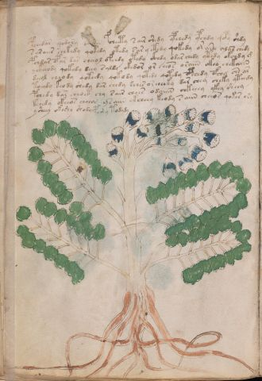

# Voynich Speculative Herbal Ferment Recipe — f26v

IMPORTANT: this is NOT a real or validated translation of the Voynich Manuscript. It is a speculative/procedural model that interprets EVA using a user-defined grammar to generate experimental recipes using safe, known edible substitutes.

This file is generated automatically from IVTFF/EVA transliteration plus a user-defined procedural grammar.



## Page / Folio
- currier: B
- folio: f26v
- page_number: 50
- plant_candidates: ['Verbena foenica']
- plant_category_confidence: 0.25
- plant_category_guess: leaf
- plant_category_matches: ['section=herbal_default']
- plant_id: Verbena foenica
- section: herbal

## Plant Interpretation (Heuristic)
- category: leaf
- confidence: 0.25
- note: Heuristic classification based on the IVTFF 'Plant ID' string (not the drawing). Does not imply real identification of the manuscript plant.
- textual_evidence_terms: ['section=herbal_default']

## EVA Text (Transliteration)
```text
pchedar qodary daiiin pcheety s air shedy ypchedy ypchdy qopy shdy
saraiir chekedy qokedy otedy sar y etedy qokedy or ai'he alys chedy
pchdar opar dar cheeol ofchdy otedy c@176;hdy odar chedy ytedy okchdy g
y[ckhe:ckee]ody qokedy deey saldy okedor or cheos oraiin okeo chekaiin
deeol cheody qoteedy qokody qotedy qotedy opchedy ofchy chs ar
toeedy keody shedy dar chedy sches or cheeky dar chey cheky yteedy
pchedy dar cheoet chy sair chees odaiiin chkeeey ykey sheey
tchedy okeeos cheeos ysaiin okcheey keody s aiin cheeos qokes ory
ysheey okeshy shody peshy todydy
```

## Page Summary (Procedural, Aggregated)
- compound_counts: {'yeast fermentation': 59, 'main herb': 31, 'liquid base': 10, 'heat': 13, 'secondary herb': 8, 'sugars': 20, 'mix/transfer': 36, 'aroma modifier': 2, 'complex herbal compound': 1}
- dose_level: 3
- fermentation_estimate: 7–14 days

## Pantry (Max Needed For Any Single Line-Recipe)
- aroma_modifier: ['lemon peel (optional)']
- aroma_modifier_dose: ['2–5 g (or 1 strip of peel, avoiding the bitter pith)']
- main_plant_dry_g: 15
- main_plant_substitute: ['lemon balm']
- safe_complex_herbal_blend: ['gentle spices (e.g., 1 g cinnamon + 1 g clove) or a commercial herbal tea blend']
- secondary_herb_dry_g: 7
- secondary_herb_substitute: ['mint']
- sugar_or_honey_g: 75
- water_l: 0.5
- yeast_g: 1

## Recipes Index (This Page)
- [f26v.1,@P0](#f26v-1-f26v-1-p0)
- [f26v.2,+P0](#f26v-2-f26v-2-p0)
- [f26v.3,+P0](#f26v-3-f26v-3-p0)
- [f26v.4,+P0](#f26v-4-f26v-4-p0)
- [f26v.5,+P0](#f26v-5-f26v-5-p0)
- [f26v.6,+P0](#f26v-6-f26v-6-p0)
- [f26v.7,+P0](#f26v-7-f26v-7-p0)
- [f26v.8,+P0](#f26v-8-f26v-8-p0)
- [f26v.9,+P0](#f26v-9-f26v-9-p0)

## Line Recipes (Each Line = One Recipe, 0.5L batch)

<a id="f26v-1-f26v-1-p0"></a>

### f26v.1,@P0

EVA: pchedar qodary daiiin pcheety s air shedy ypchedy ypchdy qopy shdy

## Ingredients
- main_plant_dry_g: 10
- main_plant_substitute: lemon balm
- secondary_herb_dry_g: 5
- secondary_herb_substitute: mint
- sugar_or_honey_g: 25
- water_l: 0.5
- yeast_g: 1

Process:
1. Sanitize the jar/fermenter and utensils.
2. Base: combine 0.5 L water with 25 g sugar or honey.
3. Apply gentle heat: simmer 10–15 min, then cool to <30°C before adding yeast.
4. Add main plant: lemon balm (~10 g dried).
5. Add secondary herb: mint (~5 g dried).
6. Pitch yeast: 1 g (ideally cider/beer yeast).
7. Ferment with an airlock: 3–5 days (guided by iin/aiin markers).
8. Strain/rack (if very solid-heavy) and cold-crash 24 h.
9. Bottle only when activity clearly slows; refrigerate. Avoid overpressure.

Expected Result: A mild, aromatic herbal ferment, low-to-medium intensity depending on dose level.

Does It Make Sense?: yes

Direct Gloss (Procedural, Not a Real Translation):
- pchedar: add main plant (safe substitute) → start fermentation (yeast) → duration level 1 → state: active extraction
- qodary: prepare liquid base → start fermentation (yeast) → duration level 1 → state: fermentation start
- daiiin: start fermentation (yeast) → duration level 1 → state: fermentation start → medium fermentation phase
- pcheety: apply heat/cooking → add main plant (safe substitute) → start fermentation (yeast) → duration level 2 → state: active extraction
- s: [unparsed]
- air: duration level 1 → state: fermentation start
- shedy: add secondary herb (safe substitute) → start fermentation (yeast) → duration level 1 → state: active extraction
- ypchedy: add main plant (safe substitute) → start fermentation (yeast) → duration level 1 → state: active extraction
- ypchdy: add main plant (safe substitute) → start fermentation (yeast)
- qopy: prepare liquid base → start fermentation (yeast)
- shdy: add secondary herb (safe substitute) → start fermentation (yeast)

<a id="f26v-2-f26v-2-p0"></a>

### f26v.2,+P0

EVA: saraiir chekedy qokedy otedy sar y etedy qokedy or ai'he alys chedy

## Ingredients
- main_plant_dry_g: 5
- main_plant_substitute: lemon balm
- secondary_herb_dry_g: 1
- secondary_herb_substitute: mint
- sugar_or_honey_g: 25
- water_l: 0.5
- yeast_g: 1

Process:
1. Sanitize the jar/fermenter and utensils.
2. Base: combine 0.5 L water with 25 g sugar or honey.
3. Apply gentle heat: simmer 10–15 min, then cool to <30°C before adding yeast.
4. Add main plant: lemon balm (~5 g dried).
5. Add secondary herb: mint (~1 g dried).
6. Pitch yeast: 1 g (ideally cider/beer yeast).
7. Ferment with an airlock: 2–4 days (guided by iin/aiin markers).
8. Strain/rack (if very solid-heavy) and cold-crash 24 h.
9. Bottle only when activity clearly slows; refrigerate. Avoid overpressure.

Expected Result: A mild, aromatic herbal ferment, low-to-medium intensity depending on dose level.

Does It Make Sense?: yes

Direct Gloss (Procedural, Not a Real Translation):
- saraiir: duration level 1 → state: fermentation start
- chekedy: add fermentable sugars → add main plant (safe substitute) → start fermentation (yeast) → duration level 1 → state: active extraction
- qokedy: prepare liquid base → add fermentable sugars → start fermentation (yeast) → duration level 1 → state: active extraction
- otedy: apply heat/cooking → mix / transfer → start fermentation (yeast) → duration level 1 → state: active extraction
- sar: duration level 1 → state: fermentation start
- y: [unparsed]
- etedy: apply heat/cooking → start fermentation (yeast) → duration level 1 → state: active extraction
- qokedy: prepare liquid base → add fermentable sugars → start fermentation (yeast) → duration level 1 → state: active extraction
- or: mix / transfer
- ai: duration level 1 → state: fermentation start
- he: duration level 1 → state: active extraction
- alys: duration level 1 → state: fermentation start
- chedy: add main plant (safe substitute) → start fermentation (yeast) → duration level 1 → state: active extraction

<a id="f26v-3-f26v-3-p0"></a>

### f26v.3,+P0

EVA: pchdar opar dar cheeol ofchdy otedy c@176;hdy odar chedy ytedy okchdy g

## Ingredients
- aroma_modifier: lemon peel (optional)
- aroma_modifier_dose: 2–5 g (or 1 strip of peel, avoiding the bitter pith)
- main_plant_dry_g: 10
- main_plant_substitute: lemon balm
- secondary_herb_dry_g: 2
- secondary_herb_substitute: mint
- sugar_or_honey_g: 50
- water_l: 0.5
- yeast_g: 1

Process:
1. Sanitize the jar/fermenter and utensils.
2. Base: combine 0.5 L water with 50 g sugar or honey.
3. Apply gentle heat: simmer 10–15 min, then cool to <30°C before adding yeast.
4. Add main plant: lemon balm (~10 g dried).
5. Add secondary herb: mint (~2 g dried).
6. Add aroma modifier (optional) in a low dose.
7. Pitch yeast: 1 g (ideally cider/beer yeast).
8. Ferment with an airlock: 2–4 days (guided by iin/aiin markers).
9. Strain/rack (if very solid-heavy) and cold-crash 24 h.
10. Bottle only when activity clearly slows; refrigerate. Avoid overpressure.

Expected Result: A mild, aromatic herbal ferment, low-to-medium intensity depending on dose level.

Does It Make Sense?: yes

Direct Gloss (Procedural, Not a Real Translation):
- pchdar: add main plant (safe substitute) → start fermentation (yeast) → duration level 1 → state: fermentation start
- opar: mix / transfer → start fermentation (yeast) → duration level 1 → state: fermentation start
- dar: start fermentation (yeast) → duration level 1 → state: fermentation start
- cheeol: add main plant (safe substitute) → mix / transfer → duration level 2 → state: active extraction
- ofchdy: add main plant (safe substitute) → add aroma modifier → mix / transfer → start fermentation (yeast)
- otedy: apply heat/cooking → mix / transfer → start fermentation (yeast) → duration level 1 → state: active extraction
- c: [unparsed]
- hdy: start fermentation (yeast)
- odar: mix / transfer → start fermentation (yeast) → duration level 1 → state: fermentation start
- chedy: add main plant (safe substitute) → start fermentation (yeast) → duration level 1 → state: active extraction
- ytedy: apply heat/cooking → start fermentation (yeast) → duration level 1 → state: active extraction
- okchdy: add fermentable sugars → add main plant (safe substitute) → mix / transfer → start fermentation (yeast)
- g: [unparsed]

<a id="f26v-4-f26v-4-p0"></a>

### f26v.4,+P0

EVA: y[ckhe:ckee]ody qokedy deey saldy okedor or cheos oraiin okeo chekaiin

## Ingredients
- main_plant_dry_g: 10
- main_plant_substitute: lemon balm
- safe_complex_herbal_blend: gentle spices (e.g., 1 g cinnamon + 1 g clove) or a commercial herbal tea blend
- secondary_herb_dry_g: 2
- secondary_herb_substitute: mint
- sugar_or_honey_g: 50
- water_l: 0.5
- yeast_g: 1

Process:
1. Sanitize the jar/fermenter and utensils.
2. Base: combine 0.5 L water with 50 g sugar or honey.
3. Infusion: use hot (not boiling) water, then let it cool before adding yeast.
4. Add main plant: lemon balm (~10 g dried).
5. Add secondary herb: mint (~2 g dried).
6. If a complex herbal compound appears, use a safe commercial blend or gentle spices in micro-doses.
7. Pitch yeast: 1 g (ideally cider/beer yeast).
8. Ferment with an airlock: 7–14 days (guided by iin/aiin markers).
9. Strain/rack (if very solid-heavy) and cold-crash 24 h.
10. Bottle only when activity clearly slows; refrigerate. Avoid overpressure.

Expected Result: A mild, aromatic herbal ferment, low-to-medium intensity depending on dose level.

Does It Make Sense?: yes

Direct Gloss (Procedural, Not a Real Translation):
- y: [unparsed]
- ckhe: add complex herbal compound (safe blend) → duration level 1 → state: active extraction
- ckee: add fermentable sugars → duration level 2 → state: active extraction
- ody: mix / transfer → start fermentation (yeast)
- qokedy: prepare liquid base → add fermentable sugars → start fermentation (yeast) → duration level 1 → state: active extraction
- deey: start fermentation (yeast) → duration level 2 → state: active extraction
- saldy: start fermentation (yeast) → duration level 1 → state: fermentation start
- okedor: add fermentable sugars → mix / transfer → start fermentation (yeast) → duration level 1 → state: active extraction
- or: mix / transfer
- cheos: add main plant (safe substitute) → mix / transfer → duration level 1 → state: active extraction
- oraiin: mix / transfer → duration level 1 → state: fermentation start → long fermentation / aging phase
- okeo: add fermentable sugars → mix / transfer → duration level 1 → state: active extraction
- chekaiin: add fermentable sugars → add main plant (safe substitute) → duration level 1 → state: active extraction → long fermentation / aging phase

<a id="f26v-5-f26v-5-p0"></a>

### f26v.5,+P0

EVA: deeol cheody qoteedy qokody qotedy qotedy opchedy ofchy chs ar

## Ingredients
- aroma_modifier: lemon peel (optional)
- aroma_modifier_dose: 2–5 g (or 1 strip of peel, avoiding the bitter pith)
- main_plant_dry_g: 10
- main_plant_substitute: lemon balm
- secondary_herb_dry_g: 2
- secondary_herb_substitute: mint
- sugar_or_honey_g: 50
- water_l: 0.5
- yeast_g: 1

Process:
1. Sanitize the jar/fermenter and utensils.
2. Base: combine 0.5 L water with 50 g sugar or honey.
3. Apply gentle heat: simmer 10–15 min, then cool to <30°C before adding yeast.
4. Add main plant: lemon balm (~10 g dried).
5. Add secondary herb: mint (~2 g dried).
6. Add aroma modifier (optional) in a low dose.
7. Pitch yeast: 1 g (ideally cider/beer yeast).
8. Ferment with an airlock: 2–4 days (guided by iin/aiin markers).
9. Strain/rack (if very solid-heavy) and cold-crash 24 h.
10. Bottle only when activity clearly slows; refrigerate. Avoid overpressure.

Expected Result: A mild, aromatic herbal ferment, low-to-medium intensity depending on dose level.

Does It Make Sense?: yes

Direct Gloss (Procedural, Not a Real Translation):
- deeol: mix / transfer → start fermentation (yeast) → duration level 2 → state: active extraction
- cheody: add main plant (safe substitute) → mix / transfer → start fermentation (yeast) → duration level 1 → state: active extraction
- qoteedy: prepare liquid base → apply heat/cooking → start fermentation (yeast) → duration level 2 → state: active extraction
- qokody: prepare liquid base → add fermentable sugars → mix / transfer → start fermentation (yeast)
- qotedy: prepare liquid base → apply heat/cooking → start fermentation (yeast) → duration level 1 → state: active extraction
- qotedy: prepare liquid base → apply heat/cooking → start fermentation (yeast) → duration level 1 → state: active extraction
- opchedy: add main plant (safe substitute) → mix / transfer → start fermentation (yeast) → duration level 1 → state: active extraction
- ofchy: add main plant (safe substitute) → add aroma modifier → mix / transfer
- chs: add main plant (safe substitute)
- ar: duration level 1 → state: fermentation start

<a id="f26v-6-f26v-6-p0"></a>

### f26v.6,+P0

EVA: toeedy keody shedy dar chedy sches or cheeky dar chey cheky yteedy

## Ingredients
- main_plant_dry_g: 10
- main_plant_substitute: lemon balm
- secondary_herb_dry_g: 5
- secondary_herb_substitute: mint
- sugar_or_honey_g: 50
- water_l: 0.5
- yeast_g: 1

Process:
1. Sanitize the jar/fermenter and utensils.
2. Base: combine 0.5 L water with 50 g sugar or honey.
3. Apply gentle heat: simmer 10–15 min, then cool to <30°C before adding yeast.
4. Add main plant: lemon balm (~10 g dried).
5. Add secondary herb: mint (~5 g dried).
6. Pitch yeast: 1 g (ideally cider/beer yeast).
7. Ferment with an airlock: 2–4 days (guided by iin/aiin markers).
8. Strain/rack (if very solid-heavy) and cold-crash 24 h.
9. Bottle only when activity clearly slows; refrigerate. Avoid overpressure.

Expected Result: A mild, aromatic herbal ferment, low-to-medium intensity depending on dose level.

Does It Make Sense?: yes

Direct Gloss (Procedural, Not a Real Translation):
- toeedy: apply heat/cooking → mix / transfer → start fermentation (yeast) → duration level 2 → state: active extraction
- keody: add fermentable sugars → mix / transfer → start fermentation (yeast) → duration level 1 → state: active extraction
- shedy: add secondary herb (safe substitute) → start fermentation (yeast) → duration level 1 → state: active extraction
- dar: start fermentation (yeast) → duration level 1 → state: fermentation start
- chedy: add main plant (safe substitute) → start fermentation (yeast) → duration level 1 → state: active extraction
- sches: add main plant (safe substitute) → duration level 1 → state: active extraction
- or: mix / transfer
- cheeky: add fermentable sugars → add main plant (safe substitute) → duration level 2 → state: active extraction
- dar: start fermentation (yeast) → duration level 1 → state: fermentation start
- chey: add main plant (safe substitute) → duration level 1 → state: active extraction
- cheky: add fermentable sugars → add main plant (safe substitute) → duration level 1 → state: active extraction
- yteedy: apply heat/cooking → start fermentation (yeast) → duration level 2 → state: active extraction

<a id="f26v-7-f26v-7-p0"></a>

### f26v.7,+P0

EVA: pchedy dar cheoet chy sair chees odaiiin chkeeey ykey sheey

## Ingredients
- main_plant_dry_g: 15
- main_plant_substitute: lemon balm
- secondary_herb_dry_g: 7
- secondary_herb_substitute: mint
- sugar_or_honey_g: 75
- water_l: 0.5
- yeast_g: 1

Process:
1. Sanitize the jar/fermenter and utensils.
2. Base: combine 0.5 L water with 75 g sugar or honey.
3. Apply gentle heat: simmer 10–15 min, then cool to <30°C before adding yeast.
4. Add main plant: lemon balm (~15 g dried).
5. Add secondary herb: mint (~7 g dried).
6. Pitch yeast: 1 g (ideally cider/beer yeast).
7. Ferment with an airlock: 3–5 days (guided by iin/aiin markers).
8. Strain/rack (if very solid-heavy) and cold-crash 24 h.
9. Bottle only when activity clearly slows; refrigerate. Avoid overpressure.

Expected Result: A mild, aromatic herbal ferment, low-to-medium intensity depending on dose level.

Does It Make Sense?: yes

Direct Gloss (Procedural, Not a Real Translation):
- pchedy: add main plant (safe substitute) → start fermentation (yeast) → duration level 1 → state: active extraction
- dar: start fermentation (yeast) → duration level 1 → state: fermentation start
- cheoet: apply heat/cooking → add main plant (safe substitute) → mix / transfer → duration level 1 → state: active extraction
- chy: add main plant (safe substitute)
- sair: duration level 1 → state: fermentation start
- chees: add main plant (safe substitute) → duration level 2 → state: active extraction
- odaiiin: mix / transfer → start fermentation (yeast) → duration level 1 → state: fermentation start → medium fermentation phase
- chkeeey: add fermentable sugars → add main plant (safe substitute) → duration level 3 → state: active extraction
- ykey: add fermentable sugars → duration level 1 → state: active extraction
- sheey: add secondary herb (safe substitute) → duration level 2 → state: active extraction

<a id="f26v-8-f26v-8-p0"></a>

### f26v.8,+P0

EVA: tchedy okeeos cheeos ysaiin okcheey keody s aiin cheeos qokes ory

## Ingredients
- main_plant_dry_g: 10
- main_plant_substitute: lemon balm
- secondary_herb_dry_g: 2
- secondary_herb_substitute: mint
- sugar_or_honey_g: 50
- water_l: 0.5
- yeast_g: 1

Process:
1. Sanitize the jar/fermenter and utensils.
2. Base: combine 0.5 L water with 50 g sugar or honey.
3. Apply gentle heat: simmer 10–15 min, then cool to <30°C before adding yeast.
4. Add main plant: lemon balm (~10 g dried).
5. Add secondary herb: mint (~2 g dried).
6. Pitch yeast: 1 g (ideally cider/beer yeast).
7. Ferment with an airlock: 7–14 days (guided by iin/aiin markers).
8. Strain/rack (if very solid-heavy) and cold-crash 24 h.
9. Bottle only when activity clearly slows; refrigerate. Avoid overpressure.

Expected Result: A mild, aromatic herbal ferment, low-to-medium intensity depending on dose level.

Does It Make Sense?: yes

Direct Gloss (Procedural, Not a Real Translation):
- tchedy: apply heat/cooking → add main plant (safe substitute) → start fermentation (yeast) → duration level 1 → state: active extraction
- okeeos: add fermentable sugars → mix / transfer → duration level 2 → state: active extraction
- cheeos: add main plant (safe substitute) → mix / transfer → duration level 2 → state: active extraction
- ysaiin: duration level 1 → state: fermentation start → long fermentation / aging phase
- okcheey: add fermentable sugars → add main plant (safe substitute) → mix / transfer → duration level 2 → state: active extraction
- keody: add fermentable sugars → mix / transfer → start fermentation (yeast) → duration level 1 → state: active extraction
- s: [unparsed]
- aiin: duration level 1 → state: fermentation start → long fermentation / aging phase
- cheeos: add main plant (safe substitute) → mix / transfer → duration level 2 → state: active extraction
- qokes: prepare liquid base → add fermentable sugars → duration level 1 → state: active extraction
- ory: mix / transfer

<a id="f26v-9-f26v-9-p0"></a>

### f26v.9,+P0

EVA: ysheey okeshy shody peshy todydy

## Ingredients
- main_plant_dry_g: 5
- main_plant_substitute: lemon balm
- secondary_herb_dry_g: 5
- secondary_herb_substitute: mint
- sugar_or_honey_g: 50
- water_l: 0.5
- yeast_g: 1

Process:
1. Sanitize the jar/fermenter and utensils.
2. Base: combine 0.5 L water with 50 g sugar or honey.
3. Apply gentle heat: simmer 10–15 min, then cool to <30°C before adding yeast.
4. Add main plant: lemon balm (~5 g dried).
5. Add secondary herb: mint (~5 g dried).
6. Pitch yeast: 1 g (ideally cider/beer yeast).
7. Ferment with an airlock: 2–4 days (guided by iin/aiin markers).
8. Strain/rack (if very solid-heavy) and cold-crash 24 h.
9. Bottle only when activity clearly slows; refrigerate. Avoid overpressure.

Expected Result: A mild, aromatic herbal ferment, low-to-medium intensity depending on dose level.

Does It Make Sense?: yes

Direct Gloss (Procedural, Not a Real Translation):
- ysheey: add secondary herb (safe substitute) → duration level 2 → state: active extraction
- okeshy: add fermentable sugars → add secondary herb (safe substitute) → mix / transfer → duration level 1 → state: active extraction
- shody: add secondary herb (safe substitute) → mix / transfer → start fermentation (yeast)
- peshy: add secondary herb (safe substitute) → start fermentation (yeast) → duration level 1 → state: active extraction
- todydy: apply heat/cooking → mix / transfer → start fermentation (yeast)

## Risks & Warnings (Applies To All Line-Recipes)
- Never use unidentified Voynich plants directly; only use known edible substitutes.
- Do not consume if you see mold, smell rot, notice abnormal sliminess, or taste something clearly foul.
- Overpressure/bottle-bomb risk: do not bottle before stable; prefer an airlock and refrigeration.
- Avoid if pregnant/breastfeeding, for minors, or with medical conditions; consult a professional.
- No medical claims: this is an experimental beverage.

## Recommended Adjustments (General)
- If too bitter (leafy profile), halve the herbs or shorten steep/maceration time.
- If too sweet, extend fermentation or reduce sugar by 25–50%.
- For a non-alcoholic version, omit yeast and keep refrigerated as an infusion (not fermented).
